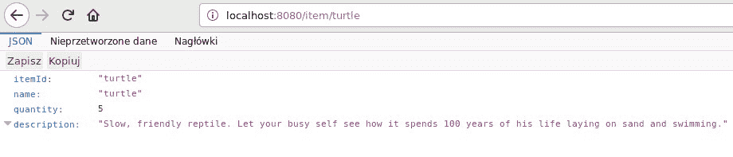
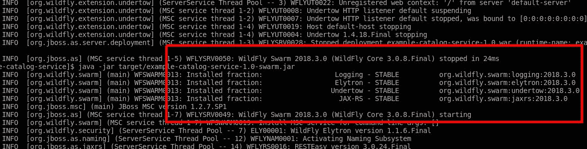
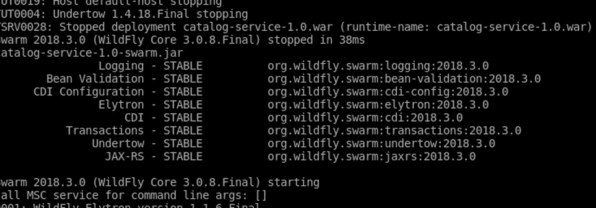
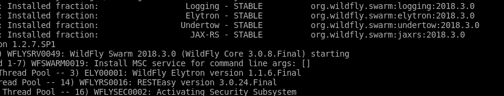
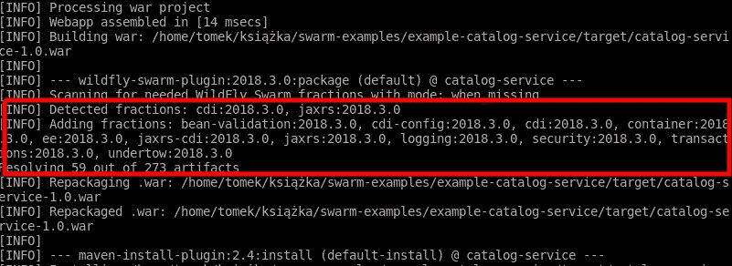
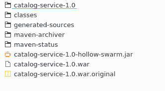
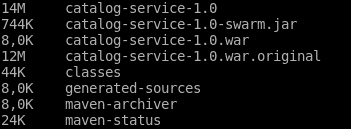

# 第三章：适当调整服务大小

在本章中，你将了解 Swarm 如何仅使用对服务必要的依赖项来创建你的服务。你将更详细地了解什么是分数，Swarm 如何检测应该使用哪些分数，以及你如何修改分数发现行为。最后，你将了解如何使用空 JAR 和瘦 JAR 进一步修改服务创建的大小和行为。

在解释所有这些之前，我们将介绍我们将要工作的服务。

# 目录服务

在第一章中，你学习了宠物商店示例应用程序的基本架构以及构成它的服务。在本章和下一章中，我们将使用目录服务。为了回忆，这是负责提供商店中可用宠物信息的那个服务。现在我们将介绍这个简单的功能。在接下来的三个章节中，我们将修改这段代码，以展示 WildFly Swarm 的不同功能和配置选项。让我们看看初始版本。

# 草稿版本

我们将首先介绍服务的第一个草稿版本，我们将在稍后对其进行检查和扩展。

示例参考：`chapter3/catalog-service-jaxrs`。

正如前一章所述，我们必须从`pom.xml`开始：

```java
<?xml version="1.0" encoding="UTF-8"?>
<project xmlns="http://maven.apache.org/POM/4.0.0"
         xmlns:xsi="http://www.w3.org/2001/XMLSchema-instance"
         xsi:schemaLocation="http://maven.apache.org/POM/4.0.0 http://maven.apache.org/xsd/maven-4.0.0.xsd">
    <modelVersion>4.0.0</modelVersion>

    <groupId>org.packt.swarm.petstore</groupId>
    <artifactId>catalog-service-jaxrs</artifactId>
    <version>1.0</version>
    <packaging>war</packaging>

    (...)

    <dependencies>
 <!-- 1 -->
 <dependency>
            <groupId>org.wildfly.swarm</groupId>
            <artifactId>jaxrs</artifactId>
            <version>${version.wildfly.swarm}</version>
        </dependency>
    </dependencies>

    <build>
        <plugins>
            <plugin>
                <artifactId>maven-war-plugin</artifactId>
                <version>${version.war.plugin}</version>
                <configuration>
                    <failOnMissingWebXml>false</failOnMissingWebXml>
                </configuration>
            </plugin>
 <!-- 2 -->
 <plugin>
                <groupId>org.wildfly.swarm</groupId>
                <artifactId>wildfly-swarm-plugin</artifactId>
                <version>${version.wildfly.swarm}</version>
                <executions>
                    <execution>
                        <goals>
                            <goal>package</goal>
                        </goals>
                    </execution>
                </executions> </plugin>
        </plugins>
    </build>

</project>
```

我们必须添加 JAX-RS 分数的依赖项（1）并配置 WildFly Swarm 插件（2）。现在让我们转向代码。

我们将从一个简单的域类`Item`开始，它包含关于商店中可用的宠物的信息：

```java
package org.packt.swarm.petstore.catalog.model;

public class Item {

    private String itemId;
    private String name;
    private int quantity;

    private String description;

    public String getItemId() {
        return itemId;
    }

    public void setItemId(String itemId) {
        this.itemId = itemId;
    }

    public String getName() {
        return name;
    }

    public void setName(String name) {
        this.name = name;
    }

    public int getQuantity() {
        return quantity;
    }

    public void setQuantity(int quantity) {
        this.quantity = quantity;
    }

    public String getDescription() {
        return description;
    }

    public void setDescription(String description) {
        this.description = description;
    }
}
```

如前述代码所示，这是一个简单的类，包含`itemId`、`name`、宠物的描述和商店中可用的数量。正如在`Hello World`示例中一样，我们必须初始化我们的 JAX-RS 应用程序：

```java
package org.packt.swarm.petstore.catalog;

import javax.ws.rs.ApplicationPath;
import javax.ws.rs.core.Application;

@ApplicationPath("/")
public class CatalogApplication extends Application {
}
```

最后，我们准备好编写一个简单的 JAX-RS 资源，该资源将从内存中的`HashMap`提供有关可用宠物的信息：

```java
package org.packt.swarm.petstore.catalog;

import org.packt.swarm.petstore.catalog.model.Item;

import javax.ws.rs.GET;
import javax.ws.rs.Path;
import javax.ws.rs.PathParam;
import javax.ws.rs.Produces;
import javax.ws.rs.core.MediaType;
import javax.ws.rs.core.Response;
import java.util.HashMap;
import java.util.Map;

//1
@Path("/")
public class CatalogResource {

 //2
 private Map<String, Item> catalog = new HashMap<>();

 public CatalogResource(){
 Item turtle = new Item();
        turtle.setItemId("turtle");
        turtle.setName("turtle");
        turtle.setQuantity(5);
        turtle.setDescription("Slow, friendly reptile. Let your busy self see how it spends 100 years of his life laying on sand and swimming.");
        catalog.put("turtle", turtle);
    }

 //3
 @GET
    @Path("item/{itemId}")
 @Produces(MediaType.APPLICATION_JSON)
 public Response searchById(@PathParam("itemId") String itemId) {
 try {
 Item item = catalog.get(itemId);
            return Response.ok(item).build();
        } catch (Exception e) {
 return Response.status(Response.Status.BAD_REQUEST).entity(e.getMessage()).build();
        }
 }

}
```

我们的资源位于应用程序的根路径（1）。在第一个版本中，我们将目录实现为一个`HashMap`，并用第一个宠物`turtle`填充它（2）。当使用`"item"`地址和`itemId`参数调用`GET`方法时，将调用`searchById`方法（3）。

我们可以像第一章中那样构建和部署应用程序：

```java
mvn wildfly-swarm:run
```

如果我们在网络浏览器中输入目录服务的地址，我们就能在目录中找到我们的第一个宠物：



# 分数

在前一个例子中，我们做了以下操作：我们用 JAX-RS 注解注解了我们的类，使用 Swarm Maven 插件构建了代码，并获得了可运行的基于 Swarm 的 JAR。生成的 JAR 比完整的应用程序服务器小得多。这是因为 Swarm 只包装了我们需要的 WildFly 的部分来工作。现在，我们将更详细地研究这个声明。

让我们再次运行前一章创建的应用程序：

```java
mvn wildfly-swarm:run
```

让我们看看控制台输出的开头：



看看红色矩形中的日志行。Swarm 在通知我们它已安装了四个分数：JAX-RS、Undertow、Elytron 和 Logging。然而，这意味着什么，实际上分数是什么？

分数是应用程序所需功能的一部分。更准确地说，分数收集了企业功能某部分工作所需的代码和配置。

由于我们在服务中使用了 JAX-RS，我们添加了 JAX-RS 分数作为 Maven 依赖项。回想一下，这是`pom.xml`中的以下依赖项：

```java
(...) <dependency>
            <groupId>org.wildfly.swarm</groupId>
            <artifactId>jaxrs</artifactId>
            <version>${version.wildfly.swarm}</version>
        </dependency> (...)
```

因此，Swarm 构建了一个包含此分数的服务。然而，再次查看前面的截图，我们可以看到 JAX-RS 并不是唯一安装的分数，因为还有 Undertow、Elytron 和 Logging 分数存在。

日志分数存在的原因是，有一些分数对于所有配置都是必要的——日志就是其中之一。那么 Undertow 分数呢？分数可以依赖于其他分数。正如你可能知道的，JAX-RS 需要使用一个网络服务器来服务它生成的网页，因此，JAX-RS 分数需要依赖于 Undertow 插件。Swarm 发现我们正在使用 JAX-RS，因此它将其包含在生成的应用程序中，但它还必须分析该分数的依赖项。分析的结果显示，另一个分数，即 Undertow，也必须包含在内。同样，JAX-RS 和 Undertow 都依赖于负责实现安全的 Elytron 分数，因此它也被添加到了创建的服务中。

现在，让我们看看如果我们决定重构我们的目录服务并使用 CDI 会发生什么：

示例参考：`chapter3/catalog-service-jaxrs-cdi/`。

让我们将搜索功能从 JAX-RS 资源移动到 CDI 服务：

```java
package org.packt.swarm.petstore.catalog;

import org.packt.swarm.petstore.catalog.model.Item;

import javax.enterprise.context.ApplicationScoped;
import java.util.HashMap;
import java.util.Map;

//1
@ApplicationScoped
public class CatalogService {

    private Map<String, Item> catalog = new HashMap<>();

    public CatalogService(){
        Item turtle = new Item();
        turtle.setItemId("turtle");
        turtle.setName("turtle");
        turtle.setQuantity(5);
        turtle.setDescription("Slow, friendly reptile. Let your busy self see how it spends 100 years of his life laying on sand and swimming.");
        catalog.put("turtle", turtle);
    }

 //2
 public Item searchById(String itemId){
 return catalog.get(itemId);
    }

}
```

我们创建了一个应用程序范围的 bean（1）并将`Search`方法作为其 API 的一部分（2）。此外，我们还需要修改`CatalogResource`：

```java
package org.packt.swarm.petstore.catalog;

import org.packt.swarm.petstore.catalog.model.Item;

import javax.inject.Inject;
import javax.ws.rs.GET;
import javax.ws.rs.Path;
import javax.ws.rs.PathParam;
import javax.ws.rs.Produces;
import javax.ws.rs.core.MediaType;
import javax.ws.rs.core.Response;

@Path("/")
public class CatalogResource {

 //1
 @Inject
    private CatalogService catalogService;

    @GET
    @Path("item/{itemId}")
    @Produces(MediaType.APPLICATION_JSON)
    public Response searchByName(@PathParam("itemId") String itemId) {
        try {
 //2
 Item item = catalogService.searchById(itemId);
            return Response.ok(item).build();
        } catch (Exception e) {
            return
Response.status(Response.Status.BAD_REQUEST).entity(e.getMessage()).build();
        }
    }

}
```

我们向其中注入了我们刚刚创建的`CatalogService`（1）并使用它来查找宠物（2）。最后，我们必须修改`pom.xml`：

```java
(...)

    <dependencies>
        <dependency>
            <groupId>org.wildfly.swarm</groupId>
            <artifactId>jaxrs</artifactId>
            <version>${version.wildfly.swarm}</version>
        </dependency>
 <!-- 1 -->
 <dependency>
            <groupId>org.wildfly.swarm</groupId>
            <artifactId>cdi</artifactId>
            <version>${version.wildfly.swarm}</version> </dependency>

    </dependencies>

(...)
```

我们必须添加 Swarm 的 CDI 分数（2）。

在本章中提到的所有事情都完成后，我们可以构建我们的应用程序并看到与前面示例类似的结果。

让我们再次查看 WildFly-Swarm 插件的日志：



现在，我们有八个分数存在。除了前面应用程序中引入的 CDI、CDI-config、`Bean Validation`和`Transactions`之外，CDI、CDI-config、`Bean Validation`和`Transactions`也被添加了。再次，Swarm 扫描了应用程序并发现它依赖于 JAX-RS 和 CDI；它添加了那些分数及其所有依赖项。

如你或许已经注意到的，我们现在看到的分数与 Java EE 规范紧密相关。那么，我们可以把它们看作是添加到服务器核心的特定 Java EE 规范实现吗？不。因为我们已经知道，Swarm 基于 Java EE 服务器，其部分用途是使单体应用程序能够过渡到微服务，存在一大组分数映射到某些 Java EE 功能的实现。尽管如此，它们并不局限于这一点。还有另一组分数提供 Java EE 之外的功能。更重要的是，如果你在用例中需要，你也能够实现自己的分数。

查看 WildFly 的内部结构，了解 WildFly 插件是如何工作的，以便创建你的精简 Swarm 应用程序。让我们首先解释分数检测是如何工作的，以及你如何通过修改 Swarm 的配置参数来改变其行为。

# 分数检测

让我们回到我们最新的`CatalogService`。正如你所回忆的，它使用了 JAX-RS 和 CDI。我们通过编辑`pom.xml`文件手动提供了依赖项：

```java
(...)

    <dependencies>
 <!-- 1 -->
        <dependency>
            <groupId>org.wildfly.swarm</groupId>
            <artifactId>jaxrs</artifactId>
            <version>${version.wildfly.swarm}</version>
        </dependency>

        <!-- 2 -->
        <dependency>
            <groupId>org.wildfly.swarm</groupId>
            <artifactId>cdi</artifactId>
            <version>${version.wildfly.swarm}</version> </dependency>
    </dependencies>

(...)
```

我们为两个分数提供了依赖项：JAX-RS（1）和 CDI（2）。我们可以运行应用程序并注意到它确实在运行。

让我们继续我们的实验。如果我们只配置一个分数会发生什么？

```java
(...)
<dependencyManagement>
    <dependencies>
 <!-- 2 -->
 <dependency>
            <groupId>org.jboss.spec</groupId>
            <artifactId>jboss-javaee-7.0</artifactId>
            <version>${version.jboss.spec.javaee.7.0}</version>
            <type>pom</type>
            <scope>import</scope>
        </dependency>
    </dependencies>
</dependencyManagement> 

<dependencies>
 <!-- 1 -->
   <dependency>
       <groupId>org.wildfly.swarm</groupId>
       <artifactId>jaxrs</artifactId>
       <version>${version.wildfly.swarm}</version>
   </dependency>

   <!-- 2 -->
   <dependency>
       <groupId>javax.enterprise</groupId>
       <artifactId>cdi-api</artifactId>
       <scope>provided</scope> </dependency>
</dependencies>

(...)
```

在前面的代码中，只配置了 JAX-RS 依赖项（1）。请注意，在这种情况下，我们必须明确定义对 CDI-API 的依赖项（2）。当我们运行应用程序时，我们看到以下日志：



目前你还没有看到错误，但你的日志的前几行已经预示着问题将会发生。尽管使用了 CDI，但其分数（及其依赖项）尚未添加。如果我们打开浏览器并输入我们服务的地址，我们会看到一个错误的请求错误。在服务类中添加一个临时日志：

```java
package org.packt.swarm.petstore.catalog;

import org.jboss.logging.Logger;
import org.packt.swarm.petstore.catalog.model.Item;

import javax.inject.Inject;
import javax.ws.rs.GET;
import javax.ws.rs.Path;
import javax.ws.rs.PathParam;
import javax.ws.rs.Produces;
import javax.ws.rs.core.MediaType;
import javax.ws.rs.core.Response;

@Path("/")
public class CatalogResource {

    private final Logger log = Logger.getLogger(getClass());

    @Inject
    private CatalogService catalogService;

    @GET
    @Path("item/{itemId}")
    @Produces(MediaType.APPLICATION_JSON)
    public Response searchByName(@PathParam("itemId") String itemId) {
        try {
            Item item = catalogService.searchById(itemId);
            return Response.ok(item).build();
        } catch (Exception e) {
            log.error("BAD REQUEST", e);
            return Response.status(Response.Status.BAD_REQUEST).entity(e.getMessage()).build();
        }
    }

}
```

我们将能够注意到我们问题的原因：

```java
ERROR [org.packt.swarm.petstore.catalog.CatalogResource] (default task-1) Bad request: java.lang.NullPointerException
        at org.packt.swarm.petstore.catalog.CatalogResource.searchByName(CatalogResource.java:27)
        at sun.reflect.NativeMethodAccessorImpl.invoke0(Native Method)
        at sun.reflect.NativeMethodAccessorImpl.invoke(NativeMethodAccessorImpl.java:62)
        at sun.reflect.DelegatingMethodAccessorImpl.invoke(DelegatingMethodAccessorImpl.java:43)
        at java.lang.reflect.Method.invoke(Method.java:498)
        at org.jboss.resteasy.core.MethodInjectorImpl.invoke(MethodInjectorImpl.java:140)
        at org.jboss.resteasy.core.ResourceMethodInvoker.invokeOnTarget(ResourceMethodInvoker.java:295)
        at org.jboss.resteasy.core.ResourceMethodInvoker.invoke(ResourceMethodInvoker.java:249)
        at org.jboss.resteasy.core.ResourceMethodInvoker.invoke(ResourceMethodInvoker.java:236)
        at org.jboss.resteasy.core.SynchronousDispatcher.invoke(SynchronousDispatcher.java:406)
        at org.jboss.resteasy.core.SynchronousDispatcher.invoke(SynchronousDispatcher.java:213)
        at org.jboss.resteasy.plugins.server.servlet.ServletContainerDispatcher.service(ServletContainerDispatcher.java:228)
        at org.jboss.resteasy.plugins.server.servlet.HttpServletDispatcher.service(HttpServletDispatcher.java:56)
        at org.jboss.resteasy.plugins.server.servlet.HttpServletDispatcher.service(HttpServletDispatcher.java:51)
        at javax.servlet.http.HttpServlet.service(HttpServlet.java:790)
```

由于缺少 CDI 分数，没有进行豆子解析和注入。因此，服务对象没有被注入到`CatalogResource`资源中，导致`NullPointerException`。

让我们更进一步，移除所有的分数：

```java

<dependencies>
 <!-- 2 -->
 <dependency>
 <groupId>org.jboss.spec.javax.ws.rs</groupId>
 <artifactId>jboss-jaxrs-api_2.0_spec</artifactId>
 <scope>provided</scope>
 </dependency>    <dependency>
        <groupId>javax.enterprise</groupId>
        <artifactId>cdi-api</artifactId>
        <scope>provided</scope>
    </dependency>
 <!-- 1 -->
 <!-- no fractions here ... -->
    </dependencies>

(...)

```

我们已经移除了所有的分数（1）。请注意，在这种情况下，我们必须手动提供所有的 Java EE API（2）。

示例参考：`chapter3/catalog-service-auto-detect/`。

当我们以这种方式配置项目进行构建时，日志中会出现一些有趣的内容：



在前面的例子中，Swarm 已经执行了自动分数检测。它是如何工作的？

Swarm 发现 `org.packt.swarm.petstore.catalog.CatalogResource` 正在使用 `javax.ws.rs` 包中的类，这导致了 JAX-RS 的包含。同样，使用 `javax.inject` 包导致了 CDI 分数的包含。后来，在手动示例中，Swarm 有一个包含检测到的分数、它们的依赖项以及始终需要的分数的构建服务。如果您现在运行该服务，您会注意到它确实正在正确工作。

为了理解 Swarm 在最近示例中的行为，我们必须了解分数检测模式。现在让我们来做这件事。

# 分数检测模式

Swarm Maven 插件可以在不同的分数检测模式下工作。如果您没有手动提供分数依赖项，它将在当缺失模式下运行。我们已经在之前的示例中看到了这种模式的行为：当没有直接提供分数依赖项时，插件会执行自动检测。另一方面，如果我们至少手动提供了一个分数依赖项，则自动检测模式将关闭。这就是为什么我们的最后一个示例没有包含 CDI 分数的原因：手动添加 JAX-RS 分数关闭了自动检测。

我们能对此做些什么吗？是的，我们可以使用不同的检测模式：`force`。此模式使自动检测每次都工作。在检测到使用的分数后，它将检测结果与用户配置的分数合并。

示例参考：`chapter3/catalog-service-force-detect`.

让我们重新配置我们的示例以使其工作：

```java
(...)

    <dependencies>
        <dependency>
            <groupId>javax.enterprise</groupId>
            <artifactId>cdi-api</artifactId>
            <scope>provided</scope>
        </dependency>
 <!-- 1 -->
        <dependency>
            <groupId>org.wildfly.swarm</groupId>
            <artifactId>jaxrs</artifactId>
            <version>${version.wildfly.swarm}</version> </dependency>
    </dependencies>

    <build>
        <plugins>
            <plugin>
                <artifactId>maven-war-plugin</artifactId>
                <version>${version.war.plugin}</version>
                <configuration>
                    <failOnMissingWebXml>false</failOnMissingWebXml>
                </configuration>
            </plugin>
            <plugin>
                <groupId>org.wildfly.swarm</groupId>
                <artifactId>wildfly-swarm-plugin</artifactId>
                <version>${version.wildfly.swarm}</version>
 <!-- 2 -->
 <configuration>
                    <fractionDetectMode>force</fractionDetectMode> </configuration>
                <executions>
                    <execution>
                        <goals>
                            <goal>package</goal>
                        </goals>
                    </execution>
                </executions>
            </plugin>
        </plugins>
    </build>

</project>
```

再次，只配置了 JAX-RS 分数（1）；然而，因为我们已经使用 `force` 检测模式配置了 Maven 插件（2），Swarm 也会检测之前缺失的 CDI 分数。如果我们再次运行我们的应用程序，我们会看到所有必要的分数都被检测到，并且应用程序可以正常工作。

我们已经看到了两种分数检测模式：当缺失和 `force`。还有其他吗？是的，还有一个：*never*。在此模式下，正如其名称所暗示的，分数永远不会被检测到，您必须始终手动提供所有这些。

# 薄的和空壳 JAR

正如我们之前所说的，在标准的 Maven 插件操作期间，生成的应用程序包含 Swarm 服务器和部署在其上的应用程序。我们可以改变这种行为。让我们假设我们将应用程序部署在云中，然后稍后推送新的代码更改。由于大多数情况下是应用程序代码发生变化，我们希望创建一个包含服务器的容器，并将其部署在云中，然后只推送代码到它。我们如何做到这一点？通过使用空壳 JAR。

# 使用空壳 JAR

您可以配置 Maven 插件来构建空壳 JAR，其中包含 swarm 服务器，但上面没有实际部署的应用程序。让我们再次回到 JAX-RS + CDI 示例，以展示它是如何工作的。

示例参考：`chapter3/catalog-service-hollow-jar`.

我们首先需要做的是配置 Maven 插件：

```java
(...)

    <build>
        <plugins>
            <plugin>
                <artifactId>maven-war-plugin</artifactId>
                <version>${version.war.plugin}</version>
                <configuration>
                    <failOnMissingWebXml>false</failOnMissingWebXml>
                </configuration>
            </plugin>
            <plugin>
                <groupId>org.wildfly.swarm</groupId>
                <artifactId>wildfly-swarm-plugin</artifactId>
                <version>${version.wildfly.swarm}</version>
 <!-- 1 -->
                <configuration>
                    <hollow>true</hollow> </configuration>
                <executions>
                    <execution>
                        <goals>
                            <goal>package</goal>
                        </goals>
                    </execution>
                </executions>
            </plugin>
        </plugins>
    </build>
(...)
```

我们唯一需要做的就是启用空心配置参数（1）。当我们构建应用程序并导航到目标目录时，我们将看到以下输出：



如您在前面的屏幕截图中所见，一个目录以 `-hollow-swarm` 后缀结尾。这是我们不带部署应用程序的空心 JAR。在运行它时，我们必须提供将要部署在创建的服务器上的应用程序名称。我们将会以下这种方式做到：

```java
java jar catalog-1.0-hollow-swarm.jar catalog-1.0.war

```

这将启动容器并运行我们的应用程序。结果，它将以与原始示例相同的方式运行。

# 使用瘦 JAR

您将能够创建一个瘦 JAR。瘦 JAR 不包含其 Maven 依赖项，并在应用程序启动期间从本地或远程 Maven 仓库加载它们。

示例参考：`chapter3/catalog-service-thin-jar`。

让我们来看一个例子：

```java
(...)

    <build>
        <plugins>
            <plugin>
                <artifactId>maven-war-plugin</artifactId>
                <version>${version.war.plugin}</version>
                <configuration>
                    <failOnMissingWebXml>false</failOnMissingWebXml>
                </configuration>
            </plugin>
            <plugin>
                <groupId>org.wildfly.swarm</groupId>
                <artifactId>wildfly-swarm-plugin</artifactId>
                <version>${version.wildfly.swarm}</version>
 <!-- 1 -->
                <configuration>
                    <bundleDependencies>false</bundleDependencies> </configuration>
                <executions>
                    <execution>
                        <goals>
                            <goal>package</goal>
                        </goals>
                    </execution>
                </executions>
            </plugin>
        </plugins>
    </build>

(...)
```

当我们构建应用程序并查看目标目录时，我们得到以下结果：



注意，在前面的场景中，所有的 JAR 文件都非常小，可运行的 JAR 文件大小为 `744` KB。

您还有可能将瘦 JAR 与空心 JAR 混合。可运行的 JAR 不包含必须部署在其上的应用程序，因此它必须以与前面示例相同的方式运行：

```java
java jar catalog-1.0-hollow-swarm.jar catalog-1.0.war
```

服务器和部署都不包含捆绑的依赖项，因此它们必须通过应用程序部署从 Maven 仓库加载。

# 摘要

在本章中，您学习了 Swarm 如何创建可运行、大小合适的服务。您学习了什么是分数，分数检测过程是什么样的，以及您如何修改它。最后，您学习了如何创建空心和瘦 JAR。

在下一章中，我们将向您展示如何配置您的微服务。
