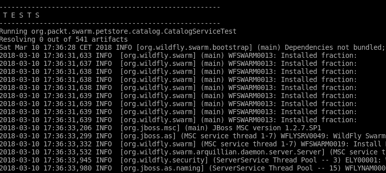
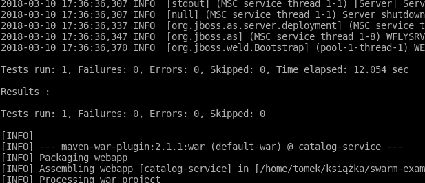
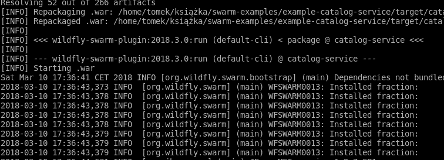

# 第五章：使用 Arquillian 测试你的服务

在本章中，你将学习如何测试你的微服务。为此，我们将使用 Arquillian，这是一个专为使用其专用运行时测试软件组件而设计的测试框架，而不是创建基于模拟的单元测试。这是开发人员无缝工作于 WildFly Swarm 的框架，实际上也是 WildFly Swarm 的首选框架。

我们将介绍 Arquillian，并展示项目目的及其主要特性。稍后，你将基于实际示例学习如何为你的服务开发、编写和配置测试。

# 介绍 Arquillian

我们都知道单元测试的好处。它们简单且可以立即运行。它们隔离了应用程序的组件，并允许你逐个测试它们，从而提供每个组件的使用场景覆盖率。

不幸的是，单元测试也有其不足之处。当你用单元测试覆盖你的应用程序时，它们将确认应用程序的每个组件都正常工作。显然，仅基于这些信息，你不能推断出整个应用程序都正常工作——这就是需要集成测试的原因。你必须测试你的组件在其将运行的环境中，以确保应用程序作为一个整体正常工作。

到目前为止，集成测试的问题在于它们往往难以配置，执行时间也很长。这就是 Arquillian 介入的地方。项目的目标是使集成测试与单元测试一样快且易于配置。

如你所回忆的，在第二章*Getting Familiar with WildFly Swarm*中，我们强调了现代运行时的速度有多快。Arquillian 利用这一点，让你能够轻松配置在应用程序将运行的相同运行时上运行的测试。例如，如果你正在开发一个 Java EE 应用程序，你可以配置 Arquillian 在所选的应用服务器上运行测试。由于现代应用服务器非常快，测试将立即运行。另一方面，你将能够在包含所有依赖项的真实环境中测试你的应用程序。

在我们的案例中，每个服务的运行时是由 WildFly Swarm 组装的（如第三章所述，*Right-Sizing Your Applications*）。Arquillian 还允许你为这类情况配置测试。让我们来看看如何操作。

# 使用 Arquillian 测试 Swarm 微服务

在本节中，你将学习如何使用 Arquillian 测试使用 Swarm 创建的微服务。正如你在前面的章节中学到的，Swarm 构建一个只包含特定服务所需部分的运行时，启动它，然后在上面部署一个存档，创建微服务。

正如我们刚刚学到的，Arquillian 在其专用运行时上测试应用程序。它启动运行时，在它上面部署测试代码，并执行测试。让我们为我们的 JAX-RS 和 CDI 目录服务示例配置这样的测试，并逐步解释我们在做什么。

例如：参考 `第五章/catalog-service-simple-test`。

首先，我们必须提供所有必要的依赖：

```java
(...)

    <dependencyManagement>
        <dependencies>
 <!-- 1 -->
 <dependency>
                <groupId>org.jboss.arquillian</groupId>
                <artifactId>arquillian-bom</artifactId>
                <version>${version.arquillian}</version>
                <type>pom</type>
                <scope>import</scope> </dependency>
        </dependencies>
    </dependencyManagement>

    <dependencies>
        <dependency>
            <groupId>org.wildfly.swarm</groupId>
            <artifactId>jaxrs</artifactId>
            <version>${version.wildfly.swarm}</version>
        </dependency>
        <dependency>
            <groupId>org.wildfly.swarm</groupId>
            <artifactId>cdi</artifactId>
            <version>${version.wildfly.swarm}</version>
        </dependency>
 <!-- 2 -->
 <dependency>
            <groupId>junit</groupId>
            <artifactId>junit</artifactId>
            <version>${version.junit}</version>
            <scope>test</scope> </dependency>
        <!-- 3 -->
 <dependency>
            <groupId>org.jboss.arquillian.junit</groupId>
            <artifactId>arquillian-junit-container</artifactId>
            <scope>test</scope>
        </dependency>
        <!-- 4 -->
        <dependency>
            <groupId>org.wildfly.swarm</groupId>
            <artifactId>arquillian</artifactId>
            <version>${version.wildfly.swarm}</version>
            <scope>test</scope> </dependency>

    </dependencies>

(...)

</project>
```

1.  首先，我们将 Arquillian 添加到 `dependencyManagement`（1）。

1.  其次，Arquillian 可以与各种测试库集成。由于我们将使用 JUnit，我们必须提供对其的依赖（2）。

1.  要使用 JUnit 运行 Arquillian 测试，我们必须提供 JUnit 集成工件（3）。

1.  第三，我们必须告诉 Arquillian 使用哪个运行时——我们通过提供一个适配器库的依赖来实现这一点。在我们的例子中，这显然是一个 Swarm 适配器（3）。

现在我们已经准备好查看代码了。为了回忆，这个例子中的服务只包含一个项目，该项目是手动添加的：

```java
package org.packt.swarm.petstore.catalog;

import org.packt.swarm.petstore.catalog.model.Item;

import javax.enterprise.context.ApplicationScoped;
import java.util.HashMap;
import java.util.Map;

@ApplicationScoped
public class CatalogService {

    private Map<String, Item> catalog = new HashMap<>();

    public CatalogService(){
        Item turtle = new Item();
        turtle.setItemId("turtle");
        turtle.setName("turtle");
        turtle.setQuantity(5);
        turtle.setDescription("Slow, friendly reptile. Let your busy self see how it spends 100 years of his life laying on sand and swimming.");
        catalog.put("turtle", turtle);
    }

    public Item searchById(String itemId){
        return catalog.get(itemId);
    }

}
```

现在是时候编写一个 `test` 类了。基于 Arquillian 的测试以以下方式运行：Arquillian 寻找带有 `org.jboss.arquillian.container.test.api.Deployment` 注解的静态方法。该方法必须返回 `ShrinkWrap` 存档。

Arquillian 将启动容器并在其上部署返回的存档。之后，方法被 `org.junit` 注解。测试在容器内运行。让我们在我们的示例测试中查看所有这些：

```java
package org.packt.swarm.petstore.catalog;

import org.jboss.arquillian.container.test.api.Deployment;
import org.jboss.arquillian.junit.Arquillian;
import org.jboss.shrinkwrap.api.ShrinkWrap;
import org.jboss.shrinkwrap.api.asset.EmptyAsset;
import org.jboss.shrinkwrap.api.spec.JavaArchive;
import org.junit.Assert;
import org.junit.Test;
import org.junit.runner.RunWith;
import org.packt.swarm.petstore.catalog.model.Item;

import javax.inject.Inject;

//1
@RunWith(Arquillian.class)
public class CatalogServiceTest {

 //2
    @Deployment
    public static JavaArchive createDeployment() {
 return ShrinkWrap.create(JavaArchive.class)
 .addClasses(Item.class,CatalogService.class)
 .addAsManifestResource(EmptyAsset.INSTANCE, "beans.xml");
    }

 //3
    @Inject
    CatalogService catalogService; 
 //4
    @Test
    public void testSearchById() {
 Assert.assertEquals(catalogService.searchById("turtle").getName(),"turtle");
    }
}
```

在开始时，我们告诉 JUnit 使用 Arquillian 测试控制器来运行测试。为此，我们使用 `@RunWith` 注解来标记测试，指定 `Arquillian.class` 作为测试运行器（1）。

`createDeployment`（2）方法，正如其名称所暗示的，负责创建部署存档，该存档将在配置的容器上部署。为了通知 Arquillian，我们必须使用 `@Deployment` 注解来标记此方法。该方法为静态，并返回 `ShrinkWrap` 存档。由于测试方法是在容器内运行的，我们能够注入其资源。在我们的例子中，我们必须注入我们即将测试的 `CatalogService` 类以及它所依赖的 `Item` 类（3）。

最后，`Test` 方法检查 `searchById` 方法是否正确工作（4）。

现在让我们运行测试：

```java
mvn clean wildfly-swarm:run
```

你会注意到测试已部署在 Swarm 容器内：



它成功完成：



最后，Swarm 微服务启动（因为我们使用了 `wildfly-swarm:run` 命令）：



注意，Swarm，如前几章的示例中所示，使用了 when-missing 发现机制，并创建了一个包含所有必要分片的容器。该容器用于测试和运行生成的微服务。

正如您在前面的屏幕截图中所注意到的，我们唯一更改的文件是`pom.xml`文件，因此从 AS 切换到 Swarm 的过程再次非常简单。然而，这也存在一些缺点：没有更改`CatalogTest`类意味着我们再次手动创建存档——当服务创建时 Swarm 可以为我们创建它，那么它为什么不能创建部署测试呢？它可以——让我们来学习如何做。

# 默认部署

正如我们刚刚暗示的，Swarm 可以创建默认的测试部署。

例如，请参考`chapter 5/catalog-service-test-default-deployment`。

我们将修改`Test`类，以便自动创建存档：

```java
package org.packt.swarm.petstore.catalog;

import org.jboss.arquillian.junit.Arquillian;
import org.junit.Assert;
import org.junit.Test;
import org.junit.runner.RunWith;
import org.wildfly.swarm.arquillian.DefaultDeployment;

import javax.inject.Inject;

@RunWith(Arquillian.class)
//1 @DefaultDeployment
public class CatalogServiceTest {

    @Inject
    CatalogService catalogService;

    @Test
    public void testSearchById() {
        Assert.assertEquals(catalogService.searchById("turtle").getName(),"turtle");
    }
}
```

为了告诉 Swarm 自动创建测试部署，我们必须使用`org.wildfly.swarm.arquillian.DefaultDeployment`注解来注解类（1）。就是这样。如果你现在运行测试，你将看到与上一段相同的输出。请注意，我们没有像上一个例子那样使用带有`@Deployment`注解的静态方法。

# Swarm 配置

在上一章中，我们向您展示了如何修改 Swarm 配置。我们用来展示的例子是一个数据库配置。在本节中，我们将向您展示如何使用相同的例子为 Swarm 测试提供类似的配置。

例如，请参考`chapter 5/catalog-service-database-test`。

如果你想要手动创建 Swarm 容器，你必须实现一个带有`org.wildfly.swarm.arquillian.CreateSwarm`注解的静态方法，并从其中返回`org.wildfly.swarm.Swarm`类的实例。你可能还记得，我们在第四章“调整服务配置”中创建的`main`函数内部已经创建了很多 Swarm 容器。我们将要使用的测试中的 Swarm 创建方法也是同样的工作方式。让我们看看代码：

```java
package org.packt.swarm.petstore.catalog;

import org.jboss.arquillian.container.test.api.Deployment;
import org.jboss.arquillian.junit.Arquillian;
import org.jboss.shrinkwrap.api.ShrinkWrap;
import org.jboss.shrinkwrap.api.asset.EmptyAsset;
import org.jboss.shrinkwrap.api.spec.JavaArchive;
import org.junit.Assert;
import org.junit.Test;
import org.junit.runner.RunWith;
import org.packt.swarm.petstore.catalog.model.Item;
import org.wildfly.swarm.Swarm;
import org.wildfly.swarm.arquillian.CreateSwarm;

import javax.inject.Inject;
import java.net.URL;

//1
@RunWith(Arquillian.class)
public class CatalogServiceTest {

    @Deployment
    public static JavaArchive createDeployment() {
        return ShrinkWrap.create(JavaArchive.class)
                .addClasses(Item.class, CatalogService.class)
 //1
 .addAsResource("datasources.yml")
 .addAsResource("META-INF/persistence.xml")
 .addAsResource("META-INF/load.sql")
                .addAsManifestResource(EmptyAsset.INSTANCE, "beans.xml");
    }

 //2
    @CreateSwarm
    public static Swarm createSwarm() throws Exception {
 Swarm swarm = new Swarm();
        //3
        ClassLoader cl = CatalogServiceTest.class.getClassLoader();
        URL dataSourcesConfig = cl.getResource("datasources.yml");
        //4
        swarm.withConfig(dataSourcesConfig);
        return swarm;
    }

    //4
    @Inject
    CatalogService catalogService;

    //5
    @Test
    public void testSearchById() {
        Assert.assertEquals(catalogService.searchById("turtle").getName(),"turtle");
    }
}
```

在开始时，我们创建了包含所有必要类和配置的部署。

我们必须添加数据源配置、持久化配置和加载文件（1），以便它们可以在测试中读取。

关键部分是之前提到的`createSwarm`方法（2）。它创建 Swarm 实例，读取数据源配置（3），并使用它配置 Swarm（4）。

当容器和部署就绪时，我们可以开始编写测试逻辑。我们首先将`CatalogService`注入到测试中（4）。回想一下，这个测试是在 Swarm 容器中运行的，因此服务可以被注入其中。最后，为了确保我们的服务确实工作正确，我们检查返回的数据是否正确（5）。

如果你现在运行测试，你会看到它正确通过。

然而，目前我们正在创建没有端点的微服务，并在容器内部对其进行测试。这没问题，但我们还想测试整个微服务，使用其外部接口。让我们看看如何做到这一点。

# 从独立客户端进行测试

这次，我们希望从独立客户端测试应用程序。让我们学习如何做到这一点。

例如，请参考`第五章/catalog-service-database-test-standalone`。

首先，我们必须向`pom.xml`文件中添加一些依赖项：

```java
(...)

    <dependencies>
    (...)
        <dependency>
            <groupId>org.wildfly.swarm</groupId>
            <artifactId>arquillian</artifactId>
            <version>${version.wildfly.swarm}</version>
            <scope>test</scope>
        </dependency>

 <!-- 1 -->
 <dependency>
            <groupId>org.jboss.resteasy</groupId>
            <artifactId>resteasy-client</artifactId>
            <version>${resteasy.version}</version>
            <scope>test</scope> </dependency>

 <!-- 2 -->
 <dependency>
            <groupId>org.jboss.resteasy</groupId>
            <artifactId>resteasy-jackson-provider</artifactId>
            <version>${resteasy.version}</version>
            <scope>test</scope> </dependency>

    </dependencies>
(...)
```

我们必须添加一个依赖项到我们将用于对服务进行 REST 调用的 JAX-RS 客户端。由于我们将使用`resteasy`实现，我们将添加其客户端（1）。我们还需要一个库来解析 JSON 响应，因此添加了`resteasy-jackson-provider`（2）。

让我们看看实现这一功能的代码：

```java
package org.packt.swarm.petstore.catalog;

import org.jboss.arquillian.container.test.api.Deployment;
import org.jboss.arquillian.container.test.api.RunAsClient;
import org.jboss.arquillian.junit.Arquillian;
import org.jboss.arquillian.test.api.ArquillianResource;
import org.jboss.shrinkwrap.api.ShrinkWrap;
import org.jboss.shrinkwrap.api.asset.EmptyAsset;
import org.jboss.shrinkwrap.api.spec.WebArchive;
import org.junit.Assert;
import org.junit.BeforeClass;
import org.junit.Test;
import org.junit.runner.RunWith;
import org.packt.swarm.petstore.catalog.model.Item;
import org.wildfly.swarm.Swarm;
import org.wildfly.swarm.arquillian.CreateSwarm;

import javax.ws.rs.client.Client;
import javax.ws.rs.client.ClientBuilder;
import javax.ws.rs.client.WebTarget;
import java.net.URL;

@RunWith(Arquillian.class)
public class CatalogServiceTest {

    @Deployment
    public static WebArchive createDeployment() {
        return ShrinkWrap.create(WebArchive.class)
 //1
 .addClasses(Item.class, CatalogService.class, CatalogResource.class, CatalogApplication.class)
                .addAsResource("datasources.yml")
                .addAsResource("META-INF/persistence.xml")
                .addAsResource("META-INF/load.sql")
                .addAsManifestResource(EmptyAsset.INSTANCE, "beans.xml");
    }

    @CreateSwarm
    public static Swarm createSwarm() throws Exception {
        Swarm swarm = new Swarm();
        ClassLoader cl = CatalogServiceTest.class.getClassLoader();
        URL dataSourcesConfig = cl.getResource("datasources.yml");
        swarm.withConfig(dataSourcesConfig);
        return swarm;
    }

 //2
    private static Client client;

 //3
    @BeforeClass
    public static void setUpClient() {
 client = ClientBuilder.newClient();
    }

 //4
    @ArquillianResource
    private URL url;

 //5
    private Item testEndpoint(String itemId) {
 WebTarget target = client.target(url + "item/"+itemId);
        return target.request("application/json").get(Item.class);
    }

    @Test
 //6 @RunAsClient
    public void testSearchById() {
 //7
 Assert.assertEquals(testEndpoint("turtle").getName(),"turtle");
        Assert.assertEquals(testEndpoint("hamster").getName(),"hamster");
    }
}
```

我们不得不实现很多东西。让我们逐一分析。

由于我们将测试 REST 端点，我们必须添加将暴露它的类，即`CatalogResource`和`CatalogApplication`（1）。

Arquillian 能够找出创建的服务 URL 并将其注入到测试中。为了获取这样的对象，我们必须使用`org.jboss.arquillian.test.api.ArquillianResource`注解来注解 URL 字段（4）。

我们实现了便利的测试方法，该方法根据 ID 调用服务并获取项目实例（5）。

测试中最重要的新增是使用`org.jboss.arquillian.container.test.api.RunAsClient`注解来注解`test`方法。结果，测试将在 Maven 的 JVM 中以独立客户端的方式运行。我们使用这种方式注解的测试是为了创建一个测试，该测试将基于从测试 JVM 的调用来断言我们服务的正确行为（6）。

# 摘要

在本章中，你学习了 Arquillian 是什么以及如何使用它来测试 Swarm 微服务。你还学习了如何配置 Arquillian 以自动创建 Swarm 容器，如何修改容器配置，以及如何从容器内部和从独立客户端测试创建的微服务。

# 进一步阅读

[`arquillian.org/`](http://arquillian.org/)
