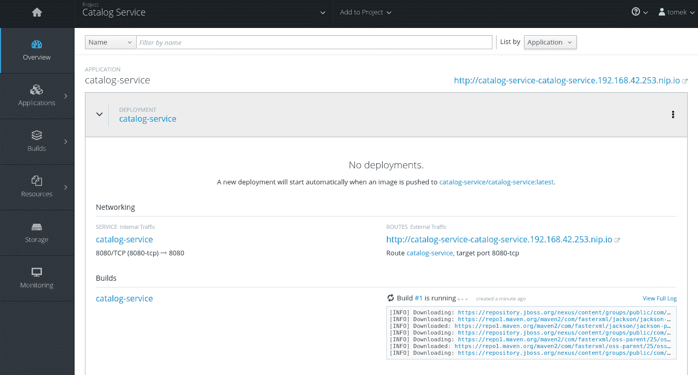

# 使用 OpenShift 在云上部署应用程序

在前几章中，我们向您展示了如何使用 WildFly Swarm 开发微服务。在本章中，您将学习如何将这些服务部署到云端，并且您将使用 OpenShift 来实现这一点。然而，为什么我们要费这个功夫呢？云计算有哪些特性和好处？让我们先简单谈谈。

在我们进入下一节之前，您需要了解一些重要信息。本章描述了许多理论概念，解释了 OpenShift 的内部机制。如果有些概念听起来太复杂而难以配置，请不要担心，因为（剧透警告！），最终 OpenShift 会为您做大部分工作。本章的目标是提供知识，让您能够理解 OpenShift 能做的所有魔法，并在后面的章节中修改和重新配置这种行为。那么，让我们开始吧。

# 云计算

好的。让我们从头开始。那么，云计算到底是什么呢？

云计算是一种 IT 范式，它提倡使用通过互联网提供的可配置资源和服务共享池。这些服务按需、快速且管理成本最小化地提供。因此，云计算允许灵活的架构、优化的资源使用，以及将基础设施提供商与消费者分离的可能性，从而实现关注点的分离。让我们更详细地检查这些声明。

按需提供的资源使您作为开发者或架构师在配置技术基础设施方面具有灵活性。开始项目成本低，因为您不需要从基础设施投资开始。此外，当您的项目投入生产时，计算资源可以自动扩展以满足应用程序的需求。在每种情况下，您只需为使用的资源付费。

此外，云计算引入了关注点的分离。云服务提供商变得专业于提供基础设施。开发者被提供了云基础设施的接口，并将用它来进行开发。因此，只要他们遵守云提供的接口，他们就不需要关心基础设施配置的细节。另一方面，云服务提供商必须竞争以提供最方便和最稳健的云基础设施，同时尽量降低成本。

在本章中，我们将描述 OpenShift 提供的云接口。在此之前，我们将描述以下两个云基础设施特性，这将使在接下来的章节中使用一致的概念集成为可能：部署和服务模型。让我们从第一个开始。

# 云基础设施部署模型

云部署模型指定了云基础设施的组织方式。让我们看看常用的模型。

# 公共云

**公共云**是一种在网络上提供服务的模型，供公众使用。

公共云计算有时被描述为计算资源向类似电力的公用事业演变。使用电力供应商的例子可能会给你对这个段落中描述的主题提供另一种见解：电力分配公司负责确保网络能够处理需求高峰，或者在牵引中断的情况下提供网络冗余。然而，最终，我们并不会过多地考虑这些——当我们需要时，我们会把插头插入插座，并且只为我们使用的电量付费。

我们不应该过分夸大这个类比。计算资源显然不是像电力那样的商品，由于客户需求的不同，它们不能以统一的方式提供给每个人。

首先，由于各种原因，并非所有客户都能将他们的工作负载迁移到公共云。其中一个原因可能是需要更高层次的安全或对架构有更大的控制。这样的客户可以利用我们讨论的私有云。

# 私有云

在**私有云**中，用于创建云的计算机资源仅专用于单个客户。这些资源可能位于现场或异地，由客户拥有，或由第三方管理。所有资源都为单个客户配置，不会与其他客户共享。这种配置允许有更大的控制和安全，但要求公司投资并管理云资源，从而消除了公共云解耦的好处。

# 混合云

**混合云**是一种将公共云和私有云连接在一起的模式。因此，你可以利用这两种解决方案的优势。例如，你可以在私有云上运行处理敏感数据的业务，但使用公共云来扩展其他服务。

我们希望我们的云服务提供商提供云抽象，使用户能够看到一个统一的云视图，抽象出混合云的基础设施细节。我们将在描述 OpenShift 架构时回到这个想法。

现在，让我们关注另一个云特性，那就是**服务模型**。

# 服务模型

正如你在本章开头所学的，云服务提供商负责按需提供计算资源。计算资源可以通过不同的方式配置，并具有不同级别的抽象。云计算基础设施的这个特性被称为服务模型。让我们描述一下常用的模型。

# 基础设施即服务

在**基础设施即服务**（**IaaS**）中，客户能够在提供的资源上安装任意应用程序（包括操作系统）。客户不控制云提供商提供的基础设施。例如，客户可能能够访问一个远程虚拟机，他们可以完全操作。

# 平台即服务

在**平台即服务**（**PaaS**）中，正如其名所示，云提供商负责向客户提供现成的平台，客户可以在该平台上部署和运行他们的应用程序。假设你想使用数据库。在这种情况下，平台提供商负责为你提供一个最新且配置好的数据库，你可以在上面立即开始工作。你不必处理整个配置，可以直接与数据库（或任何其他技术；例如 WildFly Swarm）开始工作。

# 软件即服务

最后，还有**软件即服务**（**SaaS**）。在这个模型中，客户能够使用云提供商提供的应用程序。SaaS 的一个例子可能是通过互联网提供的磁盘存储、电子邮件或办公套件。

好的，现在我们已经明确了术语，我们最终可以深入研究 OpenShift 架构。

# OpenShift 架构

到目前为止，我们一直在用抽象的术语进行讨论。在本节中，我们将为您概述 OpenShift 架构。结果，您将获得对功能云 PaaS 基础设施的实际理解。

让我们从一张俯瞰的架构图开始：


上述图表概述了 OpenShift 架构的层级。**Docker**运行在操作系统之上，提供容器层。容器是轻量级、独立且可执行的软件组件（*进一步阅读，链接 2*），可以在云的任何地方运行。这些容器由**Kubernetes**编排，它提供了异构计算资源的统一视图。最后，**OpenShift**建立在**Kubernetes**之上，提供开发者工具，自动化大多数配置任务。如果这个简短的描述让你感到困惑，不要担心。到本章结束时，一切都会变得清晰。让我们从容器开始。

# 容器化

如我们之前所说，在云计算中，云提供商负责根据用户需求提供服务器资源。然而，这实际上意味着什么？这些资源是如何提供的？如何创建带有所有必要配置的服务器，以及它是如何与其他用户隔离的？为了理解这一点，我们必须了解容器是如何工作的。

容器基本上是一种**虚拟化**。让我们讨论这个概念。

# 虚拟化

虚拟化是一种技术，它允许在一台服务器上运行多个隔离的虚拟机。虚拟机是服务器操作系统上运行的虚拟化应用程序所控制的计算机系统的模拟。虚拟机分配给用户的用户可以访问完全运行的宿主机。宿主机不是物理的，并且与其他虚拟机共享物理服务器的资源，这一点对用户来说是抽象的。

虚拟化的另一个关键特性是将虚拟机序列化为镜像的能力。这一特性使得虚拟机具有可移植性。镜像可以被移动到不同的服务器上，从而确保虚拟机的状态得以保留。

那么，为什么虚拟化对云服务提供商来说很重要呢？

首先，云服务提供商能够向用户提供虚拟机的访问权限。因此，用户将获得服务器资源的一部分。从用户的角度来看，他们将能够访问一个隔离的服务器

第二，用户可以使用他们想要使用的平台的预配置镜像。你需要带有 WildFly AS 的 Fedora 吗？这里就是你的配置好的镜像。我们将在我们的服务器上运行它，你就可以开始了。

第三，云服务提供商能够优化资源使用。一个服务器上可以运行许多虚拟机，从而最小化空闲时间。

第四，当需要时，虚拟机可以在不同的服务器之间自由移动。如果需要更多资源，可以将一些虚拟机转移到另一个服务器。再次从用户的角度来看，您将能够访问一个隔离的预配置服务器，而无需担心细节。

那么，关于实现方面呢？

你们中的一些人可能将虚拟化与硬件（全）虚拟化联系起来。在这种架构中，虚拟化应用程序负责模拟整个操作系统，包括所有必要的进程和库。

这种解决方案存在一些性能问题，其中大部分是由于操作系统最初是为在物理主机上运行而设计的。首先，要启动虚拟机，整个操作系统都需要启动，因此启动时间可能会很长（几分钟）。其次，操作系统进程和库必须在每个虚拟机中重复，这导致资源使用非最优。

让我们从云服务提供商的角度来考虑这个问题，特别考虑我们在第一章中描述的微服务架构，*Java EE 和现代架构方法*。我们希望有一个解决方案，使我们能够提供大量短暂的虚拟机。我们希望确保它们可以立即启动和停止，优化资源使用，并有效地存储镜像数据。结果是我们需要另一个工具。让我们来讨论容器。

# 容器

容器是系统级虚拟化（或准虚拟化）的实现。在这种虚拟化中，操作系统不是在每个虚拟机上模拟。相反，虚拟机共享相同的操作系统实例，使用它提供的工具来实现隔离。因此，在这种模型中，我们可以将虚拟机视为在相同操作系统之上运行的隔离用户空间实例。这样的实例被称为容器。


上述图表突出了全虚拟化和容器之间的主要区别。容器共享相同的操作系统，正如您将在下一节中学习的，能够有效地共享公共库。在上述图表中，水平线代表在创建新的虚拟机/容器时必须创建的层。

在我们描述 Docker 容器的实现之前，让我们先谈谈 Linux 内核提供的隔离工具。

# 内核隔离工具

Linux 内核提供了一系列工具，可以实现对进程的隔离，并对这些组设置资源使用限制。实现这一功能的主要工具（并被 Docker 容器使用）是命名空间（隔离）和`cgroups`（限制）。让我们更深入地了解它们。

# 命名空间

每个内核进程都可以分配到一个命名空间——具有相同命名空间的进程共享对一些系统资源的相同视图。例如，PID 命名空间提供了隔离进程的能力——同一 PID 命名空间中的进程可以看到彼此，但不能看到来自不同命名空间的进程。

Linux 内核中有一组命名空间，提供 PID、网络、挂载点和用户名隔离。

# cgroups

`cgroups`负责限制进程组的资源使用。`cgroups`允许您将进程分配到多个组中，并为这些组配置资源配额。可以控制的资源包括 CPU、内存使用、网络和磁盘带宽。在资源拥堵的情况下，`cgroups`机制将确保该组不会超过该资源的配额。

在容器的情况下，可以为每个容器创建一个组。因此，我们可以为所有容器提供配额。例如，我们可以将 CPU 的 1/5 分配给其中一个容器。这将保证在拥堵的情况下，该容器可以访问相应数量的 CPU 周期。因此，我们能够保证资源访问。`cgroups`限制仅在拥堵期间生效。在我们的例子中，如果其他所有容器都处于空闲状态，分配了 CPU 配额分数的容器可能使用更多的 CPU 周期。

# Docker 容器实现

你刚刚了解到 Linux 内核提供了工具，这些工具能够实现资源的隔离，为以下系统级虚拟化的实现奠定了基础。但我们必须问自己一些问题：哪些应用将在容器内运行？哪些库和文件将在各个容器中可见？

为了回答这些问题，我们将向您介绍 Docker 镜像。正如我们之前所暗示的那样，在硬件虚拟化中，虚拟机可以存储为镜像，这使得存储虚拟机的状态成为可能，从而允许创建可重用的预配置虚拟机，并实现可移植性。

同样的特性也适用于容器及其实现方式：Docker。正如你将在接下来的章节中了解到的那样，这一理念已经被发展到全新的高度，为我们提供了一个高效便捷的镜像生态系统，因此它为我们的云基础设施提供了一个基础环境。然而，让我们从基础开始讲起。

# 镜像和容器

在 Docker 术语中，镜像和容器之间有一个区别。镜像是一个不可变、明确可识别的文件和元数据集合。另一方面，容器是镜像的运行时实例。同一个镜像可以有多个容器实例，每个实例都是可变的，并且具有自己的状态。

让我们用一个例子来说明这一点。你可以在容器中启动 Fedora 发行版。为此，你必须下载并构建一个 Fedora 镜像。构建完成后，镜像将位于你的机器上，并包含 Fedora 发行版。正如我们在上一段中提到的，这个镜像是一个不可变的模板，可以用来启动容器。当你基于 Fedora 镜像启动容器并登录时，你会看到你能够访问裸露的 Fedora 发行版。你可以在那里安装软件和创建文件。当你这样做时，你只修改了那个特定的容器。如果你从同一个 Fedora 镜像运行另一个容器，你将再次能够访问裸露的 Fedora 发行版。

上述例子为你提供了容器和镜像行为的鸟瞰图。现在，让我们更深入地了解两者的架构。

镜像由 `Dockerfile` 描述。`Dockerfile` 是一个文本文件，其中包含一系列命令，指导您如何组装镜像。

镜像具有分层结构。在 `Dockerfile` 中执行的命令会导致创建额外的层——每个后续层都与前一个层不同。

每个镜像都必须派生自另一个镜像（可能是显式为空的 *scratch* 镜像），并在其之上添加其层。镜像层直接建立在内核代码之上。

让我们通过查看一个实际示例来明确所有这些概念。我们将创建一些简单的镜像。

首先，我们将从本地目录创建多个文件，然后我们将基于这些文件构建镜像：


现在让我们创建第一个镜像（注意，我们旨在描述架构；因此，尽管我们将简要解释所使用的命令，但如果您对细节感兴趣，请参阅（进一步阅读，链接 1））：

```java
FROM centos:7
RUN useradd -ms /bin/bash tomek 
USER tomek 
WORKDIR /home/tomek
```

上述 `Dockerfile` 表示基础镜像。它派生自 `centos:7` 镜像，这是一个裸露的 Centos 发行版，添加了 `tomek` 用户（`#2`），并将之前的用户切换到 `tomek`，以便所有后续命令都将以此用户身份运行（`#3`），因此任何后续命令的目录都将执行到 `tomek` 的 `homedir`。

为了从 `Dockerfile` 构建镜像，我们必须在镜像所在目录中执行以下命令：

```java
docker build -t base 
```

在上述命令中，我们已将镜像标记为 base。因此，我们可以通过其基础名称来引用它。让我们继续到第二个 Dockerfile：

```java
#1
FROM base 
#2
COPY A A 
#3
COPY B B

```

上述镜像派生自之前创建的基础镜像。它从我们的本地文件系统复制目录 `A`（`#2`）和 `B`（`#3`）到镜像中。同样，让我们构建并标记这个镜像：

```java
docker build -t middle .
```

最后，看一下最后一个镜像：

```java
#1
FROM middle 
#2
COPY C C

```

它从中间镜像（`#1`）派生，并将本地文件系统的 `C` 目录（`#2`）复制到镜像中。

以下图展示了顶层镜像的层。我们包括了图像层次结构中的所有命令，以便您可以查看顶层镜像是如何从头开始组装的：


正如您在前面的图中将注意到的，所有 `Dockerfile` 中的每个命令都被转换为一个额外的层。例如，基础镜像派生自 `centos:7` 镜像，因此其第一层被添加到 `centos` 层之上。同样，顶层镜像基于中间镜像，因此执行 `COPY C` 命令产生的层被添加到中间镜像的层之上。

我们现在理解了 `Dockerfile` 如何转换为镜像层结构。然而，为什么这种结构很重要？它很重要，因为它使得镜像能够共享层。让我们找出如何做到这一点。

当我们构建镜像时，`Dockerfile`中的命令将被执行，并创建所有层。正如你在前面的例子中所看到的，镜像之间是相互连接的，并且可以共享层。被多个镜像使用的层只需要创建一次。

在前面的例子中，中间和顶部的镜像共享了中间镜像的所有层。如果我们决定构建中间镜像，所有这些层也将被创建。如果我们稍后构建顶部镜像，中间的层不需要再次创建。

要理解为什么可以共享层，我们必须了解层如何影响容器启动后的文件系统行为。

当我们基于镜像启动容器时，我们是在启动容器的镜像之上插入另一层。容器将把其更改写入这一层，但结果不会改变镜像，因为镜像是不可变的。要理解为什么是这样，我们必须了解层如何影响运行时的文件系统行为。让我们来看看。

当 Docker 启动容器时，它创建一个文件系统，该文件系统将被挂载为容器的根文件系统。这样的文件系统覆盖了镜像和可写层中的所有层，创建了一个看起来结合了构成镜像的所有层的文件和目录的文件系统。让我们回到我们的例子来看看它是如何工作的。

让我们基于我们之前的例子中的镜像创建三个容器：


在前面的图中，顶部的矩形代表我们创建的镜像。中间的镜像添加了两个层，对应于目录`A`和`B`。顶部的镜像添加了一个包含`C`目录的层。有三个容器。两个容器（**2**和**3**）基于顶部的镜像，而**CONTAINER1**基于中间的镜像。底部的矩形代表每个容器的可写层。

由于所有层都已合并成一个文件系统，所有容器都将看到整个操作系统分布。家目录的内容对于**CONTAINER1**、**CONTAINER2**和**CONTAINER3**将是不同的：**CONTAINER1**将只在其`home`文件夹中看到`A`和`B`目录，而**CONTAINER2**和**CONTAINER3**将看到`A`、`B`和`C`目录。

让我们解释这种覆盖是如何实现的。当容器读取一个文件时，存储驱动程序（负责联合文件系统实现的组件）从顶部层开始查找该文件。如果找不到文件，它将移动到下一层。这个过程会重复，直到找到文件或没有更多层。如果在任何层中都找不到文件，我们将得到一个`File not found`错误。

假设**CONTAINER1**想要读取`~/C/c.txt`文件。存储驱动器从**CONTAINER3**的可写层开始搜索。由于文件不在那里，它移动到来自顶层镜像的`COPY C`层。文件在那里被找到并读取。

如果**CONTAINER1**想要读取相同的文件会发生什么？

存储驱动器从**CONTAINER1**的可写层开始。再次，它找不到文件，但这次它移动到顶层的`COPY B`层，这是容器创建时从中创建的中间镜像的顶层。文件在那里找不到，在其下任何层中也找不到。我们最终会收到一条“文件未找到”的消息。

如果**CONTAINER1**和**CONTAINER2**想要读取`~/B/b.txt`会怎样？

在阅读上一段中的假设之后，你会知道两个文件都可以读取。然而，请注意，两个容器都在读取相同的文件。`"COPY B"`层被中间和顶层镜像重用，`b.txt`文件从相同的镜像读取，两个容器都是如此。多亏了层，容器能够重用数据。

那么，写入文件会怎样呢？

存储控制器在将文件写入文件系统时使用写时复制策略。驱动器会从顶层到底层搜索所有层中的文件。如果文件存在于容器的可写层中，则可以直接打开进行写入。如果它存在于镜像的某个层中，则将其复制到可写层并打开进行写入。

让我们回到我们的例子。假设**CONTAINER1**想要写入`~/A/a.txt`文件：


存储驱动器在**COPY A**层中找到了`~/A/A.txt`文件，并将其复制到**CONTAINER1**的可写层。从**CONTAINER1**的可写层进行的后续读取和写入操作将读取/写入文件。

假设**CONTAINER3**想要写入`~/A/A.txt`文件：


情况类似；文件被复制到**CONTAINER3**的可写层。让我们看看当前的情况。每个容器都曾访问过 Fedora 发行版并修改了其部分。

**CONTAINER1**和**CONTAINER3**仍然共享大部分数据，因为只有被给定容器修改的文件才会被复制到其可写层。

正如您在前面的图中注意到的，Docker 镜像的实现提供了一种在相同主机上存储多个镜像的有效方法。那么，容器启动时间如何呢？容器使用底层 Linux 内核的资源，并重用镜像层（如果存在的话；如果不存在，则只下载一次）。正因为如此，启动容器意味着创建一个可写层，并使用内核隔离特性运行容器进程。如您所见，与硬件虚拟化相比，这些进程非常轻量级。因此，容器可以立即启动和停止。

到目前为止，我们已经描述了 Docker 镜像架构对容器虚拟化性能的影响。您可能对在其他情况下这种实现的性能有所怀疑。当然，如果我们决定在分层文件系统上运行数据库，分层文件系统会有性能损失。这是一个需要澄清的好点。Docker 分层文件系统用于有效地与 Docker 容器一起工作。分层文件系统不是为了存储需要高性能的数据；这是卷的作用，我们将在下一章中学习。

存储驱动可能有不同的实现方式。例如，写时复制策略可能实现在文件或页面缓存级别。Docker 提供了一系列实现，选择正确的实现取决于您的使用场景。

如果您对特定存储驱动程序的架构感兴趣，或者您正在研究哪种驱动程序最适合您的使用场景，请参考 Docker 文档。

# Docker 注册表

让我们回到我们示例容器的构建过程。当我们第一次构建基本镜像时，构建日志中可以看到以下内容：

```java
Step 1 : FROM fedora:26 
Trying to pull repository docker.io/library/fedora ...  
sha256:b27b4c551b1d06be25a3c76c1a9ceefd7ff189f6f8b1711d3e4b230c2081bff3: Pulling from docker.io/library/fedora 
Digest: sha256:b27b4c551b1d06be25a3c76c1a9ceefd7ff189f6f8b1711d3e4b230c2081bff3 
Status: Downloaded newer image for docker.io/fedora:26
(...)
```

结果表明，`fedora:26`镜像是从`docker.io`服务器下载的。哪个服务允许用户下载镜像？

Docker 镜像，就像 Maven 工件或操作系统包一样，创建了一个相互关联的可重用实体生态系统。就像在 Maven 或操作系统场景中一样，我们需要一个服务来存储和分发这些镜像。这种服务被称为 Docker 注册表。

Docker 提供了一个默认的注册表，称为 DockerHub。DockerHub 是一个公开可用的免费注册表。如果没有配置，Docker 将使用 DockerHub 作为默认注册表。

# Docker 总结

如您所见，Docker 是一个提供许多能力的工具，这些能力是我们云架构的基本构建块，如下所示：

+   在操作系统级别实现的隔离，结合分层文件系统实现，使得有效地共享服务器资源成为可能，并允许容器立即启动。

+   镜像生态系统提供了大量的镜像，可以立即下载和使用。

+   容器使用相同的镜像运行，并在不同的 Docker 环境中操作，确保了所有环境的一致性。正如你将在本章的其余部分学到的那样，这是动态云环境的关键特性。

所有这些特性使 Docker 容器成为云基础设施的绝佳构建块。然而，我们需要的不仅仅是这些。首先，在非平凡环境中将会有大量的容器。我们追求的是一个动态环境，它能够实现自动扩展、高可用性和持续集成，因为我们预计这些容器将在短时间内被频繁启动和停止。最后，无论 Docker 镜像多么酷和高效，我们更愿意在构建我们的应用程序时自动生成它们。所有这些问题都由 OpenShift 为你解决。让我们继续学习 OpenShift 堆栈。接下来你需要学习的是编排。

# 编排 Docker

我们刚刚了解了一个工具，它使我们能够提供容器——轻量级的虚拟机，使用操作系统级别的虚拟化，为我们提供隔离、有效资源使用、即时创建时间和在不同环境中最可重复的行为。这是我们云环境的第一层，但不是我们的目标平台。在一个更复杂的生产系统中，我们不得不管理大量的容器，显然，我们不希望手动操作。我们需要一个能够以巧妙方式管理我们的容器的工具。让我们来认识一下 Kubernetes。

# Kubernetes

为了向您展示 Kubernetes 提供的界面，让我们介绍其主要的架构概念。

# 节点和主服务

Kubernetes 从一组计算机中创建一个集群。构成集群的计算机可以是异构的。集群可以创建在你的笔记本电脑上、一组工作站或虚拟机上。此外，一个集群中可以混合使用所有类型的 worker 机器。

在 Kubernetes 术语中，每台工作机器是一个节点，整个集群由主节点管理。每个节点运行 Kubelet，这是一个守护进程，它使节点能够与主节点和 Docker 引擎通信，以便 Kubernetes 可以在其上部署容器。

另一方面，主节点是一组协调整个集群的服务。从用户的角度来看，主节点最重要的部分是其 REST API 服务，它提供了一个端点，允许用户与整个集群交互。

下面的图展示了我们将在后续描述中使用的示例 Kubernetes 集群。主服务由蓝色圆圈表示，每个节点由一个矩形表示。集群由两个工作站（青色）、两个虚拟机（绿色）和一台笔记本电脑组成。每个节点运行 Kubelet，以便它可以与主节点通信，并运行 Docker 引擎，以便它可以启动容器：


# 卷

在 Kubernetes 中，容器是短暂的，这意味着它们可能会频繁启动和停止。如果容器数据没有提交，当容器停止时，它将被删除。因此，我们需要另一个工具来存储数据。在 Kubernetes 中，这种功能由卷提供。卷是一种持久存储实现，它具有独立的生命周期，并且可以挂载到多个容器中。我们将在下一章详细讨论卷。

# Pod

在 Kubernetes 中，Pod 是一组容器和卷，它们在集群中共享相同的 IP 地址。

Pod 的所有内容都保证在同一个主机上运行。因此，Pod 可以被视为部署和调度的原子单元。

Pod 概念是必需的，以便为我们提供实现解耦容器的能力。有了 Pod，我们能够将具有不同功能的一组容器放置在一起（并且可能共享数据）。这些不同的功能可以封装在每个容器中。另一方面，如果容器必须用作部署的原子单元，我们可能被迫将不同的功能放置在一个容器中，以确保它们将一起部署和扩展，这会破坏低耦合和高内聚的良好设计原则。

在大量场景中，一个 Pod 可能只包含一个容器，这完全没问题。Pod 不需要由许多容器组成，但提供了这样的可能性，以便在应用需要时使用。

# 部署

我们已经了解了 Kubernetes 集群的构建块。现在，是时候看看我们最感兴趣的事情了：将其部署应用程序。

当你想将应用程序部署到 Kubernetes 集群时，你必须创建包含该应用程序信息的部署对象。其中之一是，Kubernetes 必须知道哪些容器构成 Pod，以及需要创建多少个 Pod 副本。有了这些知识，Kubernetes 将决定在哪个节点的应用程序 Pod 上部署，并将它们部署在那里：


在前面的图中，已经创建了一个需要 Pod 在三个主机上复制的部署。假设 Kubernetes 已经决定 Pod 将在**WORKSTATION1**和两个虚拟机上运行。部署对象已经成为主模型的一部分。我们实际上是什么意思呢？

必须强调的是，部署不是一个在执行后就会完成，不会对集群状态产生进一步影响的操作。相反，部署实际上向集群期望状态描述中添加了对象。确保这种状态得以维持是 Kubernetes 的角色。

我们已经暗示 Kubernetes 主节点提供了 REST API。此 API 允许创建一个描述集群期望状态的对象。部署就是那些对象之一。因此，将应用程序部署到集群相当于向集群描述中添加一个额外的部署对象。

Kubernetes 监控集群的状态，并负责确保它与描述等效。为了更清楚地说明这一点，让我们看看几个简单的例子。

假设集群中的一个节点已经关闭。结果，部署在该节点上的 Pod 组必须转移到不同的节点，以便部署的 Pod 数量与部署描述相匹配。为了在我们的例子中展示这一点，让我们假设**虚拟机 1**已经关闭：


在这种情况下，主节点会发现**虚拟机 1**节点已失败，为了保持 Pod 副本数量与描述一致，它将在另一台机器上部署一个额外的 Pod——在我们的例子中是**笔记本电脑 1**。

那么，部署应用程序的新版本怎么办？我们必须在部署描述中更改版本。Kubernetes 会发现版本已更改。它将回滚具有先前版本应用程序的 Pod，并启动具有新应用程序的 Pod。让我们在我们的图中展示这个例子：


Kubernetes 已经卸载了构成前一应用程序的 Pod，用新的部署对象替换了旧的部署对象，选择了更新 Pod 需要部署的节点，最后在这些节点上执行了部署。

因为本章旨在解释 OpenShift 架构，所以我们使用一般理论示例。我们将在下一章的实践示例中向您展示如何进行扩展和部署。

现在需要理解的关键点是 Kubernetes 运行的原则：它负责使集群与用户描述的期望状态保持同步。

# 服务

你可能已经注意到，在前一节中描述的动态 Pod 部署存在问题。如果我们不知道应用程序的 Pod 位于何处，我们该如何连接到该应用程序？为了解决这个问题，Kubernetes 引入了服务概念。

服务是一个对象，它监控构成应用程序的 Pod 组。它包含搜索条件，用于定义哪些 Pod 是应用程序的一部分，并监控集群，以便知道这些 Pod 的位置。服务有自己的 IP 地址，可以从集群外部看到。因此，客户端只需要知道服务的地址。实际的集群状态（Pod 数量及其位置）被抽象化，从客户端隐藏。

让我们在我们的例子中再次介绍它：


在前面的图中，对主服务的调用在主对象模型中创建了服务对象，这导致了服务的创建。创建的服务有一个 IP 地址，外部客户端可以访问。当调用服务时，它将对集群中的一个 pod 进行负载均衡。请注意，服务持续监控集群的状态。例如，如果一个节点发生故障，服务将学习到 pod 的新位置，并继续正确工作。

这个例子结合了我们介绍的所有概念。让我们回顾一下：Kubernetes 创建了一个异构工作机的集群。集群中的所有机器都必须能够运行 Docker 容器并与管理所有集群的 Kubernetes 主服务进行通信。部署的单位是 pod，它由一个或多个容器组成，并且可以有多个副本。用户使用主 API 创建此类部署的描述，Kubernetes 负责确保实际的集群状态与这个描述相匹配。为此，它必须执行节点和应用程序的健康检查，并在必要时重新部署它们。它还必须对所有模型更改做出反应，并相应地修改集群。由于本段中提到的所有原因，应用程序 pod 可以位于不同的节点上，并且这些位置可以动态变化。因此，Kubernetes 引入了服务概念，为外部客户端提供了连接到客户端想要连接的应用程序的 pod 的代理。

# 标签

在 OpenShift 集群模型中，每个对象都可以有任意数量的标签，这些标签基本上是键值属性。这是一个非常简单但功能强大的特性。

我们需要一种方法来对不同的对象类型进行分类。我们可以为这个目的构建一个目录结构，但这个解决方案的问题在于它不够灵活。目录结构提供了一个对象视图，但可能会有很多这样的视图，这取决于用户或当前的用法场景。

另一方面，标签提供了完全的灵活性。任何对象都可以应用任意数量的标签。这些标签可以用在查询中，根据广泛的特性来查找 OpenShift 对象。

例如，让我们再次查看服务对象。服务必须找到所有运行由服务表示的应用程序的 pod。服务通过查询标签来找到这些 pod：通常的做法是 pod 有一个 app 标签设置为在其上运行的应用程序的名称。因此，服务可以查询具有适当 app 标签的 pod。

# 优点

现在我们已经了解了关于 Kubernetes 架构的最重要概念，是时候看看它提供的接口的全貌了。Kubernetes 将异构工作机群组抽象化，为用户提供了一个同质化的容器执行环境视图。让我们思考一下。作为用户，您告诉 Kubernetes：“我想部署我的应用程序，它由 N 个 pod 组成。”Kubernetes 将这些 pod 放置在集群的某个位置。如果 pod 需要扩缩容，或者出现故障，Kubernetes 将负责在底层机器之间移动这些 pod，但机器的技术细节对用户来说是抽象化的。使用 Kubernetes，用户将集群视为容器执行资源池。此外，这种视图对于您可能希望在环境中运行的任何集群都是相同的。您笔记本电脑上的 Kubernetes 开发集群将具有与您的生产环境相同的接口。

我们还必须强调容器的作用——Docker 保证由同一镜像构建的两个容器将具有相同的行为。结合 Kubernetes 的作用，我们能够看到 Docker 和 Kubernetes 提供的云视图：一个容器执行计算资源池，这进一步保证了在所有部署环境中都能重复行为。

# OpenShift

在前面的章节中，我们介绍了 Kubernetes 和 Docker 提供的强大云抽象。另一方面，我们在多个地方暗示，为了有效地使用 Kubernetes，您必须直接处理 Kubernetes 对象配置或 Docker 文件。正如我们之前所写的，我们更希望有一个工具可以抽象这些事情，使它们自动发生，或者使用易于使用的工具进行配置。正是在这里，OpenShift 出现了。OpenShift 在 Kubernetes 之上添加了另一层抽象，为其提供了额外的集群模型功能，如构建，或如网页控制台等工具。正如您将看到的，OpenShift 添加的这层使得所有云操作都非常简单，并且有效地让您能够专注于代码的开发。

回顾一下本章开头关于云计算类型的部分，我们可以这样说：Kubernetes 和 Docker 为您提供 IaaS，而 OpenShift 则将其转变为强大的面向程序员的 PaaS。

在接下来的段落中，您将了解 OpenShift 提供的最重要功能。现在，让我们快速概述 OpenShift 的最重要功能。我们将从构建基础设施开始。

# 构建基础设施

在前面的段落中，我们建议 OpenShift 将直接 Docker 镜像抽象化。现在，让我们更仔细地看看它。

OpenShift 提供构建和部署抽象。构建负责创建镜像，部署负责将这些镜像部署到集群中，提供高于 Kubernetes 对象（如副本控制器）的抽象。

现在脑海中浮现的第一个问题之一是这些镜像是如何构建的？有很多选项，但对我们来说最有趣的一个是源到镜像构建。正如其名所示，这种构建负责自动将您的代码转换为 Docker 镜像。

因此，您与 OpenShift 的交互可能配置如下：您编写应用程序并将更改推送到 GitHub 仓库。这触发了源到镜像的构建，创建了 Docker 镜像，创建 Docker 镜像可能还会触发自动部署。此外，所有这些步骤都可以根据持续交付管道集成到 Jenkins 中。正如您所看到的，OpenShift 构建工具允许您只专注于代码开发。与云的交互将由构建基础设施自动完成。

您将在第九章 配置使用 Jenkins 的持续集成中了解更多关于部署和构建（包括源到镜像和管道构建）的内容。

# 项目和用户管理

这个功能不如前一个新鲜，但仍然非常重要。为了使 OpenShift 能够在企业环境中工作，项目的概念是必要的。

Kubernetes 提供了命名空间的概念，这使得它能够将集群划分为一组虚拟集群。这个命名空间的概念虽然没有实现访问控制，但 OpenShift 创建了项目的概念，这是一个由特定注释标识的 Kubernetes 命名空间，并基于用户和用户组实现访问控制策略。

您将在第十章 使用 Keycloak 提供安全中了解更多关于安全微服务应用的内容。

# Minishift

我们已经对 OpenShift 说了很多好话。现在是时候看看它在实际中是如何工作的了。然而，您实际上是如何做到这一点的呢？作为一个开发者，您有权访问 OpenShift Online。这是一个公开可用的 OpenShift 云，任何人都可以开设账户并测试 OpenShift 本身。

另外还有一个选项：Minishift。Minishift 是一个在您的本地计算机上启动虚拟机并在其中创建 OpenShift 集群的工具。因此，它使您能够在本地机器上尝试和测试一个功能齐全的 OpenShift 集群。这是我们将在本书中使用的选项。让我们先安装它。

# 安装

您可以从 GitHub 页面下载其最新版本。您还必须安装您将使用的虚拟机，并相应地配置环境变量。这个过程非常简单，只需几分钟即可完成。不同操作系统的特定安装步骤略有不同，它们在附带的安装指南中有详细描述。

# 启动集群

在您安装了集群后，您可以使用 minishift start 命令启动它。将默认参数提升以提供足够的内存和磁盘空间供我们开发和使用的服务是一个好习惯：

```java
minishift start --memory=4096 --disk-size=30gb

```

在您运行上述命令后，您需要等待几分钟，以便集群启动：


在 minishift 启动后，我们可以使用启动日志中提供的地址访问它。第一个屏幕是登录屏幕。在这个屏幕上，您可以使用任何凭证（因为 Minishift 是一个测试工具）并点击登录按钮。完成此操作后，您将看到`web console`，这是管理 OpenShift 集群的一种方式。让我们更深入地了解它。

# Web 控制台

`web console`是一个图形工具，它允许您查看和管理 OpenShift 项目的内 容。从技术角度来看，控制台是一个图形界面，它提供了对 OpenShift REST API 的方便抽象，它使用该 API 根据用户操作修改集群模型。

让我们看看主控制台窗口：


正如您在前面的屏幕截图中看到的，控制台允许您管理项目，查看其内容，并对其进行修改。概述（如前所述的屏幕截图所示）包含在 petstore 命名空间中部署的应用程序。左侧的菜单允许您查看和修改集群的不同方面，例如构建、部署或持久性资源。

在接下来的章节中，我们将广泛使用`web console`，在那里您将能够查看其大多数功能和能力。

# YAML 表示法

虽然大多数配置都可以使用图形界面完成，但有时将需要编辑 OpenShift 对象的内部表示：YAML。

OpenShift 模型中的每个对象都可以使用这种类型的表示。如果您点击应用程序 | 部署，选择其中一个，点击右上角的操作，您将能够选择编辑 YAML 选项。这适用于控制台中的所有对象。

我们将在必要时进行此类编辑时，不时执行此操作，并通知您所执行操作的含义。

# CLI

有时，使用命令行工具而不是图形界面会更方便。OpenShift 也提供了这个功能。OpenShift CLI 实现了`oc`命令行工具，它允许从终端管理集群。

您可以使用提供的说明安装 CLI。

为了使用 `oc`，您必须登录到集群，如下所示：

```java
oc login
```

您将被要求提供凭证，并将必须提供在 Web 控制台中创建您的项目时使用的相同凭证。

`oc` 工具提供了许多操作。我们将广泛使用它来获取和描述操作。现在让我们介绍它们。

`get` 操作允许您获取有关给定类型对象可用性的信息；让我们调用该命令：

```java
oc get
```

工具将建议一种您可以检查的对象类型；让我们看看：


哇！这有很多，但别担心，您将在下一章中学到关于这些大多数内容的很多知识。让我们使用 `oc get` 命令检查集群中可用的服务：


您还可以利用标签。如果您写下：

```java
oc get all -l app=catalog-service

```

然后，您将能够看到与该服务相关联的所有类型的对象。

如您在前面的代码中所见，我们能够使用 `get` 命令列出我们感兴趣的对象。如果我们想获取更多关于它们的信息，我们需要使用 `oc describe` 命令，如下所示：


`describe` 命令允许您读取有关给定类型对象的全部信息。

您现在已经学到了理解 OpenShift 所需的所有基本信息。现在，是时候尝试了。

# OpenShift 示例中的目录服务

在本章中，我们涵盖了大量的理论，并介绍了许多将帮助您更好地理解 OpenShift 内部工作原理的概念。现在是时候在实践中尝试了。

我们将部署一个使用 `h2` 数据库的 `catalog-service`。在这个示例中，我们只会使用 Web 控制台并从书籍的代码仓库部署应用程序。

示例参考：`chapter6/catalog-service-openshift-h2`

让我们开始。让我们输入主机地址。您可以在 minishift 启动命令的日志中找到它。在将其输入到网页浏览器后，您将看到用户登录屏幕。让我们输入我们的用户名和密码。

我们将被引导到欢迎屏幕，如下所示：


将项目名称输入为 petstore。为了将目录服务部署到 OpenShift，我们将使用 CLI 的源到镜像构建。首先，确保您已登录到集群，如下所示：

```java
oc login
```

然后，您需要执行以下命令：

```java
oc create -f https://raw.githubusercontent.com/wildfly-swarm/sti-wildflyswarm/master/1.0/wildflyswarm-sti-all.json
```

上述命令创建了一组必要的 OpenShift 对象，以启动 OpenShift 构建。

最后，是时候启动应用程序了：

```java
oc new-app wildflyswarm-10-centos7~https://github.com/PacktPublishing/Hands-On-Cloud-Development-with-WildFly.git --context-dir=chapter6/catalog-service-openshift-h2/ --name=catalog-service

```

我们完全清楚，到目前为止，这些命令看起来很晦涩。在一段时间内，我们将把它们当作一个神奇的服务部署咒语来使用。不过，不用担心，在第八章“扩展和连接你的服务”中，它们将得到全面解释，你将能够理解整个过程的每一个部分。现在先给你一个快速概述：我们正在让 OpenShift 直接从源代码创建我们的服务构建。为了做到这一点，我们必须指定 GitHub 仓库。因为我们的书籍仓库包含许多子目录，我们必须指定包含此示例的子目录——我们使用`--context-dir`来指定。我们还提供了名称，使用`--name`命令。

现在，让我们使用 Web 控制台来检查应用程序是否已部署。

再次登录到 Web 控制台，导航到左侧的构建 | 构建。你会看到构建确实已经开始：


等待构建完成，然后导航到应用程序 | 服务，并选择 catalog-service：



如前一个截图所示，OpenShift 已经在一个 Pod 上部署了应用程序，并为它创建了一个服务。

在我们能够检查应用程序之前，我们必须做一件简单的事情。服务在集群外部是不可见的，因此，为了使用它们，我们必须在从外部网络可见的地址上公开它们。OpenShift 提供了一个工具，使我们能够使用这些路由。在上一个视图中，点击创建路由链接，不要做任何更改，然后点击创建按钮。之后，你将能够看到服务的对外地址：


最后，我们准备好检查我们服务的运行情况。复制主机的外部地址，并添加 REST 路径：


它工作了。恭喜！你已经在 OpenShift 中部署了你的第一个服务。

# 摘要

在本章中，你学习了关于 OpenShift 架构的很多知识。你被介绍了云计算，并提供了关于它的最基本信息。后来，你学习了 OpenShift 的架构：一个使用 Docker 镜像的 Kubernetes 集群，加上 OpenShift 层，使得集群易于使用，并允许开发者专注于编码。

在本章的后面部分，你使用 Minishift 工具启动了自己的本地 OpenShift 实例，并在其上部署了你的第一个服务。

在下一章中，你将学习如何为在云中部署的微服务配置持久存储。

# 进一步阅读

1.  [`docs.docker.com/engine/reference/builder/`](https://docs.docker.com/engine/reference/builder/)

1.  [`www.docker.com/`](https://www.docker.com/)

1.  [`openshift.io/`](https://openshift.io/)

1.  [`github.com/minishift/minishift`](https://github.com/minishift/minishift)

1.  [`docs.openshift.org/latest/minishift/getting-started/installing.html`](https://docs.openshift.org/latest/minishift/getting-started/installing.html)

1.  [`docs.openshift.com/enterprise/3.1/cli_reference/get_started_cli.html`](https://docs.openshift.com/enterprise/3.1/cli_reference/get_started_cli.html)
