# 为您的应用程序配置存储

在本章中，我们将首先学习 OpenShift 存储配置的理论基础。稍后，我们将向您展示如何在云端部署数据库以及如何配置您的云应用程序以使用它。

在上一章的最后部分，我们使用 OpenShift 在云端部署了 `CatalogService` 的简单版本。我们还对 Web 控制台和 OpenShift `cli` 有了一个初步的了解。现在，是时候更进一步了。我们将重新配置我们的应用程序以使用数据库。

在做那之前，我们将介绍 OpenShift 持久化存储的概念。

# OpenShift 存储概念

在上一章中，我们提到了卷的概念——OpenShift 用于实现存储的工具。让我们先更深入地了解一下它。

# 卷

正如我们在上一章中提到的，OpenShift 的部署和扩展单元是 Pod，它可以包含许多容器。Pod 中的容器是短暂的——Kubernetes 可以在任何时候停止和启动它们。当容器关闭时，容器中的数据将会丢失，因为在重启过程中，新的容器是从镜像中重新创建的。

因此，我们需要另一个工具来实现存储。这个工具就是卷。

那么，什么是卷呢？从技术角度来看，卷基本上是运行 Pod 的节点上的目录，这些目录映射到容器文件系统中。此外，卷有一个明确定义的生命周期，与 Pod 生命周期相等。每当 Pod 停止时，卷就会被销毁。另一方面，当 Pod 内的容器重启时，卷保持不变；它只需在容器内重新挂载即可。

Linux 目录也可以是另一个目录或远程文件系统的链接，例如 **网络文件系统**（**NFS**）。因此，当 Pod 停止时删除目录并不一定意味着删除所有数据。因此，卷的行为方式取决于其类型——我们将在下一节中描述它。

OpenShift 允许你配置多种卷类型。让我们来看看其中最常见的一些。

# 空目录

空目录，正如其名所示，是在节点的文件系统中创建的一个空目录。当 Pod 实例化时创建该目录，并且只要 Pod 在该节点上运行，目录就存在。当 Pod 因任何原因从节点上移除时，目录将被删除。

空目录可以挂载在 Pod 内运行的任何容器中。这种 Pod 的一个示例用途可能是用于收集公共数据的容器之间的共享目录。

正如我们在 *卷* 部分中提到的，重新启动任何容器都不会导致目录的删除。目录将一直存在，直到 Pod 存在，并在容器重启后重新挂载到依赖于它的容器中。

# 主机路径

主机路径是另一种持久卷类型，它从节点的文件系统中挂载目录。与空目录不同，这种持久卷不会创建或销毁任何新的目录。例如，当容器需要访问主机配置的某些部分时，管理员可以将包含此配置的目录挂载到容器文件系统中。

# 远程文件系统

正如我们之前所暗示的，卷的目录不必指向本地文件系统。它也可以指向远程文件系统目录。从这里开始，有趣的事情开始发生。让我们更仔细地看看。

快速回顾一下，当你使用远程文件系统时，你必须在服务器上创建存储，导出它，然后将其挂载到客户端。在客户端，挂载目录将作为远程文件系统客户端实现。因此，对该目录的操作将通过给定的远程文件系统协议传播到服务器。

OpenShift 支持多种远程文件系统协议，例如 NFS 或光纤通道。此外，如果你了解你的集群架构，你可以使用专有远程文件系统，如 gcePersistentDisk（Google Cloud）或 awsElasticBlockStore（Amazon Web Services）。

根据我们所拥有的知识，让我们分析 OpenShift 中远程文件系统的行为。当启动具有远程文件系统卷的 pod 时，OpenShift 在节点上创建一个客户端目录，并根据配置将其挂载到适当的容器中。像往常一样，当容器停止时，目录不会受到影响，当容器重新启动时，它会被重新挂载。

当 pod 正在被删除或节点崩溃时，更有趣的事情发生了。在这种情况下，客户端目录正在被删除。与空目录场景相反，这并不意味着数据丢失。删除客户端目录意味着远程文件系统的一个客户端已被销毁。文件系统中的数据保持不变。

如你所见，远程卷使我们能够创建持久存储，可以将其挂载到我们的应用程序中。此外，其生命周期与 pod 独立。

好的，我们已经知道了卷是如何工作的，并且很乐意将它们添加到我们的应用程序中。然而，有一个问题，那就是配置。希望使用这些卷之一的开发者必须对集群配置有大量信息：配置了哪种远程文件系统，或者它在哪个节点上运行。更重要的是，即使你从管理员那里收集了这些信息，你也需要确保它在你的每个环境中都配置正确。

这不是很好，有多个原因。首先，我们希望将开发者与集群管理员解耦。理想情况下，开发者将指定他们需要的卷类型，而不需要了解集群配置的细节。其次，在前一章中，我们强调了统一云视图的重要性。由于这个统一视图现在受到了损害，您将不得不重新配置您的 pods，以便在测试环境中使用 NFS 而不是 Google 磁盘。我们显然不希望这样。

我们需要一个工具来解决这些问题。让我们讨论**持久卷**。

# 持久卷和持久卷声明

持久卷，类似于常规卷，允许您定义不同类型的持久存储。实际上，您可以使用持久卷来定义类似于常规卷的存储类型，例如节点目录或远程文件系统。那么，区别在哪里？

持久卷是 Kubernetes 对象，就像 pods 和服务一样。它们的生命周期与任何 pods 无关。在这种情况下，我们可以将持久模块视为类似于节点——它们是集群基础设施的一部分。让我们看看以下示例`PersistentVolume`：

```java
apiVersion: v1
kind: PersistentVolume
metadata:
//1 
name: nfs
labels: 
  zone: 5
//2 
spec:
   capacity:
      storage: 100Mi
   accessModes:
   - ReadWriteMany
   nfs:
   server: 10.244.1.4
   path: "/exports"
```

如您在前面的代码中看到的，`PersistentVolume`指定了它将要连接的 NFS 服务器，就像卷一样。与常规卷相比，它有几个额外的字段：容量、访问模式和元数据标签。您很快就会了解到为什么它们是必需的。

最后，我们希望将这种持久存储挂载到我们的容器上。我们如何实现这一点？我们可以使用`PersistentVolumeClaims`。`PersistentVolumeClaim`是一个指定我们所需的`PersistentVolume`特性的对象。

让我们再次看看这个例子：

```java
kind: PersistentVolumeClaim
apiVersion: v1
metadata:
  name: myclaim
spec:
  accessModes:
    - ReadWriteMany
  resources:
    requests:
      storage: 10Mi
  selector:
    matchLabels:
      zone: 5
```

如您在前面的代码中看到的，`PersistentVolume`声明指定了我们需要的存储量以及访问类型。在 OpenShift 中，您还可以使用标签机制来提供额外的匹配特性。在我们的例子中，我们使用这些来指定`PersistentVolume`应从哪个区域获取。

`PersistentVolume`为我们提供了声明持久存储的能力，这是集群基础设施的一部分，而`PersistentVolumeClaim`是一组标准，允许我们指定所需的`PersistentStorage`。

然而，匹配过程看起来如何，它实际上是如何与我们创建的 pods 相关的？

技术上，`PersistentVolumeClaim`是一种卷，因此，您可以在您的 pods 配置中引用给定的`PersistentVolumeClaim`。当具有这种声明的 pods 启动时，系统中的可用`PersistentStorage`对象将被评估。如果可以找到匹配的`PersistentVolume`，它将被挂载到依赖于该声明的容器中。

让我们看看以下示例：

```java
apiVersion: v1
metadata:
  name: mypod
spec:
  containers:
    - name: my-container
      image: tadamski/container
      volumeMounts:
      - mountPath: "/mount/storage1"
        name: pod
  volumes:
    - name: mypod
      persistentVolumeClaim:
        claimName: myclaim
```

正如您所注意到的，我们能够在我们的 pod 配置中引用之前创建的`PersistentVolumeClaim`。使用此配置，当`mypod`启动时，`myclaim`将被评估，如果找到匹配的`PersistentVolume`，它将被挂载到`my-container`内部。

是时候看看`PersistentVolume`和`PersistentVolumeClaims`架构的更大图景了；这些对象将存储配置与 pod 配置解耦。因此，开发者能够指定他们需要的存储特性。他们不需要配置这些卷，也不需要了解给定集群的架构。此外，`PersistentVolume`是集群配置的一部分，而`PersistentVolumeClaim`是应用程序配置的一部分；两者都可以独立创建。包含`PersistentVolumeClaim`对象的应用程序可以由开发者创建并在许多 OpenShift 集群中部署而无需更改。另一方面，这些集群可能包含由集群管理员创建的不同持久存储配置。这些配置的详细信息被抽象化，从开发者那里隐藏起来。

# 带有数据库的目录服务

您已经学到了理解如何在 OpenShift 云中与持久存储工作的基本知识。现在，让我们通过一个实际例子来看看这一点。让我们更新我们的 catalog-service 部署，使其连接到数据库。

# 配置 PostgreSQL 数据库

首先，让我们确保我们已经删除了之前的`catalog-service`版本。为了做到这一点，我们需要使用`oc` delete 命令。命令界面与 get 操作的界面相同。您可以直接指定对象名称来删除对象，或者使用标签来指示要删除的对象。与单个应用程序相关的对象有很多，我们显然不想逐个删除它们。因此，我们将使用`delete`命令的标签版本：

```java
oc delete all -l app=catalog-service
```

现在，我们准备部署数据库。打开您的网页控制台，点击“添加到项目”按钮。我们将搜索 PostgreSQL 项目：

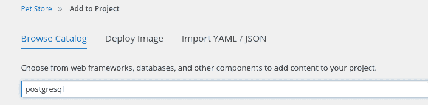

搜索结果会显示多个选项；我们需要选择数据存储选项：

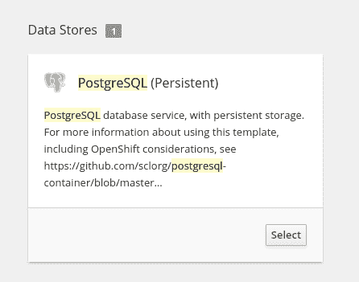

当您点击“选择”按钮时，以下表单会打开：

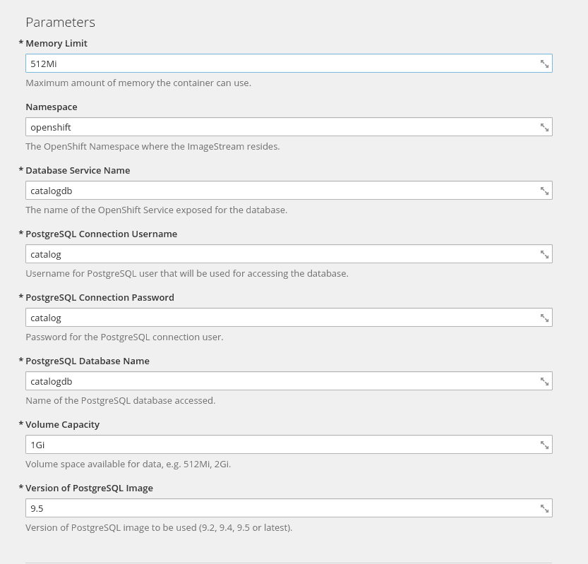

我们将数据库服务器名称和数据库实例名称更改为`catalogdb`。为了方便起见，我们将用户名和密码都设置为 catalog。

我们还将覆盖标签：

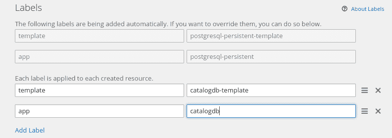

我们将为我们的不同服务使用一系列数据库容器。因此，我们不能使用标准的应用程序和模板标签。我们将它们更改为 catalogdb-template 和`catalogdb`。

在我们完成之后，我们就准备好创建一个应用程序了；让我们点击页面底部的“创建”按钮。

我们必须等待 Pod 启动。让我们点击“概览”页面按钮，然后点击 postgresql 部署；我们必须等待有一个副本处于活动状态：

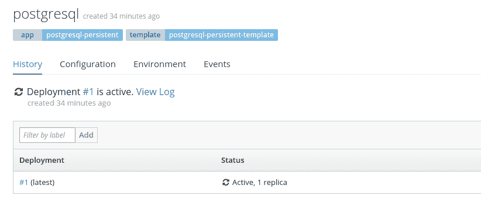

应用程序正在运行。让我们用一些宠物填充我们的数据库，以便我们可以测试我们的服务行为。为此，我们需要访问运行数据库的容器控制台。为了实现这一点，我们必须转到“应用程序/Pods”菜单，选择运行 PostgreSQL 的 Pod，然后点击终端按钮：

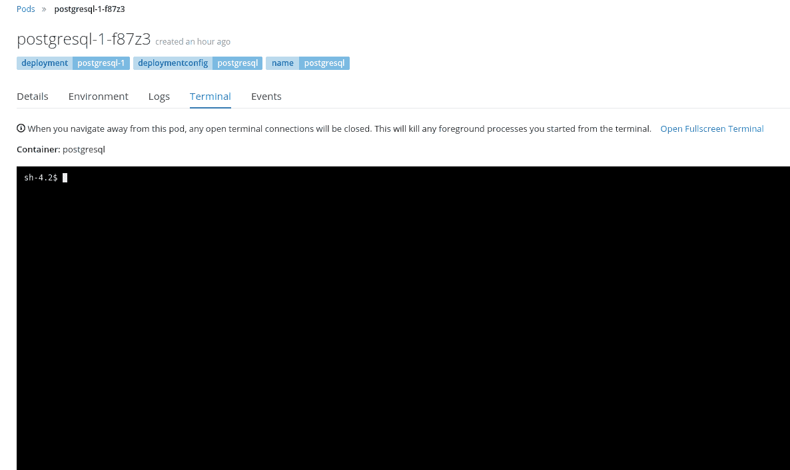

现在让我们填充数据库。让我们登录到用户目录并创建 SQL 脚本：

```java
cd
vi items.sql
```

脚本与我们之前在应用程序中创建的加载脚本非常相似：

```java
DROP TABLE IF EXISTS ITEM;

CREATE TABLE ITEM (id serial PRIMARY KEY, item_id varchar, name varchar, description varchar, quantity smallint);

INSERT INTO ITEM(item_id, name, description, quantity) VALUES ('dbf67f4d-f1c9-4fd4-96a8-65ee1a22b9ff',  'turtle', 'Slow friendly reptile. Let your busy self see how it spends 100 years of his life laying on sand and swimming.', 5);
INSERT INTO ITEM(item_id, name, description, quantity) VALUES ('fc7ee3ea-8f82-4144-bcc8-9a71f4d871bd', 'hamster', 'Energetic rodent - great as a first pet. Will be your only inmate that takes his fitness training serviously.', 10);
INSERT INTO ITEM(item_id, name, description, quantity) VALUES ('725dfad2-0b4d-455c-9385-b46c9f356e9b','goldfish', 'With its beauty it will be the decoration of you aquarium. Likes gourmet fish feed and postmodern poetry.', 3);
INSERT INTO ITEM(item_id, name, description, quantity) VALUES ('a2aa1ca7-add8-4aae-b361-b7f92d82c3f5', 'lion', 'Loves playing the tag and cuddling with other animals and people.', 9);
```

请注意，我们在这里改变了惯例。我们不再使用名称作为项目标识符，而是开始使用 UIDs，它将成为整个应用程序中宠物的唯一标识符。

最后，我们将执行脚本：

```java
psql -U catalog catalogdb < catalog.sql
```

上述命令运行 PostgreSQL 命令行客户端。`-U` 参数指定用户（在我们的例子中是 catalog）和 `catalogdb` 参数指定客户端必须操作的架构。

我们的数据库现在准备好了，你可能会想到的问题可能是：我的持久卷在哪里？答案是：再次是 OpenShift 为你做了所有的事情。让我们进一步检查一下。

# 检查卷

为了查看数据库是如何配置的，让我们使用 `cli`：

```java
oc describe dc/catalogdb

```

您将能够看到，此部署配置已定义了一个 `PersistentVolumeClaim` 类型的卷：

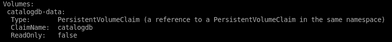

进一步来说，让我们分析 `catalogdb` 持久卷声明：

```java
oc describe pvc/catalogdb

```

我们将能够看到，声明已经根据我们提供的数据库类型创建，并且它已经被绑定：

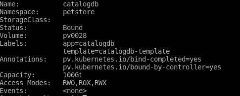

如您在先前的屏幕截图中所见，OpenShift 已经根据您在从模板创建应用程序时提供的信息创建了一个 `PersistentVolumeClaim`。该声明已经绑定到集群中的一个 `PersistentVolume`。由于我们现在使用 Minishift，`PersistentVolume` 是通过虚拟机内部的磁盘实现的。但我们要再次强调，如果您决定在其他 OpenShift 集群上部署应用程序，您的应用程序配置不会发生任何变化。

让我们回到我们的例子。

# 更新目录服务

我们必须再次重新配置我们的目录服务，以便它与 PostgreSQL 数据库兼容。

示例参考：`chapter7/catalog-service**-**openshift**-**postgresql`。

让我们从 `pom.xml` 的更改开始——我们必须向其中添加 Postgres 依赖项：

```java
(...)

    <dependencies>
        (...)
        <dependency>
            <groupId>org.wildfly.swarm</groupId>
            <artifactId>jpa</artifactId>
            <version>${version.wildfly.swarm}</version>
        </dependency>
 <!-- 1 -->
 <dependency>
            <groupId>org.postgresql</groupId>
            <artifactId>postgresql</artifactId>
            <version>${version.postgresql}</version>
        </dependency> 
    </dependencies>

(...)
```

我们已经将数据库驱动程序从 `h2` 更改为 `PostgreSQL`（1）。

让我们更改数据源配置：

```java
swarm:
  datasources:
    data-sources:
      CatalogDS:
       driver-name: postgresql
       connection-url: jdbc:postgresql://catalogdb.petstore.svc/catalogdb
       user-name: catalog
      password: catalog
    jdbc-drivers:
      postgresql:
        driver-class-name: org.postgresql.Driver
        xa-datasource-name: org.postgresql.xa.PGXADataSource
        driver-module-name: org.postgresql.jdbc
```

我们必须重新配置 JDBC 驱动程序以使用`postgresql`类，并重新配置数据源，使其包含应用程序的数据。catalogdb.petstore.svc 地址的含义将在下一章中解释。

与之前的数据库示例一样，我们必须提供`persistence`文件：

```java
<?xml version="1.0" encoding="UTF-8"?>
<persistence
        xmlns:xsi="http://www.w3.org/2001/XMLSchema-instance"
        version="2.1"
        xmlns="http://xmlns.jcp.org/xml/ns/persistence"
        xsi:schemaLocation="http://xmlns.jcp.org/xml/ns/persistence http://xmlns.jcp.org/xml/ns/persistence/persistence_2_1.xsd">
    <persistence-unit name="CatalogPU" transaction-type="JTA">
        <jta-data-source>java:jboss/datasources/CatalogDS</jta-data-source>
    </persistence-unit>
</persistence>
```

最后，我们必须将`postgreSQL` JDBC 模块添加到应用程序中...

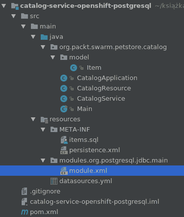

内容如下：

```java
<?xml version="1.0" encoding="UTF-8"?>
<module xmlns="urn:jboss:module:1.5" name="org.postgresql.jdbc">

  <resources>
    <artifact name="org.postgresql:postgresql:${version.postgresql}"/>
  </resources>
  <dependencies>
    <module name="javax.api"/>
    <module name="javax.transaction.api"/>
  </dependencies>
</module>
```

好的，现在我们已经重新配置了我们的 catalog-service，是时候做一些有趣的事情了。让我们将我们的应用程序部署到 OpenShift。

我们将再次使用源到镜像构建，就像我们在上一章中做的那样：

```java
oc new-app wildflyswarm-10-centos7~https://github.com/PacktPublishing/Hands-On-Cloud-Development-with-WildFly.git --context-dir=chapter7/catalog-service-openshift-postgresql/ --name=catalog-service

```

我们必须等待我们的 fat-JAR 启动。为了验证这一点，我们可以查看启动应用程序的 Pod 的日志：

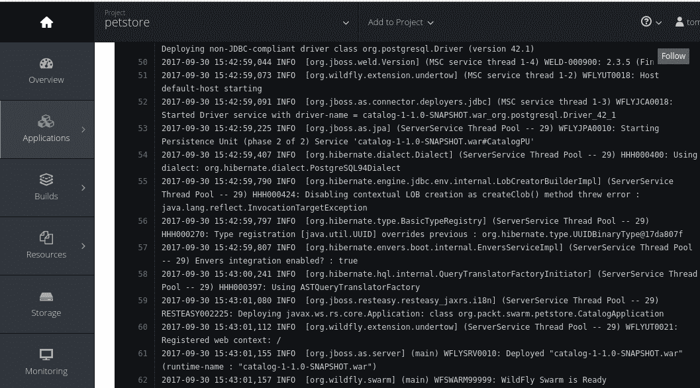

与先前的示例一样，我们必须创建一个路由。完成之后，让我们找出从集群外部可见的 catalog-service 地址：

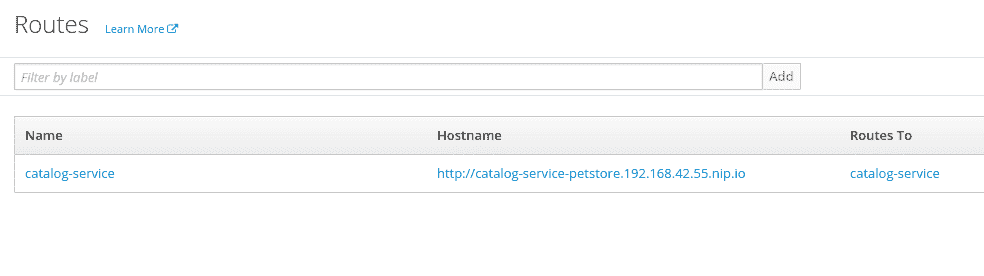

让我们复制路由名称并使用`curl`检查我们是否可以使用 catalog-service 获取宠物信息：

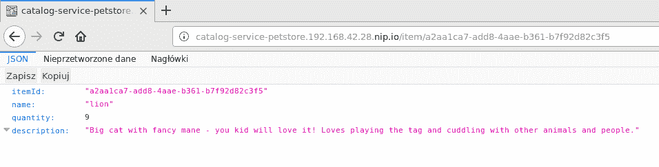

它成功了。现在让我们扩展我们的服务，使其能够将数据持久化到数据库。

让我们扩展我们的`CatalogService`：

```java
package org.packt.swarm.petstore.catalog;

import org.packt.swarm.petstore.catalog.model.Item;

import javax.enterprise.context.ApplicationScoped;
import javax.persistence.EntityManager;
import javax.persistence.PersistenceContext;
import javax.transaction.Transactional;
import java.util.List;
import java.util.UUID;

@ApplicationScoped
public class CatalogService {

    @PersistenceContext(unitName = "CatalogPU")
    private EntityManager em;

    public Item searchById(String itemId) {
        return em.createNamedQuery("Item.findById", Item.class).setParameter("itemId", itemId).getSingleResult();
    }

 //1
 @Transactional
    public void add(Item item){
        //2
 item.setItemId(UUID.randomUUID().toString());
        em.persist(item);
    }

 //3
 public List<Item> getAll() {
 return em.createNamedQuery("Item.findAll", Item.class).getResultList();
    }

}
```

我们通过`add`方法（1）扩展了服务。请注意，该方法具有事务性，并为存储中的项目生成 UUID（2）。我们还添加了一个列出存储中所有项目的方法（3）。请注意，我们还需要为它添加 NamedQuery：

```java
(...)

@Entity
@Table(name = "item")
@NamedQueries({
        @NamedQuery(name="Item.findById",
                query="SELECT i FROM Item i WHERE i.itemId = :itemId"),
 @NamedQuery(name="Item.findAll",
                query="SELECT i FROM Item i")
})
public class Item {
(...)
```

我们还必须向`CatalogResource`添加`POST`方法：

```java
package org.packt.swarm.petstore.catalog;

import org.packt.swarm.petstore.catalog.model.Item;

import javax.inject.Inject;
import javax.ws.rs.Consumes;
import javax.ws.rs.GET;
import javax.ws.rs.POST;
import javax.ws.rs.Path;
import javax.ws.rs.PathParam;
import javax.ws.rs.Produces;
import javax.ws.rs.core.MediaType;
import javax.ws.rs.core.Response;
import java.util.List;

@Path("/")
public class CatalogResource {

    @Inject
    private CatalogService catalogService;

    @GET
    @Path("item/{itemId}")
    @Produces(MediaType.APPLICATION_JSON)
    public Response searchById(@PathParam("itemId") String itemId) {
        try {
            Item item = catalogService.searchById(itemId);
            return Response.ok(item).build();
        } catch (Exception e) {
            e.printStackTrace();
            return Response.status(Response.Status.BAD_REQUEST).entity(e.getMessage()).build();
        }
    }

 //1
 @POST
    @Path("item")
    //2
 @Produces(MediaType.APPLICATION_JSON)
    //3
 @Consumes(MediaType.APPLICATION_JSON)
 public Response addNew(Item item) {
 try {
 catalogService.add(item);
            return Response.ok(item).build();
        } catch (Exception e) {
 return Response.status(Response.Status.BAD_REQUEST).entity(e.getMessage()).build();
        }
 }

 //2
 @GET
    @Path("item")
 @Produces(MediaType.APPLICATION_JSON)
 @Consumes(MediaType.APPLICATION_JSON)
 public Response getAll() {
 try {
 List<Item> item = catalogService.getAll();
            return Response.ok(item).build();
        } catch (Exception e) {
 return Response.status(Response.Status.BAD_REQUEST).entity(e.getMessage()).build();
        }
 }

}
```

我们实现了`addNew`方法，它使用`CatalogService`实例将`Item`对象（1）添加到数据库。如您在先前的代码中所注意到的，`Request`参数和`Response`都是 JSON 对象。它们由服务器自动解析；我们唯一需要做的是使用`@Produces`（2）和`@Consumes`（3）注解方法。在方法中，我们使用`catalogService`存储给定的 Item 对象。最后，我们根据存储操作的结果返回`ok`响应（5）或错误响应（6）。

我们还实现了`getAll`方法，这将允许我们请求商店中所有宠物的信息（2）。

应用程序准备就绪后，您必须提交更改的文件并将它们推送到 GitHub。当您这样做时，您可以进入 Web 控制台并触发更新服务的构建。为了做到这一点，您必须在 Web 控制台中点击构建 | 构建，选择 catalog-service，然后在右上角点击开始构建按钮：

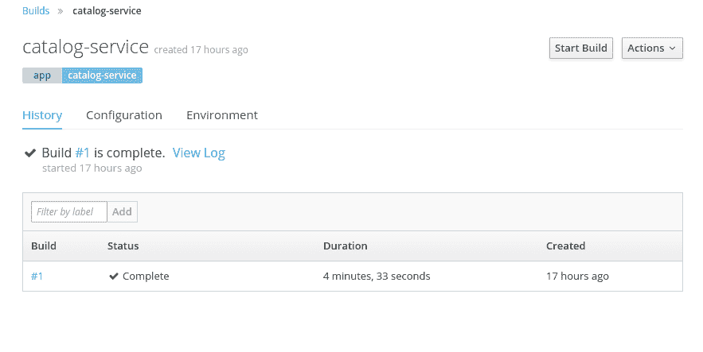

应用程序启动后，我们必须等待它被部署到云端。让我们使用`curl`向我们的存储中`POST`新的项目：

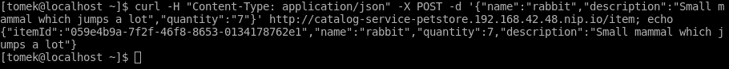

一切似乎都很正常，所以让我们使用我们刚刚实现的请求来检查存储中可用的项目：

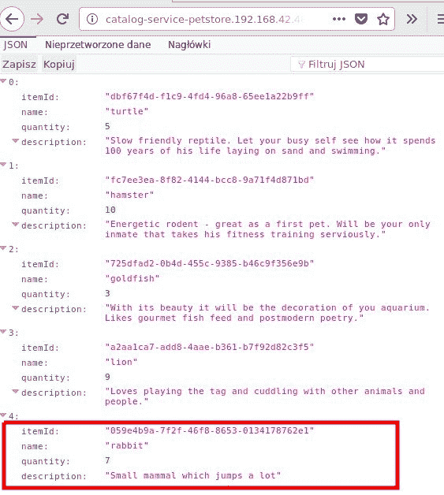

我们数据库中有三只兔子。我们的服务在 OpenShift 集群内部运行正常。

我们现在可以检查存储是否确实持久。让我们进入网页控制台并终止 catalog-service 和数据库 Pod。为了做到这一点，进入网页控制台，点击应用程序 | Pods 并选择数据库 Pod。稍后点击右上角的操作，并选择删除。对 catalog-service Pod 重复这些操作。当这两个 Pod 都重新启动后（你可以在应用程序 | Pods 视图中监控这一点），你又可以列出所有项目。你应该能够看到提取的结果与前面的截图相同。

# 摘要

在本章中，你学习了如何在 OpenShift 中配置已部署服务的持久性。

本章从理论知识开始，为你提供了关于卷及其不同类型的更多细节。稍后，你学习了卷的一个特别有用的类型，即`PersistentVolumeClaim`。你还学习了为什么它是必要的，它与`PersistentVolume`的关系以及如何使用它。

最后，我们扩展了你的`catalogService`，使其使用`postgresql`数据库作为存储。
