# 扩展和连接你的服务

在本章中，我们将更详细地探讨部署、扩展和连接应用程序的过程。在第六章，“使用 OpenShift 在云上部署应用程序”，你已经学习了将服务部署到 OpenShift 云的基本信息。现在，是时候扩展这些知识并学习如何在实践中应用它们了。

让我们从部署开始。

# 部署

让我们来检查在部署我们的服务时幕后发生了什么。我们将继续之前章节中的示例进行工作。

示例参考：`chapter8/catalog-service-openshift-load-balancing`。

你需要打开 Web 控制台，并导航到应用程序|部署|catalog-service：

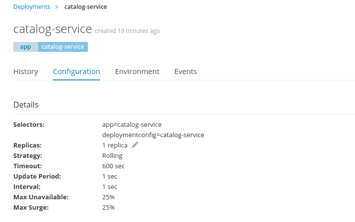

现在，我们将能够看到部署配置。这是 OpenShift 的`DeploymentConfiguration`对象的图形表示。

正如你在第六章，“使用 OpenShift 在云上部署应用程序”中学到的，OpenShift 在 Kubernetes 之上添加了另一层，以提供更方便、更高效的编程体验。它通过扩展 Kubernetes 的对象模型来实现这一点。`DeploymentConfiguration`和 Deployments 是扩展 Kubernetes 对象模型的 OpenShift 对象。

`DeploymentConfiguration`对象管理 Deployments 对象的创建。它包含创建 Deployments 所需的所有必要信息，正如其名称所暗示的，它代表了一个部署实例。当一个 Deployments 触发器发生时，旧的部署对象将被新的对象替换。所有的部署对象都基于`DeploymentConfiguration`。Deployments，以及其他对象，封装了 Kubernetes 的`ReplicationController`对象。让我们更深入地理解它。

# 学习 ReplicationController 的基础知识

`ReplicationController`包含以下信息：Pod 模板、选择器和副本数量。让我们进一步探讨这些内容。

Pod 模板基本上是一个 Pod 定义。它包含有关容器、卷、端口和标签的信息。由这个复制控制器创建的每个 Pod 都将使用这个 Pod 模板启动。选择器用于确定哪些 Pod 受此`ReplicationController`管理。最后，副本数量是我们希望运行的 Pod 数量。

Kubernetes 的工作方式如下：它监控集群的当前状态，如果该状态与期望状态不同，它将采取行动以恢复期望状态。同样的事情也发生在`ReplicationControllers`上。`ReplicationController`持续监控与其关联的 Pod 数量。如果 Pod 的数量与期望的数量不同，它将启动或停止 Pod 以恢复期望状态。Pod 是通过 Pod 模板启动的。

让我们检查 Kubernetes 为我们的 catalog-service 创建的`ReplicationController`。为此，我们将使用 CLI：

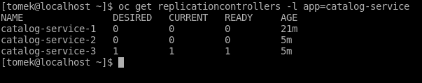

正如您在前面的屏幕截图中将注意到的，为 catalog-service 创建了三个复制控制器。这种情况是因为每次应用程序重新部署都会导致创建一个新的部署对象及其自己的复制控制器。请注意，只有 catalog-service-3 的期望实例数大于 0——当新的部署正在进行时，之前的部署已被设置为不活动状态。

让我们看看活动控制器的描述：

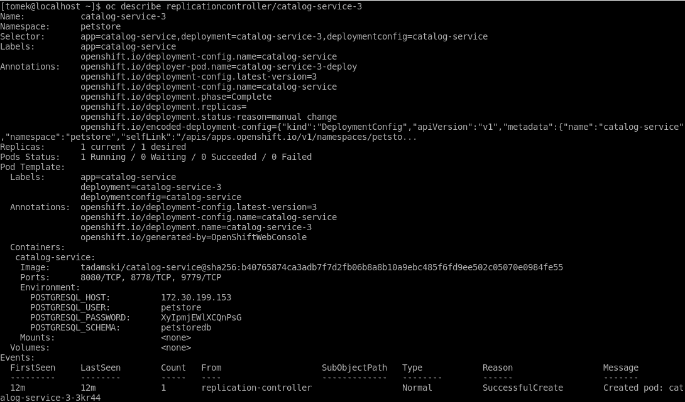

选择器有三个标签：app、deployment 和 deployment-config。它明确地识别了与给定部署关联的 Pod。

Pod 模板中使用了完全相同的标签。Pod 模板的其他部分包含构建容器的镜像，以及我们在创建服务时提供的环境变量。最后，当前和期望副本的数量默认设置为 1。

好的。那么我们如何扩展我们的服务，使其在多个实例上运行？让我们再次转到 Web 控制台。我们需要再次导航到应用程序 | 部署，并输入 catalog-service 配置：

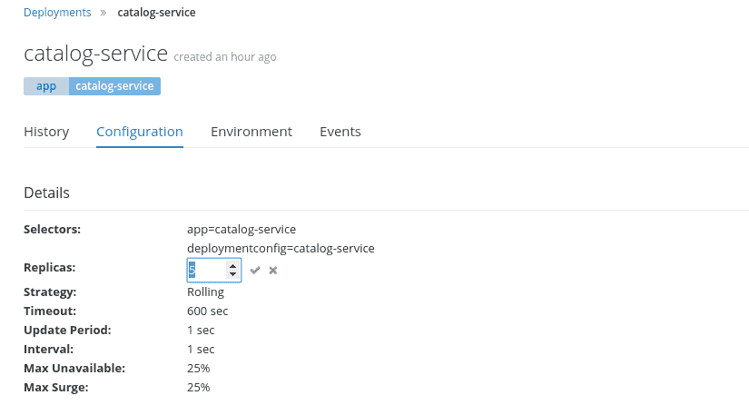

要扩展 catalog-service 应用程序，我们必须将副本字段调整为我们想要的实例数量。就是这样。

当我们在`oc`中查看`ReplicationControllers`时，我们将看到以下信息：

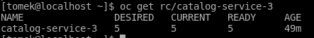

Pod 的数量已更改为 5。正如我们在`oc`输出中看到的，已经启动了额外的 Pod，我们现在有五个实例。让我们检查控制台（导航到应用程序 | Pods）：

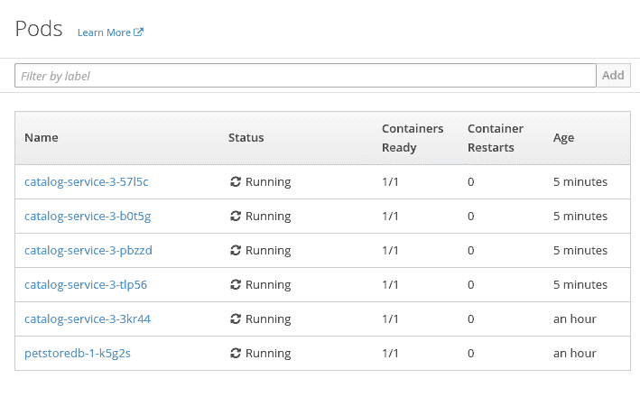

OpenShift 确实根据我们的需求扩展了我们的应用程序。

在使用 OpenShift 一段时间后，你应该能够理解我们在第六章，“使用 OpenShift 在云上部署应用程序”中所说的意思，当我们写道 OpenShift 在 Kubernetes 之上构建了一个有效且易于使用的应用程序开发环境。前面的例子展示了它如何很好地工作：Kubernetes 负责确保集群的状态等于提供的描述。在前面的例子中，这个描述是由一个`ReplicationController`对象（它是 Kubernetes 对象模型的一部分）提供的。然而，请注意，OpenShift 已经为我们抽象掉了所有繁琐的细节。我们只提供了诸如代码仓库的地址或我们想要有多少副本等信息。OpenShift 层抽象掉了集群配置的技术细节，并为我们提供了方便、易于使用的工具，使程序员能够专注于开发。

让我们回到我们的主要话题。接下来我们将配置的是**负载均衡**。

# 负载均衡

我们刚刚学习了如何扩展我们的服务。下一步自然的步骤是配置负载均衡器。好消息是 OpenShift 会为我们自动完成大部分工作。

在第六章，“使用 OpenShift 在云上部署应用程序”，我们介绍了服务，我们了解到服务是通过虚拟集群 IP 来访问的。为了理解负载均衡是如何工作的，让我们来了解集群 IP 是如何实现的。

正如我们在这里学到的那样，Kubernetes 集群中的每个节点都运行了一组服务，这些服务允许集群提供其功能。其中之一就是**kube-proxy**。kube-proxy 在每个节点上运行，并且负责服务实现。kube-proxy 持续监控描述集群的对象模型，并收集关于当前活动服务和运行这些服务的 Pod 的信息。当新的服务出现时，kube-proxy 修改 iptables 规则，以便虚拟集群的 IP 被路由到可用的 Pod 之一。iptables 规则被创建为随机选择 Pod。此外，请注意，这些 IP 规则必须不断重写以匹配集群的当前状态。

kube-proxy 在每个集群节点上运行。正因为如此，在每个节点上，都有一组 iptables 规则，这些规则将数据包转发到适当的 Pod。因此，服务可以通过集群的每个节点在其虚拟集群 IP 上访问。

从客户端服务的角度来看，这意味着什么呢？集群基础设施对服务客户端是隐藏的。客户端不需要了解任何关于节点、Pod 以及它们在集群内部的动态移动。他们只需使用其 IP 调用服务，就像它是一个物理主机一样。

让我们回到我们的示例，看看我们主机的负载均衡。让我们回到本章中我们正在工作的示例。我们静态地将目录服务扩展到五个实例。让我们进入网页控制台，查看当前运行应用程序的所有 pod：

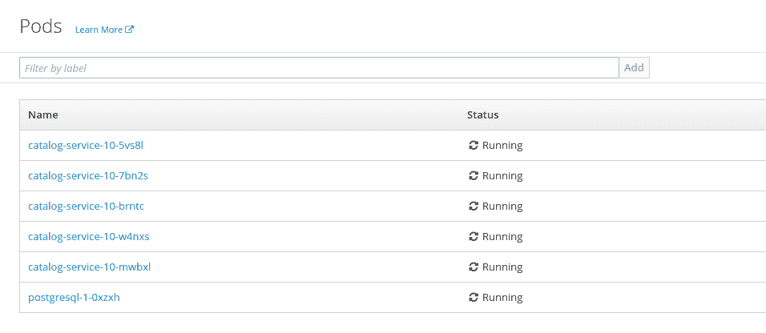

让我们追踪请求转发到哪些 pod。为了实现这一点，我们实现了一个简单的 REST 过滤器：

```java
package org.packt.swarm.petstore.catalog;

import javax.ws.rs.container.ContainerResponseFilter;
import javax.ws.rs.container.ContainerRequestContext;
import javax.ws.rs.container.ContainerResponseContext;
import javax.ws.rs.ext.Provider;
import java.io.IOException;

//1
@Provider
public class PodNameResponseFilter implements ContainerResponseFilter {
    public void filter(ContainerRequestContext req, ContainerResponseContext res)
            throws IOException
    {
        //2
 res.getHeaders().add("pod",System.getenv("HOSTNAME"));
    }
}
```

前面的过滤器会在响应处理完毕后（1）向响应头添加一个 `"pod"` 属性。该过滤器将在响应处理完毕后进行评估。在每一个 pod 上，都设置了一个 `"HOSTNAME"` 环境变量。我们可以使用这个变量并将其添加到响应元数据中（2）。

因此，我们准备好追踪负载均衡：

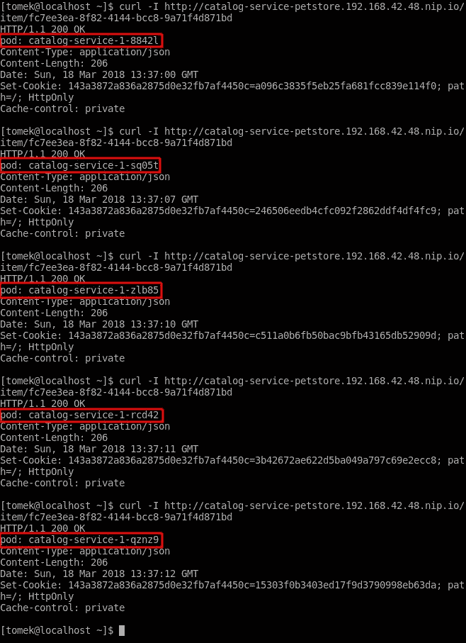

在前面的屏幕截图中，请注意请求正在自动在可用的 pod 之间进行负载均衡。

# 服务发现

我们已经向您展示了如何配置应用程序的负载均衡。我们知道您现在可以访问 OpenShift 背后的虚拟集群 IP 地址，该地址正在对请求进行负载均衡。然而，我们实际上如何知道如何连接到我们的服务呢？我们将在下一个主题中学习这一点。在我们这样做之前，我们必须介绍我们将要相互通信的新服务。

# 新服务

在第一章中，我们简要介绍了宠物商店应用程序，并描述了构成它的服务。到目前为止，在我们的示例中我们只使用了目录服务。现在是时候实现定价服务和客户网关服务了。这些服务将作为本章节和未来章节的示例。让我们从定价服务开始。

# 定价服务

定价服务与目录服务非常相似。它可以用来通过宠物的名称获取价格。让我们直接进入实现。最初，我们必须创建数据库。像以前一样，我们将使用 PostgreSQL 模板：

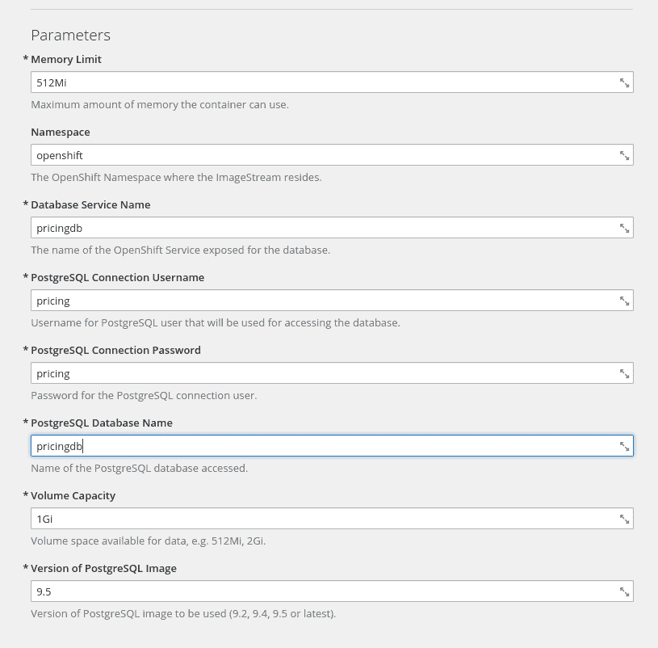

与目录服务的数据库一样，我们也想覆盖标签：

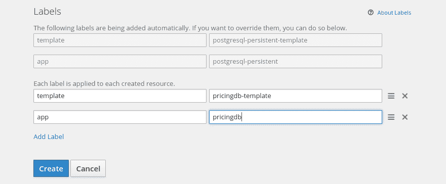

为了填充数据库，我们必须创建以下脚本：

```java
vi pets.sql
```

现在，输入示例数据：

```java
DROP TABLE IF EXISTS PRICE;                                                                                                                                                                                                        

CREATE TABLE PRICE (id serial PRIMARY KEY, item_id varchar, price smallint);

INSERT INTO PRICE(item_id, price) VALUES ('dbf67f4d-f1c9-4fd4-96a8-65ee1a22b9ff', 50);
INSERT INTO PRICE(item_id, price) VALUES ('fc7ee3ea-8f82-4144-bcc8-9a71f4d871bd', 30);
INSERT INTO PRICE(item_id, price) VALUES ('725dfad2-0b4d-455c-9385-b46c9f356e9b', 15);
INSERT INTO PRICE(item_id, price) VALUES ('a2aa1ca7-add8-4aae-b361-b7f92d82c3f5', 3000);
```

为了填充数据库，我们将执行以下脚本：

```java
psql -U pricing pricingdb < pets.sql
```

我们的定价数据库已经准备好了。我们现在可以开始编写代码了。

示例参考：`chapter8/pricing-service`。

我们必须以与 catalog-service 相似的方式配置数据库。

```java
swarm:
  datasources:
    data-sources:
 PricingDS:
       driver-name: postgresql
 connection-url: jdbc:postgresql://pricingdb.petstore.svc/pricingdb
 user-name: pricing
 password: pricing
    jdbc-drivers:
      postgresql:
        driver-class-name: org.postgresql.Driver
        xa-datasource-name: org.postgresql.xa.PGXADataSource
        driver-module-name: org.postgresql.jdbc
```

为了使数据库能够工作，我们必须提供 JDBC 驱动模块：

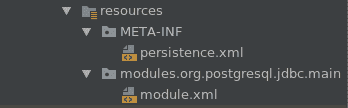

如您所见，我们还需要 `persistence.xml`：

```java
<?xml version="1.0" encoding="UTF-8"?>
<persistence
        xmlns:xsi="http://www.w3.org/2001/XMLSchema-instance"
        version="2.1"
        xmlns="http://xmlns.jcp.org/xml/ns/persistence"
        xsi:schemaLocation="http://xmlns.jcp.org/xml/ns/persistence http://xmlns.jcp.org/xml/ns/persistence/persistence_2_1.xsd">
    <persistence-unit name="PricingPU" transaction-type="JTA">
        <jta-data-source>java:jboss/datasources/PricingDS</jta-data-source>
    </persistence-unit>
</persistence>
```

我们必须提供一个 `Entity`：

```java
package org.packt.swarm.petstore.pricing;

import com.fasterxml.jackson.annotation.JsonIgnore;

import javax.persistence.Column;
import javax.persistence.Entity;
import javax.persistence.GeneratedValue;
import javax.persistence.GenerationType;
import javax.persistence.Id;
import javax.persistence.NamedQueries;
import javax.persistence.NamedQuery;
import javax.persistence.SequenceGenerator;
import javax.persistence.Table;

//1
@Entity
//2
@Table(name = "Price")
//3
@NamedQueries({
 @NamedQuery(name="Price.findByName",
                query="SELECT p FROM Price p WHERE p.name = :name"),
})
public class Price {

 //4
 @Id
    @GeneratedValue(strategy = GenerationType.SEQUENCE, generator = "price_sequence")
 @SequenceGenerator(name = "price_sequence", sequenceName = "price_id_seq")
 //5
 @JsonIgnore
    private int id;

 //6
 @Column(length = 30)
 private String name;
    @Column
    private int price;

    public int getId() {
        return id;
    }

    public void setId(int id) {
        this.id = id;
    }

    public String getName() {
        return name;
    }

    public void setName(String name) {
        this.name = name;
    }

    public int getPrice() {
        return price;
    }

    public void setPrice(int price) {
        this.price = price;
    }
}
 table that we have just created (2). We have provided NamedQueries, which will enable us to search the price of a pet by a name (3). An id, as in catalogdb, is generated using the Postgres sequence (4) and is not parsed in the JSON response (5). Finally, we have annotated the fields mapped to the price and name columns (6).
```

与 `catalog-service` 一样，我们还需要一个服务：

```java
package org.packt.swarm.petstore.pricing;

import org.packt.swarm.petstore.pricing.model.Price;

import javax.enterprise.context.ApplicationScoped;
import javax.persistence.EntityManager;
import javax.persistence.PersistenceContext;
import javax.ws.rs.WebApplicationException;
import java.util.List;

@ApplicationScoped
public class PricingService {

    @PersistenceContext(unitName = "PricingPU")
    private EntityManager em;

    public Price findByItemId(String itemId) {
        return em.createNamedQuery("Price.findByItemId", Price.class).setParameter("itemId", itemId).getSingleResult();
    }
}
```

我们还需要 REST 资源：

```java
package org.packt.swarm.petstore.pricing;

import org.packt.swarm.petstore.pricing.model.Price;

import javax.inject.Inject;
import javax.ws.rs.GET;
import javax.ws.rs.Path;
import javax.ws.rs.PathParam;
import javax.ws.rs.Produces;
import javax.ws.rs.core.Context;
import javax.ws.rs.core.MediaType;
import javax.ws.rs.core.Response;
import javax.ws.rs.core.SecurityContext;

@Path("/")
public class PricingResource {

    @Inject
    private PricingService pricingService;

    @GET
    @Path("price/{item_id}")
    @Produces(MediaType.APPLICATION_JSON)
    public Response priceByName(@PathParam("item_id") String itemId) {
        Price result = pricingService.findByItemId(itemId);
        return Response.ok(result).build();
}
```

我们还需要一个应用程序：

```java
package org.packt.swarm.petstore.pricing;

import javax.ws.rs.ApplicationPath;
import javax.ws.rs.core.Application;

@ApplicationPath("/")
public class PricingApplication extends Application {
}
```

我们的第二个服务已经准备好了。现在是时候在 OpenShift 上部署它了。将你的应用程序推送到 GitHub 仓库并调用：

```java
oc new-app wildflyswarm-10-centos7~https://github.com/PacktPublishing/Hands-On-Cloud-Development-with-WildFly.git --context-dir=chapter8/pricing-service --name=pricing-service

```

在你的应用程序部署后，你可以为其创建一个路由并验证它确实可以工作：

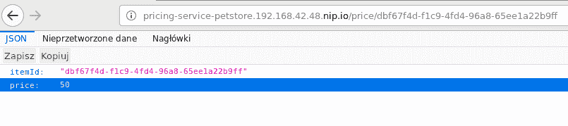

的确如此。让我们转到第二个服务。

# 客户网关服务

在本节中，内容又变得更有趣了。客户网关服务是我们应用程序的网关，它将为 Web 客户端提供外部接口。我们将实现的第一项请求是获取宠物列表。让我们看一下以下图表：

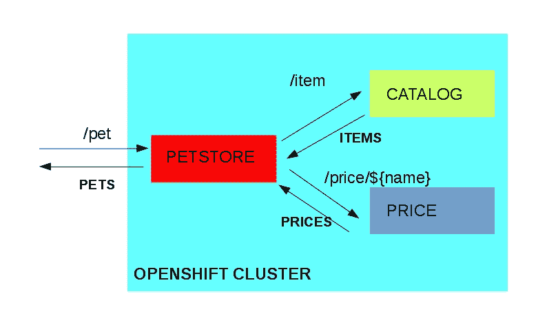

当执行`/catalog/item`请求时，服务会向**CATALOG**请求可用的项目。基于这些信息，宠物商店服务会向**PRICE**服务查询每只宠物的价格，合并结果后返回给客户端。然而，网关服务将如何知道这些服务的地址呢？我们很快就会找到答案。

示例参考：`chapter8/customer-gateway-env`。

客户服务配置方式与之前的服务类似。如果你对配置的某些部分有疑问，请参考其描述。

让我们看看`catalog/item`请求的实现细节，从 REST 资源开始：

```java
package org.packt.swarm.petstore;

import org.packt.swarm.petstore.api.CatalogItemView;

import javax.inject.Inject;
import javax.ws.rs.GET;
import javax.ws.rs.Path;
import javax.ws.rs.Produces;
import javax.ws.rs.core.MediaType;
import javax.ws.rs.core.Response;
import java.util.List;

@Path("/")
public class GatewayResource {

    @Inject
    private GatewayService gatewayService;

 //1
 @GET
    @Path("/catalog/item")
 @Produces(MediaType.APPLICATION_JSON)
 public Response getItems() {
        //2
 List<CatalogItemView> result = gatewayService.getItems();
        return Response.ok(result).build();
    }
```

`getItems`方法从`CatalogService`（1）收集项目，为所有项目获取价格，并将获取的结果合并到商店中可用的宠物列表中。请注意，我们引入了`CatalogItemView`——这是一个传输对象，它是 Web 客户端 API 的一部分。

我们也已经实现了该服务：

```java
package org.packt.swarm.petstore;

import org.packt.swarm.petstore.api.CatalogItemView;
import org.packt.swarm.petstore.catalog.api.CatalogItem;
import org.packt.swarm.petstore.pricing.api.Price;
import org.packt.swarm.petstore.proxy.CatalogProxy;
import org.packt.swarm.petstore.proxy.PricingProxy;

import javax.enterprise.context.ApplicationScoped;
import javax.inject.Inject;
import java.util.ArrayList;
import java.util.List;

@ApplicationScoped
public class GatewayService {

 //2
 @Inject
    private CatalogProxy catalogProxy;

    @Inject
    private PricingProxy pricingProxy;

 //1
 public List<CatalogItemView> getItems() {
 List<CatalogItemView> views = new ArrayList<>();
        for(CatalogItem item: catalogProxy.getAllItems()) {
 Price price = pricingProxy.getPrice(item.getItemId());

            CatalogItemView view = new CatalogItemView();
            view.setItemId(item.getItemId());
            view.setName(item.getName());
            view.setPrice(price.getPrice());
            view.setQuantity(item.getQuantity());
            view.setDescription(item.getDescription()); 
 views.add(view);
        }
 return views;
    }

}
```

`getItems`方法实现（1）相当直接。我们正在合并目录和定价服务的数据，并返回结果对象的列表。这里最有趣的部分是代理，它使我们能够与这些服务通信（2）。让我们学习如何实现它们。

# 环境变量

当创建新的服务时，其坐标会被写入集群中每个 Pod 的环境变量中。

让我们登录到集群中的一个 Pod 并查看它。所有 OpenShift 环境变量名称都是大写的，我们需要有关定价服务的数据：

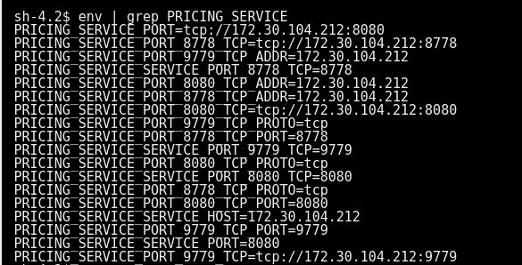

在前面的屏幕截图中，请注意有许多变量描述了服务的坐标。我们感兴趣的是主机地址：

```java
PRICING_SERVICE_SERVICE_HOST=172.30.104.212
```

注意，这又是虚拟集群 IP。因此，只要服务没有被移除，代理地址将保持不变。由部署、节点添加或故障引起的底层基础设施更改不会导致之前地址的改变。

让我们编写使用此变量连接到服务的代理。我们将从定价服务代理开始：

```java
package org.packt.swarm.petstore.proxy;

import org.packt.swarm.petstore.pricing.api.Price;

import javax.enterprise.context.ApplicationScoped;
import javax.ws.rs.client.Client;
import javax.ws.rs.client.ClientBuilder;
import javax.ws.rs.client.WebTarget;
import javax.ws.rs.core.MediaType;

@ApplicationScoped
public class PricingProxy {

    private String targetPath;

    PricingProxy(){
 //1
        targetPath = "http://" + System.getenv("PRICING_SERVICE_SERVICE_HOST")+":"+8080;
    }

    public Price getPrice(String name){
 //2
        Client client = ClientBuilder.newClient();
        WebTarget target = client.target(targetPath +"/price/" + name);
        return target.request(MediaType.APPLICATION_JSON).get(Price.class);
    }
}
```

就是这样。我们在创建代理时获得了`clusterIP`（1），并且用户直接使用 REST 客户端 API 为`getPrice`方法调用提供了一个适配器（2）。

`catalogProxy`的实现类似。

现在，我们已经准备好检查我们的应用程序是否工作。让我们为`petstore`服务创建一个路由并检查网页浏览器：

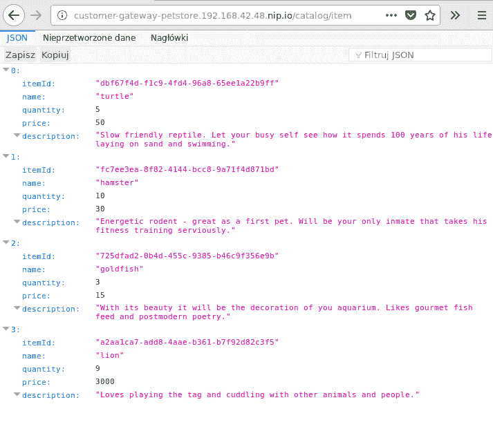

确实如此。然而，这个解决方案有一个主要的缺点——一个排序问题。如果 Pod 在服务之前创建，那么服务坐标将不会存在于 Pod 环境中。那么有没有更好的服务发现方法呢？是的，通过**域名系统**（**DNS**）。

# DNS 发现

每个 OpenShift 集群都包含一个 DNS 服务。这个服务允许您通过服务名称轻松地发现服务。每个服务在注册期间都会注册到 DNS 服务，并且随后定期向其发送实时消息。DNS 服务器使用以下模式创建记录：

```java
${service name}.${application name}.svc
```

让我们以定价服务为例。我们已经创建了`petstore`应用程序。因此，使用前面模式创建的服务名称将是`pricing-service.petstore.svc`。

我们可以在 Web 控制台中确认信息。让我们导航到应用程序 | 服务 | pricing-service：

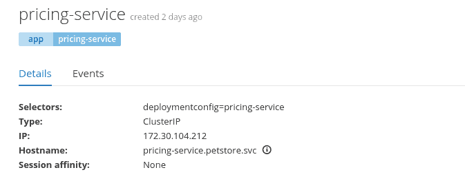

注意`hostname`字段——这是我们之前创建的地址。另一个需要注意的重要事项是，那些服务名称只能在集群内部可见。

现在，我们已经准备好将我们的应用程序重构为使用优雅的 DNS 发现。

示例参考：`chapter8/customer-gateway-dns`。

我们必须重写我们的代理。让我们从`PricingProxy`开始：

```java
package org.packt.swarm.petstore.proxy;

import org.packt.swarm.petstore.pricing.api.Price;

import javax.enterprise.context.ApplicationScoped;
import javax.ws.rs.client.Client;
import javax.ws.rs.client.ClientBuilder;
import javax.ws.rs.client.WebTarget;
import javax.ws.rs.core.MediaType;

@ApplicationScoped
public class PricingProxy {

 //1
    private final String targetPath = System.getProperty("proxy.pricing.url");

    public Price getPrice(String itemId){
        Client client = ClientBuilder.newClient();
        WebTarget target = client.target(targetPath + "/price/" + itemId);
        return target.request(MediaType.APPLICATION_JSON).get(Price.class);
    }
}

```

我们定义了一个`targetPath`，我们可以重复使用它来连接到服务（1）。我们将通过 YAML 配置将其作为参数提供：

```java
proxy:
  catalog:
    url: "http://catalog-service.petstore.svc:8080"
  pricing:
    url: "http://pricing-service.petstore.svc:8080"
```

再次，`CatalogProxy`的实现类似。

现在，我们已经准备好再次重新部署 customer-gateway 服务。你可以再次检查它是否工作正确。

如您所忆，我们在创建数据库的环境文件时使用了服务的名称。集群中的每个服务都可以使用这种方法访问。

# 摘要

在本章中，你学习了如何在集群内部进行扩展和发现服务。正如你在本章中看到的那样，大部分工作都是由 OpenShift 完成的。负载均衡由服务自动实现，集成的 DNS 服务允许简单的服务发现。

在下一章中，你将了解更多的网络知识。你还将学习如何为服务调用提供弹性，以便底层网络故障不会导致你的应用程序停止工作。
