# 第九章：使用 Jenkins 配置持续集成

在本章中，我们将教你如何将宠物商店应用程序与 Jenkins，一个**持续集成**（**CI**）服务器集成。我们将介绍 CI 概念以及如何使用 Jenkins 实现它们。我们将配置一个示例`pipeline`，以便你可以看到应用程序代码中的更改是如何传播到已部署的应用程序的。

让我们从构建开始。

# 学习 OpenShift 构建

在前面的章节中，我们为了构建我们的应用程序做了一些真正的魔法。为了能够运行构建，我们执行了以下命令：

```java
oc create -f https://raw.githubusercontent.com/wildfly-swarm/sti-wildflyswarm/master/1.0/wildflyswarm-sti-all.json
```

在前面的章节中，当我们想要构建我们的应用程序时，我们调用了以下命令：

```java
oc new-app wildflyswarm-10-centos7~https://github.com/PacktPublishing/Hands-On-Cloud-Development-with-WildFly.git (...)
```

在经历了许多神秘事件（如日志增长所示）之后，我们终于看到了我们的应用程序正在运行。现在，是时候解释一下底层实际发生了什么。让我们来了解 OpenShift 构建。

通常，一个 OpenShift 构建是一个将输入参数转换成用于启动应用程序的结果对象的操作。在大多数情况下，构建会将源代码转换成一个将在集群上部署的镜像。

构建过程操作的细节取决于构建类型（我们将在稍后学习），但一般的算法如下：

1.  构建容器从构建镜像开始

1.  所有输入源都被注入到容器中

1.  构建脚本正在运行

1.  生成了输出 Docker 镜像

这里引入的新概念是构建容器。让我们更仔细地看看它。它实际上有什么目的？你构建应用程序的容器必须包含构建和运行应用程序所需的所有库、工具和运行时。例如，如果你使用 WildFly AS 构建镜像，它将包含 Java、Maven 和 WildFly 运行时等。应用程序构建完成后，相同的镜像将用作部署到 OpenShift 的 Docker 镜像的基础。更准确地说，你的应用程序将作为另一个层添加到构建镜像之上，从而生成一个包含你的应用程序的可运行镜像。好消息是，虽然你可以轻松地自己创建镜像，但在大多数情况下，这些镜像将由工具提供商创建。

输入类型可以从任何资源提供，例如 GitHub 仓库、现有镜像和 Dockerfile 配置。你提供的所有源都会在构建目录中解包并合并，该目录将由构建镜像在构建过程中处理。在这本书中我们将使用（实际上已经多次使用）的选项是 GitHub 仓库。

正如我们之前提到的，构建的工作方式取决于构建类型。您可以通过指定构建策略来定义构建类型。您可以使用 Docker、源到镜像或自定义构建来创建镜像。对我们来说最有兴趣的构建类型是源到镜像构建，我们将在下一节中解释。

还有另一种类型的构建——“管道”。`pipeline` 构建连接到 Jenkins CI 服务器，允许您创建一个功能齐全的 **持续部署** (`CD`) 管道。我们将在本章的第二部分详细描述这种构建。

让我们现在转向源到镜像构建。

# 了解源到镜像构建

正如我们之前提到的，源到镜像构建需要一个构建器镜像，并且每次配置此类构建时都必须提供它。构建器镜像包含负责组装和运行应用程序的脚本。组装脚本将在构建算法的第 3 阶段运行，运行脚本将用作最终 Docker 镜像的启动命令。在构建过程中，包含可运行应用程序的层将被添加到构建器镜像之上，运行脚本将被设置为镜像启动命令，最终镜像将被提交。

我们已经了解了源到镜像构建的基础知识，因此现在我们可以解释在上一章部署我们的应用程序时我们做了什么。让我们从以下命令开始，这是我们在运行任何构建之前调用的命令：

```java
oc create -f https://raw.githubusercontent.com/wildfly-swarm/sti-wildflyswarm/master/1.0/wildflyswarm-sti-all.json
```

上述命令负责将 YAML 对象文件包含到我们的集群中。此脚本创建的主要对象是 Docker 构建配置。如果我们使用命令行工具检查我们的集群，我们会发现已创建新的构建配置：

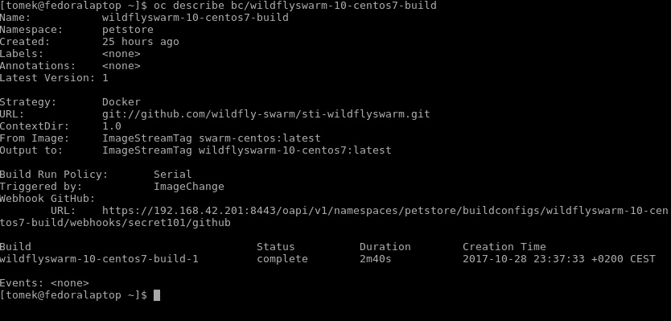

这是我们的构建器镜像的构建配置。我们现在可以检查 Web 控制台中的构建。我们将能够看到基于 `wildfyswarm-10-centos7` 配置的构建已经执行：

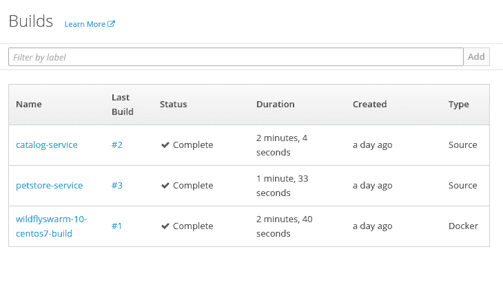

执行第一个命令后，构建器镜像被创建并存储在集群中。我们可以通过在 Web 控制台中导航到“构建 | 镜像”来确认这一点：

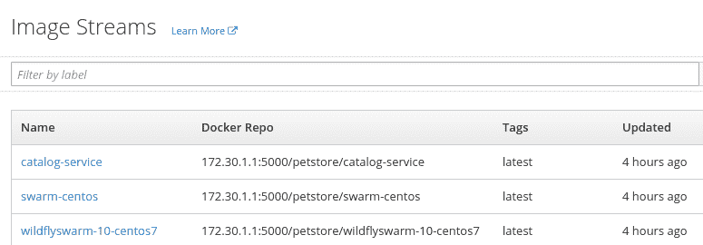

正如您在前面的屏幕截图中所注意到的，我们在集群中有一个新的镜像，wildflyswarm-10-centos7。在这里需要注意的一个重要事项是，这些镜像已被描述为 `ImageStreams`。这实际上意味着什么？`ImageStream`，正如其名称所暗示的，是一个表示相关对象流的对象。在我们的场景中，`ImageStream` 包含了构建器镜像构建的所有结果镜像。

我们为构建器镜像创建了 BuildConfig。此镜像的源可能会更改；如果发生这种情况，OpenShift 将创建此镜像的新版本并将其添加到 `ImageStream`。

流中的图片可以被标记，并且总是有最新的标记，它代表流中的最新图片。

现在我们来检查我们之前使用的 `new-app` 命令：

```java
oc new-app wildflyswarm-10-centos7~https://github.com/PacktPublishing/Hands-On-Cloud-Development-with-WildFly.git (...)
```

我们现在准备好解释 `new-app` 语法意味着什么。它由两部分组成，由波浪号分隔。第一部分是构建镜像流的名称。第二部分是应用程序将从中构建的 GitHub 仓库。

在我们知道源到镜像构建的内部原理之后，我们可以再次运行构建并检查构建日志。

首先，我们必须删除我们之前部署的 `pricing-service`：

```java
oc delete all -l app=pricing-service
```

之后，我们准备好执行 `new-app` 命令，并使用网页控制台来检查日志：

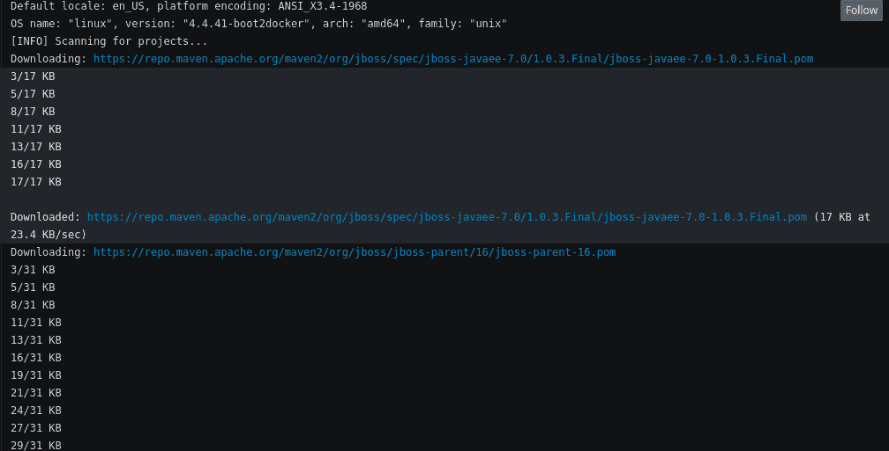

哎呀！我们必须下载所有依赖项。这个事实将导致构建需要花费大量时间：

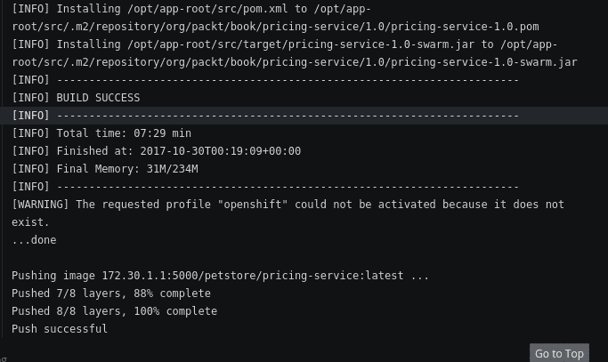

这只是一个第一次构建。那么，当我们第二次运行构建时会发生什么？

您可以使用网页控制台强制进行第二次构建，并检查日志以验证依赖项是否已重新下载。

这是一种严重的不便，因为它会导致构建类型的时间大大增加。我们能做些什么吗？是的，我们可以使用增量构建。

增量构建是源到镜像构建的一个特性，它从先前创建的镜像中提取构建艺术品，并使用它们来构建下一个镜像。

我们的构建镜像使用 Maven 插件来构建 Swarm 应用程序，因此正在下载的艺术品是 Maven 依赖 JAR。通常，不同的构建工具和不同类型的艺术品将使用。因此，特定的增量构建类型必须由镜像提供商实现。

在 Swarm 构建镜像的情况下，Maven 艺术品正从最后一个镜像中提取出来，并放置在新的 Maven 仓库中。因此，被多次使用的艺术品只需要下载一次。此外，为了减少下载 JAR 的时间，您可以使用 Maven 镜像。

好的。然而，我们如何开启增量构建？我们必须编辑我们的构建的 YAML 文件。

让我们使用网页控制台来做这件事。我们必须选择 `pricing-service` 构建，并导航到屏幕右上角的操作 | 编辑 YAML。YAML 必须按照以下方式编辑：

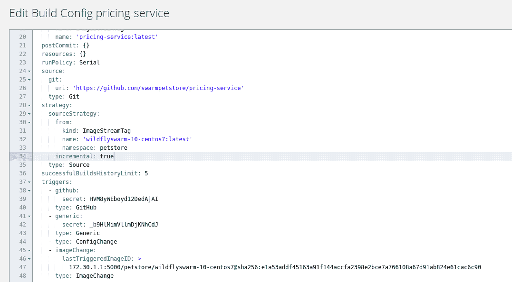

正如您在前面的屏幕截图中所注意到的，我们在构建配置的 `sourceStrategy` 部分添加了一个增量属性，并将其值设置为 `true`。让我们再次运行我们的构建，看看会发生什么。

在我们新的构建日志中，我们可以看到两条乐观的行：

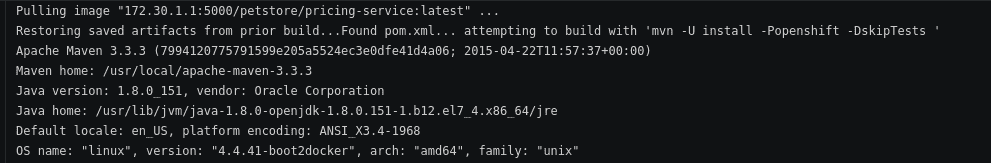

第一条乐观的行在开始处，Maven 通知我们艺术品正在被恢复，第二条在结尾：

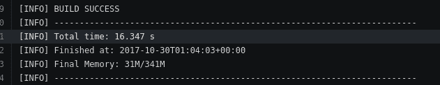

构建只用了`16.347`秒，并没有比独立的 Maven 构建长多少。

# 配置环境变量

当我们部署我们的服务时，我们为目录和`定价服务`提供了环境变量脚本，这些脚本需要与我们的数据库交互。处理这个配置文件也是源到镜像构建的责任。如果用户想要向构建提供环境属性，他们必须在服务的 GitHub 仓库根目录下创建一个`.s2i`目录，并创建一个包含键值对的列表的环境文件。

例如，让我们回顾一下`定价服务`的配置文件：

```java
POSTGRESQL_HOST=pricing-service.petstore.svc
POSTGRESQL_USER=pricing
POSTGRESQL_PASSWORD=pricing
POSTGRESQL_SCHEMA=pricingdb
```

在此文件中设置的属性将在镜像构建期间及其执行期间作为环境变量可用。

# 整个源到镜像算法

在详细介绍了源到镜像构建操作的具体内容后，让我们回顾一下 Swarm 的`s2i`构建步骤：

1.  执行构建的容器是由构建镜像创建的。

1.  应用程序的源代码将被注入到容器中。

1.  如果启用了增量构建，Maven 工件将从之前的构建镜像中恢复。

1.  如果提供了，环境变量将被设置。

1.  由镜像创建者提供的组装脚本被执行。

1.  镜像被提交，启动命令设置为镜像创建者提供的运行脚本。

想要使用源到镜像构建来构建他们的应用程序的开发者必须提供构建镜像的名称和应用程序的源代码。开发者可以启用增量构建并提供环境变量。

# 源到镜像概要

现在我们已经了解了源到镜像构建的内部工作原理，是时候从更广泛的角度来看待它了。

OpenShift 提供的源到镜像构建工具是另一个抽象化 Kubernetes 集群细节的工具，为开发者提供了一个简单的接口。开发者的角色是提供源代码和将要用于构建的镜像名称。创建镜像的责任在于组装将在集群上部署的 Docker 镜像。

再次强调，这导致了关注点的分离——构建镜像提供者负责以最佳方式组装源代码，而这些优化的细节不需要开发者知道。

由构建架构产生的构建的性能影响如下。执行构建和创建可运行容器所需的库位于创建一次（并且后来只在集群内更新）的构建镜像中。在构建过程中下载的工件如果启用了增量构建，可以从之前的构建中恢复。因此，应用程序的依赖项只需下载一次，以后可以重复使用。这导致构建时间非常快。正如你可能记得的那样，我们的定价服务的构建只花了大约 16 秒，这比现代工作站上的独立 Maven 构建只多了几秒钟。

此外，Docker 使用的恒定好处之一——可重复性，也适用于构建镜像。所有构建都是使用完全相同的镜像进行的。因此，可以保证构建结果在所有环境中都是相同的。

此外，由于构建镜像只是标准的 Docker 容器，并且明确的构建者合约允许工具创建者轻松编写构建镜像，因此有各种各样的 Docker 构建镜像可供使用。作为开发者，你已经可以访问到大量针对各种开发工具的专用构建镜像。

最后，源到镜像构建工具是代表 OpenShift 哲学核心的工具。它提供了一个简单的开发者界面，该界面抽象了集群内部结构，并且底层实现了优化的构建过程。

# 开发者视图

到目前为止，我们已经详细解释了源到镜像构建是如何根据你的代码构建镜像的。新应用命令不仅仅创建构建。正如你记得的那样，执行后，我们能够测试运行中的应用。显然，构建和镜像并不是命令的唯一产品。

除了`BuildConfiguration`之外，新应用命令还会创建`DeploymentConfiguration`（我们在第六章中描述过，*使用 OpenShift 在云上部署应用程序*）以及为我们应用创建的`ImageStream`。

让我们看一下以下图中创建的对象：

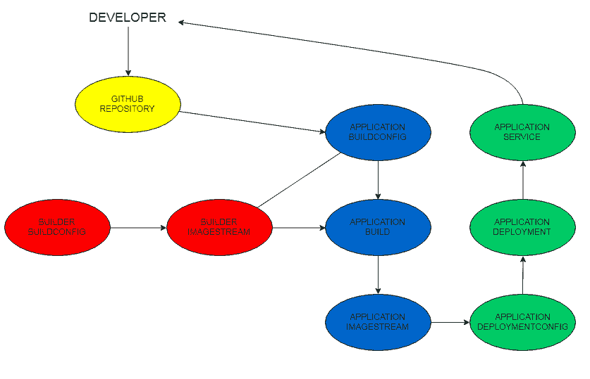

在前面的图中，与构建镜像相关的对象被涂成红色，与构建相关的对象被涂成蓝色，与部署相关的对象被涂成绿色。构建是由开发者通过将更改推送到 GitHub 触发的。它导致构建对象的创建。如果构建成功，镜像将被推送到镜像流。这进一步触发了应用的部署，如果部署成功，将导致应用服务的创建。

需要注意的重要一点是，在最简单的场景中，开发者可能只需负责将更改推送到仓库——换句话说，编程及其更改将被传播到集群中。

这听起来不错，但在某些场景中，我们希望得到更多：一个包含集成测试、检查已部署的应用程序或在不同环境中预演更改的完整 CD `管道`。正如我们之前暗示的，我们可以将 OpenShift 集群与 Jenkins 集成，以充分利用其全部功能来为我们服务的实现 CD `管道`。让我们学习如何做到这一点。

# 管道构建

在第一章中，当我们解释为什么你可能会考虑在你的应用程序中实施微服务架构时，我们提到了当前应用程序开发人员和架构师面临的一些挑战。

可能使我们能够以使我们能够应对那些挑战的方式提供软件的关键工具之一是自动化。正如我们在上一章中提到的，OpenShift 使我们能够自动化基础设施的提供。然而，我们需要的不仅仅是这些。

我们还希望自动化将软件部署到生产环境的过程。理想情况下，我们希望拥有能够使我们立即发布软件的工具。OpenShift 以构建`管道`的形式提供了这样的工具。让我们介绍这个概念背后的原理。

让我们从持续集成（CI）开始。

# 持续集成

作为一名开发者，你对项目的开发过程了如指掌。有许多开发者正在处理不同的功能，并将它们贡献给同一个仓库。所有开发者的贡献都必须集成到代码仓库中，以便创建稳定的代码。之后，代码可以发布到生产环境。

这听起来很简单，但如果你不创建一个执行此过程的有序顺序，你很快就会陷入混乱。如果开发者很少集成，他们就是在自找麻烦。他们的仓库将高度分歧，应用程序的功能将在他们的仓库之间分散。结果，在开发过程中，将没有*当前状态*的源仓库，我们将没有关于应用程序状态的信息。应用程序的新版本将在人们决定将他们的贡献推送到主代码（这可能会发生在发布的前一天）时出现。此时，集成过程将是痛苦的，不兼容的贡献将被发现，错误将出现。这种情况在过去被描述为*集成地狱*。

由于前面提到的问题，很明显，频繁地集成代码是一个好主意。提倡这种行为并，更重要的是，提供如何操作的提示的方法论被称为持续集成（CI）。

显然，频繁地将代码推送到仓库并不能给我们带来太多帮助。在每次提交时，我们需要确保当前版本的代码至少能够编译，并且通过单元和集成测试。这绝对不是一个详尽的列表：为了正确声明你的代码，你可能还需要自动代码检查或代码审查等。

为了使此过程能够持续执行，它必须自动化，并在用户想要对代码进行更改时执行。此外，开发者应频繁地集成他们的代码，在每个逻辑功能开发完成后，应尽快修复出现的任何错误。

如果遵循此程序，这将带来许多好处：

+   问题能够迅速被发现。因此，它们的源头可以迅速调试和修复。

+   当前应用程序的版本始终存在——它是最后一次成功构建的结果。在每一个点上，我们都可以了解应用程序的状态、其工作原理以及目前实现了哪些功能。

+   自动化过程作为质量控制的一个触发器。构建保证能够运行并且可重复。

# 持续部署

持续集成确保源代码的持续构建。它要求经常推送修复，并为开发者提供即时反馈。如果我们扩展这个概念，并配置我们的构建基础设施，以确保我们的服务将自动构建和部署，会怎样呢？

这种方法，作为持续集成的扩展，被称为持续部署。为了实施它，我们还需要自动化发布过程。这意味着我们必须保留所有需要发布软件到指定环境的资源，例如环境属性或配置脚本。

作为回报，我们将能够获得可靠且可重复的发布。首先，由于发布过程不再是手动的，发布过程中的所有魔法都被移除了。发布是通过使用环境属性（这些属性是版本化构建配置的一部分）的发布脚本来执行的。这些文件是关于构建过程的一个单一真相来源。因此，如果在构建过程中发生错误，这些脚本必须被修复。没有地方可以进行手动修补或临时修复。此外，构建经常发生，因此配置错误将有机会发生并被修复。另一方面，一旦构建和发布开始正常工作，每个后续的正确构建都会增加对发布过程的信心。因此，发布成为一个经过充分测试和自动化的活动。

这种方法通过改变开发功能的速度来改变团队的工作方式。使用持续部署（CD），你不是将软件的大块内容一次性发布给客户。相反，小的功能经常发布，并且立即对客户可见。

这是因为许多原因的预期行为。首先，客户会希望尽可能快地响应客户需求。拥有使他们能够做到这一点的工具将是客户的一个很大的市场优势。然而，这不仅仅是这样：因为新功能经常发布，它们会立即对客户可见。因此，客户可以立即评估实际实施的功能。这就在开发者和客户之间创建了一个有效的反馈循环，使他们能够更快地达到客户实际期望的功能。

# 部署管道

自动交付的过程是通过一个`pipeline`实现的。`pipeline`是一系列步骤，它以源代码作为输入，并在其输出上提供一个可工作的应用程序。

`pipeline`的目标是确保源代码准备好在生产环境中部署。因此，`pipeline`应该能够尽快捕获错误，并立即向开发者提供反馈。

此外，因为最终产品是发布的应用程序，`pipeline`应该自动化发布过程，以便它在所有环境中运行相同。

虽然`pipeline`是一个可配置的脚本，其直接操作取决于你的具体环境，但在部署`pipeline`中执行了许多常见的步骤：提交、构建、自动测试、手动测试、发布等。

# 在 OpenShift 环境中配置持续部署

在快速回顾理论之后，现在让我们回到我们的集群，并为我们的应用程序配置 CD。

在本章的开头，我们描述了源到镜像的构建，我们在前面的章节中使用了它。我们还暗示了有一个`pipeline`构建可用。正如你现在可能已经猜到的，这是我们用来实现服务 CD 的构建类型。

`pipeline`构建使用 Jenkins 服务器来配置`pipeline`配置。在继续之前，让我们快速介绍一下它。

# 介绍 Jenkins

Jenkins 是一个开源的软件自动化服务器。它允许创建`pipeline`并提供相关的语法。那么，我们如何在 OpenShift 集群中使用 Jenkins 并配置`pipeline`执行呢？让我们来看看。

# 我们的第一个`pipeline`

让我们从创建我们的第一个`pipeline`开始。我们必须登录到我们的网页控制台，并导航到“添加到项目”|“导入 YAML”。

为了做到这一点，我们必须进入网页控制台的主网页，并导航到“添加到项目”|“导入 YAML/Json”，并在那里输入以下脚本：

```java
apiVersion: v1
kind: BuildConfig
metadata:
  name: pricing-service-pipeline
  labels:
    name: pricing-service-pipeline
spec:
  runPolicy: Serial
  strategy:
    type: JenkinsPipeline
    jenkinsPipelineStrategy:
      jenkinsfile:"pipeline { \n agent any\n stages {\n stage('Build') {\n steps {\n echo 'Pipeline is running'\n }\n }\n }\n }\n"
```

在脚本创建后，我们可以点击创建按钮：

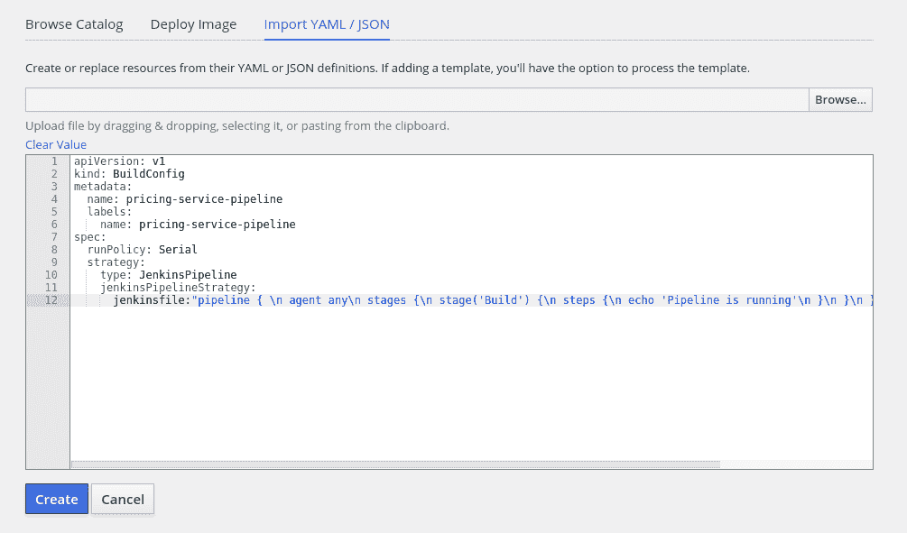

在我们进一步查看`pipeline`代码之前，让我们注意正在发生的事情。如果我们到达网页控制台的主视图，我们会注意到有一个新的资源：

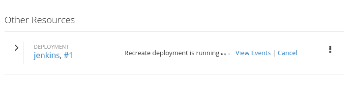

让我们看看当前可用的 Pods：

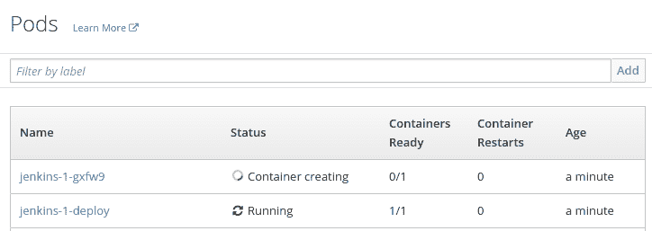

的确，有一个新的 Jenkins 服务器正在运行部署，并且 Jenkins 服务器的容器正在创建中。OpenShift 使用 Jenkins 服务器运行 `pipeline` 构建。因此，每次你创建一个 `pipeline` 时，OpenShift 都必须检查集群中是否存在 Jenkins 服务器。如果没有，OpenShift 将自动启动一个。

Jenkins 服务器创建需要一些时间，所以我们必须等待它被部署。在我们能够在 Pods 视图中看到应用程序正在运行后，我们就准备好开始构建我们的第一个 `pipeline`。

为了做到这一点，让我们导航到“构建 | Pipelines”。你将能够看到有一个新的 `pipeline` 存在：

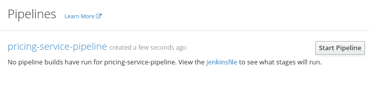

让我们点击“开始 Pipeline”按钮，看看会发生什么：

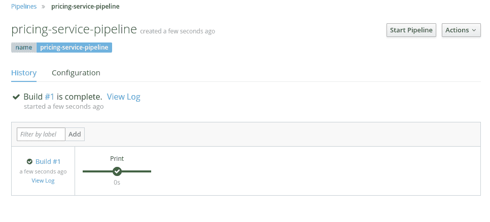

注意在先前的截图中的构建已经运行。带有勾选标记的点表示一个阶段已经运行并且成功。我们将在稍后讨论 Jenkins `pipeline` 结构。现在，让我们通过点击“查看日志”按钮来查看更多关于当前构建的信息：

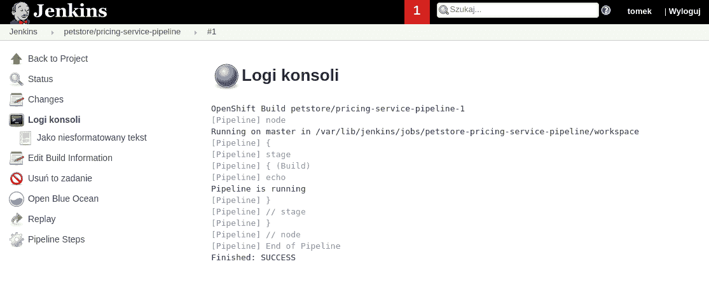

正如你在前面的截图中所注意到的，我们已经被重定向到 Jenkins 控制台。构建已经创建，打印阶段已经执行，我们回显的打印消息确实已经写入日志。

如你所见，`pipeline` 构建配置已经自动转换为 Jenkins 构建，并在 Jenkins 控制台中运行。当我们点击屏幕左上角的 petstore/pricing-service-pipeline 时，我们将获得更多关于构建的信息：

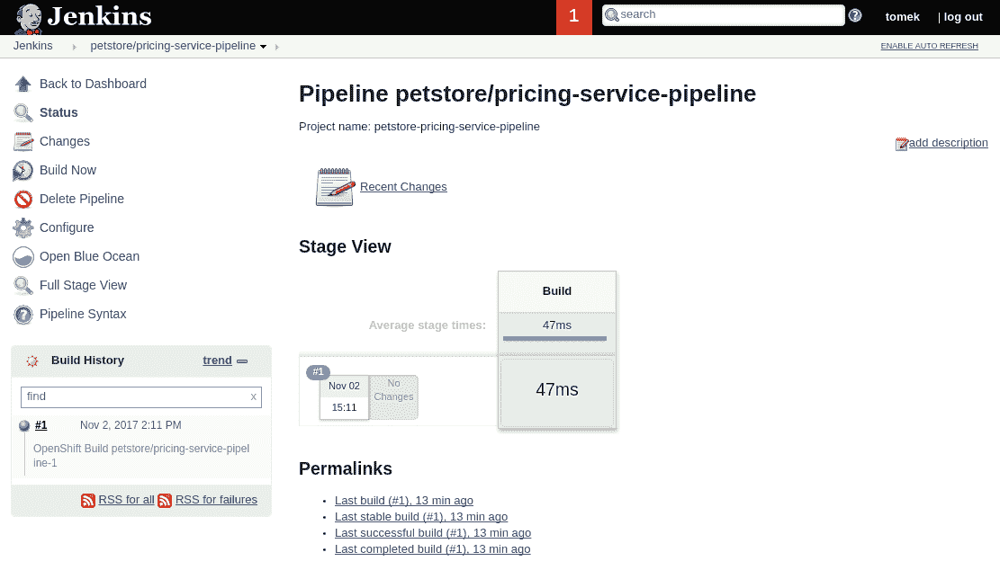

在这个窗口中，我们可以追踪构建历史，查看最新执行的日志和时间，或者编辑 `pipeline` 等。在这个时候，再次查看我们为创建 `pipeline` 编写的脚本是个好主意。你可能立刻就注意到 Jenkins `pipeline` 被压缩成一行，这使得阅读和编辑变得困难。在我们采取任何其他步骤之前，让我们找到一种人工的方式来编辑我们的 `pipeline`。

为了做到这一点，让我们点击左侧菜单上的“配置”按钮并向下滚动：

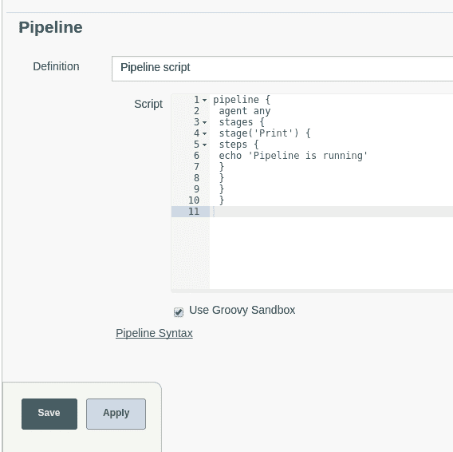

我们在这里有一个很好的 `pipeline` 编辑器。让我们对文件进行第一次编辑：

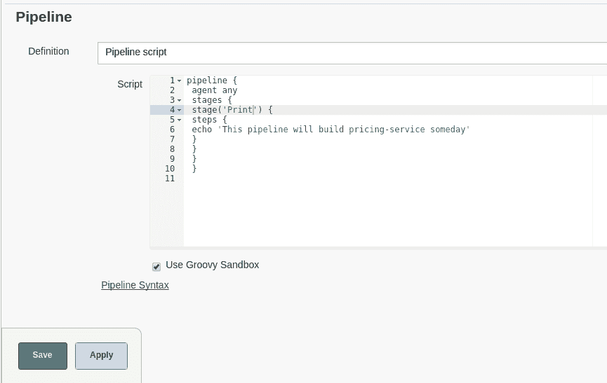

然后，我们将对其进行测试以检查它是否工作。为了做到这一点，我们必须保存 `pipeline` 并在构建视图中点击“立即构建”按钮。之后，我们就可以通过点击刚刚执行的第二次构建来检查日志。

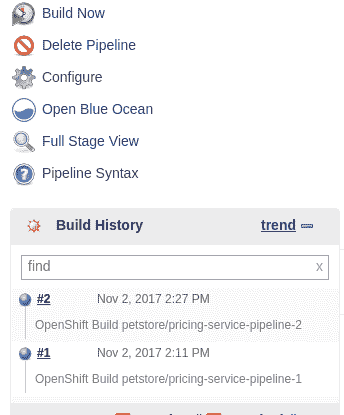

我们将看到新的日志如下：

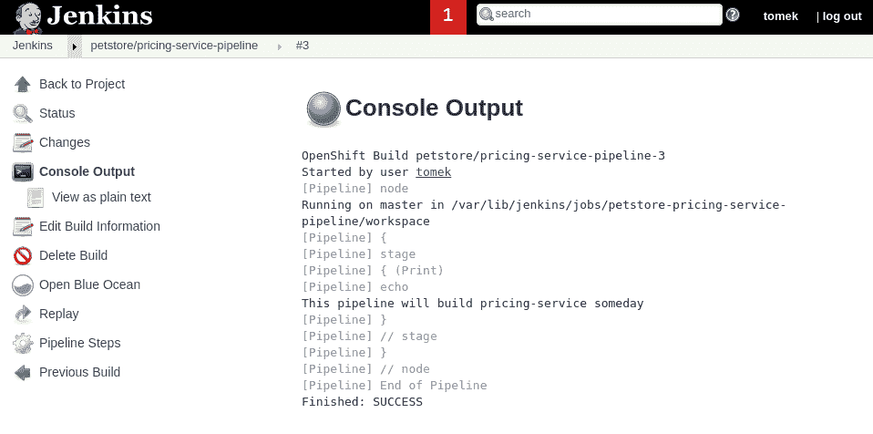

此外，让我们再次登录到 Web 控制台，并检查那里的`pipeline`：

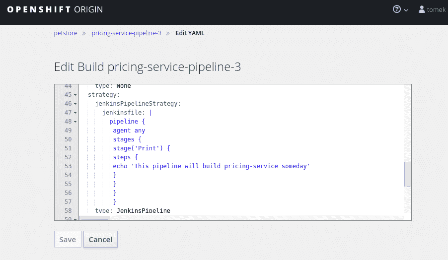

正如你所注意到的，`pipeline`构建配置已经根据我们在 Jenkins 中做出的更改进行了相应的修改。我们将使用 Jenkins 服务器执行未来的更改。

我们在构建中打印的新消息承诺，我们的构建将在某个时候做一些有用的事情。毕竟，我们想要为我们的服务创建一个 CD `pipeline`，而不是打印消息。不过，在我们能够做到这一点之前，我们还需要学习一些其他的东西。一开始，我们需要说更多关于我们用来定义`pipeline`的语言的话。

# Pipeline 语法语言

当我们编写第一个`pipeline`时，我们使用了 Jenkins 声明式 pipeline 语言。我们将在下一节中描述**声明式 Pipeline 语言**（**DPL**）的要点。

# 核心 pipeline 元素

为了做到这一点，让我们回到上一节中执行过的`pipeline`：

```java
//1
pipeline {
    //2
    agent any
    //3
    stages {
        //4
        stage('Print') {
            steps {
                echo 'This pipeline will build pricing-service one day'
            }
        }
    }
}
```

DPL 中的每个`pipeline`都必须用`pipeline`块（1）包围。

`pipeline`必须以`agent`指令（2）开始。这个指令指定了可以执行构建阶段（稍后会详细介绍）的 Jenkins 构建机器。这个设置可以在每个阶段中覆盖。在我们的例子中，我们将为所有阶段使用任何代理。

核心 pipeline 构建块是阶段。阶段旨在映射到 CD `pipeline`中的阶段。它们按顺序定义，并且每个阶段只能在之前的阶段成功后才能执行。

阶段必须用`stages`（3）块包围。每个阶段（至少需要有一个）都有自己的`stage`块，其名称作为参数指定。

每个阶段块可以包含一系列指令，后面跟着步骤块，该步骤块包围一个或多个将在`pipeline`中执行的步骤。

现在，我们来到了关键点。我们可以执行哪些可用的步骤？Jenkins 提供了由不同插件提供的非常多的不同步骤。我们将专注于一个特定的插件，该插件使得在 OpenShift 集群上开发和执行操作变得容易——让我们讨论 OpenShift，`pipeline` Jenkins 插件（进一步阅读，链接 1）。

# 标准 Maven 操作

我们将要实现的第一阶段是单元测试阶段。一开始，我们将像在第五章中那样，以相同的方式添加一个简单的单元测试，*使用 Arquillian 测试你的服务*。我们必须扩展`pom.xml`：

```java

(...)

    <dependencies>
        (...)
        <dependency>
            <groupId>org.postgresql</groupId>
            <artifactId>postgresql</artifactId>
            <version>${version.postgresql}</version>
        </dependency>

 //1
 <dependency>
            <groupId>junit</groupId>
            <artifactId>junit</artifactId>
            <version>${version.junit}</version>
            <scope>test</scope> </dependency>

 //2
 <dependency>
            <groupId>org.jboss.arquillian.junit</groupId>
            <artifactId>arquillian-junit-container</artifactId>
            <scope>test</scope> </dependency>

 //3
 <dependency>
            <groupId>org.wildfly.swarm</groupId>
            <artifactId>arquillian</artifactId>
            <version>${version.wildfly.swarm}</version>
            <scope>test</scope> </dependency>

 //4
 <dependency>
            <groupId>com.h2database</groupId>
            <artifactId>h2</artifactId>
            <version>${version.h2}</version>
            <scope>test</scope> </dependency>

    </dependencies>

    (...)

</project>

```

回想一下，我们必须为 JUnit（1）、Arquillian（2）、Swarm 的 Arquillian 适配器（3）以及我们将使用的内存数据库添加依赖项（4）。

其次，我们必须提供测试资源，即`persistence.xml`：

```java
<?xml version="1.0" encoding="UTF-8"?>
<persistence
        xmlns:xsi="http://www.w3.org/2001/XMLSchema-instance"
        version="2.1"
        xmlns="http://xmlns.jcp.org/xml/ns/persistence"
        xsi:schemaLocation="http://xmlns.jcp.org/xml/ns/persistence http://xmlns.jcp.org/xml/ns/persistence/persistence_2_1.xsd">
    <!-- 1 -->
    <persistence-unit name="PricingPU" transaction-type="JTA">
        <!-- 2 -->
        <jta-data-source>java:jboss/datasources/PricingDS</jta-data-source>
        <properties>
            <!-- 3 -->
            <property name="javax.persistence.schema-generation.database.action" value="drop-and-create"/>
            <property name="javax.persistence.schema-generation.create-source" value="metadata"/>
            <property name="javax.persistence.schema-generation.drop-source" value="metadata"/>

            <property name="javax.persistence.sql-load-script-source" value="META-INF/load.sql"/>
        </properties>
    </persistence-unit>
</persistence>
```

以及我们将用来测试数据库的加载脚本：

```java
DROP TABLE IF EXISTS PRICE;

CREATE TABLE PRICE (id serial PRIMARY KEY, name varchar, price smallint);

INSERT INTO PRICE(name, price) VALUES ('test-pet', 5);
```

确保我们也添加了`h2`驱动模块：

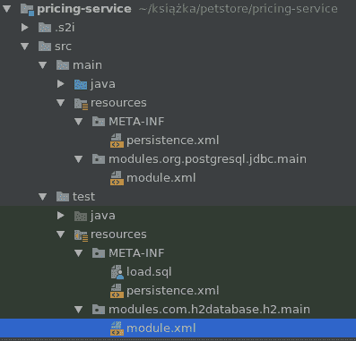

我们现在准备好编写测试了：

```java
package org.packt.swarm.petstore.pricing;

import org.jboss.arquillian.container.test.api.Deployment;
import org.jboss.arquillian.junit.Arquillian;
import org.jboss.shrinkwrap.api.ShrinkWrap;
import org.jboss.shrinkwrap.api.asset.EmptyAsset;
import org.jboss.shrinkwrap.api.spec.JavaArchive;
import org.junit.Assert;
import org.junit.Test;
import org.junit.runner.RunWith;
import org.wildfly.swarm.Swarm;
import org.wildfly.swarm.arquillian.CreateSwarm;
import org.wildfly.swarm.datasources.DatasourcesFraction;
import org.wildfly.swarm.jaxrs.JAXRSArchive;
import org.wildfly.swarm.spi.api.Module;

import javax.inject.Inject;

//1
@RunWith(Arquillian.class)
public class PricingServiceTest {

    //2
    @Deployment
    public static JavaArchive createDeployment() {
        return ShrinkWrap.create(JavaArchive.class)
                .addClasses(Price.class, PricingService.class)
                .addAsResource("META-INF/persistence.xml")
                .addAsResource("META-INF/load.sql")
                .addAsManifestResource(EmptyAsset.INSTANCE, "beans.xml");
    }

    //2
    @CreateSwarm
    public static Swarm createSwarm() throws Exception {
        DatasourcesFraction datasourcesFraction = new DatasourcesFraction()
                //3
                .jdbcDriver("h2", (d) -> {
                    d.driverClassName("org.h2.Driver");
                    d.xaDatasourceClass("org.h2.jdbcx.JdbcDataSource");
                    d.driverModuleName("com.h2database.h2");
                })
                .dataSource("PricingDS", (ds) -> {
                    ds.driverName("h2");
                    ds.connectionUrl("jdbc:h2:mem:test;DB_CLOSE_DELAY=-1;DB_CLOSE_ON_EXIT=FALSE");
                    ds.userName("sa");
                    ds.password("sa");
                });

        Swarm swarm = new Swarm();
        swarm.fraction(datasourcesFraction);

        return swarm;
    }

    //3
    @Inject
    PricingService pricingService;

    //4
    @Test
    public void testSearchById() {
       Assert.assertEquals(pricingService.findByName("test-pet").getPrice(),5);
    }
}
```

现在，我们终于准备好编写测试阶段了。我们希望这个阶段运行得快，如果出现问题，立即失败，而不创建镜像或更改我们的 OpenShift 模型中的任何内容。为此，我们将使用命令行中的标准 Maven 和 git。

为了做到这一点，我们需要配置这些工具。为此，我们必须转到 Jenkins 主菜单中的 Jenkins 配置，点击管理 Jenkins 并选择 JDK 的工具配置：

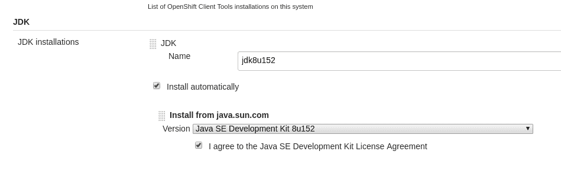

以及 Maven：

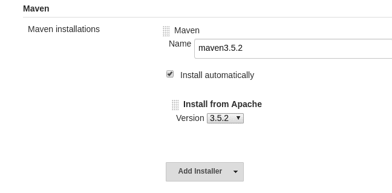

我们最终准备好更新我们的`pipeline`了。让我们看看：

```java
pipeline { 
//1
 agent any
//2 
tools {
    maven 'maven3.5.2'
    jdk 'jdk8u152'
    git 'Default'
 }
 stages {
//3
 stage('Unit tests') {
     steps {
      //4
      git url: 'https://github.com/PacktPublishing/Hands-On-Cloud-Development-with-WildFly.git'
 //5
 sh 'mvn clean test -Dswarm.build.modules=target/test-classes/modules'
 }
 }
}
```

我们已经为强制代理提供了任何（1）并配置了 Maven、JDK 和 git 工具，为它们都提供了版本。我们将我们的打印阶段替换为单元测试阶段（3），该阶段包括以下两个步骤：

1.  第一步克隆了`pricing-service`的 git 仓库（4）

1.  第二步运行 Maven 测试（5）

为了使测试能够工作，我们必须提供模块目录。

好的。所以，我们有了第一个阶段。接下来是什么？如果单元测试通过，我们希望构建并部署一个包含我们应用程序的镜像。为了做到这一点，我们必须在`pipeline`内部与我们的集群对象交互。将帮助我们轻松完成这项工作的工具是 OpenShift Pipeline Plugin。让我们更多地了解它。

# OpenShift Pipeline Plugin

Jenkins 具有可插拔的架构，这允许插件开发。OpenShift 提供了它自己的插件，它允许以声明式方式直接在 OpenShift 集群对象上执行操作。该插件提供了一系列命令。我们将在`pipeline`开发过程中逐一介绍它们。

在开始时，我们将编写一个构建阶段，该阶段将组装镜像并确保应用程序能够正确运行。

我们将要使用的第一个命令是`openShiftBuild`命令。它允许运行 OpenShift 集群中定义的构建之一。这个命令接受一个强制参数`buildCfg`，它是将要执行的构建的名称。

我们将要使用的第二个命令是`Build`。这个命令也接受`buildCfg`参数，并检查这种类型的最后构建是否在合理的时间内成功完成。为了设置这个周期，我们将使用`waitTime`参数。

让我们看看我们的新`pipeline`：

```java
pipeline { 
 agent any
 tools {
    maven 'maven3.5.2'
    jdk 'jdk8u152'
    git 'Default'
 }
 stages {
 stage('Test') {
     steps {
      git url: 'https://github.com/PacktPublishing/Hands-On-Cloud-Development-with-WildFly.git'
      sh 'mvn clean install -Dswarm.build.modules=target/test-classes/modules'
     }
    }
 //1
 stage('Build') {
     steps {
        //2
        openshiftBuild(bldCfg: 'pricing-service', showBuildLogs: 'true')
        //3
        openshiftVerifyBuild(bldCfg: 'pricing-service', waitTime: '300000')
    }
 }
 }
}
```

正如前一段所述，我们已经介绍了`Build`阶段（1），并向其中添加了两个步骤。`Build`命令运行我们在本章开头配置的`pricing-service` `s2i`构建（2）。验证命令检查构建是否在 5 分钟内成功执行。

我们希望在这里只构建镜像，而不部署它。因此，我们需要修改我们的构建并移除镜像更改作为部署的触发器。

之后，我们就准备好在 Jenkins 中开始我们的 `Build` 操作。如果你这样做并点击控制台输出，你将能够看到执行日志。让我们来看看：

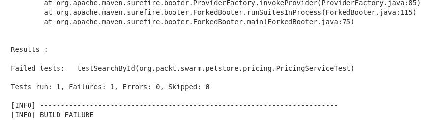

哎呀！如果你再次查看测试，你会注意到有一个错误，因为测试宠物价格是 5 而不是 7。在我们修复它之前，让我们记一下 `pipeline` 的工作方式。我们的第一个单元测试阶段立即失败。结果，没有启动其他阶段。没有构建镜像，也没有部署应用程序。让我们也看看网页控制台上的 `pipeline` 视图：

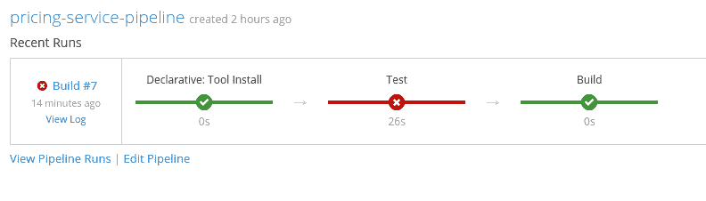

控制台以图形方式呈现 `pipeline` 执行情况，显示测试阶段失败。让我们修复我们的测试并再次运行应用程序。如果你这样做并查看控制台日志，你将能够看到测试已经通过，并且 `Build` 阶段已经执行：

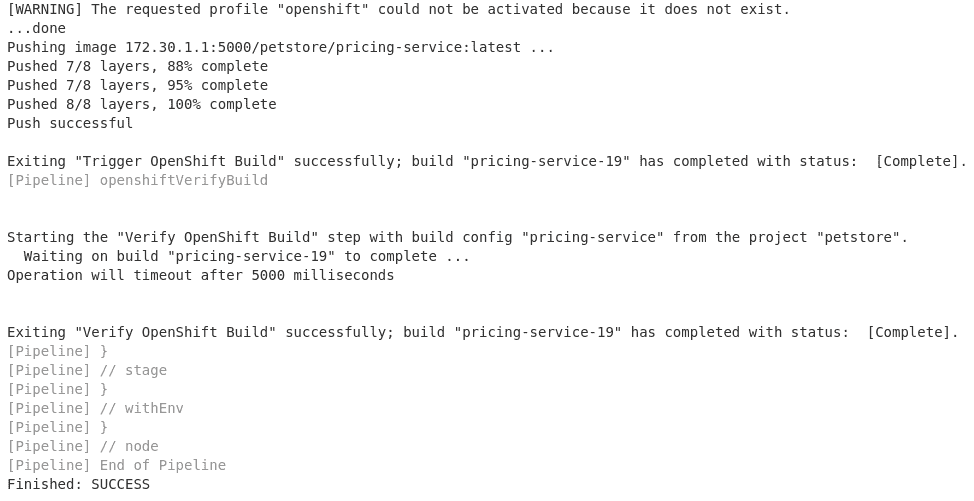

当你查看网页控制台时，你将能够看到 `Build` 已经完成，并且镜像已经创建：

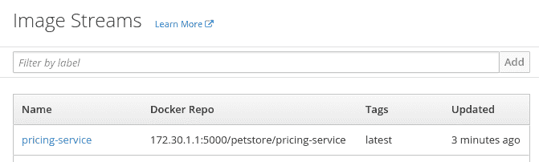

让我们看看当前可用的部署：

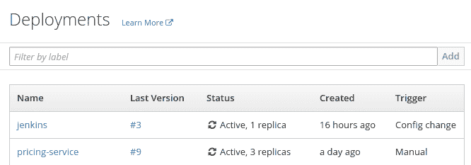

现在，我们只有构建镜像，还没有触发部署。让我们在我们的构建中添加另一个阶段。我们将使用 `openshiftDeploy`、`openshiftScale`、`openShiftVerifyDeployment` 和 `openShiftVerifyService`。在这样做之前，让我们介绍这些命令中的每一个。

`openshiftDeploy` 命令需要一个强制参数——`dplCfg`——这是部署的名称。它运行应用程序的部署。

`openshiftScale`，无论是否有强制 `dplCfg` 参数，都会使用 `replicaCount` 参数，该参数指定应用程序的副本数量。由于我们使用此命令来扩展应用程序，我们将更改 `deploymentConfig` 中的实例部署数量为零。结果，只有在 `openshiftScale` 操作执行后，pods 才会启动，而无需不必要的缩放。

`openShiftVerifyDeployment` 与前两个命令具有相同的强制参数——`dplCfg`。此命令有三个可选参数，我们将使用所有这些参数：

+   `replicaCount`: 此参数指定期望的副本数量

+   `verifyReplicaCount`: 这是一个布尔参数，指定是否应该检查副本数量

+   `waitTime`: 这表示我们应该等待验证的时间，以毫秒为单位

+   `openshiftVerifyService`: 此命令检查服务是否可用

`openshiftVerifyService` 有一个强制参数：

+   `svcName`

+   一个可选参数`retryCount`指定在声明验证无效之前尝试连接的次数

在向您展示新脚本之前，我们将介绍一个额外的概念。正如我们在本章的理论部分所提到的，构建应该立即向其作者提供关于其状态的反馈。为了响应`构建`状态，DPL 提供了在`管道`完成后根据构建状态执行操作的能力。允许这样做的是后指令。

后指令使我们能够在构建完成后执行操作。它可以放置在`管道`的末尾或每个阶段的末尾。后指令提供了一组子目录：always、success、failure、unstable（如果构建不稳定，则运行——结果在构建过程中发生变化）、aborted 和 changed。

在我们的脚本中，为了简化，我们将构建状态输出到控制台，但我们可以使用可用的 Jenkins 插件来配置电子邮件、HipChat 或 Slack 通知。

让我们来看看构建：

```java
pipeline { 
 agent any
 tools {
    maven 'maven3.5.2'
    jdk 'jdk8u152'
    git 'Default'
 }
 stages {
 stage('Test') {
     steps {
      git url: 'https://github.com/PacktPublishing/Hands-On-Cloud-Development-with-WildFly.git'
      sh 'mvn clean install -Dswarm.build.modules=target/test-classes/modules'
     }
    }
 stage('Build') {
     steps {
        openshiftBuild(bldCfg: 'pricing-service', showBuildLogs: 'true')
        openshiftVerifyBuild(bldCfg: 'pricing-service', waitTime: '300000')
    }
    }
//1
 stage('Deploy'){
     steps {
         //2
         openshiftDeploy(depCfg: 'pricing-service')
         //3
         openshiftScale(depCfg: 'pricing-service',replicaCount:'3')
         //4
         openshiftVerifyDeployment(depCfg: 'pricing-service',verifyReplicaCount:'true',replicaCount:'3', waitTime: '300000')
         //5
         openshiftVerifyService(svcName: 'pricing-service')
     }
 }
 }
 post {
    //6
    success {
        echo "Job '${env.JOB_NAME} [${env.BUILD_NUMBER}]' result: SUCCESS"
    }
    //7
    failure {
        echo "Job '${env.JOB_NAME} [${env.BUILD_NUMBER}]' result: FAILURE"
    }
 }
}
```

我们已经按照之前描述的方式扩展了我们的`管道`：

1.  我们添加了`Deploy`阶段（1），用于部署应用程序（2）

1.  然后，它扩展了应用程序（3）

1.  它验证了部署是否成功（4）以及服务是否可用（5）

1.  在每次构建之后，测试的结果都会输出到输出中，具体取决于测试是否成功（6）或失败（7）

如果您查看控制台输出，您将能够看到我们已成功执行的所有步骤。

您也可以在 Web 控制台的`管道`视图中验证这一点：

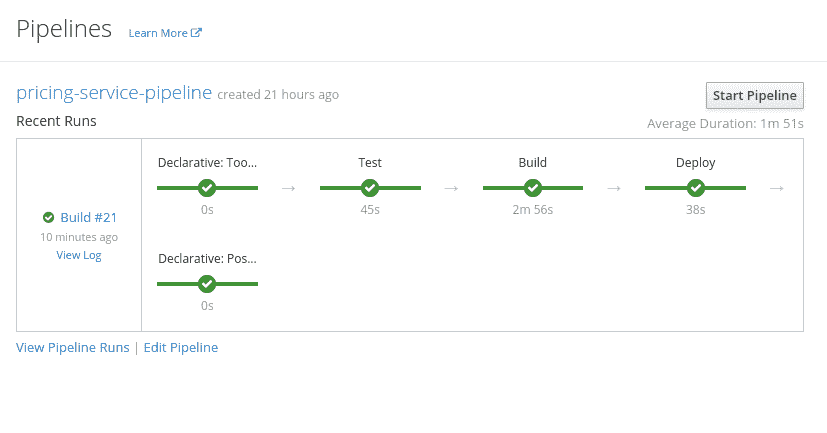

最后，您可以在 Web 控制台中验证服务确实已创建，并且相应的 Pod 正在运行。

# 摘要

在本章中，您学习了 OpenShift 提供的构建基础设施。然后您学习了如何使用源到镜像构建，它从开发者那里抽象出了 Kubernetes 内部细节，并让他们仅基于代码进行构建，配置最小化。

在本章的第二部分，您学习了`管道`构建，这实际上是一种将 Jenkins `管道`与 OpenShift 基础设施集成的方式。您还学习了如何创建`管道`构建以及 DPL 语法的基础知识。因此，您能够为您的 petstore 的`pricing-service`创建一个 CD `管道`。

# 进一步阅读

[`jenkins.io/doc/book/pipeline/syntax/`](https://jenkins.io/doc/book/pipeline/syntax/)
