# 第十章：使用 Keycloak 提供安全

在本章中，我们将学习基于令牌的分布式安全的基础知识。我们将介绍 Keycloak——一个可以用于保护分布式云应用程序的认证服务器。作为一个实际示例，我们将保护 Petstore 应用程序 API 的一部分。

# 基于令牌的安全

Keycloak 使用基于令牌的安全协议。为了理解它们是如何工作的，我们将介绍它们的基本信息。

# 理由

在使用客户端-服务器架构构建的应用程序中，服务器通常负责实现安全。客户端向服务器提供凭证，服务器负责验证和授权用户。

这种模型与需要在不同独立服务之间进行网络调用的分布式应用程序不太兼容。

首先，每个服务负责实现安全性的架构是不可扩展的。我们更愿意创建一个服务器，该服务器负责保存有关用户的数据并实现身份验证和授权。所有其他服务在需要做出任何安全决策时都必须依赖它。

这里是一个如何呈现的示例图：

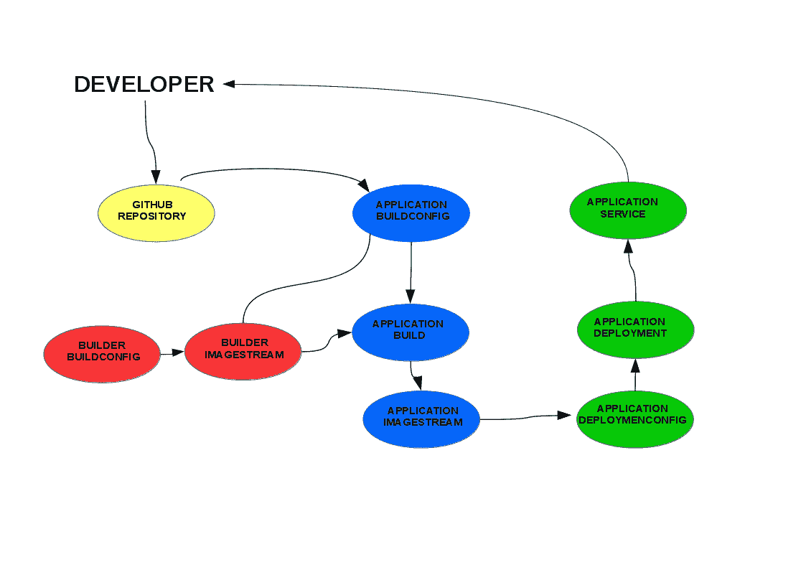

这种解决方案有一个基本的缺陷：凭证共享。

在云环境中，一个调用可能跨越多个异构服务，通常我们不能假设这些服务是可信赖的。如果至少有一个与用户共享了其凭证的客户端被破坏，那么所有系统都会被破坏。

然而，还有一个更微妙的问题。在先前的架构中，它无法区分用户发起的调用和代表用户发起的调用。例如，假设**SERVICE B**是一个磁盘存储服务，而**SERVICE A**需要代表用户从它那里获取文件。如果用户将他们的凭证传播到 A，那么 A 可以做用户能做的任何事情（例如，删除所有文件）。这显然是不希望的。

前述问题导致了基于安全令牌的协议的出现。现在让我们更详细地看看这些协议。

# 基本架构

让我们先介绍访问令牌的基本概念如下：

访问令牌是一个字符串，表示颁发给客户端的一组授权凭证。当客户端想要代表用户执行请求时，它需要获得这样做许可。令牌代表这样的许可。

访问令牌是为特定客户端创建的。因此，用户可以限制与访问令牌关联的权限，从而限制客户端。

访问令牌包含授权信息——基于访问令牌，服务可以决定执行调用的客户端是否被允许执行特定的操作。访问令牌不包含关于用户的信息，拥有访问令牌并不意味着请求是由用户执行的。

例如，使用访问令牌的分布式协议的典型流程如下：

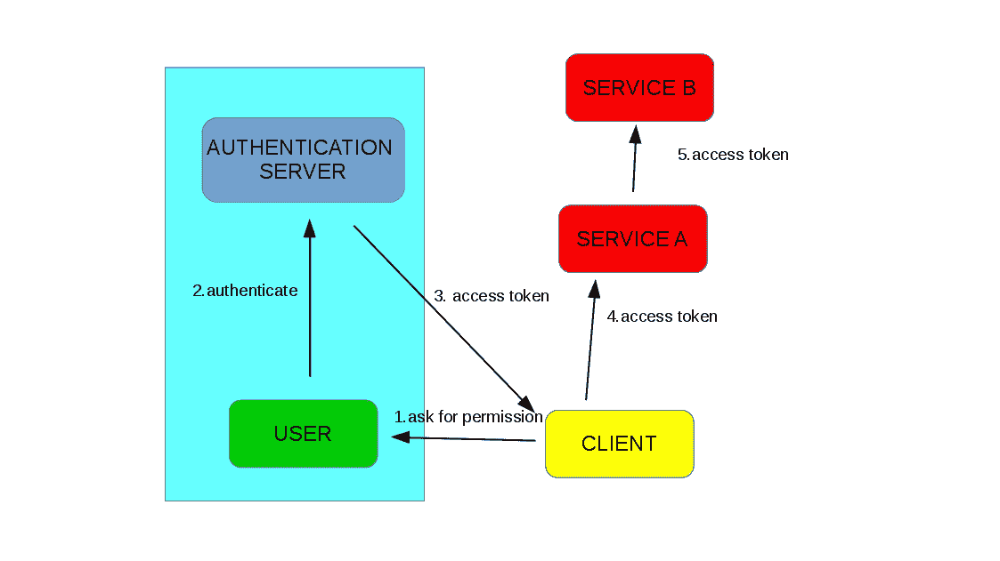

注意以下在先前的示例中的事项：

1.  客户端想要在**SERVICE A**上执行请求，但需要用户权限才能这样做。因此，它请求用户给予这种权限。

1.  如果用户同意，她将向身份验证服务器进行身份验证（2）。

1.  如果身份验证成功完成，服务器将生成一个**访问令牌**，并将其发送到客户端（3）。

1.  客户端可以使用此令牌代表用户访问**SERVICE A**（4）。

1.  此外，令牌可以被传播到其他服务（5）。

让我们强调这种架构最重要的特性：

授权（无论使用哪种方法）仅发生在用户和身份验证服务器之间。没有其他组件可以访问任何类型的用户凭证。因此，授权服务器是唯一需要完全信任的组件。

访问令牌代表代表用户执行某事的权限，并为单个客户端生成。因此，向特定客户端颁发的访问令牌可以包含一组最小的权限，允许它执行其工作。此外，如果令牌传播到受损的客户端或被盗，它造成的损害比仅泄露用户凭证要小得多。尽管如此，为了最小化这种情况的影响，访问令牌的颁发时间很短。因此，即使令牌被盗，它也只有在很短的时间内才能被使用（具体的协议可能定义客户端刷新访问令牌的方法）。

总结来说，基于令牌的安全协议允许实现去中心化的身份验证和授权：用户向受信任的身份验证服务器进行身份验证并获取可用于授权访问服务的令牌。这在云架构中特别有用：基于受信任的身份验证服务器生成的令牌，我们可以访问网络中分布的多个异构服务，并为他们提供代表我们执行操作的能力，确保与令牌关联的权限集对服务执行其工作来说是尽可能小的。

有许多协议标准化了这种类型的分布式安全。其中之一是**OpenID Connect**（**OIDC**），这是 Keycloak 默认使用的现代协议；我们将在示例中使用它。让我们更详细地看看它。

# OpenID Connect

OIDC 是建立在 **Oauth2** 协议之上的，这是一个开放标准，用于委托访问。Oauth2 直接指定了前面段落中概述的过程应该如何执行，哪些参与者将参与其中，以及他们应该如何以及按什么顺序合作以获取访问令牌并用于授权。问题是 Oauth2 只指定了这一点，为其实现留下了很大的空间。因此，它可以被认为是一个用于构建协议的框架，而不是一个协议本身。

OIDC 是一个使用此框架创建的协议。它填补了实现上的空白（例如令牌格式），并添加了 OAuth2 缺少的认证信息。OIDC 标准化了获取用户信息的方式。

协议的细节超出了本书的范围。如果您对此感兴趣，请参阅协议规范（进一步阅读，链接 1,2）。在本章中，我们将向您介绍您理解 Keycloak 配置以进行分布式安全基本使用所需的最少内容，我们将在以下示例中展示。

OIDC 指定了流的数量——详细描述获取和使用令牌的过程的程序。在下一节中，我们将查看认证码流程，这是 Keycloak 使用的默认流程。

# 认证码流程

在本节中，我们将描述认证码流程。这是一个精确的描述，正如您将看到的，它将直接影响认证服务器的配置。它假设客户端是一个运行在浏览器内的网络应用程序。因此，您应该字面地解释所使用的术语。例如，如果我们谈论客户端将用户重定向到认证服务器，我们字面意思是浏览器将 HTTP 重定向到认证服务器的地址。正如我们之前建议的，您将在本章的后面看到这些操作，当我们完成对宠物商店应用程序的安全保护时。

现在让我们看一下流程图：

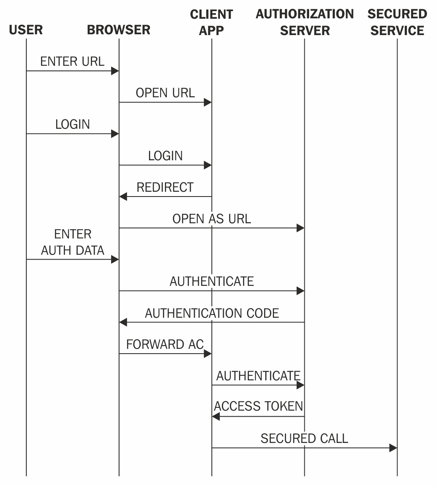

用户使用客户端，这是一个基于浏览器的应用程序。当用户在某个时刻执行登录操作时，他们会自动重定向到认证服务器。认证是在认证服务器和用户之间进行的。客户端与此无关：它的执行方式对它来说过于晦涩，客户端不会与用户提供的任何凭证进行交互，无论使用什么类型的认证方法。因此，凭证只提供给网络上的一个实体；如果它没有被破坏，那么它们也不会被破坏。

如果身份验证过程以成功结束，身份验证服务器将生成一个身份验证代码：一个非常短暂、一次性的代码，将用户重定向到客户端。客户端将使用代码和自己的凭据向身份验证服务器进行身份验证。如果客户端正确地进行了身份验证，身份验证服务器将生成一个访问令牌并将其返回给客户端。为什么这一步是必要的？正如我们在前面的部分中已经提到的，必须为资源所有者生成访问令牌，即客户端元组。用户和客户端都必须向身份验证服务器进行身份验证，以便生成令牌。身份验证服务器知道应该将哪些权限委派给客户端，并据此创建身份验证令牌。

除了访问令牌外，用户还获得一个 ID 令牌和可选的刷新令牌。

我们还提到，OIDC 也提供了有关身份验证的信息。这是真的。这些信息包含在 ID 令牌中。与可能对客户端不透明的访问令牌相比，ID 令牌包含提供给客户端的信息，并且不能用来访问资源。换句话说，ID 令牌是为客户端生成的令牌，允许他们读取有关用户的信息。我们将在我们的示例中使用这种功能。

我们还提到，一个协议可以指定刷新访问令牌的方式。OIDC 通过使用刷新令牌来实现这一点。刷新令牌允许客户端创建一个新的**访问令牌**，正如我们之前提到的，当旧的令牌过期时，新的令牌是短暂的。客户端可以使用刷新令牌来保持其授权在所需的时间内有效，而无需委派新的访问代码（使用户再次进行身份验证）。客户端应保持刷新令牌的机密性——即使访问令牌被泄露，也只能在短时间内使用，并且只有客户端才能获取新的令牌。

正如您将在 *WildFly Swarm Keycloak 适配器* 部分中看到的那样，我们将直接处理访问令牌（我们必须在我们的服务之间传播它们），但不会处理其他令牌，因为它们的函数被封装在 API 之后。让我们继续流程。

客户端获得访问令牌后，将其与请求一起发送到资源服务器。资源服务器必须验证令牌是否正确，提取其中的授权数据，并决定是否允许请求。

在示例应用程序中我们将使用的访问令牌是携带令牌。这意味着任何拥有这些令牌的实体都可以像使用它们一样使用它们。因此，这些令牌可以传播到我们应用程序中的所有微服务（我们很快就会利用这一点）。另一方面，这也意味着令牌的泄露是危险的，因此，携带令牌不能通过不受信任的网络发送（我们将在本章末尾讨论这一点）。

我们已经介绍了足够多的理论，并且，像往常一样，在艰难的技术介绍之后，我们将转向实践部分：一个充满牛奶和蜂蜜的地方，那里的工具为我们做所有事情。让我们立刻跳进去！

# 介绍 Keycloak

为了确保我们的 Petstore 应用程序的安全，我们将使用 Keycloak。Keycloak 是一个开源的、**单点登录**（**SSO**）身份管理服务器，它支持基于 OIDC 的安全，以及其他功能。

Keycloak 配备了一个方便的、基于网页的用户界面，它使我们能够使用图形界面配置其行为的各个方面。此外，我们将编写的服务也必须与 Keycloak 集成。为了使这种集成变得简单，Keycloak 提供了一组适配器，这些适配器是可以安装到任何给定类型服务中的组件。在下面的示例中，我们将讨论如何使用这两个工具。

在我们开始之前，让我们概述我们将添加到宠物商店应用程序中的功能。

# 购物车服务

到目前为止，我们实现的所有服务都可以被匿名用户访问。在本章中，我们将实现购物车功能。显然，为了向购物车添加东西，你必须在该应用程序中进行身份验证：


我们将在我们的 OpenShift 集群中部署 Keycloak 服务，并配置客户网关和 **购物车服务**，以便它们只允许可以授权为客户的用户使用该 API 的这部分。让我们开始吧。

# 安装 Keycloak

为了使用 Keycloak，我们必须首先安装它。Keycloak 主要是基于 WildFly AS 的 Java 应用程序。为了云的使用，提供了一个 OpenShift Docker 镜像：

```java
jboss/keycloak-openshift 
```

服务器已经配置好了，可以直接部署到 OpenShift 集群。让我们使用 OpenShift 网络控制台来部署它：

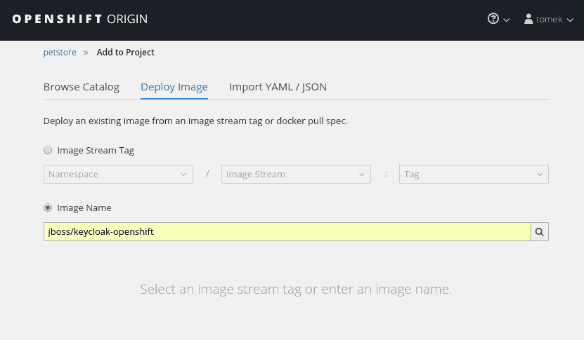

正如我们将很快看到的，所有配置都将使用管理员控制台进行。在配置中，我们必须使用环境变量提供初始管理员凭据：

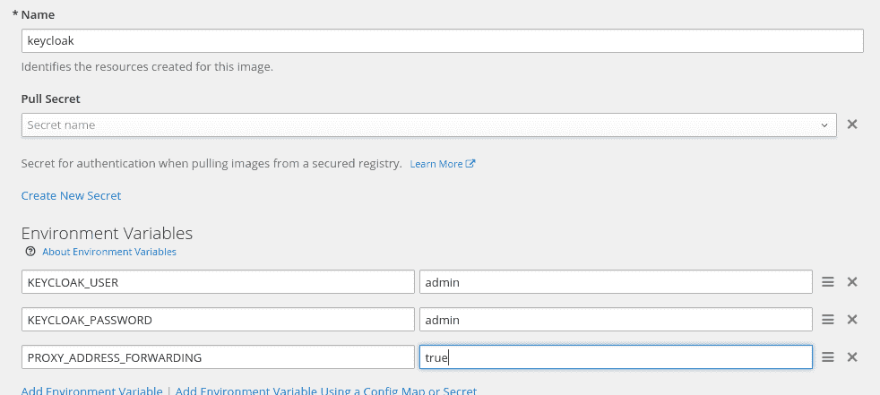

由于服务器将在 OpenShift 代理后面可用，我们必须将 `PROXY_ADDRESS_FORWARDING` 参数设置为 `true`。

设置这些参数后，我们就可以开始将镜像部署到我们的 OpenShift 集群中了。我们需要点击创建按钮，等待 Keycloak pod 启动。

Keycloak 服务器，就像网关服务器一样，必须从集群外部（由我们，管理员和`petstore-ui`）访问。那么让我们创建一个路由吧。我们将像之前章节中做的那样进行：我们必须点击网页控制台的服务菜单中的创建路由。我们应该使用默认参数。路由创建后，我们将能够看到其 IP 地址，如下所示：

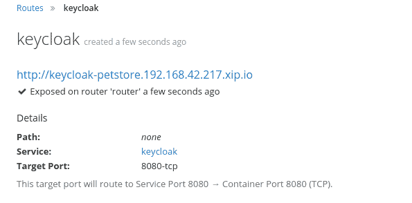

记下这个 IP，因为我们将在配置中大量使用它。

好的，我们已经将 Keycloak 部署到了我们的集群内部。我们终于准备好前往 Keycloak 网页控制台（我们刚刚创建的那个）了。

# 创建领域

如果你遵循了创建的路径，你会看到 Keycloak 欢迎页面。点击`Authentication console`链接，并输入我们在将 Keycloak 服务器部署到集群时定义的凭据（admin/admin）。你将看到管理控制台。

管理控制台是一个 UI，允许你轻松配置分布式安全性的所有方面：

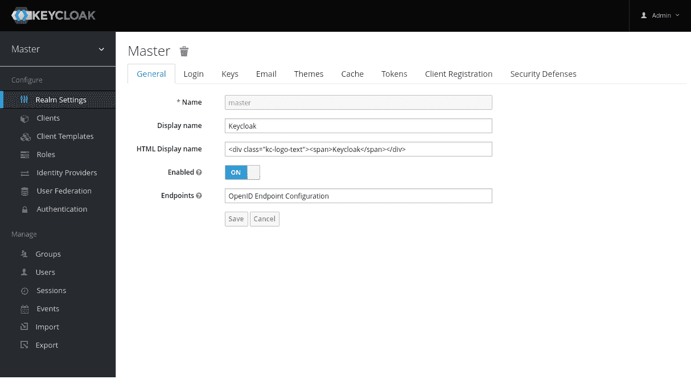

在前面的屏幕截图中，看看左上角——菜单的标题是 Master。这意味着什么？Keycloak 负责管理一组用户、他们的凭据、角色和用户可以委托访问权限的客户端。Keycloak 提供命名空间，允许对这些对象进行分组。这些命名空间被称为**领域**。领域是隔离的，每个领域只能管理它包含的对象。因此，所有与 Keycloak 服务器通信的服务都必须指定它们引用的是哪个领域。

为了我们的目的，我们将创建自己的 petstore 领域。为了做到这一点，我们必须点击左上角的 Master，并添加新的域名，称为 petstore。

# 创建客户端

如理论部分所述，认证服务器必须知道所有用户可以委托访问权限的客户端。在我们的应用程序中，我们需要配置一个客户端：`petstore-ui`。为了做到这一点，点击左侧菜单中的客户端，然后点击创建客户端按钮：


我们必须将新的客户端设置 `Client ID` 设置为 `petstore-ui`。记住，我们的 Web 应用程序将在尝试登录时被重定向到 Keycloak。操作完成后，身份验证服务器必须使用客户端请求中发送的重定向 URI 将用户重定向到客户端。Keycloak 验证 URI 是否可信。因此，我们必须提供一个客户端可能运行的 URI 列表。我们将添加运行具有 UI 的浏览器的本地主机地址。此外，一些浏览器执行 **跨源资源共享**（**CORS**）策略检查。将 Web Origins 参数设置为 `+` 将使 Keycloak 在重定向 URI 被正确验证时返回适当的 CORS 标头。

我们现在已经创建了我们的领域，并告诉 Keycloak 关于将使用它的客户端。现在让我们配置用户。

# 用户和角色

为了这个示例，我们将配置一个具有客户和管理员角色的用户。让我们从创建角色本身开始。

在 Keycloak 控制台中，我们需要在左侧菜单中点击“角色”，然后在右侧点击“添加角色”按钮，并输入客户角色：

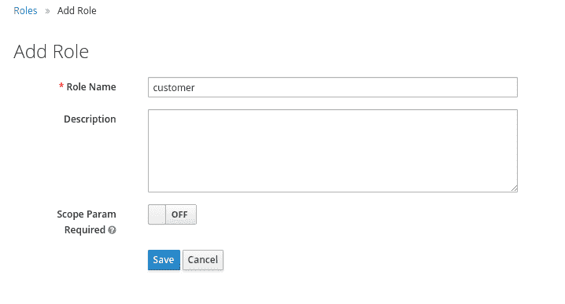

接下来，我们需要为管理员角色重复前面的步骤。

之后，我们需要以类似的方式添加用户：点击“用户”菜单，然后点击“添加用户”按钮，并输入我们用户的名称：

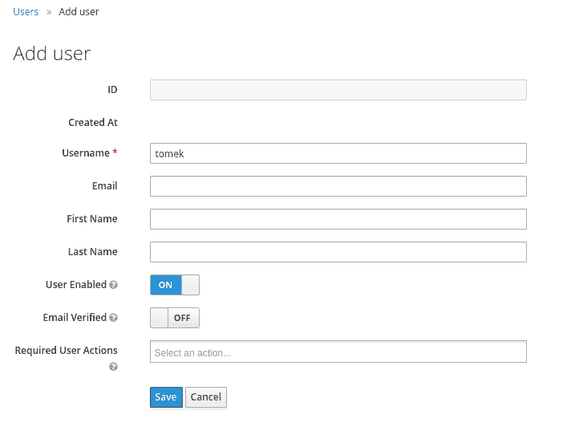

这次，我们需要进行更多的配置。我们必须在凭据部分创建密码，如下所示：

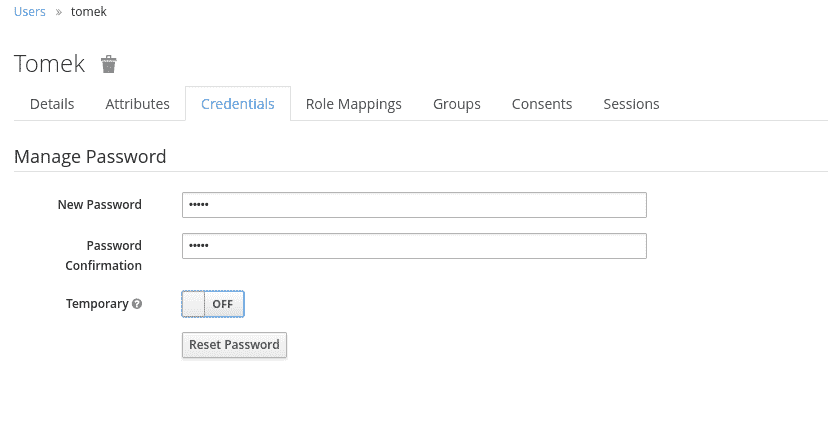

然后，将客户角色映射到用户：

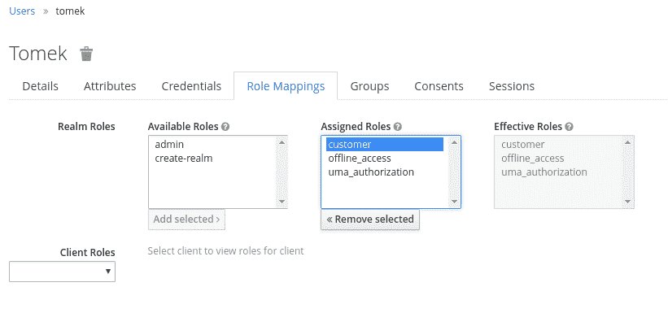

我们已经创建了用户 tomek，并赋予他们客户和管理员角色。如果 tomek 使用 `petstore-ui`，他们应该能够调用允许管理员角色的请求吗？不。`petstore-ui` 的目的是供商店客户使用。我们在理论部分提到，身份验证服务器应该创建一个包含客户端执行其工作所需的最小权限数量的访问令牌。在这个具体的例子中，`petstore-ui` 应该只允许代表 tomek 执行允许客户进行的请求。为了配置这一点，我们需要引入范围。

# 范围

Keycloak 范围是一个工具，允许您指定哪些角色将与为特定客户端生成的访问令牌相关联。让我们为 `pestore-ui` 客户端创建一个范围。

为了做到这一点，您必须在左侧菜单中点击“客户端”，选择 `petstore-ui` 客户端，然后在客户端名称下点击“范围”标签：

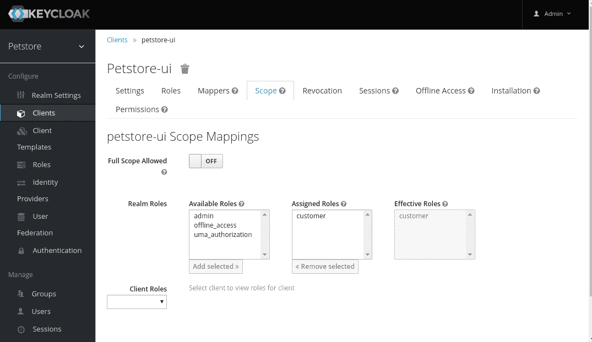

正如您在前面的屏幕截图中所注意到的，每个客户端默认将允许的完整范围参数设置为 true。这意味着认证用户拥有的每个角色都将与为该客户端创建的访问令牌相关联。为了限制给定客户端的角色，我们必须关闭此选项并手动选择允许的角色。在我们的例子中，我们需要选择客户角色并将其移动到分配的角色。

管理员角色尚未移动。因此，如果为 tomek 代表`petstore-ui`生成访问令牌，它将只包含客户角色。因此，tomek 将无法从`petstore-ui`客户端执行任何管理员操作。

我们已经基本配置了 Keycloak。

那么，您如何配置 Java 服务？在找到答案之前，让我们介绍下一个需要用户身份验证的功能——购物车服务。

# 购物车服务

让我们介绍购物车服务的实现。首先，我们必须将新资源添加到客户网关 API 中。

示例参考：`chapter10/cart-service`

```java
package org.packt.swarm.petstore;

import org.packt.swarm.petstore.api.CartItemView;
import org.packt.swarm.petstore.api.CatalogItemView;
import org.packt.swarm.petstore.cart.api.CartItem;

import javax.inject.Inject;
import javax.ws.rs.DELETE;
import javax.ws.rs.GET;
import javax.ws.rs.POST;
import javax.ws.rs.Path;
import javax.ws.rs.PathParam;
import javax.ws.rs.Produces;
import javax.ws.rs.QueryParam;
import javax.ws.rs.core.Context;
import javax.ws.rs.core.MediaType;
import javax.ws.rs.core.Response;
import javax.ws.rs.core.SecurityContext;
import java.util.List;

@Path("/")
public class GatewayResource {

    @Inject
    private GatewayService gatewayService;

    @GET
    @Path("/catalog/item")
    @Produces(MediaType.APPLICATION_JSON)
    public Response getItems() {
        List<CatalogItemView> result = gatewayService.getItems();
        return Response.ok(result).build();
    }

 @GET
    @Path("/cart/{customerId}")
 @Produces(MediaType.APPLICATION_JSON)
 public Response getCart(@PathParam("customerId") String customerId) {
 List<CartItemView> cart = gatewayService.getCart(customerId);
        return Response.ok(cart).build();
    }
 @POST
    @Path("/cart/{customerId}")
 @Produces(MediaType.APPLICATION_JSON)
 public Response addToCart(@PathParam("customerId") String customerId, CartItem item, @QueryParam("additive") boolean additive) {
 gatewayService.addToCart(customerId, item, additive);
        return Response.ok().build();
    }
 @DELETE
    @Path("/cart/{customerId}/{itemId}")
 @Produces(MediaType.APPLICATION_JSON)
 public Response deleteFromCart(@PathParam("customerId") String customerId, @PathParam("itemId") String itemId) {
 gatewayService.deleteFromCart(customerId, itemId);
        return Response.ok().build();
    }

    @POST
    @Path("payment")
    @Produces(MediaType.APPLICATION_JSON)
    public Response payment(@QueryParam("customerId") int customerId, @Context  SecurityContext securityContext){
        try {
            String paymentUUID = gatewayService.buy(customerId);
            return Response.ok(paymentUUID).build();
        } catch (Exception e) {
            return Response.status(Response.Status.BAD_REQUEST).build();
        }
    }

}
```

正如您在前面的代码中所注意到的，我们添加了三个购物车方法。所有这些方法都通过`customerId`（我们将在几分钟内向您展示如何获取它）和应用程序的`itemId`来识别购物车。正如前几章所做的那样，所有方法都将实现委托给网关服务，该服务反过来使用代理将调用传播到后端服务。

为了对购物车执行操作，用户必须对系统进行身份验证。让我们确保`GatewayResource`的安全性，以确保未经授权的用户将无法访问这些方法。

# WildFly Swarm Keycloak 适配器

如您从理论部分所知，具有安全 API 的服务必须根据身份验证令牌对其用户进行授权。为了做到这一点，它们必须与 Keycloak 服务器合作，在我们的例子中，使用 OIDC 协议。显然，我们不会自己实现此功能。正如我们建议的那样，Keycloak 为不同的工具提供了一系列适配器。WildFly Swarm 也有自己的适配器。那么，我们将如何安装它？

让我们扩展客户网关的`pom.xml`：

```java
(...)
<dependency>
    <groupId>org.wildfly.swarm</groupId>
    <artifactId>keycloak</artifactId>
    <version>${version.wildfly.swarm}</version> </dependency>
(...)
```

就这样——适配器已安装。

我们还有一件事要做。我们必须配置适配器。为了做到这一点，我们必须在 Maven 的资源目录内添加`keycloak.json`文件。该文件包含一些适配器配置属性。在我们的例子中，这相当简单：

```java
{
  "realm": "petstore",
  "auth-server-url": "${env.KEYCLOAK_URL}/auth",
  "resource": "petstore-ui"
}
```

基本上，这些文件告诉适配器`auth-server`的位置、域和资源名称。如您所回忆的那样，我们都在这些后面：我们创建了指向部署在 OpenShift 上的 Keycloak 服务器的路由，为我们的宠物商店应用程序创建了域，并告诉 Keycloak 我们将使用配置的`petstore-ui`客户端进行身份验证。

请注意，我们需要提供 `KEYCLOAK_URL` 作为环境变量。这是我们所创建的 keycloak 代理的 URL。您可以在 web 控制台中配置此变量：

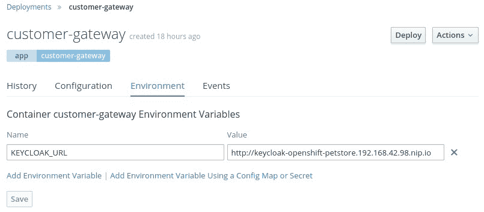

在提供此信息之后，Keycloak 适配器将能够根据 UI 提供的访问令牌授权用户。这是好的，但我们还没有保护我们的资源。

为了做到这一点，我们必须对客户网关的主类进行一些修改：

```java
package org.packt.swarm.petstore;

import org.jboss.shrinkwrap.api.Archive;
import org.wildfly.swarm.Swarm;
import org.wildfly.swarm.keycloak.Secured;

public class Main {

    public static void main(String[] args) throws Exception {

       (...)    

        Archive<?> deployment = swarm.createDefaultDeployment();
        secureDeployment(deployment);

        swarm.deploy(deployment);
    }

    private static void secureDeployment(final Archive<?> deployment){
        deployment.as(Secured.class)
 .protect("/cart/*")
 .withMethod("POST","GET","DELETE")
 .withRole("customer");
    }
}
```

正如您在前面的代码中所注意到的，在将 `deployment` 标记为 `Secured` 之后，我们能够使用链式 API，我们使用它来指定哪些资源上的哪些请求需要保护以及哪些角色被允许。

通过前面的代码，我们确保只有具有`customer`角色的用户能够使用客户 API 中的与购物车相关的方法。请注意，然而，后端购物车服务也需要得到保护。

我们将以类似的方式将其安全地连接到网关服务，这确保了它依赖于 swarm 的 Keycloak 适配器，将 `keycloak.json` 添加到类路径中（注意，文件的上下文将保持相同，因为所有属性都保持有效），并在主函数中确保部署安全。

我们有一个问题：在网关服务中，我们依赖于 UI 在每次认证用户执行请求时发送给我们访问令牌。如您从前面的章节中回忆起来，我们使用 Rest Client 在后端服务上执行调用，并负责附加所有必要的信息。因此，我们还需要在调用期间将访问令牌传播到后端服务。如果我们不这样做，后端服务中的 Keycloak 适配器将识别请求为匿名请求，这显然是不正确的。

为了传播上下文，我们将实现一个简单的 JAX-RS 客户端请求过滤器。在我们的场景中，我们将检查访问令牌是否存在，如果存在，则将其进一步传播到调用中：

```java
package org.packt.swarm.petstore.security;

import org.keycloak.KeycloakPrincipal;

import javax.ws.rs.client.ClientRequestContext;
import javax.ws.rs.client.ClientRequestFilter;
import javax.ws.rs.core.Context;
import javax.ws.rs.core.HttpHeaders;
import javax.ws.rs.core.SecurityContext;
import javax.ws.rs.ext.Provider;
import java.io.IOException;

//1
public class AuthTokenPropagationFilter implements ClientRequestFilter {

    private static final String BEARER = "Bearer";

    //2
    @Context
    SecurityContext securityContext;

    @Override
    public void filter(ClientRequestContext requestContext) throws IOException {
        //3
        KeycloakPrincipal keycloakPrincipal = (KeycloakPrincipal) securityContext.getUserPrincipal();
        //4
        if(keycloakPrincipal != null && keycloakPrincipal.getKeycloakSecurityContext()!=null) {
            //5
            String token = keycloakPrincipal.getKeycloakSecurityContext().getTokenString();
            if(token != null) {
            //6
                requestContext.getHeaders().add(HttpHeaders.AUTHORIZATION, BEARER + " " + token);
            }
        }
    }
}
```

让我们逐步分析这段代码：

1.  如您所回忆的那样，JAX-RS `ClientRequestFilter` (1) 在将其传播到服务器之前，会过滤与它关联的客户端执行的每个调用。在我们的场景中，我们将检查访问令牌是否存在，如果存在，则将其附加到每个请求。

1.  在 (2) 中，我们正在注入 `SecurityContext`。如果 Keycloak 使用访问令牌授权了用户，它将创建 `SecurityContext` 并将其附加到请求上。因此，我们将将其注入到调用线程上的对象中。

1.  Keycloak 创建的 `SecurityContext` 包含主体接口的 `KeycloakPrincipal` 实现 (3)。

1.  如果存在主体，我们将能够从它那里获取进一步的 `KeycloakSecurityContext` (5)。

1.  最后，可以从上下文中获取令牌并将其进一步传播为 `BEARER` 令牌。

让我们来看看 `CartProxy`：

```java
package org.packt.swarm.petstore.proxy;

import org.packt.swarm.petstore.cart.api.CartItem;
import org.packt.swarm.petstore.security.AuthTokenPropagationFilter;

import javax.annotation.PostConstruct;
import javax.enterprise.context.ApplicationScoped;
import javax.ws.rs.client.Client;
import javax.ws.rs.client.ClientBuilder;
import javax.ws.rs.client.Entity;
import javax.ws.rs.client.WebTarget;
import javax.ws.rs.core.MediaType;
import java.util.Arrays;
import java.util.List;

@ApplicationScoped
public class CartProxy {

    (...)

    public List<org.packt.swarm.petstore.cart.api.CartItem> getCart(String customerId){
            Client client = ClientBuilder.newClient();
            client.register(new AuthTokenPropagationFilter());
            WebTarget target = client.target(targetPath + "/cart/" + customerId);
            return Arrays.asList(target.request(MediaType.APPLICATION_JSON).get(org.packt.swarm.petstore.cart.api.CartItem[].class));
    }

    (...)

}
```

代理与我们在前几章中创建的代理类似，并使用标准的 JAX-RS 客户端 API 创建适当的请求到后端购物车服务。然而，我们必须为客户端注册我们刚刚创建的`TokenPropagationFilter`

让我们总结一下我们已经做的事情：我们扩展了 customer-gateway 以包含购物车方法，向项目中添加了 Keycloak 适配器及其配置，并将部署标记为`Secured`，指定了有权使用给定方法的角色。我们对 customer-gateway 和后端购物车服务都做了这件事。为了确保访问令牌传播到后端服务，我们实现了一个适当的过滤器并将其注册在我们的代理内部。看起来认证应该现在可以工作了。让我们试试！

您将在附带的代码中找到 UI 应用程序：

`第十章/petstore-ui`.

让我们启动 petstore 应用程序并打开 UI：

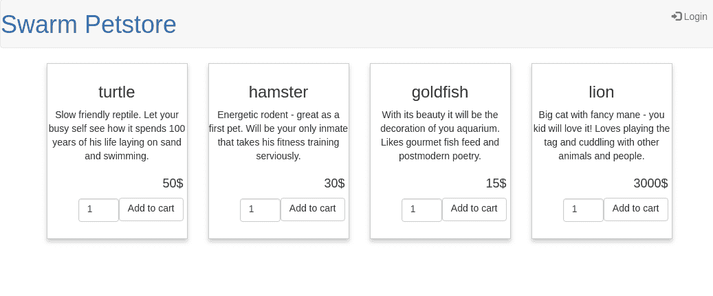

在前面的屏幕截图中，没有用户登录到应用程序。为了获取所有必要的数据，客户端必须在项目资源上执行调用。由于资源未受保护，调用成功。为了登录购物车，我们必须进行身份验证。让我们来做这件事：

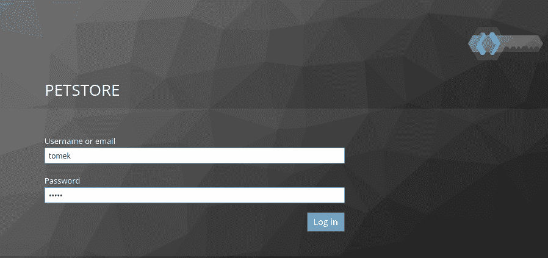

点击登录按钮将我们重定向到 Keycloak 服务器。在提供您的凭据后，Keycloak 将验证您并将您重定向到商店：

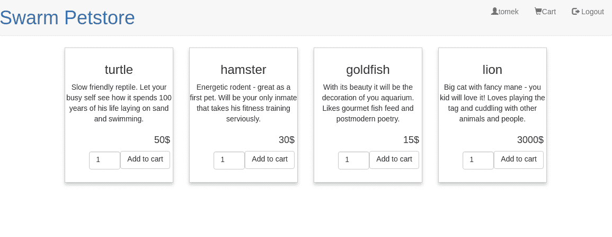

正如您在前面的屏幕截图中注意到的，我们已经成功登录到 UI。现在您可以向购物车添加项目并查看购物车视图：

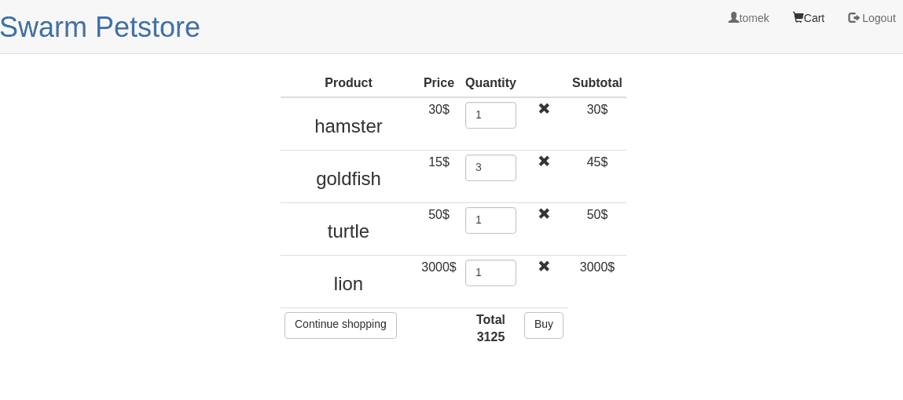

我们已经向您展示了具有有效安全配置的商店操作，但请随意玩转这个示例应用程序，以确认安全功能是否正常工作。您可以在 Keycloak 控制台中为用户创建和删除角色，或者使服务要求不同的角色进行授权。您将看到 Keycloak 确实能够正确授权用户；具有有效角色的用户将被允许执行请求，而缺乏有效角色的用户将被禁止。

# SSL 配置

正如我们在本章开头提到的，当我们描述携带令牌时，在生产环境中使用这种类型的认证，您必须使用加密连接。在本节中，我们将描述 WildFly Swarm 和 OpenShift 如何支持使用安全连接。

我们将根据我们是否认为我们的云环境是安全的，将这一部分分为两个不同的案例。

# 安全的云

在您使用的云环境安全的情况下，您需要配置外部客户端和路由器之间的加密连接：

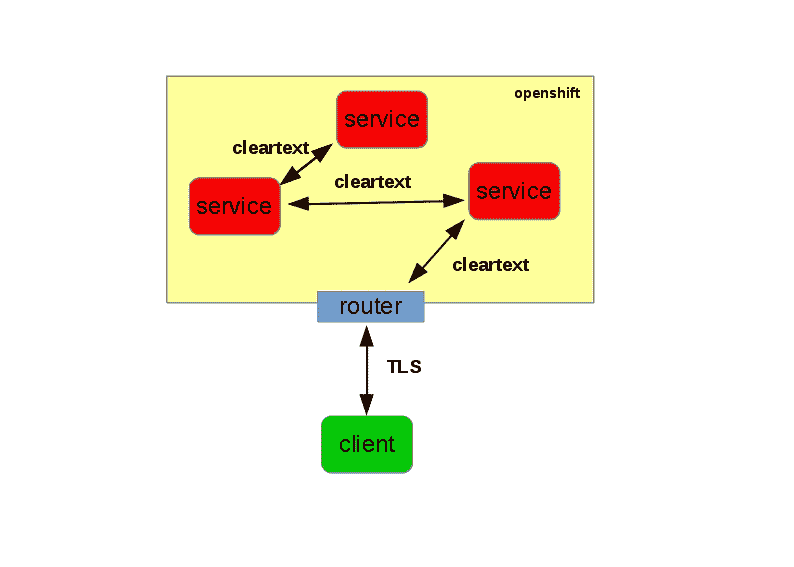

在这种情况下，我们必须配置一个边缘路由器。边缘路由器有自己的证书，能够与外部客户端建立安全连接。在代理流量到目的地之前，路由器会加密连接。因此，在 OpenShift 集群中，通信是通过不安全连接进行的。

您可以为每个创建的路由配置边缘路由。为了这样做，您必须以标准方式创建路由（选择您想要建立路由的服务并点击创建路由）。之后，您必须选择一个安全路由，因此，从 TLS 终止下拉菜单中选择边缘，并在表单中输入您的 PEM 格式的证书，如下所示：

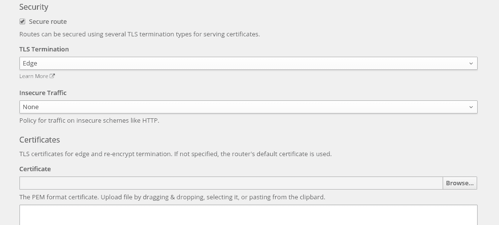

# 不安全的云

在某些情况下，您可能需要为所有通信配置安全连接，无论是与外部服务还是云内部：

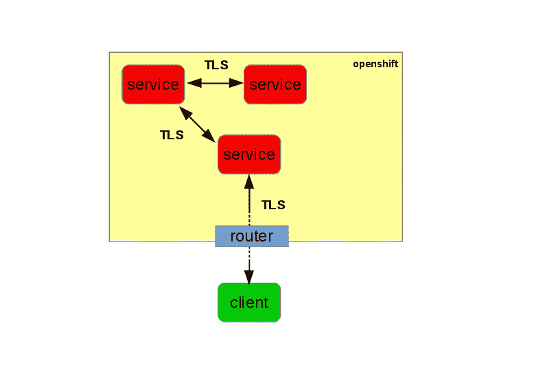

为了这样做，您必须配置一个具有透传 TLS 终止的路由（以与前面段落相同的方式创建路由并选择透传终止）。

使用透传终止，路由器不会终止 TLS 连接，加密流量将被传播到目标。其影响之一是目标（以及所有其他服务）需要配置其安全设置。

Swarm 通过提供 HTTP 配置使您能够轻松地做到这一点。让我们看看示例配置：

```java
swarm:
  https:
    only: true
    port: 8443
  http:
    keystore:
      path: keystore.jks
      password: password
    truststore:
      path: truststore.jks
      password: password

```

上述配置指定服务器将仅在`8443`端口上使用安全连接。它指定了`trustore`和`keystore`（类路径）的位置以及它们的`password`。

# 摘要

在本章中，我们展示了您如何使用分布式安全协议通过我们的实际示例来保护您的云应用。

我们本章开始时介绍了基于分布式身份验证和授权的概念：令牌的理由以及它们如何获取和使用。后来，我们介绍了关于具体分布式安全协议的基本信息：OpenID Connect。

在实际部分，我们使用了 Keycloak SSO 服务器来保护 Petstore 应用程序中的购物车服务。

在此，我们将讨论如何使用断路器模式处理不可靠的网络问题；具体来说，是 Hystrix 库。

# 进一步阅读

1.  [`oauth.net/2/`](https://oauth.net/2/)

1.  [`openid.net/developers/specs/`](http://openid.net/developers/specs/)

1.  [`www.keycloak.org/`](https://www.keycloak.org/)
