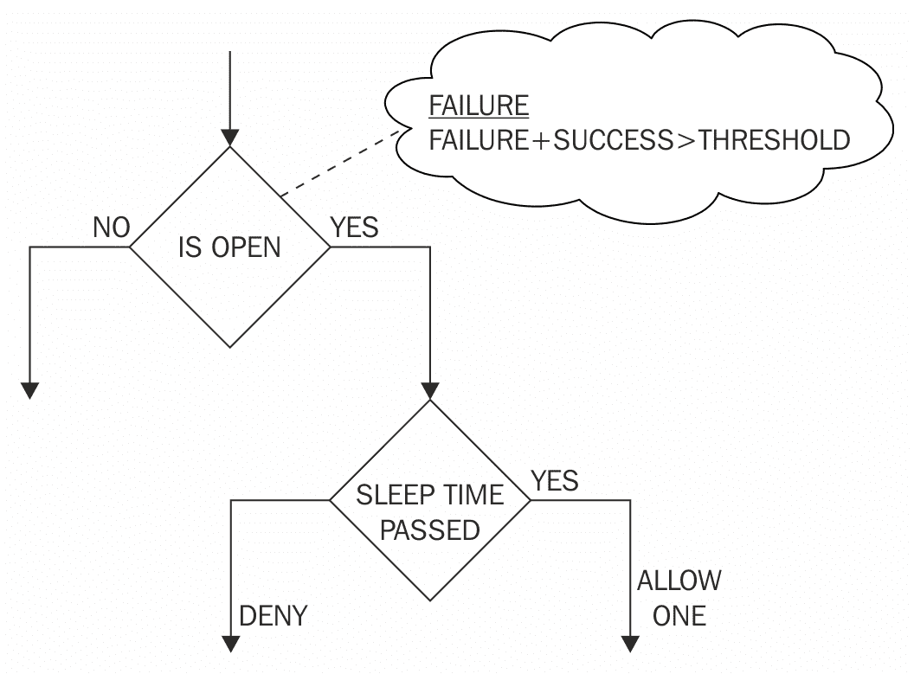
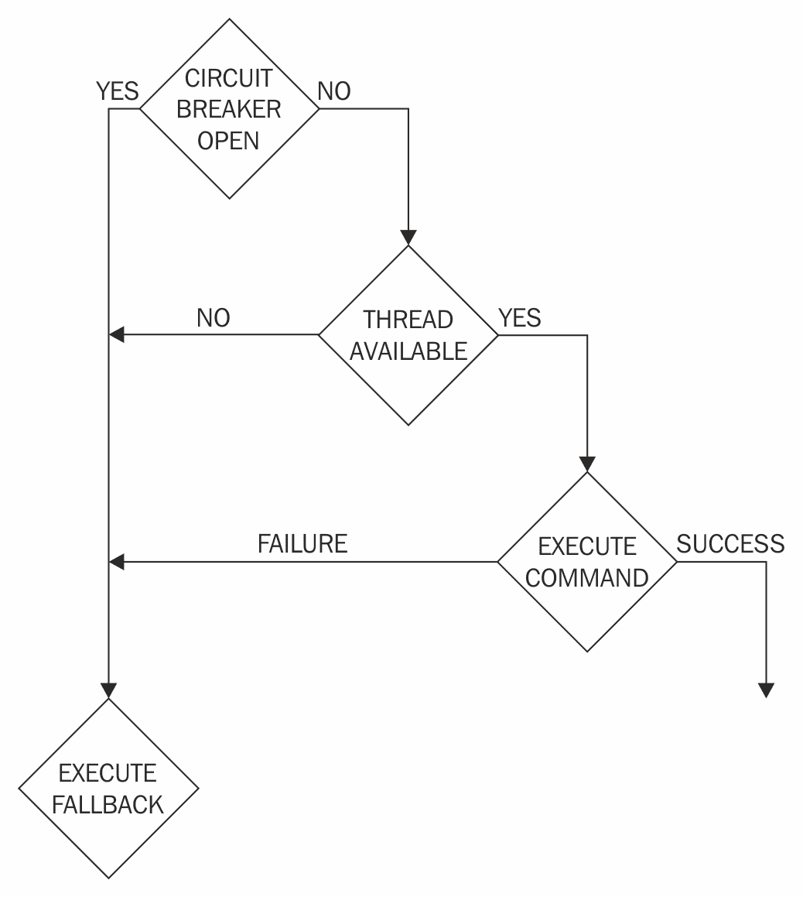
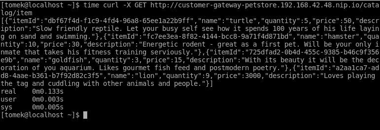
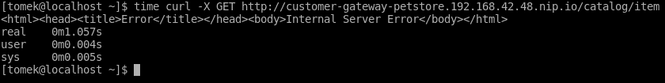
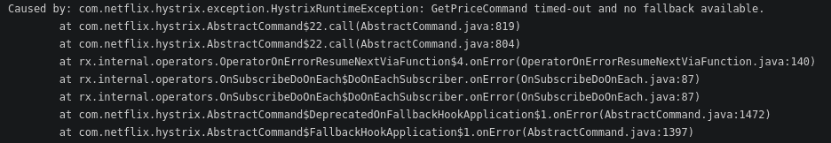
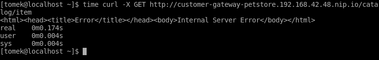
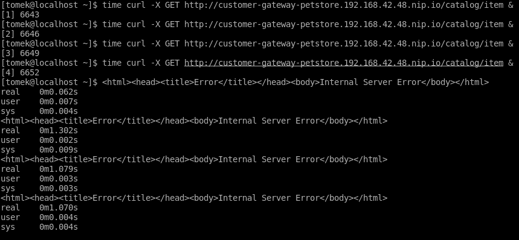
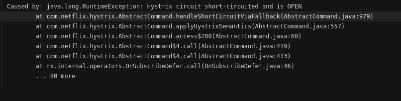
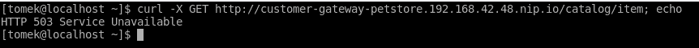

# 使用 Hystrix 增加弹性

在本章中，我们将学习如何处理分布式环境中不可避免的网络故障。为了做到这一点，我们将介绍**断路器**架构模式，并讨论何时应该使用它以及它的好处。我们将查看其 Netflix 实现，**Hystrix**。我们还将介绍其实现方式和如何使用它。作为一个例子，我们将使用 Hystrix 为我们的示例应用程序添加弹性和容错性。

# 不可靠的网络

当你在分布式环境中开发你的服务时，你必须考虑到服务的调用将通过网络进行。因此，应用程序必须准备好处理网络故障，这肯定会发生。

由于单个表现不佳的服务可以毒害大量服务，这个问题进一步加剧。让我们看看可能使这种情况成为可能的场景数量。

# 依赖服务

在大型分布式系统中，每个服务都会对其他服务有大量的依赖。只需要一个依赖失败，就会使服务变得不负责任。此外，服务也会崩溃，使其对依赖它的其他服务不可用。这种情况被称为级联故障（进一步阅读，链接 1）。

然而，这还不是全部。在一个生产就绪的环境中，当有很多调用正在进行时，一个有延迟问题的服务会迅速阻塞所有可用的线程，并使所有其他服务不可达。

显然，如果我们想设计一个健壮的分布式系统，我们需要一个工具，该工具将使用户能够处理之前描述的问题。我们将使用的工具是 Hystrix 库。

Hystrix 是由 Netflix 开发的一个库，用于处理服务故障并为复杂的分布式架构提供鲁棒性。让我们来看看 Hystrix 是如何处理之前描述的问题的。

# 断路器模式

为了处理之前描述的问题，创建的架构设计模式是断路器模式。其背后的主要思想很简单：将调用代码封装在命令中，该命令将执行调用并计算远程服务的状态。如果服务被命令使用的指标声明为不可达，则立即拒绝后续调用。在给定时间后，将再次尝试建立新的连接，如果成功，命令将再次开始对服务进行调用。

该模式的名称来源于电路断路器，这是一种用于保护电路免受过电流可能造成的损害的设备。如果电路中的电流过高，则断路器打开，阻止电流流动。为了使电路再次运行，必须关闭断路器。

由于其原型，软件断路器继承了电气术语。如果目标服务是健康的，并且调用直接转发到它，我们将谈论闭合断路器。如果健康指标超过，调用将不会执行，断路器将打开。

显然，负责实现断路器的库必须提供算法来决定远程服务是否健康，何时以及如何打开电路，以及断路器关闭时应该做什么。让我们讨论一下 Hystrix 是如何做到这一点的。

# Hystrix 断路器

以下图表展示了 Hystrix 断路器的行为：



在调用远程服务期间，Hystrix 检查断路器是否打开。这个决定是基于从最近调用中收集的统计数据做出的。如果最后时间窗口中的失败百分比低于配置的阈值，那么电路是打开的，调用将被执行。

在执行调用之后，断路器将它的结果（成功/失败）存储在统计数据中。这些统计数据是在配置的时间窗口内收集的，这个窗口进一步被分成多个桶，每次只丢弃一个桶，这样就不会一次性丢弃给定窗口内的所有数据。

当电路打开时会发生什么？首先，算法检查配置的睡眠时间是否已经过去。如果是这样，那么只允许执行一个请求。这个断路器阶段被称为半开，其目的是检查被调用的服务是否再次健康。如果调用成功，那么断路器再次打开，并重置指标。另一方面，如果睡眠时间没有超过，或者半开状态中的一个调用失败了，那么断路器再次打开，并重置睡眠时间。

因此，我们现在知道了 Hystrix 断路器算法以及它是如何对成功和失败的调用统计做出反应的。然而，我们实际上是如何定义失败的？当调用被标记为失败时，有三种情况。首先，配置的调用超时已经超过。其次，客户端库抛出了异常。第三，给定依赖项可用的线程数已超过。

最后一点是大头板算法的实现。让我们更深入地了解它。

# 大头板

为了防止依赖项之一使用应用程序的整个线程池的情况，Hystrix 为每个依赖项保留线程池。如果其中一个依赖项变得迟钝，它将保持所有线程忙碌，并拒绝进一步的调用，从而导致失败计数增加。这种策略被称为**大头板**。

这次，术语来自船舶工程：船体被分成隔离的舱壁，以便一个地方的船体损坏只会导致一个舱壁被水填满。同样，为每个依赖项提供一个线程池，如果其中一个服务表现不佳，只会使用一个专门的线程池。

在复杂的分布式环境中，通常应用程序有许多依赖项，每个依赖项都依赖于其他客户端库。通常，这些库是由第三方公司提供的黑盒库，这使得它们难以调试。此外，增加这些库的数量会增加其中一个库“毒害”整个应用程序的风险。通过隔离舱壁（bulkheading），你可以轻松地减轻这种风险。

每个客户端的状态可以通过其线程池的状态轻松跟踪。如果监控显示某个线程池已满，这表明应该对其进行检查。如果底层问题得到解决，线程池将清理并继续服务的操作。

共享相同线程池的依赖项是可配置的。因此，你可以根据你的架构调整隔离舱壁的行为。这种配置是通过 Hystrix 分组机制完成的，我们将在本章后面的示例中向你展示。

因此，我们已经知道调用可能会失败或被 Hystrix 强制失败。但在那种情况下会发生什么？处理调用失败机制的机制称为**备用**。现在让我们更深入地了解它。

# 备用

Hystrix 实现了一个备用机制，允许你在调用失败时执行你的代码。命令允许你实现一个备用方法，该方法将在失败时执行。该方法无论失败的原因如何都会执行——在超时或线程池溢出时都会执行相同的方法。

备用方法不必实现。如果未实现备用，Hystrix 抛出的异常将被传播到堆栈跟踪中。

如果，另一方面，你决定实现备用，你有一系列策略可以这样做。让我们看看几个例子。

如果你正在使用用于读取数据的服务的，在调用失败的情况下可以返回一个空答案。在这种情况下，如果服务失败，将没有数据可用。这种解决方案隐藏了底层失败并立即返回响应。问题是，显然，请求的数据不可用。你可以通过实现本地缓存并在失败的情况下返回最新的响应来处理这种情况。在这种情况下，失败将被隐藏，数据将可用。它可能不会在失败时是最新的，但它将允许你的系统继续其操作。

假设现在你正在使用授权服务来决定用户是否有权执行一些进一步的操作。在这种情况下，你可以实现回退机制，该机制将始终返回相同的响应。然而，这个响应应该是什么？像往常一样，这取决于你的用例。在某些场景中，你可能想避免用户已经付费但无法使用服务的情况。在这种情况下，你将每次都返回成功的授权。缺点是，在授权服务失败时，许多用户将能够使用他们当时未付费的内容。在其他场景中，你可能需要拒绝所有用户的授权。当然，临时的允许所有策略并不适合银行应用程序。在这种情况下，你必须拒绝所有用户的授权。

最后，在某些场景中，不编写回退是一种好的策略。假设你正在实现一个调用，该调用应作为事务操作的一部分修改某些数据。在这种情况下，传播的异常是我们想要的策略：整个操作将停止，异常将被传播到事务管理器，这将回滚事务。

在本节中，我们只简要介绍了许多可能的回退实现策略。正如你可能已经注意到的，具体的实现（或缺乏）直接取决于你的服务业务需求。要记住的关键点是，Hystrix 不会允许网络故障损害你应用程序的行为，如果发生故障，它将允许你使用回退机制来处理它。

# 整个算法

最后，我们准备总结 Hystrix 库的行为：



在开始时，用户构建命令并启动其执行。Hystrix 检查与此命令关联的断路器是否关闭。如果断路器是打开的，那么调用将立即被拒绝，并执行回退（如果已实现）。如果断路器是关闭的，那么将检查线程池。如果没有可用的线程在线程池中，那么调用将失败；可选地执行回退并将失败报告给断路器。另一方面，如果有可用的线程，那么调用开始。如果调用错过了超时，那么错误会被报告给断路器，并可选地执行回退。

在这种场景中，线程可能会被阻塞。Hystrix 会超时，但必须等待客户端库*返回线程*。如果调用完成并失败，那么错误会被报告给断路器，并且可以选择执行回退。

最后，如果执行成功，则将成功报告给断路器，并将响应作为命令执行的结果返回。

您已经学习了 Hystrix 断路器实现的基础知识。现在是时候学习其基本 API 了，我们将在本章后面使用它。让我们现在就来做。

# 使用 Hystrix

为了在实践中学习 Hystrix 的行为，我们将扩展客户网关服务，使其调用时使用 Hystrix。稍后，我们将使我们的其中一个服务人工无响应，并观察 Hystrix 的行为。让我们开始吧。

示例参考：`chapter11/customer-gateway-hystrix`。

首先，我们将向 `pom.xml` 中添加 Hystrix 依赖项：

```java
(...)

<dependency>
    <groupId>com.netflix.hystrix</groupId>
    <artifactId>hystrix-core</artifactId>
    <version>${version.hystrix}</version> </dependency>

(...)
```

断路器命令是通过扩展 `com.netflix.hystrix.HystrixCommand` 类实现的。让我们看看我们的 `PricingProxy` 的具体示例中的使用情况：

```java
(...)

@ApplicationScoped
public class PricingProxy {

    (...)

 //1
 private class GetPriceCommand extends HystrixCommand<Response> {

        private final String itemId;

 //2
 public GetPriceCommand(String itemId) {
            //3
 super(Setter.withGroupKey(HystrixCommandGroupKey.Factory.asKey("pricing-service")); this.itemId = itemId;
        }

 @Override
        //4
        protected Response run() {
            //5
 Client client = ClientBuilder.newClient();
            WebTarget target = client.target(targetPath + "/price/" + itemId);
            return target.request(MediaType.APPLICATION_JSON).get();
        }
    }
}
```

命令必须扩展抽象类 `HystrixCommand`（1）。该类必须使用一个类型参数化，该类型将作为命令结果返回。在我们的例子中，它将是 JAX-RS 响应类——与我们用于原始调用的相同。

该类将 itemId 参数作为参数（2），该参数将在调用中使用。

如您在构造函数代码中所见，我们向其中提供了 `HystrixCommandGroupKey` 参数（3）。`HystrixCommand` 构造函数允许您提供三个参数的组合：`HystrixCommandGroupKey`、`HystrixThreadPoolKey` 和超时。这两个枚举参数用于命令分组：具有相同组键的命令将属于同一组，并将为了报告、警报和监控的目的分组在一起。线程池键指定了属于同一 Hystrix 线程池的命令。当线程池键未启用时，组键用作线程池标识符。

因此，在我们的例子中，所有 `pricingService` 调用命令都将属于同一组，并将使用它们自己的线程池。`HystrixCommand` 构造函数中的第三个参数是调用的超时时间。如果没有提供，则使用默认超时。

我们必须扩展 `HystrixCommand` 类的 `run` 方法（4）。当命令执行时，将调用此方法。如您所见（5），方法的内容与我们的原始调用中的代理代码相同。

现在，让我们看看如何执行命令：

```java
(...)

@ApplicationScoped
public class PricingProxy {

    private final String targetPath = System.getProperty("proxy.pricing.url"); //1
    public Price getPrice(String itemId){
        //2
 return new GetPriceCommand(itemId).execute().readEntity(Price.class);
    }

    (...)
}

```

代理的 `getPrice` 方法（1）创建命令对象（2），并在其上调用 `execute()` 方法。这导致执行理论部分中描述的整个断路器算法。现在，让我们调用 catalog/item 方法并测量其调用时间：



没有区别；调用立即执行，没有任何错误。现在，让我们使 `pricingService` 人工无响应。

示例参考：`chapter11/pricing-service-misbehave`。

为了做到这一点，我们将在返回结果之前让服务等待指定的时间：

```java
package org.packt.swarm.petstore.pricing;

import org.packt.swarm.petstore.pricing.model.Price;

import javax.enterprise.context.ApplicationScoped;
import javax.persistence.EntityManager;
import javax.persistence.PersistenceContext;
import java.util.List;
import java.util.concurrent.TimeUnit;
import java.util.concurrent.locks.LockSupport;

@ApplicationScoped
public class PricingService {

    @PersistenceContext(unitName = "PricingPU")
    private EntityManager em;

    public Price findByItemId(String itemId) {
 //1
 LockSupport.parkNanos(TimeUnit.SECONDS.toNanos(5));
        return em.createNamedQuery("Price.findByItemId", Price.class).setParameter("itemId", itemId).getSingleResult();
    }
}
```

让我们将新服务部署到云中并重试一次调用。结果如下：



正如您在前面的屏幕截图中所注意到的，调用导致了失败。断路器处于开启状态，线程池中有一个可用的线程。因此，调用被执行，但超出了默认的 Hystrix 超时时间，该时间等于 1 秒。

为了确认这一点，让我们查看日志：



Hystrix 在这里没有撒谎：超时已超过，我们尚未实现回退。我们将在下一秒做到这一点，但在那之前，让我们学习如何修改 Hystrix 属性。

如果您想修改`HystrixCommand`的配置，您必须使用带有`Setter`参数的构造函数。这个类允许您配置之前描述的所有构造函数参数。除此之外，该类还允许您为断路器行为的不同方面提供配置属性。此类属性的详尽列表在 Hystrix 文档中描述。在这里，我们将展示一些示例修改。让我们从断路器超时开始：

```java
(...)
private class GetPriceCommand extends HystrixCommand<Response> {

    private final String itemId;

    public GetPriceCommand(String itemId) {
 //1
 super(Setter.withGroupKey(HystrixCommandGroupKey.Factory.asKey("pricing-service"))
 .andCommandPropertiesDefaults(HystrixCommandProperties.Setter()
        //2
 .withExecutionTimeoutInMilliseconds(100)));
        this.itemId = itemId;
    }

    @Override
    protected Response run() {
        Client client = ClientBuilder.newClient();
        WebTarget target = client.target(targetPath + "/price/" + itemId);

        return target.request(MediaType.APPLICATION_JSON).get();
    }
}
(...)
```

上述代码修改了我们的命令类，以将调用超时缩短到 500 毫秒。使用`Setter`类，并且`CommandGroupKey`的设置方式与之前的示例相同（1）。为了修改配置，我们添加了带有适当配置的`HystrixCommandProperites.Setter`（2）。现在，让我们看一下以下结果：



让我们重新配置应用程序以记录舱壁算法的行为；我们将增加超时时间并减少线程数量：

```java
(...)private class GetPriceCommand extends HystrixCommand<Response> {

    private final String itemId;

    public GetPriceCommand(String itemId) {
        super(Setter.withGroupKey(HystrixCommandGroupKey.Factory.asKey("pricing-service"))
//1           .andThreadPoolPropertiesDefaults(HystrixThreadPoolProperties.Setter().withCoreSize(3));
        this.itemId = itemId;
    }

    @Override
    protected Response run() {
        Client client = ClientBuilder.newClient();
        WebTarget target = client.target(targetPath + "/price/" + itemId);
        return target.request(MediaType.APPLICATION_JSON).get();
    }
}
(...)
```

为了做到这一点，必须创建另一个 setter（这次是`HystrixThreadPoolProperties` setter）（1）。

结果如下：



正如您在前面的屏幕截图中所注意到的，前三个调用已经获取了它们的线程并且被阻塞。第四个线程立即返回，因为线程池中没有更多的线程了。

最后，让我们打开电路。如果我们在一个 bash 循环中运行代码并查看日志，我们将注意到以下结果：



最后，让我们实现回退：

```java
(...)
private class CreatePaymentCommand extends HystrixCommand<Response> {

    private final Payment payment;

    public CreatePaymentCommand(Payment payment) {
        super(Setter.withGroupKey(HystrixCommandGroupKey.Factory.asKey(SERVICE_NAME))
                              .andCommandPropertiesDefaults(HystrixCommandProperties.Setter()
                                      .withExecutionTimeoutInMilliseconds(100)));
        this.payment = payment;
    }

    @Override
    protected Response run() {
        Client client = ClientBuilder.newClient();
        WebTarget target = client.target(targetPath + "/payment");
        return target.request(MediaType.APPLICATION_JSON).post(Entity.json(payment));
    }

 @Override
    //1
    protected Response getFallback() {        //2
 return Response.status(Response.Status.SERVICE_UNAVAILABLE).build();
    }
}

(...)
```

为了实现回退，您必须重写`getFallback`方法（1）。在我们的例子中，每当`paymentService`不可达时，我们都返回`SERVICE_UNAVAILABLE`异常（2）。

现在，我们可以重新实现`PetstoreService`，使其在发生此类情况时创建有意义的异常：

```java
public String buy(int customerId){
    Cart cart = cartProxy.getCart(customerId);

    Order order = createOrderFromCart(customerId, cart);
    int orderId  = orderProxy.createOrder(order);

    Payment payment = new Payment();
    payment.setMerchantId(Constants.MERCHANT_ID);
    payment.setDescription(String.format("ORDER_ID: %s", orderId));
    payment.setAmount(order.getPrice());

    Response response =  paymentProxy.createPayment(payment);

 if(response.getStatus() == Response.Status.SERVICE_UNAVAILABLE.getStatusCode()){
 throw new RuntimeException("Payment service unreachable");
    }

    return (String) response.readEntity(String.class);
}
```

这将是调用的结果：



# 摘要

在本章中，我们介绍了断路器模式背后的基本理论。

在本章的实践部分，我们将我们的宠物商店应用扩展以提供购买功能。然后，我们介绍了 Hystrix API 的基础知识，并使用它来实现与外部支付服务的弹性连接。

之后，我们使用我们自己的模拟支付服务异常实现的示例来展示断路器算法的行为。

# 进一步阅读

+   1.  [`github.com/Netflix/Hystrix/wiki`](https://github.com/Netflix/Hystrix/wiki)

    1.  [`netflix.github.io/Hystrix/javadoc/`](http://netflix.github.io/Hystrix/javadoc/)
