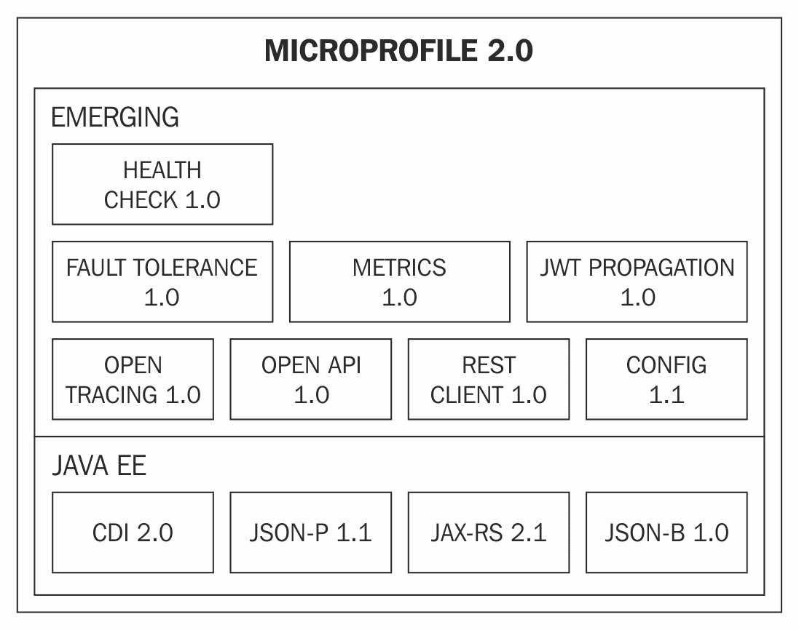

# 第十二章：未来方向

在本章中，我们将简要描述 Java EE 开发的未来可能的样子——平台演变的计划以及书中描述的应用程序提供的概念如何在将来实现标准化。我们还将探讨 MicroProfile 和 Jakarta EE 项目——描述它们的目的，并强调它们如何帮助您以更快的速度推进平台。

在第一章中，我们概述了 Java EE 标准创建的过程，强调了它提供的优势：可移植性和互操作性。似乎为了跟上 IT 的步伐，我们不得不放弃这些优势。让我们更深入地探讨这个问题。

# 不再需要标准了吗？

拥有一系列工具，使我们能够立即利用现代软件架构，使我们的生活变得更加容易。这些工具在近年来出现，是为了解决构建由大量分布在网络中的短暂服务组成的系统时必须解决的问题。需要注意的是，尽管我们选择了经过验证的解决方案，如 Hystrix 或 Keycloak，但我们已经失去了 Java EE 所提到的可移植性和互操作性优势。

问题在于创建 Java EE 标准的过程无法跟上新兴技术的快速发展。提供解决与云架构相关问题的共同标准的规范（例如，分布式安全或网络弹性）尚未成为 Java EE 的一部分。这是为什么？

标准最近版本创建的速度太慢，无法跟上所有最新的创新：Java EE 7 于 2013 年发布，而 Java EE 8 于 2017 年发布。但这并不是唯一的问题。规范是根据 Java 社区进程设计的。这个过程非常细致，包含许多步骤，旨在确保最终的标准准备好发布。

当您确实在标准化时，这个过程运作得很好——提取行业积累的知识，以提供通用的 API，以经过验证的方式解决问题。另一方面，它对创新并不那么有利。如果针对给定问题的解决方案出现，规范制定者必须有效地猜测正确的解决方案。无论标准过程多么细致，这都是非常困难的。

那么，我们最终是否应该放弃所有标准，以跟上创新？换句话说；失去标准带来的可移植性、互操作性和长期支持优势是当前 IT 世界移动速度的必然结果吗？也许我们可以做得更好。让我们讨论 Eclipse MicroProfile。

# Eclipse MicroProfile

Eclipse MicroProfile 是一个定义了开发 Java 微服务编程模型的项目（进一步阅读，链接 1）。类似于 Java EE 标准，它包含了一系列规范，定义了提供微服务所需功能的标准方式。

让我们看看项目当前的内容（版本 2.0）：

正如你将在前面的图中注意到的那样，有一些规范直接来自 Java EE，我们在整本书的例子中广泛使用了它们（例如，JAX-RS 或 CDI）。然而，也有一些新的规范旨在处理微服务特有的问题。例如，JWT Propagation 规范处理基于令牌的安全性，而容错处理网络故障。

正如你所见，MicroProfile 是一个新兴项目，它将允许你以类似于 Java EE 的可移植性优势来构建微服务。我们在上一章中提到，Java EE 标准的开发方式使其不太适合引入创新。那么 MicroProfile 有何不同呢？

微服务范围并不是 MicroProfile 项目的唯一重要特征。另一个特征是规范的开发方式。构成 MicroProfile 的规范是在快速、基于社区的过程中开发的；如果有人有一个想法并需要向项目引入某些内容，他们可以向社区提出（进一步阅读，链接 2）。如果这个想法被接受，它就可以成为项目的一部分，发布，并向社区展示。

根据社区反馈，规范可以在下一个版本中进行修改。重要的是要注意，该项目将快速发布周期作为其基础之一。结合这两个方面，我们可以看到为什么过程是引入创新的好工具：轻量级的社区接受过程，以及响应式的反馈循环，允许快速引入新想法，并使它们快速演变。这在理论上听起来很棒，但在实践中是否可行呢？

MicroProfile 项目获得动力的方式似乎证实了这一点。项目的初始版本仅包括 CDI、JAX-RS 和 JSON-P 规范。从那时起，正如你在当前版本的图中所见，已经做了大量工作，并出现了一系列新的规范。

如果新的规范开发方式证明了自己，你可能会避免创新/可移植性的妥协。共同规范的快速演进将允许你以较快的速度提供创新，同时保持 Java EE 的优势：多厂商竞争性实现、可移植性和不同实现之间的互操作性。

另有一点需要提及的是，MicroProfile 并不认为标准化过程已经过时，也没有它的位置。相反，当 MicroProfile 的某个规范达到成熟并在社区中得到验证时，它将被委托给一个标准机构，并遵循标准化流程。

# Jakarta EE

已宣布 Java EE 品牌将更名为 Jakarta EE，类似于 MicroProfile，它将成为在 Eclipse 基金会治理下的一个项目。标准的转型目前正在发生，但鉴于 MicroProfile 初始倡议的成功，可以预期新的标准创建方式将向其较小的兄弟学习很多，例如创新与标准化的分离，以及具有快速反馈的开放社区流程，在不牺牲可移植性的情况下提供最新的创新。

如果提到的努力证明是成功的，我们可以期待企业 Java 作为源自 Java EE 技术的产品家族拥有光明的未来。我们将基于经过验证的技术处理产品，这些技术基于多年的经验，同时通过允许快速创新来缓解其主要缺点。

# 摘要

在阅读这本书之后，你可能会对云计算和微服务领域新兴的企业软件架构有更广泛的理解。此外，你将熟悉许多工具，你可以使用这些工具来实现利用这两者的系统。我们已经向你展示了如何使用 WildFly Swarm 构建 microservices，并使用 OpenShift 在云中部署它们。在本书的后期部分，我们还向你展示了如何使用 Jenkins 配置持续部署，使用 Keycloak 配置安全，以及如何使用 Hystrix 使你的应用程序能够抵御网络故障。MicroProfile 和 Jakarta EE 的新兴解决方案有望使企业 Java 能够以更快的速度进行创新。因此，在不久的将来，你将能够利用工具来解决基于快速发展的规范描述的问题，从而保留 Java EE 的可移植性优势。

# 进一步阅读

1.  [`microprofile.io/`](https://microprofile.io/)

1.  [`wiki.eclipse.org/MicroProfile/FeatureInit`](https://wiki.eclipse.org/MicroProfile/FeatureInit)

1.  [`projects.eclipse.org/projects/ee4j/charter`](https://projects.eclipse.org/projects/ee4j/charter)
