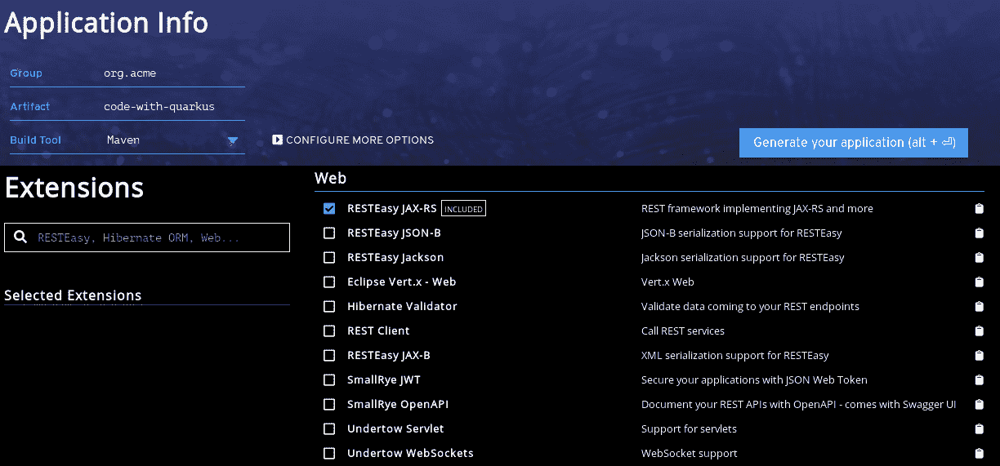
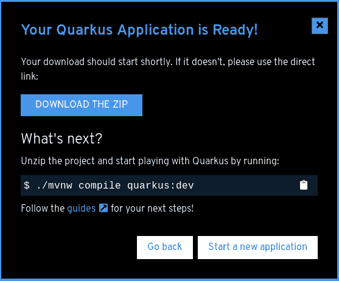
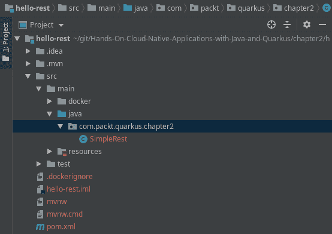
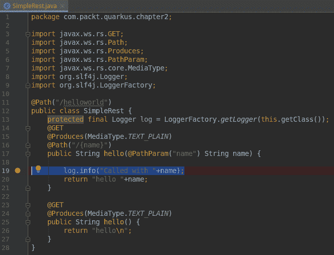
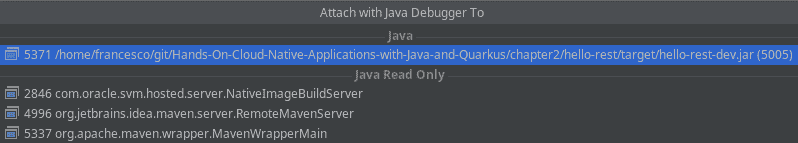
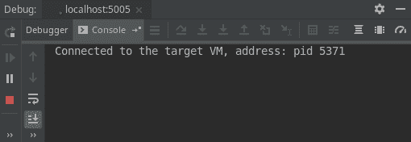
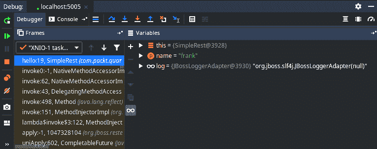

# 第二章：使用 Quarkus 开发你的第一个应用程序

在本章中，我们将使用我们可用的工具来创建我们的第一个 Quarkus 应用程序。正如你很快就会看到的，这是一个相当简单的流程，可以从命令行启动，不需要你下载任何外部工具。通过使用这个流程，我们将能够将应用程序编译成原生可执行文件，并证明当 Quarkus 将其转换为原生代码时，Java 应用程序可以有多快和多轻。

在本章中，我们将涵盖以下主题：

+   使用 Quarkus Maven 插件启动我们的项目

+   启动项目的替代方法（Quarkus CLI）

+   创建和执行我们的第一个 Quarkus 应用程序

+   从我们的 IDE 调试应用程序

+   使用 JUnit 测试框架的扩展测试应用程序

+   将我们的应用程序转换为原生代码

# 技术要求

你可以在 GitHub 上找到本章项目的源代码，地址为[`github.com/PacktPublishing/Hands-On-Cloud-Native-Applications-with-Java-and-Quarkus/tree/master/Chapter02`](https://github.com/PacktPublishing/Hands-On-Cloud-Native-Applications-with-Java-and-Quarkus/tree/master/Chapter02)。

# 使用 Quarkus Maven 插件入门

为了构建我们的第一个 Quarkus 应用程序，我们将使用 Maven，这是最常见的一种软件和发布管理工具。它被各种开发者所使用，主要是因为它提供了以下功能：

+   所有项目的标准结构

+   依赖项的集中和自动管理

Maven 以几种格式分发给用户方便使用。你可以从[`maven.apache.org/download.cgi`](https://maven.apache.org/download.cgi)下载它。

下载 Maven 后，执行以下操作：

1.  将分发存档（例如，`apache-maven-3.6.1-bin.zip`）解压缩到你想安装 Maven 的目录中（例如，在你的`$HOME/apache`文件夹中）：

```java
$ mkdir $HOME/apache
$ unzip $HOME/Downloads/apache-maven-3.6.1-bin.zip -d $HOME/apache 
```

1.  将 Maven 库添加到你的系统路径中，如下面的代码所示。这将更新`PATH`环境变量：

```java
 $ export PATH=$PATH:$HOME/apache/apache-maven-3.6.1/bin
```

1.  完成安装后，你需要检查 Maven 是否已正确安装。运行`mvn --version`来验证这一点：

```java
 $ mvn --version
 Apache Maven 3.6.1 
 Maven home: /home/francesco/apache/apache-maven-3.6.1
 Java version: 1.8.0_191, vendor: Oracle Corporation, runtime: /usr/lib/jvm/java-1.8.0-openjdk-1.8.0.191.b13-0.fc29.x86_64/jre
 Default locale: en_US, platform encoding: UTF-8
 OS name: "linux", version: "4.18.16-300.fc29.x86_64", arch: "amd64", family: "unix"
```

如果你得到了前面的输出，那么你刚刚验证了 Maven 已经安装在你的系统上。

# 启动 Quarkus Maven 插件

现在 Maven 已经设置好了，我们可以通过其 Maven 插件启动我们的第一个 Quarkus 应用程序。Maven 插件提供了一组目标，可以执行以编译和构建我们的工件或扩展我们的项目以添加一些功能。每个插件，就像每个 Maven 组件一样，基于以下坐标：

+   `groupId`：项目组的 ID。这通常与包根目录的 ID 相匹配。

+   `artifactId`：工件 ID。这通常与最终工件名称相匹配。

+   `version`：指定组下工件版本。

您可以通过指定 `<groupId>:<artifactId>` 坐标从命令行引用 Maven 插件。对于 Quarkus，`<groupId>:<artifactId>` 组合是 `io.quarkus:quarkus-maven-plugin`。您可以使用以下命令检查可用的目标和最新版本：

```java
$ mvn -Dplugin=io.quarkus:quarkus-maven-plugin help:describe

```

您将看到以下输出：

```java
 Name: Quarkus - Maven Plugin
 Description: Build parent to bring in required dependencies
 Group Id: io.quarkus
 Artifact Id: quarkus-maven-plugin
 Version: 1.0.0.Final
 Goal Prefix: quarkus

 This plugin has 11 goals:

 quarkus:add-extension
 Description: (no description available)

 quarkus:add-extensions
 Description: Allow adding an extension to an existing pom.xml file. 
 Because you can add one or several extension in one go, there are 2 
 mojos:
 add-extensions and add-extension. Both supports the extension and
 extensions parameters.

 quarkus:analyze-call-tree
 Description: (no description available)

 quarkus:build
 Description: (no description available)

 quarkus:create
 Description: This goal helps in setting up Quarkus Maven project with
 quarkus-maven-plugin, with sensible defaults

 quarkus:create-example-config
 Description: (no description available)

 quarkus:dev
 Description: The dev mojo, that runs a quarkus app in a forked process

 quarkus:help
 Description: Display help information on quarkus-maven-plugin.
 Call mvn quarkus:help -Ddetail=true -Dgoal=<goal-name> to display parameter
 details.

 quarkus:list-extensions
 Description: (no description available)

 quarkus:native-image
 Description: (no description available)

 quarkus:remote-dev
 Description: The dev mojo, that connects to a remote host
```

我们第一个应用程序的源代码可以位于本书 GitHub 存储库的 `Chapter02/hello-rest` 文件夹中。为了参考，我们使用 Maven 插件创建了应用程序，并配置了以下参数集：

```java
$ mvn io.quarkus:quarkus-maven-plugin:1.0.0.Final:create \
 -DprojectGroupId=com.packt.quarkus.Chapter02 \
 -DprojectArtifactId=hello-rest \
 -DclassName="com.packt.quarkus.Chapter02.SimpleRest" \
 -Dpath="/helloworld"
```

由于前面的命令，`hello-rest` 文件夹中已生成以下目录结构：

```java
 ├── mvnw
 ├── mvnw.cmd
 ├── pom.xml
 └── src
     ├── main
     │   ├── docker
     │   │   ├── Dockerfile.jvm
     │   │   └── Dockerfile.native
     │   ├── java
     │   │   └── com
     │   │       └── packt
     │   │           └── quarkus
     │   │               └── Chapter02
     │   │                   └── SimpleRest.java
     │   └── resources
     │       ├── application.properties
     │       └── META-INF
     │           └── resources
     │               └── index.html
     └── test
         └── java
             └── com
                 └── packt
                     └── quarkus
                         └── Chapter02
                             ├── NativeSimpleRestIT.java
                             └── SimpleRestTest.java
```

在本章的下一节中，我们将学习如何将项目导入 IntelliJ IDEA（尽管在任意 IDE 中步骤大致相同）。现在，让我们继续查看项目的前一个树视图，并查看包含在本项目中的文件：

+   一个 **项目对象模型** (`pom.xml`)，包含项目配置

+   一个名为 `SimpleRest.java` 的示例 REST 服务以及为其创建的测试类 `SimpleRestTest.java`，以及一个名为 `NativeSimpleRestIT.java` 的包装类，用于在原生可执行应用程序上执行测试

+   配置文件占位符（`application.properties`）

+   一个 `index.html` 文件，指示我们可以添加静态网页内容

+   一个 `Dockerfile`，以便我们可以从我们的应用程序创建容器

+   Maven 包装文件（`mvnw/mvnw.cmd`），允许我们在不预先安装 Maven 的情况下执行 Maven 目标

`pom.xml` 文件将被添加到项目的根目录。在那里，您将找到一个上层的 `dependencyManagement` 部分，它导入 Quarkus 的 **物料清单**。这允许我们自动链接每个 Quarkus 扩展的确切版本。

在 Quarkus 的 1.0.0.Final 版本中，您将引用名为 `quarkus-universe-bom` 的 `artifactId`，它属于 `groupId io.quarkus`。

在这里，已经包含了 `quarkus-maven-plugin`，以便您可以对您的应用程序进行打包并生成原生可执行文件：

```java
<dependencyManagement>
  <dependencies>
    <dependency>
      <groupId>${quarkus.platform.group-id}</groupId>
      <artifactId>${quarkus.platform.artifact-id}</artifactId>
      <version>${quarkus.platform.version}</version>
      <type>pom</type>
      <scope>import</scope>
    </dependency>
  </dependencies>
</dependencyManagement>
<build>
  <plugins>
    <plugin>
      <groupId>io.quarkus</groupId>
      <artifactId>quarkus-maven-plugin</artifactId>
      <version>${quarkus-plugin.version}</version>
      <executions>
        <execution>
          <goals>
            <goal>build</goal>
          </goals>
        </execution>
      </executions>
    </plugin>
</build>
```

进入依赖关系部分，您将看到添加的唯一运行时依赖项如下，它允许您执行基本的 REST 应用程序：

```java
<dependency>
   <groupId>io.quarkus</groupId>
   <artifactId>quarkus-resteasy</artifactId>
</dependency>
```

**RESTEasy** 是 JAX-RS 规范的可移植实现，默认包含在 WildFly 应用服务器中（[`www.wildfly.org`](http://www.wildfly.org)）。您可以使用它通过标准 HTTP 方法使用无状态通信来提供您服务的表示。

除了 `quarkus-resteasy` 之外，一些其他库也被包含在您的 `pom.xml` 文件中，目的是测试您的应用程序。这将在 *测试 Quarkus 应用程序* 部分中更详细地讨论。

要向您的项目添加额外的库，除了编辑 `pom.xml` 文件外，您还可以使用 `add-extension`，这在 Quarkus 的 Maven 插件中可以找到。一个例子是 `$ mvn quarkus:add-extension -Dextensions="io.quarkus:quarkus-jsonp,io.quarkus:quarkus-smallrye-health"`。

以下 `SimpleRest` 类已经为您自动生成在 `src/main/java/com/packt/quarkus/Chapter02`：

```java
import javax.ws.rs.GET;
import javax.ws.rs.Path;
import javax.ws.rs.Produces;
import javax.ws.rs.core.MediaType;

@Path("/helloworld")
public class SimpleRest {

     @GET
     @Produces(MediaType.TEXT_PLAIN)
     public String hello() {
         return "hello";
     }
}
```

如您所见，这是一个非常简单的 REST 端点，它利用 JAX-RS API 在 `/helloworld GET` 请求落在默认端口时生成 `TEXT_PLAIN` 资源。

**比 JAX-RS 更简单！**

如我们之前提到的，Quarkus 简化了代码开发以提供合理的默认值。然而，我们不再需要声明一个 `ApplicationScoped` 类来启动 REST 服务，因为我们将会以默认选项获得它。

# 运行应用程序

现在，我们已经准备好运行我们的应用程序。执行 `compile` 和 `quarkus:dev` 目标来构建并运行它：

```java
$ mvn compile quarkus:dev

```

几秒钟后，应用程序将被编译并执行，如下面的日志所示：

```java
[INFO] Scanning for projects...
. . . .
[INFO] --- maven-resources-plugin:2.6:resources (default-resources) @ hello-rest ---
[INFO] Using 'UTF-8' encoding to copy filtered resources.
[INFO] Copying 2 resources
[INFO] 
[INFO] --- maven-compiler-plugin:3.8.1:compile (default-compile) @ hello-rest ---
[INFO] Changes detected - recompiling the module!
[INFO] Compiling 1 source file to /home/francesco/git/packt/Hands-On-Cloud-Native-Applications-with-Java-and-Quarkus/chapter2/hello-rest/target/classes
[INFO] 
[INFO] --- quarkus-maven-plugin:1.0.0.Final:dev (default-cli) @ hello-rest ---
Listening for transport dt_socket at address: 5005
2019-11-11 13:10:34,493 INFO  [io.qua.dep.QuarkusAugmentor] (main) Beginning quarkus augmentation
2019-11-11 13:10:35,078 INFO  [io.qua.dep.QuarkusAugmentor] (main) Quarkus augmentation completed in 585ms
2019-11-11 13:10:35,395 INFO  [io.quarkus] (main) Quarkus 1.0.0.CR1 started in 1.079s. Listening on: http://0.0.0.0:8080
2019-11-11 13:10:35,397 INFO  [io.quarkus] (main) Profile dev activated. Live Coding activated.
2019-11-11 13:10:35,397 INFO  [io.quarkus] (main) Installed features: [cdi, resteasy]
```

现在，您可以使用浏览器或像 `curl` 这样的工具请求提供的端点：

```java
 $ curl http://localhost:8080/helloworld
 hello
```

您可以使用 *Ctrl* + *C* 停止应用程序，尽管我们建议保持其运行，因为我们很快将测试 **热重载** 功能！

# 使用 Maven 插件生成 Gradle 项目

尽管名为 Quarkus Maven 插件，但它相当中立。实际上，您也可以使用它来生成 **Gradle** 项目。这两个工具的比较超出了本书的范围；然而，许多开发者更喜欢 Gradle 作为构建工具，因为它以最基本的方式是可扩展的，并且具有出色的性能。

话虽如此，您可以通过将 `buildTool` 选项设置为 `gradle` 来简单地生成 Gradle 项目，否则默认为 `maven`。以下是您如何使用 Gradle 生成项目的方法：

```java
mvn io.quarkus:quarkus-maven-plugin:1.0.0.Final:create \
 -DprojectGroupId=com.packt.quarkus.Chapter02 \
 -DprojectArtifactId=hello-rest \
 -DclassName="com.packt.quarkus.Chapter02.SimpleRest" \
 -Dpath="/helloworld" \
 -DbuildTool=gradle
```

生成的 `build.gradle` 文件定义了可用的存储库和依赖项集合，并设置了核心项目属性，如 `quarkusPlatformGroupId`、`quarkusPlatformArtifactId` 和 `quarkusPlatformVersion` 作为变量：

```java
buildscript {
    repositories {
        mavenLocal()
    }
    dependencies {
        classpath "io.quarkus:quarkus-gradle-
        plugin:${quarkusPluginVersion}"
    }
}

plugins {
    id 'java'
}

apply plugin: 'io.quarkus'

repositories {
     mavenLocal()
     mavenCentral()
}

dependencies {
    implementation enforcedPlatform("${quarkusPlatformGroupId}:
    ${quarkusPlatformArtifactId}:${quarkusPlatformVersion}")
    implementation 'io.quarkus:quarkus-resteasy'

    testImplementation 'io.quarkus:quarkus-junit5'
    testImplementation 'io.rest-assured:rest-assured'

    nativeTestImplementation 'io.quarkus:quarkus-junit5'
    nativeTestImplementation 'io.rest-assured:rest-assured'
}

group 'org.acme'
version '1.0.0-SNAPSHOT'

compileJava {
    options.compilerArgs << '-parameters'
}

java {
    sourceCompatibility = JavaVersion.VERSION_1_8
    targetCompatibility = JavaVersion.VERSION_1_8
}
```

所有前面的变量都是从位于项目根目录的 `gradle.properties` 文件中检索的。

如您从配置中看到的，默认项目中还包括了一个插件，这样您就可以轻松构建您的应用程序并在开发模式下启动，如下所示：

```java
./gradlew quarkusDev
```

最后，值得一提的是，Gradle 扩展仍在开发中，因此您可能会在下一个 Quarkus 版本中看到一些更改或更新。

现在，我们将学习如何轻松地使用在线 Quarkus 项目生成器启动我们的项目（无论是 Maven 还是 Gradle）。

# 使用 Quarkus 在线应用程序启动应用程序

启动您的 Quarkus 应用程序的另一种选项是使用在线应用程序，该应用程序可在以下地址找到：[`code.quarkus.io/`](https://code.quarkus.io/)。

通过访问该页面，您将能够生成一个具有初始端点和您在用户界面中检查的所有扩展的基本项目：



如前一个截图所示，默认情况下，仅选中了**RESTEasy**扩展。从界面的左上角，您可以配置您的项目坐标（`groupId`，`artifactId`）和构建工具，这可以是 Maven 或 Gradle。更多选项可通过“更多配置选项”面板获得，该面板允许您配置包名和项目的版本。

通过滚动查看可用扩展列表，您还可以选择尝试使用其他语言，如 Kotlin 或 Scala，来开发您的 Quarkus 应用程序。这些选项仍在开发中，因此请考虑，随着扩展的成熟，它们的 API 和/或配置可能会发生变化。然而，Quarkus 团队非常感谢您对任何预览扩展的测试反馈。

当您设置完选项后，只需单击“启动新应用程序”即可将工件作为压缩文件夹下载：



现在，您只需将其解包并导入您喜欢的 IDE 中。我们将在下一节中这样做。

# 在您的 IDE 中测试实时重新加载

在本节中，我们将使用 Quarkus 的实时重新加载功能。为此，我们将项目导入到我们的 IDE 中，以便我们可以应用一些更改。

导航到文件 | 打开，并指向您创建 Maven 项目的文件夹。它将自动导入到您的 IDE 中。以下是您的 Java 类的文件标签视图：



现在，让我们看看 Quarkus 的实时重新加载是如何工作的。为此，让我们对我们的代码进行简单的修改。在这里，我们已修改了`hello`方法的返回值，如下所示：

```java
public class SimpleRest {

     @GET
     @Produces(MediaType.TEXT_PLAIN)
     public String hello() {
 return "hello changed!";
     }
 }          
```

希望您没有停止您的服务器。现在，再次尝试调用该服务：

```java
$ curl http://localhost:8080/helloworld
 hello changed!
```

如您所见，在开发模式下运行时，您可以实时重新加载您的应用程序。令人惊叹，不是吗？

实时重新加载也适用于资源文件，如网页或配置属性文件。请求服务将触发工作区扫描，如果检测到任何更改，Java 文件将被重新编译，应用程序将被重新部署。然后，您的请求将由重新部署的应用程序处理。

# 应用程序调试

在开发模式下运行时，Quarkus 将自动监听端口`5005`上的调试器。您可以使用以下基本 shell 命令检查调试是否激活：

```java
$ netstat -an | grep 5005
 tcp        0      0 0.0.0.0:5005            0.0.0.0:*               LISTEN    
```

现在，让我们在`hello`方法中撤销这些更改，并包含另一个`hello`方法，该方法接收一个要检查的输入参数：

```java
package com.packt.quarkus.chapter2;

import javax.ws.rs.GET;
import javax.ws.rs.Path;
import javax.ws.rs.Produces;
import javax.ws.rs.PathParam;
import javax.ws.rs.core.MediaType;
import org.slf4j.Logger;
import org.slf4j.LoggerFactory;

@Path("/helloworld")
public class SimpleRest {
    protected final Logger log = LoggerFactory.getLogger(this.getClass());
 @GET
 @Produces(MediaType.TEXT_PLAIN)
 @Path("/{name}")
 public String hello(@PathParam("name") String name) {

 log.info("Called with "+name);
 return "hello "+name;
 }

    @GET
    @Produces(MediaType.TEXT_PLAIN)
    public String hello() {
        return "hello";
    }
} 
```

通过在我们的 REST 服务中使用 `@PathParam` 表达式，我们将能够从我们的 IDE 中作为方法变量调试这个表达式的值。现在，放置一个断点在日志语句上，如下截图所示：



接下来，为了将 IntelliJ IDEA 连接到调试器，你必须连接到调试器的端口。在 IntelliJ IDEA 中，你可以通过多种方式做到这一点。最简单的方法是选择 Run | Attach to Process。你的应用程序的可运行进程将被检测，如下截图所示：



选择它并检查你是否成功附加到了它。你可以从调试器控制台这样做：



现在，通过在末尾添加一个额外的参数来调用应用程序，以便你能够触发断点：

```java
 $ curl http://localhost:8080/helloworld/frank
```

从调试器提示符，你可以从其控制台检查类和方法变量。你也可以通过点击调试器控制台左侧的按钮来控制执行路径（Step Over，Step Into，Stop 等）：



如果你想在启动 Quarkus 应用程序之前等待调试器附加，你可以在命令行上传递 `-Ddebug`。一旦你的 IDE 的调试器连接，Quarkus Augmentor 将启动，你的应用程序将被执行。另一方面，如果你根本不需要调试器，你可以使用 `-Ddebug=false`。

# 测试 Quarkus 应用程序

除了示例端点外，Maven 插件还自动包含了一个用于我们 REST 服务的测试类：

```java
package com.packt.quarkus.chapter2;

import io.quarkus.test.junit.QuarkusTest;
import org.junit.jupiter.api.Test;

import static io.restassured.RestAssured.given;
import static org.hamcrest.CoreMatchers.is;

@QuarkusTest
public class SimpleRestTest {

     @Test
     public void testHelloEndpoint() {
         given()
           .when().get("/helloworld")
           .then()
              .statusCode(200)
              .body(is("hello"));
     }

}
```

在幕后，这个测试类使用 JUnit 作为核心测试框架和 REST Assured 库：

```java
<dependency>
   <groupId>io.quarkus</groupId>
   <artifactId>quarkus-junit5</artifactId>
   <scope>test</scope>
 </dependency>
 <dependency>
   <groupId>io.rest-assured</groupId>
   <artifactId>rest-assured</artifactId>
   <scope>test</scope>
 </dependency>
```

**REST Assured** 是一个 Java 库，可以用来使用灵活的 **领域特定语言**（**DSL**）编写强大的 REST API 测试。REST Assured 中可用的流畅 API 支持来自 **行为驱动开发**（**BDD**）的标准模式，使用 `Given/When/Then` 语法。生成的测试易于阅读，并且可以包含我们构建测试所需的全部步骤，只需一行代码即可。

现在，我们可以验证响应体的内容并检查 HTTP 响应状态码是否为 200。我们可以通过运行以下命令来验证测试的执行：

```java
$ mvn clean test
```

你应该在控制台看到以下输出：

```java
[INFO] Running com.packt.quarkus.chapter2.SimpleRestTest
 2019-05-16 11:04:21,166 INFO  [io.qua.dep.QuarkusAugmentor] (main) Beginning quarkus augmentation
 2019-05-16 11:04:21,832 INFO  [io.qua.dep.QuarkusAugmentor] (main) Quarkus augmentation completed in 669ms
 2019-05-16 11:04:22,108 INFO  [io.quarkus] (main) Quarkus 1.0.0.Final started in 0.265s. Listening on: http://[::]:8081
 2019-05-16 11:04:22,109 INFO  [io.quarkus] (main) Installed features: [cdi, resteasy]
 [INFO] Tests run: 1, Failures: 0, Errors: 0, Skipped: 0, Time elapsed: 2.958 s - in com.packt.quarkus.chapter2.SimpleRestTest

2019-05-16 11:04:23,263 INFO 

[io.quarkus] (main) Quarkus stopped in 0.005s
 [INFO]
 [INFO] Results:
 [INFO]
 [INFO] Tests run: 1, Failures: 0, Errors: 0, Skipped: 0
 [INFO]
 [INFO] -----------------------------------------------------------------------
 [INFO] BUILD SUCCESS
 [INFO] -----------------------------------------------------------------------
```

如你所见，测试在本地 IP 地址的端口 `8081` 上启动了 Quarkus 运行时。因此，它不会干扰默认在端口 `8080` 上运行的开发/生产环境。

你可以通过使用 `and()` 方法将多个条件混合匹配在你的测试中。这个方法作为一个简单的语法糖，也就是说，它有助于使代码更易读。以下是一个如何包含对头部 `Content-Length` 的检查的示例：

```java
@Test
public void testHelloEndpointHeader() {
    given()
      .when().get("/helloworld")
         .then()
         .statusCode(200)
         .body(is("hello"))
           .and()
            .header("Content-Length","6");
}
```

通过使用参数化测试，您可以在单个方法中通过提供不同的记录集来测试多个场景。REST Assured 支持两种不同类型的参数：

+   **查询参数**：这些参数可以附加在 RESTful API 端点的末尾，并且通过它们前面的问号来识别。以下是一个示例：

```java
@Test
public void testHelloEndpointQueryParam() {
    given()
      .param("name","Frank")
      .when().get("/helloworld")
         .then()
         .statusCode(200)
         .body(is("hello"));

}
```

如您所见，使用查询参数只需要我们通过连接 `param()` 方法来指定它们的名称和值。

+   **路径参数**：这些参数以类似的方式指定，即通过包含 `pathParam()` 方法以及参数名称/值组合：

```java
@Test
public void testHelloEndpointPathParam() {

 given()
 .pathParam("name", "Frank")
 .when().get("/helloworld/{name}")
 .then()
 .statusCode(200)
 .body(is("hello Frank"));
}
```

最后，值得一提的是，由于 Quarkus 致力于最高性能，您还可以根据响应时间验证您的测试。这可以通过将 `time()` 连接到条件来实现。以下是一个示例，当返回响应时将时间设置为小于一秒：

```java
@Test
public void testTimedHelloEndpointPathParam() {

 given()
 .pathParam("name", "Frank")
 .when().get("/helloworld/{name}")
 .then()
 .time(lessThan(1000L))
 .body(is("hello Frank"));
}
```

在本节中，我们介绍了我们可以使用 REST Assured API 构建的常见测试场景。如果您想查看更多高级模式，我们建议查看其 Wiki，它可在 [`github.com/rest-assured/rest-assured/wiki/usage`](https://github.com/rest-assured/rest-assured/wiki/usage) 找到。

# 选择不同的端口进行测试

您可以通过在 `src/main/resources/application.properties` 文件中设置适当的值来更改 Quarkus 用于测试的默认端口（`8081`），这是 Quarkus 的通用配置文件。例如，要将测试端口更改为 `9081`，您需要在 `application.properties` 中添加以下信息：

```java
quarkus.http.test-port=9081
```

作为替代，您也可以在启动时通过传递 `-Dquarkus.http.test-port=9081` 标志来使用相同的属性。

# 将您的应用程序转换为原生可执行文件

现在，是时候检查 Quarkus 如何将我们的字节码转换为原生可执行文件了。这种魔法是通过一个名为 `native` 的 Maven 配置文件在幕后完成的，该配置文件在您搭建应用程序时默认包含：

```java
<profile>
 <id>native</id>
  <activation>
    <property>
      <name>native</name>
    </property>
  </activation>
  <build>
    <plugins>
      <plugin>
        <artifactId>maven-failsafe-plugin</artifactId>
        <version>${surefire-plugin.version}</version>
        <executions>
          <execution>
            <goals>
              <goal>integration-test</goal>
              <goal>verify</goal>
            </goals>
            <configuration>
              <systemProperties>
                <native.image.path>${project.build.directory}
                  /${project.build.finalName}-runner
                </native.image.path>
              </systemProperties>
            </configuration>
          </execution>
        </executions>
      </plugin>
    </plugins>
  </build>
  <properties>
    <quarkus.package.type>native</quarkus.package.type>
  </properties>
</profile>
```

此外，`maven-failsafe-plugin` 已经自动配置为运行 `integration-test goal`，因为我们已经设置了构建原生图像的路径作为系统属性。

在构建您的可执行文件之前，请确保您已经按照前一章所述在环境中设置了 `GRAALVM_HOME`。

接下来，通过执行以下命令创建一个原生可执行文件：

```java
$ mvn package -Pnative
```

插件将开始分析您应用程序中使用的类和打包，以及调用树。生成的输出将是一个超级精简的可执行文件，它只包含一个薄薄的 JVM 层（足够窄，仅用于执行应用程序）以及应用程序本身。

您应该在输出的末尾看到类似以下的内容：

```java
[INFO] [io.quarkus.deployment.QuarkusAugmentor] Quarkus augmentation completed in 60485ms
```

除了包含您应用程序压缩字节码的 JAR 文件外，以下可执行文件将在 `target` 文件夹中生成：

```java
Nov 11 14:49 hello-rest-1.0-SNAPSHOT-runner
```

您应用程序的实际名称可以通过在`pom.xml`文件中设置`native.image.path`环境变量来改变，默认值为`${project.build.directory}/${project.build.finalName}-runner`。

如您所见，我们有一个大约 20 MB 的可执行应用程序运行时，它包含所有库以及从 JVM 运行我们的应用程序所需的一切。您可以使用以下命令执行它：

```java
$ target/hello-rest-1.0-SNAPSHOT-runner
```

仅仅 0.006 秒，我们就让我们的服务启动并运行。这可以在控制台日志中看到：

```java
2019-11-11 14:53:38,619 INFO  [io.quarkus] (main) hello-rest 1.0-SNAPSHOT (running on Quarkus 1.0.0.CR1) started in 0.014s. Listening on: http://0.0.0.0:8080
2019-11-11 14:53:38,619 INFO  [io.quarkus] (main) Profile prod activated. 
2019-11-11 14:53:38,619 INFO  [io.quarkus] (main) Installed features: [cdi, resteasy]
```

让我们通过执行`ps`命令来检查这个紧凑型应用程序的内存使用情况：

```java
$ ps -o pid,rss,command -p $(pgrep -f hello-rest)
```

这里是我从我的笔记本电脑收集到的输出：

```java
PID   RSS   COMMAND
27919 18720 target/hello-rest-1.0-SNAPSHOT-runner
```

尽管输出可能因您的环境而异，但**常驻集大小**（**RSS**）显示该进程正在使用大约 18 MB 的内存，这仅是 Java 应用程序所需的最小内存大小的一小部分。

现在，让我们执行它以检查结果：

```java
$ curl http://localhost:8080/helloworld
 hello
```

如您所见，当我们将我们的应用程序转换为本地应用程序时，结果并没有改变。

# 对本地可执行文件执行集成测试

有趣的是，本地可执行代码可以测试。当您生成示例项目时，测试文件夹中包含了一个名为`Native<project>Test`的类名。这个类与 Java 测试不同，因为它被注解为`@NativeImageTest`注解。

由于 Maven failsafe 插件的配置，所有以**IT**结尾或用`@NativeImageTest`注解的 rest 都将针对本地可执行文件运行。

在代码方面，无需进行任何更改，因为它使用继承来执行来自我们的`SimpleRestTest`类的本地可执行测试：

```java
@NativeImageTest
public class NativeSimpleRestIT extends SimpleRestTest {

    // Execute the same tests but in native mode.
}
```

`verify`目标用于测试本地可执行文件。在此之前，请确保您已将 GraalVM 安装路径导出到您的环境中：

```java
export GRAALVM_HOME=/path/to/graal
```

现在，你可以运行`verify`目标来测试本地可执行应用程序：

```java
$ mvn verify -Pnative
```

请检查结果是否与本章前面*测试 Quarkus 应用程序*部分中产生的结果相同：

```java
[INFO] Running com.packt.quarkus.chapter2.SimpleRestTest
 2019-05-16 11:35:22,509 INFO  [io.qua.dep.QuarkusAugmentor] (main) Beginning quarkus augmentation
 2019-05-16 11:35:23,084 INFO  [io.qua.dep.QuarkusAugmentor] (main) Quarkus augmentation completed in 575ms
 2019-05-16 11:35:23,419 INFO  [io.quarkus] (main) Quarkus 1.0.0.Final started in 0.319s. Listening on: http://[::]:8081
 2019-05-16 11:35:23,419 INFO  [io.quarkus] (main) Installed features: [cdi, resteasy]
 2019-05-16 11:35:24,354 INFO  [com.pac.qua.cha.SimpleRest] (XNIO-1 task-1) Called with Frank
 2019-05-16 11:35:24,598 INFO  [com.pac.qua.cha.SimpleRest] (XNIO-1 task-1) Called with Frank
 [INFO] Tests run: 5, Failures: 0, Errors: 0, Skipped: 0, Time elapsed: 2.215 s - in com.packt.quarkus.chapter2.SimpleRestTest
```

太好了！我们刚刚成功测试了我们的示例应用程序在两种场景（JVM 和本地可执行）下。

# 摘要

在本章中，我们完成了我们的第一个概念验证 Quarkus 项目，该项目是通过`quarkus-maven-plugin`生成的。默认应用程序是一个具有所有最小功能和一个我们逐步丰富`Test`类的 REST 服务的原型。在本章的第二部分，我们看到了如何使用`quarkus-maven-plugin`的适当本地配置将 Java 应用程序代码转换为瘦型本地可执行文件。

到目前为止，我们只是触及了我们可以用 Quarkus 做到的事情的表面。现在，是时候继续前进，学习如何从我们的本地应用程序创建容器镜像，并在 Kubernetes 环境中部署它。这就是我们将在下一章中讨论的内容。
