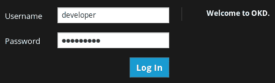
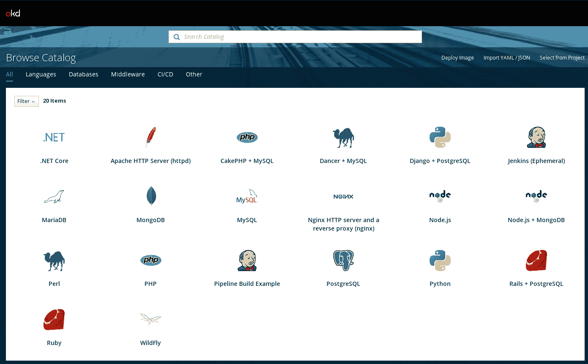
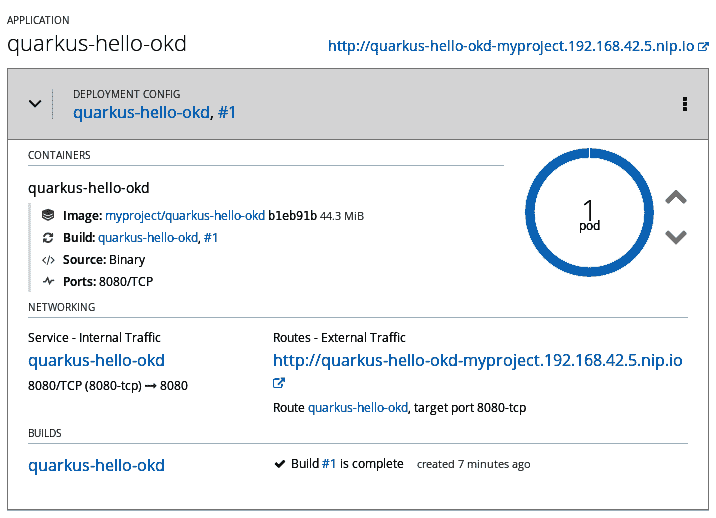
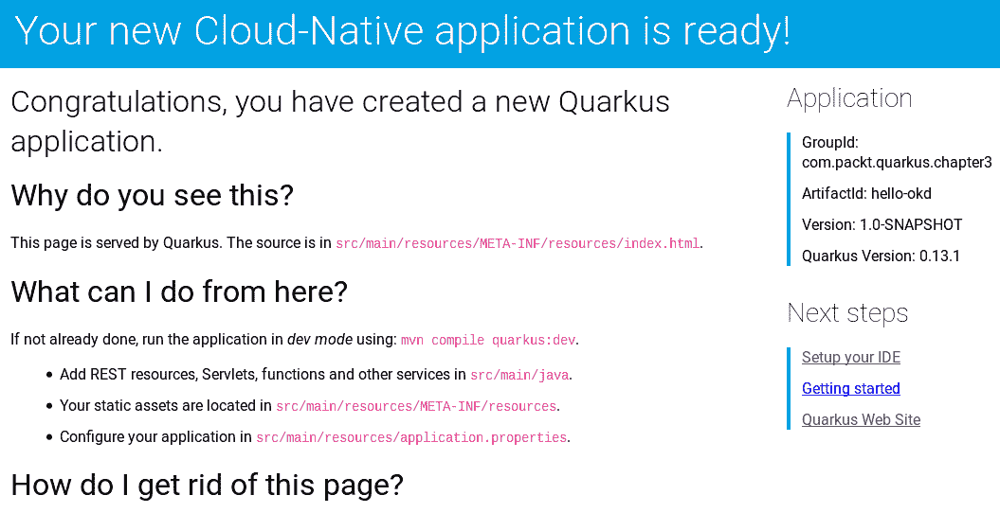
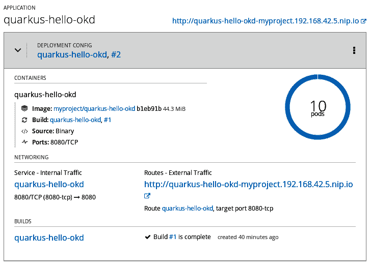

# 第三章：创建您的应用程序的容器镜像

在上一章中，我们通过运行传统的 JVM 应用程序并将其转换为原生构建，一瞥了 Quarkus 应用程序的力量。然而，Quarkus 不仅仅有精简的可执行文件和低资源使用，因此，在本章中，我们将继续学习如何创建我们的应用程序的容器镜像，然后可以部署到 Kubernetes 原生环境中。为此，我们的待办事项列表包括安装 Docker 工具和 OpenShift 的社区版，这被称为**Origin Community Distribution of Kubernetes**，或简称**OKD**。然后，我们将学习如何扩展我们的应用程序，以便我们可以进一步提高其响应时间。

在本章中，我们将涵盖以下主题：

+   在您的环境中设置 Docker

+   在容器中启动 Quarkus 应用程序

+   在容器中运行原生可执行文件

+   在 OpenShift 上部署您的容器镜像

+   扩展我们的应用程序以提高其吞吐量

# 技术要求

您可以在 GitHub 上找到本章节的项目源代码，链接为[`github.com/PacktPublishing/Hands-On-Cloud-Native-Applications-with-Java-and-Quarkus/tree/master/Chapter03`](https://github.com/PacktPublishing/Hands-On-Cloud-Native-Applications-with-Java-and-Quarkus/tree/master/Chapter03)。

# 设置 Docker

Docker 是一个工具，它让我们能够简化在我们环境中创建和执行容器。每个容器反过来又把一个应用程序及其依赖项封装成一个单一的标准化单元，该单元包括它运行所需的一切，即系统工具、代码和其他所需的库。这保证了您的应用程序将始终以相同的方式执行，通过共享一个简单的容器镜像。Docker 有两种版本：

+   **社区版**（**CE**）：我们将在这本书中使用 Docker CE，它非常适合寻求快速开始使用 Docker 和基于容器的应用程序的开发人员和小型团队。

+   **企业版**（**EE**）：EE 具有额外的功能，例如认证的基础设施、镜像管理和镜像安全扫描。

虽然我们将使用 Docker 的社区版，但这并不会降低您应用程序的完整潜力，因为我们将通过原生 Kubernetes 平台利用高级容器功能，这对于在生产环境中大规模运行业务关键应用程序是一个理想的解决方案。

Docker 的安装过程在[`docs.docker.com/install/`](https://docs.docker.com/install/)上进行了全面文档化。简而言之，您可以根据自己的需求遵循几种安装策略：

+   从中期角度来看，你可能希望简化 Docker 的升级。大多数用户选择设置 Docker 的仓库，并从那里安装和升级（[`docs.docker.com/install/linux/docker-ce/fedora/#install-using-the-repository`](https://docs.docker.com/install/linux/docker-ce/fedora/#install-using-the-repository)）。

+   另一个选项，如果你在离线机器上安装 Docker，证明非常实用，需要手动安装 RPM 软件包，并手动处理升级（[`docs.docker.com/install/linux/docker-ce/fedora/#install-from-a-package`](https://docs.docker.com/install/linux/docker-ce/fedora/#install-from-a-package)）。

+   最后，为了快速方便地安装，你可以使用自动化脚本，该脚本将检测你的操作系统并相应地安装 Docker。为了简化，我们将选择此选项。

让我们按照以下步骤继续安装 Docker：

1.  自动化脚本可以从 [`get.docker.com/`](https://get.docker.com/) 下载，如下所示：

```java
$ curl -fsSL https://get.docker.com -o get-docker.sh
```

1.  现在，使用以下命令执行它：

```java
$ sh get-docker.sh
```

重要！就像任何其他 shell 脚本一样，在执行之前验证其内容！其内容需要与位于 [`github.com/docker/docker-install`](https://github.com/docker/docker-install) 的 `install.sh` 脚本相匹配。如果不匹配，请通过访问 Docker 安装页面来验证自动化脚本是否仍在维护。

1.  如果你希望以非特权用户身份运行 Docker，你应该考虑通过执行以下命令将你的用户添加到 `docker` 组：

```java
$ sudo usermod $(whoami) -G docker -a
```

1.  为了使其生效，你需要注销并重新登录。我们可以通过检查以下命令的输出来确认我们的用户现在是否在 Docker 组中：

```java
$ groups $(whoami)
```

1.  输出应包括 `docker` 在组列表中。现在，你可以验证是否可以在非 root 用户（或 `sudo`）的情况下运行 Docker 命令：

```java
$ docker run hello-world
```

1.  上述命令将从 Docker 仓库拉取 `hello-world` 测试镜像，并在容器中运行它。当测试镜像启动时，它会打印一条信息性消息然后退出：

```java
Status: Downloaded newer image for hello-world:latest
Hello from Docker!
```

此消息表明你的安装似乎工作正常。

# 在容器中运行 Quarkus 应用程序

一旦安装了 Docker，你就可以准备从你的 Java 或本地可执行应用程序构建 Docker 镜像了。为此，我们将快速构建另一个简单的应用程序，该应用程序检查一些环境变量以确定应用程序运行的容器 ID。

本章的源代码位于本书 GitHub 仓库的 `Chapter03/hello-okd` 文件夹中。我们建议在继续之前将项目导入到你的 IDE 中。

让我们从 REST 端点类 (`HelloOKD`) 开始，该类从 **Contexts and Dependency Injection** (**CDI**) 服务返回一些信息：

```java
 package com.packt.quarkus.chapter3;

 import javax.ws.rs.GET;
 import javax.ws.rs.Path;
 import javax.ws.rs.Produces;
 import javax.ws.rs.core.MediaType;
 import javax.inject.Inject;

 @Path("/getContainerId")
 public class HelloOKD {

     @Inject
     ContainerService containerService;

     @GET
     @Produces(MediaType.TEXT_PLAIN)
     public String hello() {
         return "You are running on "  + 
           containerService.getContainerId();
     }
 } 
```

以下代码是 `ContainerService` 类的代码，该类被注入到 REST 端点：

```java
package com.packt.quarkus.chapter3;

import javax.enterprise.context.ApplicationScoped;

@ApplicationScoped
public class ContainerService {

     public String getContainerId() {
         return System.getenv().getOrDefault("HOSTNAME", "unknown");
     }
}

```

此示例展示了 CDI `@ApplicationScoped` 注解在注入对象中的应用。定义为 `@ApplicationScoped` 的对象将在应用程序的生命周期内创建一次。在我们的例子中，它返回 `HOSTNAME` 环境变量，默认为 Docker 容器 ID。

为了测试我们的简单 REST 服务，以下 `HelloOKDTest` 已包含在 `src/test/java` 路径下的项目中。通过其 `testHelloEndpoint` 方法，我们验证 REST 调用的状态码是否成功：

```java
package com.packt.quarkus.chapter3;

import io.quarkus.test.junit.QuarkusTest;
import org.junit.jupiter.api.Test;

import static io.restassured.RestAssured.given;
import static org.hamcrest.CoreMatchers.is;

@QuarkusTest
public class HelloOKDTest {

    @Test
    public void testHelloEndpoint() {
        given()
          .when().get("/getContainerId")
          .then()
             .statusCode(200);
   }

} 
```

在我们开始 Docker 之旅之前，让我们检查前面的测试是否通过。测试阶段将在我们运行项目的 `install` 目标时自动启动：

```java
$ mvn install
```

成功的测试应该产生以下日志：

```java
[INFO] Tests run: 1, Failures: 0, Errors: 0, Skipped: 0, Time elapsed: 3.174 s - in com.packt.quarkus.chapter3.HelloOKDTest
2019-11-17 19:15:16,227 INFO  [io.quarkus] (main) Quarkus stopped in 0.041s
[INFO] 
[INFO] Results:
[INFO] 
[INFO] Tests run: 1, Failures: 0, Errors: 0, Skipped: 0
```

现在，让我们继续看看 Docker。如果你查看 `src/main/docker` 文件夹，你会注意到一些文件已经被自动添加到你的项目中：

```java
$ tree src/main/docker
 src/main/docker
 ├── Dockerfile.jvm
 └── Dockerfile.native
```

列表中的第一个文件 `Dockerfile.jvm` 是为 JVM 环境专门编写的 Dockerfile。其内容如下：

```java
FROM fabric8/java-alpine-openjdk8-jre
ENV JAVA_OPTIONS="-Dquarkus.http.host=0.0.0.0 -Djava.util.logging.manager=org.jboss.logmanager.LogManager"
ENV AB_ENABLED=jmx_exporter
COPY target/lib/* /deployments/lib/
COPY target/*-runner.jar /deployments/app.jar
EXPOSE 8080

# run with user 1001 and be prepared for be running in OpenShift too
RUN adduser -G root --no-create-home --disabled-password 1001 \
  && chown -R 1001 /deployments \
  && chmod -R "g+rwX" /deployments \
  && chown -R 1001:root /deployments
USER 1001

ENTRYPOINT [ "/deployments/run-java.sh" ]
```

Dockerfile 是一个包含一系列命令的纯文本文件，我们可以使用这些命令来组装一个镜像，以便它可以由 Docker 执行。Dockerfile 需要与特定格式和一组已在 Dockerfile 参考中记录的指令相匹配 ([`docs.docker.com/engine/reference/builder/`](https://docs.docker.com/engine/reference/builder/))。

在我们的例子中，Dockerfile 包含了使用 Fabric8 Java Base Image 构建 Java 环境的指令，并使 JMX 导出器 ([`github.com/prometheus/jmx_exporter`](https://github.com/prometheus/jmx_exporter)) 能够暴露进程指标。现在，我们将构建我们的容器镜像，如下所示：

```java
$ docker build -f src/main/docker/Dockerfile.jvm -t quarkus/hello-okd .
```

在你的控制台中，你可以验证 Docker 拉取过程将被触发，并且 Dockerfile 中的所有命令都贡献于构建 `quarkus/hello-okd` 容器镜像的中间层：

```java
Step 1/9 : FROM fabric8/java-alpine-openjdk8-jre
Trying to pull repository docker.io/fabric8/java-alpine-openjdk8-jre ... 
sha256:b27090f384b30f0e3e29180438094011db1fa015bbf2e69decb921bc2486604f: Pulling from docker.io/fabric8/java-alpine-openjdk8-jre
9d48c3bd43c5: Pull complete 
. . . . . . .
Status: Downloaded newer image for docker.io/fabric8/java-alpine-openjdk8-jre:latest
 ---> fe776eec30ad
Step 2/9 : ENV JAVA_OPTIONS "-Dquarkus.http.host=0.0.0.0 -Djava.util.logging.manager=org.jboss.logmanager.LogManager"
 ---> Running in c5d31bae859e
 ---> 01c99aac17db
Removing intermediate container c5d31bae859e
Step 3/9 : ENV AB_ENABLED jmx_exporter
 ---> Running in c867300baaf0
 ---> 52deadd505bc
Removing intermediate container c867300baaf0
Step 4/9 : COPY target/lib/* /deployments/lib/
 ---> aa11b2b30f16
Removing intermediate container dcbd13a3ae0f
Step 5/9 : COPY target/*-runner.jar /deployments/app.jar
 ---> 2f2e1218eff8
Removing intermediate container 4b3861ba33d9
Step 6/9 : EXPOSE 8080
 ---> Running in 93eebaee5495
 ---> 4008a4fdbb9c
Removing intermediate container 93eebaee5495
Step 7/9 : RUN adduser -G root --no-create-home --disabled-password 1001   && chown -R 1001 /deployments   && chmod -R "g+rwX" /deployments   && chown -R 1001:root /deployments
 ---> Running in 2a86b3aeaeae
 ---> b21be209f09e
Removing intermediate container 2a86b3aeaeae
Step 8/9 : USER 1001
 ---> Running in fac8d64b8793
 ---> 94077bb5396a
Removing intermediate container fac8d64b8793
Step 9/9 : ENTRYPOINT /deployments/run-java.sh
 ---> Running in 7bacd02dd631
 ---> 9f269b2041d3
Removing intermediate container 7bacd02dd631
Successfully built 9f269b2041d3
```

现在，让我们通过执行 `docker images` 命令来检查镜像是否在你的本地 Docker 仓库中可用：

```java
$ docker images | grep hello-okd
```

你应该看到以下输出：

```java
quarkus/hello-okd                                        latest               9f269b2041d3        2 minutes ago       98.9 MB
```

如你所见，本地缓存的镜像现在可用在你的本地 Docker 仓库中。你可以使用以下命令运行它：

```java
$ docker run -i --rm -p 8080:8080 quarkus/hello-okd
```

在 `run` 命令中，我们包含了一些额外的标志，例如 `--rm`，它会在容器退出后自动删除容器。`-i` 标志将容器连接到终端。最后，`-p` 标志将端口 `8080` 外部暴露，从而映射到主机机器上的端口 `8080`。

由于我们将导出主机上的服务到端口，即 `8080`，请检查没有其他服务正在占用该端口！你应该能够在控制台收集此输出，这是一个代理启动的日志，底部是我们的 `hello-okd` 服务的日志：

```java
exec java -Dquarkus.http.host=0.0.0.0 -Djava.util.logging.manager=org.jboss.logmanager.LogManager -javaagent:/opt/agent-bond/agent-bond.jar=jmx_exporter{{9779:/opt/agent-bond/jmx_exporter_config.yml}} -XX:+UseParallelGC -XX:GCTimeRatio=4 -XX:AdaptiveSizePolicyWeight=90 -XX:MinHeapFreeRatio=20 -XX:MaxHeapFreeRatio=40 -XX:+ExitOnOutOfMemoryError -cp . -jar /deployments/app.jar
2019-11-11 10:29:12,505 INFO  [io.quarkus] (main) hello-okd 1.0-SNAPSHOT (running on Quarkus 1.0.0.Final) started in 0.666s. Listening on: http://0.0.0.0:8080
2019-11-11 10:29:12,525 INFO  [io.quarkus] (main) Profile prod activated. 
2019-11-11 10:29:12,525 INFO  [io.quarkus] (main) Installed features: [cdi, resteasy]
```

Docker 进程现在正在运行，可以通过以下命令进行确认。此命令将显示运行容器的`Image`名称：

```java
 $ docker ps --format '{{.Image}}'
```

以下是运行前面命令的输出：

```java
quarkus/hello-okd
```

您可以使用以下命令测试应用程序是否在容器中运行：

```java
$ curl http://localhost:8080/getContainerId
```

您应该能够在输出中看到与`docker ps`命令打印的相同容器 ID：

```java
You are running on a333f52881a1
```

现在，让我们重新构建我们的容器镜像，以便我们可以使用原生可执行文件。

# 在容器中运行原生可执行进程

正如我们所见，Quarkus Maven 插件还生成了`src/main/docker/Dockerfile.native`，可以用作模板，这样我们就可以在容器中运行我们的原生可执行文件。以下是该文件的内容：

```java
FROM registry.access.redhat.com/ubi8/ubi-minimal
WORKDIR /work/
COPY target/*-runner /work/application
RUN chmod 775 /work
EXPOSE 8080
CMD ["./application", "-Dquarkus.http.host=0.0.0.0"]
```

由于我们不需要使用 JDK 层来启动我们的应用程序，我们的容器的基础层将是一个精简的 RHEL 镜像，称为`ubi-minimal`。

红帽**通用基础镜像**（**UBI**）是符合 OCI 规范的容器操作系统镜像，包括免费重新分发的附加运行时语言和其他包。

在构建 Docker 镜像之前，通过包含`-Dnative-image.docker-build`选项来打包您的应用程序：

```java
$ mvn package -Pnative -Dnative-image.docker-build=true 
```

检查构建是否成功，然后使用以下命令构建镜像：

```java
$ docker build -f src/main/docker/Dockerfile.native -t quarkus/hello-okd-native .
```

在控制台中，您将看到容器将以与 Java 应用程序相同的方式创建，但使用不同的初始镜像（`ubi-minimal`）：

```java
Sending build context to Docker daemon 32.57 MB
Step 1/6 : FROM registry.access.redhat.com/ubi8/ubi-minimal
 ---> 8c980b20fbaa
Step 2/6 : WORKDIR /work/
 ---> Using cache
 ---> 0886c0b19e07
Step 3/6 : COPY target/*-runner /work/application
 ---> 7e66ae6447ce
Removing intermediate container 2ddc91992af5
Step 4/6 : RUN chmod 775 /work
 ---> Running in e8d6ffbbc14e
 ---> 780f6562417d
Removing intermediate container e8d6ffbbc14e
Step 5/6 : EXPOSE 8080
 ---> Running in d0d48475565f
 ---> 554f79b4cbb2
Removing intermediate container d0d48475565f
Step 6/6 : CMD ./application -Dquarkus.http.host=0.0.0.0
 ---> Running in e0206ff3971f
 ---> 33021bdaf4a4
Removing intermediate container e0206ff3971f
Successfully built 33021bdaf4a4
```

让我们检查该镜像是否在 Docker 仓库中可用：

```java
$ docker images | grep hello-okd-native
```

您应该看到以下输出：

```java
quarkus/hello-okd-native                                        latest               33021bdaf4a4        59 seconds ago      113 MB
```

`quarkus/hello-okd-native`镜像现在可用。现在，使用以下命令运行容器镜像：

```java
$ docker run -i --rm -p 8080:8080 quarkus/hello-okd-native
```

控制台不会显示额外的 JVM 层。在这里，我们可以看到我们的服务仅用了几毫秒就启动了：

```java
2019-11-11 11:59:46,817 INFO  [io.quarkus] (main) hello-okd 1.0-SNAPSHOT (running on Quarkus 1.0.0.CR1) started in 0.005s. Listening on: http://0.0.0.0:8080
2019-11-11 11:59:46,817 INFO  [io.quarkus] (main) Profile prod activated. 
2019-11-11 11:59:46,817 INFO  [io.quarkus] (main) Installed features: [cdi, resteasy]y]
```

验证当请求`getContainerId` URI 时，应用程序返回容器 ID：

```java
curl http://localhost:8080/getContainerId
```

在我们的情况下，输出如下：

```java
You are running on ff6574695d68
```

太棒了！我们刚刚成功地将一个原生应用程序作为 Docker 镜像运行。我们的下一个任务将是将我们的镜像部署到 Kubernetes 原生环境中。

# 在 Kubernetes 原生平台上部署 Quarkus 应用程序

现在我们已经验证了在容器中运行 Quarkus 应用程序是多么简单，我们将部署我们的应用程序到 Kubernetes 原生环境中。即使 Kubernetes 本身足以编排您的服务，您也可以通过安装 OpenShift 来极大地扩展其功能。除了利用 Kubernetes 功能外，OpenShift 还提供以下功能：

+   通过使用**镜像流**更好地管理容器镜像，它将实际镜像与应用程序解耦

+   高级 CI/CD 功能，使整个 CI/CD 工作流程变得更加容易，还包括一个 Jenkins 认证的镜像

+   更简单的构建过程，因为通过`BuildConfig`组件在 OpenShift 内部构建 Docker 镜像更容易，该组件可以执行自动镜像构建并将它们推送到其内部仓库

+   丰富的经过认证的插件，例如存储/网络/监控插件

+   通过 **资源调度器**组件支持多租户，该组件将确定 Pod 的运行位置

+   一系列经过认证的数据库和中间件产品

+   一个更简单的 UI 网络应用程序，您可以从其中轻松管理您的服务集群并创建新应用程序

OpenShift 有几种版本：

+   **Red Hat OpenShift 容器平台**（需要订阅）：这是一个受支持的 Kubernetes 平台，让您可以一致地在云和本地基础设施上构建、部署和管理基于容器的应用程序。

+   **Red Hat OpenShift 专用**（需要订阅）：这提供了一种受支持的、私有的、高可用性的 Red Hat OpenShift 集群，托管在亚马逊网络服务或谷歌云平台上。

+   **Red Hat OpenShift 在线**（提供多种计划）：它提供按需访问 Red Hat OpenShift，以便您可以管理容器化应用程序。

+   **Kubernetes 的原始社区发行版**（**OKD**）：这是您可以在任何环境中自由使用的 Red Hat OpenShift 容器平台的社区版本。

为了本书的目的，我们将安装 **Minishift**，这是 **OKD** 的简化版本，以便在虚拟机内部启动单个节点集群。这是开始并尝试在本地机器上使用 OpenShift 的最简单方法。

Minishift 的当前版本基于 Openshift 的 3.x 版本发布。强烈建议迁移到 Openshift 4.x 平台，以便使用大多数高级示例，例如在本书最后一章讨论的基于云的响应式应用程序开发。

Minishift 的安装相当简单：您需要做的只是下载并解压缩其最新发行版。然而，确实存在一些先决条件，因为您需要通过安装虚拟机管理程序来准备您的系统，这是启动 OKD 提供的虚拟环境所必需的。

# 安装 Minishift

在本节中，我们将学习如何在运行 Fedora 的机器上安装 Minishift。如果您在机器上不运行 Fedora，您可以查看您操作系统的先决条件，请参阅[`docs.okd.io/latest/minishift/getting-started/preparing-to-install.html`](https://docs.okd.io/latest/minishift/getting-started/preparing-to-install.html)。

首先，您需要安装两个内核模块（`libvirt` 和 `qemu**-**kvm`），这些模块是管理各种虚拟化平台所需的。它们符合 **基于内核的虚拟机**（**KVM**）技术。按照以下步骤进行操作：

1.  从 shell 中，执行以下命令：

```java
$ sudo dnf install libvirt qemu-kvm
```

1.  然后，为了使用您的用户运行虚拟化平台，将其添加到 `libvirt` 组中：

```java
$ sudo usermod -a -G libvirt $(whoami)
```

1.  接下来，使用当前登录的用户配置组成员资格：

```java
$ newgrp libvirt
```

1.  最后，您需要下载并使 Docker 机器的 KVM 驱动程序可执行。作为 root 用户，执行以下命令：

```java
$ sudo curl -L https://github.com/dhiltgen/docker-machine-kvm/releases/download/v0.10.0/docker-machine-driver-kvm-centos7 -o /usr/local/bin/docker-machine-driver-kvm

$ sudo chmod +x /usr/local/bin/docker-machine-driver-kvm
```

1.  一旦您的用户设置完成，从官方 GitHub 仓库下载并解压最新的 Minishift 发布包：[`github.com/minishift/minishift/releases`](https://github.com/minishift/minishift/releases)。在撰写本文时，这是可以下载的 Minishift 的最新版本：

```java
$ wget https://github.com/minishift/minishift/releases/download/v1.33.0/minishift-1.33.0-linux-amd64.tgz 
```

1.  下载完成后，将`.tar`文件解压到目标文件夹中。例如，要将它解压到您的家目录（`~`），请执行以下命令：

```java
$ tar xvf minishift-1.33.0-linux-amd64.tgz -C ~
```

在此包中，您将找到`minishift`可执行文件，可用于启动您的 Minishift 环境。

1.  接下来，我们将运行`minishift`命令以启动安装过程：

```java
$ ./minishift start
```

1.  完成后，您应该在终端中看到类似以下的消息：

```java
-- Starting profile 'minishift'
-- Check if deprecated options are used ... OK
-- Checking if https://github.com is reachable ... OK
-- Checking if requested OpenShift version 'v3.11.0' is valid ... OK
-- Checking if requested OpenShift version 'v3.11.0' is supported ... OK
-- Checking if requested hypervisor 'kvm' is supported on this platform ... OK
-- Checking if KVM driver is installed ...
. . . .
OpenShift server started.

The server is accessible via web console at:
https://192.168.42.103:8443/console
The server is accessible at:
https://192.168.42.190:8443
You are logged in as: User: developer Password:
To log in as administrator:
oc login -u system:admin
```

就这样！Minishift 已安装到您的环境中！

建议您将以下文件夹包含在`$PATH`环境变量中：

+   您解压`minishift`工具的文件夹。

+   存放`oc`客户端工具的文件夹。此工具是一个命令行实用程序，您可以使用它来管理您的 Minishift 集群。一旦启动集群，此工具将被复制到`~/.minishift/cache/oc/<oc-version>/linux`。

因此，例如，如果您在家目录中解压了 Minishift，请将`oc-version`替换为您的工具版本，并执行以下命令：

```java
export PATH=$PATH:~/minishift-1.33.0-linux-amd64:~/.minishift/cache/oc/<oc-version>/linux
```

您可以通过在默认浏览器中打开 OpenShift 网络控制台（在我们的案例中，`https://192.168.42.190:8443`）或通过将`console`参数传递给`minishift`工具来验证这一点：

```java
$ minishift console
```

由于控制台在安全连接上运行，您将收到警告，表示在您的浏览器中未找到已签名的证书。向您的浏览器添加安全异常，以便您登录到登录页面：



使用`developer/developer`登录以进入仪表板：



恭喜！您已安装 Minishift 并验证了它。下一步将是将其部署到我们的示例应用程序上。

# 在 OKD 上构建和部署 Quarkus 应用程序

Minishift 的仪表板包含一组模板，可以快速构建我们的应用程序。在撰写本文时，还没有 Quarkus 模板；然而，我们可以轻松构建和部署我们的镜像，作为一个**二进制构建**，它传达了我们已经测试过的 Dockerfile。

**二进制构建**是一种功能，允许开发者从二进制源上传工件，而不是从 Git 仓库 URL 拉取源代码。

为了这个目的，我们将使用`oc`客户端工具，这是用于配置 OpenShift 及其对象的瑞士军刀。

以下命令集包含在本书 GitHub 仓库的`Chapter03`目录中的`deploy-openshift.sh`文件中。如果您迫不及待想看到您的应用程序在云中运行，只需执行脚本并检查输出是否与本文中所述相符。

我们首先需要做的是为我们的项目创建一个命名空间，该命名空间将在我们的当前 OpenShift 命名空间中创建。你可以使用以下命令创建`quarkus-hello-okd`命名空间：

```java
$ oc new-project quarkus-hello-okd
```

我们首先需要做的是使用`oc new-build`命令定义一个二进制构建对象：

```java
$ oc new-build --binary --name=quarkus-hello-okd -l app=quarkus-hello-okd
```

之前的命令将生成一个图像二进制构建，并将其推送到 Minishift 的内部注册表。以下输出描述了为此目的创建的资源：

```java
* A Docker build using binary input will be created
* The resulting image will be pushed to image stream tag "quarkus-hello-okd:latest"
* A binary build was created, use 'start-build --from-dir' to trigger a new build

--> Creating resources with label app=quarkus-hello-okd ...
 imagestream.image.openshift.io "quarkus-hello-okd" created
 buildconfig.build.openshift.io "quarkus-hello-okd" created
--> Success
```

现在构建配置已经创建，我们可以通过查询`bc`别名（代表构建配置）来检查其可用性：

```java
$  oc get bc
```

你应该看到以下输出：

```java
NAME                TYPE      FROM      LATEST
quarkus-hello-okd   Docker    Binary    0
```

就目前而言，二进制构建不包含对 Dockerfile 的任何引用。我们可以使用`oc patch`命令添加此信息，这是一个有用的快捷方式，我们可以用它来编辑资源。在我们的例子中，我们需要设置`dockerfilePath`属性，使其指向 Dockerfile 的位置。从你的 Quarkus 项目根目录开始，执行以下命令：

```java
$ oc patch bc/quarkus-hello-okd -p '{"spec":{"strategy":{"dockerStrategy":{"dockerfilePath":"src/main/docker/Dockerfile.native"}}}}'
```

将返回以下输出：

```java
buildconfig.build.openshift.io/quarkus-hello-okd patched
```

如果你检查二进制构建描述，你会看到 Dockerfile 路径已被包含：

```java
$ oc describe bc/quarkus-hello-okd
```

输出有些冗长；然而，它应该包含以下信息：

```java
Strategy:           Docker
Dockerfile Path:    src/main/docker/Dockerfile.native
```

现在，我们已经准备好开始构建过程，该过程将以项目根文件夹（`.`）作为输入，并将结果上传到你的 Minishift 环境。执行以下命令：

```java
$ oc start-build quarkus-hello-okd --from-dir=. --follow
```

输出将通知你图像已被构建并推送到 Minishift 注册表：

```java
Uploading finished
build.build.openshift.io/quarkus-hello-okd-1 started
Receiving source from STDIN as archive ...
Caching blobs under "/var/cache/blobs".
Pulling image registry.access.redhat.com/ubi8/ubi-minimal ...
. . . .
Writing manifest to image destination
Storing signatures
STEP 1: FROM registry.access.redhat.com/ubi8/ubi-minimal
STEP 2: WORKDIR /work/
2d94c8983e7ec259aa0e0207c66b0e48fdd9544f66e3c17724a10f838aaa50ab
STEP 3: COPY target/*-runner /work/application
a6d9d0a228023d29203c20de7bcfd9019de00f62b4a4c3fdc544648f8f61988a
STEP 4: RUN chmod 775 /work
e7bf7467d2191478f0cdccd9b480d10ebd19eeae254a7fa0608646cba28c5a97
STEP 5: EXPOSE 8080
29e6198d99e27508aa75cd073290f66fbca605b8ff95cbb6287b4ecbfc1807e5
STEP 6: CMD ["./application","-Dquarkus.http.host=0.0.0.0"]
6c44a4a542ea96450ed578afd4c1859564926405036f61fbbf2e3660660e5f5e
STEP 7: ENV "OPENSHIFT_BUILD_NAME"="quarkus-hello-okd-1" "OPENSHIFT_BUILD_NAMESPACE"="myproject"
9aa01e4bc2585a05b37e09a10940e326eec6cc998010736318bbe5ed1962503b
STEP 8: LABEL "io.openshift.build.name"="quarkus-hello-okd-1" "io.openshift.build.namespace"="myproject"
STEP 9: COMMIT temp.builder.openshift.io/myproject/quarkus-hello-okd-1:d5dafe08
5dafe14a20fffb50b151efbfc4871218a9b1a8516b618d5f4b3874a501d80bcd

Pushing image image-registry.openshift-image-registry.svc:5000/myproject/quarkus-hello-okd:latest ...
. . .
Successfully pushed image-registry.openshift-image-registry.svc:5000/myproject/quarkus-hello-okd@sha256:9fc48bb4b92081c415342407e8df41f38363a4bf82ad3a4319dddced19eff1b3
Push successful
```

作为概念验证，让我们检查默认项目中可用的图像流列表，使用其别名`is`：

```java
$ oc get is
```

你应该看到以下输出：

```java
NAME                IMAGE 
quarkus-hello-okd   image-registry.openshift-image-registry.svc:5000/myproject/quarkus-hello-okd   
```

你的`ImageStream`现在可用。我们只需创建一个使用`ImageStream quarkus-hello-okd`作为输入的应用程序。这可以通过以下命令完成：

```java
$ oc new-app --image-stream=quarkus-hello-okd:latest
```

现在，将创建资源。这将通过以下输出得到确认：

```java
--> Found image 5dafe14 (2 minutes old) in image stream "myproject/quarkus-hello-okd" under tag "latest" for "quarkus-hello-okd:latest"

 Red Hat Universal Base Image 8 Minimal 
 -------------------------------------- 
 The Universal Base Image Minimal is a stripped down image that uses microdnf as a package manager. This base image is freely redistributable, but Red Hat only supports Red Hat technologies through subscriptions for Red Hat products. This image is maintained by Red Hat and updated regularly.

 Tags: minimal rhel8

 * This image will be deployed in deployment config "quarkus
    -hello-okd"
 * Port 8080/tcp will be load balanced by service "quarkus
    -hello-okd"
 * Other containers can access this service through the hostname 
        "quarkus-hello-okd"
 * WARNING: Image "myproject/quarkus-hello-okd:latest" runs as
     the 'root' user which may not be permitted by your cluster  
    administrator

--> Creating resources ...
 deploymentconfig.apps.openshift.io "quarkus-hello-okd" created
 service "quarkus-hello-okd" created
--> Success
 Application is not exposed. You can expose services to the
    outside world by executing one or more of the commands below:
 'oc expose svc/quarkus-hello-okd' 
 Run 'oc status' to view your app.
```

现在，我们的应用程序已准备好被使用。为了允许外部客户端访问它，我们需要通过路由对象将其公开，如下所示：

```java
$ oc expose svc/quarkus-hello-okd 
```

路由将被公开，并显示以下日志：

```java
route.route.openshift.io/quarkus-hello-okd exposed
```

我们可以使用以下命令验证路由地址，该命令使用 JSON 模板显示`quarkus-hello-okd`路由的虚拟主机地址：

```java
$ oc get route quarkus-hello-okd -o jsonpath --template="{.spec.host}"
```

在我们的例子中，路由可通过以下地址访问：

```java
quarkus-hello-okd-myproject.192.168.42.5.nip.io 
```

请注意，实际的路由 IP 地址是由虚拟机管理程序根据你的网络配置确定的，所以如果它与示例中暴露的地址不同，请不要感到惊讶。

你应该能够从 Web 控制台确认此信息，这表明应用程序正在运行，并且已启动一个 Pod：



如果你访问分配给你的路由主机/端口（在我们的例子中，`http://quarkus-hello-okd-myproject.192.168.42.5.nip.io`），你会看到以下欢迎屏幕：



这是一个简单的静态页面，它已经被包含在 `src/main/resources/META-INF/resources/index.html` 中，以显示你的应用程序是可用的，并包含一些有关你可以放置静态资源和配置的有用信息。另一方面，你的 REST 服务仍然可以通过 REST URI 访问：

```java
$ curl quarkus-hello-okd-myproject.192.168.42.5.nip.io/getContainerId
```

由于应用程序正在运行在 `quarkus-hello-okd-1-84xwq` Pod 上，预期的输出如下：

```java
You are running on quarkus-hello-okd-1-7k2t8
```

现在，让我们学习如何通过添加一些应用程序的副本来扩展我们的 Quarkus 服务。

# 扩展我们的 Quarkus 服务

到目前为止，你已经学会了如何在 Minishift 上部署 Quarkus 应用程序。该应用程序在一个 Pod 中运行，它分配了自己的内部 IP 地址，相当于运行容器的机器。在我们的例子中，应用程序在一个 OpenShift 节点的一个 Pod 上运行。这足以保证我们应用程序的可用性，因为一些存活性和就绪性探针会定期执行。如果你的 Pods 停止响应，OpenShift 平台将自动重启它们。

另一方面，你的应用程序可能需要满足一个最低吞吐量。除非请求量相当低，否则通常无法仅通过一个 Pod 来满足这一要求。在这种情况下，最简单的策略是水平 Pod 扩缩，这将提高在请求到达路由器时自动平衡的可用资源数量。

在扩展我们的应用程序之前，我们需要为它定义一个上限内存限制，以减少它对集群在系统资源方面的冲击。由于我们的 Quarkus 应用程序不需要大量的内存，我们将设置 50 MB 作为上限，这相当合理，并且肯定比一个平均的 Java 应用程序要薄。

执行以下命令将内存限制设置为 50 MB。这将更新你应用程序的 **部署配置**：

```java
$ oc set resources dc/quarkus-hello-okd --limits=memory=50M
```

部署配置（在命令行中的别名简单为 `dc`）描述了应用程序特定组件的状态，作为一个 Pod 模板。当你更新部署配置时，会发生部署过程，以缩小应用程序的规模，并使用新的部署配置和新的应用程序复制控制器来扩大规模。

应该返回以下输出：

```java
deploymentconfig.apps.openshift.io/quarkus-hello-okd resource requirements updated 
```

作为概念验证，你可以通过 `describe` 命令验证部署配置：

```java
$ oc describe dc/quarkus-hello-okd
```

`describe` 命令的输出有点冗长；然而，你应该能够在 `Limits` 部分看到以下设置：

```java
Limits:
memory:        50M
```

现在，让我们将我们的应用程序扩展到 10 个实例。这将会非常快，因为我们已经为每个 Pod 消耗的资源设置了内存限制：

```java
$ oc scale --replicas=10 dc/quarkus-hello-okd
```

以下是我们预期的输出：

```java
deploymentconfig.apps.openshift.io/quarkus-hello-okd scaled
```

转到 Web 控制台，在概览面板中，我们将看到我们的应用程序已扩展到 10 个 Pod：



现在我们有大量的可用 Pod，让我们尝试对我们的应用程序进行负载测试：

```java
for i in {1..100}; do curl quarkus-hello-okd-myproject.192.168.42.5.nip.io/getContainerId ; echo ""; done;
```

现在，你应该能够在你的控制台中看到由 REST 应用程序产生的响应。这显示了执行请求的 Pod 的 ID（输出已被截断以节省空间）：

```java
 You are running on quarkus-hello-okd-2-jzvp2\n
 You are running on quarkus-hello-okd-2-fc7h9\n
 You are running on quarkus-hello-okd-2-lj67f\n
 You are running on quarkus-hello-okd-2-qwm9j\n
 You are running on quarkus-hello-okd-2-n6kn6\n
 You are running on quarkus-hello-okd-2-bbk84\n
 You are running on quarkus-hello-okd-2-d5bj6\n
 You are running on quarkus-hello-okd-2-skc2h\n
 You are running on quarkus-hello-okd-2-bw5f9\n
 You are running on quarkus-hello-okd-2-p24jl\n
 You are running on quarkus-hello-okd-2-jzvp2\n
 ...  
```

尽管测量我们应用程序的性能超出了本书的范围，但你仍然可以继续测量在相同集群中运行等效 Java 应用程序所需的时间。你将注意到在时间和内存消耗方面有不同的响应！

那是我们本章的最后一个任务。当你完成这个示例，并想要清理我们在项目中创建的资源时，只需执行以下命令，这将执行资源的批量清理：

```java
oc delete all --all
```

输出可能会根据可用 Pod 的数量而变化。然而，它应该类似于以下内容：

```java
pod "quarkus-hello-okd-1-7k2t8" deleted
pod "quarkus-hello-okd-1-build" deleted
pod "quarkus-hello-okd-1-deploy" deleted
replicationcontroller "quarkus-hello-okd-1" deleted
service "quarkus-hello-okd" deleted
deploymentconfig.apps.openshift.io "quarkus-hello-okd" deleted
buildconfig.build.openshift.io "quarkus-hello-okd" deleted
imagestream.image.openshift.io "quarkus-hello-okd" deleted
route.route.openshift.io "quarkus-hello-okd" deleted
```

前面的日志确认所有已删除的资源都已成功驱逐。

# 摘要

在本章中，我们在 Docker 容器中运行了一个简单的 REST 应用程序，然后在 Kubernetes 原生环境中运行它，即 Minishift。我们看到了如何通过利用 OKD 集成发行版的特性，使我们的应用程序具有高可用性和良好的吞吐量。

现在，是时候给我们的应用程序添加更多功能了。在下一章中，我们将学习如何配置 Undertow 扩展，它可以添加到我们的应用程序中提供 Web 服务器功能。它还包括一些 UI 资产，我们将在简要介绍中查看。
