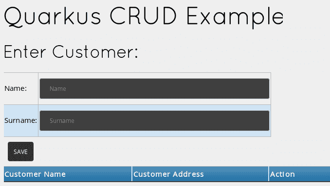
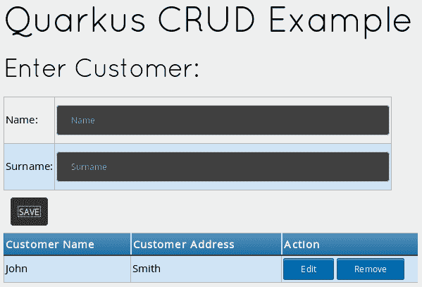
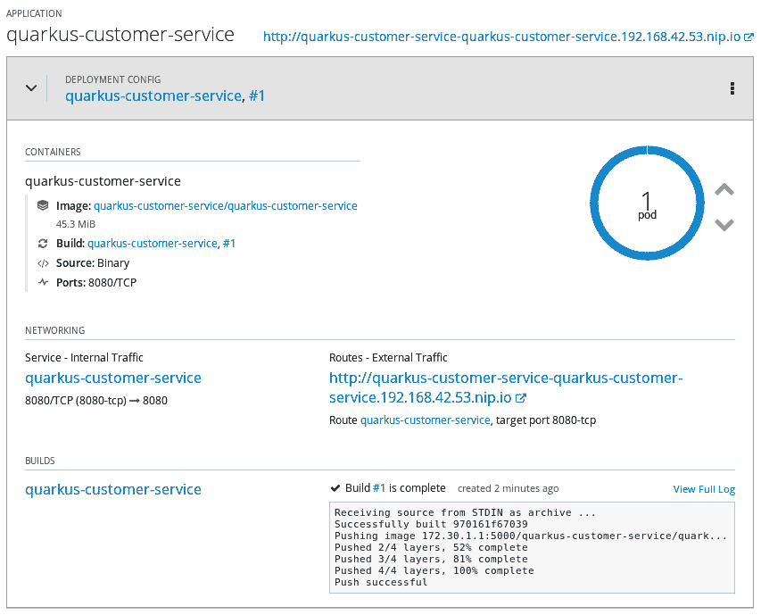
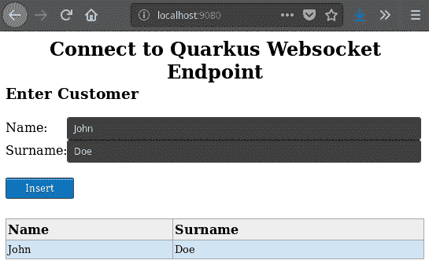

# 将网络界面添加到 Quarkus 服务中

到目前为止，我们已经学习了如何使用 Quarkus 构建一个简单的 REST 应用程序，并介绍了构建、测试和部署我们的应用程序到 Kubernetes 环境中所需采取的操作。

我们可以在这里停下来，对我们所取得的成就感到满意；然而，还有许多里程碑需要达到。例如，我们还没有使用任何网络界面来访问 Quarkus 服务。正如您在本章中将要看到的，Quarkus 具有一些扩展，允许我们重用标准的企业级 API，如 Servlet 和 WebSocket。同时，您可以使用更轻量级的 JavaScript/HTML 5 框架作为服务的用户界面。我们将在本章中探讨这两种方法。

在本章中，我们将涵盖以下主题：

+   将网页内容添加到 Quarkus 应用程序中

+   在 Minishift 上运行我们的应用程序

+   将企业级网络组件（如 Servlet 和 WebSocket）添加到我们的应用程序中

# 技术要求

您可以在 GitHub 上找到本章项目的源代码，链接为 [`github.com/PacktPublishing/Hands-On-Cloud-Native-Applications-with-Java-and-Quarkus/tree/master/Chapter04`](https://github.com/PacktPublishing/Hands-On-Cloud-Native-Applications-with-Java-and-Quarkus/tree/master/Chapter04)。

# 将网页内容添加到 Quarkus 应用程序中

在我们讨论的示例中，我们通过添加 RESTful 服务来测试了 Quarkus 的网络服务器功能。在底层，Quarkus 使用以下核心组件来处理网络请求：

+   **Vert.x 网络服务器**：它是 Quarkus 中提供 RESTful 服务以及实时（服务器推送）网络应用的核心网络组件。我们将在本书的第九章 统一命令式和响应式编程的 Vert.x 中更详细地讨论 Vert.x。

+   **Undertow 网络服务器**：它是一个灵活的产品，通过组合不同的小型单一用途处理器构建而成，在 Quarkus 中用于交付 `WebSocket` 应用程序时发挥作用。

如前所述，我们可以通过将静态网页内容（HTML、JavaScript、图像）包含在项目的 `resources/META-INF/resources` 文件夹下，将静态网页内容添加到我们的应用程序中。在微服务风格的程序中拥有静态网页内容的目的是什么？实际上，静态内容可以在多个上下文中使用，包括微服务。例如，我们可以为服务本身提供辅助页面。我们还可以将 Quarkus 与现有的框架（如 Swagger UI）混合使用，以测试我们的 REST 端点，而无需编写复杂用户界面。

在这个前提下，我们将演示如何构建一个使用 JSON 消费和生成数据的 **创建、读取、更新、删除**（**CRUD**）应用程序。然后，我们将通过一个基于 JavaScript 的网络框架构建的轻量级网络界面来丰富我们的应用程序。

# 构建 CRUD 应用程序

在本章的 GitHub 源文件夹中，您将找到两个示例。第一个位于 `Chapter04/customer-service/basic` 文件夹中，将在本节中讨论。我们建议在继续之前将项目导入到您的 IDE 中。

如果您查看项目结构，您将看到它由三个主要组件组成：

1.  首先，有一个模型类用于记录客户条目：

```java
package com.packt.quarkus.chapter4;

public class Customer {
     private Integer id;
     private String name;
     private String surname;

     public Integer getId() {
         return id;
     }

     public void setId(Integer id) {
         this.id = id;
     }

     public String getName() {
         return name;
     }

     public void setName(String name) {
         this.name = name;
     }

     public String getSurname() {
         return surname;
     }

     public void setSurname(String surname) {
         this.surname = surname;
     }
 }
```

`Customer` 类是 `Customer` 记录的最小定义。它被定义为应该存储在内存中的普通旧 Java 对象。

1.  接下来，看一下 `CustomerRepository` 类，它包含我们将用于管理我们的模型的核心功能：

```java
package com.packt.quarkus.chapter4;

import javax.enterprise.context.ApplicationScoped;
import java.util.ArrayList;
import java.util.List;

@ApplicationScoped
public class CustomerRepository {

     List<Customer> customerList = new ArrayList();
     int counter;

     public int getNextCustomerId() {
         return counter++;
     }

     public List<Customer> findAll() {
         return customerList;
     }

     public Customer findCustomerById(Integer id) {
         for (Customer c:customerList) {
             if (c.getId().equals(id))  {
                 return c;
             }
         }
         throw new CustomerException("Customer not found!");
     }

     public void updateCustomer(Customer customer) {
         Customer customerToUpdate = 
          findCustomerById(customer.getId());
         customerToUpdate.setName(customer.getName());
         customerToUpdate.setSurname(customer.getSurname());
     }

     public void createCustomer(Customer customer) {
         customer.setId(getNextCustomerId());
         findAll().add(customer);
     }

     public void deleteCustomer(Integer customerId) {
         Customer c = findCustomerById(customerId);
         findAll().remove(c);
     }
}
```

如您所见，它只是一个简单的存储和检索我们数据的模式，作为存储和检索数据的模板。在接下来的章节中，我们将添加其他功能，如持久存储和异步行为。因此，从无服务器的示例开始是很好的。

1.  通过 `CustomerEndpoint` 类完成客户服务的实现，其实现如下：

```java
package com.packt.quarkus.chapter4;

import javax.enterprise.context.ApplicationScoped;
import javax.inject.Inject;
import javax.ws.rs.*;
import javax.ws.rs.core.Response;
import java.util.List;

@Path("customers")
@ApplicationScoped
@Produces("application/json")
@Consumes("application/json")
public class CustomerEndpoint {

     @Inject CustomerRepository customerRepository;

     @GET
     public List<Customer> getAll() {
         return customerRepository.findAll();
     }

     @POST
     public Response create(Customer customer) {
         customerRepository.createCustomer(customer);
         return Response.status(201).build();

     }

     @PUT
     public Response update(Customer customer) {
         customerRepository.updateCustomer(customer);
         return Response.status(204).build();
     }
     @DELETE
     public Response delete(@QueryParam("id") Integer customerId) {
         customerRepository.deleteCustomer(customerId);
         return Response.status(204).build();
     }

} 
```

如您所见，`CustomerEndpoint` 是在 `CustomerRepository` 类之上的一个薄薄的 REST 层，并为每个 CRUD 操作包含一个方法，其中它将每个操作映射到适当的 HTTP 方法。当使用这种方法时，对于整个应用程序来说，只需要一个 REST 路径（`/customers`）就足够了，因为 REST 引擎将根据 HTTP 请求方法调用适当的方法。

# 为我们的客户服务添加用户界面

正如我们在 第一章 中提到的，*Quarkus 核心概念简介*，您可以在 `src/main/resources/META-INF/resources` 文件夹中包含静态资源，如 HTML 页面、JavaScript、CSS 或图像。`index.html` 页面作为我们的项目中的一个标记提供，如图所示的项目层次结构：

```java
$ tree src
 src
 ├── main
 │   ├── docker
 │   ├── java
 │   │   └── com
 │   │       └── packt
 │   │           └── quarkus
 │   │               └── chapter4
 │   │                   ├── CustomerEndpoint.java
 │   │                   ├── Customer.java
 │   │                   ├── CustomerRepository.java
 │   └── resources
 │       ├── application.properties
 │       └── META-INF
 │           └── resources
 │               ├── index.html 
```

为了连接到我们的 REST 端点，我们将在 `index.html` 页面的头部部分包含一个名为 AngularJS 的 JavaScript 框架和一些 CSS 样式：

```java
<link rel="stylesheet" type="text/css" href="stylesheet.css" media="screen" />
<script src="img/angular.min.js"></script>
```

此外，在 `index.html` 页面的头部部分，我们将包含 **AngularJS 控制器**，其中包含一个我们可以用来访问 REST 端点方法的函数。我们将传递 HTML 表单数据作为参数，我们将在下一节中讨论：

```java
<script type="text/javascript">
       var app = angular.module("customerManagement", []);
       angular.module('customerManagement').constant('SERVER_URL',
        '/customers');
       //Controller Part
       app.controller("customerManagementController",  function 
        ($scope, $http, SERVER_URL) {
         //Initialize page with default data which is blank in this
         //example
         $scope.customers = [];
         $scope.form = {
           id: -1,
           name: "",
           surname: ""
         };
         //Now load the data from server
         _refreshPageData();
         //HTTP POST/PUT methods for add/edit customers
         $scope.update = function () {
           var method = "";
           var url = "";
           var data = {};
           if ($scope.form.id == -1) {
             //Id is absent so add customers - POST operation
             method = "POST";
             url = SERVER_URL;
             data.name = $scope.form.name;
             data.surname = $scope.form.surname;
           } else {
             //If Id is present, it's edit operation - PUT operation
             method = "PUT";
             url = SERVER_URL;
             data.id = $scope.form.id;
             data.name = $scope.form.name;
             data.surname = $scope.form.surname;
           }
           $http({
             method: method,
             url: url,
             data: angular.toJson(data),
             headers: {
               'Content-Type': 'application/json'
             }
           }).then(_success, _error);
         };
         //HTTP DELETE- delete customer by id
         $scope.remove = function (customer) {

           $http({
             method: 'DELETE',
             url: SERVER_URL+'?id='+customer.id
           }).then(_success, _error);
         };
         //In case of edit customers, populate form with customer
        // data
         $scope.edit = function (customer) {
           $scope.form.name = customer.name;
           $scope.form.surname = customer.surname;
           $scope.form.id = customer.id;
         };
           /* Private Methods */
         //HTTP GET- get all customers collection
         function _refreshPageData() {
           $http({
             method: 'GET',
             url: SERVER_URL
           }).then(function successCallback(response) {
             $scope.customers = response.data;
           }, function errorCallback(response) {
             console.log(response.statusText);
           });
         }
         function _success(response) {
           _refreshPageData();
           _clearForm()
         }
         function _error(response) {
           alert(response.data.message || response.statusText);
         }
         //Clear the form
         function _clearForm() {
           $scope.form.name = "";
           $scope.form.surname = "";
           $scope.form.id = -1;
         }
       });
     </script>
 </head>
```

AngularJS 的深入讨论超出了本书的范围；然而，简而言之，Angular 应用程序依赖于控制器来管理它们的数据流。每个控制器都接受 `$scope` 作为参数。该参数指的是控制器需要处理的模块或应用程序。

我们控制器的目的是使用不同的 HTTP 方法（`GET`、`POST`、`PUT` 和 `DELETE`）来访问我们的 REST 应用程序。

`index.html` 页面的最后一部分包含表单数据，可用于插入新客户和编辑现有客户：

```java
<body ng-app="customerManagement" ng-controller="customerManagementController">
 <div class="divTable blueTable">
     <h1>Quarkus CRUD Example</h1>
     <h2>Enter Customer:</h2>
     <form ng-submit="update()">
         <div class="divTableRow">
             <div class="divTableCell">Name:</div>
             <div class="divTableCell"><input type="text"         
              placeholder="Name" ng-model=
              "form.name" size="60"/></div>
         </div>
         <div class="divTableRow">
             <div class="divTableCell">Surname:</div>
             <div class="divTableCell"><input type="text" 
              placeholder="Surname" ng-model="form.surname" 
             size="60"/>
        </div>
         </div>
         <input type="submit" value="Save"/>
     </form>
     <div class="divTable blueTable">
         <div class="divTableHeading">
             <div  class="divTableHead">Customer Name</div>
             <div  class="divTableHead">Customer Address</div>
             <div  class="divTableHead">Action</div>
         </div>
         <div class="divTableRow" ng-repeat="customer in customers">
             <div class="divTableCell">{{ customer.name }}</div>
             <div class="divTableCell">{{ customer.surname }}</div>
             <div class="divTableCell"><a ng-click="edit( customer )" 
             class="myButton">Edit</a>
             <a ng-click="remove( customer )"
             class="myButton">Remove</a></div>
         </div>
     </div>
 </body>
</html>
```

现在我们完成了 `index.html` 页面，我们可以为我们的应用程序编写一个测试类。

# 测试我们的应用程序

在测试我们的应用程序之前，值得一提的是，为了通过 REST 端点生成 JSON 内容以及在实际测试类中程序化创建 JSON 对象，我们已经在这个项目中包含了`quarkus-jsonb`依赖项。以下是我们已在`pom.xml`文件中包含的依赖项：

```java
<dependency>
   <groupId>io.quarkus</groupId>
   <artifactId>quarkus-jsonb</artifactId>
</dependency>
```

以下是我们`CustomerEndpointTest`类，它可以用来验证`Customer`应用程序：

```java
@QuarkusTest
public class CustomerEndpointTest {

     @Test
     public void testCustomerService() {

         JsonObject obj = Json.createObjectBuilder()
                 .add("name", "John")
                 .add("surname", "Smith").build();

         // Test POST
         given()
                 .contentType("application/json")
                 .body(obj.toString())
                 .when()
                 .post("/customers")
                 .then()
                 .statusCode(201);

         // Test GET
         given()
                 .when().get("/customers")
                 .then()
                 .statusCode(200)
                 .body(containsString("John"),
                       containsString("Smith"));

         obj = Json.createObjectBuilder()
                 .add("id", "0")
                 .add("name", "Donald")
                 .add("surname", "Duck").build();

         // Test PUT
         given()
                 .contentType("application/json")
                 .body(obj.toString())
                 .when()
                 .put("/customers")
                 .then()
                 .statusCode(204);

         // Test DELETE
         given()
                 .contentType("application/json")
                 .when()
                 .delete("/customers?id=0")
                 .then()
                 .statusCode(204);

     }
 } 
```

让我们转换一下思路，更仔细地看看测试类。这里的大部分内容你应该都很熟悉，除了`Json.createObjectBuilder` API，这是一个方便的工厂方法，我们可以用它流畅地创建 JSON 对象。在我们的代码中，我们用它来生成两个`javax.json.JsonObject`实例。第一个已经被序列化为字符串并通过 HTTP `POST`调用发送到我们的`CustomerEndpoint`。第二个被用来通过 HTTP `PUT`调用更新客户。

你可以使用以下命令打包和测试应用程序：

```java
$ mvn package
```

输出将显示测试结果，应该成功：

```java
[INFO] Results:
[INFO] Tests run: 1, Failures: 0, Errors: 0, Skipped: 0
```

`testCustomerService` 方法成功完成。现在我们有一个经过测试的 REST 应用程序，我们将学习如何让我们的应用程序在浏览器中运行。

# 运行示例

现在项目已经完全在我们手中，让我们看看它的实际效果！你可以使用以下命令启动应用程序：

```java
$ mvn quarkus:dev
```

然后，转到主页`http://localhost:8080`。你应该能够看到以下 UI，其中你可以添加新的客户：



正如你所知，嵌入的 Vert.x 服务器将在根上下文中提供服务。如果你想改变这一点，你可以在`application.properties`中配置`quarkus.http.root-path`键来设置上下文路径。

一旦你有一些数据，其他操作（如编辑和删除）将可用：



太棒了！你可以尝试编辑和删除数据来验证所有 REST 方法是否正常工作。现在，我们将学习如何在 Minishift 上部署我们的应用程序。

# 在 Minishift 上运行我们的应用程序

按照常规启动你的 Minishift 环境，并执行以下命令来构建应用程序的本地可执行 Docker 镜像，并将其部署到一个 Pod 中：

```java
$ mvn package -Pnative -Dnative-image.docker-build=true
```

构建应用程序的本地镜像需要大约一分钟的时间。接下来，我们将作为二进制构建将应用程序上传到 Minishift 命名空间。你应该已经熟悉这些步骤，所以我们只包括要执行的脚本，以及一些内联注释。执行每一行，并验证所有命令的输出是否成功：

```java
#Create a new Project named quarkus-customer-service
$ oc new-project quarkus-customer-service

# Binary Build definition 
$ oc new-build --binary --name=quarkus-customer-service -l app=quarkus-customer-service

# Add the dockerfilePath location to our Binary Build
$ oc patch bc/quarkus-customer-service -p '{"spec":{"strategy":{"dockerStrategy":{"dockerfilePath":"src/main/docker/Dockerfile.native"}}}}'

# Uploading directory "." as binary input for the build
$ oc start-build quarkus-customer-service --from-dir=. --follow

# Create a new application using as source the Binary Build
$ oc new-app --image-stream=quarkus-customer-service:latest

# Create a Route for external clients
$ oc expose svc/quarkus-customer-service
```

现在，您应该能够在概述面板中看到您的应用程序正在运行的 Pod，该面板可以通过“路由 - 外部流量”链接访问：http://quarkus-customer-service-quarkus-customer-service.192.168.42.53.nip.io（实际的路由地址取决于分配给您环境的 IP 地址）：



点击“路由 - 外部流量”链接后，您将能够验证您的应用程序是否在 Kubernetes 环境中正常工作，就像您的本地副本一样。

# 在 Quarkus 中配置跨源资源共享

在这一章中，我们使用 JavaScript 将请求驱动到 Quarkus 的服务中。在更复杂的场景中，您的 JavaScript 代码部署在其自己的服务上，位于不同的主机或上下文中，您将需要实现 **跨源资源共享**（**CORS**）以使其工作。简而言之，CORS 允许 Web 客户端向托管在不同源上的服务器发送 HTTP 请求。通过 **源**，我们指的是 URI 方案、主机名和端口号的组合。

这对于客户端语言，如 JavaScript，尤其具有挑战性，因为所有现代浏览器都要求脚本语言遵循同源策略。

要使这生效，我们需要让我们的服务器应用程序负责决定谁可以发起请求以及允许哪些类型的请求，这通过使用 HTTP 头部来实现。在实践中，当服务器从不同的源接收到请求时，它可以回复并声明哪些客户端被允许访问 API，哪些 HTTP 方法或头部被允许，以及最后是否允许在请求中包含 cookies。

这如何转化为 Quarkus 配置？正如您可能猜到的，配置必须应用于 `application.properties` 文件中的 `quarkus.http.cors` 命名空间下。以下是一个允许所有域名、所有 HTTP 方法以及所有常见头部的示例配置：

```java
quarkus.http.cors=true
quarkus.http.cors.origins=*
quarkus.http.cors.methods=GET,PUT,POST,DELETE, OPTIONS
quarkus.http.cors.headers=X-Custom,accept, authorization, content-type, x-requested-with
quarkus.http.cors.exposed-headers=Content-Disposition
```

在现实世界的场景中，您可能会将允许的源列表设置为请求远程连接的域名，如下所示：

```java
quarkus.http.cors.origins=http://custom.origin.com
```

既然我们已经澄清了这一点，我们可以看看另一个示例，我们将使用 Java 企业组件，如 `WebSocket`，来访问我们的 Quarkus 服务。

# 添加企业级 Web 组件

在我们的客户服务示例中，前端应用程序使用 JavaScript 结构化框架（AngularJS）来测试我们的应用程序。现在，我们将考虑一个不同的用例：一个新的外部服务将使用不同的协议栈连接到我们的应用程序。除了 JAX-RS 端点外，Quarkus 还原生支持在嵌入式 Undertow Web 服务器上运行的 `WebSocket` 技术。因此，在这个示例中，我们将向现有的应用程序添加一个 `WebSocket` 端点。这将与另一个在不同应用程序中运行的 `WebSocket` 配对。

# 介绍 WebSockets

首先，让我们简要介绍我们应用程序的新组件。根据其企业规范，`WebSocket`是一个 API，它在一个浏览器和服务器端点之间建立**套接字**连接。由于客户端和服务器之间有持久的连接，双方可以随时开始发送数据，所以它与标准 TCP 套接字非常相似。

通常，你只需在 JavaScript 代码中调用`WebSocket`构造函数来打开一个`WebSocket`连接：

```java
var connection = new WebSocket('ws://localhost:8080/hello');
```

注意`WebSocket`连接的 URL 模式（`ws:`）。我们还有`wss:`用于安全的`WebSocket`连接，它以与`https:`相同的方式用于安全的 HTTP 连接。

我们可以将一些事件处理器附加到连接上，以帮助我们确定连接状态是打开的、正在接收消息，还是发生错误。

我们可以通过在服务器端使用`@ServerEndpoint`注解来声明一个 Java 类`WebSocket`服务器端点。端点部署的 URI 也需要指定，如下面的示例所示：

```java
@ServerEndpoint(value = "/hello")
public class WebSocketEndpoint {

     @OnOpen
     public void onOpen(Session session) throws IOException {
         // Establish connection
     }

     @OnMessage
     public void onMessage(Session session, Message message) throws 
    IOException {
         // Handle Websocket messages
     }

     @OnClose
     public void onClose(Session session) throws IOException {
     }

     @OnError
     public void onError(Session session, Throwable throwable) {
     }
}
```

在下一节中，我们将向我们的现有项目添加一个`WebSocket`层，然后创建另一个轻量级项目以远程访问`WebSocket`并添加新客户。

# 构建使用 Websockets 的项目

你将在本书 GitHub 仓库的`Chapter04/customer-service/websockets`文件夹中找到两个不同的项目：

+   随附`WebSocket`端点的更新版`customer-service`项目

+   一个名为`customer-service-fe`的项目，它为我们的`WebSocket`应用程序提供了一个最小化的 JavaScript 前端

在继续之前，你应该将这两个项目导入到你的集成开发环境（IDE）中。

首先，让我们讨论一下`customer-service`项目。我们添加的主要增强功能是一个`WebSocket`端点，该端点负责插入新的客户（使用`CustomerRepository`组件）并返回我们客户的表格视图。以下是`WebsocketEndpoint`类的代码内容：

```java
@ServerEndpoint(value="/customers", encoders = {MessageEncoder.class})

public class WebsocketEndpoint {
     @Inject
     CustomerRepository customerRepository;

     public List<Customer>  addCustomer(String message, Session 
     session) {
        Jsonb jsonb = JsonbBuilder.create();

        Customer customer = jsonb.fromJson(message, Customer.class);
        customerRepository.createCustomer(customer);
        return customerRepository.findAll();
     }
     @OnOpen
     public void myOnOpen(Session session) {
         System.out.println("WebSocket opened: " + session.getId());
     }
     @OnClose
     public void myOnClose(CloseReason reason) {
         System.out.println("Closing a due to " + 
          reason.getReasonPhrase());
     }
     @OnError
     public void error(Throwable t) {

     }

 }
```

这里有两个需要注意的地方，如下所示：

+   带有`@OnMessage`注解的方法接收以 JSON 格式输入要添加的客户，并返回更新后的客户列表。

+   这个类使用一个**编码器**来定制返回给客户端的消息。编码器接收一个 Java 对象并产生其序列化表示，然后可以将其传输到客户端。例如，编码器通常负责生成 JSON、XML 和二进制表示。在我们的例子中，它以 JSON 格式编码客户列表。

现在，让我们看一下`MessageEncoder`类：

```java
public class MessageEncoder implements Encoder.Text<java.util.List<Customer>>  {

     @Override
     public String encode(List<Customer> list) throws EncodeException {
         JsonArrayBuilder jsonArray = Json.createArrayBuilder();
         for(Customer c : list) {
             jsonArray.add(Json.createObjectBuilder()
                     .add("Name", c.getName())
                     .add("Surname", c.getSurname()));
         }
         JsonArray array = jsonArray.build();
         StringWriter buffer = new StringWriter();
         Json.createWriter(buffer).writeArray(array);
         return buffer.toString();
     }

     @Override
     public void init(EndpointConfig config) {
         System.out.println("Init");
     }

     @Override
     public void destroy() {
         System.out.println("destroy");
     }

}
```

如你所见，一个`Encoder`必须实现以下接口之一：

+   `Encoder.Text<T>`用于文本消息

+   `Encoder.Binary<T>`用于二进制消息

在我们的例子中，`List<Customer>`作为泛型类型在`encode`方法中接收，并转换为 JSON 字符串数组。

要进行编译，我们的项目需要`quarkus-undertow-websockets`扩展，这可以通过手动将其添加到`pom.xml`文件中来实现。或者，您可以使用以下命令让 Maven 插件为您完成：

```java
$ mvn quarkus:add-extension -Dextensions="quarkus-undertow-websockets"
```

您将在控制台看到以下输出，这确认了扩展已被添加到我们的配置中：

```java
Adding extension io.quarkus:quarkus-undertow-websockets
```

服务器项目现在已完成。您可以使用以下命令编译和运行它：

```java
$ mvn compile quarkus:dev
```

现在，让我们创建一个新的前端项目，它包含一个瘦的`WebSocket`JavaScript 客户端。

# 创建 WebSocket 客户端项目

`WebSocket`客户端，就像它们的服务器对应物一样，可以用许多不同的语言编写。由于现代浏览器对`WebSocket`有原生支持，我们将编写一个简单的 JavaScript 客户端，这样我们就不需要安装任何额外的工具或 SDK 来运行我们的示例。

在`customer-service-fe`文件夹中，您将找到可以用来访问我们的`WebSocket`示例的前端项目。

我们的项目包含一个名为`index.html`的着陆页，当请求我们应用程序的根 Web 上下文时，将提供此页面。在这个页面中，我们包含了一个 HTML 表单和一个表格来显示客户列表：

```java
<html>
 <head>
     <meta http-equiv="content-type" content="text/html; charset=ISO-
      8859-1">
     <link rel="stylesheet" type="text/css" href="stylesheet.css" 
      media="screen" />
     <script src="img/jquery.min.js"></script>
     <script src="img/functions.js"></script>
 </head>

 <meta charset="utf-8">
 <body>
 <h1 style="text-align: center;">Connect to Quarkus Websocket Endpoint</h1>
 <br>

 <div>

     <form id="form1" action="">
         <div><h3>Enter Customer</h3></div>
         <div class="divTableRow">
             <div class="divTableCell">Name:</div>
             <div class="divTableCell"><input type="text" 
              placeholder="Name" name="name" size="60"/></div>
         </div>
         <div class="divTableRow">
             <div class="divTableCell">Surname:</div>
             <div class="divTableCell"><input type="text" 
              placeholder="Surname" name="surname"  
              size="60"/></div>
         </div>

         <br/>
         <input onclick="send_message()" value="Insert" type="button" 
          class="myButton">
     </form>
     <br/>

 </div>

 <table id="customerDataTable" class="blueTable" />
 <div id="output"></div>
 </body>
</html>
```

`WebSocket`端点的连接发生在名为`function.js`的外部 JavaScript 文件中（您可以在本书 GitHub 仓库的`customer-service-fe/src/main/resources/META-INF/resources`文件夹中找到此文件）。以下是该文件的内容：

```java
var wsUri = "ws://localhost:8080/customers";

function init() {
     output = document.getElementById("output");
}

function send_message() {
     websocket = new WebSocket(wsUri);
     websocket.onopen = function(evt) {
         onOpen(evt)
     };
     websocket.onmessage = function(evt) {
         onMessage(evt)
     };
     websocket.onerror = function(evt) {
         onError(evt)
     };
}

function onOpen(evt) {
     doSend(name.value);
}

function onMessage(evt) {
     buildHtmlTable('#customerDataTable', evt.data);
}

function onError(evt) {
     writeToScreen('<span style="color: red;">ERROR:</span> 
      ' + evt.data);
}

function doSend(message) {
     var json = toJSONString(document.getElementById("form1"));
     websocket.send(json);

}
```

如您所见，一旦建立连接，就有几个回调方法（`onOpen`、`onMessage`、`onError`）与服务器事件相关联。在这里，我们将通过`doSend`方法添加一个新的客户，该客户以 JSON 字符串序列化，而`onMessage`回调方法将接收由我们的`WebSocket`编码器生成的客户列表。这些数据最终将包含在一个 HTML 表格中。

您可以使用以下命令运行项目：

```java
$ mvn compile quarkus:dev -Dquarkus.http.port=9080 -Ddebug=6005
```

如您所见，我们将 HTTP 和调试端口移动了`1000`个偏移量，以避免与`customer-service`项目冲突。

浏览到`http://localhost:9080`将带您进入`WebSocket`客户端应用程序。添加一些示例数据以验证客户是否可以包含在表格中：



验证相同的数据是否也显示在可用的 AngularJS 前端中，该前端位于`http://localhost:8080`。

# 添加 AJAX 处理程序

当涉及到测试我们的`WebSocket`示例时，我们的 JavaScript 客户端是必需的。然而，您在这个项目中还会发现一个增强功能，那就是一个 Java Servlet，它将允许您删除任何硬编码的后端链接，这样在将示例移动到不同的机器或端口时，两个服务仍然可以通信。

以下 Servlet 通过使用名为`CUSTOMER_SERVICE`的环境变量和字符串`ws://localhost:8080/customers`来确定服务器端点信息：

```java
@WebServlet("/AjaxHandler")
public class AjaxHandler extends HttpServlet {

     public AjaxHandler() {
         super();
     }

     protected void doGet(HttpServletRequest request, 
      HttpServletResponse response)
      throws ServletException, IOException {
         String endpoint = System.getenv("CUSTOMER_SERVICE")
         != null ? System.getenv("CUSTOMER_SERVICE") : 
         "ws://localhost:8080/customers";

         PrintWriter out = response.getWriter();
         out.println(endpoint);
         out.flush();

     }

     protected void doPost(HttpServletRequest request, 
         HttpServletResponse response) throws
         ServletException, IOException {
         doGet(request, response);
     }
}
```

此更改需要在我们的 JavaScript 客户端中反映出来，以便它不使用硬编码的端点来访问我们的 WebSocket。在 `function.js` 文件的最终版本中，你会找到一个以下 JavaScript 函数，该函数通过 AJAX 查询我们的 Servlet：

```java
var wsUri = "";
function callAjax() {

     httpRequest = new XMLHttpRequest();

     if (!httpRequest) {
         console.log('Unable to create XMLHTTP instance');
         return false;
     }
     httpRequest.open('GET', 'AjaxHandler');
     httpRequest.responseType = 'text';
     httpRequest.send();
     httpRequest.onreadystatechange = function() {
         if (httpRequest.readyState === XMLHttpRequest.DONE) {
             if (httpRequest.status === 200) {
                 wsUri = httpRequest.response;
             } else {
                 console.log('Something went wrong..!!');
             }
         }
     }
}
```

当 HTML 页面加载时，此函数会被调用：

```java
<body onload="callAjax()">
```

现在，从相同的 shell 启动服务器，以便它读取环境变量：

```java
$ mvn quarkus:dev
```

现在，转到 `http://localhost:9080` 并验证由 `WebSocket` 请求产生的输出是否与服务器端点地址静态定义时相同。

你可以通过在 `customer-service` 应用程序中更改 `quarkus.http.port` 来将此示例进一步扩展。例如，你可以将其设置为 `8888`：

```java
$ mvn quarkus:dev -Dquarkus.http.port=8888
```

`customer-service-fe` 将能够连接到 `WebSocket` 端点，一旦你相应地设置了 `CUSTOMER_SERVICE` 环境变量：

```java
$ export CUSTOMER_SERVICE=ws://localhost:8888/customers
```

太好了！在本节中，我们从客户端应用程序中移除了任何静态硬编码的信息，现在它使用环境变量来联系客户服务。

# 摘要

在本章中，我们探讨了我们可以采取的不同路径来将网络内容添加到我们的 Quarkus 应用程序中。首先，我们学习了如何创建一个 CRUD 内存应用程序来管理一组 Java 对象。然后，该示例应用程序通过一个 JavaScript 层（AngularJS）和一些特殊的 API 来访问，这些 API 用于处理 REST 调用。我们还探讨了在 Quarkus 项目中启用 CORS 时所需的某些配置参数。接下来，我们添加了一个 `WebSocket` 层，以在初始项目和客户端前端之间引入全双工通信。

通过完成本章，你现在知道如何使用嵌入式 Vert.x 和 Undertow 服务器来利用 REST API (`quarkus-resteasy`) 和 `WebSocket`/Servlet API (`quarkus-undertow-websockets`)。

在下一章中，我们将使用 Hibernate ORM 和 Hibernate Panache 扩展为我们的应用程序添加数据库存储。
