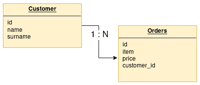
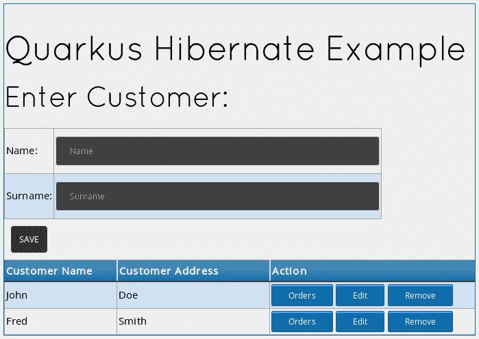
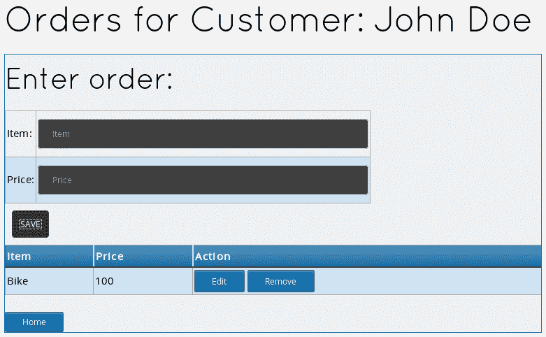
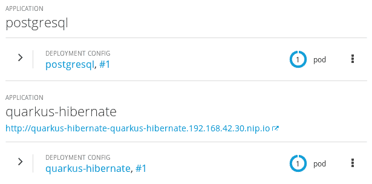

# 第五章：使用 Quarkus 管理数据持久化

到目前为止，我们已经使用内存结构开发了一些基本的应用程序，这些结构可以通过 REST 通道访问。但这只是开始。在现实世界的例子中，你不仅仅依赖于内存数据；相反，你将数据结构持久化在关系型数据库或其他地方，例如 NoSQL 存储。因此，在本章中，我们将利用构建 Quarkus 应用程序并将数据持久化到关系型数据库所需的基本技能。我们还将学习如何使用 **对象关系映射**（**ORM**）工具，如 Hibernate ORM，将数据库映射为存储，以及如何使用 **Hibernate ORM with Panache** 扩展简化其使用。

在本章中，我们将涵盖以下主题：

+   在客户服务中添加 ORM 层

+   配置和运行应用程序以连接到 RDBMS

+   将服务（应用程序和数据库）同时迁移到云端

+   在你的应用程序上添加 Hibernate ORM with Panache 以简化 ORM

# 技术要求

你可以在 GitHub 上找到本章项目的源代码，链接为 [`github.com/PacktPublishing/Hands-On-Cloud-Native-Applications-with-Java-and-Quarkus/tree/master/Chapter05`](https://github.com/PacktPublishing/Hands-On-Cloud-Native-Applications-with-Java-and-Quarkus/tree/master/Chapter05)。

# 在我们的应用程序中添加 ORM 层

如果你之前曾参与过企业项目，你会知道几乎每个 Java 应用程序都使用 ORM 工具来映射外部数据库。使用 Java 对象映射数据库结构的优势如下：

+   **数据库中立性**：你的代码将不是针对特定数据库的，因此你不需要将你的代码适应特定的数据库 SQL 语法，这些语法可能在供应商之间有所不同。

+   **开发者友好的工作流程**：你不需要编写复杂的 SQL 结构来访问你的数据 - 你只需要引用 Java 字段。

另一方面，编写原生 SQL 语句确实可以使你真正了解你的代码正在做什么。此外，在大多数情况下，通过编写直接 SQL 语句，你可以实现最大的性能提升。因此，大多数 ORM 工具都包括执行原生 SQL 语句的选项，以绕过标准的 ORM 逻辑。

在 Quarkus 工具包中，你可以使用 `quarkus-hibernate-orm` 扩展将你的 Java 类映射为实体对象。Hibernate ORM 位于 Java 应用程序数据访问层和关系型数据库之间。你可以使用 Hibernate ORM API 执行查询、删除、存储和域数据等操作。

首先，让我们定义我们应用程序的领域模型。我们将从简单的**Customer**对象开始，因为我们已经知道它是什么。为了使我们的例子更有趣，我们将添加另一个对象，称为**Orders**，它与我们的**Customer**对象相关。更准确地说，我们将声明一个**Customer**和其**Orders**之间的**一对一**关系：



为了开始，让我们检查本章的第一个示例，它位于本书 GitHub 仓库的`Chapter05/hibernate`文件夹中。我们建议在继续之前将项目导入到您的 IDE 中。

如果您检查这个项目的`pom.xml`文件，您将发现其中包含了许多新的扩展。

+   `quarkus-hibernate-orm`：这个扩展是我们使用 Hibernate 的 ORM 工具在应用程序中所需的核心依赖项。

+   `quarkus-agroal`：这个扩展为我们购买了 Agroal 连接池，它将为我们处理 JDBC 连接管理。

+   `quarkus-jdbc-postgresql`：这个扩展包含我们连接到 PostgreSQL 数据库所需的 JDBC 模块。

+   `quarkus-resteasy-jsonb`：这个扩展是必需的，这样我们就可以在运行时创建 JSON 项并生成 JSON 响应。

以下代码显示了作为 XML 元素的附加依赖项：

```java
<dependency>
       <groupId>io.quarkus</groupId>
       <artifactId>quarkus-hibernate-orm</artifactId>
</dependency>
<dependency>
       <groupId>io.quarkus</groupId>
       <artifactId>quarkus-agroal</artifactId>
</dependency>
<dependency>
       <groupId>io.quarkus</groupId>
       <artifactId>quarkus-jdbc-postgresql</artifactId>
</dependency>
<dependency>
       <groupId>io.quarkus</groupId>
       <artifactId>quarkus-resteasy-jsonb</artifactId>
</dependency>
```

现在我们已经查看了项目的配置，让我们检查构成我们应用程序的单个组件。

# 定义实体层

我们首先需要检查映射数据库表的实体对象列表。第一个是`Customer @Entity`类，如下所示：

```java
@Entity
@NamedQuery(name = "Customers.findAll",
        query = "SELECT c FROM Customer c ORDER BY c.id",
        hints = @QueryHint(name = "org.hibernate.cacheable", value = 
        "true") )
public class Customer {
    @Id
    @SequenceGenerator(
            name = "customerSequence",
            sequenceName = "customerId_seq",
            allocationSize = 1,
            initialValue = 1)
    @GeneratedValue(strategy = GenerationType.SEQUENCE, generator = 
     "customerSequence")
    private Long id;

    @Column(length = 40)
    private String name;

    @Column(length = 40)
    private String surname;

    @OneToMany(mappedBy = "customer")
    @JsonbTransient
    public List<Orders> orders;

 // Getters / Setters omitted for brevity
}
```

让我们逐一检查我们在实体类中包含的单个注解：

+   `@Entity`注解使这个类有资格进行持久化。它可以与`@Table`注解结合使用，以将相应的数据库表映射到映射。如果没有包含，就像在我们的例子中一样，它将映射具有相同名称的数据库表。

+   `@NamedQuery`注解（放置在类级别）是一个静态定义的 SQL 语句，包含一个查询字符串。在您的代码中使用命名查询可以提高代码的组织方式，因为它将 JPA 查询语言与 Java 代码分开。它还避免了将字符串字面量直接嵌入 SQL 中的不良做法，从而强制使用参数。

+   `@Id`注解指定了实体的主键，它将为每条记录都是唯一的。

+   `@SequenceGenerator`注解用于委托创建一个序列作为主键的唯一标识符。您需要检查您的数据库是否能够处理序列。另一方面，尽管这不是默认选项，但这被认为是一个更安全的替代方案，因为标识符可以在执行`INSERT`语句之前生成。

+   `@Column` 注解用于告诉 Hibernate ORM，Java 字段映射了一个数据库列。请注意，我们还在列的大小方面指定了一个约束。由于我们将让 Hibernate ORM 从 Java 代码创建我们的数据库结构，因此 Java 类中声明的所有约束都将有效地转换为数据库约束。

+   最后，我们不得不在 `orders` 字段上应用两个注解：

    +   `@OneToMany` 注解定义了与 `Orders` 表（即一个客户关联多个订单）的一对多关系。

    +   `@JsonbTransient` 注解阻止将字段映射到 JSON 表示形式（由于这个关系的反向映射包含在 `Orders` 类中，将此字段映射到 JSON 将导致 `StackOverflow` 错误）。

在我们的代码示例中，为了简洁起见，我们省略了 getter/setter 方法。然而，Hibernate ORM 需要这些方法来对数据库执行实体读取和写入。在本章后面的 *使用 Hibernate Panache 简化数据持久性* 部分，我们将学习如何通过扩展 `PanacheEntity` API 来使我们的代码更加精简和整洁。

`Customer` 实体反过来又引用了以下 `Orders` 类，它提供了单一到多注解的另一端：

```java
@Entity
@NamedQuery(name = "Orders.findAll",
        query = "SELECT o FROM Orders o WHERE o.customer.id = :customerId ORDER BY o.item")
public class Orders {
    @Id
    @SequenceGenerator(
            name = "orderSequence",
            sequenceName = "orderId_seq",
            allocationSize = 1,
            initialValue = 1)
    @GeneratedValue(strategy = GenerationType.SEQUENCE, generator = 
     "orderSequence")
    public Long id;

    @Column(length = 40)
    public String item;

    @Column
    public Long price;

    @ManyToOne
    @JoinColumn(name = "customer_id") 
    @JsonbTransient
    public Customer customer;

 // Getters / Setters omitted for brevity
}
```

值得注意的是，这个类的命名查询稍微详细一些，因为 `Orders.findAll` `NamedQuery` 使用一个参数来过滤特定客户的订单。

由于 `Customer` 结构和 `Orders` 结构构成一个双向关联，我们需要将相应的 `Customer` 字段映射到 `@javax.persistence.ManyToOne` 注解。

我们还包含了 `@javax.persistence.JoinColumn` 注解，以表明这个实体是关系的所有者。在数据库术语中，这意味着相应的表有一个外键列，用于引用表。现在我们已经有一个将存储数据的类，让我们检查 `Repository` 类，它用于从 RDBMS 访问数据。

# 编写仓库类

为了访问我们的 `Customer` 数据，我们仍然依赖于 `CustomerRepository` 类，这需要调整。首先，我们注入了 `EntityManager` 接口的一个实例，以便管理实体实例的持久性：

```java
@ApplicationScoped
public class CustomerRepository {

    @Inject
    EntityManager entityManager;

}
```

一旦我们有了 `EntityManager` 的引用，我们就可以使用它来对类中的其余部分执行 CRUD 操作：

```java
public List<Customer> findAll() {
        return entityManager.createNamedQuery("Customers.findAll", 
         Customer.class)
                .getResultList();
}

public Customer findCustomerById(Long id) {
        Customer customer = entityManager.find(Customer.class, id);

        if (customer == null) {
            throw new WebApplicationException("Customer with id of " + 
             id + " does not exist.", 404);
        }
        return customer;
}

@Transactional
public void updateCustomer(Customer customer) {
        Customer customerToUpdate = findCustomerById(customer.
         getId());
        customerToUpdate.setName(customer.getName());
        customerToUpdate.setSurname(customer.getSurname());
}

@Transactional
public void createCustomer(Customer customer) {
        entityManager.persist(customer);
}

@Transactional
public void deleteCustomer(Long customerId) {
        Customer c = findCustomerById(customerId);
        entityManager.remove(c);
}
```

重要的是要注意，我们已将所有执行写操作的方法标记为 `@javax.transaction.Transactional` 注解。这是在 Quarkus 应用程序中划分事务边界的最简单方法，就像我们在 Java 企业应用程序中做的那样。在实践中，如果存在调用者的上下文事务，则 `@Transactional` 方法将在该事务的上下文中运行。否则，它将在运行方法之前启动一个新事务。

接下来，我们创建了一个`Repository`类，该类也用于管理订单。`OrderRepository`类基本上等同于`CustomerRepository`类，除了`findAll`方法会过滤特定客户的订单：

```java
@ApplicationScoped
public class OrderRepository {

    @Inject
    EntityManager entityManager;

    public List<Orders> findAll(Long customerId) {

      return  (List<Orders>) 
        entityManager.createNamedQuery("Orders.findAll")
                .setParameter("customerId", customerId)
                .getResultList();
    }

    public Orders findOrderById(Long id) {

        Orders order = entityManager.find(Orders.class, id);
        if (order == null) {
            throw new WebApplicationException("Order with id of " + id 
             + " does not exist.", 404);
        }
        return order;
    }
    @Transactional
    public void updateOrder(Orders order) {
        Orders orderToUpdate = findOrderById(order.getId());
        orderToUpdate.setItem(order.getItem());
        orderToUpdate.setPrice(order.getPrice());
    }
    @Transactional
    public void createOrder(Orders order, Customer c) {
        order.setCustomer(c);
        entityManager.persist(order);

    }
    @Transactional
    public void deleteOrder(Long orderId) {
        Orders o = findOrderById(orderId);
        entityManager.remove(o);
    }
}
```

现在我们已经讨论了`Repository`和实体类，让我们来看看 REST 端点，它使应用程序具有响应性。

# 定义 REST 端点

我们的应用程序为每个`Repository`类定义了一个 REST 端点。我们在上一章中已经编写了`CustomerEndpoint`，它对是否使用存储一无所知。因此，一半的工作已经完成。我们在这里只添加了`OrderEndpoint`，它相应地映射 CRUD HTTP 操作：

```java
@Path("orders")
@ApplicationScoped
@Produces("application/json")
@Consumes("application/json")
public class OrderEndpoint {

    @Inject OrderRepository orderRepository;
    @Inject CustomerRepository customerRepository;

    @GET
    public List<Orders> getAll(@QueryParam("customerId") Long 
     customerId) {
        return orderRepository.findAll(customerId);
    }

    @POST
    @Path("/{customer}")
    public Response create(Orders order, @PathParam("customer") Long 
     customerId) {
        Customer c = customerRepository.findCustomerById(customerId);
        orderRepository.createOrder(order,c);
        return Response.status(201).build();

    }

    @PUT
    public Response update(Orders order) {
        orderRepository.updateOrder(order);
        return Response.status(204).build();
    }
    @DELETE
    @Path("/{order}")
    public Response delete(@PathParam("order") Long orderId) {
        orderRepository.deleteOrder(orderId);
        return Response.status(204).build();
    }

}
```

我们的`OrderEndpoint`稍微复杂一些，因为它需要在`getAll`方法中通过`Customer` ID 过滤每个订单操作。我们还使用了`@PathParam`注解在代码中，以将`Customer`和`Orders`数据从客户端移动到 REST 端点。

# 连接到数据库

数据库连接是通过 Quarkus 的主配置文件（`application.properties`）进行的，该文件至少需要包含数据库的 JDBC 设置。我们将使用 PostgreSQL 作为存储，因此 JDBC URL 和驱动程序应符合 PostgreSQL JDBC 的规范。以下配置将用于访问`quarkusdb`数据库，该数据库使用`quarkus/quarkus`凭据：

```java
quarkus.datasource.url=jdbc:postgresql://${POSTGRESQL_SERVICE_HOST:localhost}:${POSTGRESQL_SERVICE_PORT:5432}/quarkusdb
quarkus.datasource.driver=org.postgresql.Driver
quarkus.datasource.username=quarkus
quarkus.datasource.password=quarkus

```

注意，我们正在使用两个环境变量（`POSTGRESQL_SERVICE_HOST`和`POSTGRESQL_SERVICE_PORT`）来定义数据库主机和端口。如果它们未被定义，它们将被设置为`localhost`和`5432`。当我们将应用程序从本地文件系统切换到云时，此配置将非常有用。

接下来，我们配置了 Hibernate ORM 在启动时使用**删除并创建**策略。这对于开发或测试应用程序来说非常理想，因为它会在每次启动应用程序时从 Java 实体中删除并重新生成模式和数据表：

```java
quarkus.hibernate-orm.database.generation=drop-and-create
```

此外，我们还包括了 Agroal 连接池设置，以定义池的初始大小、在内存中保持可用的最小连接数以及可以同时打开的最大连接数：

```java
quarkus.datasource.initial-size=1
quarkus.datasource.min-size=2
quarkus.datasource.max-size=8
```

最后，为了测试目的，在我们的模式中预先插入一些行可能很有用。因此，我们使用以下属性设置了脚本（`import.sql`）的位置：

```java
quarkus.hibernate-orm.sql-load-script=import.sql
```

`import.sql`脚本中的以下内容向`Customer`表添加了两行：

```java
INSERT INTO customer (id, name, surname) VALUES ( nextval('customerId_seq'), 'John','Doe');
INSERT INTO customer (id, name, surname) VALUES ( nextval('customerId_seq'), 'Fred','Smith');
```

上述 SQL 脚本可以在`src/main/resources`文件夹中找到。

现在我们已经检查了我们的服务，我们将检查测试类，该类会自动验证 CRUD 操作。然后，我们将查看 Web 界面，以便我们可以通过浏览器测试代码。

# 编写测试类

我们的基本 `Test` 类假设我们已经有几个 `Customer` 对象可用。因此，一旦我们通过 `GET` 请求验证它们的数量，我们将在 `Orders` 从属实体上测试所有 CRUD 操作，如下所示：

```java
// Test GET
given()
        .when().get("/customers")
        .then()
        .statusCode(200)
        .body("$.size()", is(2));

// Create a JSON Object for the Order
JsonObject objOrder = Json.createObjectBuilder()
        .add("item", "bike")
        .add("price", new Long(100))
        .build();

// Test POST Order for Customer #1
given()
        .contentType("application/json")
        .body(objOrder.toString())
        .when()
        .post("/orders/1")
        .then()
        .statusCode(201);

// Create new JSON for Order #1
objOrder = Json.createObjectBuilder()
        .add("id", new Long(1))
        .add("item", "mountain bike")
        .add("price", new Long(100))
        .build();

// Test UPDATE Order #1
given()
        .contentType("application/json")
        .body(objOrder.toString())
        .when()
        .put("/orders")
        .then()
        .statusCode(204);

// Test GET for Order #1
given()
        .when().get("/orders?customerId=1")
        .then()
        .statusCode(200)
        .body(containsString("mountain bike"));

// Test DELETE Order #1
given()
        .when().delete("/orders/1")
        .then()
        .statusCode(204);
```

在这个阶段，这个测试类不应该太复杂。我们基本上是在测试使用 `org.hamcrest.CoreMatchers.is` 构造在数据库中可用的两个客户。然后，我们通过创建一个项目、更新它、查询它，最后删除它，对 `Orders` 实体执行一轮完整的操作。

在运行测试之前，我们需要一个可用的数据库，其中数据将被持久化。如果您还没有活动的 PostgreSQL 实例，建议您使用以下 shell 启动 `docker` 镜像：

```java
$ docker run --ulimit memlock=-1:-1 -it --rm=true --memory-swappiness=0 --name quarkus_test -e POSTGRES_USER=quarkus -e POSTGRES_PASSWORD=quarkus -e POSTGRES_DB=quarkusdb -p 5432:5432 postgres:10.5
```

请注意，除了数据库用户、密码和数据库设置外，我们还在 `--ulimit memlock=-1:-1` 设置中强制执行我们的容器，以进行无限制的内存锁定，防止交换。我们还将数据库的地址和端口转发到本地机器上可用的所有 IPv4/IPv6 地址。

当启动 `docker` 进程时，将发出以下输出：

```java
2019-07-09 14:05:56.235 UTC [1] LOG:  listening on IPv4 address "0.0.0.0", port 5432
2019-07-09 14:05:56.235 UTC [1] LOG:  listening on IPv6 address "::", port 5432
2019-07-09 14:05:56.333 UTC [1] LOG:  listening on Unix socket "/var/run/postgresql/.s.PGSQL.5432"
2019-07-09 14:05:56.434 UTC [60] LOG:  database system was shut down at 2019-07-09 14:05:56 UTC
2019-07-09 14:05:56.516 UTC [1] LOG:  database system is ready to accept connections
```

现在，您可以使用以下命令启动测试类：

```java
$ mvn compile test
```

预期的输出应确认测试已成功运行：

```java
[INFO] Running com.packt.quarkus.chapter5.CustomerEndpointTest
. . . .
[INFO] Tests run: 1, Failures: 0, Errors: 0, Skipped: 0, Time elapsed: 11.846 s - in com.packt.quarkus.chapter5.CustomerEndpointTest
```

现在，我们将检查我们添加的项目中的静态网页，以便我们可以访问和管理我们的服务。

# 为我们的应用程序添加网络界面

我们的服务包括两个静态网页来管理客户服务和每个客户的订单。正如您从我们之前的章节中了解到的，默认情况下，静态页面位于您项目的 `src/main/resources/META-INF/resources` 文件中。我们可以重用上一章中的相同 `index.html` 页面，这将成为我们应用程序的着陆页。不过，您会发现一个名为“添加订单”的操作，它将用户重定向到 `order.html` 页面，并传递一个包含 `Customer` 信息的查询参数：

```java
<div class="divTable blueTable">
    <div class="divTableHeading">
        <div  class="divTableHead">Customer Name</div>
        <div  class="divTableHead">Customer Address</div>
        <div  class="divTableHead">Action</div>
    </div>
    <div class="divTableRow" ng-repeat="customer in customers">
        <div class="divTableCell">{{ customer.name }}</div>
        <div class="divTableCell">{{ customer.surname }}</div>
        <div class="divTableCell">
            <a ng-href="/order.html?customerId={{ customer.id 
             }}&customerName={{ customer.name }}&
               customerSurname={{ customer.surname }}" 
               class="myButton">Orders</a>
            <a ng-click="edit( customer )" class="myButton">Edit</a>
            <a ng-click="remove( customer )" 
        class="myButton">Remove</a>
        </div>
    </div>
</div>
```

`order.html` 页面有自己的 AngularJS 控制器，负责显示所选 `Customer` 的 `Orders` 集合，使我们能够读取、创建、修改或删除现有订单。以下为 Angular 控制器的第一部分，它定义了模块和控制器名称，并收集表单参数：

```java
var app = angular.module("orderManagement", []);
angular.module('orderManagement').constant('SERVER_URL', '/orders');

//Controller Part
app.controller("orderManagementController", function($scope, $http, SERVER_URL) {

 var customerId = getParameterByName('customerId');
 var customerName = getParameterByName('customerName');
 var customerSurname = getParameterByName('customerSurname');

 document.getElementById("info").innerHTML = customerName + " " + customerSurname;

 $scope.orders = [];

 $scope.form = {
 customerId: customerId,
 isNew: true,
 item: "",
 price: 0
 };
 //Now load the data from server
 reloadData();
```

在我们 JavaScript 代码的第二部分中，我们包含了 `$scope.update` 函数来插入/编辑新的 `Orders`，一个 `$scope.remove` 函数来删除现有订单，以及一个 `reloadData` 函数来检索该 `Customer` 的 `Orders` 列表，如下所示：

```java
 //HTTP POST/PUT methods for add/edit orders
 $scope.update = function() {

 var method = "";
 var url = "";
 var data = {};
 if ($scope.form.isNew == true) {
 // add orders - POST operation
 method = "POST";
 url = SERVER_URL + "/" + customerId;
 data.item = $scope.form.item;
 data.price = $scope.form.price;

 } else {
 // it's edit operation - PUT operation
 method = "PUT";
 url = SERVER_URL;

 data.item = $scope.form.item;
 data.price = $scope.form.price;

 }

 if (isNaN(data.price)) {
 alert('Price must be a Number!');
 return false;
 }

 $http({
 method: method,
 url: url,
 data: angular.toJson(data),
 headers: {
 'Content-Type': 'application/json'
 }
 }).then(_success, _error);
 };

 //HTTP DELETE- delete order by id
 $scope.remove = function(order) {
 $http({
 method: 'DELETE',
 url: SERVER_URL + "/" + order.id
 }).then(_success, _error);
 };

 //In case of edit orders, populate form with order data
 $scope.edit = function(order) {
 $scope.form.item = order.item;
 $scope.form.price = order.price;
 $scope.form.isNew = false;
 };
 /* Private Methods */
 //HTTP GET- get all orders collection
 function reloadData() {
 $http({
 method: 'GET',
 url: SERVER_URL,
 params: {
 customerId: customerId
 }
 }).then(function successCallback(response) {
 $scope.orders = response.data;
 }, function errorCallback(response) {
 console.log(response.statusText);
 });
 }

 function _success(response) {
 reloadData();
 clearForm()
 }

 function _error(response) {
 alert(response.data.message || response.statusText);
 }
 //Clear the form
 function clearForm() {
 $scope.form.item = "";
 $scope.form.price = "";
 $scope.form.isNew = true;
 }
});
```

为了简洁起见，我们没有包括完整的 HTML 页面，但您可以在本书的 GitHub 仓库中找到它（正如我们在本章开头的 *技术要求* 部分中提到的）。

# 运行应用程序

该应用程序可以从我们运行测试的同一 shell 中执行（这样我们仍然保留`DB_HOST`环境变量）：

```java
mvn quarkus:dev
```

您应该在控制台中期望以下输出：

```java
Listening for transport dt_socket at address: 5005
2019-07-14 18:41:32,974 INFO  [io.qua.dep.QuarkusAugmentor] (main) Beginning quarkus augmentation
2019-07-14 18:41:33,789 INFO  [io.qua.dep.QuarkusAugmentor] (main) Quarkus augmentation completed in 815ms
2019-07-14 18:41:35,153 INFO  [io.quarkus] (main) Quarkus 0.19.0 started in 2.369s. Listening on: http://[::]:8080
2019-07-14 18:41:35,154 INFO  [io.quarkus] (main) Installed features: [agroal, cdi, hibernate-orm, jdbc-postgresql, narayana-jta, resteasy, resteasy-jsonb]
```

现在，使用以下 URL 转到登录页面：`http://localhost:8080`。在这里，您将看到一个预先填充的客户列表：



通过点击订单按钮添加一些客户订单。您将被带到以下 UI，在这里您可以读取、修改、删除并为每个客户存储新的订单：



太好了！应用程序按预期工作。它是否可以进一步改进？从性能的角度来看，如果我们缓存频繁访问的数据，应用程序的吞吐量可以得到提高。下一节将向您展示如何使用 Hibernate ORM 的缓存机制实现这一点。

# 缓存实体数据

在 Hibernate ORM 中，可以通过其高级缓存机制轻松配置实体缓存。默认情况下，有三种类型的缓存可用：

+   **一级缓存**是事务级别的缓存，用于跟踪当前会话期间实体的状态。默认情况下启用。

+   **二级缓存**用于在各个 Hibernate ORM 会话之间缓存实体。这使得它成为`SessionFactory`级别的缓存。

+   **查询缓存**用于缓存 Hibernate ORM 查询及其结果。

由于二级缓存和查询缓存可能会消耗大量内存，因此默认情况下未启用。要使实体有资格缓存其数据，您可以使用`@javax.persistence.Cacheable`注解对其进行注解，如下所示：

```java
@Cacheable
@Entity
public class Customer {

}
```

在这种情况下，客户的字段值被缓存，除了与其他实体的集合和关系外。这意味着一旦实体被缓存，就可以通过其主键进行搜索，而无需查询数据库。

HQL 查询的结果也可以被缓存。当您想对主要进行读操作的实体对象执行查询时，这非常有用。使 HQL 查询可缓存的简单方法是在`@NamedQuery`中添加一个`@javax.persistence.QueryHint`注解，将`org.hibernate.cacheable`属性设置为`true`，如下所示：

```java
@Cacheable
@Entity
@NamedQuery(name = "Customers.findAll",
        query = "SELECT c FROM Customer c ORDER BY c.id",
        hints = @QueryHint(name = "org.hibernate.cacheable", value = 
        "true") )
public class Customer {   
}
```

您可以通过在`application.properties`文件中开启 SQL 日志来轻松验证前面的断言，如下所示：

```java
quarkus.hibernate-orm.log.sql=true

```

然后，如果您运行应用程序，您应该能够在控制台中看到一条**单个**SQL 语句，无论您请求页面多少次，都可以用它来查询`Customer`列表：

```java
Hibernate: 
    select
        customer0_.id as id1_0_,
        customer0_.name as name2_0_,
        customer0_.surname as surname3_0_ 
    from
        Customer customer0_ 
    order by
        customer0_.id
```

太好了！您已经达到了第一个里程碑，即在本地文件系统上运行应用程序，并在 Hibernate ORM 的**二级缓存**（**2LC**）中缓存常用 SQL 语句。现在，是时候将我们的应用程序迁移到云端了！

# 将应用程序迁移到云端

在通过本地 JVM 测试了应用程序之后，现在是时候将其原生地引入云中了。这个过程有趣的部分将是将 Quarkus 应用程序与 OpenShift 上的 PostgreSQL 应用程序连接起来，而无需修改任何一行代码！让我们看看我们如何实现这一点：

1.  启动你的 Minishift 实例，并创建一个名为 `quarkus-hibernate` 的新项目：

```java
oc new-project quarkus-hibernate
```

1.  接下来，我们将向我们的项目中添加一个 PostgreSQL 应用程序。默认情况下，`openshift` 命名空间中包含一个 PostgreSQL 镜像流，你可以使用以下命令进行检查：

```java
oc get is -n openshift | grep postgresql
```

你应该在控制台中看到以下输出：

```java
postgresql   172.30.1.1:5000/openshift/postgresql   latest,10,9.2 + 3 more...    6 hours ago
```

要创建 PostgreSQL 应用程序，需要设置以下配置变量：

+   `POSTGRESQL_USER`：要创建的 PostgreSQL 账户的用户名

+   `POSTGRESQL_PASSWORD`：用户账户的密码

+   `POSTGRESQL_DATABASE`：数据库名称

我们将使用在 `application.properties` 文件中定义的相同参数，以便我们可以使用以下命令启动我们的应用程序：

```java
oc new-app -e POSTGRESQL_USER=quarkus -e POSTGRESQL_PASSWORD=quarkus -e POSTGRESQL_DATABASE=quarkusdb postgresql
```

在你的控制台日志中，检查以下输出是否已生成：

```java
--> Creating resources ...
 imagestreamtag.image.openshift.io "postgresql:10" created
 deploymentconfig.apps.openshift.io "postgresql" created
 service "postgresql" created
 --> Success
 Application is not exposed. You can expose services to the 
    outside world by executing one or more of the commands below:
 'oc expose svc/postgresql'
 Run 'oc status' to view your app.
```

让我们查看可用的服务列表（`oc get services`），以验证 `postgresql` 是否可用：

```java
NAME                TYPE        CLUSTER-IP       EXTERNAL-IP   PORT(S)    AGE
postgresql          ClusterIP   172.30.154.130   <none>        5432/TCP   14m
```

如你所见，服务现在在集群 IP 地址 `172.30.154.130` 上处于活动状态。幸运的是，我们不需要在我们的应用程序代码中硬编码此地址，因为我们将会使用服务名称 `postgresql`，它就像集群地址的别名一样工作。

现在，我们将创建我们项目的二进制构建，以便它可以部署到 Minishift。对于没有耐心的用户，可以直接执行 GitHub 上此章节根目录中的 `deploy-openshift.sh` 脚本。在其中，你可以找到以下带注释的命令列表：

```java
# Build native application
mvn package -Pnative -Dnative-image.docker-build=true -DskipTests=true

# Create a new Binary Build named "quarkus-hibernate"
oc new-build --binary --name=quarkus-hibernate -l app=quarkus-hibernate

# Set the dockerfilePath attribute into the Build Configuration
oc patch bc/quarkus-hibernate -p '{"spec":{"strategy":{"dockerStrategy":{"dockerfilePath":"src/main/docker/Dockerfile.native"}}}}'

# Start the build, uploading content from the local folder: 
oc start-build quarkus-hibernate --from-dir=. --follow

# Create a new Application, using as Input the "quarkus-hibernate" image stream:
oc new-app --image-stream=quarkus-hibernate:latest

# Expose the Service through a Route:
oc expose svc/quarkus-hibernate
```

在此过程结束时，你应该能够通过 `oc get routes` 命令看到以下路由可用：

```java
NAME                HOST/PORT                                                  PATH      SERVICES            PORT       TERMINATION   WILDCARD
quarkus-hibernate   quarkus-hibernate-quarkus-hibernate.192.168.42.30.nip.io             quarkus-hibernate   8080-tcp                 None
```

你可以从你项目的网络控制台中检查应用程序的整体状态：



你现在可以导航到应用程序的外部路由（实际的路由地址将根据你的网络配置而变化。在我们的例子中，是 http://quarkus-hibernate-quarkus-hibernate.192.168.42.30.nip.io），并检查应用程序在云上是否运行顺畅。

# 使用 Panache API 使数据持久性更容易

Hibernate ORM 是将数据库结构映射到 Java 对象的标准方式。使用 ORM 工具的主要缺点是，即使是简单的数据库结构也需要大量的样板代码（例如 getter 和 setter 方法）。此外，你必须在你的仓库类中包含基本的查询方法，这使得工作相当重复。在本节中，我们将学习如何使用 Hibernate Panache 来简化并加速我们应用程序的开发。

要开始使用带有 Panache 的 Hibernate ORM，让我们检查本章的第二个示例，该示例位于本书 GitHub 存储库的`Chapter05/hibernate-panache`文件夹中。我们建议在继续之前将项目导入到你的 IDE 中。

如果你查看项目的配置，你会看到我们在`pom.xml`文件中包含了`quarkus-hibernate-orm-panache`：

```java
<dependency>
       <groupId>io.quarkus</groupId>
       <artifactId>quarkus-hibernate-orm-panache</artifactId>
</dependency>
```

这是我们需要使用的唯一 Hibernate Panache 配置。现在到了有趣的部分。将 Panache 连接到你的实体的策略有两种：

+   扩展`io.quarkus.hibernate.orm.panache.PanacheEntity`类：这是最简单的方法，因为你将获得一个自动生成的 ID 字段。

+   扩展`io.quarkus.hibernate.orm.panache.PanacheEntityBase`：如果你需要自定义 ID 策略，可以使用此选项。

由于我们为 ID 字段使用`SequenceGenerator`策略，我们将使用后者选项。以下是被重写的`Customer`类，它扩展了`PanacheEntityBase`：

```java
@Entity
@NamedQuery(name = "Customers.findAll",
         query = "SELECT c FROM Customer c ORDER BY c.id" )
public class Customer extends PanacheEntityBase {
     @Id
     @SequenceGenerator(
             name = "customerSequence",
             sequenceName = "customerId_seq",
             allocationSize = 1,
             initialValue = 1)
     @GeneratedValue(strategy = GenerationType.SEQUENCE, generator = 
      "customerSequence")
     public Long id;

     @Column(length = 40)
     public String name;

     @Column(length = 40)
     public String surname;

     @OneToMany(mappedBy = "customer")
     @JsonbTransient
     public List<Orders> orders;
}
```

如你所见，代码已经大大减少，因为我们没有使用 getter/setter 字段。相反，一些字段已被公开为`public`，以便可以直接由类访问。`Orders`实体已经使用相同的模式重写：

```java
@Entity
@NamedQuery(name = "Orders.findAll",
         query = "SELECT o FROM Orders o WHERE o.customer.id = :id ORDER BY o.item")
public class Orders extends PanacheEntityBase {
     @Id
     @SequenceGenerator(
             name = "orderSequence",
             sequenceName = "orderId_seq",
             allocationSize = 1,
             initialValue = 1)
     @GeneratedValue(strategy = GenerationType.SEQUENCE, generator = 
      "orderSequence")
     public Long id;

     @Column(length = 40)
     public String item;

     @Column
     public Long price;

     @ManyToOne
     @JoinColumn(name = "customer_id")
     @JsonbTransient
     public Customer customer;

}
```

到目前为止，我们已经看到了 Hibernate Panache 提供的某些好处。另一个值得注意的方面是，通过扩展`PanacheEntityBase`（或`PanacheEntity`），你将能够直接在你的实体上使用一组静态方法。以下是一个包含你可以在实体上触发的最常见方法的表格：

| **方法** | **描述** |
| --- | --- |
| `count` | 从数据库中计算此实体（可选查询和参数）的数量 |
| `delete` | 如果该实体已经持久化，则从数据库中删除此实体。 |
| `flush` | 将所有挂起的更改刷新到数据库 |
| `findById` | 通过 ID 查找此类型的实体 |
| `find` | 使用可选参数和排序策略的查询查找实体 |
| `findAll` | 查找此类型的所有实体 |
| `list` | `find().list()`的快捷方式 |
| `listAll` | `findAll().list()`的快捷方式 |
| `deleteAll` | 删除此类型的所有实体 |
| `delete` | 使用可选参数的查询删除实体 |
| `persist` | 持久化所有给定实体 |

下面的示例显示了利用`Customer`实体中可用的新字段和方法的重写的`CustomerRepository`类：

```java
public class CustomerRepository {

     public List<Customer> findAll() {
         return Customer.listAll(Sort.by("id"));
     }

     public Customer findCustomerById(Long id) {
         Customer customer = Customer.findById(id);

         if (customer == null) {
             throw new WebApplicationException("Customer with id 
              of " +  id + " does not exist.", 404);
         }
         return customer;
     }
     @Transactional
     public void updateCustomer(Customer customer) {
         Customer customerToUpdate = findCustomerById(customer.id);
         customerToUpdate.name = customer.name;
         customerToUpdate.surname = customer.surname;
     }
     @Transactional
     public void createCustomer(Customer customer) {
         customer.persist();
     }
     @Transactional
     public void deleteCustomer(Long customerId) {
         Customer customer = findCustomerById(customerId);
         customer.delete();
     }
 }
```

最明显的优势是，你不再需要`EntityManager`作为代理来管理你的实体类。相反，你可以直接调用实体中可用的静态方法，从而大大减少`Repository`类的冗长性。

为了完整性，让我们看看`OrderRepository`类，它已经被修改为使用 Panache 对象：

```java
public class OrderRepository {

     public List<Orders> findAll(Long customerId) {
         return Orders.list("id", customerId);
     }

     public Orders findOrderById(Long id) {
         Orders order = Orders.findById(id);
         if (order == null) {
             throw new WebApplicationException("Order with id of
             " + id  + " does not exist.", 404);
         }
         return order;
     }
     @Transactional
     public void updateOrder(Orders order) {
         Orders orderToUpdate = findOrderById(order.id);
         orderToUpdate.item = order.item;
         orderToUpdate.price = order.price;
     }
     @Transactional
     public void createOrder(Orders order, Customer c) {
         order.customer = c;
         order.persist();
     }
     @Transactional
     public void deleteOrder(Long orderId) {
         Orders order = findOrderById(orderId);
         order.delete();
     }
 }
```

自从切换到 Hibernate Panache 以来，您的应用程序在 REST 端点和 Web 界面方面完全透明，没有任何其他更改。使用以下命令按常规构建和运行应用程序：

```java
mvn compile quarkus:dev
```

在控制台上，您应该看到应用程序已启动，并且已添加了两个初始客户：

```java
Hibernate: 
    INSERT INTO customer (id, name, surname) VALUES ( nextval('customerId_seq'), 'John','Doe')
Hibernate: 
    INSERT INTO customer (id, name, surname) VALUES ( nextval('customerId_seq'), 'Fred','Smith')
2019-11-28 10:44:02,887 INFO  [io.quarkus] (main) Quarkus 1.0.0.Final started in 2.278s. Listening on: http://[::]:8080
2019-11-28 10:44:02,888 INFO  [io.quarkus] (main) Installed features: [agroal, cdi, hibernate-orm, jdbc-postgresql, narayana-jta, resteasy, resteasy-jsonb]
```

现在，享受由 Hibernate ORM 和 Panache 驱动的简化 CRUD 应用程序吧！

# 摘要

在本章中，我们探讨了数据持久性，并介绍了广为人知的 Hibernate ORM 框架。如果您在企业编程方面有一些年的经验，您应该不会觉得将相同的概念应用到 Quarkus 上有挑战性。现在，您的整体技能包括使用 Hibernate 及其简化的范式 Panache 配置基于 RDBMS 的应用程序。我们还学习了如何在 OpenShift 集群上部署和连接 RDBMS 以及我们的应用程序。

总结来说，我们已经掌握了企业编程的主要支柱（从 REST 服务到 servlets、CDI 和数据持久性）。

在下一章中，我们将学习如何在 Quarkus 中用 MicroProfile API 补充标准企业 API。
