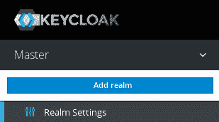
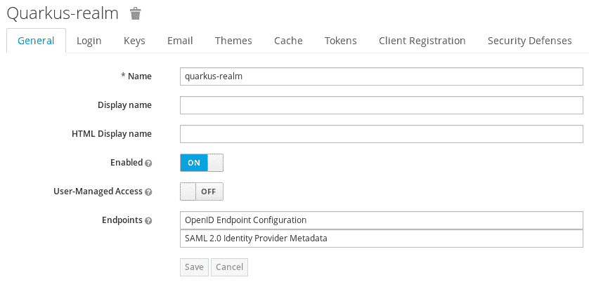
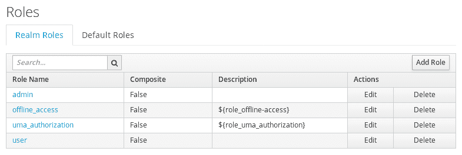
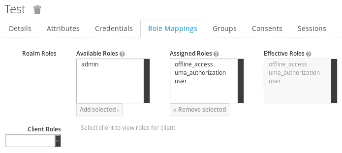
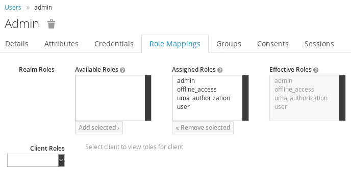
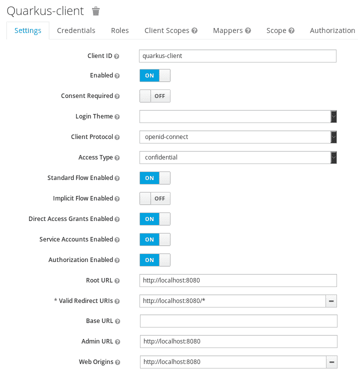
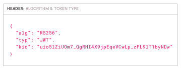
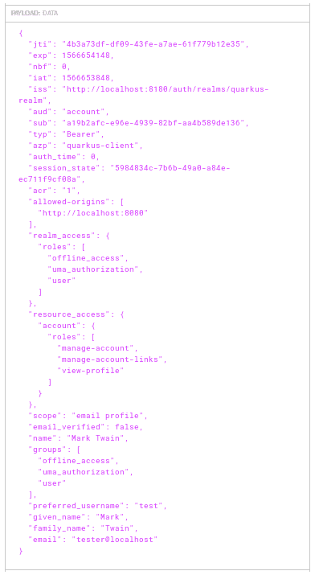
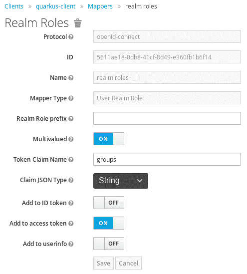
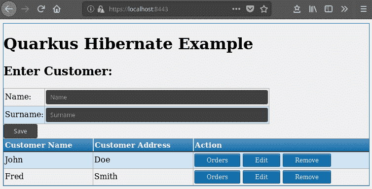

# 保护应用程序

安全性是每个企业系统的一个关键要求。在本章中，我们将学习如何使用各种方法有效地保护 Quarkus 服务。我们将首先实践的方法是在我们的服务中嵌入安全层。这仍然可以被视为快速应用程序开发和测试的有效解决方案。另一方面，当我们的服务投入生产时，我们需要避免这种极端的集中化。因此，我们将学习的下一个策略是 Quarkus 服务如何连接到分布式安全系统，如 Keycloak。本章的最后一个主题是关于通过一些简单的配置步骤加密 HTTP 通道。

在本章中，我们将涵盖以下主题：

+   保护我们的客户服务

+   使用 Elytron 保护 Quarkus 服务

+   使用 Keycloak 保护 Quarkus 服务

+   使用 MicroProfile JWT 保护 Quarkus 服务

+   使用 HTTPS 与 Quarkus

# 技术要求

您可以在 GitHub 上找到本章项目的源代码，地址为[`github.com/PacktPublishing/Hands-On-Cloud-Native-Applications-with-Java-and-Quarkus/tree/master/Chapter07`](https://github.com/PacktPublishing/Hands-On-Cloud-Native-Applications-with-Java-and-Quarkus/tree/master/Chapter07)。

# 保护我们的客户服务

Quarkus 安全基础设施源自标准的**Java 企业版**（**Java EE**）规范，该规范基于简单的基于角色的安全模型。通过使用它，您可以通过注解和配置文件指定您的安全约束。

在 Java 注解方面，以下注解可以用来指定可以应用于单个方法或类的安全约束：

+   `@javax.annotation.security.RolesAllowed`：这是最常见的注解，因为它指定了一个或多个被授权调用特定方法或类的角色。

+   `@javax.annotation.security.RunAs`：此注解在方法或类的调用期间动态分配一个角色。如果我们需要临时允许执行某些方法，这可以是一个方便的选项。

+   `@javax.annotation.security.PermitAll`：此注解允许我们从方法中释放安全约束。在某些场景中，如果您还没有确定哪个角色将有权调用方法，这可能很有用。

+   `@javax.annotation.security.DenyAll`：此注解与`@PermitAll`正好相反，因为它拒绝访问带有此注解的方法或类。

为了保持简单，我们将为我们的客户服务应用程序定义一个简单的安全策略。这包括两个角色：

+   **用户** **角色**：此角色将有权执行*只读*操作，例如查询`客户`列表。

+   **管理员** **角色**：此角色将有权执行所有可用的操作，包括创建、更新和删除。

以下是我们 `CustomerEndpoint` 类的代码，该类已被 `@RolesAllowed` 安全注解装饰：

```java
public class CustomerEndpoint {

    @Inject CustomerRepository customerRepository;

    @GET
 @RolesAllowed("user")
    public List<Customer> getAll() {
        return customerRepository.findAll();
    }

    @POST
 @RolesAllowed("admin")
    public Response create(Customer customer) {

        customerRepository.createCustomer(customer);
        return Response.status(201).build();

    }

    @PUT
 @RolesAllowed("admin")
    public Response update(Customer customer) {
        customerRepository.updateCustomer(customer);
        return Response.status(204).build();
    }
    @DELETE
 @RolesAllowed("admin")
    public Response delete(@QueryParam("id") Long customerId) {
        customerRepository.deleteCustomer(customerId);
        return Response.status(204).build();
    }

}
```

为了简洁起见，我们这里不包括已更新的 `OrderEndpoint` 类，它同样被更新以保护带有 **用户** 角色的读取方法和带有 **管理员** 角色的写入方法。

在定义了我们的安全策略之后，我们现在可以选择将哪个安全提供者应用于我们的服务。这需要我们在 `application.properties` 中添加正确的设置，并在我们项目的 `pom.xml` 文件中包含依赖项。

我们将从 Elytron 安全提供者开始，它不需要我们安装任何外部应用程序或工具来保护我们的服务。

# 使用 Elytron 保护 Quarkus 服务

Elytron 是一个安全框架，它被创建出来以统一 WildFly 和 JBoss 的 **企业应用平台**（**EAP**）的安全方面。因此，这个框架最初是为单体应用程序设计的，以便覆盖安全方面的每一个方面。在 Quarkus 这样的容器就绪的本地平台上使用 Elytron 有什么优势？

虽然这可能看起来是一个过于简化的保护资产的方法，但它可以在开发或测试包含安全角色的应用程序时证明是有益的。开箱即用，Quarkus 提供了一个基于文件的 **安全域** 实现，以提供最小配置要求下的 **基于角色的访问控制**（**RBAC**）。

在撰写本书时，我们有三个可用的 Elytron 扩展，我们可以使用它们来保护我们的应用程序：

+   `quarkus-elytron-security-properties-file`：通过属性文件提供基本身份验证的支持。

+   `quarkus-elytron-security-jdbc`：通过 JDBC 提供数据库身份验证的支持。

+   `quarkus-elytron-security-oauth2`：提供 OAuth2 身份验证的支持。这个扩展可能在 Quarkus 的未来版本中被弃用，并可能被一个反应式 Vert.x 版本所取代。

由于我们的客户应用程序已经使用数据库作为后端，我们将向您展示如何使用数据库身份验证。在继续之前，请检查 `Chapter07/elytron-demo` 文件夹中的源代码。

如 `pom.xml` 文件所示，我们已经向我们的项目中添加了以下扩展：

```java
<dependency>
  <groupId>io.quarkus</groupId>
  <artifactId>quarkus-elytron-security-jdbc</artifactId>
</dependency>
```

为了配置身份验证，我们需要指定哪个表包含用户和角色的列表。我们还需要添加几个具有不同角色的用户。为此，我们在 `src/main/resources` 文件夹中的 `import.sql` 脚本中包含了以下 SQL 语句：

```java
CREATE TABLE quarkus_user (
    id INT,
    username VARCHAR(255),
    password VARCHAR(255),
    role VARCHAR(255)
);
INSERT INTO quarkus_user (id, username, password, role) VALUES (1, 'admin', 'password123', 'admin');
INSERT INTO quarkus_user (id, username, password, role) VALUES (2, 'frank','password123', 'user');
```

现在，在 `application.properties` 文件中，我们需要通过提供一些基本的配置参数来激活 JDBC 身份验证。以下是添加的属性列表：

```java
quarkus.security.jdbc.enabled=true
quarkus.security.jdbc.principal-query.sql=SELECT u.password, u.role FROM quarkus_user u WHERE u.username=?
quarkus.security.jdbc.principal-query.clear-password-mapper.enabled=true
quarkus.security.jdbc.principal-query.clear-password-mapper.password-index=1
quarkus.security.jdbc.principal-query.attribute-mappings.0.index=2
quarkus.security.jdbc.principal-query.attribute-mappings.0.to=groups 
```

让我们快速讨论这些属性：

+   当 `quarkus.security.jdbc.enabled` 属性设置为 true 时，启用 JDBC 认证。

+   `quarkus.security.jdbc.principal-query.sql` 属性用于指定将检查有效用户名/密码组合的 SQL 语句。

+   当 `quarkus.security.jdbc.principal-query.clear-password-mapper.enabled` 属性设置为 true 时，配置了一个将 SQL 查询返回的列映射到明文密码键类型的映射器。

+   `quarkus.security.jdbc.principal-query.clear-password-mapper.password-index` 属性设置了来自明文认证查询的列索引。

+   最后，`quarkus.security.jdbc.principal-query.attribute-mappings.0.index` 和 `quarkus.security.jdbc.principal-query.attribute-mappings.0.to` 用于将认证查询中的第二个字段（`index=2`）绑定到主体的角色（组）。

这就是您使用 Elytron 安全域来保护服务所需的所有内容。当所有部件都放在正确的位置时，我们将使用一个测试类来验证对 REST 端点的认证。

# 创建一个执行基本身份验证的测试类

我们的测试类需要调整，以便它可以适应新的受保护场景。实际上，我们需要在 HTTP 请求中发送带有用户凭证的头部文件，以授权服务的执行。多亏了 Fluent `RestAssured` API，将 `auth()` 方法插入我们的 HTTP 请求相当简单，如下面的代码所示：

```java
@Test
public void testCustomerService() {
    // Test GET for Customer size
    given()
            .auth()
            .preemptive()
            .basic("frank", "password123")
            .when().get("/customers")
            .then()
            .statusCode(200)
            .body("$.size()", is(2));

    JsonObject objOrder = Json.createObjectBuilder()
            .add("item", "bike")
            .add("price", new Long(100))
            .build();

    // Test POST Order for Customer #1
    given()
            .auth()
            .preemptive()
            .basic("admin", "password123")
            .contentType("application/json")
            .body(objOrder.toString())
            .when()
            .post("/orders/1")
            .then()
            .statusCode(201);

    // Create new JSON for Order #1
    objOrder = Json.createObjectBuilder()
            .add("id", new Long(1))
            .add("item", "mountain bike")
            .add("price", new Long(100))
            .build();

    // Test UPDATE Order #1
    given()
            .auth()
            .preemptive()
            .basic("admin", "password123")
            .contentType("application/json")
            .body(objOrder.toString())
            .when()
            .put("/orders")
            .then()
            .statusCode(204);

    // Test GET for Order #1
    given()
            .auth()
            .preemptive()
            .basic("admin", "password123")
            .when().get("/orders?customerId=1")
            .then()
            .statusCode(200)
            .body(containsString("mountain bike"));

    // Test DELETE Order #1
    given()
            .auth()
            .preemptive()
            .basic("admin", "password123")
            .when().delete("/orders/1")
            .then()
            .statusCode(204);

}
```

请注意，我们必须使用预防性基本身份验证。这意味着认证详情会立即发送在请求头中，无论服务器是否已经挑战了认证。没有这个，当前在 Quarkus 中的 Vert.x 实现将返回一个未授权的响应。

假设 PostgreSQL 数据库已经启动，我们的测试类准备就绪，可以执行：

```java
mvn compile test
```

您应该看到所有的 CRUD 操作都已完成成功：

```java
[INFO] Tests run: 1, Failures: 0, Errors: 0, Skipped: 0, Time elapsed: 5.799 s - in com.packt.quarkus.chapter7.CustomerEndpointTest
 2019-08-16 15:30:12,281 INFO  [io.quarkus] (main) Quarkus stopped in 0.012s
[INFO]
[INFO] Results:
[INFO]
[INFO] Tests run: 1, Failures: 0, Errors: 0, Skipped: 0
```

在下一节中，我们将介绍如何使用 Keycloak 在我们的应用程序中利用 OpenID ([`openid.net/`](https://openid.net/)) 安全标准。

# 使用 Keycloak 保护 Quarkus 服务

**Keycloak** ([`www.keycloak.org/`](https://www.keycloak.org/)) 是一个基于 WildFly 应用服务器的开源访问管理解决方案。您可以在您的架构中采用它，以利用以下各种功能：

+   **客户端适配器**

+   **单点登录** (**SSO**)

+   **身份管理和社交登录**

+   **标准协议（OpenID Connect 或 SAML**）

+   **丰富的管理控制台**

+   **用户账户管理控制台**

多亏了这些功能和连接到现有身份标准的能力，Keycloak 已成为许多大型组织的既定标准。它的一个受支持的版本，被称为**红帽单点登录**（**RH-SSO**：[`access.redhat.com/products/red-hat-single-sign-on`](https://access.redhat.com/products/red-hat-single-sign-on)），也适用于企业客户。

安装完成后，Keycloak 将成为您网络中应用程序的主要安全端点。因此，您的应用程序不需要添加登录表单来验证用户并存储其凭证。相反，应用程序被配置为指向 Keycloak，它支持 OpenID 或 SAML 等协议标准，以保护您的端点。

简而言之，客户端应用将从其域名重定向到 Keycloak 的身份服务器，在那里它们展示其凭证。这样，您的服务与您的安全策略和用户凭证完全隔离。相反，服务被授予一个数字签名的身份令牌或断言。这些令牌包含身份信息（如姓名或电子邮件地址），也可以包含有关授权执行业务操作的角色的信息。在下一节中，我们将学习如何配置 Keycloak，以便我们可以发行可以用来访问我们的示例客户服务的令牌。

# 将 Keycloak 扩展添加到我们的服务中

在`Chapter07/keycloak-demo`文件夹中，您将找到我们客户服务应用程序的另一个版本，该版本使用 Keycloak 来保护 REST 端点。为了使用 Keycloak 授权和 OpenID 扩展，我们在`pom.xml`文件中包含了以下依赖项集：

```java
<dependency>
  <groupId>io.quarkus</groupId>
  <artifactId>quarkus-keycloak-authorization</artifactId>
</dependency>
<dependency>
  <groupId>io.quarkus</groupId>
  <artifactId>quarkus-oidc</artifactId>
</dependency>
```

现在所有必需的库都已就绪，让我们学习如何安装 Keycloak 身份服务器并在其中加载一个安全领域。

# 设置 Keycloak

在本节中，我们将使用 Docker 快速掌握 Keycloak 的控制权。首先，我们需要拉取 Keycloak 镜像并启动一个容器实例。以下命令将在后台启动 Keycloak 服务器，并将`8180`作为 HTTP 端口，并本地暴露主机和端口：

```java
docker run --rm  \
 --name keycloak \
 -e KEYCLOAK_USER=admin \
 -e KEYCLOAK_PASSWORD=admin \
 -p 8180:8180 \
 -it quay.io/keycloak/keycloak:7.0.1 \
 -b 0.0.0.0 \
 -Djboss.http.port=8180 \
 -Dkeycloak.profile.feature.upload_scripts=enabled
```

在控制台中，你应该看到服务器已经成功启动：

```java
10:33:15,519 INFO  [org.jboss.as] (Controller Boot Thread) WFLYSRV0060: Http management interface listening on http://127.0.0.1:9990/management
 10:33:15,519 INFO  [org.jboss.as] (Controller Boot Thread) WFLYSRV0051: Admin console listening on http://127.0.0.1:9990
 10:33:15,519 INFO  [org.jboss.as] (Controller Boot Thread) WFLYSRV0025: Keycloak 6.0.1 (WildFly Core 8.0.0.Final) started in 15991ms - Started 672 of 937 services (652 services are lazy, passive or on-demand)
```

现在，Keycloak 已经启动并运行，让我们加载一个领域，它包含我们将应用于我们的服务的有效安全配置。

# 定义安全领域

Keycloak 配置的一个关键方面是安全领域，它包含与一个安全上下文相关的所有配置（用户、角色、客户端策略等）。当您第一次启动 Keycloak 时，它将包含一个领域：**主领域**。这是领域层次结构中的顶级。您不应该使用此领域来配置您组织中的用户和服务。相反，考虑使用主领域为负责定义您组织中的其他领域的管理员。

我们本章的 GitHub 仓库包含一个名为 **Quarkus 领域**的应用程序领域，这对我们的目的很有用。我们将向您展示如何导入它，然后我们将逐步介绍其配置，以便您可以根据此模板创建新的领域。让我们按照以下步骤进行：

1.  首先连接到 Keycloak 控制台，该控制台位于 `http://localhost:8180`。将显示身份验证挑战。使用 `admin/admin` 登录：


1.  现在，从左上角的面板中选择添加一个新的领域，如下面的截图所示：



1.  选择导入一个领域，并指向包含 Quarkus 领域导出的 JSON 文件（`quarkus-realm.json`）：


1.  点击创建以继续。现在，让我们简要概述一下领域的选项。

在领域设置窗口中，您将能够定义一些核心设置，例如域名和您的登录设置，预定义您的令牌有效期和超时时间，等等：



为了我们的学习路径，我们将不会更改这些设置。在领域面板中，您将能够验证我们已经包含了相同的角色（管理员和用户），以便它们与我们的现有安全约束相匹配：



在这里，我们重新创建了我们在基于文件的 Elytron 领域中测试过的相同用户列表：


在“角色映射”选项卡中，您可以检查测试用户是否是用户角色的成员：



另一方面，管理员用户将被分配给管理员和用户角色：



现在我们已经查看了用户和角色，让我们讨论领域客户端配置的一个关键方面，如下面的 UI 所示：



让我们看看客户端配置的一些关键方面。首先，我们必须定义客户端协议。有两种类型的客户端身份验证协议：

+   **OpenID Connect**（**OIDC**）是一种身份验证系统，客户端请求一个访问令牌，该令牌用于代表经过身份验证的用户调用其他服务。

+   **SAML**身份验证要求 Keycloak 为您的组织用户提供单点登录（SSO）。

对于我们的需求，基于 OIDC 令牌的身份验证是我们需要授予我们的服务访问权限的。我们还需要选择我们将使用标准流程还是隐式流程进行身份验证。

默认选项（启用标准流程）涉及将浏览器重定向到/从 OIDC 提供商（Keycloak）进行用户认证和同意。然后，需要一个第二个回传请求来检索 ID 令牌。此流程提供最佳安全性，因为令牌不会暴露给浏览器，并且客户端可以安全地认证。

让我们以序列图的形式描述这个流程：


为了提供更好的性能，Keycloak 还支持 **隐式流程**，这发生在访问令牌在成功认证后立即发送时。虽然这个选项可能具有更好的可扩展性（因为不需要额外的请求来交换代码以获取令牌），但你将负责监控令牌何时过期，以便你可以发放一个新的令牌。

由于我们选择了使用标准流程，我们将指定一个适当的有效重定向 URI，这需要设置为运行在 Quarkus 上的应用程序的默认 HTTP 端口。

对于访问类型，我们将其配置为机密类型，这要求客户端应用程序提供密钥以获取 ID 令牌。当你将访问类型设置为机密时，你将能够从凭据选项卡中选择客户端认证器，它定义了你将用于客户端及其密钥的凭据类型。为该客户端 ID 定义的密钥是 mysecret，如下面的截图所示：


如果你想要更改默认密钥，只需点击“重新生成密钥”按钮，并相应地更新你的客户端应用程序。

现在我们已经配置了 Keycloak，我们将使用这个域来执行一个使用携带令牌认证的测试。然而，在那之前，我们将相应地配置我们的 Quarkus 服务。

# 配置 Quarkus 以支持 Keycloak

信不信由你，一旦我们配置了身份服务器，在我们的 Quarkus 应用程序中就没有太多工作要做。我们只需要将 Keycloak URL 和客户端设置提供给我们的应用程序的 `application.properties` 配置文件：

```java
keycloak.url=http://localhost:8180

quarkus.oidc.enabled=true
quarkus.oidc.auth-server-url=${keycloak.url}/auth/realms/quarkus-realm
quarkus.oidc.client-id=quarkus-client
quarkus.oidc.credentials.secret=mysecret# Enable Policy Enforcement
quarkus.keycloak.policy-enforcer.enable=true

quarkus.http.cors=true

```

在前面的配置中，我们提供了连接到 Keycloak 身份服务器的必需设置。我们还添加了一个名为 `keycloak.url` 的属性来定义 Keycloak 的 IP 地址和端口。在下面的表中，我们添加了一些关于每个参数的详细信息：

| **参数** | **描述** |
| --- | --- |
| `quarkus.oidc.enabled` | 当设置为 true 时，将启用 OIDC 扩展。 |
| `quarkus.oidc.auth-server-url` | Keycloak 认证客户端请求的根 URL。 |
| `quarkus.oidc.client-id` | 客户端 ID。 |
| `quarkus.oidc.credentials.secret` | 客户端密钥。 |
| `quarkus.keycloak.policy-enforcer.enable` | 通过启用策略执行器，即使没有与该资源关联的策略，也不允许请求进入。 |

除了这个之外，如果您打算在不同于应用程序的机器上运行 Keycloak，建议启用 HTTP CORS，这样您就可以跨域访问 Keycloak（有关此内容的更多详细信息，请参阅第五章，*使用 Quarkus 管理数据持久性*)。

现在，让我们深入了解将用于执行通过 Keycloak 身份服务器授权的 CRUD 操作的测试类。

# 编写测试类

我们的测试类由两个部分组成。在第一个部分中，我们为`test`用户和`admin`用户检索令牌。然后，我们使用这两个令牌来测试应用程序。更具体地说，属于用户角色的`test`令牌将用于`GET`请求。另一方面，`admin`令牌将用于授权`POST`、`PUT`和`DELETE`请求。

这是测试类的第一个部分：

```java
@ConfigProperty(name = "keycloak.url")
String keycloakURL;

    @Test
    public void testHelloEndpoint() {

        RestAssured.baseURI = keycloakURL;
        Response response = given().urlEncodingEnabled(true)
                .auth().preemptive().basic("quarkus-client", 
                  "mysecret")
                .param("grant_type", "password")
                .param("client_id", "quarkus-client")
                .param("username", "test")
                .param("password", "test")
                .header("Accept", ContentType.JSON.getAcceptHeader())
                .post("/auth/realms/quarkus-realm/protocol/openid-
                  connect/token")
                .then().statusCode(200).extract()
                .response();

        JsonReader jsonReader = Json.createReader(new 
         StringReader(response.getBody().asString()));
        JsonObject object = jsonReader.readObject();
        String userToken = object.getString("access_token");

        response = given().urlEncodingEnabled(true)
                .auth().preemptive().basic("quarkus-client", 
                  "mysecret")
                .param("grant_type", "password")
                .param("client_id", "quarkus-client")
                .param("username", "admin")
                .param("password", "test")
                .header("Accept", ContentType.JSON.getAcceptHeader())
                .post("/auth/realms/quarkus-realm/protocol/openid-
                  connect/token")
                .then().statusCode(200).extract()
                .response();

        jsonReader = Json.createReader(new 
         StringReader(response.getBody().asString()));
        object = jsonReader.readObject();
        String adminToken = object.getString("access_token");

       // Test CRUD Methods here

     }
```

此代码向我们的 Keycloak 域的认证 URL 发出`POST`请求。请求包含用户名和密码，以及客户端 ID（`quarkus_client`）及其密钥（`mysecret`）作为参数。`RESTAssured` API 验证返回状态码为 200，并返回响应对象。然后，我们从 JSON 响应中提取了包含在`access_token`键下的令牌。

如果您想调试令牌声明的底层细节，您可以使用像`curl`这样的工具来检查 Keycloak 返回的响应。例如，如果您要为`test`用户请求令牌，那么以下是一个简单的`curl`命令，可以完成这项工作：

```java
curl -X POST http://localhost:8180/auth/realms/quarkus-realm/protocol/openid-connect/token \
 --user quarkus-client:mysecret \
 -H 'content-type: application/x-www-form-urlencoded' \
 -d 'username=test&password=test&grant_type=password'
```

在代码的第二部分中，我们通过在每个 REST 调用中包含用户的令牌来访问我们的服务。我们使用`oauth2`方法来做这件事：

```java
RestAssured.baseURI = "http://localhost:8081";
given().auth().preemptive()
        .oauth2(userToken)   
        .when().get("/customers")
        .then()
        .statusCode(200)
        .body("$.size()", is(2));

JsonObject objOrder = Json.createObjectBuilder()
        .add("item", "bike")
        .add("price", new Long(100))
        .build();

// Test POST Order for Customer #1

given().auth()
        .oauth2(adminToken)
        .contentType("application/json")
        .body(objOrder.toString())
        .when()
        .post("/orders/1")
        .then()
        .statusCode(201);

// Create new JSON for Order #1
objOrder = Json.createObjectBuilder()
        .add("id", new Long(1))
        .add("item", "mountain bike")
        .add("price", new Long(100))
        .build();

// Test UPDATE Order #1
given().auth()
        .oauth2(adminToken)
        .contentType("application/json")
        .body(objOrder.toString())
        .when()
        .put("/orders")
        .then()
        .statusCode(204);

// Test GET for Order #1
given().auth()
        .oauth2(adminToken)
        .when().get("/orders?customerId=1")
        .then()
        .statusCode(200)
        .body(containsString("mountain bike"));

// Test DELETE Order #1
given().auth()
        .oauth2(adminToken)
        .when().delete("/orders/1")
        .then()
        .statusCode(204);
```

测试可以通过以下命令执行：

```java
$ mvn compile test
```

您应该期望它能够成功完成，如下所示：

```java
[INFO] Tests run: 1, Failures: 0, Errors: 0, Skipped: 0, Time elapsed: 6.84 s - in com.packt.quarkus.chapter7.CustomerEndpointTest
2019-08-24 12:28:28,056 INFO  [io.quarkus] (main) Quarkus stopped in 0.011s
[INFO] 
[INFO] Results:
[INFO] 
[INFO] Tests run: 1, Failures: 0, Errors: 0, Skipped: 0
```

恭喜！您已经成功为您的服务搭建了一个企业级的安全基础设施。

# 在运行时收集主体和角色信息

在继续到下一个认证方案之前，值得注意的是，您可以通过注入表示当前登录用户的`SecurityIdentity`接口来在运行时确定主体名称和角色。在这段简短的摘录中，我们将学习如何检索和记录已连接的用户、他们用于注册的姓名/姓氏以及他们有权获得的角色集：

```java
@Inject SecurityIdentity securityContext;
@Inject CustomerRepository customerRepository;

@GET
@RolesAllowed("user")
public List<Customer> getAll() {

    LOGGER.info("Connected with User 
     "+securityContext.getPrincipal().getName());
    Iterator<String> roles = securityContext.getRoles().iterator();
    while (roles.hasNext()) {
       LOGGER.info("Role: "+roles.next());
    }
    return customerRepository.findAll();
}
```

在这种情况下，当访问客户列表时，服务将记录以下信息：

```java
Connected with User test
Role: offline_access
Role: uma_authorization
Role: user
```

您可以通过查看其源代码来检查`SecurityIdentity`接口中所有可用的方法，该源代码可在[`github.com/quarkusio/quarkus-security/blob/master/src/main/java/io/quarkus/security/identity/SecurityIdentity.java`](https://github.com/quarkusio/quarkus-security/blob/master/src/main/java/io/quarkus/security/identity/SecurityIdentity.java)找到。

# 使用 MicroProfile JWT 保护 Quarkus 服务

在前面的示例中，我们介绍了如何使用 Keycloak 通过携带令牌进行身份验证和授权请求。然而，仅携带令牌本身是一个简化的安全模式，因为它基于交换一个可能任意字符串。

任何拥有有效携带令牌的客户都可以使用它来获取相关资源，而无需证明其身份，因为身份只能通过加密密钥进行验证。为了填补这一空白，我们将学习如何使用**JSON Web Tokens**（JWTs），这是一种用于令牌的编码标准，它使用可以签名和加密的 JSON 数据负载。JWT 包括以下部分：

+   **头部**：这是一个 Base64 编码的字符串，由两部分组成：令牌的类型，即 JWT，以及正在使用的哈希算法，例如 HMAC SHA256 或 RSA。以下是一个示例解码头部 JWT：



+   **负载**：这也是一个 Base64 编码的字符串，包含声明。声明是关于实体（用户或组）及其附加元数据的陈述。以下是我们服务返回的示例负载：



+   **签名**：签名用于验证消息在传输过程中未被更改。对于使用私钥签名的令牌，它还可以断言 JWT 的发送者是其所声称的人：


JWT 令牌也可以由 Keycloak 提供，因此我们无需更改领域配置即可使用 JWT。另一方面，我们必须包含**组声明**，以便 JWT 令牌将令牌主体的组成员映射到服务中定义的应用程序级别角色。

此信息已通过 Token Claim Name 字段包含在我们的领域（客户端配置的 Mappers 部分）中：



现在，让我们配置我们的服务，使其能够使用此身份验证方案。

# 配置我们的服务以使用 JWT

我们的证明概念项目可以位于`Chapter07/jwt-demo`文件夹中。我们建议您将其导入到您的 IDE 中，以便与其他章节中的项目进行比较。

首先，我们将 Keycloak 授权和 OpenID 扩展替换为`quarkus-smallrye-jwt`扩展：

```java
<dependency>
  <groupId>io.quarkus</groupId>
  <artifactId>quarkus-smallrye-jwt</artifactId>
</dependency>
```

然后，我们为我们的项目包含了一组不同的属性。以下是`application.properties`配置文件的代码，它针对同一 Keycloak 服务器，并提供了公钥位置和身份验证机制的详细信息：

```java
keycloak.url=http://localhost:8180

# MP-JWT Config
mp.jwt.verify.publickey.location=${keycloak.url}/auth/realms/quarkus-realm/protocol/openid-connect/certs
mp.jwt.verify.issuer=${keycloak.url}/auth/realms/quarkus-realm
quarkus.smallrye-jwt.realmName=quarkus-realm
```

以下表格简要描述了每个属性：

| **参数** | **描述** |
| --- | --- |
| `mp.jwt.verify.publickey.location` | 存储提供者公钥的位置。它可以是相对路径或 URL。 |
| `mp.jwt.verify.issuer` | 指定 JWT 的 **iss**（代表 **issuer**）声明的值，服务器将接受该值为有效。 |
| `quarkus.smallrye-jwt.realmName` | 用于认证的安全域。 |

现在，我们已经准备好使用 JWT 认证机制来执行我们的测试类。

# 运行我们的测试

我们的 `CustomerEndpointTest` 类包含我们用来验证 Keycloak 认证的相同代码。然而，在幕后，它将执行以下步骤：

1.  请求访问令牌。

1.  验证访问令牌字段。

1.  使用领域提供的 RSA 公钥执行签名验证，该公钥位于 `mp.jwt.verify.publickey.location` 系统属性定义的位置。

测试可以通过以下命令执行：

```java
$ mvn compile test
```

您应该看到它成功完成，如下所示：

```java
[INFO] Tests run: 1, Failures: 0, Errors: 0, Skipped: 0, Time elapsed: 6.463 s - in com.packt.quarkus.chapter7.CustomerEndpointTest
2019-08-24 15:37:29,879 INFO  [io.quarkus] (main) Quarkus stopped in 0.006s
[INFO] 
[INFO] Results:
[INFO] 
[INFO] Tests run: 1, Failures: 0, Errors: 0, Skipped: 0
```

至于纯 Keycloak 认证，让我们学习如何从 JWT 上下文中获取更多信息。

# 注入 JWT 声明和令牌信息

要以编程方式管理 JWT 中包含的信息，我们可以将相关的 API 注入到我们的服务中。主类 `org.eclipse.microprofile.jwt.JsonWebToken` 可以通过以下命令直接注入：

```java
@Inject
JsonWebToken jwt;
```

此类提供了我们可以用来检索令牌本身、其主题以及令牌中包含的声明的函数。更多详细信息可以在源代码中找到，源代码位于 [`github.com/eclipse/microprofile-jwt-auth/blob/master/api/src/main/java/org/eclipse/microprofile/jwt/JsonWebToken.java`](https://github.com/eclipse/microprofile-jwt-auth/blob/master/api/src/main/java/org/eclipse/microprofile/jwt/JsonWebToken.java)。

另一方面，可以通过 `@Claim` 注解来获取特定的声明，它包括其 `standard` 属性和 `Claim` 的名称。使用以下代码注入令牌声明中的组和用户名：

```java
@Inject
@Claim(standard = Claims.groups)
Optional<JsonString> groups;

@Inject
@Claim(standard = Claims.preferred_username)
Optional<JsonString> currentUsername;
```

那就是本章关于 Keycloak 的最后一个主题。现在，让我们剖析另一个安全主题，即使用 SSL 进行 HTTP 通信。

# 使用 Quarkus 的 HTTPS

本章的最后一节专门讨论了在 Quarkus 中加密 HTTP 通信。为了做到这一点，您需要在配置中提供一个有效的（无论是自签名还是由 CA 签名）密钥库或 PEM 证书。

首先，让我们学习如何生成一个自签名的 PEM 密钥和证书对。最简单的方法是使用 OpenSSL 工具，如下所示：

```java
 $ openssl req -newkey rsa:2048 -new -nodes -x509 -days 3650 -keyout key.pem -out cert.pem
```

上述命令将在当前目录下生成一个名为 `cert.pem` 的证书和一个相关名为 `key.pem` 的密钥文件。接下来，在您的 `application.properties` 中配置证书和密钥文件的文件系统路径：

```java
quarkus.http.ssl.certificate.file=/path/cert.pem
quarkus.http.ssl.certificate.key-file=/path/key.pem

```

另一方面，您还可以生成并使用一个已经包含默认条目和证书的密钥库。您可以使用 `keytool` 工具生成它，并为它提供一个密码：

```java
$ keytool -genkey -keyalg RSA -alias quarkus -keystore keystore.jks -storepass password -validity 365 -keysize 2048

 Enter key password for <quarkus>
 (RETURN if same as keystore password):
```

在我们的案例中，唯一将被创建的文件将是 `keystore.jks`；我们可以在配置中包含它，如下所示：

```java
quarkus.http.ssl.certificate.key-store-file=/path/keystore.jks
quarkus.http.ssl.certificate.key-store-password=password
```

最后，我们可以指定 Undertow 服务器使用的端口来绑定 HTTPS 协议：

```java
quarkus.http.ssl-port=8443

```

作为概念验证，你可以构建并运行位于 `Chapter07/https` 中的应用程序，以验证它可以通过 SSL 端口访问：



浏览器栏中可以看到的警告只是意味着正在使用的 SSL 证书不是由受信任的机构签发的。

在本节中，我们已经介绍了我们需要遵循的基本配置步骤，以确保我们的应用程序在传输层的安全性。现在，我们不再通过明文通道与客户服务进行通信；相反，我们使用 **安全套接字层** (**SSL**) 来保护我们的连接。

# 摘要

我们本章开始时讨论了可以应用于 Quarkus 服务的安全策略。默认情况下，你可以通过使用 Elytron 扩展提供基于文件的认证和授权。然后，我们更详细地探讨了 Keycloak，它可以通过支持 OpenID 标准来提供企业级的安全标准。我们介绍了使用载体令牌的基本示例，以及一个更复杂的示例，使用数字签名的令牌，两者都符合 JWT 规范。最后，我们发现了如何生成和配置证书，以使用 HTTPS 保护对 Quarkus 终端的访问。

在下一章中，我们将介绍一些高级策略，这些策略可以提升 Quarkus 服务的潜在能力！
