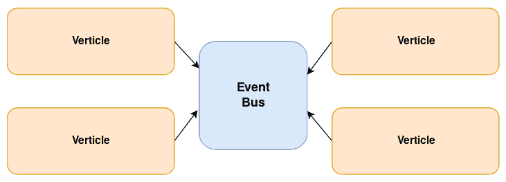
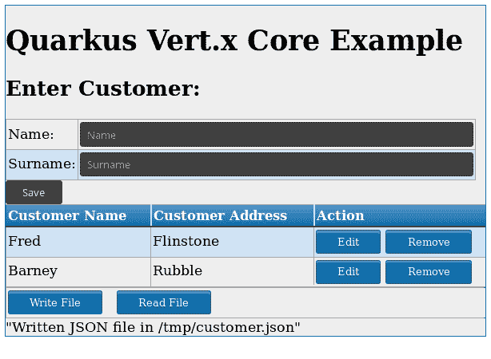
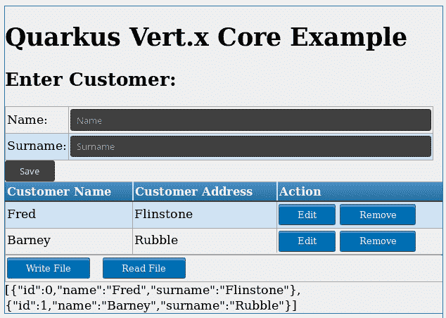
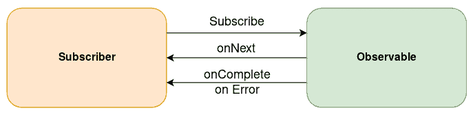
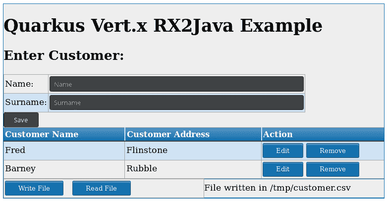
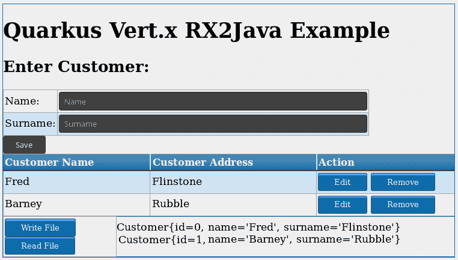
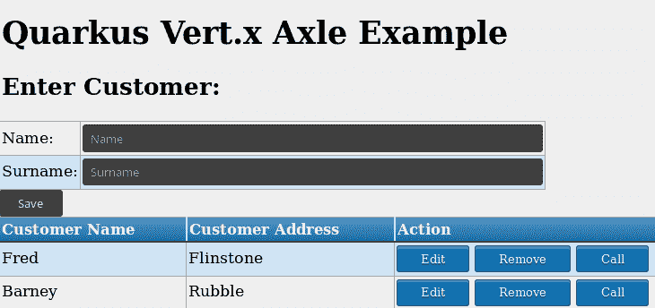
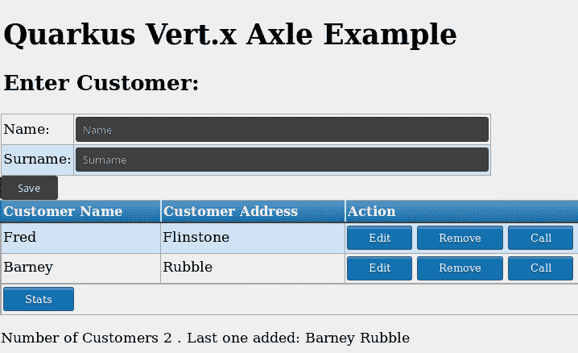
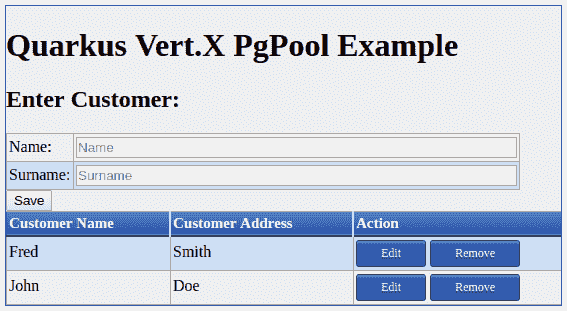

# 第九章：使用 Vert.x 统一命令式和反应式

对于企业应用来说，最大的挑战之一传统上一直是将本质上是同步的业务操作与异步和事件驱动的操作结果调度相结合。在本章中，我们将学习 Vert.x 工具包如何通过结合标准命令式编程和可以在运行时创建、更改或组合的异步数据流来应对 Quarkus 应用中的这一挑战。到本章结束时，你应该能够熟练地在 JVM 上使用 Vert.x 编写反应式应用程序。

在本章中，我们将涵盖以下主题：

+   反应式编程和 Vert.x 工具包的简介

+   在 Quarkus 中可用的 Vert.x API 模型

+   使用 Vert.x 管理反应式 SQL 客户端

# 技术要求

你可以在 GitHub 上本章中找到项目的源代码：[`github.com/PacktPublishing/Hands-On-Cloud-Native-Applications-with-Java-and-Quarkus/tree/master/Chapter09`](https://github.com/PacktPublishing/Hands-On-Cloud-Native-Applications-with-Java-and-Quarkus/tree/master/Chapter09)。

# 揭秘反应式编程和 Vert.x

命令式编程是大多数程序员每天编写代码的方式。等等——命令式编程是什么意思？用一个简洁的声明来说，我们可以这样说，命令式编程意味着代码行按顺序、逐条执行，如下面的示例所示：

```java
URL url = new URL("http://acme.com/");
BufferedReader in = new BufferedReader(new InputStreamReader(url.openStream()));

String line;
while ((line = in.readLine()) != null) {
  System.out.println(line);
}
in.close();
```

如你所见，命令式编程可以使用循环或条件语句跳转到代码的不同部分。不过，不要被这个迷惑。只要你的调试器清楚地指向你的代码中的某个语句（因此很明显下一个将执行哪一行），你就肯定是在使用命令式编程。

虽然命令式编程模型显然更容易理解，但随着连接数量的增加，它可能会严重影响到可伸缩性。事实上，系统线程的数量将相应增加，这将导致你的操作系统花费大量的 CPU 周期仅仅是为了线程调度管理。这就是 Vert.x 发挥作用的地方。

让我们从定义开始：Vert.x 究竟是什么？Vert.x 不是一个应用服务器或框架，而仅仅是一个工具包，或者如果你愿意，是一组可以添加到你的项目中的普通 JAR 文件。简单易懂。你也不需要特定的开发环境或插件来使用 Vert.x 开发应用程序。

在其核心，Vert.x 是一个满足**反应式宣言**（[`www.reactivemanifesto.org/`](https://www.reactivemanifesto.org/)）要求的反应式工具包。这些要求可以总结为以下几点：

+   **响应性**: 一个反应式系统需要能够以合理的时间处理请求。

+   **弹性**: 一个反应式系统必须被设计成能够处理故障，并且适当地处理它们。

+   **弹性**：反应式系统必须能够根据负载进行扩展和缩减，而不会影响系统的响应性。

+   **消息驱动**：反应式系统的组件通过交换异步消息相互交互。

根据前面的观点，很明显，Vert.x 推动了一种新的设计和构建分布式系统的方法，同时将异步性、可扩展性和反应性注入到应用程序的核心。因此，关于我们之前的示例，它可以以反应式的方式重写，如下所示：

```java
vertx.createHttpClient().getNow(80, "acme.com", "", response -> {
   response.bodyHandler(System.out::println);
 });
```

与前面的示例不同，使用 Vert.x 时，在建立与 HTTP 服务器的连接期间，运行线程被释放。然后，当收到响应时，一个作为 Lambda 表达式编写的处理器（[`docs.oracle.com/javase/tutorial/java/javaOO/lambdaexpressions.html`](https://docs.oracle.com/javase/tutorial/java/javaOO/lambdaexpressions.html)）被调用来处理响应。

在前面的示例中，每次你扩展 Vert.x 的基本部署单元，即所谓的**Verticle**时，都可以在你的代码中使用`vertx`字段。本质上，Verticle 通过事件循环处理传入的事件，为异步编程模型奠定基础。Verticle 可以用各种语言编写，而不仅仅是 Java，因此你可以将不同的环境作为更大反应式系统的一部分进行混合。

允许不同的 Verticle 之间相互通信的主要工具被称为**事件总线**，通信通过异步消息传递进行。以下图表显示了**事件总线**如何融入此架构：



事件总线不对你使用的数据格式有任何限制，尽管 JSON 是首选的交换格式，因为它是一种流行的数据结构化选项，允许用不同语言编写的 Verticle 进行通信。事件总线支持以下通信模式：

+   **点对点**消息传递，意味着消息被路由到在该地址注册的处理器之一。

+   **请求-响应**消息传递，与点对点消息传递类似，但它在发送消息时可以指定一个可选的回复处理器，以便接收者可以决定是否回复消息。如果他们这样做，回复处理器将被调用。

+   **发布-订阅**，允许你使用发布函数广播消息。在这种情况下，事件总线将消息路由到所有在该地址注册的处理器。

由于存在多种通信模式，已经为 Vert.x 设计了多个 API 模型，并且所有这些模型都围绕通过回调以异步方式执行流程的概念。下一节将讨论 Quarkus 中可用的各种 Vert.x API 模型。

# Quarkus 中的 Vert.x API 模型

Vert.x 提供了一整套集成到 Quarkus 中的反应式 API。更具体地说，Quarkus 通过提供一个单一依赖项到你的应用程序来使用 Vert.x 作为反应式引擎：

```java
<dependency>
    <groupId>io.quarkus</groupId>
    <artifactId>quarkus-vertx</artifactId>
</dependency>
```

这允许你通过简单的代码注入访问一个管理的 Vert.x 实例：

```java
@Inject io.vertx.core.Vertx vertx;
```

`Vertx`对象是 Vert.x 应用程序的控制中心。它是你通往 Vert.x 世界的通行证，允许你创建异步和非阻塞的客户端和服务器，获取 Event Bus 的引用，以及许多其他功能。

然而，当在 Quarkus 中使用 Vert.x API 时，没有`Vertx`对象供你访问。事实上，Quarkus 提供了三个不同的 Vert.x API：

+   `io.vertx.core.Vertx`：这是 Vert.x 核心 API 的入口点，允许你使用回调实现异步和非阻塞的客户端和服务器。

+   `io.vertx.reactivex.core.Vertx`：这个 API 允许我们在 Vert.x 应用程序中可以使用流或异步结果的地方使用可观察模式。此外，它还允许我们在流上使用大量数据转换操作符。

+   `io.vertx.axle.core.Vertx`：这个 API 专门设计用于与 Quarkus 的 MicroProfile 模式集成，为发送和接收异步消息提供了一个坚实的基础，从而在服务之间强制松耦合。

为了了解 Vert.x 的三个不同变体，我们在本书 GitHub 仓库的`Chapter09`文件夹中提供了相同数量的示例。让我们详细看看它们。

# 管理 Vert.x 核心 API

为了学习 Vert.x 核心 API，我们将使用我们之前讨论的基本客户服务应用程序的修改版，该应用程序在第四章中介绍，*将 Web 接口添加到 Quarkus 服务中*。你可以在本书 GitHub 仓库的`Chapter09/core/customer-service`文件夹中找到这个示例的源代码。我们建议你将项目导入到你的 IDE 中。

现在，让我们直接进入代码。由于 Vert.x 核心 API 基于回调机制，为了利用异步和非阻塞 API，在我们的客户服务示例中，我们添加了两个函数，用于从文件系统中以 JSON 格式读取和写入客户列表。我们的客户列表应该写在哪里？答案是写入`application.properties`文件，它定义了一个名为`file.path`的属性，客户列表将写入该位置：

```java
file.path=/tmp/customer.json

```

现在，让我们看看代码。负责提供客户数据的核心类是`CustomerRepository`。在这里，我们将注入一个`io.vertx.core.Vertx`实例。我们还将注入数据存储的路径：

```java
public class CustomerRepository {
    @Inject io.vertx.core.Vertx vertx;
    @ConfigProperty(name = "file.path" )
    String path;
```

现在来到了有趣的部分，那就是编写一个使用`vertx`实例在文件系统中展平我们的客户列表的方法：

```java
public CompletionStage<String> writeFile( ) {

    JsonArrayBuilder jsonArray = javax.json.Json.createArrayBuilder();
    for (Customer customer:customerList) {
        jsonArray.add(javax.json.Json.createObjectBuilder().
                 add("id", customer.getId())
                .add("name", customer.getName())
                .add("surname", customer.getSurname()).build());
    }

    JsonArray array = jsonArray.build();
    CompletableFuture<String> future = new CompletableFuture<>();

    vertx.fileSystem().writeFile(path, Buffer.buffer(array

    .toString()), handler -> {
        if (handler.succeeded()) {
            future.complete("Written JSON file in " +path);
        } else {
            System.err.println("Error while writing in file:
             " + handler.cause().getMessage());
        }
    });
    return future;
}
```

你可能首先注意到的是 `CompletionStage` 方法的签名。如果你已经编写过异步 Java 代码，你可能对 `java.util.concurrent.Future` API 很熟悉。它用于以下操作：

+   通过 `isDone()` 方法检查执行是否已完成

+   使用 `cancel()` 方法取消执行

+   使用阻塞的 `get()` 方法获取执行结果

这种方法的重大局限性是调用者无法手动完成任务，也不能链式调用多个 `Future` 执行。

另一方面，`CompletionStage` 基于阶段的概念，这些阶段被视为多个中间计算，可能是异步的，也可能不是。无论如何，我们必须在达到最终结果之前完成它们。这些中间计算被称为 **完成阶段**。

通过使用 `CompletionStage` 阶段，你可以通过以下方式轻松解决 `java.util.concurrent.Future` API 的局限性：

+   使用 `complete(T value)` 手动完成 `CompletableStage`

+   在一个块中链式调用多个 `CompletableStage`

让我们回到我们的例子。一旦我们从客户列表中创建出 `JsonArray`，我们就可以使用 Vert.x 核心 API 访问我们的 `FileSystem`。我们还可以注册一个处理程序，负责在文件成功写入后立即完成我们的 `CompletionStage`。

让我们来看看负责读取包含客户列表的文件的 `readFile` 方法：

```java
public CompletionStage<String> readFile() {
    CompletableFuture<String> future = new CompletableFuture<>();
    long start = System.nanoTime();

    // Delay reply by 100ms
    vertx.setTimer(100, l -> {
        // Compute elapsed time in milliseconds
        long duration = MILLISECONDS.convert(System.nanoTime() -
         start, NANOSECONDS);

        vertx.fileSystem().readFile(path, ar -> {
            if (ar.succeeded()) {
                String response = ar.result().toString("UTF-8");
                future.complete(response);
            } else {
                future.complete("Cannot read the file: " + 
                ar.cause().getMessage());
            }
        });

    });

    return future;
}
```

`readFile` 方法故意设计得稍微复杂一些。事实上，我们已经将两个不同的阶段链入其中。第一个阶段执行一个一次性定时器，将在 100 毫秒后触发下一次执行。定时器是 Vert.x 的核心结构，应该在任何需要延迟某些代码执行或重复执行代码的地方使用：

```java
vertx.setPeriodic(1000, l -> {
  // This code will be called every second
  System.out.println("timer fired!");
});
```

在 Vert.x 术语中，无论在何种情况下，定时器都是你可以用来延迟执行而不是其他机制（如 `Thread.sleep`），后者会阻塞事件循环，因此 **绝对** 不应该在 Vert.x 上下文中使用。

如果你忘记了我们的温和警告，Vert.x 将会在你每次尝试在 Vert.x 上下文中使用阻塞代码时提醒你，日志消息类似于 *Thread vertx-eventloop-thread-1 has been blocked for 22258 ms*。

`readFile` 方法的剩余部分与 `writeFile` 方法的操作正好相反；也就是说，它读取 JSON 文件并在文件读取完成后立即完成阶段。

为了将此功能暴露给客户端应用程序，我们在 `CustomerEndpoint` 类中添加了两个包装方法，以便通过 REST API 暴露函数：

```java
@GET
@Path("writefile")
@Produces("text/plain")
public CompletionStage<String> writeFile() {
    return customerRepository.writeFile();
}

@GET
@Path("readfile")
public CompletionStage<String> readFile() {
    return customerRepository.readFile();
}
```

值得注意的是，`writeFile` 方法产生文本信息，因为它应该返回一个简单的文本消息给调用者。另一方面，`readFile` 方法依赖于类的默认 `application/json` 格式来显示 JSON 文本文件。

现在，让我们转向客户端。我们可以使用两个额外的 AngularJS 处理程序轻松捕获`CompletionStage`事件，这些处理程序将立即捕获结果：

```java
$scope.writefile = function () {

$http({
    method: 'GET',
    url: SERVER_URL+'/writefile'
  }).then(_successStage, _error);
};

scope.readfile = function () {

  $http({
    method: 'GET',
    url: SERVER_URL+'/readfile'
  }).then(_successStage, _error);
};

function _successStage(response) {
   _clearForm()
   $scope.jsonfile = JSON.stringify(response.data);
}
```

通过在主页上添加两个简单的按钮，这两个函数将被触发：

```java
<a ng-click="writefile()" class="myButton">Write File</a>  
<a ng-click="readfile()"  class="myButton">Read File</a> 
```

除了做这件事，我们还向我们的 HTML 架构中添加了一个`div`部分，信息将在这里显示：

```java
<div ng-app="displayfile"  >
        <span ng-bind="jsonfile"></span>
</div>
```

不再拖延，让我们使用以下命令构建和运行应用程序：

```java
mvn install quarkus:dev
```

以下是我们新的 UI，包括读取文件和写入文件的按钮。我们已经保存了一组`Customer`对象，如下面的截图所示：



相反，如果我们点击“读取文件”按钮，其内容将以 JSON 格式显示在页面下方的`div`中：



我们已经完成了第一轮的 Vert.x 核心。现在，让我们继续前进，看看如何使用**ReactiveX**（**RxJava**）与 Vert.x 结合使用。

# 管理 Vert.x API for RxJava

RxJava ([`github.com/ReactiveX/RxJava`](https://github.com/ReactiveX/RxJava)) 是一个 Java 库，它允许你使用 Java VM 的`Observable`序列创建异步和基于事件的程序。为了理解这个框架的核心特性，我们需要定义 ReactiveX 的核心角色，如下所示：

+   **Observables**：这些代表要发出数据的数据源。一旦订阅者开始监听，Observable 就开始提供数据。Observable 可以发出可变数量的项目，并最终以成功或错误结束。

+   **订阅者**：这些监听由 Observable 发出的事件。一个 Observable 可以有零个或多个订阅者。

以下图表显示了这两个组件之间的关系：



根据发出的项目数量和对项目流的控制，我们可以区分不同类型的 Observables：

| **Observable 类型** | **描述** |
| --- | --- |
| `Flowable<T>` | 发出*0*或*n*个项目，并以成功或错误事件结束。支持背压，这允许我们控制源发射的速率。 |
| `Observable<T>` | 发出*0*或*n*个项目，并以成功或错误事件结束。 |
| `Single<T>` | 发出单个值或错误通知。 |
| `Maybe<T>` | 发出一个项目、没有项目或错误事件。可选调用的响应式版本。 |
| `Completable` | 包裹延迟计算，没有值，但仅作为完成或异常的指示。 |

让我们提供一个简约的例子。以下是一个`Observable`发出单个项目的`Hello world`示例：

```java
Observable.just("Hello world!").subscribe(System.out::println);
```

当订阅者收到项目时，它只是简单地将其打印到输出流中。下面的代码略有不同，因为它使用了一个 `Flowable` 可观察对象来控制在高速率推送数据时项目的流动，这可能会使你的订阅者过载：

```java
Flowable.just("Hello world!").subscribe(System.out::println);

```

RxJava 编程的一个重要概念是**操作符**；操作符是一个函数，它定义了 `Observable` 以及它如何以及何时应该发射数据流。我们已经遇到过一个，那就是 `just` 操作符，它允许你将一个对象或一组对象转换为 `Observable`。在我们的第一个例子中，对象是 `Hello world` 字符串。

有许多其他的操作符，所有这些都可以在 RxJava 的文档中找到（[`reactivex.io/documentation/operators.html`](http://reactivex.io/documentation/operators.html)）。例如，你可以使用 `distinct` 操作符在数据流中抑制重复项：

```java
Observable.just(2, 3, 4, 4, 2, 1)
        .distinct()
        .subscribe(System.out::println);
```

在这种情况下，订阅者预期的输出如下：

```java
2,3,4,1
```

你还可以链式添加另一个操作符来过滤掉不符合模式的项，如下所示：

```java
Observable.just(1, 2, 3, 4, 5, 6)  
     .distinct()
     .filter(x -> x % 2 == 0)
     .subscribe(System.out::println);
```

如你所猜，输出将进一步限制如下：

```java
2,4
```

尽管我们对 RxJava 的强大功能只是浅尝辄止，但我们已经具备了将这些概念应用到我们的示例应用程序中的基本背景。

# 使用 Quarkus 与 RxJava

为了了解 RxJava，我们将通过本书 GitHub 仓库中 `Chapter09/rx2java/customer-service` 文件夹中的示例进行学习。

你首先应该意识到的是，为了使用 RxJava 与 Quarkus，你必须添加一个 `Vertx` 实例，该实例位于 `io.vertx.reativex.core` 命名空间下：

```java
@Inject io.vertx.reactivex.core.Vertx vertx;
```

话虽如此，将 ReactiveX 包含到我们的项目中的一大主要优势是它将极大地增强在可观察对象和订阅者之间流动的数据的**转换**能力。

例如，让我们看看以下用例：

+   我们想要生成一个包含要导入电子表格的客户列表的文件。因此，我们将从我们的客户列表中创建一个普通的 CSV 文件。

+   然后，我们希望将 CSV 文件转换为客户的 `toString` 方法中编码的任何其他格式。

让我们学习如何对 `CustomerRepository` 类进行适当的修改。正如我们之前提到的，第一个修改是将 `io.vertx.core.Vertx` 实例替换为相应的 `io.vertx.reativex.core.Vertx`。然后，我们将对 `writeFile` 和 `readFile` 方法进行一些修改。让我们首先从 `writeFile` 方法开始：

```java
public CompletionStage<String> writeFile() {
    CompletableFuture<String> future = new CompletableFuture<>();
    StringBuffer sb = new StringBuffer("id,name,surname");
    sb.append(System.lineSeparator());

    Observable.fromIterable(customerList)
            .map(c -> c.getId() + "," + c.getName() + "," + 
             c.getSurname() + System.lineSeparator())
            .subscribe(
                    data ->   sb.append(data),
                    error -> System.err.println(error),
                    () ->  vertx.fileSystem().writeFile(path, 
                     Buffer.buffer(sb.toString()), handler -> {
                        if (handler.succeeded()) {
                            future.complete("File written in "+path);
                        } else {
                            System.err.println("Error while 
                            writing in file: " + handler.cause()
                            .getMessage());

                        }
                    }));

    return future;
}
```

如果你觉得我们对可观察对象的介绍直观易懂，那么前面的代码尽管使用了大量的 Lambda 表达式，看起来也不会过于复杂。在这里，我们添加了一系列操作符以产生所需的结果。

首先，我们通过使用`Observable.fromIterable`运算符遍历客户列表产生了一组可观察对象。由于我们需要生成一个 CSV 文件，我们需要将单个客户字段映射到 CSV 格式，该格式使用逗号（`,`）来分隔值。我们为此使用了`map`运算符。然后，我们完成了转换，结果将是一个列表，其中包含我们选择格式的可观察对象。

对于一个观察者（或订阅者）要看到由`Observable`发出的项目，以及来自`Observable`的错误或完成通知，它必须使用`subscribe`运算符订阅该`Observable`。简而言之，`subscribe`运算符是连接订阅者与`Observable`的粘合剂。

当有新项目添加时，我们的订阅者将收到通知，以便它们可以被追加到已经初始化了 CSV 标题的`StringBuffer`中。在出现错误的情况下，订阅者也会收到通知，最终，当项目流完成时，通过`()`处理程序。在这种情况下，CSV 文件将使用`writeFile`函数写入文件系统，该函数也存在于`io.vertx.reativex.core.Vertx`文件系统上下文中。

然后，`readFile`方法需要将我们已写入的 CSV 文件反转成`Customer`对象表示的形式，如它的`toString`方法所提供的。代码如下：

```java
public CompletionStage<String> readFile() {

    CompletableFuture<String> future = new CompletableFuture<>();
    StringBuffer sb = new StringBuffer();

    vertx.fileSystem().rxReadFile(path)
            .flatMapObservable(buffer -> 
              Observable.fromArray(buffer.toString().split(System.
              lineSeparator())))
            .skip(1)
            .map(s -> s.split(","))
            .map(data-> new Customer(Integer.
             parseInt(data[0]),data[1],data[2]))
            .subscribe(
                    data ->  sb.append(data.toString()),
                    error -> System.err.println(error),
                    () -> future.complete(sb.toString()));

    return future;

}
```

在这里，我们需要熟悉一些更多的运算符。由于我们想要逐行读取和处理文件，我们使用`flatMapObservable`运算符来产生我们的多个`Observable`实例数组。在实践中，这个运算符允许我们产生一组`Observable`实例，这是由我们 CSV 文件中的单行发出的函数产生的结果。

我们方便地使用字符串类的`split`方法将文件分割成一个数组。然后，我们使用`skip`运算符跳过了第一个项目，即 CSV 标题。之后，我们对数据应用了两个`map`转换：

+   第一个操作符创建了一个字符串对象数组，从 CSV 行中出来，使用逗号（`,`）作为分隔符

+   接下来，我们使用从字符串数组中到达的数据创建了一个`Customer`对象的实例

现在我们已经收集了我们的目标数据，即一个`Customer`对象，我们准备流式传输这些数据，这些数据最终将被订阅者收集。订阅者反过来接收每个项目，并将从它那里得到的`toString()`输出添加到`StringBuffer`中。你可以在你的`toString()`方法中包含任何格式，但为了简单起见，我们已经让我们的 IDE（IntelliJ IDEA）自动生成它：

```java
public String toString() {
    return "Customer{" +
            "id=" + id +
            ", name='" + name + '\'' +
            ", surname='" + surname + '\'' +
            '}';
}
```

我们将要做的最后一件事是设置`readFile`的媒体类型，使其与我们的`toString`数据格式保持一致。由于我们正在生成简单的文本，它将如下所示：

```java
@GET
@Path("readfile")
@Produces("text/plain")
public CompletionStage<String> readFile() {
    return customerRepository.readFile();
}
```

现在，您只需运行应用程序并检查新的结果。以下是在添加了一些客户并点击了“写入文件”按钮后，您的 UI 应该看起来像什么：



然后，通过点击“读取文件”按钮，下方的 HTML `div` 将包含每个客户的 `toString` 数据：



如您所见，尽管 UI 日志保持了极简风格，但在底层仍有大量工作在进行，以管理不同格式数据之间的转换。

那是我们对 Vert.x 和 Quarkus 的第二次实现。我们仍然需要处理第三个“野兽”，即 `io.vertx.axle.core.Vertx`。

# 使用 Vert.x 轴承库解耦事件

通常，我们希望将我们的服务入口点（适配器）与业务逻辑分开，后者是应用程序的一部分。一种常见的模式是将服务保存在一个独立的容器中，该容器被注入到我们的服务 REST 入口点。然而，当我们接近响应式编程时，我们可以通过引入 Vert.x Event Bus 来进一步解耦我们的组件。

在这种架构中，组件通过向虚拟地址发送消息来相互通信。为了管理消息的分配，以下组件可用：

+   **EventBus**：这是一个轻量级的分布式消息系统，允许以松耦合的方式在应用程序的不同部分之间进行通信。

+   **消息**：这包含从 Event Bus 在处理程序中接收到的数据。消息有一个体和一个头，两者都可以为 null。通过在消息中添加回复处理程序，可以将请求-响应模式应用于通信。

让我们通过使用 `Chapter09/axle/customer-service` 文件夹中可用的示例应用程序来学习如何通过使用简单的消息模式进行仪表化。

# 将 EventBus 层添加到 Quarkus 应用程序中

要在我们的应用程序中包含分布式对等消息模式，我们需要将 `EventBus` 实例注入到一个 CDI 容器中，该容器将充当接收者：

```java
@Inject EventBus bus;
```

在我们的情况下，我们将 `EventBus` 添加到 `CustomerEndpoint` 类中。

请注意，每个 Vert.x 实例只有一个 Event Bus 实例。

现在，在同一个类中，让我们创建一个新的端点方法，它将负责分发消息：

```java
@GET
@Path("/call")
@Produces("text/plain")
public CompletionStage<String> call(@QueryParam("id") Integer customerId) {
    return bus.<String>send("callcustomer", 
    customerRepository.findCustomerById(customerId))
            .thenApply(Message::body)
            .exceptionally(Throwable::getMessage);
```

我们通过 `"callcustomer"` 地址在总线上传递消息。消息体包含 `Customer` 对象，该对象通过 `findCustomerById` 方法检索。在发生错误的情况下，将抛出一个包含错误 `getMessage` 内容的可抛出对象。

现在，我们需要一个消息消费者，因此我们将添加另一个名为 `CustomerService` 的类，其中包含一个被 `@ConsumeEvent` 注解的方法：

```java
@ApplicationScoped
public class CustomerService {

        @ConsumeEvent("callcustomer")
        public String reply(Customer c) {
            return "Hello! I am " + c.getName() + " " 
             +c.getSurname() + ". How are you doing?";
        }
}
```

在`@ConsumeEvent`注解中，我们指定了消息被消费的地址。最终，我们只是返回一个包含客户消息的响应。

为了完成循环，我们需要进行以下更改：

+   我们需要将一个按钮添加到`index.html`页面：

```java
<a ng-click="call( customer )" class="myButton">Call</a>
```

+   我们需要添加一个额外的 AngularJS 控制器来处理响应，该控制器将在（一个弹窗中）显示以下消息：

```java
$scope.call = function (customer) {

  $http({
    method: 'GET',
    url: SERVER_URL+'/call/?id='+customer.id
  }).then(_callCustomer, _error);
};

 function _callCustomer(response) {
   window.alert(response.data);
}
```

现在我们已经添加了一切，让我们运行我们的应用程序。

# 收敛应用程序

当所有更改都到位后，你应该能够看到呼叫按钮已经添加到每个客户的行中，如下面的截图所示：



当你点击呼叫按钮时，将通过事件总线发送一条消息。一旦被消费，你应该看到以下响应：


除了点对点消息之外，你还可以使用 Vert.x 轴 API 来流式传输**服务器端事件**（**SSEs**）。

# 使用 Vert.x 流式传输 SSE

传统上，Web 应用程序能够向服务器发送请求以接收响应；这就是标准范式。然而，通过服务器发送事件，服务器应用程序可以在任何时候通过向网页推送事件（消息）来向网页发送新数据。这些传入的消息被作为网页内部的事件与数据结合处理。

现在，让我们演示如何使用 Vert.x 轴 API 在 Quarkus 中流式传输 SSE。以下被包含在我们项目中的类，负责每两秒向主页发送一个 SSE：

```java
@Path("/streaming")
public class StreamingEndpoint {

    @Inject io.vertx.axle.core.Vertx vertx;

    @Inject CustomerRepository customerRepository;
    @GET
    @Produces(MediaType.SERVER_SENT_EVENTS)
    public Publisher<String> stream() {

        return
                ReactiveStreams.fromPublisher
                (vertx.periodicStream(2000).
                 toPublisher())
                        .map(l -> String.format
                    ("Number of Customers %s . 
                    Last one added: %s %n",customerRepository.
                    findAll().size(),
                                customerRepository.findAll().size()
                                 > 0 ? 
                                (customerRepository.findAll().
                                get(customerRepository.findAll().
                                size() -1)).toString()  : "N/A"))
                        .buildRs();

    }
}
```

首先，请注意我们正在使用`io.vertx.axle.core.Vertx`的一个实例来处理事件的流式传输。然后，我们的 REST 方法，绑定到`"/streaming"`URI，被注解为不同的媒体类型，即`SERVER_SENT_EVENTS`。该方法返回一个发布者类型，这是发布 Reactive Streams 所必需的。

通过使用`ReactiveStreams.fromPublisher`方法，我们根据`vert.xperiodicStream`指定的频率推送流事件。在我们的例子中，消息将每两秒分发一次。在发送实际事件之前，内容将通过`map`操作符进行转换，这将创建一个包含一些`Customer`统计信息（如客户数量和最后添加的客户）的消息。通过使用三元操作符，我们成功地将这个逻辑压缩成只有一句话，但牺牲了稍微复杂一点的可读性。

服务器端你需要的就是这些。在客户端，我们做了一些其他的适配：

+   我们添加了一个额外的按钮来触发 SSE：

```java
<a ng-click="stats()" class="myButton">Stats</a></div>

```

+   我们在 JavaScript 中添加了一个回调方法来处理接收的事件：

```java
$scope.stats = function () {

  var eventSource = new EventSource("/streaming");
  eventSource.onmessage = function (event) {
  var container = document.getElementById("divcontainer");
  var paragraph = document.createElement("p");
  paragraph.innerHTML = event.data;
  container.appendChild(paragraph);
};
```

+   我们添加了一个`div`，消息将在其中显示：

```java
<div id="divcontainer" style="width: 800px; height: 200px; overflow-y: scroll;">
```

当我们运行更新后的应用程序时，预期的结果是包含底部 Stats 按钮的 UI：



较低级别的 `div` 将每两秒更新一次，基于客户列表中的数据。

# 取消事件

值得注意的是，可以通过保持对 `Subscription` 对象的引用来取消 SSE 订阅，这样你就可以在任何时候取消你的订阅：

```java
publisher
   .subscribe(new Subscriber<String>() {
     volatile Subscription subscription;

     @Override
     public void onSubscribe(Subscription subscription) {
       this.subscription = subscription;
     }

     @Override
     public void onNext(String s) {
       // when no more event is needed
 subscription.cancel();
     }

     @Override
     public void onError(Throwable throwable) {
       // handle error
     }

     @Override
     public void onComplete() {
       // handle complete
     }
});
```

在前面的代码片段中，当事件发出时，观察者的 `onNext` 方法会使用项目被调用，紧接着调用 `onComplete` 方法。另一方面，当回调是失败时，观察者的 `onError` 方法会被调用。在任何回调方法中，我们都可以使用订阅对象的 `cancel` 方法来取消订阅。

这是我们与 Reactive Events 的最后一次合作，但不是与 Vert.x 的最后一次。我们还有一件事要讲：Quarkus 的 Reactive SQL 客户端。这是一个专注于具有最小开销的可扩展 JDBC 连接的 API。

# 管理反应式 SQL 客户端

反应式 SQL 客户端是一个 API，允许你使用 Vert.x 的反应式和非阻塞特性来访问关系数据库。这在访问数据的方式上带来了一些变化。让我们把成本和收益列出来：

+   一方面，你需要使用 SQL 语句来启用你的 RDBMS 访问数据，而不是抽象的 HQL。由于 Hibernate 不再适用，Java 类和数据库之间的自动映射也不再可用。

+   另一方面，你将能够使用完全事件驱动、非阻塞、轻量级的替代方案来流式传输 SQL 语句的结果。

根据你的需求，你可以继续使用 Hibernate 的 API 或切换到反应式 SQL 客户端。假设你很勇敢，想要切换到反应式 SQL。为此，你需要配置你的应用程序，使其能够使用 PostgreSQL 反应式客户端 API。

# 配置应用程序以使用 PostgreSQL 反应式客户端

为了深入了解反应式客户端 API，请参阅本书 GitHub 仓库中 `Chapter09/pgpool` 文件夹中的示例。由于此示例不会使用 PostgreSQL JDBC 驱动程序，以下依赖项已被添加为替代品：

```java
<dependency>
  <groupId>io.quarkus</groupId>
  <artifactId>quarkus-reactive-pg-client</artifactId>
</dependency>
```

我们添加的另一个配置是 JDBC URL，它需要以下格式：

```java
vertx-reactive:postgresql://<Host>:<Port>/<DBName>

```

因此，在我们的示例中，我们将在 `application.properties` 中添加此设置：

```java
quarkus.datasource.url=vertx-reactive:postgresql://localhost:5432/quarkusdb
quarkus.datasource.username=quarkus
quarkus.datasource.password=quarkus
```

现在，让我们看看我们应用程序中的变化。为了尽可能保持简单，我们将示例分解，使其仅使用 `CustomerEndpoint` 和 `Customer` POJO 类。

让我们从 `CustomerEndpoint` 开始，它需要访问 `io.vertx.axle.pgclient.PgPool` 和 `io.vertx.core.Vertx`：

```java
public class CustomerEndpoint {

    @Inject PgPool client;
    @Inject Vertx vertx;
```

在同一个类中，我们添加了一个 `init` 方法，在启动时创建一些数据：

```java
@PostConstruct
private void initdb() {

    client.query("DROP TABLE IF EXISTS CUSTOMER")
            .thenCompose(r -> client.query("CREATE SEQUENCE IF
              NOT EXISTS  customerId_seq"))
            .thenCompose(r -> client.query("CREATE TABLE CUSTOMER
             (id SERIAL PRIMARY KEY, name TEXT NOT NULL,surname
             TEXT NOT NULL)"))
            .thenCompose(r -> client.query("INSERT INTO CUSTOMER
             (id, name, surname) VALUES ( nextval('customerId
              _seq'), 'John','Doe')"))
            .thenCompose(r -> client.query("INSERT INTO CUSTOMER
              (id, name, surname) VALUES ( nextval('customerId
                _seq'), 'Fred','Smith')"))
            .toCompletableFuture()
            .join();
}
```

Pgpool 的`query`方法返回一个包含数据`RowSet`的`CompletionStage`对象，这是查询的结果。请注意我们如何将多个语句链接起来以生成一个`CompletableFuture`，它将在另一个线程中启动执行。在这个简单的方法中，你可以体验一下当涉及到创建事件驱动的、非阻塞的 SQL 执行时，反应式 SQL 客户端有多么强大。你最终将通过在`CompletableFuture`的末尾执行`join`方法来获得所有语句的合并结果。

`CustomerEndpoint`的其他方法使用相同的组合模式将 CRUD 语句的执行委托给`Customer`类：

```java
@GET
public CompletionStage<Response> getAll() {
    return Customer.findAll(client).thenApply(Response::ok)
            .thenApply(ResponseBuilder::build);
}

@POST
public CompletionStage<Response> create(Customer customer) {
    return customer.create(client).thenApply(Response::ok)
            .thenApply(ResponseBuilder::build);
 }

@PUT
public CompletionStage<Response> update(Customer customer) {
    return customer.update(client)
            .thenApply(updated -> updated ? Status.OK : 
             Status.NOT_FOUND)
            .thenApply(status -> Response.status(status).build());
}

@DELETE
public CompletionStage<Response> delete(@QueryParam("id") Long customerId) {
    return Customer.delete(client, customerId)
            .thenApply(deleted -> deleted ? Status.NO_CONTENT : 
             Status.NOT_FOUND)
            .thenApply(status -> Response.status(status).build());
}
```

在`Customer`类中，我们编写了所有执行 CRUD 操作所需的方法。第一个方法`create`通过使用`PreparedStatement`在`CUSTOMER`表中执行一个`INSERT`操作，将包含姓名和姓氏的元组作为参数：

```java
public CompletionStage<Long> create(PgPool client) {
    return client.preparedQuery("INSERT INTO CUSTOMER (id, name, 
     surname) VALUES ( nextval('customerId_seq'), $1,$2)
     RETURNING (id)", Tuple.of(name,surname))
            .thenApply(pgRowSet -> pgRowSet.iterator()
            .next().getLong("id"));
}
```

同样地，`update`方法通过`PreparedStatement`执行`UPDATE`操作，并将客户的元组数据作为参数应用：

```java
public CompletionStage<Boolean> update(PgPool client) {
    return client.preparedQuery("UPDATE CUSTOMER SET name = $1,
     surname = $2 WHERE id = $3", Tuple.of(name, surname, id))
            .thenApply(pgRowSet -> pgRowSet.rowCount() == 1);
}
```

要删除客户，`delete`方法执行`PreparedStatement`，它使用客户`id`作为参数：

```java
public static CompletionStage<Boolean> delete(PgPool client, Long id) {
    return client.preparedQuery("DELETE FROM CUSTOMER WHERE
     id = $1", Tuple.of(id))
            .thenApply(pgRowSet -> pgRowSet.rowCount() == 1);
}
```

最后，使用`findAll`方法从数据库查询客户列表，并将它们作为 Java 列表返回：

```java
public static CompletionStage<List<Customer>> findAll(PgPool client) {
    return client.query("SELECT id, name, surname FROM CUSTOMER 
    ORDER BY name ASC").thenApply(pgRowSet -> {
        List<Customer> list = new ArrayList<>(pgRowSet.size());
        for (Row row : pgRowSet) {
            list.add(from(row));
        }
        return list;
    });
}
```

我们已经完成了应用程序的编码。让我们让它运行起来！

# 运行示例

在运行示例之前，请确保你已经初始化了 PostgreSQL 数据库；否则，当应用程序部署时，初始语句将失败：

```java
$ docker run --ulimit memlock=-1:-1 -it --rm=true --memory-swappiness=0 --name quarkus_test -e POSTGRES_USER=quarkus -e POSTGRES_PASSWORD=quarkus -e POSTGRES_DB=quarkusdb -p 5432:5432 postgres:10.5
```

然后，使用以下命令按常规运行应用程序：

```java
mvn  install quarkus:dev
```

UI 隐藏了我们从普通对象切换到真实数据库的事实，尽管你可以从页面标题中推断出这一点，现在标题是 Quarkus Vert.X PgPool Example：



然而，如果你登录到数据库容器，你可以确认`Customer`表已经创建并包含其项。让我们找到用于此目的的容器 ID：

```java
$ docker ps
 CONTAINER ID        IMAGE               COMMAND                  CREATED             STATUS              PORTS                    NAMES
 6b1b13b0547f        postgres:10.5       "docker-entrypoint..."   2 minutes ago       Up 2 minutes        0.0.0.0:5432->5432/tcp   quarkus_test
```

现在，让我们使用`docker exec`命令进入 PostgreSQL 容器的 bash shell：

```java
$ docker exec -it 6b1b13b0547f /bin/bash

 root@6b1b13b0547f:/# psql -U postgres
 psql (10.5 (Debian 10.5-2.pgdg90+1))
 Type "help" for help.
```

你可以使用`\dt`快捷键检查关系列表：

```java
 postgres=# \dt;
 List of relations
 Schema |   Name   | Type  |  Owner 
 --------+----------+-------+----------
 public | customer | table | postgres
 (1 row)
```

我们也可以按照以下方式查询`Customer`表的行：

```java
postgres=# select * from customer;
 id | name | surname
 ----+------+---------
 5 | John | Doe
 6 | Fred | Smith
 (2 rows)
```

太好了！我们已经完成了我们的第一个使用 Quarkus 的反应式 SQL 应用程序。这也标志着我们进入 Vert.x 世界的旅程的结束。

# 摘要

通过对响应式编程的快速浏览，你应该已经熟练掌握了在 JVM 上编写响应式应用程序。你的编程技能现在包括如何使用 Vert.x 核心 API 编写异步和非阻塞服务。你还学习了如何使用 Vert.x 响应式 API 将`Observable`模式与流或异步结果相结合。然后，我们迅速探索了最后一个 Vert.x 范式，Vert.x Axle，它允许不同的 bean 通过异步消息进行交互并强制松耦合。最后，我们应用了响应式 API，通过 Vert.x 的 PostgreSQL 客户端扩展来访问关系数据库。

尽管你已经掌握了响应式编程 API，请注意，其大部分功能只有在构建实时数据管道和流式数据时才能充分发挥。我们将在下一章中介绍这些内容。
