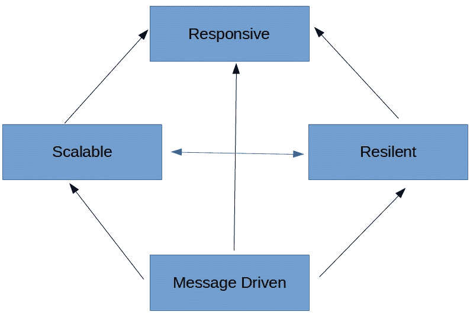
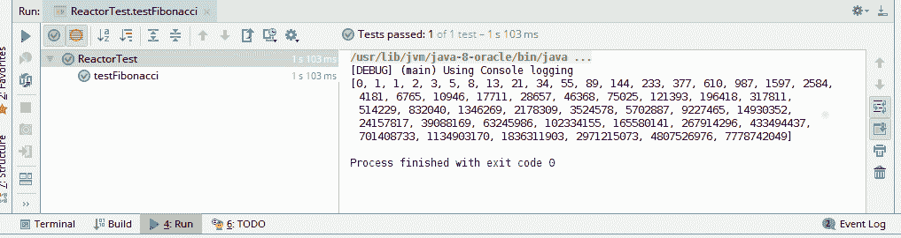

# 开始使用反应式流

随着时间的推移，应用架构已经发展。企业越来越需要构建在需要时可以保持响应性和可扩展性的系统。系统还应易于维护和快速发布。根据这些需求，我们已经开始构建松散耦合的服务应用。我们不再将系统构建为一个庞大的应用程序。相反，我们将系统拆分为多个独立、自主的服务。这些服务的目标是做一件事，并且做好。

在本章中，我们将讨论构建此类服务时相关的担忧。我们还将探讨如何解决这些担忧。

# 技术要求

+   Java 标准版，JDK 8 或更高版本

+   IntelliJ IDEA IDE，2018.1 或更高版本

本章节的 GitHub 链接为[`github.com/PacktPublishing/Hands-On-Reactive-Programming-with-Reactor/tree/master/Chapter01`](https://github.com/PacktPublishing/Hands-On-Reactive-Programming-with-Reactor/tree/master/Chapter01)。

# 反应式架构

当我们开始构建微服务架构时，我们试图涉及不同的服务以提供业务解决方案。我们通常将服务构建为传统的 API 模型，其中每个服务都可以与其他服务交互。这被称为**分布式架构**。如果分布式架构设计不当，性能问题会很快显现出来。要使众多分布式服务同时工作以提供预期的性能可能很困难。因此，提供需要大量数据交换服务（如 Netflix、Amazon 或 Lightbend）的公司已经看到了对替代范例的需求，这些范例可以用于具有以下特性的系统：

+   由非常松散耦合的组件组成

+   对用户输入做出响应

+   能够抵御变化的负载条件

+   总是可用

为了实现上述特性，我们需要构建事件驱动的、模块化的服务，这些服务通过使用通知相互通信。反过来，我们可以对系统的事件流做出响应。模块化服务更易于扩展，因为我们可以在不停止整个应用程序的情况下添加或删除服务实例。如果我们能够隔离错误并采取纠正措施，完整的架构将具有容错性。上述四个特性是**反应式宣言**的基本原则。反应式宣言指出，每个反应式系统应由松散耦合的组件组成，这些组件依赖于异步、消息驱动的架构。它们必须对用户输入保持响应，并将故障隔离到单个组件。为了应对不同的负载条件，必须进行复制。以下是反应式宣言的示意图：



响应式宣言描述了一个响应式系统。它并不要求系统基于响应式编程或任何其他响应式库。我们可以构建一个基于消息驱动、弹性、可扩展和响应的应用程序，而不使用响应式库，但基于响应式库构建应用程序会更简单。

# 响应式编程

我们大多数人编写的是命令式应用程序，其中需要语句来改变应用程序状态。代码被执行，最终达到一个状态。在状态计算之后，当底层因素发生变化时，状态不会改变。以下代码作为例子：

```java
int value1 = 5;
int value2 = 10;
int sum = val1 + val2;
System.out.println(sum); // 15
value1 = 15;
System.out.println(sum); // 15

```

总和仍然是`15`，尽管`value1`已经改变。

另一方面，响应式编程是关于变化的传播。它也被称为**声明式编程**，其中我们表达我们的意图和应用程序状态，这些状态由底层因素的变化动态确定。在响应式范式下，前面的总和程序示例将如下行为：

```java
int value1 = 5;
int value2 = 10;
int sum = val1 + val2;
System.out.println(sum); // 15
value1 = 15;
System.out.println(sum); // 25
```

因此，如果一个程序对底层因素的变化做出反应，它可以被称为响应式。响应式程序可以使用命令式技术，如回调来构建。对于只有一个事件的程序来说，这可能没问题。然而，对于有数百个事件发生的应用程序，这很容易导致回调地狱；我们可能有多个相互依赖的回调，很难确定哪些正在执行。因此，我们需要一套新的抽象，使我们能够无缝地在网络边界上构建异步、事件驱动的交互。在 Java 等不同的命令式语言中，有提供这些抽象的库。这些库被称为**响应式扩展**。

# ReactiveX

响应式扩展，也称为 ReactiveX，使我们能够将应用程序中的异步事件表示为一组可观察序列。其他应用程序可以订阅这些可观察序列，以便接收正在发生的事件的通知。生产者可以随后将这些通知事件推送到消费者。或者，如果消费者速度较慢，它可以根据自己的消费速率拉取通知事件。生产者和其消费者之间的端到端系统被称为**管道**。需要注意的是，管道默认是懒加载的，直到被消费者订阅才会实际化。这与代表主动工作的急切 Java 类型（如 Future）非常不同。ReactiveX API 由以下组件组成：

1.  **可观察序列**：可观察序列代表了 ReactiveX 的核心概念。它们代表发出项的序列，并生成传播到预期订阅者的事件。

1.  **观察者**：任何应用程序都可以通过创建观察者并订阅相应的可观察对象来表达其对由可观察对象发布的事件的意图。意图通过`OnNext`、`OnCompleted`和`OnError`方法来表示。每个可观察对象发送一系列事件，然后是一个完成事件，这些事件执行这些方法。

1.  **操作符**：操作符使我们能够转换、组合和处理由可观察对象发出的项目序列。可观察对象上的操作符提供一个新的可观察对象，因此，它们可以相互连接。它们不会独立于原始可观察对象工作；相反，它们作用于由前一个操作符生成的可观察对象以生成一个新的可观察对象。完整的操作符链是惰性的。它不会在观察者订阅之前进行评估。完整的链如下所示：


ReactiveX 提供了构建反应式应用程序的架构设计。不同的命令式语言围绕它构建了各个库，以使其可用。这些抽象使我们能够构建异步、非阻塞的应用程序，并提供以下章节中列出的额外好处。

# 组合流

在软件设计中，**组合**指的是将不同的实体分组，并将每个组视为单个实体。此外，单个实体表现出与其所引用的类型相同的行为。ReactiveX 流本质上是组合的。它们使得将现有数据流组合起来、添加转换以及生成新的数据流成为可能。此外，所有这些都可以以声明性方式完成，从而使整体解决方案在长期内可维护。

# 灵活操作符

这些库提供了一系列适用于各种函数的操作符。每个操作符都像装配线上的工作站一样完成任务。它从前一个工作站接收输入，并向下一个工作站提供输入。这些操作符提供各种数据转换、流编排和错误处理。

ReactiveX 使构建基于事件的程序变得更加容易。然而，该框架没有展示不同事件驱动应用程序之间应该如何相互交互。在一个由众多事件驱动服务组成的微服务架构中，所获得的收益往往被所需的进程间通信的解决方案所抵消。

# Reactive Streams

Reactive Streams 是一个规范，它确定了构建大量无界数据异步处理所需的最小接口集。它是一个针对 JVM 和 JavaScript 运行时的规范。Reactive Streams 规范的主要目标是标准化应用程序异步边界之间的流数据交换。API 由以下四个接口组成：

1.  **发布者**：发布者负责生成无限数量的异步事件并将这些事件推送到相关的订阅者。

1.  **订阅者**：订阅者是发布者发布事件的消费者。订阅者可以获得订阅、数据、完成和错误事件。它可以选择对其中任何一个执行操作。

1.  **订阅**：订阅是发布者和订阅者之间用于调解两者之间数据交换的共享上下文。订阅仅在订阅者处可用，并使其能够控制来自发布者的事件流。如果发生错误或完成，订阅将无效。订阅者还可以取消订阅，以关闭其流。

1.  **处理器**：处理器代表订阅者和发布者之间数据处理的一个阶段。因此，它被两者所约束。处理器必须遵守发布者和订阅者之间的合同。如果有错误，它必须将其传播回订阅者。

Reactive Streams 规范是来自 Kaazing、Netflix、Pivotal、Red Hat、Twitter、Typesafe 和其他许多公司的工程师共同努力的结果。

尽管只有四个接口，但大约有 30 条规则来规范发布者和订阅者之间的数据交换。这些规则基于以下章节中提到的两个原则。

# 异步处理

异步执行指的是执行任务时无需等待之前执行的任务完成。执行模型解耦任务，使得每个任务都可以同时执行，利用可用的硬件。

Reactive Streams API 以异步方式传递事件。发布者可以以同步阻塞方式生成事件数据。另一方面，每个事件处理程序都可以以同步阻塞方式处理事件。然而，事件发布必须异步进行。在处理事件时，它不能被订阅者阻塞。

# 订阅者背压

订阅者可以控制其队列中的事件以避免任何溢出。如果还有额外容量，它还可以请求更多事件。背压强制发布者根据订阅者限制事件队列。此外，订阅者可以要求一次接收一个元素，构建停止等待协议。它也可以请求多个元素。另一方面，发布者可以应用适当的缓冲区来保存未发送的事件，或者如果生产率超过消费率，它可以直接开始丢弃事件。

重要的是要注意，Reactive Streams API 旨在不同系统之间的事件流。与 ReactiveX 不同，它不提供任何执行转换的算子。该 API 已被采纳为 JDK 9 中`java.util.concurrent.Flow`包的一部分。

# David Karnok 的分类

David Karnok，Rxjava 和 Reactor 等各种反应式项目的资深人士，将反应式库的演变划分为以下几代。

# 零代

零代围绕着 `java.util.observable` 接口和相关回调。它本质上使用可观察设计模式进行反应式开发。它缺乏必要的组合、操作符和背压支持。

# 第一代

第一代代表了 Erik Mejer 通过构建 Rx.NET 来解决反应式问题的尝试。这指的是以 `IObserver` 和 `IObservable` 接口形式实现的实现。整体设计是同步的，缺乏背压。

# 第二代

第二代 API 解决了第一代中背压和同步处理的问题。这一代指的是反应式扩展的第一批实现，如 RxJava 1.X 和 Akka。

# 第三代

第三代指的是 Reactive Streams 规范，它使库实现者之间能够相互兼容，并在边界之间组合序列、取消和背压。它还允许最终用户根据自己的意愿在实现之间切换。

# 第四代

第四代指的是反应式操作符可以以外部或内部方式组合，从而实现性能优化。第四代反应式 API 看起来与第三代相似，但内部操作符发生了显著变化，以产生预期的效益。Reactor 3.0 和 RxJava 2.x 属于这一代。

# 第五代

第五代指的是未来的工作，届时将需要在流上进行双向反应式 I/O 操作。

# Reactor

Reactor 是由 Pivotal 开源团队完成的一个实现，符合 Reactive Streams API。该框架使我们能够构建响应式应用程序，负责处理背压和请求处理。该库提供了以下功能。

# 无限数据流

Reactor 提供了生成无限数据序列的实现。同时，它提供了一个用于发布单个数据条目的 API。这适用于请求-响应模型。每个 API 都提供了旨在处理特定数据基数的方法。

而不是等待整个数据集到达，每个数据流的订阅者可以按数据到达的顺序处理项目。这从空间和时间上优化了数据处理。内存需求限制在同时到达的项目的子集，而不是整个集合。在时间上，结果一旦收到第一个元素就开始到达，而不是等待整个数据集。

# 推拉模型

Reactor 是一个推拉系统。快速的生产者引发事件并等待较慢的订阅者拉取它们。在慢速发布者和快速订阅者的情况下，订阅者等待从生产者那里推送事件。Reactive Streams API 允许这种数据流在本质上具有动态性。它只依赖于生产的实时速率和消费速率。

# 并发无关

Reactor 执行模型是并发无关的。它不涉及不同流应该如何处理。库简化了不同的执行模型，开发者可以根据自己的意愿使用。所有转换都是线程安全的。有各种算子可以通过组合不同的同步流来影响执行模型。

# 算子词汇表

Reactor 提供了一系列算子。这些算子允许我们选择、过滤、转换和组合流。操作作为管道中的工作站执行。它们可以组合在一起来构建高级、易于推理的数据管道。

Reactor 已被 Spring Framework 5.0 采用，以提供反应式功能。完整项目包括以下子项目：

+   **Reactor-Core**：该项目为 Reactive Streams API 提供实现。该项目也是 Spring Framework 5.0 反应式扩展的基础。

+   **Reactor-Extra**：该项目补充了 Reactor-Core 项目。它提供了在 Reactive Streams API 之上工作的必要算子。

+   **Reactor-Tests**：该项目包含测试验证的实用工具。

+   **Reactor-IPC**：该项目提供非阻塞的进程间通信。它还提供了为 HTTP（包括 WebSocket）、TCP 和 UDP 准备的背压就绪网络引擎。该模块也可以用于构建微服务。

# 项目设置

本书采用动手实践的方法；您将通过与示例一起工作来学习 Reactor。本章将设置我们将在这本书中使用的项目。在我们继续之前，我们必须做一些设置。请在您的机器上安装以下项目：

+   **Java 8**：Reactor 与 Java 8 或更高版本兼容。请从官方 Oracle 网站下载 Java 8 的最新更新，网址为[`www.oracle.com/technetwork/java/javase/downloads/index.html`](http://www.oracle.com/technetwork/java/javase/downloads/index.html)。在撰写本文时，Java 版本为`1.8.0_101`。您可以通过运行以下命令来检查您的 Java 版本：

```java
$ java -version
java version "1.8.0_101"
Java(TM) SE Runtime Environment (build 1.8.0_101-b13)
Java HotSpot(TM) 64-Bit Server VM (build 25.101-b13, mixed mode)
```

+   **IntelliJ IDEA 2018.1 或更高版本**：我们将使用 IntelliJ 的最新社区版。您可以从 JetBrains 网站下载最新版本，网址为[`www.jetbrains.com/idea/download/`](https://www.jetbrains.com/idea/download/)。我们将使用版本 2018.1.1。

+   **Gradle**：Gradle 是 JVM 生态系统中最受欢迎的构建工具之一。它用于依赖项管理和运行自动化任务。您不需要在本地机器上安装 Gradle；我们将使用 Gradle 包装器，它会为您的项目下载和安装 Gradle。要了解更多关于 Gradle 的信息，您可以参考 Gradle 文档[`docs.gradle.org/current/userguide/userguide.html`](https://docs.gradle.org/current/userguide/userguide.html)。

现在我们已经拥有了所有先决条件，让我们通过 IntelliJ IDEA 本身来创建一个 Gradle 项目：

1.  启动 IntelliJ IDEA，您将看到以下屏幕，您可以在其中开始创建项目：


1.  点击“创建新项目”以开始创建 Java Gradle 项目的流程。您将看到一个创建新项目的屏幕。在此，选择 Gradle 和 Java，如以下截图所示。您还必须指定项目 SDK。点击“新建”按钮以选择 JDK 8。然后，点击“下一步”以进入下一屏幕：


1.  现在您将被要求输入 GroupId 和 ArtifactId。点击“下一步”以进入下一屏幕：


1.  下一屏幕将要求您指定一些 Gradle 设置。我们将选择“使用自动导入”，这样 Gradle 将在我们将新依赖项添加到构建文件时自动添加它们。点击“下一步”以进入最终屏幕：


1.  在此屏幕上，您将被要求指定您想要创建项目的位置。选择一个方便的应用程序目录路径。最后，点击“完成”以完成项目创建过程：


现在 Java Gradle 项目已经创建，我们不得不在 Gradle 构建文件`build.gradle`中进行一些更改，即更改以下内容：

```java
plugins {
    id "io.spring.dependency-management" version "1.0.5.RELEASE"
}
group 'com.reactor'
version '1.0-SNAPSHOT'
apply plugin: 'java'
sourceCompatibility = 1.8
repositories {
    mavenCentral()
}
dependencyManagement {
    imports {
        mavenBom "io.projectreactor:reactor-bom:Bismuth-RELEASE"
    }
}
dependencies {
    compile 'io.projectreactor:reactor-core'
    testCompile group: 'junit', name: 'junit', version: '4.12'
}
```

在前面的`build.gradle`文件中，我们做了以下操作：

1.  添加了`io.spring.dependency-management`插件。此插件允许我们有一个`dependency-management`部分，用于配置依赖项版本。

1.  配置了`dependency-management`插件以下载 Reactor 的最新版本。我们使用了 Reactor 项目发布的 Maven BOM。

1.  将`reactor-core`依赖项添加到项目依赖项列表中。

这就是我们开始使用 Reactor 所需要做的全部事情。

在撰写本文时，Bismuth-RELEASE 是 Reactor 的最新版本。

现在，让我们构建一个简单的测试用例来查看我们如何使用 Reactor API。我们将构建一个生成斐波那契数的简单测试用例。维基百科将斐波那契数定义为如下：

“在数学中，斐波那契数列是以下整数序列中的数，称为斐波那契序列，其特征是每个数（从第三个数开始）都是前两个数的和：

0 , 1 , 1 , 2 , 3 , 5 , 8 , 13 , 21 , 34 , 55 , 89 , 144, ...”

让我们构建用于生成斐波那契数的测试。测试用例将从 0 和 1 开始生成一个序列。它将生成前 50 个斐波那契数，并将第 50 个数验证为 `7778742049`：

```java
@Test
public void testFibonacci() {
  Flux<Long> fibonacciGenerator = Flux.generate(
    () -> Tuples.<Long, Long>of(0L, 1L),
     (state, sink) -> {
       sink.next(state.getT1());
       return Tuples.of(state.getT2(), state.getT1() + state.getT2());
     });
     List<Long> fibonacciSeries = new LinkedList<>();
     int size = 50;
     fibonacciGenerator.take(size).subscribe(t -> {
       fibonacciSeries.add(t);
     });
     System.out.println(fibonacciSeries);
     assertEquals( 7778742049L, fibonacciSeries.get(size-1).longValue());
}
```

完整的代码可以在[`github.com/PacktPublishing/Hands-On-Reactive-Programming-with-Reactor/tree/master/Chapter01`](https://github.com/PacktPublishing/Hands-On-Reactive-Programming-with-Reactor/tree/master/Chapter01)找到。

在先前的测试用例中，我们执行了以下操作：

1.  我们通过使用 `Flux.generate()` 调用创建斐波那契数作为 `Flux<Long>`。API 有一个 `State` 和 `Sink`。现在，我们将把 Flux API 的细节留给下一章。

1.  API 以 `Tuple [0 , 1]` 作为种子。然后它通过 `Sink.next()` 调用发出对的第一个参数。

1.  API 还通过聚合这对数生成下一个斐波那契数。

1.  接下来，我们使用 `take()` 操作符选择前 50 个斐波那契数。

1.  我们订阅发布的数字，然后将接收到的数字追加到 `List<Long>` 中。

1.  最后，我们断言发布的数字。

在先前的测试用例中，我们使用了多个 Rector 功能。我们将在后续章节中详细介绍每个功能。现在，让我们执行测试用例并检查我们的项目是否运行正常。

运行我们的单元测试应该会给我们一个绿色的条形，如下所示：



# 摘要

在本章中，我们讨论了需要反应式范式。我们还探讨了范式的演变，从反应式编程到反应式扩展，再到反应式流。此外，我们讨论了反应式流规范作为针对 JVM 的规范，旨在以下方面：

+   处理序列中可能无界数量的元素

+   在组件之间异步传递具有强制非阻塞背压的元素

在本章末尾，我们介绍了 Reactor，这是 Pivotal 团队的一个实现，并使用它构建了一个示例项目。在下一章中，我们将讨论 Reactor 中可用的 API。

# 问题

1.  反应式宣言的原则是什么？

1.  什么是反应式扩展？

1.  反应式流规范提供了哪些内容？

1.  反应式流基于哪些原则？

1.  Reactor 框架的主要特性是什么？

# 进一步阅读

+   要了解更多关于微服务设计的信息，请参阅[`www.packtpub.com/application-development/reactive-microservice-design-video`](https://www.packtpub.com/application-development/reactive-microservice-design-video)。

+   Reactive Streams 规范是 Java 9 的一部分。要了解更多关于 Java 开发工具包 9 中包含的内容，请参阅 [`www.packtpub.com/application-development/reactive-programming-java-9`](https://www.packtpub.com/application-development/reactive-programming-java-9).
