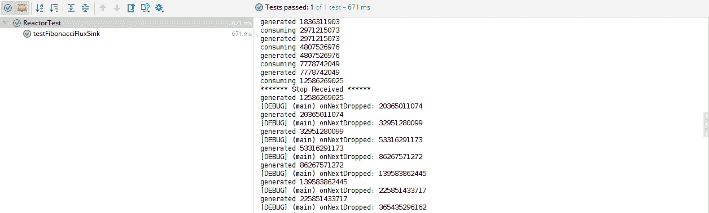

# 第二章：Reactor 中的发布者和订阅者 API

上一章为您简要介绍了反应范式的发展历程。在那章中，我们讨论了如何通过反应流在命令式语言（如 Java）中执行反应式建模。我们还讨论了反应式中的关键组件——发布者和订阅者。在本章中，我们将详细介绍这两个组件。由于反应流是一个规范，它不提供这两个组件的实现。它只列出了各个组件的责任。具体实现留给实现库，如 Reactor，为接口提供具体实现。Reactor 还提供了不同的方法来实例化发布者和订阅者对象。

本章我们将涵盖以下主题：

+   将流与现有的 Java API 进行比较

+   理解 Flux API

+   理解 Mono API

+   为 Flux 和 Mono 发布者构建订阅者

# 技术要求

+   Java 标准版，JDK 8 或更高版本

+   IntelliJ IDEA IDE，2018.1 或更高版本

本章节的 GitHub 链接为[`github.com/PacktPublishing/Hands-On-Reactive-Programming-with-Reactor/tree/master/Chapter02`](https://github.com/PacktPublishing/Hands-On-Reactive-Programming-with-Reactor/tree/master/Chapter02)。

# 流发布者

如我们在上一章中讨论的，发布者负责生成无界异步事件，并将它们推送到相关的订阅者。它由以下`org.reactivestreams.Publisher`接口表示：

```java
public interface Publisher<T> {
    public void subscribe(Subscriber<? super T> s);
}
```

该接口提供了一个单一的`subscribe`方法。该方法由任何有兴趣监听发布者发布的事件的任何一方调用。该接口非常简单，可以用来发布任何类型的事件，无论是 UI 事件（如鼠标点击）还是数据事件。

由于接口很简单，让我们为我们的自定义`FibonacciPublisher`添加一个实现：

```java
public class FibonacciPublisher implements Publisher<Integer> {
    @Override
    public void subscribe(Subscriber<? super Integer> subscriber) {
        int count = 0, a = 0, b = 1;
        while (count < 50) {
            int sum = a + b;
            subscriber.onNext(b);
            a = b;
            b = sum;
            count++;
        }
        subscriber.onComplete();
    }
}
```

这种实现看起来可能不错，但它是否符合规范中规定的发布者行为？规范规定了描述发布者行为的规则。发布者必须生成以下四种类型的事件：

+   订阅事件

+   发布者声明的类型`T`的数据

+   完成事件

+   错误事件

根据规范，发布者可以发出任意数量的数据事件。然而，它必须只发布一个完成、错误和订阅事件。一旦发布完成或错误事件，发布者就不能再向订阅者发送数据事件。

由于背压是规范的重要方面，发布者不能向订阅者推送任意数量的事件。相反，订阅者必须指定它可以接收多少事件，发布者必须发布等于或小于指定数量的事件。

为了验证发布者，反应式流 API 已发布了一个测试兼容性套件。让我们将`reactive-streams-tck`添加到我们的`build.gradle`项目中：

```java
dependencies {
  // rest removed for brevity
  testCompile group: 'org.reactivestreams',
  name: 'reactive-streams-tck', version: '1.0.2'
}
```

**技术兼容性套件**（**TCK**）提供了一个必须实现的`PublisherVerifier`接口，以验证发布者。它提供了以下两个方法：

+   `createPublisher(long)`: 此方法必须提供一个发布者实例，该实例可以产生指定的数量的事件

+   `createFailedPublisher()`: 此方法必须尝试构建一个已引发错误事件的发布者

让我们添加以下实现来测试我们的`FibonacciPublisher`：

```java
public class FibonacciPublisherVerifier extends PublisherVerification<Integer> {
    public FibonacciPublisherVerifier(){
        super(new TestEnvironment());
    }
    @Override
    public Publisher<Integer> createFailedPublisher() {
        return null;
    }
    @Override
    public Publisher<Integer> createPublisher(long elements) {
        return new FibonacciPublisher();
    }
}
```

现在，让我们运行测试用例以确定我们是否符合反应式流发布者规范：


如前一个屏幕截图所示，大约有 20 个测试失败和 16 个跳过的测试。我们可以修复每一个，但这里的目的是理解即使是一个简单的发布者接口也受到许多行为规范的约束。因此，构建自定义发布者是不必要的。作为服务构建者，我们可以使用 Reactor 框架。它提供了能够发布任何类型数据的发布者实现。

# 流订阅者

订阅者用于监听由发布者生成的事件。当订阅者向发布者注册时，它按以下顺序接收事件：


因此，订户有以下界面来处理所有这些事件：

```java
public interface Subscriber<T> {
    public void onSubscribe(Subscription s);
    public void onNext(T t);
    public void onError(Throwable t);
    public void onComplete();
}
```

让我们详细说明以下每个方法：

+   `onSubscribe(Subscription s)`: 一旦发布者收到订阅者，它就会生成一个订阅事件。然后，生成的订阅事件在指定方法中接收。

+   `onNext (T)`: 所有由发布者生成并由订阅者在指定方法中接收的数据事件。发布者在关闭流之前可能发布也可能不发布数据事件。

+   `onCompletion()`: 这指的是完成事件，订阅者必须处理此事件。一旦收到完成事件，订阅就视为无效。

+   `onError()`: 这指的是错误事件，订阅者必须处理此事件。错误可能在任何时候发生——在构建订阅或生成下一个数据事件时。在任何情况下，发布者都必须发送错误事件。一旦收到事件，订阅就视为无效。

# 订阅

订阅是反应式流中的一个重要组成部分。它提供了必要的控制流，以确保发布者不会使订阅者过载。这被称为背压。

一旦订阅者收到订阅事件，它必须要求发布者在其各自的订阅中发布指定数量的事件。这是通过调用订阅对象的`request(long)`方法来完成的。

随着数据事件的生成，它们会被订阅者接收。一旦达到限制，发布者必须停止发布更多事件。随着订阅者处理这些事件，它必须从发布者请求更多事件：

```java
public interface Subscription {
    public void request(long n);
    public void cancel();
}
```

订阅对象允许订阅者控制它想要接收的事件。每当订阅者确定它不再想要接收事件时，它可以调用订阅的`cancel()`方法。一旦调用，订阅者可能会接收更少的数据事件，这符合取消之前提出的需求。取消后，订阅将变为无效，这意味着它不能用来请求更多数据。

请求方法的`Long.MaxValue`值会导致发布者产生无限的事件流。

订阅者可以在使用请求方法提出任何需求之前，使用`onSubscribe()`方法取消一个活跃的订阅。在这种情况下，发布者将取消订阅而不会引发任何事件。

现在我们已经详细了解了订阅者接口，我们可以尝试构建一个`FibonacciSubscriber`，如下所示：

```java
public class FibonacciSubscriber implements Subscriber<Long> {
    private Subscription sub;
    @Override
    public void onSubscribe(Subscription s) {
        sub = s;
        sub.request(10);
    }
    @Override
    public void onNext(Long fibNumber) {
        System.out.println(fibNumber);
        sub.cancel();
    }
    @Override
    public void onError(Throwable t) {
        t.printStackTrace();
        sub=null;
    }
    @Override
    public void onComplete() {
        System.out.println("Finished");
        sub=null;
    }
}
```

之前实现的代码执行以下操作：

1.  在接收到订阅事件后，会发起一个请求来处理`10`个事件。

1.  当接收到数据事件时，所有事件都会打印到输出控制台。

1.  在处理单个事件之后，订阅者取消订阅。

1.  `onCompletion`方法将订阅设置为`null`。

1.  `onError`方法将错误信息打印到控制台并将订阅设置为`null`。

现在，让我们使用`SubscriberBlackboxVerification<T>`抽象类来验证订阅者。我们需要实现`createSubscriber()`方法，如下面的代码所示：

```java
public class FibonacciSubsciberVerification extends SubscriberBlackboxVerification<Long> {
    public FibonacciSubsciberVerification(){
        super(new TestEnvironment());
    }
    @Override
    public Subscriber<Long> createSubscriber() {
        return new FibonacciSubscriber();
    }
    @Override
    public Long createElement(int element) {
        return new Long(element);
    }
}
```

让我们运行测试用例以确定我们的订阅者是否符合 Reactive Streams 标准：


在这里，我们也可以找到大量的损坏测试用例。这些损坏的测试用例定义了订阅者的行为。我们可以修复这些用例，但更好的选择是使用 Reactor 来创建我们的服务。在下一节中，我们将描述 Reactor 中可用的发布者和订阅者实现。这些实现符合规范行为。

# Reactive Streams 比较

在我们深入研究 Reactor 之前，让我们比较 Streams 模型与一些现有的类似 API，例如`java.util.Observable`接口和 JMS API。我们将尝试确定 API 之间的相似之处和关键差异。

# Observable 接口

`java.util.Observable`接口实现了观察者模式，这在此处可以相关联。然而，所有相似之处到此为止。如果我们查看`Observable`接口，我们有以下方法：

```java
public class Observable {
  void addObserver (Observer o);
  void deleteObserver (Observer o);
  void deleteObservers();
  void notifyObservers();
  void notifyObserver(int arg);
  int countObservers();
  boolean hasChanged();
}
```

在我们确定差异之前，让我们看看`Observer`接口：

```java
public interface Observer{
  void update(Observable o, Object arg)
}
```

如果我们查看`Observable`和`Observer`接口，我们可以看到它们都是关于单个事件及其状态。`Observable` API 负责确定变化并将其发布给所有感兴趣的一方。另一方面，`Observer`只监听变化。这并不是我们用`Publisher`和`Subscriber`接口建模的内容。`Publisher`接口负责生成无界事件，与只关注单一实体状态变化的`Observable`不同。另一方面，`Subscriber`列出了所有种类的事件，如数据、错误和完成。

此外，`Observable`维护一个活跃的观察者列表。它有责任移除不再对事件感兴趣的观察者。这不同于`Publisher`，`Publisher`只负责订阅。`Subscriber`决定是否关闭订阅，由其自行决定。

# Java 消息服务 API

让我们看看响应式流与**Java 消息服务（JMS）API**的比较。JMS 规范描述了一个`Queue`和一个`Topic`，生产者和消费者可以连接到这些队列或主题：

```java
@Resource(lookup = "jms/Queue")
private static Queue queue;

@Resource(lookup = "jms/Topic")
private static Topic topic;
Session session = connection.createSession(false,Session.AUTO_ACKNOWLEDGE);
MessageProducer producer = session.createProducer(queue);
MessageConsumer consumer = session.createConsumer(topic)
```

在这里，生产者负责在队列或主题上生成无界事件，而消费者积极消费事件。生产者和消费者在各自的速率下独立工作。管理订阅的任务由 JMS 代理负责。这与订阅 API 不同，在事件生成中，背压起着重要作用。也没有像订阅、错误或完成这样的事件建模。JMS 连接就像一个永不结束的数据流。它不能提供完成或错误事件。如果我们需要支持这一点，必须首先建模自定义对象。

# 了解 Reactor 核心 API

Reactor 项目被划分为不同的模块。`reactor-core` 模块是核心库，旨在为响应式流提供实现。该库提供了 Flux 和 Mono，它们是`Publisher`接口的两种不同实现。这两个发布者在其可以发出的事件数量方面有所不同。Flux 可以发出无限序列的元素，但 Mono API 使得最多只能发出一个元素。让我们在接下来的章节中详细介绍这些 API。

# Flux API

`Flux<T>`是一个通用响应式发布者。它表示一个异步事件流，包含零个或多个值，可选地由完成信号或错误终止。重要的是要注意，Flux 发出以下三个事件：

+   **值**指的是发布者生成的值

+   **完成**指的是流的正常终止

+   **错误**指的是流的错误终止：


所有的前述事件都是可选的。这可能导致以下类型的流：

+   **无限流**：仅生成值事件，没有终端事件（完成和错误）

+   **无限空流**：一个不生成值事件和不终止事件的流

+   **有限流**：生成 *N* 个有限值，然后是终端事件

+   **空流**：一个不生成值事件，只生成终端事件的发布者

Flux 支持生成所有前面的变体，因此它可以用于大多数通用用例。它还可以为应用程序生成一系列警报。警报是一个无限值的流，没有终端。Flux 还可以用于从订单数据库流式传输订单数据。订单值在最后一个订单值处终止。可能存在没有特定产品类型的订单，使得该类型的流为空。

# 生成 Flux API

`Flux<T>` API 支持从各种来源生成流，例如单个值、集合、Java 8 流等。它还可以用于从自定义逻辑或现有的响应式发布者生成流。我们将在接下来的章节中详细讨论所有这些选项。

# Flux.just 方法

这是生成 Flux 的最简单方法。它接受一组值，例如 `var-args`，并使用这些值生成一个有限的 Flux 流。指定的每个 `var-args` 值形成一个 Flux 的值事件。在发布所有指定的值之后，发布一个完成事件：

```java
Flux.just("Red");
Flux.just("Red", "Blue", "Yellow", "Black");
Flux.just(new Person("Rahul"), new Person("Rudra"));
```

# Flux.from 方法

`From` 方法可以用于从各种来源生成 Flux，例如数组、集合等。在这种情况下，所有值事先都被识别为多值数据集。生成的 Flux 为原始数据集中的每个值发布值事件，然后是一个完成事件。提供的方法有以下变体：

+   `Flux.fromArray`：这是用于从一个类型的数组构建流。

+   `Flux.fromIterable`：这是用于从集合构建流。所有集合都是 `Iterable<T>` 类型，可以传递给此方法以生成预期的流。

+   `Flux.fromStream`：这是用于从一个现有的 Java 8 流或 Java 8 流提供者构建 Flux。考虑以下代码：

```java
Flux.fromArray(new Integer[]{1,1,2,3,5,8,13});
Flux.fromIterable(Arrays.asList("Red", "Blue", "Yellow", "Black"));
Flux.fromStream(IntStream.range(1,100).boxed());
```

# 工具方法

Flux 提供了生成无限流和空流的方法，或者将现有的响应式流发布者转换为 Flux。这些方法需要生成可以与其他流结合的流，如下所示：

+   `Flux.empty`：此方法生成一个没有值且只有完成的空流。

+   `Flux.error`：此方法生成一个没有值且只有指定错误的错误流。

+   `Flux.never`：此方法生成一个没有任何事件的流。它不生成任何类型的事件。

+   `Flux.from`：此方法接受一个现有的响应式发布者，并从中生成一个 Flux。

+   `Flux.defer`：此方法用于构建一个懒加载的响应式发布者。该方法接受一个 Java 8 供应商来实例化一个特定订阅的响应式流发布者。发布者实例仅在订阅者订阅 Flux 时生成。

# Flux.generate 方法

Flux 支持程序化事件生成。在上一章中，我们使用了该 API 生成斐波那契事件。这是 API 的高级使用方法，涉及更多组件。我们将在以下部分中详细介绍这些内容。

# SynchronousSink

该汇（sink）被绑定到发布者的订阅者。当订阅者请求数据时，通过消费者函数调用它。对于每次调用，汇（sink）可以一次生成最多一个值事件。在调用过程中，汇（sink）可以引发额外的 `onCompletion` 或错误事件。

重要的是要注意，由汇（sink）生成的事件在订阅者端是同步消费的。让我们回顾一下我们在上一章中编写的斐波那契（Fibonacci）测试：

```java
Flux<Long> fibonacciGenerator = Flux.generate(
        () -> Tuples.<Long, Long>of(0L, 1L),
        (state, sink) -> {
            sink.next(state.getT1());
            System.out.println("generated "+state.getT1());
            return Tuples.of(state.getT2(), state.getT1() + state.getT2());
        });
fibonacciGenerator.take(size).subscribe(t -> {
    System.out.println("consuming "+t);
    fibonacciSeries.add(t);
});
```

在汇（sink）中生成多于一个事件会导致 `java.lang.IllegalStateException: More than one call to onNext`。

在生成和消费数字时，我们添加了额外的打印语句。让我们运行我们的测试以查看输出，如下所示：


消费者和生产者语句以不同的方式生成。我们可以很容易地推断出每个数字在生成下一个数字之前被消费。Generate API 提供了多种变体，汇（sink）可以带或不带初始状态使用。在我们的 `FibonacciGenerator` 中，我们使用的是基于每个订阅者的初始化状态。可选地，我们还可以提供一个终端函数，该函数在事件流终止时被调用。这意味着它将在汇（sink）调用错误或完成事件之后发生。终端函数可以用于执行与状态相关的任何清理操作。

# Flux.create

`Flux.create` 是另一种用于程序化生成事件的机制。它接受一个 `FluxSink`，该 `FluxSink` 能够生成任意数量的事件。与上一节中讨论的 `Generate` 方法相比，该 API 更加通用。`FluxSink` 能够异步生成事件。此外，它不考虑订阅取消或背压。这意味着即使订阅者已经取消了订阅，创建 API 也会继续生成事件。所有实现都必须监听 `cancel` 事件并显式启动流关闭。

关于背压，生产者持续生成事件，而不考虑订阅者的任何需求。如果订阅丢失，这些事件将被缓冲并默认丢弃。

要了解这两个的不同之处，让我们修改我们的 `FibonacciGenerator` 以使用 `FluxSink`。以下是一些关键差异的突出显示：

+   API 中没有初始种子状态

+   `FluxSink` 不论订阅状态如何，都会持续生成事件

+   我们可以在汇集中生成任意数量的事件

+   可以监听 `OnDispose` 事件来执行任何清理操作，或者停止发布事件

+   所有生成的事件都会被缓冲，一旦取消订阅就会丢弃

需要注意的是，`FluxSink` 提供了生命周期回调方法，可以用来执行额外的清理操作，或者执行任何其他操作，如下所示：

+   `OnCancel`：当订阅被取消时，此方法被调用。

+   `OnDispose`：当由于取消、关闭或错误事件关闭订阅时，此方法被调用。

+   `OnRequest`：此方法使用订阅者指定的值调用。它可以用来构建拉数据模型。当方法被调用时，可以调用下一个方法来指定值的数量：

```java
@Test
public void testFibonacciFluxSink() {
    Flux<Long> fibonacciGenerator = Flux.create(e -> {
        long current = 1, prev = 0;
        AtomicBoolean stop = new AtomicBoolean(false);
        e.onDispose(()->{
            stop.set(true);
            System.out.println("******* Stop Received ****** ");
        });
        while (current > 0) {
            e.next(current);
            System.out.println("generated " + current);
            long next = current + prev;
            prev = current;
            current = next;
        }
        e.complete();
    });
    List<Long> fibonacciSeries = new LinkedList<>();
    fibonacciGenerator.take(50).subscribe(t -> {
        System.out.println("consuming " + t);
        fibonacciSeries.add(t);
    });
    System.out.println(fibonacciSeries);
}
```

让我们检查生成的输出，如下所示：



`Flux` 还提供了一个 `Push` 方法。这与 `create` 方法类似，但错误和完成事件的调用过程不同。这些事件必须以同步方式，从单个线程生产者调用。

# Mono API

现在我们已经介绍了 Flux API，让我们看看 Mono。它能够生成最多一个事件。这是 Flux 的一个特定用例，能够处理一个响应模型，例如数据聚合、HTTP 请求-响应、服务调用响应等。需要注意的是，Mono 会发出以下三个事件：

+   **值**指的是发布者生成的单个值

+   **完成**指的是流的正常终止

+   **错误**指的是流的错误终止


由于 Mono 是 Flux 的子集，它支持 Flux 操作符的子集。让我们看看如何构建一个 Mono。

# 生成一个 Mono

`Mono<T>` API 支持从各种单值源生成流，如单个值、方法调用、Java 8 供应函数等。它还可以用于从自定义逻辑或现有响应式发布者生成流。我们现在将详细讨论这些。

# Mono.just 方法

`Mono.just` 方法是生成 Mono 最简单的方法。它接受一个值，并从中生成一个有限的 Mono 流。在发布指定的值之后，会发布一个完成事件：

```java
Mono.just("Red");
Mono.justOrEmpty(value);
Mono.justOrEmpty(Optional.empty());
```

# Mono.from 方法

当值可以从现有源确定时，使用 `From` 方法来构建 Flux。与 Flux 方法不同，其中源是多值的，Mono 的源是单值的。这些方法提供了以下变体：

+   `fromCallable`: 此方法生成一个包含一个值，随后是完成事件的 Mono。如果 `Callable` 返回多值数据集，如数组或集合，则完整的数据集将作为单个事件中的对象推送。

+   `fromFuture`: 此方法生成一个包含一个值，随后是完成事件的 Mono。

+   `fromSupplier`: 此方法生成一个包含一个值，随后是完成事件的 Mono。

+   `fromRunnable`: 此方法生成一个没有值，只包含完成事件的 Mono。这可以通过以下代码解释：

```java
Mono.fromSupplier(() -> 1);
Mono.fromCallable(() -> new String[]{"color"}).subscribe(t -> System.out.println("received " + t));
Mono.fromRunnable(() -> System.out.println(" ")).subscribe(t -> System.out.println("received " + t), null, () -> System.out.println("Finished"));
```

# 工具方法

Mono 提供了生成空/错误流或将现有的响应式流发布者转换为 Mono 的方法。这些方法需要生成可以与其他流通过可用运算符组合的流，如下所示：

+   `Mono.empty`：生成一个没有值，只包含完成事件的流。

+   `Mono.error`：生成一个没有值，只包含指定错误的流。

+   `Mono.never`：生成一个没有任何事件的流。它不会生成任何类型的事件。

+   `Mono.from`: 从现有的流发布者生成 Mono 流。

+   `Mono.defer`: 此方法用于构建一个懒加载的响应式发布者。它还接受一个 Java 8 供应商来实例化特定订阅的响应式流发布者。发布者实例仅在订阅者对 Mono 进行订阅时生成。

需要注意的是，可以使用 Flux 源生成 Mono。在这种情况下，Mono 使用 Flux 发布的第一个事件，如下所示：

```java
Mono.from(Flux.just("Red", "Blue", "Yellow", "Black")).subscribe(t -> System.out.println("received " + t))

**** Output ******
received Red

Process finished with exit code 0
```

# Mono.create

除了 `Flux.create` 方法外，还有一个 `Mono.create` 方法。此方法提供了一个 `MonoSink`，可以用来生成值、完成或错误事件。与 Flux 方法不同，我们在生成 *N* 个事件，如果我们在 Mono 中生成更多事件，它们将被丢弃。也没有处理背压，因为只有一个事件。

API 不考虑订阅取消。这意味着即使订阅者已取消其订阅，创建方法仍然生成其事件。实现者必须注册自定义钩子以处理生命周期事件并执行流关闭。

# 构建 Flux 和 Mono 的订阅者

Reactor Flux 和 Mono 提供了广泛的订阅方法。响应式发布者引发四种类型的事件，即订阅、值、完成和错误。可以为每个事件注册单独的函数。我们还可以注册一个订阅者，而不监听任何类型的事件。让我们看看所有可能提供的变体，如下所示：

```java
fibonacciGenerator.subscribe(); (1)

fibonacciGenerator.subscribe(t -> System.out.println("consuming " + t));   (2)

fibonacciGenerator.subscribe(t -> System.out.println("consuming " + t),
                e -> e.printStackTrace() ); (3)

fibonacciGenerator.subscribe(t -> System.out.println("consuming " + t),
                e -> e.printStackTrace(),
                ()-> System.out.println("Finished")); (4)

fibonacciGenerator.subscribe(t -> System.out.println("consuming " + t),
                e -> e.printStackTrace(),
                ()-> System.out.println("Finished"),
                s -> System.out.println("Subscribed :"+ s)); (5)
```

以下代码显示了所有的 `Subscribe` 方法：

1.  如第 `1` 行所示，没有事件被消费。

1.  只消费值事件，如第 `2` 行所示。

1.  除了值事件外，我们还打印错误堆栈跟踪，如第 `3` 行所示。

1.  我们可以监听值、错误和完成事件，如第 `4` 行所示。

1.  我们可以监听值、错误、完成和订阅事件，如第 `5` 行所示。

所有 `Subscribe` 方法都返回 `Disposable` 类型。此类型也可以用于取消订阅。

有时，我们可能会认为 `Subscribe` 方法不够好。我们必须创建一个具有自己处理的自定义订阅者。Reactor 为这些情况提供了 `reactor.core.publisher.BaseSubscriber<T>`。而不是实现响应式流的 `Subscriber`，Reactor 建议实现 `BaseSubscriber` 抽象类：

```java
BaseSubscriber<Long> fibonacciSubsciber= new BaseSubscriber<Long>() {
            @Override
            protected void hookOnSubscribe(Subscription subscription) { }

            @Override
            protected void hookOnNext(Long value) {}

            @Override
            protected void hookOnComplete() { }

            @Override
            protected void hookOnError(Throwable throwable) {}

            @Override
            protected void hookOnCancel() {}

        };
```

如果我们查看 `BaseSubscriber` 的实现，我们将看到以下内容：

+   每个单独的事件都可以通过单独的钩子方法来处理。

+   它捕获订阅并使其通过上游方法可访问。此方法可以在任何生命周期方法中调用。

+   它还通过提供 `request(long)` 方法来处理背压。默认方法是逐个请求值。然而，订阅者可以通过使用 `request` 方法提出额外的需求。

+   它还提供了 `requestUnbound()` 方法，该方法禁用背压。

一旦我们有了自定义订阅者，就可以使用 Flux 和 Mono 中的 `subscribe()` 方法来调用它。

# 生命周期钩子

发布者-订阅者通信在整个响应式流的生命周期中生成事件。Reactor 提供了相应的生命周期方法，可以用来将自定义逻辑钩接到每个事件上，如下表所示：

| **事件** | **方法** |
| --- | --- |
| 订阅事件 | `doOnSubscribe` |
| 请求事件，从订阅者请求 *N* 个项目 | `doOnRequest` |
| 值事件，对于所有生成的值 | `doOnNext` |
| 错误事件，由发布者产生的任何错误 | `doOnError` |
| 完成事件 | `doOnCompletion` |
| 取消事件，由订阅者取消 | `doOnCancel` |

除了前面提到的方法之外，还有以下方法：

+   `doOnEach`：此方法在流处理中引发的所有发布者事件上执行。

+   `doOnTerminate`：此方法在由于错误或完成而关闭流时执行。它不考虑取消。

+   `doFinally`：此方法在由于错误、完成或取消而关闭流时执行。

# 尝试一个动手项目

现在我们已经详细讨论了 Reactor 接口，让我们尝试使用 Reactor 生成一个阶乘序列。给定一个数字，我们希望生成小于或等于提供的数字的所有数字的阶乘。在数论中，阶乘被描述如下：

"正数 'n' 的阶乘定义为 n! = n(n-1)(n-2)...2.1 例如，5! = 5 × 4 × 3 × 2 × 1 = 120。"

现在，让我们尝试构建一个阶乘流函数，它接受一个数字并尝试为从 0 到 *N* 的每个数字生成阶乘：

```java
public class FactorialService {

    Flux<Double> generateFactorial(long number) {
        Flux<Double> factorialStream = Flux.generate(
                () -> Tuples.<Long, Double>of(0L, 1.0d),
                (state, sink) -> {
                    Long factNumber = state.getT1();
                    Double factValue = state.getT2();
                    if (factNumber <= number)
                        sink.next(factValue);
                    else
                        sink.complete();
                    return Tuples.of(factNumber + 1, (factNumber + 1) * factValue);
                });
        return factorialStream;
    }
}
```

在前面的代码中，我们执行了以下操作：

1.  初始的 `factorialNumber` 被设置为 `0`，阶乘为 `1`。

1.  我们检查了 `factorialNumber` 是否小于或等于传入的数字，并为它发布了阶乘值。

1.  如果 `factorialNumber` 大于传入的数字，则发布完成信号。

1.  我们增加了 `factorialNumber` 并计算了它的阶乘。

上述流程相当简单，但它使得利用各种 Flux 组件成为可能。由于阶乘服务已经就绪，我们需要通过订阅它来验证它。在下面的测试用例中，我们做以下事情：

1.  调用生成阶乘数的生成器，直到 `10`。

1.  使用 `doOnNext()` 生命周期钩子显示每个生成的数字。

1.  使用 `last()` 操作符来获取最后一个值。我们将在下一章介绍操作符。

1.  在订阅者的值事件函数中比较和断言值：

```java
public class FactorialServiceTest {

    @Test
    public void testFactorial() {
        Flux<Double> factorialGenerator = new FactorialService().generateFactorial(10);
        factorialGenerator
                .doOnNext(t -> System.out.println(t))
                .last()
                .subscribe(t -> assertEquals(3628800.0, t, 0.0));
    }
}
```

现在，让我们运行测试用例来查看输出：


# 摘要

在本章中，我们详细讨论了 Reactive Streams 的发布者和订阅者接口。我们尝试实现这些接口来展示它们有许多非显式规则。这些规则已被转换为 Reactive Streams TCK，所有实现都应通过它进行验证。我们还比较了发布者-订阅者模式与 Java 中使用的现有 Observer 和 JMS 模式。接下来，我们详细研究了 Reactor 中可用的 Flux 和 Mono 实现。我们研究了创建它们的方法，然后订阅了生成的流。

在下一章中，我们将探讨可以用来修改生成的流的操作符。

# 问题

1.  我们如何验证 Reactive Stream 发布者和订阅者实现？

1.  Reactive Stream 发布者-订阅者模型与 JMS API 有何不同？

1.  Reactive Stream 发布者-订阅者模型与 Observer API 有何不同？

1.  Flux 和 Mono 之间有什么区别？

1.  `SynchronousSink` 和 `FluxSink` 之间有什么区别？

1.  Reactor 中有哪些不同的生命周期钩子可用？

# 进一步阅读

+   如需更多信息，请参阅 Reactive Streams 规范下的视频，因为这部分是 Java 9 的内容：[`www.packtpub.com/application-development/reactive-java-9-video`](https://www.packtpub.com/application-development/reactive-java-9-video)

+   要深入了解使用 Akka 作为 Reactive Streams 库构建微服务的知识，请参阅以下视频：[`www.packtpub.com/application-development/building-microservice-akka-http-video`](https://www.packtpub.com/application-development/building-microservice-akka-http-video)
