# 数据和流处理

在上一章中，我们通过使用 Reactor Flux 生成数据流，然后在订阅者中消费它。Reactor 还提供了一组多样的操作符，可以用来操作数据。这些操作符接收一个流作为输入，然后生成另一个类型的数据流。简而言之，这些操作符提供了一种强大的方式来组合可读的数据管道。有各种用于过滤、映射和收集数据的操作符。所有这些都会在本章中介绍。

本章将涵盖以下主题：

+   过滤数据

+   转换数据

# 技术要求

+   Java 标准版，JDK 8 或更高版本

+   IntelliJ IDEA IDE，2018.1 或更高版本

本章的 GitHub 链接是 [`github.com/PacktPublishing/Hands-On-Reactive-Programming-with-Reactor/tree/master/Chapter03`](https://github.com/PacktPublishing/Hands-On-Reactive-Programming-with-Reactor/tree/master/Chapter03)。

# 生成数据

在我们深入研究各种操作符之前，让我们首先生成一个数据流。为了做到这一点，让我们回顾一下我们的斐波那契序列，来自 第一章，*开始使用响应式流*。

在数论中，斐波那契数以这样一个事实为特征：从第一个两个数之后的每一个数都是前两个数的和（即，0 , 1 , 1 , 2 , 3 , 5 , 8 , 13 ,21 , 34 , 55 , 89 , 144，等等）。

Flux 生成的 API 使我们能够构建一个生成器。这些生成器从 0 和 1 开始序列。所有数字都由订阅者打印到控制台，该订阅者监听所有生成的事件。这在上面的代码中有显示：

```java
Flux<Long> fibonacciGenerator = Flux.generate(() -> Tuples.<Long, Long>of(0L, 1L),(state, sink) -> {
  if (state.getT1() < 0)
     sink.complete();
  else  
     sink.next(state.getT1());
  return Tuples.of(state.getT2(), state.getT1() + state.getT2());
});
fibonacciGenerator.subscribe(t -> {
  System.out.println(t);
});
```

让我们回顾一下这里正在发生的事情，如下所示：

+   我们通过使用 `Flux.generate()` 调用创建斐波那契序列作为 `Flux<Long>`。API 有状态和汇。

+   API 接收一个种子作为 `Tuple [0 , 1]`。然后通过调用 `Sink.next()` 来发出对的数据。

+   API 还通过聚合对来生成下一个斐波那契数。

+   当我们生成负数时，发布者将流标记为完成。这是由于它们超出了 long 数据类型的范围。

+   我们订阅发布的数字，然后将接收到的数字打印到控制台。这在上面的屏幕截图中有显示：

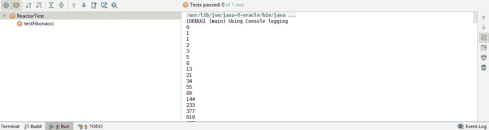

# 过滤数据

让我们从选择数据的简单操作符开始。数据过滤有不同类型的类比，如下所示：

+   根据给定条件选择或拒绝数据

+   选择或拒绝生成数据的一个子集

以下图显示了前面的信息：

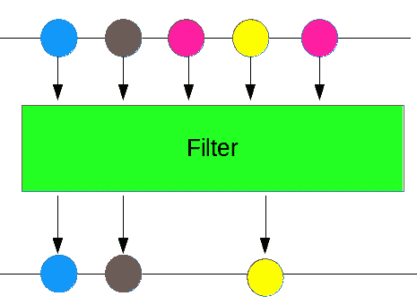

# filter() 操作符

`filter()`操作符允许根据传递的条件选择数据。API 接受一个布尔谓词，该谓词对每个发出的值进行评估，以确定是否被选中。过滤操作相当常见。假设我们想根据月份范围选择日期，或者根据员工 ID 选择员工数据。在这些情况下，传递给`filter`的布尔谓词包含选择逻辑。这可以非常灵活，并且可以适应不同的需求。

让我们将我们的斐波那契生成器扩展到只选择偶数，如下所示：

```java
fibonacciGenerator.filter(a -> a%2 == 0).subscribe(t -> {
    System.out.println(t);
});
```

在前面的代码中，谓词执行可除性检查。如果数字能被`2`整除，操作符将以同步方式执行谓词评估。如果条件得到满足，值将被传递给订阅者。

此外，还有一个`FilterWhen`，它是一种异步的布尔评估方式。它接受输入值并返回布尔发布者。这可以通过以下代码解释：

```java
fibonacciGenerator.filterWhen(a -> Mono.just(a < 10)).subscribe(t -> {
    System.out.println(t);
});

```

在前面的代码中，谓词执行小于检查。这是一个延迟评估，结果以`Mono<Boolean>`的形式返回。

# 取操作符

之前讨论的过滤方法使我们能够选择数据。如果我们想选择前 10 个元素，例如，我们可以使用`filter`操作符，其中包含一个计数器谓词。或者，还有一个`take`操作符用于此目的。该操作符接受一个数字并选择指定数量的元素，如下所示：

```java
fibonacciGenerator.take(10).subscribe(t -> {
    System.out.println(t);
});
```

前面的代码将选择前`10`个值来形成斐波那契生成器。

现在，假设我们只想选择最后 10 个元素。`takeLast`操作符就是为了这个目的而设计的。它也维护一个计数并从序列的末尾选择元素：

```java
fibonacciGenerator.takeLast(10).subscribe(t -> {
    System.out.println(t);
});
```

如果流确实是无界的，则不会有任何最后一个元素。该操作符仅在流正常关闭时才起作用。

如果我们只想选择最后一个值，我们可以使用`takeLast(1)`操作符。此操作符将返回一个只包含一个值的 Flux 流。或者，还有一个`last()`操作符，它返回一个包含最后一个发布元素的 Mono 发布者。`last`操作符的使用如下所示：

```java
fibonacciGenerator.last().subscribe(t -> {
    System.out.println(t);
});
```

# 跳过操作符

现在我们已经找到了选择数据的方法，让我们看看拒绝数据的方法。Reactor API 提供了多种拒绝数据的方法。有一个跳过操作符，有以下类型：

+   `Skip(count)`: 这将从流的开始处拒绝指定数量的元素。

+   `Skip(Duration)`: 这将从流的开始处拒绝指定持续时间的元素。

+   `SkipLast(count)`: 这将从流的末尾拒绝指定数量的元素。

+   `SkipUntil(Boolean Predicate)`: 这将拒绝元素，直到满足所述条件的第一种情况为真。

前面的命令在以下代码中显示：

```java
fibonacciGenerator.skip(10).subscribe(t -> {
    System.out.println(t);
});
fibonacciGenerator.skip(Duration.ofMillis(10)).subscribe(t -> {
    System.out.println(t);
});
fibonacciGenerator.skipUntil(t -> t > 100).subscribe(t -> {
    System.out.println(t);
});

```

上述代码示例有以下变体：

+   第一个订阅者拒绝前`10`个元素，并打印其余元素

+   第二个订阅者打印拒绝`10`毫秒内的元素之后的元素

+   第二个订阅者打印第一个数据元素超过`100`之后的元素

下面的屏幕截图显示了输出：

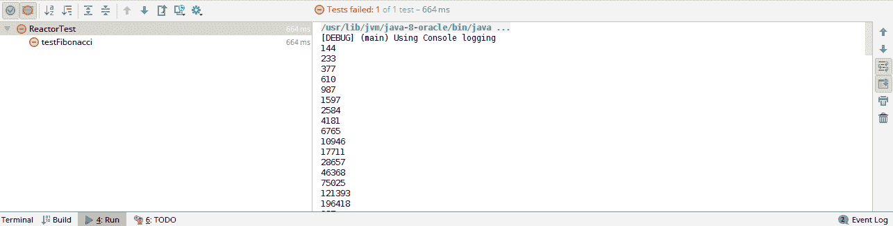

到目前为止，我们已经讨论了选择和拒绝数据的通用方法。然而，Flux 接口为特定场景下的数据过滤提供了以下特殊操作符：

+   `distinct`: 此操作符用于选择传递的数据流中的唯一元素

+   `distinctUntilChanged`: 此操作符用于选择第一个唯一元素集

+   `ignoreElements`: 此操作符用于完全忽略数据元素

+   `single`: 此操作符用于选择单个数据元素

+   `elementAt`: 此操作符选择流中指定索引处的元素

在上一节中，我们讨论了选择或拒绝数据的方法。Reactor 提供了许多用于此目的的操作符。通常，检查 API 并确定是否存在用于预期目的的操作符，而不是使用过滤和跳过方法自定义谓词，是一个好主意。

# 转换数据

通常需要将数据从一种格式转换为另一种格式。Reactor 提供了一套庞大的操作符来实现这一点。我们不仅可以转换数据，还可以修改数据元素的数量。

# `map()`操作符

从之前用于解释`skip()`操作符的斐波那契示例中，假设我们想要将前 10 个元素转换为罗马数字等价物。

罗马数字由七个字母表示：I、V、X、L、C、D 和 M。这些字母分别代表 1、5、10、50、100、500 和 1,000。这七个字母可以组合起来表示成千上万的数字。罗马数字方案使用字母作为计数标记。标记组合起来表示单位值。

我们有一个长数字，我们想要将其转换为罗马数字等价物；这就是`map()`操作符有价值的地方。它将转换应用于现有流中的每个值，如下所示：

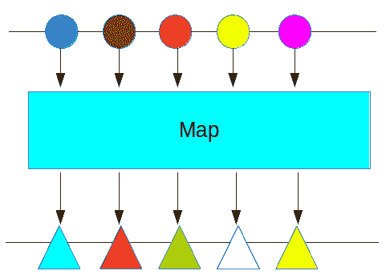

为了实现这种转换，我们需要一个`RomanNumberConvertor`。在下面的代码中，我们定义了从整数到其罗马数字等价物的转换：

```java
class RomanNumber {
    TreeMap<Integer, String> romanMap= new TreeMap<>();
    RomanNumber(){
        romanMap.put(1000, "M");
        romanMap.put(900, "CM");
        romanMap.put(500, "D");
        romanMap.put(400, "CD");
        romanMap.put(100, "C");
        romanMap.put(90, "XC");
        romanMap.put(50, "L");
        romanMap.put(40, "XL");
        romanMap.put(10, "X");
        romanMap.put(9, "IX");
        romanMap.put(5, "V");
        romanMap.put(4, "IV");
        romanMap.put(1, "I");
    }
    String toRomanNumeral(int number) {
        int l =  romanMap.floorKey(number);
        if ( number == l ) {
            return romanMap.get(number);
        }
        return romanMap.get(l) + toRomanNumeral(number-l);
    }
}
```

由于我们知道如何转换整数，我们将为我们的流处理器定义`Map`函数。该操作符将长`Value`作为输入，然后生成字符串形式的罗马数字等价物：

```java
RomanNumber numberConvertor= new RomanNumber();
fibonacciGenerator.skip(1).take(10).map(t-> numberConvertor.toRomanNumeral(t.intValue())).subscribe(t -> {
    System.out.println(t);
});
```

在前面的代码中做了几件事情，如下所示：

+   使用了`skip(1)`操作符。在上一个章节中，我们提到这将跳过序列的第一个元素。这是因为 0 没有罗马数字等价物。

+   使用了`take(10)`操作符。这将只从生成的序列中选择 10 个元素。这样做是为了将数字限制在 1,000 以下。

+   `map()`操作符定义了`longValue`到罗马等效字符串的转换。

+   所有的前面操作符都被链接在一起以生成一个单一的流。输出如下面的截图所示：


如前所述的输出所示，数值从数字到罗马数字的转换应用于流中流动的每个项目。

# `flatMap`操作符

前面的使用`map()`操作符的转换示例在有一对一值转换时是有效的，但它无法处理一对-*n*值转换。我们可以通过生成斐波那契数的因子流来展示这个前提。让我们首先回顾一下因式分解是什么。

在数论中，因式分解是将合数分解为较小数字的乘积。例如，对于 6，因数是 1、2、3 和 6。

让我们尝试将斐波那契数转换为它们对应的因子。序列中的每个数字都必须转换为所有可能的因子。首先，让我们构建一个简单的函数来计算因子：

```java
class Factorization {
    Collection<Integer> findfactor(int number) {
        ArrayList<Integer> factors= new ArrayList<>();
        for (int i = 1; i <= number; i++) {
            if (number % i == 0) {
                factors.add(i);
            }
        }
        return factors;
    }
}
```

在前面的代码中，我们使用了暴力方法，该方法将指定的数字除以所有小于或等于该数字的数字。如果数字可以整除，则除数将被添加到因数列表中。我们可以使用`map`操作符来实现这一点，如下面的代码所示：

```java
fibonacciGenerator.skip(1).take(10).map(t-> numberConvertor.findfactor(t.intValue())).subscribe(t -> {
    System.out.println(t);
});
```

生成的输出包括包含斐波那契数因子的单独集合：

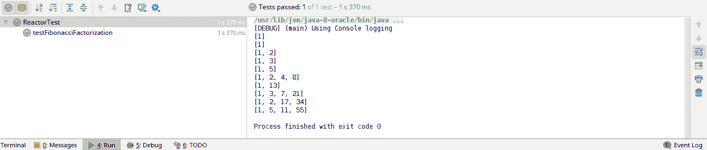

为了使生成的因子成为整数因子的流，我们必须使用`flatMap`操作符。这如下面的代码所示：

```java
Factorization numberConvertor= new Factorization();
fibonacciGenerator.skip(1).take(10).flatMap(t-> Flux.fromIterable(numberConvertor.findfactor(t.intValue()))).subscribe(t -> {
   System.out.println(t);
});
```

在前面的代码中，以下内容被处理：

+   `flatMap`接受一个整数并将其传递给因子生成器。它期望一个其他数据类型的发布者。

+   因子作为整数集合生成。

+   这些整数被转换为 Flux，使用`fromIterable`方法来匹配`FlatMap`方法的期望。

前面的代码生成了以下输出：

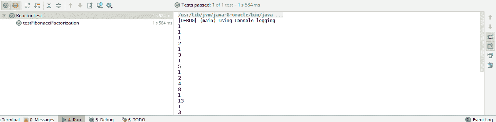

当使用`flatMap`时，了解我们正在生成哪种类型的 Flux 至关重要。将`Flux.fromIterable`简单地更改为`Flux.just`会改变前面代码的完整行为。

# 重放操作符

Reactor 提供了一个操作符来重放数据流。`repeat`操作符是为了这个目的而设计的。它在接收到完成事件时重放流。假设我们想要输出斐波那契数列两次。我们将使用`repeat()`操作符，将`2`作为`repeat()`操作符的参数：

```java
fibonacciGenerator.take(10).repeat(2).subscribe(t -> {
    System.out.println(t);
}); 
```

上述代码生成了两次流，如下所示输出。需要注意的是，`repeat()` 操作符在接收到完成事件后重复流：

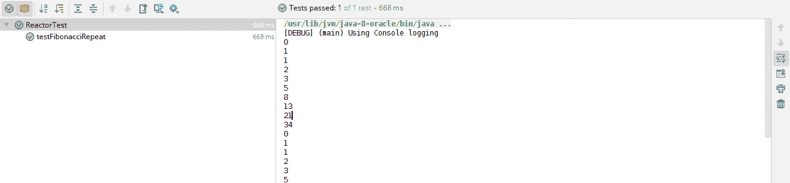

Reactor 还使得执行无限重复成为可能。`repeat()` 操作符在没有任何参数的情况下，无限次数地回放流：

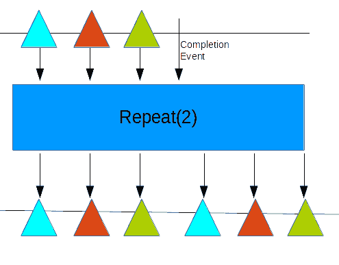

还有一个谓词变体，其中将布尔提供者传递给重复操作符。在完成时，提供者每次都会被评估，以确定流是否需要重复。

# `collect` 操作符

Reactor 还提供了使数据流作为集合累积的算子。其中最基本的是 `collectList()` 操作符。该操作符将数据累积为列表，如下所示图示：

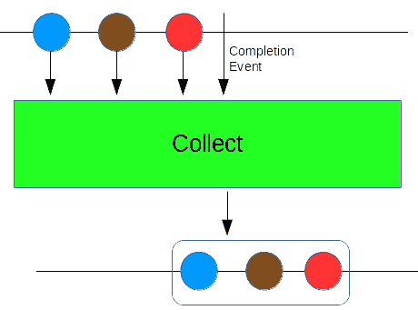

让我们以斐波那契为例，将数据收集到列表中。收集器方法提供了一个 Mono 发布者，它将发出一个包含所有已发布数据的单个列表：

```java
public void testFibonacciCollect() {
    Flux<Long> fibonacciGenerator = Flux.generate(
            () -> Tuples.<Long, Long>of(0L, 1L),
            (state, sink) -> {
                sink.next(state.getT1());
                return Tuples.of(state.getT2(), state.getT1() + state.getT2());
            });
      fibonacciGenerator.take(10).collectList().subscribe(t -> {
         System.out.println(t);
      });
}
```

上述代码执行以下操作：

+   `take` 操作符选择流中的前 10 个元素

+   然后将它们累积到列表中，返回一个 Mono 发布者

+   列表提供给订阅者，它将其打印到控制台

如下所示输出确认了该行为：

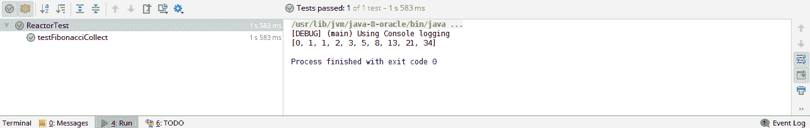

`collectList()` 操作符将数据聚合到列表中，但还有一个 `CollectSortList` 操作符，可以根据数据的自然顺序收集数据到排序列表中。我们还可以向 `CollectSortedList` 方法提供一个比较器来改变数据的顺序，如下所示代码：

```java
fibonacciGenerator.take(10).
collectSortedList((x,y)-> -1*Long.compare(x,y))
.subscribe(t -> {
   System.out.println(t);
});
```

上述代码执行以下操作：

+   `take` 操作符选择流中的前 10 个元素

+   然后使用传递的比较函数将它们累积到 `SortedList` 中，返回一个 Mono 发布者

+   比较函数比较两个长数据类型并反转评估

+   列表提供给订阅者，它将其打印到控制台

在这里，订阅者以数据的逆序接收列表：

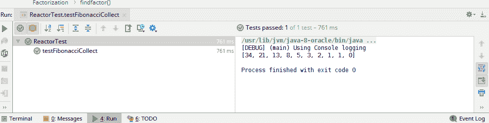

# `collectMap` 操作符

就像 `collectlist()` 一样，Reactor 还提供了 `collectMap()` 来将数据累积到 `java.util.Map` 中；`collectMap` 接受一个键生成函数来为生成的值元素创建键。如下所示代码：

```java
fibonacciGenerator.take(10)
.collectMap(t -> t%2==0 ? "even": "odd")
.subscribe(t -> {
   System.out.println(t);
});
```

上述代码生成一个包含两个键的 `Map`，键表示为 `even` 和 `odd`。它将保留地图中的最后一个偶数/奇数。如下所示：

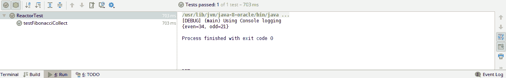

`collectMap` 命令不仅接受一个 `keyGenerator`，还提供了传递一个值生成器的选项。值生成器改变了数据流的原值。

此外，还有一个 `CollectMultiMap()` 方法，它将数据收集到一个键的映射中，并将列表作为值列出。它不会覆盖原始值，而是将具有相同键的值聚合到一个列表中。如果使用 `collectMultiMap` 运算符执行，前面的代码将产生以下输出：

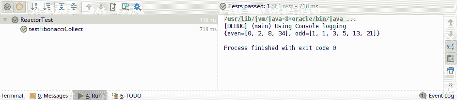

除了之前讨论的累加器之外，还有一个通用的 `Collect` 运算符，它使得将数据累积到任何格式成为可能。此运算符将 Flux 发布者转换回 Mono 发布者，并发出一个累积的单个值。

# reduce 运算符

前一节介绍了值累积，而 reduce 操作则围绕值合并。reduce 方法使得将完整的数据流聚合为单个值成为可能。如下所示：

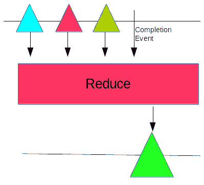

假设我们想要生成斐波那契数的总和，如下所示：

```java
fibonacciGenerator.take(10).reduce((x,y) -> x+y).subscribe(t -> {
    System.out.println(t);
});
```

在前面的代码中，我们做了以下事情：

+   `take` 运算符选择了流中的前 10 个元素。

+   `reduce` 运算符接受一个长类型的 Bifunction。lambda 表达式返回长值的总和以生成回总和。

+   `subscribe` 操作接收一个 `Mono<Long>`，并在控制台上打印。如下所示：

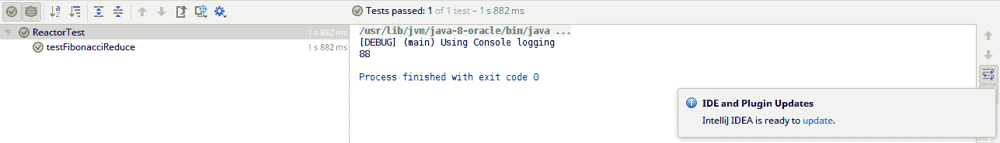

此外，还有一个重载的 `reduce` 方法，它可以将一个初始值作为聚合的起始点。

有一个特殊的 `count` 运算符，负责返回流的大小。

# 条件测试

到目前为止，我们讨论了在原始数据上工作的运算符。Reactor 框架提供了布尔运算符，可以测试流中的每个数据元素。有两种类型的运算符，如下所示：

+   `all`：此运算符接受一个谓词，并确认所有元素是否满足指定的标准。这是所有数据元素的逻辑 `AND` 运算符。

+   `any`：此运算符接受一个谓词，并确认是否有任何单个元素满足指定的标准。这是所有数据元素的逻辑 `OR`。

前面方法的输出被合并为一个单个布尔结果，如下所示：

```java
fibonacciGenerator.take(10).all(x -> x > 0).subscribe(t -> {
    System.out.println(t);
});
```

在前面的代码中，我们做了以下事情：

+   `take` 运算符选择了流中的前 `10` 个元素。

+   `all` 运算符接受一个布尔谓词以确认所有元素都大于 `0`。

+   `subscribe` 操作接收一个 `Mono<Boolean>`，并在控制台上打印。

输出如下：

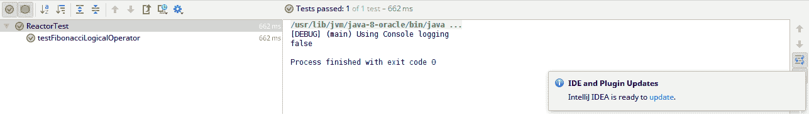

# 添加数据

到目前为止，我们一直在处理来自单个 Flux 流的生成数据。流处理不仅限于一个发布者。Reactor 提供了操作符，使得将不同的发布者合并成一个单一的数据流成为可能。值可以添加到指定的发布值之前或之后。

# concatWith 操作符

`concatWith`操作符使得在发布值之后附加一个值事件成为可能。它接受一个发布者作为输入，并在第一个发布者完成后，即`10`个元素之后，附加发布值，如下面的图所示：

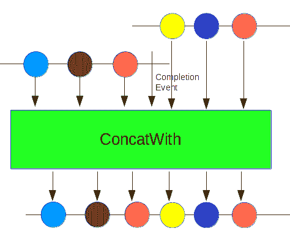

假设我们想在 Fibonacci 流末尾附加一些负值：

```java
fibonacciGenerator.take(10)
 .concatWith(Flux.just( new Long[]{-1L,-2L,-3L,-4L}))
 .subscribe(t -> {
    System.out.println(t);
});

```

在前面的代码中，我们做了以下几件事：

+   `take`操作符选择了流的前`10`个元素。

+   `concatWith`操作符接受一个发布者。它在原始流完成后附加其值，即`10`个元素之后。

+   `subscribe`操作接收了一个`Flux<Long>`，它在控制台上打印出来。

与`concatWith`类似，还有一个`startWith`操作符，可以用于在原始流值之前添加值。

# 摘要

在本章中，我们讨论了在 Reactor 中可用的各种操作符。我们首先查看用于选择和拒绝数据的简单操作符。然后，我们查看将数据转换为其他类型的操作符。转换后的数据元素不需要一对一映射。对于每个处理值，可以有多个元素。接下来，我们查看累积数据的操作符。到本章结束时，我们已经涵盖了数据的聚合和条件测试。简而言之，我们已经涵盖了 Reactor 中可用的所有操作符范围。在下一章中，我们将探讨处理器，它们提供了绑定 Reactor 组件所需的粘合剂。

# 问题

1.  用于从流中选择数据元素的操作符是什么？

1.  用于从流中拒绝数据元素的操作符是什么？

1.  Reactor 提供了哪些数据转换操作符？这些操作符彼此之间有何不同？

1.  我们如何使用 Reactor 操作符执行数据聚合？

1.  Reactor 提供了哪些条件操作符？
