# 第四章：处理器

到目前为止，在这本书中，我们一直在介绍响应式流的构建块。发布者、订阅者和操作员代表数据操作组件。另一方面，处理器代表将这些组件组合成单个数据流所需的管道。在本章中，我们将详细讨论处理器的类型和需求。

本章将涵盖以下主题：

+   处理器简介

+   理解处理器类型

+   热发布者与冷发布者

# 技术要求

+   Java 标准版，JDK 8 或更高版本

+   IntelliJ IDEA IDE，2018.1 或更高版本

本章的 GitHub 链接为[`github.com/PacktPublishing/Hands-On-Reactive-Programming-with-Reactor/tree/master/Chapter04`](https://github.com/PacktPublishing/Hands-On-Reactive-Programming-with-Reactor/tree/master/Chapter04)。

# 处理器简介

处理器代表数据处理的状态。因此，它既被表示为发布者，也被表示为订阅者。由于它是一个发布者，我们可以创建一个处理器并对其`Subscribe`。大多数发布者的功能都可以通过处理器执行；它可以注入自定义数据，以及生成错误和完成事件。我们还可以与它接口的所有操作符。

考虑以下代码：

```java
DirectProcessor<Long> data = DirectProcessor.create();
data.take(2).subscribe(t -> System.out.println(t));
data.onNext(10L);
data.onNext(11L);
data.onNext(12L);
```

在前面的代码中，我们做了以下几件事：

1.  我们添加了一个`DirectProcessor`实例

1.  在第二行，我们添加了`take`操作符，以选择两个元素

1.  我们还在控制台上订阅并打印了数据

1.  在最后三行中，我们发布了三个数据元素

让我们看看输出结果，如下面的屏幕截图所示：

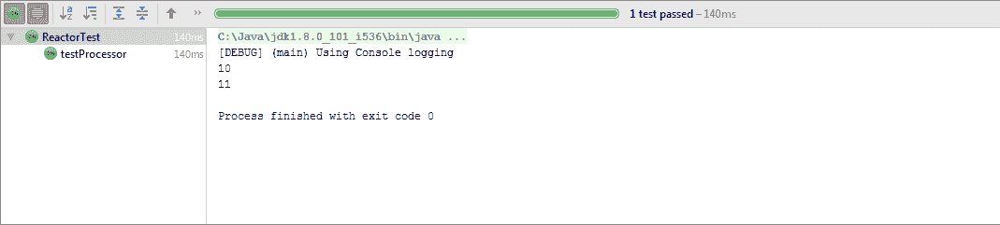

在这里，看起来我们可以用处理器替换发布者。但如果是这种情况，为什么响应式流规范要求为同一功能提供两个接口？嗯，发布者和处理器实际上并不相同。处理器是具有有限能力的特殊类发布者。它们代表数据处理的一个阶段。当我们讨论不同类型的可用处理器时，我们将熟悉这些限制。

作为一般规则，我们应该尽量避免直接使用处理器。相反，我们应该尝试寻找以下替代方案：

+   首先，确定一个可以提供所需功能的现有操作符。操作符应该是执行数据操作的首选。

+   如果没有可用的操作符，我们应该尝试适配`Flux.generate` API 并生成一个自定义的数据流。

# 理解处理器类型

Reactor 中提供了不同类型的处理器。这些处理器在各种特性上有所不同，例如背压能力、它们可以处理的客户端数量、同步调用等。让我们看看 Reactor 中可用的处理器类型。

# DirectProcessor 类型

`DirectProcessor` 是处理器中最简单的一种。此处理器将处理器连接到订阅者，然后直接调用 `Subscriber.onNext` 方法。处理器不提供任何背压处理。

可以通过调用 `create()` 方法创建一个 `DirectProcessor` 实例。任何数量的订阅者都可以订阅处理器。必须注意，一旦处理器发布了完整的事件，它将拒绝后续的数据事件。

考虑以下代码：

```java
DirectProcessor<Long> data = DirectProcessor.create();
data.subscribe(t -> System.out.println(t),
        e -> e.printStackTrace(),
        () -> System.out.println("Finished 1"));
data.onNext(10L);
data.onComplete();
data.subscribe(t -> System.out.println(t),
        e -> e.printStackTrace(),
        () -> System.out.println("Finished 2"));
data.onNext(12L);

```

上述代码执行以下操作：

1.  创建了一个 `Directprocessor` 实例

1.  添加一个订阅者，该订阅者可以将所有事件（数据/错误/完成）打印到控制台

1.  发布一个数据事件，随后是一个完成事件

1.  添加了另一个订阅者，该订阅者可以将所有事件（数据/错误/完成）打印到控制台

1.  发布一个数据事件。

当我们查看以下输出截图时，我们可以看到所有订阅者都收到了完成事件。值为 `12` 的数据事件随后被丢弃：

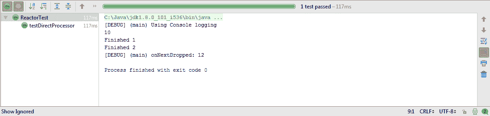

在处理背压方面，`DirectProcessor` 有另一个重要的限制。我们之前提到，它根本不具备背压能力。这意味着如果我们推送的事件超过了订阅者请求的数量，会导致 `Overflow` 异常。

让我们看看以下代码：

```java
DirectProcessor<Long> data = DirectProcessor.create();
data.subscribe(t -> System.out.println(t),
        e -> e.printStackTrace(),
        () -> System.out.println("Finished"),
        s -> s.request(1));
data.onNext(10L);
data.onNext(11L);
data.onNext(12L);
```

上述代码执行以下操作：

1.  创建了一个 `Directprocessor` 实例

1.  添加了一个订阅者，该订阅者可以将所有事件（数据/错误/完成）打印到控制台

1.  订阅者还监听了订阅事件，并提出了 `1` 个数据事件的请求

1.  最后，发布了几个数据事件

上述代码失败，显示以下错误：

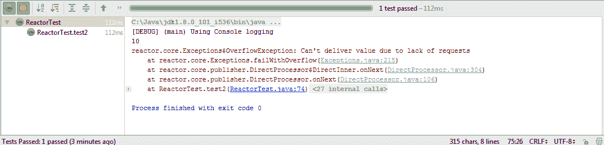

# `UnicastProcessor` 类型

`UnicastProcessor` 类型与 `DirectProcessor` 类似，在调用 `Subscriber.onNext` 方法方面。它直接调用订阅者方法。然而，与 `DirectProcessor` 不同，`UnicastProcessor` 具备背压能力。内部，它创建一个队列来存储未交付的事件。我们还可以提供一个可选的外部队列来缓冲事件。当缓冲区满时，处理器开始拒绝元素。处理器还使得对每个被拒绝的元素执行清理成为可能。

`UnicastProcessor` 提供了 `create` 方法来构建处理器的一个实例。让我们看看以下代码，看看它是如何使用的：

```java
UnicastProcessor<Long> data = UnicastProcessor.create();
data.subscribe(t -> {
    System.out.println(t);
});
data.sink().next(10L);
```

上述代码执行了以下操作：

1.  创建了一个 `UnicastProcessor` 实例

1.  添加了一个订阅者，该订阅者可以将数据事件打印到控制台

1.  创建了一个 `sink` 来推送几个元素

虽然 `UnicastProcessor` 提供了背压能力，但一个主要的限制是只能与单个订阅者一起工作。如果我们向上述代码添加另一个订阅者，它将失败并显示以下错误：

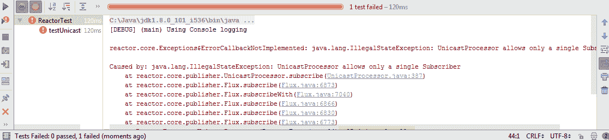

每个处理器都提供了一个`Sink`方法。`Sink`是向订阅者发布事件的推荐方式。它提供了发布下一个、错误和完成事件的机制。`Sink`提供了一种线程安全的方式来处理这些事件，而不是直接通过调用`Subscriber.OnNext`方法来发布它们。

# `EmitterProcessor`类型

`EmitterProcessor`是一个可以与多个订阅者一起使用的处理器。多个订阅者可以根据它们各自的消费速率请求下一个值事件。处理器为每个订阅者提供必要的背压支持。这在上面的图中表示：

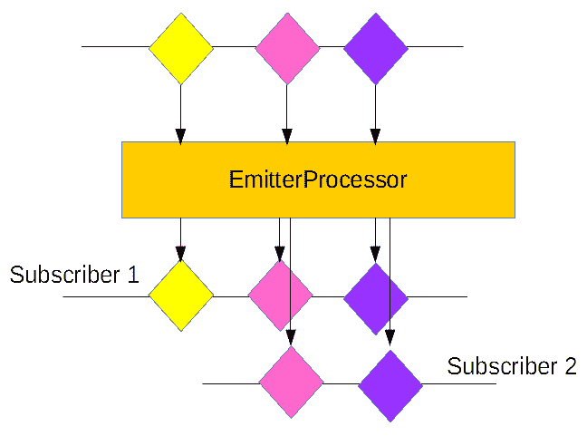

处理器还可以从外部发布者发布事件。它从注入的发布者那里消费一个事件，并将其同步传递给订阅者。

让我们看看以下代码：

```java
EmitterProcessor<Long> data = EmitterProcessor.create(1);
data.subscribe(t -> System.out.println(t));
FluxSink<Long> sink = data.sink();
sink.next(10L);
sink.next(11L);
sink.next(12L);
data.subscribe(t -> System.out.println(t));
sink.next(13L);
sink.next(14L);
sink.next(15L);
```

上述代码执行了以下操作：

1.  创建了一个`EmitterProcessor`的实例

1.  添加了一个订阅者，可以将数据事件打印到控制台

1.  创建了一个`sink`来推送一些元素

1.  添加了另一个订阅者，可以将数据事件打印到控制台

1.  通过使用 Sink API 推送了更多的事件

上述代码生成了以下输出：

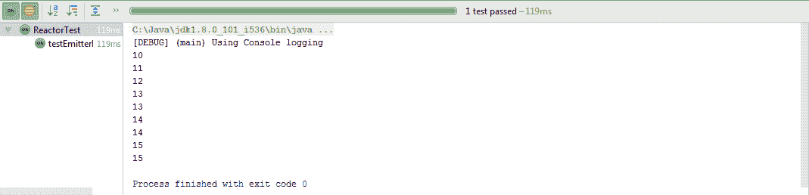

上述代码还清楚地说明了以下内容：

+   两个订阅者都将项目打印到控制台。

+   处理器在订阅后将其事件传递给订阅者。这与 Flux 不同，Flux 无论何时订阅都会将所有项目传递给所有订阅者。

# `ReplayProcessor`类型

`ReplayProcessor`是一个专用处理器，能够缓存并回放事件给其订阅者。处理器还具有从外部发布者发布事件的能力。它从注入的发布者那里消费一个事件，并将其同步传递给订阅者。

`ReplayProcessor`可以缓存以下场景的事件：

+   所有事件

+   有限的事件计数

+   由指定的时间段限制的事件

+   由计数和指定的时间段限制的事件

+   仅最后的事件

一旦缓存，所有事件在添加订阅者时都会回放：

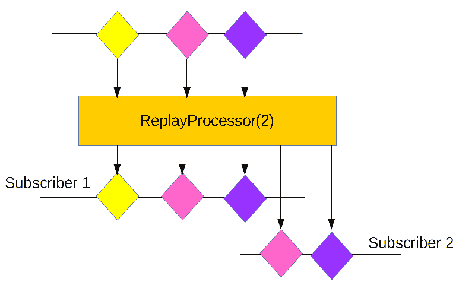

让我们看看以下代码：

```java
ReplayProcessor<Long> data = ReplayProcessor.create(3);
data.subscribe(t -> System.out.println(t));
FluxSink<Long> sink = data.sink();
sink.next(10L);
sink.next(11L);
sink.next(12L);
sink.next(13L);
sink.next(14L);
data.subscribe(t -> System.out.println(t));
```

上述代码执行了以下操作：

1.  创建了一个具有三个事件缓存的`ReplayProcessor`实例

1.  添加了一个订阅者，可以将数据事件打印到控制台

1.  创建了一个`sink`来推送一些元素

1.  添加了另一个订阅者，可以将数据事件打印到控制台

上述代码生成了以下输出：

+   处理器缓存了最后三个事件，即`12`、`13`和`14`

+   当第二个订阅者连接时，它会在控制台上打印缓存的事件

输出的截图如下：

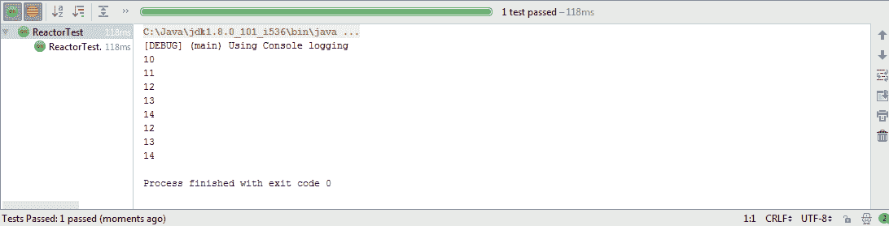

# `TopicProcessor`类型

`TopicProcessor`是一个能够使用事件循环架构与多个订阅者一起工作的处理器。处理器以异步方式将发布者的事件发送到附加的订阅者，并通过使用`RingBuffer`数据结构为每个订阅者提供背压。处理器还能够监听来自多个发布者的事件。这在上面的图中有所说明：

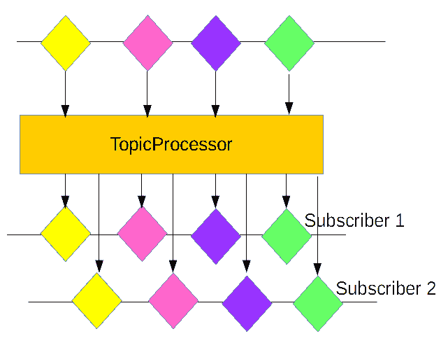

与按顺序发送事件的处理器不同，`TopicProcessor`能够以并发方式向订阅者发送事件。这由处理器中创建的线程数控制。

让我们看看以下代码：

```java
TopicProcessor<Long> data = TopicProcessor.<Long>builder()
        .executor(Executors.newFixedThreadPool(2)).build();
data.subscribe(t -> System.out.println(t));
data.subscribe(t -> System.out.println(t));
FluxSink<Long> sink= data.sink();
sink.next(10L);
sink.next(11L);
sink.next(12L);
```

上述代码执行了以下操作：

1.  使用提供的构建器创建了一个`TopicProcessor`实例。

1.  提供了一个大小为`2`的`ThreadPool`，以便将其连接到两个订阅者

1.  添加了两个订阅者实例，它们可以将数据事件打印到控制台

1.  创建了一个`sink`来推送几个元素。

上述代码生成了以下输出，处理器并发地向两个订阅者发送事件：

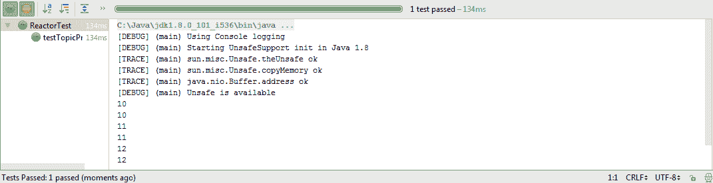

# `WorkQueueProcessor`类型

`WorkQueueProcessor`类型与`TopicProcessor`类似，因为它可以连接到多个订阅者。然而，它不会将所有事件都发送给每个订阅者。每个订阅者的需求被添加到一个队列中，发布者的事件被发送给任何一个订阅者。这种模式更像是 JMS 队列上的监听器；每个监听器在完成时消费一条消息。处理器以轮询的方式将消息发送给每个订阅者。处理器还能够监听来自多个发布者的事件。这在上面的图中有所展示：

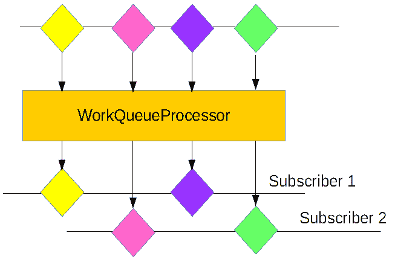

在资源需求方面，处理器表现得更好，因为它不会为它的订阅者构建线程池。

让我们看看以下代码：

```java
WorkQueueProcessor<Long> data = WorkQueueProcessor.<Long>builder().build();
data.subscribe(t -> System.out.println("1\. "+t));
data.subscribe(t -> System.out.println("2\. "+t));
FluxSink<Long> sink= data.sink();
sink.next(10L);
sink.next(11L);
sink.next(12L);
```

上述代码执行了以下操作：

1.  使用提供的构建器创建了一个`WorkQueueProcessor`实例。

1.  添加了两个订阅者实例，它们可以将数据事件打印到控制台。每个订阅者也会打印其 ID。

1.  创建了一个`sink`来推送几个元素。

上述代码生成了以下输出。处理器向第一个订阅者发送了一些事件，其余的事件发送给了第二个订阅者：

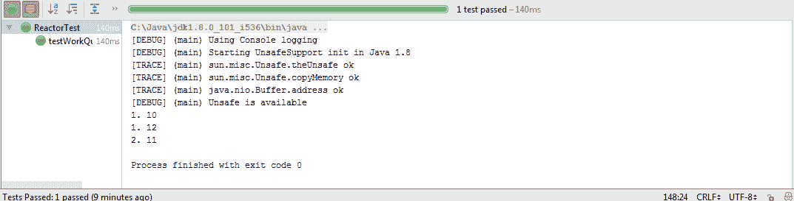

# 热发布者与冷发布者

在前面的章节中，我们构建了发布者，它们在订阅后会将数据发布到每个订阅实例。我们在第二章，“Reactors 中的发布者和订阅者 API”中创建的斐波那契发布者会将完整的斐波那契数列发布给每个订阅者。

将以下斐波那契代码视为冷发布者：

```java
Flux<Long> fibonacciGenerator = Flux.generate(
        () -> Tuples.<Long, Long>of(0L, 1L),
        (state, sink) -> {
            sink.next(state.getT1());
            return Tuples.of(state.getT2(), state.getT1() + state.getT2());
        });

fibonacciGenerator.take(5).subscribe(t -> System.out.println("1\. "+t));
fibonacciGenerator.take(5).subscribe(t -> System.out.println("2\. "+t));
```

在订阅后开始向订阅者发布数据的发布者被称为**冷发布者**。重要的是要理解数据应在订阅后生成。如果没有订阅者，则发布者不会生成任何数据。

让我们看看前面提到的冷发布者的输出。在这里，两个订阅者都打印了完整的斐波那契数列集合：

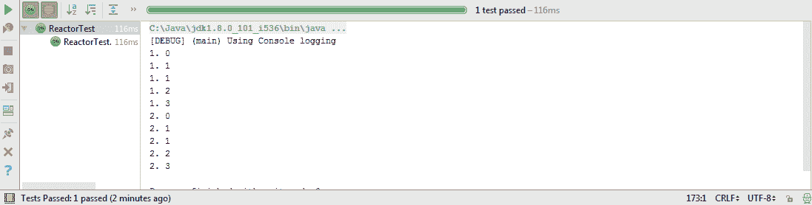

在本章中，我们使用了作为发布者的处理器，这些处理器不依赖于订阅者。这些发布者持续发射数据，并且当新的订阅者到达时，它只会接收新发射的数据。这与冷发布者的行为不同，冷发布者也会为每个新的订阅者发布旧数据。这些发布者被称为**热发布者**。

在以下代码中，我们将斐波那契发布者转换为热发布者：

```java
final UnicastProcessor<Long> hotSource = UnicastProcessor.create();
final Flux<Long> hotFlux = hotSource.publish().autoConnect();
hotFlux.take(5).subscribe(t -> System.out.println("1\. " + t));
CountDownLatch latch = new CountDownLatch(2);
new Thread(() -> {
    int c1 = 0, c2 = 1;
    while (c1 < 1000) {
        hotSource.onNext(Long.valueOf(c1));
        int sum = c1 + c2;
        c1 = c2;
        c2 = sum;
        if(c1 == 144) {
            hotFlux.subscribe(t -> System.out.println("2\. " + t));
        }
    }
    hotSource.onComplete();
    latch.countDown();
}).start();
latch.await();
```

以下代码说明了以下内容：

1.  我们构建了一个`UnicastProcessor`，并通过使用`publish`方法将其转换为`Flux`

1.  然后我们向它添加了一个订阅者

1.  接下来，我们创建了一个`Thread`，并使用之前创建的`UnicastProcessor`实例来生成斐波那契数列

1.  当数列值为`144`时，添加了另一个订阅者

让我们看看热发布者的输出：

+   第一个订阅者打印初始值。

+   第二个订阅者打印大于`143`的值。这在下图中显示：

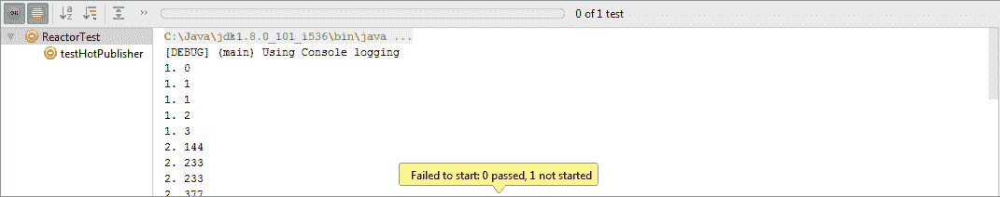

# 摘要

在本章中，我们探讨了 Reactor 中可用的各种处理器。你了解到`DirectProcessor`是最简单的处理器，但它不提供背压。然后我们讨论了`UnicastProcessor`、`EmitterProcessor`、`ReplayProcessor`、`TopicProcessor`和`WorkQueueProcessor`的功能和能力。最后，我们熟悉了热发布者和冷发布者，最终使用`UnicastProcessor`将斐波那契生成器转换为热发布者。

# 问题

1.  `DirectProcessor`的限制是什么？

1.  `UnicastProcessor`的限制是什么？

1.  `EmitterProcessor`的功能有哪些？

1.  `ReplayProcessor`的功能有哪些？

1.  `TopicProcessor`的功能有哪些？

1.  `WorkQueueProcessor`的功能有哪些？

1.  热发布者和冷发布者之间的区别是什么？
