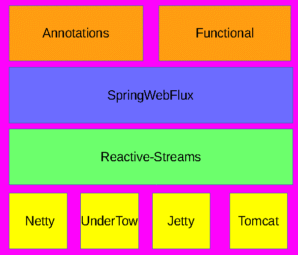
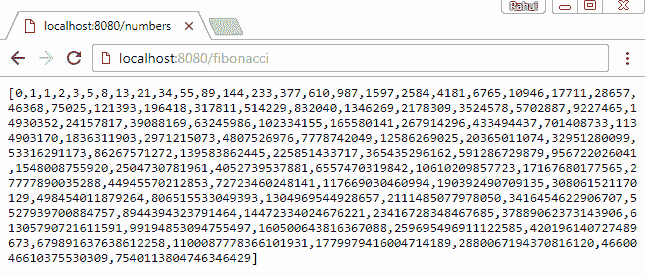
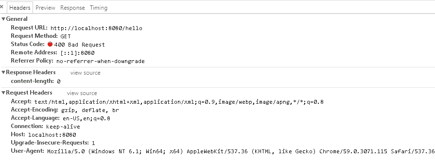
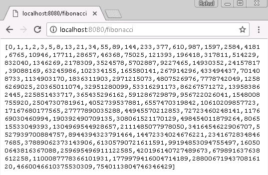

# SpringWebFlux for Microservices

到目前为止，我们已经讨论了 Reactor 作为独立框架。我们还看到了如何构建发布者并订阅它们。Reactor 非常适合处理大量数据的交换，但需要注意的是，Reactor 不仅限于独立编程；它还可以用于构建 Web 应用程序。

传统上，我们使用 SpringMVC 框架构建企业级 Web 应用程序，SpringMVC 是 Spring 生态系统中的一个同步和阻塞框架。SpringMVC 还可以使用 Servlet 3.1 提供异步非阻塞数据，但那时它就远离了请求映射器和过滤器的概念。这使得框架相当难以使用。此外，在构建高性能的微服务架构时，该框架可能不是最佳选择。在这种架构中，我们希望拥有独立、可扩展和有弹性的服务。SpringMVC 并没有定义这些特性中的任何一项。如 第一章 所述，“开始使用反应式流”，之前讨论的非功能性需求是反应式宣言的特性。

注意到这个差距，Spring 社区提出了 SpringWebFlux 框架。此框架基于 Reactor，并能够创建基于 Web 的微服务。SpringWebFlux 不仅是非阻塞的，它还是一个函数式框架，允许我们使用 Java 8 lambda 函数作为 Web 端点。该框架为非阻塞 Web 栈提供了一套完整的解决方案。

# 技术要求

+   Java 标准版，JDK 8 或更高版本

+   IntelliJ IDEA IDE 2018.1 或更高版本

本章的 GitHub 链接为 [`github.com/PacktPublishing/Hands-On-Reactive-Programming-with-Reactor/tree/master/Chapter05`](https://github.com/PacktPublishing/Hands-On-Reactive-Programming-with-Reactor/tree/master/Chapter05)。

# SpringWebFlux 简介

为了使我们能够构建基于 Web 的服务，SpringWebFlux 提供以下编程模型：

+   **注解**：注解最初是 SpringMVC 栈的一部分。这些注解也由 SpringWebFlux 框架支持。这是开始使用 SpringWebFlux 栈的最简单方法。

+   **功能端点**：此模型允许我们构建 Java 8 函数作为 Web 端点。应用程序可以配置为一系列路由、处理器和过滤器。然后它允许将这些全部作为 lambda 函数传递，以便在函数式范式下构建应用程序。

为了使用 SpringWebFlux，我们需要配置一个底层服务器。在编写本书时，Netty、Tomcat、Jetty 和 Undertow 是这里提供的当前选择。Netty 通常被用作标准选择，因为它在异步、非阻塞应用程序中表现良好。它也是一个非 servlet 服务器，与 Tomcat 和 Jetty 不同。以下图表展示了这一点：



# 配置注解

SpringWebFlux 支持基于注解的控制器。这与 SpringMVC 保持一致。用于创建控制器有两个注解：

+   `@Controller`: 这个注解定义了一个通用的网络组件。给定一个请求，它创建一个模型对象并为它生成动态视图响应。

+   `@RestController`: 这个注解定义了一个 RESTful 网络服务。给定一个请求，它返回 JSON 或 XML 格式的响应。这与能够为请求生成动态网页的通用控制器不同。

每个控制器都服务于一个请求模式。以下是可以用来定义控制器所服务请求模式的注解：

+   `@RequestMapping`: 这个注解用于标记控制器。它定义了一个请求模式前缀。它还可以用来定义请求头、媒体类型、HTTP 方法等。

+   `@GetMapping`: 这个注解特定于 `GET` HTTP 方法。它可以用来定义一个 `GET` HTTP 请求 URL。

+   `@PostMapping`: 这个注解特定于 `POST` HTTP 方法。它可以用来定义一个 `POST` HTTP 请求 URL。

+   `@PutMapping`: 这个注解特定于 `PUT` HTTP 方法。它可以用来定义一个 `PUT` HTTP 请求 URL。

+   `@DeleteMapping`: 这个注解特定于 `DELETE` HTTP 方法。它可以用来定义一个 `DELETE` HTTP 请求 URL。

+   `@PatchMapping`: 这个注解特定于 `PATCH` HTTP 方法。它可以用来定义一个 `PATCH` HTTP 请求 URL。

重要的一点是，`@RequestMapping` 匹配所有 HTTP 请求方法，与其它特定方法注解不同。

# SpringBoot Starter

现在，让我们尝试使用之前讨论的注解支持来定义一个 RESTful 斐波那契网络服务。为此，我们将使用 Spring Boot，因为它提供了一种快速创建企业级 Spring 应用程序的方法。Spring Boot 项目为所有 Spring 模块提供了启动依赖项。每个启动器都假设了默认约定，以确保项目无需麻烦即可启动运行。

为了使用 SpringWebFlux，我们需要将 `spring-boot-starter-webflux` 依赖项添加到我们的项目中。让我们回顾一下 `build.gradle` 文件，如下所示：

```java
buildscript {
    repositories {
        maven { url 'https://repo.spring.io/libs-snapshot' }
    }

    dependencies {
        classpath 'org.springframework.boot:spring-boot-gradle-plugin:2.0.3.RELEASE'
        compile 'org.springframework.boot:spring-boot-starter-webflux'

    }
}

apply plugin: 'org.springframework.boot'
apply plugin: 'java'
apply plugin: 'io.spring.dependency-management'
```

在前面的 `build.gradle` 文件中，我们有以下更改：

1.  我们已经将 `spring-boot` 插件添加到我们的 `gradle` 构建中。

1.  我们已经将 `spring-boot-dependency` 插件添加到我们的 `gradle` 构建中。该插件为我们的 `gradle` 构建添加了类似 Maven 的依赖项管理功能。

1.  `spring-boot-starter-webflux` 已作为依赖项添加。此项目引入了其他 `webflux` 相关项目的传递依赖项，例如 `webflux`、`netty-core` 等。

1.  在插件配置下已经添加了 `spring-boot-gradle` 插件。这使我们能够使用 `gradlew bootrun` 命令从命令行运行 Spring 应用程序。

默认情况下，`Spring-boot-start-webflux`会引入 Netty 依赖项。如果我们决定使用 Tomcat 或其他服务器，我们将排除`spring-boot-starter-reactor-netty`并包含该服务器依赖项。

# 添加控制器

我们需要添加一个可以提供斐波那契数的控制器。如前所述，我们需要添加一个带有`@RestController`注解的类。让我们看看以下控制器：

```java
@RestController
public class ReactiveController {

 @GetMapping("/fibonacci")
 @ResponseBody
 public Publisher<Long>fibonacciSeries() {
 Flux<Long> fibonacciGenerator = Flux.generate(() -> Tuples.<Long,
   Long>of(0L, 1L), (state, sink) -> {
   if (state.getT1() < 0)
   sink.complete();
   else
   sink.next(state.getT1());
   return Tuples.of(state.getT2(), state.getT1() + state.getT2());
 });
 return fibonacciGenerator;
 }

}
```

在前面的类中，我们做了以下操作：

1.  将`@RestController`添加到`ReactiveController`类中。这使该类成为 RESTful Web 服务：

```java
public class ReactiveController
```

1.  将`@GetMapping`添加到`fibonacciSeries`方法中。这允许我们在接收到对`/fibonacci` URL 的 HTTP `GET`请求时调用该方法。

1.  这里需要注意的是，`fibonacciSeries`方法返回一个`Flux<Long>`。

现在，我们还需要添加一个`Main`类，它可以运行`SpringApplication`。`Main`类必须注解为`@EnableWebFlux`，以确保 Spring 上下文实例化和注册与 SpringWebFlux 相关的类。这可以通过以下代码表示：

```java
@SpringBootApplication
@Configuration
@ComponentScan("com.sample.web")
@EnableWebFlux
public class ReactorMain {
 public static void main(String[] args){
  SpringApplication.run(ReactorMain.class, args);
 }
}
```

使用`gradlew bootrun`命令运行应用程序。这将启动端口`8080`上的 Netty 服务器。最后，查找`http://localhost:8080/fibonacci`以接收以下结果：



# 方法参数

在前面的代码中，`fibonacciSeries`请求方法不接受任何参数。这是因为我们没有期望任何输入。如果我们预见任何输入参数，它们可以用以下注解进行绑定：

+   `@PathVariable`：此注解用于访问 URI 模板变量的值。这些模板将自动转换为适当类型。如果没有找到匹配的类型，将引发`TypeMismatchException`：

```java
@GetMapping("/contact/{deptId}/employee/{empId}")
public Employee findEmployee(@PathVariable Long deptId, @PathVariable Long empId) {
// Find the employee.
}
```

+   `@RequestParam`：此注解用于确定作为查询参数传递的值。这里也执行了数据类型的自动转换：

```java
@GetMapping("/contact/employee")
public Employee findEmployee(@RequstParam("deptId")Long deptId, @RequstParam("empId") Long empId) {
// Find the employee.
}
```

+   `@RequestHeader`：此注解用于确定请求头中传递的值。数据类型转换到目标类型是自动执行的：

```java
@GetMapping("/fibonacci")
public List<Long> fibonacci(@RequestHeader("Accept-Encoding") String encoding) {
// Determine Series
}
```

+   `@RequestBody`：此注解用于确定请求体中传递的值。数据类型转换到目标类型是自动执行的。SpringWebFlux 支持以反应式类型 Flux 和 Mono 读取数据，因此执行非阻塞读取：

```java
@PostMapping("/department")
public void createDept(@RequestBody Mono<Department> dept) {
// Add new department
}
```

+   `@CookieValue`：此注解用于确定请求中作为一部分的 HTTP cookie 值。数据类型转换到目标类型是自动执行的。

+   `@ModelAttribute`：此注解用于确定请求模型中的属性或在没有提供的情况下实例化一个。一旦创建，属性的属性值将使用传递的查询参数和提交的表单字段进行初始化：

```java
@PostMapping("/department")
public void createdept(@ModelAttribute Department dept) {
// Add new department
}
```

+   `@SessionAttribute`：此注解用于确定预存在的会话属性。数据类型转换到目标类型是自动执行的。

+   `@RequestAttribute`: 这个注解用于确定由先前过滤器执行创建的现有请求属性。数据类型自动转换为目标类型。

除了方法参数外，还有`@ResponseBody`，它用于使用适当的 HTTP 写入器序列化`return`方法。这可以用于从请求方法返回 JSON 和 XML 类型的响应。

# 异常处理

应用程序在处理请求时经常会抛出异常。这些异常必须得到适当的处理，否则它们将向请求客户端发送 HTTP 500 错误。SpringWebFlux 通过创建带有`@ExceptionHandler`注解的方法来支持异常处理。这些异常处理器可以将抛出的异常作为参数：

```java
@RestController
public class ReactiveController {
 @ExceptionHandler
 public String handleError(RuntimeException ex) {
 // ...
 }
}
```

异常处理器可以具有与请求方法相同的返回类型。可选地，我们希望在异常处理过程中设置 HTTP 状态，但 Spring 不会自动执行此操作。可以通过返回一个包含响应体以及所需的 HTTP 状态码的`ResponseEntity`来实现。

# 配置函数

在上一节中，我们使用传统的注解方法配置了 SpringWebFlux。现在，我们将看到如何使用 Java 8 lambda 以函数式方式配置 SpringWebFlux。让我们看看启动所需的关键组件。

# 处理函数

处理函数负责服务给定的请求。它以`ServerRequest`类的形式接收请求，并生成`ServerResponse`响应。`ServerRequest`和`ServerResponse`都是不可变的 Java 8 类。这些类支持用于读取/写入请求/响应体中传递的数据的反应式类型`Mono`和`Flux`。让我们尝试使用前面的组件构建我们的第一个`hello-world`示例：

```java
HandlerFunction<ServerResponse> helloHandler = request -> {
            Optional<String>name=request.queryParam("name");
            return ServerResponse.ok().body(fromObject("Hello to " +name.orElse("the world.")));
        };
```

在前面的代码中，我们正在执行以下操作：

+   Lambda 函数接受`ServerRequest`输入请求类型

+   它试图确定是否传递了`name`查询参数

+   函数返回 OK（HTTP 200）响应

+   响应体包含`Hello to the world`

这只是一个简单的示例，但它清楚地展示了使用 Java 8 lambda 可以实现什么。我们可以向反应式数据库（如 Mongo）或外部调用添加查询，并将响应作为 Mono 或 Flux 返回。如果我们仔细查看`ServerRequest`，以下方法已被提供以将请求体转换为反应类型：

+   `bodyToMono(Class<T> type)`: 这个方法将指定类型的单个对象作为 Mono 响应读取

+   `bodyToFlux(Class<T> type)`: 这个方法将指定类型的多个对象作为 Flux 响应读取

如果我们查看前面的代码，我们使用了`BodyInserters.fromObject()`静态方法来写入响应体。这不是唯一的方法来做这件事。有许多方法可以写回响应体，以下是一些方法：

+   `fromObject`: 此方法将数据写回为对象

+   `fromPublisher`: 此方法将数据从给定的 Reactive Streams 发布者写回

+   `fromFormData`: 此方法将给定的键值对和表单数据写回

+   `fromMultipartData`: 此方法将给定数据写回为多部分数据

以 lambda 表达式编写的处理函数非常方便，但长期来看它们变得难以阅读和维护。通常建议将特定功能的手动函数组合在一个单独的处理类中。

# 路由函数

路由函数负责将传入的请求路由到正确的处理函数。如果我们将其与注解方法进行比较，那么它类似于`@RequestMapping`注解。

使用`RequestPredicate`来匹配请求，它试图验证预期的匹配标准。我们之前创建的`helloHandler`可以按以下方式配置：

```java
RouterFunction<ServerResponse> route =          RouterFunctions.route(RequestPredicates.path("/hello"),hellowHandler);
```

上述代码执行以下操作：

1.  它为`/hello`路径注册了一个谓词

1.  如果请求匹配此路径，则路由器调用`helloHandler`

如果我们查看`RequestPredicate`，这是一个需要仅实现测试方法的函数式接口：

```java
public interface RequestPredicate {
 boolean test(ServerRequest var1);
 default RequestPredicate and(RequestPredicate other) {..  }
 default RequestPredicate negate() {..}
 default RequestPredicate or(RequestPredicate other) {..}
 default Optional<ServerRequest> nest(ServerRequest request) {..}
}
```

然而，实现`RequestPredicate`不是必需的。框架提供了`RequestPredicates`实用类，其中包含大多数常用谓词。该实用类提供了基于 HTTP 方法、HTTP 头、查询参数、URL 路径等的路由。让我们看看`RequestPredicates`实用类提供的方法：

| **方法** | **匹配** |
| --- | --- |
| `path(String pattern)` | 谓词匹配传入的 URL |
| `patternDELETE(String pattern)` | 当 HTTP 方法为`DELETE`时，谓词匹配传入的 URL 模式 |
| `GET(String pattern)` | 当 HTTP 方法为`GET`时，谓词匹配传入的 URL 模式 |
| `PUT(String pattern)` | 当 HTTP 方法为`PUT`时，谓词匹配传入的 URL 模式 |
| `POST(String pattern)` | 当 HTTP 方法为`POST`时，谓词匹配传入的 URL 模式 |
| `PATCH(String pattern)` | 当 HTTP 方法为`PATCH`时，谓词匹配传入的 URL 模式 |
| `HEAD(String pattern)` | 当 HTTP 方法为`HEAD`时，谓词匹配传入的 URL 模式 |
| `method(HttpMethod method)` | 谓词确定请求方法是否与传入的方法相同 |
| `oneaccept(MediaType type)` | 谓词确定请求接受头是否包含给定的`MediaType` |
| `contentType(mediaType type)` | 谓词确定请求的`contentType`头是否包含给定的`MediaType` |
| `headers(Predicate headerPredicate)` | 谓词确定请求头是否匹配谓词查询 |
| `Param(String name, String value)` | 谓词确定请求查询参数是否包含键值对 |
| `all()` | 谓词始终匹配请求 |

我们可以将一个或多个这些谓词组合起来构建复合匹配条件。可以使用以下`RequestPredicate`方法组合条件：

+   `RequestPredicate.and(RequestPredicate)`: 构建逻辑`AND`条件，其中两者都必须匹配

+   `RequestPredicate.or(RequestPredicate)`: 构建逻辑`OR`条件，其中任一可以匹配

+   `RequestPredicate.negate()`: 构建逻辑`NOT`条件，它必须不匹配

使用`RouterFunctions`实用类的`Route`函数配置`RequestPredicates`。可以使用以下`RouterFunction`方法配置额外的路由：

+   `RouterFunctions.router(predicate,handler)`

+   `RouterFunction.andRoute(predicate,handler)`

# HandlerFilter

`HandlerFilter`类似于 Servlet 过滤器。它在`HandlerFunction`处理请求之前执行。在请求被服务之前，可能会有链式过滤器被执行。如果过滤器返回`ServerResponse`，则请求将按以下方式终止：

```java
helloRoute.filter((request, next) -> {
    if (request.headers().acceptCharset().contains(Charset.forName("UTF-8"))) {
        return next.handle(request);
    }
    else {
        return ServerResponse.status(HttpStatus.BAD_REQUEST).build();
    }
});
```

上述代码正在执行以下操作：

1.  使用`filter()`方法向`helloRoute`添加过滤器

1.  过滤器接收一个请求和下一个处理函数

1.  验证请求头是否在`Accept-Language`头中包含`UTF-8`字符集

1.  如果是这样，将请求转发到下一个函数

1.  如果不是，则构建状态为`BAD_REQUEST`的`ServerResponse`：



# HttpHandler

现在我们已经使用处理程序和路由器映射了一个请求，剩下的唯一步骤是启动服务器。SpringWebFlux 使我们能够以编程方式启动服务器。为了做到这一点，我们必须从`RouterFunction`获取`HttpHandler`然后启动所需的服务器：

```java
HttpHandler httpHandler = RouterFunctions.toHttpHandler(helloRoute);
ReactorHttpHandlerAdapter adapter = new ReactorHttpHandlerAdapter(httpHandler);
HttpServer server = HttpServer.create("127.0.0.1", 8080);
server.newHandler(adapter).block();
```

上述代码特定于 Netty，因为我们当前示例中使用了`reactor-netty`。在上述代码中，我们正在执行以下操作：

+   使用`RoterFunctions.toHttpHandler`将`helloRoute`转换为`HttpHandler`

+   实例化 Netty 的`ReactorHttpHandlerAdapter`并使用它来配置 Netty `HttpServer`

+   最后，我们阻塞以监听传入的请求并为其提供服务

上述配置特定于底层服务器。当使用`Undertow`时，可以使用以下代码构建配置：

```java
HttpHandler httpHandler =  RouterFunctions.toHttpHandler(helloRoute);
UndertowHttpHandlerAdapter adapter = new UndertowHttpHandlerAdapter(httpHandler);
Undertow server = Undertow.builder().addHttpListener(8080, "127.0.0.1").setHandler(adapter).build();
server.start();
```

以下代码适用于 Tomcat：

```java
HttpHandler httpHandler = RouterFunctions.toHttpHandler(helloRoute);
Servlet servlet = new TomcatHttpHandlerAdapter(httpHandler);
Tomcat server = new Tomcat();
File root = new File(System.getProperty("java.io.tmpdir"));
Context rootContext = server.addContext("", root.getAbsolutePath());
Tomcat.addServlet(rootContext, "ctx", servlet);
rootContext.addServletMappingDecoded("/", "ctx");
server.setHost(host);
server.setPort(port);
server.start();
```

或者，我们可以将所有这些配置留给 Spring，并使用基于 Spring `DispatcherHandler`的配置来启动服务器。该配置基于 Java 注解。配置自动注册以下附加组件以支持功能端点：

+   `RouterFunctionMapping`:  这确定 Spring 配置中`RouterFunction` `<?>` bean 的列表。它将它们组合并将请求路由到正确的`RouterFunction`。

+   `HandlerFunctionAdapter`: 当收到请求时，调用正确的`HandlerFunction`。

+   `ServerResponseResultHandler`：这将从`HandlerFunction`调用中写回`ServerResponse`。

当我们使用`@EnableWebFlux`注解时，所有前面的组件都是由 Spring 注册的。

# 斐波那契功能路由器

现在我们已经看到了功能映射的基础，让我们尝试使用它们来渲染斐波那契序列。我们将使用上一节中开发的相同的斐波那契生成器。我们看到了我们可以将 Reactive Stream 发布者写入`ServerResponse`，如下面的代码片段所示：

```java
@Configuration
class FibonacciConfigurer {

    @Bean
    RouterFunction<ServerResponse> fibonacciEndpoint() {
        Flux<Long> fibonacciGenerator = Flux.generate(() -> Tuples.<Long,
                Long>of(0L, 1L), (state, sink) -> {
            if (state.getT1() < 0)
                sink.complete();
            else
                sink.next(state.getT1());
            return Tuples.of(state.getT2(), state.getT1() + state.getT2());
        });
        RouterFunction<ServerResponse> fibonacciRoute =
                RouterFunctions.route(RequestPredicates.path("/fibonacci"),
                        request -> ServerResponse.ok().body(fromPublisher(fibonacciGenerator, Long.class)));
        return fibonacciRoute;
    }
}
```

在前面的代码中，我们做了以下操作：

1.  创建了一个`FibonacciGenerator`来生成序列

1.  为`/fibonacci`配置了一个路由，然后返回了斐波那契数的响应

1.  方法被注解为`@Bean`，这将自动将此路由注册到`SpringContext`

1.  该类被注解为`@Configuration`

现在，剩下的只是配置 SpringWebFlux 以选择此配置。这是通过创建一个`Main`类并使用所需的注解来完成的：

```java
@SpringBootApplication
@Configuration
@ComponentScan("com.sample.web")
@EnableWebFlux
public class ReactorMain {
    public static void main(String[] args) {
        SpringApplication.run(ReactorMain.class, args);
    }
}
```

前面的类与我们用于在 SpringWebFlux 中处理注解的类完全相同。现在，让我们使用`spring-boot`插件运行服务器：

```java
gradlew bootrun
```

这将在端口`8080`上启动 Netty。让我们提交`http://localhost:8080/fibonacci` URL 以确定响应：



# 摘要

在本章中，我们探讨了使用 SpringWebFlux 框架构建基于 Web 的微服务。我们还讨论了项目提供的各种服务器选项，并查看了解决微服务的传统基于注解的方法。我们发现 SpringMVC 项目中的所有注解都由 SpringWebFlux 项目支持。接下来，我们采用了构建微服务的功能方法。我们配置了路由和处理函数来构建斐波那契 Web 服务。

在下一章中，我们将探讨向基于 SpringWebFlux 的 Web 服务添加其他 Web 功能的方法，例如网页模板、安全性和更多内容。

# 问题

1.  我们如何配置 SpringWebFlux 项目？

1.  SpringWebFlux 支持哪些`MethodParameter`注解？

1.  `ExceptionHandler`的用途是什么？

1.  `HandlerFunction`的用途是什么？

1.  `RouterFunction`的用途是什么？

1.  `HandlerFilter`的用途是什么？
