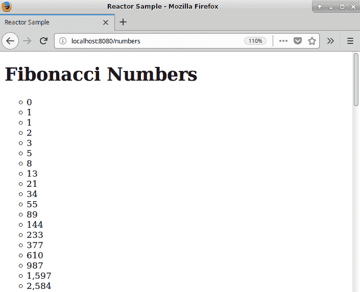
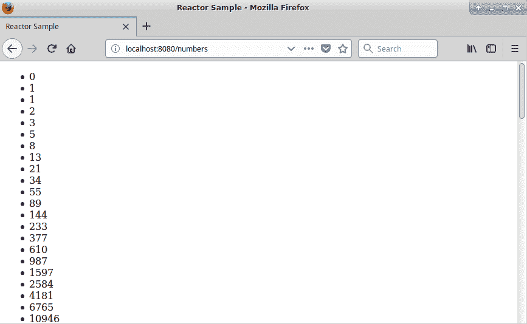
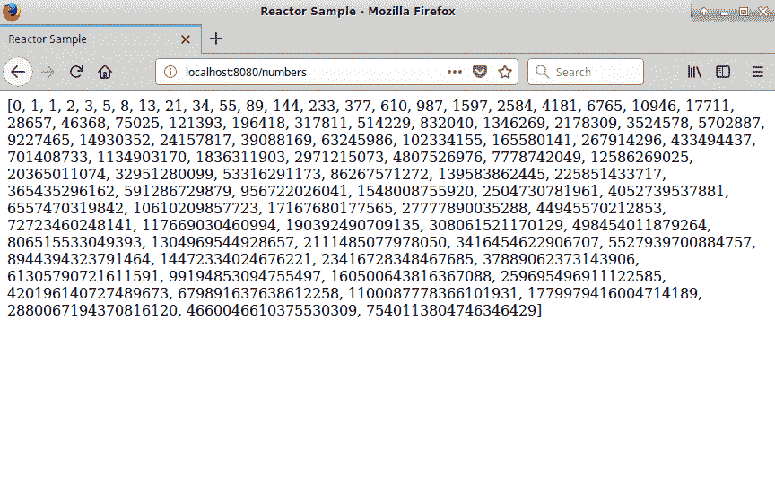
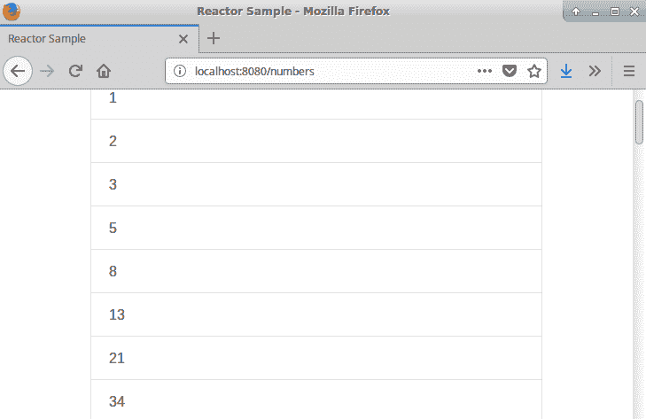

# 第六章：动态渲染

在上一章中，我们使用 SpringWebFlux 构建了简单的 Web 服务。到目前为止，我们已经构建了返回 JSON 响应的 RESTful Web 服务。然而，SpringWebFlux 不仅限于 RESTful Web 服务；它是一个完整的 Web 框架，提供了构建动态网页的能力。

在本章中，我们将讨论以下主题：

+   视图模板

+   静态资源

+   WebClient

# 技术要求

+   Java 标准版，JDK 8 或更高版本

+   IntelliJ IDEA IDE，2018.1 或更高版本

本章的 GitHub 链接为[`github.com/PacktPublishing/Hands-On-Reactive-Programming-with-Reactor/tree/master/Chapter06`](https://github.com/PacktPublishing/Hands-On-Reactive-Programming-with-Reactor/tree/master/Chapter06)。

# 视图模板

SpringWebFlux 提供了多种使用不同技术平台渲染视图的选项。无论我们做出何种选择，框架都会采用相同的视图解析过程，使我们能够得到正确的视图。然后，可以使用任何支持的技术来渲染视图。在本节中，我们将介绍使用 SpringWebFlux 渲染视图的完整过程。

# 解析视图

**视图解析**是框架用来确定对于接收到的请求需要渲染哪个视图的过程。完整的视图解析过程使我们能够根据内容参数渲染不同的视图。在我们开始构建不同的视图之前，让我们讨论一下框架是如何确定它需要渲染哪个视图的。

在上一章中，我们为处理请求配置了`HandlerFunction`。这个函数返回一个`HandlerResult`。`HandlerResult`不仅包含结果，还包含传递给请求的属性。然后，框架使用`HandlerResult`调用`ViewResolutionResultHandler`。`ViewResolutionResultHandler`通过验证以下返回值来确定正确的视图：

+   **String**：如果返回值是字符串，则框架使用配置的`ViewResolvers`构建视图。

+   **Void**：如果没有返回任何内容，它将尝试构建默认视图。

+   **Map**：框架会查找默认视图，但也会将返回的键值添加到请求模型中。

`ViewResolutionResultHandler`还会查找请求中传递的内容类型。为了确定应该使用哪个视图，它会将传递给`ViewResolver`的内容类型与支持的内容类型进行比较。然后，它选择第一个支持请求内容类型的`ViewResolver`。

重要的是要注意，一个请求可以重定向到另一个请求。为了做到这一点，我们在视图名称之前加上`redirect:`关键字。然后框架使用`UrlBasedViewResolver`并返回一个用于重定向的 URL。如果返回的 URL 来自同一应用程序，则路径可以以相对方式构建（例如，`redirect:/applicationA/locationA`）。如果返回的 URL 来自外部位置，则可以使用绝对 URL 构建视图名称（例如，`redirect:http://www.google.com/search/`）。

现在您已经了解了视图解析过程是如何工作的，让我们尝试使用各种支持的模板框架来构建动态视图。

# Freemarker

Freemarker 是一个可以用来生成动态 HTML 输出的模板引擎。它不仅限于 HTML 页面；它可以生成任何类型的文本输出，例如电子邮件和报告。为了使用它，我们必须使用 Freemarker 语法编写一个模板文件。然后 Freemarker 引擎接收该文件以及用于生成结果动态文本的数据。

现在，让我们尝试配置 Freemarker 以渲染我们的斐波那契数列。为了使用 Freemarker 进行视图解析，我们必须首先将所需的依赖项添加到我们的`build.gradle`中，如下所示：

```java
plugins {
    id "io.spring.dependency-management" version "1.0.1.RELEASE"
    id "org.springframework.boot" version "2.0.3.RELEASE"
}
apply plugin: 'java'
// Rest removed for Brevity

dependencies {
        compile 'org.springframework.boot:spring-boot-starter-webflux'
        compile 'org.springframework:spring-context-support'
        compile group: 'org.freemarker', name: 'freemarker', version: '2.3.28'
}
```

在前面的代码中，我们添加了以下内容：

1.  `org.freemarker:freemarker`：Freemarker 模板引擎——在撰写本书时，版本 2.3.28 是最新的版本。

1.  `spring-context-support`：这提供了 Freemarker 和 Spring 之间所需的集成。由于我们已经配置了`spring-boot`，因此我们不需要指定`spring-context-support`依赖项的版本。

现在我们已经添加了 Freemarker，我们必须对其进行配置。Spring 上下文有一个视图解析器注册表，必须更新以包括 Freemarker 解析器，如下所示：

```java
@EnableWebFlux
@Configuration
public class WebfluxConfig implements WebFluxConfigurer {

   @Override
    public void configureViewResolvers(ViewResolverRegistry registry) {
        registry.freeMarker();
   }

    @Bean
    public FreeMarkerConfigurer freeMarkerConfigurer() {
        FreeMarkerConfigurer configurer = new FreeMarkerConfigurer();
        configurer.setTemplateLoaderPath("classpath:/freemarker/");
        return configurer;
    }
}
```

在前面的代码中，我们做了以下操作：

1.  实现了`WebFluxConfigurer`接口。该接口提供了`configureViewResolvers`方法。

1.  `configureViewResolvers`由 Spring 上下文调用，同时提供一个`ViewResolverRegistry`。该注册表提供了`freeMarker()`方法以启用基于 Freemarker 的解析。

1.  接下来，我们必须创建一个`FreeMarkerConfigurer`，它可以设置 Freemarker 参数。如前所述的代码所示，我们配置了模板路径为`classpath:/freemarker/`。这将允许我们在`src/main/resources/freemarker`路径下创建 Freemarker 模板。

现在，让我们添加一个用于显示斐波那契数列的 Freemarker 模板。在这种情况下，我们希望将数字以简单的 HTML 列表形式列出，如下所示：

```java
<!DOCTYPE html>
<html>
    <head>
        <title>Reactor Sample</title>
        <meta charset="UTF-8"/>
        <meta name="viewport" content="width=device-width, initial-scale=1.0"/>
    </head>
    <body>
        <h1>Fibonacci Numbers</h1>
        <ul style="list-style-type:circle">
        <#list series as number>
          <li>${number}</li>
        </#list>
        </ul>
    </body>
</html>
```

在前面的 HTML 模板中，我们做了以下操作：

1.  我们添加了一个名为`series`的变量，其中包含一个值列表。

1.  `<#list> </#list>`语法遍历列表，提供单个值。

1.  值随后在`<li>` HTML 标签中呈现。

现在，将文件保存为`numbers.ftl`，位于`src/main/resources/freemarker`路径下。

本书的目标不是涵盖 Freemarker 语法。要了解更多信息，请参阅官方 Freemarker 文档。

现在剩下的唯一配置就是使用模板来渲染斐波那契序列。首先，让我们在我们的基于注解的控制器中使用此模板：

```java
@Controller
public class ReactiveController {

// Rest removed for Brevity
@GetMapping("/numbers")
    public String handleSeries(Model model) {
        Flux<Long> fibonacciGenerator = Flux.generate(() -> Tuples.<Long,
                Long>of(0L, 1L), (state, sink) -> {
            if (state.getT1() < 0)
                sink.complete();
            else
                sink.next(state.getT1());
            return Tuples.of(state.getT2(), state.getT1() + state.getT2());
        });
        model.addAttribute("series", fibonacciGenerator);
        return "numbers";
    }
}
```

在前面的代码中，我们做了以下操作：

1.  我们添加了 `@controller` 注解，而不是 `@RestController`。`RestController` 注解仅渲染 JSON 响应。另一方面，`@controller` 注解允许我们渲染任何类型的响应。

1.  我们将 `fibonacciGenerator(Flux<>)` 添加到我们的模型中，作为 `series` 变量。这将提供系列值给 Freemarker 模板。

1.  接下来，我们返回一个 `numbers` 字符串作为返回值。这将解析为选择 `number.ftl` 模板。

现在，让我们运行 `ReactorMain` 并访问 `http://localhost:8080/numbers`。在这个时候，我们将得到一个列出斐波那契序列的 HTML 页面，如下所示：



现在，让我们使用 Freemarker 视图和我们的 `HandlerFunction`。为了做到这一点，我们必须更改 `ServerResponse`，如下所示：

```java
@Configuration
class FibonacciConfigurer {

    // Rest removed  For Brevity

     @Bean
     RouterFunction<ServerResponse> fibonacciEndpoint() {
         Flux<Long> fibonacciGenerator = Flux.generate(() -> Tuples.<Long,
                 Long>of(0L, 1L), (state, sink) -> {
             if (state.getT1() < 0)
                 sink.complete();
             else
                 sink.next(state.getT1());
             return Tuples.of(state.getT2(), state.getT1() + state.getT2());
         });
         Map<String, Flux> model = new HashMap<>();
         model.put("series",fibonacciGenerator);
         RouterFunction<ServerResponse> fibonacciRoute =
                 RouterFunctions.route(RequestPredicates.path("/fibonacci"),
                         request -> ServerResponse.ok().render("numbers",model));
         return fibonacciRoute;
     }
```

在前面的代码中，我们做了以下操作：

+   我们现在使用渲染 API 而不是构建 `ServerResponse.body`。此 API 接受一个视图名称和一个可选的属性映射。

+   我们通过将系列键映射到 `fibonacciGenerator (Flux<>)` 来在映射中提供系列值。

现在，让我们运行 `ReactorMain` 并访问 `http://localhost:8080/fibonacci`。在这个时候，我们将得到相同的列出斐波那契序列的 HTML 页面。

# Thymeleaf

Thymeleaf 是一个基于 Java 和 XML/HTML 的现代模板引擎。它可以用来渲染任何 XML/HTML 内容。使用 Thymeleaf 构建的模板是自然顺序的，这意味着它们将按照设计的方式渲染，与 JSP 不同。这个模板引擎旨在取代 JSP。它与 Spring 有很好的集成。

现在，让我们尝试配置 Thymeleaf 来渲染斐波那契序列。为了使用 Thymeleaf 进行视图解析，我们必须首先在我们的 `build.gradle` 中添加所需的依赖项，如下所示：

```java
plugins {
    id "io.spring.dependency-management" version "1.0.1.RELEASE"
    id "org.springframework.boot" version "2.0.3.RELEASE"
}
apply plugin: 'java'
// Rest removed for Brevity

dependencies {
        compile 'org.springframework.boot:spring-boot-starter-webflux'
        compile "org.springframework.boot:spring-boot-starter-thymeleaf"
}
```

在前面的代码中，我们添加了以下内容：

+   `spring-boot-starter-thymeleaf`: Springboot 启动器导入所需的 Thymeleaf 库。它还使用预定义的默认值配置了 Thymeleaf 引擎。

现在我们已经添加了 Thymeleaf，我们必须启用它。Spring 上下文有一个视图解析器注册表，必须更新以包括 Thymeleaf 解析器，如下所示：

```java
@EnableWebFlux
@Configuration
public class WebfluxConfig implements WebFluxConfigurer {
    private final ISpringWebFluxTemplateEngine templateEngine;

    public WebfluxConfig(ISpringWebFluxTemplateEngine templateEngine) {
        this.templateEngine = templateEngine;
    }

    @Override
    public void configureViewResolvers(ViewResolverRegistry registry) {
        registry.viewResolver(thymeleafViewResolver());
   }

    @Bean
    public ThymeleafReactiveViewResolver thymeleafViewResolver() {
        final ThymeleafReactiveViewResolver viewResolver = new ThymeleafReactiveViewResolver();
        viewResolver.setTemplateEngine(templateEngine);
        return viewResolver;
    }

}
```

在前面的代码中，我们做了以下操作：

1.  实现了 `WebFluxConfigurer` 接口。此接口提供了 `configureViewResolvers` 方法。

1.  `configureViewResolvers` 方法由 Spring 上下文调用，同时还有一个 `ViewResolverRegistry`。我们必须使用此方法注册一个 `ThymeleafReactiveViewResolver`。

1.  `ThymeleafReactiveViewResolver` 使用一个 `ISpringWebFluxTemplateEngine` 引擎，该引擎在 Spring 上下文中可用。

1.  模板引擎在 `src/main/resources/templates` 下查找模板。在查找之前，它还会在模板名称前添加一个 `.html` 后缀。

现在，让我们添加一个 Thymeleaf 模板来显示斐波那契数列。我们希望将数字作为简单的 HTML 列表列出，如下所示：

```java
<!DOCTYPE html>

<html >
    <head>
        <title>Reactor Sample</title>
        <meta charset="UTF-8"/>
        <meta name="viewport" content="width=device-width, initial-scale=1.0"/>
    </head>
    <body>
        <section class="container">
            <ul>
                <li th:each="item : ${series}" th:text="${item}"></li>
            </ul>
        </section>
    </body>
</html>
```

在前面的 HTML 模板中，我们做了以下操作：

1.  添加了一个包含值的列表的 `series` 变量。

1.  添加了 `<li th:each></li>`，它遍历系列变量并渲染单个元素。

现在，将文件保存为 `numbers.html`，在路径 `src/main/resources/templates` 下。

本书的目标不是涵盖 Thymeleaf 语法。请参阅官方 Thymeleaf 文档。

现在，唯一剩下的配置就是使用模板来渲染斐波那契数列。首先，让我们在我们的基于注解的控制器方法中使用模板：

```java
@Controller
public class ReactiveController {

// Rest removed for Brevity
@GetMapping("/numbers")
    public String handleSeries(Model model) {
        Flux<Long> fibonacciGenerator = Flux.generate(() -> Tuples.<Long,
                Long>of(0L, 1L), (state, sink) -> {
            if (state.getT1() < 0)
                sink.complete();
            else
                sink.next(state.getT1());
            return Tuples.of(state.getT2(), state.getT1() + state.getT2());
        });
        model.addAttribute("series", fibonacciGenerator);
        return "numbers";
    }
}
```

在前面的代码中，我们做了以下操作：

1.  我们添加了 `@controller` 注解，而不是 `@RestController`。`RestController` 注解仅渲染 JSON 响应。另一方面，`@controller` 注解可以渲染任何类型的响应。

1.  我们将 `fibonacciGenerator(Flux<>)` 添加到我们的模型中作为一个系列。这将提供系列值给 Freemarker 模板。

1.  接下来，我们将 `numbers` 字符串作为返回值。返回值将映射到 `number.html` 模板。

现在，让我们运行 `ReactorMain` 并打开 `http://localhost:8080/numbers`。在此阶段，我们将得到一个列出斐波那契数列的 HTML 页面，如下所示：



现在，让我们使用 Thymeleaf 视图与我们的 `HandlerFunction`。为了做到这一点，我们必须更改 `ServerResponse`，如下所示：

```java
@Configuration
class FibonacciConfigurer {

    // Rest removed  For Brevity

     @Bean
     RouterFunction<ServerResponse> fibonacciEndpoint() {
         Flux<Long> fibonacciGenerator = Flux.generate(() -> Tuples.<Long,
                 Long>of(0L, 1L), (state, sink) -> {
             if (state.getT1() < 0)
                 sink.complete();
             else
                 sink.next(state.getT1());
             return Tuples.of(state.getT2(), state.getT1() + state.getT2());
         });
         Map<String, Flux> model = new HashMap<>();
         model.put("series",fibonacciGenerator);
         RouterFunction<ServerResponse> fibonacciRoute =
                 RouterFunctions.route(RequestPredicates.path("/fibonacci"),
                         request -> ServerResponse.ok().render("numbers",model));
         return fibonacciRoute;
     }
```

在前面的代码中，我们做了以下操作：

+   我们现在使用渲染 API 而不是构建 `ServerResponse.body`。该 API 接受一个视图名称和一个可选的属性映射。

+   我们通过将系列键映射到 `fibonacciGenerator (Flux<>)` 来在映射中提供系列值。

现在，让我们运行 `ReactorMain` 并打开 `http://localhost:8080/fibonacci`。在此阶段，我们将得到与列出斐波那契数列相同的 HTML 页面。

# 脚本

SpringWebFlux 也能够使用各种脚本库进行视图结束。它使用 JSR-223 Java 脚本引擎规范来集成各种脚本引擎。在撰写本书时，以下集成是可用的：

+   Handlebars，使用 Nashrom 引擎

+   Mustache，使用 Nashrom 引擎

+   React，使用 Nashrom 引擎

+   EJS，使用 Nashrom 引擎

+   ERB，使用 JRuby 引擎

+   字符串，使用 Jython 引擎

+   Kotlin，使用 Kotlin 引擎

在下一节中，我们将介绍与 Mustache 的集成。其他选项的集成类似。

# Mustache

Mustache 是一个简单的模板引擎，在各种语言中都有可用。我们现在将使用 JavaScript 中的模板引擎 `Mustache.js`。Mustache 通常被视为无逻辑的，因为它缺少显式的控制流语句。控制流是通过使用部分标签来实现的。

更多关于 Mustache 的详细信息，请参阅 [`mustache.github.io/`](http://mustache.github.io/)。

现在，让我们尝试配置 Mustache 来渲染我们的斐波那契数列。在我们的 `build.gradle` 文件中不需要任何其他依赖项：

```java
plugins {
    id "io.spring.dependency-management" version "1.0.1.RELEASE"
    id "org.springframework.boot" version "2.0.3.RELEASE"
}
apply plugin: 'java'
// Rest removed for Brevity

dependencies {
        compile 'org.springframework.boot:spring-boot-starter-webflux'
}
```

Spring 框架提供了开箱即用的集成。Spring 上下文有一个视图解析器注册表，必须更新以包括 `ScriptTemplate` 解析器，如下所示：

```java
@EnableWebFlux
@Configuration
public class WebfluxConfig implements WebFluxConfigurer {

   @Override
    public void configureViewResolvers(ViewResolverRegistry registry) {
        registry.scriptTemplate();
   }

    @Bean
    public ScriptTemplateConfigurer scrptTemplateConfigurer() {
        ScriptTemplateConfigurer configurer = new ScriptTemplateConfigurer();
        configurer.setEngineName("nashorn");
        configurer.setScripts("mustache.js");
        configurer.setRenderObject("Mustache");
        configurer.setResourceLoaderPath("classpath:/mustache/");
        configurer.setRenderFunction("render");
        return configurer;
    }

}
```

在先前的代码中，我们做了以下操作：

+   实现了 `WebFluxConfigurer` 接口。该接口提供了 `configureViewResolvers` 方法。

+   `configureViewResolvers` 方法由 Spring 上下文调用，同时还有 `ViewResolverRegistry`。该注册表提供了 `scriptTemplate()` 方法来启用基于脚本的解析器。

+   接下来，我们必须为 `ScriptTempletConfigure` 设置参数。配置器需要启用 `Mustache.js`，并使用 Nashrom 引擎评估它。

+   `ScriptTempletConfigure` 还指定了模板的位置。在先前的代码中，我们将位置配置为 `src/main/resources/mustache`。

+   由于我们使用 `Mustache.js`，我们还需要在 Mustache 模板位置下添加 `Mustache.js`（来自 [`github.com/janl/mustache.js`](http://github.com/janl/mustache.js)）。

现在，让我们添加一个 Mustache 模板来显示斐波那契数列。在这种情况下，将数字列表示为一个简单的 HTML 列表是有益的，如下所示：

```java
<!DOCTYPE html>

<html>
    <head>
        <title>Reactor Sample</title>
        <meta charset="UTF-8"/>
        <meta name="viewport" content="width=device-width, initial-scale=1.0"/>
    </head>
    <body>
        <section class="container">
            {{#series}}
            <div class="row">
                {{.}}
            </div>
            {{/series}}
        </section>
    </body>
</html>
```

在先前的 HTML 模板中，发生了以下情况：

1.  有一个 `series` 变量，包含一系列值。

1.  `{{#series}} {{/series}}` 语法遍历列表，提供单个值。

1.  然后使用 HTML `<div>` 标签中的 `{{.}}` 语法渲染该值。

现在，将文件保存为 `numbers.html`，位于 `src/main/resources/mustache` 路径下。剩下的唯一配置就是使用 `numbers.html` 模板来渲染斐波那契数列。首先，让我们在我们的基于注解的控制器方法中使用 `numbers.html` 模板：

```java
@Controller
public class ReactiveController {

// Rest removed for Brevity
@GetMapping("/numbers")
    public String handleSeries(Model model) {
        Flux<Long> fibonacciGenerator = Flux.generate(() -> Tuples.<Long,
                Long>of(0L, 1L), (state, sink) -> {
            if (state.getT1() < 0)
                sink.complete();
            else
                sink.next(state.getT1());
            return Tuples.of(state.getT2(), state.getT1() + state.getT2());
        });
        model.addAttribute("series", fibonacciGenerator);
        return "numbers.html";
    }
}
```

在先前的代码中，我们做了以下操作：

+   我们添加了 `@controller` 注解，而不是 `@RestController`。`RestController` 注解仅渲染 JSON 响应。另一方面，`@controller` 注解允许我们渲染任何类型的响应。

+   我们在我们的模型中添加了 `fibonacciGenerator(Flux<>)` 作为 `series`*.* 这将为 Mustache 模板提供系列值。

+   接下来，我们返回了 `numbers.html` 字符串作为返回值。返回值将映射到 `number.html` 模板。这与之前的模板引擎不同，后者会自动在返回的字符串值后添加后缀，以确定模板。

现在，让我们运行 `ReactorMain` 并访问 `http://localhost:8080/numbers`。此时，我们将得到一个列出斐波那契数列的 HTML 页面，如下所示：



现在，让我们使用 Mustache 视图与我们的 `HandlerFunction` 结合。为了做到这一点，我们必须更改 `ServerResponse`，如下所示：

```java
@Configuration
class FibonacciConfigurer {

    // Rest removed  For Brevity

     @Bean
     RouterFunction<ServerResponse> fibonacciEndpoint() {
         Flux<Long> fibonacciGenerator = Flux.generate(() -> Tuples.<Long,
                 Long>of(0L, 1L), (state, sink) -> {
             if (state.getT1() < 0)
                 sink.complete();
             else
                 sink.next(state.getT1());
             return Tuples.of(state.getT2(), state.getT1() + state.getT2());
         });
         Map<String, Flux> model = new HashMap<>();
         model.put("series",fibonacciGenerator);
         RouterFunction<ServerResponse> fibonacciRoute =
                 RouterFunctions.route(RequestPredicates.path("/fibonacci"),
                         request -> ServerResponse.ok().render("numbers.html",model));
         return fibonacciRoute;
     }
```

在前面的代码中，我们做了以下操作：

1.  我们现在不是构建 `ServerRespose.body`，而是使用渲染 API。该 API 接受一个视图名称和一个可选的属性映射。

1.  我们通过将序列键映射到 `fibonacciGenerator (Flux<>)` 来在映射中提供了序列值。

现在，让我们运行 `ReactorMain` 并访问 `http://localhost:8080/fibonacci`。作为响应，我们将得到一个列出斐波那契数列的相同 HTML 页面。

# 学习静态资源

一个动态应用程序通常也有静态部分。SpringWebFlux 也使我们能够配置静态资源。假设我们想在我们的 Thymeleaf 应用程序中使用 `bootstrap.css`。为了做到这一点，我们必须启用服务器来确定静态内容。这可以配置如下：

```java
public class WebfluxConfig implements WebFluxConfigurer {
    //Rest Removed for Brevity
    @Override
    public void addResourceHandlers(ResourceHandlerRegistry registry) {
        registry.addResourceHandler("/resources/**")
                .addResourceLocations("classpath:/static/");
    }
}
```

在前面的代码中，发生了以下情况：

1.  `addResourceHandler` 方法接受一个 URL 模式，并将其配置为静态位置，这些位置必须由服务器提供服务。在前面的代码中，我们所有的静态 URL 应该看起来像 `like/resources/XXXX`。

1.  `addResourceLocations` 方法配置了一个必须从其中提供静态内容的位置。在前面的代码中，我们已经将位置配置为 `src/main/resources/static`。

现在，让我们将 `bootstrap.css` 下载到 `src/main/resources/static`。这将服务于 `/resources/bootstrap.min.css`。剩下要做的就是将 `css` 包含在我们的 `numbers.html` Thymeleaf 模板中，如下所示：

```java
<html >
    <head>
        <title>Reactor Sample</title>
        <meta charset="UTF-8"/>
        <meta name="viewport" content="width=device-width, initial-scale=1.0"/>
        <link rel="stylesheet" href="/resources/bootstrap.min.css">
    </head>
    <body>
        <section class="container">
            <ul class="list-group">
                <li th:each="item : ${series}" th:text="${item}" class="list-group-item"></li>
            </ul>
        </section>
    </body>
</html>
```

在前面的代码中，发生了以下情况：

1.  `<link rel="stylesheet"../>` 将包含来自我们服务器的 `css`。

1.  我们使用了 `container` 以及来自 Bootstrap 的 `list-group` 和 `list-group-item` 类来为我们的 HTML 元素提供样式。

现在，运行服务器并打开 `http://localhost:8080/numbers`。页面现在使用 Bootstrap 网格格式化，如下所示：



`ResourceHandlerRegistry` 还使我们能够配置缓存控制头。它还可以用于构建可以解析 `.gz` 静态资源和版本化资源的解析器链。

# WebClient

SpringWebFlux 框架还提供了一个非阻塞、异步 HTTP 客户端来发送请求。**WebClient** 提供了可以配置为 Java 8 lambdas 的 API，用于处理数据。在后台，WebClient API 配置 Netty 执行异步、非阻塞通信。现在，让我们看看我们如何在应用程序中使用 WebClient。

WebClient 提供以下两种方法来消费数据：

+   `检索`：这是最简单的方法，它将主体解码为 Flux 或 Mono。

+   `Exchange`: 如果我们对收到的响应感兴趣，`exchange` 方法适合此目的。它提供了完整的消息，可以将其转换回目标类型。考虑以下代码示例：

```java
public void readFibonacciNumbers() {
  WebClient client = WebClient.create("http://localhost:8080");
  Flux<Long> result = client.get()
          .uri("/fibonacci").accept(MediaType.APPLICATION_JSON)
          .retrieve()
          .bodyToFlux(Long.class);
  result.subscribe( x-> System.out.println(x));
}
```

在前面的代码中，我们构建了 WebClient 来读取斐波那契数列响应。此代码实现了以下功能：

1.  它为以下位置创建了一个 WebClient 实例：`http://localhost:8080`。

1.  客户端向 `/fibonacci` 发送一个 HTTP `GET` 请求，并带有所需的 `JSON ACCEPT` 头部。

1.  然后它调用 `retrieve` 方法，并将正文转换为 `Flux<Long>`。

1.  最后，我们订阅了 Flux 并将数字打印到控制台。

可以使用 `exchange` 方法处理相同的斐波那契数列，如下所示：

```java
public void readFibonacciNumbersUsingExchange() {
        WebClient client = WebClient.create("http://localhost:8080");
        Flux<Long> result = client.get()
                .uri("/fibonacci").accept(MediaType.APPLICATION_JSON)
                .exchange()
                .flatMapMany(response -> response.bodyToFlux(Long.class));
        result.subscribe( x-> System.out.println(x));
    }
```

以下是在 `exchange` 方法与 `retrieve` 方法之间的关键差异：

+   `exchange` 方法提供了一个 `Mono<ClientResponse>`。这必须使用 `flatMapMany` API 转换为 Flux。

+   我们处理响应体并将其转换为 `Flux<Long>`。

除了前面提到的差异之外，`retrieve` 方法还提供了一个方便的 `onStatus` API。此方法用于在指定的 HTTP 状态码上调用函数。另一方面，在 `exchange` 方法中，我们获取完整的响应，因此开发者需要读取 HTTP 状态码并调用所需的逻辑。

WebClient 可以用来调用 HTTP `GET`、`PUT`、`POST`、`DELETE`、`PATCH` 和 `HEAD` 方法。当使用 `POST` 时，我们通常需要添加一个请求体。这是通过调用 `PUT` 方法中可用的 `body()` API 来完成的。该 API 接受指定类型的 Mono 或 Flux。或者，如果有可用的对象，可以使用 `syncBody()` 方法进行处理。WebClient API 还提供了以下方法来配置请求：

+   `accepts`: 使用指定的内容类型配置 `accepts request` 头

+   `acceptCharset`: 配置 `accepts-charset` 请求头

+   `header(s)`: 使用指定的值配置指定的头（s）

+   `attributes`: 向请求添加指定的属性

+   `cookies`: 向请求添加 `cookies` 头

WebClient 还提供了一个构建器，可以用来根据提供的设置构建 WebClient。这可以用来实例化一个客户端，作为特定的 SSL 上下文，或者使用默认的头。构建器配置应用于创建的 WebClient 实例，因此对于使用该实例进行的每个调用都会调用它。

SpringWebFlux 还提供了 `WebTestClient`，它是 WebClient 的扩展，并附带断言来验证响应体和响应状态。该类可以以类似于 WebClient 的方式实例化。在通过 `exchange` 方法发出请求后，可以使用以下方法进行断言：

+   `expectStatus()`: 此方法可以验证响应状态码，例如 `OK` 和 `NOT_FOUND`。

+   `expectHeader()`: 此方法可以验证响应头，例如 `MediaType`。

+   `expectBody(class)`: 此方法可以验证响应体是否可以转换为指定的类。

+   `expectBodyList(class)`: 此方法可以验证响应体是否可以转换为指定类对象的列表。转换后，它可以验证列表大小和列表对象。

`WebTestClient` 可以用来测试和验证 `SpringWebFlux` 应用程序。`WebTestClient` 提供不同的 `bindXXX` 方法，这些方法可以用来配置 `WebTestClient` 以适用于 `ApplicationContext`、URL、控制器、路由函数等。然后它可以对配置的资源进行调用，并验证响应。

# 摘要

在本章中，我们讨论了如何使用 SpringWebFlux 可用的各种模板引擎来渲染动态内容。我们集成了基于 Java 的模板引擎、Freemarker 和 Thymeleaf。我们还探讨了如何启用基于脚本的引擎，以及如何与 Mustache.js 一起工作。接下来，我们研究了如何使用 `SpringWebFlux` 来提供静态内容。最后，我们讨论了使用 WebClient 来进行异步、非阻塞的 HTTP 请求。我们现在正在生成事件并处理它们。在下一章中，我们将讨论执行流控制和背压的方法。

# 问题

1.  `SpringWebFlux` 框架是如何解析视图的？

1.  哪些组件被配置为使用 Thymeleaf 模板引擎？

1.  在 SpringWebFlux 中，使用哪个 API 来配置静态资源？

1.  WebClient 有哪些好处？

1.  检索和交换 WebClient API 之间的区别是什么？
