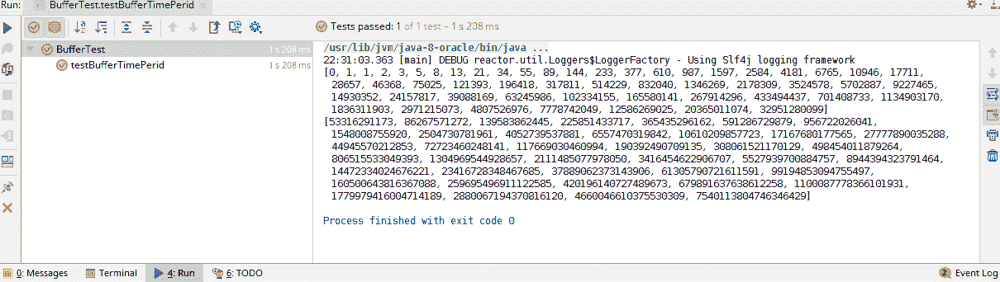

# 流控制和背压

在前面的章节中，我们讨论了 Reactor 如何提供有效的控制来检查生产率。这种机制通常被称为背压。然而，在某些情况下，背压并不是一个有效的策略。在这种情况下，Reactor 提供了一系列无需背压即可使用的流控制优化。

在本章中，我们将介绍有关流控制和背压的以下主题：

+   分组

+   缓冲区

+   窗口

+   示例

+   背压

# 技术要求

+   Java 标准版，JDK 8 或更高版本

+   IntelliJ IDEA IDE 2018.1 或更高版本

本章的 GitHub 链接为[`github.com/PacktPublishing/Hands-On-Reactive-Programming-with-Reactor/tree/master/Chapter07`](https://github.com/PacktPublishing/Hands-On-Reactive-Programming-with-Reactor/tree/master/Chapter07)。

# 流控制

流控制全部关于管理事件速率，以确保在引发大量事件时，生产者不会压倒其订阅者。快速生产者会将许多事件推送到其订阅者。每个订阅者将按接收顺序逐个处理这些事件。这种顺序处理过程可能相当低效，因为每个事件都是通过电线传输的。

为了提高效率，Reactor 中有一些运算符允许生产者在块中引发事件。每个事件块都发送给订阅者，使他们能够同时处理多个事件。

# `groupBy`运算符

`groupBy()`运算符将`Flux<T>`转换为批次。该运算符将每个元素与`Flux<T>`中的一个键相关联。然后它将具有相同键的元素分组。然后，该运算符发出这些组。这在上面的图中有所描述：


重要的是要注意，一旦元素被分组，它们可能会失去其原始的顺序。顺序是由键生成逻辑强制执行的。由于每个元素只与一个键相关联，因此生成的组不为空。所有生成的组在本质上都是不相交的。让我们尝试为我们的斐波那契数列生成一些组：

```java
    @Test
    public  void testGrouping(){
        Flux<Long> fibonacciGenerator = Flux.generate(() -> Tuples.<Long,
                Long>of(0L, 1L), (state, sink) -> {
            if (state.getT1() < 0)
                sink.complete();
            else
                sink.next(state.getT1());
            return Tuples.of(state.getT2(), state.getT1() + state.getT2());
        });
        fibonacciGenerator.take(20)
                .groupBy(i -> {
                    List<Integer> divisors= Arrays.asList(2,3,5,7);
                    Optional<Integer> divisor = divisors.stream().filter(d -> i % d == 0).findFirst();
                    return divisor.map(x -> "Divisible by "+x).orElse("Others");

                })
                 .concatMap(x -> {
                     System.out.println("\n"+x.key());
                     return x;
                 })
                .subscribe(x -> System.out.print(" "+x));
    }
```

在前面的代码中，我们执行了以下步骤：

1.  我们将原始数据集划分为`能被 2 整除`、`能被 3 整除`、`能被 5 整除`、`能被 7 整除`等组的集合。

1.  `groupBy`运算符将这些分区数据集作为键值对发出。键是一个字符串，值是`List<Long>`。

1.  使用`concatMap`运算符合并了数据集。我们还使用该运算符打印了键。

1.  最后，我们在`Subscribe`函数中打印了`List`。

让我们运行我们的测试用例以确认输出：


# 缓冲区运算符

`buffer()` 操作符收集所有 `Flux<T>` 元素并将它们作为 `List<T>` 发出。与由 `groupBy()` 操作符生成的组不同，`List<T>` 缓冲区中的所有元素都保持其原始顺序。或者，我们也可以向操作符提供一个 `batchSize`。然后，操作符将生成 *N* 个列表，每个列表将包含指定数量的元素。让我们尝试在我们的斐波那契数列上使用缓冲操作符：

```java
    @Test
    public  void testBufferWithDefinateSize(){
        Flux<Long> fibonacciGenerator = Flux.generate(() -> Tuples.<Long,
                Long>of(0L, 1L), (state, sink) -> {
            if (state.getT1() < 0)
                sink.complete();
            else
                sink.next(state.getT1());
            return Tuples.of(state.getT2(), state.getT1() + state.getT2());
        });
        fibonacciGenerator.take(100)
                .buffer(10)
                .subscribe(x -> System.out.println(x));
    }
```

在前面的代码中，我们做了以下操作：

1.  我们将原始数据集划分为每个包含 10 个元素的缓冲列表

1.  我们然后使用 `subscribe` 函数打印了列表

让我们运行我们的测试用例以确认输出。我们可以看到斐波那契元素以单个 `List<Long>` 的形式发出：


`buffer()` 操作符有许多变体。让我们看看其中的一些。这些都会生成多个列表缓冲区。

`buffer(maxSize, skipSize)` 操作符接受两个参数。第一个参数是每个缓冲区的最大大小。第二个参数是在开始新缓冲区之前必须跳过的元素数量。由操作符生成的缓冲区列表具有以下特征：

+   如果 `maxSize` 大于 `skipSize`，则缓冲区在本质上是有重叠的。下一个缓冲区从上一个缓冲区的 `skipSize` 位置指定的元素开始。这意味着元素在所有缓冲区中都是重复的。

+   如果 `maxSize` 小于 `skipSize`，则缓冲区在本质上是不相交的。生成的列表会缺少原始 `Flux<T>` 中的元素。

+   如果 `skipSize` 为 `0`，则所有列表在本质上是不相交的。它们不会缺少原始 `Flux<T>` 中的任何元素。考虑以下代码：

```java
    @Test
    public  void testBufferSizes(){
        Flux<Long> fibonacciGenerator = Flux.generate(() -> Tuples.<Long,
                Long>of(0L, 1L), (state, sink) -> {
            if (state.getT1() < 0)
                sink.complete();
            else
                sink.next(state.getT1());
            return Tuples.of(state.getT2(), state.getT1() + state.getT2());
        });
        fibonacciGenerator.take(100)
                .buffer(2,5)
                .subscribe(x -> System.out.println(x));
    }
```

在前面的代码中，我们做了以下操作：

1.  我们将原始数据集划分为每个包含两个元素的缓冲区

1.  每个缓冲列表从第五个元素开始，因此丢弃了三个元素

1.  我们在 `subscribe` 函数中打印了列表

让我们运行代码以确认输出。我们可以看到斐波那契元素以单个 `List<Long>` 的形式发出：


`bufferUntil` 和 `bufferWhile` 变体接受一个谓词条件，并聚合元素直到条件为真。`bufferWhile` 操作符生成一个包含所有匹配条件的元素的单一缓冲区。另一方面，`bufferUntil` 操作符将不匹配的元素缓冲到一个列表中。当它找到一个匹配的元素时，它将该元素添加到当前缓冲区。然后它开始一个新的缓冲区以添加下一个传入的元素。这个过程在以下图中展示：


另一个重载的 `buffer()` 方法允许我们根据时间段生成缓冲区列表。操作符接受一个持续时间，并聚合该时间段内的所有元素。因此，它可以收集在第一个 `Duration`、第二个 `Duration` 等期间发生的所有事件，如下所示：

```java
    @Test
    public  void testBufferTimePerid(){
        Flux<Long> fibonacciGenerator = Flux.generate(() -> Tuples.<Long,
                Long>of(0L, 1L), (state, sink) -> {
            if (state.getT1() < 0)
                sink.complete();
            else
                sink.next(state.getT1());
            return Tuples.of(state.getT2(), state.getT1() + state.getT2());
        });
        fibonacciGenerator
                .buffer(Duration.ofNanos(10))
                .subscribe(x -> System.out.println(x));
    }
```

在前面的代码中，我们做了以下操作：

1.  我们根据 10 纳秒的时间切片将原始数据划分为分块

1.  每个缓冲区列表都包含了在该时间段内发出的元素

1.  最后，我们使用 `subscribe` 函数打印了列表

让我们运行这段代码以确认输出。我们可以看到斐波那契元素作为多个 `List<Long>` 发出：



`buffer` 操作符提供了这里讨论的方法的多种变体。所有 `buffer` 方法都提供了一个列表，但只有重载方法之一允许我们将缓冲区转换为集合数据集。我们需要向重载的 `buffer` 操作符提供一个供应商函数。这个函数负责创建集合实例。让我们看看以下代码：

```java
    @Test
    public  void testBufferSupplier(){
        Flux<Long> fibonacciGenerator = Flux.generate(() -> Tuples.<Long,
                Long>of(0L, 1L), (state, sink) -> {
            if (state.getT1() < 0)
                sink.complete();
            else
                sink.next(state.getT1());
            return Tuples.of(state.getT2(), state.getT1() + state.getT2());
        });
        fibonacciGenerator.take(100)
                .buffer(5,HashSet::new)
                .subscribe(x -> System.out.println(x));
    }
```

这里，我们做了以下操作：

+   我们将原始数据集划分为最多包含五个元素的分块

+   每个缓冲区都作为 `HashSet` 发出，这意味着它只包含不同的元素

+   最后，我们使用 `subscribe` 函数打印了列表

由于我们使用了 `HashSet`，我们可以看到它不包含斐波那契数列的重复元素：


# 窗口操作符

`window()` 操作符与 `buffer()` 操作符类似。它也会切割原始数据集，但将每个数据集作为处理器发出，而不是作为新的集合。每个处理器在订阅项目后发出项目。`window` 操作符允许我们有一个固定大小的窗口、基于时间的窗口或基于谓词的窗口。与允许我们为所有发布的元素构建单个缓冲区的 `buffer` 操作符不同，`window` 操作符不允许你在单个窗口中发布元素。

`window()` 操作符提供了更好的内存利用率，因为项目会立即发出，而不是首先被缓存到一个集合中，然后在达到正确的集合大小时再发出。`window` 操作符也比缓冲操作符提供了更好的内存使用。以下代码展示了这一点：

```java
    @Test
     public  void testWindowsFixedSize(){
         Flux<Long> fibonacciGenerator = Flux.generate(() -> Tuples.<Long,
                 Long>of(0L, 1L), (state, sink) -> {
             if (state.getT1() < 0)
                 sink.complete();
             else
                 sink.next(state.getT1());
             return Tuples.of(state.getT2(), state.getT1() + state.getT2());
         });
         fibonacciGenerator
                 .window(10)
                 .concatMap(x -> x)
                 .subscribe(x -> System.out.print(x+" "));
     }
```

在前面的代码中，我们做了以下操作：

1.  我们将原始数据划分为每个最多包含 10 个元素的分块

1.  每个窗口都是 `UnicastProcesser` 类型的一种，因此需要使用 `ConcatMap` 或 `flatMap` 将其他生成的窗口与之结合

1.  最后，我们使用 `subscribe` 函数打印了列表

让我们运行这段代码以确认输出。我们可以看到斐波那契元素作为多个批次发出，然后合并为一个：


`WindowUntil` 和 `WindowWhile` 变体接受一个谓词条件，并构建一个窗口批次，直到条件为真。`WindowWhile` 操作符生成一个包含所有匹配条件的单个窗口。另一方面，`WindowUntil` 操作符将不匹配的元素聚合到一个窗口中。当它找到一个匹配的元素时，它将其添加到当前窗口。然后它开始一个新的窗口以添加下一个传入的元素。考虑以下代码：

```java
   @Test
    public  void testWindowsPredicate(){
        Flux<Long> fibonacciGenerator = Flux.generate(() -> Tuples.<Long,
                Long>of(0L, 1L), (state, sink) -> {
            if (state.getT1() < 0)
                sink.complete();
            else
                sink.next(state.getT1());
            return Tuples.of(state.getT2(), state.getT1() + state.getT2());
        });
        fibonacciGenerator
                .windowWhile(x -> x < 500)
                .concatMap(x -> x)
                .subscribe(x -> System.out.println(x));
    }
```

在前面的代码中，我们做了以下操作：

1.  我们根据条件 `x < 500` 对原始数据进行分区。

1.  所有符合标准的数据元素都在一个窗口中发布。

1.  窗口元素作为 `WindowFlux` 发射。它们使用 `concatMap` 或 `flatMap` 进行组合。

1.  最后，我们使用 `subscribe` 函数打印元素。

让我们运行代码以确认输出：


# 样本操作符

`groupBy()`, `buffer()`, 和 `window()` 操作符将输入聚合并基于其大小、时间周期或条件将它们合并成块。它们的目标不是跳过事件。有时，你可能需要跳过事件并监听给定时间间隔内的特定事件。这通常适用于快速、不变化的事件，例如用户点击。在这种情况下，我们需要调节流量并选择性地获取数据。

`sample()` 操作符允许我们完成这种调节。它接受一个时间周期并监听该时间周期内发布的事件。然后它发布该时间周期内发生的最后一个事件。这在上面的图中有所展示：


让我们尝试给我们的斐波那契数列添加延迟，然后进行调节：

```java
    @Test
    public  void testSample() throws Exception{
        Flux<Long> fibonacciGenerator = Flux.generate(() -> Tuples.<Long,
                Long>of(0L, 1L), (state, sink) -> {
            if (state.getT1() < 0)
                sink.complete();
            else
                sink.next(state.getT1());
            return Tuples.of(state.getT2(), state.getT1() + state.getT2());
        });
        CountDownLatch latch = new CountDownLatch(1);
        fibonacciGenerator
                .delayElements(Duration.ofMillis(100L))
                .sample(Duration.ofSeconds(1))
                .subscribe(x -> System.out.println(x), e -> latch.countDown() , () -> latch.countDown());
        latch.await();
    }
```

在前面的代码中，我们做了以下操作：

1.  我们添加了 `delayElements()` 操作符。这个操作符负责将每个事件延迟指定的周期。在这种情况下，我们将每个元素延迟了 100 毫秒。

1.  接下来，我们添加了时间间隔为一秒的 `sample()` 操作符。

1.  然后我们使用 `Subscribe` 函数打印元素。

1.  我们还添加了一个 `CountDownLatch` 来等待测试执行的完成/错误事件。

让我们运行代码以确认输出：


`samplefirst()` 操作符与 `sample()` 操作符类似。这个操作符在指定的时间周期内发布接收到的第一个元素，而不是选择最后一个元素。

# 反压

反压是 Reactor 的一个基本组成部分。我们在前面的章节中多次讨论了它，但我们将在这里详细探讨这个主题。让我们回顾 Reactor 提供的开箱即用的反压支持。每个订阅者都使用订阅对象请求它可以处理的事件数量。发布者必须尊重这个限制，并发布小于或等于请求限制的事件。这在上面的图中表示：


使用`Long.MAX_VALUE`调用请求意味着请求无界数量的事件。发布者可以推送尽可能多的事件。它不再受订阅者限制的约束。

在每个订阅者处理接收到的事件时，它可以使用订阅句柄请求额外的事件。如果发布者快速发布事件，它必须制定一个策略来处理未请求的事件。看看以下测试代码：

```java
    @Test
    public void testBackPressure() throws  Exception{
        Flux<Integer> numberGenerator = Flux.create(x -> {
            System.out.println("Requested Events :"+x.requestedFromDownstream());
            int number = 1;
            while(number < 100) {
                x.next(number);
                number++;
            }
            x.complete();
        });

        CountDownLatch latch = new CountDownLatch(1);
        numberGenerator.subscribe(new BaseSubscriber<Integer>() {
            @Override
            protected void hookOnSubscribe(Subscription subscription) {
                request(1);
            }

            @Override
            protected void hookOnNext(Integer value) {
                System.out.println(value);
            }

            @Override
            protected void hookOnError(Throwable throwable) {
                throwable.printStackTrace();
                latch.countDown();
            }

            @Override
            protected void hookOnComplete() {
                latch.countDown();
            }
        });
        assertTrue(latch.await(1L, TimeUnit.SECONDS));
    }
```

在前面的代码中，发生了以下情况：

1.  我们使用`Flux.create` API 创建了一个发布者

1.  发布者将请求的数量打印到控制台，并发布了 100 个事件

1.  订阅者在`subscribe`钩子中请求了一个事件

1.  订阅者将接收的事件打印到控制台

1.  有一个`CountDownLatch`用于暂停代码 1 秒钟

总结一下，订阅者请求了一个事件，但发布者发布了 100 个。让我们运行测试，看看控制台上的结果：


前面的测试未能成功完成。我们的订阅者请求了一个事件，但它只收到了一个。然而，发布者推送了 100 个数据事件，然后是完整的事件。Reactor 在幕后做了一些工作，将事件保持在队列中。它提供了一些溢出策略来处理快速发布者产生的事件：

| **策略** | **描述** |
| --- | --- |
| `IGNORE` | 此策略忽略订阅者的反压限制，并继续向订阅者发送下一个事件。 |
| `BUFFER` | 此策略将未发送的事件组合在缓冲区中。当订阅者请求下一个事件时，缓冲区中的事件被发送。 |
| `DROP` | 此策略静默丢弃产生的未发送事件。只有当下一次请求被提出时，订阅者才会得到新产生的事件。 |
| `LATEST` | 此策略保留缓冲区中提出的最新事件。只有当下一次请求被提出时，订阅者才会得到最新产生的事件。 |
| `ERROR` | 如果生产者发布的比订阅者请求的事件多，此策略将引发`OverFlowException`。 |

默认创建的 API 使用`Overflow.Buffer`策略。我们可以通过在重载的`create`方法中传递我们想要的策略来覆盖它。让我们用`Overflow.Error`策略测试前面的代码：

```java
@Test
    public  void testBackPressure() throws  Exception{
        Flux<Integer> numberGenerator = Flux.create(x -> {
            System.out.println("Requested Events :"+x.requestedFromDownstream());
            int number = 1;
            while(number < 100) {
                x.next(number);
                number++;
            }
            x.complete();
        }, OverflowStrategy.ERROR);

      // Removed for Brevity
    }
```

测试用例现在失败，以下错误：

```java
reactor.core.Exceptions$OverflowException: The receiver is overrun by more signals than expected (bounded queue...)
    at reactor.core.Exceptions.failWithOverflow(Exceptions.java:202)
    at reactor.core.publisher.FluxCreate$ErrorAsyncSink.onOverflow(FluxCreate.java:632)
    at reactor.core.publisher.FluxCreate$NoOverflowBaseAsyncSink.next(FluxCreate.java:603)
    at reactor.core.publisher.FluxCreate$SerializedSink.next(FluxCreate.java:151)
```

# OnBackpressure

Reactor 还提供了操作符来更改与发布者配置的溢出策略。有各种`OnBackpressureXXX()`操作符，它们针对 Reactor 中可用的每种策略。这些在无法将前面的策略应用于发布者的场景中非常有用。

发布者有时被配置为使用`IGNORE`策略。在这种情况下，在订阅发布者时使用操作符来配置背压。

让我们使用我们的测试用例并对其应用背压操作符：

```java
@Test
    public  void testBackPressureOps() throws  Exception{
        Flux<Integer> numberGenerator = Flux.create(x -> {
            System.out.println("Requested Events :"+x.requestedFromDownstream());
            int number = 1;
            while(number < 100) {
                x.next(number);
                number++;
            }
            x.complete();
        });

        CountDownLatch latch = new CountDownLatch(1);
        numberGenerator
                .onBackpressureDrop(x -> System.out.println("Dropped :"+x))
                .subscribe(new BaseSubscriber<Integer>() {
            // Removed for Brevity
        });
        assertTrue(latch.await(1L, TimeUnit.SECONDS));
    }
```

在前面的代码中，我们做了以下操作：

1.  我们将`Flux<Integer>`配置为使用默认配置`OverflowStrategy.BUFFER`

1.  在订阅`Flux<Integer>`时，我们更改了策略以使用`OverflowStrategy.DROP`

1.  此外，我们还向操作符传递了一个 lambda 表达式来打印丢弃的值

让我们运行代码并验证输出：


此外，还有`onBackpressureLatest()`、`onBackpressureError()`和`onBackpressureBuffer()`操作符，它们与`onBackpressureDrop()`操作符类似。`onBackpressureBuffer()`操作符有几个重载变体。作为一个基本配置，它允许我们指定缓冲区大小。我们还可以指定以下策略之一来处理超出指定缓冲区的溢出：

| **缓冲区溢出** | **描述** |
| --- | --- |
| `DROP_LATEST` | 所有生成的事件首先被缓冲，然后丢弃新的事件。这将保持缓冲区中最老的事件。 |
| `DROP_OLDEST` | 所有生成的事件都被缓冲。然后，当前在缓冲区中的事件被新的事件替换。这将保持缓冲区中最新的事件。 |
| `ERROR` | 这会对超出缓冲区的事件抛出`OverFlowException`。 |

让我们通过一个示例来看看它是如何工作的。我们还可以传递一个消费者 lambda 表达式来处理溢出事件：

```java
    @Test
    public  void testBackPressureOps() throws  Exception{
        Flux<Integer> numberGenerator = Flux.create(x -> {
            System.out.println("Requested Events :"+x.requestedFromDownstream());
            int number = 1;
            while(number < 100) {
                x.next(number);
                number++;
            }
            x.complete();
        });

        CountDownLatch latch = new CountDownLatch(1);
        numberGenerator
                .onBackpressureBuffer(2,x -> System.out.println("Dropped :"+x),BufferOverflowStrategy.DROP_LATEST)
                .subscribe(new BaseSubscriber<Integer>() {
        // Removed for brevity
        });
        assertTrue(latch.await(1L, TimeUnit.SECONDS));
    }
```

在前面的代码中，我们做了以下操作：

1.  我们将`Flux<Integer>`配置为使用默认配置`OverflowStrategy.BUFFER`

1.  在订阅`Flux<Integer>`时，我们将缓冲区大小更改为两个元素

1.  我们为超出缓冲区的事件配置了`DROP_LATEST`策略

1.  我们还向操作符传递了一个 lambda 表达式来打印丢弃的值

让我们运行代码并验证输出：


# 摘要

在本章中，我们详细讨论了 Reactor 中可用的流控制操作符。我们探讨了 `groupBy`、`buffer` 和 `window` 操作符中可用的不同重载选项。然后，我们考虑了如何使用样本操作符来节流事件，该操作符允许在指定的时间间隔内只传递一个事件。之后，我们回顾了 Reactor 中可用的背压支持，并研究了它提供的不同溢出策略。我们还了解到，Reactor 默认使用 `Overflow.Buffer` 策略，这可以作为 `Flux.create` API 的一部分提供。最后，我们讨论了可以用来改变生产者策略的背压操作符。总之，我们讨论了可用于流控制和背压的完整操作符列表。在下一章中，我们将探讨错误处理和恢复。

# 问题

1.  为什么我们需要 `groupBy` 操作符？

1.  `groupBy` 和 `buffer` 操作符之间的区别是什么？

1.  我们如何在 Reactor 中节流一个事件？

1.  `Overflow.Ignore` 和 `Overflow.Latest` 策略之间的区别是什么？

1.  哪些操作符可以改变生产者的背压策略？
