# 第八章：处理错误

弹性是响应式系统的一个重要方面。根据响应式宣言，响应式系统必须在失败期间保持响应。系统必须优雅地处理错误，并及时生成用户响应。没有有效的错误处理机制是无法实现的。Reactor 提供了一些操作符来处理错误。在本章中，我们将查看每个操作符。

在本章中，我们将涵盖以下主题：

+   处理错误

+   错误操作符

+   超时和重试

+   WebClient 错误处理

# 技术要求

+   Java 标准版，JDK 8 或更高版本

+   IntelliJ IDEA IDE，2018.1 或更高版本

本章的 GitHub 链接为[`github.com/PacktPublishing/Hands-On-Reactive-Programming-with-Reactor/tree/master/Chapter08`](https://github.com/PacktPublishing/Hands-On-Reactive-Programming-with-Reactor/tree/master/Chapter08)。

# 生成错误

在我们尝试处理错误之前，让我们先尝试引发一些错误。在 Java 生态系统中，错误条件是通过抛出异常来引发的。以下条件下可以引发异常：

+   生产者在生成下一个值时可以抛出异常。

+   订阅者在处理下一个值或订阅事件，或在任何操作符中时可以抛出异常。

在所有上述条件下，必须有一个有效的错误处理程序来处理引发的错误。响应式流规范为同一目的指定了错误事件。规范指出，生产者应引发错误事件，而不是抛出异常。然而，规范没有讨论在处理订阅者中的事件时引发的异常。让我们开始处理我们的斐波那契数列，以了解 Reactor 中的错误处理是如何发生的：

```java
    @Test
    public void testThrownException() {
        Flux<Long> fibonacciGenerator = Flux.generate(() -> Tuples.<Long,
                Long>of(0L, 1L), (state, sink) -> {
            if (state.getT1() < 0)
                throw new RuntimeException("Value out of bounds");
            else
                sink.next(state.getT1());

            return Tuples.of(state.getT2(), state.getT1() + state.getT2());
        });
        fibonacciGenerator
                .subscribe(System.out::println);
    }  
```

在先前的测试用例中，发生以下情况：

1.  生成器实现当值变为负数时抛出`RuntimeException`。

1.  如果我们将此与第二章中创建的原始实现进行比较，《Reactor 中的发布者和订阅者 API》，我们现在不再引发完成事件。

1.  订阅者中没有配置错误函数。

让我们运行测试用例以查看 Reactor 如何响应，如下所示：

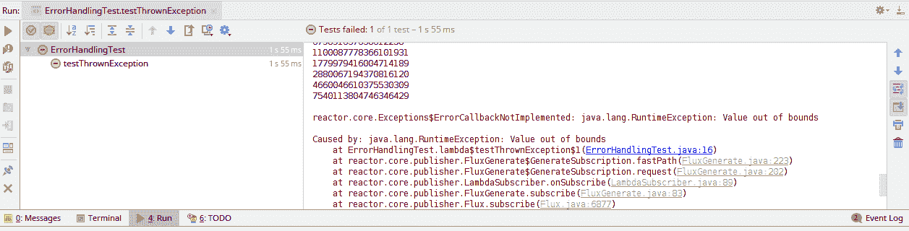

在先前的执行中，你可以看到以下情况：

1.  所有正数值首先打印到控制台。

1.  抛出的异常被传播到订阅者。

1.  由于没有配置错误函数，订阅者引发`ErrorCallbackNotImplemented`异常。

1.  异常导致测试用例失败。

在先前的测试执行中，请注意我们没有引发错误事件。然而，当抛出异常时，Reactor 引发了错误事件。然后该事件在订阅者端被处理。

现在，让我们增强我们的测试用例，并在处理订阅者中的事件时引发错误，以下代码：

```java
@Test
    public void testThrownException() {
        Flux<Long> fibonacciGenerator = Flux.generate(() -> Tuples.<Long,
                Long>of(0L, 1L), (state, sink) -> {
            if (state.getT1() < 0)
                throw new RuntimeException("Value out of bounds");
            else
                sink.next(state.getT1());

            return Tuples.of(state.getT2(), state.getT1() + state.getT2());
        });
        fibonacciGenerator
                .subscribe(x -> throw new RuntimeException("Subscriber threw error"));
    }     
```

之前的代码现在执行以下操作：

1.  在事件处理器中配置一个 lambda，而不是`System.out.println`函数。

1.  lambda 抛出`RuntimeException`，而不是将数字打印到控制台。

如果我们运行前面的测试案例，输出将与我们之前的执行相似。测试案例将失败，以下为堆栈跟踪：

```java
Caused by: java.lang.RuntimeException: Subscriber threw error
    at ErrorHandlingTest.lambda$testThrownException$1(ErrorHandlingTest.java:16)
    at reactor.core.publisher.FluxGenerate$GenerateSubscription.fastPath(FluxGenerate.java:223)
    at reactor.core.publisher.FluxGenerate$GenerateSubscription.request(FluxGenerate.java:202)
    at reactor.core.publisher.LambdaSubscriber.onSubscribe(LambdaSubscriber.java:89)
    at reactor.core.publisher.FluxGenerate.subscribe(FluxGenerate.java:83)
```

观察前面的两段输出，我们可以说 Reactor 以相同的方式处理生产者和订阅者抛出的异常。订阅者必须提供一个错误函数，以便 Reactive Streams 能够成功完成。

我们还有一个场景尚未处理。在生产者中，我们不是抛出`RuntimeException`，而是必须引发一个错误事件。这可以通过将`throw new RuntimeException`替换为`sink.error(e)`来实现，如下所示：

```java
  @Test
    public void testErrorRaised() {
        Flux<Long> fibonacciGenerator = Flux.generate(() -> Tuples.<Long,
                Long>of(0L, 1L), (state, sink) -> {
            if (state.getT1() < 0)
                sink.error(new RuntimeException("Value out of bounds"));
            else           
                // Rest removed for Brevity
        });
    }
```

我将把确定前一个测试案例输出的任务留给读者。所有讨论过的测试案例都失败了，因为缺少错误回调处理程序。因此，我们必须为订阅者定义一个错误函数。这可以通过在`subscriber()` API 中传递一个额外的 lambda 函数来实现。为此，请考虑以下代码：

```java
   @Test
    public void testErrorRaised() {

        // Rest Removed for Brevity

        fibonacciGenerator
                .subscribe(System.out::println, System.out::println);
    }
```

在前面的代码中，我们在消费者和错误消费者事件中传递了`println`函数。因此，订阅者将同时将这两个事件打印到控制台。现在，运行我们之前失败的测试案例；它们将错误打印到控制台，然后成功完成。这如图所示：

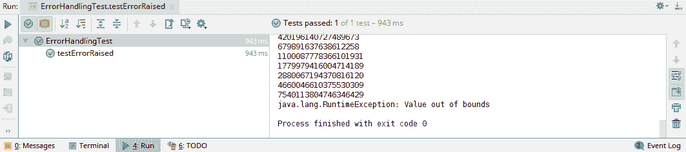

# 检查异常

我们不能从生产者和订阅者抛出检查异常。每个相应的 Reactor 方法都接受一个没有异常声明的`Consumer`函数。因此，实现不能抛出它。然而，存在一些场景，其中生产者调用资源，如文件，这些资源可以抛出检查异常。Reactor 提供了`Exceptions`实用类来处理这些场景。`Exceptions`类提供了一个`propagate`方法，可以将任何检查异常包装为非检查异常，如下所示：

```java
      @Test
    public void testCheckedExceptions() {
        Flux<Long> fibonacciGenerator = Flux.generate(() -> Tuples.<Long,
                Long>of(0L, 1L), (state, sink) -> {
            try {
                raiseCheckedException();
            } catch (IOException e) {
                throw Exceptions.propagate(e);
            }
            return Tuples.of(state.getT2(), state.getT1() + state.getT2());
        });
        fibonacciGenerator
                .subscribe(System.out::println,
                 e -> Exceptions.unwrap(e));
    }

    void raiseCheckedException() throws IOException {
        throw new IOException("Raising checked Exception");
    }

```

在前面的代码中，我们做了以下操作：

1.  检查`raiseCheckedException`方法是否抛出`IOException`

1.  使用`Exception.propagate`包装异常并将其抛回

1.  使用`Exception.unwrap`获取原始的检查异常

接下来，让我们从一些`try...catch`错误类型开始。

# doOnError 钩子

我们在第二章中讨论了生命周期钩子，*Reactor 中的发布者和订阅者 API*。这些可以用于为每个生命周期事件配置回调。Reactor 提供了生命周期错误回调钩子来配置错误处理器。`doOnError`钩子允许我们消费错误并执行预期的功能。如果我们已经配置了`doOnError`钩子和错误回调，那么它们将由 Reactor 同时调用。以下代码展示了这一点：

```java
    @Test
    public void testDoError() {
        // Removed for brevity
        fibonacciGenerator
                .doOnError(System.out::println)
                .subscribe(System.out::println, e -> e.printStackTrace());
    }
```

上述代码执行以下操作：

1.  在`doOnError`钩子中配置`println`函数。此函数将错误打印到控制台。

1.  在订阅者 API 中配置错误 lambda。实现打印抛出的异常的堆栈跟踪。

让我们运行前面的测试用例并验证控制台上打印的输出。两个错误函数同时被调用，如下所示：

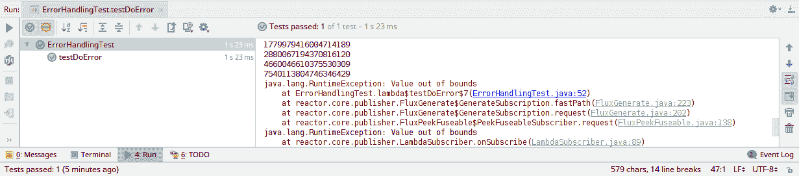

# `doOnTerminate`钩子

与`doOnError`生命周期钩子类似，存在`doOnTerminate`钩子。这是一个通用的钩子，在`on completion`和`on error`流终止事件时被调用。与提供异常抛出的特定错误钩子不同，此钩子不提供任何类型的输入。它只是执行提供的 lambda 表达式。需要注意的是，`doOnTerminate`钩子在我们收到终止事件时立即被调用。它不会等待错误回调被处理。考虑以下代码：

```java
    @Test
    public void testDoTerminate() {
       // Removed for brevity
        fibonacciGenerator
                .doOnTerminate(() -> System.out.println("Terminated"))
                .subscribe(System.out::println,e -> e.printStackTrace() );
    }
```

上述代码执行以下操作：

1.  在`doOnTerminate`钩子中配置`println`函数。此函数将`Terminated`打印到控制台。

1.  在订阅者 API 中配置错误 lambda。此实现打印抛出的异常的堆栈跟踪。

让我们运行前面的测试用例并验证控制台上打印的输出。两个函数同时被调用，如下所示：

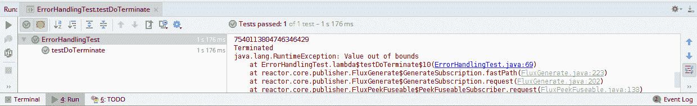

与`doOnTerminate`生命周期钩子类似，存在一个`doAfterTerminate`生命周期钩子。此钩子在将关闭事件传递给订阅者之后被调用。就像`doOnTerminate`钩子一样，`doAfterTerminate`是一个通用的钩子，不提供任何事件。由于钩子在事件传递后被调用，它需要错误回调订阅者配置。如果我们不提供它，流将因`ErrorCallbackNotImplemented`异常而失败。

# `doFinally`钩子

与`doOnError`生命周期钩子类似，存在`doFinally`钩子。此钩子在流完成之后被调用。钩子执行提供的 lambda 表达式。需要注意的是，`doFinally`钩子在流关闭回调处理之后被调用，与之前讨论的`doOnTerminate`钩子不同，后者在收到关闭事件时立即被调用。考虑以下代码：

```java
    @Test
    public void testDoFinally() {
        Flux<Long> fibonacciGenerator = Flux.generate(() -> Tuples.<Long,
                Long>of(0L, 1L), (state, sink) -> {
            if (state.getT1() < 0)
                sink.error(new RuntimeException("Value out of bounds"));
            else
                sink.next(state.getT1());

            return Tuples.of(state.getT2(), state.getT1() + state.getT2());
        });
        fibonacciGenerator
                .doFinally( x -> System.out.println("invoking finally"))
                .subscribe(System.out::println, e -> e.printStackTrace());
    }
```

上述代码执行以下操作：

1.  `fibonacciGenerator`在负值上引发错误。

1.  它在`doFinally`钩子中配置`println`函数。该函数将`invoking finally`打印到控制台。

1.  它在订阅者 API 中配置错误 lambda。实现打印抛出的异常的堆栈跟踪。

让我们运行前面的测试用例并验证控制台上打印的输出，如下所示：

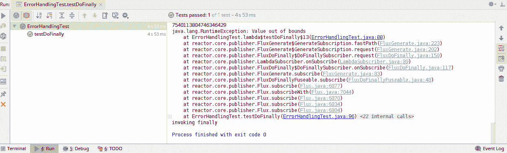

作为`doFinally`钩子的替代，有`Flux.using` API。此 API 为发布者配置一个资源映射。它还配置了一个回调 lambda，当流关闭时，会使用相应的发布者资源调用它。这与 Java 的`try-with-resource` API 同义：

```java
 @Test
    public void testUsingMethod() {
        Flux<Long> fibonacciGenerator = Flux.generate(() -> Tuples.<Long,
                Long>of(0L, 1L), (state, sink) -> {
            if (state.getT1() < 0)
                sink.complete();
            else
                sink.next(state.getT1());

            return Tuples.of(state.getT2(), state.getT1() + state.getT2());
        });
        Closeable closable = () -> System.out.println("closing the stream");
        Flux.using(() -> closable, x -> fibonacciGenerator, e -> {
            try {
                e.close();
            } catch (Exception e1) {
                throw Exceptions.propagate(e1);
            }
        }).subscribe(System.out::println);
    }
```

前面的代码执行以下操作：

1.  它通过调用`Using` API 生成一个`Flux<Long>`。

1.  它将一个`closable`实例映射到`fibonacciGenerator`的一个实例。

1.  它在流完成时调用`close`方法。`close`方法可能会抛出检查型异常，因此使用`Exceptions.propagate`来包装错误。

让我们运行前面的测试用例并验证控制台上打印的输出，如下所示：

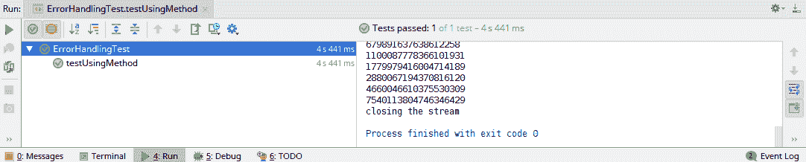

# 错误恢复

在前面的部分中，我们确定了如何配置错误回调。然而，在执行错误处理时，我们可能会遇到我们想要使用一些替代值继续执行的情况。此类场景有众多用例。例如，报价聚合系统在获取最新 tick 值时可能会抛出错误，但聚合必须使用最后一个值继续。在接下来的章节中，我们将介绍每个提供的算子，以便完成此操作。

# `onErrorReturn`算子

Reactor 提供了`OnErrorReturn`算子，在发生错误时提供回退值。由于回退，原始错误事件不会被传播到错误回调。事件处理通过使用事件处理器继续，如下所示：

```java
    @Test
    public void testErrorReturn() {
        Flux<Long> fibonacciGenerator = Flux.generate(() -> Tuples.<Long,
                Long>of(0L, 1L), (state, sink) -> {
            if (state.getT1() < 0)
                sink.error(new RuntimeException("Value out of bounds"));
            else
                sink.next(state.getT1());

            return Tuples.of(state.getT2(), state.getT1() + state.getT2());
        });
        fibonacciGenerator
                .onErrorReturn(0L)
                .subscribe(System.out::println);
    }
```

在前面的代码中，以下适用：

1.  使用`onErrorReturn`算子，当订阅者收到错误时提供`0`。

1.  订阅者 API 中没有配置错误回调

让我们运行我们的测试用例并验证对前面代码的理解：

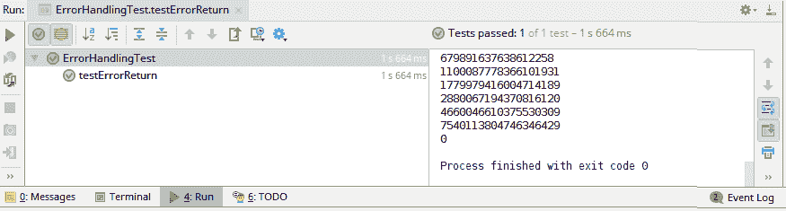

`onErrorReturn`算子也提供了针对特定异常的处理。这是一个重载方法，它接受异常类以及一个回退值。Reactor 通过验证抛出的异常是否是配置的异常的实例来选择它找到的第一个匹配项。因此，我们必须首先配置最具体的异常匹配，最后配置最通用的异常匹配。现在，让我们编写一个测试用例来验证异常处理，如下所示：

```java
      @Test
    public void testErrorReturn() {
        Flux<Long> fibonacciGenerator = Flux.generate(() -> Tuples.<Long,
                Long>of(0L, 1L), (state, sink) -> {
            if (state.getT1() < 0)
                sink.error(new IllegalStateException("Value out of bounds"));
         // Removed for Brevity
        });
        fibonacciGenerator                
                .onErrorReturn(RuntimeException.class,0L)
                .onErrorReturn(IllegalStateException.class,-1L)
                .subscribe(System.out::println);
    }
```

在前面的代码中，我们现在抛出的是`IllegalStateException`，而不是`RuntimeException`。`IllegalStateException`是`RuntimeException`的一个子类型。订阅者被配置为处理这两种异常。在此处需要注意配置的顺序。`RuntimeException`被首先配置，默认值为`0`，而`IllegalStateException`的值为`-1`。Reactor 会将抛出的异常与`RuntimeException`进行匹配。在这里运行测试用例并验证结果。

最后，还有一个`onErrorReturn`，它通过验证与提供的谓词匹配来匹配异常。配置的谓词接受抛出的异常作为输入，并返回一个布尔结果。在这里，我们也配置了多个谓词。Reactor 将选择第一个匹配的谓词并使用其回退值。

# `onErrorResume`运算符

与`OnErrorReturn`运算符类似，存在`OnErrorResume`运算符，它提供一个回退值流而不是单个回退值。在发生错误的情况下，返回回退流。原始错误事件不会被传播到错误回调。事件处理通过使用配置的事件处理器继续，如下所示：

```java
    @Test
    public void testErrorResume() {
        Flux<Long> fibonacciGenerator = Flux.generate(() -> Tuples.<Long,
                Long>of(0L, 1L), (state, sink) -> {
          // Removed for Brevity
        });
        fibonacciGenerator
                .onErrorResume(x -> Flux.just(0L,-1L,-2L))
                .subscribe(System.out::println);
    }
```

在前面的代码中，以下适用：

1.  `onErrorResume`运算符用于在订阅者收到任何错误时提供回`Flux<Long>`。

1.  订阅者 API 中没有配置错误回调。

让我们运行我们的测试用例并验证我们的理解，如下所示：

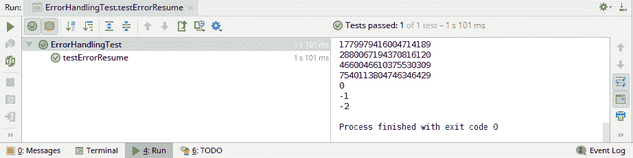

与`onErrorReturn`的行类似，`onErrorResume`运算符被重载以提供基于特定异常的回退值。异常可以直接提供，或者可以使用谓词进行匹配。Reactor 将选择第一个匹配的值。

# `onErrorMap`运算符

Reactor 的`onErrorMap`运算符允许我们将一种类型的异常转换为另一种类型。与前面的两个运算符不同，`onErrorMap`运算符需要与订阅者一起配置错误回调。如果没有配置处理程序，则订阅者会抛出`ErrorCallbackNotImplemented`异常。`onErrorMap`运算符提供了重载函数，类似于前面的运算符，可以用于根据类型或提供的谓词匹配异常。

现在，让我们构建一个简单的测试用例来验证我们对`onErrorMap`运算符的理解：

```java
    @Test
    public void testErrorMap() {
        Flux<Long> fibonacciGenerator = Flux.generate(() -> Tuples.<Long,
                Long>of(0L, 1L), (state, sink) -> {
           // Removed for brevity
        });
        fibonacciGenerator
                .onErrorMap(x -> new IllegalStateException("Publisher threw error", x))
                .subscribe(System.out::println,System.out::println);
    }
```

在前面的代码中，以下适用：

1.  `onErrorMap`运算符配置为在订阅者收到任何错误时抛出`IllegalStateException`。

1.  错误回调是在订阅者 API 中配置的。

让我们运行它并确认输出，如下所示：

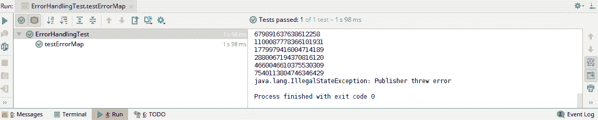

# 超时

如前几节所述，及时响应是反应式系统的一个重要方面。这个要求意味着反应式系统必须及时提供确定性的响应。然而，所有软件系统本质上都是不可靠的。底层网络本身是不可靠的。所有组件都可能失败而不提供响应。因此，具有流式结果系统的可能会卡在等待响应的状态。

解决这种不可靠性的方法之一是采用快速失败系统设计。这种设计规定系统对正常操作做出一些假设，并且一旦这些假设被打破，系统必须立即失败。这导致可能的问题被提前报告。为了做到这一点，我们必须假设一个可能的响应时间，这是最常见的快速失败指标。如果在规定时间内没有收到响应，那么系统必须触发后备/错误响应。

Reactor 提供了 `timeout()` 操作符以启用响应时间检查。当在特定时间间隔内没有收到响应时，超时失败。一旦超时到期，它将触发为订阅者配置的错误回调。让我们通过以下代码验证操作符：

```java
    @Test
    public void testTimeout() throws  Exception{
        Flux<Long> fibonacciGenerator = Flux.generate(() -> Tuples.<Long,
                Long>of(0L, 1L), (state, sink) -> {
            if (state.getT1() < 0)
                throw new RuntimeException("Value out of bounds");
            else
                sink.next(state.getT1());

            return Tuples.of(state.getT2(), state.getT1() + state.getT2());
        });
        CountDownLatch countDownLatch = new CountDownLatch(1);
        fibonacciGenerator
                .delayElements(Duration.ofSeconds(1))
                .timeout(Duration.ofMillis(500))
                .subscribe(System.out::println, e -> {
                    System.out.println(e);
                    countDownLatch.countDown();
                });
        countDownLatch.await();
    }
```

在前面的代码中，以下适用：

1.  `delayElements` 操作符负责通过配置的时间减慢每个元素。在我们的例子中，它在一秒后发送每个元素。

1.  `timeout()` 操作符被配置为 `500` 毫秒的间隔。当它首次发现延迟超过 `500` 毫秒时，此操作符将引发错误。

1.  为订阅者配置了 `onError` 回调。我们还添加了一个 `CountDownLatch`，因为我们想保持测试执行直到接收到错误。

让我们运行它并确认输出，如下所示：

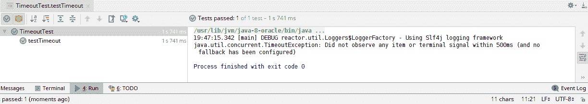

`timeout()` 操作符还提供在超时触发时提供后备 `Flux<>` 值的功能。在这种情况下，后备值不会抛出超时错误。因此，它不会触发配置的错误回调。相反，流程作为后续事件执行，如下所示：

```java
    @Test
    public void testTimeoutWithFallback() throws  Exception{
     // Removed for brevity 
    fibonacciGenerator
                .delayElements(Duration.ofSeconds(1))
                .timeout(Duration.ofMillis(500),Flux.just(-1L))
                .subscribe(e -> {
                    System.out.println(e);
                    countDownLatch.countDown();
                });
        countDownLatch.await();
    }
```

在前面的代码中，以下适用：

1.  `delayElements` 操作符负责通过配置的时间减慢每个元素。在我们的例子中，它在一秒后发送每个元素。

1.  `timeout()` 操作符被配置为 `500` 毫秒的间隔。当它首次发现延迟超过 `500` 毫秒时，此操作符将引发错误。操作符还有一个后备的 Flux。一旦超时到期，将返回后备值。

1.  `onNext` 处理器被配置为打印接收到的值。我们添加了一个 `CountDownLatch`，因为我们想保持测试执行直到接收到值。

1.  没有配置 `onError` 回调。

让我们运行它并验证输出，如下所示：

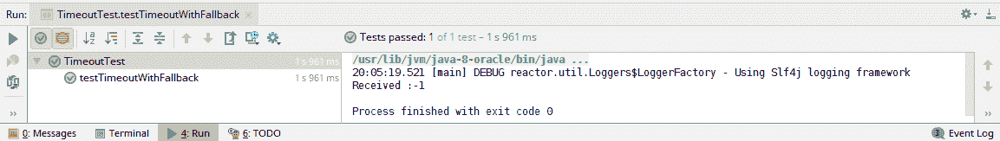

当我们讨论错误和超时时，重要的是要提到 `retry` 操作符。此操作符允许我们在发现错误时重新订阅发布的流。重试只能执行固定次数。重新订阅的事件由订阅者作为后续事件处理。如果流正常完成，则不会进行后续的重试。错误回调仅在最后重试周期中抛出错误时触发：

```java
    @Test
    public void testRetry() throws  Exception{

      // Removed for brevity

        CountDownLatch countDownLatch = new CountDownLatch(1);
        fibonacciGenerator
                 .retry(1)
                .subscribe(System.out::println, e -> {
                    System.out.println("received :"+e);
                    countDownLatch.countDown();
                },countDownLatch::countDown);
        countDownLatch.await();
    }
```

在前面的代码中，以下适用：

1.  `delayElements`运算符负责通过配置的时间减慢每个元素。在我们的例子中，它在一秒延迟后发送每个元素。

1.  `timeout()`运算符被配置为`500`毫秒的间隔。当运算符首次发现延迟超过`500`毫秒时，它将引发一个错误。运算符还有一个回退 Flux。一旦超时到期，将返回回退值。

1.  `onNext`处理器被配置为打印接收到的值。我们添加了一个`CountDownLatch`，因为我们想保持测试执行直到接收到值。

1.  没有配置`onError`回调。

让我们运行它并验证输出，如下所示：

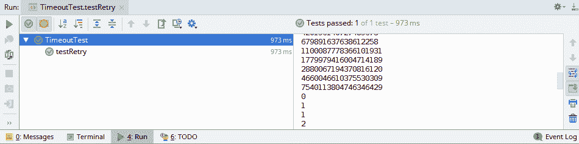

# WebClient

在第六章“动态渲染”中，我们讨论了使用 Spring WebClient 以非阻塞和异步方式执行网络调用。我们迄今为止讨论的运算符适用于反应式流发布者和订阅者。WebClient 还产生一个`ServerResponse`的单子发布者。那么，我们应该如何处理 WebClient 中生成的错误并生成有效的响应？首先，让我们看看 WebClient 对服务器端错误的默认处理。为此，我们应该首先在我们的 Fibonacci 处理函数中生成错误，如下所示：

```java
   @Bean
    RouterFunction<ServerResponse> fibonacciEndpoint() {
        Flux<Long> fibonacciGenerator = Flux.generate(() -> Tuples.<Long,
                Long>of(0L, 1L), (state, sink) -> {
            throw new RuntimeException("Method unsupported");         
        });
      RouterFunction<ServerResponse> fibonacciRoute =
                RouterFunctions.route(RequestPredicates.path("/fibonacci"),
                        request ->  ServerResponse.ok()
                                    .body(fromPublisher(fibonacciGenerator, Long.class)));

        return fibonacciRoute;
    }
```

在前面的代码中，我们修改了我们的生成器以引发`RuntimeException`。异常将在服务器构建响应时立即引发。这反过来又发送了带有异常消息主体的 HTTP 500 状态错误：

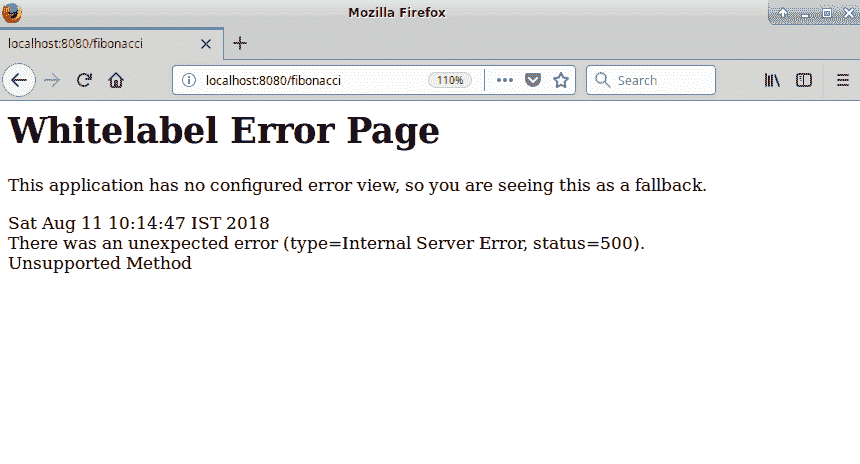

或者，我们可以使用`sink.error()`方法引发错误。此方法将接受一个异常实例并将其抛回。它还将引发一个 500 状态码，并带有`out of bound`错误消息，如下所示：

```java
@Bean
RouterFunction<ServerResponse> fibonacciEndpoint() {
    Flux<Long> fibonacciGenerator = Flux.generate(() -> Tuples.<Long,
            Long>of(0L, 1L), (state, sink) -> {
        if (state.getT1() < 0)
            sink.error(new RuntimeException("out of bound"));
        else
            sink.next(state.getT1());
        return Tuples.of(state.getT2(), state.getT1() + state.getT2());
    });

    // Rest removed for Brevity

    return fibonacciRoute;
}
```

我们将通过使用 WebClient 调用前面的 URL 来理解其默认行为。让我们回顾一下第六章“动态渲染”中的 WebClient 示例：

```java
Flux<Long> result = client.get()
        .uri("/fibonacci")
        .retrieve().bodyToFlux(Long.class)
        .limitRequest(10L);
result.subscribe( x-> System.out.println(x));
```

在前面的代码中，以下适用：

1.  我们调用了`/fibonacci` URL。

1.  我们使用`retrieve`方法转换了主体。

1.  我们使用限制运算符选择了 10 个结果。

1.  最后，结果被打印到控制台。

注意，没有配置显式的错误处理器；运行代码以查看其响应。当它从服务器接收到错误状态码时，代码不会生成任何输出或转换主体。或者，让我们在订阅者方法中配置一个错误处理器并打印异常，如下所示：

```java
result.subscribe( x-> System.out.println(x), e-> e.printStackTrace);
```

现在，让我们执行 WebClient 代码以确定输出：

```java
org.springframework.web.reactive.function.client.WebClientResponseException: ClientResponse has erroneous status code: 500 Internal Server Error
    at org.springframework.web.reactive.function.client.DefaultWebClient$DefaultResponseSpec.lambda$createResponseException$7(DefaultWebClient.java:464)
    at reactor.core.publisher.FluxMap$MapSubscriber.onNext(FluxMap.java:100)
    at 
 ...............
```

有趣的是，这次我们可以看到一个带有状态码作为错误信息的`WebClientResponseException`。如果我们查看`WebClientResponseException`类，该异常允许我们获取响应文本、状态码等。将错误类型转换为字符串并打印响应文本将生成以下输出：

```java
{"timestamp":1533967357605,"path":"/fibonacci","status":500,"error":"Internal Server Error","message":"Unsupported Method"}
```

注意 WebClient API 的行为。尽管流生成了错误，但我们从未看到`ErrorCallbackNotImplemented`异常，这与没有配置错误处理器的 Reactive Stream 订阅者的行为不同。

WebClient 与之前章节中讨论的`onError`运算符配合良好。我们可以配置`onErrorReturn`或`onErrorResume`运算符。这将提供回退值，在发生错误时返回，如下所示：

```java
Flux<Long> result = client.get()
        .uri("/fibonacci")
        .retrieve()
        .bodyToFlux(Long.class)
        .onErrorResume( x -> Flux.just(-1L, -2L))
        .limitRequest(10L);
result.subscribe( x-> System.out.println(x));
```

现在，执行前面的代码并确认输出中的回退值。

在这里，检索 API 的 WebClient 还提供了一个`onStatus`方法来配置响应处理。`onStatus`方法接受异常映射并对其配置的 HTTP 状态码进行调用。在我们的前一个示例中，让我们尝试为 500 服务器响应抛出一个`RuntimeException`：

```java
Flux<Long> result = client.get()
        .uri("/fibonacci")
        .retrieve()
        .onStatus(HttpStatus::isError, x -> Mono.error(new 
         RuntimeException("Invalid Response ")))
        .bodyToFlux(Long.class)
        .limitRequest(10L);
```

在前面的代码中，以下适用：

+   `RuntimeException`作为`Mono.error`被抛出。

+   Mono 被配置为处理所有 HTTP 错误状态码（`4XX`，`5XX`）。

当执行前面的代码时，会抛出一个`RuntimeException`。然而，与之前的操作不同，这次异常导致了一个`ErrorCallbackNotImplemented`异常，而`WebClientResponseException`没有要求异常处理器：

```java
reactor.core.Exceptions$ErrorCallbackNotImplemented: java.lang.RuntimeException: Invalid Response 
Caused by: java.lang.RuntimeException: Invalid Response 
```

现在，我们可以配置异常映射或回退值提供程序来从抛出的异常中恢复。

# 摘要

在本章中，我们探讨了为我们的应用程序添加弹性的各种方法。首先，我们涵盖了涉及生产者和订阅者的可能错误场景。接下来，我们研究了 Reactor 在每种条件下如何执行错误处理。这使得我们能够通过使用提供的各种操作来配置 Reactor 中的所需错误处理。Reactor 允许我们通过使用`onErrorReturn`和`onErrorResume`运算符来配置抛出异常的回退值。我们还使用可用的运算符配置了超时和重试机制，以生成及时响应。最后，我们在 WebClient 中配置了错误处理。总的来说，我们探讨了在 Reactor 中配置错误处理器的可能方法。

# 问题

1.  在 Reactor 中如何处理错误？

1.  哪些运算符允许我们配置错误处理？

1.  `onErrorResume`和`onErrorReturn`之间的区别是什么？

1.  我们如何为 Reactive Stream 生成及时响应？

1.  `retry`运算符的行为如何？
