# 执行控制

在整本书中，我们一直在使用 Reactor 操作符。这包括执行各种任务，如过滤、转换和收集。大多数操作符不会创建额外的线程，只是在主线程上工作。然而，我们可以通过使用一组调度器来配置 Reactor 的多线程和并发。

在本章中，我们将涵盖以下主题：

+   调度器

+   并行处理

+   广播

# 技术要求

+   Java 标准版，JDK 8 或更高版本

+   IntelliJ IDEA IDE，2018.1 或更高版本

本章的 GitHub 链接是[`github.com/PacktPublishing/Hands-On-Reactive-Programming-with-Reactor/tree/master/Chapter09`](https://github.com/PacktPublishing/Hands-On-Reactive-Programming-with-Reactor/tree/master/Chapter09)。

# 调度器

Reactor 使用调度器之一来执行所有操作。Reactor 调度器不属于`java.util.concurrent` API。Java 并发 API 相当底层，我们可以从中启动和控制任务执行。另一方面，Reactor 链中的所有任务都由 Reactor 引擎执行。因此，我们不需要低级 API 来管理任务执行。相反，Reactor 提供了一个声明性模型，我们可以使用它来配置`Scheduler`并改变链式执行的行怍。

在我们开始配置 Reactor 之前，让我们首先确定默认的执行模型。默认情况下，Reactor 主要是单线程的。发布者和订阅者不会为它们的执行创建额外的线程。所有生命周期钩子和大多数操作符都执行单线程操作。在我们继续之前，让我们编写一些代码来验证这一点，如下所示：

```java
    @Test
    public void testReactorThread() throws Exception{
        Flux<Long> fibonacciGenerator = Flux.generate(() -> Tuples.<Long,
                Long>of(0L, 1L), (state, sink) -> {
            if (state.getT1() < 0)
               sink.complete();
            else
                sink.next(state.getT1());
            print("Generating next of "+ state.getT2());
            return Tuples.of(state.getT2(), state.getT1() + state.getT2());
        });
        fibonacciGenerator
                .filter(x -> {
                    print("Executing Filter");
                    return x < 100;
                })
                .doOnNext(x -> print("Next value is  "+x))
                .doFinally(x -> print("Closing "))
                .subscribe(x -> print("Sub received : "+x));
    }

    static void print(String text){
        System.out.println("["+Thread.currentThread().getName()+"] "+text);
    }
```

在前面的代码中，以下规则适用：

1.  我们使用`filter`操作符和生命周期钩子构建了一个简单的斐波那契链。

1.  每个操作都使用`print`函数打印到控制台。

1.  `print`函数打印当前线程名称以及文本。

以下屏幕截图显示了一个简单的调试代码片段，它允许我们看到 Reactor 如何执行流式操作。让我们运行它看看效果：

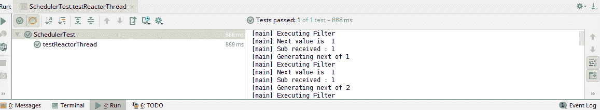

在前面的屏幕截图中，我们可以看到所有文本都带有前缀 `[main]`。因此，所有操作都在主线程上执行，Reactor 没有使用额外的线程。这个输出验证了 Reactor 默认是单线程的。由于单线程执行，我们没有使用`Thread.sleep`或`latch.wait`来暂停测试执行。

然而，前面的概念只是部分正确；Reactor 操作符确实会改变链式执行的行怍。以前，我们在测试用例中使用了`latch`和`Thread.sleep`来处理延迟和超时操作符。让我们将操作符添加到测试用例中，并分析输出，如下所示：

```java
 @Test
    public void testReactorDelayThread() throws Exception{
        // Removed for brevity

        fibonacciGenerator
                .filter(x -> {
                    print("Executing Filter");
                    return x < 100;
                }).delayElements(Duration.ZERO)
                .doOnNext(x -> print("Next value is  "+x))
                .doFinally(x -> print("Closing "))
                .subscribe(x -> print("Sub received : "+x));
        Thread.sleep(500);
    }
```

在前面的代码中，以下规则适用：

1.  我们在`filter`操作符之后添加了`delayElements`操作符。

1.  测试现在迅速终止，因此我们需要添加`Thread.sleep`来暂停主线程的执行。暂停确保整个链被执行。

让我们运行它并分析输出，如下所示：

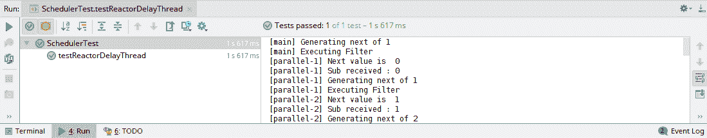

通过查看前面的输出，我们可以推断出以下内容：

+   发布者不会创建线程；它在主线程中执行。

+   `filter`操作不会创建线程；它在主线程中执行。

+   `delayElements`操作添加了一个由`parallel-1`和`parallel-2`表示的两个线程的线程池。

+   链接现在在线程池中执行，而不是主线程。

现在您已经了解了 Reactor 的线程模型，让我们讨论我们可以如何配置它。

# Reactor 调度器

如前节所述，Reactor 操作符配置反应链执行行为。然而，可以通过使用不同的调度器来改变这种行为。大多数操作符都有重载方法，这些方法接受一个调度器作为参数。在本节中，我们将查看 Reactor 中可用的各种调度器。Reactor 还提供了一个`schedulers`实用类，用于构建可用实现的实例。

# 立即调度器

`Schedulers.immediate`调度器在当前执行的线程上执行工作。所有任务都在调用线程上执行，没有任务以并行方式执行。这是大多数 Reactor 任务默认的执行模型。考虑以下代码：

```java
@Test
  public void testImmediateSchedular() throws Exception{

       // Removed for Brevity

        fibonacciGenerator
                .delayElements(Duration.ofNanos(10),Schedulers.immediate())
                .doOnNext(x -> print("Next value is  "+x))
                .doFinally(x -> print("Closing "))
            .subscribe(x -> print("Sub received : "+x));
      Thread.sleep(500);
 }
```

在前面的代码中，发生了以下情况：

1.  我们向我们的链中添加了`delayElements`操作符。

1.  测试尝试在主线程上调度延迟。

我们可以执行代码，但任务将失败，因为主线程缺乏基于时间的调度能力。以下截图显示了这一点：

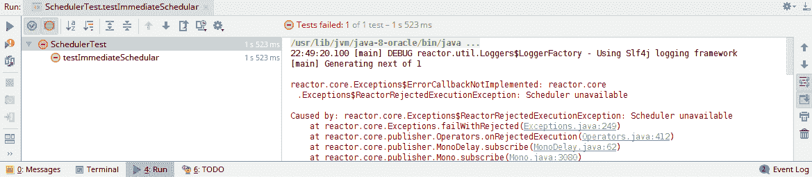

# 单个调度器

`Schedulers.single`调度器在单个工作线程池上执行工作。由于这是一个单个工作者，所有任务都是逐个执行的，没有任务是以并发方式执行的。调度器对于将非线程安全操作的执行隔离到单个线程中非常有用。考虑以下代码：

```java
@Test
  public void testSingleScheduler() throws Exception{

       // Removed for Brevity

        fibonacciGenerator
                .delayElements(Duration.ofNanos(10),Schedulers.single())
                .doOnNext(x -> print("Next value is  "+x))
                .doFinally(x -> print("Closing "))
           .subscribe(x -> print("Sub received : "+x));
      Thread.sleep(500);
 }
```

在前面的代码中，发生了以下情况：

1.  我们向我们的链中添加了`delayElements`操作符。

1.  测试尝试在单个线程上调度延迟，而不是在测试执行的主线程上。

从输出中，我们可以验证链中的所有任务都是在`single-1`线程上执行的。考虑以下截图：

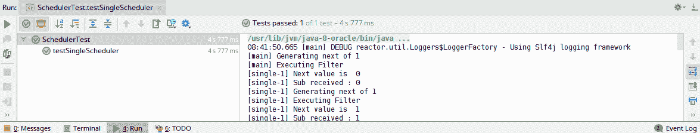

这里，`single`调度器是用来执行非阻塞、计算密集型操作的。这可以被视为一个事件循环，在其队列中执行非阻塞任务。如果我们调用任何反应式阻塞 API，调度器会抛出以下错误：

```java
 @Test
    public void testSingleSchedulerBlockingOps() throws Exception{
       // Removed for Brevity
        fibonacciGenerator
                .filter(x -> {
                    print("Executing Filter");
                    return x < 100;
                }).delayElements(Duration.ZERO,Schedulers.single())
                .window(10)
                .doOnNext(x -> print("Next value is  "+x))
                .doFinally(x -> print("Closing "+x))
                .subscribe(x -> print("Sub received : "+x.blockFirst()));
        Thread.sleep(500);
    }
```

除了之前讨论的链之外，在之前的代码中还发生了以下情况：

1.  我们调用了`window`操作符来生成每个包含`10`个元素的批次。

1.  订阅者调用了`blockFirst` API 来获取第一个元素。

执行前面的代码会导致以下异常：

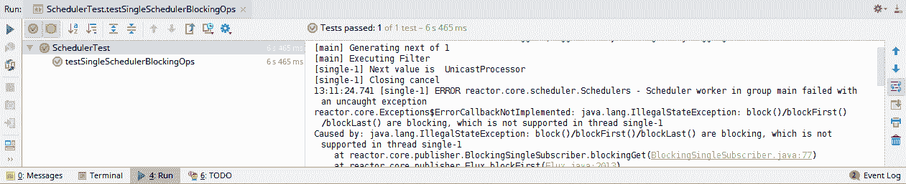

# 并行调度器

`Schedulers.parallel`调度器在多个工作线程池上执行工作。它根据可用的处理器数量创建工作线程。这是在 Reactor 操作符中使用的默认调度器。考虑以下代码：

```java
@Test
    public void testParalleScheduler() throws Exception{

       // Removed for Brevity

        fibonacciGenerator
                .delayElements(Duration.ofNanos(10),Schedulers.parallel())
                .doOnNext(x -> print("Next value is  "+x))
                .doFinally(x -> print("Closing "))
           .subscribe(x -> print("Sub received : "+x));
      Thread.sleep(500);
 }
```

从输出中，我们可以验证链中的所有任务都是在`paralle-1`和`parallel-2`线程上执行的。查看以下截图：

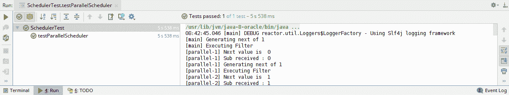

与`single`调度器类似，`parallel`调度器旨在执行非阻塞任务。如果操作调用了任何响应式阻塞 API，调度器将抛出以下异常：

```java
Caused by: java.lang.IllegalStateException: block()/blockFirst()/blockLast() are blocking, which is not supported in thread parallel-1
    at reactor.core.publisher.BlockingSingleSubscriber.blockingGet(BlockingSingleSubscriber.java:77)
    at reactor.core.publisher.Flux.blockFirst(Flux.java:2013)
    at SchedulerTest.lambda$testSingleSchedulerBlockingOps$27(SchedulerTest.java:116)
```

# 弹性调度器

`Schedulers.elastic`调度器在多个工作线程池上执行工作。每个执行的工作线程都可以执行需要阻塞操作的长任务。任务完成后，每个工作线程返回到池中。与工作线程相关联的还有空闲时间，在此之后，工作线程将被销毁。调度器试图消耗现有的空闲工作线程，如果没有，调度器将动态生成一个，并将任务调度到它上面。以下代码展示了这一点：

```java
@Test
    public void testElasticSchedular() throws Exception{

       // Removed for Brevity

        fibonacciGenerator
                .filter(x -> {
                    print("Executing Filter");
                    return x < 100;
                }).delayElements(Duration.ZERO,Schedulers.elastic())
                .window(10)
                .doOnNext(x -> print("Next value is  "+ x))
                .doFinally(x -> print("Closing "+x))
                .subscribe(x -> print("Sub received : "+x.blockFirst()));
      Thread.sleep(500);
 }
```

与之前的工人类似，一个阻塞的响应式调用在弹性调度器上成功执行。查看以下截图：

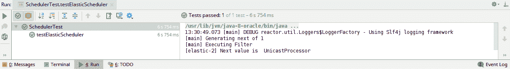

# ExecutorService 调度器

`Schedulers.fromExecutor`使我们能够在 Java `ExecutorService`上构建一个调度器。调度器不拥有线程生成，而是由底层的`ExecutorService`控制。不应优先考虑其他调度器，因为`ExecutorService`的生命周期必须由开发者管理。考虑以下代码：

```java
 @Test
    public void testExecutorScheduler() throws Exception{
        // Removed for Brevity

        ExecutorService executor = Executors.newSingleThreadExecutor();
        fibonacciGenerator
                .filter(x -> {
                    print("Executing Filter");
                    return x < 100;
                }).delayElements(Duration.ZERO,Schedulers.fromExecutor(executor))
                 .doOnNext(x -> print("Next value is  "+ x))
                .doFinally(x -> print("Closing "+executor.isShutdown()))
                .subscribe(x -> print("Sub received : "+x));
        Thread.sleep(5000);
        print("Is shutdown ? "+executor.isShutdown());
    }
```

在以下输出中，我们可以验证在执行我们的响应式链之后，服务仍在运行：

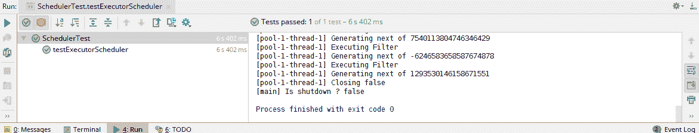

# 并行处理

Reactor 发布者和订阅者不会创建线程。然而，如前节所示，有一些操作符可以改变这种行为。在最后一节中，我们看到了`delay`操作符将 Reactor 链的执行从主线程移动到调度线程。但是，我们不需要延迟/超时操作符来切换执行。Reactor 提供了`publishOn`和`subscribeOn`操作符来切换链执行。这两个操作符都将响应式链的执行上下文更改为配置的调度器。

# PublishOn 操作符

`publishOn`操作符在执行链中配置的点拦截发布者的事件，并将它们发送到链的其余部分的另一个调度器。因此，该操作符改变了下游反应链的线程上下文。需要注意的是，该操作符仅影响下游事件链。它不改变上游链，并让上游执行保持默认执行模型。以下代码展示了这一点：

```java
    @Test
    public void testReactorPublishOn() throws Exception{
        Flux<Long> fibonacciGenerator = Flux.generate(() -> Tuples.<Long,
                Long>of(0L, 1L), (state, sink) -> {
            if (state.getT1() < 0)
                sink.complete();
            else
                sink.next(state.getT1());
            print("Generating next of "+ state.getT2());
            return Tuples.of(state.getT2(), state.getT1() + state.getT2());
        });
        fibonacciGenerator
                .publishOn(Schedulers.single())
                .filter(x -> {
                    print("Executing Filter");
                    return x < 100;
                })
                .doOnNext(x -> print("Next value is  "+x))
                .doFinally(x -> print("Closing "))
                .subscribe(x -> print("Sub received : "+x));
        Thread.sleep(500);
    }
```

在前面的代码中，以下规则适用：

1.  我们在`filter`操作符之前配置了`publishOn`操作符。这应该会保留主线程上的生成，并在调度器上执行链的其余部分。

1.  我们为链式执行配置了`single`调度器。

1.  由于我们不在主线程上执行链，我们必须暂停测试执行一段时间。这是通过使用`Thread.sleep`来实现的。

让我们执行测试用例并确定输出。发布者在`main`线程上生成事件，然后传递到`single-1`线程，如下面的截图所示：

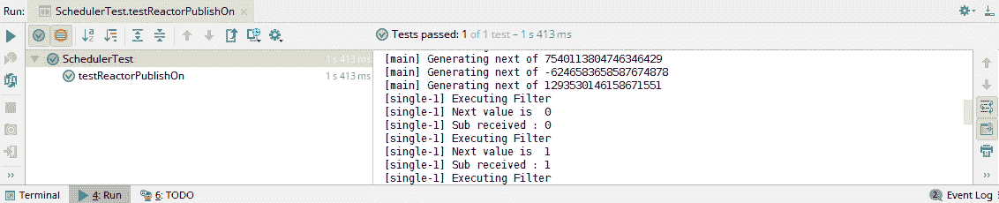

# SubscribeOn 操作符

`subscribeOn`操作符拦截执行链中的发布者事件，并将它们发送到链的另一个调度器。需要注意的是，该操作符改变了整个链的执行上下文，与仅改变下游链执行的`publishOn`操作符不同：

```java
@Test
    public void testReactorSubscribeOn() throws Exception{
        Flux<Long> fibonacciGenerator = Flux.generate(() -> Tuples.<Long,
                Long>of(0L, 1L), (state, sink) -> {
            if (state.getT1() < 0)
                sink.complete();
            else
                sink.next(state.getT1());
            print("Generating next of "+ state.getT2());
            return Tuples.of(state.getT2(), state.getT1() + state.getT2());
        });
        fibonacciGenerator                
                .filter(x -> {
                    print("Executing Filter");
                    return x < 100;
                })
                .doOnNext(x -> print("Next value is  "+x))
                .doFinally(x -> print("Closing "))
                .subscribeOn(Schedulers.single())
                .subscribe(x -> print("Sub received : "+x));
      Thread.sleep(500);
 }
```

在前面的代码中，我们做了以下操作：

1.  在订阅之前配置了`subscribeOn`操作符。

1.  配置了用于链式执行的`single`调度器。

1.  由于我们不在主线程上执行链，我们必须暂停测试执行一段时间。这是通过使用`Thread.sleep`来实现的。

让我们执行测试用例并验证输出。所有事件都是在由`subscribeOn`操作符配置的单个线程上生成的：

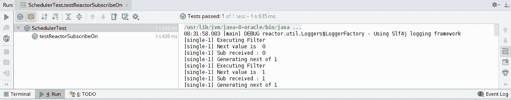

我们在同一个链中有了`subscribeOn`和`publishOn`操作符。`subscribeOn`操作符将在配置的调度器上执行完整的反应链。然而，`publishOn`操作符将下游链改为指定的调度器。它将上游链留在由`subscribeOn`调度器配置的调度器上：

```java
 @Test
    public void testReactorComposite() throws Exception{
      // Removed for Brevity
        fibonacciGenerator
                .publishOn(Schedulers.parallel())
                .filter(x -> {
                    print("Executing Filter");
                    return x < 100;
                })
                .doOnNext(x -> print("Next value is  "+x))
                .doFinally(x -> print("Closing "))
                .subscribeOn(Schedulers.single())
                .subscribe(x -> print("Sub received : "+x));
        Thread.sleep(500);
    }
```

前面的代码将在由`subscribeOn`操作符配置的`single-1`调度器上生成事件。链的其余部分将在由`publishOn`操作符配置的并行调度器上执行。

下面是运行前面代码后的输出：

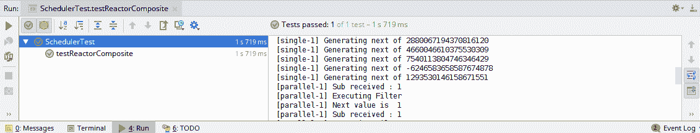

# ParallelFlux

Reactor 提供了 `ParallelFlux`，它可以将现有流分割成多个流，采用轮询方式。`ParallelFlux` 是通过 `parallel` 操作符从现有 `Flux` 创建的。默认情况下，它会将流分割成可用的 CPU 核心总数。`ParallelFlux` 只分割流，不改变执行模型。相反，它在默认线程——主线程上执行流。分割的流可以通过 `runOn` 操作符进行并行处理配置。类似于 `publishOn` 操作符，`runOn` 接收一个调度器，并在指定的调度器上执行下游操作。

需要注意的是，`ParallelFlux` 不提供 `doFinally` 生命周期钩子。可以通过使用 `sequential` 操作符将其转换回 `Flux`，然后可以使用 `doFinally` 钩子进行配置：

```java
@Test
    public void testParalleFlux() throws Exception{
      // Removed for Brevity

        fibonacciGenerator
                .parallel()
                .runOn(Schedulers.parallel())
                .filter(x -> {
                    print("Executing Filter");
                    return x < 100;
                })
                .doOnNext(x -> print("Next value is  "+x))
                .sequential()
                .doFinally(x -> print("Closing "))
                .subscribeOn(Schedulers.single())
                .subscribe(x -> print("Sub received : "+x));
        Thread.sleep(500);
    }
```

在前面的代码中，以下适用：

1.  `parallel` 操作符配置为从 `fibonacciGenerator` 生成 `ParallelFlux`。

1.  `runOn` 操作符用于在并行调度器上配置 `ParallelFlux`。

1.  使用 `sequential` 操作符将 `ParallelFlux` 转换为 Flux。

1.  `doFinally` 在 `sequential` Flux 上进行配置。

1.  `subscribeOn` 配置为在单个线程上执行 Flux 生成。

让我们运行代码并验证输出，如下所示：

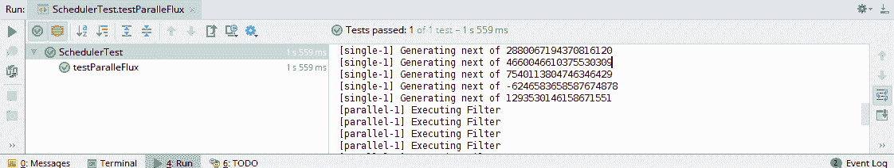

到目前为止，我们已经讨论了如何并行执行流操作。在下一节中，我们将同时将事件传递给所有订阅者，并为它们配置并行处理。

# 广播

在网络中，**广播** 被定义为向多个接收者同时发布事件。在反应式流中，这意味着向多个订阅者同时发布事件。到目前为止，我们已经订阅了冷发布者，其中每个订阅都会生成一系列新的事件。我们甚至订阅了热发布者，发布者会不断推送事件，而不等待订阅者。每个订阅者都会在事件生成后立即收到相同的事件。热发布者可能看起来像广播事件，但在事件生成流的开始方面有一个关键区别。Reactor 允许我们创建一个 `ConnecatableFlux`，它能够在开始事件生成之前等待 *n* 个订阅者。然后它会继续将每个事件发布给所有订阅者。

# 重放操作符

Reactor 提供了 `replay` 操作符，用于将 Flux 转换为 `ConnectableFlux`。生成的 `ConnectableFlux` 会持续缓冲发送给第一个订阅者的事件。缓冲区可以配置为保留最后 *n* 个条目，或者可以配置为基于时间长度。只有缓冲的事件会被回放给订阅者。

参考以下图表：

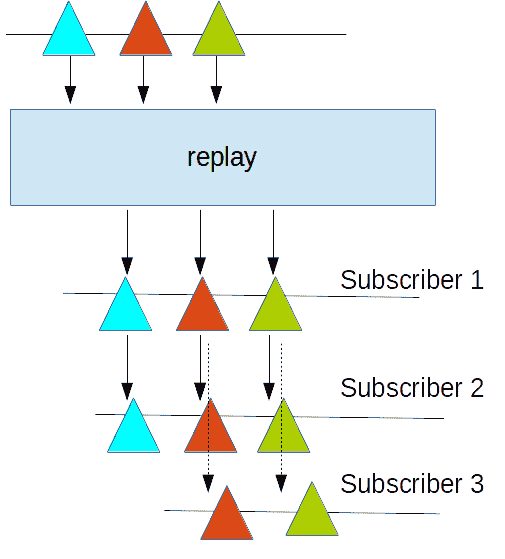

在开始发布事件之前，必须由 *n* 个订阅者订阅 `ConnectableFlux`。`ConnectableFlux` 提供以下操作符来管理订阅者：

+   **Connect**：必须在足够的订阅已经完成之后调用 `connect` 操作符。我们必须自己管理订阅计数。订阅取消也必须由开发者跟踪。

+   **Auto-Connect**：`autoConnect` 操作符配置了一个订阅计数。这会动态跟踪对发布者的订阅。最好使用 `autoConnect` 操作符，并将订阅管理留给 Reactor。

让我们看一下以下代码：

```java
   @Test
    public void testReplayBroadcast() throws Exception{
        // Removed for Brevity
        Flux<Long> broadcastGenerator=fibonacciGenerator.doFinally(x -> {
            System.out.println("Closing ");
        }).replay().autoConnect(2);

        fibonacciGenerator.subscribe(x -> System.out.println("[Fib] 1st : "+x));
        fibonacciGenerator.subscribe(x -> System.out.println("[Fib] 2nd : "+x));

        broadcastGenerator.subscribe(x -> System.out.println("1st : "+x));
        broadcastGenerator.subscribe(x -> System.out.println("2nd : "+x));
      }
```

在前面的代码中，你可以看到以下：

1.  `broadcastGenerator` 是使用 `replay` 操作符从 `fibonacciGenerator` 生成的。

1.  `broadcastGenerator` 在开始事件发布之前等待两个订阅者。

1.  `fibonacciGenerator` 也被订阅了两次。

1.  `broadcastGenerator` 也被订阅了两次。

在前面的代码中，我们已经对 `fibonacciGenerator` 和 `broadcastGenerator` 发布者进行了两次订阅。让我们运行测试用例并验证输出，如下所示：

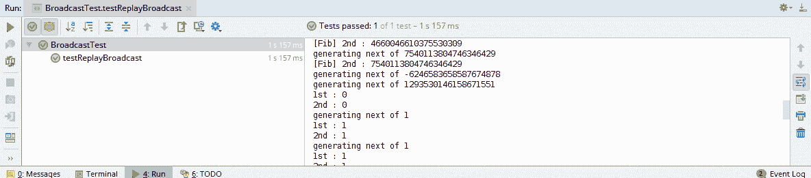

在前面的截图（输出）中，我们可以看到每当相应的发布者请求下一个值时，`fibonacciGenerator` 发布者就会被调用。然而，`broadcastGenerator` 发布者只被调用一次，在生成下一个值之前，相同的值会被发布给两个订阅者。

在前面章节中讨论的 `connect` 和 `autoConnect` 操作符，只跟踪订阅事件。这些操作符在达到配置的计数时开始处理事件。它们会一直发布事件，直到发布者发送一个终止事件。这些操作符不跟踪订阅者取消订阅；一旦事件生成开始，即使订阅者已经取消了订阅，它也会继续生成事件。

Reactor 为之前讨论的情况提供了一个 `refCount` 操作符。`refCount` 操作符也跟踪订阅情况。如果所有订阅者都取消了订阅，它将停止生成新事件，如下所示：

```java
@Test
    public void testBroadcastWithCancel() throws Exception{
        // removed for brevity

       fibonacciGenerator=fibonacciGenerator.doFinally(x ->  System.out.println("Closing "))
       .replay().autoConnect(2);

        fibonacciGenerator.subscribe(new BaseSubscriber<Long>() {
            @Override
            protected void hookOnSubscribe(Subscription subscription) {
                request(1);
            }

            @Override
            protected void hookOnNext(Long value) {
                System.out.println("1st: "+value);
                cancel();
            }
        });

        fibonacciGenerator.subscribe(new BaseSubscriber<Long>() {
            @Override
            protected void hookOnNext(Long value) {
                System.out.println("2nd : "+value);
                cancel();
            }
        });
        Thread.sleep(500);

    }
```

在前面的代码中，以下适用：

+   在开始事件发布之前，`fibonacciGenerator` 被配置为两个订阅者。

+   每个订阅者请求一个事件。

+   每个订阅者在处理生成的事件时取消其订阅。

让我们运行以下测试用例以获取输出，如下所示：

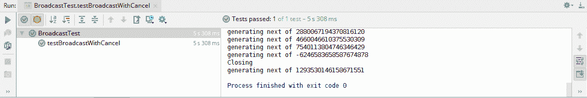

在前面的输出中，我们可以看到在流关闭之前生成了完整的斐波那契数列。订阅者没有请求超过一个事件。现在，让我们将 `autoConnect` 替换为 `refCount`，并比较输出：

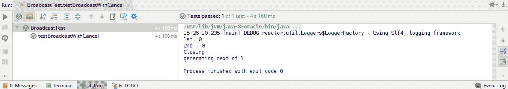

在前面的输出中，你可以看到，一旦所有订阅者取消了订阅，流就会立即关闭。现在，如果新的订阅者到达`ConnectedFlux`，序列将从第一个事件生成。

# 发布操作符

Reactor 提供了`publish`操作符来生成`ConnectedFlux`。与缓冲第一个订阅者接收到的事件的`replay`操作符不同，`publish`操作符从源流获取事件。该操作符跟踪其订阅者提出的请求。如果任何订阅者没有提出请求，它将暂停事件生成，直到所有订阅者都提出新的请求。考虑以下图示：

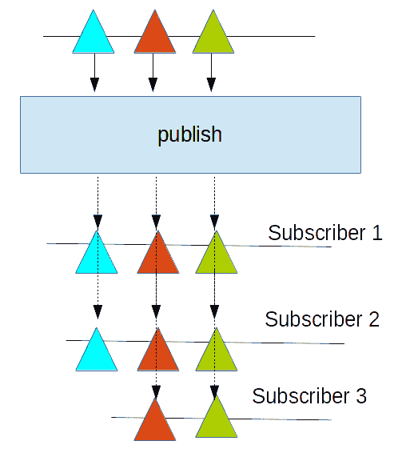

就像`replay`操作符一样，发布者生成的`ConnectedFlux`也需要订阅者管理。在这里，我们可以通过以下三种选项之一来配置它——`connect`、`autoConnect`或`refCount`：

```java
 @Test
    public void testPublishBroadcast() throws Exception{
        Flux<Long> fibonacciGenerator = Flux.generate(() -> Tuples.<Long,
                Long>of(0L, 1L), (state, sink) -> {
            if (state.getT1() < 0)
                sink.complete();
            else
                sink.next(state.getT1());
            System.out.println("generating next of "+ state.getT2());

            return Tuples.of(state.getT2(), state.getT1() + state.getT2());
        });
        fibonacciGenerator=fibonacciGenerator.doFinally(x -> {
            System.out.println("Closing ");
        }).publish().autoConnect(2);

        fibonacciGenerator.subscribe(new BaseSubscriber<Long>() {
            @Override
            protected void hookOnSubscribe(Subscription subscription) {
                request(1);
            }

            @Override
            protected void hookOnNext(Long value) {
                System.out.println("1st: "+value);
            }
        });

        fibonacciGenerator.subscribe(x -> System.out.println("2nd : "+x));
        Thread.sleep(500);

    }
```

在前面的代码中，以下适用：

1.  在开始事件发布之前，`fibonacciGenerator`被配置为两个订阅者。

1.  第一个订阅者只请求一个事件。

1.  第二个订阅者不对事件数量施加限制。

让我们运行测试用例来分析输出，如下所示：

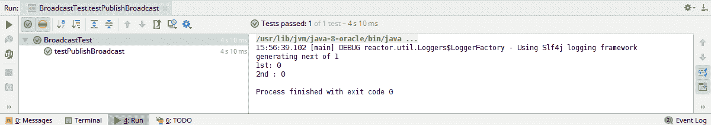

在前面的输出中，你可以看到只生成了第一个事件。也没有关闭事件，因为流正在等待订阅者一的下一个事件请求。因此，流没有终止。测试在等待了 500 毫秒后完成。

# 摘要

在本章中，我们探讨了 Reactor 执行模型。我们发现发布者和订阅者 Reactive Streams 是并发无关的。Reactor 中的大多数操作符也是并发无关的。一些操作符，如`delayElements`和`timeout`，会改变流执行并发行为。Reactor 提供了各种调度器，可用于控制流的执行行为。我们发现这些调度器可以为各种操作符进行配置，例如`publishOn`和`subscribeOn`。接下来，我们讨论了可以配置的`ParallelFlux`，以及可用的调度器，以执行并行处理。最后，我们讨论了使用`ConnectedFlux`进行事件广播。Reactor 提供了`replay`和`publishOn`操作符，从现有的 Flux 生成`ConnectedFlux`。

# 问题

1.  Reactor 中可用的不同类型的调度器有哪些？

1.  应该使用哪个调度器进行阻塞操作？

1.  应该使用哪个调度器进行计算密集型操作？

1.  `PublishOn`和`SubscriberOn`之间有什么不同？

1.  `ParallelFlux`的限制是什么？

1.  哪些操作符可用于生成`ConnectedFlux`？
