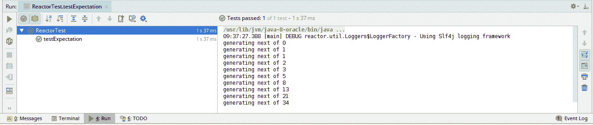
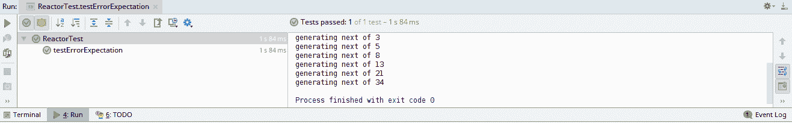
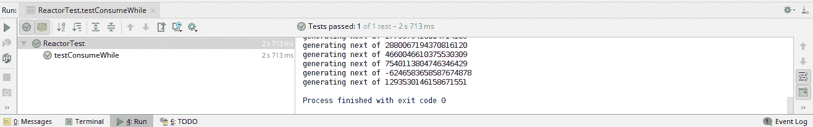
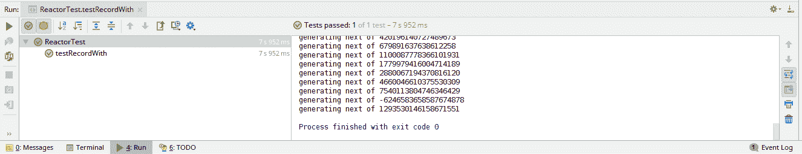
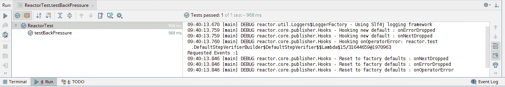
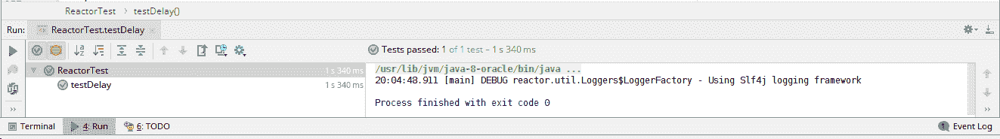
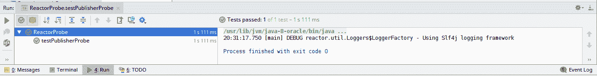
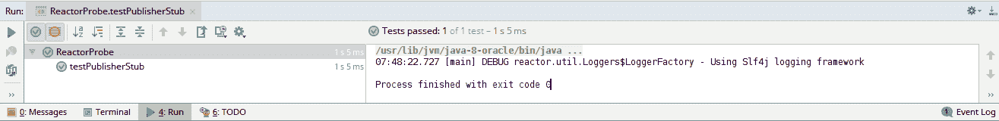

# 测试和调试

在本书中，我们已经详细介绍了 Reactor，使用其各种操作符并使用它们构建示例。然而，编写代码只是工作的一半。所有生产代码都必须通过足够的单元测试进行验证。这些测试不仅验证我们的代码，而且使我们能够更快地进行更改。如果我们重构代码，测试将确保我们的更改没有破坏任何现有功能。在本章中，我们将介绍 Reactor 提供的测试支持。测试业务代码将捕获大多数问题，但代码将在生产中失败。在这种情况下，需要调试代码以找到失败的根本原因。在本章中，我们还将介绍一些调试 Reactor 管道的基本技术。

在本章的最后，我们将学习如何：

+   测试 Reactor 管道

+   调试 Reactor 流

# 技术要求

+   Java 标准版，JDK 8 或更高版本

+   IntelliJ IDEA IDE 2018.1 或更高版本

本章的 GitHub 链接为 [`github.com/PacktPublishing/Hands-On-Reactive-Programming-with-Reactor/tree/master/Chapter10`](https://github.com/PacktPublishing/Hands-On-Reactive-Programming-with-Reactor/tree/master/Chapter10)。

# 测试 Reactor 管道

单元测试 Reactor 管道相当困难。这是因为 Reactor 声明的是行为而不是可以验证的状态。幸运的是，Reactor 附带了一些辅助类，可以帮助进行单元测试。测试实用工具包含在`reactor-test`组件中。`reactor-test`为我们提供了以下三个组件：

+   `StepVerifier`：允许我们验证管道配置和操作符

+   `TestPublisher`：允许我们产生测试数据以启用操作符的测试

+   `PublisherProbe`：使我们能够验证现有的发布者

在我们继续之前，让我们首先将`reactor-test`添加到我们的`build.gradle`中。我们不需要指定这个版本的版本，因为这个版本由`org.springframework.boot`插件定义：

```java
plugins {
    id "io.spring.dependency-management" version "1.0.1.RELEASE"
    id "org.springframework.boot" version "2.0.3.RELEASE"
    id "java"
}

// Removed for brevity

dependencies {
        compile 'org.springframework.boot:spring-boot-starter-webflux'
        compile 'org.springframework:spring-context-support'
        compile group: 'org.freemarker', name: 'freemarker', version: '2.3.28'
        testCompile group: 'junit', name: 'junit', version: '4.12'
        testCompile 'io.projectreactor:reactor-test'
}
```

现在，让我们运行 `./gradlew clean deploy`。完成这个步骤后，我们应该会发现我们有一个成功的构建。

# StepVerifier

在此之前，我们已经测试了每个响应式流的最终结果，因为完整的管道是在测试用例中创建的。这种方法不是一个好的单元测试，因为它没有单独验证组件。在 Reactor 中，管道是在代码中声明的。然后这些管道被延迟实例化和验证。由于完整的管道被实例化，因此单独对组件进行单元测试相当困难。对于单元测试，我们必须有能力模拟管道的组件，留下正在测试的组件。但是在这种情况下，我们如何验证操作序列的现有管道？Reactor 提供了`StepVerifier`组件来单独验证所需操作。此 API 不仅定义了存根，还提供了断言来验证每个步骤。在本节中，我们将使用验证不同 Reactor 场景的各种示例。让我们从一个最简单的用例开始，其中给定一个发布者，我们可能想要断言它发布的`next`和`completion`事件：

```java
    @Test
    public void testExpectation() throws Exception {
        Flux<Long> fibonacciGenerator = Flux.generate(() -> Tuples.<Long,
                Long>of(0L, 1L), (state, sink) -> {
            if (state.getT1() < 0)
                sink.complete();
            else
                sink.next(state.getT1());
            System.out.println("generating next of " + state.getT1());

            return Tuples.of(state.getT2(), state.getT1() + state.getT2());
        });
        StepVerifier.create(fibonacciGenerator.take(10))
                .expectNext(0L, 1L, 1L)
                .expectNextCount(7)
                .expectComplete()
                .verify();
    }
```

在前面的代码中，我们按照以下方式验证斐波那契数列操作：

+   我们已将`take`操作符配置为仅消费 10 个事件。

+   接下来，我们使用了`StepVerifier.Create` API 来构建一个验证器的实例。

+   使用`expectNext` API 来验证已发布的值，并按照发布顺序进行验证。它接受单个值或值的数组；我们正在验证`0`、`1`和`1`值。

+   使用`expectNextCount`来验证已发布值的数量。由于我们验证了三个值，所以我们还剩下七个。

+   使用`expectComplete` API 来验证完成事件。

+   最后，使用`verify` API 来验证行为。

现在，让我们运行测试用例。在这样做的时候，我们应该看到一个绿色的条形图：



如果`expectNext`不匹配已发布的值，测试将因`java.lang.AssertionError`和详细错误文本而失败。如果已发布的计数不同，则不会因`expectNextCount`而失败，而是`expectComplete`。在所有断言失败中，`StepVerifier`会抛出一个带有以下详细信息的`java.lang.AssertionError`：

```java
java.lang.AssertionError: expectation "expectComplete" failed (expected: onComplete(); actual: onNext(34))
     at reactor.test.DefaultStepVerifierBuilder.failPrefix(DefaultStepVerifierBuilder.java:2235)
     at reactor.test.DefaultStepVerifierBuilder.fail(DefaultStepVerifierBuilder.java:2231)
     at reactor.test.DefaultStepVerifierBuilder.lambda$expectComplete$4(DefaultStepVerifierBuilder.java:245)
```

在接下来的章节中，我们将讨论`StepVerfier`中可用的一些最常用的方法。

# expectError

如本书中所述，响应式流以完成或错误事件终止。同样地，对于完成事件，有`expectError` API 来验证错误事件。`expectError` API 提供了以下方便的方法来验证错误消息或异常类：

| **错误名称** | **描述** |
| --- | --- |
| `expectError()` | 该 API 仅验证错误事件的 occurrence。它不验证任何关于错误的详细信息。 |
| `expectError(exceptionClass)` | 该 API 验证错误事件中包装的底层异常类。 |
| `expectErrorMessage(errorMessage)` | 此 API 验证错误事件中包装的底层异常消息。 |
| `expectError(Predicate)` | 此 API 使用配置的谓词验证底层异常。 |

在所有前面的案例中，`StepVerifier`断言错误事件中包装的异常。如果错误不匹配，`StepVerifier`会抛出`assertionError`。`StepVerifier`还提供了一个`expectErrorSatisfies` API，可以用来配置自定义断言。此 API 接受一个`Consumer`来断言错误事件下的异常：

```java
 @Test
    public void testErrorExpectation() throws Exception {
        Flux<Long> fibonacciGenerator = Flux.generate(() -> Tuples.<Long,
                Long>of(0L, 1L), (state, sink) -> {
            if (state.getT1() > 30)
                sink.error(new IllegalStateException("Value out of bound"));

         // Removed for brevity
        });
        StepVerifier.create(fibonacciGenerator.take(10))
                .expectNextCount(9)
                .expectErroSatisfies(x -> {
                    assert(x instanceof IllegalStateException);
                })
                .verify();
    }
```

在前面的代码中，当值超过`30`时，我们会抛出异常。`expectErrorSatisfies`断言抛出的异常是`IllegalStateException`类型。让我们执行前面的测试案例以获得成功的绿色条。这在上面的屏幕截图中有展示：



# expectNext

Reactor 提供了多个方法来断言下一个值。在前面代码中，我们使用`expectNext()`重载操作符来匹配值。此操作符提供了以下变体：

| **操作符**

| **描述** | 

| `expectNext(value1,value2.. value6)` | 此方法验证发布的值与提供的值是否匹配。值必须按照指定的顺序匹配。| 

| `expectNext(value[])` | 此方法验证发布的值与提供的值数组是否匹配。所有值必须按照指定的顺序匹配。| 

| `expectNextSequence(Iterator)` | 此方法验证发布的值与配置的迭代器中的值是否匹配。所有值必须按照指定的顺序匹配。| 

| `expectNextCount(count)` | 此方法匹配发布的值的数量。| 

| `expectNextMatches(predicate)` | 此方法验证下一个值是否满足配置的谓词。| 

所有的前面方法都验证下一个发布的值与匹配的期望值。这对于小数据集来说很好，但是当我们发布像斐波那契数列这样的大范围时，我们无法匹配所有值。有时，我们只是对消费所有（或某些）下一个值感兴趣。这可以通过使用`thenConsumeWhile` API 来实现。这些方法接受一个谓词，然后消费所有与谓词匹配的序列值。一旦第一个值不匹配，测试案例将尝试验证以下配置的期望值：

```java
    @Test
    public void testConsumeWith() throws Exception {
        Flux<Long> fibonacciGenerator = Flux.generate(() -> Tuples.<Long,
                Long>of(0L, 1L), (state, sink) -> {
            if (state.getT1() < 0)
                sink.complete();
            else
                sink.next(state.getT1());
            System.out.println("generating next of " + state.getT2());

            return Tuples.of(state.getT2(), state.getT1() + state.getT2());
        });

        StepVerifier.create(fibonacciGenerator)
                .thenConsumeWhile(x -> x >= 0)
                .expectComplete()
               .verify();
    }
```

在前面的测试案例中，以下情况发生了：

+   `thenConsumeWhile`已配置为`x >= 0`谓词。这应该匹配所有值，除了第一个负值。

+   接下来，我们期望一个完整的事件，然后使用`verify` API 进行验证。这在上面的屏幕截图中有展示：

我们已经探讨了`expect`方法来验证在响应式流中生成的事件。如果期望不匹配，`StepVerifier`构建一个通用消息来指示失败。`StepVerifier`还提供了构建特定失败和描述性消息的支持。`StepVerifier`提供了`as`方法，该方法可以在`expect`方法之后调用。`as`方法接受一个字符串，当异常不匹配时显示：

```java
   @Test
    public void testExpectationWithDescp() throws Exception {
        // removed for brevity
        StepVerifier.create(fibonacciGenerator.take(9))
                .expectNext(0L, 1L, 1L).as("Received 0,1,1 numbers")
                .expectNextCount(7).as("Received 9 numbers")
                .expectComplete()
                .verify();
    }
```

在此代码中，我们为每个期望提供了描述性消息。如果期望不匹配，测试将因特定错误消息而失败，如以下跟踪所示。这有助于调试测试失败：

```java
java.lang.AssertionError: expectation "Received 9 numbers" failed (expected: count = 7; actual: counted = 6; signal: onComplete())

    at reactor.test.DefaultStepVerifierBuilder.failPrefix(DefaultStepVerifierBuilder.java:2235)
    at reactor.test.DefaultStepVerifierBuilder.fail(DefaultStepVerifierBuilder.java:2231)
```

# 捕获值

有时候我们无法直接断言值。在这种情况下，我们通常会捕获调用的值，然后分别断言它们。Reactor 提供了一个`recordWith` API 来捕获测试中的发布者生成的值。该方法接受一个`Supplier`函数，该函数被调用以实例化一个用于存储值的集合。然后可以使用`expectRecordedMatches`方法断言记录集合：

```java
@Test
    public void testRecordWith() throws Exception {
        Flux<Long> fibonacciGenerator = Flux.generate(() -> Tuples.<Long,
                Long>of(0L, 1L), (state, sink) -> {
          //   Removed for Brevity
     });
        StepVerifier.create(fibonacciGenerator, Long.MAX_VALUE)
                .recordWith(() -> new ArrayList<>())
                .thenConsumeWhile(x -> x >= 0)
                .expectRecordedMatches(x -> x.size() > 0)
                .expectComplete()
                .verify();
    }
```

在前面的代码中，我们做了以下操作：

1.  配置`recordWith`使用`ArrayList`来记录所有值。

1.  配置了`thenConsumeWhile`使用谓词`x >= 0`。这应该匹配所有值，除了第一个负值。所有匹配的值都添加到记录集合中。

1.  接下来，我们配置了`expectRecordedMatches`来断言记录集合具有值。

1.  最后，我们期望一个完成事件，然后使用`verify` API 进行验证，如下所示：

当运行前面的测试用例时，我们应该得到一个绿色的条形表示通过测试。这在上面的屏幕截图（）中显示。同样，除了`expectRecordWith`方法外，Reactor 还提供了一个`consumeRecordWith` API，可以用于自定义断言。`consumeRecordWith`方法接受一个用于记录集合的 Consumer 函数。需要注意的是，记录会话只能与下一个`consumeRecordWith`或`expectRecordWith`调用相匹配。

# 验证

如前所述，`verify`操作符用于断言配置的行为。在调用`verify`之前，必须验证发布者的终止事件。或者，Reactor 提供了方便的验证方法来验证终止事件并断言完整的配置链。与`expectError`类似，该 API 在以下方法中提供：

&#124; **方法名称** &#124; **描述** &#124;

&#124; `verifyComplete()` &#124; 此方法仅验证完成事件的发生。 &#124;

&#124; `verifyError()` &#124; 此方法仅验证错误事件的发生。 &#124;

`verifyError(exceptionClass)`；此方法验证错误事件并匹配错误事件中包装的底层异常类。

`verifyError(exceptionMsg)`；此方法验证错误事件并匹配错误事件中包装的底层异常消息。

`verifyError(predicate)`；此方法验证错误事件并将其与提供的谓词匹配。

`verfiyErrorSatisfies(assertConsumer)`；此方法验证错误事件并匹配提供的自定义断言的底层异常。

在前面的测试中，我们可以用以下片段替换`expectComplete`和验证调用：

```java
StepVerifier.create(fibonacciGenerator.take(10))
        .expectNext(0L, 1L, 1L)
        .expectNextCount(7)
        .verifyComplete();
```

我们将测试执行留给读者。再次强调，通过测试应显示绿色条。重要的是要注意，`verify`（及相关方法）返回`Duration`。该持续时间指定测试实际执行的时间。这也引出了关于验证方法阻塞行为的讨论。默认情况下，验证方法的调用是同步和阻塞的，可能会导致测试无限期等待。可以通过在`verify`方法调用中指定`Duration`来更改此行为。或者，我们可以使用`StepVerifier.setDefaultTimeout`方法设置默认超时：

```java
@Test
    public void testWithTimeout() throws Exception {
        Flux<Long> fibonacciGenerator = Flux.generate(() -> Tuples.<Long,
            // removed for brevity
        });
        StepVerifier.create(fibonacciGenerator.take(9).delaySequence(Duration.ofSeconds(1)))
                .expectNext(0L, 1L, 1L)
                .expectNextCount(7)
                .expectComplete()
                .verify(Duration.ofMillis(100));
    }
```

在此代码中，我们做了以下更改：

+   使用`delaySequence`操作符延迟 1 秒生成事件。

+   删除了`verifyComplete`调用，因为我们不能指定持续时间。相反，我们添加了`expectComplete`方法调用。

+   最后，我们使用带有超时时间的验证调用。超时设置为 100 毫秒。

此测试用例超时并失败，以下为异常信息：

```java
java.lang.AssertionError: VerifySubscriber timed out on reactor.core.publisher.SerializedSubscriber@1a57272

    at reactor.test.DefaultStepVerifierBuilder$DefaultVerifySubscriber.pollTaskEventOrComplete(DefaultStepVerifierBuilder.java:1522)
    at reactor.test.DefaultStepVerifierBuilder$DefaultVerifySubscriber.verify(DefaultStepVerifierBuilder.java:1107)
    at reactor.test.DefaultStepVerifierBuilder$DefaultStepVerifier.verify(DefaultStepVerifierBuilder.java:729)
    at ReactorTest.testWithTimeout(ReactorTest.java:58)

```

在前面的章节中，我们查看了一些方法，这些方法使我们能够验证大多数响应式流操作符。接下来，我们将讨论一些特定的 Reactor 场景。

# 验证背压

如前文在第七章中所述，*流量控制与背压*，背压允许订阅者控制事件流。此机制旨在控制快速生成生产者。背压有不同的配置。这些配置已在第七章中讨论过，*流量控制与背压*，此处不再赘述。从根本上讲，背压跳过向订阅者传递值。因此，验证它意味着我们必须寻找尚未传递给订阅者的值。Reactor 提供了`verifyThenAssertThat` API 出于同样的原因。此方法公开了可以验证发布者最终状态的断言。现在让我们来处理一个测试用例：

```java
    @Test
    public void testBackPressure() throws Exception {
        Flux<Integer> numberGenerator = Flux.create(x -> {
            System.out.println("Requested Events :" + x.requestedFromDownstream());
            int number = 1;
            while (number < 100) {
                x.next(number);
                number++;
            }
            x.complete();
        }, FluxSink.OverflowStrategy.ERROR);

        StepVerifier.create(numberGenerator, 1L)
                .thenConsumeWhile(x -> x >= 0)
                .expectError()
                .verifyThenAssertThat()
                .hasDroppedElements();
    }
```

在前面的代码中，发生了以下情况：

1.  我们使用`Flux.create` API 配置了一个带有`OverflowStrategy.ERROR`的发布者。我们的发布者生成 100 个事件，而不寻找订阅者的更多请求。

1.  接下来，我们的 `StepVerifier` 被配置为仅处理一个事件，限制订阅者的请求速率。这是通过使用 `StepVerifier.create` API 实现的。

1.  由于订阅者请求一个事件，而发布者引发 100 个事件，这应该导致背压错误。在测试用例中，我们配置了 `expectError()` 来验证引发的错误。

1.  最后，我们配置了 `verfiyThenAssertThat()` 来检查丢失的元素。

前面的测试用例验证了完整的背压场景，如下面的截图所示:在前面的测试用例中，我们验证了元素是否丢失。Reactor 还提供了以下断言来验证各种其他场景：

&#124; **方法名称** &#124; **描述** &#124;

&#124; `hasDroppedElements` &#124; 此方法验证发布者是否由于溢出而丢失了元素。 &#124;

&#124; `hasNotDroppedElements` &#124; 此方法验证发布者是否由于溢出而丢失了任何元素。 &#124;

&#124; `hasDroppedExactly` &#124; 此方法验证丢失的值与在方法调用中提供的值是否一致。 &#124;

&#124; `hasDroppedErrors` &#124; 此方法验证发布者是否丢失了错误。 &#124;

&#124; `hasOperatorErrors` &#124; 此方法验证流处理是否引发了操作符错误。 &#124;

# 验证时间操作

验证基于时间的操作是一项复杂的任务。传统上，我们使用 `Thread.sleep` 或 `wait-notify` 块来模拟测试用例中的延迟。Reactor 也提供了丰富的支持来验证此类操作。这允许我们通过使用 Reactive Streams 的 `Stepverifier.withVirtualTime` 方法来构建一个虚拟时钟。然后可以使用以下任何操作来操作虚拟时钟，以模拟所需操作的时间漂移：

&#124; **操作** &#124; **描述** &#124;

&#124; `thenAwait` &#124; 这只会暂停执行到配置的时间。 &#124;

&#124; `expectNoEvent` &#124; 此操作暂停执行，并在配置的延迟期间验证没有发生事件。 &#124;

重要的是要注意，必须在注入虚拟时钟之后调用操作符。此外，`expectNoEvent` API 将订阅视为一个事件。如果它在注入虚拟时钟后的第一步使用，那么它将由于订阅事件而失败。现在让我们处理以下测试用例：

```java
    @Test
     public void testDelay() {
         StepVerifier.withVirtualTime(() -> Flux.just(1, 2, 3, 4, 5, 6, 7, 8, 9)
                 .delaySequence(Duration.ofMillis(100)))
                 .expectSubscription()
                 .thenAwait(Duration.ofSeconds(100))
                 .expectNextCount(9)
                 .verifyComplete();
     }
```

在前面的代码中，我们实现了以下内容：

1.  使用 `StepVerifier.withVirtualTime` 创建了一个带有虚拟时钟的 Flux

1.  在反应流上配置了 `delaySequence` 操作

1.  调用 `thenAwait` 以保持虚拟时钟在配置的时间内

1.  预期发布九个值，然后是一个完成事件

现在我们运行测试用例并验证如下！

# Publisher 探针

在前面的章节中，我们使用了`StepVerifier`来断言在反应链中执行的步骤。然而，这些通常是简单的链，可以在单个测试用例中端到端验证。可能存在我们需要将 Publisher 注入到服务或方法中并验证发布信号的情景。在这种情况下，我们可以使用`PublisherProbe`实用工具对现有的 Publisher 进行仪器化。探针跟踪 Publisher 发布的信号。最后，我们可以断言并验证探针的最终状态。该实用工具有助于单元测试执行特定逻辑在反应 Publisher 上的服务或方法。`PublisherProbe`可以使用以下任一方法构建：

+   `PublisherProbe.Of(ExistingPublisher)`: 对现有的 Publisher 进行仪器化，并从中生成一个探针。探针发送出由原始 Publisher 生成的信号。

+   `PublisherProbe.empty()`: 创建一个空的序列探针。此探针不会发出任何信号。

我们可以通过调用相应的方法从`PublisherProbe`获取 Mono 或 Flux。然后，可以将 Flux/Mono 传递给正在测试的方法/服务。调用后，可以使用以下断言验证最终状态：

`| **方法名** | **描述** |`

`| assertWasSubscribed |` 这个方法验证在调用中 Publisher 是否被订阅。`|`

`| assertWasRequested |` 这个方法验证在调用中是否请求了 Publisher。`|`

`| assertWasCancelled |` 这个方法验证在调用中 Publisher 是否被取消。`|`

以下代码展示了这一点：

```java

    @Test
    public void testPublisherProbe() throws Exception {
        Flux<Long> fibonacciGenerator = Flux.generate(() -> Tuples.<Long,
                Long>of(0L, 1L), (state, sink) -> {
            if (state.getT1() < 0)
                sink.complete();
            else
                sink.next(state.getT1());
            return Tuples.of(state.getT2(), state.getT1() + state.getT2());
        });

        PublisherProbe<Long> publisherProbe = PublisherProbe.of(fibonacciGenerator);
        publisherProbe.flux().subscribe();

        publisherProbe.assertWasSubscribed();
        publisherProbe.assertWasRequested();

    }
```

在前面的代码中，我们做了以下操作：

1.  使用`fibonacciGenerator`创建了一个`PublisherProbe`

1.  接下来，我们订阅了探针生成的 Flux

1.  最后，我们验证 Flux 被订阅，随后是请求事件

让我们运行测试用例并验证如下！

# Publisher 存根

到目前为止，我们一直在创建操作符的同时创建一个`Publisher`。因此，我们可以构建端到端的有效性验证。然而，在大多数业务服务中，`Publisher`将在代码的某个部分创建，而操作将在另一个部分执行。为了单元测试操作服务代码，我们需要生成一个虚拟的`Publisher`。Reactor 也为此提供了`TestPublisher`。我们可以使用`create factory`方法创建一个`TestPublisher`。生成的`TestPublisher`可以被转换成 Flux 或 Mono。`TestPublisher`使得使用以下任何一种方法发射事件成为可能：

`| **方法名** | **描述** |`

`| next(T) / next(T,T...) |` 调用 Publisher 的`OnNext`方法，并使用提供的值。`|`

`| complete() |` 使用`OnComplete`事件终止发布者流。`|`

`| error() |` 使用`OnError`事件终止发布者流。`|`

`| emit(T,T,T .....) |` 调用发布者的`OnNext`方法，使用提供的值，然后是`OnComplete`终止。`|`

让我们使用示例代码。我们有以下`PrintService`，它将偶数打印到控制台，如下所示：

```java
class PrintService{
    public void printEventNumbers(Flux<Long> source, PrintWriter writer) {
        source
                .filter(x -> x % 2 == 0)
                .subscribe(writer::println);
    }
}
```

现在，让我们构建一个简单的测试用例。在测试用例中，我们将注入一些值和一个`StringWriter`。最后，我们将验证`StringWriter`是否包含所有必需的值，如下所示：

```java
 @Test
 public void testPublisherStub() throws Exception {
   TestPublisher<Long> numberGenerator= TestPublisher.<Long>create();
   StringWriter out = new StringWriter();
   new PrintService().printEventNumbers(numberGenerator.flux(),
    new PrintWriter(out));
   numberGenerator.next(1L,2L,3L,4L);
   numberGenerator.complete();
   assertTrue(out.getBuffer().length() >0);
 }
```

在前面的代码中，我们做了以下操作：

1.  使用`create`方法生成了一个`TestPublisher`

1.  实例化了一个`StringWriter`以捕获打印的值

1.  接下来，我们使用一些值生成了`onNext`

1.  最后，我们生成了`onComplete`并验证了打印的值

现在，运行测试用例。这应该会显示一个绿色的条形图，表示测试已经通过！`TestPublisher`还跟踪`Publisher`存根的最终状态。最终状态可以使用以下断言进行验证：

`| assertSubscribers |` 此方法验证发布者被提供的调用中指定的订阅者数量订阅。`|`

`| assertCancelled |` 此方法验证发布者被取消多次，如调用中提供的数字所指定。`|`

`| assertRequestOverflow |` 此方法验证发布者通过生成比订阅者请求的更多事件来引发溢出条件。`|`

在前面的测试用例中，我们构建了一个表现良好的`Publisher`存根。它没有发送空事件或发送比请求更多的事件。`TestPublisher`实用程序还使我们能够实例化违反先前条件的发布者。可以使用`createNonCompliant`方法生成不一致的发布者。此方法使用违规类型并生成配置的错误：

```java
    @Test
    public void testNonComplientPublisherStub() throws Exception {
        TestPublisher<Long> numberGenerator= TestPublisher.createNoncompliant(TestPublisher.Violation.REQUEST_OVERFLOW);
        StepVerifier.create(numberGenerator, 1L)
                .then(() -> numberGenerator.emit(1L,2L,3L,4L))
                .expectNext(1L)
                .verifyError();

    }
```

在前面的代码中，我们做了以下操作：

1.  使用`createNonCompliant`方法生成了一个`TestPublisher`。发布者已被配置为生成比请求更多的事件。

1.  订阅了具有一个初始元素需求的发布者。

1.  验证了生成的元素后跟错误终止。

# 调试 Reactor 流

调试 Rector 流不是一件简单的事情。这是因为 Reactor 中的所有流处理都是异步和非阻塞的。在一个同步和阻塞系统中，错误堆栈跟踪指向问题的根本原因。然而，在异步 Reactor 流中，错误被记录在`Subscriber`中，但在流处理中的操作员中被引发。错误堆栈跟踪没有提到操作员。让我们看一下以下 Reactor 堆栈跟踪：

```java
reactor.core.Exceptions$ErrorCallbackNotImplemented: java.lang.IllegalStateException

Caused by: java.lang.IllegalStateException
    at ReactorDebug.lambda$testPublisherStub$1(ReactorDebug.java:22)
    at reactor.core.publisher.FluxGenerate$GenerateSubscription.fastPath(FluxGenerate.java:223)
    at reactor.core.publisher.FluxGenerate$GenerateSubscription.request(FluxGenerate.java:202)
    at reactor.core.publisher.FluxFilterFuseable$FilterFuseableSubscriber.request(FluxFilterFuseable.java:170)
    at reactor.core.publisher.LambdaSubscriber.onSubscribe(LambdaSubscriber.java:89)
    at reactor.core.publisher.FluxFilterFuseable$FilterFuseableSubscriber.onSubscribe(FluxFilterFuseable.java:79)
    at reactor.core.publisher.FluxGenerate.subscribe(FluxGenerate.java:83)
    at reactor.core.publisher.FluxFilterFuseable.subscribe(FluxFilterFuseable.java:51)
    at reactor.core.publisher.Flux.subscribe(Flux.java:6877)
    at reactor.core.publisher.Flux.subscribeWith(Flux.java:7044)
    at reactor.core.publisher.Flux.subscribe(Flux.java:6870)
    at reactor.core.publisher.Flux.subscribe(Flux.java:6834)
    at reactor.core.publisher.Flux.subscribe(Flux.java:6777)
    at PrintService.printEventNumbers(ReactorProbe.java:57)
    at ReactorDebug.testPublisherStub(ReactorDebug.java:28)
    at sun.reflect.NativeMethodAccessorImpl.invoke0(Native Method)
    at sun.reflect.NativeMethodAccessorImpl.invoke(NativeMethodAccessorImpl.java:62)
    at sun.reflect.DelegatingMethodAccessorImpl.invoke(DelegatingMethodAccessorImpl.java:43)
    at java.lang.reflect.Method.invoke(Method.java:498)
    at org.junit.runners.model.FrameworkMethod$1.runReflectiveCall(FrameworkMethod.java:50)
    at org.junit.internal.runners.model.ReflectiveCallable.run(ReflectiveCallable.java:12)
    at org.junit.runners.model.FrameworkMethod.invokeExplosively(FrameworkMethod.java:47)
```

在前面的堆栈跟踪中，我们可以观察到以下情况：

+   `IllegalStateException` 已到达我们的订阅者

+   由于订阅者没有处理错误事件，Reactor 还抛出了 `ErrorCallbackNotImpletemented`

+   错误发生在执行 `PrintService.printEventNumbers` 时

+   前面的错误是在我们的 `ReactorDebug.testPublisherStub` 测试用例中抛出的

这并没有太大帮助，但我们可以通过首先实现一个错误处理器来清理堆栈跟踪。这里最简单的方法是使用可抛出对象的 `printstackTrace` 方法：

```java
class PrintService{
    public void printEventNumbers(Flux<Long> source, PrintWriter writer) {
        source
                .filter(x -> x % 2 == 0)
                .subscribe(writer::println,Throwable::printStackTrace);
    }
}
```

在 `subscribe` 方法中进行的先前更改清理了抛出错误的堆栈跟踪。然而，错误操作符在跟踪中仍未解释，如下面的代码所示：

```java
java.lang.IllegalStateException
    at ReactorDebug.lambda$testPublisherStub$1(ReactorDebug.java:22)
    at reactor.core.publisher.FluxGenerate$GenerateSubscription.fastPath(FluxGenerate.java:223)
    at reactor.core.publisher.FluxGenerate$GenerateSubscription.request(FluxGenerate.java:202)
    at reactor.core.publisher.FluxFilterFuseable$FilterFuseableSubscriber.request(FluxFilterFuseable.java:170)
    at reactor.core.publisher.LambdaSubscriber.onSubscribe(LambdaSubscriber.java:89)
    at reactor.core.publisher.FluxFilterFuseable$FilterFuseableSubscriber.onSubscribe(FluxFilterFuseable.java:79)
    at reactor.core.publisher.FluxGenerate.subscribe(FluxGenerate.java:83)
    at reactor.core.publisher.FluxFilterFuseable.subscribe(FluxFilterFuseable.java:51)
    at reactor.core.publisher.Flux.subscribe(Flux.java:6877)
    at reactor.core.publisher.Flux.subscribeWith(Flux.java:7044)
    at reactor.core.publisher.Flux.subscribe(Flux.java:6870)
    at reactor.core.publisher.Flux.subscribe(Flux.java:6834)
    at reactor.core.publisher.Flux.subscribe(Flux.java:6804)
    at PrintService.printEventNumbers(ReactorProbe.java:57)
    at ReactorDebug.testPublisherStub(ReactorDebug.java:28)
   ........
   ......
    at com.intellij.rt.execution.junit.IdeaTestRunner$Repeater.startRunnerWithArgs(IdeaTestRunner.java:47)
    at com.intellij.rt.execution.junit.JUnitStarter.prepareStreamsAndStart(JUnitStarter.java:242)
    at com.intellij.rt.execution.junit.JUnitStarter.main(JUnitStarter.java:70)
```

# 调试钩子

Reactor 提供了编译时仪器功能来调试堆栈跟踪。此功能使我们能够拦截所有 Flux/Mono 操作的调用。然后，每次拦截都会记录与操作一起抛出的错误。然后，将此映射附加到堆栈跟踪中。然后，可以使用此记录来找到问题的根本原因。由于这是一个额外的拦截，它保留记录映射，因此它应该仅用于调试错误，并且不应在生产系统中启用。Reactor 提供了一个 `Hooks.OnOperatorDebug` API，必须在实例化 Flux/Mono 之前调用。让我们在我们的测试用例中调用 `Hooks.OnOperatorDebug`，如下所示：

```java
      @Test
    public void testPublisherStub() throws Exception {
        Hooks.onOperatorDebug();
        Flux<Long> fibonacciGenerator = getFibonacciGenerator();
        StringWriter out = new StringWriter();
        new PrintService().printEventNumbers(fibonacciGenerator,new PrintWriter(out));
        assertTrue(out.getBuffer().length() >0);
    }
class PrintService {
    public void printEventNumbers(Flux<Long> source, PrintWriter writer) {
        source
                .filter(x -> x % 2 == 0)
                .subscribe(writer::println,Throwable::printStackTrace);
    }
}
```

让我们运行我们的测试用例并查看生成的堆栈跟踪，如下所示：

```java
java.lang.IllegalStateException
    at ReactorDebug.lambda$getFibonacciGenerator$1(ReactorDebug.java:30)
    at reactor.core.publisher.FluxGenerate$GenerateSubscription.fastPath(FluxGenerate.java:223)
    at reactor.core.publisher.FluxGenerate$GenerateSubscription.request(FluxGenerate.java:202)
  ...........
    at com.intellij.rt.execution.junit.JUnitStarter.main(JUnitStarter.java:70)
    Suppressed: reactor.core.publisher.FluxOnAssembly$OnAssemblyException: 
Assembly trace from producer [reactor.core.publisher.FluxGenerate] :
    reactor.core.publisher.Flux.generate(Flux.java:947)
    ReactorDebug.getFibonacciGenerator(ReactorDebug.java:27)
    ReactorDebug.testPublisherStub(ReactorDebug.java:19)
Error has been observed by the following operator(s):
    &#124;_  Flux.generate(ReactorDebug.java:27)
    &#124;_  Flux.filter(ReactorProbe.java:58)
```

现在，如果我们查看跟踪的底部，它清楚地表明在 `Flux.generate` 调用中抛出了一个错误。为了解决这个问题，我们可以修复这个错误并重新运行我们的测试用例。

# 检查点操作符

上一节中讨论的调试钩子具有全局影响，为所有 Flux/Mono 实例提供仪器。因此，调试钩子的影响是应用范围的。或者，Reactor 还提供了一个 `checkpoint` 操作符，它只能更改特定的 Flux 流。`checkpoint` 操作符在操作符调用后为 Reactor Streams 提供仪器。我们可以将我们的先前测试用例修改如下：

```java
@Test
public void testPublisherStub() throws Exception {
  Flux<Long> fibonacciGenerator = 
    getFibonacciGenerator().checkpoint();
    StringWriter out = new StringWriter();
  new PrintService().printEventNumbers(fibonacciGenerator,
   new PrintWriter(out));
  assertTrue(out.getBuffer().length() >0);
}
```

在前面的代码中，我们在创建 Flux 后调用了 `checkpoint()` 操作符。修改后的测试用例生成了以下堆栈跟踪。由于 `checkpoint` 操作符是在 `Flux.generate` 之后调用的，因此记录映射引用 `FluxGenerate` 作为错误点。以下代码显示了这一点：

```java
java.lang.IllegalStateException
    at ReactorDebug.lambda$getFibonacciGenerator$1(ReactorDebug.java:29)
    at reactor.core.publisher.FluxGenerate$GenerateSubscription.fastPath(FluxGenerate.java:223)
    at reactor.core.publisher.FluxGenerate$GenerateSubscription.request(FluxGenerate.java:202)   
...........
    at com.intellij.rt.execution.junit.JUnitStarter.prepareStreamsAndStart(JUnitStarter.java:242)
    at com.intellij.rt.execution.junit.JUnitStarter.main(JUnitStarter.java:70)
    Suppressed: reactor.core.publisher.FluxOnAssembly$OnAssemblyException: 
Assembly trace from producer [reactor.core.publisher.FluxGenerate] :
    reactor.core.publisher.Flux.checkpoint(Flux.java:2690)
    reactor.core.publisher.Flux.checkpoint(Flux.java:2640)
    ReactorDebug.testPublisherStub(ReactorDebug.java:18)
Error has been observed by the following operator(s):
    &#124;_  Flux.checkpoint(ReactorDebug.java:18)
```

之前讨论的`checkpoint`和`debug`操作符会影响应用程序的内存占用。这两个操作符都试图保存堆栈跟踪，这导致更高的内存消耗。因此，在没有额外成本的情况下，这些操作符不能在生产应用程序中启用。但`checkpoint`操作符还提供了一个精简版，它不会保存任何堆栈跟踪。当`checkpoint`操作符配置了描述信息时，它会禁用堆栈跟踪累积。以下是在我们前面的代码中使用带有描述信息的 checkpoint 时生成的堆栈跟踪：

```java
java.lang.IllegalStateException
    at ReactorDebug.lambda$getFibonacciGenerator$1(ReactorDebug.java:29)
    at reactor.core.publisher.FluxGenerate$GenerateSubscription.fastPath(FluxGenerate.java:223)
   .......
    at com.intellij.junit4.JUnit4IdeaTestRunner.startRunnerWithArgs(JUnit4IdeaTestRunner.java:68)
    at com.intellij.rt.execution.junit.IdeaTestRunner$Repeater.startRunnerWithArgs(IdeaTestRunner.java:47)
    at com.intellij.rt.execution.junit.JUnitStarter.prepareStreamsAndStart(JUnitStarter.java:242)
    at com.intellij.rt.execution.junit.JUnitStarter.main(JUnitStarter.java:70)
    Suppressed: reactor.core.publisher.FluxOnAssembly$OnAssemblyException: 
Assembly site of producer [reactor.core.publisher.FluxGenerate] is identified by light checkpoint [generator check]."description" : "generator check"
```

在前面的堆栈跟踪中，Reactor 使用了描述并将其作为`identified by light checkpoint`消息的前缀。它不再尝试构建操作符调用的堆栈跟踪。`identified by light checkpoint`消息可以在应用程序日志中搜索。但如果描述信息不够好，Reactor 允许我们启用堆栈跟踪捕获以构建信息性的失败跟踪。这可以通过使用`checkpoint(description,enableStackTrace)`操作符来实现。

# 流日志

记录是了解方法调用下发生情况的最常见方式之一。Reactor 使用 SLF4J 进行日志记录，但它默认不记录流操作。相反，Reactor 提供了`log`操作符，它可以用来选择性地为特定流启用日志记录。让我们使用以下方式修改我们的测试用例，使用日志操作符：

```java
@Test
public void testPublisherStub() throws Exception {
  Flux<Long> fibonacciGenerator = getFibonacciGenerator().log();
  StringWriter out = new StringWriter();
  new PrintService().printEventNumbers(fibonacciGenerator,
   new PrintWriter(out));
  assertTrue(out.getBuffer().length() >0);
}
```

`log()`操作符提供了许多变体。默认情况下，操作符在`INFO`级别记录。我们可以将其配置为在`DEBUG`或其他级别记录。此外，我们还可以放置一个`logback.xml`文件来格式化记录的消息，如下所示：

```java
<configuration>
     <appender name="stdout" class="ch.qos.logback.core.ConsoleAppender">
         <encoder>
             <pattern>
                 %d{HH:mm:ss.SSS} [%thread] [%-5level] %logger{36} - %msg%n
             </pattern>
         </encoder>
     </appender>
    <root level="DEBUG">
         <appender-ref ref="stdout"/>
     </root>
 </configuration>
```

在前面的`logback.xml`文件中，我们配置了一个`stdout`附加器。附加器将以同步和阻塞的方式被调用。Reactor 还提供了一个`reactor-logback`库，它可以用来以异步方式记录消息。前面的测试用例现在生成了以下日志消息：

```java
23:07:09.139 [main] [DEBUG] reactor.util.Loggers$LoggerFactory - Using Slf4j logging frameworkthe
23:07:09.419 [main] [INFO ] reactor.Flux.Generate.1 - &#124; onSubscribe([Fuseable] FluxGenerate.GenerateSubscription)
23:07:09.450 [main] [INFO ] reactor.Flux.Generate.1 - &#124; request(unbounded)
23:07:09.462 [main] [INFO ] reactor.Flux.Generate.1 - &#124; onNext(0)
23:07:09.463 [main] [INFO ] reactor.Flux.Generate.1 - &#124; onNext(1)
23:07:09.471 [main] [INFO ] reactor.Flux.Generate.1 - &#124; request(1)
........
23:07:09.958 [main] [INFO ] reactor.Flux.Generate.1 - &#124; request(1)
23:07:10.087 [main] [ERROR] reactor.Flux.Generate.1 - &#124; onError(java.lang.IllegalStateException)
23:07:10.126 [main] [ERROR] reactor.Flux.Generate.1 - 
java.lang.IllegalStateException: null
    at ReactorDebug.lambda$getFibonacciGenerator$1(ReactorDebug.java:29)
    at reactor.core.publisher.FluxGenerate$GenerateSubscription.fastPath(FluxGenerate.java:223)
    at reactor.core.publisher.FluxGenerate$GenerateSubscription.request(FluxGenerate.java:202)
    at ...........
```

前面的日志输出清楚地显示了在流处理中发生的事件。我们可以解释日志并构建以下分析：

1.  每条日志行输出调用的操作符。因此，我们可以看到第一个订阅已被提出。

1.  接下来，出现了一个无界请求，这开始生成事件。

1.  之后，订阅者提出了一个元素请求。

1.  最后，由于`IllegalStateException`，生成操作符中引发了一个`ERROR`事件。

因此，我们可以看到日志是调试和了解应用程序流处理的有力机制。

# 摘要

本章重点介绍了 Reactor Streams 的测试和调试。测试 Reactor Flux/Mono 流是复杂的，因为每个流都是以异步方式懒加载评估的。我们还研究了`StepVerifier`，它可以单独验证单个步骤。接下来，我们研究了虚拟时钟来验证时间敏感的操作，例如延迟。我们还研究了用于验证发布者最终状态的`PublisherProbe`实用工具。然后，为了对反应式操作符和流业务逻辑进行单元测试，我们使用了`TestPublisher`进行存根。下一节是关于调试 Reactor Streams 以获取更多关于底层处理的了解。调试 Reactor 流是复杂的，因为操作符是以异步方式评估的。我们研究了用于生成操作符映射错误堆栈跟踪的 Debug 钩子和检查点操作符。最后，我们研究了用于生成流处理日志的日志操作符。我们的书也即将结束。在这段旅程中，我们学习了 Reactor，这是 Reactive Streams 规范的实现。我们与 Flux 和 Mono 发布者一起工作。我们构建了简单的应用程序来了解更多关于可用操作符的信息。我们得出结论，Reactor 是一个可以用于任何 Java 应用程序的库。在这段旅程中，我们还讨论了 SpringWebFlux，这是一个使用 Reactor 的完整 Web 框架。我们使用它开发了简单的 Web 服务，并探索了 Reactor 提供的背压行为。我们通过查看 Reactor 的各种高级功能来结束这次旅程。

# 问题

1.  Reactor 中哪个测试实用工具类可用于验证流上调用的操作？

1.  `PublisherProbe`和`TestPublisher`之间有什么区别？

1.  应如何配置虚拟时钟以验证时间限制操作？

1.  `onOperatorDebug`钩子和检查点操作符之间的区别是什么？

1.  我们如何开启流处理的日志记录？

|
