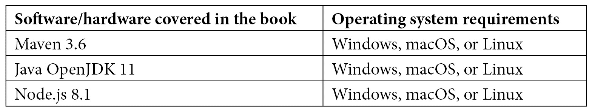

# 前言

尽管 Java 是在 1995 年诞生的技术，但它仍然充满活力。

不时地，会出现一些文章说 Java 已经过时，应该被摒弃，并应由其他语言取代。但现实是，Java 将长期存在。

这有多个原因，但最重要的是它就是*有效*：它解决了软件开发世界中的常见问题，解决得非常好。

Java 技术是这本书的主要内容。然而，在每一章中，我们都有机会讨论许多不同的想法，我认为其中大部分不仅超越了 Java 编程语言，而且在其他情况下也可能很有用。

事实上，在这本书中，我试图提炼出软件开发许多方面的概念，尤其是企业世界中的开发，在大型的复杂企业和项目中。目标是通过对最重要的话题进行关注，给你提供洞见。当然，鉴于主题的广度和复杂性，不可能深入探讨每个方面。但你会得到一些好的起点，如果你想要更详细的资料，你很容易找到更多资源。

大致按照典型软件项目的时间线，我们将从软件架构的基础开始，从需求收集到架构建模基础。我们还将查看最常见的发展模型，包括当然的 DevOps。

在书的第二部分，我们将探讨一些常见的软件架构模式。这包括 Java 架构模式，以及中间件（包括传统和云原生方法）和其他软件架构的基本组成部分，如集成、用户界面和数据存储。

在书的第三和最后一部分，我们将涵盖一些额外的主题，包括跨领域关注点（如安全、监控和跟踪）以及关于软件生命周期管理的考虑。最后，我们将快速浏览 Java 技术的最新版本。

# 这本书面向谁

这本书是为想要成为软件架构师并学习现代软件架构师所需基本概念的 Java 软件工程师而写的。这本书也适合想要扩展知识并跟上软件架构领域最新发展的软件架构师、技术领导者、工程经理、软件工程副总裁和 CTO。

不需要具备先前的知识，即使你已经熟悉 Java 语言和软件开发的基本概念，你仍然可以从这本书对不同架构相关主题的回顾中受益。

# 这本书涵盖的内容

*第一章*, *在 Java 中设计软件架构 – 方法与风格*，介绍了我们在整本书中将要采用的方法。我们将介绍多种不同的场景和一些真实世界的例子，以便阐明抽象概念，并将我们的观点转向实现。 

*第二章*, *软件需求 – 收集、文档化、管理*，解释了一些需求收集的技术以及一些用于文档化和跟踪它们的工具。

*第三章*, *常见的架构设计技术*，涵盖了最常用的架构定义格式以及它们旨在实现的目标。我们将通过不同的架构图来查看一个示例应用。此外，我们还将通过一些使用 BPMN 建模用例和使用 DMN 业务规则的示例。

*第四章*, *设计和开发的最佳实践*，我们将探讨可以帮助我们理解整体解决方案并实现它的不同方法。

*第五章*, *探索最常见的发展模型*，我们将概述最常见的软件开发模型及其影响，包括更传统和历史的模型（如瀑布模型）以及更现代的方法，如敏捷和 DevOps。

*第六章*, *探索核心 Java 架构模式*，探讨了架构模式。有一些架构模式非常常见，以至于它们已经变成了或多或少的标准。虽然有时会被过度使用，但这些架构必须被视为我们需要了解的基本构建块，以便解决常见的架构问题。

*第七章*, *探索中间件和框架*，我们将了解如何使用中间件和框架，理解它们在设计和构建我们的架构中的作用。

*第八章*, *设计应用集成和业务自动化*，在这一章中，作为上一章的后续，我们将看到两种典型的中间件实现。实际上，应用集成和业务自动化是两种常用的中间件功能，用于构建高效且可重用的企业架构。

*第九章*, *设计云原生架构*，我们将探讨什么是云原生应用，推荐的最佳实践是什么，以及如何增强现有应用以更好地适应云赋能的世界。

*第十章*，*实现用户交互*，我们将通过查看客户交互的不同入口点来详细说明全渠道方法。

*第十一章*，*处理数据*，我们将探讨不同类型的数据持久性以及何时如何将它们混合在一起。

*第十二章*，*跨切面关注点*，我们将总结需要考虑的最重要跨切面主题，包括身份管理、安全和弹性。

*第十三章*，*探索软件生命周期*，将讨论软件开发项目的所有辅助概念，例如源代码管理、测试和发布。这包括一些有趣的概念，如**持续集成和持续交付/部署**（也称为**CI/CD**）。

*第十四章*，*监控和跟踪技术*，将探讨与生产中运行的应用程序的可视性和维护相关的概念。这包括日志管理、指标收集和应用性能管理等内容。

*第十五章*，*Java 的新特性是什么？*，将重点关注最新的 Java 版本（17）以及该语言的历史（包括版本方案）以及 Java 供应商的生态系统。

# 为了充分利用本书

本书提供的代码示例足够通用，可以与任何供应商提供的最新 Java 版本一起运行。所有最常用的操作系统（Windows、macOS 和 Linux）都将工作。使用的构建和依赖管理工具是**Maven**。

建议的配置是**Java OpenJDK 11**和**Apache Maven 3.6**。对于 React 示例，使用了**Node.js 8.1**和**React 17**。



**如果您正在使用本书的数字版，我们建议您亲自输入代码或从本书的 GitHub 仓库（下一节中有一个链接）获取代码。这样做将帮助您避免与代码复制和粘贴相关的任何潜在错误。**

# 下载示例代码文件

您可以从 GitHub 下载本书的示例代码文件：[`github.com/PacktPublishing/Hands-On-Software-Architecture-with-Java`](https://github.com/PacktPublishing/Hands-On-Software-Architecture-with-Java)。如果代码有更新，它将在 GitHub 仓库中更新。

我们在丰富的图书和视频目录中还有其他代码包可供下载，请访问[`github.com/PacktPublishing/`](https://github.com/PacktPublishing/)。查看它们吧！

# 下载彩色图像

我们还提供了一份包含本书中使用的截图和图表彩色图像的 PDF 文件。您可以从这里下载：[`static.packt-cdn.com/downloads/9781800207301_ColorImages.pdf`](https://static.packt-cdn.com/downloads/9781800207301_ColorImages.pdf)。

# 使用的约定

在本书中使用了多种文本约定。

`文本中的代码`：表示文本中的代码单词、数据库表名、文件夹名、文件名、文件扩展名、路径名、虚拟 URL、用户输入和 Twitter 昵称。以下是一个示例：“每个测试方法都通过`@Test`注解进行标识。”

代码块设置如下：

```java
... 
@Test 
public void testConstructor() 
   { 
     Assertions.assertEquals(this.hello.getWho(),   
     "default"); 
   }
...
```

任何命令行输入或输出都按以下方式编写：

```java
mvn io.quarkus:quarkus-maven plugin:1.12.2.Final :create
```

**粗体**：表示新术语、重要单词或屏幕上看到的单词。例如，菜单或对话框中的单词以**粗体**显示。以下是一个示例：“以下图表显示了**IaaS**、**PaaS**和**SaaS**的比较。”

小贴士或重要提示

看起来像这样。

# 联系我们

我们始终欢迎读者的反馈。

`customercare@packtpub.com` 并在邮件主题中提及书籍标题。

**勘误**：尽管我们已经尽最大努力确保内容的准确性，但错误仍然可能发生。如果您在这本书中发现了错误，我们将不胜感激，如果您能向我们报告，我们将不胜感激。请访问 [www.packtpub.com/support/errata](http://www.packtpub.com/support/errata) 并填写表格。

`copyright@packt.com` 并附上材料的链接。

**如果您想成为一名作者**：如果您在某个领域有专业知识，并且对撰写或参与一本书籍感兴趣，请访问 [authors.packtpub.com](http://authors.packtpub.com)。

# 分享您的想法

一旦您阅读了《Java 实践软件架构》，我们很乐意听到您的想法！请[点击此处直接访问此书的亚马逊评论页面](https://packt.link/r/1-800-20730-1)并分享您的反馈。

您的评论对我们和科技社区都至关重要，并将帮助我们确保我们提供高质量的内容。
