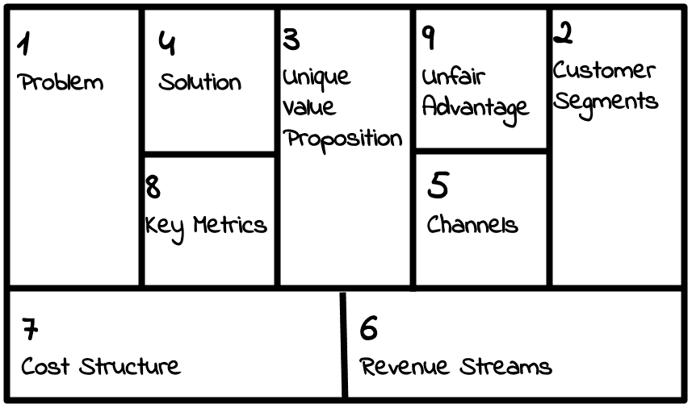
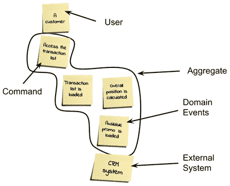

# 第二章：软件需求 – 收集、记录、管理

收集需求可能是软件生产中最令人沮丧的活动之一，原因有很多。困难往往源于谁才是所有者的身份从未完全明确，以及架构师无法在没有某些要求的情况下进行良好的设计，当然，开发者没有设计也无法做好工作。

然而，开发团队在没有完成完整的需求收集工作的情况下开始做某事是一种相当常见的做法，因为时间不允许。确实，在大型和复杂项目中，通常是在项目范围完全定义之前就设定了里程碑。在这个行业中，由于软件是一种无形的产品（不像建筑或桥梁），预算批准通常是一个更**灵活**的过程。因此，在所有细节（包括需求、可行性和架构设计）完全定义之前就批准一个项目并不罕见。不用说，这是一个固有的不良做法。

在本章中，我们将探讨收集和分析需求的不同技术，以提高我们软件交付成果的质量。

你将学习以下内容：

+   不同的需求类型：**功能**和**非功能**

+   一个需求必须具备哪些特征

+   如何以标准格式正式化需求

+   如何使用敏捷和互动技术收集需求

完成本章后，你将能够组织高效的需求收集会议并以清晰的方式记录它们。能够收集和正确记录需求可以在你的软件开发职业生涯中以多种方式带来真正的变革：

+   你生产的软件质量将更好，因为你将专注于真正需要的东西，并能很好地进行优先级排序。

+   你将更好地理解商业语言和客户的需求，因此将实现更符合他们需求的功能。

+   你将有机会进行非正式和互动的需求收集会议。（例如，参见*事件风暴*部分。）

+   你将了解软件需求规格的国际标准，这在某些环境中可能是一个硬性约束（例如，在为政府或医疗保健等受监管行业工作时）。

由于需求收集和管理是一种与特定编程语言无关的实践，因此本章不直接引用 Java 技术。

现在，让我们开始探索软件需求工程的学科。

# 介绍需求工程

从纯粹比喻的角度来看，如果一个算法类似于食物食谱，那么软件需求就像我们在餐厅下的订单。但相似之处可能到此为止。当我们点食物时，我们从离散的选项列表中选择一个特定的菜肴，可能还有一些小的调整。

此外，继续我们的例子，软件需求有一个更长且更复杂的生命周期（想想需求的测试和演变本身），而食物订单则非常明确地时间限制：顾客下单并收到食物。在最坏的情况下，顾客可能会不喜欢收到的食物（就像用户验收测试出错一样），但通常不会演变或更改订单。否则，当顾客满意且厨师做得很好（至少对那位特定顾客来说）时，一切正常。再次强调，与软件需求生命周期不同，你可能会结束于错误修复、增强等。

软件项目的需求复杂，可能难以识别和传达。软件需求工程是一项不寻常的工作。它需要客户、架构师、产品经理以及有时其他各种专业人士的共同努力。*但技术需求实际上是什么样子呢？*

## 特性、优势、利益

如我们将在接下来的几节中看到的，需求收集涉及许多不同的专业人士共同工作，以塑造最终产品的样子。这些专业人士通常分为两组，即业务意识和技术意识。当然，你应该期待这两个组有不同的愿景和不同的语言。

使用**特性、优势、利益逻辑流程**是建立这两组之间的共同基础并促进理解的好方法。

这个流行的框架，有时被称为**FAB**，是一种营销和销售方法，用于围绕产品构建信息。虽然它可能在需求收集阶段看起来并不直接相关，但它值得一看。

在 FAB 框架中，以下适用：

+   **特性**是产品的固有特性，严格与产品能做什么相关。

+   **优势**可以定义为使用特定特性时所实现的内容。通常，与同一技术特性相关联的优势不止一个。

+   **利益**是你想使用特性的最终原因。如果你愿意，它是从优势开始的进一步抽象步骤，通常与同一特性相关联的利益不止一个。

让我们来看一个 FAB 的例子，它与我们在上一章中延续的移动支付例子相关：

+   **特性**是指使用生物识别认证（如指纹或面部识别）进行支付的可能性。这只是技术方面，直接与应用程序的实现方式相关。

+   相关的**优势**是您不需要输入 PIN 或密码（并且总体上，您将与您的设备进行更简单的交互——可能只需要一个触摸）。这就是特性将实现的应用程序使用方面的内容。

+   相关的**好处**是您的支付将更快、更简单。但另一个好处可能是您的支付也将更安全（没有人会偷您的 PIN 或密码）。这基本上是您可能想要使用这个特定特性的原因。

正如你可以想象的，一个非技术人员（例如，销售人员或最终客户）可能会从好处或优势的角度来考虑每个需求。这是正确的做法。然而，在 FAB 流程上有推理可以帮助保持统一的观点，并且可能将期望重新定位为特性和最终需求。我们可以看看一个关于用户体验的简单例子。

坚持我们的移动支付示例应用，商业人士可能想要考虑的是使用此解决方案将带来的优势。

一个简单的需求例子可能是让用户在应用中轻松访问支付列表。与这个例子相关的特性将允许客户在登录系统后立即查看他们的交易列表。

为了完成我们的流程，我们还应该考虑好处，在这种情况下，这可能被描述为控制费用的能力。然而，这也可能相反。在与更懂技术的利益相关者进行推理时，更容易关注产品特性。

你可能会提出一个特性，例如*一个当前未在系统中配置的用户应该看到应用的演示版本*。

这里的优势是有一个简单的方式来尝试应用程序的功能。对于客户来说，好处是他们可以在注册账户之前尝试应用程序。对于企业来说，好处是他们有免费广告，可能吸引更多客户。

你现在可能会问，*在进行需求收集，也就是寻找特性时，我在寻找什么？* 这里没有简单的答案。

我个人的经验表明，一个特性可能直接被视为需求，或者更常见的是，由多个需求组成。然而，具体到产品类型和需求表达方式，你的体验可能会有所不同。

关于 FAB 推理的最后一件事要注意的是，它将有助于聚类需求（根据相似的需求或好处），以及优先排序它们（取决于哪个好处最重要）。

现在我们有一个简单的过程来将我们产品的技术特性与业务影响联系起来。然而，我们还没有确切地定义什么是需求以及它的内在特征。让我们探索一下需求看起来是什么样子。

## 特性和技术需求

正如我们在上一节中看到的，需求通常与系统的**功能**紧密相关。根据提出请求的人，需求可以以不同程度的技术细节进行指定。一个需求可能低到定义 API 或其他软件接口的程度，包括参数和定量输入验证/结果。以下是一个详细的技术性需求示例：

*当输入账号号码（字符串，六位字符）时，系统必须返回个人资料信息。结果代码为* `int` *(成功时为 0)，姓名为* `string`*，姓氏为* `string`* [……]。如果账号格式无效，系统必须返回一个结果代码，以标识错误的原因，按照待定义的映射表进行。*

通常，需求的技术性较低，更多地识别系统的行为方面。在这种情况下，根据我们在上一节中讨论的模型（*功能、优势和利益*），我们谈论的是诸如功能或相关优势之类的东西。

以下是一个示例，与之前的功能相同，可能看起来是这样的：

*用户必须能够通过输入账号号码来访问他们的个人资料。*

很容易理解，在交付给开发团队之前，非技术性需求必须以定性和客观的方式进行详细说明。*但什么使需求具有定性和客观性？*

## 需求的类型和特性

有许多特性使需求有效，意味着易于理解，并以非歧义的方式满足客户期望。

从我个人观点来看，为了有效，需求必须具备以下特点：

+   **一致性**：需求不得与其他需求或现有功能冲突，除非这是故意的。如果是故意的（例如，我们正在删除旧功能或修复错误行为），新的需求必须明确覆盖旧需求，这可能是需要注意的点，因为边缘情况和冲突很可能会发生。

+   **可实施性**：这首先意味着需求应该是可行的。如果我们的系统需要实现直接的大脑接口，这当然是不行的（至少在今天是这样）。可实施性还意味着需求必须在合理的时间内和合理的成本下实现。如果需要 100 年才能实现，从理论上讲是可行的，但可能不太实用。

此外，这些点需要在当前项目的背景下考虑，因为尽管在一种环境中实现某事可能很容易，但在另一种环境中可能不可行。例如，如果我们是一家初创公司，我们可能可以在我们的应用程序上推出一项全新的服务，这对现有用户群的影响可能很小。然而，如果我们是一家大型企业，拥有庞大的客户群和固化的访问模式，这可能需要更彻底的评估。

+   **明确性**：软件需求中不应存在任何解释空间。当需求以自然语言定义时，由于很多未言明的数据被错误地视为理所当然，因此很可能会出现歧义。因此，建议使用表格、流程图、界面原型或任何有助于阐明自然语言并避免歧义的方案。此外，建议使用直接的语言，使用定义的数量，祈使动词，并且不使用隐喻。

+   **可测试性**：在当前的开发哲学中，高度关注实验和试错（我们将在接下来的章节中了解更多），一个需求必须被翻译成软件测试用例，如果能完全自动化则更好。虽然可能预期客户对软件测试技术没有了解，但必须有可能将测试场景记录在纸上，包括诸如在广泛输入范围内的预期输出表等。

质量保证部门可能在稍后阶段，通过更广泛的案例来补充这个规范，以测试诸如输入验证、预期失败（例如，输入过大或格式不正确的情况）和错误处理等问题。安全部门也可能通过测试恶意输入（例如，SQL 注入）来深入研究这个问题。

这个最后一点引导我们思考需求的技術后果。正如我们在本章开头所说的，需求通常被暴露为系统的业务特性（其技术立场可能因细节程度的不同而有所变化）。

然而，存在一些**隐含**的要求，它们不是特定业务用例的一部分，但对于系统正常工作至关重要。

要深入了解这个概念，我们必须将需求分为三种基本类型：

+   **功能需求**：描述系统的业务特性，从预期的行为和要覆盖的使用案例来定义。这些是通常影响要实施系统的用例的常规业务需求。

+   **非功能性需求**：通常不与任何特定用例相关联，这些需求对于系统正常运行是必要的。非功能性需求通常不是由定义功能性需求的同一用户表达的。它们通常关于应用的隐含方面，对于使事物正常工作是必要的。非功能性需求的例子包括性能、安全和可移植性。

+   **约束**：隐含需求通常被视为“必须”的，是强制性的。这包括外部因素和需要视为理所当然的事情，例如遵守法律和法规以及符合标准（公司内部和外部）。 

这里可以举一个例子，那就是广为人知的**通用数据保护条例**（**GDPR**），这是关于数据保护和隐私的欧盟法律，如果你在欧洲运营，就必须遵守。但根据你运营的特定市场，你可能还必须遵守行业标准（当与银行和支付公司合作时这种情况很常见），甚至是你所在公司强制执行的标准。一个常见的例子是软件的兼容性（例如，当它必须与某个操作系统的特定版本或特定浏览器兼容时）。

现在我们已经看到了不同类型的需求及其特征，让我们来看看软件需求的生命周期。

## 需求的生命周期

需求的规范通常不是立即的。它始于一个关于系统应该如何工作以满足用例的想法，但需要重新工作和详细说明才能被记录下来。它必须与非功能性需求（或与之混合）进行核对，当然，随着项目的进行可能会发生变化。换句话说，需求的生命周期可以总结如下。每个阶段都有一个输出，这是下一个阶段的输入（路径可能是非线性的，正如我们将看到的）：

+   **收集**：以非结构化和原始格式收集用例和期望的系统功能。这可以通过多种方式完成，包括访谈、集体草图和头脑风暴会议，包括客户和内部团队。**事件风暴法**（我们很快就会看到）是进行头脑风暴会议的一种常见结构化方法，但在这里通常使用较少结构化的技术，例如使用便利贴来张贴来自客户和内部团队的创意。在这个阶段，数据的收集通常自由流动，不需要太多阐述，人们更关注创造性过程，而不是新功能的细节和影响。这个阶段的输出是一个非结构化的需求列表，可能以电子形式（电子表格或文本文档）收集，甚至只是一张贴有便利贴的墙的照片。

+   **审查**：作为一个自然的后续步骤，在这个阶段，对前一阶段输出的需求进行大致分析和分类。必须解决矛盾和不可行的话题。在这个阶段来回走动并不罕见。这里的输出仍然是一个非结构化的列表，类似于我们从前一阶段得到的列表。但我们开始对其进行润色，通过删除重复项、识别需要更多细节的需求等。

+   **分析**：在这个阶段，我们需要对前一阶段输出的内容进行更深入的分析。这包括识别每个新功能实施的影响、分析需求的完整性（对一系列重要输入、边缘情况和验证的期望行为）、以及需求的优先级。虽然不是必需的，但在这个阶段对每个需求的实施成本有一个大致的了解并不罕见。这一步骤的输出是一个更加稳定和完善的列表，基本上是输入的一个子集。但我们仍在讨论非结构化数据（例如，没有 ID 或缺少一些细节），这是我们将在下一阶段解决的问题。

+   **规范**：鉴于我们已经完成了每个需求的研究，现在是时候对其进行适当的记录，捕捉到目前为止探索的所有方面。我们可能已经在前一阶段收集了草案和其他数据（例如，纸上的模式、白板图片等），只需转录和润色即可。这一阶段编写的文档在整个项目期间必须可访问和可更新。这对于跟踪目的至关重要。这一阶段的输出将是每个需求都经过检查并以适当的方式记录，无论是通过文档还是使用工具。关于这一点，本章的“收集需求 – 格式和工具”部分有更多细节。

+   **验证**：由于我们已经从前一阶段得到了每个需求的正式文档作为输出，因此与客户进行双重检查，以确保最终的重工覆盖了他们的需求，是一种最佳实践。在看到需求在纸上后，为了重新关注某些用例或探索前一阶段中揭露的新场景，有时需要回到收集阶段，这是不常见的。这一阶段的输出格式与前一阶段的输出格式相同，但你可以期待内容（如优先级或添加/删除细节和内容）有所变化。即使预期会有一些重工作业，这些数据也可以被认为是开发阶段的一个良好起点。

因此，需求生命周期可以看作是一个简单的流程。有些步骤直接导致下一步，而有时你可以循环回到阶段并后退一步。从图形上看，它可能看起来像以下图表：

![图 2.1 – 软件需求生命周期]

图 2.1 – 软件需求生命周期

正如你在前面的图中可以看到的，软件需求规格说明书往往不仅仅是软件生命周期的一个简单阶段。实际上，由于需求塑造了软件本身，它们可能遵循自己的工作流程，不断演变并经历迭代。

根据这个流程的第一步，让我们来看看需求收集。

# 发现和收集需求

需求生命周期的第一步是**收集**。需求提取是其中的一个隐含部分。在开始审查、分析和最终记录需求之前，你需要开始对话并让想法流动。

要实现这一点，你需要房间里的人选正确。这看起来可能微不足道，但通常并不清楚需求的来源应该是谁（例如，业务部门，包括销售、高管、项目赞助人等在内的一个模糊的人群）。*即使你设法让这些人参与进来，还有谁对需求收集是相关的？*

这里没有金科玉律，因为它严重依赖于项目环境和团队构成：

+   你肯定需要一些**高级技术资源**，通常是首席架构师。这些人将通过提供关于技术可行性和大致工作量估计的初步高级指导来帮助。

+   其他有用的参与者是**企业架构师**（或业务架构师），他们能够评估解决方案对整个企业流程和技术架构的影响。这类角色当然在大型和复杂的企业中更有用，在其他环境中（如初创公司）可能不那么有用。作为进一步的考虑，具有这种背景的经验丰富的人可以针对已知问题提出已知解决方案，与已经使用的类似应用（甚至可能在可能的情况下重用功能）进行比较。

+   **质量工程师**可以作为团队的好补充。虽然他们可能在技术解决方案和现有应用方面经验较少，但他们可以从测试用例的角度思考建议的需求，缩小范围并使它们更加具体、可衡量和可测试。

+   **安全专家**可以非常有帮助。在软件生命周期的早期考虑安全问题是避免后期出现意外的好方法。虽然不是详尽的，但快速评估提议需求的安全影响可能非常有用，提高软件质量并减少返工的需要。

既然我们已经把所有需要的人聚集到了一起，让我们看看一些破冰和保持想法流动的练习，以便确定我们的需求。

我们将要探讨的第一个实践是**精益画布**。这项练习在创业运动中被广泛使用，它侧重于将团队聚集在一起，确定你的想法中哪些是重要的，以及它将如何区别于竞争。

## 精益画布

**精益画布**是一种对需求的整体方法，关注产品的关键方面，以及整体商业环境和可持续性。

最初作为一种针对初创企业的工具，这种方法论是由 Ash Maurya（本书作者、企业家和 LEANSTACK 的首席执行官）开发的，它是商业画布（由亚历山大·奥斯特瓦尔德创建的一种类似方法，更侧重于产品的商业模式）的演变/简化。这种方法基于一个单页模板，用于从商业想法中收集解决方案需求。

模板由九个部分组成，突出了最终产品必须具备的九个关键方面：

图 2.2 – 精益画布框架

注意，每个部分的编号反映了填写各部分应遵循的顺序。以下是每个部分的意义：

1.  **问题**：*我们的客户通过使用我们的软件产品将解决哪些问题？*

1.  **客户群体**：*谁是我们软件产品的理想用户（即，有我们产品将解决的问题的人）？*

1.  **独特价值主张**：*为什么我们的软件产品与其他解决类似问题的潜在替代品不同？*

1.  **解决方案**：*我们的软件产品将如何解决第一部分中的问题？*

1.  **渠道**：*我们将如何接触我们的目标客户？*（这与我们将如何营销我们的软件解决方案直接相关。）

1.  **收入来源**：*我们将如何从我们的软件解决方案中赚钱？*

1.  **成本结构**：*构建、广告和维护我们的软件解决方案需要多少成本？*

1.  **关键指标**：*需要使用哪些关键数字来监控项目的健康状况？*

1.  **不公平优势**：*这个项目有什么是其他人无法复制/购买的？*

目的是在每个这些区域填充一个或多个关于产品特性的命题。这通常是在非正式环境中作为团队工作完成的。画布在白板上展示，每个参与者（通常是产品所有者、创始人和技术负责人）通过在相关部分粘贴便利贴来贡献想法。通常随后是一个*后处理*集体阶段，将类似的想法分组，淘汰不那么相关的想法，并优先考虑每个部分剩下的内容。

如您所见，这里的重点转向了整个项目的可行性，而不是详细的功能列表和规格。因此，这种方法论通常用作向潜在投资者进行电梯演讲的支持。在这个第一阶段之后，如果从商业模式的角度来看，项目看起来有希望且可持续，可以使用其他技术来创建更详细的需求规范，包括已经讨论过的，以及我们将在下一节中看到的更多内容。

虽然精益画布更多地面向业务模型以及它如何映射到软件功能，但在下一节中，我们将探讨事件风暴，这是一种通常更专注于解决方案技术建模的发现实践。

## 事件风暴

**事件风暴**是一种敏捷和互动的方式来发现和设计业务流程和领域。它由阿尔贝托·布兰多利尼（IT 顾问和意大利领域驱动设计社区创始人）在一篇现在广为人知的博客文章中描述，自那时起已被广泛使用并不断完善。

这种实践的好处是它非常友好，并且很好地支持头脑风暴和跨团队合作。

要运行一个事件风暴会议，你需要从各个部门收集合适的人。通常至少需要业务和 IT 部门，但你可以为这种工作坊提供各种不同的风味，邀请不同背景的人（例如，安全、UX、测试人员）来关注不同的观点。

当房间里有了合适的人的组合时，你可以使用一个工具来帮助他们相互交流。当使用物理房间（工作坊也可以远程进行）时，最好的工具是一面墙和便利贴。

这个练习的目的是从用户的角度设计业务流程。*那么你该如何做呢？*

1.  你开始描述与用户体验相关的**领域事件**（例如，选择一个收件人）。这些领域事件被转录在传统的橙色便利贴上，并按照时间顺序贴在墙上。

1.  然后你关注导致领域事件的根本原因。如果原因是用户交互（例如，用户从列表中选择一个收件人），它被称为**命令**，并以蓝色便利贴的形式跟踪，贴在相关事件附近。

1.  你可以接着草拟命令背后的**用户**（例如，银行的客户）。这意味着草拟一个执行命令的用户的人物描述，并在命令附近的黄色便利贴上跟踪它。

1.  如果领域事件是由其他领域事件生成的（例如，选定的收件人被添加到最近使用的联系人中），它们只是简单地贴在一起。

1.  如果有与**外部系统**的交互（例如，收件人被发送到 CRM 系统进行识别），它们以粉色便利贴的形式跟踪，并贴在相关领域事件附近。

让我们看看事件风暴的一个简单示例。以下只是更大用例的一部分；这个子集简洁地表示了用户对其交易列表的访问。用例在这里并不重要，它只是用来展示这种技术的主要组成部分：

图 2.3 – 事件风暴组件

在图中，你可以看到事件风暴会议的一个小但完整的子集，包括代表不同组件（**用户**、**命令**和**领域事件**）的便签以及代表聚合的分组。

*你从这个类型的表示中获得了什么？*

+   对整体过程的共同理解。

+   事件和命令的聚类，识别所谓的**聚合**。这个概念对于解决方案的建模非常重要，我们将在*第四章*“设计和开发最佳实践”中再次讨论这个问题，当谈到领域驱动设计时。

+   系统状态的瓶颈和状态之间不明确的链接的视觉识别。

需要注意的是，这种方法通常被视为一个框架。你可能希望根据你的需求进行定制，跟踪不同的实体，绘制简单的用户界面来定义命令，等等。此外，这类会议通常是迭代的。一旦你达到了完整的视图，你可以与不同的受众重新开始会议，以进一步丰富或完善这个视图，专注于子领域等。

在下一节中，我们将探讨一些替代的发现实践。

## 更多发现实践

收集需求和文档是一种综合性的实践。你可能会发现，在头脑风暴会议（例如，精益画布、事件风暴或其他类似实践）之后，可能还需要其他的需求工程技术来完成愿景并探索在会议中出现的某些场景。让我们快速探索这些其他工具，以便你可以将它们添加到你的工具箱中。

### 问卷调查

提问和回答是捕捉关于软件项目固定点的非常简单和简洁的方式。如果你能够编制一套全面的提问，你可以向不同的利益相关者展示你的问卷以收集答案并比较不同的观点。

困难的部分是构建这样一个问题列表。你可能从以前的项目中获得了一些想法，但鉴于问题和答案是相当*封闭路径*的练习，如果你处于项目的初期，这并不是特别有帮助。实际上，如果你是从一张白纸开始，这不是最佳的方法，因为它不是针对培养创造性的解决方案和想法的。因此，我建议主要使用这种方法来详细说明以其他方式出现的想法和用例（例如，在运行头脑风暴会议之后）。

### 原型和概念验证

明确想法的一个绝佳方法是直接通过操作产品功能的一个子集（即使这些功能是虚假的或只是占位符）来测试产品的外观。如果你能开始构建低成本的原型，或者仅仅是模拟（没有后台真实功能的虚假界面），你可能会更快地将非技术利益相关者和最终用户纳入其中，因为他们有机会与产品互动，而不是仅仅想象它。

这在用户体验设计中尤其有用，并且可以展示不同的解决方案。此外，在现代开发中，这种技术可以演变成更短的反馈循环（尽早发布，经常发布），让利益相关者测试产品的 alpha 版本而不是模拟，这样他们可以了解最终产品的样子，并尽快改变方向。

### A/B 测试

这个概念的另一个用途是让最终用户自行测试并推动产品进化。这种被称为**A/B 测试**的技术被高性能组织在生产中应用，并需要一些技术支持来实现。其原理相当简单：你选择两个（或更多）替代功能，将它们投入生产，并衡量它们的性能。在进化设计中，表现最好的将生存下来，而其他将被淘汰。

如你所想，这里的难点在于细节。实施更多替代方案并淘汰其中一些可能会很昂贵，因此它们之间通常只有细微的差别（例如，UI 元素的颜色或位置）。此外，性能必须以客观的方式进行衡量，例如，在电子商务中，你可能衡量对购买的影响，或在广告中衡量横幅和活动的转化率。

### 商业智能

另一个用于完善和充实需求列表的工具是**商业智能**。这可能意味着向潜在客户发送调查，探索竞争对手的功能，以及进行一般市场研究。你不应期望仅使用这种方法就能得到精确的功能和用例列表，但它可能有助于完善你对项目的看法或产生一些新想法。

你可能想检查你的最终系统想法是否与最终客户产生共鸣，你的系统与竞争对手相比如何，或者是否有可以做得更好/不同的领域。这个工具可以用来验证你的想法或收集一些最后的拼图碎片。查看*图 2.1*，这是验证阶段你可能想要做的事情。

现在，我们已经收集了大量需求和观点。按照我们在本章开头看到的生命周期，现在是进行需求分析的时候了。

# 分析需求

我们迄今为止所看到的发现实践主要涵盖了需求的收集和审查。我们基本上从利益相关者那里获取了期望的软件功能的详细信息，并可能开始通过聚类、删除重复项和解决宏观冲突来组织它们。

在分析阶段，我们将进一步探讨需求的影响，并完善我们对最终产品应如何呈现的愿景。考虑到产品开发是一个流动的过程，尤其是如果你正在使用现代项目管理技术（更多内容请参阅*第五章*，*探索最常见的发展模型*)，因此你应该考虑，可能不会实施每个定义的需求，并且肯定不会在同一个版本中实施所有内容——可以说我们是在射击一个移动的目标。此外，很可能在以后还会开发出更多需求。

因此，需求分析可能每次都会进行，采用迭代的方法。让我们从分析需求时应考虑的第一个方面开始。

## 检查连贯性和可行性

在第一部分，我们明确指出，需求必须是连贯且可实现的。这就是我们在分析阶段应该寻找的。

对于这个问题，没有特定的方法。它是一种定性活动，逐个审查需求并交叉检查以确保它们之间没有冲突。对于大型和复杂的需求集，这项活动可能被视为一个*初步审查*，因为在设计和实施过程中可能不会出现明确的冲突。在可行性方面，也可以进行类似的考虑。在这个阶段，重要的是要抓住大的问题，并识别出看似不可行的需求，然而，在后续阶段可能会出现更多的问题。

如果发现了不连贯或不可行的需求，与相关利益相关者（通常是业务部门）进行审查是至关重要的，以便重新考虑相关的功能，并做出更改。不时地对需求进行小的修改可以使它变得可行。一个经典的场景是与选择数据子集或做出类似的妥协有关。在我们的移动支付示例中，可能无法立即显示实时更新的整个交易列表，然而，仅显示其中的一部分（例如，去年的数据）或在新交易发生时有一定的可视化延迟（例如，几秒钟）可能是一个好的折衷方案。

## 检查明确性和可测试性

继续检查需求特征，现在是时候检查每个需求的具体性和可测试性了。这可能与上一部分稍微系统化和量化一些。本质上，你应该逐个检查需求，看每个需求是否以定义的方式表达，以便容易理解实施是否正确完成。换句话说，需求必须是可测试的，最好是客观和可自动化的方式可测试。

对明确性的测试带来了完整性的概念。一旦一个需求（以及相关的功能）被接受，就必须覆盖所有不同的路径，以便在大多数可预见的情况下为产品提供可预测的行为。虽然这可能看起来很困难且复杂，但在大多数情况下，只需玩弄可能的输入范围和条件分支，以确保所有可能的路径都被覆盖即可。默认情况是另一个需要考虑的重要方面；如果软件不知道如何对特定条件做出反应，那么定义合理的、标准的答案以供参考是个好主意。

## 检查非功能性需求和约束

作为最后一步，重要的是要遍历需求列表，寻找非功能性需求和约束。这个话题很广泛且主观。很可能不可能（也不实用）明确所有非功能性需求和约束并将它们列入我们的清单。其中大部分与现有项目共享，受外部机构监管，或者简单地未知。

然而，有一些领域对项目实施具有重要影响，因此，在分析阶段必须予以考虑。

这里的一个常见问题是安全问题。关于用户会话、对未认证用户应采取什么措施、以及如何管理用户登录等问题，除了对用户体验产生影响外，还会对解决方案的可行性和复杂性产生影响。对于性能，可以进行类似的推理。正如在*检查一致性和可行性*部分所看到的，数据量和系统预期性能的微小变化可能会产生重大差异。非技术人员忽视这些方面或期望不合理的目标并不罕见。就预期结果达成一致（并协商）是预防项目后期出现问题的良好方式。

其他非功能性需求和约束的考虑在特定用例中可能特别相关。考虑到这种推理也可能被带入项目规划阶段，在这个阶段，预算或时间框架的约束可能会推动路线图和发布计划。

现在，我们已经完成了软件需求生命周期中的分析阶段。正如预期的那样，我们现在将进入规格阶段。我们将从一个非常正式和结构化的方法开始，然后看看一个不那么结构化的替代方案。

# 根据 IEEE 标准指定需求

**电气和电子工程师协会**（**IEEE**）在软件需求标准化领域推动了各种努力。像往常一样，在这种行业标准中，文档相当完整和广泛，以非常冗长的方式涵盖了众多方面。

在特定环境中的特定项目中使用这些标准可能是必要的（例如，公共部门、航空、医学）。IEEE 在这方面最著名的成果是 830-1998 标准。这个标准已被 ISO/IEEE/IEC 29148 文档系列所取代。

在本节中，我们将涵盖这两个标准，查看文档在内容、模板和最佳实践方面的描述，以定义符合标准的需求。

## 830-1998 标准

**IEEE 830-1998**标准专注于**软件需求规格说明书**文档（也称为**SRS**），提供模板和建议，涵盖内容。

一些概念与前面章节中讨论的概念非常相似。标准声明了需求规格说明书必须具备的所有特点。每个需求规格说明书都应该如下：

+   正确

+   不含糊

+   完整

+   一致

+   按重要性或稳定性排序

+   可验证性

+   可修改性

+   可追溯性

如您所见，这与需求的特点相似。这里增加的一个有趣的新概念是需求的排序。特别是，文档建议根据重要性对需求进行分类，为需求分配优先级，例如基本、条件、可选和/或稳定性（稳定性指的是由于周围组织的演变而对需求预期发生变化的数量）。

在这个标准中讨论的另一个有趣的概念是**原型设计**。我认为这非常具有前瞻性，考虑到这个标准是在 1998 年定义的。在能够廉价地创建存根和模拟之前，正如今天所常见的那样，这个标准建议使用原型来实验系统的可能结果，并将其用作收集和定义需求的支持。

我想要强调的关于 IEEE 830-1998 标准的最后一个重要点是模板。该标准提供了一些样本和一个建议的软件需求规格说明书索引。议程包括以下内容：

+   **引言**：涵盖系统的概述，以及其他设置领域概念，如文档范围、项目目的、缩略语列表等。

+   **总体描述**：描述背景和支撑需求的结构。在这里，您可以定义约束（包括技术约束）、与外部系统的接口、系统的预期用户（例如，技能水平）以及产品功能（旨在提供一个产品范围的概述，而不包括映射到特定需求的细节）。

+   **具体需求**：指的是需求本身。在这里，期望以高度详细的方式指定所有内容，重点关注输入（包括验证）、预期输出、内部计算和算法。标准为需要涵盖的主题提供了大量建议，包括数据库设计、对象设计（如面向对象编程）、安全等。

+   **支持信息**：包含目录、索引和附录等辅助信息。

如您所见，这份 SRS 文档可能显得有些冗长，但它是一种全面且详细地表达软件需求的方法。正如我们将在下一节中看到的，IEEE 和其他组织已经取代了这一标准，扩大了范围并包括了更多需要涵盖的主题。

## 29148 标准

如前几节所述，830-1998 标准已被一个更广泛的文档所取代。29148 系列标准代表了对 830-1998 的扩展。新的标准内容丰富且结构清晰。它提到了 SRS 文档，严格遵循相同的议程，但增加了一个名为**验证**的新章节。本章节涉及为软件的每个元素指定测试策略，建议您为 SRS 其他章节中指定的每个元素定义验证。

除了 SRS 文档外，29148 标准还建议了四个额外的交付成果。让我们快速了解一下：

+   **利益相关者需求规范**：将软件项目置于业务视角，分析其周围的商业环境及其对商业利益相关者观点的影响。

+   **系统需求规范**：关注正在实施软件与其他系统之间交互的技术细节。它指定了应用程序的领域以及输入/输出。

+   **系统操作概念**：从用户的角度描述系统的功能。它对系统的操作、政策以及约束（包括支持的硬件、软件和性能）、用户类别（意味着不同类型的用户以及他们如何与系统交互）、操作模式等提出了观点。

+   **操作概念**：这不是一个强制性的文档。当提供时，它涉及整个系统及其如何适应客户的整体商业战略。它包括投资计划、业务连续性和合规性等内容。

正如我们所见，标准文档是合理化需求并以全面方式记录它们的非常精致和完整的方式。然而，有时以这样详细和正式化的方式记录需求可能不切实际。尽管如此，将这些内容作为参考并考虑提供相同的信息是很重要的，即使不是使用完全相同的模板或详细程度。

在下一节中，我们将探讨需求收集的替代简化格式以及管理它们的工具。

# 收集需求 - 格式和工具

为了管理和记录需求，你可以使用你选择的工具。实际上，许多团队使用电子文档来详细说明需求并跟踪它们的进展，即它们在需求生命周期中的哪个阶段。然而，当需求变得复杂，团队规模扩大时，你可能想要开始使用更定制的工具。

让我们先看看所需的数据，然后我们将关注相关的工具。

## 需要收集的软件需求数据

无论你选择哪种工具，都有一组信息你可能想要收集：

+   **ID**：需要一个唯一的标识符，因为需求将在许多不同的上下文中被交叉引用，例如测试用例、文档和代码注释。它可以遵循命名约定，也可以简单地是一个递增的数字。

+   **描述**：要实施的用例的口头说明。

+   **前提条件**：（如果相关）用例起源的情况。

+   **必要性**：需求的重要性，通常分类为“必须要有、应该要有或最好有”。这可能有助于筛选要包含在版本中的需求。

+   **优先级**：一种对需求进行排序/聚类的途径。同时，也是一个有用的方式来筛选要包含在版本中的需求。

+   **来源**：需求的所有者。它可能是一个部门，但如果有明确的联系人以供澄清需要时联系会更好。

+   **组别**：一种将需求按功能区域聚类的途径。同时，也可以是有用的方式来收集一组要在一个版本中实施的需求。

+   **家长**：这是可选的，如果你想要实现一个由一系列子需求组成的复杂/高级需求层次结构。

这些是收集每个软件需求的基本属性，以丰富任何可能在你所在环境中相关的额外列。

你可能还想要跟踪每个需求的实施情况。通常，这样做所需的属性包括以下内容：

+   **状态**：对实现状态的综合性描述，包括如未分配、已分配、开发、测试和完成等状态。

+   **负责人**：被分配此需求的项目团队成员。这可能是开发者、质量工程师或其他人，具体取决于状态。

+   **目标发布版**：旨在包含此需求的目标软件发布版。

+   **阻碍因素**：此需求是否为此次发布所必需。

+   **依赖项**：此需求是否在可以开始工作之前依赖于其他需求（以及它们是什么）。

此外，在这种情况下，这是一个用于跟踪需求状态的常见信息子集。它可能根据你特定环境中的工具和项目管理技术而改变。现在让我们来看看收集和管理这些信息的工具。

## 在表格中收集软件需求

观察上一节中描述的属性列表，你可以想象这些需求可以很容易地收集到表格中。它是一种表格格式，每行一个需求，列对应着我们讨论的信息。此外，你可以在同一行中进行状态跟踪，或者通过 ID 在不同的表格中关联。此外，你可以通过属性（例如，优先级、组、状态）过滤表格，对其进行排序，并在相关的地方限制/验证输入（例如，限制来自指定列表的值）。还可以添加辅助值（例如，最后修改日期）。

这可能是一个需求表格可能的样子：

![图 2.5 – 状态跟踪表格

![图 2.4 – 需求表格

图 2.4 – 需求表格

如前所述，我们可以有一个表格来跟踪每个需求的进展。它可能看起来像下面的示例：

![图 2.4 – 需求表格

![图 2.5 – 状态跟踪表格

图 2.5 – 状态跟踪表格

在接下来的几节中，我们将探讨可用于支持需求收集和文档的工具。

## 软件需求管理专用工具

如前所述，对于更大的团队和长期项目，专用需求管理工具可能比共享文档/表格更容易使用。

最有用的功能通常是拥有一个集中的仓库，避免使用文档时出现的来回（以及缺乏同步）问题。其他值得寻找的功能包括审计（跟踪变更）、通知、报告和高级验证/引导输入。此外，与源代码管理（例如，将功能与提交和分支关联）的集成相当常见且有用。

需求管理软件通常是项目管理更大套件中的工具之一。以下是一些常见的产品：

+   **Jira**是一个相当广泛的项目管理工具包。它最初作为一个问题跟踪工具，用于跟踪软件产品的缺陷。它通常也用于跟踪特性。它还可以通过插件扩展，丰富特性收集、组织和报告的功能。

+   **Redmine**是一个开源工具，包含许多不同的项目管理功能。最有趣的是它的可定制性，允许您跟踪特性、关联自定义字段、引用源代码管理工具（例如，Git），以及定义甘特图/日历。

+   **IBM Rational DOORS**是用于需求管理的商业软件，非常完整，面向中大型企业。它是 Rational 套件的一部分，最初由 Rational Software（现在是 IBM 的一部分）开发，该套件也因贡献于 UML 符号的创建而闻名，我们将在下一章讨论。

选择需求管理工具是一个复杂的过程，涉及成本分析、功能比较等，这远远超出了本书的目标。

## 电子表格与工具对比

是否使用专用工具与电子表格（或文档）来管理需求列表是一个常见的争议。通常的做法是开始使用更简单的方法（如电子表格），一旦项目变得太大或太复杂而无法以这种方式管理，就转向使用工具。此外，经理和非技术用户更愿意使用电子表格，因为他们对这种技术更熟悉。相反，技术团队发现使用专用工具通常更有效。像往常一样，没有一种方法适合所有人，但坦白说，使用专用工具的好处很多。

最直接的方法是拥有一个集中的存储库。需求管理工具旨在实时使用，作为中央、单一的真实来源。这使我们能够避免使用文档时出现的来回（以及缺乏同步）问题（虽然您可能会在这里提出异议，即许多 Office 套件现在提供实时共享和协作编辑）。

专用工具还包括的其他有趣功能有审计（跟踪变更）、通知、报告和高级验证/引导输入。

此外，与源代码管理（例如，将特性与提交和分支关联）的集成相当普遍，并且受到开发团队的欢迎。管理层也可以从计划和洞察功能中受益，例如图表、聚合视图以及与其他项目管理工具的集成。

因此，最终，我强烈建议如果可能的话，采用一个完整的需求管理工具而不是简单的电子表格。

在下一节中，我们将探讨需求验证，这是软件需求生命周期中的最后一步。

# 验证需求

正如我们所见，需求生命周期的最后阶段涉及验证需求。在这个阶段，所有产生的文档都期望被所有利益相关者审查和正式同意。

虽然有时会被忽视并被认为是非必需的，但这个阶段实际上非常重要。通过正式的协议，你将确保所有对需求列表的迭代，包括双重检查和扩展部分需求，仍然反映了项目的原始意图。

业务确保所有优势和利益都将实现，而技术团队将检查功能是否正确地映射到一组可实施的需求中，以便开发团队能够清楚地了解期望的内容。

这个**结束阶段**可以被认为是项目真正启动的起点。在这个阶段，我们对将要实施的内容有了更清晰的认识。然而，这并不是最终决定；在设计平台和启动项目计划时，你可能会预期产品会进行重新设计。可能只是一系列功能会被实施，而其他功能可能会稍后以书面形式提出。

在本节中，我们经历了一次需求生命周期的旅程。正如已经说过的，大多数这些阶段都可以被认为是迭代的，并且需要多个循环才能完成整个过程。让我们快速回顾一下需求生命周期以及我们迄今为止看到的实践：

+   **收集** **和** **审查**：正如我们所见，这两个阶段是严格相关的，并涉及跨团队的努力，以创造性地表达想法并定义最终产品应该如何看起来。在这里，我们看到了头脑风暴的技术，如精益画布、事件风暴等。

+   **分析**：这个阶段包括检查一致性、可测试性等。

+   **规范**：这包括 IEEE 标准以及一些不太正式化的标准和工具。

+   **验证**：这是对一系列需求正式签字和接受的过程。正如所说，通过回到前面的阶段进行进一步的迭代重工作，这种情况并不少见。

在下一节中，我们将继续探讨我们的移动支付示例，重点关注需求分析阶段。

# 案例研究和示例

在继续我们关于移动支付解决方案的案例研究时，我们将关注需求收集阶段。为了简化，我们将仅关注一个小而具体的场景：平台两个用户之间的点对点支付。

## 移动支付应用程序示例

正如我们在每一章中所做的那样，让我们看看本章讨论的概念在作为案例研究的移动支付应用程序中的应用示例。

### 需求生命周期

在现实世界中，需求的生命周期合理地需要几周（或几个月），累积了很多需求，并对它们进行重新工作，因此为我们的移动支付场景构建一个完整的需求生命周期示例是不切实际的。然而，我认为看看一个特定需求如何在我们看到的各个阶段中演变将会很有趣：

1.  在**收集**阶段，我们可能会围绕每个支付交易的易用性和安全性产生很多想法。大多数参与者将开始从最终用户的角度思考，关注用户体验，因此我们很可能会得到应用的原型和草图。一些更多的想法将围绕如何授权支付本身及其选项（比如一个秘密的滑动序列、一个 PIN 码、一个面部识别、一个**一次性密码**（OTP）或者指纹？）。

1.  在**审查**阶段（可能在之前的阶段或之后不久），我们将对收集到的内容进行分组和清理。不切实际的想法将被放弃（比如 OTP，可能难以实现），而其他想法将被分组（面部识别和指纹）在生物识别授权下。更多的概念将进一步探索和细化：*快速和易用意味着什么？完成支付需要多少步骤？* *输入 PIN 码是否足够容易（在我们不能使用生物识别授权的情况下）？*

1.  现在是时候**分析**到目前为止收集到的每个需求了。在我们的案例中，可能是支付授权。很可能会出现一个屏幕要求用户进行生物识别认证。*但是，如果设备没有支持的硬件会发生什么？* *是否应该要求客户选择其他选项，比如 PIN 码？* *如果交易未授权，会发生什么？* 当然，这种推理可能会进一步深入，并关联多个需求：*如果网络不可用会发生什么？交易成功完成后会发生什么？* 那时我们拥有的信息（客户在哪里，他们买了什么，他们的账户余额）可能允许一些有趣的使用案例，比如情境广告、提供折扣等等。

1.  现在我们已经明确了我们的需求（并发现了新的需求），是时候进行**规范**了。一旦我们选择了一个格式（IEEE，或者更简单的东西，比如一个专门的工具或电子表格），我们就开始逐个插入我们的需求。现在，是时候追求最大程度的细节了。让我们考虑一下错误路径（事情出错时会发生什么？），边缘情况，替代方案等等。

1.  最后的阶段是对我们选择工具中收集到的内容的**验证**。很可能是只有团队中的一小部分人进行了分析和规范，因此与所有人（尤其是非技术人员和项目赞助人）分享这些阶段的结果是很好的，以便了解是否有什么遗漏：也许我们做出的假设并不是他们所期望的。查看完整列表可能会引发关于优先级或全新的想法（例如我们在分析阶段提到的关于情境广告的想法）的讨论。

在接下来的章节中，我们将看到更多关于特定阶段和技术的例子。

### 移动支付应用的精益画布

可以将精益画布想象成为这个应用程序获得赞助（如获得资金或开发批准）的电梯简报。在这方面，精益画布在需求方面是一种对话的开端。最好确定并详细说明主要、最重要的功能，但你可能需要使用其他技术（如迄今为止所描述的技术）来以合理的详细程度识别和跟踪所有需求。

话虽如此，以下是我想象在这个特定情况下精益画布可能的样子。当然，我清楚其他移动和非接触式解决方案存在，所以请把这仅仅作为一个例子。为了便于阅读，我将它表示为一个项目符号列表。这是一个转录版本，因为它是在收集所有这些方面作为白板上的便签之后发生的：

+   **问题**：支付流程繁琐，需要现金或卡片。使用卡片支付需要输入 PIN 码或签名。现有的替代方案是信用卡或借记卡。

+   **客户群体**：所有拥有不太旧的手机的每个人。早期采用者可能是没有信用卡或没有携带信用卡的人（比如跑步者，他们不带钱包只带手机，或者办公室工作人员在午餐/咖啡休息时间）。

+   **独特价值主张**：一键支付，安全可靠。

+   **解决方案**：一个简洁、快速且易于使用的移动应用程序，允许用户通过生物识别认证授权支付交易。

+   **不公平的优势**：无需生物识别认证的信用卡/借记卡。（当然，正如我所说的，我知道信用卡可以进行非接触式支付，而其他 NFC 选项则捆绑在手机中。所以，在现实世界中，我们的应用程序并不真的比其他现有选项有优势。）

+   **收入来源**：交易费和客户消费习惯的轮廓数据。

+   **成本结构**：应用开发，托管，广告。（在现实世界中，你可能想要有一个大致的数字，甚至可以有一个关于你需要多少客户/交易才能盈亏平衡的假设。这将使你在向投资者和赞助商推销项目时处于更好的位置。）

+   **关键指标**：活跃用户数量，每日交易次数，每次交易的平均金额。

+   **渠道**：搜索引擎优化，联盟计划，现金返还计划。

在下一节中，我们将探讨对等支付的事件风暴。

# 对等支付的事件风暴

正如我们在*事件风暴*部分所看到的，在事件风暴会议中，拥有来自不同部门的多种表示形式对于进行有意义的讨论非常重要。在这种情况下，让我们假设我们有业务分析师、首席架构师、站点可靠性工程师和用户体验设计师。这是我们头脑风暴会议之后墙壁可能的样子：

![图 2.6 – 对等支付的事件风暴]

![img/Figure_2.06_B16354.jpg]

图 2.6 – 对等支付的事件风暴

如您从前面的图中可以看到，即使在简化示例中，我们也开始对涉及此用例的人员和外部系统有一个清晰的了解。

我们可以看到，已经确定了两个系统，**身份管理**（**IDM**）用于处理客户资料，**后端**用于处理余额和交易。

在命令和领域事件方面，这可能需要你反复进行，以便了解是否需要更多的交互，测试不愉快的路径，并定义聚合（这可能是将此模型转换为软件对象的最困难且最有意思的步骤）。

在下一节中，我们将看到相关需求电子表格可能的样子。

## 需求电子表格

现在，让我们假设我们成功完成了事件风暴研讨会（或者甚至更好，几个迭代）。收集到的输入可以直接工作并转换为软件，特别是如果开发人员积极参与了这项活动。然而，为了跟踪、校对和完成需求列表，通常将这些视图转换为具有不同格式的文档。虽然你可以完成一个标准的 IEEE 需求文档，特别是如果你可以进行一些进一步的工作并有权访问所有利益相关者，但更简洁的格式通常更合适。

现在，从我们之前已经识别出的功能开始，让我们开始起草一个用于收集和分类相关需求的电子表格：

![图 2.7 – 对等支付的需求列表]

![img/Figure_2.07_B16354.jpg]

图 2.7 – 对等支付的需求列表

如您所见，这个列表并不完整，然而，已经很明显，从几张贴纸上简洁明了地表达的概念，您可以潜在地推导出很多行需求和相关的先决条件。

此外，是否应该将这些潜在路径（例如，包括失败的登录、错误条件和其他边缘情况）包含在类似这样的列表中，常常是争论的焦点。通常答案是常识；如果由此产生了特殊操作（例如，重试、提供帮助等），则指定路径。如果只是跟随一个错误消息，这可以在其他地方指定（例如，在测试列表和用户接受文档中）。

另一个相关的讨论是关于支持信息。不时地，您可能需要以其他格式传达重要信息。最常见的一个例子是用户界面，通常用图形原型来指定。至于您是将原型附加到其他地方并在字段（例如，备注）中引用它们，还是直接将所有内容（需求列表加上图形原型）嵌入到同一文档中，这取决于您。然而，这并不是很重要，并且很大程度上取决于您的具体环境和什么能让您的团队感到舒适。

# 摘要

在本章中，我们概述了软件需求的完整内容。了解良好定义的软件需求的特点、如何收集和记录它，是建立在软件架构之上的良好基础。无论您在项目中使用什么技术和方法，这些想法都将帮助您加快项目进度，并与业务伙伴建立协作和信任的关系。

在业务方面，使用这样的工具和实践将允许以结构化的方式向技术团队提供输入，并跟踪已实现特性的进度和覆盖率。

在下一章中，我们将探讨软件架构建模以及可以用于表示架构设计的哪些方法。

# 进一步阅读

+   阿什·莫里亚，*精益画布* ([`leanstack.com/leancanvas`](https://leanstack.com/leancanvas))

+   阿尔贝托·布兰多利尼，*介绍事件风暴* ([`ziobrando.blogspot.com/2013/11/introducing-event-storming.html`](http://ziobrando.blogspot.com/2013/11/introducing-event-storming.html))

+   Atlassian，*Jira Software* ([`www.atlassian.com/software/jira`](https://www.atlassian.com/software/jira))

+   让-菲利普·朗，*Redmine* ([`www.redmine.org/`](https://www.redmine.org/))

+   IBM，*Rational Doors* ([`www.ibm.com/it-it/products/requirements-management`](https://www.ibm.com/it-it/products/requirements-management))
