# 第三章：常见的架构设计技术

在上一章*第二章*，*软件需求 – 收集、记录、管理*中，我们强调了检索和分析应用程序应具备的功能的技术。这是通过与业务和其他利益相关者互动，并描述所需的行为来完成的。我们现在已经拥有了开始烘焙我们的应用程序所需的所有成分。第一个——非常重要的——步骤是定义架构。

关于在这个阶段应该投入多少资源，人们存在争议。一些专家认为架构设计是最重要的阶段，而其他人则声称保持灵活的方法至关重要，能够在解决方案根据新想法或外部条件的变化而演变时调整架构。

当然，这两个想法都很吸引人，并且有一些优点。无论你对这个问题的看法如何，清楚地了解你将设计的架构最常见记录方式是非常有用的。

这是一个我们在*第一章*，*Java 中的软件架构设计 – 方法与风格*中开始触及的话题。但在第一章中，我们的想法是开始勾勒一些想法，并头脑风暴可能的解决方案，而在这一章中，我们将涵盖详细设计。这意味着探索不同的建模技术，了解符号和图表类型，并创建其他团队成员可以共享且易于理解的工件。在这一章中，你将了解以下主题：

+   介绍**marchitectures**—影响力大且纯粹演示性的架构

+   熟悉**统一建模语言**（**UML**）符号

+   探索**ArchiMate**

+   介绍**C4 模型**

+   其他建模技术 – **业务流程模型和符号**（**BPMN**），**决策模型和符号**（**DMN**），以及**arc42**

+   案例研究和示例

但首先，让我们先看看一种不太结构化但广泛使用的架构风格，它有一个有趣且有点丑陋的名字：**marchitectures**。

# 介绍**marchitectures** – 影响力大且纯粹演示性的架构

作为一个由市场和建筑组合而成的混合词，正如你可以想象的，**marchitectures**是一个非常常见的工具，用来推销你的解决方案并获得项目赞助（以及通常的预算）。你不需要深入了解技术细节，也不需要涵盖解决方案的各个方面；这里的想法是给出一个关于最终产品外观的初步概念。

从内容角度来看，架构图不过是软件架构最初的白板草图的一个精炼版本。这包括我们在 *第一章* 中讨论的相同含糊的意义、不完整的愿景和混杂的观点。

架构图经常与用户界面（**UI**）的草图、市场研究和行业趋势相辅相成。你想要说服利益相关者（预算所有者、投资者等）你的想法是好的，并且基础架构（和实现）将是坚如磐石，同时足够灵活以适应业务带来的演变。

这绝对是一个雄心勃勃的目标，有时——不可避免地——并不能完全实现。事实上，真正的架构通常只会部分地看起来像你在架构图中定义的那样。

架构图经常被软件供应商使用，这是有充分理由的。如果你在推销一个产品（或一个框架，或一项服务），你不想对最终解决方案的具体样子过于具体。你只需要提供一个关于你的产品如何工作的高层次概念。也许认证会有所不同，也许你需要将第三方系统集成到最终画面中，但重要的是要有一个关于你的架构（架构图）看起来多么出色的闪亮画面。稍后我们会有时间深入了解细节。我们将在下一节中探讨的 UML 符号，是记录这些细节的一个非常好的方式。

# 熟悉 UML 符号

在这本书中，有一些内容我们需要以崇敬的态度对待；**UML** 就是其中之一。这种建模语言仅仅是信息技术历史的一部分。你应该考虑到 UML 是一个非常全面和清晰的标准，旨在建模和表示大量概念。因此，全面地研究整个规范超出了本书的范围。

但到本节结束时，你将掌握 UML 的哲学思想，我们将涵盖最广泛使用的 UML 图的实际例子。

重要提示

深入了解 UML 语言的知识是值得的。为此，你将在网上找到大量资源。我还会建议你查看官方 UML 网站，以及 Booch、Rumbaugh 和 Jacobson 编著的 *《统一建模语言用户指南》*（更多信息可在本章的 *进一步阅读* 部分找到），这可能是最重要的 UML 书籍，由该语言的原始作者撰写。

现在，让我们在下一节中看看迷人的 UML 起源，我们将看到 UML 是如何作为不同工作组共同努力的成果而诞生的，这些工作组都在努力解决一个共同问题：定义一种语言来打破设计和实现软件解决方案之间的障碍。

## 理解 UML 的背景

UML 的历史始于 20 世纪 90 年代，与**面向对象编程**密切相关。

UML 起源于标准化对象建模和面向对象软件的概念表示的努力。另一个目标是创建一个既适合人类阅读也适合机器阅读的对象，支持从分析开始的生命周期，并逐步转向实现和测试。

UML 标准的历程始于一个跨公司、基于功绩的努力，旨在找到解决共同问题的方案。这很像开源开发模型。无论他们的角色或他们为之工作的公司如何，每个人都可以自由地贡献和与社区分享想法。

让我们来看看 UML 框架中包含的内容概述。

正如我们讨论的那样，UML 的创建是为了建模面向对象系统，从理论上讲，使用 UML 创建的图表可以自动转换为源代码。

UML 语言中包含许多有趣的原则，使其在诞生 20 多年后的今天仍然具有实用性和相关性。让我们在这里看看其中的一些：

+   UML 与开发方法无关，这意味着即使在现代敏捷和**DevOps**团队中也可以使用它。UML 引入的一些图表也常用于这些环境中。该语言的目标是可视化、指定、构建和记录面向对象系统。

+   UML 通常与图表和图形元素相关联。虽然它们确实是该语言的核心概念，但 UML 还定义了相关的语义。这意味着对一切推理都是明确且形式化的，以便训练有素的人和机器都能理解 UML 图表所代表的全部细节。

+   UML 概念建立在三种不同的构建块之上——即**事物**、**关系**和**图表**。这些进一步被组织成子类别。对于这些概念中的每一个，都提供了一个图形表示（符号）。

这些构建块将在以下子节中详细介绍。

### 事物

**事物**是具有抽象系统表示概念的目标的核心实体。事物进一步被划分为其他子类型，如下所述：

+   **结构事物**：这些是面向对象编程中最基本元素（如类和接口）

+   **行为事物**：这些代表交互（如消息和动作）

+   **分组事物**：这些用于组织其他事物（例如，包是一个例子）

+   **注释事物**：这些支持元素来记录模型（如注释）

### 关系

**关系**模型事物之间的链接。这些进一步被组织成以下四个主要类别：

+   `BusinessLogic` 组件，提供验证、检查等功能，以及一个名为 `PaymentService` 的组件，该组件由 `BusinessLogic` 组件调用以提供支付功能。`PaymentService` 组件方法的更改将需要更改使用它的 BackendAPI。

+   带有用户的 `PaymentTransaction` 组件。每次支付都必须引用平台上的至少一个用户（即进行支付的人）。

+   `MobilePayment` 接口是 `PaymentTransaction` 组件的一种特定类型，从它继承而来。

+   `IPaymentService` 接口，以及其实际实现——例如 `MobilePayment`——实现了一种特定的支付方式（并抽象了调用者从实现细节中）。

### 图表

**图表**是表示有意义的事物集合的方案。技术上它们是图，这有助于它们被机器轻松读取和写入。图表可以按以下方式分类：

+   **结构**：描述系统的静态方面，如结构、分组和对象的层次结构

+   **行为**：描述对象之间的交互

图表是 UML 最为人所知的概念。你很可能已经见过一个类图或序列图。在我看来，图表是 UML 中最有用的概念之一。因此，在接下来的几个部分中，我们将详细介绍主要类型的图表。

在以下图表中，你可以看到我们刚刚看到的 UML 事物的图形表示：

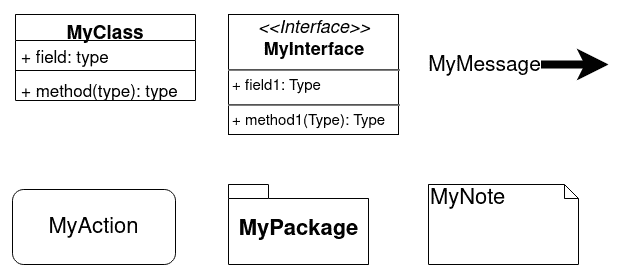

图 3.1 – 一些 UML 事物的图形表示

在下一个图表中，我们表示了 UML 关系的图形符号：

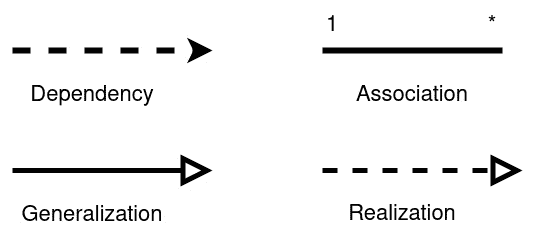

图 3.2 – 一些 UML 关系的图形表示

关于 UML 图表，鉴于其相关性，在下一节中我们将介绍一些最常见的图表。

## 类图

从本节开始，我们已经明确指出 UML 是关于 **面向对象** 的建模，这是预期的，因为 **Java**（可能是最广泛使用的面向对象语言）是本书的支柱之一，当然——建模类是面向对象建模最重要的方面之一。我非常确信你已经见过（或使用过）类图。它们是表示类及其构成的一种非常常见和自然的方式，并且确实在互联网上的无数文档中得到了应用。

类图由一组类（包括它们的字段和方法）以及它们之间的关系组成。接口在存在的地方表示，类之间的继承也是如此。与其他图一样，类图在概念上是一个图，由弧和顶点组成。

类图旨在突出整个架构的特定子集，因此所表示的类是给定用例的一部分或属于特定的子域。

值得注意的是，这些关系将表示类之间的合作/责任类型以及关系的多重性本身（例如，一对一、一对多和类似的基数）。这就是基本类图的样子：

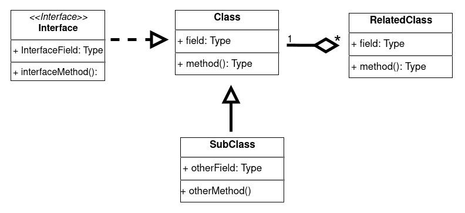

图 3.3 – 基本类图

如您所见，类图是建模应用程序逻辑子域结构（对象及其链接）的一种很好的方式。在下一节中，我们将探讨序列图，这是另一种非常广泛的应用，它更多地关注实现功能所需的前后端交互。

## 序列图

**序列图**可能是最著名的 UML 图之一。这个图是所谓的交互图的一个特定实例，它表示了一组对象（如软件组件和参与者）以及它们如何交互（例如，交换消息）。在序列图的情况下，交互以线性方式呈现，表示按时间维度排序的交互。

从图形角度来看，序列图按行排列对象，每个对象都有一条垂直向下延伸的线（也称为**生命线**）。穿过这些生命线，交互以水平线的形式展开，与涉及的对象相交。

序列图还提供了一种表示条件和迭代的方法。**条件**、**并行化**、**循环**和**可选**通过围绕交互绘制一个框并使用正确的关键字标记该框来表示。

考虑到消息流（包括时间顺序）可以表达的良好细节级别以及结构化控制（条件等）提供的表达能力，序列图通过将它们分解成更小的操作，是一种分析记录功能的好方法。

这就是序列图的样子：

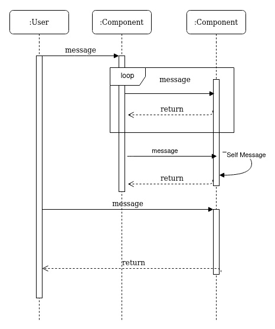

图 3.4 – 序列图

如您在图的第 1 行所见，在这种情况下有一个用户和两个组件，以下适用：

+   每一个都有一条生命线，当进行交互时（例如，调用方法或发送消息）会被突出显示以表示激活。

+   自消息以曲线的形式呈现，表示在同一组件上调用方法。

+   循环用带有标签的框架表示。在标签中，除了循环之外，`opt`（`par`（`alt`（`opt`标识一个只有在满足指定条件（如`if`块）时才会发生的可选交互，`par`表示并行交互（如以多线程方式并行调用的两个方法），而`alt`匹配替代条件，例如`if`/`else`块。

+   同样的符号（带有标签的框）可以用来表示子图。在这种情况下，标签有一个`ref`值，而表示该部分的图表的名称则报告在框中。这提供了一种简单的方法，将大而复杂的序列图分解成更小的图表。

通过对序列图的这种观察，我们完成了对最常见 UML 思想的简要概述。

## 总结 UML

正如我们在本节开头所说，UML 是一个庞大而完整的框架，无法在几页纸中总结。然而，我们迄今为止看到的本质概念（包括类图和序列图）是开始熟悉这种语言并给你的工具箱添加一些有用工具的好方法。当然，我的建议是深入研究，了解更多来自这个了不起语言的图表和技术。

在下一节中，我们将探讨一种与 UML 有许多相似之处的技术：ArchiMate。

# 探索 ArchiMate

**ArchiMate**是一种面向企业架构分析和文档化的架构建模技术。这意味着尽管它仍然根植于技术和软件，但它通常被应用于范围更广的项目中，例如记录整个企业技术景观（也称为**企业架构**）以及建模底层技术实现所实施的业务流程。

ArchiMate 这个名字是*架构*和*动态*的结合，意味着这个框架的一个目标是以直观的方式展示企业架构。ArchiMate 在 21 世纪初的荷兰被创造出来，这是政府、行业和学术界参与者共同努力的结果。在标准的第一稿之后不久，治理权就转移到了**The Open Group**，这是一个监管许多其他 IT 标准的行业联盟，例如**The Open Group 架构框架**（**TOGAF**，这是一个企业架构标准）和**单一 Unix 规范**（**SUS**，这是一个**可移植操作系统接口**（**POSIX**）标准的超集）。The Open Group 也是 Java 世界其他著名标准的背后推手，例如**面向服务的架构**（**SOA**）和**扩展架构**（**XA**）。

让我们从 ArchiMate 核心框架开始。

## ArchiMate 核心和完整框架

在 ArchiMate 中首先要接触的概念是**核心框架**。ArchiMate 核心框架是一个 3x3 矩阵，通过交叉三个层级（**业务**、**应用**和**技术**）和三个方面（垂直表示：**被动结构**、**行为**和**主动结构**）而创建。

这是核心框架矩阵的样子：

![图 3.5 – ArchiMate 核心框架

![img/Figure_3.05_B16354.jpg]

图 3.5 – ArchiMate 核心框架

层次是一种从三个不同角度看待相同概念（或密切相关概念）的方法。从某种意义上说，一个层级的概念利用或与附近层级的概念相关联。您可以将这三个层级视为从更抽象（业务）到更具体（技术）的规范，如下所述：

+   **业务**层围绕业务能力展开，通常向外部世界（例如，最终客户）提供（例如，业务流程、事件和与高级能力相关的功能）。

+   **应用**层包括向**业务**层提供能力的软件组件。

+   **技术**层是支持软件组件的技术基础设施，包括硬件和通信。

方面是一种通过活动中的角色对对象进行分类的方法，如下所述：

+   **主动结构**包括开始动作的元素（包括参与者、设备和软件组件）。

+   **行为**包括在**主动结构**方面由某物执行的动作本身（例如，参与者）。

+   **被动结构**包括活动所基于的对象（例如，动作本身接收者，如数据对象）。

您应该考虑到某些对象可能属于多个方面。

正如您将看到的，核心框架提供了一种简单的方法来放置和分类对象，并允许多个视角。此外，请注意，ArchiMate 图不一定遵循这种矩阵布局：这仅仅是一种概念性的方式来展示层次和方面以及它们之间的关系。

ArchiMate 标准还提供了一个框架的扩展版本。在这个框架中，增加了三个额外的层级，如下所述：

+   在**业务**层之上，**策略**旨在将业务功能和用例与战略目标的追求联系起来。

+   **物理**，在技术上属于**技术**层的一个子集，用于表示材料、物理对象、设施等。

+   **实施和迁移**用于模拟在实施和迁移过程中支持过渡阶段的临时组件。

第四个方面，称为**动机**，也被包含在扩展框架中。这个方面的目标是映射和表示其他架构选择背后的战略原因。特别是，您将看到价值、目标和利益相关者等组件被用来建模特定领域或用例背后的原因。

这就是完整框架的样子：

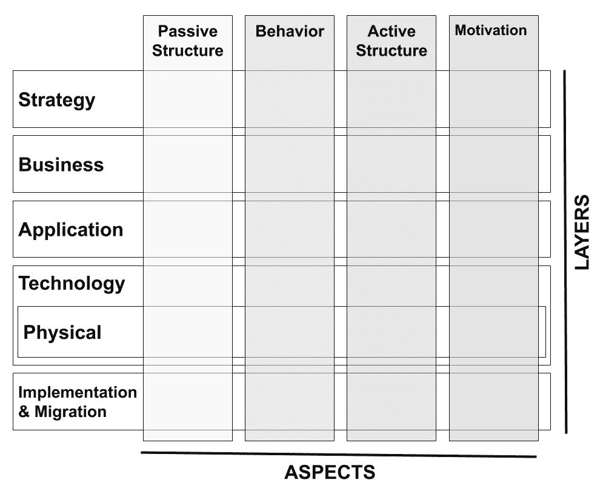

图 3.6 – ArchiMate 完整框架

根据核心框架，这只是一个旨在突出层和方面之间重叠区域的逻辑模型。ArchiMate 兼容的架构不会必然以矩阵格式出现。

在下一节中，我们将看到 ArchiMate 的组成部分，这些是根据我们刚刚看到的矩阵分类的对象。

## 导航 ArchiMate 语言树

ArchiMate 语言在概念上结构化为一个树，如下所示：

+   顶层概念是**模型**，定义为概念集合。

+   **概念**是一个通用的术语，可以被描述为元素或关系。

+   **元素**是一个通用的项目，映射到层的定义——即**行为**、**主动结构**或**被动结构**。元素也可以作为**动机**方面的部分（根据完整框架）。复合元素旨在作为其他概念的聚合。**主动结构**和**行为**元素可以进一步被分类为**内部**或**外部**。事件是**行为**元素的进一步特殊化。

+   **关系**表示两个或更多概念之间的连接。关系进一步被分类为**结构**（元素静态关联以创建另一个元素）、**依赖**（元素可能受其他元素变化的影响）、**动态**（元素与其他元素有时间依赖性）或**其他**。

+   **关系连接器**是逻辑节点（**与**、**或**），关联相同类型的关系。

这就是树将呈现的样子：

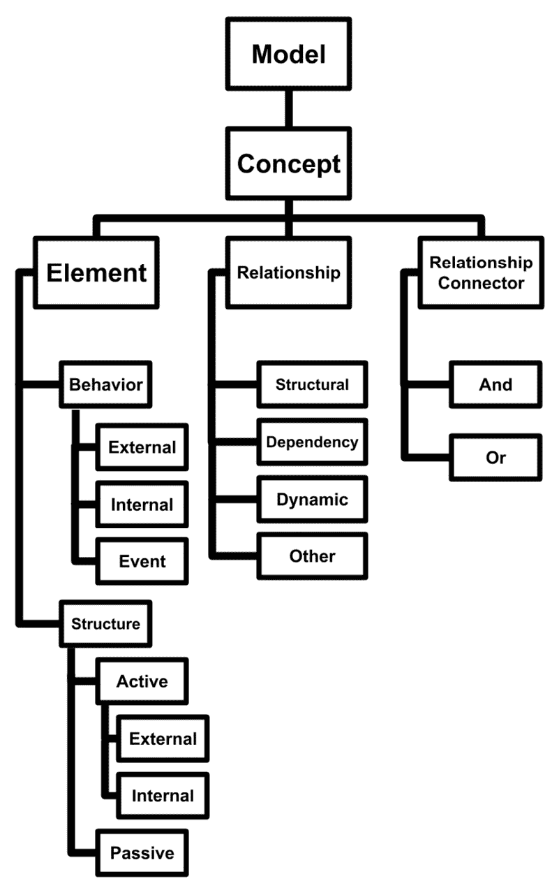

图 3.7 – ArchiMate 语言树

在这个分类中，元素只是以抽象的方式定义，不依赖于层。在 ArchiMate 建模中，这些元素的实体实现随后在相关层中被实例化和分类。例如，服务是一个通用的内部**行为**元素。它将以业务服务、应用服务或技术服务的形式被使用，具体取决于我们正在建模的层。

其他元素只在特定层中才有意义。例如，通信网络是**技术**层的元素属性，被分类为**主动结构**元素，它与其他层中存在的元素没有一对一的对应关系。

元素和关系的组合然后可以组织成自定义视图，有效地构建架构图，由利益相关者和视角进行优化。

在下一节中，我们将比较 ArchiMate 与 UML。

## 将 ArchiMate 与 UML 进行比较

正如您可能已经看到的，ArchiMate 语言显示出一些与 UML 的相似之处。这并非偶然：ArchiMate 确实受到了 UML 的启发，并且这两个框架的一些概念几乎是相同的。

然而，除了具体差异（例如，一个框架中存在而另一个框架中不存在的概念）之外，在比较这两个框架时，还有一些高级考虑因素需要考虑，如下所述：

+   UML 严格围绕面向对象建模，而 ArchiMate 没有与特定范式相关联。

+   ArchiMate 明确定义了**业务**层和其他高级概念（包括**动机**和**策略**），这些通常在 UML 图中没有被考虑。

+   UML 提供了一套固定的图，而 ArchiMate 更像是一个不同组件和方面的调色板，旨在构建视图和视角，明确提供定制架构定义的方法。

正如我们在本节开头介绍 ArchiMate 起源时所见，The Open Group 是许多其他标准的背后组织，包括 TOGAF。让我们看看 ArchiMate 和 TOGAF 之间的关系。

## 将 ArchiMate 与 TOGAF 进行比较

**TOGAF**是一个完整的框架，旨在提供一种标准化的方式来定义、建模和实施架构项目（例如，对组织的企业架构进行分类）。从某种意义上说，TOGAF 与 ArchiMate 是互补的。虽然 TOGAF 不提供特定的架构符号（如 ArchiMate 所做的那样），但 ArchiMate 也不规定特定的架构定义过程（如 TOGAF 所做的那样）。

TOGAF 的核心是**架构开发方法**（**ADM**）过程。该过程由八个步骤组成（加上两个特殊阶段：初步阶段和需求收集）。每个步骤的详细解释超出了本书的范围，但重要的是，TOGAF ADM 的每个阶段都可以映射到 ArchiMate 框架的某一层（例如，B 阶段，关于业务架构的定义，当然映射到**业务**层，而 F 阶段，迁移规划，可以映射到**实施和****迁移**层）。

这就结束了关于 ArchiMate 的部分。在下一节中，我们将介绍另一种非常智能的架构建模技术：C4 模型。

# 介绍 C4 模型

**C4 模型**是一种轻量级的软件架构建模和表示方法。它由 Simon Brown 于 2006 年创建，官方网站（在**创意共享（CC）许可**下）于 2018 年启动。

该模型在一定程度上受到 UML 的启发，但它采取了一种替代的、更精简的方法，因此，在寻找更动态和更少规定性设计及记录软件架构的敏捷团队中非常受欢迎。

## 探索 C4 模型

理解 C4 模型的关键词是*缩放*。这个概念意味着它对图片所做的一切：C4 模型的核心思想确实是通过扩大或缩小视角来导航架构表示。C4 模型围绕以下四个主要级别构建，具体如下：

+   **上下文**是一个提供应用程序整体视图的图。它显示整个系统作为一个框表示，并描绘了与用户和其他系统的交互。

+   **容器**是向下缩放一级时获得的视图。它通过模拟构成它的子系统来表示系统框内的内容。在粒度方面，容器是可以部署和执行的东西——因此，它可以表示后端应用程序、数据库、文件系统等。

+   **组件**是另一个缩放级别，它查看一个容器内部。本质上，组件是一组代码实例（例如，一系列类）的抽象组合，这些实例实现了某种功能。

+   **代码**是这一层次的最大缩放级别，可以省略。它用于直接表示源代码和配置。C4 模型没有提供如何绘制此类架构的具体建议，通常这类架构使用 UML 类图来表示。它被认为是可选的，因为很难保持这种视图与代码更改同步。这里的一个建议是，如果可能的话，尽量坚持自动生成此图（通过使用集成开发环境的插件或其他自动化程序）。

因此，C4 模型本质上由三个不同的图（加上一个可选的图）组成。每个图通过不同级别的缩放与其他图相连接，如下面的图所示：

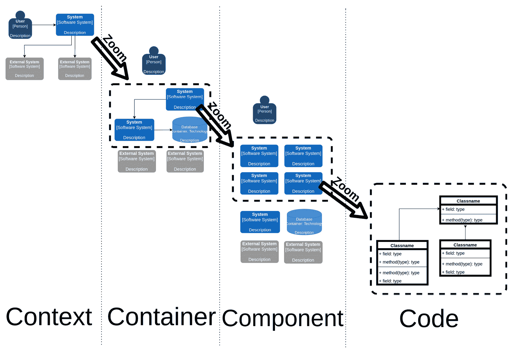

图 3.8 – C4 缩放级别

这种技术的理念是专注于基于缩放级别的不同生态系统。此外，不同的视图可以针对不同的利益相关者。在下一节中，我们将看到每个级别的内部内容。

## 填充不同的级别

C4 模型不提供任何特定的符号或符号。与 UML 不同，形状、颜色编码等都不是标准的一部分。该模型只是鼓励你保持一致的表示（例如，一旦你选择一个形状来表示一个元素，就在所有图中保持该形状），并为每个图添加一个明确的图例，尽可能多地注释，以获得更好的清晰度。

C4 由以下元素组成：

+   **软件系统**：顶级元素，是*上下文*表示的中心。这基本上是我们将要设计和实现的整个系统。

+   **容器**：正如我们在讨论同名级别时提到的，容器大致上是可以单独部署和启动/停止的东西。这包括应用程序、数据库等等。它通常伴随着对所使用技术和框架的描述。

+   **组件**：如前所述，这是在讨论级别时已经介绍过的概念。组件是对子域或功能的抽象聚合。它基本上是一组代码。它可能或可能不与 Java 包一一对应。

+   **关系**：表示上述元素之间链接的线（或更常见的是箭头）。它通常伴随着对关系类型/范围/目标的文本解释，以及相关技术细节（例如，所使用的协议）。

+   **人员**：与系统交互的人类。

正如您将看到的，没有明确建议表示代码。通常的做法是用 UML 类来表示它，但如我们之前所说，这只在绝对必要时才这样做。

为了完整性起见，C4 还包括一些额外的图表，如下所述：

+   **系统景观**：一个上下文图，展示了整个企业，以便表示我们应用程序的完整*邻域*。

+   **动态图**：通过编号元素之间的交互来表示用例的图表，以显示时间顺序。它看起来与 UML 序列图非常相似，但在语法方面不那么规定性。

+   **部署**：这显示了容器与底层基础设施之间的映射，这可能是一个物理服务器、虚拟机、**Linux**容器等等。

通过这些图表，我们完成了对 C4 模型的探讨。正如您将看到的，这个模型比 UML 和 ArchiMate 简单，但仍然相当完整和表达性强，这意味着您可以用它来建模许多架构类型。

在下一节中，我们将探讨一些不太常见且针对特定用例的建模技术。

# 其他建模技术

我们迄今为止看到的三个建模系统——UML、ArchiMate 和 C4——是完整的系统，具有不同的方法，旨在端到端地分析和表示软件架构。

在本节中，我们将简要介绍一些具有更垂直方法的技巧，这意味着它们在针对特定用例时更少通用且更详细。这些技术是**业务流程模型和符号**（**BPMN**）、**决策模型和符号**（**DMN**）和**arc42**。

## BPMN

**BPMN**是一个由**对象管理组**（**OMG**）开发和维护的标准，该组织也是 UML 背后的组织。BPMN 也是一个被**国际标准化组织**（**ISO**）认可的标准。

如其名称所示，这种语言专门用于表示业务流程。

BPMN 通常与 UML 的活动图相关联，因为两者都是类似流程图的图表（具有略微不同的符号和符号），旨在用基本步骤及其之间的连接（例如，可选条件）来描述用例，包括时间维度（从-到）。但相似之处到此为止。

UML 更广泛，旨在建模许多其他事物，而不仅仅是作为一个面向对象框架。另一方面，BPMN 专注于业务流程的建模，其首要目标是定义技术和业务利益相关者之间的共同基础。实际上，BPMN 背后的想法是，一个业务人员（或者更好，一个没有技术技能但对流程有良好了解的人）可以绘制一个可以直接导入并执行到 BPMN 引擎中的图表，几乎不需要技术人员的帮助。但在现实世界中，这种情况并不常见，因为 BPMN 设计仍然是一种抽象，配置、部署和执行 BPMN 流程仍然需要一系列技术步骤。

然而，确实如此，BPMN 通常至少对非技术利益相关者是可理解的（如果不是从头定义的），这对于支持团队之间的协作以及在将业务流程转换为代码实现时减少摩擦是足够的。

BPMN 的构建块被分为四个基本家族：**流程对象**、**连接对象**、**泳道**和**工件**。对于每一个家族，都有一个图形符号被正式化。

大概来说，**流程对象**代表图中的步骤，在此处将更详细地描述：

+   其中最重要的大概是**任务**，它是通用活动的抽象。这意味着既包括非自动活动（在 BPMN 平台外手动执行）也包括自动活动（如发送电子邮件或触发 Web 服务调用）。

+   其他基本流程对象是**开始**和**结束**事件，用于界定工作流的开始和结束。

+   **网关**是另一种重要的对象，用于建模诸如条件执行或路径并行化等情况。

**连接对象**用于将流程对象相互连接。它们可以模拟不同的行为，如序列、消息或关联。

**泳道**是一种图形化分组和组织业务流程的方法。使用泳道，你可以根据负责特定步骤的参与者（或参与者群体）来划分业务流程。

最后，**工件**是支持性概念（例如，注释），旨在丰富 BPMN 流程的表达性。

这些对象在图形上的样子就是这样：

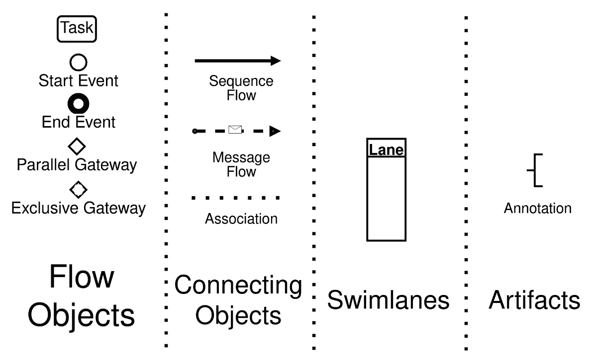

图 3.9 – 一些 BPMN 实体的图形表示

我们将在*第七章*中再次讨论 BPMN，*探索中间件和框架*。

## DMN

**DMN**是由 OMG 发布和维护的标准，它比 BPMN 年轻。DMN 在某种程度上是 BPMN 的补充。它不是针对建模业务流程，而是旨在建模业务规则，这些规则通常作为 BPMN 流程中的一个任务使用，而不是独立于 BPMN 流程之外。

目标与 BPMN 完全相同：在业务和 IT 角色之间定义一种共同语言，以便更好地协作。

DMN 包括诸如决策表（基于一组输入的组合表示规则结果的表格）和**足够友好的表达式语言**（**FEEL**），这是一种用于形式化决策背后逻辑的表达式语言。

我们将在*第七章*中再次讨论 DMN，*探索中间件和框架*。

## arc42

**arc42**不是一种建模技术，而是一种模板模型，它通过提供一种*支架*来帮助在软件架构中识别需要记录的重要概念以及如何记录它们。

arc42 最初由 Peter Hruschka 博士和 Gernot Starke 博士创建，采用完全开源的方法（包括在商业项目中免费使用）。这是一种从架构角度从头开始记录系统的卓越方式。从实际观点来看，它提供了一个支架（包括需要填写的章节），说明了文档应该是什么样子。

它不是其他建模语言的替代品，也不强制规定特定的工作模型或开发技术。相反，预期你会使用来自其他技术（如 UML 或 C4）的概念和图表来填写 arc42 兼容文档的各个部分。

文档的章节包括介绍、运行时视图、横切概念、架构决策等内容。这实际上只是对文档结构的建议；具体深入到每个章节的程度由你决定。如果你想尝试一下，可以访问官方网站（见*进一步阅读*部分），下载一个模板，并开始填写各个章节。这真的非常简单。

BPMN、DMN 和 arc42 覆盖特定的细分市场，针对特定的需求。因此，它们可以作为我们之前看到的更通用和全面的框架的有用补充。通过本节，我们完成了对架构建模技术的概述。现在，让我们通过查看一些示例来完成本章。

# 案例研究和示例

在本章中，就像之前的章节一样，我们将继续研究移动支付应用。我们将继续探索这个环境，以查看我们迄今为止讨论的一些图表示例。

## 移动支付的 UML 类图

作为第一个示例，我们将查看 UML 类建模。这是一个在 Java 项目中非常常见的图表。有人争论说，建立和维护与代码如此接近的文档（参见我们在 C4 部分讨论的考虑因素）是否有用，因为它可能被认为没有增加太多价值，而且难以维护。此外，在现代开发模型（如云原生和微服务）中，你应该通过使用已建立的接口（如**表示状态传输**（**REST**）或**谷歌远程过程调用**（**gRPC**））来在应用程序的部分之间进行通信，避免向他人暴露应用程序的内部模型。

我个人的观点是，真相在于中间。除非你正在开发一些非常特殊的东西（如框架、库或插件扩展系统），否则你可能不需要将整个代码库作为类图进行文档化。然而，为了分析影响并与同一代码库的其他团队成员协作，至少绘制应用程序的关键方面（即核心类和接口）可能是值得的。

另一种有用的技术是依赖类图的自动生成。你可能会发现大多数常用 IDE 和 Maven 的插件都可以为你完成这项工作。类图可以特别有用，因为它可以给出代码背后的模型看起来是什么样的想法（想想一个新团队成员加入项目）并且可以简化诸如重构等活动，因为它可以给出一个改变可能对相关类产生什么影响的想法。

移动支付的类图将看起来是这样的（仅挑选一些重要的类）：

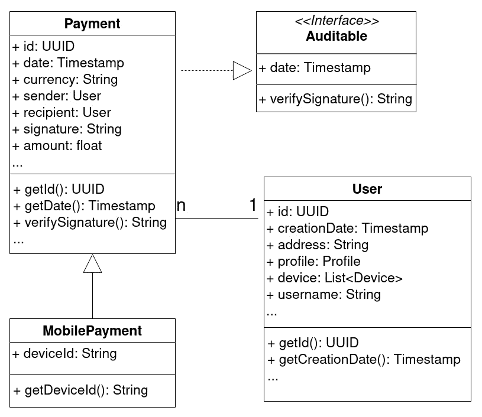

图 3.10 – 支付和用户对象的 UML 类图

正如你在前面的图表中看到的，我们正在表示`Payment`和`User`类（为了节省空间，省略了一些方法和字段）。

我们在这个图表中使用的一些符号如下列所示：

+   `MobilePayment`是`Payment`（泛化）的子类。

+   `Payment`实现了`Auditable`接口。

+   支付与`User`相关联。

+   你还可以看到多态性（每个用户可以有**n**个支付）。正如我们之前讨论的，这种关联与你在表示数据库表的实体关系图中可以找到的非常相似。

图 3.11 – C4 上下文图

## 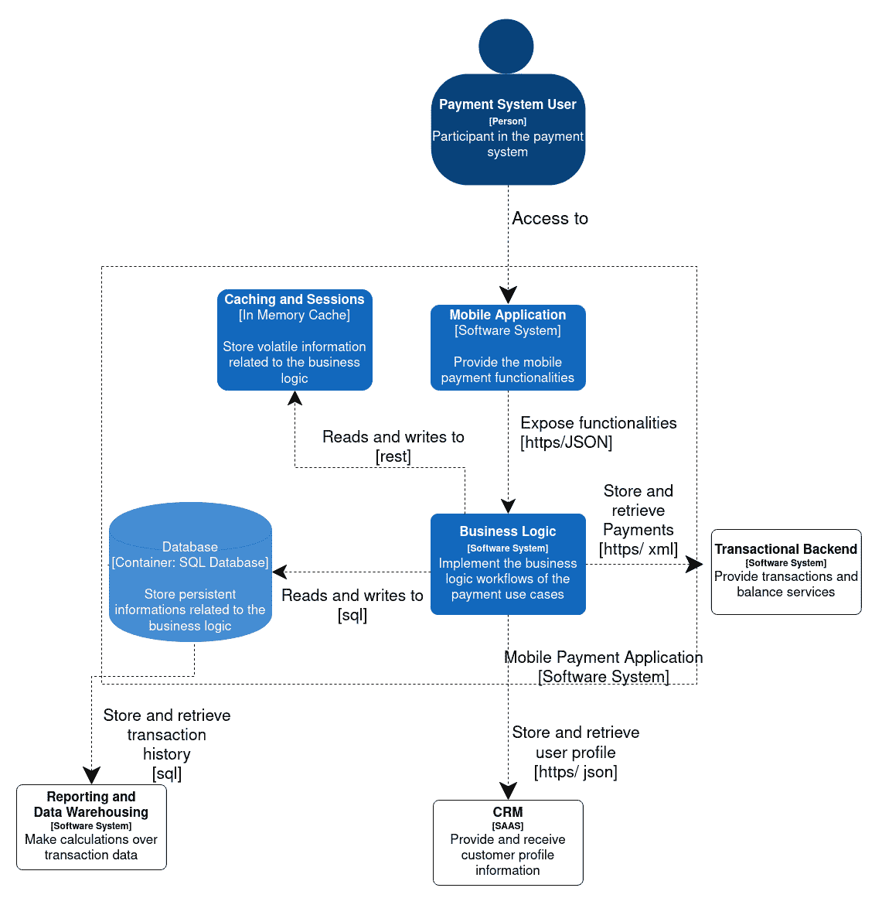

在下一节中，我们将看到一些关于移动支付的 C4 图。

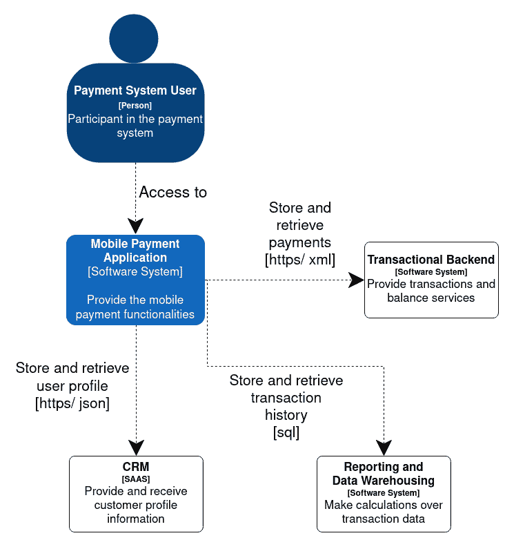

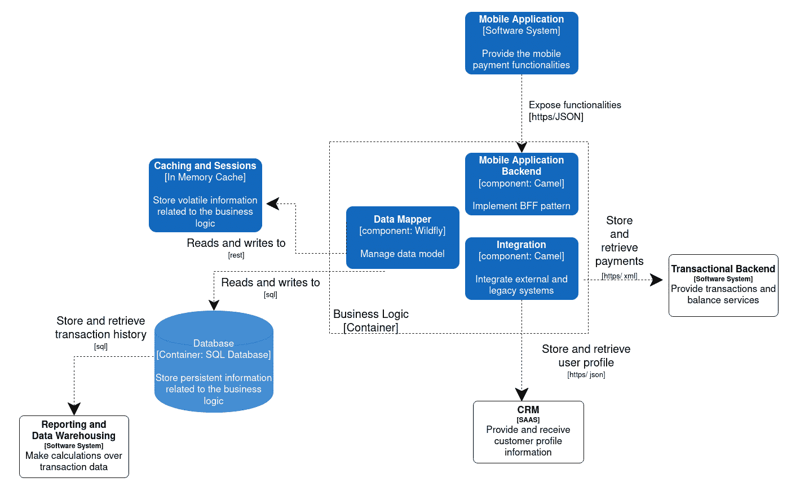

移动支付的 C4 图

如我们所见，这是一个非常高级的描述，旨在展示围绕我们系统的交互生态系统。移动支付应用只是一个大块，在图中，我们总结了与之交互的外部系统和参与者。还包括了对交互（包括格式/协议）以及每个元素类型（软件系统、人员）的综合性描述。

在专门介绍 C4 图的章节中，我们了解到 C4 技术涉及根据四个主要的缩放级别来绘制系统图。正如讨论的那样，最后一个缩放级别（代码）是可选的，并且没有给出如何表示它的严格指南。通常使用类图，就像我们在上一节中做的那样。假设我们将这作为我们用例的四个表示之一，让我们看看通往这种简化的路径。让我们从一个移动支付解决方案模块的上下文图开始，如下所示：

如预期的那样，我们进一步缩小了一个级别，突出了构成业务逻辑容器（**移动应用后端**、**数据映射器**和**集成**）的三个组件。

图 3.12 – C4 组件图

在这里，我们可以看到构成我们应用的技术组件的更详细表示。我们的应用不再只是一个盒子：我们可以看到包含在虚线框中的所有进程（可以独立部署和启动的事物）。外部环境仍然存在（例如，事务后端）。每个交互都有一些解释和协议。每个容器都有一个关于实现它的技术类型的通用描述。如果你认为这个图与我们在*第一章*中看到的非常相似，*《Java 软件架构设计 – 方法与风格*》，你是正确的。

我们仍然离代码/类图还有一段距离。组件图是缺失的环节。我们可以在这里查看：

图 3.11 – C4 上下文图

图 3.13 – C4 容器图

现在，让我们放大到容器视图，如下所示：

使用这个容器图，我们在直接表示实现代码（代码图）之上又前进了一步。

由于篇幅限制，我们在此不提供完整的代码图。然而，在前面章节中用 UML 建模的类可以被视为**数据映射器**组件的部分代码图，这在一定程度上闭合了循环。

这些都是非常基础的例子，用以展示一些实际应用中的建模技术。当然，对这一章中展示的每一种方法论进行详细说明可能需要一本书（或更多）的内容，但我希望已经为您提供了足够的起点，以便您深入研究和实践，尤其是在您需要为项目开始使用这些图表时。现在，让我们回顾本章的主要观点。

# 摘要

在本章中，我们看到了一系列用于模拟和表示软件系统内部架构的技术。我们首先从 UML 开始，这是一个广泛使用且积极应用的标准化工具，特别是在其某些方面，如类图和序列图。

我们接着转向 ArchiMate，它从企业架构的角度对主题进行了阐述，通常在遵循 TOGAF 方法的背景下使用。然后我们转向 C4 方法，这是一个较新的标准，非常轻量级，特别适合采用精益方法的项目。

我们还看到了一些专门的语言（BPMN 和 DMN），它们非常适合于模拟我们应用程序的特定方面。最后但同样重要的是，我们简要提到了 arc42，这是一个出色的模板系统，可以帮助您开始架构文档并确保不会遗漏任何重要内容。

在下一章中，我们将讨论**领域驱动设计**（DDD）和其他技术，以完善您的应用程序，这些技术一旦您为其定义了架构，就可以使用。

# 进一步阅读

+   UML 官方网站：[`uml.org/`](http://uml.org/)

+   *统一建模语言用户指南*，由 Grady Booch、James Rumbaugh 和 Ivar Jacobson 编写，Addison-Wesley 出版社，1999 年出版。

+   The Open Group，*ArchiMate® 3.1 规范*：[`pubs.opengroup.org/architecture/archimate3-doc/`](https://pubs.opengroup.org/architecture/archimate3-doc/)

+   InfoQ，*软件架构的 C4 模型*：[`www.infoq.com/articles/C4-architecture-model/`](https://www.infoq.com/articles/C4-architecture-model/)

+   C4 官方网站：[`c4model.com/`](https://c4model.com/)

+   arc42 官方网站：[`arc42.org/`](https://arc42.org/)
