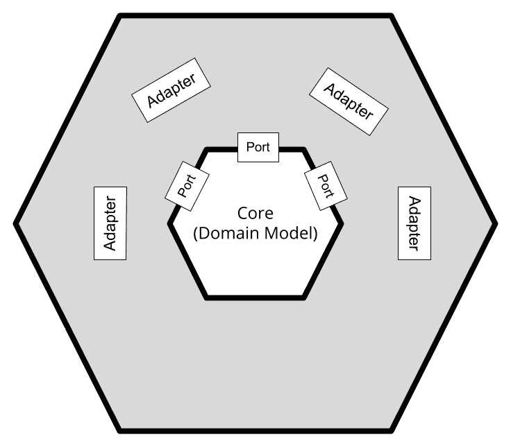
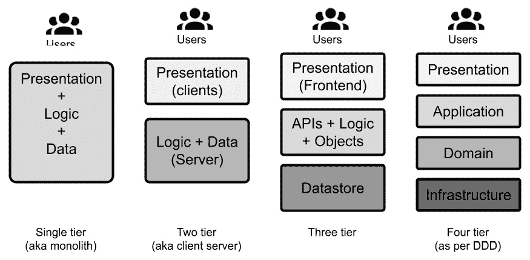
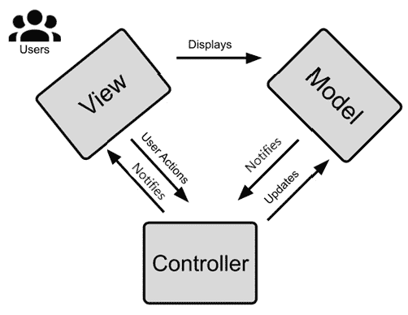
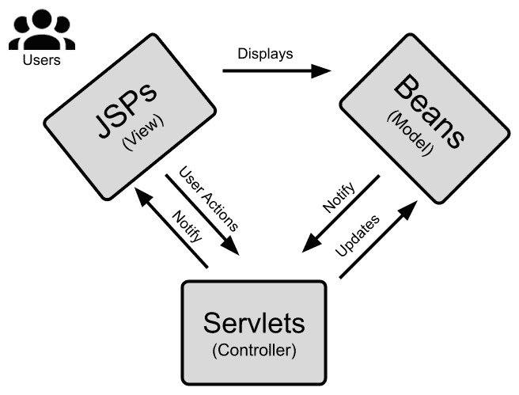
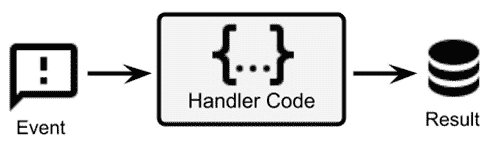
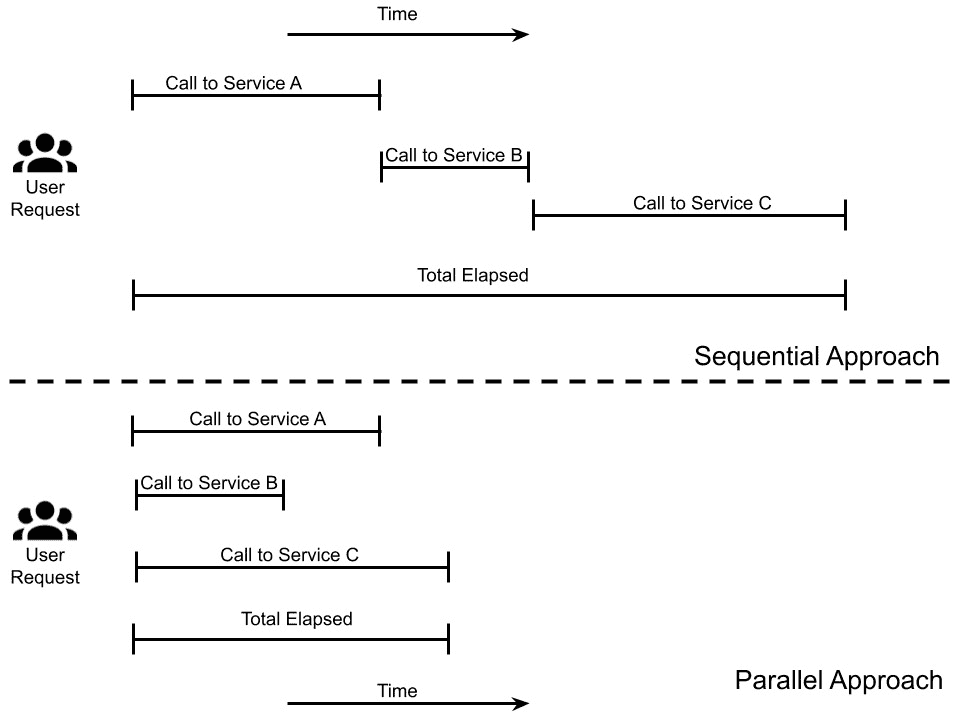
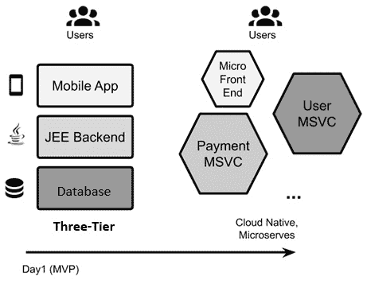

# 第六章：探索基本的 Java 架构模式

在上一章中，你对最常见的发展模型有了概述，从较老但仍被使用的**瀑布模型**到广泛使用且受到赞赏的**DevOps**和**敏捷**。

在本章中，你将查看一些非常常见的架构模式。这些架构定义通常被认为是基本构建块，了解它们对于解决常见的架构问题非常有用。

在本章中，你将了解以下主题：

+   封装和六边形架构

+   了解多层架构

+   探索模型-视图-控制器

+   深入了解事件驱动和响应式方法

+   设计适用于大规模采用

+   案例研究和示例

阅读本章后，你将了解一些有用的工具，可以将需求转换为易于开发和维护的精心设计的软件组件。本章中描述的所有模式当然都是与我们在前几章中看到的开发模型正交的；换句话说，你可以使用它们中的任何一个，无论使用哪种模型。

让我们从最自然的架构考虑因素之一开始：封装和六边形架构。

# 封装和六边形架构

**封装**是习惯于使用面向对象编程的程序员所接受的概念，确实，它是一个非常基本的概念。当谈到封装时，你的思维会转向获取器和设置器方法。简单来说，你可以在你的类中隐藏字段，并控制其他对象如何与之交互。这是一种基本的方法，可以保护你的对象状态（内部数据）不受外界影响。这样，你就可以将状态与行为解耦，你可以自由地切换数据类型、验证输入、更改格式等等。简而言之，这种方法的优点很容易理解。

然而，封装是一个超越简单获取器和设置器的概念。我个人在其他现代方法中找到了这个概念的回声，例如 API 和微服务（更多内容请参阅*第九章*，*设计云原生架构*）。在我看来，封装（也称为**信息隐藏**）完全是关于模块化的，因为它涉及到通过定义的合约让对象相互通信。

如果这些合约（在这种情况下，普通方法签名）足够稳定和通用，对象可以更改其内部实现或与其他对象交换而不破坏整体功能。当然，这是一个非常适合接口的概念。接口可以被视为一种*超级合约*（一组方法）以及识别兼容对象的一种方式。

在我个人看来，封装的概念通过六边形架构的想法得到了扩展。六边形架构是由 Alistair Cockburn 在 2005 年提出的理论，它将应用程序组件可视化为六边形。以下图解说明了这一点：

图 6.1 – 六边形架构图

如前图所示，业务逻辑是这个表示的核心：

+   **核心**：核心可以是指领域模型，如在第*第四章*中看到的，*设计和开发最佳实践*。它是您应用程序组件的真实独特部分——解决业务问题的那部分。

+   **端口**：在核心周围表示端口。领域模型使用端口作为与其他应用程序组件（如其他模块或系统，例如数据库和其他基础设施）通信的方式。端口通常映射到模块本身的用例（例如发送支付）。然而，端口的技术解释并不罕见（例如持久化到数据库）。

+   **适配器**：端口外层的层代表适配器。适配器是一种广为人知的模式，其中软件作为两个不同方面之间的解释器。在这种情况下，它根据每个端口中定义的内容将领域模型转换为外部世界，反之亦然。虽然这个图是六边形的形状，但这并不表明它仅限于六个端口或适配器。这只是一个图形表示，可能与其将端口表示为离散元素（如果你将层表示为同心圆则很难做到）的想法有关。六边形架构也被称为**端口和适配器**。

    重要提示：

    另有一种实现封装的架构模型，常与六边形架构相比较：**洋葱架构**。无论六边形架构是否定义了之前提到的角色，如核心、端口和适配器，洋葱架构将建模重点放在层概念上。有一个内部核心（领域层），然后是围绕它的多个层，通常包括存储库（以访问领域层的数据）、服务（以实现业务逻辑和其他交互）和表示层（与最终用户或其他系统交互）。每个层只应与它上面的层进行通信。

## 六边形架构和领域驱动设计

封装是一个横切关注点，适用于软件架构的许多方面，而六边形架构是实现这一概念的一种方式。正如我们所见，封装与**领域驱动设计**（**DDD**）的概念有很多接触点。核心，正如所提到的，可以看作是 DDD 中的领域模型。适配器模式也非常类似于基础设施层的概念，在 DDD 中，这一层是将领域模型与底层技术（以及抽象这些技术细节）映射的层。

值得注意的是，DDD 是一种更完整的方法，如*第四章*，“设计和开发的最佳实践”中所示，它处理诸如定义创建领域模型概念的语言和实现一些特殊用例（如数据存储的位置、实现存储的位置、如何使不同的模型相互通信）等问题。相反，六边形架构是一种更实际、更直接的方法，可以直接解决一个关注点（如以结构化的方式实现封装），但不涉及其他方面（如如何定义核心中的对象）。

## 封装和微服务

当我们将在*第九章*，“设计云原生架构”中讨论微服务时，我相信你已经熟悉，或者至少听说过微服务的概念。在本节中，提到封装是微服务背后的核心理由之一是相关的。确实，一个微服务被认为是一块可丢弃的软件，易于扩展，并且可以通过一个定义良好的 API 与其他类似组件进行交互。

此外，组成应用程序的每个微服务（在理论上）都是一个产品，它背后有一个专门的团队，并使用一套技术（包括编程语言本身），与周围的微服务不同。出于所有这些原因，封装是微服务应用程序的基础，其背后的概念（如我们在六边形架构的上下文中看到的）是微服务内在的。

因此，正如你现在所知道的，模块化的概念在某种程度上与软件实体是正交的。这种定义清晰责任和具体契约的需求是解决复杂性的常见方法，并且它有很多优点，如可测试性、可扩展性、可扩展性等。在软件系统中定义角色的另一种常见方法是多层架构。

# 了解多层架构

**多层架构**，也称为**n 层架构**，是根据包含系统组件的层数和类型来分类软件架构的一种方式。层是软件组件的逻辑分组，通常也反映在组件的物理部署中。设计应用程序的一种方法是为它们定义层数以及它们如何相互通信。然后，您可以定义哪个组件属于哪个层。以下列表中定义了最常见的多层应用程序类型：

+   最简单（也是最无用的）例子是**单层应用程序**，其中每个组件都属于同一层。因此，您拥有所谓的单体应用程序。

+   在下一个迭代中，事情会变得稍微有趣一些，即**两层应用程序**。这些通常作为客户端-服务器系统实现。您将有一个包含提供给最终用户的组件的层，通常通过某种图形或文本用户界面，以及一个包含后端系统的层，这些系统通常实现业务规则和事务功能。

+   **三层应用程序**是一种非常常见的架构设置。在这种设计中，您有一个负责与最终用户交互的表现层。我们还有一个实现业务逻辑并暴露给表现层使用的 API 的业务逻辑层，以及一个负责以持久方式存储数据的数据层（例如在数据库或磁盘上）。

+   可以考虑超过三层，但这不太常见，意味着命名和角色可能有所不同。通常，额外的层是业务逻辑层的特殊化，这在前面已经提到。一个四层应用程序的例子在*第四章*，*设计和开发的最佳实践*中详细描述，当时讨论了 DDD 的分层架构。

下面的图示展示了各种类型的多层架构：

图 6.2 – 多层架构

多层架构的优点与通过模块化您的应用程序组件所能实现的优势相似（更多关于这一点请参阅*第九章*，*设计云原生架构*）。以下是一些优点：

+   最相关的优势可能是**可扩展性**。这种架构允许每一层独立于其他层进行扩展。因此，如果你在业务（或前端，或数据库）层有更多的负载，你可以对其进行扩展（垂直扩展，通过添加更多计算资源，或水平扩展，通过添加更多相同组件的实例），而不会对其他组件产生巨大影响。这也与整体稳定性的提高有关：一个层的问题不太可能影响其他层。

+   另一个积极的影响是提高了**可测试性**。由于你必须明确定义层之间如何通信（例如，通过定义一些 API），因此使用相同的通信通道单独测试每个层变得更加容易。

+   **模块化**也是一个有趣的方面。层与层之间的交互将强制执行一个定义良好的 API 来解耦它们。因此，在同一层上可以有不同角色，与另一层交互。最普遍的例子是前端。许多应用程序有不同的前端版本（如 Web GUI 和移动应用）与同一底层层交互。

+   最后但同样重要的是，通过**分层**你的应用程序，你将在开发过程中获得更多的并行化。子团队可以在不相互干扰的情况下工作在某一层。在大多数情况下，层可以单独发布，从而降低与一次性发布相关联的风险。

当然，多级方法也有其缺点，它们与采用其他模块化方法时观察到的缺点相似，例如微服务。主要缺点与**跟踪**有关。

理解每个事务的端到端路径可能变得很困难，特别是如果一层中的一个调用映射到其他层中的多个调用（这是常见的）。为了减轻这种情况，你必须采用特定的监控来跟踪每个调用的路径；这通常是通过注入唯一的 ID 来关联调用，以帮助在需要故障排除时（例如，当你想找出事务变慢的地方）以及在一般情况下提供更好的系统行为可见性。我们将在*第九章*中更详细地研究这种方法（通常称为跟踪或可观察性），*设计云原生架构*。

在下一节中，我们将探讨一个广泛使用的模式：模型-视图-控制器。

# 探索模型-视图-控制器

初看之下，**模型-视图-控制器**（**MVC**）可能显示出与经典三层架构的一些相似之处。你的逻辑对象被分为三类，并且表示层和数据层之间有明确的分离。然而，MVC 和三层架构是两个不同的概念，它们经常共存。

三层架构是一种架构风格，其中元素（表示层、业务层和数据层）被分割成不同的可部署组件（可能使用不同的语言和技术）。这些元素通常在不同的服务器上执行，以实现已经讨论过的可扩展性、可测试性等目标。

另一方面，MVC 不是一种架构风格，而是一种设计模式。因此，它不提出任何特定的组件部署模型，实际上，模型、视图和控制器经常共存于同一应用程序层。

从实际的角度来看，剥离哲学上的相似性和差异，MVC 是多层架构中设计和实现表示层的常见模式。

在 MVC 中，三个基本组件如下列出：

+   **模型**: 此组件负责抽象化应用程序使用的数据访问。这里展示的数据没有逻辑。

+   **视图**: 此组件负责与用户（或其他外部系统）的交互，包括数据的视觉表示（如果需要）。

+   **控制器**: 此组件接收来自用户（或其他外部系统）的命令（通常由视图中介），并相应地更新其他两个组件。**控制器**通常被视为**模型**和**视图**组件之间的促进者（或粘合剂）。

以下图表显示了 MVC 的基本组件：

图 6.3 – MVC 组件

MVC 与三层架构之间的另一个区别可以从前面描述的三个组件的交互中清楚地看出：在三层架构中，交互通常是线性的；也就是说，表示层不直接与数据层交互。MVC 对每种交互的类型和目标进行分类，但同时也允许所有三个组件相互交互，形成一个三角形模型。

MVC 通常通过框架或中间件实现，并由开发者使用特定接口、钩子、约定等使用。

在现实世界中，此模式通常在服务器端或客户端实现。

## 服务器端 MVC

**Java 企业版**（**JEE**）实现是 MVC 服务器端实现的一个广泛使用的例子（即使它不是一个真正的现代例子）。在本节中，我们将提到一些*经典*的 Java Web 技术实现（如 JSP 和 servlets），这些将在*第十章* *实现用户交互*中进一步详细说明。

就本章的相关性而言，了解在 JEE 世界中，MVC 模型使用 Java beans 实现，视图以 JSP 文件的形式存在，控制器以 servlets 的形式存在，如下所示：

图 6.4 – 使用 JEE 的 MVC

如你所见，通过这种方式，最终用户与由**JSPs**（视图）生成的网页交互，这些视图绑定到 Java **Beans**（模型），保持显示和收集的值。整体流程由**Servlets**（控制器）保证，它们负责诸如模型和视图的绑定、会话处理、页面路由以及其他将应用程序粘合在一起的方面。其他广泛使用的 Java MVC 框架，如**Spring MVC**，采用类似的方法。

## 客户端 MVC

MVC 也可以完全在客户端实现，这通常意味着所有三个角色都由一个网络浏览器扮演。客户端 MVC 的事实标准语言是**JavaScript**。

客户端 MVC 几乎与**单页应用程序**相同。我们将在*第十章*中了解更多关于单页应用程序的内容，*实现用户交互*，但基本想法是尽量减少页面更改和完整页面重新加载，以便在保持 Web 应用程序（如简化分发和集中管理）优势的同时，为用户提供接近原生的体验。

单页应用程序方法与服务器端 MVC 并没有太大的不同。这项技术通常使用模板语言来处理视图（类似于我们在服务器端看到的 JSPs），用于保持数据和将其存储在本地浏览器存储或远程调用后端暴露的剩余 APIs 的模型实现，以及用于导航、会话处理和其他支持代码的控制器。

在本节中，你了解了 MVC 和相关模式，这些被认为是应用程序的经典实现，并且对于很好地设置所有组件和交互、将用户界面与实现分离非常有用。

在下一节中，我们将探讨事件驱动和响应式方法。

# 深入探讨事件驱动和响应式方法

**事件驱动架构**不是一个新概念。我第一次接触它是在很久以前与 GUI 开发（使用**Java Swing**）相关。但当然，这个概念比那还要古老。原因是事件，即*发生的事情*，在现实世界中是一种相当自然的现象。

事件驱动方法还有一个技术原因。这种编程方式与（或者说，最有利于与）异步和非阻塞方法密切相关，而这些范例在资源使用方面本质上效率很高。

这里有一个表示事件驱动方法的图表：

图 6.5 – 事件驱动方法

如前图所示，事件驱动方法的整体概念是让我们的应用程序架构对外部事件做出反应。当涉及到 GUI 时，这些事件主要是用户输入（如点击按钮、在文本字段中输入数据等），但事件可以是许多其他事情，如股票期权价格的变动、支付交易的到来、从传感器收集的数据等。

另一个值得提到的模式是**actor 模型**模式，这是另一种使用消息来最大化软件系统并发性和吞吐量的方式。

我喜欢认为**响应式编程**是这一切的进化。实际上，它可能是对许多不同技术的进化。

定义响应式可能有点困难，可能是因为这种方法仍然相对较新且不太普及。响应式编程的根源在于函数式编程，并且它是一种从你现在思考和使用代码的方式的完全范式转变。虽然介绍函数式编程超出了本书的范围，但我们将尝试理解响应式编程的一些原则，以通常的目标为你提供一些你可以在日常架构生活中使用的工具，如果你发现它们对你的当前问题有用，你还可以在其他地方进一步开发。

但首先，让我们从一个基石概念开始：事件。

## 定义事件、命令和消息

从技术角度来看，一个事件可以定义为改变某物状态的东西。在一个事件驱动的架构中，这种变化随后被传播（通知）为一个可以被对这种事件感兴趣的部分捕获的消息。

因此，术语**事件驱动**和**消息驱动**通常可以互换使用（即使意义可能略有不同）。

因此，一个**事件**可以被视为与新的信息有关的一个更抽象的概念，而一个消息可以被视为这种信息在我们系统中传播的方式。另一个核心概念是**命令**。简而言之，命令是对动作的表达，而事件是对发生的事情（如某物状态的改变）的表达。

因此，一个事件反映了数据的变化（并且下游的某人可能需要被通知这种变化并相应地采取行动），而一个命令明确要求某人下游执行特定的动作。

再次强调，一般来说，一个事件可能有更广泛的受众（可能许多消费者对此感兴趣），而命令通常针对特定的系统。这两种类型的消息都是实现松耦合的好方法，这意味着在尊重合同（消息格式）的情况下，可以在任何时刻在生产者和消费者实现之间切换。甚至可以在不影响系统正常运行时间的情况下实时进行。这就是为什么在应用程序设计中使用消息技术如此重要的原因。

由于这些概念非常重要，并且关于代理、消息以及它们如何传播和管理有许多不同的变体，我们将在*第八章*中进一步探讨消息传递，*设计应用程序集成和业务自动化*。现在，让我们详细谈谈事件驱动方法。

## 介绍事件驱动模式和事件驱动架构

**事件驱动模式**是一种模式和架构风格，专注于对发生在我们应用程序周围（或内部）的事情做出反应，其中要执行的操作的通告以事件的形式出现。

在最简单的形式中，用命令式语言（如嵌入式系统中广泛使用的那样）表达，事件驱动架构通过代码中的无限循环来管理，这些循环持续轮询事件源（队列），并在接收到消息时执行操作。

然而，**事件驱动架构**与编程风格正交，这意味着它可以在命令模型和其他模型（如面向对象编程）中采用。

关于**面向对象编程**（**OOP**），在用户界面开发方面有很多基于 Java 的例子，其中广为人知的一个是 Swing 框架。在这里，你有对象（如按钮、窗口和其他控件），它们为用户事件提供处理程序。你可以为这些事件注册一个或多个处理程序（消费者），然后执行这些处理程序。

从应用程序流程的角度来看，你并不是定义方法的执行顺序。你只是在定义可能性，然后根据用户输入执行和组合这些可能性。

但如果你稍微抽象一下，Java 编程的许多其他方面都是事件驱动的。Servlets 本质上是响应事件的（例如，一个传入的 HTTP 请求），甚至错误处理，通过 try-catch，定义了在意外事件发生时的响应方式。然而，在这些例子中，事件是由框架内部处理的，你没有中央中间件来操作它们（例如，消息代理或队列管理器）。事件只是定义应用程序行为的一种方式。

事件驱动架构可以作为一种架构风格进行扩展。简单来说，事件驱动架构规定你的软件系统组件之间的所有交互都通过事件（或命令）来完成。在这种情况下，这些事件由一个中央消息系统（代理或总线）来协调。

通过这种方式，你可以扩展事件驱动模式的优势，如松散耦合、更好的可扩展性和更自然地表示用例，而不仅仅是单个软件组件。此外，你还将获得更大的可见性优势（因为你可以检查架构各部分之间交换的消息内容和数量）。你还将拥有更好的可管理性和可用性（因为你可以启动、停止和更改每个组件，而不会直接影响到其他组件，这是松散耦合的结果）。

### 事件驱动方法面临的挑战

到目前为止，我们已经看到了事件驱动方法的优势。就我个人而言，它们的优势远大于它带来的挑战，所以我强烈建议在可能的情况下使用这种架构。一如既往，请注意，本书中提供的技巧和建议很少是完全规定性的，所以在现实世界中，我敢打赌你即使使用其他模式和技巧作为主要选择，也会使用一些事件驱动模式的部分。

然而，为了完整性，我认为值得提及我在过去构建事件驱动架构时遇到的挑战：

+   **消息内容**：始终很难定义消息中应该包含什么。理论上，你应该尽可能保持消息简单和轻量，以避免占用消息通道并实现更好的性能。因此，你通常只有消息类型和指向存储在其他地方的数据的引用。

然而，这意味着下游系统可能没有所需的所有数据来完成消息中的计算，因此它们会从外部系统（通常是数据库）中补充数据。此外，大多数消息框架和 API（如**JMS**）允许你通过元数据（如头和附件）来完善你的消息。我见过无数关于消息中应该包含什么以及元数据是什么的讨论。当然，我这里没有答案。我的建议，一如既往，是尽可能保持简单。

+   **消息格式**：与前面的观点相关，消息格式也非常重要。因此，在你确定每条消息应包含哪种信息类型之后，下一步就是决定这些信息应具有的形状。你需要定义一个消息架构，并且每个参与者都应该能够理解它。此外，可能需要进行消息验证（以了解每条消息是否是形式上有效的），并且一个架构存储库可能很有用，以便每个参与者都可以访问它，提取有关如何格式化每条消息的元数据。

+   **事务行为**：在抽象上，消息的写入或读取构成了对外部存储的访问（与访问数据库没有太大区别）。因此，如果你正在构建一个传统的企业应用，当你使用消息传递时，你需要扩展你的事务行为。

当你的消费者需要因为接收消息而更新数据库时，这是一个非常常见的情况，你将会有一个包含读取消息和写入数据库的操作的事务。如果写入失败，你需要回滚读取消息的操作。在 Java 领域，你会通过两阶段提交来实现这一点。虽然这是一个众所周知的问题，许多框架也提供了一些工具来解决这个问题，但这仍然不是一个简单的解决方案；它可能很难调试（和恢复），并且可能会对性能产生不可忽视的影响。

+   **跟踪**：如果系统开始在许多系统之间分发大量消息，包括中间步骤，如消息转换和过滤，那么从头到尾重建用户事务可能会变得困难。这可能导致从逻辑/用例角度来看的可视性不足，并使调试更加困难。然而，你可以通过在消息中传播事务标识符和适当的日志记录轻松解决这个问题。

+   **安全性**：你需要在许多地方应用安全实践。特别是，你可能想要验证连接到消息系统的连接（无论是生产还是消费消息），定义访问控制以进行授权（你只能读取和写入授权的目的地），甚至签名消息以确保发送者的身份。说实话，这并不是什么大问题，但又是需要考虑的一件事。

正如你所见，这些挑战并非不可能面对，而且对于你来说，优势可能会超过这些挑战。此外，正如我们将在*第九章*“设计云原生架构”中看到的，许多这些挑战并非仅限于事件驱动架构，它们在分布式架构（如微服务）中也同样常见。

### 事件驱动和领域模型

我们已经多次讨论了正确建模业务领域的重要性，以及这个领域如何非常具体地对应于应用边界。实际上，在*第四章*《设计和开发最佳实践》中，我们介绍了边界上下文的概念。事件驱动架构几乎每次都在处理不同边界上下文之间信息交换的问题。

如前所述，处理不同边界上下文之间此类交互的技术有很多，包括共享内核、客户供应商、一致性以及反腐败层。正如已经提到的，不幸的是，不存在一种完美的方法来确保不同的边界上下文可以共享有意义的信息，同时保持正确的解耦。

我个人的经验是，这里常用的方法是共享内核。换句话说，定义并使用一个新的对象作为事件格式。这样的对象包含不同边界上下文之间通信所需的最小信息量。这并不一定意味着在所有情况下通信都会成功，并且不会发生副作用，但它在大多数情况下是一个足够好的解决方案。

在下一节中，我们将讨论事件驱动模式的一种常见实现，即演员模型。

### 基于事件驱动架构——演员模型

**演员模型**是事件驱动模式的一种更严格的实现。在演员模型中，演员是最基本的计算单元，封装了状态和行为。演员只能通过消息与其他演员进行通信。

演员可以创建其他演员。每个演员封装其内部状态（没有演员可以直接操作另一个演员的状态）。这通常是一种很好且优雅的方式，可以充分利用多线程和并行处理，从而保持完整性，避免显式的锁和同步。

在我个人的经验中，当描述更大的用例时，演员模型（actor model）有点过于规定性。此外，一些要求，如会话处理和访问关系数据库，与演员模型的逻辑并不完全匹配（尽管它们仍然可以在其中实现）。你可能最终会使用演员模型来实现一些组件（可能是核心组件），而其他组件则采用不那么严格的方法，以简化流程。最著名的 Java 演员模型实现可能是**Akka**，还有一些其他框架，如**Vert.x**，从中吸取了一些原则。

到目前为止，我们已经详细介绍了事件驱动方法和演员模型中的通用消息传递。

现在，为了本章的目的，引入**流式处理**的概念是很重要的。

### 引入流式处理

**流式传输**随着 Apache Kafka 的兴起而变得更加流行，即使其他流行的替代品，如 Apache Pulsar，也是可用的。流式传输与消息传递有一些相似之处（毕竟，仍然有生产者、消费者和流动的消息），但它也有一些细微的差异。

从纯粹的技术角度来看，流式传输与消息传递有一个重要的区别。在流式传输系统中，消息会持续一段时间（或者，如果你愿意，可以保持指定数量的消息），无论它们是否已被消费。

这创造了一种**滑动窗口**，意味着流式传输系统的消费者可以回放消息，从先前的一个点跟随流向当前点。这意味着一些信息从消息系统（代理或总线）移动到消费者（消费者必须维护一个游标以跟踪读取的消息并可以回溯时间）。

这种行为也使得一些高级使用场景成为可能。因为消费者可以看到消息的汇总列表（如果你愿意，就是流），可以对这类消息应用复杂的逻辑。不同的消息可以为了计算目的而组合，不同的流可以合并，并且可以实现高级过滤逻辑。此外，将部分逻辑从服务器卸载到消费者，是能够以低延迟管理大量消息的一个因素，允许实现近乎实时的场景。

由于这些技术差异，流式传输还提供了一些概念上的差异，这些差异导致了一些非常适合用这种技术建模的使用场景。

使用流，事件（随后作为消息传播）被视为一个整体的信息流，因为它们通常有一个恒定的速率。而且更重要的是，单个事件通常不如事件序列重要。最后但同样重要的是，能够回放事件流的能力，使得分布式环境中的一致性更好。

想象一下添加更多应用程序实例（扩展）。每个实例都可以通过查看收集到那一刻的消息序列来重建数据的状态，这种方法通常被定义为**事件溯源**。这也是在故障或灾难事件后提高弹性和恢复正常操作的一种常用模式。这种特性是流式传输系统在微服务架构中日益流行的一个原因。

### 简要提及响应式编程

我喜欢将**响应式编程**视为将事件驱动架构应用于数据流。然而，我意识到这只是一个过于简化的说法，因为响应式编程是一个复杂的概念，从理论和技术的角度来看都是如此。

要充分享受响应式编程的好处，你必须同时掌握实现它的工具（例如 **RxJava**、**Vert.x** 或甚至 **BaconJS**）并切换你的推理到响应式视角。我们可以通过将所有数据建模为流（包括变量内容的变更）并在声明式方法的基础上编写代码来实现这一点。

响应式编程将数据流视为主要结构。这使得编程风格成为观察流并对信号做出反应的优雅且高效的方式，从而编写异步代码。我理解这并不容易一眼看懂。

值得注意的是，术语 *响应式* 也在响应式系统的上下文中使用，正如 2014 年由社区发布的 **响应式** **宣言**，旨在实现响应式和分布式系统。响应式宣言侧重于构建以下系统：

+   **响应性**：这意味着以最小和可预测的延迟对输入做出响应（为了最大限度地提高用户体验）。

+   **弹性**：这意味着一个组件的失败会被优雅地处理，对整个系统的可用性和响应性的影响尽可能小。

+   **弹性**：这意味着系统可以适应可变的工作负载，保持恒定的响应时间。

+   **消息驱动**：这意味着遵循宣言的系统使用基于消息的通信模型（因此实现了在 *介绍事件驱动模式和事件驱动架构* 部分中描述的相同目标）。

虽然响应式宣言的一些目标和技巧与我们迄今为止探讨的概念相呼应，但响应式系统和响应式编程是不同的事物。

响应式宣言并没有规定达到前面四个目标的具体方法，而响应式编程本身也不保证实现响应式宣言所追求的所有好处。

我知道这有点令人困惑。所以，现在我们已经理解了响应式系统（根据响应式宣言）和响应式编程之间的区别，让我们将注意力转回响应式编程。

正如我们所说的，数据流的概念是响应式编程的核心。另一个基本成分是 **声明式方法**（类似于函数式编程）。在这种方法中，你表达你想要实现的目标，而不是关注达到目标所需的所有步骤。你声明最终结果（利用如过滤、映射和连接等标准结构），并将其附加到将要应用的数据流上。

最终的结果将既紧凑又优雅，即使它在可读性方面可能不是立即的。在响应式编程中至关重要的最后一个概念是 **背压**。这基本上是一种标准化响应式编程模型中生产者和消费者之间通信的机制，以调节流量控制。

这意味着如果消费者无法跟上从生产者接收到的消息速度（通常是因为资源不足），它可以向上游发送一个关于问题的通知，以便由生产者或流链中的任何其他中间实体（在响应式编程中，事件流可以被中间函数操作）来管理。从理论上讲，背压可以向上冒泡到第一个生产者，在交互式系统中，这也可以是人工用户。

当生产者被通知背压时，它可以以不同的方式来处理这个问题。最简单的方法是减慢速度，如果可能的话，发送更少的数据。一种更复杂的技术是缓冲数据，等待消费者赶上速度（例如，通过扩展其资源）。一种更具破坏性的方法（但仍然有效）是丢弃一些消息。然而，这可能在每种情况下都不是最佳解决方案。

有了这些，我们已经快速浏览了响应式编程。我理解有些概念只是被提及，像函数式和声明式方法可能至少需要一整章来单独介绍。然而，对这个主题的全面深入研究超出了本书的范围。我希望我给了您一些提示，帮助您在消息和事件为中心的使用案例中找到最佳的架构方法。

在本节中，您了解了与响应式和事件驱动编程相关的基本概念和术语，如果理解并实施得当，可以用来创建高性能应用程序。

在下一节中，我们将开始讨论如何为了性能和可扩展性目的优化我们的架构。

# 设计适用于大规模采用

到目前为止，在本章中，我们已经讨论了一些在企业 Java 应用领域中广泛使用的模式和架构风格。

关于我们讨论的技术的一个常见观点是，不仅要为了更好的可读性，还要为了性能和可扩展性来组织代码和软件组件。

正如您在这本书中可以看到的（并且将继续看到），在当前的*大规模网络*应用中，提前规划以吸收流量高峰、最小化资源使用，并最终获得良好的性能至关重要。让我们快速了解一下在我们这个背景下这一切意味着什么。

## 定义性能目标

**性能**是一个非常广泛的概念。它可以意味着很多不同的事情，并且通常您会希望一次性实现所有性能目标，这当然是不现实的。

在我个人的经验中，有一些主要性能指标需要关注，因为它们通常对业务结果有直接影响：

+   **吞吐量**：这是指每单位时间可以管理的交易数量（通常以秒为单位）。这里棘手的部分是确切地定义在每个特定上下文中什么是交易，因为很可能你的系统将管理不同类型的交易（每种交易都需要不同的资源）。商人会立即理解这个指标，知道更高的吞吐量意味着你将在硬件（或云）资源上的花费更少。

+   **响应时间**：这个术语意味着很多不同的事情。它通常指的是加载你的网页所需的时间或完成交易所需的时间。这与客户满意度（越快越好）有关。你可能还有一个合同中的**服务** **水平** **协议**（**SLA**）；例如，你的系统必须在不超过*x*毫秒内完成交易。此外，你可能想要关注平均时间或设定一个最大时间阈值。

+   **已用时间**：这基本上指的是完成定义好的工作块所需的时间。这在批量计算（如在大数据或其他计算中）中很常见。这有点像是前两个指标的结合。如果你能够并行处理更多的工作，你将在基础设施上的花费会更少。你可能有一个固定的最后期限必须遵守（例如，在分支对公众开放之前完成所有计算）。

**性能调优**绝对是一个广泛的话题，没有魔法公式可以轻松实现最佳性能。你需要通过实验不同的配置来获得实际经验，并处理大量的生产流量，因为每个案例都是不同的。然而，以下是我们看到每个性能目标的一些一般性考虑：

+   为了提高吞吐量，最好的办法是并行化。这基本上意味着尽可能利用线程。令人难以置信的是，我们往往倾向于以顺序方式链式调用。除非绝对必要（因为数据），我们应该尽可能并行化，然后合并结果。

这基本上意味着尽可能在每个调用中分割（通过将其委托给另一个线程），等待所有子调用完成以便在主线程中合并结果，并将主线程返回给调用者。这在子调用涉及调用外部系统（如通过 Web 服务）的情况下尤其相关。在并行化时，回答的总已用时间将等于最长的子调用，而不是每个子调用时间的总和。

在下一个图表中，你可以看到并行化调用如何有助于减少完成应用程序功能执行所需的总已用时间：

图 6.6 – 顺序与并行方法

+   应根据负载和性能预期对服务进行物理分离（容器和微服务架构极大地促进了这一点）。您可能不想将所有 API 混合在一起，您可能希望为更关键的 API 分配更多资源（甚至可能是动态的，根据流量变化），通过将它们与其他服务隔离来实现。

+   为了更好的响应时间，异步是最佳选择。在回顾了前面的章节以获取建议后，我建议您与您的业务和功能分析师合作，争取从用例的角度使一切尽可能异步。

在向用户反馈之前，对每个后端系统进行全面检查的要求非常罕见。您的最佳选择是进行快速验证，并向客户回复确认。当然，您需要一个异步通道（如电子邮件、通知或 webhook）来通知有关交易进度的信息。现实生活中有无数这样的例子；例如，当您在网上购买东西时，通常，您的卡资金甚至不会在第一次互动中被检查。然后，您会通过电子邮件收到付款已完成（或已失败）的通知。然后，包裹被发货，等等。此外，优化数据访问至关重要；缓存、预计算和去重都是可行的策略。

+   当优化经过时间时，您可能想要遵循之前给出的建议：并行化和优化数据访问是关键。在这里，您可能还想依赖专门的设施，比如扩展到拥有大量硬件（可能在云中）并在不需要时关闭电源，或者使用针对输入/输出优化的基础设施。但最好的建议是专注于用例，以最大化可并行化工作的数量，可能还需要复制部分信息。

我们将在*第十二章*中了解更多关于性能的内容，*跨切面关注点*。现在，让我们回顾一些与可伸缩性相关的关键概念。

## 无状态

**无状态**是一个非常常见的概念（我们将在*第九章*中再次看到，*设计云原生架构*）。它很难用简单的词语来定义，然而。

让我们以自动柜员机和工作站为例。

您的工作站通常是难以替换的东西。是的，您有备份，您可能在网上存储了一些数据（在您的电子邮件收件箱中、内网上或共享的在线驱动器上）。但是，当您需要更换笔记本电脑时，您会花费一些时间确保已复制任何本地数据。然后，您必须导出并重新导入您的设置，等等。换句话说，您的笔记本电脑非常具有状态性。它有很多您不想丢失的本地数据。

现在，让我们考虑一个 ATM。在你插入卡片之前，它是一台完美的空机器。然后它加载你的数据，允许取款（或你需要的东西），然后它回到之前（空）的状态，准备好为下一个客户服务。从这个角度来看，它是无状态的。它也被设计成在使用过程中发生任何事情时最小化影响。通常，只需要结束当前会话并从头开始即可。

但回到我们的软件架构：*我们如何设计一个无状态的架构？*

最常见的方法如下：

+   **将状态推送到客户端**：这可能意味着在客户浏览器中有一个 cookie，或者你的 API 携带一个令牌（例如**JWT**）。每次你收到一个请求，你都可以选择处理它的最佳实例（无论是容器、新的 JVM 实例，还是简单的线程）——*它将是哪一个：最接近客户的，最接近数据的，或者简单地说，在那一刻负载最少的那个？*

+   **将状态推送到外部系统**：你可以将状态卸载到专用系统，例如分布式缓存。你的 API（和业务逻辑）只需要识别用户。然后所有会话数据都从专用系统加载。任何新的实例都可以简单地请求会话数据。当然，你的问题是如何扩展并最大化这种缓存系统的正常运行时间。

无论你的方法是什么，始终要想到*凤凰*；也就是说，你应该能够从灰烬中重建数据（并且快速）。这样，你可以最大化扩展性，作为一个积极的副作用，你将提高可用性和灾难恢复能力。正如在*介绍流*部分所强调的，事件（以及事件溯源技术）是实现类似方法的好方法。确实，如果你已经将你的数据更改持久化到流系统中，那么在灾难发生时，这些更改可以被重放，你可以从头开始重建数据。

警惕**粘性**的概念（尽可能将客户端指向相同的实例）。一开始这可能是一个快速的成功，但它可能导致你的基础设施不平衡和缺乏可扩展性。性能的下一个基础方面是数据。

## 数据

**数据**往往是性能管理的一个关键方面。对你所需数据的慢速访问将使所有其他关于并行化或保持交互异步的优化都感到沮丧。当然，每种类型的数据都有不同的优化路径：关系型数据库的索引，内存缓存的邻近性，以及文件系统的底层调整。

然而，以下是我关于优化数据访问的低垂果实的考虑：

+   **分片（Sharding）**：这是一个基础概念。如果你能将你的数据分成更小的块（例如，通过按地理区域划分用户、按字母顺序排序或使用任何符合你的数据模型的其他标准），你就可以为每个数据分片分配系统的一个子集（例如，数据库模式或文件）。

这将通过最小化不同数据段之间的干扰来提高你的资源使用率。在分片中正确聚类数据的一个常见策略是**哈希（hashing）**。如果你可以定义一个合适的哈希函数，你将通过将哈希操作的结果映射到特定的系统（包含所需领域）来快速可靠地识别你的数据位置。如果你仍然需要访问不同分片中的数据（例如，进行计算或以不同的数据表示形式），你可以考虑不同的分片策略，甚至复制你的数据（但这条路径总是复杂且风险高，所以请小心）。

+   **一致性点（Consistency point）**：这是另一个需要关注的点。它可能看起来像是一个更底层的细节，但值得探索。简单来说：*你需要多久持久化一次数据？* 持久化在长事务中尤其常见（例如涉及许多子方法的事务）。也许你并不需要每次都持久化数据；你可以将其保存在内存中，并将所有持久化操作（这通常包括写入文件或其他密集型步骤）一起批量处理。

当然，如果系统崩溃，你可能会丢失数据（是否承担这个风险取决于你），但你确定不完整的数据（即只保存部分操作后的数据）比没有数据更好吗？此外，也许你可以承受崩溃，因为你的数据在其他地方已经持续存在并且可以恢复（想想我们之前学过的流式传输）。最后但同样重要的是，*如果你的用例要求每一步都需要持久性，这可以吗？* 只要注意这一点。很多时候，我们根本不在乎这个方面，甚至不知道我们为此付出了代价。

+   **缓存（Caching）**：这是最常见的技术。毕竟，内存很便宜，并且几乎总是比磁盘存储有更好的访问时间。所以，你可能在你的持久化存储（数据库、文件系统或任何其他）前面添加一个缓存层。当然，你最终会处理过时数据和变化的传播，但这仍然是一个简单而强大的概念，所以值得一试。

缓存可以以不同的方式实现。常见的实现包括在每个微服务的运行内存中缓存数据（换句话说，在 Java 应用程序的情况下，在堆中），或者依赖于外部缓存系统（如客户端-服务器、集中式缓存系统，如 Infinispan 或 Redis）。另一种实现方式是使用外部工具（如 Nginx 或 Varnish）位于每个微服务 API 的前面，并在该级别缓存一切。

我们将在*第十一章*，“处理数据”中了解更多关于数据的内容，但就目前而言，让我给你透露一下我最喜欢的收获：你必须有多种存储和检索数据以及根据你的用例约束使用数据的方式。你的移动应用程序的数据访问模式与批处理计算系统非常不同。现在，让我们快速浏览一下下一节，对扩展技术进行简要概述。

## 扩展

**扩展**到目前为止一直是实现性能目标的主要咒语，也是你想要以某种方式（如多级或异步方式）架构你的软件的关键原因之一。说实话，我几乎可以肯定你已经知道什么是扩展以及为什么它很重要。然而，让我们快速回顾一下在讨论扩展时需要考虑的主要事项：

+   **垂直扩展**在某种程度上是扩展的最传统方式。为了实现更好的性能，你需要向你的基础设施添加更多资源。尽管在某些情况下（例如，试图从数据库、缓存或其他有状态系统中挤出更多性能时）仍然很常见且建议使用，但它很少是长期解决方案。

你迟早会遇到一个瓶颈限制。此外，垂直扩展并不非常灵活，因为你可能需要购买新的硬件或调整你的虚拟机大小，可能还需要停机来实施有效的变更。这不是你可以在几秒钟内完成以吸收流量峰值的事情。

+   **水平扩展**现在更为流行，因为它很好地适应了云和 PaaS 架构。它也是无状态、分片以及其他之前讨论的概念的基础。你可以简单地创建一个组件的另一个实例，就这样。在这种情况下，越瘦越好。如果你的服务非常小且高效，启动时间非常短（*微服务，有人吗？*），它将很好地吸收流量峰值。

当你没有流量时，你可以将这个概念发挥到极致，关闭一切（从而节省资金）。正如我们将在*第九章*，“设计云原生架构”中看到，将扩展到零（即在没有请求处理时没有实例运行）是无服务器背后的概念。

+   我们自然会想到以**反应式**的方式考虑扩展。你可以通过扩展你的组件来获得更多流量并做出反应。这里的关键是确定要关注的指标。这通常是请求数量，但内存和 CPU 消耗也是其他需要关注的指标。这种方法的优点是，你将仅在需要扩展时消耗所需的资源，因此你将主要以高效的方式使用它。缺点是，如果流量突然增加，你可能会有些不适，尤其是如果新实例需要一些时间才能启动和运行。

+   与反应式扩展相反的是，当然，是**主动扩展**。你可能事先知道会有流量激增，比如在黑色星期五或税收支付季节。如果你能以正确的方式自动化你的基础设施，你可以在事先安排适当的基础设施增长。如果扩展需要一些时间，比如垂直扩展，这可能更为重要。这种方法的明显优点是，在流量增加的情况下，你将立即做好准备，因为所有需要的实例都已经启动和运行。缺点是，你可能会浪费资源，特别是如果你高估了预期的流量。

通过本节，我们实现了本章的目标。有很多有趣的内容。我们以六边形架构（封装的一个有趣例子）开始，然后转向多层架构（组织应用程序组件的一种非常常见的方式）。然后，你了解了 MVC（用户界面广泛使用的模式），事件驱动（设计高性能应用程序的另一种方式），最后，我们查看了一些关于构建高度可扩展和高效应用程序架构的常识性建议。

无法深入了解本章讨论的所有主题的细节。然而，我希望我已经给了你开始实验和学习与你相关主题所需的基础。

现在，让我们看看一些实际例子。

# 案例研究和例子

就像这本书中的其他章节一样，让我们以一些关于如何将我们探讨的概念应用到我们反复使用的涉及移动支付解决方案的例子中的实际考虑结束这一章。让我们从封装开始。

## 使用六边形架构进行封装

在 Java 中映射六边形概念的一种常见方式是包括以下概念表示：

+   核心映射到领域模型。因此，这里有你通常的实体（在我们的例子中是**Payment**），服务（在这种情况下是**PaymentService**），值对象等等。基本上，核心中的所有元素都是**Plain Old Java Objects**（**POJOs**）和一些业务逻辑实现。

+   在这里，端口是接口。它们位于中间，介于领域域中的逻辑概念（在我们的例子中是查询、通知和存储）和相应的技术概念之间。这将促进业务逻辑（在核心）和特定技术（可能发生变化和演变）的解耦。

+   适配器是实现此类接口的实例。因此，在这个特定情况下，查询接口将由 **SoapAdapter**、**RestAdapter** 和 **GraphQLAdapter** 实现。

+   在六角形外部，外部参与者（如移动应用、数据库、队列或甚至外部应用程序）通过提供的适配器与我们的应用领域进行交互。

下面的图示说明了前面的点：

![图 6.7 – 六角架构示例

![img/Figure_6.07_B16354.jpg]

图 6.7 – 六角架构示例

这里有一些关键考虑因素：

+   适配器的数量是完全任意的。你不仅限于六个端口或适配器。每个端口可以映射到一个或多个适配器。每个外部系统可以绑定到一个或多个适配器。每个适配器可以被多个外部系统消费（除非你想让它们是专有的）。

这种逻辑分组可以在你想要的层面上看到。这可能是一个应用程序，意味着六角形内部的所有内容都部署在单个工件上 – 一个 **企业应用程序存档** (**EAR**) 或 **Java 应用程序存档** (**JAR**) – 在一台机器上，或者它可能是一组不同的工件和机器（如微服务设置）。在这种情况下，你很可能会使用 REST 或类似技术解耦你的接口，以避免在模块之间共享依赖项。

+   在测试覆盖率方面，优势是显而易见的。你可以将每个适配器切换到模拟系统，以在缺乏完整基础设施的环境中测试。因此，你可以测试通知而无需队列，或者测试持久性而无需数据库。当然，这并不能取代端到端测试，在端到端测试中，你必须扩大你的测试范围，并将其附加到真实的适配器（例如在自动化测试中调用 REST 或 SOAP API）或外部系统（例如在测试移动应用或网页应用本身）。

如同往常，我认为在实现软件架构时，将六角建模视为一个工具是有用的。现在让我们快速看一下多层架构。

## 使用多层架构进行组件化

**多层架构**让我们有机会思考组件化，最终是软件架构的演变。如果我们考虑我们的移动支付应用，三层方法可能是一个不错的选择。说实话，它确实是。从历史的角度来看，你可能没有太多其他选择，除了一个纯中央化的客户端-服务器应用。即使在现代的视角下，从一个更简单的方法开始，比如三层方法，它可能有两个原因是一个好的选择：

+   它可以被视为一个*原型化*阶段，目标是构建**最小可行产品**（**MVP**）。你很快就会有一些东西可以展示和测试，这意味着你可以检查你是否正确理解了需求，或者用户是否喜欢（并使用）你的产品。此外，如果你正确地设计了你的应用（使用设计良好的 API），也许你可以以最小的对客户端的影响来演变你的后端（向多层或微服务发展）。

+   它可以成为你领域定义的好基准。根据著名的马丁·福勒文章（*Monolith First*），你可能想从一个更简单、一体化架构开始，以便理解你的业务逻辑的边界，然后在下一阶段正确地分解它（可能走向云原生方法）。

在下一张图中，你可以看到应用程序从三层架构到微服务的演变过程的简单表示：

图 6.8 – 层分段演变

正如你在上一张图中看到的，每个组件的变化都有一个角色和名称。关于这种演变有一些关键考虑因素：

+   我们将在*第九章*“设计云原生架构”中了解更多关于微服务的内容。现在，考虑这样一个事实，这个例子将只代表随着时间的推移架构的演变以及你的层分段如何演变。微服务可能并不类似于多层架构，因为一些概念（如视图中的数据表示的责任）与它是正交的（换句话说，你仍然可以在微服务之上有来自三层架构的概念）。

+   我们从三层开始，因为将业务逻辑与数据混合部署到数据库（使用存储过程等）是一种反模式。然而，在我看来，拥有一个外部数据库本身并不构成一个数据层。因此，在这个例子中，三层架构也可以被视为一个两层/客户端-服务器架构，外部数据库只是一个技术细节。

+   在现实世界中，一个架构视图（如三层）和另一个替代方案（如微服务）之间没有明确的界限。并不是说有一天你会从客户端-服务器（或三层）过渡到微服务。你可能会开始添加更多的层，然后将一些能力重新组织成从零开始构建的完整微服务，并将一些能力卸载到它上面。

通常，在同一个应用程序中可以存在几个不同的架构选择，可能只是定义（有限）的时间，导致过渡到完全不同的架构。换句话说，你的三层架构可以从一些模块化的微服务开始，与层并存（使其成为混合架构，将不同的风格结合起来），然后逐步减少分层部分，增加微服务部分，最终完全迁移到微服务实现。

再次强调，这是为了给你一些思考，关于如何在现实世界中应用本章中看到的一些关键概念。重要的是要理解，完全和虔诚地只拥抱一个模型是很罕见的（也许是不正确的），例如，从一个纯三层模型开始，即使外部条件发生变化（例如，如果你开始使用类似云的环境），也要坚持这个模型。

## 性能和可扩展性规划

如前几节所述，性能是一个广泛的概念。在我们的例子中，我们可能希望同时优化吞吐量和响应时间。当然，这是一个不容易达到的目标，但在这个类型的项目中，这是一个常见的请求：

+   **吞吐量**意味着更可持续的业务，每个交易的代价更低（考虑到硬件、电力、软件许可等等）。

+   **响应时间**意味着拥有更满意的客户群，最终，项目的成功。作为一个在线产品，今天人们期望这种服务（无论是支付还是访问交易列表）能够实现零延迟；任何的延迟都可能导致客户转向替代平台。

此外，你可能想要有一个硬性限制。设置超时是常见的，这意味着如果你的支付超过 10 秒，它被认为是失败的，并被强制取消。这是为了限制客户的不满，避免基础设施过载。

*但是，你如何设计你的软件架构以满足这样的目标呢？* 通常，并没有什么神奇的配方。性能调优是一个持续的过程，在这个过程中，你必须监控每个组件的性能和负载，进行实验以找到最有效的解决方案，然后切换到下一个瓶颈。然而，有一些考虑因素可以在一开始就做出：

+   首先，是**事务行为**。我们将在*第九章*，“设计云原生架构”中看到，高度去中心化的架构，如微服务，并不擅长处理长和分布式的事务。即使你还没有处于这种情况，而是从一个更简单的三层架构开始，拥有长事务边界将会导致代码的序列化，从而影响你的性能。

为了避免这种情况，你应尽可能限制交易，并在可能的情况下以不同的方式处理一致性。你可能希望你的交易包括支付请求和货币资金的检查（如在关于交易的经典例子中），但你可以在其他地方进行大部分其他操作。因此，非关键系统的通知和更新（如仅用于查询的 CRM 或数据源）可以在交易之外完成，并在失败时重试。

+   作为对前一点的补充，应该考虑到，除非有戏剧性的后果，否则你不需要惩罚最常见的案例以避免非常罕见的情况。因此，在严格的方式（如在同一交易中）进行支付前检查资金是完全可以接受的，因为那里的故障可能会导致不良的广告和对你平台的信任损失，从而产生潜在的灾难性后果。

但如果你这意味着 99%的其他交易表现更好，那么偶尔丢失或重复发送通知可能是可以接受的。规则也可以根据你的具体情况进行调整。也许业务可以接受在小额支付交易中跳过一些在线检查（如反欺诈检查）。一些欺诈交易溜走（或仅在事后被发现）的损失可能低于对大量合法流量在性能方面的好处。

+   在**异步行为**方面，正如我们所看到的，预期你只做那些必须同步执行的事情。所以，除了通知等明显的事情之外，其他每一步如果可能的话都应该异步执行——例如，更新下游系统。

因此，在我们的用例中，如果我们有一个用于授权支付的存储用户位置的事务数据库（或遗留系统），那么它应该同步检查和更新以保持一致性。但如果我们有其他系统，例如存储客户位置的 CRM，那么将更新请求放入队列并在消息被消费并采取行动后几秒钟更新该系统可能是可以接受的。

+   最后但同样重要的是，在**扩展性**方面，组件越是无状态的，就越好。因此，如果我们让支付流程的每一步都携带所需的所有数据（例如客户标识符和交易标识符），也许我们可以最小化对外部系统的查找和检查。

在负载更多的情况下，我们可以（如果事先有计划，则提前；如果是意外高峰，则反应性）创建更多组件的实例。然后，它们将能够立即接管传入的请求，即使这些请求来自现有的实例。

因此，如果你想象一个支付交易需要多步完成（例如，首先检查收款人的存在，然后发起支付请求，然后发送确认），那么可能每个步骤都是由同一组件的不同实例处理的。想想看，如果你必须管理所有这些步骤在同一个启动过程的实例上，因为组件将数据存储在内部会话中，会发生什么。在高流量情况下，新实例无法帮助处理现有交易，这些交易必须在其起源处完成。而且，一个实例的失败可能会给用户造成问题。

这就完成了本章的内容。让我们快速回顾一下你看到的关键概念。

# 摘要

在本章中，你看到了许多关于 Java 架构模式和最佳实践的基石概念。特别是，你从封装的概念开始；实现封装的一个实用方法是六边形架构。然后，你转向多层架构，这是 Java 和 JEE（特别是三层架构，通常使用 bean、servlet 和 JSP 实现）的核心概念。

对 MVC 进行了简要的介绍，它与其说是架构指南，不如说是设计模式，但对于强调一些概念（如将表示层与业务逻辑分离的重要性）至关重要。然后，你介绍了异步和事件驱动架构的概念，这些概念适用于当今 Java 世界中流行的许多不同方法。这些概念以其对性能和可扩展性的积极影响而闻名，也是本章的最后一个主题。

尽管在其他章节中也有进一步的讨论，例如第九章“设计云原生架构”和第十二章“横切关注点”，但在这里你已经看到了一些关于架构的一般性考虑，这些考虑将把一些你之前看到的概念（如分层和异步交互）与特定的性能目标联系起来。

在下一章中，我们将更详细地探讨中间件是什么以及它是如何演变的。

# 进一步阅读

+   《六边形架构》，由阿利斯泰尔·科克本著（[https://alistair.cockburn.us/hexagonal-architecture/](https://alistair.cockburn.us/hexagonal-architecture/））

+   《Java 性能：终极指南：充分利用您的代码》，由斯科特·奥克斯著，由奥莱利媒体出版（2014 年）

+   《Kafka Streams in Action》，由威廉·P·贝杰克著，由曼宁出版

+   《可扩展性规则：50 个扩展网站的原则》，由马丁·L·艾博特和迈克尔·T·费舍尔著，由培生教育出版（2011 年）

+   《单体优先》，由马丁·福勒著（[https://www.martinfowler.com/bliki/MonolithFirst.html](https://www.martinfowler.com/bliki/MonolithFirst.html））
