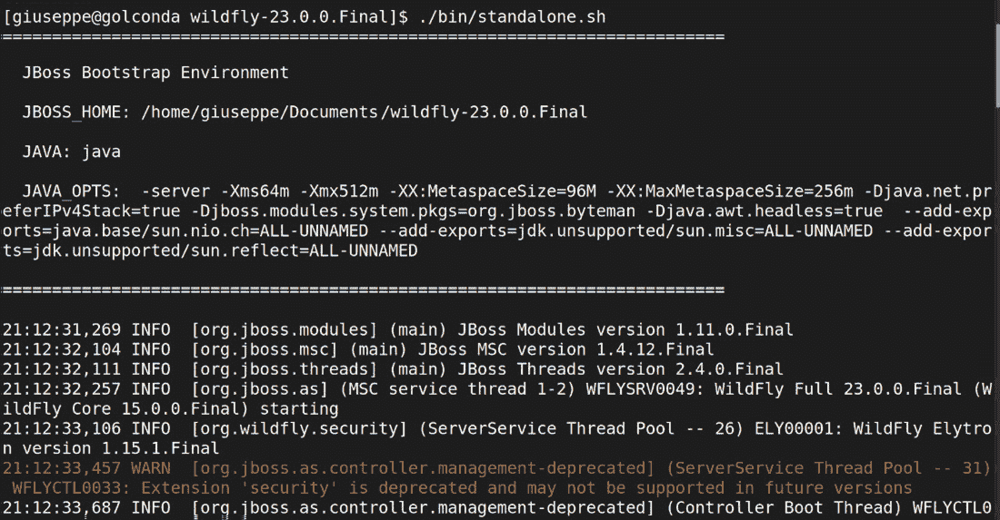
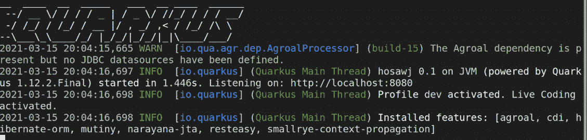
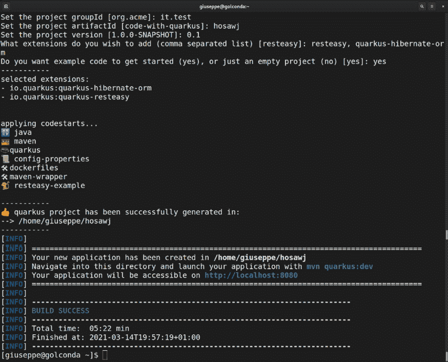
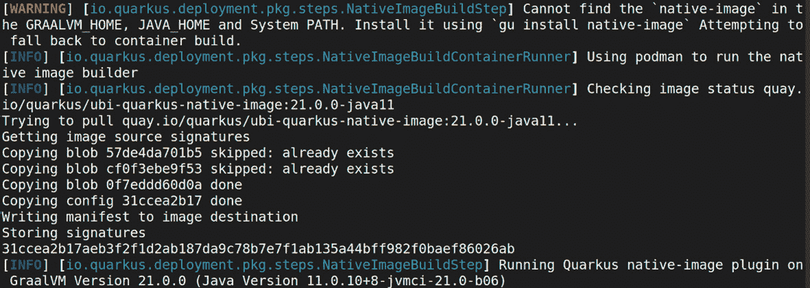
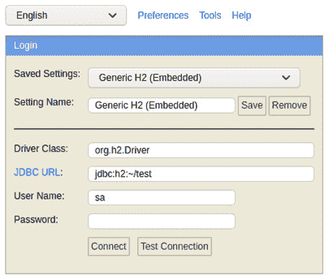

# 第七章：探索中间件和框架

在本章中，我们将开始讨论中间件的概念以及它是如何随着时间的推移而演变的。特别是，我们将重点关注**Java 企业版**（**JEE**）标准，包括**Jakarta EE**的过渡。我们将看到一个值得注意的开源实现，即**WildFly**（以前称为**JBoss 应用服务器**），并且我们将开始探索中间件概念如何演变成云原生框架——在我们的案例中，是**Quarkus**。

您在本章中将学习以下主题：

+   JEE 标准

+   WildFly 应用服务器

+   最常见的 JEE API

+   超越 JEE

+   Quarkus

我们对中间件的看法将在下一章中完成，我们将看到集成方法，这是传统上所说的中间件的另一个基石。

阅读本章后，您将了解 JEE 标准和其云原生替代品 MicroProfile 之间的差异和相似之处。此外，我们将看到这两个标准提供的最常见和最有用的 API。

但首先，让我们从 Java 开发者中最受欢迎的中间件标准开始，当然是 JEE。

# 技术要求

请确保您的机器上安装了受支持的**Java 虚拟机**（**JVM**）。

您可以在 GitHub 上找到本章使用的源代码：[`github.com/PacktPublishing/Hands-On-Software-Architecture-with-Java/tree/master/Chapter7`](https://github.com/PacktPublishing/Hands-On-Software-Architecture-with-Java/tree/master/Chapter7)。

# 介绍 JEE 标准

我们（作为对数字世界了如指掌的程序员）知道 Java 是一种强大且表达力丰富的语言。它是构建应用程序的广泛使用工具，无论是以传统方式（正如它已经在大多数企业环境中那样）还是越来越多地以云原生方式（正如我们将在本章中看到的那样）。

根据 2021 年 Snyk 的 JVM 生态系统报告，大约 37%的生产应用程序使用 JEE（与 Java EE 相比，较老版本仍然被大多数使用，而较新的 JakartaEE 实现则较少）。Spring Boot 占 57%，而我们将在本章中看到的 Quarkus 正在增长，目前占 10%。

所以，Java 本身并不需要介绍。每个人（至少，阅读这本书的每个人）都知道它是一种强大且表达力丰富的语言，旨在跨平台可用（一次编写，到处运行——我爱它！）并且它基于字节码的编译，这些字节码随后可以被虚拟机执行。

它是一个包含编程语言、规范、文档以及一系列支持工具的技术平台，包括运行时（JVM）、编译器等。这些工具由不同的供应商提供（主要供应商包括 Oracle、IBM 和 Red Hat），并符合标准。目前，该语言由 Oracle 拥有。到目前为止，一切顺利。

然后，我们有**企业版**。Java 技术的**纯**版本实际上并不需要许多标准。如事务和消息传递等功能专门针对服务器端企业场景，例如银行应用、CRM 和 ERP。因此，这些功能被标准化为 Java 平台的一个扩展，即企业版。

然而，在 2017 年，Oracle 决定将企业版的权利捐赠给 Eclipse 开源社区，同时保留对 Java 语言（和品牌）的权利。因此，经过社区投票，企业版已被更名为 Jakarta EE。

这次过渡导致在规范过程中产生了一些轻微的变化，基本上使其更开放于合作，并且不再仅仅与一家供应商相关联。旧的过程被称为**Java 社区进程**（**JCP**），而新的过程被称为**Eclipse 基金会规范流程**（**EFSP**）。最重要的概念保持不变，例如**Java 规范请求**（**JSR**），它是一种指定新功能的方式，以及**技术兼容性工具包**（**TCKs**），用于认证对标准的遵守。Jakarta 从**版本 8**开始，基于**Java EE 8**。在撰写本文时，**Jakarta EE 9**已经可用。本章中的示例针对**JEE 8**（因为它是目前最广泛使用的版本）进行测试，但也应在**JEE 9**中正常工作。

值得注意的是，在本节中，我们将安装 WildFly 应用服务器，以便开始尝试使用 JEE（稍后，我们将开始使用 Quarkus 来学习 MicroProfile）。在这两种情况下，您机器上的唯一要求是兼容版本的 JVM。如果您有疑问，您可以从 OpenJDK 网站免费下载您需要的版本（[`openjdk.java.net/`](http://openjdk.java.net/))。

## 深入 JEE 实现

正如我们所说，JEE 规范（在过渡到 Jakarta 之前和之后）提供 TCKs。TCKs 是一套用于认证符合 JEE 标准的测试。JEE 目前提供完整配置文件和 Web 配置文件。Web 配置文件基本上是完整配置文件中包含的规范的一个子集，旨在为某些场景提供更轻量级的实现。

有许多符合 JEE 规范的应用服务器。根据我个人的经验，最广泛采用的服务器如下：

+   **WildFly** 是一个完全开源的 JEE 应用服务器，它有一个名为 JBoss Enterprise Application Platform（由 Red Hat 支持）的商业版本。

+   由 IBM 开发的 **WebSphere Application Server** 以许多不同的版本分发，包括开源的 Open Liberty。

+   由 Oracle 开发和分发的 **Oracle WebLogic Server**（仅限完整配置文件）。

在完全实现 JEE 规范的其他服务器中，Payara 和 GlassFish 值得一提。还有一些其他有趣的项目（如 Tomcat 和 Jetty），它们并未完全获得 JEE 认证，但实现了大部分 API，并且可以通过外部依赖连接到其他一些服务器。在本章中，我们将使用 WildFly，但多亏了 JEE 标准，如果我们更改一些依赖项，其他服务器也应该能够正常工作。

# 介绍 WildFly 应用服务器

WildFly 是我在日常工作中遇到的最常见的应用服务器。它可能是最广泛使用的 Java 应用服务器。它曾更名为 JBoss，作为 `JBoss.org` 的缩写），并由 Red Hat 商业支持的产品系列（包括 **JBoss EAP**）。

值得注意的是，JBoss EAP 由与 WildFly 相同的组件组成。商业发行版中没有隐藏的功能。JBoss EAP 简单地是在某个版本上冻结的 WildFly 组件的发行版，用于为企业环境提供稳定性、认证和商业支持。WildFly 使用 Java 开发。

## 探索 WildFly 架构

如果你曾经有过不错的 WildFly 使用体验，你可能还记得 JBoss 以前很大，有时速度较慢。因此，很久以前（大约在 2011 年），当时名为 **JBoss AS 7** 的服务器从底层进行了重构。结果是模块化和快速的应用服务器，为所有后续版本（包括当前版本）提供了基础。

主要变化涉及类加载（变得更加细粒度）、核心功能实现（转移到模块化、懒加载系统）、管理和配置（统一到一个单独的文件）。这次重构的结果被用于 **JBoss EAP 6**（及其后续版本）的商业发行版。最新的 WildFly 版本（**22.0**）在我的笔记本电脑上启动大约需要 1 秒。WildFly 可以以独立模式启动（所有内容都在一个 Java 进程中运行）或以域模式启动，这是一种从单个点集中管理实例的方式。

重要提示：

一个非常常见的误解是将域的概念与集群和高可用性的概念混淆。实际上，它们是正交的概念。

我们可以有任意数量的独立服务器，每个服务器单独管理和配置，以高度可用性方式集群，或者一个域管理一队非集群实例。还值得注意的是，我们可以在单个机器上（无论是物理主机还是虚拟主机）运行多个服务器实例，通过操作不同的端口偏移量（以避免 TCP 端口冲突）和不同的子目录。

服务器以 `.zip` 文件的形式分发，最显著的文件夹如下：

+   `bin` 目录：它包含启动服务器的可执行脚本（包括 `.sh` 和 `.bat`），以及一些其他实用程序，例如添加用户和配置保险库。

+   `modules` 目录：它包含应用程序服务器的系统依赖项，实现了核心 JEE 功能（以及其他支持子系统）。

+   `standalone` 目录：当服务器以独立模式启动时，用作根目录。它包括如 `configuration`（用于存储配置文件）、`data`（存储已部署应用程序的持久数据）、`tmp`（用于存储应用程序使用的临时文件）、`log`（服务器和应用程序日志文件的默认位置）和 `deployments`（可以通过放置可部署文件来部署应用程序，并用于开发目的）等子目录。

+   `domain` 目录：这与 `standalone` 类似，但它不包含 `deployments` 文件夹（用于即插即用部署，即通过复制目录中的工件并期望应用程序服务器选择并部署它。在域模式下不支持此功能）。它包含一个 `content` 目录（支持一些特定于域操作模式的系统功能）和一个 `server` 目录，该目录包含当前机器上每个服务器实例的子目录，依次包含该特定服务器使用的 `tmp`、`data` 和 `log` 文件夹。

到目前为止，我们已经介绍了 WildFly 架构；现在让我们看看如何运行 WildFly 服务器。

## 运行 WildFly 服务器

为了本章的目的，我们将以独立模式运行 WildFly 服务器。在我们开始之前，请确保您的机器上已安装支持的 JVM。我们需要从 [`www.wildfly.org/downloads/`](https://www.wildfly.org/downloads/) 下载最新的服务器发行版。

我们将使用以下步骤来安装 WildFly 服务器运行时：

1.  下载所需的合适文件后，我们将解压缩它们，并在终端上运行以下命令：

    ```java
    /bin/standalone.sh
    ```

我们还可以使用 `.bat` 脚本（如果您使用的是 Windows）来运行服务器。我们得到以下输出：



图 7.1 – 初始化 WildFly

1.  一旦服务器启动，我们可以通过将我们的工件（`.jar` / `.war` / `.ear`）放入`deployments`文件夹（不建议用于生产目的）或更好的是，我们可以通过使用 JBoss **命令行界面**（**CLI**）来部署我们的应用程序。

1.  可以通过从`bin`目录运行`jboss-cli.sh`（或`.bat`）脚本来执行 JBoss CLI。CLI 可以用来连接、配置和管理 WildFly 设置（本地和通过网络）。为了使用它连接到本地独立 WildFly 实例，我们可以简单地使用以下命令：

    ```java
    ./jboss-cli.sh --connect
    ```

1.  然后我们将进入交互式的 WildFly CLI。要部署我们的应用程序，我们可以使用以下命令：

    ```java
    deploy /pathToArtifact/myArtifact.war
    ```

1.  我们可以使用`exit`命令退出 WildFly CLI：

    ```java
    exit
    ```

现在我们已经了解了配置和操作 WildFly 服务器的基础知识，我们可以开始尝试简单的 JEE 示例。

# 理解最常用的 JEE API

现在我们已经了解了 JEE 技术的概述并使用应用服务器实现了它，我们将学习在企业项目中使用的最常见 JEE API。我们将在本章末尾的*案例研究和示例*部分查看这些 API 的一些示例。

## 依赖注入

我记得那些在 JEE 中依赖注入还不存在的时候，我们不得不完全依赖于**EJB 版本 2**（遗憾的是）来连接我们的依赖。这可能是 Spring 框架流行增长的原因之一，它通过提供基于依赖注入的轻量级替代方案，避免了冗长且易出错的配置文件，从而变得广泛流行。但这又是另一个超出本书范围的故事。

**依赖注入**（**DI**）或**上下文与依赖注入**（**CDI**）是一个扩展并实现**控制反转**（**IoC**）原则的概念。这里的想法是，我们不必让每个类实例化所需的类，而是可以让一个外部实体（有时被称为 IoC 容器）来做这件事。这使我们能够在设计时仅使用 Java 接口，并让容器选择正确的实现，从而提高灵活性和解耦。此外，CDI 概念通过使一个类与其他类的连接点明确，合理化了应用程序的结构。

在 CDI 标准的当前实现中（`@Inject`注解）。

通过在我们的类的一个字段（或 setter 方法，或构造函数）上标记这个注解，我们基本上是在告诉框架我们希望该字段被实例化并提供给我们。容器试图在应用程序中识别一个可能满足该依赖的类。可以注入的对象几乎可以是任何类型的 Java 类，包括提供对 JEE 服务访问的特殊事物，如持久化上下文、数据源和消息传递。

*但是容器是如何识别要使用哪个类的呢？* 跳过只提供一种可能实现的情况，当然，有方法来定义注入哪个兼容的类。一种方法就是使用限定符。

`@Named` 注解。使用这个注解，我们可以为每个兼容的类提供一个名称，然后指定在注入时使用哪一个。

最后，但同样重要的是，可以使用 `@Default` 标记一个类，并用 `@Alternatives` 标记其他实现，以标识我们想要选择哪一个。`@Alternatives` 可以指定优先级顺序。

CDI 还提供了对象生命周期的管理，这意味着对象应该在何时创建和何时销毁。CDI 范围是通过使用注解配置的，正如我们刚才看到的注入一样。最常用的范围如下：

+   **@ApplicationScoped**：这会将对象的创建和销毁与整个应用程序的生命周期相关联。这意味着在应用程序启动时创建一个实例，并在关闭时销毁。容器将只管理一个实例，并由所有客户端共享。从这个意义上说，这个注解是单例模式的实现。

+   **@Dependent**：这是默认的范围，创建一个与使用它的对象的生存周期相关联的类，因此它与注入的对象同时创建和销毁。

+   **@SessionScoped**：这会将对象的生存周期与它所引用的 HTTP 会话相关联（因此使其成为存储用户和会话信息的好工具）。

+   **@RequestScoped**：这会将对象的生命周期绑定到它所引用的 HTTP 请求的生命周期。

+   **@TransactionScoped**：这会将对象的生存周期与它所使用的事务边界的持续时间相关联。

这是 CDI 范围的图示：

![Figure 7.2 – CDI scopes]

![img/Figure_7.2_B16354.jpg]

图 7.2 – CDI 范围

CDI 规范还提供了对特定生命周期事件的钩子。最常用的有 `@PostConstruct` 和 `@PreDestroy`，分别是在对象创建后立即调用和销毁前调用。

## Jakarta RESTful Web Services

现在 Java 应用程序的另一个重要组成部分是 RESTful Web Services。Jakarta EE 标准的 RESTful Web Services（将 `JAXRSApplication` 类添加到类路径），我们只需要创建一个映射我们想要公开的资源并相应注解的 bean。

在最常见的情况下，我们将不得不通过使用 `@Path` 注解将整个类映射到我们想要公开的路径。然后，我们可能还想通过使用 `@Produces` 和 `@Consumes` 注解来指定该类产生的和消费的媒体类型（通常是 JSON）。

类中的每个方法都可以通过使用`@Get`、`@Post`、`@Delete`、`@Put`和`@Head`等注解将其映射到 HTTP 方法，并且我们可以使用相同的`@Path`注解将这些方法绑定到子路径。例如，我们可以将整个类绑定到`/myPath`（其中`GET`、`POST`和其他 HTTP 方法引用该路径），然后可以将特定的方法注解为引用`/myPath/mySubPath`。

另一个非常常见的场景是将方法参数与 HTTP 路径参数（`@PathParam`）、查询字符串参数（`@QueryParam`）和 HTTP 头（`@HeaderParam`）绑定。我们应该特别提及**Jakarta JSON Binding**（**JSON-B**）规范，它在幕后工作，可以为我们的 bean 提供从 JSON 到**Plain Old Java Objects**（**POJOs**）（反之亦然）的映射，前提是它们具有简单的结构（并且不需要任何复杂的配置）。这对于最常见的用例是正确的，这意味着具有简单类型字段以及 getter 和 setter 的 Java 类。但当然，如果我们需要，我们也可以提供自定义和实现特殊案例。

作为 JAX-RS 规范的一部分，我们也可以创建 REST 客户端（用于查询 REST 服务）。为了做到这一点，一种常见的方法是使用`ClientBuilder`类，它提供了一个流畅的 API 来指定 HTTP 客户端的常用参数（如超时、过滤器以及类似的设置）。然后我们可以创建一个所谓的`WebTarget`对象，这是一个允许我们指定使用客户端调用的路径的对象。在`WebTarget`上操作，我们可以通过传递参数并获取结果（通常是 JSON 对象的形式）来发送请求。

JAX-RS 规范的一个有趣之处在于管理**服务器发送事件**（**SSEs**）的可能性。SSEs 是在**HTML5**标准化中引入的，它通过使用开放连接以事件的形式从服务器向客户端提供数据。

发生的情况是客户端向服务器发起请求，但不是一次性获取所有数据并关闭连接，而是保持连接打开，并随着数据的到来从客户端获取数据（最终在某个时刻关闭它，或者被服务器断开连接）。这里的优势是我们可以重用相同的连接来减少开销，并且我们可以在不需要轮询服务器以获取更新时实时获取（并可视化）数据。客户端可以是 Java 客户端或浏览器中的网页。

为了实现这种行为，JAX-RS 提供了`Sse`和`SseEventSink`资源，可以使用`@Context`注解将其注入到我们的方法中，如下所示：

```java
@GET
@Path("/serverSentExample ")
@Produces(MediaType.SERVER_SENT_EVENTS)
public void serverSentExample(@Context SseEventSink 
  sseEventSink, @Context Sse sse)
```

一旦我们有了这两个资源，我们可以使用`sse`来构建新的事件，并使用`sseEventSink`来发送这些事件。一旦我们与客户端完成交互，我们可以使用`sseEventSink`来关闭连接：

```java
OutboundSseEvent event = sse.newEventBuilder()
.mediaType(MediaType.APPLICATION_JSON_TYPE)
.data(MyEventData.class, myEventData)
.build();
eventSink.send(event);
...
eventSink.close();
```

因此，让我们总结一下：

+   我们通过在注入到我们类中的`sse`对象上调用`newEventBuilder`来创建一个`event`对象。

+   我们将`mediaType`设置为 JSON。

+   我们添加我们想要发送的数据，指定类类型和包含数据的对象实例。

+   我们调用`build`方法来创建`event`实例。

+   我们在`eventSink`对象上调用`send`方法，传递我们刚刚创建的事件实例。

+   最终，我们可以通过在`eventSink`对象上调用`close`来关闭连接。当然，在现实世界的场景中，我们可能在关闭连接之前发送一系列事件（例如，某件事情发生的结果）。只为发送一个事件而使用`sse`并没有太多意义。

SSE 产生的一个有趣的场景是实现广播场景的可能性。在这种情况下，而不是让每个客户端连接到不同的线程（并接收不同的消息），我们可以让所有客户端接收相同的信息。这样，我们将有客户端订阅（通常调用特定的 REST 服务）然后获取数据（调用另一个服务）。以下是一个代码示例（简化版）：

```java
     @GET
  @Path("broadcast")
  public Response broadcast(@Context Sse sse) {
    SseBroadcaster sseb = sse.newBroadcaster();
    OutboundSseEvent event = sse.newEventBuilder()
    .mediaType(MediaType.APPLICATION_JSON_TYPE)
    .data(MyEventData.class, myEventData)
    .build();
    sseb.broadcast(event);  
    ... 
}
@GET
    @Path("subscribe")
    @Produces(MediaType.SERVER_SENT_EVENTS)
    public void subscribe(@Context SseEventSink 
      sseEventSink){
         broadcaster = sse.newBroadcaster();
    broadcaster.register(sseEventSink);
    }
```

让我们总结一下这段代码做了什么：

+   我们创建了一个`broadcast`方法，并对其进行了注释，表示它将与在`broadcast`路径上公开的 HTTP `GET`方法相关联。

+   这个`broadcast`方法将被注入一个在上下文中存在的`sse`对象实例。

+   我们通过在`sse`对象上调用`newBroadcaster`方法来创建一个`broadcaster`对象。

+   我们通过在`sse`对象上调用`newEventBuilder`方法来创建一个`OutboundSseEvent`对象。

+   我们将`mediaType`设置为 JSON。

+   我们添加我们想要发送的数据，指定类类型和包含数据的对象实例。

+   我们调用`build`方法来创建`event`实例。我们在`broadcaster`对象上调用`broadcast`方法，传递我们刚刚创建的`event`实例。

+   我们创建了一个`subscribe`方法，并对其进行了注释，表示它将与在`subscribe`路径上公开的 HTTP `GET`方法相关联，并且将使用`SERVER_SENT_EVENTS`媒体类型生成答案。

+   `subscribe`方法将被注入一个在上下文中存在的`SseEventSink`对象实例。

+   我们通过在`sse`实例上调用`newBroadcaster`方法来创建一个`broadcaster`对象实例。

+   我们通过将`sseEventSink`传递给`broadcaster`对象的`register`方法来注册它。

在客户端，我们很可能会通过使用 Vue 或 Angular 等框架与 SSE 进行交互。但无论如何，在底层它将使用 JavaScript 的`EventSource`对象：

```java
var source = new EventSource('mySSEEndpoint');
source.onmessage = function(e) { ... do something...}
```

如前所述，我们也可以通过使用 Java 客户端与 SSE 进行交互。类似于 JavaScript 版本，Java 中的 SSE 实现也提供了一个`EventSource`对象：

```java
Client client = ClientBuilder.newBuilder().build();
WebTarget target = client.target("mySSEBroadcastEndpoint");
SseEventSource source = 
  SseEventSource.target(target).build();
source.register(event -> { ... do something ... });
sseEventSource.open();
```

在这里，个人考虑因素是彻底测试这种实现方式在实际生产场景中的效果，并管理和监控异常情况。我们还必须考虑一些备选方案，以防出现意外的断开连接，这可能是由于客户端（如移动客户端）连接不稳定或网络设备在整体基础设施中表现不佳所导致的。通常，框架也会提供一些弹性功能，例如连接重试（以防后端暂时不可用）。从后端的角度来看，弹性也必须被考虑，因此如果在发送消息时发生故障（并且抛出异常），你应该考虑处理（包括重试）。但由于这基本上是非事务性的（因为网络连接可能不可靠），你应该考虑边缘情况，包括重复事件或消息丢失。

## WebSocket

Jakarta EE 包括对 WebSocket 技术的支持。使用这项技术，我们可以在客户端和服务器之间实现全双工通信，支持在 Web 应用程序中开发丰富的用户体验。WebSocket 直接位于 TCP 之上，因此它不依赖于 HTTP。然而，它与 HTTP 兼容，这意味着从连接的角度来看，它使用兼容的握手，并且可能通过 HTTP 和 HTTPS 标准端口（`80`和`443`）传输，因此它与大多数网络基础设施兼容。

为了在后台实现 WebSocket 功能，你需要使用`@ServerEndpoint`注解一个类，指定将发布功能的路径。有了这个类，我们就可以使用`@OnMessage`、`@OnOpen`、`@OnClose`和`@OnError`注解方法来拦截接收到的消息、连接的客户端、断开的客户端和错误事件。在客户端连接后，在`@OnOpen`注解的方法中，可以检索和存储一个会话对象。然后可以使用这个对象向客户端发送消息，从而实现全双工通信，如下所示：

```java
@ServerEndpoint("/myWebSocket")
public class WebSocketEndpoint {
    @OnMessage
    public String onMessage(String message) {
        System.out.println("Message received: "+ message);
        return message;
    }
     @OnOpen
  public void onOpen(Session session) {
    System.out.println("Client connected");
//Session object can be stored and used to send messages 
  back
  }

  @OnClose
  public void onClose() {
    System.out.println("Connection closed");
  }
    @OnError
    public void onError(Session session, Throwable 
      throwable)
    {
        System.out.println("Error in session " + 
          session.getId() + " " + throwable.getMessage());
    }
}
```

当我们讨论服务器端事件时，WebSocket 的应用通常是在客户端使用框架实现的。然而，JavaScript 暴露了一个 WebSocket 对象，可以用来镜像服务器端的生命周期（`OnOpen`、`OnMessage`和`OnError`）以及消息发送能力。与 SSE 一样，我的建议是在与生产环境相当的基础设施上测试这种交互，并在网络连接出现问题时准备好备选方案，例如实现优雅降级。这种实现的不错例子可以是**断路器模式**，正如我们将在*第九章*中看到的，*设计云原生架构*。

## 消息传递

**消息传递**是现代应用中的另一个关键组件。在云原生微服务世界中，**Java 消息服务**（**JMS**）被认为是一种**企业级**、复杂的通信方式，通常与其他技术一起使用，例如 Kafka 和 AMQP。然而，多年来，从**版本 2.0**开始（**3.0**在撰写本文时刚刚发布），JMS 已经变得非常容易使用（至少在基本用例中）。

JEE 消息标准的理念（这是我总体上喜欢应用程序服务器的一个原因）是我们可以保持代码简单紧凑，并将配置卸载到应用程序服务器。这也具有将代码与配置分离的优势。这也在清晰度、可移植性和可测试性方面具有优势。

为了发送消息，我们可以使用 JEE 资源的注入——在这种情况下，`JMSContext`。采用相同的方法，我们可以注入一个代表我们目标队列的对象。然后 API 允许我们从一个`JMSContext`对象创建一个生产者，并使用它向队列发送消息，如下代码片段所示：

```java
@Resource(mappedName = "java:jboss/jms/queue/testQueue")
private Queue testQueue;
@Inject
JMSContext context;
...
context.createProducer().send(testQueue,msg);     
...
```

使用类似类型的 API，我们可以通过创建一个消费者并对其调用接收方法来消费消息。但这并不是常见的做法。

最广泛使用的方法是使用`MessageListener`接口和一些注解来配置要附加到的队列。代码相当直观：

```java
@MessageDriven(name = "TestMDB", activationConfig = {
  @ActivationConfigProperty(propertyName = 
   "destinationLookup", propertyValue = "queue/TestQueue"),
  @ActivationConfigProperty(propertyName = 
    "destinationType", propertyValue = "javax.jms.Queue")})
public class TestMDB implements MessageListener {
    public void onMessage(Message msg) {
        TextMessage myMsg =(TextMessage) rcvMessage;
          LOGGER.info("Received Message " + myMsg
            .getText());
```

在消费者（MDB）和生成器示例中，代码寻找默认的 JMS 连接工厂，它应该绑定到`java:/ConnectionFactory`。如果我们想的话，可以明确指定一个替代连接工厂（例如，当我们的应用程序服务器必须连接到不同的代理时）。

为了设置连接到代理（如主机、端口、用户名和密码）的属性（并将其与`java:/ConnectionFactory`关联），我们必须配置应用程序服务器。这当然是特定于我们选择的服务器。在 WildFly 中，我们通常通过使用 CLI（正如我们在部署应用程序时所见）或直接编辑配置文件来完成此操作。

## 持久性

**持久性**通常是 Java EE 应用必须拥有的属性之一。虽然现在其他持久性替代方案（如 NoSQL 存储和**内存**缓存）被广泛使用，但数据库持久性不太可能在短期内消失。

JEE 中的持久性由**Java 持久性 API**（**JPA**）规范进行管理。在早期版本中，JPA 使用起来笨拙且痛苦（EJB 规范也是如此）。但这不再是事实，JPA 现在非常容易使用。正如你可能知道的，JPA 是围绕**对象-关系映射**（**ORM**）理念构建的，旨在将关系数据库表映射到对象（在我们的情况下，Java 对象）。

因此，使用 JPA 的第一件事是要定义我们的对象以及它们如何映射到数据库表。正如您所想象的，这可以通过使用注解轻松完成。这里的注解包括`@Entity`来标识类并将其映射到数据库，`@ID`来标记与主键链接的字段，`@GeneratedValue`来定义键生成策略，`@Table`来配置表名（默认为类名），以及`@Column`来配置每个类字段的列名（在这种情况下，它也默认为字段名）。代码看起来是这样的：

```java
@Entity
@Table(name="MyTableName")
public class MyPojo {
@Id
@GeneratedValue(strategy = GenerationType.IDENTITY)
private int id;
@Column(name="myColumn")
private String myField;
...
```

在我们将我们的类链接到数据库表之后，是时候与数据库本身进行交互了。您可以通过注入所谓的`EntityManager`来轻松地做到这一点。实体管理器与一个持久化上下文相关联，这本质上是你设置到应用和应用服务器中的配置集合，使其知道数据库应该连接到何处，例如**Java 数据库连接**（**JDBC**）字符串和其他属性。

您可以使用实体管理器通过使用 JPA 查询语言（与 SQL 类似）来从数据库检索对象，创建新对象，删除它们等。以下是一个代码示例：

```java
@PersistenceContext(unitName="userDatabase")
private EntityManager em;
Query query = em.createQuery("Select p from MyPojo p");
(List<MyPojo>) query.getResultList();
em.getTransaction().begin();
        MyPojo pojo = new MyPojo();
        pojo.setMyField ("This is a test");
        em.persist(pojo);
em.getTransaction().commit();
em.close();
...
```

如您所见，与迄今为止我们所看到的其他 API 一样，JPA 使用起来相当简单。它将很好地将业务逻辑（在您的 Java 代码中）与配置（在应用服务器中）解耦，并标准化常见方面的实现，例如表到 POJO 映射和事务使用。

## Java EE 缺少什么

一些开发者之所以从 JEE 规范中移开，其中一个原因是标准的演变有点缓慢。平台的一个目标是要包括一个提供参考实现的厂商大列表，并为标准用户提供长期稳定性，因此 JEE 的演变将需要时间。在撰写本文时，JEE 中缺少一些需要通过使用第三方库来克服的东西。

我们将尝试总结这个领域中最常见的批评：

+   **可观察性**：从开始，一些高级监控能力就缺失在 JEE 规范中。**Java 管理扩展**（**JMX**）作为 Java 平台提供的一些指标和监控的第一个尝试被提供，JDK Mission Control 被捐赠给开源社区，提供了更多关于分析的高级功能。

然而，企业通常会用第三方软件来补充这些技术，有时甚至是专有软件。截至今天，为了在生产环境中完全控制应用程序的行为，通常需要更高级的监控能力，例如跟踪。此外，基于 Prometheus 和 Grafana 等堆栈的指标收集和显示技术已成为一种事实上的标准。可观察性还包括诸如健康和就绪探测这样的内容，这些是应用程序暴露的特殊服务，可用于检查应用程序的可用性（如果应用程序不可用，则发送警报或实施某种形式的解决方案）。

+   **安全性**：虽然 JEE 和 Java 在安全性方面相当丰富，包括不同架构级别的基于角色的访问控制、加密、多因素认证和授权功能，但支持仍然缺失。还有一些其他功能，如 OpenID Connect 和 JSON Web Token，仍然缺失在核心规范中。

+   **容错性**：在高度去中心化的环境中，例如微服务和云原生，防御应用程序免受外部组件问题（如端点失败或响应缓慢）的影响至关重要。在 JEE 中，没有标准化的方式来管理这些事件（除了正常的异常处理之外）。

+   **OpenAPI**：REST 服务在 JEE 世界中很普遍。然而，JEE 没有指定定义 REST 服务 API 合同的方式，就像 OpenAPI 标准所做的那样。

其他不太可能标准化的功能，例如替代数据存储（例如 NoSQL 数据库）和替代消息传递（例如流平台或 AMQP），也缺失。所有这些功能通常都是由第三方库和连接器添加的。正如我们将在接下来的章节中看到的，**MicroProfile**提供了一种以标准方式克服这些限制的方法。

## Java EE 的亮点

尽管 JEE 的基本规范中缺少一些有用的现代技术（但如我们刚才所说，大多数情况下可以通过第三方库轻松添加，例如[smallrye.io](http://smallrye.io)项目所提供的），但我仍然认为 JEE 技术非常出色，并且会继续存在。以下是一些原因：

+   **供应商生态系统**：正如我们在本章开头所看到的，有许多替代实现，既有付费的也有免费的，提供 JEE 兼容性。这将确保长期稳定性和（在需要时）商业支持，这在某些环境中可能至关重要。

+   **操作**：虽然没有固定的标准，因为每个供应商都以自己的方式实现它，但 JEE 对应用程序强制实施了一些可配置性点。这意味着 JEE 应用程序可以很容易地针对线程池大小、超时和身份验证提供者等进行微调。当然，即使使用其他方法，这也是可能的，但 JEE 通常更易于操作。一旦系统管理员了解了正在使用的应用程序服务器的具体细节，他们就可以轻松地更改这些方面，无论部署的是哪种类型的应用程序。

+   **经过企业需求考验**：JEE 仍然提供了在企业世界中非常有用（有时是必需的）的东西。我们谈论的是分布式事务、对遗留或企业系统的连接器、强大的部署标准等等。你可能会在替代堆栈中找到一些这些功能，但它们通常是不完整的且不够健壮。

这就完成了我们对 JEE 优缺点的快速概述。正如你可能知道的，对 JEE 的详细解释可能需要一整本书（非常大）。然而，在这些部分中，我们已经看到了一些基本 API 的简单选择，这些 API 对于构建现代应用程序非常有用，包括 RESTful Web 服务、JPA 持久性和消息传递。我们还看到了 JEE 框架的优缺点。

在下一节中，我们将开始讨论应用程序服务器的替代方案。

# 超越 Java 企业版

在*第一章*，《Java 软件架构设计——方法和风格》中，我们非常快速地看了一下容器化 Java 应用程序。

现在，我们将探讨 Java Enterprise 的替代方案和扩展，包括轻量级 Java 服务器和**胖 JAR**应用程序。在这里，我们将快速概述为什么要实现胖 JAR 应用程序以及如何实现。

## 打包微服务应用程序

**胖 JAR**（也称为**Uber JAR**）可能是应用程序服务替代方案（以及微服务运行时）的起点之一。例如，Dropwizard、Spring Boot 和最近出现的 Quarkus 等框架都采用了这种方法。

胖 JAR 的想法是将所有需要的东西打包到一个单一的`.jar`文件中，这样我们就有了一种自包含且不可变的方式来部署应用程序。

优势很容易想象：

+   `.jar`文件。

+   **行为在不同环境中保持一致**：你可以在笔记本电脑上测试应用程序，而无需完整的应用程序服务器。

+   **完全控制依赖项**：支持库的版本和实现是在构建时固定的，因此在生产中变量会更少（并且你不会被强迫坚持使用应用程序服务器提供的版本）。

当然，所有这些都有代价。以下是这种方法的某些不太明显的缺点：

+   它不太标准化（想想配置）。有一些既定标准，例如`.yaml`、应用程序属性文件或系统属性。但通常这些会因应用程序而异，即使使用相同的技术栈也是如此。相反，应用服务器在配置什么可以配置以及在哪里放置这些配置方面往往更为具体。

+   虽然你可以选择和选择你需要的依赖项，但你必须将这样的依赖项携带到每次部署（或扩展）中。如果你使用许多依赖项，这将在网络使用和时间损失（以及编译时间）方面产生重大影响。使用应用服务器时，你假定这些依赖项已经在应用服务器中等待你。

+   当涉及到可支持性时，要么从供应商那里获得支持服务，要么简单地遵守内部标准。你通常会被绑定到一个固定的库和版本集合，这些库和版本可能已经被测试过，以确保与你的环境兼容，并遵守安全和性能标准。使用胖 JAR，你在运行时和部署时对这一点控制较少。你将不得不在构建时移动这些控制，并在将其放入生产环境之前，可能还需要双重检查胖 JAR 的内容是否符合标准。

正如我们在*第一章*中讨论的，《Java 软件架构设计 – 方法与风格》，容器改变了游戏规则。

使用容器技术，你可以创建一个完整的可移植环境，包括一个基础操作系统（某种程度上）和一个文件系统，你可以在其中放置依赖项和资源，以及你的应用程序。这意味着你不需要一个自洽的应用程序来部署，因为这些功能由容器技术提供。而且，正如已经讨论过的，当与容器一起使用时，这也可能是有害的，因为它们被设计成以分层方式工作。因此，你可以使用这个功能来打包和部署只有上层（包含你的应用程序代码）而不是携带整个依赖集。

因此，尽管在某些情况下（如本地测试）仍然方便，但现在胖 JAR 并不是必需的。

但正如我们所看到的，除了不同的打包方法之外，还有一些可能在云原生和微服务世界中非常有用的功能。这些功能在 JEE 中缺失，例如可观察性和对替代技术的支持。微服务运行时通常定义自定义解决方案来填补这些空白。

但如前所述，缺乏标准是微服务中已知的问题。这曾经是一个小问题，因为早期的采用者通常是技术能力深厚的团队，他们依赖自我支持，不需要第三方供应商的支持。

然而，如今，微服务、云原生和 JEE 的一般扩展的采用正在大幅增长。长期稳定性、企业支持和开放生态系统等因素变得越来越重要。这就是 MicroProfile 的一个原因。

## 介绍 MicroProfile

**MicroProfile** 从关注通过微服务提供的功能扩展 JEE 规范开始。该开发由 IBM、Red Hat、Oracle 和 Microsoft 等行业参与者组成的联盟支持。该规范与 Jakarta EE 并行存在，共享一些功能，发展一些其他功能，并添加了一些不属于 JEE 的更多功能。

这之所以可行，是因为 MicroProfile 联盟，作为 Eclipse 基金会的一部分，选择了一个更少官僚主义和更频繁的发布模式。

这意味着现代 Java 开发现在基本上可以走两条并行道路：

+   **Jakarta EE**：如果我们更重视长期稳定性和企业功能（或者如果我们想维护和现代化现有的代码库），我们可以选择这个选项。

+   **MicroProfile**：如果我们优先考虑云原生特性和频繁的发布周期，我们可以选择这个选项。

*但 MicroProfile 增加了哪些功能呢？*

## MicroProfile 规范

在纸上打印一个经常变化的快照（即变化非常频繁）是非常具有挑战性的。在撰写本文时，MicroProfile 每 3 到 6 个月发布一个新版本。以下是一些最重要的特性：

+   `.xml` 文件、系统环境和属性文件）从应用程序本身获取。这提供了访问配置值和检查更改的设施，而无需重新启动应用程序（在支持的实施中）。

+   **容错**：这是一种通过使用电路断路器、重试和回退等模式来编排对失败（如无法调用外部服务）的反应的方式。

+   **OpenAPI**：这提供了对 OpenAPI 标准的支持，这是一种定义 REST 服务合同的方式，类似于 WSDL 架构为 SOAP 网络服务提供的支持。

+   **OpenTracing**：这是一种在分布式环境中通过传递 ID 并引入诸如跨度（spans）和跟踪（traces）等概念来监控和管理调用链的现代方法。

+   **健康**：这是一种标准化的方式来创建存活性和就绪性探针，以便为检查应用程序的正确行为（当它是活跃的，即验证它是否上线或下线）及其就绪性（当它准备好接收请求时）提供工具。

+   **度量**：这是一个 API，用于提供从您的应用程序中导出可监控值的设施。这通常用于容量规划和对应用程序性能的整体理解（例如当前事务的数量）。

正如你可能已经注意到的，前面的大部分功能与我们之前在“Java EE 缺失的功能”部分中强调的内容完全一致。

我们将在*第九章*中更详细地探讨这些技术，*设计云原生架构*。

还很重要的一点是，MicroProfile 包含了 JEE（如 JAX-RS、JSON-B 和 CDI，我们在*介绍 JEE 标准*部分中看到）中的规范。虽然 MicroProfile 倾向于将此类共享库的版本与一个目标 JEE 版本对齐，但可能某些版本已经不同步（在 MicroProfile 版本中可能更更新）。

值得注意的是，MicroProfile 并不强制应用采用任何特定的打包模型。一些实现，例如由 Oracle 支持的**Helidon**和由 Red Hat 支持的 Quarkus，倾向于使用胖 JAR 和类似格式，而其他如由 IBM 提供的**OpenLiberty**和由 Red Hat 提供的 WildFly，则以更传统的方式运行（部署到轻量级运行服务器）。

在接下来的部分中，我们将开始更多地了解 Quarkus，它是一个 MicroProfile 标准的实现，并且越来越受欢迎和广泛使用。

# 探索 Quarkus

**Quarkus**是一个开源的 Java 框架，旨在为云原生和微服务进行优化。它诞生于容器和**Kubernetes**的世界，因此，它被设计为针对基于容器和 Kubernetes 的云原生应用进行了优化。

Quarkus 来自一个拥有许多有趣项目经验的工程团队，如**Hibernate**、**Vert.X**和**RESTEasy**，因此大量重用了这些著名社区中的好想法和最佳实践。

这是从终端控制台启动的 Quarkus 应用程序的外观：



图 7.3 – Quarkus 启动

如您所见，展示了令人惊叹的 ASCII 艺术和一些有趣的信息，包括启动时间少于 1.5 秒的闪电般速度。

*但 Quarkus 最重要的好处是什么？*

## 更好的性能

Quarkus 最著名的优点之一是其优化。该框架是以*容器优先*的哲学创建的，因此，它在启动时间和内存使用方面都进行了大量优化。为了实现这些目标，Quarkus 使用了各种技术：

+   **减少反射的使用**：反射在性能方面可能具有影响。Quarkus 尽可能地减少反射的使用。

+   **尽可能多地构建时间**：Quarkus 在构建时尽可能做更多的工作。这意味着所有可以提前完成的事情，例如类路径扫描和配置加载，都会在构建时完成，并以字节码的形式持久化。这样，不仅应用程序启动速度更快（因为它要处理的事情更少），而且由于所有在运行时不需要的基础设施；也就是说，在构建时预编译的不会成为最终产品的组成部分。

+   `Substrate`模块）。这允许进一步的优化，进一步减少启动时间和内存占用。

但更好的性能并不是 Quarkus 的唯一好处。

## 开发者喜悦

我最喜欢 Quarkus 的地方是它的易用性。正如经常听到的那样，Quarkus 既新鲜又熟悉。如果您来自 JEE 背景，语言非常友好。它提供了一堆工具和设施，更不用说所有让最先进功能易于使用的*语法糖*了。在 Quarkus 的世界里，这被称为**开发者喜悦**。

其中一种设施是**开发者模式**，允许您立即看到应用程序中的更改，而无需完全重新编译/重新打包。当您更改某些内容（如源代码、配置文件和资源）并立即看到这些更改的效果时（如简单地刷新浏览器或调用 API），它就像魔法一样起作用。我知道这个功能已经被其他框架和库（**JRebel**是最著名的之一）提供，但对我来说，它开箱即用的方式就是魔法，坦白说，这对开发者生产力是一个巨大的提升。

但这并不是唯一的**开发者喜悦**功能。添加到 Quarkus 中的每个依赖项（更准确地称为**扩展**）都被精心设计，以完美适应 Quarkus 的世界并利用框架的能力，首先是性能方面。

您将找到许多设施和约定，如配置和*智能默认值*，例如配置的处理方式（包括环境管理），简单使用命令和响应式范式（并使它们共存），以及它与数据库的交互方式（通过使用`Panache`扩展）。*但要从哪里开始呢？*

## Quarkus – hello world

Quarkus 有一个生成应用程序的向导（支持**Maven**和**Gradle**），位于[code.quarkus.io](http://code.quarkus.io)。按照以下步骤创建一个新的应用程序：

1.  您可以使用 Maven Quarkus 插件通过命令行创建一个新的应用程序。在当前版本中，这意味着使用以下命令：

    ```java
    mvn io.quarkus:quarkus-maven plugin:1.12.2.Final
    :create
    ```

1.  插件将要求提供所有必要的信息，例如工件名称和要开始的依赖项。以下截图说明了这一点（请注意，还有那些酷表情符号）：



图 7.4 – Quarkus Maven 插件

1.  插件执行后，您将拥有一个可以作为起点使用的应用程序骨架（在这个例子中，包含 `resteasy` 和 `hibernate` 依赖项）。为了运行它并使用开发者模式进行实验，您可以使用以下命令：

    ```java
    ./mvnw compile quarkus:dev
    ```

此命令使用 Maven 包装脚本（在这种情况下，`mvnw`，因为我正在 Linux 环境下运行，但为 Windows 环境提供了 `mvnw.cmd` 文件）以开发者模式运行应用程序。由于您正在使用 RESTEasy，默认情况下，应用程序将在以下端点以 `Hello RESTEasy` 字符串响应：`http://localhost:8080/hello-resteasy`。

为了尝试开发者模式，您可以更改源代码（在这个例子中，是 `GreetingResource` 类）以更改响应。完成此操作后，您可以刷新浏览器并查看结果，而无需重新编译或重新打包代码。

## 使用 Quarkus 构建构建技术

无需多言，开发模式支持开发阶段。为了构建和分发 Quarkus 应用程序，您还有其他选择。

目前 Quarkus 支持在 OpenJDK 上运行（有关支持的版本信息，请参阅官方网站 `quarkus.io/get-started`）。为了打包您的应用程序，您可以使用常规的 Maven 命令：

```java
mvn clean package
```

默认情况下，Quarkus 将构建一个所谓的 fast-jar。这基本上是一个针对启动时间性能和较小内存占用进行优化的包。要执行以这种方式打包的应用程序，您需要复制整个 `quarkus-app` 文件夹（在 `target` 文件夹中），其中包含运行应用程序所需的所有库和资源。然后，您可以使用类似以下命令运行它：

```java
java -jar ./quarkus-app/quarkus-run.jar
```

您还可以将应用程序打包成 UberJar 形式（请注意此方法的所有限制，如在第 *第一章* 中讨论，*Java 软件架构设计 – 方法与风格*）。为此，一种简单的方法是将 `quarkus.package.uber-jar=true` 属性传递给 Maven 命令：

```java
mvn clean package -Dquarkus.package.uber-jar=true
```

此属性也可以在 `pom.xml` 文件或 Quarkus 的配置文件（默认为 `application.properties` 文件）中设置。

最后，但同样重要的是，如本节开头所述，Quarkus 可以编译成不需要执行 JVM 的原生 Linux 可执行文件。为此，您只需使用以下命令：

```java
./mvnw package –Pnative
```

Quarkus 在底层所做的是寻找用于原生编译的 GraalVM 安装。以下截图显示了当 `GRAALVM_HOME` 变量未配置时启动 Quarkus 时会发生什么：



图 7.5 – Quarkus 通过 Podman 构建原生可执行文件

`GRAALVM_HOME`变量用于查找 GraalVM 的安装路径。如果不存在，Quarkus 将尝试容器构建。这基本上意味着，如果本地机器上安装了容器运行时（Podman 或 Docker），Quarkus 将下载一个容器镜像用于本地构建，这样你就可以创建一个本地可执行文件，而无需本地安装 GraalVM。

## Quarkus 的配置管理

Quarkus 的一个可爱特性，与开发者快乐理念一致，就是它管理配置的方式。

Quarkus 实现了 MicroProfile 的`config`规范。我们将更详细地了解 Quarkus 中的 MicroProfile 功能，但由于`config`是所有其他扩展的核心，现在看看它是很有价值的。

为了获取和使用可配置的值，你可以使用以下注解：

```java
@ConfigProperty(name = "test.myProperty", 
  defaultValue="myDefault") 
String myProperty;
```

如你所见，你可以在注解中直接提供默认值。

配置可以通过多种不同的来源加载。Quarkus 会检查以下来源（按优先级降序排列）：

+   系统属性（例如，向 Java 进程传递命令行参数，如`–DmyProperty="myValue"`）

+   环境变量

+   工作目录中的`.env`文件（包含一组环境变量的文件）

+   放置在工作目录中`config`子目录下的`application.properties`文件（使用通常的属性语法，如`key=value`）

+   放置在`src/main/resources`目录下的`application.properties`文件

Quarkus 支持在配置属性中使用配置文件。这使我们能够在同一个配置仓库中拥有不同的环境（或者简单地说，不同的配置集）（例如在同一个`application.properties`文件中）。为了做到这一点，你可以在配置键中使用前缀，例如这样：

```java
%{profile}.mykey=value
```

默认情况下，Quarkus 提供了`dev`、`test`和`prod`配置文件。`dev`在开发者模式下激活（如前文所述的`./mvnw compile quarkus:dev`），`test`在运行测试时激活，而`prod`在其他所有场景中激活。

你可以定义你需要的任意多的配置文件，并通过使用`quarkus.profile`系统属性或`QUARKUS_PROFILE`环境变量来激活它们。

到目前为止，我们已经了解了 Quarkus 的基本知识，最相关的优势（包括性能和语言特性），以及如何构建基本的`hello world`示例。在下一节中，我们将探讨对构建云原生应用有用的最常见 Quarkus 扩展。

# 最常见的 Quarkus 扩展

Quarkus 旨在开发云原生应用和微服务，但与 JEE 世界共享一些特性和功能。这得益于其对 MicroProfile 规范的遵循。

这些特性实现了常见的用例，非常实用，因为它们允许你使用现有的技能，在某些情况下，还可以使用现有的 JEE 代码。

在本节中，我们将快速概述与 JEE 规范共享的 Quarkus 扩展。

## 内容依赖注入

**CDI** 是一种结构化的方式来连接和组合你的应用程序的对象。Quarkus 中的 CDI 基于 **Java 2.0** 规范的 Contexts and Dependency Injection，该规范为 Java SE 和 Java EE 定义了 CDI。

Quarkus 的 CDI 实现利用了 ArC 框架，并且并不完全符合 CDI 规范，尽管它提供了对最常见 CDI 用例的支持，例如 DI（当然），限定符，生命周期回调和拦截器。对于一些特定的用例（例如装饰器的使用和会话作用域），存在一些已知的限制。遵循 Quarkus 优化的箴言，ArC 将发现和注入操作移至构建时以实现更好的性能。

## 使用 JAX-RS 的 REST 服务

为了开发 REST 服务，Quarkus 提供了一个几乎完全模仿 Jakarta EE 实现的 **JAX-RS** 扩展。RESTEasy 通常在新 Quarkus 项目中默认添加。然而，为了将这些功能添加到现有的 Quarkus 项目中，你可以简单地使用以下命令：

```java
./mvnw quarkus:add-extension -
  Dextensions="io.quarkus:quarkus-resteasy"
```

如前所述，JAX-RS 实现看起来几乎与 Jakarta EE 实现相同，因此我们在上一节中看到的所有概念仍然相关（如前所述，这将允许你回收技能，甚至现有的代码）。

## WebSockets

Quarkus 包含 `undertow-websockets` 扩展。

**Undertow** 是一种用 Java 编写的性能极高的 Web 服务器技术。它可以使用阻塞和非阻塞 API。除了 WebSocket 功能（由 Quarkus 使用）之外，它还提供了其他有趣的 Web 功能，例如完整的 Servlet API 支持。因此，Undertow 被嵌入到 WildFly 中，以完全符合 JEE 规范提供 Web 功能。自 **版本 8** 以来，Undertow 已取代 Tomcat 成为 WildFly 的嵌入式 Web 容器。

为了将 WebSocket 功能添加到现有的 Quarkus 项目中，你可以使用以下命令：

```java
./mvnw quarkus:add-extension -Dextensions="undertow-
  websockets"
```

使用此扩展，你可以像在 *理解最常用的 JEE API* 部分，在 *WebSockets* 部分中看到的那样使用 WebSocket 技术。

## 消息传递

`quarkus-artemis-jms` 和 `quarkus-qpid-jms`。

从功能角度来看，这两个依赖项在大多数情况下是等效的。从技术上来说，`quarkus-artemis-jms` 扩展使用 `artemis jms` 客户端连接到 JMS 代理，而 `quarkus-qpid-jms` 使用 AMQP 标准作为其连接到 AMQP 兼容代理的线协议。

与 JEE 版本不同，Quarkus 框架不提供可注入的 `JMSContext` 对象。但它确实提供了一个 JMS `ConnectionFactory` 对象，因此你可以轻松地从它获取生产者，例如以下所示：

```java
@Inject
ConnectionFactory connectionFactory;
...
JMSContext context = connectionFactory.
  createContext(Session.AUTO_ACKNOWLEDGE)
context.createProducer().send(context.createQueue("test"),"
  myTestMessage");
```

此外，Quarkus 不提供 EJB 子系统，因为它在 JEE 规范中已提供，因此你不能使用 JEE 提供的典型方式（即消息驱动 Bean，MDB）来消费消息。一个快速简单的方法是创建一个消费者（针对 `JMSContext` 对象，就像生产者一样）并使用 `receive()` 方法。由于这是一个阻塞调用，你将不得不创建一个新的线程来封装接收逻辑，以免阻塞整个应用程序。你需要像这样：

```java
JMSContext context = connectionFactory.
  createContext(Session.AUTO_ACKNOWLEDGE)) {
JMSConsumer consumer = context.createConsumer
  (context.createQueue("test"));
while (true) {
      Message message = consumer.receive();
      message.getBody(String.class);
}
```

使生产者和消费者正常工作的基本配置包括服务器端点、用户名和密码。当使用 `quarkus-qpid` 时，这些配置存储在 `quarkus.qpid-jms.url`、`quarkus.qpid-jms.username` 和 `quarkus.qpid-jms.password` 中，当使用 `quarkus-artemis` 时，则存储在 `quarkus.artemis.url`、`quarkus.artemis.username` 和 `quarkus.artemis.password` 中。

那就是全部了！现在你可以使用 Quarkus 发送和接收 JMS 消息了。

## 持久化

使用 `@Entity` 以及我们之前看到的用于指定与数据库表映射的其他注解，你可以注入 `EntityManager` 对象以检索和持久化对象到数据库。

要在 Quarkus 中使用 Hibernate，你必须添加 `quarkus-hibernate-orm` 扩展和一个 JDBC 驱动程序扩展。目前支持的 JDBC 驱动程序包括 db2、Derby、H2、MariaDB、Microsoft SQL Server、MySQL 和 PostgreSQL。

配置数据库连接的基本属性包括 `quarkus.datasource.db-kind`（配置使用的数据库类型）、`quarkus.datasource.username`、`quarkus.datasource.password` 和 `quarkus.datasource.jdbc.url`。

虽然你可以直接使用 Hibernate 的 `EntityManager`，但 Quarkus 在其之上提供了一个更高效的抽象。这个抽象就是 Panache。

## 使用 Panache 加速 ORM 开发

**Panache** 是 Quarkus 提供的一项令人惊叹的技术。它允许我们无需冗余的样板代码即可构建 ORM 应用程序。它极大地提高了创建类似 **创建、读取、更新、删除**（**CRUD**）的应用程序的速度。

为了使用 Panache 在 Hibernate 上开发 CRUD 应用程序，你需要添加 `quarkus-hibernate-orm-panache` 扩展。

一旦启用了这个功能，你可以在两种主要模式中使用它，**Active Record** 和 **仓库**。

### Panache Active Record

Active Record 是一种架构模式。它由马丁·福勒在其《企业应用架构模式》一书中描述。

在这个模式中，一个类完全代表了一个数据库表。从这个类创建的对象代表了一行（字段映射列），而类的方法定义了与数据库的交互，例如 `persist`、`delete` 和 `find`。

在 Quarkus 中，要实现这种模式，你必须让你的 JPA 实体（用 `@Entity` 注解）扩展 `PanacheEntity` 类。然后你可以使用从这个类继承的所有方法来与数据库交互，包括 `persist`、`delete`、`find` 和 `list` 等功能：

```java
@Entity
public class MyPojo extends PanacheEntity {
@Id
private int id;
private String myField;
...
MyPojo pojo = new MyPojo(); 
        pojo.setMyField ("This is a test"); 
        pojo.persist();
MyPojo anotherPojo = MyPojo.findById(someId);
```

这里的明显优势是您不再需要直接与 `EntityManager` 类进行交互，并且您有一系列现成的方法可供常见用例使用。但如果您不喜欢 Active Record 模式，您可以使用仓库方法达到类似的效果。

### Panache 仓库

仓库模式是 Active Record 模式的替代方案。基本上，不是在同一个类中实现实体和方法（用于查找、更新、删除和持久化对象），而是将这样的责任分开，让实体没有行为，并使用专门的仓库类来实现数据库交互。

在 Quarkus 世界中，这意味着您的实体是标准的 JPA 实体（无需扩展 `PanacheEntity` 类），而您的指定仓库则需要实现 `PanacheRepository` 接口。然后您可以使用之前见过的相同方法（`persist`、`delete`、`find` 和 `list`）对仓库类进行操作：

```java
@Entity
public class MyPojo{
@Id
private int id;
private String myField;
...
public class MyPojoRepository implements 
  PanacheRepository<MyPojo> {
   public Person findByMyField(String myField){
       return find("myField", myField).firstResult();
   }
...
@Inject
MyPojoRepository myPojoRepository;
MyPojo pojo = new MyPojo(); 
        pojo.setMyField ("This is a test"); 
        myPojoRepository.persist(pojo);
MyPojo anotherPojo = myPojoRepository.findById(someId);
```

如您所见，仓库模式与 Active Record 模式类似。

更复杂的关系，如一对一和多对多，可以使用具有相关注解的实体进行建模（类似于 JPA 可以做到的），并且可以使用 Active Record 和仓库方法进行检索和持久化。此外，Panache 为复杂查询提供了对 **Hibernate 查询语言**（**HQL**）的支持。到目前为止，我们已经了解了 Quarkus 的一些扩展并实现了基本的 API，类似于我们在 *理解最常见的 JEE API* 部分中看到的。现在让我们看看 Quarkus 如何通过实现 MicroProfile 标准来为这些 API 添加更多功能。

# Quarkus 和 MicroProfile 标准

在本节中，我们将探讨 MicroProfile 标准以及 Quarkus 如何实现它。正如在本章中多次提到的（特别是在 *介绍 MicroProfile* 部分中），MicroProfile 是实现符合标准且避免供应商锁定的一种很好的方式，用于云原生微服务应用程序。

在当前版本中，Quarkus 与 MicroProfile 规范的 **3.2 版本** 兼容。正如我们所见，MicroProfile 承袭并扩展了 JEE 规范，同时提供了对云原生和微服务开发有用的功能。

在 **3.2 版本** 中，MicroProfile 中最显著的 API 如下所示：

+   **MicroProfile Config**，这是通过 Quarkus 配置实现的，我们在前面几节中见过

+   CDI 和 JAX-RS，我们在 *最常见的 Quarkus 扩展* 和 *理解最常见的 JEE API* 部分中见过

+   MicroProfile 容错、OpenAPI、健康、OpenTracing 和度量，我们将在 *第九章* 中看到，*设计云原生架构*

+   其他 API，例如 JWT 验证、通用注解、JSON-B 和 JSON-P，我们不会涉及

这完成了我们对传统 JEE 中间件（如 WildFly）和云原生替代方案（如 Quarkus）的概述。现在让我们看看一些示例。

## 案例研究和示例

在本节中，我们将模拟我们的移动支付应用程序的一个非常小的子集。为了跟进我们看到的理念，我们将看到为 WildFly 和 Quarkus 创建的一些示例。对于这两种技术，由于我们将与数据库交互，我们将使用易于使用的开源数据库 H2。您将在位于 [`github.com/PacktPublishing/Hands-On-Software-Architecture-with-Java`](https://github.com/PacktPublishing/Hands-On-Software-Architecture-with-Java) 的 GitHub 仓库中找到所有代码。

### 设置数据库

正如我们所言，我们应用程序的先决条件是数据库已启动并运行。要设置它，执行以下步骤：

1.  首先，从 [www.h2database.com](http://www.h2database.com) 网站下载 H2 的最新版本。

1.  您可以简单地运行位于 `bin` 目录下的平台可执行脚本。在我的情况下，它是 `h2.sh`。它需要一个正确安装的 JVM。

1.  数据库启动后，默认浏览器将被打开，嵌入式 H2 Web 控制台将可用。如果您是第一次使用 H2，它将默认尝试以嵌入式模式连接并在您的 `home` 目录中创建一个测试数据库。您可以使用默认的登录凭据（用户名为 `sa`，无密码）登录。以下截图显示了 Web 控制台登录屏幕，其中包含所有必要的配置：



图 7.6 – H2 登录表单

登录后，您将看到一个表单来操作您新创建的数据库。为了创建 `payment` 表，您可以将以下 SQL 代码复制并粘贴到 SQL 输入表单中：

```java
CREATE TABLE payment ( 
   id  uuid default random_uuid() primary key,
   date DATE  NOT NULL, 
   currency VARCHAR(20) NOT NULL, 
   sender  uuid NOT NULL, 
   recipient  uuid NOT NULL, 
   signature VARCHAR(50) NOT NULL, 
   amount DECIMAL  NOT NULL
);
```

在本例中，我们使用嵌入式模式的 H2。这意味着一次只能允许一个连接。因此，在我们继续示例之前，我们需要停止 H2 Java 进程，以便 WildFly 连接到数据库。然后，您可以通过简单地重新启动 H2 并使用不同的 JDBC URL 以服务器模式连接，通过 Web 控制台重新连接。在我的情况下，字符串如下，这允许多个并发连接：

```java
jdbc:h2:tcp://localhost/~/test
```

此外，另一种选择是完全跳过这一部分，并利用 `hbm2ddl` 配置让 Hibernate 创建表。我不太喜欢这个选项，但仍然是一个可行的替代方案。

此外，请注意，这当然是一个简单的示例。在实际应用中，我们可能需要更多的表（例如`user`表）。我们可能需要与 DBA 双重检查我们的 SQL 语句，以检查数据类型可能对性能的影响，这取决于预期的数据量，或者，最有可能的是，我们需要与已经为我们创建的数据库进行交互。现在我们有一个简单的数据库，让我们看看如何通过 WildFly 与之交互。

### JPA 和 REST 与 JEE 和 WildFly

为了开始开发我们的 JEE 应用程序，您需要从一个空项目开始（在我们的情况下，带有 Maven 支持）。有许多方法可以做到这一点。最简单的方法是克隆 GitHub 上与本章相关的项目，并重用`pom.xml`和项目结构。

作为一种替代方案，您可以安装并使用位于[`github.com/wildfly/quickstart`](https://github.com/wildfly/quickstart)的 WildFly Maven 架构（请参阅 GitHub 上的`Readme`文件）。

我们示例的第一步是通过 JPA 访问我们刚刚创建的表。为此，您需要创建一个实体映射到该表。正如我们在前面的章节中看到的，语法相当简单：

```java
@Entity
public class Payment {
   @Id
  private String id; 
  private Date date;
  private String currency;
  private String sender;
  private String recipient;
  private String signature;
  private float amount;
...
```

如您所见，我们正在使用数据库中定义的相同名称（既用于识别表名，对应于类名，也用于列名，与类字段名相关联）。通过适当的注解，可以实现不同的映射。

为了操作我们的实体，我们将使用仓库模式。因此，我们将创建一个`PaymentRepository`类，注入`EntityManager`，并用于 JPA 操作。为了简化，我们只需实现`create`和`find`功能，但当然，这些可以扩展以涵盖所有其他可能的请求，例如按列查找：

```java
@PersistenceContext(unitName = "hosawjPersistenceUnit")
    private EntityManager em;
     public Payment create(Payment payment)
    {
        em.persist(payment);
        return payment;
    }
    public Payment find(String id)
    {
        Payment payment=em.find(Payment.class, id);
        return payment;
    }
```

在这个基本示例的最后一部分，我们需要通过 RESTful Web 服务公开应用程序。为此，我们需要创建我们的`PaymentResource`类并相应地注解它，正如我们在*使用 JAX-RS 的 REST 服务*部分所看到的：

```java
@Path("/payments")
@Consumes(MediaType.APPLICATION_JSON)
@Produces(MediaType.APPLICATION_JSON)
public class PaymentResource {
   @Inject
    PaymentRepository repository;
    @GET
    @Path("/find/{id}")
    public Response find(@PathParam("id") String id) {
        Payment payment=repository.find(id);
        if(payment==null)
            throw new WebApplicationException
              (Response.Status.NOT_FOUND);
        else    
         return Response.ok(payment).build();
    }
@POST
    @Path("/create")
    public Response create(Payment payment) {
        return Response.ok(repository.create(payment))
          .build();
    }
```

这里值得注意的是，我们之前创建的`PaymentRepository`类，是通过 CDI 注入并用于其他方法中的。另外两个实现 REST 功能的方法（`find`和`create`），分别用`@GET`和`@POST`注解。`find`方法的参数通过`@PathParam("id")`传递，使用相关注解。`create`方法的参数通过`Payment`对象传递。JSON 序列化和反序列化是自动处理的。

为了激活 REST 子系统，正如之前提到的，最简单的方法是创建一个扩展`javax.ws.rs.core.Application`的类，并通过定义根应用程序路径对其进行注解，如下所示：

```java
@ApplicationPath("rest")
public class RestApplication extends Application
...
```

最后，我们需要配置应用程序服务器和数据库之间的连接。

WildFly 随附一个在 H2 上的示例数据源，它已经在默认的 `standalone.xml` 文件中配置好了。为了配置 WildFly 服务器以使用我们在上一节中创建的 H2 数据库，我们必须将 `jdbc` 连接字符串从 `jdbc:h2:mem:test` 更改为 `jdbc:h2:tcp://localhost/~/test`。

此外，我们没有为数据库连接在 H2 服务器中设置密码，所以你需要将其删除。

为了使我们的示例应用程序使用这样的数据源，你需要将 `persistence.xml` 的 JNDI 名称更改为以下内容：

```java
java:jboss/datasources/ExampleDS
```

在同一文件中，你还需要将 `hibernate` 方言设置为 H2：

```java
<property name="hibernate.dialect" 
  value="org.hibernate.dialect.H2Dialect" />
```

现在一切准备就绪，可以部署了。首先，我们将启动 WildFly（在这种情况下，只需运行 `/bin/standalone.sh`）。然后，我们将使用简单的 `mvn clean package` 命令打包应用程序。为了开发目的，然后我们可以将编译好的 `.war` 文件部署到 WildFly，通过将其复制到 WildFly 安装文件夹中的 `/standalone/deployments` 目录。

如果一切正常工作，你就可以使用这个示例应用程序与 REST 服务进行交互。例如，通过在命令行中使用 `curl`，你可以创建一个支付如下：

```java
curl -X POST -H 'Content-Type:application/json' 
-d '{"id":"1ef43029-f1eb-4dd8-85c4-1c332b69173c", 
"date":1616504158091, "currency":"EUR", "sender":"giuseppe@
test.it", "recipient":"stefano@domain.com", 
"signature":"169e8dbf-90b0-4b45-b0f9-97789d66dee7", 
"amount":100.0}'  http://127.0.0.1:8080/hosawj/rest/payments/
create
```

你可以这样检索它：

```java
curl -H 'Content-Type:application/json' http://127.0.0.1:8080/
hosawj/rest/payments/find/1ef43029-f1eb-4dd8-85c4-1c332b69173c
```

我们现在创建了一个简单但完整的 JEE 示例，这是一个使用 JPA 与数据库交互的 REST 应用程序。我们将使用同一个应用程序，看看当我们使用 Quarkus 时会发生什么变化。

### JPA 和 REST（以及更多）与 Quarkus

要创建一个带有 Quarkus 的骨架应用程序，使用我们需要的所有技术，我们只需访问 `code.quarkus.io` 并选择我们需要的技術，在我们的例子中是 JAX-RS，然后下载包含正确脚手的 `.zip` 文件以开始。

另一种选择是使用 Maven 命令行，如下所示：

```java
mvn io.quarkus:quarkus-maven-plugin:1.12.2.Final:create 
-DprojectGroupId=it.test -DprojectArtifactId=hosawj 
-DclassName="it.test.rest.PaymentResource.java" -Dpath="/
payments" -Dextensions="io.quarkus:quarkus-resteasy","io.
quarkus:quarkus-resteasy-jackson","io.quarkus:quarkus-
hibernate-orm-panache","io.quarkus:quarkus-jdbc-h2"
```

这个命令正在调用 Quarkus Maven 插件，要求创建一个新的项目，并定义要使用的组 ID 和工件 ID。它指定了一个公开 REST 服务的类的名称以及服务将发布的路径。它还定义了要包含的一些扩展，例如 RESTEasy 和 Hibernate。

一旦创建了新项目，你就可以将为 JEE 开发的代码复制并粘贴到这个项目中。特别是，你可以覆盖 `/src/main/java` 中的内容。

为了使 CDI 工作，我们需要配置数据库连接。你必须在 `application.properties` 中添加以下属性：

```java
quarkus.datasource.db-kind=h2 
quarkus.datasource.jdbc.url=jdbc:h2:tcp://localhost/~/test;DB_CLOSE_DELAY=-1;DB_CLOSE_ON_EXIT=FALSE
quarkus.datasource.username=sa
quarkus.hibernate-orm.database.generation=drop-and-create 
quarkus.hibernate-orm.packages=it.test.model
```

就这些！这是使应用程序在 Quarkus 中工作所需的最小更改。你可以用以下方式启动它：

```java
./mvnw clean compile quarkus:dev
```

这些是作为 REST 服务公开的测试方法（请注意，Quarkus 应用程序作为根上下文部署，所以你将不得不从 REST 端点中删除应用程序的名称——在我们的例子中是 `hosawj`）。当然，你也可以以我们看到的任何其他方式打包应用程序（例如，作为原生可执行文件或胖 JAR）。

但这是将简单应用程序从 JEE 迁移到 Quarkus 的最简单方法。你并没有使用 Quarkus 的任何高级功能。

一个简单的增强是公开 OpenAPI 和 Swagger UI。启用这些功能非常简单。你只需要添加相关的扩展：

```java
./mvnw quarkus:add-extension -Dextensions="quarkus-smallrye-
openapi"
```

您应用程序的 OpenAPI 现在将在这里公开：

```java
127.0.0.1:8080/q/openapi
```

Swagger UI 现在将在这里公开：

```java
127.0.0.1:8080/q/swagger-ui/
```

最后，但同样重要的是，建议通过使用 Panache 简化 ORM 部分。为此，你可以使用现有的仓库，并简单地让它扩展`PanacheRepository<Payment>`。然后，你将自动拥有许多方便的 ORM 方法，而且你不需要显式管理`EntityManager`。你的仓库将看起来像这样：

```java
@ApplicationScoped
public class PaymentRepository implements 
  PanacheRepository<Payment>{
    private Logger log =
      Logger.getLogger(this.getClass().getName());
     @Transactional
    public Payment create(Payment payment)
    {
        log.info("Persisting " + payment );
        persist(payment);
        return payment;
    }
        public Payment find(String id)
    {
        log.info("Looking for " + id );
        Payment payment=find("id", id).firstResult();
        log.info("Found " + payment );
        return payment;
    }
```

使用 Panache 提供的方法简单地扩展将会非常容易。如果你愿意，也可以非常容易地去除仓库并实现 Active Record 模式，正如在*使用 Panache 加速 ORM 开发*部分所讨论的那样。

这将结束我们的示例部分。

# 摘要

在本章中，我们快速概述了 JEE 规范和一些非常有趣的替代品，如 MicroProfile 和 Quarkus，它们是经过认证的 MicroProfile 实现。

我们已经了解了 JEE 标准以及为什么它如此受欢迎。我们还学习了 WildFly 应用程序服务器的基本用法，以及一些广泛使用的 JEE API，包括 RESTful Web 服务、JMS 消息和 JPA 持久性。我们还了解了 MicroProfile 标准，它是 JEE 的现代替代品，以及实现了 MicroProfile 标准的 Quarkus 框架。我们还了解了一些 Quarkus 扩展，包括 RESTful Web 服务、JMS 消息和 Panache 的持久性。

我们将在*第九章*，*设计云原生架构*中看到更多 Quarkus 云原生特性。

在下一章中，我们将继续讨论中间件的概念，通过查看应用程序集成的世界。

# 进一步阅读

+   Snyk，*JVM 生态系统报告* ([res.cloudinary.com/snyk/image/upload/v1623860216/reports/jvm-ecosystem-report-2021.pdf](http://res.cloudinary.com/snyk/image/upload/v1623860216/reports/jvm-ecosystem-report-2021.pdf))

+   David Delabassee，*开启 Java EE* ([blogs.oracle.com/theaquarium/opening-up-ee-update](http://blogs.oracle.com/theaquarium/opening-up-ee-update))

+   Dimitris Andreadis，*JBoss AS7 重载* ([www.slideshare.net/dandreadis/jboss-as7-reloaded](http://www.slideshare.net/dandreadis/jboss-as7-reloaded))

+   红帽，*WildFly 社区官方文档* ([docs.wildfly.org](http://docs.wildfly.org))

+   Eclipse 基金会，*Jakarta EE 教程* ([eclipse-ee4j.github.io/jakartaee-tutorial](http://eclipse-ee4j.github.io/jakartaee-tutorial))

+   红帽，*Undertow* ([undertow.io](http://undertow.io))

+   Martin Fowler，*企业应用架构模式*

+   Linux 基金会，*OpenApi* ([openapis.org](http://openapis.org))

+   SmartBear，*Swagger* ([swagger.io](http://swagger.io))
