# 第八章：设计应用程序集成和业务自动化

在上一章中，我们探讨了在应用程序服务器中中间件的概念。这可能是中间件最传统的含义：你正在使用一个层为你的代码提供一些功能，以便标准化并避免*重新发明轮子*。

当然，这是一个与**中间件**术语固有的概念：介于你的代码和世界其他部分（无论是数据库、操作系统资源等）之间。但在企业世界中，中间件有更广泛的意义。其中一个意义与**应用程序集成**的概念相关。在这种情况下，中间件位于你的应用程序与世界其他部分（即其他应用程序、遗留系统等）之间。

在本章中，我们将探讨一些与应用程序集成相关的典型主题。然后，我们将查看另一个重要的相关中间件方面，即**业务自动化**，这更多与工作流和业务规则相关。我们将详细讨论以下主题：

+   集成——点对点与集中式

+   深入探讨企业集成模式

+   探索通信协议和格式

+   介绍数据集成

+   消息传递

+   通过业务自动化完善图景

+   集成与自动化——在哪里划清界限

+   案例研究和示例

在阅读本章后，你将能够设计和实现最常用的集成、消息传递和业务自动化模式，用于更广泛的应用程序解决方案架构设计。

因此，让我们从对不同集成方法的推理开始。

# 集成——点对点与集中式

在深入研究应用程序架构的模式和实现技术之前，定义集成能力非常重要，即在使一个应用程序与另一个应用程序通信时，包括不同的协议和数据格式，可以大致分为两种方法：

+   **点对点**，在这里，集成能力在每个应用程序组件内部提供，组件直接相互通信

+   **集中式**，在这里，一个中央集成层扮演调解角色，隐藏（部分或全部）每个组件的技术细节，从而促进组件之间的通信

值得注意的是，有一个重要的比较需要做出。我们已经在*第七章*，*探索中间件和框架*中讨论过，Java 企业版通过组件化发展，目的是打破单体方法。这种架构演变与软件层无关。这也意味着，除了应用程序本身之外，其他架构组件（如集成层）也会受到这种考虑的影响，因此你可能会遇到单体方法（如集中式集成）和模块化方法（如点对点）。

本节的目标是概述不同的集成方法，从集中式开始，然后是模块化（点对点或云原生），涉及新兴主题（如公民集成），并在一般情况下提供多种不同的架构观点，以展示如何实现应用集成。

首先，让我们谈谈一种传统的、集中式的集成方法：**面向服务的架构**（**SOA**）。

## 理解面向服务的架构

SOA 是一个广泛的概念。它更多的是一个行业趋势，而不是一个真正的标准。它基本上定义了一个架构标准，与微服务（以及不同之处——更多内容请见*第九章*，*设计云原生架构*）相似。

整个概念是关于创建可重用服务。为此，SOA 依赖于多种不同的技术，例如 SOAP 网络服务、**企业服务总线**（**ESB**），有时还有其他组件，如服务注册（**通用描述、发现与集成**（**UDDI**），曾经是该领域的标准），安全、治理和存储库。

ESB 是本章的相关组件。在许多企业环境中，SOA 通常被松散采用，最终被放弃（原因如可扩展性和复杂性），而 ESB 则在这种架构中幸存下来。

## 企业服务总线——是什么以及为什么？

ESB 技术通常被认为与 SOA 同时诞生，尽管其中一些概念在 SOA 技术之前就已经存在。

一些常用的 ESB 产品包括以下：

+   **红帽 Fuse** ([`www.redhat.com/it/technologies/jboss-middleware/fuse`](https://www.redhat.com/it/technologies/jboss-middleware/fuse))，由红帽公司发行，使用 Apache Camel 构建，这是我们将在本章中看到的框架。

+   **Tibco BusinessWorks** ([`www.tibco.com/`](https://www.tibco.com/))，由 Tibco 发行。这是许多企业客户中广泛采用的一种解决方案。

+   **MuleSoft** ([`www.mulesoft.com`](https://www.mulesoft.com))，由 Salesforce 发行，特别适合集成 SaaS 应用程序。

虽然 SOA 侧重于支持可组合服务的构建和模块化架构（通过强调标准协议的使用、常见的安全和治理策略以及可机器读取的服务暴露注册），但 ESB 在幕后承担了大量工作。ESB 提供了使不同技术之间的通信透明所需的全部粘合剂。我们的想法是标准化服务（如 SOAP），以便使 ESB 具有互操作性，并最终可重用以创建新的应用程序。我们可以通过使用 ESB 来集成现有应用程序和服务。ESB 围绕消息的概念展开，它是每个集成中管理的基本信息单元。

表示消息的方式有很多种，但通常包括以下几种：

+   一个**报头**，包括一定量的元数据（通常以键值对的形式），可能包括诸如唯一 ID、消息创建时间戳和原始发送者标识符（即生成消息的系统）等信息。

+   一个`.xsd`文件用于`.xml`文件）。

由于消息代表流入我们集成系统的信息，因此 ESB 进一步由以下类型的逻辑构建块组成，处理此类信息：

+   **连接器**，提供与不同技术（如数据库、文件系统和服务软件组件）的互操作性（发送和接收消息）。

+   `.json`、`.xml`和`.csv`。这些用于验证消息（以确保格式正确）或在不同格式之间转换消息（以使不同系统之间的集成成为可能）。我们将在接下来的章节中详细介绍一些广泛使用的消息格式。

+   **模式**，提供众所周知的集成行为，解决诸如基于内容的路由、拆分和聚合等常见集成问题。

在本书中，我们将把定义为路由的集成。在集成的上下文中，一个**路由**由以下组成：

+   一个或多个**源**（或端点），它们基本上是生成消息的系统。这通常是一个实现特定技术（如接收 REST 调用、读取文件或从数据库获取数据）的连接器。

+   一个或多个**目的地**（或端点），它们是接收消息的系统。在这种情况下，这通常是一个针对特定技术（如将数据插入 SaaS 系统、写入文件或调用 Web 服务）的连接器。

+   一个或多个**集成步骤**，它们是集成本身的业务逻辑。集成步骤可能意味着通过调用第三方系统（使用连接器）来更改数据格式，以检索（或发送）数据，甚至实现特定的模式（如前述章节中的内容路由、拆分等）。

这就是集成路由的示意图：一个源，一个目的地，以及其中间的一系列步骤。消息以这种方式流动，遵循所需的步骤：

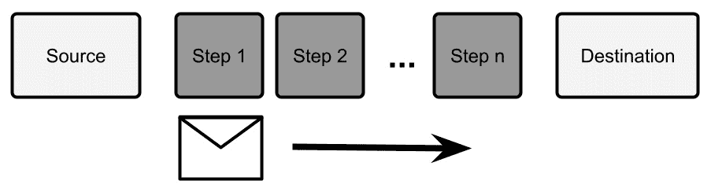

图 8.1 – 集成路由

请注意，通常，步骤是顺序执行的（直接通过集成路由）。然而，根据特定的模式，可能存在可选步骤（在某些情况下被跳过）或并行执行的步骤（为了性能目的）。现在，当听到关于消息的内容时，你可能会被误导，认为集成概念本质上就是异步的。但在这个上下文中，这并不一定正确。相反，集成可能是（并且通常是）同步交互，意味着此类集成过程的发起者等待执行完成。

异步集成在行为上有所不同。此类过程的发起者将消息发送到集成路由，并不等待其完成。通常，从集成基础设施获得一个*确认*就足够了，这意味着系统已经接管了该消息。

为了实现这种逻辑，通常，使用消息代理就足够了。这样，你可以将消息发布到一个专门的*停车场*（即代理），让一个或多个消费者取走并对其执行集成逻辑。然后，集成逻辑可能会或可能不会以某种方式（通过使用另一个消息或同步调用一个端点，如 REST 服务）发出集成结果的信号。采用这种方法，你将拥有解耦的生产者和消费者。我们将在接下来的章节中了解更多关于消息代理的内容。

然而，尽管大多数（如果不是所有）的集成原则至今仍然有效，ESB（企业服务总线）已经发展并在这个现代、云原生世界中扮演着不同的角色（以及不同的名称）。

## 云原生世界的集成

随着微服务和云原生架构的流行，许多人开始质疑 ESB 和**集成**的作用。最常见的原因是缺乏可扩展性。微服务架构方法严重依赖于产品团队的概念，每个团队开发和负责一个定义良好的软件部分（实现用例的子集）。

中心 ESB 根本反对这种想法：为了使服务 A 能够与服务 B 通信，你需要在 ESB 中实现一个集成路由，这意味着服务 A 和服务 B 从技术和组织角度来看都与系统耦合。你必须注意你服务的任何变化，这些变化可能会破坏与中心 ESB（及其依赖的服务）的兼容性。此外，作为一个进一步的副作用，你将在平台上引入一个单点故障。更糟糕的是，你可能需要向一个特定的团队提交工单，而这个团队需要你自己来实现。这种在不同项目之间的复杂同步和紧密耦合在快速移动、以自助服务为导向的云原生世界中并不是最好的。

*但是，如果你完全从你的架构中移除 ESB 的概念会发生什么？*

嗯，ESB 试图解决的问题仍然存在，所以你无论如何都需要解决它们。为了将服务 A 与服务 B 集成（尤其是如果服务 A 和 B 使用不同的技术和协议进行通信），你需要实现一些粘合剂。所以，通常情况下，集成最终会隐藏在你的服务中。虽然这是一种相当普遍的做法（更多内容请参阅*第九章*，*设计云原生架构*），但我仍然认为这有一些需要考虑的缺点：

+   你最终会在你的业务逻辑中引入需要封装和从你的领域模型中隔离的技术粘合剂（正如在*第六章*，*探索 Java 关键架构模式*中看到的模式）。

+   你可能会有很多针对相同用例的不同实现（想想 SOAP 到 REST 或 XML 到 JSON）。这本质上是不高效的，可能会增加错误发生的频率。

+   你几乎无法达到集成能力的完全去中心化。支持服务发现、可观察性和安全等基础设施可能仍然需要，而且更难以分布（并且去中心化这些能力可能本身就是错误的）。

通常，当我们考虑这些类型的考虑因素时，并没有一个适合所有人的完整答案。当然，依赖于复杂且广泛的集中式 ESB 可能是一个瓶颈（技术和组织上的），而试图去中心化这些能力可能会导致重复和缺乏治理。解决这类困境的常见方法基本上是仍然依赖集中化，但使其更轻便和智能。以下是一些减少耦合和实现更灵活集成的方案：

+   可能你的 ESB 会变成一组可重用的集成组件（围绕能力组织），你基本上可以在你的项目环境中重新实例化（也许还会修改）它们（因此，根据提供这些组件的团队，可能以某种方式）。

+   这些组件甚至可能不是技术上的工件。可能的情况是，你只是与相关项目的项目团队分享最佳实践和代码示例（甚至完整的代码）。这样，你仍然对正在发生的事情有一些（轻微）的控制权，但每个团队在理解组件、构建它、（如果需要）发展它以及通过拉取请求将更改回主集合方面有更多的自由。因此，这就在不同项目之间的集成能力背后创造了一个开放的社区。

+   另一种方法是仍然使用 ESB，但限制它只在一个小边界内。因此，我们不必有一个为整个公司服务的单一、庞大的集成总线，我们可以通过部门或项目来拥有更小的总线。它们可以是同一 ESB 的逻辑租户（因此，重用技能和最佳实践）或者基于不同技术的完全不同的总线。再次强调，这是一种权衡：如果你没有妥善管理，你可能会遇到重复和/或瓶颈，因此，如果管理不当，缺点可能会超过优点。

因此，尽管 ESB 在现代架构中通常被看作是负面的，但集成的需求仍然存在，正确研究你的环境以做出良好的选择并正确地发展它是非常重要的。

## 市民集成

最后一个值得强调的趋势是**市民集成**。这是咨询公司高度研究的一种趋势，在某些情况下被认为是一个颠覆者。基本上，市民集成是关于让非技术用户（如业务分析师、经理和其他类似角色）能够自己创建集成，而不必依赖开发人员和其他技术团队。为此，我们的市民集成器依赖于高度表达性和用户友好的界面，通常只需从浏览器中简单访问，并提供带有向导和拖放功能的集成能力。这些界面是通常被称为**集成平台即服务**（**IPaaS**）的一部分。

如你所想，这太好了，以至于不可能是真的：IPaaS 和市民集成当然不是万能的银弹。使用这些工具很难解决无限集成问题中的每一个可能用例，这些工具通常在特定的集成问题子集上工作得非常好。也存在技术影响。IPaaS 是一个需要配置并连接到后端系统的平台，这可能是一个挑战（从安全角度考虑也是如此），特别是如果你考虑这些平台通常托管在云上。

因此，我认为公民整合的整个概念仍然相关，值得在您的整合策略中彻底考虑，但通常并不能解决复杂企业可能拥有的所有整合需求，而应该针对其中定义明确的子集。

在本节中，我们探讨了整合的基本组件和特征，包括整合路线的概念、步骤和消息。我们还讨论了 ESB 是什么，以及这一概念是如何从集中的 SOA 发展到更现代、去中心化、自助服务的方法。

超越整合技术的语义差异和历史演变，关于整合模式的知识共享是共同的。我们将在下一节中探讨它们。

# 深入企业整合模式

最完整和最广泛使用的整合模式集合是企业整合模式。**企业整合模式**是一系列针对整合中常见问题的已知解决方案的食谱。实际上，在实施整合解决方案时出现的问题往往落入一些可识别的类别。根据常见的分组，这些类别包括以下内容：

+   **消息路由**，包括所有关于消息派发的问题和解决方案，包括过滤、路由和聚合消息

+   **消息转换**，这更侧重于消息内容，包括所有类型的消息操作技术，如丰富、过滤和*统一*消息内容

+   **系统管理**，这是一个包括管理和操作整个整合系统的已知技术的类别，包括窃听、消息归档和跟踪

在本节中，我们将看到这些模式的精选列表。

## 消息路由

**消息路由**整合模式家族是一组旨在程序化定义整合消息目的地的整合技术。通过这种方式，您可以通过链式不同的整合步骤（这些步骤是为不同类型的消息设计的）来对消息进行排序或定义复杂的整合逻辑。最常用的路由模式如下：

+   **消息过滤器**：这可能是最简单的路由模式。在这里，消息过滤器简单地丢弃不符合指定策略的消息。这样的策略可以是一个复杂的规则，它将消息作为输入并输出一个布尔值。根据该值丢弃消息。这种模式的常见实现包括将某些消息属性与定义的值集进行比较。这里展示了一个消息过滤器的示例：


图 8.2 – 消息过滤器

如图中所示，消息过滤器对输入消息应用策略，并丢弃不符合该策略的消息。

+   **基于内容的路由器**：这比过滤器模式稍微复杂一些。基于内容的路由器调度使用与消息过滤器类似的逻辑。因此，消息可以被发送到两个或更多不同的目的地（包括其他集成步骤、队列或其他类型的端点）。当然，与消息过滤器用例不同，这里的标准不会输出布尔值，而是映射到目的地端点的两个或更多不同结果：


图 8.3 – 基于内容的路由器

我们将在*第九章*中进一步讨论基于内容的路由器方法，*设计云原生架构*，因为它在发布管理领域将概念性地支持一些有趣的云原生行为。

+   **聚合器**：聚合器是一个有趣的模式，因为它与列表中描述的其他模式不同，它是一个有状态的。在聚合器模式中，传入的消息根据某些定义的策略进行收集并组合成一个更复杂的消息。有状态在这里是相关的，因为你可能想了解如果某些消息正在传输时这些组件崩溃会发生什么，以及如何应对这种情况：

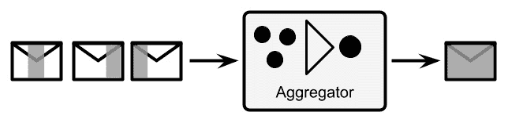

图 8.4 – 聚合器

+   **分裂器**：这补充了聚合器模式。将复杂消息作为输入，并将其分成两个或更多不同的消息。然后，它可能随后跟一个基于内容的路由器，以帮助将每条消息发送到不同的路径以实现不同的业务逻辑：


图 8.5 – 分裂器

+   **路由条**：这是一个略有不同的模式，用于模拟复杂且事先不可预测的集成逻辑。使用此模式，你基本上将元数据附加到每条消息上，并标识需要应用于此类消息的下一个集成步骤（如果有的话）。这些元数据可以使用与你的用例相关的任何策略进行计算。然后，你需要有一个组件（类似于注册表）将此元数据中存在的键与定义的目的地（另一个组件或其他端点）关联起来：

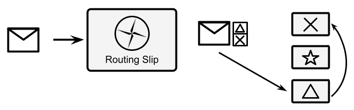

![图 8.6 – 路由条在之前的图中，形状（一个十字、星号或三角形）表示可用的集成步骤。通过实现**路由条**集成模式，每个消息都会获得一个集成步骤列表，这个列表作为元数据附加到消息本身，并从消息内容开始计算。在这种情况下，我们的消息将通过代表三角形的步骤和代表交叉标记的步骤，而跳过代表星号的步骤。现在让我们继续讨论另一组模式，专注于消息转换。## 消息转换如想象中一样，消息转换模式侧重于改变消息体的数据格式。当连接基于不同数据模型或格式的系统时很有用（想想将数据库连接到 REST 服务或将遗留应用程序连接到 SaaS 解决方案）。用于消息转换的模式通常称为消息翻译器，它简单地操作消息体，对其进行操作以改变格式。除了这个通用描述之外，还有一些具体的、可识别的消息翻译器类型。以下是一些例子：+   **内容过滤器**：内容过滤器在某种程度上类似于消息过滤器。但是，当内容不符合一组规则时，它不是整个丢弃消息，而是在消息数据内部操作，丢弃部分内容，并且只保留与一组条件相关的消息部分：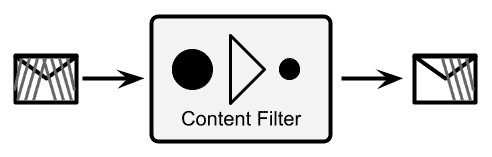

图 8.7 – 内容过滤器

+   **内容增强器**：这补充了内容过滤器。内容增强器向消息内容添加一些新数据。为此，它依赖于外部存储库（如数据库）。增强算法可能使用替换（每个值对应另一个值，例如将 ZIP 代码更改为城市名称时），固定值（将相同的值添加到每个消息），或更复杂的逻辑。以下是它的示意图：

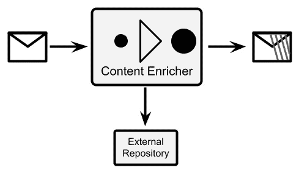

图 8.8 – 内容增强器

+   **标准数据模型**：这是 ESB 中常用的一种方法。基本上，为了解耦系统所有参与者的消息格式，定义了一个*中性*格式用于 ESB。这通常是所有消息的超集，或者简单地是不同的格式。为了实现这种方法，每个系统都通过一个特殊的**消息翻译器**组件连接到 ESB，该组件将每个系统的本地格式转换为标准数据模型，反之亦然：

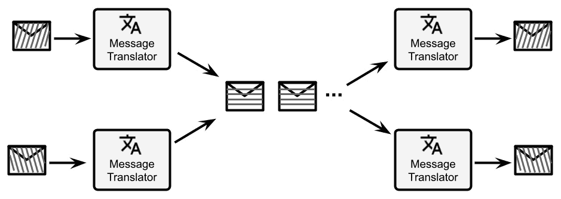

图 8.9 – 标准数据模型

+   **正规化器**：这是规范数据模型方法的一个特例。为了在 ESB 内部保持常见的数据格式，但为每个外部系统使用单个端点，你可以使用路由组件（如“消息路由”部分所述）。此类组件的唯一目的将是检查消息，识别消息格式（通过查看正文或标题），并将其路由到特定的消息翻译器，该翻译器必须能够将消息格式转换为常见的数据格式：

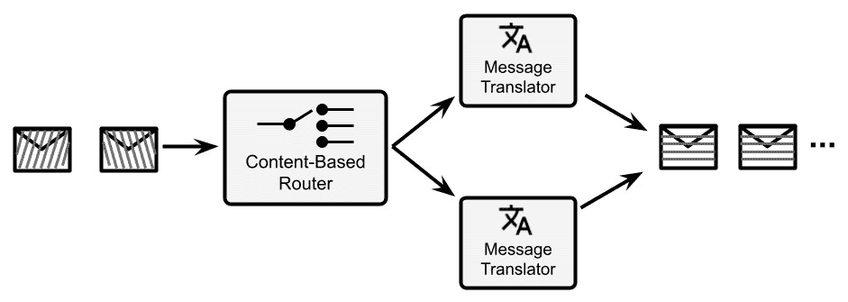

图 8.10 – 正规化器

这些只是一些众所周知的例子，但消息翻译器通常是与业务逻辑非常具体的某些东西，包括自定义方法，例如不同字段的合并、字符串格式化和计算。在下一节中，我们将讨论系统管理模式。

## 系统管理

**系统管理模式**基本上定位为一种监控和管理生产中集成路由的方式。因此，从这个意义上说，它们对平台操作和确保客户服务水平是有用的。然而，还有一些模式也可能对实现解决特定用例的逻辑（除了监控和管理之外）很有用。这些模式包括以下内容：

+   **旁路**：旁路是一种确保某些消息特定处理的实用技术。在实践中，当某些条件发生时，你将有一个基于内容的路由器触发特定的路径。基于内容的路由器可能由传入消息中的某些内容（如通常情况）触发，或者可能基于特定的外部条件（例如，特殊消息的传入，甚至可能基于与其余流量不同的特定通道）。当激活时，旁路将消息路由到不同的路径，这可能用于调试、测试或验证此类消息。

旁路打开了许多有趣（且现代）的使用案例，例如断路器概念和其他云原生模式（我们将在*第九章*，*设计云原生架构*）中了解更多。在以下图中，有一个旁路的例子：每个消息都会被检查，根据内容（使用基于内容的路由模式），它会被路由到正常路径或特殊路径（如果满足某些条件）。这样，你可以为某些特定消息激活特殊处理：


图 8.11 – 旁路

+   **窃听**：窃听是一个相当简单的模式。您基本上在集成路由中添加一个步骤，该步骤复制所有传入的消息并将副本发送到另一个通道（同时副本继续在常规集成路由上传输）。这样，您可以监控传入的消息（例如计数或检查它们），并使用真实数据分析系统行为：

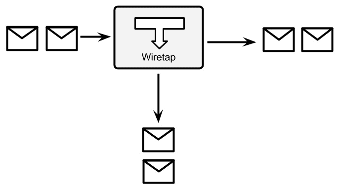


图 8.12 – 窃听

+   **消息历史**：消息历史是一种简单且结构化的方式来理解每条消息流经的路径。考虑一个具有多个路径的集成路由（例如基于内容的路由器等类似模式）。对于调试目的或甚至出于监管目的（如审计日志），可能需要记录消息跨越的每个步骤。消息历史建议通过在每个步骤附加一些数据来实现这一点。这通常是通过在特定消息头中为每个系统添加一个唯一键来完成。在集成路由的末尾，您将有一个标识每个集成步骤的键列表。即使在这种情况下，这也不太不同于跟踪适用于高度分布式架构（如微服务）的云原生模式。以下是可视化消息历史的图表：


图 8.13 – 消息历史

在此图表中，我们可以看到集成步骤由一个符号（一个*交叉标记*和一个*三角形*）表示。每次消息进入集成步骤时，都会用相应的标识符标记该消息。因此，在集成路由的末尾，您可以确切知道每条消息所经过的路径（如果它跳过了任何步骤，通过了可选路径等）。

+   **消息存储**：在某些用例中，您可能需要确切知道每条消息的内容，包括中间转换。这可能适用于消息的子集（例如，用于故障排除目的）或所有消息（正如我们在消息历史模式中看到的，可能出于审计日志要求）。消息存储模式建议通过在每个集成中附加窃听器并将每条消息（或某些消息，条件性地）重定向到共享消息存储（如数据库）来实现这种情况。

可能需要添加一些补充元数据，例如时间戳、每个步骤的标识符，以及可能的一个签名（用于检查数据完整性）。在某些情况下，消息存储可能需要实现特定的技术以实现不可否认性，例如在特殊防篡改硬件方面的**一次写入，多次读取**（**WORM**）。以下图表展示了消息存储的工作原理：

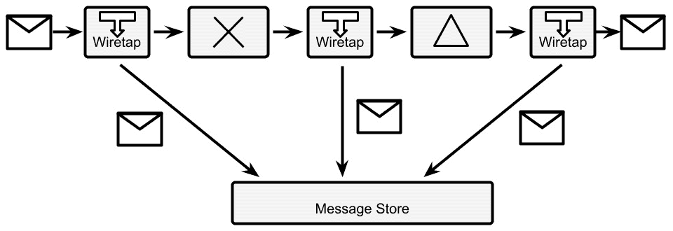


图 8.14 – 消息存储

+   **测试消息**：这是对集成路由的简单健康检查。基本上，为了理解消息流（例如，是否有任何中间组件丢失消息或处理消息时间过长），你需要在集成路由中注入一些特殊的测试消息。然后，你需要在集成路由的末尾放置一个基于内容的路由器，以便识别这类特殊消息（例如，在数据中查找特定的模式或在标题中查找特殊键）。然后，你需要将其路由到监控系统，该系统可以检查是否每条消息都被返回（这样就不会丢失消息），或者计算经过的时间等。

请记住，每个中间步骤可能都需要意识到或至少能够抵抗这种测试消息。这意味着如果你正在调用外部系统或将数据写入数据库，你可能希望指示特定的步骤在测试消息的情况下跳过。在下一张图中，我们可以看到这种模式的图形表示，即一个基于内容的路由器，它识别特殊的测试消息并将其路由到监控系统，而不是标准的集成流程：

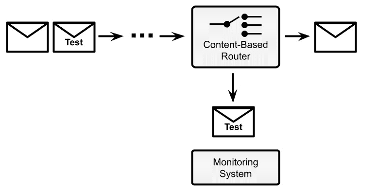

图 8.15 – 测试消息

系统管理模式的集合与我们之前所看到的不同。它们不太关注应用逻辑和数据，而更多地关注集成基础设施的监控、维护和操作。这并不意味着你不能使用它们来实现某些用例（想想 Wiretap 模式，它可以作为在相同消息上实现多种不同行为的一种方式），但肯定不是主要用途。

正如我们所说，到目前为止我们所看到的所有模式都对同步和异步集成都很有用。然而，当涉及到异步用例时，在消息代理及其集成方面会出现一系列全新的考虑因素。这部分与企业集成模式有关，部分则隐含在技术本身中（可能被称为**面向消息的中间件**，或者更常见的是，**队列管理器**）。在下一节中，我们将探讨这些案例。

### Camel 集成框架

**Apache Camel** 可能是最著名的开源集成框架。它是在 2000 年之后创建的，并且从那时起一直在不断进化，这主要归功于其背后非常活跃的社区。在撰写本文时，Camel 拥有数百位贡献者和数千颗 GitHub 星标。

Camel 并非一个真正的 ESB，但可以用作 ESB。它更像是一个包含集成能力的核心引擎。实际上，Camel 通过设计实现了企业集成模式（以及其他模式，包括一些云原生应用的技巧）。此外，Camel 包含了数百个针对特定技术（如队列、数据库和应用程序）和数据格式（如 JSON 和 XML）的连接器。Camel 可以独立运行或在一系列运行时之上运行（包括我们在上一章中看到的 Quarkus）。它可以作为 ESB 部署（在一点集中所有集成能力）或嵌入到您的应用程序中（将这种能力分布到需要的地方）。

#### Camel DSL

Camel 完全实现了我们迄今为止所看到的路由概念，即将一系列特定的步骤应用于每条消息（被视为数据的一个片段）。为了使用 Camel 指定每条路由，你可以使用一个 `.xml` 文件或 Java **领域特定语言**（**DSL**），这基本上是为了表达 Camel 世界中特定概念而制作的 Java 方言。在本节中，我们将使用 Java DSL，它允许使用 Java 流畅 API 定义路由。

这是一个将 JSON 转换为 XML 的简单集成路由的示例：

```java
from(platformHttp("/camel/hello"))
.unmarshal()
.json(JsonLibrary.Jackson, MyClass.class)
.marshal()
.jacksonxml()
.to(file("/myfilePath?fileName=camelTest.xml"));
```

正如您将看到的，有 `from`，它是启动集成路由的端点（在我们的案例中，通过暴露一个 HTTP REST 端点，使用名为 `platformHttp` 的组件），以及 `to`，它将最终结果写入文件（使用 `file` 组件）。在两者之间，您可以看到一个数据转换的示例，包括将 JSON 对象映射到 Java 对象的映射（`unmarshal`），然后将这样的 **普通 Java 对象**（**POJO**）映射回 XML。

我们将在 *案例研究和示例* 部分看到一个更完整的示例。现在，让我们概述一下消息概念。

## 消息传递

**消息传递** 是集成世界中的核心概念。在前一节中，我们讨论了消息作为每个集成步骤内部流动的基本数据单元。现在，让我们更深入地关注消息特有的概念，例如消息代理、异步交互、生产者和消费者。首先，我们将从代理概念开始。

### 定义代理概念

**代理** 是 IT 领域的一个常见、基本概念。它可以被视为一种架构解决方案，也可以被视为一种技术。

从架构角度来看，代理允许生产者将消息推送到一个中间系统（一个代理本身），该系统将其分发给一个或多个消费者。消息代理概念在同名企业集成模式中进行了描述。

除了这个简单的描述之外，还有大量的变体和其他概念可以详细阐述，受底层技术和我们试图建模的使用案例的影响。代理技术的例子包括 Apache ActiveMQ、Kafka 和 RabbitMQ。

现在，让我们深入探讨一些基本的消息概念。

### 队列与主题

在 Java 程序员心中常见的第一个分类是队列与主题。这种区分是由**Java 消息服务**（**JMS**）所著名，它是定义 Java 企业标准下消息实践的 API。

在 JMS 世界中，**队列**是在消息代理中定义的，它负责处理生产者发送的消息并将它们分发给消费者。如果没有消费者可用，队列将存储这些消息，直到有消费者连接，以尝试避免消息丢失。这被称为**存储转发**方法。队列还可以用于点对点连接（一个生产者和一个消费者），作为**点对点通道企业集成模式**。

队列的常见用法是有一个或多个生产者和一些消费者，这些消费者的数量可能随时间变化，取决于要有效处理的消息数量（水平扩展的一个例子）。在这种情况下，每个消费者以独占的方式获取一条消息，通常带有某种事务性语义。这种模式在企业集成模式世界中被称为**竞争消费者**。

**主题**有一个稍微不同的语义。在主题中，生产者发送的消息会传播给在那个特定时刻连接的所有消费者。这类似于网络中常用的广播概念。消费者通常会在与特定主题连接之前丢失所有发送的消息。

队列和主题是两个高级概念，以可识别的名称涵盖了涉及消息、生产者和消费者的一些不同特征（可能包括不同的变体）。在企业集成模式世界中，队列被定义为包括竞争消费者模式在内的点对点通道。而主题则由**发布-订阅通道**的概念定义，其中有一个或多个生产者，并不是每个消费者都在竞争，而是接收每条消息的副本，以广播的方式，每个人都能收到每条消息。

### 消息服务质量

一个重要的概念，通常与底层消息技术相关，是**服务质量**（也称为**QoS**）。在消息的上下文中，QoS 指的是代理在将我们的消息传递给消费者时所做出的*承诺*。这指的是生产者在将消息放入系统并获得代理的确认之后会发生什么。然后，根据系统的配置，可能出现三种交付场景：

+   **至多一次**，这意味着消息可能根本不会被交付，但如果确实被交付，则不会重复交付。在这里，用例是关于**尽力而为**的消息（因此，我们可以丢失一些），其中要避免重复（因为这会*污染*我们的下游系统）。现实世界中的例子是货币汇率。这些值变化非常频繁，在某些场景（如高频交易）中，你宁愿丢失一个值（这个值在非常短的时间内有效，并被新的一个覆盖），也不愿有一个由消息重复引起的*幽灵值*。以下图表说明了这一点：

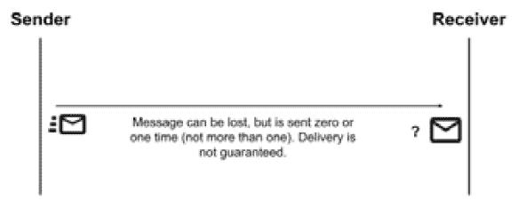

图 8.16 – 至多一次消息交付

+   **至少一次**，这意味着消息永远不会丢失，但可能会被发送多次给消费者。在这里，用例当然是与之前相反的。特别是，不丢失任何消息更为重要。在现实世界中，这可能是一个**物联网**（**IoT**）场景：想象从工业机器收集现场数据。你可能更希望拥有所有消息（例如，可能突出即将发生的故障），即使这意味着你可能会有重复（这些重复可以在下游系统中丢弃，或者简单地被认为是无害的）。以下图表举例说明了这一点：

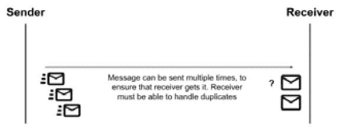

图 8.17 – 至少一次消息交付

+   **恰好一次**，这是当你接近消息系统时可以想象的最理想场景。不用说，在这里，代理保证你的消息将被交付，且不会有重复。当然，在某些用例中，这可能是一个强制性的要求。通常，在现实世界中，这与金融服务相关：一旦你完成了一次支付交易，你就无法承受丢失它，也不能执行两次。以下图表演示了这一点：

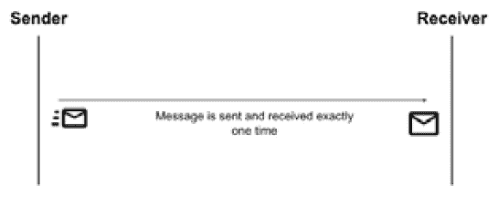

图 8.18 – 恰好一次消息交付

*现在，你可能想知道，为什么我们每次都不简单坚持使用“恰好一次”的交付场景，简化我们的生活呢？* 答案简单且预期：恰好一次是三种中成本最高的。由于系统需要在某个时刻锁定（以检查重复项），假设消息数量和硬件相同，从性能的角度来看，恰好一次可能是最差的选择。在低流量情况下，这可能不明显，但如果考虑到高流量峰值，这可能是至关重要的。

### 零消息丢失

在消息传递中，保证消息零丢失（正如我们所见，这是至少一次和精确一次 QoS 的组合）是一个常见的要求。为了提供这样的要求，消息系统通常使用两种类型的解决方案：

+   **消息持久性**，通常在文件系统或数据库上。这意味着只有在消息在持久存储上序列化后，生产者才会收到将消息放入队列的确认。这样，在系统崩溃的情况下，可以通过读取日志来保证可以恢复情况。以下是一个用于演示的图：

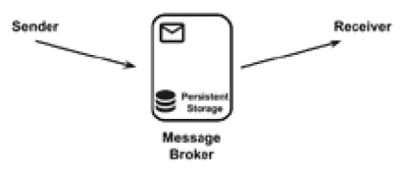

图 8.19 – 消息持久性

+   **消息副本**，这些被发送到消息代理的不同实例。生产者在消息的一个副本在网络（通常配置为多个备份实例）上传播后，会收到将消息放入队列的确认。这保证了，在我们的消息系统崩溃的情况下，备份实例可以接管并投递消息。当然，在这种情况下，你是在减少而不是消除风险。在灾难性故障的情况下，你仍然可能会遇到所有实例都宕机的情况，你应该相应地计划（例如，尽可能使用不同的物理位置），如下面的图所示：

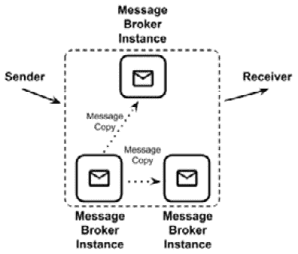

图 8.20 – 消息副本

几乎所有零消息丢失场景都会对性能产生影响。

### 其他消息概念

正如所说，根据底层实现技术，在消息世界中可以实施许多用例。以下是最有用的列表：

+   **死信队列**（**DLQ**）：在任何消息系统中都很常见。DLQ 基本上是一个特殊的位置，如下面的图所示，当某些条件发生时（例如，在一段时间后没有消费者，我们将在关于生存时间的下一个点中看到）或者当代理不知道如何处理消息时（例如，运行时或配置错误），它会重定向消息。如果出现错误，并且消息包含任何可恢复的数据，将持久化和监控 DLQ 作为指示器是一种常见的行为。

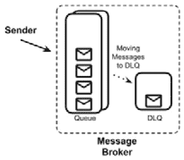

图 8.21 – 死信队列

+   **生存时间**：当使用时，生存时间是消息插入队列时与每个消息关联的属性。它将定义消息的过期时间：如果消息在过期后仍然在队列中（因为没有消费者或者它们不够快），它可能会被丢弃或移动到特殊的队列（如 DLQ）。

这是一种优雅的方式来模拟某些用例：有些类型的数据在经过一段时间后就会变得毫无价值（可能是因为那时有更新的信息变得可用）。这样，你可以避免给消费者带来额外的负担。然而，如果你有太多消息即将过期，可能需要调整其他一些设置（例如消费者的可用性和性能）。

+   **重复检查**：某些代理实现可以检查消息是否重复。这通常是一个需要谨慎处理的问题。有不同可能的实现方式，但最常见的一种涉及消息的唯一标识符的存在（这可能由外部提供，例如数据库键，或由代理计算，例如哈希）以及将这些消息存储在适当的数据结构中（例如数据库或键值存储）。然后，每条消息都会与这种结构进行核对，如果发现重复，则丢弃该消息。消息存储通常具有固定的最大大小或过期时间，以避免无限增长。

+   **优先级**：这是某些用例的常见要求。基本上，这是识别某些消息比其他消息具有更高优先级的可能性（通常设置一个特定的头），通知代理在队列中的其他消息之前将其交付（如果存在）。

+   **桥接器**：这是一个用于多个队列管理的基础设施，基本上是将消息从一个代理传递到另一个代理，如下面的图所示。它可以复制消息或将它们移动到另一个队列和代理。这对于与不同技术和现有系统接口，甚至提供可靠性（例如，多站点消息系统）非常有用：

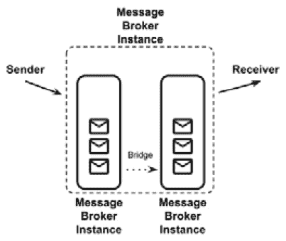

图 8.22 – 桥接器基础设施

+   **过滤器**：这是代理的一个常见功能，它模仿了我们已经看到的基于内容的路由模式。它基本上是一个配置指令，指示代理在发生某些条件时（例如，如果存在特殊头或消息负载中满足条件）在不同队列之间移动消息。

+   **分块**：可能会发生这种情况，队列被用来传输大小一致的数据。为了避免占用代理并处理非常大的消息，代理可以实现分块。正如可以想象的那样，大消息在交付之前被分成更小的部分，如下面的图所示。然而，需要在消费者端重建消息的某些机制。一个常见的方法是为每个块标记一个标识符和序列号：

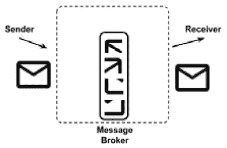

图 8.23 – 消息分块

+   **模式**：有时对插入到代理中的消息进行一些验证是有用的。一种聪明的做法是定义一个数据模式（如 XSD）。然后，不符合此类模式的消息将被丢弃或移动到特殊的队列（如 DLQ），如下所示：

![图 8.24 – 消息中的数据模式

![img/Figure_8.24_B16354.jpg]

图 8.24 – 消息中的数据模式

这个列表完成了我们对消息传递的考虑。在本节中，我们看到了许多构建（如代理、队列和主题）和配置（如 QoS 和无消息丢失）可以用来模拟许多不同的用例。在下一节中，我们将重点关注数据协议和格式。

# 探索格式

正如我们在前面的章节中看到的，集成通过要执行的小信息块（以消息的形式）的流（同步或异步）进行。这些消息通常格式化为众所周知的形状。让我们快速概述一下最常见的几种。

## XML

被视为冗长和繁琐而被边缘化，并且通常被认为过时，**可扩展标记语言**（**XML**）只是简单地留在这里。而且有很好的理由，因为我们将会看到，它具有许多强大和有用的功能。首先，XML 文件是表达性和结构化的，并且有许多工具支持它们。

这是一个简单的 XML 文件的样子：

```java
<?xml version="1.0" encoding="UTF-8"?>
<myTag>
  <mySubTag myAttribute="myValue" >my content</mySubTag>
</myTag>
```

我相信每个人都很熟悉 XML；然而，为了统一认识，一个合适的`.xml`文件的特点如下：

+   它是基于文本的。

+   在开头有一个特殊的标签，称为`<?xml version="1.0" encoding="UTF-8"?>`）。

+   文档中包含所有其他标签的根标签（不包括序言，它被认为是文档的特殊元素）。

+   文档中的每个标签都可以包含文本内容（`<myTag>my content</myTag>`）或其他标签（`<myTag> <mySubTag>...</mySubTag> </myTag>`）。这被称为**元素**。

+   每个标签可以包含一个或多个键值对，称为`<myTag myKey="myValue" ...>...</myTag>`）。

+   每个标签都必须正确地打开和关闭（如`<myTag>...</myTag>`）。如果标签为空，则允许使用缩写形式（`<myTag/>`）。标签必须正确嵌套：如果你打开一个标签，你可以在其中打开其他标签，但在关闭子标签之前需要关闭父标签（`<myTag><myOtherTag></myOtherTag></myTag>`是允许的，而`<myTag><myOtherTag></myTag></myOtherTag>`是不允许的）。

+   特殊字符，如`<`、`>`和`"`，必须用特殊实体引用替换，如`&lt;`、`&gt;`和`&quot;`，这些通常被称为**转义序列**，基本上是每个特殊字符与其相关实体引用的一对一映射。

很可能，这样的规则只是被默认接受：毕竟，你可能已经编辑过`.html`文件（它是`.xml`文件的兄弟）或 XML 格式的配置文件。

正如之前提到的，XML 的批评者说它很长，几乎难以阅读，更不用说当你尝试手动编辑它时的解析错误带来的挫败感：一个字符的错误就常常会破坏整个文件。

然而，由于这种简单但强大的语法，XML 提供了一些有趣的功能：

+   `.xml`文件被认为是实例。可以将 XSD 应用于给定的`.xml`文件，以确保它符合此类规范。这在机器到机器的交互中至关重要，可能会减少运行时错误。通过定义 XSD，你基本上创建了一个适合你自身问题的 XML 方言。

+   `.xml`文档。这在集成（想想我们看到的基于内容的内容过滤器或基于内容的路由模式）的上下文中特别有趣，因此大多数可用的 ESB 技术都提供了对此类功能的支持。

+   `.xml`文件。通过这种方式，你可以设置规则，允许处理器将`.xml`文件从一个定义转换为另一个定义，将源文件中的标签映射和转换为目标文件中的不同内容。此外，在集成世界中，这也是一个有趣的功能，可以基本覆盖大多数消息转换模式。

讨论 XML 就像讨论 Java：围绕将其称为过时和陈旧标准的批评有很多。然而，尽管更现代的方法当然已经出现并应得到关注，但由于有一套结构化的规则和广泛可用的支持工具和技术，XML，就像 Java 一样，至今为广泛的用例提供了适当的支持。

### 在 Java 中使用 XML

将`.xml`文件从 Java 对象转换到以及从 Java 对象转换的过程是一项相当常见的任务。基本上有两种方法可以做到这一点：

+   解析 XML 的第一种（现在较少见）方式是使用你将要解析的`.xml`文档。因此，你依赖于一种流式方法，在这种方法中，XML 从开始到结束被遍历，每个元素都会触发事件，例如开始元素和结束元素。

每个事件都包含特定元素的数据（内容和属性）。虽然这种解析方式今天并不特别普遍，并且有一些实际缺点（创建 Java 对象很繁琐，不允许随机访问元素），但这种解析方式通常非常高效，尤其是在内存使用方面。Java 中 XML 流的最著名实现是**SAX** ([www.saxproject.org](http://www.saxproject.org))。

+   实现 XML 序列化和反序列化最常见的方式是使用**直接映射**。这种方式下，XML 内容中的元素（和属性）与 POJO 的字段之间存在直接的联系。这种联系通过适当的映射定义，可以定义在配置文件中，或者更方便的是，通过使用注解来实现。映射的一部分也可以是隐式的（例如，字段映射到同名的 XML 元素，反之亦然）。

嵌套元素通常使用集合或其他复杂子对象进行映射。这种方法在集成（但不仅限于此）中得到了广泛的应用，因为 XML 内容被映射到 Java 对象，然后用于业务逻辑、检查和其他交互。Java 中 XML 映射的最常见实现是由`Jackson`提供的，这是一个我们在*第七章*，“探索中间件和框架”的*JPA 和 REST（以及更多）与 Quarkus*部分中看到的 JSON 库，也可以用作 XML 映射（以及支持其他数据格式）的 REST 序列化框架。

无论解析的途径如何，将 XML 映射到 Java 在企业界是一个相当常见的用例，因为 XML 是一种广泛使用的数据交换格式（在许多不同的行业中使用，包括银行和医疗保健）。

在下一节中，我们将看到 XML 在 Web 服务领域的竞争对手：JSON 表示法。

## JSON

我们已经在*第七章*，“探索中间件和框架”的*Jakarta RESTful Web 服务*部分中看到了并使用了 JSON。现在，是时候对它进行一些理论上的了解了。

**JSON**是**JavaScript 对象表示法**的缩写。它是一种用于表示数据的文本表示。这项技术诞生于 Web 开发的背景下，当时 AJAX 应用程序变得广泛流行。我们将在*第十章*，“实现用户交互”中看到更多关于 AJAX 和 Web 开发的内容，但就目前而言，只需知道它现在是一种始于 1999 年左右并被广泛使用的常见技术，它允许网页在浏览器下载页面后动态地从后端请求数据。为此，客户端使用 JavaScript 语言进行数据请求和解析。

虽然可以使用 XML 来序列化此类数据，但 JSON 作为一种有效且更简单的替代方案出现了。JSON 确实是 JavaScript 的本地格式，JavaScript 对象的序列化和反序列化到 JSON 不需要外部库。一个简单的 JSON 文件看起来是这样的：

```java
{
     "myKey":"myValue", 
     "myOtherKey": 42,
     "mySubObject":
          {
               "mySubKey": "mySubValue",
               "myArray":[ "value1", "value2", "value3" ]
          }
}
```

JSON 主要是原始类型（如字符串、布尔值和数字）的集合，对象，其中包含一个或多个键值对，用花括号括起来，以及数组，它是其他对象、数组或原始类型的集合，用方括号括起来。除了是 JavaScript 的原生语言之外，使 JSON 流行的是它比 XML 更简洁、更易于阅读。

JSON 的主要批评是它比 XML 结构化程度低，这导致了在验证（如我们在前一节中看到的 XSD）、网络服务（SOAP）、查询（前面提到的 XPath 和 XQuery）等方面产生了许多其他概念和技术，以及更多（如与 SOAP 标准相关的安全和其他功能）。

然而，如今 JSON 已经覆盖了（如果不是所有）这些功能，无论是原生支持还是通过第三方实现。值得一提的是，JSON Schema 是一种用于语法验证的技术，其他实现，如 JSONPath，用于查询 JSON 文档。此外，JSON 通常用作 NoSQL 文档数据库的基础技术（我们将在*第十一章*，*处理数据*）中看到更多关于这一点）。在接下来的几节中，我们将看到 JSON 和 YAML（这是一种广泛使用的当前数据格式）以及 JSON 和 Java 之间的交互。

### JSON 和 YAML

**YAML 不是标记语言**（**YAML**）是一种在 2001 年创建的替代数据序列化语言，随着 Kubernetes 的普及而变得广泛使用，因为它被用作编码资源和配置的格式（我们将在*第九章*，*设计云原生架构*）中看到更多关于 Kubernetes 的内容）。YAML 还在 Quarkus 和 Spring Boot 等框架中广泛用于管理微服务的配置。YAML 被设计成易于人类阅读，并且基于类似于 Python 语言的语法，它依赖于空格来定义层次结构。

这是一个简单的 YAML 文件的样子：

```java
---
myKey: myValue
myOtherKey: 42
mySubObject:
  mySubKey: mySubValue
  myArray:
  - value1
  - value2
  - value3
```

有趣的是，由于 YAML 可以（但不强制）使用基于花括号的语法，它实际上确实是 JSON 的超集。这意味着 YAML 提供了一些 JSON 中没有的额外功能（例如注释和更丰富的数据类型管理）。

YAML 解析器，换句话说，可以解析 JSON 文档。此外，如果不使用额外功能，YAML 文档可以直接转换为 JSON（反之亦然），而不会丢失任何数据。确实，我们之前看到的 YAML 示例与我们在前一节中看到的 JSON 示例完全相同。

### 在 Java 中使用 JSON

如我们所知，JSON 文件的解析在 JavaScript 中是原生的，而在 Java 中，已经提到的 `Jackson` 库是处理 JSON 的常见方式。映射，如我们在 *第七章* 中所见，是通过将 POJO 的每个字段与 `.json` 文件的每个键关联来实现的，类似于 JAXB 对 XML 映射的方法。这种映射在处理 REST Web 服务时特别有用。

## Protobuf

**协议缓冲区**（**Protobuf**）是存储数据的一种略有不同的方式。它是 Google 作为一个内部工具（在其基础设施中被广泛使用）创建的，然后被开源。与其他技术相比，最显著的不同之处在于 Protobuf 是一个二进制协议。与其他技术一样，它是语言无关的，因此你可以将其用作从 Java 到其他技术进行通信的方式。

Google（以及参与开源社区的其它组织和贡献者）提供了用于序列化、反序列化和一般处理 Protobuf 的工具，包括一个 Java SDK。SDK 包含一个编译器（protoc），它充当源代码生成器。基本上，当给定一个特定的配置（在 `.proto` 文件中）时，它为序列化和反序列化 POJO 到和从字节数组创建所有需要的框架（然后它们可以被发送到网络上，持久化到文件中，或用作消息）。由于输出是二进制格式，因此它非常高效和优化。

配置基本上是声明了你要序列化的 POJO 中包含的所有字段，以及一些元数据：

```java
syntax = "proto3";

option java_outer_classname = "MyPojoProto";
option java_package = " it.test";

message MyPojo {
    string myField = 1;
    repeated string myList = 2;
    int32 myNumber = 3;
}
```

下面是一些关于前面代码块细节的说明：

+   `syntax` 指的是使用的 Protobuf 版本。**Proto3** 是撰写时的当前版本。

+   两个 `option` 关键字是 Java 特有的。它们将配置包含所有自动生成的功能的类和包的名称。

+   `message` 是每个字段的描述。除了对象的名称（`MyPojo`）外，它定义了每个字段的名称和原始类型（`string`、`int32` 等）。字段可以由 `repeated` 关键字前缀，表示在有效消息中特定字段可以出现多次。如果该关键字不存在，则它可以出现零次或一次（不超过一次）。最后但同样重要的是，每个字段都附加了一个数值索引（`1`、`2`、`3` 等），Protobuf 使用它作为消息中字段的唯一标识符。

将 protoc 编译器运行于 `.proto` 文件上将会生成一个类（在我们的例子中，命名为 `MyPojoProto`）。此文件将包含一个内部类，用于表示我们的 POJO（在 Protobuf 术语中称为消息，在我们的例子中名为 `MyPojo`）。在类中，还将包含一些实用方法，包括用于创建此类消息的构建器，以及将消息序列化和反序列化为字节数组的方法。

在本节中，我们看到了许多广泛使用的数据格式，例如 XML，这是一种传统、古老且广泛使用的技术；JSON，由于 JavaScript 和网络技术而变得越来越受欢迎；以及 Protobuf，这是一种较少使用但采用不同方法的替代方案，旨在满足需要二进制格式的场景。

# 探索通信协议

在前面的章节中，我们关注的是用于以标准方式存储和交换信息的数据格式。下一步是确定交换此类信息的方式，换句话说，就是最常用的通信协议。

## SOAP 和 REST

**SOAP** 和 **REST** 是两种广泛使用的通信协议。尽管它们在前面的章节（以及本章）中已经被多次提及，但我认为仍然有必要提供一个简要的总结，因为这可能是理解通信协议在集成系统中的作用的关键：

+   `envelope` 包含一个头部和一个主体。由于受到许多子标准的规范，SOAP 用于定义方法、交换的数据，以及可选的其他规范，如安全规范。最后但同样重要的是，SOAP 提供了一种良好的结构化方式来定义方法签名和执行验证，称为 **WSDL**。SOAP 目前不如 XML 技术受欢迎，原因与 XML 技术相同：它比大多数现代替代方案更冗长、更不灵活。

+   `GET`、`PUT`、`POST` 和 `DELETE` 等操作是对资源进行的，这些资源通过 URI 来标识。受威胁的资源可以以多种不同的方式格式化，但 JSON 是最广泛使用的一种方式。REST 比 SOAP 更轻量级。因此，一些嵌入在 SOAP 中的功能（如安全、会话处理和验证）并不是 REST 的原生部分，通常是通过使用外部工具、库和扩展来实现的。

当然，这只是一个非常高级的 SOAP 和 REST 介绍，但鉴于它们是广泛使用、定义良好的协议，有很多相关的材料可以用来获取更多信息。话虽如此，现在应该很清楚，SOAP 和 REST 是允许不同的系统（跨越不同的语言和技术）相互通信的方式，并且基本上实现了查询数据和调用远程操作的两个 API。现在，让我们看看一些更现代、更常用的替代方法，这些方法今天通常用于实现类似的目标。

## gRPC

**gRPC 远程过程调用**（**gRPC**）是一个由 Google 最初开发并随后作为 CNCF 项目伞下的开源项目之一发布的现代、开源框架。它定义了在不同系统之间实现互操作性的完整方式。为了做到这一点，它为所有主要语言提供了大量的客户端库，包括 Java、PHP 和 Python。

gRPC 原生实现了许多在 SOAP 和 REST 中经常缺失或外部实现的实用机制。这些机制包括双向流和通知（全双工通信）、安全性、同步和异步模式以及流量控制。另一个关键特性是 gRPC 原生使用 Protobuf 作为序列化技术，因此提供了更多的稳定性和更少的跨语言通信问题。出于所有这些原因，gRPC 现在被认为是 REST 和 SOAP 在微服务之间通信的一个很好的替代品，并且在生产和许多知名环境中（如 Netflix、Spotify 和 Dropbox）已被证明是最有用的，提供了低开销、高性能的通信。

从实际的角度来看，为了使用 gRPC 通信，当然需要获取我们将要使用的语言的相应库。正如所说，Java 是一个很好的选择。一旦提供了依赖项，你就有了充当服务器的组件和充当客户端的另一个组件。一旦服务器启动，客户端就可以连接到它，从那时起，就建立了完全的双向通信。

让我们通过一个使用官方 Java gRPC 库的服务器和客户端实现的实际例子来看看。下面是一个基本的服务器实现：

```java
...
    int port = 9783;
    server = ServerBuilder.forPort(port)
        .addService(new PingImpl())
        .build()
        .start();
    logger.info("Server started, listening on " + port+" 
      ...");
    server.awaitTermination();
... 
  static class PingImpl extends PingGrpc.PingImplBase {
    @Override
    public void send(PingRequest req, 
      StreamObserver<PingReply> responseObserver) {
      logger.info("Received request " + req.getMsg() + " 
        ...");
      PingReply reply = PingReply.newBuilder().setMsg("pong 
        " + req.getMsg()).build();
      responseObserver.onNext(reply);
      responseObserver.onCompleted();
    }
  }
...
```

在这个简单的例子中，你可以看到一个 Java 类启动并嵌入了一个 gRPC 服务器。`main`方法使用库提供的`ServerBuilder`类创建服务器。为了构建服务器，传递了一个端口（在这个例子中是`9783`），然后传递了一个`static`类，该类定义了由 RPC 定义的服务器方法的实现（在这个例子中是一个`send`方法，通过传递一个字符串来响应一个简单的请求）。然后，在`ServerBuilder`实用工具的方法调用链中构建并启动服务器。最后，调用`awaitTermination`方法，基本上在等待连接和处理它们时阻塞执行。

现在我们来看看如何实现一个简单的 gRPC 客户端来联系这个服务器：

```java
...
String message = "Ciao!";
String target = "localhost:9783";
ManagedChannel channel = 
  ManagedChannelBuilder.forTarget(target)
.usePlaintext()
.build();
blockingStub = PingGrpc.newBlockingStub(channel);
logger.info("Trying to ping with message " + message + " 
  ...");
PingRequest request = 
  PingRequest.newBuilder().setMsg(message).build();
PingReply response;
response = blockingStub.send(request);
logger.info("Received response: " + response.getMsg());
...
```

如你所见，在先前的简单例子中，构建了`ManagedChannel`，传递了一些参数（在这种情况下，联系服务器的主机和端口，本地）。然后，实例化了一个存根。构建了一个`request`对象，并在其中设置了一条消息（在这种情况下，是`Ciao`字符串）。然后对该存根调用`send`方法，传递`request`对象。然后收集响应并记录。

如前所述，gRPC 默认依赖于 Protobuf 进行序列化定义。这就是定义请求和响应对象的地方，以及`send`方法的签名声明。以下是我们示例的`.proto`定义：

```java
syntax = "proto3";

option java_multiple_files = true;
option java_package = "it.test";
option java_outer_classname = "GrpcTestProto";
option objc_class_prefix = "HLW";

package grpctest;

service Ping {
  // Sends a greeting
  rpc Send (PingRequest) returns (PingReply) {}
}

message PingRequest {
  string msg = 1;
}

message PingReply {
  string msg = 1;
}
```

这就是关于 gRPC 的入门指南的全部内容。当然，在现实世界中，还需要考虑更多的事情，例如正确关闭服务器、处理异常以及你可能想要使用的任何其他功能（如重试、流控制或负载均衡）。在下一节中，我们将看到另一种常与 REST 一起比较和使用的协议：GraphQL。

## GraphQL

**GraphQL** 是一种用于定义完整 API 系统以查询和操作数据的技术。它与 REST 和 SQL 技术有一些相似之处，但它实际上是一个独特的想法，因为它定义了结构化的 API，同时为客户端提供自由，客户端可以指定他们请求的数据类型。GraphQL 最初由 Facebook 实现，随后将项目的治理权交给了 Linux 基金会下的开源社区。

如前所述，GraphQL 真正有趣（且独特）的一个方面是客户端控制发送到服务器的数据类型，这使得这项技术非常适合移动应用程序，并且总的来说，优化了通信，因为只有需要的数据被传输。为了做到这一点，GraphQL 定义了一种特殊的方式来查询，该查询明确地定义了我们请求服务器的数据类型。例如，看一下以下查询：

```java
query {
  payments{
    date
    amount
    recipient
  }
}
```

这是一个简单的定义，要求支付并指定每次支付的三个具体字段。当然，可以传递一些查询条件，如下所示：

```java
query {
  getPayments(recipient: "giuseppe") {
    amount
    data
  }
}
```

当然，还有许多其他选项可以探索。GraphQL 支持复杂、嵌套的类型。你可以指定具有多个条件的查询。可以使用其他有趣的功能，如分页、排序和缓存。

为了在项目中实现和公开 GraphQL API，至少有两种不同的选项：

+   你可以在后端代码中实现一个服务器。在这种情况下，使用 Netflix 构建的领域图服务框架（[github.com/netflix/dgs-framework](http://github.com/netflix/dgs-framework)）等框架可能很有用。其他选项包括 GraphQL Spring Boot（[github.com/graphql-java-kickstart/graphql-spring-boot](http://github.com/graphql-java-kickstart/graphql-spring-boot)）和 graphql-java（[github.com/graphql-java/graphql-java](http://github.com/graphql-java/graphql-java)）。

+   另一个选择是使用独立的服务器。在这种情况下，你不会将 GraphQL 功能嵌入到你的代码中，而是配置一个外部应用程序，该应用程序通过 GraphQL API 提供数据，并从数据存储器（如 SQL 数据库）检索数据。这种方法的几个流行实现是 Apollo ([apollographql.com](http://apollographql.com)) 和 Hasura ([hasura.io](http://hasura.io))。

为了消费和查询 GraphQL API，你最好的选择是使用适合你语言的客户端。有许多针对许多语言的半官方实现。由于该协议在 Web 和移动应用中被广泛使用，JavaScript、Android 和 iPhone 客户端非常常见。当然，也有一些 Java 库，如 graphql-java（之前因其服务器功能而见过），也可以用作客户端。

在本节中，我们看到了 API 范围内的多种不同技术。我们简要地了解了 API 技术，简要地看了 SOAP 和 REST，然后是一些现代替代方案，如 gRPC 和 GraphQL。在下一节中，我们将更深入地探讨数据集成在这个层次的世界。

# 数据集成介绍

**数据集成**是一种非常普遍的技术，或者说，它由一系列技术组成。

在这个总称术语下，有许多不同的方法旨在整合、丰富、过滤，并在一般意义上处理数据，可能在不同的格式中，以生成不同的结果。基本上，在*深入企业集成模式*部分看到的数据集成技术是关于临时数据（作为方法调用的一部分、作为 Web 服务或异步交互，如消息），而数据集成则关注静态数据，所以当它在数据存储器上持久化时，如数据库或文件。更好的是，数据集成从数据持久化（静态）开始和结束，通常涉及大量数据（如数据库和`.csv`文件）。

我必须承认，这不是我最喜欢的方案，并且我建议不要在绿色田野应用中不加区分地使用。实际上，数据集成可能会产生很多副作用，包括过时数据（如果在过程中出现问题），完成过程所需的时间不可预测，以及可扩展性问题。此外，你可能会对你的数据失去信任，因为你可能不知道谁是主控者，以及哪些数据是最新的或最可靠的。

给出这个警告后，我还要说，在某种程度上，数据集成在企业环境中非常普遍，尤其是在数据仓库和批量处理的环境中。更常见的集成技术包括以下内容：

+   **提取、转换和加载**（**ETL**）：这是一个通用术语，表示从一个或多个源读取数据，对其进行转换（丰富、连接、过滤和其他技术，或多或少类似于我们在*消息转换*部分看到的内容），并将其加载到一个或多个目标存储系统（如数据库）的过程。这可以通过使用专用软件（专有或开源）或定制开发（如 SQL 查询或自定义编写的软件）来完成。

+   **数据虚拟化**：这是一种试图最小化 ETL 缺点的方法。它基本上涉及与 ETL 相同的步骤，但不复制数据。为此，最后一步（加载）被替换为虚拟化目标系统（通常是数据库）。这意味着，而不是在目标数据库中加载数据，有一个由所选数据虚拟化技术（可以是开源或专有产品）模拟的**虚拟**数据库。这将请求转换为查询或其他从源系统收集数据的方式。

如果听起来复杂且繁琐，那是因为它确实是复杂且繁琐的。中间可能会有缓存（以提高性能），因为生成的查询（或从源系统收集数据所需的内容，这些源系统也可以是文件或其他数据存储）通常不是那么优化。一般来说，在某些场景中可以很好地工作的方法在其他情况下可能会非常糟糕（取决于源数据和所需的转换）。

+   **数据变更捕获**：这是一种对齐不同数据源的替代技术。它涉及监听数据源中的变化并将这些变化传播到对它们感兴趣的系统中的过程。对变化的监听通常针对每种源技术特定，但通常是通过轮询系统（例如，通过反复运行的计划查询）或解析系统元数据（通常是所谓的**事务日志**）来完成的。这确实是由某些数据库维护的日志，用于跟踪变化。以这种方式检测到的事件随后通常在队列中传播（Kafka 在处理此类用例的技术中特别广泛）。最后但同样重要的是，一个或多个消费者将监听生成的某些或所有事件，并使用它们来创建具有所需格式的目标数据存储。

在本节中，我们概述了数据虚拟化技术。在下一节中，我们将讨论企业中间件系统另一个重要组成部分，即业务自动化，它包括规则和工作流引擎。

# 通过业务自动化完善画面

本节专注于企业中间件另一个重要的用例。虽然上一节是关于通过转换数据格式和协议将应用程序相互集成，但在本节中，我们将看到如何将业务逻辑与应用程序代码解耦。

*这是什么意思？*基本上，在每一个应用程序中，都有一部分行为可能会定期发生变化。我们不是在谈论业务逻辑*整体*，而是在谈论那些可能因某些特定条件（如新的业务需求）而需要提前知道可能需要更改的具体子部分。这类逻辑通常分为两类：

+   **规则**，包括所有特定于业务领域的计算和算法，可以在应用程序生命周期中进行隔离、更改和微调。我们已经在*第三章*“常见架构设计技术”部分的*决策模型和表示法*中介绍了业务规则的概念，这是业务规则的标准表示法。

+   **工作流程**，通过将用例映射为一系列顺序步骤，围绕业务流程的概念进行建模。我们已经在*第三章*“常见架构设计技术”部分介绍了业务工作流程的概念，该部分是业务流程的标准表示法。

*为什么您应该在应用程序中使用这种逻辑和实现的分离？*好吧，至少有两个重要的原因，如下所述：

+   将业务逻辑封装在规则或工作流程中，将使更改业务逻辑本身变得更快、更便宜、更安全，以便修复错误或适应不断变化的外部条件。根据您将要使用的特定技术，它可能支持逻辑的热重载，这意味着您可以在最小或没有停机时间的情况下更改应用程序的行为。即使不支持热重载，业务逻辑的更改仍将产生非常有限的影响（例如更改文本文件或数据库），对应用程序其余部分的影响最小。这意味着您可以运行更小的测试集，并且引入其他地方的错误和回归的风险有限。

+   根据用于业务逻辑的语言，它可以通过业务所有者（或无论如何是非技术人员）进行验证，甚至可以直接编辑。一些用于业务规则和工作流程的技术，如上述**决策模型和表示法**（**DMN**）和**业务流程模型和表示法**（**BPMN**），实际上基本上是可读的，因为有一些工具可以提供逻辑的图形表示。此外，使用的概念（如任务、项目或决策表）不需要技术知识，并且旨在直接映射到业务概念。

业务规则和工作流程基本上可以以集中式或嵌入式的方式部署。关于这一点，考虑因素与我们之前在集成区域看到的相似：

+   当以集中化的方式部署时，所有规则或工作流都位于服务器（或服务器集群）上，您可以通过远程方式（例如通过 REST 服务调用或消息）与之交互。这样，一切都有序组织，您可以集中查看和管理所有业务工件。然而，正如通常情况一样，这可能会成为瓶颈和单点故障。随着性能的降低，崩溃或维护窗口将影响所有依赖于这个中心组件的应用程序。

+   如果以嵌入式模式部署，您将业务引擎（用于工作流和规则）包含在每个需要此类功能的组件中。当然，规则和工作流本身仍然会单独部署（通常是从外部文本文件或工件中加载）。嵌入式模式将允许更好的可伸缩性，因为每个组件都将完全控制决策能力。另一方面，您将缺乏中央管理和治理能力。

现在我们将详细探讨这两种技术，并了解您应该在应用程序中何时使用它们。

## 商业规则

**商业规则**是一种表达和隔离逻辑与实现（或更好的说法，最终导致决策的算法）的技术细节的方法。这里提供的例子是不同的场景。一个常见的例子是在电子商务环境中的促销概念：产品、价格和其余的行为保持不变，但您可以根据年份、库存中的项目数量或简单地来自业务的新要求来更改计算出的折扣金额。

商业规则的另一个广泛用途是关于反欺诈。基本上，在接受支付请求之前，您会进行多项检查以确保该支付请求不是欺诈性的。您执行的检查的数量和类型可能会随时间变化，因为您可能会发现更多的欺诈案例并添加其他控制措施以检测它们。在下一节中，我们将通过引入时间维度来扩展商业规则的概念。这个概念被称为**复杂事件处理**（**CEP**）。

### 复杂事件处理

CEP 是与商业规则相关的概念。在商业规则处理和 CEP 之间最广泛接受的区分是，在 CEP 中，时间和事件流的概念是计算的核心。

使用 CEP，每个决策都可以受到之前发生的事件的影响，无论是时间窗口（例如过去一小时）还是事件窗口（例如过去 10 个事件）。

让我们回到我们的反欺诈示例。一个用于检测欺诈的业务规则将基于与特定 incoming payment 相关的数据做出决策，例如金额或发送者的资料。基于 CEP 的欺诈检测将添加时间维度，因此评估的信息将包括过去的支付交易。你可能想检查过去 10 笔交易中是否有任何被怀疑为欺诈的，或者你可能想检查在过去一小时中，是否有其他支付交易发生在非常遥远的位置（例如不同的国家）。

现在我们已经了解了业务规则和 CEP 的基础知识，让我们看看 Drools 项目，这是一个广泛实施的此类概念。

### Drools 项目

**Drools** 是一个在 2000 年代初创建的广泛使用的开源业务规则引擎。它是被称为 **知识即一切**（**KIE**）的更广泛社区的一部分，其中包括相关的功能，如工作流管理实现（**jBPM**——在接下来的几节中会详细介绍）和相关工具（如规则建模和图形界面）。Drools 提供了许多有趣的功能，如出色的性能、小巧的体积以及与不同规则语言的兼容性，包括 DRL 和已经提到的 DMN。此外，Drools 可以以各种配置部署，包括嵌入式和服务器模式（支持包括 Quarkus 在内的多个不同的运行时）。

#### 决策模型和符号

如同在 *第三章* 中提到的，*通用架构设计技术*，DMN 是一种用于以对技术和非技术人员都易于理解的方式建模业务决策的语言。该语言基于 XML，因此虽然它是基于文本的（因此在源代码库中易于版本控制），但由于它包含了在屏幕上可视化组件的所有属性和坐标，因此几乎不可读。然而，有许多免费和商业工具可以编辑和可视化此类文件。您可以从 Kogito 工具页面下载一些（[github.com/kiegroup/kogito-tooling](http://github.com/kiegroup/kogito-tooling)），或者您可以在 [dmn.new](http://dmn.new) 页面上免费获得相同的体验。

这是在编辑器中一个简单的 `hello world` 规则的样子：

![Figure 8.25 – 一个简单的 DMN 规则

![Figure 8.25 – B16354.jpg]

图 8.25 – 一个简单的 DMN 规则

此规则将检查输入中的数字是否为偶数，并返回 `Yes` 或 `No`。

圆形组件是一个 `DMN 输入数据` 元素，其中包含 `NumberToTest` 输入变量，而 `Is Even ?` 矩形组件是一个包含算法的 `DMN 决策`。在这种情况下，如果我们查看左侧的面板，该组件包含一个所谓的 **文字表达式**。通过编辑组件，我们可以看到这个表达式：

![Figure 8.26 – 一个简单的 DMN 规则

![Figure 8.26 – B16354.jpg]

图 8.26 – 一个简单的 DMN 规则

当然，这是一个非常简单的示例表达式。在实际应用中，你可能有更复杂的逻辑，比如不同表达式的组合、一个函数和一个决策表。决策可能还有其他组件，比如不同的输入、复杂类型和可重用的决策。

现在让我们用业务工作流程来扩展我们的推理。

## 业务工作流程

**业务工作流程**在概念上可以看作是业务规则概念的扩展。实际上，通过使用工作流程，你的目标是逻辑上分离业务逻辑和实现以及应用逻辑。

当使用规则时，你可以隔离一个决策（这个决策可以是简单或复杂），而使用工作流程时，你可以建模整个流程。你仍然会从一个信息集合开始，并到达一个最终结果，但这个过程将涉及许多不同的步骤，并且通常会在等待每个步骤完成时偶尔被“钝化”（通常是在数据库上）。

这些步骤可以完全自动化（比如调用 REST 服务或向队列发送消息等），或者简单地代表在我们应用程序之外发生的人类任务（比如纸质文件的签名或其他手动任务），并且需要一个明确的确认（可能是通过电子邮件或完成一个网页表单）来表示完成（并让流程继续）。所以，为了简单起见，虽然业务规则模型代表一个单独的计算，但业务流程涉及一系列不同的步骤，每个决策可能通过一系列不同的路径。

事实上，工作流程的一个核心功能，除了建模和隔离业务流程之外，就是从业务和技术两个角度提供对流程性能和统计数据的洞察。

假设我们实施一个业务流程来表示贷款申请。你将有一个第一步来获取请求的数据，包括请求的金额、请求者的姓名和年龄。然后你很可能有一套验证，比如对请求者的背景调查、验证他们的工资以及请求者支付的支付历史。这些步骤中的每一个都可以被建模为一个工作流程中的项目，这些项目可以自动完成（比如调用一个外部系统请求信息）或者通过询问操作员（比如发送电子邮件并等待回复）。根据我们在本章中迄今为止所看到的，将一些步骤建模为业务规则是一种常见的做法。

假设你有一个这样的系统在生产中。然后你可以从过去的过程实例中提取历史数据，并了解你的工作流程表现如何。*最终有多少贷款申请被批准？你花费在每个任务上的时间有多少？每个请求者的平均年龄是多少？*

从这些有价值的数据中，企业可以获得洞察力来改变流程（例如简化、更改或删除一些步骤），创建不同的促销活动（例如为特定受众提供不同利率的特殊贷款）等等。这基本上是你想要隔离决策（无论是规则还是流程）的原因。现在你可以轻松地了解你的应用程序中正在发生什么，并在对其他功能影响有限的情况下微调这种行为。

技术上建模此类业务流程最广泛的方法是依赖于 BPMN 符号，这是一个标准。此外，由于 DMN 基于 XML，它可以通过图形工具进行人类可读和可编辑。有关 BPMN 的更多信息，请参阅*第三章*，*常见架构设计技术*。

### jBPM 项目

**jBPM** 是 KIE 帽子下另一个项目，提供了一个轻量级且可扩展的引擎来运行 BPMN 工作流。与 Drools 类似，jBPM 可以以多种方式部署，包括嵌入到你的应用程序中以及独立部署，并且它可以依赖于许多不同的运行时（例如 **JBoss WildFly** 和 Quarkus），实现传统和云原生场景。

根据 Drools 项目，jBPM 在 [github.com/kiegroup/kogito-tooling](http://github.com/kiegroup/kogito-tooling) 提供了一些免费工具来可视化和编辑 BPMN 文件，你可以在 [bpmn.new](http://bpmn.new) 页面上使用在线编辑器。

这就是简单工作流程的样子：

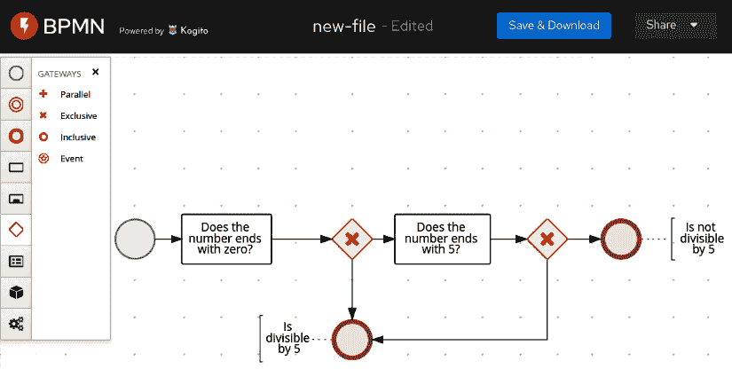

图 8.27 – 一个简单的 BPMN 流程

在这个简单的流程中，我们检查一个数是否能被 5 整除。有一个开始，然后是一两个检查（该数是否以零或五结尾），以及一个逻辑网关，在两种情况下都导向结束：是或不是可整除的。

本节完成了我们对业务自动化的概述。在下一节中，我们将比较集成和自动化的架构角色。

# 集成与自动化 – 哪里划线

在设计复杂软件架构时，一个常见的讨论是在哪里定义集成和自动化的边界。

最后，有一点重叠：业务工作流和集成路线都可以按顺序或通过条件（在两种情况下都可能是业务规则）调用多个外部系统。

当然，对于每种行为都没有固定的答案。我个人更喜欢避免在业务自动化中引入过多的技术集成（例如特定不常见技术的连接器，所有不是对 Web 服务调用或队列中的消息的调用），以及与特定业务需求相关的条件依赖的集成路由。但除了这个高层次、常识性的建议之外，还有一些考虑因素可以帮助理解特定功能是否应该保留在自动化或集成层：

+   如果表示我们用例的流程涉及大量人工任务（例如需要人工交互的情况），那么它很可能是业务工作流。

+   如果你必须处理由技术驱动的行为，例如在服务调用错误或其他外部系统使用的协议细节中，重试等情况，这很可能是需要在集成路由中封装的内容。

+   如果该流程具有业务相关性，那么每个步骤对业务人员来说都是重要的，他们可能会对流程的性能感兴趣（意味着有多少流程卡在某个步骤，或者特定路径需要多少时间），这很可能是业务工作流。

+   如果不需要钝化，这意味着大多数实例是直通流程，或者换句话说，是一系列依次执行的操作，不需要在数据存储中持久化（等待信号或其他事件重新启动），那么它很可能是集成路由。

这是我个人关于如何考虑特定功能是否应该包含在集成或业务自动化层中的建议。实际上，在许多情况下，你需要这两种层级的组合：

+   集成层用于封装技术细节到与第三方和其他外部系统（如数据库）的交互中，并将此类功能作为更高层次的复合 API（如 REST 服务）公开。

+   工作流层协调对高级 API 的调用，如果需要则添加人工任务，并处理实例持久化，通常模型化业务流程，并获取此类流程执行的指标和见解。

这完成了我们对业务自动化的概述。在下一节中，我们将探讨使用上述技术的集成和自动化示例。

# 案例研究和示例

在本节中，我们将继续我们的支付用例，看看一些集成和业务自动化的示例。

为了示例目的，我们将使用 Camel、jBPM 和 Drools。我们的目标运行时将是 Quarkus，我们在上一章中已经看到了它。

但许多概念和实现也适用于其他运行时，例如嵌入式运行时（如在将运行时作为 Java 应用程序的依赖项使用时），部署在 JBoss WildFly 上，以及部署在 Spring Boot 上。

## 集成支付能力

我们实现集成的第一个用例是将支付能力与遗留后端连接起来。假设我们已经开发了一个微服务支付应用程序，并且它运行正确。新的业务需求是集成一个用于结算目的的遗留平台（这是一种在支付后进行的会计操作）。

对于我们的核心应用程序来说，调用 REST 服务以实现此目的相当简单，但用于结算的遗留系统使用放置在共享文件夹中的 `.xml` 文件。这对于集成来说是一个完美的选择：除了一些使两个系统相互通信的管道之外，没有业务逻辑，并且使用像 Camel 这样丰富且表达力强的框架来实现将会相当简单。

有多种方法可以在 Quarkus 之上创建 Camel 项目。正如我们在前一章中看到的，我们可以使用 `mvn` 命令创建它，或者访问 Quarkus 网站，并使用网页向导下载一个空的项目框架。

我们将要使用的依赖项属于 `camel-quarkus` 系列。以下是详细信息：

+   `camel-quarkus-platform-http` 主要是作为运行时（在我们的例子中是 Quarkus）现有 HTTP 服务器与 Camel 之间通信的桥梁。

+   `camel-quarkus-jackson` 是将 POJO 转换为 JSON 以及相反方向的组件。

+   `camel-quarkus-jacksonxml` 在相同的概念上工作，但用于 XML 序列化。正如我们所见，`Jackson` 是一个可以用于 JSON、XML 以及其他格式的库。

+   `camel-quarkus-file` 是用于读取和写入文件的默认组件。

在上一章中，我们已经创建了一个 `Payment` Java 类来存储我们的支付数据。您可以在以下代码中看到使用的字段（类的其余部分是 getter 和 setter 以及一些额外的样板代码）：

```java
public class Payment {
    private String id; 
    private Date date;
    private String currency;
    private String sender;
    private String recipient;
    private String signature;
    private float amount;
...
```

为了使用 Java DSL 定义 Camel 集成路由，只需创建一个扩展 `EndpointRouteBuilder` 的类即可，如下所示（此处省略了导入）：

```java
@ApplicationScoped
public class PaymentSettlement extends EndpointRouteBuilder 
{
     @Override
    public void configure() throws Exception {
        from(platformHttp("/camel/settlement"))
        .unmarshal()
        .json(JsonLibrary.Jackson, Payment.class)
        .setHeader("PaymentID", simple("${body.id}"))
        .marshal()
        .jacksonxml()
        .to(file("{{settlement.path}}?fileName=
          ${header.PaymentID}.xml"));
    }
}
```

这段简单的 Java 代码模拟了一个集成路由，它首先通过暴露一个 HTTP 端点开始，将作为 JSON 对象传入的请求反序列化（使用 `Jackson` 框架），将其映射到 `Payment` 类的 Java 对象，设置一个头信息，然后使用 `Jackson` 再次将 Java 对象序列化为 XML，最后将 XML 写入文件。

要调用 Camel 路由，我们必须向 `/camel/settlement`（如果我们在本地运行，则为 `http://127.0.0.1:8080/camel/settlement`）发送一个请求，这是一个 `Payment` 对象的 JSON 表示（如前一章所示）。以下是一个示例：

```java
{
    "id":"1ef43029-f1eb-4dd8-85c4-1c332b69173c", 
    "date":1616504158091, 
    "currency":"EUR", 
    "sender":"giuseppe@test.it", 
    "recipient":"stefano@domain.com", 
    "signature":"169e8dbf-90b0-4b45-b0f9-97789d66dee7", 
    "amount":10.0
}
```

关于 Camel 路由，我们之前在*Camel DSL*部分看到过类似的流程，在我们首次查看 Camel 框架的*Camel 集成框架*部分之后。然而，有几个值得注意的地方：

+   有一个`setHeader`方法，它从当前通过 Camel 路由的消息体中定位`id`字段（这是支付交易的 ID），并将其设置到`PaymentId`头中，以便稍后作为我们生成的`.xml`文件的名称重用。注意，这里使用了`simple`表达式语言，它可以用来导航有效载荷（使用点符号）并表达条件。

+   Quarkus 属性（根据我们在上一章中看到的内容定义，使用`application.properties`中定义的系统属性或许多其他方式）可以直接通过双大括号访问和使用。在这种情况下，文件组件访问`{{settlement.path}}`变量来设置结算文件的目标路径。

*但如果我们想避免生成少于 10 欧元的结算呢？* 这很简单。只需要实现过滤器 EIP，基本上丢弃不满足相关条件的消息：

```java
from(platformHttp("/camel/settlement")) 
        .unmarshal() 
        .json(JsonLibrary.Jackson, Payment.class) 
        .setHeader("PaymentID", simple("${body.id}")) 
        .setHeader("Amount", simple("${body.amount}"))
        .marshal() 
        .jacksonxml() 
            .filter(simple("${header.amount} > 10"))
            .to(file("{{settlement.path}}?fileName=
              ${header.PaymentID}.xml"));
```

如你所见，Camel 组件确实被命名为`filter`。

*如果我们想为两种条件（少于 10 欧元或超过 10 欧元）添加不同的行为呢？* 在这里，EIP 是一个基于内容的路由器，可以使用 Camel 中的`choice`组件来实现，如下所示：

```java
from(platformHttp("/camel/settlement"))
        .unmarshal()
        .json(JsonLibrary.Jackson, Payment.class)
        .setHeader("PaymentID", simple("${body.id}"))
        .setHeader("Amount", simple("${body.amount}"))
        .marshal()
        .jacksonxml()
            .choice()   
                .when(simple("${header.amount} > 10"))
                    .to(file("{{settlement.path}}?fileName=
                      ${header.PaymentID}.xml"))
                .otherwise()    
                    .log("No settlement needed")
        .end();
```

在这种情况下，我们只是在`otherwise`情况下进行记录，但在现实世界中，你可能考虑做更多的事情（例如写入不同的文件格式或存储在不同的位置），你也可以添加多个不同的`when`条件。

更普遍地说，这只是 Camel 能做的事情的一个缩影。在现实世界中，有许多技术连接器、格式和模式，路由可以被模块化以相互调用。在官方 Camel 网站上，你甚至可以找到一个关于 EIP 和 Camel 组件之间映射的页面。这完成了我们的集成示例。现在让我们看看自动化。

## 自动化客户 onboarding

我们的支付平台肯定需要一个过程来 onboard 客户。通常会有一些动作支持为新客户创建配置文件，包括验证和在不同系统上提供客户服务。这是一个非常适合业务自动化的任务。

事实上，客户入职通常是由（变化的）业务需求驱动的（例如，注册用户的步骤数量以及为了促销目的而简化某些类别的入职流程）。此外，这些流程可能受到法律的规范，因此可能会出现你在不同地理位置（例如，一些国家要求在纸上签署湿签名的任务需要建模为人工任务）有不同的工作流程，并且随着时间的推移，步骤会随着法规的变化而变化。

最后但同样重要的是，为用户提供服务的流程通常是状态性的：你希望将其持久化存储在数据存储中，用于审计、报告和客户体验。可能会发生的情况是，客户在移动应用程序上开始注册流程，然后用户在计算机上继续进行其他步骤，最后通过前往银行分行来完成。

工作流程将通过持久化每个步骤（在需要的地方）并提供状态性流程来实现这种类型的体验（也称为*全渠道*）。让我们从建模工作流程的单个步骤开始：一个业务规则，用于建模客户的年龄检查。使用 DMN 和**Kogito**项目提供的可视化编辑器（可能是在线版本，或者作为 IDE 的插件，如**VSCode**）来做这件事相当简单：

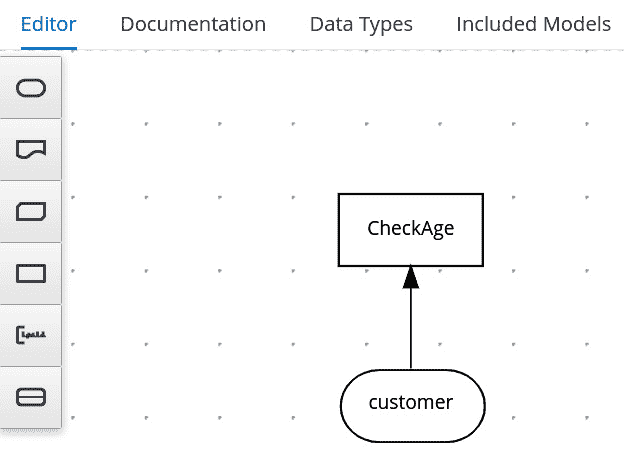

图 8.28 – 一个简单的 DMN 验证规则

这是一个非常简单的规则：使用**客户**数据结构，并提供一个**CheckAge** DMN 决策。以下是这个决策的内容：

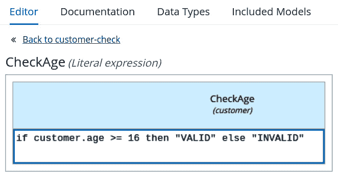

图 8.29 – 规则表达式

在这个例子中，我们使用`customer`结构中的非常简单的`age`字段。以下是**数据类型**编辑器中的结构看起来像什么：

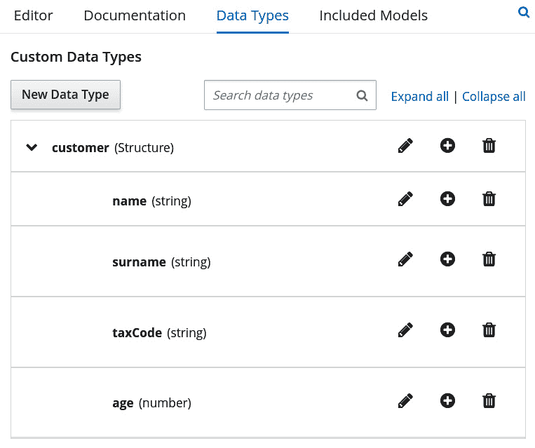

图 8.30 – 客户数据类型

在本例的源代码中，你还可以找到表示相同结构（并且与之互操作）的 POJO。为了调用此规则，我们需要以 JSON 格式发送此 REST 请求：

```java
POST http://localhost:8080/customer-check HTTP/1.1
content-type: application/json

{
    "customer":{
        "name":"Giuseppe",
        "surname":"Bonocore",
        "age":37,
        "taxCode":"dads213213fasfasf"
    }
}
```

在这里，Kogito 引擎将回复`VALID`或`INVALID`。这当然非常有用：你可以轻松创建提供业务规则（通常比这个例子中的更复杂）的决策服务，并在你的项目中使用它们。但不仅如此：这个规则可以成为更复杂工作流程中的一步。

让我们想象一个客户入职流程的非常简单的原型：你有一个流程的开始，一个准备步骤（这可能包括向 CRM 或其他系统发送请求），以及评估客户的年龄（使用我们刚刚看到的 DMN 规则）。如果年龄是`INVALID`，你可能希望有一些特殊处理（例如，要求家长的许可）。我们在这个简单的 BPMN 工作流程中正是这样做的：

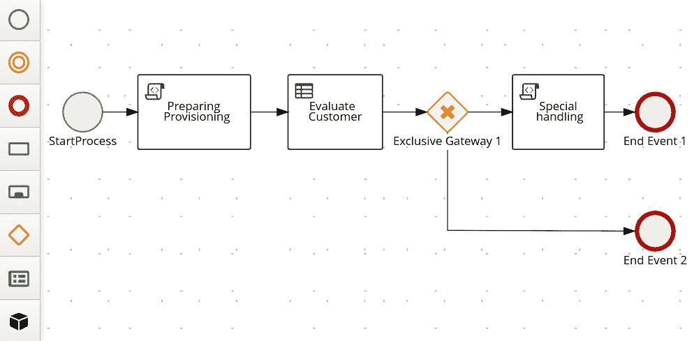

图 8.31 – 客户数据类型

在这个示例中，我们调用了 `System.out`（当然，您可能希望在这里有不同的任务，例如对外部服务的 REST 调用、发送消息或人工任务。无论您的实现是什么，您都可以通过 REST 请求触发工作流，如下所示：

```java
POST http://localhost:8080/customer_onboarding HTTP/1.1
content-type: application/json

{
    "customer":{
        "name":"Giuseppe",
        "surname":"Bonocore",
        "age":37,
        "taxCode":"dads213213fasfasf"
    }
}
```

考虑到在这个简单的示例中，我们没有配置持久化层，也没有定义需要钝化流程实例的任务。如果需要这样做，您可以通过添加一些配置（例如在 `application.properties` 文件中）轻松完成。一旦您有一个需要并使用持久化的流程，您就可以查询 Kogito 引擎，询问封装（或甚至完成）的流程实例的状态、待办任务的列表等（就像您在典型的 BPMN 工作流引擎中可以做到的那样）。这完成了本章的示例。

# 摘要

在本章中，我们探讨了众多技术，完成了从上一章开始的中间件概述。您还学习了什么是 ESB（包括连接器、模式和数据处理格式）。

我们探讨了企业集成模式和 Camel 库，Camel 库是企业集成模式的一个实现。我们还探讨了支持异步场景中集成概念的消息系统。然后，我们通过深入研究业务规则和业务工作流，并对 Kogito 进行了简要了解，Kogito 是一个在 Quarkus 上运行的完整业务自动化引擎，从而转变了我们对流程自动化的看法。

在本章之后，您应该能够理解企业集成的基础知识，包括消息传递能力。我们还看到了业务自动化的概念，包括工作流和规则，以及如何区分应该保留在集成层中的内容与应该保留在业务自动化层中的内容。通过使用一些开源库，我们通过几个示例展示了如何在 Java 中实现这些概念。

在下一章中，我们将看到如何通过应用云原生架构的最佳实践来设计和实现一个现代分布式应用程序。

# 进一步阅读

+   arc42 官方网站：[`arc42.org/`](https://arc42.org/)

+   格雷戈尔·霍普，博比·伍尔夫，企业集成模式 ([www.enterpriseintegrationpatterns.com](http://www.enterpriseintegrationpatterns.com))

+   *企业集成模式*，由格雷戈尔·霍普和博比·伍尔夫著，由 Pearson Education 出版（2012 年）

+   Apache 软件基金会：Apache Camel 项目 ([camel.apache.org](http://camel.apache.org))

+   Apache 软件基金会：Apache Camel 项目 – 映射到 EIP ([camel.apache.org/components/latest/eips/enterprise-integration-patterns.html](http://camel.apache.org/components/latest/eips/enterprise-integration-patterns.html))

+   官方 XML 网站 ([XML.org](http://XML.org))

+   官方 JSON 网站 ([JSON.org](http://JSON.org))

+   Google Protobuf Java 教程 ([developers.google.com/protocol-buffers/docs/javatutorial](http://developers.google.com/protocol-buffers/docs/javatutorial))

+   官方 gRPC 网站 ([grpc.io](http://grpc.io))

+   KIE 项目，包括 Drools、jBPM 等更多内容 ([www.kiegroup.org](http://www.kiegroup.org))

+   Kogito 项目，在 Quarkus 上提供业务自动化 ([kogito.kie.org](http://kogito.kie.org))
