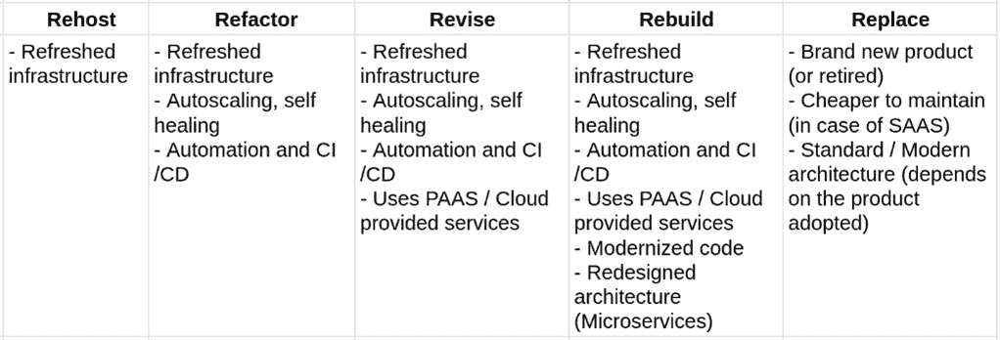

# 第九章：设计云原生架构

现在，微服务架构模型已成为主流。在撰写本文时，我们可能正处于“幻灭的低谷”。这个广泛使用的术语来自 Gartner 的炒作周期模型，它是一种识别技术采用阶段的方法，从尖端和未成熟阶段，基本上过渡到商品阶段。

在我看来，这意味着即使我们开始认识到一些不利因素，微服务仍然会持续存在。然而，在本章中，我想拓宽观点，看看所谓的云原生架构。不要被“云”这个词所迷惑，因为这类架构不一定需要公共云来运行（即使一个云，或者更好的是多个云，是这类应用的天然环境）。

云原生架构是一种构建具有抵抗力和可扩展性基础设施的方法，能够以几乎无影响的方式管理流量峰值，并通过遵循敏捷模型如**DevOps**快速演进和添加新功能。然而，云原生架构本质上很复杂，因为它需要高度去中心化，这不是一个可以轻视的问题。在本章中，我们将看到一些关于云原生架构设计和实现的概念。

在本章中，你将了解以下主题：

+   为什么要创建云原生应用？

+   了解云服务模型类型

+   定义十二要素应用

+   云原生世界中的常见问题

+   采用微服务并演进现有应用

+   超越微服务

+   将应用重构为微服务和无服务器

这有很多有趣的内容，我们将看到许多这些概念可以帮助提高你构建的应用和服务质量，即使你处于更传统、云服务导向性较弱的设置中。我相信，阅读这一章的每个人已经对云原生应用有一个概念，可能是一个详细的概念。然而，在阅读完这一章后，这个概念将变得更加结构化和完整。

因此，为了开始本章，我们将更详细地阐述什么是云原生应用，它的好处，以及一些有助于我们构建云原生应用（并实现这些好处）的工具和原则。

# 为什么要创建云原生应用？

毫无疑问，在定义云原生时，有众多不同的细微差别和视角，从不同的角度和不同层次的细节来处理这个问题，从技术影响延伸到组织和企业影响。

然而，在我看来，云原生应用（或者如果你愿意从更广泛的角度思考，架构）必须设计成本质上实现三个主要目标（某种程度上相互关联）：

+   **可扩展性**当然与能够吸收更高的负载（通常是因为更多的用户来到我们的服务）而没有中断直接相关，这是一个基本方面。然而，从更广泛的角度来看，可扩展性还意味着应用程序必须能够在预期流量较少时进行降级（因此降低成本），这可能意味着能够在不同的环境中运行，而无需在代码上进行最小或无更改（例如在本地和公共云上，这些可能由不同的供应商提供）。

+   **模块化**是指应用程序被组织成自包含的、模块化的组件，这些组件必须能够相互操作，并在需要时被其他组件替换。这对其他两个点（可扩展性和弹性）有巨大影响。模块化应用程序很可能是可扩展的（因为你可以增加某个模块的实例数量，该模块正在承受负载），并且可以轻松地部署在不同的基础设施上。此外，它可能正在使用每个基础设施提供的不同备份服务（例如特定的数据库或文件系统），从而提高可扩展性和弹性。

+   **弹性**，正如我们刚才提到的，可以被定义为能够应对不可预见的事件。这些事件包括应用程序崩溃、代码中的错误、外部（或备份）服务行为不当，或基础设施/硬件故障。一个云原生应用程序必须以避免或最小化这些问题对用户体验的影响的方式进行设计。有几种方法可以解决这些场景，我们将在本节中看到一些。弹性包括能够应对不可预见的流量峰值，因此它与可扩展性相关。此外，正如所说，通过将整体应用程序结构化为模块化子系统，可以选择在多个基础设施上运行（最小化单点故障问题），也可以提高弹性。

作为云原生架构师，看到这种（前面提到的）特性带来的商业效益非常重要。以下是每个点的最明显效益：

+   **可扩展性**意味着系统在压力下（可能没有影响）表现更好，同时具有可预测的成本，这意味着当流量增加时成本更高，而当不需要时成本更低。换句话说，成本模型与进入系统的请求一起扩展。最终，可扩展的应用程序的成本将低于不可扩展的应用程序。

+   **模块化**将积极影响系统可维护性，这意味着在系统更改和演变方面的成本降低。此外，一个正确模块化的系统将促进开发过程，减少在生产中发布修复和新功能所需的时间，并可能减少上市时间。最后但同样重要的是，模块化系统更容易进行测试。

+   **弹性**意味着服务具有更高的可用性和性能水平，这反过来意味着更满意的客户、更好的产品，以及整体上更好的用户体验质量。

虽然云原生是一个广泛的术语，暗示着大量的技术特性、优势和科技影响，但我认为我们刚刚看到的要点很好地总结了云原生概念背后的核心原则。

现在，很难给出一个完美的食谱来实现每个目标（和好处）。然而，在本章中，我们将把每个要点与一些关于如何实现它的建议联系起来：

+   **PaaS**是一种基础设施范式，提供支持服务，以及其他好处，以构建可扩展的基础设施。

+   **十二要素应用**是一套原则，有助于构建模块化应用程序。

+   **云原生模式**是构建弹性应用程序的一种知名方法（也在 MicroProfile 规范中得到实现）。

在下一节中，我们将定义 PaaS 是什么以及我们的应用程序将如何从中受益。

# 了解云服务模型类型

现在，用许多不同的术语和缩写来指代现代、云原生架构是很常见的。"作为服务"这个短语被广泛使用，意味着每个资源都应该按需自动创建和销毁。"一切作为服务"是这种方法的更广泛术语。实际上，随着云计算和微服务的发展，应用程序可以使用网络中较小组件的资源（或者如果你愿意，就是一个云）。

然而，这样的架构很难设计和维护，因为在现实世界中，网络基本上被认为是不可靠的，或者至少具有不可预测的性能。即使网络表现正确，你仍然需要开发和管理大量的*移动部件*来提供核心功能，例如部署和扩展。解决这些问题的常用工具是 PaaS。

PaaS 是一个夸张的术语，或者，更好的说法是，每个*作为服务*的术语都被过度使用，有时在每种*作为服务*工具集的意义和边界上没有确切的一致和定义。这是我关于一组*作为服务*层（可以被视为常识，并且确实被广泛采用）的个人观点：

+   **基础设施即服务**（**IaaS**）指的是提供运行工作负载所需的*按需*计算资源的层。这暗示**虚拟机**（**VMs**）（或物理服务器）可以联网以实现通信和存储持久数据。它不包括操作系统之上的任何内容；一旦你得到你的机器，你将不得不安装应用程序所需的所有内容（例如**Java 虚拟机**（**JVM**）、应用服务器和依赖项）。

+   **平台即服务**（**PaaS**）用于抽象大多数基础设施细节并提供对构建和运行应用程序有用的服务。因此，在 PaaS 中，您可以指定应用程序需要的运行时（虚拟机、依赖项和服务器），平台将为您提供服务。

PaaS 还可以为您抽象其他概念，例如存储（通过提供对象存储或其他存储服务供您使用）、安全、无服务器和构建设施（如 CI/CD）。最后但同样重要的是，PaaS 提供支持托管应用程序的升级和降级的工具。大多数 PaaS 平台提供自己的 CLIs、Web 用户界面和 REST Web 服务来配置、配置和访问每个子系统。换句话说，PaaS 是一个旨在简化基础设施层使用方式的平台，针对开发和运维人员。实现 PaaS 的一种常见方式是基于容器，作为向开发者提供和展示运行时服务的方式。

+   **软件即服务**（**SaaS**）位于 PaaS 之上的一层。它主要针对最终用户而不是开发者，意味着平台按需提供即用应用程序，完全抽象了底层基础设施和实现（通常在 API 后面）。然而，虽然应用程序可以是复杂的软件套件，准备好供用户访问（如办公套件或网络邮件），它们也可以是特定服务（如安全、图像识别或报告服务），开发者可以将这些服务用于更复杂的应用程序中（通常通过 API 调用）。

下面的图表展示了**IaaS**、**PaaS**和**SaaS**的比较：


图 9.1 – IaaS 与 PaaS 与 SaaS 的比较

现在，我们已经定义了一些“即服务”层之间的边界。我们应该回到我们的最初想法，*PaaS 如何成为支持高度分布式、云原生架构（如“网络即计算机”）的好方法？*

PaaS 通过提供统一的打包和交付模型（通常使用容器）简化了对底层计算资源的访问。它通过部署、扩展（包括向上和向下）以及尽可能维护服务级别来编排这些组件（例如重启故障组件）。它提供了一套管理工具，无论每个组件内部使用的技术如何。这些工具涵盖了日志收集、指标和可观察性以及配置管理等功能。如今，最广泛使用的编排工具是**Kubernetes**。

## 介绍容器和 Kubernetes

**容器**技术有着悠久的历史。它大约在 2013 年随着 Docker 的实现而流行起来，但最初的概念在那时之前的 Linux 发行版中就已经有根（例如，大约在 2008 年推出的**Linux 容器**（**LXC**））。即使在那里，概念也已经非常类似于现代容器，这些容器可以在旧系统实现中找到（**Solaris**区域经常被提及）。即使在那里，概念也已经非常类似于现代容器，这些容器可以在旧系统实现中找到（**Solaris**区域经常被提及）。

我们可以写一本书来讨论容器和 Kubernetes，但为了简单和节省空间，我们只会触及对定义和实现云原生架构概述最有用的最重要的概念，这是本书的主要目标。首先，让我们从什么是容器开始，以简化和解释开发背景的人的角度来解释。

### 定义容器及其重要性

简而言之，容器是一种使用一系列技术来欺骗应用程序，使其认为它拥有一个完整的机器可供使用的手段。

为了更好地解释这一点，容器封装了一组概念和特性，通常基于 Linux 技术（如`runc`和`cgroups`），这些技术用于隔离和限制一个进程，使其与其他共享相同计算能力（物理硬件或虚拟机）的进程友好地协同工作。

为了实现这些目标，容器技术必须处理计算资源的分配和管理，例如网络（端口、IP 地址等）、CPU、文件系统和存储。支持技术可以创建*虚拟*资源，将它们映射到底层资源提供的真实资源。这意味着容器可能会认为在端口`80`上公开一个服务，但实际上，这样的服务绑定在主机系统上的不同端口上，或者它可能会认为可以访问根文件系统，但实际上，它被限制在一个定义良好的文件夹中。

以这种方式，容器技术负责管理和分配资源，避免不同应用程序在运行和竞争相同对象（如网络端口）时发生冲突。但这只是故事的一部分：为了实现这一目标，我们的应用程序必须以标准化的方式进行打包，这通常是一个文件，指定了应用程序运行所需的所有组件和资源。

一旦我们创建了我们的容器（从这样的描述符开始），结果就是一个不可变的容器镜像（这是一个二进制运行时，也可以为了完整性和安全目的进行签名）。然后，容器运行时可以取我们的容器镜像并执行它。这使得容器应用程序能够执行以下操作：

+   **最大化可移植性**：我们的应用程序将在兼容的运行时执行的地方运行，无论底层操作系统版本如何，或者无论资源是由物理服务器、虚拟机还是云实例提供的。

+   **减少可移动部件**：在开发环境中测试的任何内容都将非常类似于生产环境中的内容。

+   **从可执行代码中隔离配置**：配置需要是外部的，并注入到我们的不可变运行时镜像中。

+   **描述所有组件**：您应该详细描述我们应用程序的所有组件，这不仅是为了文档目的，也是为了检查（这样您可以轻松地了解，例如，所有 Java 机器的补丁级别）。

+   **统一打包、部署和管理**：一旦您定义了您的容器技术，您就可以打包您的应用程序，并且它们将以相同的方式进行管理（启动、停止、扩展等），无论使用的内部语言和技术如何。

+   **减少占用空间**：虽然您可以使用虚拟机实现大多数优势，但容器通常要轻得多（因为它只会携带特定应用程序所需的资源，而不是一个完整的操作系统）。正因为如此，您可以使用相同数量的资源运行更多的应用程序。

这些就是容器技术变得如此流行的更多或更少的原因。虽然其中一些是特定于基础设施方面的，但开发者所获得的优点是显而易见的：想想这会如何简化，例如，创建一个完整的测试或开发环境，其中每个组件都被容器化，并运行在正确的版本上（可能是一个生产版本，因为您正在调试或测试一个修复）。

到目前为止一切顺利：容器运行良好，是构建现代应用的不错工具。*这里有什么警告吗？* 重点是，如果您处于本地环境（或小型测试基础设施），您可以手动管理所有容器（或使用一些脚本），例如在几台服务器上配置它并分配所需的配置。*但是当您开始大规模使用容器时会发生什么？* 您将需要担心运行、扩展、安全、移动、连接等等，对于数百或数千个容器。这肯定是不可能手动完成的。您需要一个编排器，它正好能做这件事。目前容器标准的编排器是 Kubernetes。

### 使用 Kubernetes 编排容器

**Kubernetes**（有时简称为 **K8s**）在撰写本文时是许多 PaaS 实现的核心。正如本节末尾将变得清楚的那样，Kubernetes 为基于容器的应用程序提供了关键的支持服务。它起源于 Google（最初被称为 *Borg*）的工作，旨在编排提供公司大部分生产服务的容器。Kubernetes 的运营模式有时被称为声明式。这意味着 Kubernetes 管理员定义系统的目标状态（例如，“我想运行这个特定应用程序的两个实例”）而 Kubernetes 将负责实现它（例如，如果有一个实例失败，将创建一个新的实例）。

在 Google 初始推出后，Kubernetes 被作为一个开源项目发布，目前正由一个异构的开发者社区积极开发，包括企业赞助的独立开发者，在云原生计算基金会（Cloud Native Computing Foundation）的旗下。

#### Kubernetes 基本对象

Kubernetes 提供了一套对象，用于定义和管理应用程序在其上运行的方式。以下是这些对象的列表：

+   Pod 是 Kubernetes 集群中最基本的单元，包括至少一个容器（对于某些特定用例，允许使用多个容器）。每个 **Pod** 都分配了一组资源（如 CPU 和内存），可以想象为一个 **容器** 加上一些元数据（包括网络资源、应用程序配置和存储定义）。以下是用于说明的图示：


图 9.2 – 一个 Pod

+   `命名空间` 是 Kubernetes 组织所有其他资源并避免重叠的方式。从这个意义上说，它们可以被看作是 *项目*。当然，可以限制用户对特定命名空间的访问。通常，命名空间用于将属于同一应用程序的容器分组，并在同一个 Kubernetes 集群中定义不同的环境（如 dev、test 和 prod）。

+   `服务` 是 Kubernetes 集群提供的网络负载均衡器和 DNS 服务器。在 **服务** 后面，有一系列 Pod 响应传入的请求。通过这种方式，每个 **Pod** 可以访问来自其他 Pod 的公开功能，从而绕过直接通过它们的内部 IP（这被认为是一种不好且不可靠的方式）访问这些 Pod。默认情况下，服务是内部的，但它们可以被公开并从 Kubernetes 集群外部访问（通过使用此处未涵盖的其他 Kubernetes 对象和配置）。以下图示说明了服务的结构：


图 9.3 – 一个 Service

+   `Volumes` 是 Kubernetes 定义提供给 Pods 的持久存储访问的手段。容器默认确实使用临时存储。如果您希望容器具有不同类型的存储分配，您必须处理卷。存储（如许多其他方面）由 Kubernetes 以可插拔的方式管理，这意味着在卷定义的背后可以附加许多实现（例如，云服务提供商或硬件供应商提供的不同存储资源）。

+   `ConfigMaps` 和 `Secrets` 是 Kubernetes 中向 Pods 提供配置的标准方式。它们基本上用于注入应用程序属性（如数据库 URL 和用户凭证），而无需重新构建应用程序。Secrets 实质上是相同的概念，但预期用于机密信息（如密码）。

默认情况下，`Secrets` 是以 Base64 编码的字符串（因此并不真正安全），但可以通过各种方式加密。`ConfigMaps` 和 `Secrets` 可以由应用程序作为环境变量或属性文件来消费。

+   `ReplicaSet`、`StatefulSet` 和 `DaemonSet` 是定义每个 Pod 应如何运行的对象。`ReplicaSet` 定义了在任何给定时间应运行的 Pods 的实例数（副本数）。`StatefulSet` 是定义一组给定 Pods 应该启动的顺序或一个 Pod 应该在任何时候只运行一个实例的方式。因此，它们对于运行具有这些类型要求的状态化应用程序（如数据库）非常有用。

相反，`DaemonSet` 用于确保在 Kubernetes 集群中的每个服务器上运行给定 Pod 的实例（更多内容将在下一节中介绍）。`DaemonSet` 对于某些特定用例非常有用，例如监控代理或其他基础设施支持服务。

+   `Th`e Deployment 是与 `ReplicaSet` 和 Pods 相关的概念。Deployment 通过定义执行部署的中间步骤和策略，如滚动发布和回滚，来部署 ReplicaSets 和 Pods。Deployment 对于自动化发布过程和减少此类过程中的人为错误风险非常有用。

+   `Labels` 是 Kubernetes 用来识别和选择几乎所有对象的手段。在 Kubernetes 中，确实可以对一切进行标记，并使用标签作为查询集群中由其识别的对象的方式。这既被管理员（例如，用于分组和组织应用程序）也被系统本身（作为将对象链接到其他对象的方式）所使用。例如，使用标签识别那些被负载均衡以响应特定服务的 Pods。

现在我们已经对 Kubernetes 的基本概念（以及术语表）有了一定的了解，让我们来看看 Kubernetes 的架构。

#### Kubernetes 架构

Kubernetes 实际上是一组 Linux 机器，安装了不同的服务，在集群中扮演不同的角色。它可能包括一些 Windows 服务器，专门用于运行 Windows 工作负载（如 .NET 应用程序）。

Kubernetes 有两种基本的服务器角色：

+   **大师**是协调整个集群并提供管理功能（如管理应用程序和配置）的节点。

+   **工作者**是运行整个应用程序的节点。

让我们看看每个服务器角色中包含的内容。我们将从 **主节点组件** 开始。

正如之前所说，主节点执行协调整个集群工作负载的角色。为此，这些是主节点通常运行的服务：

+   `etcd` `etcd` 服务器。`etcd` 是一个有状态组件，更具体地说，是一个键值数据库。Kubernetes 使用它来存储集群的配置（如 Pods、Services 和 Deployments 的定义），基本上代表了整个集群的期望状态（记住 Kubernetes 以声明式方式工作）。`etcd` 特别适合这种需求，因为它具有相当好的性能，并且在分布式设置中运行良好（如果发生某些问题，可以选择切换到只读状态，从而即使在极端条件下（如服务器崩溃或网络分裂）也能保持有限的操作性）。

+   `etcd`，Kubernetes 提供了一个 API 服务器。在 Kubernetes 中发生的许多操作（如管理、配置检查和状态报告）都是通过调用 API 服务器来完成的。这些调用基本上是通过 HTTP 的 JSON 进行的。

+   **调度器**：这是处理选择合适的工节点来执行 Pod 的组件。为此，它可以处理基本要求（如资源充足或负载较低的第一个工节点）或高级、自定义配置的策略（如反亲和性和数据本地性）。

+   `etcd`）并在需要时操作必要的更改。例如，如果一个 **Pod** 运行的实例少于配置的数量，**控制器**管理器会创建缺失的实例，如下所示：


图 9.4 – 主节点和工节点

这组组件，运行在主节点上，通常被称为 `etcd` 高可用性要求）。

在主/从设置中，主节点被认为是配置在高可用性设置中的宝贵资源。应该尽一切可能保持主节点运行和健康，因为主节点故障（尤其是如果所有主实例同时失败）可能会对 Kubernetes 集群产生不可预见的影响。

Kubernetes 集群中的另一个组件是工作节点：**工作节点组件**。

工作节点是 Kubernetes 集群中的服务器，实际上运行应用程序（以 Pod 的形式）。与主节点不同，工作节点是一种可消耗的资源。在少数例外的情况下，被认为在运行中的 Kubernetes 集群中更改工作节点的数量（通过添加或删除它们）是安全的。事实上，这是一个非常常见的用例：确保所有适当的步骤（如重新创建 Pod 和重新平衡工作负载）在更改后得到实施，这是主节点的一项职责。

当然，如果集群的更改是计划好的，那么它对应用程序的影响可能较小（因为，例如，Kubernetes 可以在从集群中移除之前，从受影响的节点中疏散 Pod），而如果发生意外情况，如崩溃，这可能会导致一些服务中断。尽管如此，Kubernetes 或多或少是设计来处理这种情况的。主节点运行以下组件：

+   **容器运行时**: 这是工作节点的一个核心组件。它是负责运行每个 Pod 中包含的容器的软件层。Kubernetes 支持任何符合**容器运行时接口**（**CRI**）标准的实现。在撰写本文时，广泛使用的实现包括 containerd、Docker 和 CRI-O。

+   **kubelet**: 这是运行在每个工作节点上的代理。kubelet 将自己注册到 Kubernetes API 服务器，并与它通信，以检查计划在节点上运行的 Pod 的期望状态是否已启动并运行。此外，kubelet 向主节点报告节点的健康状态（因此，它被用来识别有故障的节点）。

+   **kube-proxy**: 这是运行在工作节点上的网络组件。它的任务是连接运行在工作节点上的应用程序与外部世界，反之亦然。

现在我们已经清楚地理解了 Kubernetes 对象、服务器角色和相关组件，是时候了解为什么 Kubernetes 是一个出色的 PaaS 引擎，以及将其定义为 PaaS*本身*所缺乏的内容。

#### Kubernetes 作为 PaaS

如果你的大部分经验都在开发领域，那么在经历了所有这些 Kubernetes 概念之后，你可能会有点迷茫。即使一切对你来说都很清楚（或者你已经有了基础设施领域的背景），你可能会同意 Kubernetes 虽然是一个惊人的工具，但并不是最容易让开发者上手的方法。

事实上，开发人员与 Kubernetes 集群之间的大多数交互可能都涉及处理`.yaml`文件（这种格式用于描述我们所看到的 API 对象）和命令行（通常使用 kubectl，Kubernetes 的官方 CLI 工具）以及理解高级基于容器的机制（如持久卷、网络、安全策略等）。

这些技能对于开发者来说并不一定是自然而然就具备的。出于这样的原因（以及基础设施方面的类似原因），Kubernetes 通常不被视为 PaaS *本身*；它更像是一个核心部分（一个引擎）。Kubernetes 有时被称为**容器即服务**（**CaaS**），本质上是一个基础设施层，它以容器编排为核心功能。

在这方面，一个常用的隐喻是与 Linux 操作系统。Linux 是由一个低级、非常复杂且非常强大的层构成的，即内核。内核对于 Linux 操作系统的所有内容都至关重要，包括管理进程、资源和外围设备。但没有任何 Linux 用户仅使用内核；他们将会使用 Linux 发行版（如 Fedora、Ubuntu 或 RHEL），这些发行版在内核之上添加了所有高级功能（如工具、实用程序和接口），使得它对最终用户可用。

为了有效地使用它，Kubernetes（在此上下文中通常称为 vanilla Kubernetes）通常需要与其他工具、插件和软件相结合，覆盖并扩展一些领域。最常见的是以下内容：

+   **运行时**：这与容器的执行（以及可能更接近、更关键的 Kubernetes 需要依赖以正常工作并实现 PaaS 模型的功能扩展）有关。实际上，严格来说，Kubernetes 甚至不提供*容器运行时*；但，如前所述章节所见，它提供了一个标准（即 CRI），该标准可以被不同的运行时实现（我们提到了 containerd、Docker 和 CRI-O）。在运行时领域，*网络*和*存储*也值得提及，因为堆栈被用来提供容器的连接性和持久性。正如在容器运行时一样，在网络和存储运行时中，也存在一套标准和术语表（上述服务或卷），然后由选择的技术实现。

+   **配置**：这包括自动化、基础设施即代码（这里常用的工具包括 Ansible 和 Terraform），以及容器注册库，以便存储和管理容器镜像（值得注意的实现包括 Harbor 和 Quay）。

+   **安全性**：这涵盖了安全性的许多不同方面，从*策略*定义和执行（该领域的一个常用工具是 Open Policy Agent），运行时安全和威胁检测（这里使用的技术是 Falco），以及镜像扫描（Clair 是可用的实现之一）到保险库和秘密加密与管理（涵盖这一方面的产品之一是 HashiCorp Vault）。

+   **可观察性**：这是使 Kubernetes 成为易于在生产环境中操作的平台即服务（PaaS）解决方案的另一个重要领域。这里的一个事实上的标准是 **Prometheus**，它是一个时间序列数据库，广泛用于收集在 Kubernetes 上运行的不同组件的指标（包括平台本身的核心组件）。另一个关键方面是日志收集，以集中收集产生的日志。

**Fluentd** 是这个领域的常见选择。另一个关键点（我们已经在 *第七章*，*探索中间件和框架*，在微调部分中介绍过）是追踪，即在关联不同系统调用和识别当请求由许多不同的子系统处理时的请求执行。常用的工具包括 Jaeger 和 OpenTracing。最后但同样重要的是，每个方面收集的大多数遥测数据通常表示为仪表板和图形。做这件事的一个常见选择是使用 **Grafana**。

+   **端点管理**：这是一个与网络相关的主题，但处于更高的层次。它包括定义、库存、发现和管理应用程序端点（即 API 或类似的网络端点）。这个领域通常使用服务网格来解决。它通过使用网络代理（使用所谓的 **边车模式**）来卸载容器之间的通信，这样代理就可以用于追踪、保护和管理工作进入和离开容器的所有调用。服务网格的常见实现包括 Istio 和 Linkerd。端点管理的另一个核心领域是所谓的 API 管理，它在概念上（和技术上）类似于服务网格，但更针对来自 Kubernetes 集群外部的调用（而服务网格主要解决 Pod 到 Pod 的通信）。常用的 API 管理器包括 3scale 和 Kong。

+   **应用程序管理**：最后但同样重要的是，这是一个与如何在 Kubernetes 中打包和安装应用程序（以容器镜像的形式）相关的领域。两个核心主题是应用程序定义（其中两种常见实现是 Helm 和 Operator 框架）和 CI/CD（可以使用 Tekton 和/或 Jenkins 等工具实现）。

所有上述技术（以及更多）都在 CNCF 生态系统中被提及和编目（使用类似的词汇表）。**CNCF** 是 **云原生计算基金会**，这是一个与 Linux 基金会相关的组织，旨在为云原生开发定义一套供应商中立的标准化。这个生态系统是他们对这些技术进行的评估，包括围绕 Kubernetes（它是其核心软件部分之一）的技术。

因此，我认为现在很清楚，Kubernetes 和容器是 PaaS 的核心组件，这对于云原生开发至关重要。尽管如此，这些组件主要解决运行时和编排需求，但还需要更多的事情来实现一个完全功能的 PaaS 模型来支持我们的应用程序。

从另一个角度来看，你可以思考每个应用程序（或组件或微服务）应该实施的最佳实践，以便在 PaaS 中很好地适应，并在云原生、分布式设置中以最佳方式表现。虽然不可能创建一个神奇的清单，使每个应用程序都成为云原生应用程序，但有一个众所周知的标准集，可以作为一个良好的起点。遵循此列表的应用程序被称为十二要素应用。

# 定义十二要素应用

**十二要素应用**是一组针对云原生应用提出的良好实践。遵循此类实践列表的应用程序很可能会从部署在云基础设施上、面对*Web 规模*流量峰值和从故障中弹性恢复中受益。基本上，十二要素应用是微服务适当定义的最近似物。PaaS 非常适合托管十二要素应用。在本节中，我们将查看这个因素列表：

+   **代码库**：这个原则简单地说，与一个应用程序相关的所有源代码（包括脚本、配置和所需的所有资产）都应该在一个单一的仓库中版本控制（例如 Git 源代码仓库）。这意味着不同的应用程序不应该共享同一个仓库（这是一种减少不同应用程序之间耦合的好方法，但代价是重复）。

这样的仓库是创建部署的来源，部署运行应用程序的实例，由 CI/CD 工具链编译（如果相关），并在多个不同的环境中启动（例如生产、测试和开发环境）。部署可以基于同一仓库的不同版本（例如，开发环境可以运行实验性版本，包含尚未在生产中测试和部署的更改，但仍然是同一仓库的一部分）。

+   **依赖项**：一个十二要素应用必须明确声明在运行时需要的所有依赖项，并且必须将它们隔离。这意味着避免依赖于隐式和系统范围的依赖项。这在传统的应用程序中曾经是一个问题，例如在运行在应用程序服务器上的 Java 应用程序，或者一般而言，在*期望*由系统提供某些依赖项的应用程序中。

相反，十二要素应用专门声明并隔离所需的应用。这样，应用的行为就更具可重复性，并且开发（或测试）环境更容易设置。当然，这会消耗更多资源（主要是磁盘空间和内存）。这是容器在创建十二要素应用中如此受欢迎的原因之一，因为容器默认声明并携带每个应用所需的所有依赖项。

+   **配置**: 简而言之，这个要素是关于严格地将配置与应用代码分离。配置的目的是自然地存在于每个环境中的值（例如访问数据库的凭证或指向外部服务的端点）。在十二要素应用中，配置应该存储在环境变量中。通常，人们会放宽这一要求，在其他地方（与代码分离）存储少量配置，例如配置文件。

另一点是，十二要素应用的方法建议避免将配置分组（例如，将一组配置值分组为生产环境，或一组为测试环境），因为这种方法扩展性不好。建议单独管理每个配置属性，将其与相关的部署关联起来。虽然这个概念之外还有一些合理的解释，但在这个点上放宽并按照环境命名分组配置也很常见。

+   **后端服务**: 一个十二要素应用必须考虑每个所需的后端服务（例如数据库、API、队列以及其他我们应用所依赖的服务）作为附加资源。这意味着每个后端服务都应该通过一组配置（例如 URL、用户名和密码）来识别，并且应该能够在不修改应用代码的情况下替换它（可能需要重启或刷新）。

通过遵循这些要素，我们的应用将与外部服务松散耦合，因此扩展性更好，更易于迁移（例如从本地到云端，反之亦然）。此外，测试阶段将受益于这种方法，因为我们可以轻松地用模拟服务替换每个服务，如果需要的话。

最后但同样重要的是，应用的可恢复性将提高，因为我们可以在生产环境中用替代服务替换一个有故障的服务，而几乎不会出现中断。在这个背景下，也值得注意，在最纯粹的微服务理论中，每个微服务应该有自己的数据库，并且没有其他微服务应该直接访问该数据库（但为了获取数据，应该由微服务本身来中介）。

+   **构建、发布和运行**：十二要素方法强制执行构建、发布和运行阶段之间的严格分离。构建包括将源代码转换为可执行文件（通常是通过编译过程的结果）以及发布阶段将可执行项与所需的配置关联起来（考虑到目标环境）。

最后，运行阶段是关于在所选环境中执行这样的发布。这里的一个重要观点是，整个过程应该是无状态的且可重复的（例如使用 CI/CD 管道），从代码仓库和配置开始。另一个关键点是，每个发布都必须与一个唯一的标识符相关联，以精确地映射和跟踪代码和配置在每个运行时最终的位置。这种方法的优点是减少了移动部件，支持故障排除，以及在意外行为发生时简化回滚。

+   **进程**：符合十二要素的应用程序作为一个或多个进程执行。每个进程都被认为是无状态的，并且不共享任何内容。状态必须存储在专用的后端服务中（如数据库）。每个属于进程本地的存储（无论是磁盘还是内存）都必须被视为不可靠的缓存。

虽然可以使用，但应用程序不得依赖于它（并且必须能够在出现问题的情况下恢复）。无状态进程模型的一个重要后果是必须避免粘性会话。粘性会话是指后续请求必须由同一实例处理才能正常工作。粘性会话违反了无状态的概念，并限制了应用程序的水平可扩展性，因此应该避免。再次强调，状态必须卸载到相关的后端服务。

+   **端口绑定**：每个十二要素应用程序必须直接绑定到网络端口并监听该端口的请求。这样，每个应用程序都可以成为其他十二要素应用程序的后端服务。关于这个因素的一个常见考虑是，通常应用程序依赖于外部服务器（如 PHP 或 Java 应用程序服务器）来公开其服务，而十二要素应用程序则嵌入直接公开此类服务的所需依赖项。

这基本上是我们在前一章中从 JEE 看到云原生的情况；以 Quarkus 为例，它依赖于 Undertow 来直接绑定端口并监听 HTTP 请求。通常，基础设施组件会将来自外部世界的请求路由到所需的端口，无论何时需要。

+   **并发**：十二要素应用程序模型建议实现水平可扩展模型。在这种模型中，并发通过启动受影响组件的新实例来处理。建议根据流量配置文件进行扩展的最小可扩展单元是进程。十二要素应用程序应依赖底层基础设施来管理进程的生命周期。

这种基础设施可以是操作系统进程管理器（例如，现代 Linux 系统中的`systemd`）或分布式环境中的其他类似系统（例如 PaaS）。如果可用，建议将进程跨不同的服务器（例如虚拟机或物理机）扩展，以正确使用资源。考虑到这种并发模型并不取代特定技术提供的其他内部并发模型（例如每个 JVM 应用程序管理的线程），而是被视为其扩展。

+   **可丢弃性**：遵循十二要素应用的应用应该是可丢弃的。这意味着应用应该快速启动（理想情况下，从进程启动到正确处理请求之间只有几秒钟）和关闭。此外，关闭应该优雅地处理，这意味着所有外部资源（例如数据库连接或打开的文件）必须安全地释放，并且在应用程序停止之前，必须管理所有正在进行的请求。

这个**快速启动**/**安全关闭**的咒语将允许进行横向扩展，通过创建更多实例来应对流量峰值，并在不再需要时销毁实例以节省资源。另一个建议是创建能够容忍硬关闭（例如，在硬件故障或强制关闭的情况下，如进程终止）的应用程序。为了实现这一点，应用程序应具备特殊程序来处理不一致的状态（例如，考虑外部资源不当关闭或请求部分处理且可能损坏的情况）。

+   **开发和生产环境一致性**：十二要素应用必须尽可能减少生产环境和非生产环境之间的差异。这包括软件版本差异（这意味着开发版本必须尽快通过遵循“尽早发布，经常发布”的咒语在生产环境中发布）。

但这个咒语也适用于当不同的团队在处理它时（开发和运维团队应在生产和非生产环境中合作，避免在生产发布后的交接，并实施 DevOps 模式）。最后，还有每个环境包含的技术（后端服务应尽可能接近，例如，尝试避免在开发和生产环境中使用不同类型的数据库）。

这种方法将提供多种好处。首先，在出现生产问题时，由于这些环境尽可能接近生产环境，因此将更容易在所有环境中进行故障排除和测试修复。另一个积极的影响是，由于测试环境看起来像生产环境，因此错误更难进入生产环境。最后但同样重要的是，拥有相似的环境将减少管理多个堆栈和版本变体的麻烦。

+   **日志**：这个要素指向日志生成和日志存储的分离。一个十二要素应用程序仅仅将日志视为一个事件流，持续生成（通常以文本格式）并发送到一个流（通常是标准输出）。应用程序不应该关心使用所有相关考虑（如日志轮换或转发到不同位置）来持久化日志。

相反，托管平台应提供能够检索此类事件并处理它们的服务，通常是在多层持久性（例如将最近的日志写入文件并将较旧的条目发送到索引系统以支持聚合和搜索）上。这样，日志可以用于各种目的，包括监控和平台性能的商业智能。

+   **管理进程**：许多应用程序提供支持工具以实现管理进程，例如执行备份、修复格式不正确的条目或其他维护活动。十二要素应用程序也不例外。然而，建议尽可能在接近应用程序其余部分的环境中实现此类管理进程。

在可能的情况下，提供那些功能的代码（或脚本）应该由相同的运行时（例如 JVM）执行，并使用相同的依赖项（数据库驱动程序）。此外，这样的代码必须从相同的代码仓库检出，并且必须遵循与应用程序主代码相同的版本控制方案。实现这一结果的一种方法是在应用程序本身中提供交互式外壳（适当的安全保护），并在该外壳上运行管理代码，然后批准使用与应用程序其余部分相同的设施（连接到数据库和访问会话）。

在阅读此列表时，你们中的许多人可能都在思考如何实现这十二要素，特别是使用我们迄今为止看到的工具（例如 Kubernetes）。让我们尝试探索这些关系。

## 十二要素应用程序和支持技术

让我们回顾一下十二要素的列表以及到目前为止哪些技术可以帮助我们实现遵循这些要素的应用程序：

+   **代码库**：这与运行时技术关系不大，更多与工具相关。如前所述，如今广泛使用的版本控制工具是 Git，基本上已成为标准（并且有很好的理由）。然而，容器和 Kubernetes 非常适合支持这种方法，提供容器、部署和命名空间等结构，这对于从同一代码库实施多个部署非常有用。

+   **依赖关系**：这个因素当然取决于所选择的编程语言和框架。然而，现代容器架构在不同的阶段解决了依赖问题。通常有一个依赖管理解决方案和声明在语言级别（例如 Java 项目的 Maven 和 JavaScript 的 npm），这对于在容器化之前构建和运行应用程序很有用（如在开发环境，在本地开发机器上）。

然后，当容器发挥作用时，它们的文件系统分层技术可以进一步将依赖关系与应用程序（构成容器最顶层）分离和声明。此外，应用程序技术基本上能够形式化应用程序的每个依赖关系，包括运行时（如 JVM）和操作系统版本以及实用工具（这是容器技术固有的能力）。

+   使用 `ConfigMap` 对象并将它们作为环境变量或配置文件提供给应用程序。这使得它几乎可以集成到任何编程语言和框架中，并使得配置易于按环境进行版本控制和组织。这也是一种很好的方式，无论使用什么技术，都可以标准化配置管理。

+   **后端服务**：这个因素可以一一映射到 Kubernetes 的 Services 对象。一个云原生应用可以轻松查询 Kubernetes API，通过名称或使用选择器来检索所需的服务的详细信息。然而，值得注意的是，Kubernetes 不允许 Pod 明确声明对其他服务的依赖，这可能是由于它将处理边缘情况（例如服务缺失或崩溃，或需要重新连接）的任务委托给每个应用程序。然而，有多种方式（例如使用 Helm 图表或操作员）可以一起设置多个 Pod，包括相互通信的服务。

+   需要导入容器化应用程序到 Kubernetes 的 `config`)。最后但同样重要的是，Kubernetes 处理（使用选择的容器运行时）应用程序的运行。

+   **进程**：这个因素在 Kubernetes 中也得到了很好的体现。实际上，每个容器默认情况下都是在其自己的运行时中隔离的，彼此之间不共享任何资源。我们也知道容器是无状态的。处理状态的一个常见策略是使用外部资源，例如数据库连接、服务或持久卷。值得注意的是，Kubernetes 通过使用 DaemonSets 和类似的结构，允许对此行为进行例外处理。

+   **端口绑定**：即使在这种情况，Kubernetes 和容器也允许实现符合端口绑定因素的所有必要基础设施。实际上，使用 Kubernetes，您可以声明您的节点将监听的端口（Kubernetes 将管理可能出现的 Pod 请求相同端口的冲突）。通过服务，您可以添加额外的功能，例如端口转发和负载均衡。

+   **并发性**：这是 Kubernetes 容器模型固有的。您可以轻松定义每个 Pod 在任何时间点应运行的实例数量。基础设施保证为每个 Pod 分配所有必需的资源。

+   **可丢弃性**：在 Kubernetes 中，Pod 生命周期被管理以允许每个应用程序优雅地关闭。实际上，Kubernetes 可以关闭每个 Pod 并阻止新的网络流量被路由到该特定 Pod，从而为零停机时间和零数据损失提供基础。然后，Kubernetes 可以配置为运行预停止钩子，以便在关闭之前执行自定义操作。

随后，Kubernetes 发送一个 **SIGTERM** 信号（这是一个标准的 Linux 终止信号），目的是与应用程序通信并意图停止它。如果应用程序仍然在运行，则认为应用程序负责捕获和管理此类信号（释放资源并关闭）。最后，在超时后，如果应用程序尚未停止，Kubernetes 将通过使用 **SIGKILL** 信号（这是一个比 SIGTERM 更强烈的信号，意味着即将终止的应用程序无法忽略它）强制终止它。对于启动过程，也可以说类似的情况：Kubernetes 可以配置为在 Pod 启动失败时执行某些操作（例如，启动时间过长）。

要做到这一点，每个应用程序都可以通过探针进行配置，以精确检测应用程序何时正在运行并准备好接受新的流量。因此，即使在这种情况，基础设施也提供了创建符合这一特定因素的应用程序所需的所有必要组件。

+   **开发/生产一致性**：与列表中的其他因素类似，这更多是关于在您的特定开发生命周期中实践的过程和纪律，这意味着如果没有意愿这样做，则没有任何工具可以确保遵守这一因素。然而，由于 Kubernetes 本身就是一个声明性环境，因此很容易定义不同的环境（通常映射到命名空间），以实现每个开发阶段所需的环境（如开发和生产），并使这些环境尽可能相似（通过频繁部署，实施检查版本和配置是否差异过大，并使用相同类型的后端服务）。

+   **日志**：在 Kubernetes 架构中，它们扮演着重要角色，因为有许多方法可以管理它们。然而，最重要的教训是，基于 Kubernetes 的庞大而复杂的基础设施必须使用某种日志收集策略（通常基于将日志作为事件流处理）。此类方法的常见实现包括使用 Fluentd 作为日志收集器或将日志行流式传输到兼容的事件代理（如 Kafka）。

+   **管理过程**：这可能不太直接与 Kubernetes 和容器概念相关联，而更多地与所使用的特定语言、框架和开发方法相关。然而，Kubernetes 允许通过 shell 访问容器，因此如果 Pod 提供了必要的行政 shell 工具，则可以使用这种方式。另一种方法是可以运行特定的 Pod，这些 Pod 可以使用与我们的应用程序相同的技术，但仅限于执行管理过程所需的时间。

正如我多次说过的，没有一个神奇的方法可以使应用程序成为云原生（或微服务兼容，或仅仅性能良好且编写得很好）。然而，十二要素提供了一个有趣的观点，并引发了一些思考。其中一些要素可以通过使用托管平台或其他依赖项提供的功能来实现（想想配置或日志），而其他要素则更多地与应用程序架构（后端服务和可丢弃性）或开发模式（代码库和开发/生产一致性）相关。

遵循（并在需要时扩展）这一系列实践肯定会对应用程序的性能、弹性和云就绪性产生益处。为了进一步分析，让我们看看云原生开发的一些常见模式背后的推理，以及我们可以使用哪些支持技术来实现它们。

# 云原生世界的常见问题

单体应用程序，尽管有许多缺点（特别是在部署频率和可扩展性方面），通常可以简化并避免某些问题。相反，将应用程序作为云原生（因此，一组较小的分布式应用程序）开发意味着需要面对一些固有的问题。在本节中，我们将探讨一些这些问题。让我们从容错性开始。

## 容错性

**容错性**是一个涵盖与弹性相关的一系列方面的术语。这个概念基本上可以归结为保护服务免受其组件不可用（或轻微故障）的影响。换句话说，如果您有链式服务（这在微服务组成的应用程序之间或调用外部服务时非常常见），您可能希望保护整个应用程序（和用户体验），使其对某些此类服务的故障具有弹性。

通过以这种方式架构你的应用程序，你可以避免过度压力下游组件（例如抛出异常或响应时间过长）的行为，以及/或者实现应用程序行为的优雅降级。容错可以通过多种方式获得。

为了使这一部分内容实用且有趣，我将提供对每种模式的介绍，并讨论如何在 Java 中实现。作为一个参考架构，我们保持使用 MicroProfile（如我们在*第七章*，*探索中间件和框架*）中看到的，这样我们可以有一个供应商无关的实现。

### 电路断路器

最著名的容错技术是**电路断路器**。它因一个非常广泛的应用而闻名，即**Netflix Hystrix**（现在已不再积极开发）。Resilience4j 被广泛接受并通常作为替代方案进行维护。

电路断路器模式意味着在调用其他服务时，你有可配置的阈值。如果这样的调用失败，根据阈值，电路断路器将打开，阻止进一步调用一段时间。这类似于发电厂中的电路断路器，在出现问题时打开，防止进一步损坏。

这将允许后续调用快速失败，并避免进一步调用下游服务（可能已经过载）。然后下游系统有段时间可以恢复（可能是通过人工干预、自动重启或自动扩展）。以下是一个没有实现电路断路器的例子：


图 9.5 – 没有电路断路器

如前图所示，没有电路断路器，对失败服务的调用（由于崩溃或类似的中断）会继续超时。在调用链中，这可能导致整个应用程序失败。在下面的例子中，我们将实现一个电路断路器：


图 9.6 – 使用电路断路器

相反，在使用电路断路器的实现中，如果服务失败，电路断路器将立即识别故障并提供对调用服务的响应（在我们的例子中是**服务 A**）。发送的响应可以是简单的错误代码（如 HTTP 500）或更复杂的内容，例如默认静态响应或重定向到替代服务。

在 MicroProfile 中，你可以这样配置电路断路器：

```java
@CircuitBreaker(requestVolumeThreshold = 4, failureRatio = 
  0.5, delay = 10000)
public MyPojo getMyPojo(String id){...
```

注释配置的方式是，如果你在四个请求中有 50%的失败率（即四个调用中有两个失败），断路器将保持开启状态 10 秒，在此时间窗口内的调用将立即失败（而不直接调用下游实例）。然而，10 秒后，下一个调用将尝试连接到目标系统。如果调用成功，`CircuitBreaker`将恢复为关闭状态，因此像以前一样工作。值得注意的是，断路器模式（以及本节中的其他模式）可以在服务网格级别实现（特别是在 Kubernetes 环境中）。正如我们在几个节之前看到的，服务网格在网络级别上工作在 Pod 到 Pod 通信中，然后可以配置为作为断路器（以及更多）的行为。

### 回退

**回退**技术是实现针对外部服务不可用的一种很好的方法。这将允许在服务失败时进行优雅的回退，例如使用默认值或调用替代服务。

要在 MicroProfile 中实现此功能，您可以使用以下注释：

```java
@Fallback(fallbackMethod = "myfallbackmethod")
public MyPojo getMyPojo(String id){...
```

这样，如果在您的`getMyPojo`方法中发生异常，将调用`myfallbackmethod`。当然，这些方法必须具有兼容的返回值。正如所说的，回退方法可能是此类默认值或不同外部服务的替代实现。

### 重试

另一种处理非工作服务的有力方式是**重试**。如果下游服务有间歇性故障，这可能效果很好，但它将在合理的时间内正确响应或失败。

在这种情况下，您可以决定在发生失败时重试调用是足够的。在 MicroProfile 中，您可以使用以下注释来实现：

```java
@Retry(maxRetries = 3, delay = 2000)
public MyPojo getMyPojo(String id){...
```

如您所见，最大重试次数和每次重试之间的延迟都可以通过注释进行配置。当然，如果下游系统没有快速失败，这种方法的响应时间可能会很高。

### 超时

最后但同样重要的是，**超时**技术将精确地解决我们刚才看到的问题。不用说，超时是指为调用设置一个时间限制，在抛出异常之前，调用必须在此时间限制内完成。

在 MicroProfile 中，您只需注释一个方法，就可以确信服务调用将在配置的时间内成功或失败：

```java
@Timeout(300)
public MyPojo getMyPojo(String id){...
```

在这种配置下，所需的服务必须在`300`毫秒内完成执行，否则将因超时异常而失败。这样，即使您的外部服务响应时间过长，您也可以在服务链中获得可预测的时间量。

本节中讨论的所有技术旨在增强云原生应用的弹性，并解决微服务（以及更广泛的分布式应用）的一个非常著名的问题，即故障级联。在云原生世界中，另一个常见问题与事务性相关。

## 事务性

当在经典单体 Java 应用程序上工作时，**事务**似乎是一个已经解决的问题。你可以适当地标记你的代码和你运行的容器（无论是应用程序服务器还是其他框架），以处理它。这意味着所有你可以从符合**原子性**、**一致性**、**隔离性**、**持久性**（**ACID**）的系统期望的东西都得到了提供，例如在失败情况下的回滚和恢复。

在分布式系统中，这有所不同。由于参与事务的组件生活在不同的进程中（这些进程可能是不同的容器，可选地运行在不同的服务器上），传统的可串行性不是一个可行的选项。一个直观的解释与事务中每个参与者之间的网络连接有关。

如果一个系统请求另一个系统完成一个动作（例如持久化一个记录），可能不会返回任何答案。*那么客户端应该怎么做呢？* 它应该假设该操作已成功，并且答案没有返回是由于外部原因（例如网络分裂），或者它应该假设该操作已失败，并可选择重试。当然，面对这类事件没有简单的办法。以下是一些处理数据完整性的想法，可以采用。

### 幂等操作

解决分布式事务性引起的一些问题的方法之一是**幂等性**。如果一个服务可以在安全地多次使用相同的数据作为输入调用，并且结果仍然是正确的执行，那么这个服务被认为是幂等的。这在某些类型的操作中是自然获得的（例如读取操作或对特定信息的更改，如用户的地址或其他数据），而在某些其他情况下（如货币余额交易，对于同一支付交易的重复收费当然是不允许的）则必须实现。

正确处理幂等性最常见的方法依赖于与每个调用相关联的特定键，这通常从有效负载本身获得（例如，对所有传递的数据计算哈希）。然后，将此键存储在存储库中（这可以是数据库、文件系统或内存缓存）。具有相同有效负载的后续调用到同一服务将在此键上产生冲突（意味着该键已存在于存储库中），然后将其作为无操作处理。

因此，在这种方式实现的系统中，多次调用服务是安全的（例如，如果我们第一次尝试没有收到响应）。如果第一次调用成功，但由于外部原因（例如网络中断）我们没有收到任何回答，第二次调用将无害。定义此类条目的过期时间是一种常见做法，这既是为了性能原因（避免仓库增长过多，因为基本上每次调用都会访问它）也是为了正确支持您特定领域的用例（例如，在达到特定超时后，可能允许并合法地进行第二次相同的调用）。

### Saga 模式

** Saga 模式** 是一种更全面地处理分布式环境中事务问题的方法。要实现 Saga 模式，涉及到的每个系统都应该暴露每个包含更新数据的业务操作的相反操作。在支付示例中，一个扣款操作（意味着对数据源，如数据库的写入）应该有一个双倍 *撤销* 操作，该操作实现相同金额的充值（并且可能提供一些更多描述，例如取消此类操作的原因）。

这种互补操作被称为补偿，其目标是如果在其他地方发生故障，则撤销操作。一旦你有一个必须调用的服务列表来实施复杂操作以及每个服务的补偿，那么想法就是依次调用每个服务。如果其中一个服务失败，所有前面的服务都会被通知，并且会在它们上调用撤销操作，以使整个系统处于一致性状态。实现这种方法的另一种方式是调用第一个服务，该服务将负责向第二个服务发送消息，依此类推。如果其中一个服务失败，消息将被发送回触发必要的补偿操作。关于这种方法有两个警告：

+   在每次写入操作后对操作结果的信号（这将触发补偿，以防发生故障）必须是可靠的。因此，必须尽可能避免在某个地方发生故障而补偿没有被调用的这种情况。

+   整个系统必须被视为最终一致性的。这意味着在某些特定的时间框架内（可能非常短），您的系统不在一致性状态（因为下游系统尚未被调用，或者刚刚发生故障且补偿尚未执行）。

实现此模式的一种优雅方式是基于变更数据捕获的概念。**变更数据捕获**是一种用于监听数据源（如数据库）上变化的模式。有许多不同的技术可以做到这一点，包括轮询数据源或监听数据库事务日志中的某些特定事件。通过使用变更数据捕获，您可以在数据源发生写入时收到通知，涉及哪些数据，以及写入是否成功。从这些事件中，您可以触发消息或调用其他系统，继续您的分布式事务或通过执行补偿方法来*回滚*。

在某种程度上，Saga 模式让我们思考微服务应用中调用流的重要性。正如本节（以及关于弹性的*为什么创建云原生应用？*部分）中所示，我们调用所需服务以组合我们的功能的顺序（以及方式）可以改变事务性、弹性和效率（想想并行与串行，如在第*第六章*，*探索关键 Java 架构模式*下的*为大规模采用实现*部分所讨论的）。在下一节中，我们将更详细地阐述这一点。

## 编排

Saga 模式突出了每个组件必须调用的顺序（和操作），以便实现最终一致性。这是一个我们多少有些视为理所当然的话题。

我们已经讨论了微服务的特性和建模我们架构的方法，以便使其灵活并定义小而意义明确的操作集。*但是，如何最佳地组合和排序对这些操作的调用，以创建实现我们用例的高级操作呢？* 通常，这个问题没有简单的答案。首先需要指出的是**编排**与另一种常被视为其替代技术的区别，即**编排**。关于编排和编排之间的区别，存在很多争论。我没有信心对这个主题做出明确的陈述，但以下是我对这个问题的看法：

+   **编排**，就像一个管弦乐队一样，意味着存在一个指挥。每个微服务，就像一个音乐家，可以使用许多服务（如果我们保持在这个比喻中，就是许多声音），但它会寻找指挥的提示，以使与其他微服务合作时，简单有效地工作。

+   **编排**，就像舞蹈一样，事先进行研究，并要求每个服务（舞者）对外部事件（其他舞者的动作、音乐播放等）做出回应。在这种情况下，我们看到了与我们在*第六章*的“*事件驱动和响应式*”部分中看到的一些相似之处）。

在本节中，我们将重点关注编排。

### 在后端或前端进行编排

编排的一个简单、直接的方法是在**前端聚合**级别（这可能在客户端或服务器端）。这本质上意味着让用户体验（如不同页面、视图的流程，或客户端技术提供的任何内容）决定如何调用微服务功能。

这种方法的优点是它简单，不需要额外的层，或在你的架构中实现其他技术。

我认为，其缺点不止一个。首先，你将应用程序的行为与前端的技术实现紧密耦合。如果你需要更改流程（或对服务的任何特定实现），你很可能会要求在前端进行更改。

此外，如果你需要超过一个前端实现（这非常常见，因为我们可能有一个 Web 前端和几个移动应用程序），逻辑将散布在所有这些前端中，并且必须将更改传播到每个地方，从而增加了出错的可能性。最后但同样重要的是，直接将你的服务暴露给前端可能意味着数据微服务提供的数据量与前端所需的数据量之间存在粒度不匹配。因此，你可能在前端（如分页）需要做出的选择将需要渗透到后端微服务实现中。这不是最佳解决方案，因为每个组件都将具有不明确的职责。

显然的选择是将编排移动到后端。这意味着在实现后端和实现前端的微服务之间有一个组件，它具有聚合服务并提供前端所需的正确粒度和调用顺序的角色。

现在有趣的部分开始了：*这个组件应该如何实现？*

在前端层面进行聚合的一个常见替代方案是选择一个 API 网关来完成这项任务。**API 网关**是软件组件，松散地属于集成中间件类别，它位于后端和前端之间，作为中间人代理两个之间的 API 调用。API 网关是一个通常配备有额外功能的架构组件，例如身份验证、授权和货币化。

缺点是 API 网关通常并不是真正设计来处理聚合逻辑和调用序列的工具。因此，有时它们无法处理复杂的协调能力，而只是将更多的调用聚合到一起并执行基本的格式转换（如 SOAP 到 REST）。

第三个选择是使用**自定义聚合器**。这意味着将一个（或多个）微服务委托为执行协调器。这种解决方案提供了最大程度的灵活性，但缺点是将许多功能集中到单个架构组件中。因此，你必须小心避免可扩展性问题（因此它必须是适当可扩展的）或解决方案成为单点故障（因此它必须是适当的高可用性和弹性）。自定义聚合器意味着需要一定量的自定义代码来定义调用序列和集成逻辑（如正式转换）。我们已经讨论了一些可以嵌入并用于此类组件的组件和技术：

+   **业务工作流**（如第八章*第八章*，*设计应用程序集成和业务自动化*）可以是一个描述调用序列步骤的思路。其直接优势是拥有一个图形化、标准化且易于业务理解的表示，说明高级服务由何构成。然而，这并不是一个非常常见的做法，因为当前的业务工作流引擎技术是为不同的目标设计的（作为一个有状态的点来持久化流程实例）。

因此，它可能会对性能产生影响，并且实现起来可能很繁琐（因为 BPMN 是一种业务符号，而此组件本质上是技术性的）。所以，如果你选择了这个方案，考虑一个轻量级、非持久的流程引擎是值得的。

+   **集成模式**需要考虑的是实现复杂的聚合（如协议转换）和组合逻辑（如排序或并行化调用）。即使在这种情况下，为了保持组件的可扩展性和从性能角度减少影响，考虑轻量级集成平台和运行时是值得的。

+   我们之前几节中看到的**容错**技术非常适合这个组件。它们将允许我们的复合调用在组成服务之一不可用的情况下保持弹性，如果其中之一表现不佳或简单地响应缓慢，则快速失败。无论你选择哪种聚合组件，都应该考虑使用之前看到的模式来实现容错。

最后但同样重要的是，关于编排需要考虑的是是否以及如何实现**前后端分离**模式（如在第*第四章*中简要提到的，*设计和开发最佳实践*）。简单来说，不同的前端（或者更好，不同的客户端）可能需要不同格式和粒度的更高层 API。一个 Web 界面需要比移动应用更多的数据（以及不同格式的数据），等等。实现这一点的其中一种方法是为每个前端创建一个不同的聚合组件实例。这样，你可以稍微改变前端调用（以及用户体验），而不会影响后端微服务的实现。

然而，与前端聚合策略一样，一个缺点是业务逻辑会分散到所有实现中（即使在这种情况下，前端和编排组件之间至少有较弱的耦合）。在某些用例中，这可能导致用户体验的不一致性，特别是如果你想要实现全渠道行为，比如在一个前端（或渠道）开始操作，然后在另一个前端（或渠道）继续。因此，如果你计划通过前后端分离模式拥有多个聚合组件，你很可能需要在其他地方有一个一致性点（比如一个持久化状态的数据库或跟踪每个调用当前和先前实例的工作流引擎）。

本节总结了我们对微服务模式的概述。在下一节中，我们将考虑何时以及如何采用微服务和云原生模式，或者将现有应用演进到这些范式。

# 采用微服务架构和演进现有应用

因此，我们已经概述了微服务应用的益处以及它们的一些特定特征。我认为现在考虑为什么你应该（或不应该）采用这种架构风格是相关的。这种考虑对于从头创建新应用（称为*绿色场开发*）和现代化（称为*棕色场应用*）都是有用的。关于后者，我们将在接下来的章节中讨论一些用于现代化现有应用的建议方法。

但回到本节的主要话题：*为什么你应该采用基于微服务的架构方法？*

创建微服务的首要且最重要的原因是**发布频率**。确实，最著名且最成功的微服务应用的生产经验都与频繁发布的服务密切相关。

这是因为许多功能在生产环境中不断发布和实验。记住我们之前讨论的敏捷方法，这样做可以让我们测试哪些是有效的（客户喜欢的），经常提供新功能（以保持市场相关性），并快速修复问题（由于更频繁的发布，这些问题不可避免地会进入生产环境）。

这意味着首先要问的问题是：*你的应用程序会从频繁发布中受益吗？* 我们在谈论一周一次或更多。一些知名的互联网应用程序（如电子商务和流媒体服务）甚至每天在生产环境中推动许多发布。

因此，如果你正在构建的服务不会从频繁发布中受益——或者更糟糕的是，如果它必须按照特定的时间框架发布——你可能不需要完全遵循微服务哲学。相反，这可能会变成时间和金钱的浪费，因为当然，应用程序将比简单的单体或**n**层应用程序复杂得多。

另一个需要考虑的因素是**可扩展性**。正如之前所述，许多成功的微服务架构的生产实施都与流媒体服务或电子商务应用有关。嗯，这并非偶然。除了需要不断的实验和发布新功能（因此，发布频率），这类服务还需要有很好的可扩展性。这意味着能够处理许多并发用户并吸收需求高峰（比如在电子商务环境中考虑黑色星期五，或者直播体育赛事）。这应该以成本效益的方式进行，意味着资源使用必须最小化，并且只在真正需要时分配。

所以，我想你已经明白了：微服务架构应该应用于需要处理数千个并发请求并且需要吸收平均负载 10 倍高峰的项目。如果你只需要管理较少的流量，那么再次强调，微服务可能就是过度设计。

另一个不那么明显需要考虑的因素是**数据完整性**。正如我们在之前几节中提到的，当讨论 Saga 模式时，微服务应用程序是一个高度分布式的系统。这意味着事务很难实现，或者可能根本无法实现。正如我们所看到的，有一些解决方案可以缓解这个问题，但总的来说，每个人都（尤其是业务和产品经理）应该意识到这种困难。

应该彻底解释，可能会有一些功能不会实时更新，提供陈旧或不准确的数据（也许还有一些缺失的数据）。整个系统可能有一些（理论上短暂的）时间段内不一致。请注意，将哪些功能和场景可能表现出这类行为进行具体说明是一个好主意，以避免在测试时出现意外。

同时，在技术设计方面，我们应该确保我们整合所有可能的机制来将这些不匹配降到最低，包括实施所有必要的安全网和执行任何可能需要的协调程序，以便为我们的用户提供令人满意的使用体验。

再次强调，如果项目团队中的每个人都不同意做出这种妥协，那么可能应该避免使用微服务（或者仅用于用例的一个子集）。

如我们已在*第五章*中看到，*探索最常见的发展模型*，微服务和云原生架构的一个先决条件是能够作为一个 DevOps 团队来运作。这不是一个小改变，尤其是在大型组织中。但影响是明显的：因为每个微服务都必须被视为一个拥有自己发布计划的产品，并且应该尽可能独立，那么每个在微服务上工作的团队都应该自给自足，打破壁垒，最大化不同角色之间的协作。因此，DevOps 基本上是已知支持面向微服务项目的唯一组织模式。再次强调，这是一个需要考虑的因素：如果采用这种模式困难、昂贵或不可能，那么微服务可能不值得。

这种模式的几乎直接后果是，每个团队都应该有一个支持技术基础设施，能够为微服务提供正确的功能。这意味着需要有自动化的发布流程，遵循 CI/CD 最佳实践（我们将在*第十三章*中了解更多，*探索软件生命周期*）。而且不仅如此：每个项目的环境也应该易于按需配置，甚至可能以自助服务的方式。我们在前面几节中讨论过的 Kubernetes，非常适合这种模式。

然而，这并非唯一的选择，通常云服务提供商通过免除操作团队许多责任（包括硬件配置和维护某些底层系统的正常运行时间）来提供强大的支持，从而加速环境的交付（包括容器和虚拟机）。

换句话说，如果我们依赖于复杂的手动发布流程，或者我们正在工作的基础设施扩展缓慢且痛苦，并且不提供新环境自助服务功能，那么实施微服务将会非常困难（甚至不可能）。

微服务架构的一个重大优势是每个组件的**可扩展性**和**可替换性**。这意味着每个微服务都通过一个定义良好的 API 与架构的其他部分相关联，并且可以使用最适合它的技术（在语言、框架和其他技术选择方面）来实现。更好的是，每个组件都可以通过某种方式（另一个组件、外部服务或 SaaS 应用程序等）进行演变、增强或替换。因此，正如你可以想象的那样，这当然会对集成测试产生影响（更多内容请参阅*第十三章*，*探索软件生命周期*），所以你真的应该考虑提供的好处与产生的影响以及所需资源的平衡。

因此，对本节内容的总结是，微服务提供了许多有趣的好处，并且是一个真正酷的架构模型，绝对值得探索。

另一方面，在你决定按照这种架构模型实施新应用程序或重构现有应用程序以适应它之前，你应该考虑这些优势是否真的会超过成本和劣势，这需要通过查看你的具体用例以及你是否真的会使用这些优势来评估。

如果答案是“否”，或者部分是“否”，你仍然可以采用微服务的一些技术和最佳实践，并将它们应用于你的架构。

我认为这绝对是一个非常好的实践：也许你的应用程序的部分需要强一致性以及事务性，而其他部分则对要求不那么严格，并可以从更灵活的模型中受益。

或者，也许你的项目有明确的发布窗口（由于外部约束），但仍然可以从完全自动化的发布中受益，降低风险和努力，即使它们不是每天多次进行。

因此，你最好的选择是不要过于教条，采用混合搭配的方法：这样，你设计的架构将更适合你的需求。只是不要因为害怕错过（FOMO）而盲目采用微服务。这只会很艰难且痛苦，成功的可能性也会非常低。

话虽如此，关于新的开发和架构方法的讨论从未停止，当然，关于微服务之后可能出现的某些想法也是有的。

# 超越微服务

就像技术世界中的所有事物一样，微服务达到了一个转折点（我们在这个章节开头称之为“幻灭的低谷”）。这个观点背后的理由是，实施微服务架构所需的努力是否值得。除了高度可扩展和弹性之外，精心设计的微服务架构的另一个好处是能够非常快速地在生产中部署新版本（因此可以在现实世界中尝试许多新功能，正如敏捷方法所建议的那样）。但这代价是必须开发（和维护）比单体架构复杂得多（且昂贵得多）的基础设施。所以，如果你的业务不是以频繁发布为主要需求，你可能会认为全面微服务架构是过度设计。

## 微服务

因此，许多组织开始采用一种折衷的方法，有时被称为**微服务**。微服务是微服务和单体之间的中间产物（在这个语义空间中，它被视为宏服务）。关于微服务的文献并不多，主要是因为它是一种折衷方案，每个开发团队都可能根据自己的需求做出权衡。然而，有一些共同的特点：

+   微服务可能会打破“一个微服务对应一个数据库”的教条，因此如果需要，两个微服务可以共享同一个数据库。然而，请记住，这将意味着微服务之间的耦合更加紧密，因此需要根据具体情况仔细评估。

+   微服务可能提供更高层次的 API，因此需要更少的聚合和编排。微服务应该提供与特定领域模型（以及数据库）相关的特定 API，该模型属于特定的微服务。相反，微服务可以直接提供操作不同领域模型的高级 API（就像微服务基本上是多个微服务的组合一样）。

+   微服务可能共享部署基础设施，这意味着微服务的部署可能意味着其他微服务的部署，或者至少对其产生影响，而微服务则应该相互独立，并对缺乏它们具有弹性。

所以，归根结底，微服务是一种**定制化**的架构解决方案，在满足某些微服务需求的同时，专注于业务价值，从而最小化全面微服务实施的技术影响。

## 无服务器和函数即服务

作为最后一个要点，我们无法不谈论无服务器来结束这一章。在某个时间点，许多架构师开始将无服务器视为微服务模式的自然演变。**无服务器**这个术语意味着关注应用程序代码，而对底层基础设施的关注非常少或没有。这就是无服务器中“无”的部分的含义：并不是说没有服务器（当然不是），而是你不必担心它们。

从这个角度来看，无服务器确实是微服务模式（以及 PaaS）的演变。虽然无服务器是一个模式，但它的常见实现将容器作为最小的计算单元，这意味着如果你创建一个容器化应用程序并将其部署到无服务器平台，平台本身将负责扩展、路由、安全等，从而免除开发者对此负责。

无服务器平台的进一步发展被称为**函数即服务**（**FaaS**）。在无服务器中，理论上，平台可以管理（几乎）每个技术栈，只要它可以被打包成容器，而在 FaaS 中，开发者必须遵守一组定义良好的语言和技术（通常是 Java、Python、JavaScript 以及一些其他语言）。这种缺乏自由的优势在于，开发者不需要关心应用程序代码底层的层，实际上只需要编写代码，平台会处理其他所有事情。

最后一个核心特征，即无服务器和 FaaS 共有的，是缩放到零的能力。为了充分利用平台，实现无服务器和 FaaS 的技术可以在没有传入请求时完全关闭应用程序，并在请求到来时快速启动一个实例。因此，这两种方法特别适合部署在云服务提供商上，在那里你只需为所需的服务付费。相反，为了实现缩放到零，应用程序的类型（包括框架和用例）必须是合适的。因此，需要预热或启动时间太长的应用程序不是一个好的选择。

此外，在无服务器应用程序中管理状态并不是一个容易解决的问题（通常，就像在微服务中一样，状态简单地卸载到外部服务）。此外，尽管提供无服务器和 FaaS 功能的平台每天都在发展，但通常更难调试问题和故障行为。

最后但同样重要的是，在这个特定的细分市场中，还没有真正的标准（尚无），因此锁定风险很高（这意味着如果我们要更改底层技术，针对特定云堆栈进行的实现将会丢失）。考虑到无服务器和 FaaS 的所有利弊，这些方法很少用于实现完整和复杂的应用程序。相反，它们非常适合某些特定的用例，包括批量计算（如文件格式转换等）或提供连接不同、更复杂功能的*粘合剂*代码（如其他微服务中实现的功能）。

在下一节中，我们将讨论一个热门话题，即如何将现有应用程序向云原生微服务和无服务器等更新方法演进的战略。

# 将应用程序重构为微服务和无服务器

正如我们在前面几节讨论的那样，软件项目通常被归类为绿色场或棕色场。

绿色场项目是指从头开始的项目，对可实施的建筑模型几乎没有限制。

这种场景在初创环境中很常见，例如，一个全新的产品被构建出来，没有遗留问题需要处理。

当然，这种情况对于建筑师来说是非常理想的，但说实话（至少，在我的经验中，这种情况并不常见）。

另一种场景，棕色场项目，是指我们正在实施的项目涉及处理大量的遗留问题和限制。在这里，目标架构不能从头开始设计，需要做出很多选择，比如我们想要保留什么，我们想要放弃什么，我们想要适应什么。这就是我们将在本节中讨论的内容。

## 应用现代化中的五个 R

棕色场项目基本上是应用现代化项目。首先分析现有格局，然后做出一些决定，比如开发新的应用程序，实现一些新功能，或者简单地增强当前实现，使其性能更好、成本更低、操作更简便。

对现有内容的分析通常是一个几乎完全手动的过程。有一些工具可用于扫描现有源代码或工件，甚至动态理解应用程序在生产中的行为。但通常，大部分分析都是由建筑师完成的，他们从上述工具收集的数据开始，使用现有的架构图，访谈团队等。

然后，一旦我们清楚了解正在运行的内容及其实现方式，就需要逐个组件地做出选择。

对于这种情况，有一个常用的方法论，它定义了五种可能的成果（即“五个 R”）。它最初由 Gartner 定义，但大多数咨询实践和云服务提供商（如微软和 AWS）提供类似的技术，只有细微的差别。

五个 R 定义了如何处理每个架构组件。一旦你对棕色地带组件的实现方式和功能有了清晰的认识，你就可以应用以下策略之一：

+   **重置**：这意味着简单地将应用程序重新部署到更现代的基础设施上，这可能包括不同的硬件、虚拟化环境或使用云提供商（在 IaaS 配置中）。在这种情况下，不会对应用程序架构或代码进行更改。可能需要一些包装和配置的微小更改，但应尽量减少。这种情况也被称为提升和迁移，是一种快速获得优势（如更便宜的架构）的同时降低风险和转型成本的方法。然而，当然，提供的优势是有限的，因为代码仍然是旧的，并且不太符合现代的架构实践。

+   **重构**：这与先前的策略非常相似。架构或软件代码没有变化。然而，目标基础设施应该是 PaaS 环境，可能由云提供商提供。这样，平台本身可以提供诸如自动扩展或自我修复等优势，而只需要有限的努力来采用。CI/CD 和发布自动化在这里通常被采用。然而，再次强调，代码将保持与原始代码不变，因此可能难以维护和演进。

+   **修订**：这是一种略有不同的方法。应用程序将被移植到更现代的基础设施（PaaS 或云）中，就像重置和重构策略一样。然而，将对代码进行一些小的更改。尽管大多数代码将保持不变，但关键功能，如会话处理、持久性和接口，将进行更改或扩展，以从更现代的底层基础设施中获得一些好处。最终产品将不会从新基础设施提供的一切中受益，但将有一些好处。此外，开发和测试的努力将受到限制。然而，目标架构将不是微服务或云原生，而只是一个略微增强的单体（或*n*层）。

+   **重建**：在这里，开发和测试的努力要高得多。基本上，应用程序不是移植，而是从头开始重写，以使用新的框架和新的架构（可能是微服务或微服务加上其他一些东西）。重建的架构旨在在云或 PaaS 上托管。应用程序的非常有限的部分可能被重用，例如代码片段（业务逻辑）或数据（现有数据库），但更普遍地，它可以被视为一种完全的绿色地带重构，其中相同的从零开始重建。当然，努力、成本和风险往往很高，但如果项目成功，所获得的收益被认为是值得的。

+   **替换**：在这种情况下，现有的应用程序被完全废弃。它可能只是因为不再需要而被简单地退役（注意，在某些方法中，*退役*是*第六个 R*，有自己的专用策略）。或者它可能被不同的解决方案所取代，如 SaaS 或现有的现成产品。在这里，实施成本（和一般影响）可能很高，但运行成本被认为是较低的（或为零，如果应用程序完全退役），因为维护需求将减少。新的软件旨在表现更好并提供增强的功能。

在下面的表中，我们可以看到每种方法的特征摘要：


表 9.1 – 五个 R 的特征

正如你在前面的表中可以看到的，获得最大的好处意味着承担最大的努力和风险。

在下面的表中，可以看到关于这些方法好处的考虑：



表 9.2 – 五个 R 的好处

一次又一次，大多数好处都来自于最后两个或三个方法。

然而，值得注意的是，最后两个（**重建**和**替换**）适合于一个更大的讨论，通常在软件开发的世界中被考虑：*构建与购买*。确实，**重建**与*构建*方法相关：你设计架构并开发适合你自身需求的软件。这可能更难管理，但它保证了最大的控制权。毕竟，这本书的大部分内容都与这种方法相关。

另一方面，*购买*（与**替换**相关）遵循另一种逻辑：在软件选择阶段，你找到一个现成的产品（无论是本地还是 SaaS），并使用它来代替你的旧应用程序。一般来说，这更容易，因为它需要有限的或没有定制。非常常见的是，维护也将非常有限，因为你会有一个合作伙伴或软件提供商来照顾它。相反，新的软件将给你更少的控制权，并且你可能需要调整一些需求和用例以适应它。

正如所说，在**替换**策略中的*购买*的替代方案只是简单地放弃软件。这可能是因为需求的变化，或者只是因为功能在其他地方提供。

五个 R 方法应该在一个更广泛的应用现代化背景下考虑，通常针对企业架构的大块，目标是数十或数百个应用程序。

我希望将这种方法与针对单一应用更具体的方法联系起来，那就是**strangler 模式**。这两种方法（五个 R 和 strangler）是正交的，也可以结合起来使用，通过将 strangler 模式作为修订（**修订**）或重建（**重建**）应用程序的一部分。让我们更详细地探讨这个问题。

## 绞杀模式

如前所述，五个 R 模型是一种程序化方法，用于确定企业投资组合中每个应用程序的应对策略，变化范围从略微调整现有应用程序到完全重构或替换。

绞杀模式从另一个角度解决了相同的问题。一旦确定了要现代化的应用程序，它就会提供具体的策略来实现这一点，目标是从小的改进到新旧技术的渐进共存，直至完全替换旧技术。

这种方法最初由 Martin Fowler 在一篇著名的论文中提到，并与“绞杀榕”相关，这是一种逐渐包围（有时完全取代）现有树木的树木类型。

这里的隐喻很容易理解：新的应用程序架构（如微服务）与现有架构并行增长，逐渐绞杀，最终取代它们。为了做到这一点，控制我们用户进入我们应用程序（新旧）的入口点至关重要，并利用它们作为*路由层*。更好的是，应该有一个能够控制每个特定功能的入口点。如果每个功能都是通过 API 调用（SOAP 或 REST）访问的，那么这很容易，因为路由层可以简单地是一个具有路由功能的网络设备（负载均衡器），它决定将每个调用和每个用户引导到何处。如果你足够幸运，现有的 API 调用已经由 API 管理器中介，这可以用于相同的目的。

然而，在大多数实际应用程序中，这可能很难找到，而且很可能其中一些调用是平台内部的（因此很难在中间放置网络负载均衡器）。也可能发生这种情况，这些调用直接在代码中（通过方法调用）或使用不易在网络中重定向的协议（如 Java RMI）进行。

在这种情况下，需要编写一小段代码来适应现有基础设施中的这些调用，将其从标准网络 API（如 REST 或 SOAP）中进行适配，无论是在客户端还是服务器端。

一种替代技术是在客户端层实现路由功能。这样做的一种常见方式是使用功能标志，这些标志具有隐藏的设置，并且可以通过设置必须由 UI 或客户端应用程序调用的功能的系统管理员即时更改。

然而，虽然这种方法可能比在网络级别重定向更精细，但它可能最终变得更加复杂和侵入性，因为它还改变了应用程序的前端或客户端。

一旦你有了分割和重定向每个调用的机制，堵塞模式就可以开始了。第一步是确定第一个功能——尽可能隔离和自包含的一个——用新的栈和架构重新实现。

最佳选择是从简单但不平凡的功能开始，以保持难度低，同时仍然允许你在有意义的事物上测试新的工具和框架。为了精确地确定每个功能的边界，我们可以参考 DDD 中的边界上下文概念，正如我们在*第四章*，*设计和开发最佳实践*中看到的。

为了资助项目，通常的做法是将现代化活动与实现新功能结合起来，因此我们正在开发的新部分可能不是完全*同功能*的旧部分，但包含一些额外的新的功能。

一旦这样的软件准备就绪，我们就开始通过向其发送一些流量来测试它。为此，我们可以使用任何可用的路由层，无论是网络负载均衡器还是之前见过的自定义代码。为了达到这个目标，可以使用高级路由技术，如金丝雀测试或 A/B 测试（更多内容请参阅*第十三章*，*探索软件生命周期*）。

如果出现问题，总是可以进行回滚，因为旧的功能仍然存在于现有的实现中。如果部署成功，并且应用程序的新部分运行正常，那么是时候扩展和迭代应用程序了。

以新的方式实现更多功能和应用程序的片段，并从旧实现中弃用，这种方法可以并行化但需要严格管理，以便轻松理解和记录哪些功能在哪里实现，并在出现任何问题时可能切换回。

最终，平台的所有功能现在都将在新栈上实现，这很可能是基于微服务或类似的东西。

在一段宽限期之后，旧的实现可以被丢弃，我们的现代化项目最终将完成，提供最大的利益（尤其是我们不再需要运行和维护旧的部分）。


图 9.7 – 堵塞模式方法

你看到的先前的图表为了节省空间而简化了。在开始（所有功能都在旧实现中运行）和结束（所有功能都已作为微服务或任何其他现代方式重新实现）之间将会有多个阶段。

在每个中间阶段（图示中未完全表示，但由虚线表示），遗留实现开始接收较少的流量（因为其较少的功能被使用），而新的实现的功能数量在增长。此外，新的实现被表示为一个整体块，但它很可能是许多较小实现（微服务）的组合，围绕并逐渐窒息和取代较旧的应用程序。

注意，这里所解释的 strangler 模式是一种简化，并没有考虑到现代化应用程序的许多复杂性。让我们在下一节中看看这些复杂性的一些例子。

## 应用现代化的重要要点

不论现代化是通过 strangler 模式（正如刚才所见）还是更全面的端到端方法（如之前所见，采用五 Rs 方法），对现有应用程序进行现代化的方法必须注意许多经常被低估的复杂性。以下提供了一些处理每个复杂性的建议：

+   **测试套件**：这可能是其中最重要的。虽然我们将在*第十三章*“探索软件生命周期”中看到更多关于测试的内容，但很容易理解一个完整的测试套件如何提供确保我们的现代化项目进展顺利并最终完成的证据。为了确保新的实现至少与旧的一样好，至关重要的是，一切都要由测试套件覆盖，可能是自动化的。如果你在现有实现上缺乏测试覆盖率，你可能会有一种一切都在正常工作的总体感觉，但在生产发布时可能会遇到一些令人惊讶的问题。因此，如果整个平台的测试覆盖率低，在开始任何重构项目之前，最好先投资于这项工作。

+   **数据一致性**：虽然在我们所见的技术中并未强调，但重构通常会影响现有的数据层，通过添加新的数据技术（如 NoSQL 存储）和/或改变现有数据设置的数据结构（如更改数据库模式）。因此，围绕数据制定策略也非常重要。如果我们一次迁移一个边界上下文，新的实现可能将拥有一个专用且自洽的数据存储。

然而，为了做到这一点，我们需要将现有数据迁移（使用数据集成技术，正如我们在*第八章*，*设计应用程序集成和业务自动化*）中看到的那样）。当新版本准备就绪时，它可能需要与旧应用交换数据。为此，你可以提供一个 API，完全将集成从数据层移动到应用层（这是最佳方法），或者使用例如*变更数据捕获模式*等技术来移动数据本身。然而，正如之前讨论的那样，你必须注意整个平台上的任何不希望的数据不一致性。

+   **会话处理**：这是一个非常重要的点，因为在一定时间内，实现将同时存在于旧应用和新应用中，用户将在两者之间共享会话。这包括所有所需的会话数据和安全性信息（例如，如果用户已登录）。处理此类会话的最佳方法是将会话处理外部化（例如，到一个外部内存数据库中），并在存储和检索会话信息时，让旧应用和新应用都引用它。另一种选择是维护两个独立的会话处理系统（手动）更新，但正如你可以想象的那样，实现和维护它们会更繁琐。

+   **故障排除**：这有很大的影响。在一段时间内，功能使用许多不同的系统实现，跨越旧技术和新技术。因此，在出现任何问题时，确定问题出在哪里将更加困难。我们在这里可以做的来减轻问题的影响不多。我的建议是维护项目文档和治理的最新状态，以便在任何时候都清楚地让每个人知道每个功能是如何实现的。进一步的一步是为每个调用提供一个唯一的标识符，以了解每个调用的路径，并关联每个受影响的子系统的执行。最后但同样重要的是，你应该投资于所有员工的技术培训，帮助他们掌握新实施的系统，这把我们带到了下一个要点。

+   **培训**：除了技术人员的培训，以帮助他们支持和开发选择的新技术外，对于项目中的所有人来说，培训可能都是有用的，有时甚至包括最终用户。确实，虽然目标是保持系统*同功能*并改进现有系统，但仍然可能会对最终用户产生一些影响。可能 UI 会发生变化和现代化，API 可能会以某种方式演变，或者我们从桌面上的胖客户端转移到 Web 和移动应用程序。不要忘记，这些建议也适用于五 R 方法论，因此你最终可能会用不同的东西（如现成产品）完全替换应用程序的一部分，这把我们引向了最后一点。

+   **处理端点**：正如前一点所述，如果我们能尽可能保持 API 与最终客户和外部系统的影响最小，那将是极好的。然而，这很少可能实现。在大多数实际项目中，API 签名会略有（或严重）变化，同时 UI 也会变化。因此，制定一个沟通计划来通知所有相关人员关于新项目推出计划是很重要的，考虑到这可能意味着改变某些东西，如远程客户端；因此，最终用户和外部系统必须准备好实施这些可能具有影响力和成本的变化。为了减轻影响，你也可以考虑在短期内保留旧版本。

正如你所见，使用微服务或云原生架构来现代化应用程序绝对不是一件容易的事情，而且有很多选择。

然而，根据我个人的经验，由于投资回报率、减少遗留代码和技术债务，最终创建一个更容易、更便宜运营的目标架构，并为我们的最终用户提供更好的服务，这可能是非常有价值的。本节完成了我们对云原生架构的讨论。

# 摘要

在本章中，我们看到了与云原生架构相关的主要概念。从目标和好处开始，我们看到了 PaaS 和 Kubernetes 的概念，目前它是 PaaS 解决方案中广泛使用的引擎。一个有趣的插曲涉及十二要素应用程序，我们还讨论了这些概念如何或多或少地映射到 Kubernetes 概念。

我们接着讨论了云原生应用程序中的一些众所周知的问题，包括容错性、事务性和编排。最后，我们简要提到了微服务架构的进一步演变，即微服务和无服务器架构。

在这些概念的基础上，你应该能够理解云原生应用程序的优势，并应用基本概念来设计和实现云原生架构。

然后，我们转向查看一些应用现代化的方法，以及何时以及为什么这些项目值得进行。

在下一章中，我们将开始讨论用户交互。这意味着探索 Java 中用于 Web 前端的标准化技术（如 Jakarta 服务器页面和 Jakarta 服务器控件）以及更新的方法，例如客户端 Web 应用程序（在我们的例子中使用 React 框架）。

# 进一步阅读

+   JBoss 社区，*Undertow* ([`undertow.io/`](https://undertow.io/))

+   马丁·福勒, *企业应用架构模式* ([`martinfowler.com`](https://martinfowler.com))

+   Netflix OSS，*Hystrix* ([`github.com/Netflix/Hystrix`](https://github.com/Netflix/Hystrix))

+   Eclipse MicroProfile, *微服务容错性* ([`github.com/eclipse/microprofile-fault-tolerance`](https://github.com/eclipse/microprofile-fault-tolerance))

+   克里斯·理查德森, *微服务架构* ([`microservices.io`](https://microservices.io))

+   理查德·沃森, *五种迁移应用程序到云的方法* ([`www.pressebox.com/pressrelease/gartner-uk-ltd/Gartner-Identifies-Five-Ways-to-Migrate-Applications-to-the-Cloud/boxid/424552`](https://www.pressebox.com/pressrelease/gartner-uk-ltd/Gartner-Identifies-Five-Ways-to-Migrate-Applications-to-the-Cloud/boxid/424552))

+   马丁·福勒, *StranglerFigApplication* ([`martinfowler.com/bliki/StranglerFigApplication.html`](https://martinfowler.com/bliki/StranglerFigApplication.html))

+   保罗·哈曼特, *Strangler Applications* ([`paulhammant.com/2013/07/14/legacy-application-strangulation-case-studies`](https://paulhammant.com/2013/07/14/legacy-application-strangulation-case-studies))
