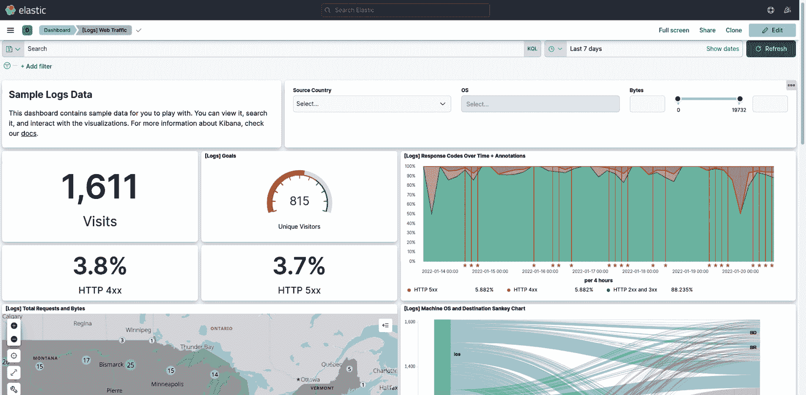
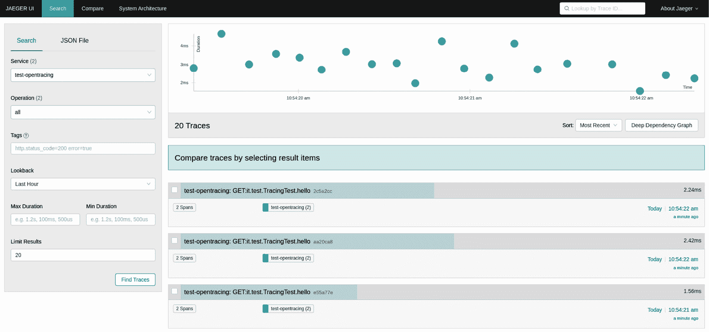
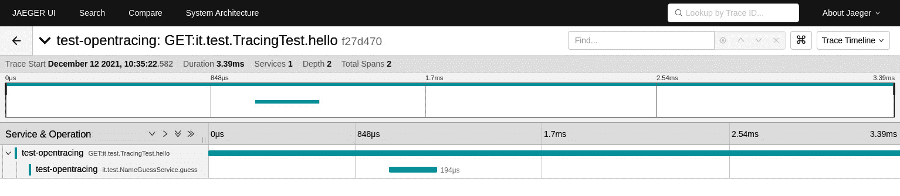

# 第十四章：监控和追踪技术

作为开发人员和架构师，存在忽视我们应用程序和服务在生产发布后发生情况的风险。我们可能会倾向于认为这只是系统管理员和负责服务运营的人的问题。正如容易理解的那样，这种观点是错误的。

了解我们的应用程序在生产中的行为，可以让我们从代码和架构的角度深入了解什么有效，什么无效。正如我们在上一章中学习的，我们应用程序的维护对于每个软件项目的成功至关重要，仔细观察应用程序在生产中的表现是了解是否可以改进的最佳方式。

此外，在现代 DevOps 团队中，正如我们在*第五章*中学习的，“探索最常见的发展模型”，必须克服关注点的分离，开发和架构团队也负责运营服务。在本章中，我们将概述有关我们应用程序在生产过程中发生情况的可视性的常见主题。

在本章中，我们将探讨以下主题：

+   日志管理

+   收集应用程序指标

+   定义应用程序健康检查

+   应用程序性能管理

+   服务监控

目的不是仅仅概述这些主题及其用途，还要了解正确设计和实现对这些主题可能产生的影响。话虽如此，让我们开始讨论日志管理。

# 技术要求

您可以在此处找到本章使用的源代码：[`github.com/PacktPublishing/Hands-On-Software-Architecture-with-Java/tree/master/Chapter14`](https://github.com/PacktPublishing/Hands-On-Software-Architecture-with-Java/tree/master/Chapter14)。

# 日志管理

到目前为止，本书中一直认为**日志管理**是理所当然的。让我们快速浏览一些与我们 Java 应用程序中生成日志相关的基本概念。

Java 中的日志记录有着复杂的历史。一开始，Java 平台没有提供任何标准。当（例如**Java Util Logging**（**JUL**））作为标准添加到平台（在**1.4**版本中）时，其他替代框架也变得可用，例如**Apache Commons Logging**和**Log4j**。

在撰写本文时，Log4j 已被弃用，并由**Log4j2**和**logback**取代。

尽管 JUL 标准已经作为平台的一部分存在多年，但由于其功能和性能，替代框架如 logback 和 Log4j2 的使用仍然非常普遍。无论我们选择哪种实现，都有一些共同的概念需要考虑。

## 日志框架中的常见概念

如前所述，无论在项目中使用哪种首选的日志实现，都存在两个主要概念，这些概念适用于所有这些实现：

+   `INFO` 级别通常存在，并定义了 *平均* 的冗余程度，报告记录基本信息的日志条目，这些信息有助于理解正在发生的事情，但如果您想减少日志量或对应用程序的行为足够熟悉和自信，则可以丢弃这些日志条目。

在`INFO`级别之上，有`WARNING`和其他类似级别（如`ERROR`和`FATAL`），用于报告异常或不正确的行为。因此，这些级别几乎总是保持激活状态。最后，在`INFO`级别之下，还有其他级别，如`DEBUG`和`TRACE`，用于获取有关应用程序中发生的事情的详细信息，并且通常仅在有限的时间内报告。它们还用于收集有关应用程序中是否存在需要调试的问题的数据，以及在非生产环境中收集用于开发目的的数据。在生产环境中不建议使用这些日志级别，因为它们会产生大量条目并可能影响性能，这引出了我们下一个要点。

+   `CONSOLE`和`FILE`是两种常用的用于在控制台或文件中报告日志条目的方法。其他替代方案可能包括将 appenders 添加到数据库和其他外部系统（例如通过套接字进行日志记录）。

如前一点所述，appenders 可能会影响整体性能。将数据写入文件可能比写入控制台慢。因此，appenders 通常提供异步替代方案，在将日志条目写入目标系统之前，先将它们缓冲在内存中。然而，当然，如果在条目转发到相关系统（如文件或数据库）之前应用程序崩溃，这会增加数据丢失的风险。

这些是 Java 中日志的一些非常基本的概念（在其他语言中也可以找到类似的概念）。但也有一些关于日志的建议，我可以根据个人经验提供：

+   避免字符串连接（例如 `"My log is " + variable + " ! "`）是一种良好的做法。除了外观不美观外，它还可能影响性能，因为即使日志未使用（因为它与禁用级别相关），字符串连接操作也会发生。大多数日志框架提供基于占位符的替代方案（例如 `"My log is {} !", variable`）。大多数最新的 Java 版本通过在编译时将其替换为更有效的替代方案（例如`StringBuilder`）来自动减轻字符串连接的影响，但仍然建议避免它。

+   考虑通过内容类型区分日志目的地。你可能希望有不同类型的 appender（几乎每个框架都允许这样做）来记录不同的信息。因此，与业务性能相关的业务信息（如用户信息或使用的商品）可以记录在特定的数据库表中（并且可能随后可以汇总和报告），而包含技术信息的日志（对故障排除或检查应用程序的健康状况很有用）可能可以存放在文件中，以便系统操作员容易访问。

这也可以通过日志严重性来实现，通过在某个 appender 上发送`INFO`级别，在其他 appender 上发送其他级别。这也许还能为日志提供不同的*服务质量*：你可以将业务信息记录在异步 appender 上（因为如果应用程序出现问题时可能会丢失一些数据——这不是问题），而技术日志则应该记录在同步 appender 上（因为如果你打算理解一个表现不佳的应用程序背后的问题，你不能承受任何损失）。

+   **日志轮转**是一个基本概念，但有时仍然会被遗忘，尤其是在较老的应用程序中。日志轮转可以通过日志框架本身或通过外部脚本和工具来实现。它基本上与文件 appender 相关，定义了通过重命名、移动和可选地压缩日志来归档日志的方式。日志轮转策略允许当前日志足够小（便于阅读和搜索），并使得从以前的日期查找信息更容易，同时还能在磁盘上节省空间。这将有助于系统操作员，他们有时必须处理由于日志轮转策略配置不当而填满磁盘的错误配置的应用程序。希望现在这种情况会少一些。

+   每条消息都应该提供有意义的信息。尽管这听起来可能很 trivial，但很容易在日志中只记录基本的事情，假设阅读日志的人会有足够的上下文。*我强烈建议不要这样做!* 日志消息可能由对应用程序不太了解的人（如一线支持人员）在紧急情况下（如生产故障排除）阅读。当有疑问时，尽可能清楚。这并不一定意味着要冗长，但请确保提供足够的内容。

+   应以标准方式定义日志级别。特别是在由许多微服务或应用程序组成的大项目中，应该详细记录应该记录为 INFO 的内容，应该更高或更低的内容。这样，日志级别可以统一设置，期望在整个模块中提供相同类型的信息。

+   对于日志格式来说，也是如此。几乎每个日志库都支持定义一个模式，这意味着可以设置哪些信息（除了日志消息本身）应该被写入，包括日期、时间、日志级别等等。如果这种格式在所有组件中都是统一的，那么使用工具（如非常基础的`grep`实用程序）进行阅读和解析会更容易。此外，我强烈建议配置日志库以提供生成日志的类的信息。从计算角度来看，这通常有点昂贵（通常可以忽略不计），但绝对值得。

+   你应该尽快（如果有的话）与安全和法律顾问讨论日志中可以、必须和不应包含的内容。这因应用程序而异，但可能有信息（如个人信息或信用卡数据）被禁止出现在日志中（或需要匿名化），以及法律要求必须出现的信息（如审计信息）。你需要了解这一点并相应地实施要求。

+   从前面的观点继续，大多数应用程序对日志存储和归档都有法律（或其他类型）的要求。你可能需要存储日志多年，有时以不可变的方式。因此，可能需要日志轮转和专门的硬件和软件。

关于日志的最后一个考虑因素，我们无法避免讨论日志聚合。

## 日志聚合

在*第九章*，“设计云原生架构”中，当讨论**十二要素应用**时，我们看到了日志如何被视为事件流，并且必须由一个支持平台来处理，该平台能够捕获事件流、存储它，并使不同应用程序可使用和可搜索。我们甚至提到了**Fluentd**作为常用的解决方案。这正是日志聚合的内容。典型的日志聚合架构具有以下特点：

+   一个用于从控制台（或文件）以事件流形式收集日志的代理。Fluentd 是一个常见的选择（尽管它在性能和日志方面有一些已知的限制，在边缘情况下可能会丢失日志）。**Filebeat**和**collectd**是这种选择的替代品。

+   日志条目的持久性。**Elasticsearch** 在这个领域实际上是标准，提供存储、索引和搜索功能。

+   一个用于导航和监控日志条目的前端。用于此目的的常用软件是**Kibana**和**Grafana**。以下是 Kibana UI 的截图：



图 14.1 – Kibana UI 首页

在云原生架构中，应将日志聚合视为必须考虑的事项，因为基于微服务的重度分布式应用程序将意味着在出现问题时需要监控和调试许多系统。

使用日志聚合策略，您将有一个集中化的方式来访问日志，因此一切都会变得容易一些。

在本节中，我们简要概述了 Java 中的日志记录，然后强调了日志聚合的特点和优势。在下一节中，我们将探讨监控的另一个关键主题，即度量收集。

# 收集应用程序度量

**度量**是您对源代码进行工具化的方式，以提供对正在发生的事情的实时洞察。度量也被称为**遥测**。与代表推送到文件、控制台或其他附件器的信息的日志不同，度量是由应用程序暴露的值，并应由对其感兴趣的人拉取。

此外，虽然日志包含我们的应用程序中发生的事情，以顺序方式收集，但度量暴露了应用程序在那个时刻的行为快照，总结为一些已知值（如线程数、分配的内存等）。也可以定义一些自定义度量，这些度量可以用来定义特定于我们特定用例的数字（如支付次数、交易次数等）。

有许多广泛使用的框架可用于在 Java 中暴露度量。`Micrometer` 是一个开源的界面实现，而其他商业解决方案也存在，例如 **New Relic** 和 **Datadog**。然而，我认为在这个领域最有趣的努力之一是 MicroProfile 标准的一部分。我们在 *第七章* 中探讨了 MicroProfile，*探索中间件和框架*，当时讨论了 Quarkus 作为其实现之一。

我认为一个快速示例（MicroProfile 兼容）将有助于更好地解释度量看起来是什么样子。让我们看看一个简单的 hello world REST API：

```java
@GET
    @Path("/hello")
    @Produces(MediaType.TEXT_PLAIN)
    @Counted(name = "callsNumber", description = "How many 
      calls received.")
    @Timed(name = "callsTimer", description = "Time for 
      each call", unit = MetricUnits.MILLISECONDS)
    public String hello() throws InterruptedException {
        int rand = (int)(Math.random() * 30);
        Thread.sleep(rand*100);
        return "Hello RESTEasy";
    }
```

如您所见，`hello` 方法被两个与度量相关的注解（`Counted` 和 `Timed`）标注，这些注解声明了我们想要收集的度量类型。这些注解还提供了一些文档（度量的 `name` 和 `description`）。现在，如果我们通过 REST 查询应用程序，我们可以看到所有暴露的度量值：

```java
# HELP application_it_test_MetricsTest_callsNumber_total 
  How many calls received.
# TYPE application_it_test_MetricsTest_callsNumber_total 
  counter
application_it_test_MetricsTest_callsNumber_total 4.0
...
# HELP application_it_test_MetricsTest_callsTimer_seconds 
  Time for each call
# TYPE application_it_test_MetricsTest_callsTimer_seconds 
  summary
application_it_test_MetricsTest_callsTimer_seconds_count 
  4.0
...
```

在前面的输出中省略了许多其他度量（如最小值、最大值和平均值），这些度量由框架自动计算。

这些类型的度量在 `/metrics/application` 端点下暴露（在 Quarkus 框架的情况下为 `/q/metrics/application`）。

MicroProfile 规范还定义了 `/metrics/vendor`（供应商特定的）、`/metrics/base`（一个有意义的预定义子集）和 `/metrics`（所有可用的度量）端点。在这些端点中，您可能会发现许多关于应用程序的有用见解，例如虚拟机统计信息等。这是可以从这些端点检索到的小部分内容：

```java
...
# HELP base_memory_usedHeap_bytes Displays the amount of 
  used heap memory in bytes.
# TYPE base_memory_usedHeap_bytes gauge
base_memory_usedHeap_bytes 9.4322688E7
# HELP base_thread_count Displays the current number of 
  live threads including both daemon and non-daemon threads
# TYPE base_thread_count gauge
base_thread_count 33.0
...
```

以这种方式暴露的指标可以被外部系统收集，这些系统可以存储它们，并在出现问题时提供警报。用于此目的的一个广泛使用的框架是**Prometheus**。

作为**云原生计算基金会**（**CNCF**）努力的一部分，Prometheus 能够从各种系统（包括与我们之前看到的示例类似的开源度量标准合规端点）收集指标，将它们存储在所谓的**时间序列数据库**（**TSDB**）中（这基本上是一个针对存储时间尺度上的事件进行优化的数据库），并提供查询指标和提供警报的功能。它还提供内置的图形界面和与 Grafana 的集成。

但指标只是应用程序监控的一个方面。另一个类似且重要的方面是健康检查。

## 定义应用程序健康检查

**健康检查**是指标收集的一种特殊情况。而不是暴露用于评估应用程序性能趋势的数字，健康检查提供了关于应用程序是否健康的简单**开/关**信息。

这种信息在云和 PaaS 环境（如 Kubernetes）中特别有用，因为它可以在应用程序无法工作时允许自我修复（如重启）。

OpenMetrics 目前定义了三种健康检查：**live**、**ready**和**started**。这些检查来自 Kubernetes 世界中的概念：

+   通过使用实时（健康）检查，Kubernetes 知道应用程序是否正在运行，如果不健康，则会重启它。

+   通过使用就绪检查，Kubernetes 将了解应用程序是否准备好接收请求，并将连接转发给它。

+   启动检查识别启动阶段的成功完成。

注意，**ready**和**started**非常相似，但**started**与应用程序的首次启动有关（可能很慢），而**ready**可能涉及暂时无法处理请求（例如，流量激增或其他暂时性减速）。

Quarkus 通过`smallrye-health`扩展提供此类检查。默认情况下，探测器在`/q/health/live`、`/q/health/ready`和`/q/health/started`端点暴露，结果格式化为 JSON。

为了实现检查，Quarkus 提供了一个基于注解的基础设施。这就是一个基本的`Liveness`探测器是如何实现的：

```java
@Liveness
public class MyLiveHealthCheck implements HealthCheck {
    @Override
    public HealthCheckResponse call() {
        // do some checks
        return HealthCheckResponse.up("Everything works");
    }
}
```

如您所见，前面的方法使用`@Liveness`进行了注解，并使用`HealthCheckResponse`对象的`up`方法返回一条消息。

类似地，一个`Readiness`检查将如下所示：

```java
@Readiness
public class MyReadyHealthCheck implements HealthCheck {
    @Override
    public HealthCheckResponse call() {
        // do some checks
        return HealthCheckResponse.up("Ready to take 
          calls");
    }
}
```

此外，在这种情况下，前面的方法也进行了注解（在这种情况下，使用`@Readiness`）并使用`HealthCheckResponse`对象的`up`方法返回一条消息。

最后，一个`Startup`检查将如下所示：

```java
@Startup
public class MyStartedHealthCheck implements HealthCheck {
    @Override
    public HealthCheckResponse call() {
        // do some checks
return HealthCheckResponse.up("Startup completed");
    }
}
```

对于启动检查，前面的方法被注解（使用`@Startup`），并使用`HealthCheckResponse`对象的`up`方法返回一个消息。

如你所见，API 非常简单。提供功能的对象默认是单例。当然，在现实世界的应用中，你可能想要做一些复杂的检查，比如测试数据库连接或类似的事情。

你当然可以返回一个负响应（例如使用`down()`方法）如果你检测到任何故障。其他有用的功能包括多个检查的链式调用（其中累积答案是`up`，只有当每个检查都是`up`时）以及能够在响应中包含一些元数据的能力。

### 实现 OpenTracing

当你有一系列长的调用链（例如，一个微服务调用其他微服务，等等）时，跟踪是一种至关重要的监控技术，因为你通过调用大量的内部或外部服务来构建你的答案。

事实上，这在微服务应用中是一个非常常见的用例：一个调用进入你的应用（例如，来自 REST Web 服务或 Web 用户界面的操作，这反过来又转化为一个或多个 REST 调用）。这种调用将由多个不同的微服务来处理，最终组装成一个独特的答案。

这个问题在于你可能会失去对所发生事件的追踪。将来电与每个特定的子调用相关联变得非常困难。这可能会成为一个大问题，无论是在故障排除问题中，还是在简单地理解正在发生的事情时。

跟踪允许通过在每个子系统中使用的一个标识码来传播，从而识别每个请求的路径，这有助于记录和重建实现我们用例所使用的调用树，无论是用于故障排除还是其他目的，如审计日志。

`smallrye-opentracing`。

一个有趣的功能是，OpenTracing 还支持计算每个子调用的耗时。

让我们看看一个非常简单的例子，以了解在 Quarkus 中跟踪是如何工作的。

我们将从一个简单的 REST 资源开始，就像我们在本书中多次看到的那样：

```java
@Path("/trace")
public class TracingTest {
     @Inject
    NameGuessService service;
     @GET
    @Produces(MediaType.TEXT_PLAIN)
    public String hello() {
        String name = service.guess();
        return "Hello "+name;
    }
}
```

如你所见，这是一个简单的 REST 方法，监听`/trace`端点。它使用一个已经被注入的服务（`NameGuessService`）。

值得注意的是，没有与跟踪相关的特定代码：实际上，在 REST 端点上的跟踪基本上是由框架自动提供的。只要在项目中包含`smallrye-opentracing`扩展就足够了。

现在，让我们看看`NameGuessService`类：

```java
@ApplicationScoped
@Traced
public class NameGuessService {
    public String guess()
    {
        Random random = new Random();
        String[] names = {"Giuseppe","Stefano",
          "Filippo","Luca","Antonello"};
        return names[random.nextInt(names.length)];
    }
}
```

如你所见，这里没有什么特别的地方：只有一个简单的模拟服务返回一个字符串，这个字符串是随机选择的。唯一值得注意的是，该方法被注解为`@Traced`，因为框架需要明确知道该方法是否必须被跟踪。

*我们从哪里开始？* 使用跟踪最常见且实用的方式是与 Jaeger 服务器一起使用。Jaeger 基本上暴露了一些服务，这些服务收集并图形化显示我们的应用程序中发生的事情。基本概念是**跨度**，它是一个端到端的方法调用。在我们的例子中，一个**跨度**由我们的 REST 调用组成，另一个是由我们注入的服务中的子调用。

在本地快速测试我们的服务的一种方法是使用现成的 Jaeger 服务器容器化。

在安装了容器引擎（如 Docker）的笔记本电脑上，只需运行以下命令即可：

```java
sudo docker run -p 5775:5775/udp -p 6831:6831/udp -p 
6832:6832/udp -p 5778:5778 -p 16686:16686 -p 14268:14268 
jaegertracing/all-in-one:latest
```

这将运行一个`jaegertracing`的*一体化*镜像，指定使用的端口。

然后，我们可以运行我们的应用程序，将其连接到 Jaeger 服务器：

```java
./mvnw compile quarkus:dev -Djvm.args="-
DJAEGER_SERVICE_NAME=testservice -
DJAEGER_SAMPLER_TYPE=const -DJAEGER_SAMPLER_PARAM=1"
```

这些参数作为命令行参数提供，但也可以作为属性文件的一部分提供。在这种情况下，我们指定了如何调用此服务以及应该进行哪种类型的采样（对于本次测试，可以使用默认参数）。

现在，我们可以在`http://127.0.0.1:8080/trace`上调用我们的 REST 服务几次，只是为了生成一些要显示的流量。如果我们然后导航到 Jaeger UI，默认情况下在`http://localhost:16686/`，我们将看到类似的内容（如果需要，请点击**查找跟踪**按钮并选择**test-opentracing**服务）：



图 14.2 – Jaeger UI 首页

如您所见，对我们的服务发出的每个调用都会显示总的响应时间（在我们的例子中是几毫秒）。

如果我们点击其中一个调用，我们可以看到两个跨度：



图 14.3 – Jaeger UI 跨度

如您所见，主要跨度涉及 REST 调用，而子调用注入的服务有一个较小的跨度。很容易想象在运行中的应用程序上拥有此类信息是多么有用。

如您所见，在这个例子中，我们只有一个微服务，有两个方法。然而，这个概念可以很容易地扩展到多个相互通信的微服务。

跟踪和指标是更大概念的一部分，称为**应用性能管理**（**APM**）。

# 应用性能管理

APM 是运行生产中应用程序的一个广泛且非常重要的方面。它涉及许多不同的技术，有时在日志聚合、指标收集和整体监控等方面存在一些未知因素。

每个供应商或监控技术堆栈对 APM（应用性能管理）的理解略有不同，因此其实现也有所不同。

我认为从目标开始是好的：APM 的目标是深入了解一组应用程序的性能，以及底层参数（如内存使用、数据库指标等）对最终用户体验（如用户界面响应性、响应时间等）的影响。

很容易理解，为了实现这样一个有用（且广泛）的目标，你可能需要堆叠多个不同的工具和框架。

我们在上一节中看到了一些这样的内容：你可能希望从日志中获取信息（以了解应用程序正在做什么），以及与指标（以了解资源消耗并收集其他 KPI，如调用次数）一起，进行健康检查（以快速查看哪些服务正在运行），以及进行跟踪（以了解每个特定调用是如何执行的，包括所有子调用）。

此外，还有许多其他工具你可以使用。例如，JVM 提供了一些有用的参数（我们在讨论指标时看到了一些），如内存和 CPU 消耗。

最后但同样重要的是，对于不是原生可插装的代码（例如之前提到的类似框架未提供指标的遗留代码），可以通过一些更侵入性的方法收集一些指标，例如 Java 代理，这些是低级配置，在 JVM 上操作以了解我们的代码中的每个方法是如何以及何时被调用的。

话虽如此，你可以想象提供关于我们应用程序的整体、易于阅读的视图是多么困难。你需要安装和维护许多不同的工具，并将它们粘合在一起，以便显示有意义的统一信息。

因此，除了开源标准和工具之外，还出现了商业解决方案（如**Dynatrace**、**Datadog**和**Splunk**），这些解决方案允许我们使用现成的堆栈来提供此类信息。

但是现在我们已经清楚拥有这类信息的重要性和实用性，让我们来看看在讨论 APM 时需要注意的一些话题：

+   **可能会影响性能**：迄今为止看到的大多数方法都是通过使用异步和非阻塞技术来尽量减少影响而设计的。然而，特别是如果我们使用像 Java 代理这样的旧方法，影响可能会很大。如果你认为当应用程序运行缓慢时 APM 系统可能很有用，那么很容易理解 APM 必须尽可能轻量级，以避免对已经请求的系统造成更多压力。

+   **它需要非平凡的维护**：收集到的数据可能数量巨大。想想每个交易都会生成一系列指标（时间、错误代码、消耗的资源），再加上日志和跟踪信息的行数。当所有这些指标乘以数百或数千笔交易时，可能变得难以维护。此外，正如所说，你可能想要查找的每种具体类型的信息（日志、指标和检查）都由不同的堆栈管理，因此我们可能最终会使用不同的服务器、存储和配置。

+   **收集到的信息可能难以关联**：特别是在出现问题时，你可能想知道是否是某个特定的交易导致了问题，以及系统是如何表现的。虽然跟踪可以轻松地将交易与每个子调用和子系统关联起来，但将跟踪信息与日志信息、指标和健康检查关联起来仍然会带来麻烦。此外，比较不同类型的数据（如时间段与 KPI 和消息）可能很困难，尤其是在用户界面中。

最后但同样重要的是，将平台信息与相关实现的功能关联起来至关重要。在下一节中，我们将更深入地探讨哪些信息值得收集，以及如何对其进行分类。

# 服务监控

一个非常重要的考虑因素是监控什么。

事实上，尽可能多地收集数据非常重要，无论是从指标还是 KPI 的角度来看，因为它们可能会揭示有趣的趋势，如果发生不可预测的事情，它们将非常有用。但与此同时，商业用户对各种指标和信息更感兴趣，例如每秒（或每小时、每天）的交易数量，通过平台流通的金额，并发用户数量等等。

因此，需要寻找两种不同类型的 KPI，有时它们之间的界限可能模糊：

+   **技术信息**：如内存使用量、线程数量、连接数量等等。这些信息对于系统的大小和扩展以及尝试预测我们的系统是否会表现良好或需要干预非常有用。

+   **商业信息**：定义什么是商业信息在很大程度上取决于应用领域，但通常包括平均交易时间、并发用户数量、新用户数量等等。

从技术角度来看，你可以使用相同的框架（特别是用于收集指标的框架）来收集技术和商业信息。

但尝试将一种指标与另一种指标关联起来非常重要（而且并不容易做到）。

换句话说，拥有一个地图（即使是简单的文档，如网页也足够）来记录每个功能托管的位置，以及特定商业信息如何与一系列技术信息相关联，可能是有用的。

让我们来看一个例子：如果我们有一个关于特定功能交易时间的业务 KPI，了解哪些服务器提供了该功能，以及哪些特定的微服务集（或应用程序）实现了它，这一点非常重要。

这样，您可以将业务指标（如交易时间）与一系列技术指标（如多个 JVM 使用的内存、使用的线程、运行这些 JVM 的服务器上的 CPU 消耗等）联系起来。

通过这样做，您可以更好地将特定功能（在我们的案例中，是交易变慢）的性能变化与特定的技术信息子集（如特定服务器上 CPU 使用量的增加）相关联。

这将有助于故障排除和快速修复生产问题（通过扩展受影响系统的资源）。

除了这些，业务指标对某些用户来说非常有价值：它们可能被用来预测平台的财务表现、预期的增长以及类似的参数。因此，通常将这些信息存储在特定的数据存储中（如大数据或数据湖），这样它们就可以与其他信息相关联，这些信息被分析并进一步研究。

这完成了本章计划讨论的主题。

# 摘要

在本章中，我们探讨了关于监控和追踪我们应用程序的一些有趣考虑因素。

我们首先回顾了关于 Java 日志记录的一些基本概念，以及为什么在微服务和云原生应用程序中进行日志聚合是一件好事。然后，我们转向指标和健康检查的概念，以及应用程序如何提供有关我们模块性能和健康状况的实时数据。

然后，我们讨论了追踪，这在故障排除和管理分布式应用程序（如微服务应用程序）时非常重要。APM 是下一个话题，它涉及将所有信息（如指标、健康检查和日志）汇总在一起，以创建应用程序洞察的概览。

最后但同样重要的是，我们看到了服务监控如何涉及将业务信息与背后的技术 KPI 联系起来，以支持故障排除并从收集的数据中获得更多见解。

在下一章中，我们将看到 Java 技术最新版本中的新内容。

# 进一步阅读

+   Hanif Jetha，*如何在 Kubernetes 上设置 Elasticsearch、Fluentd 和 Kibana（EFK）日志堆栈* ([`www.digitalocean.com/community/tutorials/how-to-set-up-an-elasticsearch-fluentd-and-kibana-efk-logging-stack-on-kubernetes`](https://www.digitalocean.com/community/tutorials/how-to-set-up-an-elasticsearch-fluentd-and-kibana-efk-logging-stack-on-kubernetes))

+   Himanshu Shukla，*#微服务：可观察性模式* (`medium.com/@greekykhs/microservices-observability-patterns-eff92365e2a8`)

+   *微服务指标规范* ([`download.eclipse.org/microprofile/microprofile-metrics-2.3/microprofile-metrics-spec-2.3.html`](https://download.eclipse.org/microprofile/microprofile-metrics-2.3/microprofile-metrics-spec-2.3.html))

+   *OpenTracing 项目* ([`opentracing.io/`](https://opentracing.io/))
