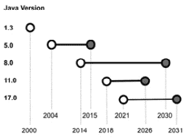

# 第十五章：Java 的新特性是什么？

**Java**，很明显，一直是这本书的**主旋律**。即使在一些前面的章节中，我们关注的是更一般的概念，如架构设计和软件生命周期管理，但本书的主要目标是向 Java 软件工程师提供一套架构概念汇编，最终帮助他们成为更好的架构师。

考虑到这一点，我们不可避免地要谈谈 Java 技术今天的状况，特别是关于最新版本的情况。

在本章中，我们将讨论以下主题：

+   Java 版本号

+   供应商生态系统

+   Java 17 的新特性

因此，让我们从 Java 版本号的概述开始。

# Java 版本号

在 Java 版本号和计划的历史中已经进行了许多变化。首先要注意的是，在最初，Java 版本号曾经遵循*1.x*方案，**1.3**基本上是第一个广泛使用的版本。

然而，从**版本 1.5**开始，版本号方案放弃了*1.x*前缀，因此我们有了**Java 5**、**6**等等。

另一个重要的问题是命名。最初的版本被称为**JDK**（代表**Java 开发工具包** – 更多内容将在后面介绍）。然后，从版本**1.2**到**5**，平台被称为**J2SE**（代表**Java 2 标准版**）。在撰写本文时，平台被称为**Java SE**（代表**Java 标准版**）。

关于 JDK，一个我们大多数人熟悉的术语，最重要的了解是，直到**Java 8**，Java 平台以两种版本分发，即**Java 运行时环境**（**JRE**）和 JDK。JRE 基本上是 JDK 的简化版，缺少所有开发工具（例如 javac 编译器）。正如所说，自从 Java 8 以来，只有 JDK 版本被官方分发。

在发布时间表方面，较老的 Java 版本曾经有一个长且不统一的方案，主要版本之间的发布间隔在 1 到 3 年之间。然而，自从**Java 9**以来，平台的主要版本遵循了 6 个月的发布时间表。

另一点与**长期支持**（**LTS**）版本有关。大约每 2 到 3 年，一个版本被认为是 LTS。这基本上意味着更长的官方支持周期（取决于供应商，最长可达 10 年），并增加了更多功能（而非 LTS 版本通常具有较少且更简单的功能）。

最后但同样重要的是，每个主要版本（包括 LTS 和非 LTS 版本）都带来了一组小版本，包括补丁、错误修复和安全修复。

在下面的图中，你可以看到一些最重要的 Java 版本的支持生命周期图示：




图 15.1 – 一些 Java 版本的支持生命周期

除了版本编号外，另一个重要的考虑因素是供应商生态系统。

## 供应商生态系统

如许多人所知，Java 最初是由（现已解散的）Sun Microsystems 作为一个项目发布的。它最初被开发为客户端语言，以及后来被称为**物联网**（**IoT**）的语言。讽刺的是，如今，它很少用于此类场景，相反，在服务器端企业应用中得到了广泛使用，这可能是 Java 设计时未曾考虑的第一个用例。

2006 年，Sun 在 GPL 许可下将 Java 技术作为开源发布。Sun 后来倒闭，并于 2010 年被 Oracle 收购。随着这一转变，Java 生态系统开始主要受 Oracle 本身的管理。

Java 版本使用**技术兼容性工具包**（**TCK**）进行认证，这是一个用于测试 Java 发行版与特定版本中包含的规范兼容性的测试套件。谈到 Java 发行版，这里最重要的项目是 OpenJDK。

### OpenJDK 发行版

**OpenJDK**是许多广泛使用的 JDK 实现的主要源代码仓库，包括 Oracle Java 发行版。

我们知道 Oracle 在 OpenJDK 社区中领导 Java 的开源开发。OpenJDK 实际上是 Java 技术的参考实现。Oracle 发布了 Oracle OpenJDK（免费且不提供商业支持）和 Oracle JDK（在付费订阅下提供商业支持）。

许多其他供应商提供自己的发行版，它们之间有细微的差别。所有这些发行版都是从 OpenJDK 开源代码库开始的：

+   **AdoptOpenJDK**是一个多供应商项目，用于分发*vanilla* OpenJDK 构建([`adoptopenjdk.net`](https://adoptopenjdk.net))。

+   Red Hat 提供自己的构建版本，包括对 Red Hat Enterprise Linux 操作系统的支持以及一些附加功能，例如对 Shenandoah 垃圾回收实现的支持([`developers.redhat.com/products/openjdk`](https://developers.redhat.com/products/openjdk))。

+   Azul Technology 构建了一个商业支持的实现，包括一些专有垃圾回收功能([`www.azul.com/downloads`](https://www.azul.com/downloads))。

+   AWS 发布了**Corretto**，这是一个为在 AWS 云基础设施上运行而设计的 OpenJDK 构建版本([`aws.amazon.com/it/corretto`](https://aws.amazon.com/it/corretto))。

+   IBM 发布了**OpenJ9**，最初是为在大型机技术下运行而开发的，现在在 OpenJDK 的框架下，也适用于其他架构([`www.eclipse.org/openj9`](https://www.eclipse.org/openj9))。

+   使用`polyglot`，以便运行用**Python**、**JavaScript**、**Ruby**等语言编写的代码。

这些是最常用的 Java 发行版。除非你在寻找一个非常特定的功能，否则选择主要取决于环境，例如现有的支持合同或商业定价。在没有具体需求的情况下，AdoptOpenJDK 通常是一个不错的选择。

由**Snyk**（[`snyk.io/jvm-ecosystem-report-2021`](https://snyk.io/jvm-ecosystem-report-2021)）构建的最新生态系统报告显示，AdoptOpenJDK 的构建是最受欢迎的（大约 44%），其次是 Oracle 发行的不同版本（商业和非商业）。报告中的另一个重要新闻是**Java 11**的采用率不断增长，以及从 Java 8 的迁移。然而，我们将看到在接下来的几个月和几年中**Java 17**的采用率将如何增长。

在这方面，让我们看看 Java 的最新版本，Java 17 的新特性。

# Java 17 的新特性

**Java 17** 是一个长期支持版本，这意味着，根据供应商的不同，它将得到超过 5 年的支持（在某些情况下可达 10 年）。它于 2021 年 9 月发布。

让我们看看这个版本引入的一些新特性。

## 密封类

**密封类**是在 Java 15 中引入的，并且这个特性在 Java 17 中得到了官方支持。它们提供了一种声明式定义类和接口的方法，同时限制哪些对象可以扩展它或实现这些类和接口。

这在某些情况下特别有用，例如如果你正在定义一个 API，你可以在设计时控制 API 使用的某些方面。

这里有一个简单的例子：

```java
public sealed class Payment permits Instant, Wire, 
  CreditCard […]
```

在这个例子中，我们声明一个`Payment`类，并定义只有`Instant`、`Wire`和`CreditCard`可以扩展它。在这个特定的例子中，我们假设这些类与`Payment`类位于同一个包中，但如果我们想将其放置在其他地方，也可以显式声明完整的包。

此外，完全相同的语法也可以应用于接口：

```java
public sealed interface Payment permits Instant, Wire, 
  CreditCard […]
```

这与接口的行为相同，只是实现仅限于列出的接口。

值得注意的是，如果执行了不允许的操作（例如使用未声明的类型扩展类），则会引发编译时错误。这将有助于使代码更加稳定和可测试。

## switch 语句的模式匹配

这是一个预览特性，这意味着它必须被启用（通过向 JVM 传递命令行参数）并且不是官方完全支持的（尽管每个供应商都定义了支持的确切边界）。

这个特性是关于扩展`switch`构造的行为。

虽然有许多不同的潜在用例（并且未来版本中可能会进一步精炼和确定），但以下三个是主要的：

+   `switch`构造可以像`instanceof`运算符一样行为，如下例所示：

    ```java
    […]
    switch (o) {
        case Instant i -> System.out.println("It is an 
          instant payment");
        case Wire w    -> System.out.println("It is a wire 
          transfer");
        case CreditCard c -> System.out.println("It is a 
          credit card transaction");
          default -> System.out.println("It is another 
            kind of payment");
            };
    […]
    ```

+   如果评估的对象为`null`，则`switch`表达式会引发`NullPointerException`，有了这个新的空安全特性，可以显式检查`null`情况。在这个例子中，`switch`表达式检查一个字符串变量，也检查`null`情况：

    ```java
    switch (s) {
      case "USD", "EUR" -> System.out.println("Supported 
        currencies");
      case null    -> System.out.println("The String 
        is null");
            default    -> System.out.println("Unsupported 
              currencies");
        }
    ```

+   `switch`分支。因此，本质上，以下结构是被允许的：

    ```java
    switch (o) {
        case Instant i && i.getAmount() > 100-> 
          System.out.println("It is an high value instant 
            payment");
        case Instant i -> System.out.println("It is a 
          generic instant payment");
        case Wire w    -> System.out.println("It is a wire 
          transfer");
    ```

如您所见，这是一个很好的特性，允许代码紧凑且易于阅读。

## 强烈封装 JDK 内部组件

自 Java 9 以来，一直有逐步限制对 JDK 内部组件的访问的努力。这是为了阻止直接使用位于`sun.*`、`com.sun.*`、`jdk.*`等包中的类。这种限制的目标是减少对特定 JVM 版本的耦合（从而让 JVM 开发者能够进化这些类，甚至在必要时引入破坏性更改）并提高安全性。

为了做到这一点，JDK 逐步提供了替代方案。此外，自 Java 9（以及至 Java 16）以来，使用这些内部类和方法的源代码必须通过传递`--illegal-access`参数进行编译，该参数可以配置为允许、拒绝或打印使用详情的警告。

在 Java 17 中，此参数不再可用。取而代之的是，可以使用`--add-open`参数，它允许我们声明可以使用的特定包。普遍观点认为，即使这种可能性也将逐步被否认，以完全禁止在自定义代码中显式使用 JDK 内部组件。

## Java 17 中的更多更改

Java 17 添加了许多其他更改。以下是亮点：

+   **支持 macOS/AArch64**：这允许在运行 M1 芯片的 Mac 机器上编译和执行 Java 代码。

+   **增强的伪随机数生成器**：这是对伪随机数生成器实用程序的局部重构，包括删除重复代码和不同算法的可插拔性。

+   **外部函数和内存 API**：这是一组孵化特性（这些特性仍然不稳定，并将进一步发展），旨在简化并确保对存在于 JVM 之外的资源（代码和数据）的访问。这意味着能够访问内存位置并调用 JVM 未管理或未实现的函数。要在之前的版本中这样做，您需要使用**Java Native Interfaces**（JNI）类，这些类通常被认为安全性较低（且使用更复杂）。

+   **上下文特定的反序列化过滤器**：作为从一些 JVM 版本开始的努力的一部分，这是一种定义代码反序列化验证的方法。类序列化和反序列化通常被认为可能是安全漏洞，因为精心设计的有效载荷可以执行任意（且不安全）的操作。此功能允许定义过滤器以*预先验证*在反序列化操作中允许的代码类型。

+   **废弃并移除 applet API**：由于许多原因，包括性能和安全问题，applet 已经很久没有被使用了。此外，大多数（如果不是所有）现代浏览器都不再支持它们。因此，它们正在被废弃，并将从 JDK 中完全移除。

+   **废弃并移除安全管理者**：安全管理者是一个主要针对与 applet 一起使用的 API。它在**Java 1.0**中发布。由于复杂性和性能问题，以及 applet 现在使用得较少，它已经被逐渐放弃。因此，它现在已被废弃，并将从即将发布的 JDK 版本中移除。

+   **向量 API**：这是一个处于孵化阶段的全新 API（这意味着它将受到变化和进一步发展的约束）。它的目标是定义一个新的 API 来计算向量。除了使用简单之外，这个 API 还旨在编译代码，专门针对支持的 CPU 架构的优化，从而在可能的情况下提高性能。

虽然已经添加、修改和删除了许多其他特性，但前面提到的那些是最重要且影响最大的。

# 摘要

在本章中，我们探讨了 Java 平台（17）最新版本中引入的一些新特性。

我们有机会查看 Java 的版本方案和发布计划。我们快速概述了 Java 供应商生态系统，这是在撰写本文时的一个快照，而当时的情况正在不断发展。同样适用于平台本身的新功能。虽然一些特性本身就很显著，当然，许多特性在不久的将来还将进一步修改。

这标志着我们使用 Java 探索云原生架构的旅程的结束。我希望我提供了一些有趣的见解和想法，并祝愿每一位读者在定义优雅且成功的应用以及作为软件架构师拥有满意的职业生涯时一切顺利。

# 进一步阅读

+   Oracle, *JDK 17 版本说明* ([`www.oracle.com/java/technologies/javase/17-relnote-issues.html`](https://www.oracle.com/java/technologies/javase/17-relnote-issues.html))

+   Java Magazine, Mitch Wagner, *Java SE 是开源软件吗？简短的答案是'是'* ([`blogs.oracle.com/javamagazine/post/java-se-open-source-license`](https://blogs.oracle.com/javamagazine/post/java-se-open-source-license))
