# 第二章. 使用 ImageJ 的基本图像处理

在遵循上一章的说明之后，你应该已经安装并运行了一个有效的 ImageJ。本章将涉及以下主题：

+   ImageJ 支持的图像类型

+   多维图像

+   加载和保存图像

+   查看和获取像素值

+   校准图像以进行测量

# ImageJ 中的图像

ImageJ 广泛支持多种常见的图像格式，如 JPEG、PNG 和 TIFF。借助**Bio-Formats**插件，还可以加载广泛的专有图像格式（例如，STK 文件[Metamorph]和 LSM 文件[Zeiss]），以及某些医学图像格式（**Dicom**）和天文格式（**FITS**）。Fiji 的最新版本附带 Bio-Formats 插件，并支持几乎所有主要图像格式的文件。

本章将使用**文件**菜单中样本图像项中可用的某些图像文件。这些文件可通过互联网访问，因此需要有效的互联网连接。整个图像套件也可以从 ImageJ 网站作为一个单独的下载获取。当使用 Fiji 发行版时，可以通过转到**文件** | **打开样本** | **缓存样本图像**从菜单中本地缓存图像集。

我们将首先打开这些样本图像之一，以演示 ImageJ 中的一些图像功能。为此，按照上一章所述启动 ImageJ。转到**文件** | **打开样本**，并选择**Boats (356K)**。这张图片来自[`imagej.nih.gov/ij/images/boats.gif`](http://imagej.nih.gov/ij/images/boats.gif)，展示了一些停泊在港口的船只。同样，也可以通过转到**文件**菜单中的**导入** | **URL**来加载这张图片，复制之前的 URL 并将其粘贴到字段中。图片应该在新窗口中加载并显示如下：

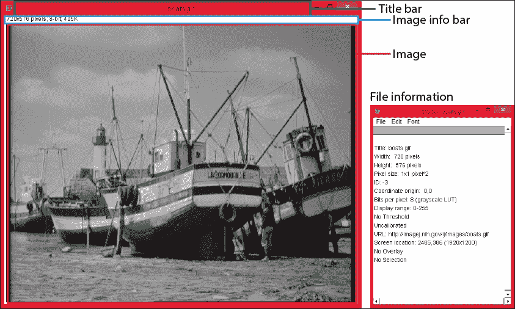

标题栏显示了文件名（**boats.gif**）。标题栏下方是一个信息栏，显示了图像的关键参数：图像的大小（**720x576 像素**）、图像类型（**8 位**）和文件大小（**405K**）。接下来的部分将提供更多关于 ImageJ 中图像类型基础细节的说明。

## 图像类型

一张图像是由像素组成的，每个像素都有一个由位编码的值。位的数量决定了可以表示的灰度值或颜色的数量。接下来的部分将简要介绍 ImageJ 支持的不同的图像类型。

### 灰度图像

上一节中的船只图像是一个 8 位灰度图像，这意味着每个像素的值介于 0（黑色）和 255（白色）之间。灰度图像也可以是 16 位（值介于 0 和 65535 之间）和 32 位（浮点图像）。图像的灰度值用**查找表**（**LUT**）表示。对于 8 位图像，LUT 将 0 到 255 之间的值映射到计算机屏幕上红、绿、蓝三色的等量混合，以显示灰度级别。例如，中灰度级别 128 将在你的屏幕上显示为 RGB 值（128,128,128）。你也可以改变 LUT 的映射以不同的比例显示。通过改变 LUT，你可以改变屏幕上图像的颜色外观。如果你想给灰度图像一种绿色外观，你可以将 LUT 设置为绿色。这将告诉 ImageJ 将屏幕上的中灰度值映射到 RGB 值（0,128,0），从而看起来更暗绿色。对于 16 位和 32 位图像，虽然它们可以表示更多的灰度级别，但同样的原则适用。当创建宏和插件时，这些区别变得很重要，因为某些处理步骤只能在 8 位图像上执行。

### 彩色图像

彩色图像通常有两种位深度：**8 位**和**24 位**彩色。8 位彩色图像类型是索引图像，其中索引确定图像的颜色。8 位彩色图像的一个例子是 GIF 文件格式。它在其索引中存储多达 256 种颜色，这导致文件大小减小，但颜色数量减少。这些图像存储了一个 256 种红、绿、蓝（RGB）值的表（也称为调色板）。表中的每个条目都有一个索引，该索引在图像中引用，用于使用该特定颜色的像素。这种类型现在很少见，因为由于存储容量更大和互联网连接更快，较小的文件大小不再那么关键。通过从 ImageJ 菜单中选择**图像** | **颜色** | **显示 LUT**，你可以查看调色板或索引图像的索引列表。

RGB 图像，例如 JPG 或 PNG 文件，是包含 24 位信息的彩色图像：红色、绿色和蓝色通道各占 8 位。PNG 文件可以额外有 8 位用于透明度通道。除了 RGB 图像外，还可以使用不同的颜色空间生成图像，例如**L*a*b**和**HSB**。HSB 图像将 RGB 图像的三个分量分解为色调、饱和度和亮度通道。色调分量可以与像素的颜色（蓝色、绿色、紫色等）相比较。小的色调值用于红色和橙色，而中等值将代表青色和蓝色。高色调值代表品红色和红色。在这张图像中，你可以看到色调通道在 RGB 图像中的映射（S 和 B 通道保持白色）：

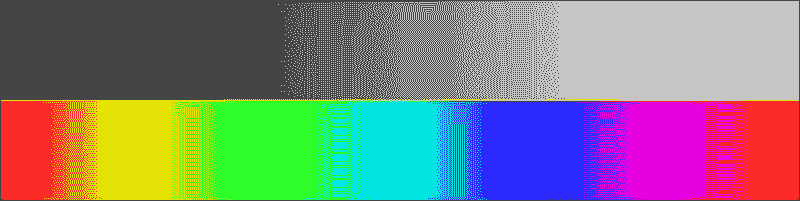

注意，色调通道的映射是环形的。纯白和纯黑具有相同的颜色。它们从红色开始，以红色结束。

调整饱和度会使颜色更或更**彩色**。饱和度值较小会使颜色看起来更灰，而饱和度值较大会使颜色更纯净。以下示例显示了色调通道的水平渐变和饱和度通道的垂直渐变（亮度通道保持恒定；橙色框界定了不同的通道）：

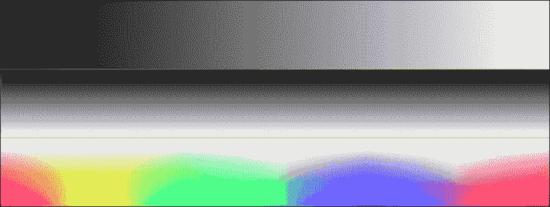

当您从下方的面板底部移动到顶部时，颜色会变得更淡，变得不那么鲜艳，在这种情况下，颜色变为白色。上方的颜色由亮度通道决定，在这个例子中是白色。

改变亮度值会使颜色更亮或更暗。高值保持颜色完整且明亮，而低值会使颜色看起来更接近黑色。以下图像显示了这种效果，其中水平渐变再次是色调通道，而垂直渐变是亮度通道（饱和度通道是均匀的白色）：

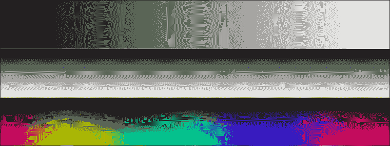

实际图像将具有色调、饱和度和亮度的灰度值组合，这些组合在一起产生最终的颜色。

### 注意

**图像类型之间的转换**

将 16 位图像转换为 8 位图像会以丢失像素强度信息为代价。为此，请转到**图像** | **类型**并选择您希望转换到的图像类型。然而，并非所有转换都是可能的。例如，RGB 图像不能直接转换为 8 位灰度图像！

## 栈和超栈

上一节中描述的图像类型是大多数图形程序支持的基本图像类型。然而，ImageJ 支持一类不同的图像，这些图像由多个原始图像类型组合成一个单一对象：一个**栈**或**超栈**。额外的维度名称取决于它们所代表的信息。当通过在体积的多个级别上获取图像来在三维空间中获取图像时，得到的图像称为**Z 栈**。Z 栈中的每一张图像被称为一个切片。当成像不同颜色时，该栈被称为多通道栈，栈中的每一张图像被称为一个通道。最后，有一个栈包含随时间获取的图像，栈中的每一张图像被称为一个帧。超栈是包含超过三个维度图像的栈。例如，包含切片、通道和帧的栈将是一个 5 维超栈。以下几节将简要解释不同类型的栈和超栈。

### 彩色图像和多通道栈

多通道图像包含可以各自具有自己颜色的单个通道。一个 RGB 图像可以转换为具有红色、绿色和蓝色通道的多通道堆栈。在图像样本中选择**荧光细胞（400K**）可以找到一个多通道图像的示例：

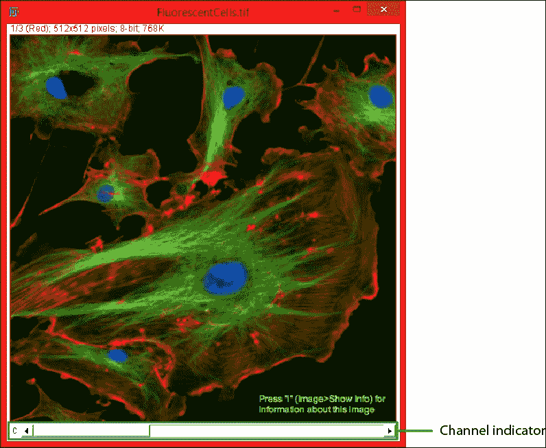

窗口看起来与**Boats**图像相似。然而，在图像窗口的底部还有一个条形。这个条形在左侧有一个字母**C**，表示它有多个通道。每个通道都有自己的 LUT，在这种情况下，是红色（通道 1）、绿色（通道 2）和蓝色（通道 3）。标题栏下方现在也显示了一些额外的图像信息。它显示了当前通道（1/3）和总通道数，文本的颜色表示通道的颜色。

这允许每个通道都有 16 位信息，从而在三个通道中总共可以有 48 位信息。ImageJ 内部可以无问题地处理这些文件，但大多数其他程序无法处理这些图像。在保存这些图像时，您可能需要将它们转换为不同的位深度，以便在其他程序中使用。

ImageJ 允许您使用查找表更改多通道图像的颜色。默认为灰色，但其他选项包括红色、绿色、蓝色、青色、品红色和黄色。还有多色 LUTs，它们在一系列颜色中编码强度：

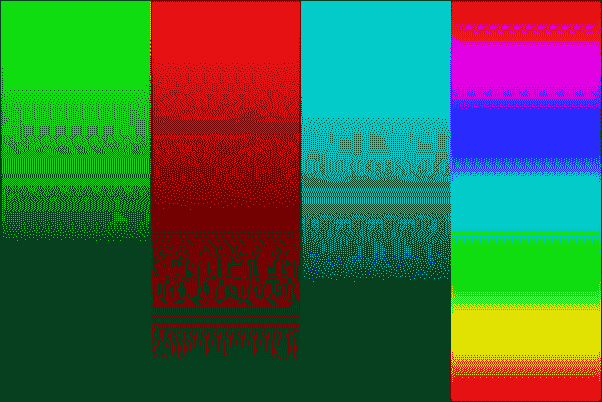

前面的图像展示了 ImageJ 中可用的各种查找表（LUTs）的几个示例：从左到右是绿色、红色、青色和光谱。

### Z 堆栈图像和体积

当使用显微镜或 MRI 机器制作光学切片时，生成的堆栈将包含三个维度（*X*、*Y*和*Z*）的信息。Z 堆栈中的每一张图像被称为一个切片。多个切片组成一个体积，可以在 3D 中可视化。这将在下一章中讨论。图像的外观将与多通道图像相同。然而，在滑块旁边将不再是**C**，而是**Z**，以表明堆栈包含切片。

### 时间序列

当以固定的时间间隔拍摄图像时，生成的堆栈将是一个时间序列，包含每个时间点的图像，称为**帧**。滑块的外观将略有不同。旁边不再是字母，而是一个小型的播放按钮。当您点击它时，时间序列将以时间序列获取的速度播放（如果堆栈已校准）。

### 多维图像

除了多个通道、帧（对于时间序列）和切片（Z 堆栈）之外，还可以将这三个维度组合成一个单独的图像文件：一个 5D 图像。如果您打开 **有丝分裂（26MB，5D 堆栈）** 样本图像，图像窗口底部将出现两个额外的滑块：

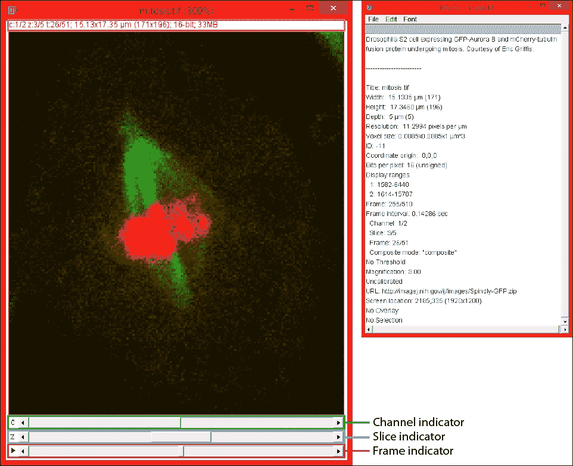

顶部滑块再次用于通道（由 **C** 表示），中间滑块用于导航切片（由 **Z** 表示），最后一个用于导航时间帧（由播放按钮 **►** 表示）。当您点击播放按钮时，时间序列将像电影一样开始播放，播放速度由帧间时间间隔决定。如果您想改变播放速度，您可以右键点击播放按钮。或者，您可以从菜单中选择 **图像** | **堆栈** | **动画** | **动画选项…** 并输入速度（以每秒帧数表示）。较大的值意味着更快的播放。

标题栏下方的栏，称为副标题，再次提供了额外的信息。它现在显示了所选通道（c:1/2）、切片（z:3/5）和帧（t:26/51）。这次，图片也是校准过的，副标题还显示了图片的尺寸（以微米表示，像素大小在括号中指示）。

## 提取图像和像素信息

如果您想了解更多关于图片的信息，您可以按 *Ctrl* + *I* （在 Mac 上为 *⌘*+*I*）来获取一个包含图片信息的新的窗口。如果您对 5D 图片这样做，您将得到之前图片右侧显示的信息。这显示了所使用样本的简要描述以及图片的尺寸（以校准单位微米和像素表示）。它还告诉您每个通道的位深度（每像素位数：16）以及所使用的帧间时间间隔（帧间隔：0.14286 秒）。

### 注意

默认情况下，使用控制键，或在 Mac 上的 *⌘*（命令）键作为快捷键是可选的。您可以通过转到 **编辑** | **选项** | **杂项** 来控制这一点。有一个标记为 **要求控制**/**命令键** 的复选框。当选中时，控制/命令键对于 ImageJ 中使用的 **快捷键** 是必需的。当一个快捷键需要 **Shift** 键时，无论设置如何，此键仍然是必需的！在这本书中，我将包括快捷键的控制/命令键。

要查看像素的值，您可以将鼠标光标放在感兴趣的像素上。在 ImageJ 主窗口的状态栏中，您可以查看以下信息：

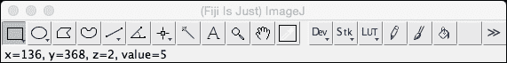

有关于像素位置的信息（*X* 和 *Y* 坐标，如果图像已校准，则为校准单位）以及值（强度或灰度值）。ImageJ 中的坐标相对于左上角（原点）。如果加载了 Z 栈，也会提供当前的*z*坐标。在下一章中，我们将探讨可以从图像中获得的其他测量值。

### 注意

**关于切片索引的注意事项**

注意，像素的给定值假设第一个切片是 0，而标题栏以下的信息假设第一个切片是 1。当你开始开发自己的宏和插件时，这种区别可能变得很重要！

## 加载和保存图片

让我们以下面几节来查看加载图片和序列。

### 加载图片和序列

正如我们所见，我们可以通过从样本中选择或转到**文件**菜单中的**导入** | **URL**来从 URL 加载图片。对于存储在磁盘上的本地文件，我们可以选择**文件** | **打开…**并浏览到包含我们的图片的文件夹。也可以将图像文件拖放到 ImageJ 主窗口中加载。如果你将整个文件夹拖放到 ImageJ 窗口中，该文件夹中的所有图片都将被加载。

如果你有一个包含单个图片的文件夹，你希望将其作为序列打开，你可以转到**文件**菜单中的**导入** | **图像序列…**。这允许你选择系列中的第一个图像文件，之后 ImageJ 将确定所有将被加载到单个图像窗口中的图像。可以使用正则表达式来限制导入的图像数量。

### 注意

**导入图像序列**

当导入一系列图片时，所有图片必须具有相同的类型（位深度）和相同的尺寸（宽度和高度）。如果任何文件具有不同的尺寸或位深度，导入将失败，ImageJ 将显示错误。如果同一文件夹中有其他应忽略导入的文件类型，请考虑将它们放在不同的文件夹中。或者，您可以在导入对话框的正则表达式字段中过滤它们。

图片加载完成后，窗口标题栏会显示文件名。当文件名特别长时，重命名窗口可能有益。可以通过从菜单中选择**图像** | **重命名…**或通过在图片上右键单击并从上下文菜单中选择**重命名…**来重命名窗口。

### 保存图片

ImageJ 允许你将图像保存为不同的文件类型。ImageJ 首选的文件类型是 TIFF，因为它允许存储额外的元信息、感兴趣区域的叠加和校准信息。ImageJ 支持多种图像格式。当你转到**文件** | **另存为**时，会显示一个图像格式列表。JPEG 和 PNG 格式是压缩格式。它们需要较少的磁盘空间进行存储。这意味着它们根据选择的压缩量需要更小的文件大小。TIFF 格式是无损格式，但它可以支持压缩。

保存图像时，重要的是要考虑保存的图像将用于什么目的。当你希望在以后量化图像或需要反复保存它时，不推荐使用有损压缩的文件格式，如 JPEG。每次将图像保存为 JPEG 文件时，都会损失一点质量。此外，JPEG 压缩针对的是平滑的颜色渐变，当应用于强度突然变化的荧光图像时，会产生伪影。以下截图显示了将图像打开并保存为 JPEG 文件 200 次后的示例。左侧是原始图像，右侧是保存的图像：

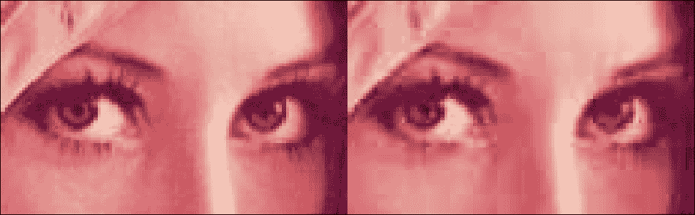

最明显的问题是眼睛周围，可以看到多个压缩伪影。在眼睛的白色部分，现在出现了原始图像中不存在的斑点。皮肤也显示出类似块状的模式。这是由于 JPEG 压缩基于 8 x 8 像素的块。在这种情况下，图像被放大到 200%，对于网页来说，这张图像可能仍然可以接受。然而，由于伪影，这张图像对于图像量化是不可接受的。当你需要多次保存图像，或者当你不确定需要进一步处理什么时，始终将图像保存为 TIFF 文件。如果你需要一个用于网页或演示的图像，你可以使用仅 8 位灰度或 RGB 图像，这些图像可以保存为 TIFF、JPG 或 PNG 格式。

## 图像校准

当你执行图像测量并且希望测量距离或面积时，你需要确保你的图像以适当的单位校准。对于 2D 图像或 3D 图像，你可以输入像素尺寸，对于时间序列，你可以输入帧之间的时间间隔。为此，你可以按*Ctrl* + *Shift* + *P*（在 Mac 上为*⌘* + *Shift* + *P*）来显示属性对话框。这允许你设置测量单位（例如，微米μm）和宽度、高度和深度的值。这些值表示每像素的单位数。对于时间序列，帧间隔可以输入为秒。当勾选**全局**复选框时，此校准将应用于所有打开的图像。

## 在 ImageJ 中查看图像

为了更详细地检查图像，我们可能希望使用 ImageJ 中可用的查看图像的一些工具。要显示可用的工具，让我们使用我们之前打开的**荧光细胞**图像。你可能首先想做的事情是查看图像的细节。这可以通过转到**图像** | **缩放** | **放大 [+]**或按**+**键来实现。当你放大时，光标的位置确定缩放的中心。当前缩放级别在图像标题栏中指示，最大缩放级别为 3200%。当你放大时，窗口会重新缩放，直到它不再适合桌面。当你放大超过这一点时，窗口大小保持不变，当前缩放的位置在左上角以叠加形式指示：

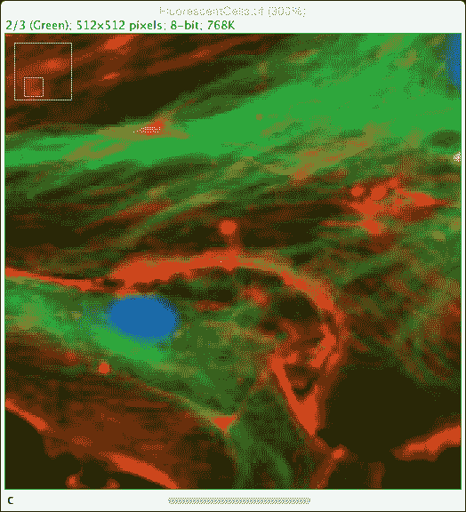

大的蓝色方块代表整个图像，而内部的较小方块表示当前缩放显示的位置（在这种情况下，位于图像的左下角）。要缩小视图，从菜单中选择**图像** | **缩放** | **缩小 [-]**，或者使用**-**键。

如果你注意到缩放后的图像显示了一些如图所示的伪影，请确保你已通过转到**编辑** | **选项** | **外观…**禁用了**插值缩放图像**，如第一章节所述：

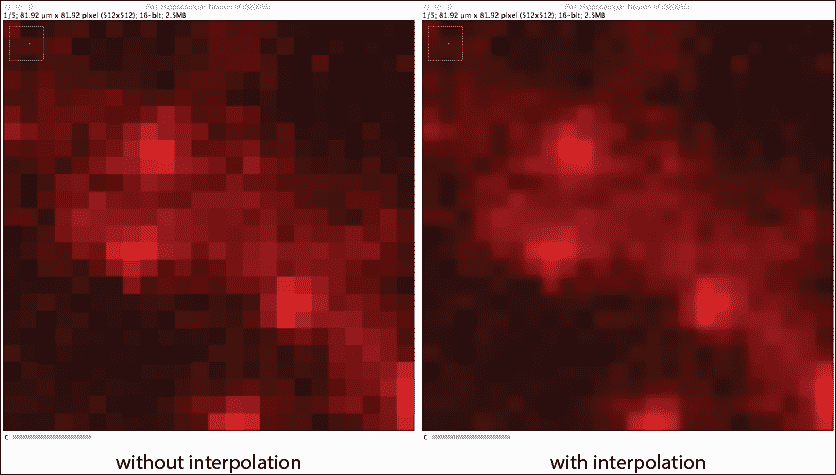

有时候，当你获取图像时，曝光设置可能不是最佳状态。这意味着你没有使用可用的所有灰度值范围。为了仍然看到信号，你可以调整图像的亮度和对比度。为此，从菜单中选择**图像** | **调整** | **亮度/对比度**，或者按*Ctrl* + *Shift* + *C*。这种调整是非破坏性的。它不会改变图像文件中的值，直到你在**亮度/对比度**对话框中按下**应用**按钮（对于 8 位和 16 位图像）。对于 32 位图像，**应用**按钮不起作用。如果你按下**重置**，值将恢复到初始值或按下**应用**后的值。如果你有一个曝光不足（暗）的图像，你可以通过降低**最大值**滑块或增加**亮度**滑块来使其变亮。

### 注意

**亮度/对比度调整和测量**

当你调整图像的**亮度/对比度**并应用它时，图像的灰度值将不可逆地修改。如果你仍然希望执行包括强度值的测量，应用这些修改将改变你的结果（也许，结论）。只有在创建用于非关键查看（演示）或测量长度或面积而不依赖于强度时才使用**应用**按钮。

### 查看多通道图像

当您有一个多通道图像时，您有时可能想隐藏某些通道以避免查看。ImageJ 允许您通过在菜单中选择**图像** | **颜色** | **通道工具…**或按*Ctrl* + *Shift* + *Z*来显示或隐藏多通道图像中的任何通道。每个通道都有一个复选框的对话框打开。当复选框被勾选时，该通道被显示。否则，它会被关闭（隐藏）。您还可以通过转到**图像** | **颜色** | **排列通道…**来更改通道的顺序。当调整多通道图像的**亮度/对比度**时，调整仅应用于当前显示的通道。当前选定的通道可以在标题栏直接下方的信息栏中检查。**亮度/对比度**对话框中直方图的颜色也反映了所选通道的颜色。

### 注意

**亮度/对比度调整和通道工具**

当您使用**通道工具**隐藏通道时，它们仍然可以通过**亮度/对比度**对话框进行修改。如果您在修改**亮度/对比度**时当前选定了隐藏通道，ImageJ 会进行调整，但这些调整是不可见的。在调整之前，始终要验证当前通道！

### 查看时间序列

当查看时间序列时，亮度和对对比度调整在时间序列的所有帧中都是可见的。如果您想应用调整，ImageJ 会询问您是想对当前帧还是对所有帧进行操作。当您将设置应用于所有帧时，调整对所有帧都是相同的，无论帧中的强度如何。这意味着这并不适用于显示荧光随时间减弱的时间序列（即漂白）。漂白是荧光成像的固有特性，会导致强度随时间降低。一般来说，这种效应遵循指数衰减趋势。Fiji 提供了一个选项，通过选择**图像** | **调整** | **漂白校正**从菜单中，来纠正这个漂白过程。对于大多数经历漂白的时间序列，选择**指数拟合**作为最佳校正方法。这种方法对来自非漂白源的强度变化更具鲁棒性。如果强度变化的原因不同，您可能想使用**简单比率**方法来校正时间序列。运行此校正会在新的图像窗口中显示校正后的数据，这意味着原始数据保持不变。

# 摘要

在本章中，我们讨论了 ImageJ 支持的不同图像类型。您还看到了如何从磁盘或从 URL 加载图像。我们研究了 ImageJ 中图像窗口的解剖结构和可以查看的信息。我们对图像进行了校准，以便进行长度和面积测量。最后，我们探讨了查看不同图像类型的不同方法。您学习了如何调整图像的亮度和对比度。

在下一章中，我们将探讨使用 ImageJ 界面执行基本处理步骤的方法。
