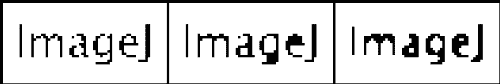
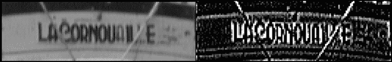

# 第四章：使用 ImageJ 进行图像分割和特征提取

上一章探讨了处理图像以查看和纠正采集中的缺陷。本章将介绍分割图像和提取与处理和分析相关的特征的技术。本章将涵盖以下主题：

+   图像分割

+   形态学处理

+   图像过滤和卷积

+   特征提取

# 图像分割

在图像分析的许多步骤中，将图像分成两个独立的（非重叠的）部分非常重要。这些部分通常被标记为背景和前景。一般来说，当我们分析图像时，背景是我们不直接感兴趣的图像部分。我们通常将分析限制在被认为是前景的图像部分。这种将图像分成两个部分的过程称为分割，主要是基于像素强度。如果您希望计数和测量特定类型的多个独特对象或测量单个复杂对象的强度，同时排除背景，这是很重要的。

## 图像阈值化

为了将图像分割成背景和前景，我们将设置一个阈值值。低于此阈值的值将被分类为一组，而值更高或等于阈值的像素将被分类为另一组。一般来说，荧光图像的背景包含接近黑色的值（即，深色背景），而明场图像的背景值更接近白色（浅色背景）。阈值化的输出是一个在 ImageJ 中称为掩模的图像，它是一个二值图像。其像素只有两个值（0 和 255）。

我们首先将探讨如何在灰度图像上执行基本的阈值化。之后，我们将探讨对彩色图像进行阈值化的可能性。这两种图像类型之间的区别在于，彩色图像没有一种简单的方法来设置阈值。每个像素包含三个值（红色、绿色和蓝色），而单个阈值值通常不能以有用的方式分割图像。

### 阈值化灰度图像

我们将从一个示例图像中获取一个灰度图像并对其进行分割。对于这个例子，我们将使用**Blob**图像。如果您想测量每个单独的 Blob 的大小以及获取图像中 Blob 数量的计数，阈值化将是第一步。请注意，对于像这个例子这样的小图像，计数可以手动完成。然而，如果您需要为大量图像执行此操作，这种手动计数方法将非常繁琐。

要设置阈值，请转到**图像** | **调整** | **阈值…**或按*Ctrl* + *Shift* + *T*。阈值对话框将打开，并带有几个选项：

对于荧光图像，需要选中**暗背景**复选框，而对于明场图像，则需要取消选中（除非您使用暗场照明方法）。可用的方法可以在左侧的下拉列表中设置。默认方法基于**IsoData**方法。**IsoData**方法根据以下程序确定阈值值：

+   为阈值 *T* 设置一个初始值

+   根据阈值 *T* 的值计算背景 (*BG*) 和前景 (*FG*) 像素的平均强度

+   如果步骤 *ii* 中 *BG* 和 *FG* 的平均值不等于 *T*，则增加阈值值 *T* 并重复步骤 *ii*

更多有关阈值化方法的信息和参考资料，请参阅 Fiji 网站上的[`fiji.sc/Auto_Threshold#Available_methods`](http://fiji.sc/Auto_Threshold#Available_methods)，以获取概述。右侧的下拉列表提供了显示阈值化效果的选择。当选择**红色**时，前景选择以红色显示，而背景保持为灰度。

一旦设置了阈值，您可以通过在阈值窗口中按**应用**或通过转到**编辑** | **选择** | **创建蒙版**来创建二值图像。前者将修改您的原始图像，而后者将打开一个包含阈值化图像的新窗口。原始图像中的红色部分（即高于阈值的值）现在是白色，而原始图像中的非红色部分（即低于阈值的值）现在是黑色。有时，阈值可能并不完美，在信号甚至不存在的地方有间隙或孔洞。您将在*形态学处理*部分学习如何处理这些问题。此过程的三个阶段如下面的图像所示：

左侧面板中的图像是原始图像。中间面板显示了带有红色前景区域的自动阈值。右侧面板显示了基于阈值创建的结果蒙版。

### 阈值化彩色图像

如前所述，彩色图像的分割更复杂。当谈到彩色图像时，区分 RGB 图像和多通道堆叠非常重要。后者可以使用上一节中描述的技术很好地进行阈值化。多通道堆叠可以看作是给定了特定 LUT 以呈现颜色的单个灰度图像。另一方面，RGB 图像稍微复杂一些。如果图像只包含红色、绿色或蓝色的像素，则可以将图像转换为多通道图像。

要分割具有更多颜色的 RGB 图像，您需要将图像转换为不同的颜色空间。要基于颜色选择前景，HSB 颜色空间更为方便。正如我们在第二章中看到的，*使用 ImageJ 的基本图像处理*，HSB 图像中的颜色信息是单独的通道，以灰度值编码。当您想在 ImageJ 和 Fiji 中设置 RGB 颜色图像的阈值时，会自动打开**阈值颜色**对话框：

默认情况下，它以 HSB 颜色空间打开，顶部图表显示了色调通道的分布。下方的两个滑块指示您希望选择的颜色。在这种情况下，选择了橙色。第二个面板显示了饱和度的控制。由于滑块位于最右侧，我们只选择了明亮的橙色。最后，底部第三个面板显示了亮度控制，亮度值从中等水平开始，覆盖了广泛的亮度范围。这个例子展示了如何选择特定范围的色彩。在这种情况下，阈值被设置为选择**小丑**样本图像中的头发：

如您所见，阈值并不完美。脸颊和鼻子附近的小区域也位于阈值内。此外，该区域中还有间隙，尤其是右眼周围和图像右上角。

阈值方法列表具有与标准 ImageJ 阈值对话框相同的方法，并且它仅在亮度通道上工作。**原始**按钮类似于灰度阈值对话框中的**重置**选项。**选择**按钮将阈值化区域转换为选择。**样本**按钮将使用图像的一部分来生成基于该区域的色调、饱和度和亮度通道的阈值。

# 形态学处理

在将图像分割成两个组件之后，您将得到一个掩码或二值图像。从示例中可以看出，这些掩码并不总是适合直接测量。图像中的不完美可能导致物体之间出现间隙或结构中的小不连续性。此外，某些区域可能被检测为前景，而实际上它们并不是真正感兴趣的对象。您可以通过将缺失的像素转换为白色或黑色来手动纠正这一点，分别包括或排除它们。在某些情况下，这可能是最可能的解决方案。然而，在许多情况下，有一些处理步骤可以系统地解决这些问题。这些步骤被称为形态学处理，我们将在下一节中更详细地探讨。

## 形态学算子

ImageJ 支持两种主要的形态学处理运算符：**腐蚀**和**膨胀**。它还具有填充孔洞、骨架化和分水岭处理二值图像的功能，这些将在后面的章节中讨论。这些功能将通过一些基本示例在即将到来的章节中进行解释。

### 腐蚀和膨胀

首先，我们将查看基本的运算符**腐蚀**和**膨胀**。腐蚀运算符会取一个前景像素（**FG**），并查看 3 x 3 邻域内的周围像素。根据 FG 像素的数量，像素将被改变为背景像素（**BG**），或者它保持为 FG 像素。膨胀运算符则相反。ImageJ 根据二进制选项确定像素是否改变，这些选项可以通过访问**处理** | **二值** | **选项…**来设置：

**迭代次数**决定了运算符重复的次数，**计数**决定了用于确定像素是否切换的阈值所使用的像素数量。**EDM 输出**决定了距离映射函数的结果写入的位置。当选择**覆盖**时，距离映射会覆盖遮罩图像中的像素。**腐蚀时填充边缘**决定了当像素位于图像边缘时是否进行腐蚀。当选择时，图像边缘将不会有腐蚀。

对于以下示例，我将假设迭代次数设置为`1`，计数设置为`1`，并且未勾选黑色背景。

1.  在 ImageJ 中打开`4909_03b_binary.tif`图像。它可在 Packt 网站上找到。

1.  使用默认方法，通过顶部滑块设置图像的阈值使用`0`，底部滑块使用`75`。不要勾选深色背景。

1.  选择**编辑** | **选择** | **创建遮罩**以生成一个新的图像，或在阈值对话框中按**应用**以覆盖原始图像。

1.  最后，选择遮罩图像，并按*Ctrl* + *Shift* + *I*来反转图像，使其具有白色背景。你现在应该得到以下结果（原始图像在左侧，遮罩在右侧）：

当你仔细观察被遮罩的图像时，你会注意到存在一些小问题。最值得注意的是，**二进制**和**ImageJ**中的字母**a**被分成三个不相连的部分。此外，字母**p**和**g**并不完全完整，有一个断裂但并未完全断开。对于人类来说，这并不是一个大问题。我们可以在脑海中轻松填补这些空白并阅读文本。然而，另一方面，计算机可能更难尝试解读文本。我们现在将探讨二进制运算符对这一遮罩的影响。你也会看到这如何解决我们碎片化字母的问题。

1.  选择蒙版图像，然后转到**处理** | **二值** | **选项…**以打开选项对话框。现在我们有了蒙版图像，将显示一些额外的选项，最值得注意的是**执行**下拉菜单和**预览**复选框。

1.  使用放大工具或键盘上的**+**键放大字母**a**。

1.  从**执行**下拉菜单中选择**腐蚀**，并勾选**预览**复选框，但不要按确定！

在预览模式下，你会注意到整个蒙版变成了白色，当你选择了腐蚀操作时，文本完全消失了。当你增加**计数**字段中的值时，你将开始注意到文本的部分开始恢复。当值为`3`时，一些像素可见，而值为`7`或`8`则几乎保留了所有文本。当值设置为`8`时，腐蚀操作的唯一受害者是字母**a**的孤立像素。所有其他像素保持完好，但这个孤立像素被移除了。这是腐蚀操作最常用的应用之一——移除由图像中的噪声引起的孤立单个像素。

### 注意

当使用**腐蚀**时，可以移除孤立像素，但整个蒙版会变得更小，从而减少了我们想要测量的区域。在**腐蚀**操作之后直接使用**膨胀**（或使用**开运算**），我们可以在保留我们想要测量的区域的同时移除孤立像素。一旦由于**腐蚀**而丢失前景像素，它就永远无法返回，无论你使用多少次**膨胀**！

现在，从**执行**下拉菜单中选择**膨胀**，将**计数**设置为`1`，看看效果如何。当你使用膨胀操作时，文本会变得更粗，但它也会填充字母中的间隙。这种结果更有用。然而，这里有几个问题。字母**g**的底部尾巴以及字母**e**的开口现在被填充了。通过将**计数**增加到`2`，这个问题得到了改善，字母**e**以及字母**g**的尾巴再次打开。当**计数**为`2`时，**膨胀**修复了碎片问题。然而，我们的字母现在变得非常粗，一些字母合并了。看看单词**ImageJ**中的**eJ**。字母**e**的尾巴直接连接到字母**J**的尾巴。我们现在想采取两个步骤。首先，我们想要膨胀蒙版以填充间隙，然后，我们想要腐蚀蒙版以去除连接的字母。对蒙版连续执行操作可以完成这种组合。首先，我们将膨胀蒙版，然后我们将腐蚀结果。然而，还有一个特殊功能可以按此顺序执行这两个步骤，称为**闭合**。如果你想按相反的顺序执行步骤（先腐蚀然后膨胀），可以使用**开运算**。

当你在下拉菜单中选择**闭运算**选项时，你可以看到这个动作的结果。结果是 OK，但并不那么出色。在这种情况下，结果并不那么好的原因是我们在每个步骤中使用了不同的**计数**值。**膨胀**操作在我们使用`2`时效果最好，而**腐蚀**操作在`7`或`8`时效果最好。对于这个例子，最好以每个步骤中特定的计数值连续执行**膨胀**和**腐蚀**操作。在以下图像中，**闭运算**使用了`2`的计数值，而**膨胀**和**腐蚀**的连续操作分别使用了`2`和`5`（左侧图像是原始掩码）：

如中间和右侧面板所示，两种方法都有其优点和缺点。**闭运算**（中间面板）填充了字母**e**，并且仍然有一个孤立的像素是字母**a**的一部分。然而，字母本身仍然有很好的细节。手动连续膨胀/腐蚀步骤（右侧面板）保留了字母**e**中的孔以及字母**g**的细节。然而，字母**a**的细节不太明显。具体来说，*衬线*（字母**a**右下角的小钩）完全丢失了。

### 骨架化和分水岭

在使用**膨胀**、**腐蚀**、**开运算**和**闭运算**处理掩码后，我们可能希望将掩码简化到最基本特征。我们之前分割的字母的核心是由笔画构成的。每个字符由一组不同方向的笔画组成，这些笔画共同定义了字符。在 ImageJ 中，我们可以使用骨架化功能来重新创建这些笔画，该功能可以通过在菜单中选择**处理** | **二值** | **骨架化**来找到，或者通过在二值选项对话框的**做**下拉菜单中选择它。**骨架化**会检查每个像素的邻居，如果像素被其他前景像素包围，则会移除该像素。这导致将掩码简化为单像素宽度的掩码。

将闭运算（左侧面板）和连续膨胀/腐蚀（右侧面板）操作的结果应用于掩码，结果如下：

**闭运算**操作的结果（左侧面板）并不令人满意。字母**e**无法识别，看起来更像字母**c**。连续的膨胀/腐蚀操作（右侧面板）由于骨架化操作而略有改善。尽管字母看起来有点滑稽和摇摆，但所有重要的笔画都存在。

分水岭功能将分离接触的物体。我们将通过使用连通区域样本图像来查看此操作的效果。你也可以将其应用于文本示例。然而，文本示例中的问题是物体需要连接而不是分离。

1.  从样本图像中打开**连通区域**图像。

1.  使用**默认**方法设置阈值，不勾选**暗背景**框，然后点击**应用**以创建掩码。

1.  现在，从菜单中选择**处理** | **二值** | **分水岭**。

结果将如下所示，左侧为原始掩码，右侧为分水岭操作的结果：

如所示，四个连通区域被分割成两个独立的对象。此操作寻找被挤压的区域。当一个物体在两个较厚的部分之间有一个狭窄的部分（类似于数字 8 的中间），它将沿着狭窄部分被分割。然而，请注意，这并不适用于某些连通区域（用蓝色矩形表示）。当轮廓没有挤压时，分水岭算法不会分割物体。如果你知道物体可以重叠，并且想要量化物体的数量时，这将非常有用。然而，如果你想要测量物体的大小或面积，可能会遇到问题。因为重叠区域无法准确测量，重叠物体的测量值将低估实际大小。这个问题可以通过假设物体具有规则形状（如椭圆形）来解决，但在许多情况下这可能不成立。在 ImageJ 中，可以使用颗粒分析器使用这个后者的假设，这将在第五章，*使用 ImageJ 的基本测量*中讨论。解决这个问题的最好方法是确保重叠量减少，这可能需要改变你的样本制备或采集。

# 图像滤波

上一节探讨了使用阈值分割前景和背景的方法。它还探讨了使用形态学算子得到适合分析的结果的方法。形态学算子被用来通过去除孤立像素来清理阈值的结果。在大多数实际应用中，这些孤立像素是由于图像采集系统中的噪声效应造成的。一些噪声可以使用上一章中描述的技术去除，但这可能不会去除所有噪声。在本节中，我们将探讨使用过滤器去除噪声并准备图像以创建掩码的方法。滤波可以是插入在阈值和形态学处理之前的一个步骤。如果你的图像对比度很高且噪声水平极低，这可能不是必需的。然而，这种情况相对罕见。

根据用于滤波的域类型，滤波可以分为两类。图像可以在两个不同的域中看到：**空间域**和**频域**。对人类来说最易识别的是空间域。这是我们通过相机认识到的图像。空间中的每个位置都有一个值，由具有不同值的紧密排列的位置区域组合形成的图像。如果所有值都相同，图像将呈现为单一颜色或灰度均匀。在数字图像的情况下，位置由构成图像的像素指定，值以灰度值或 RGB 值表示。

频域对人类来说不太容易识别。频域中的图像是通过值的改变率或频率来表示的。人类通过光波的波长来识别频率。频率较高的光看起来是蓝色/紫色，而频率较低的光看起来是橙色/红色。然而，在图像处理中，图像的频率是由图像中像素强度变化的方式决定的，而不一定是像素的颜色。我将从频域滤波开始，因为这更为复杂。请注意，图像处理的大部分滤波都是在空间域中进行的，并且效果非常好。

## 频域滤波

图像滤波基于 1822 年由约瑟夫·傅里叶描述的变换技术。这种变换将一个域中的数据转换到另一个域，然后再转换回来。对于图像处理，这种变换是从**空间域**到**频域**的转换。空间域考虑点位于空间中，要么是平面（2D），要么是体积（3D）。每个点的位置都有一个强度值，对于大多数图像，这个值会随着不同位置而变化。强度沿一个维度变化的速率决定了频率。看看这张人工图像：

如果我们观察图像宽度方向以及中间图像高度方向上的强度轮廓，我们会得到以下结果（水平轮廓在左侧，垂直轮廓在右侧）：

从这些图中很明显可以看出，强度变化率存在明显的差异。水平轮廓（左侧）显示了强度随距离的快速变化，而垂直轮廓（右侧）则完全没有变化。另一种描述方式是，水平轮廓上的频率较高，而垂直轴上的频率较低。

傅里叶变换将计算空间域中的频率，并将它们作为*x*和*y*方向上的频率绘制出来。变换的思想基于这样一个事实，即任何信号都可以描述为不同频率的谐波函数（即正弦和余弦函数）的（无限）和。这些频率由正弦和余弦的系数表示，ImageJ 以灰度值的形式在图像中显示这些系数。我们可以通过从菜单中选择**处理** | **FFT** | **FFT**来获得人工图像的傅里叶变换，即**快速傅里叶变换**（**FFT**）：

图像的中心（即原点）的频率为 0，而通过原点的水平线代表图像的*x*轴上的频率。象限中的值决定了图像对角线上的频率。靠近图像中心的值代表低频率，而靠近边缘的值代表较高频率。由于图像沿*x*坐标的变化只有频率的变化，因此变换后的图像只显示垂直线。如果模式是斜的，变换后的图像中的线条也将是斜的。

### 注意

变换后的图像中线条的虚线外观是由输入图像不是正方形造成的。宽度是 512，但高度只有 128 像素。如果图像是 512 x 512 的正方形，变换后的图像将只显示通过原点的*x*轴上的一行点。如果你将样本图像的高度减半，虚线将大约变为两倍长。

当我们使用 FFT 图像作为输入时，我们可以通过从菜单中选择**处理** | **FFT** | **逆 FFT**来创建原始图像：

注意，由于我们使用了 FFT 和立即的逆 FFT，实际上我们没有应用任何滤波。变换前后的图像是相同的。这是变换的一个非常理想的特点，因为这意味着变换是无损的。在过程中没有丢失任何信息。要实际滤波图像，我们需要通过修改变换图像中的像素值来修改变换后的图像。

要应用一些（粗略的）滤波，我们将采取以下步骤：

1.  选择变换后的图像。

1.  从菜单中选择**编辑** | **选择** | **指定…**并输入以下值：**宽度**为`255`，**高度**为`255`，**X 坐标**为`0`，**Y 坐标**为`0`。然后，按**确定**。

1.  通过从菜单中选择**图像** | **颜色** | **颜色选择器**或按*Ctrl* + *Shift* + *K*键在键盘上打开颜色选择器。

1.  确保通过点击颜色选择器右下角的小黑白方块图标将前景设置为黑色。

1.  现在，通过转到**编辑** | **填充**或按*Ctrl* + *F*来用黑色填充我们指定的选择区域。

1.  重复步骤 2 和 5，但现在，指定选择区域的*X*和*Y*坐标为`257`。

1.  最后，从菜单中选择**处理** | **FFT** | **逆 FFT**以生成滤波后的图像。

如果你遵循了指示，你的 FFT 图像将如下所示：

逆 FFT 图像将如下所示：

如在逆 FFT 图像中所示，经过操作前后存在显著差异。例如，垂直方向上的频率不同。现在，每根条形图从上到下强度都会发生变化。尝试相同的程序，但这次在步骤 2 中，使用以下参数指定选择区域，并跳过步骤 6：

+   **宽度**: `64`

+   **高度**: `512`

+   **X 坐标**: `272`

+   **Y 坐标**: `0`

在用黑色填充选择区域并计算逆 FFT 后，图像将如右面板所示。你已特别从频率域中移除了一小部分频率。在计算逆 FFT 后，你将得到以下结果（左上角缩放区域）：

在左侧，你看到的是原始图像，在右侧是滤波后的图像。由于选择和移除的区域涉及低频，高频保持不变，导致沿水平轴的强度值变化更大。

由于这个例子非常人为，这里的结果不一定适用于分析。然而，如果你有一个被高频强度变化（例如，成像噪声）损坏的图像，你知道你必须移除 FFT 变换边缘的频率。另一方面，如果你有一个强度变化的缓慢梯度（例如，不均匀照明），你需要移除 FFT 变换中的低频。使用黑色移除频率，你正在创建一个排除你选择覆盖的频率的滤波器。如果你用白色填充选择区域，你会包括所有被选择覆盖的频率。在下一节中，我们将探讨空间域中的滤波，这稍微更容易应用。

## 空间域图像滤波

在空间域中进行滤波涉及使用一个滤波器，通常称为**核**。这个滤波器通过一种称为**卷积**的方法转换每个像素。卷积包括取一个中心像素及其周围的小数组像素（通常是 3 x 3），并将这些像素的强度与核中定义的权重相乘。乘积的总和将成为中心像素的新强度。在以下示例中，有一个图像的一部分（左侧），核（中间），以及卷积的结果（右侧）：

中心像素（橙色突出显示）及其 3 x 3 邻域内的周围像素与核（中间）相乘。卷积的结果显示在右侧。中心像素的值原本是 128，但卷积后变为 78。在这个示例中显示的核是一个简单的平滑滤波器（也称为**方框**滤波器）。这个滤波器的主要效果是平均像素，导致图像模糊。以下图像是“Boats”样本图像的细节，在卷积前（左侧）和卷积后（右侧）：

当你将滤波器大小更改为 7 x 7 时，平滑的效果将会更强烈，因为更多的邻域像素将影响中心像素的值。当使用 7 x 7 大小的方框滤波器时，每个权重将等于 1/49。相同图像的结果将如下所示：

注意到滤波几乎完全平滑了字母，使它们难以辨认。方框滤波器充当低通滤波器——图像中只有低频部分会保留。这是由于快速变化的强度会被方框滤波器比低频更强烈地平滑掉。尽管这种滤波发生在空间域中，但效果也会在频域中反映出来。

要重新创建前面的图像，请在样本图像中的“Boats”图像上按照以下步骤操作：

1.  从菜单中选择**处理** | **滤波器** | **卷积…**，并在打开的对话框中的文本字段中删除所有内容。

1.  输入三个用空格分隔的 1，然后按回车。重复此操作两次。

1.  确保选中了**归一化核**复选框，然后按**确定**。

1.  现在图像看起来稍微不那么清晰了，因为它已经与一个 3 x 3 的方框滤波器进行了卷积。

如果你想要使用一个 7 x 7 的方框滤波器进行卷积，只需输入七行，每行七个用空格分隔的 1，然后在新建的“Boats”图像上重复这些步骤，以查看核大小的影响。

### 注意

当将核应用于已经卷积过的图像时，效果会比图像尚未卷积时更大。当连续两次使用 3 x 3 箱形滤波器时，效果等同于运行权重为每像素 1/81 的 3 x 3 箱形滤波器（*1/9 * 1/9*）。

使用核进行滤波的结果取决于您指定的权重值和核的大小。通常，根据其权重的总和，可以将核分为两种类型。当一个核中权重的总和为 1 时，该核被称为归一化核。归一化核的优势在于卷积的结果不会超过图像位深允许的最大像素值。当在**卷积**对话框中勾选**归一化核**复选框时，ImageJ 将自动处理归一化。非归一化核可能会出现夹断伪影。当一个核的权重总和超过 1 时，卷积的结果可能会超过最大允许值（即 8 位图像的 255）。当这种情况发生时，变换后的值将被夹断在最大值。这种夹断可能会导致如白色像素块等伪影。

箱形滤波器是一个非常简单的滤波器，但它不会在图像中区分任何特征。它在所有方向上均匀平均。其他滤波器实际上可以增强图像中的某些特征。这类滤波器的例子是**墨西哥帽**滤波器。这个滤波器强调中心像素相对于周围像素：

墨西哥帽滤波器形状有点像墨西哥草帽，因此得名。它使得高对比度区域变亮，而均匀强度的区域变暗。应用于**Boats**图像，结果如下：

立即引人注目的是字母边缘被极大地强调。这很合理，因为对比度相对较强。这些是黑色字母，背景主要是均匀的浅灰色。唯一不清晰可辨的边缘是字母接触的点以及绳索隐藏字母部分的地方。你可以想象这个过滤器也可能对文本示例和前面提到的 blob 分割效果很好。它基本上作为一个高通滤波器工作。只有强度变化快的区域被强调，而强度变化慢的区域（即低频）被减少。

除了手动输入核权重外，ImageJ 和 Fiji 还有一些常见的滤波器核，可以通过访问**处理**|**滤波器**来获取。最常用的两个滤波器核包括**高斯模糊…**和**均值…**滤波器。后者与方滤波器相同。前者类似于墨西哥帽滤波器。然而，它不使用核中的负值。**高斯模糊**滤波器平滑图像的方式与方滤波器相同，但它以更渐进的方式完成。**高斯模糊**的优势在于，当你应用它时，可以产生更少的伪影。滤波器在频域的响应也更好，这使得结合空间域和频域滤波成为可能。

接下来，我们将探讨一些可以用于检测图像中可能对处理相关的特定特征的算子。这些算子也使用卷积，但它们与前面描述的滤波器具有不同的特性。

# 特征提取

如我们在前面的章节中看到的，可以使用滤波器通过滤波器隔离不同的频率。通过将图像与墨西哥帽滤波器卷积，可以保留高频，而使用方滤波器则产生相反的效果。本节中滤波器与上一节中滤波器的区别在于特异性。墨西哥帽滤波器没有方向偏好。当存在具有尖锐对比度（强度快速变化）的边缘时，滤波器有强烈的效果。然而，有时你只对特定类型的边缘感兴趣。假设我们只想检测垂直边缘。墨西哥帽滤波器将给我们所有方向的边缘，而不仅仅是垂直的。这将是下一节的主题。

## 边缘检测

要检测仅垂直的边缘，我们需要创建一个强调垂直方向的像素的核。以下核可以检测不同方向的边缘：

要执行**Sobel 边缘**检测，您可以使用**处理**菜单中的**查找边缘**命令。此命令将在图像上运行水平和垂直的 Sobel 核。

最后，还有用于边缘检测的**Canny 过程**，它涉及五个步骤。此过程由 John F. Canny 开发，包括以下步骤：

1.  应用高斯平滑以去除噪声。

1.  使用边缘检测在图像中检测梯度。

1.  使用类似墨西哥帽的核通过卷积细化边缘。

1.  应用两个不同的阈值来确定弱边和强边。

1.  移除那些未连接到强边的弱边。

前三个步骤涉及依次使用不同的核进行平滑、边缘检测和边缘细化。请注意，如果图像因噪声而退化，则第一步是必需的。如果对比度高且没有噪声，则可以跳过这一步。这一步也是整个流程中最薄弱的点。噪声和边缘都是高频信号的形式，高斯滤波器对两者进行同等程度的平滑。如果存在噪声，那些在保留边缘的同时专门减少噪声的技术应该会显示出显著的改进。

# 摘要

在本章中，我们探讨了将图像分离为前景和背景的方法。我们看到了在灰度和彩色图像中设置阈值的不同方法。我们应用了空间域和频域中的滤波来帮助清洁图像并提取边缘以供进一步处理。所有这些步骤都将帮助我们，当我们希望测量图像中的对象时，这是下一章的主题。
