# 第五章. 使用 ImageJ 进行基本测量

在上一章中，我们看到了如何执行一些预处理步骤，这些步骤为测量和分析图像数据做好了准备。在本章中，我们将更详细地查看 ImageJ 中可用的测量系统。你还将学习如何创建一些运动和动态的视觉表示。本章将探讨以下主题：

+   选择和区域

+   ROI Manager

+   柱状图和线形图

+   区域和线选择

+   半定量共定位

+   粒子分析

# ImageJ 中的选择和区域

我们将首先查看 ImageJ 中可用于选择**感兴趣区域**（**ROIs**）的工具。如果你只想处理图像的一小部分，这些工具可能很有用。ROIs 是 ImageJ 中的一个非常重要的元素，还有一个专门的管理器来处理 ROIs：**ROI Manager**。可以通过转到**分析** | **工具** | **ROI Manager…**来打开它，这将打开以下窗口：

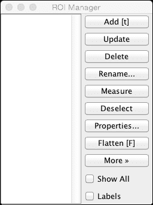

在左侧，有一个将包含 ROIs 的列表，而在右侧，有几个按钮将对 ROIs 执行某些操作。右下角底部的复选框允许用户一次性查看所有区域（**显示所有**），而**标签**复选框则在图像中显示区域标签。

ImageJ 支持不同类型的区域。它们可以分为两大类：**区域选择**和**线选择**。第三种单一类型是**点 ROI**，它只有一个成员。当用于测量时，可测量的参数略有不同。面积只能用区域类型的 ROI 来测量，而角度只能用线选择来测量。

首先，我将讨论 ImageJ 支持的几种常见选择类型，然后我们将应用它们进行测量。

## 区域选择

ImageJ 中的区域选择包含不同类型，具有不同的属性。以下是在 ImageJ 中可用的类型：

+   矩形

+   椭圆

+   多边形

+   自由手绘

矩形通常用于选择裁剪图像的区域或用于矩形对象。如果你的图像包含更多有机形状，如椭圆形或多边形区域，则更合适。这些类型可以通过在 ImageJ 程序的工具栏中选择适当的工具添加到图像中。然后，你可以左键单击并拖动鼠标来包围你想要选择的区域，然后释放鼠标按钮。设置选择后，你可以按 ROI Manager 上的**添加**按钮（或按*Ctrl* + *T*）将区域添加到 ROI Manager。

### 注意

如果你转到**编辑** | **选项** | **杂项…**时未取消**要求控制/命令键用于快捷键**选项，则只需按字母*T*即可将 ROI 添加到管理器。

当区域添加到区域管理器时，可以将其保存到文件中以便以后保存。当多个区域添加到区域管理器，并在尝试保存区域时选择其中一个时，只有选定的区域将被保存。如果你希望一次性保存所有区域，请按**取消选择**以取消选择所有区域。或者，你可以在选择**更多** | **保存**从区域管理器之前，使用*Ctrl* + *A*选择所有区域。

### 注意

单个区域将保存为具有`.roi`扩展名的文件。多个区域将保存为`.zip`文件中的区域集。这个压缩归档包含单个`.roi`文件，每个选择一个。在 Windows 上，默认隐藏已知文件类型的扩展名。因此，要查看扩展名，你可能需要取消选中文件夹选项中的**隐藏已知文件类型的扩展名**选项。

在添加额外的区域时，选择区域管理器中的**显示所有**复选框可能很方便。这将显示列表中当前的所有区域。在区域管理器中点击区域可以设置活动区域。它总是以你在选项中设置的颜色显示（参考，第一章, *使用 ImageJ 入门*)，在角落有小白方块：

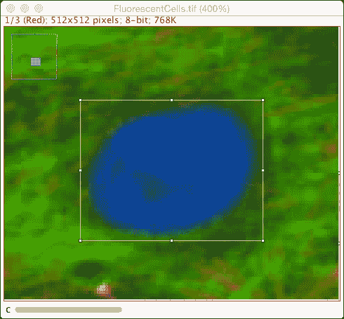

这些小方块是控制点，可以用来移动和调整区域的大小。如果你通过调整大小或定位修改区域，按下区域管理器上的**更新**按钮将更新列表中的区域。要调整大小，点击并拖动其中一个方块到新位置，然后释放鼠标按钮。如果你在拖动手柄时按住*Shift*键，形状将变为等宽等高的正方形或圆形。如果你在点击控制点时按住*Ctrl*键（或在 Mac 上按*Cmd*键），区域将在中心周围等宽等高增长。如果你在调整大小时按住*Alt*键，另一侧的手柄将保持在固定位置，同时调整区域大小，保持长度与宽度的比例相等。如果你按住*Alt*键并创建一个与先前区域重叠的区域，将形成两个区域重叠部分的减法。相反，如果你在创建与先前区域重叠的新区域之前按住*Shift*键，你将创建两个区域重叠部分的并集：

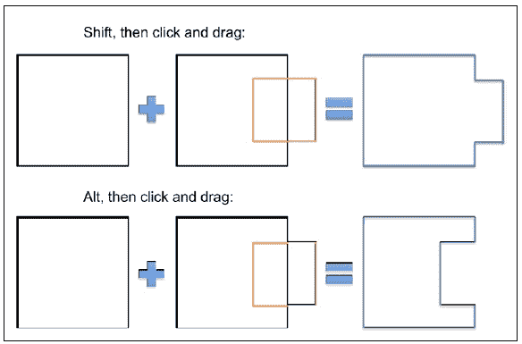

在拖动的同时按下两个键的组合也可以实现同时调整大小效果。要移动一个区域，将光标移至区域内部，然后点击并拖动区域到新位置。在点击和拖动区域之前，确保光标形状为箭头——而不是手形或十字准星。对于小区域，你可能需要放大才能移动区域。如果光标接近控制点，它将变为调整大小模式。

一旦放置并添加到 ROI 管理器中，在 ROI 管理器中点击**测量**按钮或使用*Ctrl* + *M*键盘快捷键将测量区域。要选择要测量的参数，请转到**分析** | **设置测量…**以选择参数：

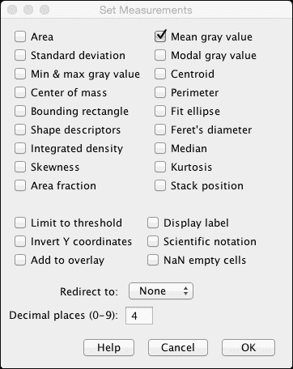

**平均灰度值**是区域内的平均强度，而**面积**则测量区域的面积，单位为图像单位。一旦你在 ROI 管理器中点击**测量**，就会打开一个包含测量结果的新窗口。此窗口显示结果。一些不同的测量将在**面积选择和测量**部分中解释，我们将使用它们从我们的图像中提取有用信息。

## 线选择

线选择包含以下类型：

+   直线

+   分段线

+   角度工具

ImageJ 以类似的方式处理这些选择类型。然而，它们可以用于不同的测量。最常用于线段的函数之一是沿线或分段线绘制轮廓图。另一个选项是创建**光栅图**。这两个选项将在接下来的章节中演示。

## 点选择

第三种选择类型只包含一个工具：点工具。它只选择一个像素，主要用于计数或标记物体的中心点。点选择的优点是只需单击一次即可放置。然而，可以获得的测量结果仅限于*X*和*Y*坐标以及强度。

# 基本测量

我们现在将探讨一些可以用来从数据中测量特定参数的技术。对于这些测量，我们将使用 ROI 管理器和几种不同类型的区域来选择和测量强度、速度和其他有趣的事物。除了测量之外，区域还可以用于与处理和图像处理相关的其他目的。选择的一个有用应用是，它们可以用来限制某些处理步骤仅应用于所选区域，而未选择的像素不受影响。还将演示一些这些应用的例子。

## 面积选择和测量

我们将使用面积选择开始一些基本测量。我们将使用这些来测量一些基本参数，如面积、周长（或圆周），等等。我们将从最基本的面积选择开始：矩形。

矩形选择对于裁剪图像区域非常有用。通过减小图像的大小，可以减少所需的内存以及复杂算法的处理时间。矩形选择的另一个良好用途是将较大图像的处理限制在特定区域。一些 ImageJ 算法和工具可以在活动选择内工作。我们将在第九章 中看到一个此类应用的例子，即 *创建用于分析的 ImageJ 插件*。由于矩形的简单性，如面积和周长之类的测量实际上并不相关。你可以非常容易地使用宽度和高度来计算矩形的面积和周长。因此，我们将关注矩形选择的一些更有用的应用。

首先，让我们使用矩形选择来通过反转其灰度值来修改图像的一个小部分。为了开始一个例子，从样本图像中打开 **Blobs** 图像。我们将使用以下步骤来反转单个区域的查找表（LUT）：

1.  使用矩形选择工具在图像中选择一个区域。

1.  选择一个区域后，按 *Ctrl* + *Shift* + *I* 来反转查找表（LUT）。

1.  使用 *Ctrl* + *Shift* + *A* 来清除所有选择，并再次使用 *Ctrl* + *Shift* + *I* 来反转查找表（LUT）。

在这个小练习中，我们只关注修改所选像素，而选择区域外的像素保持不变。如果没有像素被选择，**反转 LUT** 命令将对所有像素起作用。这是一个如何使用面积选择来限制处理仅限于所选像素的例子。同样的方法也适用于其他面积选择。你也可以使用这种方法来突出显示图像的特定部分，使其突出。例如，在下面的 kymograph 示例中，我们可以通过创建一个方形选择并仅反转该时间段内的 LUT 来显示在刺激期间获取的线条。

### 椭圆形选择

ImageJ 有两种用于圆形形状的选择类型：**椭圆**和**椭圆形**。这两种类型之间的区别很微妙，但椭圆形选择只能沿 *x* 或 *y* 轴进行形状调整。另一方面，椭圆可以自由旋转。要创建一个圆形，在创建椭圆形选择时按住 *Shift* 键，以强制 ImageJ 创建具有相等宽度和高度的圆形。椭圆形选择的另一个重要属性是其形状描述符。ImageJ 在其测量中报告的形状描述符是圆形度（Circ.）、圆度（Round）、纵横比（AR）和密度（Solidity）。圆形度定义为如下：

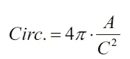

在这里，*A* 代表面积，而 *C* 代表周长。圆度定义为如下：

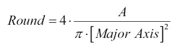

在这里，主轴是椭圆的最大直径。长宽比是椭圆的主轴和副轴之间的比率。实心度定义为面积除以该区域的凸包。实心度对于不规则形状很有帮助。凸包是可以在不与对象相交的情况下围绕对象拟合的最小曲线。它可以被视为尝试将弹性带拉伸到对象周围以完全包围它。对于椭圆或椭圆形状的对象，此参数不会添加任何信息。

让我们看看绘制几个椭圆和椭圆并测量它们的形状描述符时的一些结果。以下是椭圆选择（图像左侧）和椭圆选择（图像右侧）的一些示例：

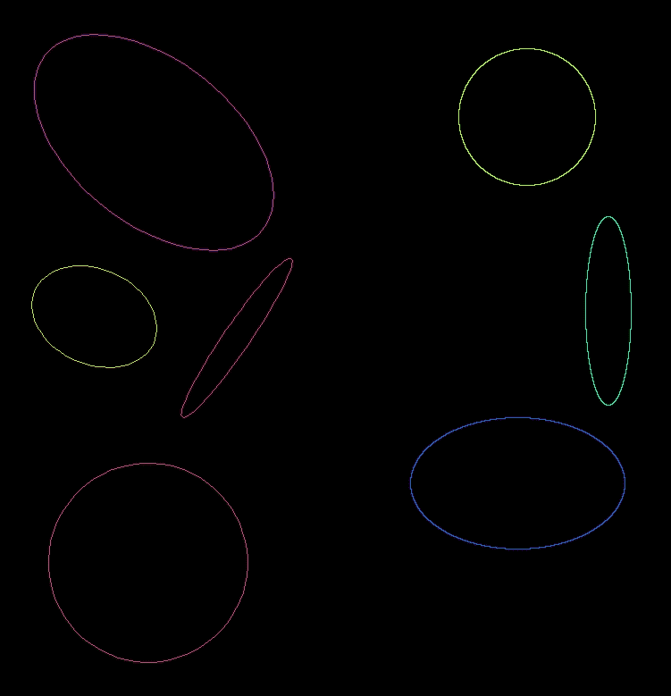

圆度为 1.00 的形状被涂成橙色（椭圆）和浅绿色（椭圆）。红色椭圆的圆度非常低（0.28），而青色椭圆的圆度介于中等（0.48）。当尝试检测粒子时，此圆度参数将非常有用，因为它是一个使用单个值对形状进行基本描述的非常基本的描述。圆形物体将具有值为 1，而扁平的椭圆将具有接近 0 的低值。

您还可以使用椭圆工具创建一个环形选择。通过制作两个圆，一个比另一个大，然后移除较小的圆来实现。以下步骤将创建一个环形选择：

1.  首先在您想要选择的物体上创建一个较大的圆圈，然后按 *Ctrl* + *T* 将其添加到 ROI 管理器中。将圆圈的大小设置为 20 x 20 像素。

1.  要创建内圆，您可以使用椭圆工具添加一个新的圆。然而，它可能不会居中。要创建一个居中的内圆，我们将选择外圆，并从菜单中选择 **编辑** | **选择** | **放大…**。

1.  输入 `-5` 的值以将圆缩小到新的 10 x 10 像素圆，然后按 *Ctrl* + *T* 将其添加到 ROI 管理器中。

1.  要创建环形，请在 ROI 管理器中选择两个圆。

1.  在 ROI 管理器中选择两个圆，然后选择 **更多** | **XOR**。这将生成环形。要添加新的选择，请按 *Ctrl* + *T*。

注意，以这种方式创建环形将迫使新的区域选择变为“像素化”。该区域的轮廓将与像素网格对齐，而不是 ImageJ 生成的 ROI。您也可以在创建内圆时按住 *Alt* 键来创建环形。然而，正确对齐两个圆可能很困难。

### 多边形选择

其他类型的区域选择是多边形选择和自由手选择。它们允许选择更多有机形状。要创建多边形选择，选择工具并通过左键单击，可以向多边形添加点。每个点通过一条直线（顶点）连接，通过双击或左键单击第一个点，多边形闭合并转换为区域选择。如果右键单击，多边形工具将在您单击的点处添加一个点，并同时闭合多边形。多边形至少需要三个点。这个工具有助于选择不规则形状，例如在**块**示例中：

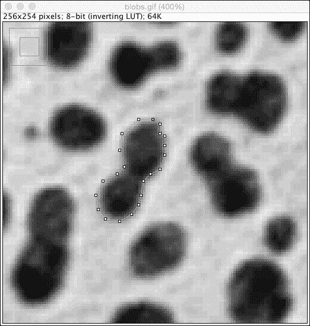

对于这种不规则形状，多边形工具更适合仅选择块。使用自由手工具也可以达到类似的效果。然而，可能更难精确选择。自由手工具通过左键单击并按住按钮，在鼠标拖动形状周围时工作。

创建不规则区域选择的另一种方法是使用魔杖选择工具。这个工具在其他图形程序（如 Photoshop 和 Gimp）中的魔杖工具工作方式相同。它选择与单击像素具有相同强度或颜色的像素。要选择样本图像中的块，我们可以按照以下步骤操作：

1.  从工具栏中选择**魔杖工具**。

1.  左键单击一个块。这将创建一个选择。

1.  通过双击魔杖工具按钮更改选择的公差，并将**公差**设置为`60`。然后，按**确定**（见以下截图）。

1.  左键单击相同的块以查看公差设置对选择的影响：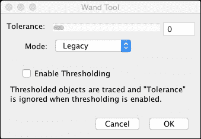

魔杖工具允许我们设置公差，这意味着相对于所选像素落在公差范围内的值将被包括在选择中。`0`的值仅考虑与像素完全相同的像素。当启用阈值时，公差将被忽略（基本上，它被设置为`0`）。模式允许您使用 4-连接或 8-连接的邻居来确定选择。对于块示例，公差`0`（左图）和`60`（右图）之间的差异可能如下：

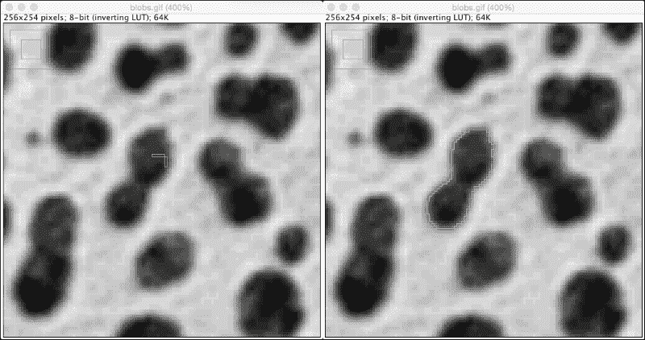

这个工具对于选择像这些块状有机形状非常有效。然而，它要求物体（块状）与背景之间的对比度要高。如果你将容差设置得更高，例如在块状示例中，不仅会选择物体，还会选择背景。如果你在块状示例中尝试`150`的容差值，选择仍然可以。然而，如果你点击一个块状较亮的像素，容差值为`160`时，几乎整个图像都会被包括在内。使用粒子分析器选择像块状这样的有机形状有另一种不同的方法，这将在稍后讨论。

## 线选择和测量

除了用于测量的区域选择工具之外，还有可用于测量的线选择工具。线选择对于选择细长结构非常有用。脑细胞具有一个基本的细胞体和被称为**突起**的长而细的进程。可以使用线选择来测量这些细长进程，以确定长度等特征。在时间序列中，沿着突起的线可以使用称为柱状图的专业动态可视化来测量强度随时间的变化。

### 柱状图

柱状图是每帧或切片沿线的所有像素的表示。这种类型的图像显示了物体的动态。从图像顶部到底部运行的直线代表静态物体，而斜线表示运动。角度越陡，物体移动越快。这可以用来测量物体的速度。它也是一种非常简单的视觉辅助工具，用于识别受限空间内的运动。这一点非常重要。任何开始在线上但离开线的一侧的物体将不会被可视化，也无法被测量。

让我们看看我们在上一章中当我们对时间序列进行归一化时使用的时间序列的非常基本的柱状图。在 ImageJ 中打开`time_series.tif`图像。接下来，我们将追踪一个存在许多小孔的拉伸区域。要追踪像我们这里这样的不规则形状，我们想要选择分割线区域。

1.  在 ImageJ 主界面中右键单击线工具，并从提供的选项中选择**分割线**。

1.  按照以下图像所示画线（可以自由选择不同的拉伸）。

1.  如果你希望创建多个柱状图，你可以使用*Ctrl* + *T*将每条线添加到 ROI 管理器中。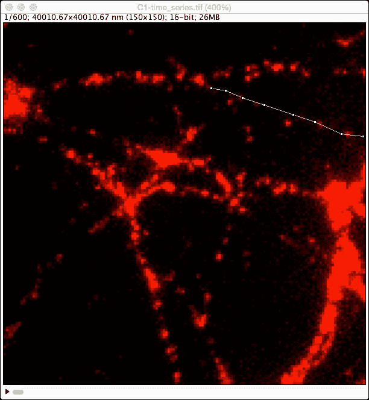

确保你画的线与小孔相交，并且沿着它们的路径。如前所述，柱状图只会显示在线上的内容！作为一个练习，你可以通过首先创建最大投影并在那里画线，然后将它转移到时间序列上来更准确地画线。为此，请执行以下步骤：

1.  通过转到**图像** | **堆栈** | **Z 投影…**并选择**最大强度**来创建最大投影。

1.  在新图像中，使用分割线选择一个区域并将其添加到 ROI 管理器中。

1.  选择原始`time_series.tif`窗口。

1.  通过选择从 ROI 管理器中添加的 ROI 或通过转到**编辑 | 选择 | 恢复选择**从菜单来传输选择。请注意，后者选项仅适用于最后一个活动选择，而前者选项适用于任何数量的选择。

现在我们有了线条，我们将通过转到**图像** | **堆栈** | **重新切片 [/]…**从菜单中创建谱图。或者，你也可以按斜杠键（*/）。如果你有 Fiji 的最新版本，你也可以选择**分析** | **多道谱图** | **多道谱图**来创建谱图。当使用**重新切片**选项时，请按照以下步骤操作：

1.  确保线条是活动选择，通过在 ROI 管理器中选择它来选择它。

1.  从菜单中选择**图像** | **堆栈** | **重新切片**，或者按斜杠键。

1.  选择**避免插值**复选框并按**确定**。

按下**确定**后，将打开一个新图像。它的宽度等于线条的长度，高度等于帧数（600）。以下是之前选择的前 300 行：

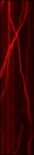

当使用 Fiji 时，使用位于**分析**菜单中的**多道谱图**工具可以生成相同的效果。此插件具有一个附加功能，允许你沿线条长度平均几个像素。这将通过平均像素强度来减少线条上的噪声效果。要使用此插件，请按照以下步骤操作：

1.  在 ROI 管理器中选择线条选择。

1.  从菜单中选择**分析** | **多道谱图** | **多道谱图**。

1.  输入线条粗细的值：大于 1 的值将创建一个平均值，在这种情况下使用 3 并按**确定**。

谱图清楚地显示，一些点在移动，而其他点则更静态。根据你画的线条，你应该得到大致相同的结果，尽管某些区域运动较少。由于这个选择是单线，从这个例子也可以清楚地看出，一些点移动的方向与其他点不同。

要在波形图中测量速度（记住速度是距离除以时间），我们只需在每个非垂直部分绘制一条单线。垂直线的距离为零，因此速度为 0。为了使计算稍微容易一些，我们首先更改图像的校准（有关如何操作的详细信息，请参阅第二章, *使用 ImageJ 的基本图像处理*）。将像素宽度设置为`266.67`，像素高度设置为`0.125`。单位可以设置为像素。我们在这里指定宽度（*x 坐标*）以纳米为单位，而高度（*y 坐标*）以秒为单位。ImageJ 不完全支持这个概念，但这对我们的目的仍然有效。

要执行测量，请按以下步骤操作：

1.  选择**直线**工具，并在轨道中心绘制一条直线，直到直线保持在轨道中间。

1.  确保在测量中选择了**边界框**选项。

1.  按*Ctrl* + *M*键测量当前选择，这将添加到你的结果中。

1.  通过拖动线的顶部手柄到下一个开始改变速度的点，并再次测量，来测量轨道的下一部分。

1.  重复此过程，直到轨道从波形图中消失。

由于选择了**边界框**选项，你的结果表中将有四列，分别标记为**BX**、**BY**、**宽度**和**高度**。对于速度测量，我们只需要宽度和高度参数。宽度等于行进的距离，而高度等于行进的时间。为了得到正确的速度值，我们将宽度除以高度以得到速度，单位为*nm/秒*，并参考前面提到的校准。

### 注意

这种计算移动粒子速度的方法并不难，但非常耗时且容易出错。此外，波形图不适合在空间中任意方向移动的物体（即，不是沿直线移动）。因此，对于这种类型的物体和更详细的跟踪物体运动的方法，我们将在后面的章节中重新探讨这个话题。

### 线轮廓

在前面的章节中，我们看到了使用简单的线选择和时间序列进行量化可以做什么。线选择也可以用于单张图像，尤其是在量化与强度、（共）定位和完整性相关的特征时。对于这些类型的评估，我们想知道物体的强度分布。为了创建强度分布，我们可以使用直线或分段线选择。

在以下示例中，我们将查看树截面内环带的分布。树木生长时，每年都会增加一个年轮。环带越厚，树木生长越快，这表明生长条件有利（阳光、温和的温度、降雨、土壤条件等）。对于这种分析，我们需要知道两件事：环带的数量和每个环带的厚度。

首先，从**文件** | **打开样本**中打开**树轮**图像。打开的图像显示了一棵树的局部截面，树心大约位于位置（`135,54`）。环带可以看作是白色区域，由暗线分隔。每条暗线是生长环的边界。当你放大树的中心时，可以立即看出环带的宽度并不相等。例如，第四个环带非常薄，而第五个环带则厚五倍。为了分析，我们可以使用与波形图相同的方法。我们可以从暗边界到暗边界画一条线，并测量每次的长度。这有一个很大的缺点。它非常耗时（再次），而且很难保持线条的直线性。测量每个环带的宽度应该基于每个环带边界的最短距离。

要创建线形轮廓，请选择图像某部分中的一条线进行轮廓分析，然后从菜单中选择**分析** | **绘制轮廓**（或按*Ctrl* + *K*）：

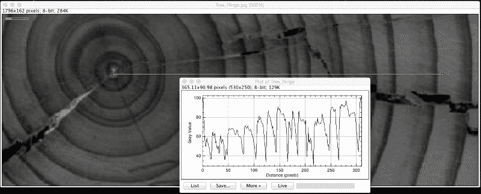

这显示了图像中线条底部的线形轮廓。它显示了沿线条像素的强度。绘制轮廓窗口还有一个选项可以显示实时更新的图表。这意味着当区域移动或调整大小时，图表会立即更新。轮廓中的每个低点都表示一个树轮边界。当我们按下**列表**按钮时，**绘制轮廓**窗口会打开一个窗口，显示沿线条每个像素的强度值。如果我们将其复制到电子表格程序中，我们可以计算每个山谷之间的距离，以确定每个环带的像素宽度（不校准图像，实际单位的真实宽度是未知的）。山谷的数量给出了年数。

或者，可以使用前面显示的轮廓图来测量环带的宽度。为此，我们必须在轮廓图上画一条分段线。ImageJ 中的每个图形窗口（不包括文本和结果窗口）都可以用来绘制选择。对于这个例子，在创建轮廓图之前，在轮廓图上禁用网格线很重要。这可以通过取消选中轮廓图设置中的**绘制网格线**复选框来完成，该设置可以通过从菜单中选择**编辑** | **选项** | **轮廓图选项…**来找到。

1.  从左侧开始，从每个山谷的最低点画一条分段线。

1.  使用颜色选择器将前景色设置为黑色，并通过*Ctrl* + *D*或通过菜单中的**编辑** | **绘制**来绘制线条。

1.  确保您的测量设置包括**边界矩形**选项。

1.  选择画笔工具来测量图表下方的面积。要测量树轮的宽度，使用画笔工具在您的分割线上方但低于图表的黑色线条处点击。这将选择图表的白色像素，这些像素连续到图表的黑色线条。您将看到，只有从您的分割线选择下方直到图表的线条下的部分被选中（见以下图片）。

1.  当您按下*Ctrl* + *M*来测量此选择时，您将获得选择的宽度和高度。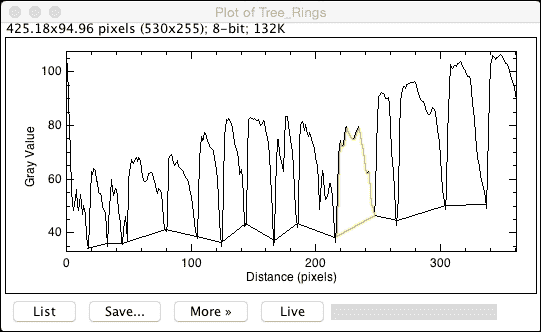

宽度测量将是树轮的厚度。通过在每个山谷之间进行此操作，您可以测量每个环的厚度。请注意，如果图表下方的区域对您的测量有意义，那么在您的测量选项中选择**面积**将也会提供此参数。在分析电泳凝胶和蛋白质印迹时，使用类似的方法。为此，ImageJ 有一个专门用于分析凝胶的工具集。这些工具可以通过转到**分析** | **凝胶**找到，有关如何使用它的说明请参阅[`imagej.nih.gov/ij/docs/guide/146-30.html#toc-Subsection-30.13`](http://imagej.nih.gov/ij/docs/guide/146-30.html#toc-Subsection-30.13)，以及解释它的视频请参阅[`imagejdocu.tudor.lu/doku.php?id=video:analysis:gel_quantification_analysis`](http://imagejdocu.tudor.lu/doku.php?id=video:analysis:gel_quantification_analysis)。

# 共定位

在前面的章节中，我们探讨了测量图像某些方面的方法，例如速度和长度。本节将探讨涉及不同信号共定位的测量方面的不同。共定位意味着两个（或更多）物体彼此靠近。每当两个信号在空间上重叠时，我们可以得出结论，它们位于同一位置，在成像系统允许的分辨率范围内。在生物学中，两个标记的结构或蛋白质的定位提供了蛋白质是否包含在结构中或是否在受到刺激后移动到某个位置的线索。对于像细胞这样的动态结构，我们可以观察共定位量的变化，这取决于时间或刺激。

## 半定量共定位

半定量共定位意味着您通过肉眼或使用粗略的测量来检查共定位的量，并将其（相当任意地）分类为共定位或非共定位。这可以是一个非常好的起点。然而，如果结果不是黑白分明的，就很难得出任何结论。对于这种类型的共定位，我们只需要每个信号的图像，并且我们需要将它们合并以查看共定位。这有时在我们获取图像时自动完成，有时需要手动合并图像。要合并两个不同的图像，需要满足一些先决条件：

+   图像需要具有相同的大小（*X*，*Y*，可选的*Z*或*T*）

+   图像需要具有相同的类型（8 位、16 位等）

+   图像不能在各个通道的获取之间移动

如果满足这些条件，共定位的结果应该提供定性的结果。

要合并两个通道，请从菜单中选择**图像** | **颜色** | **合并通道…**。目前，ImageJ 支持使用七个不同的 LUT 将七个不同的图像合并成一个单通道图像：红色、绿色、蓝色、灰色、青色、品红色和黄色。最常用的组合是**红/绿**，共定位的结果显示为黄色像素。另一种很好的颜色组合是**绿/品红**，共定位显示为白色像素。后一种选项推荐用于出版物，因为色盲的人仍然可以欣赏到共定位。请注意，如果一个通道的强度非常低，而另一个通道的强度很高，人眼视觉系统将只能感知亮度更高的通道。为了良好地可视化共定位，两个通道需要相似的灰度值分布。相应的直方图应该看起来相似。

一种简单的方法是观察亮像素的重叠来粗略地量化这种共定位。为此，我们可以为每个通道设置一个阈值，并为每个图像创建一个掩码。要查看重叠，我们可以使用图像计算器执行`AND`操作。像素的重叠被分类为在两个图像中相同位置的像素值为 1（技术上为 255）。执行此`AND`操作后，我们可以通过计算结果图像中的白色像素数量来确定重叠量。一种简单的方法是通过按*Ctrl* + *H*来获取直方图，然后在结果直方图窗口中按**列表**按钮。通过查看列表底部的 255（列表底部）的值，您将得到重叠像素数量的计数。我们将在这个主题上重新讨论，在第八章，*ImageJ 插件的解剖结构*中，我们将使用 Fiji 提供的某些插件应用更严格的量化。

# 粒子分析

本节将探讨用于粒子分析的方法，这是一个处理在图像中检测多个（相似）对象，目的是对它们进行分割和计量的领域。许多问题都可以定义为粒子系统，它由单个图像中的许多单个细胞、表面上的孔洞、道路上检测汽车等组成。基本的粒子分析步骤是在单个图像中检测或分割粒子。

## 预处理和准备

要检测粒子，首先需要将它们从背景中分离出来。为此，我们需要创建一个蒙版，将所有对象从背景中隔离出来。我们已经在上一章中看到了如何设置阈值以及如何使用它来创建蒙版。这个蒙版图像将被用于粒子分析。在这个例子中，我们将使用一个相对简单的例子。通过在 ImageJ 菜单中选择**文件** | **打开样本**来打开**Blob**图像。当图像打开时，转到**图像** | **调整** | **阈值…**并使用**自动**按钮设置阈值。确保**暗背景**框没有被勾选。你现在应该看到以下类似图像：

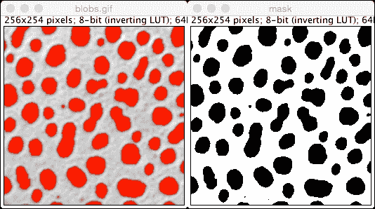

红色区域表示前景，即我们潜在的粒子，而其他所有内容都将被忽略。现在的目标将是根据两个主要特征来分割粒子：它们的形状和大小。我们将通过从菜单中选择**编辑** | **选择** | **创建蒙版**来完成这一步骤（蒙版是右侧的图像）。

在我们开始检测粒子之前，我们首先需要了解一些关于它们的信息。我们需要知道粒子的尺寸。有两种简单的方法可以确定图像中所有粒子的尺寸，我们将从最直接的方法开始。为了确定特定粒子的尺寸，我们只需围绕它绘制一个区域并测量它。在面积测量的章节中，我们使用了多边形选择来测量面积和形状描述符。对于粒子分析，我们需要确定我们可能仍然认为它是真实粒子的最小粒子。

为了开始，让我们以(103,111)处的粒子作为最小的真实粒子。在它周围绘制多边形后，你可能得到一个面积为 363 像素，圆形度为 0.9188 的区域。如果我们取一个不太圆形的粒子，例如(133,83)处的粒子，我们得到一个面积为 434，圆形度为 0.7329。让我们取这两个观察结果中每个参数的最小值，得到一个最小面积为 363 像素，最小圆形度为 0.7329，然后继续。现在我们可以通过从菜单中选择**分析** | **分析粒子…**来执行粒子分析。在打开的对话框中输入以下参数：

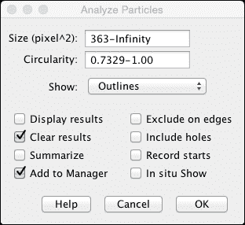

尺寸是指将被计数的粒子的大小范围，以平方像素（面积）为单位。我们发现的圆形度范围现在定义为比我们的估计更圆或更圆的粒子。对于**显示**选项，您可以选择多个输出类型，包括轮廓。当您使用**添加到管理器**选项时，这种输出实际上不再需要，可以设置为**无**。当您不希望测量仅部分在图像中的粒子时，您必须选择**在边缘排除**选项。在第九章《创建 ImageJ 分析插件》中，我们将查看时间序列中粒子分析的一个实现。

点击**确定**后，粒子将被添加到 ROI 管理器中，此时粒子分割完成。现在我们可以使用与之前章节中查看的任何其他区域选择相同的方法来测量粒子。设置面积和圆形度参数的另一种方法是运行粒子分析，但不限制大小或圆形度参数。这将检测图像中的每个粒子，分割后可以过滤结果。这两种方法应该给您相似的结果，工作量相等。

# 摘要

在本章中，我们介绍了一些测量图像和时间序列中参数的方法。我们使用了之前章节中的一些技术来从我们的图像中提取数据。您学习了如何在单张图像中可视化动态数据（光栅图）。我们以定性的方式研究了共定位，作为本书后面定量分析的序言。最后，我们研究了粒子分析作为检测单张图像中相似对象的方法。

在下一章中，您将使用您所学的一些技术，并将它们应用到宏中以提高效率。
