# 第六章：在 ImageJ 中开发宏

在本章中，我们将探讨自动化图像处理的方法，以便实现更快、更高效的图像处理。我们之前所做的处理是足够的，但耗时较长。当处理非常大的堆栈或时间序列，或者处理许多单个文件时，我们执行的处理是好的，但效率不高。我们将探讨 ImageJ 中的宏，并了解它们如何帮助我们进行图像处理。在本章中，我们将涵盖以下主题：

+   记录和运行宏

+   修改宏

+   宏中的用户输入

+   宏的进度

+   批量运行宏

+   安装宏

# 记录宏

宏是一系列命令的集合，允许您对单个图像或多个图像执行一系列任务。在宏中，您可以放置 ImageJ 菜单结构中可以找到的所有命令。宏的一个非常基本的应用是将图像从一种特定类型转换为另一种类型。为了创建一个宏，我们可以从头开始创建，在文本文件中键入所有命令，然后执行。然而，如果我们使用菜单结构中的命令，一个更简单的方法是使用宏记录器。

宏记录器将记录您所做的每个命令和选择，并将它们放置在一个简单的编辑器中。这是一种非常简单快捷的方法来创建一个宏，该宏将在图像上执行一组基本任务。要开始记录，从菜单中选择**插件** | **宏** | **记录…**，这将打开一个新的记录窗口：

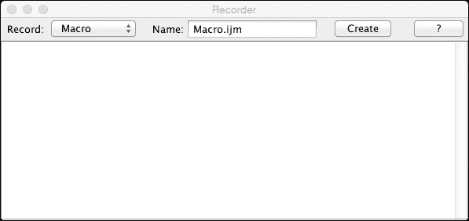

记录窗口有一个列表，允许记录不同类型的记录。默认为宏，但也可以使用 Java 作为记录类型来记录插件命令。ImageJ 还支持 JavaScript 代码和 Beanshell 脚本以运行，这些类型也可以在此创建。当选择 JavaScript 或 Beanshell 时，记录的命令将与默认宏命令略有不同。还有一个选项可以设置您正在创建的新宏的名称。ImageJ 中的宏名称不需要下划线，并且具有`.ijm`扩展名，以表明它们是 ImageJ 宏。当您完成了所有希望应用于图像的处理步骤后，您可以按**创建**按钮来保存宏。

## 记录转换宏

让我们看看一个简单的宏录制，该宏将获取多通道图像，更改蓝色通道的查找表，并将其转换为 RGB 图像。我们将使用 HeLa 细胞的样本图像。为了更好的处理，我们不会包括打开图像命令。因此，我们首先通过转到**文件** | **打开样本** | **HeLa 细胞**来打开图像。然后，我们将通过从 ImageJ 菜单转到**插件** | **宏** | **记录…**来开始宏记录器。确保类型设置为**宏**，并为你的宏输入一个名称。接下来，我们将按照我们希望使用的顺序执行我们希望记录的步骤。首先，激活图像窗口，并通过按两次右箭头键选择蓝色通道。你会看到现在记录器窗口中有两个命令：

```java
run("Next Slice [>]");
run("Next Slice [>]");
```

注意，当你用鼠标点击通道栏时，不会记录任何内容，也不会向记录器窗口添加任何命令。

### 注意

记录器不会记录改变显示状态的鼠标点击。它不会记录用于更改通道、帧或堆栈切片的鼠标点击，也不会记录调整亮度/对比度的操作。只有**设置**和**应用**命令会显示在记录器中。

当选择蓝色通道时，我们将通过从菜单中选择**图像** | **查找表** | **青色**来将此通道的 LUT 更改为**青色**。这将在记录器中添加一个新命令，对应于我们刚刚执行的操作：

```java
run("Cyan");
```

我们现在将执行此过程的最后一步，即将图像转换为 RGB 图像。要做到这一点，请从菜单中选择**图像** | **类型** | **RGB 颜色**。将创建一个新的 RGB 类型图像，并在记录器窗口中添加一个新命令：

```java
run("RGB Color");
```

现在，我们有一个完整的宏，可以将三通道图像转换为 RGB 图像，并改变一个通道的 LUT。最终的记录窗口将类似于以下截图：

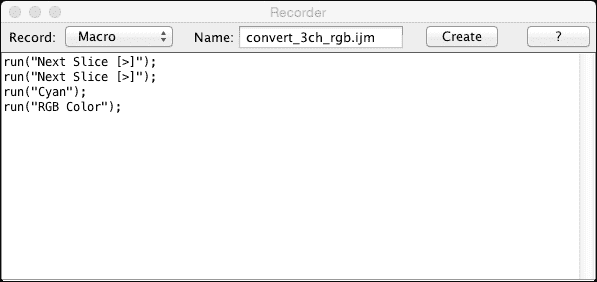

我选择的宏名称是 `convert_3ch_rgb.ijm`。当你创建宏时，这将是你保存宏时使用的默认名称。当你点击**创建**按钮时，将打开一个新窗口，其外观会根据你使用的 ImageJ 版本有所不同。当使用 Fiji 时，将打开**脚本编辑器**窗口，其中包含我们在编辑器中记录的命令：

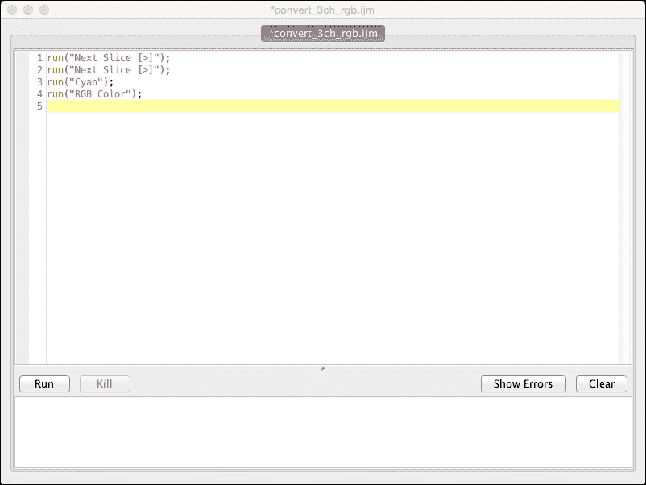

Fiji 脚本编辑器的优点是它具有**语法高亮**（由不同元素的颜色表示）和行号。它还支持标签式界面，允许在同一窗口中同时打开多个宏。此编辑器在窗口底部还有一个运行按钮，可以直接运行宏。

在标准的 ImageJ 发行版中，编辑器看起来会更基础一些，并且它没有 Fiji 脚本编辑器提供的附加功能：

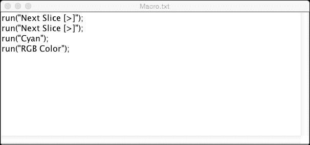

注意编辑器中缺少高亮显示和行号。一旦我们创建了宏，我们可以使用键盘快捷键*Ctrl* + *R*或通过转到**宏** | **运行**（标准 ImageJ）或**运行** | **运行（Fiji）**来运行它。

宏的录制允许按顺序记录多个步骤。然而，我们现在所拥有的宏存在一个缺点：我们需要自己打开我们想要处理的图像，并且我们还需要保存处理后的图像。此外，当前形式的宏只处理当前活动的图像。只要只有一个图像打开，这不会造成问题。然而，当我们运行宏时打开多个图像，我们必须确保在运行宏之前选择我们想要处理的窗口。在下一节中，我们将尝试添加一些命令来处理打开和关闭图像，以便进行更稳健的处理。

# 修改宏

我们在上一节中创建的宏是有效的。然而，它没有处理打开和关闭图像。因此，现在，我们将查看修改我们现在拥有的当前宏的过程。大部分工作将在编辑器窗口中完成，但我们仍然会使用录制窗口来发现打开和关闭图像所需的函数。

让我们从给我们的宏添加一个选项开始，以便打开你想要处理的图像。我将使用我们之前使用的图像。然而，由于你更有可能在磁盘上本地保存图像，我们将把**HeLa 细胞**图像保存到本地磁盘上。让我们在桌面上创建一个名为`processing`的文件夹，并将**HeLa 细胞**图像保存在其中。要保存图像，转到**文件** | **保存**或按*Ctrl* + *S*，然后选择桌面上的文件夹作为目标。保存图像后，我们可以在宏中开始打开图像的过程。

首先，我们需要确保我们的上一个宏在编辑器窗口中打开，并开始宏录制器。我们还需要确保没有打开任何图像。现在，我们将通过选择**文件** | **打开…**来打开我们保存的图像。然后，我们将从之前步骤中创建的文件夹中选择图像。在录制窗口中，我们现在将看到一行告诉 ImageJ 打开图像。在我们的计算机上完成时，`<username>`将设置为登录时使用的用户名：

```java
open("/Users/<username>/Desktop/processing/hela-cells.tif");
```

这告诉我们 ImageJ 需要带有单个参数的`open()`函数，这个参数是一行文本（在 Java/ImageJ 中称为“字符串”，由双引号分隔）。这一行文本包含您希望打开的文件的完整路径。为了将此命令实现到我们的宏中，我们需要将此命令复制或输入到编辑窗口的第一行。现在我们可以通过运行宏来测试一切是否按预期工作。为此，我们需要关闭图像并运行宏，通过选择编辑窗口并按*Ctrl* + *R*来运行宏。如果一切顺利，图像将打开，蓝色通道将被选中并变为青色，最后，图像将被转换为 RGB 图像。

接下来，我们将探讨如何将新图像保存到同一文件夹，但使用不同的名称。我们需要确保记录器窗口仍然打开，然后点击新创建的图像以激活它。接下来，我们将通过访问**文件** | **保存**将图像保存为 TIFF 文件。我们将保留 ImageJ 设置的名称。在记录器窗口中，我们现在应该看到一条新行，包含保存命令：

```java
run("Save", "save=[/Users/<username>/Desktop/processing/hela-cells.tif (RGB).tif]");

```

此命令比打开命令复杂一些，因为它使用了更通用的`run()`方法。`run()`方法接受两个参数：一个包含命令的字符串（在这种情况下为**保存**）和一个形式为`save=[]`的字符串，其中方括号内为保存的文件名。请注意，在此命令中用户名被替换为`<username>`。它应该更改为您登录账户的用户名。现在我们可以将此命令添加到我们的脚本中，以执行保存功能。

接下来，为了完成这个过程，我们将关闭当前所有打开的图像。为此，我们将选择最近保存的图像并关闭它。或者，我们可以从菜单中选择**文件** | **关闭所有**。如果我们关闭一个图像或使用关闭所有，记录器窗口中分别将放置以下行：

```java
close();
run("Close All");
```

第一行表示当前激活的窗口将被关闭，而第二个命令将关闭所有打开的图像。由于我们希望在处理完毕后关闭所有打开的图像，因此第二个命令更适合我们的宏。我们将添加“关闭所有”命令到脚本中，这意味着我们的最终宏将如下所示：

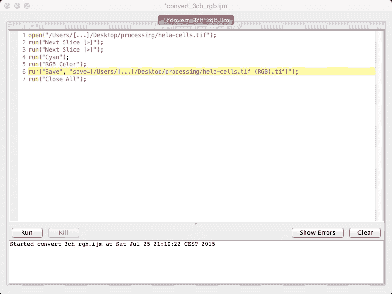

当在 Fiji 中使用脚本编辑器时，我们还可以在编辑器下方的列表中看到使用当前宏执行的操作。使用**清除**按钮可以重置此历史记录。当你以当前形式打开此宏时，它将打开图像，更改第三通道的 LUT，将其转换为 RGB，保存结果图像，然后关闭所有图像。尽管这个宏非常简单，但它处理图像的速度比我们手动处理要快得多。这个宏只有一个问题：它只适用于特定位置的单个图像。如果我们想处理许多不同的图像，这个宏将不太实用。我们不得不手动为每个要处理的文件更改宏。因此，在下一节中，我们将添加在宏运行时允许用户选择文件的功能。

## 宏中的用户输入

我们之前的宏在处理特定图像方面非常高效，但如果宏要求用户指定要处理的文件，它将更高效。为此，我们需要添加一个方法来要求用户选择文件。唯一的问题是，我们无法使用记录器来获取此功能。我们需要找到一个要求用户输入文件位置的函数，这可以通过 ImageJ 中可用的内置宏函数来完成。在 ImageJ 网站上，有一个所有可访问宏函数的详尽列表，您可以在[`imagej.nih.gov/ij/developer/macro/functions.html`](http://imagej.nih.gov/ij/developer/macro/functions.html)找到。函数按字母顺序排序。

### 打开特定文件

我们想要的函数是一个文件打开对话框，提示用户定位图像文件。在这个页面上找到函数的最简单方法是使用浏览器中的查找功能搜索相关关键词。为了找到我们需要的函数，我们将在搜索框中使用搜索词“file open dialog”。当我们输入搜索词时，页面上会有多个出现，因此我们将查看每个出现的所有描述。在这种情况下，描述我们所需功能的函数是名为`File.openDialog(title)`的函数，描述说明它将显示一个文件打开对话框，返回用户选择的文件路径。我们现在将修改当前的宏，使用此函数允许我们更改我们选择的任何文件。我们将修改宏的第一行，变成以下两行：

```java
fname = File.openDialog("Select 3 channel image");
open(fname);
```

第一行指示 ImageJ 显示一个标题为**选择 3 通道图像**的文件打开对话框，并将用户选择的路径存储在一个名为`fname`的变量中。在下一行，我们修改了`open()`命令，使用`fname`变量打开用户选择的图像。在这个例子中需要注意的一点是，没有指定变量类型。ImageJ 中的宏是弱类型，不需要事先指定类型。

### 将图像保存到文件夹

因此，我们现在使宏变得更加灵活。我们现在可以选中硬盘或附加存储上任何位置的任何文件。唯一的问题是图像仍然被保存到固定位置和固定名称。所以现在，我们必须更改处理保存图像的宏的部分。这个问题有多个可能的解决方案。我们可以将新图像保存到打开的图像所在的同一文件夹中，或者我们可以将其保存到我们收集所有处理过的图像的不同文件夹中。我们将从第一个选项开始：将其保存到打开的图像所在的同一文件夹中。

要获取我们选择的文件夹的名称，我们可以使用一个名为 `File.directory()` 的函数，它将给出使用文件打开对话框打开的最后一个文件的目录。这正是我们保存函数所需要的，所以让我们首先在我们的代码中添加这个函数。为此，我们将在 `run("Save", …)` 命令之前添加一行，并添加以下代码：

```java
fdir = File.directory();
```

这将把最后一个打开的图像的路径存储在一个名为 `fdir` 的变量中。为了保存一个文件，我们需要路径以及新文件的文件名。在这个情况下，文件名只是创建的图像的标题，所以我们将使用一个函数通过在 `fdir` 行下面添加这一行来获取当前图像的标题：

```java
newName = getTitle();
```

我们将新文件名的值存储在一个名为 `newName` 的变量中。我们现在已经准备好修改 `save` 函数以使用我们创建的两个变量。我们需要做的是合并 `fdir` 和 `newName` 变量。我们可以在 `save` 命令中这样做，所以我们将旧的 `save` 命令更改为以下行：

```java
run("Save", "save=["+fidr+newName+".tif]");
```

我们已经用两个变量替换了方括号中指定的路径。我们必须在方括号之间添加一组引号来中断字符串，我们使用了 `+` 操作符来连接字符串。我们指定了要保存的文件的扩展名。由于图像的标题名称末尾不包含扩展名，我们需要添加它。或者，我们可以使用 `saveAs` 宏命令来实现相同的结果（添加扩展名不是必需的，因为我们将以 TIFF 文件保存图像）：

```java
saveAs("Tiff", fdir+newName);
```

### 注意

在这种情况下，`RGB Color` 命令创建了一个新的图像。当在新的图像上调用 `Save` 时，我们可以更改名称，它将以与 `saveAs` 命令相同的方式工作。如果你的函数没有创建新的图像，但你仍然想将结果作为单独的文件存储，请使用 `saveAs` 命令。否则，保存函数将用修改后的数据覆盖磁盘上的图像。

我们宏现在应该看起来像这样：

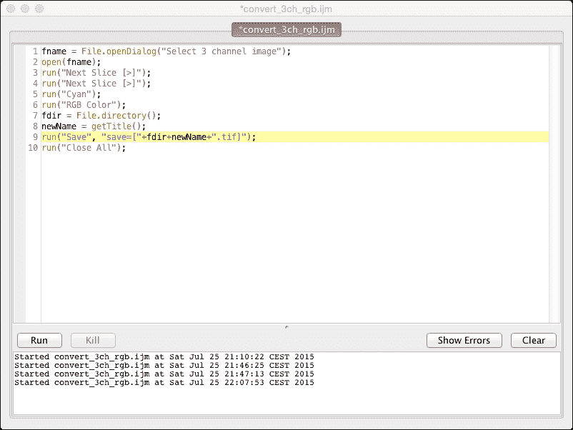

我们的宏现在更加灵活。我们可以选择任何文件进行处理，结果将存储在原始文件相同的文件夹中，但名称已更改。下一步是修改代码以控制哪个通道将被修改。

### 添加选择

我们现在的宏允许我们修改任何我们可以定位并保存结果在同一文件夹中的图像。在下一步中，我们将询问用户我们希望更改哪个频道。我们需要询问用户一个介于 1 到 3 之间的数字，这将是要更新的频道。有两种基本的方法来获取一个数字：我们可以使用一个文本字段，用户可以输入一个数字，或者我们可以展示一个数字列表，用户可以从中选择正确的数字。第一种方法非常简单，但也需要额外的检查。如果用户输入的值大于频道数量（或者根本不是数字），会怎样？一个稍微安全的方法是给用户一个有限的选项集，其中只有一个可以被选中。

我们将使用一组与创建对话框和向其中添加字段相关的函数。我们需要在宏的开始部分放置此代码，在我们调用下一个切片命令之前。我们将以下代码直接放置在打开命令之后：

```java
Dialog.create("Select a channel");
Dialog.addChoice("Channel number:", newArray("1","2","3"));
Dialog.show();
```

第一行将创建一个标题为`选择一个频道`的对话框。接下来，我们在新创建的对话框中添加了一个选择列表，其中包含选项`1`、`2`和`3`作为字符串。最后，我们调用了`show()`方法来显示我们创建的对话框。

我们创建了一个对话框，让用户选择一个频道编号，但我们还没有使用这个选择。如果我们现在运行代码，结果将与我们对话框中做出的选择无关。因此，我们的下一步是检索用户选择并提取用户选择的数字。执行此操作的功能是`getChoice()`，它是对话框功能的一部分。我们将直接在显示命令之后添加它，如下所示：

```java
chChoice = Dialog.getChoice();
```

此命令将把选定的选择存储在一个名为`chChoice`的变量中。然而，如果我们查看该函数的描述，这个函数返回一个字符串。这是一个问题，因为我们需要它是一个数字，以便选择正确的切片。在宏语言中有一个函数可以将字符串转换为整数。它被称为`parseInt()`，我们可以这样实现它：

```java
sliceNumber = parseInt(chChoice);
```

`sliceNumber`变量现在包含用户的频道选择。接下来，我们将使用这个数字来选择我们图像中的正确切片。我们可以使用一个小循环结合我们的下一个切片命令。然而，有一个更快更简单的方法，使用一个内置的宏函数，称为`setSlice()`。为此，将带有`run("Next Slice [>]")`的两行替换为以下行：

```java
setSlice(sliceNumber);
```

如果我们希望更改将要使用的查找表的颜色，我们可以使用相同的方法在我们的对话框中添加第二个选择列表。我们只需添加另一个 `addChoice()` 命令，但这次，提供几个 LUT（例如，青色、黄色、品红色等）的选择。`getChoice()` 函数按它们添加到对话框中的顺序检索每个选择列表的结果。如果您在通道号之后添加 LUT 选择，它将通过 `getChoice()` 的第二次调用检索。现在，我们的宏将如下所示（我已添加颜色选择）：

```java
fname = File.openDialog("Select 3 channel image");
open(fname);
Dialog.create("Select a channel");
Dialog.addChoice("Channel number:",newArray("1","2","3")));
Dialog.addChoice("Select color:", newArray("Cyan","Magenta","Yellow"));
Dialog.show();
chChoice  =Dialog.getChoice();
clrChoice = Dialog.getChoice();
sliceNumber = parseInt(chChoice);
setSlice(sliceNumber);
run(clrChoice);
run("RGB Color");
fdir = File.directory();
newName = getTitle();
run("Save", "save=["+fdir+newName+".tif]");
run("Close All");
```

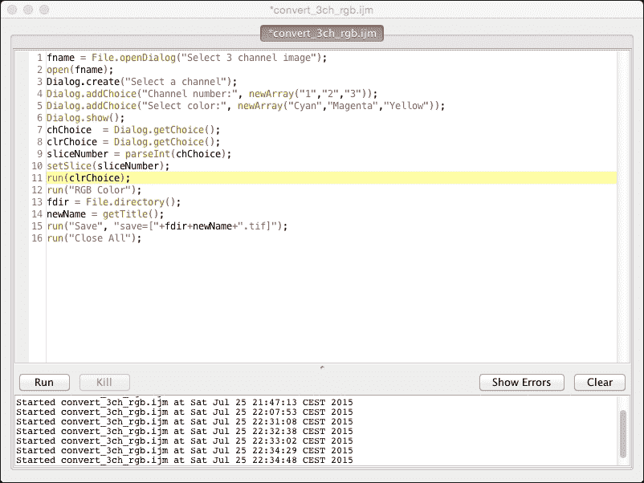

现在有一个名为 `clrChoice` 的新变量，它保存用户所做的颜色选择的值。如果您运行修改后的宏，您将必须选择要处理的图像，然后设置通道和 LUT 颜色。之后，图像将根据您设置的值进行处理。现在，宏相当灵活，允许对特定通道进行不同类型的特定颜色转换。我们现在只需要进行一项修改，使其更加健壮。我们需要检查用户选择的图像实际上是否有三个通道。

### 执行输入检查

要在所选图像中添加对切片数量的检查，我们需要一个简单的条件语句。`if` 语句将执行此检查。我们将在打开图像后、请求用户输入之前添加此条件语句。如果通道数少于三个，我们需要停止宏的执行并关闭我们打开的图像：

```java
if(nSlices<3) {
run("Close All");
exit("Not enough channels in the image (min. is 3)!");
}
```

`nSlices` 函数是一个内置的宏函数，它返回当前图像的切片数。我们将检查切片数的值与所需的值进行比较。如果通道不足，我们将关闭所有图像并使用 `exit()` 函数终止宏。

### 注意

当使用 `nSlices` 函数时，请记住，ImageJ 通过乘以图像的切片数、帧数和通道数来计算此值。当处理（超）栈时，`nSlices` 函数不会返回您可能期望的值。例如，一个具有两个通道、五个切片和 51 帧的 5D 图像将返回 510（*2*5*51*）的值。对于栈，您可以使用 `Stack` 方法。要计算通道数，您可以使用 `Stack.getDimensions()` 函数。

`exit` 函数有两种形式：一种不带参数，另一种带字符串参数。字符串参数将显示一条消息，说明为什么宏被终止。建议您使用后者，通过提供反馈让用户了解为什么宏没有执行任务。现在，我们的宏应该如下所示：

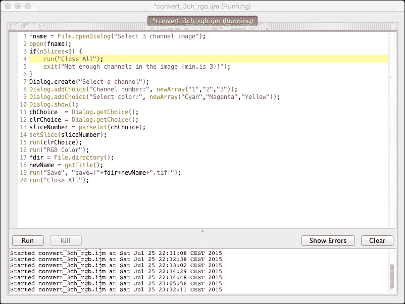

我们的宏现在很健壮，每次运行时都会以可预测的方式运行。如果我们的图像切片非常少，它将终止。如果它有更多的切片，它将正确运行。然而，我们将无法修改第三层以上的任何切片。因此，我们的最终修改将检查图像中的切片数量，并通过操作切片号码数组相应地调整我们的选择。

要更改选择列表的内容，我们首先需要创建一个比当前指定的数组稍长的数组。我们希望限制通道数量，因此我们将创建一个最大通道数为五个的数组。我们还将调整对通道数量的检查，以反映这种更改。我们将首先创建一个包含数字`1`到`5`的字符串数组，并修改条件语句：

```java
chNumbers = newArray("1","2","3","4","5");
if(nSlices>chNumbers.length) {
  run("Close All");
  exit("The many channels in the image (max is"+chNumbers.length+")!");
}
```

这将存储通道号码在`chNumbers`数组中，条件数组现在将检查切片数量是否不大于该数组的长度。这种方法允许我们轻松地将额外的通道号码添加到数组中，而无需修改任何其他代码。

接下来，我们在对话框中的选择列表中添加了通道号码列表。然而，我们必须考虑到用户可以选择比五个通道更少的图像，因此我们需要更改添加到选择列表中的数组，以反映所选图像中存在的通道数量。为此，我们可以使用在数组上工作的`trim`函数。`trim`函数接受两个参数：第一个是数组，第二个是一个整数，指定需要从第一个元素开始返回的元素数量。我们可以使用`nSlices`函数来给出我们希望`trim`函数返回的元素数量：

```java
Dialog.addChoice("Channel number:", Array.trim(chNumbers, nSlices));
```

如果我们现在在我们的**HeLa Cells**文件上运行修改后的宏，我们会看到通道号码的选择列表只包含`1`、`2`和`3`这三个值，这正是我们预期在这个图像中会看到的。如果我们打开一个具有五个通道的另一个图像，我们可以在列表中选择五个选项。你可以通过保存**Neuron (1.6M 5 channels)**样本图像来测试这一点。最终的宏现在看起来就像以下截图：

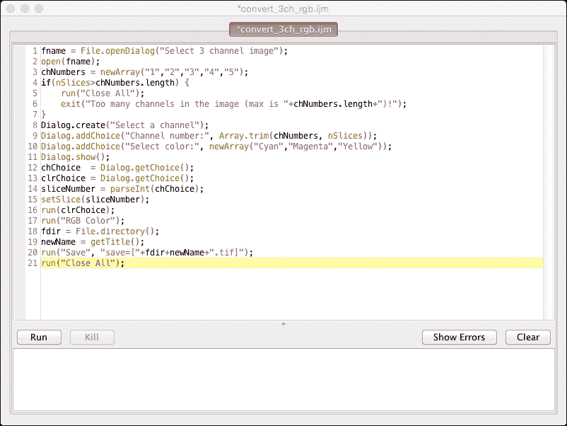

在使用宏处理下一步之前，我们将创建一个宏，该宏将对文件夹内包含的文件列表执行处理步骤。这个过程需要某种形式的进度，以便让用户知道正在发生什么，并给出处理将花费多长时间的提示。

# 在宏中显示进度

在前面的章节中，我们看到了我们可以使用一个（相对）简单的宏来处理单个图像文件。尽管这个宏非常灵活，但它仍然需要用户每次都单独选择每个文件并设置值。很多时候，你希望对一组许多相似的图像执行相同的处理步骤。这些图像具有相同的规格（通道数、颜色等），但属于不同的样本或个体。在处理大量图像时，显示进度以指示我们处理到了哪一步，并提供一些视觉反馈，表明已经处理了多少项目，是非常有用的。最简单的反馈类型是显示已处理的文件百分比。任何低于 100%的值都表示我们还没有完成。如果我们跟踪处理 10%的图像所需的时间，我们可以（大致）估计完成处理所需的时间。另一种有用的反馈类型是在处理结束时提供一条消息，表明我们已经完成。

对于本节，我们将创建一个不同的宏，该宏将接受一个包含时间序列图像的文件夹，每个文件夹包含 20 帧和两个通道。我们将取每个图像的第一个通道，创建前五帧的平均投影，并将结果保存在同一文件夹中。然后我们将取每个图像的第二个通道，创建最大投影，并将其保存在同一文件夹中。该文件夹将包含 10 个需要处理的文件，以及一个包含文件夹中文件描述的单个文本文件。我们将首先创建下一节中处理步骤的宏。

## 处理时间序列

我们将首先创建执行处理的步骤。我们可以使用记录器以及 ImageJ 网站上的内置宏函数参考页面来帮助我们处理。我们首先以常规方式在 ImageJ 中打开图像。从文件夹中逐个打开图像的代码将在稍后编写。一旦图像打开，我们将创建处理每个通道的代码。我将介绍一些有用的结构，使代码更加清晰。我将在代码中添加注释以指示正在发生的事情，并将处理封装在函数中。

让我们从创建一个生成绿色通道平均投影并保存它的函数开始。在 ImageJ 宏中创建一个函数非常简单。为了声明一个函数，我们将使用`function`关键字，后跟函数名称和参数列表。对于我们的绿色通道，函数声明如下：

```java
function processGreenChannel() {

}
```

函数名为 `processGreenChannel`，它没有参数（稍后将会改变，但现在这样是可以的）。我们的第一个处理步骤是生成绿色通道的平均值。有好多方法可以做到这一点，但现在我们将使用最基本的方法。我们将为两个通道创建平均值，并在保存之前移除我们不需要的通道。为了创建平均投影，我们需要记录器来发现命令的格式。如果记录器还没有打开，请通过访问 **插件** | **宏** | **记录…** 来启动记录器。接下来，我们将从菜单中选择 **图像** | **堆栈** | **Z 投影...**，并将 `5` 输入为 **停止切片**，将 **平均强度** 作为方法。我们会看到记录器中显示给我们结果的命令：

```java
run("Z Project...", "stop=5 projection=[Average Intensity]");
```

这将是我们将添加到处理绿色通道函数中的第一个命令。接下来，我们希望从平均投影中移除红色通道。为此，我们将从菜单中选择 **图像** | **堆栈** | **删除切片**。将打开一个对话框，让我们选择删除通道（这里实际上没有选择）。通过按 **确定**，第一个通道（红色通道）将被移除。记录器显示我们使用的命令如下：

```java
run("Delete Slice", "delete=channel");
```

我们可以将我们在上一个宏中用于保存图像的相同代码添加到这里。现在我们的函数将如下所示：

```java
function processGreenChannel() {
  //create an average projection of the first 5 frames
  run("Z Project...","stop=5 projection=[Average Intensity]");
  //delete the red channel
  run("Delete Slice","delete=channel");
  //save the new image
  fdir = File.directory();
  fname = getTitle();
  run("Save","save=["+fdir+fname+"]");
  //close the saved image
  close();
}
```

注意，我们不需要在名称末尾添加扩展名。投影命令使用前缀来更改名称（`AVG_`），而我们的原始图像已经有一个末尾的扩展名，该扩展名被 `projection` 命令保留。处理绿色通道的最后一步是关闭我们创建并保存的图像。然而，这次我们不能使用 `close all` 命令，因为我们还没有完成原始图像的处理。我们只需使用 `close` 命令，该命令仅关闭由我们函数的最后一行指示的当前活动图像。我在函数中包含了一行注释，以指示下一行（几行）将要发生的事情，作为理解接下来会发生什么的辅助。这是一个非常基础的编程工具，在我们几周或几个月后检查代码时可以节省很多时间。单行注释由前面带有两个正斜杠的文本表示。如果您需要多行文本以提高可读性，可以使用多行注释，它们以 `/*` 开始，以 `*/` 结束：

```java
//single-line comment
/*
multi line comment
that is spread over 
several lines.
*/
```

我们将要为红色通道创建的函数非常相似，但我们将现在使用不同的投影方法。此外，我们必须删除与上一个函数不同的通道。处理红色通道的完整函数如下：

```java
functionprocessRedChannel() {
  //create the maximum projection
  run("Z Project...","projection=[Max Intensity]");
  //select the green channel (which is number 2)
  setSlice(2);
  //delete the green channel
  run("Delete","delete=channel");
  //save the new image
  fdir  =File.directory();
  fname = getTitle();
  run("Save","save=["+fdir+fname+"]");
  //close the new image
  close();
}
```

与处理绿色通道相比，只有两个小的改动。投影类型从`平均强度`更改为`最大强度`，并且在调用删除通道函数之前添加了`setSlice`命令来选择绿色通道。请注意，如果我们还想对每个通道进行测量，我们可以在`close()`语句之前添加一些测量代码或函数调用，以在所选通道上执行测量。

现在我们已经完成了每个通道的处理代码，我们可以看到这两个函数之间有很多相似之处。我们可以创建一个单一函数，使用几个输入参数来相应地处理每个通道。在这种情况下，你需要三个参数：一个用于投影的停止点，一个用于投影类型，以及一个用于要移除的切片号。我们可以对当前函数这样做，但可能更简单的是保持函数分开。如果我们想在绿色通道中更改某些内容，处理它可能意味着我们必须向函数中引入更多的参数来使其工作。这将使函数调用非常复杂。因此，保持两个单独的函数更容易。在这个上下文中，唯一有用的参数是保存图像的目录。因为我们将要编写处理整个目录的代码，所以我们将已经拥有那个文件夹的路径，因此我们可以轻松地将它作为参数添加。我们将按如下方式修改绿色通道处理函数的函数定义：

```java
function processGreenChannel(fdir) {
...
}
```

这意味着我们可以移除（或注释掉）在函数体内为`fdir`提供值的行：

```java
//fdir  =File.directory();
```

在这种情况下，我选择注释掉该行而不是直接删除它。如果只涉及几行代码，这通常是一个好的做法，因为它展示了函数应该如何工作以及变量的功能是什么。然而，对于大段代码，不建议这样做，因为代码会变得非常长，而且需要跳过的死代码也会很多。

我们接下来的步骤是选择文件夹，以创建需要处理的文件列表。为了概述，我们也将为此创建一个函数。这个函数的第一步是要求用户输入包含需要处理的文件的文件夹。当我们搜索参考网页时，我们会找到一个名为`getDirectory(string)`的函数，它提供了我们需要的功能。在描述中，还有一个对`getFileList`函数的引用。这个函数将返回指定目录路径中的文件列表。我们需要这两个函数来处理文件夹，该函数看起来如下：

```java
function processFolder() {
  //get a folder for processing
  fdir = getDirectory();
  //create a list of files that we need to process
  flist = getFileList(fdir);
}
```

我们添加这个函数描述的位置对我们宏中的处理并不重要。声明可以在宏内的任何位置，但我会将其放置在代码的开头。按照你期望它们被调用的顺序放置函数声明是有意义的。

在这一点上，介绍一个可用于调试 ImageJ 宏的简单工具可能是有用的：**日志窗口**。日志窗口是一个文本窗口，可以打印变量的值，让你看到该值是否是你期望的。它还可以用作用户参考，以查看哪些文件夹已被处理，从而避免一个文件夹被处理多次。我们将在我们的函数中添加一个日志调用，显示正在处理的文件夹以及该文件夹中存在的文件数量。将以下行直接放在`flist`语句下面将产生以下输出：

```java
//display the folder and the number of files
IJ.log("Current folder: "+fdir);
IJ.log("Nr of files: "+flist.length);
```

最后一步是遍历每个文件并在我们打开的图像上运行我们的处理函数。为此，我们将使用一个基本的循环结构，即`for`循环：

```java
//go over all the files in the file list
for(i=0; i<flist.length; i++) {
  //get the full file name
  fname = fdir + flist[i];
  //open the image specified by fname
  open(fname);
  //process each channel
  processGreenChannel(fdir);
  processRedChannel(fdir);
  //close all images when we are done
  run("Close All");
}
```

我们使用`Close All`语句结束循环，以确保在继续处理下一个文件之前所有图像都已关闭。

### 注意

Fiji 还提供了一小部分模板，这些模板允许在宏中为图像处理提供一个通用框架。对于 Fiji 来说，有两个模板非常有用。第一个是**Process Folder**模板（**Templates** | **IJ1 Macro** | **Process Folder**），它可以用于与我在这例子中使用相同的目的。另一个模板是**Scale All ROIs**模板（**Templates** | **IJ1 Macro** | **Scale All ROIs**）。这个模板告诉我们如何在 ROI 管理器中遍历一系列 ROI 并改变 ROI 的大小。

对于这个循环，我们可能还想显示处理进度，以指示我们已经处理了多少文件。为此，我们将添加对`showProgress()`函数的调用，该函数接受一个介于`0`和`1`之间的单个参数，表示已处理的文件比例。我们可以在`close all`命令之后直接放置这个调用：

```java
//show the progress
showProgress((i+1)/flist.length);
```

由于 Java 中的数组是从零开始的，我们在索引中添加了一个`1`的值来指示已处理的文件编号。进度条将在 ImageJ 窗口的右下角显示。这完成了处理整个文件夹的宏，但在当前状态下，当我们运行它时，我们仍然会遇到两个问题。我们只有函数定义，但没有直接调用这些函数。我们缺少宏的入口点。这个问题很容易通过在宏的开头添加对`processFolder`函数的调用来解决。

第二个问题解决起来稍微困难一些。如本节开头所述，我们希望在处理的文件夹中也有一个文本文件。如果我们现在运行代码，这个文本文件也会被我们的宏打开。这将导致我们在尝试使用我们的函数处理通道时出现错误。如果我们的文本文件是最后处理的文件，这不会是一个大问题（只是有点马虎）。然而，当我们的文本文件在开头或中间某个位置时，宏将在一个不确定的点终止，我们不得不手动纠正它。这将抵消使用宏处理文件夹的全部好处。这将导致我们仍然需要手动检查每个文件。

我们可以通过从我们的文件夹中删除文本文件来解决这个问题，如果只有一个文件夹，这可能是一个不错的解决方案。然而，如果您有多个文件夹需要处理，这种方法可能不太有用。此外，删除文本文件意味着您将丢失其中包含的信息，这可能是重要的。另一个选择是在您的处理文件夹中创建一个子文件夹并将文本文件放在那里。这个解决方案也存在问题。文件夹也被 Java 视为文件类型。在创建文件列表时，子文件夹仍然会被包括在内。尝试使用打开命令打开子文件夹可能会产生意外的副作用。

我们可以通过在循环中添加一个条件语句来检查我们正在处理的文件类型来解决所有这些问题。这个`if`语句需要检查两个条件：当前文件是否是目录以及它是否是图像。为此，我们将在打开和处理命令周围添加以下`if`语句：

```java
//verify that this file is correct
if(!File.isDirectory(fname) && endsWith(flist[i], ".tif")) {
  ...
}
```

这个`if`语句检查存储在`fname`变量中的完整路径是否不是目录，以及当前文件名是否以`.tif`结尾。这个检查将排除任何目录以及任何没有`.tif`扩展名的文件。`showProgress`调用可以保持在`if`语句之外。完成的宏可以从 Packt Publishing 的网站下载以供比较（`batch_project.ijm`）。当我们运行宏时，我们会看到处理过程相当迅速，并且在处理过程中主 ImageJ 窗口中会显示进度条。根据图像数量和您计算机的处理能力，处理可能太快而无法看到所有内容。

我们可以向当前的宏添加一个参数。这个参数可能会加快处理速度，并在处理时防止显示所有图像。这可以通过以下命令来控制：

```java
setBatchMode(true);
```

当批处理模式设置为`true`时，图片将不会显示，只有新创建的图片将可见。如果值设置为`false`，则图片将显示。通过将批处理模式设置为`true`，在某些情况下可以实现 20 倍的速度提升。在下一节中，我们将探讨使用 ImageJ 内置方法运行宏的另一种方式：批处理模式。

# 批处理模式下运行宏

在前面的章节中，我们探讨了使用具有不同处理功能的宏处理文件夹。前面描述的方法非常灵活且强大，允许对处理流程和要处理的内容有很高的控制。然而，ImageJ 还有一个可以执行类似任务的方法，即批处理命令。此命令允许您在文件夹上运行您创建的指定宏，并允许您将结果存储在同一个文件夹或不同的文件夹中。要启动批处理命令，请转到 ImageJ 菜单中的**处理** | **批处理** | **宏…**，这将打开以下对话框：

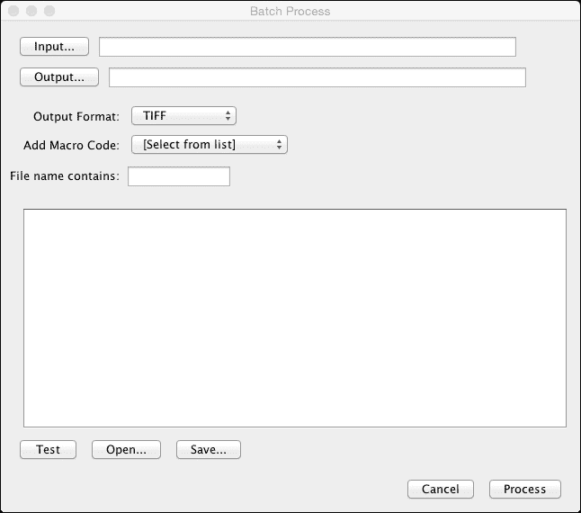

您可以使用按钮设置输入和输出文件夹。您还可以设置输出格式。如果您没有设置输出文件夹，图片将不会保存，除非您在自己的代码中保存它。您可以使用 ImageJ 附带的一个宏，通过**添加宏代码**选择器，或者您可以使用**打开…**按钮来加载自己的代码文件。为了指定您只想处理图像文件，您可以使用**文件名包含**字段来指定一个模式，通过输入（`.tif`）并包含括号来表示您只想处理 TIFF 文件。当您按下**处理**按钮时，文本字段中显示的代码将为每个匹配该模式的图片运行。

注意，您的宏需要遵循一些规则才能在批处理模式下使用。如果您希望在宏内部自行执行保存操作，您需要在宏中放置保存结果的代码，并在**批处理**对话框的**输出**字段中留空。为了执行我们之前宏中执行的任务，我们将整个代码复制到**批处理**对话框中。然后，我们将删除`processFolder()`函数及其调用，用一行代码替换它，该代码提供打开图像的当前目录，然后调用处理函数：

```java
fdir = File.directory();
processGreenChannel(fdir);
processRedChannel(fdir);

//processing functions...
```

我们可以在处理对话框中留空输出字段，因为图片是在我们的处理函数中保存的。我们可以在**文件名包含**字段中添加`(.tif)`以确保文本文件被跳过。当我们点击**处理**按钮时，文件夹将以类似的方式进行处理，并将结果存储在我们宏的处理函数中描述的方式。

这两种方法都非常适合处理整个文件夹，并且结果相似。最大的区别在于**批量处理**模式对处理步骤的控制略少，并且不允许递归处理文件夹和子文件夹。此外，在处理文件夹之前，无法包含多个用户输入或对话框。**批量处理**命令中的代码需要自给自足。任何用户输入都将在每次迭代中输入。

# 安装宏

一旦你创建了你的宏，你可以在 ImageJ 文件夹中的宏文件夹中保存它。当你想运行你的宏时，你可以转到**插件** | **宏** | **打开**或**插件** | **宏** | **运行**来打开和运行你的宏。你还可以将你的宏添加到宏菜单中。你可以通过从菜单中选择**插件** | **宏** | **安装…**来在 ImageJ 中安装一个宏。一旦你选择了你的宏，它将被添加到宏菜单的底部。你还可以将你的宏添加到`macros`文件夹中的`StartupMacros.txt`文件中。在此文件中提到的所有宏都将自动添加到宏菜单中。

### 注意

注意，在 Fiji 中，当你使用安装选项时，宏仅在该会话期间添加。一旦重启 Fiji，宏菜单将重置为默认内容。因此，建议你始终将你的宏和脚本放在 Fiji 的宏或脚本文件夹中。要始终在 Fiji 运行时加载它，请使用以下代码中描述的`StartupMacros.fiji.ijm`文件。

如果你想创建一个包含你经常使用的宏的按钮栏，你可以通过修改`StartupMacros.txt`文件（或 Fiji 的`StartupMacros.fiji.ijm`文件）来实现。如果你经常使用多个宏，这将非常有用。要将你的宏作为工具栏菜单添加，请在启动文件中的某个位置添加以下结构：

```java
var myTools = newMenu("My awesome tools",
newArray("Macro_1", "Macro_2", "-", "Macro_3"));

macro"My awesome tools - C037T0b11MT7b09aTcb09t" {
  cmd = getArgument();
  if(cmd== "Macro_1")
  runMacro("/PATH/TO/Macro_1_tool");
  else if(cmd == "Macro_2)"
  runMacro("/PATH/TO/some_other_tool");
}
```

`newMenu`方法的第一个参数是菜单项的名称；在这种情况下，我使用了`My awesome tools`。第二个参数向菜单添加一个宏命令数组，当添加到菜单中时，这些命令将在工具栏菜单中显示。如果在数组中添加破折号，则在该位置在菜单中添加水平分隔线。这可以用来将具有相似功能的宏分组。在定义菜单后，我们可以使用`if...else`结构实现菜单项，通过使用`getArgument`方法比较所选命令，以确定需要启动哪个工具。如果我们想知道运行宏所需的命令，我们可以启动宏记录器，然后转到**插件** | **宏** | **运行…**，选择我们的宏，并查看我们的宏命令是什么。

也可能给我们的菜单添加一个图标，这个图标需要在我们的宏实现后面指定为一个字符串。这个字符串由一系列指令组成，用于绘制我们用字母和坐标指定的元素。例如，如果我们想写出字符串**Mat**（**我的神奇工具**），我们可以使用以下字符串作为图标：

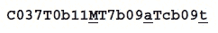

下划线的字符是我们希望添加的字母，而它前面的值是字体大小（分别为`11`、`09`和`09`）。字母`T`表示必须绘制字符，而它旁边的值表示字符的位置。还可以使用以下格式绘制多边形（这需要 ImageJ 1.48k）：

```java
Gxyxy...xy00

```

绘制这个图标可能有些复杂，在 Fiji 中有一个**Beanshell**脚本可以将图像转换为工具栏图标字符串。这可以通过打开一个图像并转到**插件** | **示例** | **图像到工具图标**来实现。还有一个提供更多灵活性和更高质量按钮的替代方案，这个替代方案是**ActionBar**，由*Jerome Mutterer*开发，这是一个创建可以按个人喜好设置的独立工具栏的插件。它还支持 PNG 格式的图标。

### 注意

ActionBar 的文档可以在[`imagejdocu.tudor.lu/doku.php?id=plugin:utilities:action_bar:start`](http://imagejdocu.tudor.lu/doku.php?id=plugin:utilities:action_bar:start)找到。它还包含了一个如何创建自己的工具栏以及如何在启动 ImageJ 时自动加载工具栏的示例。

# 摘要

在本章中，你学习了如何使用记录器创建宏，以发现我们可以应用的操作和函数。我们创建了一个基本的宏，该宏处理图像并生成新的图像。接下来，我们查看处理一个图像文件夹，并将生成的图像保存到磁盘上。最后，我们查看批处理模式，该模式允许 ImageJ 以类似的方式处理文件夹。在下一章中，我们将更详细地探讨可用于开发插件的构造以及如何设置插件开发环境。
