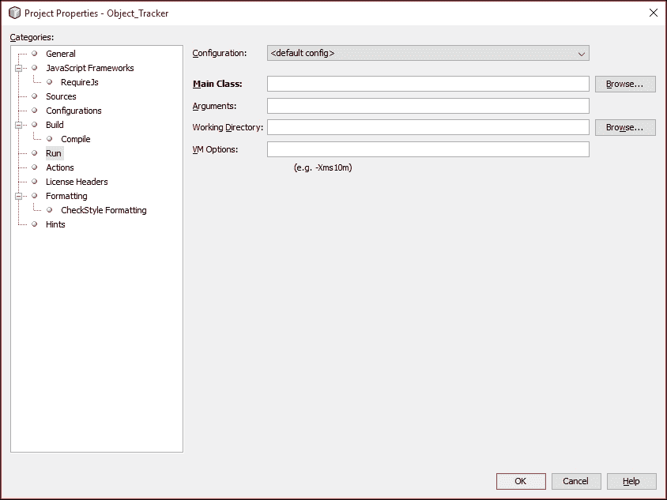
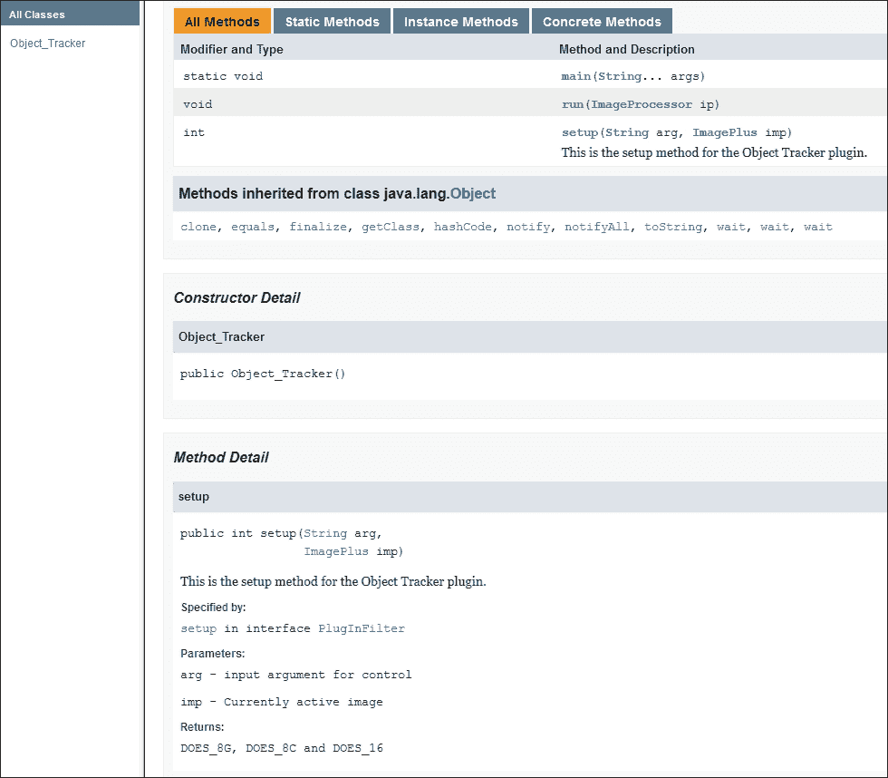
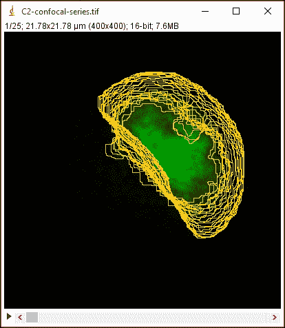
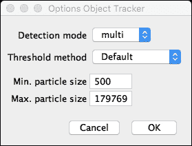
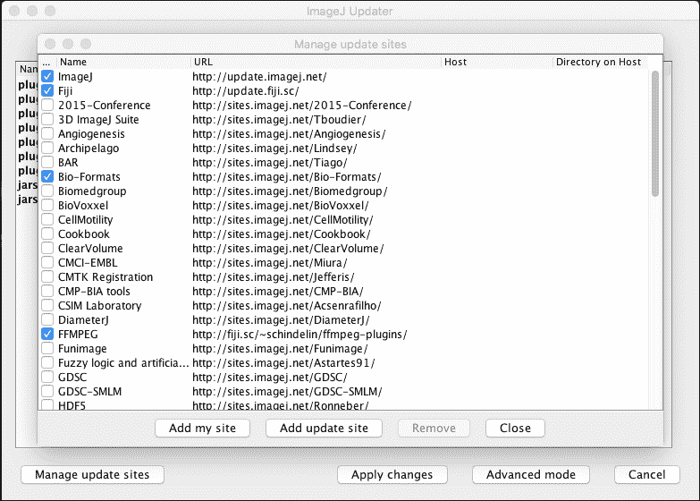

# 第九章。创建用于分析的 ImageJ 插件

在本章中，我们将探讨如何创建用于分析的插件。本章将探讨如何创建一个灵活的插件，以及如何在 ImageJ 中实现它以执行简单的分析。本章将涉及以下主题：

+   设置新的插件项目

+   使用插件处理和分析图像

+   添加用户交互和偏好

+   使用外部库

+   分享你的插件

# 插件背景和目标

在本节中，我将简要描述一个我们将尝试使用插件解决的问题。这个问题是一个普遍问题，在涉及活细胞或生物体的许多实验中都会遇到：它们会移动和改变形状。当我们想要量化我们所成像的细胞的一些方面时，我们需要执行三个基本步骤：

1.  检测感兴趣的对象。

1.  在当前帧中测量我们的对象。

1.  独立检测我们时间序列中的每个对象。

这些步骤在许多涉及时间序列的不同问题中都会遇到。对于这三个步骤中的每一个，我们需要创建一个解决方案来解决问题或以有意义的方式量化对象。对于检测，我们可以考虑许多可能适合检测对象的方法。当我们回顾到第四章中讨论的主题，*使用 ImageJ 进行图像分割和特征提取*时，我们可能会考虑一个基于阈值的分割图像的技术，并使用粒子分析器找到具有特定特征的物体。对于测量，我们可以回到第五章，*使用 ImageJ 进行基本测量*，在那里我们研究了使用 ImageJ 命令测量对象的基本方法。本例的最终组件使用前两种方法对每个识别的对象进行处理。

为了使我们的插件更加通用和广泛使用，我们还需要指定一些参数，这些参数将影响每个步骤的结果。检测可能需要根据数据的不同，对有效对象有不同的标准。为此，我们可以创建一个通用的对话框，通过几个输入字段向用户请求输入。我将给出不同场景下可以使用的相同代码的不同示例。

# 基本项目设置

对于此项目，我将使用 Maven 系统来设置项目和所需的依赖项。大部分源代码也可以不经过这些步骤运行，但我会使用 NetBeans IDE 和 Maven POM 项目来设置它。正如我们在 第七章 *ImageJ 构造解释* 中所看到的，使用 Maven 为 ImageJ 设置新项目是通过导航到 **文件** | **新建项目**，并在向导中的 **Maven** 类别中选择 **POM 项目** 来完成的。对于此插件，我将使用项目名称 `Object_Tracker`。点击 **完成** 后，项目将被创建，并应在 **项目** 视图中显示。如果您看不到 **项目** 视图，请从菜单中选择 **窗口** | **项目** 来显示它。

首先，我们需要告诉 Maven 我们需要 ImageJ 作为依赖项。我们通过在 `pom.xml` 文件中添加一个 `<dependencies>` 部分来实现，正如在 第七章 *ImageJ 构造解释* 中所展示的那样。我们将首先查看如何创建这个插件作为遗留插件，使用所有遗留插件的标准化编码。要将它编码为遗留插件，我们将通过在 `pom.xml` 文件中添加以下代码，将 ImageJ 版本 **1.50b** 作为依赖项：

```java
<repositories>
<repository>
  <id>imagej.public</id>
  <url>http://maven.imagej.net/content/groups/public</url>
  </repository>
</repositories>

<dependencies>
<dependency>
  <groupId>net.imagej</groupId>
  <artifactId>ij</artifactId>
  <version>1.50b</version>
  </dependency>
</dependencies>
```

`<repositories>` 部分告诉 Maven 我们依赖项的源在哪里，在可选的 `<version>` 标签中，我们指定我们希望使用的 ImageJ 版本。请注意，如果您在标签中开始输入版本号，NetBeans 将建议您可以输入的版本号。在撰写本文时，**1.50b** 是 ImageJ 的最新版本。如果您省略此标签，版本将自动设置为最新管理的版本。我们将保存对 POM 文件的修改，这将触发 NetBeans 从存储库加载请求的依赖项，并将其放置在项目中的 **依赖项** 文件夹内。如果您在此阶段为项目发出构建命令（**运行** | **构建项目**），我们仍然会得到一个错误。我们缺少插件的源代码；这将是我们的下一步。

要添加我们的源代码，我们需要在我们的项目中添加一个新的 Java 类文件。以下步骤将帮助您创建此项目的主体类文件；然而，这些步骤与生成您想要添加到同一项目的其他类是相同的：

1.  右键单击 `Object_Tracker` 项目，从上下文菜单中选择 **新建 | Java 类…**。

1.  将新类的名称输入为 `Object_Tracker`，并将 **位置** 设置为 `/src/main/java`。

你将得到一个新的 Java 源文件，在 **项目** 视图中，你会看到 **源包** 目录已被添加到你的项目中。现在你可以尝试再次构建项目，这次应该可以成功完成。由于 Maven 项目也可以为项目创建 Javadoc 文档，我们还将确保我们为我们的类添加 Javadoc 注释，并为我们的插件 API 记录方法。我们将通过将其实现为 `PlugInFilter` 类型来开始我们插件的开发。

# 创建一个基本的 PlugInFilter

要创建一个 `PlugInFilter` 实现，我们在类名后面添加 `implements` 关键字，并指定 `PlugInFilter` 作为实现。当你使用像 NetBeans 这样的 IDE 做这件事时，它会在该语句下放置一个红色的波浪线。当你将光标放在带有波浪线的行上并按 *Alt* + *Enter*（在 NetBeans 中）时，编辑器会给你一个建议列表来纠正我们犯的错误。第一个问题是 NetBeans 找不到 `PlugInFilter` 符号，因为我们还没有添加它。按 *Alt* + *Enter* 并选择名为 **添加导入** 的 `ij.plugin.filter.PlugInFilter` 选项。现在你会看到导入语句已经添加到你的源文件中（通常在源文件顶部）。我们现在仍然在我们的类声明中有波浪线，因为它缺少抽象设置和运行方法的覆盖。正如在 第八章 中所解释的，《ImageJ 插件的解剖》中的 `PlugInFilter` 要求这两个方法存在，并且用你的初始化代码（设置）和你的编程逻辑（运行）覆盖。使用 *Alt* + *Enter* 方法，并从选择列表中选择名为 **实现所有抽象方法** 的选项。在这个阶段，我们有一个基本的 `PlugInFilter` 实现包含了所有必需的元素。

## 测试当前实现

目前还没有功能性代码，但让我们测试一下在这个阶段尝试运行项目会发生什么。当你从菜单中选择 **运行** | **运行项目** 时，你会得到一个对话框，要求选择要运行的 `main` 类。由于我们尚未指定 `main` 方法（尚无），我们无法继续，只能选择取消。我们需要做两件事：首先，我们需要在我们的源代码文件中添加一个 `main` 方法，其次，我们需要告诉 Maven 哪个类包含 `main` 方法。我们将从列表中的第一项开始。

要添加 `main()` 方法，我们在类的主体中某个位置添加以下代码：

```java
public static void main(String... args) {

}
```

这是一个标准的 Java 风格的主方法声明，该方法接受存储在`args`变量中的`String`类型参数列表。`String`类型后面的三个点表示该方法可以通过可变数量的`String`参数调用，参数数量从零到多个。如果你希望通过**命令行界面**（**CLI**）运行你的插件，这种调用结构可能很有帮助。由于我们现在将主要忽略输入参数，所以在`main`方法体内使用它们并不重要。

对于第二步，我们可以以两种不同的方式修改我们的项目。我们可以在 POM 文件中的`<properties>`标签内输入`<main-class>`标签（见第七章，*ImageJ 构造解释*），或者我们可以使用 IDE 的功能。要编辑项目的运行方式，你可以在**项目**视图中右键单击项目，并从上下文菜单中选择**属性**。这将打开适用于此类项目的属性。从属性对话框的左侧选择**运行**类别：



现在，你可以看到有一个选项可以设置**主类**。通过按下**浏览…**按钮，你可以选择包含我们的`main`方法的`Object_Tracker`类。你可能还会注意到，你可以指定`main`方法的**参数**。此字段的内容将用作主方法参数`args`的输入参数。我们可能在稍后阶段也想输入的另一个选项是**VM 选项**字段。此选项将允许我们控制分配给应用程序的内存量。现在，只选择`Object_Tracker`作为**主类**。这将生成两个新的文件在 NetBeans 中，其中包含运行配置：`nbactions.xml`和`nb-configuration.xml`。或者，你可以按照第七章，*ImageJ 构造解释*中所述，将这些部分添加到`pom.xml`文件中。

### 注意

请注意，使用**属性**方法，你将限制你的应用程序使用 NetBeans 框架。如果你希望与不使用 NetBeans 的其他人交换代码，你始终应该选择纯 Maven 方法，并在`pom.xml`文件中直接定义你的`main`类。

如果你现在尝试通过导航到**运行** | **运行项目**来运行项目，你将不会得到任何错误，构建也将成功。唯一的问题是没有任何事情发生；我们没有看到 ImageJ，我们的插件也无法找到。我们仍然需要实现我们的主方法以确保 ImageJ 被启动。为此，我们在`main`方法中添加一个新的 ImageJ 实例，并保存源文件：

```java
public static void main(String... args) {
  new ImageJ();
}
```

通过添加`ij.ImageJ`的导入来修复错误后，我们运行项目，将看到 ImageJ 界面。如果你去**帮助** | **关于 ImageJ**，你会看到版本确实设置为**1.50b**。然而，当我们查看**插件**菜单时，我们不会在那里找到我们的插件。我们将使用第七章中展示的相同技巧，即*ImageJ 构造解释*，通过在调用`new ImageJ()`之前向我们的`main`方法中添加以下代码来修复我们的插件目录混乱：

```java
/* set the plugins.dir property to make the plugin appear in the Plugins menu */
Class<?> clazz = Object_Tracker.class;
String url = clazz.getResource("/" + clazz.getName().replace('.', '/') + ".class").toString();
int lastIdx = url.lastIndexOf('/');

String pluginsDir = url.substring(5, lastIdx);
System.setProperty("plugins.dir", pluginsDir);
```

保存源文件并运行项目后，我们现在将在**插件**菜单中看到我们的插件。当你启动插件时，你会得到一个错误，指出这个方法尚未实现。这是由于抽象的`setup`和`run`方法体中只包含一个被抛出的异常（这取决于你的 NetBeans 安装和模板）。我们已经完成了插件框架，接下来，我们将实现我们的功能。

## 实现 setup 方法

我们将首先实现`setup`方法，这个方法作为一个基本的检查点，用来查看我们的插件是否能够处理当前活动的图像。我们也可以使用这个方法来进行一些准备工作，并在运行插件之前进行一些基本的检查。我们将从清除`setup`方法体中的当前语句开始，并添加一个返回值。`setup`方法要求返回一个整数值，这个值告诉 ImageJ 可以使用这个插件处理哪种类型的图像。我们还将为此函数添加一些 Javadoc 注释来解释这个函数中正在发生的事情。对于这个项目，我将假设以下结构是源代码文件的结构：

```java
//import section
import ij.ImageJ;

//class declaration
public class Object_Tracker implements PlugInFilter {
  //class-wide variables
  private ImagePlus imp;
  /*etc...*/

  //constructor
  public void Object_Tracker() {}

  //main method
  public static void main(String... args) {}

  //setup method
  public int setup(String arg, ImagePlus imp) {}

  //run method
  public void run(ImageProcessor ip) {}

  //additional methods follow below this point
  /*methods for image processing*/

}
```

你当然可以偏离这个模板（在 Java 语法和编程逻辑的范围内）。这种结构在 Java 文件中很常见，它包含一些不是严格必需但可能有用的元素。构造函数不是必需存在于 ImageJ 插件中。然而，添加它可能是有用的，因为它允许在你想在其他项目中调用你的插件时提高可用性。使用构造函数，你可以实现某些初始化或控制插件创建的方式。

### 返回类型和自动完成

我们将首先添加一个返回语句，指定我们期望处理的图像类型。对于这个项目，我们感兴趣的是在单个通道（目前）内随时间量化对象，因此我们期望处理 8 位或 16 位的堆栈。因此，我们添加以下返回语句：

```java
return DOES_8C+DOES_8G+DOES_16;
```

在 IDE 中输入时，你可以使用它的自动完成功能来确定你希望返回的类型。如果你输入 `DOES` 并按 *Ctrl* + 空格键，你将得到一个可能的自动完成选项列表。你可以使用鼠标或箭头键从列表中选择一个选项，并通过双击它或按 enter 键将其插入到你输入的位置。如果选项列表非常长，你还可以在按 *Ctrl* + 空格键后继续输入。对于你添加的每个字符，列表将变得更加具有选择性，以匹配你输入的内容。例如，当你输入 `_1` 在你输入 `DOES` 之后，你将只得到单个选项 `DOES_16`。另一个很好的功能是，当你从自动完成列表中选择一个选项时，它也会显示该选择的 Javadoc。然而，你可能已经注意到这在这里不起作用；IDE 表示未找到 Javadoc。我们将在下一节中解决这个问题。

### 方法 Javadoc

正如我们所见，我们的 ImageJ 项目的 Javadoc 未找到。我们现在将使用 IDE 修复此问题，这只需要几个简单的步骤。首先，我们确保我们的 Javadoc 视图已打开，通过激活它。从菜单中选择 **窗口** | **IDE 工具** | **Javadoc 文档** 来激活视图。当我们把光标放在我们上面输入的 `DOES_16` 语句等对象上时，Javadoc 视图将显示我们在自动完成窗口中注意到的相同信息。然而，它还在底部显示一个名为 **附加 Javadoc…** 的链接形式的选项。当你点击它时，一个窗口会要求你提供文档的位置。还有一个名为 **下载** 的按钮，它将自动下载我们项目中列为依赖项的 ImageJ 版本的 Javadoc。点击确定后，你现在会看到 Javadoc 视图显示了 `DOES_16` 字段的文档。你还可以通过在项目视图中右键单击你的项目并从上下文菜单中选择 **生成 Javadoc** 来为你的项目生成 Javadoc。

我们现在将为我们的设置方法创建自己的 Javadoc 注释。使用 IDE 的最简单方法是，将光标放在设置方法上，然后按 *Alt* + *Enter*。将显示一个选项，表明 **为设置创建缺失的 Javadoc**，我们将选择此选项。

### 注意

你也可以将光标放在你想要文档化的方法上方，并输入 `/**`，然后按 *Enter*。在 NetBeans 中，输入 Javadoc 注释的开始并按 *Enter* 将自动完成 Javadoc 注释，并且它还会添加你方法的参数和返回类型。

选择此选项后，将在设置方法上方添加一个 Javadoc 注释，包含以下信息：

```java
/**
 *
 * @param arg
 * @param ip
 * @return
 */
```

这是描述具有输入参数和返回值的方法的 Javadoc 部分的常规内容。参数被指定为`@param`后跟变量名。方法参数列表中的每个参数都有一个`@param`行。要添加有关参数的信息，你可以在变量名后开始输入（确保变量名和你的描述之间有一个空格）。参数列表上方的第一行旨在提供方法目的的简要描述。让我们添加一些关于`setup`方法的信息：

```java
/**
 * This is the setup method for the Object Tracker plugin
 *
 * @param arg input argument for control
 * @param ip Currently active image
 * @return DOES_8G, DOES_8C and DOES_16
 */
```

当你现在查看 Javadoc 查看器时，你会看到你添加的文本被显示和格式化。请注意，你可以使用标准的 HTML 标签来格式化你的文本，包括段落、标题、表格和列表。在这个阶段，你可以生成你插件的 Javadoc 并在浏览器中查看。要做到这一点，在**项目**视图中右键单击你的项目，并从上下文菜单中选择**生成 Javadoc**。在 IDE 忙于扫描项目和构建文档的等待片刻后，你可以通过从项目根目录下的`target/site/apidocs/`文件夹打开`index.html`文件来在浏览器中打开 Javadoc。或者，你也可以点击**输出**视图中的链接，该链接可以通过从菜单导航到**窗口** | **输出**来激活。结果如下：



在前面的屏幕截图中，你可以看到我们添加的文本作为描述的`setup`方法，底部我们看到的是我们输入的参数和返回值的详细信息。

在开发源代码时添加此类信息是一种良好的做法，这不仅有助于你在几周后回顾自己的代码，也有助于其他可能希望在自己的项目中使用或扩展你的代码的开发者。由于 Javadoc 工具负责处理和布局文档，你只需要添加方法和类的描述。我不会在本书的代码片段中明确添加文档部分，但它们将是最终源代码的一部分。在这次短暂的偏离之后，我们将返回到创建检测对象的插件。

### 完成设置方法

完成前几节内容后，我们现在有一个带有返回值的`setup`方法，表示我们将处理所有 8 位或 16 位图像和图像堆栈。现在我们将执行一些必要的检查，以确保处理完成。第一步是确保 ROI 管理器已打开，这样我们才能看到检测结果和我们的检测结果。在这个阶段，考虑我们可能想要处理的图像类型可能也是一个好主意。我们是要处理 RGB 或多通道图像和图像堆栈，还是只处理单通道图像堆栈？

我们将从检查 ROI 管理器是否可用开始。为此，我们可以使用 `RoiManager` 类中的 `getInstance()` 方法。当它尚未打开时，此方法将返回 `null` 值；否则，它将返回 ROI 管理器实例的引用。在返回语句之前，将以下内容添加到 `setup` 方法中：

```java
if(RoiManager.getInstance() == null) {
  new RoiManager();
}
```

如果你使用了自动完成选项来选择 `RoiManager` 类，NetBeans 也会自动在你的源代码文件顶部添加所需的导入语句。如果你复制并粘贴了代码，你需要自己使用 *Alt* + *Enter* 选项或手动输入来添加导入语句。

在设置过程中，剩下要做的就是检查图像类型；它需要是单通道图像，包含单个帧或切片，或者多个帧和单个切片。第一步是获取当前图像的尺寸，然后检查它是否符合我们的规格。对于当前版本的插件，我将使这些规格具有约束力，这样当它失败时，插件将不会运行。检索尺寸并检查它们是否符合我们规格的代码如下：

```java
//get the dimensions of the current image
int[] dims = ip.getDimensions();
if (dims[2] > 1){
  //more than 1 channel
  return DONE;
}
else if(dims[3] > 1 && dims[4] > 1) {
  //multiple slices AND frames
  return DONE;
}
```

`getDimensions()` 方法返回一个长度为 `5` 的向量，包含宽度、高度、通道、切片和帧（按此顺序）。

在这个阶段，我想介绍 IDE 的另一个有用功能，这将使你的编码生活变得更加容易。当 IDE 添加设置和运行时的抽象方法时，它为 `setup` 方法中的 `ImagePlus` 类型以及 `run` 方法中的 `ImageProcessor` 类型都使用了 `ip` 参数名称。这有点令人困惑且不一致。`ImagePlus` 对象的惯例是使用 `imp` 作为引用名称，而 `ip` 用于 `ImageProcessor` 引用。我们现在将使用 IDE 中的 **重构** 选项来解决这个问题。

我们首先选择我们想要更改的参数；在这种情况下，`setup` 方法中的 `ip` 参数。然后我们转到上下文菜单中的 **重构** | **重命名** 或按 *Ctrl* + *R*。现在你会看到参数周围有一个红色框，你可以通过输入新名称来更改名称。当你现在输入 `imp` 时，你会看到只有与 `setup` 方法相关的名称被更改。这不会影响 `run` 方法的参数。此外，Javadoc 部分也更新以反映新的变量名称。这是一个在更改变量名称时非常有用的功能，它比搜索和替换风格的方法更有效。如果你使用了搜索和替换，`run` 方法中的变量名称也可能被更改，使其再次不一致。

如果我们现在运行我们的项目，我们应该在**插件**菜单中看到插件，但当我们启动它时，我们将收到一个`NullPointerException`异常。这是由于我们试图从一个不存在的图像中检索尺寸。因此，我们在调用`getDimensions()`方法之前需要添加一个最后的检查，以检查`imp`参数是否不等于`null`：

```java
if (imp == null) { return DONE; }
```

这将确保在没有打开图像或与插件期望的图像类型不正确时不会发生任何操作。目前这并不非常用户友好。当用户激活插件时，他们期望发生某些操作。如果有一些反馈来指示为什么没有发生任何操作，那将很好。例如，我将添加一条消息，说明插件在退出之前需要打开一个栈。为此，我们在检查图像的主体中添加以下语句：

```java
if (imp == null) {
  IJ.showMessage("We need a single channel stack to continue!");
  return DONE;
}
```

现在当你运行你的项目并启动插件时，将显示以下消息：


这使得操作更加用户友好，并避免了生成不必要的错误，这些错误可能会使用户感到困惑。编译器生成的错误和异常最多是晦涩难懂的，大多数非程序员都不会明白出了什么问题。现在我们已经完成了 setup 方法的设置，我们将现在专注于实现实际的功能代码，该代码将执行处理。

## 实现 run 方法

如第八章《ImageJ 插件的解剖结构》中所述，run 方法是`PlugInFilter`类型的入口点。在这个阶段，我们肯定有一个 8 位或 16 位的单通道栈；否则，我们永远不会达到 run 方法。现在我们可以开始实现我们的算法来检测对象。之后，我们将查看测量当前帧中对象的所需方法，最后，在存在多个对象的情况下，我们将探讨如何处理每一帧中的每个对象。我们将首先从检测开始，因为这是需要解决的主要步骤。

### 检测对象

为了能够检测对象，我们需要了解一些使对象可识别的属性。这听起来可能比实际情况简单。人类的视觉系统在所有类型的照明条件和情况下都能高度有效地找到对象。计算机算法才刚刚开始接近人类感觉自然的那种检测水平。在这个例子中，我将基于对象相对于背景的强度来限制对象的检测。我将假设我们希望检测的对象相对于较暗的背景是明亮的，例如在荧光成像的情况下。我们将使用**Confocal Series**样本图像作为练习的例子。

在我们开始使用这张图片之前，需要做一些小准备。这张图片包含两个通道，这是我们的插件的一个排除标准！因此，我们将图片分割成单独的通道，并在保存到磁盘作为 TIFF 文件之前，将其中一个通道转换为 16 位。通过使用第二章，*使用 ImageJ 的基本图像处理*和第三章，*使用 ImageJ 的高级图像处理*的知识，你应该能够执行这些步骤。我们将使用阈值来根据强度检测对象，并基于这个阈值创建一个将被添加到 ROI 管理器的选择。对于检测，我们将创建一个名为`performDetection()`的方法，它将从`run`方法中被调用。由于我们假设一个堆栈，我们还需要添加一个循环来遍历每个切片。我们将在`run`方法中从循环语句开始：

```java
int nFrames = imp.getImageStackSize();
for (int f=0; f<nFrames; f++) {
  imp.setSlice(f+1);
  ip = imp.getProcessor();
  performDetection(ip);
}
```

注意`setSlice`方法的略微异常行为。与 Java 中的数组和其他索引对象不同，图像的切片索引不是基于零的。这种古怪的行为在第二章，*使用 ImageJ 的基本图像处理*中已经观察到。接下来，我们创建执行检测的方法，并添加以下语句：

```java
private void performDetection(ImageProcessor ip) { ip.setAutoThreshold(AutoThresholder.Method.Default, true);
  imp.setProcessor(ip);
  Roi roi = ThresholdToSelection.run(imp);
  rm.addRoi(roi);
}
```

这使用默认方法（第一个参数）和深色背景（第二个参数）设置自动阈值。当使用自动完成选项时，许多这些值将默认填充，这使得编写代码更容易，但并不一定有助于理解。然后我们使用对类定义中添加的类级别变量的引用将新的阈值添加到当前图像中（参见前面提到的类文件模板）。

```java
public class Object_Tracker implements PlugInFilter{
  private ImagePlus imp;
  private RoiManager rm;
```

这使得我们可以在整个类中访问当前图像和 ROI 管理器。我们还稍微修改了`setup`方法，以适应这些变化，使用`rm`引用获取实例或存储对 ROI 管理器的新引用。我们同样为类级别的`ImagePlus`变量（`this.imp`）执行相同的操作，通过存储`setup`方法中传入的当前图像。

```java
rm = RoiManager.getInstance();
if(rm == null) { rm = new RoiManager();}

this.imp = imp;
```

要将我们的阈值对象添加到 ROI 管理器，我们使用 ImageJ 附带的一个名为`ThresholdToSelection`的类（另一种`PlugInFilter`类型）。这是当你从 ImageJ 菜单导航到**编辑** | **选择** | **创建选择**时被激活的类。这是一个很好的例子，说明一个插件调用了另一个插件的`run`方法。这意味着我们也可以在其他插件或宏中使用我们插件的`run`方法。

现在，我们将通过运行项目并打开我们在启动插件之前保存的一张图像来测试我们的插件。它现在应该运行通过堆栈的所有切片，并在每一帧填充 ROI 管理器。ROI 看起来相当不错，但仍然存在一些小问题。一些 ROI 中存在孔洞，有些 ROI 有与主要对象不相连的小孤立像素。在下一节中，我们将探讨使用我们在第四章学到的技术来细化检测的方法，即《使用 ImageJ 进行图像分割和特征提取》。

### 精细化检测

在上一节的最后测试插件时，我们注意到了当前仅使用阈值进行检测的方法的一些不足。我们看到了物体中的孔洞和希望去除的小孤立像素。这是可以使用第四章中讨论的二值处理实现的事情，即《使用 ImageJ 进行图像分割和特征提取》。现在，在我们将阈值转换为选择之前，我们将实现这种处理。第一步是使用我们的 ROI 创建一个掩码图像，我们将使用我们在第四章学到的技术来处理这个掩码图像。为了创建我们的掩码图像，我们执行以下操作：

```java
ImagePlus impMask = new ImagePlus("mask", new 
  ByteProcessor(imp.getWidth(), imp.getHeight()));
impMask.setRoi(roi);

ImageProcessor ipMask = impMask.getProcessor();
ipMask.setColor(255);
ipMask.fill(impMask.getMask());
ipMask.invertLut();
```

此代码插入到`performDetection`方法中的`Roi roi...`语句和`rm.addRoi(roi)`语句之间。第一行创建了一个名为 mask 的新图像，使用`ByteProcessor`作为`ImageProcessor`；这导致了一个 8 位图像。宽度和高度被设置为与原始图像相等。当你想要在原始图像中测量对象时，这是很重要的。如果你直接从图像创建掩码，其大小将是 ROI 的边界矩形的大小。接下来，我们将 ROI 添加到新图像中，并获取该图像的`ImageProcessor`引用。这将允许我们修改掩码的像素。接下来，我们将前景色设置为白色（255）并用白色填充掩码。最后，我们反转二值处理的 LUT。接下来，我们将执行二值处理。我们想要填充形状中的孔洞并去除孤立像素。

我们将使用`Binary`插件开始填充形状中的孔洞。这是一个实现了`PlugInFilter`的类；然而，这次的使用略有不同。我们首先需要创建类的实例，然后设置类以适应我们的目的。我们将在上一段代码列表的最后一行下面直接添加以下代码：

```java
Binary B = new Binary();
B.setup("fill", impMask);
B.run(ipMask);
```

首先，我们创建`Binary`类的新实例，并在我们的源代码文件顶部添加`ij.plugin.filter.Binary`的导入语句。接下来，我们设置插件以执行我们想要的任务，在这种情况下，填充我们的掩模中的孔。我们通过调用带有`String`参数（`"fill"`）和`ImagePlus`参数（我们的掩模图像）的`setup`方法来完成此操作。我们的插件具有类似的设置形式；这意味着我们也可以选择稍后实现类似系统。在最后一步，我们调用`Binary`插件的`run`方法，它将在我们的图像上执行实际处理。

接下来，我们将使用腐蚀和膨胀算子来去除孤立像素。我们将腐蚀算子运行三次，膨胀算子运行五次以创建平滑的掩模：

```java
for (int i=0;i<3; i++) {ipMask.erode();}
for (int i=0;i<5; i++) {ipMask.dilate();}
```

这些值相当随意，当使用不同的图像时，其他值可能更合适。最后，我们使用`ThresholdToSelection`方法在我们的掩模图像上设置一个阈值，以获得一个新的 ROI，就像我们之前做的那样：

```java
roi = ThresholdToSelection.run(impMask);
impMask.setRoi(roi);
rm.addRoi(roi);
```

我们再次使用`roi`变量，因为我们不需要在原始图像中创建的 ROI。然后我们将新的 ROI 添加到 ROI Manager 中，这是我们的检测的最后一步。如果你运行项目并在测试图像上尝试，你会看到二值处理的效应——ROI 变得更加平滑，几乎不再包含孤立像素。以下图像显示了所有 ROI 叠加在原始堆栈的第一帧上。我使用了绿色通道作为这个例子，但你也可以尝试在红色通道上运行插件。



### 检测多个对象

到目前为止，我们假设我们的帧中只有一个对象。现在我将研究一种允许检测多个对象的方法。为此，我们将使用我们在第三章中学习的技术，即《使用 ImageJ 的高级图像处理》。在那里，我们研究了 Z 投影以及它们如何将堆栈展平成单个图像。现在我们将使用同样的技术来定义我们的搜索空间以检测时间序列中的对象。通过创建最大强度投影，我们可以可视化对象在时间序列中某个时刻或某个时刻之后将占据的所有像素。这个投影将帮助我们定义搜索空间。对于不重叠的*N*个对象，你会得到*N*个搜索空间。

首先，我们需要创建最大强度投影。为此，我们可以使用`ZProjector`类，并使用`MAX_METHOD`将其设置为最大强度：

```java
//create a maximum intensity projection
ZProjector zp = new ZProjector(imp);
zp.setMethod(ZProjector.MAX_METHOD);
zp.doProjection();
ImagePlus impMax = zp.getProjection();

//set a threshold in the maximum intensity projection
ImageProcessor ipMax = impMax.getProcessor();
ipMax.setAutoThreshold(AutoThresholder.Method.Default, true);
impMax.setProcessor(ipMax);
```

我们首先使用原始栈作为输入创建一个新的`ZProjector`实例。接下来，我们设置要使用的方法，并执行投影。最后，我们使用`getProjection()`方法检索最大强度投影图像。接下来，我们将使用`ParticleAnalyzer`类来检测我们最大强度投影中的对象，这些对象将定义我们的搜索空间。

要使用粒子分析器，我们创建该类的实例并设置其参数以确定搜索空间。在这个例子中，我们想要找到相对较大的对象，所以我们将为粒子设置最小尺寸限制，但不为形状设置限制。为此，我们可以使用以下代码：

```java
//set the options for the particle analyzer
int nOpts = ParticleAnalyzer.ADD_TO_MANAGER;
int nMeasures = ParticleAnalyzer.SHOW_NONE;
double dMin = 500.0; 
double dMax = Double.MAX_VALUE

//perform the particle analysis
ParticleAnalyzer pa = new ParticleAnalyzer(nOpts, nMeasures, new ResultsTable(), dMin, dMax);
RoiManager rmMax = new RoiManager(true);
ParticleAnalyzer.setRoiManager(rmMax);
pa.analyze(impMax);

//get the detected particles
Roi[] searchSpaces = rmMax.getRoisAsArray();
```

我们首先设置选项和我们要进行的测量。在这种情况下，我们只关心找到的对象的位置，因此我们需要在检测结束时设置 ROI（由`ADD_TO_MANAGER`选项指示）。测量选项设置为无，以避免生成结果或其他对象（由`SHOW_NONE`指示）。然后我们使用指定的选项和大小初始化粒子分析器。接下来，我们创建一个 ROI Manager 的实例，这个实例将不会显示。在我们使用`analyze()`方法分析图像之前，这个 ROI Manager 的实例将被分配给我们的粒子分析器。这是必要的，因为我们不想测量这些中间 ROI，我们只使用它们来识别和处理每个搜索空间。在最后一步，我们从临时的 ROI Manager 实例中提取搜索空间作为 ROI 对象。定义了搜索空间后，我们可以开始对每个搜索空间进行单独的检测。

检测可以通过与之前类似的方式创建，但有一些小的改动：我们不是使用整个图像，而是希望在单个对象的搜索空间内进行检测。我们可以通过在图像上设置搜索空间 ROI 并使用`duplicate()`方法进行复制来实现这一点。然后我们可以访问这个裁剪区域的像素：

```java
//perform the detection for each search space
for (Roi searchSpace : searchSpaces) {
  imp.setRoi(searchSpace);
  impProcess = imp.duplicate();
  for (int f = 0; f < nFrames; f++) {
    impProcess.setSlice(f + 1);
    ip = impProcess.getProcessor();
    performDetection(impProcess, ip);
  }
}
```

我们使用 for-each 语法对每个搜索空间都这样做，并像之前一样进行检测。还有一些其他的改动是必须的，所以请查看 Packt Publishing 网站上列出的完整代码。

## 实施测量

现在我们已经为每个切片确定了对象，我们可以开始测量我们的对象了。我们将使用第五章中的一些知识，即*使用 ImageJ 进行基本测量*，来设计针对该对象的测量方法。根据对象类型，我们可能需要考虑不同的可能重要的测量，但我将首先从我们创建的 ROI 类型的一些明显指标开始。我们的 ROI 是面积选择，因此第一个似乎相关的指标是对象（们）的面积。其他相关的测量包括对象（们）的平均强度和形状。我们将在类中添加一个单独的方法来实现这些测量。该方法将具有以下声明：

```java
private void performMeasurements() {
  Analyzer.setMeasurements(msrmnt);
  imp.unlock();
  rm.runCommand(imp,"Measure");
}
```

我们将使用 ROI 管理器中的 ROI，这样我们就不需要输入参数。我们将通过在类声明开头添加一个名为`msrmnt`的变量来设置测量值，这些值是我们之前讨论过的：

```java
private static final int msrmnt = Measurements.SLICE + Measurements.AREA + Measurements.CIRCULARITY + Measurements.MEAN;
```

这用于将测量值设置为切片号、面积、圆形度和平均值。我们使用`Analyzer`类及其`setMeasurements`方法来获取所需的结果。最后，我们在图像上调用`unlock`方法，以便 ROI 管理器的宏命令能够访问我们的图像进行测量。如果您省略此语句，插件将无错误地运行，但您将不会得到任何结果。要获取结果，我们将在循环结束后直接调用我们的测量方法。在下一节中，我们将向我们的插件添加一些用户交互，允许我们更改检测中使用的某些参数。我们还将介绍 ImageJ 的偏好设置系统，以便存储我们的参数以供将来使用。

# 添加用户交互和偏好设置

我们迄今为止创建的插件作为一个独立插件运行良好。然而，通过允许它在包含大量数据文件的文件夹中以批处理模式运行，我们也可以很容易地增强其功能。本节将探讨需要整合的一些更改，以便它能够正常工作。通过将某些步骤设置为可以在主类实例化时调用的独立方法，我们可以以与其他类类似的方式执行特定步骤。在我们的例子中，我们以类似的方式使用了`ParticleAnalyzer`、`ThresholdToSelection`和`Binary`插件类。我们只需要添加一些常量和默认设置，以便这个类能够以最小配置工作。在接下来的章节中，我将向您展示一些修改，可以使这个类在与其他插件一起使用时更加灵活。

## 设置和选项对话框

我们插件中有几个参数会影响其行为。例如，粒子大小和阈值方法等变量会影响结果，并且需要调整以匹配数据。ImageJ 允许您设置和获取特定于您插件的偏好设置。它使用一个键值系统，使用特定的键名存储偏好设置的值。键名是一个字符串，最好对您的插件是唯一的。要设置和获取偏好设置，例如最小粒子大小，您可以使用以下语法：

```java
Prefs.set("object_tracker.minParticleSize", 500.0);
double DMIN = Prefs.getDouble("object_tracker.minParticleSize", 500.0);
Prefs.savePreferences();
```

第一行显示了如何使用 `object_tracker.minParticleSize` 键将双精度值 `500.0` 存储到偏好设置中。键的命名没有严格的约定，但使用 `<class name>.<key name>` 构造确保键是唯一且可识别的。第二行从偏好设置中检索设置。提供的第二个值是默认值。如果键不存在，`DMIN` 变量将设置为该默认值（在这种情况下为 `500.0`）。最后，我们可以使用 `savePreferences()` 方法保存偏好设置。

要更改我们插件中使用的值，我们可以显示一个小对话框，允许用户输入值或进行选择。当我们使用对话框时，我们将结果保存在偏好设置中。这意味着从现在起我们可以将其作为批处理过程运行。为了让用户设置检测的关键参数，我们可以创建以下偏好设置对话框：



这是通过在 `ij.gui` 包中可用的 `GenericDialog` 类实现的。您首先创建 `GenericDialog` 类的一个实例，然后按照您希望它们显示的顺序将您选择的字段添加到其中。对于这个例子，我们想要设置检测模式、阈值方法、最小粒子大小和最大粒子大小。如果您愿意，可以向偏好设置中添加更多参数以提供更多灵活性。以下代码将创建一个对话框，添加字段，并显示它：

```java
//construct and show the options dialog
GenericDialog gd = new GenericDialog("Options Object Tracker");
gd.addChoice("Detection mode", (new String[]{"multi", "single"}), DETECT_METHOD);
gd.addChoice("Threshold method", AutoThresholder.getMethods(), THRESH_METHOD);
gd.addNumericField("Min. particle size", DMIN, 0);
gd.addNumericField("Max. particle size", DMAX, 0);
gd.showDialog();

//store the values
Prefs.set("object_tracker.detectMethod", gd.getNextChoice());
Prefs.set("object_tracker.threshMethod", gd.getNextChoice());
Prefs.set("object_tracker.minParticleSize", gd.getNextNumber());
Prefs.set("object_tracker.maxParticleSize", gd.getNextNumber());
```

最后，我们使用键存储用户在偏好设置中选择的值。要获取值，我们使用 `getNext<>` 方法。这些方法按照字段添加到对话框中的顺序调用，因此 `getNextChoice` 的第一次调用将获取第一个选择列表的值（在这种情况下是检测模式选择）。`getNextNumber` 的调用将检索第一个数字字段中的数字（在这种情况下是最小粒子大小）。在 `GenericDialog` 实现中，字段的顺序在添加字段时变得固定，因此在检索值时需要考虑这一点。请参阅列表 9.2 以获取插件的完整代码。

# 添加外部库

当你为处理创建了一个插件时，你可能想要添加一些在 ImageJ 核心 API 中不可用的功能。在这种情况下，你可能想要使用一个具有你所需要功能的第三方库。如果你使用 Maven 来设置你的项目，添加一个库就像在你的 POM 文件中的`<dependencies>`部分列出它一样简单。作为一个例子，我将向你展示如何添加 Apache POI 库来添加一个选项，以便将我们工作的结果导出到一个 MS Excel 文件。这个库的优点是它可以在所有平台上创建`.xls(x)`文件，无论 MS Excel 是否已安装。我将简要向你展示如何创建一个 Excel 文件，向其中写入一些数据，然后将结果保存为`.xls`文件。

## 添加 Apache POI 的依赖项

要在 POM 文件中添加 POI 项目的依赖项，你需要在`<dependencies>`部分添加`org.apache.poi`项目。IDE 可以使用其自动完成功能帮助你完成这个过程。假设你创建了一个类似于以下所示的简单依赖项模板：

```java
<dependency>
  <groupId></groupId>
  <artifactId></artifactId>
  <version></version>
</dependency>
```

在这种情况下，你可以将光标放在`<groupId>`标签内，然后按*Ctrl* + 空格键。你将得到一个你可以选择的可能 ID 列表。当你开始输入第一部分（`org.`）时，你会注意到随着你继续输入，列表变得更加有限。当你输入到`org.apache.po`时，列表中只包含两个选项，包括 POI 包。如果你对剩余的标签重复此过程，你可能会得到以下依赖项部分：

```java
<dependency>
  <groupId>org.apache.poi</groupId>
  <artifactId>poi</artifactId>
  <version>3.13</version>
</dependency>
```

到目前为止，你可以开始使用这个库及其接口、类和方法来创建一个 Excel 文件（或 Word 文档和 PowerPoint 演示文稿）。请注意，用于 Excel 文件的包被指定为**HSSF**标识（**Horrible SpreadSheet Format**）。在保存 POM 文件后，你将在项目的依赖项文件夹中获得一个新的 JAR 文件。在这种情况下，是`poi-3.13.jar`文件，它包含 POI 项目的包。在继续之前，确保通过导航到菜单中的**Run** | **Build Project**来构建你的项目。我们现在将查看如何在下一节中实现这个库。

## 创建一个 Excel 文件

要创建一个 Excel 文件，我们需要使用 Apache POI 创建一个新的 Excel 工作簿实例。这通过`org.apache.poi.ss`中的`usermodel`包相对简单。我们创建一个 Workbook 接口的实例，并在一个名为`saveResultsToExcel`的方法中添加一个包含数据的特定名称的工作表。每次我们添加一个新的类，我们都可以通过按*Alt* + *Enter*自动添加我们的导入语句。只需确保你选择了正确的选项。如果你想添加`Cell`类，你有多个选项，但在这个例子中我们需要`org.apache.poi.ss.usermodel.Cell`的包：

```java
public void saveResultsToExcel(String xlFile, ResultsTable rt) {
  FileOutputStream xlOut;
  try { xlOut = new FileOutputStream(xlFile); }
  catch (FileNotFoundException ex) {
    Logger.getLogger(Object_Tracker.class.getName()).log(Level.SEVERE, null, ex);
  }

  Workbook xlBook = new HSSFWorkbook();
  Sheet xlSheet = xlBook.createSheet("Results Object Tracker");
  Row r = null;
  Cell c = null;
  CellStyle cs = xlBook.createCellStyle();
  Font f = xlBook.createFont();
  Font fb = xlBook.createFont();
  DataFormat df = xlBook.createDataFormat();
  f.setFontHeightInPoints((short) 12);
  fb.setFontHeightInPoints((short) 12);
  fb.setBoldweight(Font.BOLDWEIGHT_BOLD);
  cs.setFont(f);
  cs.setDataFormat(df.getFormat("#,##0.000"));
  cb.setDataFormat(HSSFDataFormat.getBuiltinFormat("text"));
  cb.setFont(fb);

  int numRows = rt.size();
  String[] colHeaders = rt.getHeadings();
  int rownum = 0;
  //create a header
  r = xlSheet.createRow(rownum);
  for (int cellnum=0; cellnum<colHeaders.length; cellnum++) {
    c = r.createCell(cellnum);
    c.setCellStyle(cb);
    c.setCellValue(colHeaders[cellnum]);
  }
  rownum++;

  for (int row=0; row<numRows; row++) {
    r = xlSheet.createRow(rownum+row);
    int numCols = rt.getLastColumn() + 1;
    for (int cellnum=0; cellnum<numCols; cellnum++) {
      c = r.createCell(cellnum);
      c.setCellValue(rt.getValueAsDouble(cellnum, row));
    }
  }
  try { xlBook.write(xlOut); xlOut.close();}
  catch (IOException ex) {
    Logger.getLogger(Object_Tracker.class.getName()).log(Level.SEVERE, null, ex);
  }
}
```

在这个例子中，我假设数据是以 ImageJ 的`ResultsTable`对象的形式存在的。在循环中，我们遍历行，然后逐列向每一行添加单元格。我们使用结果表的标题在 Excel 文件中创建标题。我们使用一个单独的`Font`对象（在这个例子中是`fb`）通过使其加粗来使样式与数据不同。最后，我们使用通用的`FileOutputStream`类将结果保存到文件中。

要获取在 ROI 管理器中按下**测量**按钮时生成的结果表，你可以使用以下代码：

```java
ResultsTable rt = ResultsTable.getResultsTable();
```

在询问用户文件名之后，你可以调用`saveResultsToExcel`方法来生成一个 Excel 文件。上面的示例代码仅用于生成`.xls`文件。要生成`.xlsx`文件，你需要实现`XSSFWorkbook`类的电子表格。这两种 Excel 格式之间的主要区别在于一个工作表上可以包含的数据量；`.xls`文件每个工作表有 255 列的限制。如果你预计要生成包含更多列的表格，你需要确保使用`XSSFWorkbook`类。

# 分享你的插件

当你完成所有例程的实现并完成了（广泛的）测试后，你就可以将你的插件分发到全世界了。目前，有几种分发插件的方法可供选择，从通过电子邮件发送到 ImageJ 的自动更新机制。在这里，我将讨论后者，它具有一些很好的优点，使得它非常用户友好且高效。Fiji 和 ImageJ2 有一个系统，允许你将一个网站设置为插件源。该网站将被检查以查看是否有更新的版本可用，如果有，它将自动更新。用户需要做的只是将此网站添加到他们的更新网站列表中，以便安装和更新你的插件（们）。以下章节将描述如何设置此网站，以及用户如何将网站添加到 ImageJ（特别是 Fiji 和 ImageJ2）中。

## 创建一个网站

创建一个网站，你有不同的选项可用：你可以托管自己的更新网站，或者你可以使用 ImageJ Wiki 网站。现在我将专注于后者，因为它简单、免费且对每个人都是可访问的。请注意，你的用户需要使用 ImageJ2 或 Fiji 才能使用此机制。对于本节，我将假设你正在使用 Fiji，但在 ImageJ2 中它的工作方式类似。要创建网站，你可以转到菜单中的**帮助** | **更新…**。在打开的窗口中，按下右下角的**管理更新网站**按钮以获取当前可用的网站。



您可以在此窗口中按下**添加我的站点**按钮，然后创建一个新账户或使用现有账户。如果您已经有了账户，您只需输入用户名，如果您的密码尚未存储，也请输入密码。如果您想创建一个新账户，您可以输入一个用户名。如果它还不存在，您可以输入您的电子邮件地址并按下**确定**。您将收到一封电子邮件，其中包含您提供的账户的临时密码。然后您必须前往[`imagej.net/Special:UserLogin`](http://imagej.net/Special:UserLogin)的 Wiki 登录页面来更改您的密码。一旦您更改了密码，您就可以在 ImageJ 的**添加个人站点**窗口中输入它。现在您就可以将您的插件添加到网站上了。

## 上传您的插件

要上传您的插件，您不能直接将文件上传到服务器。为了让它被识别为合适的更新站点和插件，需要一些额外的文件。幸运的是，ImageJ 更新器也可以为您处理这个过程。通过从菜单中选择**帮助** | **更新…**来打开更新器，并点击**高级模式**按钮。第一次上传插件时，您需要从**视图选项**下拉列表中选择**仅查看本地文件**。现在您可以在左侧选择您的插件，并在右侧的**详情**视图中编辑详细信息。通过右键单击您的插件，您可以打开一个上下文菜单并选择**上传到我的站点**。现在**状态/操作**列应该显示**上传它**，在按下**应用** **更改**按钮并提供您的凭据后，上传将开始。

# 摘要

在本章中，我们从头开始使用 Maven 系统和 NetBeans IDE 开发了一个遗留插件。我们在插件中应用了之前章节中学到的一些图像处理技术。我们看到了如何为我们的插件添加一个基本用户界面，使用户能够更改影响插件功能的一些参数。我们还看到了如何将设置存储在首选项中，以便下次使用插件时可以调用它们。我们添加了一个外部库来提供 ImageJ 中不存在的一些附加功能。最后，我们探讨了自动发布我们的插件并与世界分享的方法。

在下一章中，我们将探讨可用于进一步扩展您在图像处理和项目开发方面的知识和技能的资源。
