# 文本块、区域设置、数字和数学

本章包括 37 个问题，涵盖 4 个主要主题：文本块、区域设置、数字和数学运算。我们将从文本块开始（JDK 13（JEP 355，预览）/ JDK 15（JEP 378，最终）中引入的优雅的多行字符串），继续创建 Java `Locale`的问题，包括本地化区域（JDK 19 的`ofLocalizedPattern()`），并以关于数字和数学的问题结束，例如计算平方根的巴比伦方法和结果溢出的不同边界情况。本章的最后部分是关于 JDK 17（JEP 356，最终）的新伪随机生成器 API。

到本章结束时，您将了解所有与这四个主题相关的新酷 JDK 功能。

在整本书中，您将找到对第一版的引用。这些引用的作用是为您提供与某些主题相关的最佳进一步阅读资源。即使您没有阅读第一版，也不打算阅读，您也可以成功通过这一版。

# 问题

使用以下问题来测试您的字符串操作、Java 区域设置和数学边界情况编程能力。我强烈建议您在查看解决方案并下载示例程序之前尝试每个问题：

1.  **创建多行 SQL、JSON 和 HTML 字符串**：编写一个程序，声明一个多行字符串（例如，SQL、JSON 和 HTML 字符串）。

1.  **演示文本块定界符的使用**：编写一个程序，逐步演示文本块的定界符如何影响结果字符串。

1.  **在文本块中使用缩进**：编写一个程序，演示不同的技术来缩进文本块。解释*偶然*和*必要*空白的意义。

1.  **在文本块中移除偶然的空白**：突出显示编译器用于移除文本块*偶然*空白的算法的主要步骤。

1.  **仅为了可读性使用文本块**：编写一个程序，创建一个看起来像文本块（多行字符串）但作为单行字符串字面量的字符串。

1.  **在文本块中转义引号和行终止符**：编写一个程序，说明如何在文本块中处理 Java 转义序列（包括引号`\"`和行终止符`\\n`和`\\r`）。

1.  **程序化地转换转义序列**：编写一个程序，具有对文本块中转义序列进行程序化访问的功能。考虑您有一个包含嵌入转义序列的文本块，并且您必须将其传递给一个必须不包含此类序列的函数。

1.  **使用变量/表达式格式化文本块**：编写一个程序，展示格式化文本块使用变量/表达式的几种技术。从可读性的角度对每种技术进行评论。同时，为这些技术提供**Java Microbenchmark Harness**（**JMH**）基准测试。

1.  **在文本块中添加注释**：解释我们如何在文本块中添加注释。

1.  **混合普通字符串字面量和文本块**：编写一个程序，混合普通字符串字面量和文本块——例如，通过连接。此外，如果它们的内容相同，普通字符串字面量和文本块是否相等？

1.  **将正则表达式与文本块混合**：编写一个示例，展示将具有命名组的正则表达式与文本块混合。

1.  **检查两个文本块是否同构**：编写一个程序，检查两个文本块是否同构。如果我们可以将第一个字符串的每个字符一对一地映射到第二个字符串的每个字符，则认为两个字符串是同构的（例如，“xxyznnxiz”和“aavurraqu”是同构的）。

1.  **字符串连接与 StringBuilder**：编写一个 JMH 基准测试，比较通过“`+`”运算符进行的字符串连接与`StringBuilder`方法。

1.  **将 int 转换为 String**：编写一个程序，提供将`int`转换为`String`的几种常见技术。同时，为提出的解决方案提供 JMH 基准测试。

1.  **介绍字符串模板**：解释并举例说明 JDK 21 的（JEP 430，预览）字符串模板功能的用法。

1.  **编写自定义模板处理器**：介绍编写用户定义模板处理器的 API。接下来，提供一些自定义模板处理器的示例。

1.  **创建 Locale**：编写一个程序，展示创建`Locale`的不同方法。同时，创建*语言范围*和*语言优先级列表*。

1.  **自定义本地化日期时间格式**：编写一个程序，展示使用自定义本地化日期时间格式的用法。

1.  **恢复始终严格的浮点语义**：解释`strictfp`修饰符是什么，以及在 Java 应用程序中如何/在哪里使用它。

1.  **计算 int/long 的数学绝对值及其结果溢出**：编写一个程序，展示应用数学绝对值到`int`/`long`导致结果溢出的边界情况。同时，提供解决这个问题的方法。

1.  **计算参数商及其结果溢出**：编写一个程序，展示计算参数商导致结果溢出的边界情况。同时，提供解决这个问题的方法。

1.  **计算小于/大于或等于代数商的最大/最小值**：编写一个程序，该程序依赖于`java.util.Math`方法来计算小于/大于或等于代数商的最大/最小值。别忘了也要涵盖结果溢出的边界情况。

1.  **从 double 中获取整数和分数部分**：编写一个程序，展示获取`double`的整数和分数部分的几种技术。

1.  **测试一个 double 数是否为整数**：编写一个程序，展示测试`double`数是否为整数的几种方法。此外，提供针对所提解决方案的 JMH 基准测试。

1.  **简要说明 Java（无）符号整数的使用**：解释并举例说明 Java 中符号/无符号整数的用法。

1.  **返回地板/天花板模数**：基于地板和天花板操作定义*floor*/*ceil*模数，并在代码行中举例说明结果。

1.  **收集给定数的所有质因数**：质数是只能被自己和 1 整除的数（例如，2、3 和 5 是质数）。编写一个程序，收集给定正数的所有质因数。

1.  **使用巴比伦方法计算一个数的平方根**：解释计算平方根的巴比伦方法，详细阐述该方法的逐步算法，并基于此算法编写代码。

1.  **将浮点数四舍五入到指定的小数位数**：编写一个程序，包含将给定的`float`数四舍五入到指定小数位数的几种方法。

1.  **将值夹在最小值和最大值之间**：提供一个解决方案，将给定的值夹在给定的最小值和最大值之间。

1.  **不使用循环、乘法、位运算、除法和运算符来乘以两个整数**：编写一个程序，在不使用循环、乘法、位运算、除法和运算符的情况下乘以两个整数。例如，从*特殊二项式乘积公式*开始。

1.  **使用 TAU**：解释几何/三角学中 TAU 的含义，并编写一个程序解决以下问题：一个圆的周长为 21.33 厘米。圆的半径是多少？

1.  **选择伪随机数生成器**：简要论述在 JDK 17 中引入的新 API（JEP 356，最终版）用于生成伪随机数。此外，举例说明选择伪随机数生成器的不同技术。

1.  **用伪随机数填充长数组**：编写一个程序，以并行和非并行方式填充长数组的伪随机数。

1.  **创建伪随机数生成器的流**：编写一个程序，创建一个伪随机数流和一个伪随机数生成器流。

1.  **从 JDK 17 的新伪随机生成器获取遗留的伪随机生成器**：编写一个程序，实例化一个遗留的伪随机生成器（例如，`Random`），它可以委托方法调用到 JDK 17 的`RandomGenerator`。

1.  **在多线程环境中安全地使用伪随机生成器**：解释并举例说明在多线程环境中（例如，使用`ExecutorService`）使用伪随机生成器的方法。

以下各节描述了解决上述问题的方法。请记住，通常没有解决特定问题的唯一正确方法。此外，请记住，这里所示的解释仅包括解决这些问题所需的最有趣和最重要的细节。下载示例解决方案以查看更多细节，并实验程序，请访问 [`github.com/PacktPublishing/Java-Coding-Problems-Second-Edition/tree/main/Chapter01`](https://github.com/PacktPublishing/Java-Coding-Problems-Second-Edition/tree/main/Chapter01)。

# 1. 创建多行 SQL、JSON 和 HTML 字符串

让我们考虑以下多行 SQL 字符串：

```java
UPDATE "public"."office"
SET ("address_first", "address_second", "phone") =
  (SELECT "public"."employee"."first_name",
          "public"."employee"."last_name", ?
   FROM "public"."employee"
   WHERE "public"."employee"."job_title" = ? 
```

如常识所知，在 JDK 8 之前，我们可以以几种方式将此 SQL 包装为 Java `String`（字符串字面量）。

## 在 JDK 8 之前

可能最常见的方法是直接通过众所周知的“`+`"运算符进行简单的连接。这样，我们得到一个多行字符串表示，如下所示：

```java
String sql = 
 "UPDATE \"public\".\"office\"\n"
+ "SET (\"address_first\", \"address_second\", \"phone\") =\n"
+ "  (SELECT \"public\".\"employee\".\"first_name\",\n"
+ "          \"public\".\"employee\".\"last_name\", ?\n"
+ "   FROM \"public\".\"employee\"\n"
+ "   WHERE \"public\".\"employee\".\"job_title\" = ?"; 
```

编译器应该（并且通常确实如此）足够智能，能够将“`+`"操作内部转换为 `StringBuilder`/`StringBuffer` 实例，并使用 `append()` 方法构建最终的字符串。然而，我们可以直接使用 `StringBuilder`（非线程安全）或 `StringBuffer`（线程安全），如下例所示：

```java
StringBuilder sql = new StringBuilder();
sql.append("UPDATE \"public\".\"office\"\n")
   .append("SET ...\n")
   .append("  (SELECT...\n")
   ... 
```

另一种方法（通常不如前两种流行）是使用 `String.concat()` 方法。这是一个不可变操作，基本上是将给定的字符串追加到当前字符串的末尾。最后，它返回新的组合字符串。尝试追加 `null` 值会导致 `NullPointerException`（在前两个例子中，我们可以追加 `null` 值而不会抛出任何异常）。链式调用 `concat()` 允许我们表达多行字符串，如下例所示：

```java
String sql = "UPDATE \"public\".\"office\"\n"
  .concat("SET...\n")
  .concat("  (SELECT...\n")
  ... 
```

此外，我们还有 `String.format()` 方法。通过简单地使用 `%s` 格式说明符，我们可以在多行字符串中连接多个字符串（包括 `null` 值），如下所示：

```java
String sql = String.format("%s%s%s%s%s%s", 
  "UPDATE \"public\".\"office\"\n",
  "SET ...\n",
  "  (SELECT ...\n",
  ... 
```

虽然这些方法在当今仍然很流行，但让我们看看 JDK 8 对这个话题有什么看法。

## 从 JDK 8 开始

从 JDK 8 开始，我们可以使用 `String.join()` 方法来表示多行字符串。此方法也专门用于字符串连接，并允许我们在示例中具有易于阅读的格式。如何做到这一点？此方法将分隔符作为第一个参数，并在将要连接的字符串之间使用它。因此，如果我们考虑 `\n` 是我们的行分隔符，那么它只能指定一次，如下所示：

```java
String sql = String.join("\n"
 ,"UPDATE \"public\".\"office\""
 ,"SET (\"address_first\", \"address_second\", \"phone\") ="
 ,"  (SELECT \"public\".\"employee\".\"first_name\","
 ,"          \"public\".\"employee\".\"last_name\", ?"
 ,"   FROM \"public\".\"employee\""
 ,"   WHERE \"public\".\"employee\".\"job_title\" = ?;"); 
```

除了 `String.join()` 方法之外，JDK 8 还提供了 `java.util.StringJoiner`。`StringJoiner` 支持分隔符（如 `String.join()`），但也支持前缀和后缀。表达我们的多行 SQL 字符串不需要前缀/后缀；因此，分隔符仍然是我们的最爱功能：

```java
StringJoiner sql = new StringJoiner("\n");
sql.add("UPDATE \"public\".\"office\"")
   .add("SET (\"address_first\", ..., \"phone\") =")
   .add("  (SELECT \"public\".\"employee\".\"first_name\",")
   ... 
```

最后，我们无法提及 JDK 8 而不提及其强大的 Stream API。更确切地说，我们感兴趣的是`Collectors.joining()`收集器。这个收集器的作用类似于`String.join()`，在我们的情况下，它看起来如下：

```java
String sql = Stream.of(
 "UPDATE \"public\".\"office\"",
 "SET (\"address_first\", \"address_second\", \"phone\") =",
 "  (SELECT \"public\".\"employee\".\"first_name\",",
 "          \"public\".\"employee\".\"last_name\", ?",
 "   FROM \"public\".\"employee\"",
 "   WHERE \"public\".\"employee\".\"job_title\" = ?;")
 .collect(Collectors.joining(String.valueOf("\n"))); 
```

所有的前例都有一些共同的缺点。其中最重要的是，这些示例中没有哪一个真正表示了多行字符串字面量，而且可读性严重受到转义字符和每行分隔所需的额外引号的影响。幸运的是，从 JDK 13（作为一个未来预览）到 JDK 15（作为一个最终特性），新的文本块已经成为表示多行字符串字面量的标准。让我们看看它是如何做到的。

## 介绍文本块（JDK 13/15）

JDK 13（JEP 355）提供了一个预览功能，旨在添加对多行字符串字面量的支持。经过两个版本，在 JDK 15（JEP 378）中，文本块功能已成为最终和永久的使用特性。但历史就到这里；让我们快速看看文本块是如何塑造我们的多行 SQL 字符串的：

```java
String sql="""
           UPDATE "public"."office"
           SET ("address_first", "address_second", "phone") =
             (SELECT "public"."employee"."first_name",
                     "public"."employee"."last_name", ?
              FROM "public"."employee"
              WHERE "public"."employee"."job_title" = ?"""; 
```

这真是太酷了，对吧？！我们立即看到我们的 SQL 的可读性已经恢复，我们没有用分隔符、行终止符和连接操作破坏它。文本块简洁、易于更新、易于理解。在 SQL 字符串中的额外代码的足迹为零，Java 编译器将尽最大努力以最可预测的方式创建一个`String`。这里还有一个例子，它嵌入了一段 JSON 信息：

```java
String json = """
              {
                "widget": {
                  "debug": "on",
                  "window": {
                    "title": "Sample Widget 1",
                    "name": "back_window"
                  },
                  "image": {
                    "src": "images\\sw.png"
                  },
                  "text": {
                    "data": "Click Me",
                    "size": 39
                  }
                }
              }"""; 
```

如何将一段 HTML 表示为一个文本块？当然可以，下面就是例子：

```java
String html = """
              <table>
                <tr>
                  <thcolspan="2">Name</th>
                  <th>Age</th>
                </tr>
                <tr>
                  <td>John</td>
                  <td>Smith</td>
                  <td>22</td>
                </tr>
              <table>"""; 
```

那文本块的语法是什么呢？

### 钩子文本块语法

文本块的语法相当简单。没有花哨的东西，没有复杂的事情——只需记住两个方面：

+   一个文本块必须以`"""`（即三个双引号）和一个换行符开始。我们称这种构造为*开头分隔符*。

+   一个文本块必须以`"""`（即三个双引号）结束。`"""`可以单独在一行（作为一个新行）或者位于文本最后一行的末尾（就像我们的例子一样）。我们称这种构造为*结尾分隔符*。然而，这两种方法在语义上存在差异（将在下一个问题中分析）。

在这个上下文中，以下示例在语法上是正确的：

```java
String tb = """
            I'm a text block""";
String tb = """
            I'm a text block
            """;
String tb = """
            I'm a text block""";
String tb = """
            I'm a text block
            """;
String tb = """
            I'm a text block
            """; 
```

另一方面，以下示例是错误的，会导致编译器错误：

```java
String tb = """I'm a text block""";
String tb = "I'm a text block""";
String tb = """I'm a text block";
String tb = ""I'm a text block""";
String tb = """I'm a text block"";
String tb = ""I'm a text block
            """; 
```

然而，请考虑以下最佳实践。

**重要提示**

通过查看之前的代码片段，我们可以为文本块制定一个最佳实践：只有在你有一个多行字符串时才使用文本块；如果字符串适合单行代码（就像之前的片段一样），那么使用普通的字符串字面量，因为使用文本块不会增加任何显著的价值。

在捆绑的代码中，你可以在 SQL、JSON 和 HTML 上练习这个问题的所有示例。

**重要提示**

对于第三方库支持，请考虑 Apache Commons、`StringUtils.join()` 和 Guava 的 `Joiner.on()`。

接下来，让我们专注于使用文本块分隔符。

# 2. 示例化文本块分隔符的使用

记住从上一个问题，*创建多行 SQL、JSON 和 HTML 字符串*，一个文本块在语法上由一个开头分隔符和一个结尾分隔符界定，分别由三个双引号表示，`"""`。

使用这些分隔符的最佳方法包括三个简单的步骤：考虑一个示例，检查输出，并提供结论。话虽如此，让我们从一个模仿一些 JEP 示例的示例开始：

```java
String sql= """
            UPDATE "public"."office"
            SET ("address_first", "address_second", "phone") =
              (SELECT "public"."employee"."first_name",
                      "public"."employee"."last_name", ?
               FROM "public"."employee"
               WHERE "public"."employee"."job_title" = ?)"""; 
```

所以，通过遵循 JEP 示例，我们必须将内容与开头分隔符对齐。很可能会发现这种对齐风格与我们的代码的其他部分不一致，并且并不是一个好的实践。如果我们重命名 `sql` 变量为 `updateSql`、`updateOfficeByEmployeeJobTitle` 或其他名称，文本块内容会发生什么？显然，为了保持对齐，这将使我们的内容进一步向右移动。幸运的是，我们可以将内容向左移动，而不会影响最终结果，如下所示：

```java
String sql = """
  UPDATE "public"."office"
  SET ("address_first", "address_second", "phone") =
    (SELECT "public"."employee"."first_name",
            "public"."employee"."last_name", ?
     FROM "public"."employee"
     WHERE "public"."employee"."job_title" = ?"""; 
```

将开头/关闭分隔符本身向右移动不会影响生成的 `String`。你不太可能有很好的理由这样做，但为了完整性，以下示例产生的结果与前面的两个示例相同：

```java
String sql =                                         """
  UPDATE "public"."office"
  SET ("address_first", "address_second", "phone") =
    (SELECT "public"."employee"."first_name",
            "public"."employee"."last_name", ?
     FROM "public"."employee"
     WHERE "public"."employee"."job_title" = ?       """; 
```

现在，让我们看看一些更有趣的东西。开头分隔符不接受同一行上的内容，而结尾分隔符位于内容末尾的右侧。然而，如果我们像以下两个示例那样将结尾分隔符移动到自己的行，会发生什么？

```java
String sql= """ 
            UPDATE "public"."office"
            SET ("address_first", "address_second", "phone") =
              (SELECT "public"."employee"."first_name",
                      "public"."employee"."last_name", ?
               FROM "public"."employee"
               WHERE "public"."employee"."job_title" = ?
            """;
String sql= """ 
  UPDATE "public"."office"
  SET ("address_first", "address_second", "phone") =
    (SELECT "public"."employee"."first_name",
            "public"."employee"."last_name", ?
     FROM "public"."employee"
     WHERE "public"."employee"."job_title" = ?
  """; 
```

这次，生成的字符串在内容末尾包含一个新行。检查以下图（文本 `-- TEXT BLOCK 之前 --` 和 `-- TEXT BLOCK 之后 --` 是通过 `System.out.println()` 添加的指南，以帮助您界定文本块本身；它们不是必需的，也不属于文本块的一部分）：

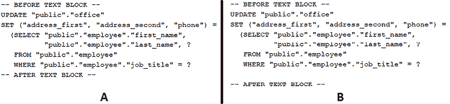

图 1.1：将关闭分隔符移动到自己的行，垂直对齐到开头分隔符

在左边的图（*A*）中，关闭分隔符位于内容末尾。然而，在右边的图（*B*）中，我们将关闭分隔符移动到了自己的行，如您所见，生成的 `String` 在末尾增加了一个新行。

**重要提示**

将结尾分隔符放在自己的行上将在最终的 `String` 中追加一个新行。同时，请注意，将开头分隔符、内容和结尾分隔符垂直对齐到左边界可能会在以后导致额外的工作。如果变量名被修改，则需要手动重新缩进以保持这种对齐。

因此，请注意您放置结尾分隔符的方式。

你觉得这很奇怪吗？好吧，这还不是全部！在前面的例子中，结尾分隔符被放在了其自己的行，但垂直对齐于开分隔符。让我们再向前迈一步，让我们将结束分隔符向左移动，如下面的例子所示：

```java
String sql= """ 
            UPDATE "public"."office"
            SET ("address_first", "address_second", "phone") =
              (SELECT "public"."employee"."first_name",
                      "public"."employee"."last_name", ?
               FROM "public"."employee"
               WHERE "public"."employee"."job_title" = ?
"""; 
```

以下图显示了此动作的效果：

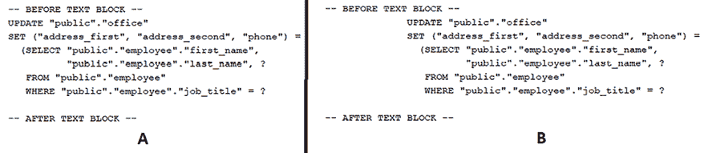

图 1.2：将结尾分隔符移到其自己的行并将它向左移动

在左边的图（*A*）中，我们有一个单独的行上的结尾分隔符，并且与开分隔符对齐。在右边的图（*B*）中，我们看到了前面代码的效果。将结尾分隔符向左移动会导致内容向右的额外缩进。额外的缩进取决于我们向左移动结尾分隔符的程度。

**重要提示**

将结尾分隔符放在其自己的行并将它向左移动将在最终的`String`后追加一个新行和额外的缩进。

另一方面，如果我们将结尾分隔符移到其自己的行并将它向右移动，它不会影响最终的`String`：

```java
String sql= """ 
            UPDATE "public"."office"
            SET ("address_first", "address_second", "phone") =
              (SELECT "public"."employee"."first_name",
                      "public"."employee"."last_name", ?
               FROM "public"."employee"
               WHERE "public"."employee"."job_title" = ?
                                              """; 
```

此代码向最终的`String`追加一个新行，但不会影响缩进。为了更好地理解开/闭分隔符的行为，你必须探索下一个问题。

# 3. 在文本块中处理缩进

如果我们对文本块中的缩进有一个清晰的了解，那么理解文本块中的缩进就很容易：

+   *偶然*（或*非必要*）空白 – 代表由代码格式化（通常由 IDE 添加的*行首*空白）或故意/意外地添加到文本末尾的空白（*尾随*空白）

+   *必要*空白 – 代表我们明确添加的空白，这对最终字符串是有意义的

在*图 1.3*中，你可以看到 JSON 文本块中的偶然空白与必要空白：

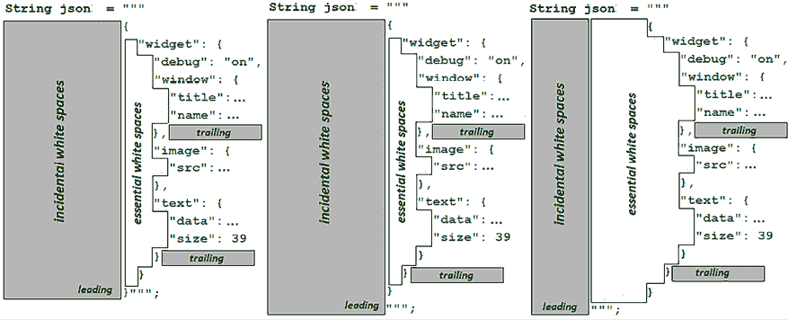

图 1.3：JSON 文本块中的偶然空白与必要空白

在左边的图中，你可以看到当结尾分隔符放置在内容末尾时的偶然空白与必要空白。在中间的图中，结尾分隔符被移到了其自己的行，而在右边的图中，我们也将其向左移动。

偶然（非必要）空白将由 Java 编译器自动删除。编译器会删除所有偶然的尾随空白（以确保在不同文本编辑器中的外观一致，这些编辑器可能会自动删除尾随空白），并使用一个特殊的内部算法（在下一个问题中会详细说明）来确定并删除偶然的行首空白。此外，重要的是要提到，包含结尾分隔符的行始终是此检查的一部分（这被称为*重要尾行策略*）。

本质空白在最终字符串中得以保留。基本上，正如你可以从之前的图中直观地看出，本质空白可以通过以下两种方式添加：

+   通过将关闭定界符左移（当此定界符在其自己的行上时）

+   通过将内容右移（通过显式添加空白或使用专门用于控制缩进的辅助方法）

## 移动关闭定界符和/或内容

让我们从以下代码开始：

```java
String json = """
--------------{
--------------++"widget": {
--------------++++"debug": "on",
--------------++++"window": {
--------------++++++"title": "Sample Widget 1",
--------------++++++"name": "back_window"
--------------++++},
--------------++++"image": {
--------------++++++"src": "images\\sw.png"
--------------++++},
--------------++++"text": {
--------------++++++"data": "Click Me",
--------------++++++"size": 39
--------------++++}
--------------++}
--------------}"""; 
```

用“`–`”符号突出显示的空白表示偶然的行首空白（没有偶然的行尾空白），而用“`+`”符号突出显示的空白表示在结果 `String` 中会看到的本质空白。如果我们整个内容右移，而关闭定界符位于内容末尾，那么显式添加的空白被视为偶然的，并且会被编译器移除：

```java
String json = """
----------------------{
----------------------++"widget": {
----------------------++++"debug": "on",
----------------------++++"window": {
----------------------++++++"title": "Sample Widget 1",
----------------------++++++"name": "back_window"
----------------------++++},
----------------------++++"image": {
----------------------++++++"src": "images\\sw.png"
----------------------++++},
----------------------++++"text": {
----------------------++++++"data": "Click Me",
----------------------++++++"size": 39
----------------------++++}
----------------------++}
----------------------}"""; 
```

然而，如果我们将关闭定界符移动到其自己的行（垂直对齐于打开定界符），并且仅将内容右移，那么我们就能获得在最终字符串中保留的基本空白：

```java
String json = """
--------------++++++++{
--------------++++++++++"widget": {
--------------++++++++++++"debug": "on",
--------------++++++++++++"window": {
--------------++++++++++++++"title": "Sample Widget 1",
--------------++++++++++++++"name": "back_window"
--------------++++++++++++},
--------------++++++++++++"image": {
--------------++++++++++++++"src": "images\\sw.png"
--------------++++++++++++},
--------------++++++++++++"text": {
--------------++++++++++++++"data": "Click Me",
--------------++++++++++++++"size": 39
--------------++++++++++++}
--------------++++++++++}
--------------++++++++}
              """; 
```

当然，我们可以通过左移关闭定界符来添加相同的本质空白：

```java
String json = """
-------+++++++{
-------++++++++++"widget": {
-------++++++++++++"debug": "on",
-------++++++++++++"window": {
-------++++++++++++++"title": "Sample Widget 1",
-------++++++++++++++"name": "back_window"
-------++++++++++++},
-------++++++++++++"image": {
-------++++++++++++++"src": "images\\sw.png"
-------++++++++++++},
-------++++++++++++"text": {
-------++++++++++++++"data": "Click Me",
-------++++++++++++++"size": 39
-------++++++++++++}
-------++++++++++}
-------++++++++}
       """; 
```

此外，我们可以通过手动添加空白来调整每一行文本，如下例所示：

```java
String json = """
--------------{
--------------++++"widget": {
--------------++++++++"debug": "on",
--------------++++++++"window": {
--------------+++++++++++++++++++++"title": "Sample Widget 1",
--------------+++++++++++++++++++++"name": "back_window"
--------------++++++++},
--------------++++++++"image":  {
--------------+++++++++++++++++++++"src": "images\\sw.png"
--------------++++++++},
--------------++++++++"text":   {
--------------+++++++++++++++++++++"data": "Click Me",
--------------+++++++++++++++++++++"size": 39
--------------++++++++}
--------------++++}
--------------}"""; 
```

接下来，让我们看看一些有用的辅助方法，这些方法对于缩进目的很有用。

## 使用缩进方法

从 JDK 12 开始，我们可以通过 `String.indent(int n)` 方法向字面量字符串添加本质空白，其中 `n` 表示空白字符的数量。此方法还可以用于缩进文本块的全部内容，如下所示：

```java
String json = """
--------------********{
--------------********++"widget": {
--------------********++++"debug": "on",
--------------********++++"window": {
--------------********++++++"title": "Sample Widget 1",
--------------********++++++"name": "back_window"
--------------********++++},
--------------********++++"image": {
--------------********++++++"src": "images\\sw.png"
--------------********++++},
--------------********++++"text": {
--------------********++++++"data": "Click Me",
--------------********++++++"size": 39
--------------********++++}
--------------********++}
--------------********}""".indent(8); 
```

显然，通过 `indent()` 添加的空白在 IDE 的代码编辑器中是不可见的，但在这里通过“`*`”符号突出显示，只是为了说明对最终字符串的影响。然而，当使用 `indent()` 时，也会添加一个新行，即使关闭定界符位于内容末尾。在这种情况下，将关闭定界符移动到其自己的行会产生相同的效果，所以不要期望添加两个新行。当然，请随意练习捆绑的代码以获得真实体验。

`indent()` 方法可能对对齐包含放置在同一缩进级别的文本行的内容块很有用，如下面的诗歌所示：

```java
String poem = """
              I would want to establish strength; root-like,
              anchored in the hopes of solidity.
              Forsake the contamination of instability.
              Prove I'm the poet of each line of prose."""; 
```

如果我们在诗的每一行前面手动添加空格，编译器将删除它们，因此无法全局添加任何必要的空格。我们可以将关闭分隔符移动到自己的行并将其向左移动，或者将内容向右移动以获得所需的必要空格。然而，在这种情况下，你仍然需要删除由于将关闭分隔符移动到自己的行而添加的新行。最简单的方法是通过 JDK 14 的新转义序列`\`。通过在行尾添加此转义序列，我们指示编译器不要将该行的新行字符添加到该行：

```java
String poem = """
              I would want to establish strength; root-like,
              anchored in the hopes of solidity.
              Forsake the contamination of instability.
              Prove I'm the poet of each line of prose.\
   """; 
```

虽然`Problem 5`中已经分析了这个转义序列（`\`），*仅使用文本块以提高可读性*，让我们看看基于字符串 API 的几种方法。

在 JDK 11 之前，我们可以通过简单的正则表达式如`replaceFirst("\\s++$", "")`来删除此行，或者依赖于第三方辅助工具，如 Apache Commons 的`StringUtils.stripEnd()`方法。然而，从 JDK 11 开始，我们可以通过`String.stripTrailing()`来实现这一目标，如下所示：

```java
String poem = """
              I would want to establish strength; root-like,
              anchored in the hopes of solidity.
              Forsake the contamination of instability.
              Prove I'm the poet of each line of prose.
   """.stripTrailing(); 
```

现在，由于将关闭分隔符向左移动，内容块被缩进，并且由于`stripTrailing()`方法，自动添加的新行被删除。

**重要提示**

除了`stripTrailing()`之外，JDK 11 还提供了`stripLeading()`和`strip()`。从 JDK 15 开始，我们还有`stripIndent()`，它正好像编译器那样删除首尾空格。

然而，从 JDK 12 开始，我们可以使用`String.indent(int n)`，这使我们免去了手动添加空格的需要：

```java
String poem = """
              I would want to establish strength; root-like,
              anchored in the hopes of solidity.
              Forsake the contamination of instability.
              Prove I'm the poet of each line of prose."""
  .indent(6)
  .stripTrailing(); 
```

现在，是时候向前推进并分析删除意外空格的算法了。

# 4. 删除文本块中的意外空格

删除文本块中的意外空格通常是编译器通过特殊算法完成的任务。为了理解这个算法的主要方面，让我们通过以下示例来回顾一下：

```java
String json = """                     |Compiler:
----{                                 |Line 01: 4  lws
----++"widget": {                     |Line 02: 6  lws
----++++"debug": "on",                |Line 03: 8  lws
----++++"window": {                   |Line 04: 8  lws
----++++++"title": "Sample Widget 1", |Line 05: 10 lws
----++++++"name": "back_window"       |Line 06: 10 lws
----++++},                            |Line 07: 8  lws
----++++"image": {                    |Line 08: 8  lws
----++++++"src": "images\\sw.png"     |Line 09: 10 lws
----++++},                            |Line 10: 8  lws
----++++"text": {                     |Line 11: 8  lws
----++++++"data": "Click Me",         |Line 12: 10 lws
----++++++"size": 39                  |Line 13: 10 lws
----++++}                             |Line 14: 8  lws
----++}                               |Line 15: 6  lws
----}                                 |Line 16: 4  lws
----""";                              |Line 17: 4  lws 
–" sign.
```

为了删除意外的首行空格，编译器必须检查所有非空白行（仅包含空白的行），因此在我们的例子中，它将检查 17 行。其中有 16 行 JSON 代码和关闭分隔符行。

编译器扫描这些 17 行中的每一行，并计算前导空格的数量。用于表示空格的字符在此计数中并不重要——它可以是简单的空格、制表符等等。它们都具有相同的权重 1，因此单个空格与单个制表符相同。这是必要的，因为编译器不知道制表符将在不同的文本编辑器中如何显示（例如，一个制表符可能是四个或八个字符）。一旦这个算法步骤完成，编译器就知道检查的每一行的确切前导空格数量。例如，第 1 行有 4 个**前导空格**（**lws**），第 2 行有 6 个 lws，第 3 行有 8 个 lws，依此类推（查看之前的代码片段以查看所有数字）。

**重要提示**

让我们快速看一下另一个文本块的最佳实践：不要在同一个文本块中混合空格和制表符。这样，你可以确保缩进的一致性，并避免任何潜在的缩进不规则性。

在这一点上，编译器计算这些数字的最小值，结果（在这种情况下，4）表示应该从每 17 行中移除的意外前导空格的数量。因此，在最终结果中，至少有一行没有前导空格。当然，必要的空格（通过“`+`”符号表示的额外缩进）保持不变。例如，在第 5 行，我们有 10 个 lws（leading white spaces，前导空格）- 4 个意外 lws = 6 个必要的 lws 保持不变。

在捆绑的代码中，你可以找到三个更多的 JSON 示例，你可以使用这些示例来练习这个算法。现在，我们将解决一些文本块可读性的方面。

# 5. 仅使用文本块以提高可读性

仅使用文本块以提高可读性可以翻译为将字符串看起来像文本块，但作为单行字符串字面量。这对于格式化长文本行特别有用。例如，我们可能希望以下 SQL 字符串看起来像文本块（为了可读性），但作为单行字符串字面量（在传递给数据库时紧凑的意义上）：

```java
SELECT "public"."employee"."first_name"
FROM "public"."employee" 
WHERE "public"."employee"."job_title" = ? 
```

从 JDK 14 开始，我们可以通过新的转义序列`\`（一个单独的反斜杠）来实现这个目标。通过在行尾添加这个转义序列，我们指示编译器抑制向该行追加换行符。因此，在我们的情况下，我们可以将 SQL 表达为单行字符串字面量，如下所示：

```java
String sql = """
             SELECT "public"."employee"."first_name" \
             FROM "public"."employee" \
             WHERE "public"."employee"."job_title" = ?\
             """; 
```

注意不要在`\`后添加任何空格，否则你会得到一个错误。

如果我们将这个文本块放入`System.out.println()`中，那么输出将揭示单行字符串字面量，如下所示：

```java
SELECT "public"."employee"."first_name" FROM "public"."employee" WHERE "public"."employee"."job_title" = ? 
```

接下来，让我们检查另一个示例，如下所示：

```java
String sql = """
  UPDATE "public"."office" \
  SET ("address_first", "address_second", "phone") = \
    (SELECT "public"."employee"."first_name", \
            "public"."employee"."last_name", ? \
     FROM "public"."employee" \
     WHERE "public"."employee"."job_title" = ?\
  """; 
```

这次，结果字符串并不是我们想要的，因为必要的空格被保留了。这意味着单行字符串被散布着一系列空格，我们应该将其缩减为单个空格。这正是正则表达式可以发挥作用的地方：

```java
sql.trim().replaceAll(" +", " "); 
```

完成！现在，我们有一个看起来像 IDE 中文本块的单一行的 SQL 字符串。

接下来，假设我们想在文本块中打印以下诗歌，并添加一个漂亮的背景：

```java
String poem = """
                 An old silent pond...
              A frog jumps into the pond,
                 splash!! Silence again.
              """; 
```

为这首诗添加背景将得到如下所示的图形：


图 1.4：为诗歌添加背景

**重要提示**

彩色背景仅作为对齐的指南，因为白色背景上的白色将无法辨认。

由于编译器删除了尾随空格，我们将得到如图左侧所示的内容。显然，我们想要如图右侧所示的内容，因此我们需要找到一种方法来保留尾随空格作为必要部分。从 JDK 14 开始，我们可以通过新的转义序列 `\s` 来做到这一点。

我们可以为每个空格重复这个转义序列，如下所示（我们在第一行添加了三个空格，在最后一行添加了两个空格；这样，我们得到了一个对称的文本块）：

```java
String poem = """
                 An old silent pond...\s\s\s
              A frog jumps into the pond,
                splash!! Silence again.\s\s
              """; 
```

或者，我们可以在行尾手动添加空格和一个单个 `\s`。这是可能的，因为编译器会保留 `\s` 前面的任何空格：

```java
String poem = """
                 An old silent pond...  \s
              A frog jumps into the pond,
                splash!! Silence again. \s
              """; 
```

完成！现在，我们已经保留了空格，所以当应用背景颜色时，我们将获得如图 1.4 右侧所示的内容。

接下来，让我们专注于转义字符。

# 6. 在文本块中转义引号和行终止符

只有在我们想在文本块中嵌入三个双引号（`"""`）序列时，转义双引号才是必要的，如下所示：

```java
String txt = """
             She told me 
                    \"""I have no idea what's going on\""" 
             """; 
```

使用 `\"""` 可以转义 `"""`。没有必要写 `\"\"\"`。

生成的字符串将看起来像这样：

```java
She told me
        """I have no idea what's going on""" 
```

无论何时需要嵌入 `"` 或 `""`，只需按照以下方式操作：

```java
String txt = """
             She told me 
                     "I have no idea what's going on"
             """;
String txt = """
             She told me 
                     ""I have no idea what's going on"" 
             """; 
```

即使它可行，也不要这样做，因为这不是必要的：

```java
String txt = """
             She told me 
                     \"I have no idea what's going on\"
             """;
String txt = """
             She told me 
                     \"\"I have no idea what's going on\"\" 
             """; 
```

然而，像 `""""`（其中第一个 `"` 表示一个双引号，最后的 `"""` 表示文本块的结束分隔符）这样的结构将引发错误。在这种情况下，你可以放置一个空格作为 `" """` 或将双引号转义为 `\""""`。

根据定义，文本块表示跨越多行的字符串字面量，因此不需要显式转义行终止符（换行符），如 `\n`、`\r` 或 `\f`。只需在文本块中添加新行文本，编译器就会处理行终止符。当然，这并不意味着使用它们不起作用。例如，可以通过 `\n` 获得交错空白行的文本块，如下所示：

```java
String sql = """
             SELECT "public"."employee"."first_name",\n
                    "public"."employee"."last_name", ?\n
             FROM "public"."employee"\n
             WHERE "public"."employee"."job_title" = ?
             """; 
```

在文本块中使用转义序列（例如，`\b`、`\t`、`\r`、`\n`、`\f`等）与在旧式字符串字面量中的使用方式完全相同。例如，这里没有问题：

```java
String txt = """
               \b\bShe told me\n
             \t""I have no idea what's going on"" 
             """; 
```

然而，无需转义序列（例如，将 `\t`（制表符）视为八个空格）也可以得到相同的结果：

```java
String txt = """
             She told me
                    ""I have no idea what's going on"" 
             """; 
```

你可以在捆绑的代码中练习所有这些示例。

**重要提示**

让我们快速看一下另一个文本块最佳实践：显式添加转义序列可能会负面影响文本块的可读性，因此请谨慎使用，并且仅在真正需要时使用。例如，显式的 `\n` 和 `\"` 对于文本块来说很少是必要的。

讨论到 `\n` 行终止符（换行符），重要的是要注意以下注意事项。

**重要提示**

在 Java 中，最常用的行终止符可能是 `\n`（Unix，**换行**（**LF**）），但我们也可以使用 `\r`（Windows，**回车**（**CR**））或 `\n\r`（Windows，**回车换行**（**CRLF**））。无论我们更喜欢哪一个，Java 文本块始终使用 `\n`（LF）。首先，编译器将所有未通过转义序列显式添加的行终止符规范化为 `\n`（LF）。其次，在行终止符规范化和管理的缩进之后，编译器将处理所有显式转义序列（`\n`（LF），`\f`（FF），`\r`（CR）等），就像任何字符串字面量一样。实际上，这允许我们将包含转义序列的旧版 Java 字符串复制到文本块中，无需进一步修改即可获得预期结果。

如果你需要使用特定于操作系统的行终止符，那么你必须通过 `String.replaceAll()` 显式替换文本块规范化后的行终止符，例如 `String::replaceAll("\n", System.lineSeparator())`。

在文本块中嵌入转义序列可以通过通常的 `\\` 构造来完成。以下是将 `\"` 转义序列嵌入为 `\\"` 的示例：

```java
String sql = """
  SELECT \\"public\\".\\"employee\\".\\"first_name\\",   
         \\"public\\".\\"employee\\".\\"last_name\\", ?
  FROM \\"public\\".\\"employee\\"
  WHERE \\"public\\".\\"employee\\".\\"job_title\\" = ?
  """; 
```

您可以在捆绑的代码中检查输出。现在，让我们看看如何程序化地转换转义序列。

# 7. 程序化转换转义序列

我们已经知道编译器负责转义序列的转换，大多数时候，我们不需要显式地干预这个过程。但是，有些情况下我们可能需要以编程方式访问这个过程（例如，在将字符串传递给函数之前显式取消转义字符串）。

从 JDK 15 开始，我们可以通过 `String.translateEscapes()` 来完成这项任务，该方法能够取消转义序列，如 `\t`，`\n`，`\b` 等，以及八进制数（`\0`–`\377`）。然而，此方法不翻译 Unicode 转义序列（`\uXXXX`）。

我们可以通过进行等式测试来揭示 `translateEscapes()` 的工作方式：

```java
String newline = "\\n".translateEscapes();
System.out.println(("\n".equals(newline)) ? "yes" : "no"); 
```

如您所预料的，结果是**是的**。

接下来，假设我们想要使用一个外部服务，该服务在包裹上打印地址。负责此任务的功能接收一个不包含转义序列的地址表示字符串。问题是我们的客户的地址在通过一个格式化过程时会被修补上转义序列，如下例所示：

```java
String address = """
                 JASON MILLER (\\"BIGBOY\\")\\n
                 \\tMOUNT INC\\n
                 \\t104 SEAL AVE\\n
                 \\tMIAMI FL 55334 1200\\n
                 \\tUSA
                 """; 
```

下图揭示了如果我们不翻译地址的转义字符（左侧）和如果我们翻译它们（右侧）时生成的字符串将如何看起来。当然，我们的目标是获取右侧的地址并将其发送到打印：


图 1.5：我们想要右侧的字符串

可以通过 `String.translateEscapes()` 方法程序化地翻译转义字符，在将结果发送到外部服务之前。以下是代码：

```java
String translatedAddress = address.translateEscapes(); 
```

现在，`translatedAddress` 可以传递给外部打印服务。作为一个练习，你可以思考如何利用这种方法编写一个通过 Java 或其他编程语言提供的源代码解析器。

**重要提示**

可以通过 Apache Commons’ Lang 第三方库支持获得类似的结果（当然，阅读文档以获取更详细的信息）。请考虑使用 `StringEscapeUtils.unescapeJava(String)`。

接下来，让我们谈谈在文本块中嵌入表达式。

# 8. 使用变量/表达式格式化文本块

在 Java 中，使用变量/表达式格式化字符串字面量以获取动态字符串是一种常见的做法。例如，我们可以通过以下众所周知的连接创建一个动态的 XML 字符串：

```java
String fn = "Jo";
String ln = "Kym";
String str = "<user><firstName>" + fn
  + "</firstName><lastName>" + ln + "</lastName></user>"; 
```

```java
// output
<user><firstName>Jo</firstName><lastName>Kym</lastName></user> 
```

当然，这个微小的结构在可读性方面存在严重问题。如果 XML 代码经过适当的格式化和缩进，它是可读的；否则，很难跟随其层次结构。那么，我们能否将这个 XML 表达得像以下图示一样？

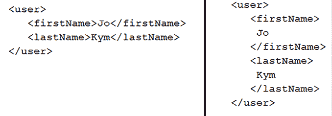

图 1.6：格式化的 XML

当然可以！通过使用一些转义序列（例如，`\n`、`\t` 和 `\s`）、空白字符等，我们可以构建一个看起来像 *Figure 1.6* 的 `String`。然而，通过文本块表达这种连接可能更好。也许我们可以在 IDE 的代码编辑器和控制台（在运行时）中达到相同的可读性。一种可能的方法如下：

```java
String xml = """
            <user>
               <firstName>\
            """
        + fn
        + """
             </firstName>
                <lastName>\
             """
         + ln
         + """
             </lastName>
             </user>
             """; 
```

因此，我们可以通过“`+`”运算符精确地连接文本块，就像字符串字面量一样。酷！这段代码的输出对应于 *Figure 1.6* 的左侧。另一方面，*Figure 1.6* 的右侧可以通过以下方式实现：

```java
String xml = """
            <user>
               <firstName>
            """
        + fn.indent(4)
        + """
               </firstName>
               <lastName>
            """
        + ln.indent(4)
        + """
               </lastName>
            </user>
            """; 
```

好吧，虽然在这两种情况下生成的字符串看起来都很好，但我们不能对代码本身说同样的话。它的可读性仍然很低。

**重要提示**

通过查看前面的两个代码片段，我们可以很容易地得出文本块的最佳实践：仅在它们显著提高代码清晰度和多行字符串的可读性时使用它们。此外，避免在复杂表达式（例如 lambda 表达式）中声明文本块，因为它们可能会影响整个表达式的可读性。最好将文本块单独提取到静态变量中，并在复杂表达式中引用它们。

让我们尝试另一种方法。这次，让我们使用`StringBuilder`来获取*图 1.6*左侧的结果：

```java
StringBuilder sbXml = new StringBuilder();
sbXml.append("""
            <user>
               <firstName>""")
       .append(fn)
       .append("""
               </firstName>
                  <lastName>""")
       .append(ln)
       .append("""
            </lastName>
            </user>"""); 
```

然后，从*图 1.6*的右侧获取结果可以这样做：

```java
StringBuilder sbXml = new StringBuilder();
sbXml.append("""
            <user>
               <firstName>
            """)
      .append(fn.indent(4))
      .append("""
             </firstName>
             <lastName>
           """)
      .append(ln.indent(4))
      .append("""
             </lastName>
           </user>
           """); 
```

因此，我们可以在`StringBuilder`/`StringBuffer`中使用文本块，就像我们使用字符串字面量一样。虽然生成的字符串对应于*图 1.6*中的示例，但从可读性的角度来看，代码本身仍然不尽如人意。

让我们再次尝试使用 JDK 1.4 的`MessageFormat.format()`。首先，让我们塑造*图 1.6*中的示例，左侧：

```java
String xml = MessageFormat.format("""
                           <user>
                               <firstName>{0}</firstName>
                               <lastName>{1}</lastName>
                           </user>
                           """, fn, ln); 
```

从*图 1.6*（右侧）获取结果可以这样做：

```java
String xml = MessageFormat.format("""
                           <user>
                               <firstName>
                                {0}
                               </firstName>
                               <lastName>
                                {1}
                               </lastName>
                           </user>
                           """, fn, ln); 
```

文本块和`MessageFormat.format()`的组合是一个成功的方案。代码的可读性显然更好。但是，让我们更进一步，让我们在 JDK 5 `String.format()`中尝试一下。像往常一样，*图 1.6*（左侧）是首先：

```java
String xml = String.format("""
                           <user>
                               <firstName>%s</firstName>
                               <lastName>%s</lastName>
                           </user>
                           """, fn, ln); 
```

从*图 1.6*（右侧）获取结果可以这样做：

```java
String xml = String.format("""
                           <user>
                               <firstName>
                                %s
                               </firstName>
                               <lastName>
                                %s
                               </lastName>
                           </user>
                           """, fn, ln); 
```

文本块和`String.format()`的组合是另一种成功的方案，但不是我们可以利用的最新特性。从 JDK 15 开始，`String.format()`有一个更方便的伴侣，名为`formatted()`。以下是`String.formatted()`的工作原理，用于重现*图 1.6*（左侧）：

```java
String xml = """
             <user>
                 <firstName>%s</firstName>
                 <lastName>%s</lastName>
             </user>
             """.formatted(fn, ln); 
```

从*图 1.6*（右侧）获取结果可以这样做：

```java
String xml = """
             <user>
                 <firstName>
                  %s
                 </firstName>
                 <lastName>
                  %s
                 </lastName>
             </user>
             """.formatted(fn, ln); 
```

这就是我们能做的最好的了。我们成功地在 IDE 的代码编辑器和运行时中实现了包含动态部分（变量）的文本块的可读性水平。酷，不是吗?!

从性能角度来看，你可以在捆绑的代码中找到一个这些方法的基准。在下面的图中，你可以看到在 Intel^® Core^™ i7-3612QM CPU @ 2.10GHz 机器上（Windows 10）这个基准的结果，但你可以自由地在不同的机器上测试它，因为结果高度依赖于机器。

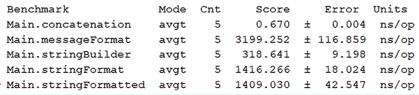

图 1.7：基准结果

符合这些结果，通过“`+`”运算符的连接是最快的，而`MessageFormat.format()`是最慢的。

# 9. 在文本块中添加注释

问题：我们能否在文本块中添加注释？

官方答案（根据 Java 语言规范）：词法语法暗示注释不会出现在字符字面量、字符串字面量或文本块中。

你可能会想尝试一些类似的方法，认为这是一种快速的方法，但我真的不推荐这样做：

```java
String txt = """
             foo  /* some comment */
             buzz //another comment
             """.replace("some_regex",""); 
```

简短回答：不，我们不能在文本块中添加注释。

让我们继续，谈谈混合普通字符串字面量和文本块。

# 10. 混合普通字符串字面量和文本块

在混合普通字符串字面量和文本块之前，让我们考虑以下声明：普通字符串字面量和文本块有多大的不同？我们可以通过以下代码片段来回答这个问题：

```java
String str = "I love Java!";
String txt = """
             I love Java!""";
System.out.println(str == txt);      // true
System.out.println(str.equals(txt)); // true 
true twice. This means that an ordinary string literal and a text block are similar at runtime. We can define text blocks as string literals that span across multiple lines of text and use triple quotes as their opening and closing delimiter. How so? First, the instance produced from an ordinary string literal and a text block is of type java.lang.String. Second, we have to look at the compiler internals. Basically, the compiler adds strings to a special cached pool named a String Constant Pool (SCP) (more details about SCP are available in *Java Coding Problems*, *First Edition*, Problem 48, *Immutable string*) to optimize the memory usage, and starting with JDK 13, text blocks can be found in the same pool as strings.
```

现在我们知道，在内部处理普通字符串字面量和文本块时没有重大差异，我们可以自信地将它们混合在简单的连接中（基本上，文本块可以在普通字符串字面量可以使用的任何地方使用）：

```java
String tom = "Tom";
String jerry = """
               Jerry""";
System.out.println(tom + " and " + jerry); // Tom and Jerry 
```

此外，由于文本块返回一个 `String`，我们可以使用我们用于普通字符串字面量的整个方法库。以下是一个示例：

```java
System.out.println(tom.toUpperCase() + " AND " 
  + jerry.toUpperCase()); // TOM AND JERRY 
```

此外，正如你在 *问题 8* 中看到的，*使用变量/表达式格式化文本块*，文本块可以与普通字符串字面量一起在 `StringBuilder`(`Buffer`)、`MessageFormat.format()`、`String.format()` 和 `String.formatted()` 中使用和混合。

# 11. 将正则表达式与文本块混合

正则表达式可以与文本块一起使用。让我们考虑一个简单的字符串，如下所示：

```java
String nameAndAddress
  = "Mark Janson;243 West Main St;Louisville;40202;USA"; 
```

因此，这里有一个名字（Mark Janson）以及一些关于他地址的详细信息，由分号（`;`）分隔。将此类字符串通过正则表达式传递并提取信息作为命名组是一种常见场景。在这个例子中，我们可以考虑以下五个命名组：

+   `name`：应包含个人的姓名（Mark Janson）

+   `address`：应包含个人的街道信息（243 West Main St）

+   `city`：应包含个人的城市（Louisville）

+   `zip`：应包含城市的邮政编码（40202）

+   `country`：应包含国家的名称（USA）

可以匹配这些命名组的正则表达式可能看起来如下：

```java
(?<name>[ a-zA-Z]+);(?<address>[ 0-9a-zA-Z]+);(?<city>[ a-zA-Z]+);(?<zip>[\\d]+);(?<country>[ a-zA-Z]+)$ 
```

这是一个单行字符串，因此我们可以通过 `Pattern` API 使用它，如下所示：

```java
Pattern pattern = Pattern.compile("(?<name>[ a-zA-Z]+);(?<address>[ 0-9a-zA-Z]+);(?<city>[ a-zA-Z]+);(?<zip>[\\d]+);(?<country>[ a-zA-Z]+)$"); 
```

然而，正如你所看到的，这样编写我们的正则表达式会对可读性产生严重影响。幸运的是，我们可以使用文本块来解决这个问题，如下所示：

```java
Pattern pattern = Pattern.compile(""" 
         (?<name>[ a-zA-Z]+);\ 
         (?<address>[ 0-9a-zA-Z]+);\ 
         (?<city>[ a-zA-Z]+);\ 
         (?<zip>[\\d]+);\ 
         (?<country>[ a-zA-Z]+)$"""); 
```

这更易于阅读，对吧？我们唯一需要注意的事情是使用 JDK 14 的新转义序列 `\`（一个反斜杠），以删除每行末尾的换行符。

接下来，你可以简单地匹配地址并提取命名组，如下所示：

```java
if (matcher.matches()) { 

  String name = matcher.group("name"); 
  String address = matcher.group("address"); 
  String city = matcher.group("city"); 
  String zip = matcher.group("zip"); 
  String country = matcher.group("country"); 
} 
```

如果你只想提取组名，那么你可以依赖 JDK 20 的 `namedGroups()`：

```java
// {country=5, city=3, zip=4, name=1, address=2} 
System.out.println(matcher.namedGroups()); 
```

实际上，`namedGroups()` 返回一个不可修改的 `Map<String, Integer>`，其中键是组名，值是组号。此外，JDK 20 还添加了 `hasMatch()` 方法，该方法在匹配器包含来自先前匹配或查找操作的有效匹配时返回 `true`：

```java
if (matcher.hasMatch()) { ... } 
```

注意，`hasMatch()` 不会像 `matches()` 那样尝试触发与模式的匹配。当你需要在代码的不同位置检查有效匹配时，`hasMatch()` 更可取，因为它不会执行匹配。因此，你可以先调用一次 `matches()`，然后在后续的有效匹配检查中，只需调用 `hasMatch()`。

此外，如果您只需要提取由给定分隔符捕获的每个命名组的输入子序列，则可以依赖 JDK 21 的 `splitWithDelimiters(CharSequence input, int limit)`。例如，我们的字符串可以通过分号（正则表达式，`;+`）分割，如下所示：

```java
String[] result = Pattern.compile(";+") 
  .splitWithDelimiters(nameAndAddress, 0); 
```

返回的数组包含提取的数据和分隔符，如下所示：

```java
[Mark Janson, ;, 243 West Main St, ;,
Louisville, ;, 40202, ;, USA] 
```

`splitWithDelimiters()` 函数的第二个参数是一个整数，表示应用正则表达式的次数。如果 `limit` 参数为 0，则模式将被尽可能多次地应用，并且尾随的空字符串（无论是子字符串还是分隔符）将被丢弃。如果它是正数，则模式将被应用，最多 `limit` - 1 次；如果是负数，则模式将被尽可能多次地应用。

# 12. 检查两个文本块是否同构

如果结果字符串是同构的，则两个文本块是同构的。如果我们可以以一对一的方式将第一个字符串的每个字符映射到第二个字符串的每个字符，则两个字符串字面量被认为是同构的。

例如，考虑第一个字符串是 “`abbcdd`" 和第二个字符串是 “`qwwerr`"。一对一字符映射如图 *1.8* 所示：

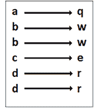

图 1.8：两个字符串之间的一对一字符映射

正如您在 *图 1.8* 中所看到的，第一个字符串中的字符 “a” 可以被第二个字符串中的字符 “q” 替换。此外，第一个字符串中的字符 “b” 可以被第二个字符串中的字符 “w” 替换，字符 “c” 被 “e” 替换，字符 “d” 被 “r” 替换。显然，反之亦然。换句话说，这两个字符串是同构的。

关于字符串 “aab” 和 “que”，这两个字符串不是同构的，因为 “a” 不能同时映射到 “q” 和 “u”。

如果我们将此逻辑外推到文本块，那么 *图 1.9* 正是我们所需要的：

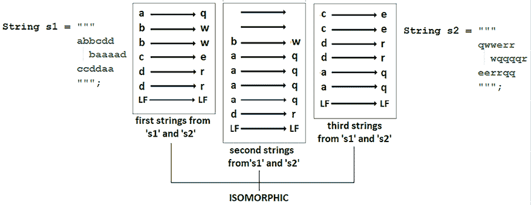

图 1.9：两个同构的文本块

如果两个文本块的字符串行以一对一的方式同构，则两个文本块是同构的。此外，请注意，必要的空白和 **换行符**（**LF**）也应进行映射，而偶然的起始/结束空白被忽略。

普通字符串字面量和文本块的算法完全相同，并且它依赖于 *哈希*（关于此主题的更多详细信息可在 *Java 完整编码面试指南* 书中的 *示例 6*：*哈希表* 找到）并包括以下步骤：

1.  检查两个文本块 (`s1` 和 `s2`) 的长度是否相同。如果它们的长度不同，则文本块不是同构的。

1.  创建一个空映射，该映射将存储从 `s1`（作为键）到 `s2`（作为值）的字符映射。

1.  从 `s1` (`chs1`) 和 `s2` (`chs2`) 中取出第一个/下一个字符。

1.  检查 `chs1` 是否作为键存在于映射中。

1.  如果 `chs1` 作为键存在于映射中，那么它必须映射到 `s2` 中的一个等于 `chs2` 的值；否则，文本块不是同构的。

1.  如果 `chs1` 不作为键存在于映射中，那么映射不应该包含 `chs2` 作为值；否则，文本块不是同构的。

1.  如果 `chs1` 不作为键存在于映射中，并且映射不包含 `chs2` 作为值，那么在映射中放入 (`chs1` 和 `chs2`) – `chs1` 作为键和 `chs2` 作为值。

1.  重复步骤 3，直到整个文本块（`s1`）被处理。

1.  如果整个文本块（`s1`）已被处理，那么文本块是同构的。

在代码行中，这个 O(n) 算法可以表示如下：

```java
public static boolean isIsomorphic(String s1, String s2) {
  // step 1
  if (s1 == null || s2 == null
                 || s1.length() != s2.length()) {
    return false;
  }
  // step 2
  Map<Character, Character> map = new HashMap<>();
  // step 3(8)
  for (int i = 0; i < s1.length(); i++) {
    char chs1 = s1.charAt(i);
    char chs2 = s2.charAt(i);
    // step 4
    if (map.containsKey(chs1)) {
      // step 5
      if (map.get(chs1) != chs2) {
        return false;
      }
    } else {
      // step 6
      if (map.containsValue(chs2)) {
        return false;
      }
      // step 7
      map.put(chs1, chs2);
    }
  }
  // step 9
  return true;
} 
```

完成！你可以在捆绑的代码中练习这个例子。这是关于文本块主题的最后一个问题。现在是时候继续前进，讨论字符串连接了。

# 13. 字符串连接与 StringBuilder

查看以下普通字符串连接：

```java
String str1 = "I love";
String str2 = "Java";
String str12 = str1 + " " + str2; 
```

我们知道 `String` 类是不可变的（创建的 `String` 不能被修改）。这意味着创建 `str12` 需要一个中间字符串，它代表 `str1` 与空格的连接。因此，在 `str12` 创建后，我们知道 `str1 + " "` 只是噪音或垃圾，因为我们无法进一步引用它。

在这种情况下，建议使用 `StringBuilder`，因为它是一个可变类，我们可以向其中追加字符串。所以这就是以下说法的由来：在 Java 中，不要使用 “`+`” 运算符来连接字符串！使用 `StringBuilder`，它要快得多。

你以前听说过这个说法吗？我非常确信你听说过，尤其是如果你仍然在 JDK 8 或更早的版本上运行你的应用程序。好吧，这个说法不是神话，在某个时刻确实是真的，但在智能编译器的时代它仍然有效吗？

例如，考虑以下两个代码片段，它们代表字符串的简单连接：

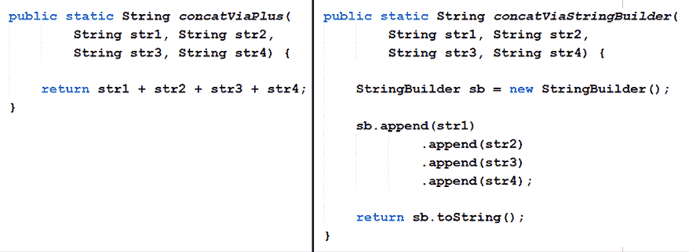

图 1.10：字符串连接与 StringBuilder

在 JDK 8 中，哪种方法（来自 *图 1.10*）更好？

## JDK 8

让我们检查这两个代码片段生成的字节码（使用 `javap -c -p` 或 Apache Commons **字节码工程库**（**BCEL**）；我们使用了 BCEL）。`concatViaPlus()` 的字节码如下：

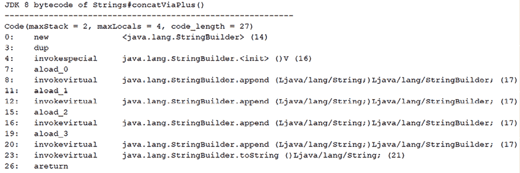

图 1.11：concatViaPlus() 的 JDK 8 字节码

JDK 8 编译器足够智能，可以在底层使用 `StringBuilder` 来通过 “`+`” 运算符来塑造我们的连接。如果你检查从 `concatViaStringBuilder()` 生成的字节码（这里为了简洁省略），那么你会看到与 *图 1.11* 大致相似的内容。

在 JDK 8 中，编译器知道何时以及如何通过`StringBuilder`优化字节码。换句话说，与通过“`+`"运算符进行普通连接相比，显式使用`StringBuilder`并没有带来显著的好处。有许多简单的情况都适用这个说法。基准测试对此有何看法？查看结果：

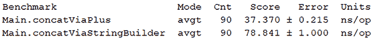

图 1.12：JDK 8 基准测试`concatViaPlus()`与`concatViaStringBuilder()`

显然，通过“`+`"运算符进行的连接赢得了这场比赛。让我们为 JDK 11 重复这个逻辑。

## JDK 11

JDK 11 为`concatViaPlus()`方法生成了以下字节码：

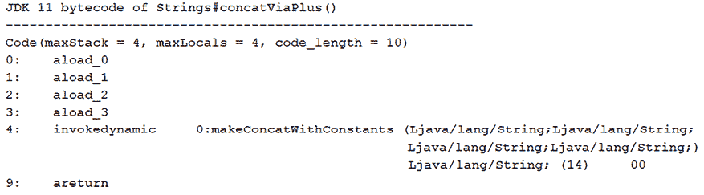

图 1.13：JDK 11 的`concatViaPlus()`字节码

我们可以立即观察到这里有一个很大的不同。这次，连接是通过调用`invokedynamic`（这是一个动态调用）来完成的，它充当我们代码的代理人。在这里，它将代码委托给`makeConcatWithConstants()`，这是`StringConcatFactory`类的一个方法。虽然你可以在 JDK 文档中找到这个方法，请注意，这个类 API 并不是为了直接调用而创建的。这个类是专门创建和设计的，用于为`invokedynamic`指令提供引导方法。在继续之前，让我们看看你应该考虑的一个重要提示。

**重要提示**

`invokedynamic`将我们的连接代码委托/传递给不包含在字节码中的代码来解决（这就是为什么我们看不到解决我们代码的实际代码（指令））。这非常强大，因为它允许 Java 工程师继续优化连接逻辑的过程，同时我们可以通过简单地升级到下一个 JDK 来利用它。代码甚至不需要重新编译就可以利用进一步的优化。

**有趣的事实**：*indify*这个术语来自`invokedynamic`，也称为*indy*。它在 JDK 7 中引入，并用于 JDK 8 lambda 实现。由于这个指令非常有用，它成为了解决许多其他问题的解决方案，包括在 JDK 9 中引入的 JEP 280：*Indify String Concatenation*。我更喜欢在这里使用 JDK 11，但这个特性从 JDK 9+开始可用，所以你可以在 JDK 17 或 20 等版本中尝试一下。

简而言之，`invokedynamic`的工作方式如下：

+   编译器在连接点附加了一个`invokedynamic`调用。

+   `invokedynamic`调用首先执行引导方法`makeConcat`[`WithConstants`].

+   `invokedynamic`方法调用`makeConcat`[`WithConstants`]，这是一个用于调用实际负责连接的代码的引导方法。

+   `makeConcat`[`WithConstants`]使用内部策略来确定解决连接的最佳方法。

+   调用最合适的方法，然后执行连接逻辑。

这样，JEP 280 为 JDK 10、11、12、13 等版本提供了极大的灵活性，因为它们可以使用不同的策略和方法来适应我们上下文中字符串连接的最佳方式。

那么 `concatViaStringBuilder()` 的字节码是什么样的呢？这个方法没有利用 `invokedynamic`（它依赖于经典的 `invokevirtual` 指令），正如您在这里可以看到的：

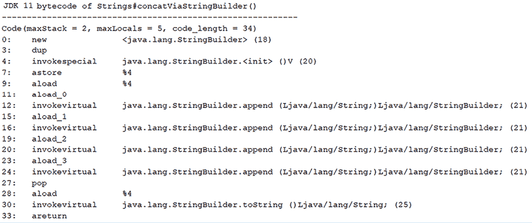

图 1.14：JDK 11 concatViaStringBuilder() 的字节码

我相信您一定很好奇哪种字节码的性能更好，所以这里有一些结果：

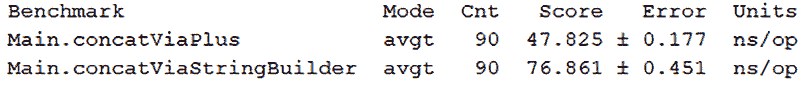

图 1.15：JDK 11，concatViaPlus() 与 concatViaStringBuilder() 的基准比较

这些基准测试的结果是在一台装有 Windows 10 的 Intel^® Core^™ i7-3612QM CPU @ 2.10GHz 的机器上获得的，但您也可以在不同的机器和不同的 JDK 版本上测试它，因为结果高度依赖于机器。

再次强调，`concatViaPlus()` 在这场游戏中获胜。在附带代码中，您可以找到这个示例的完整代码。此外，您还可以找到检查字节码以及通过“`+`”运算符和 `StringBuilder` 在循环中进行字符串连接基准测试的代码。试试看吧！

# 14. 将 int 转换为 String

如同往常，在 Java 中，我们可以用多种方式完成一个任务。例如，我们可以通过 `Integer.toString()` 将 `int`（原始整数）转换为 `String`，如下所示：

```java
public String intToStringV1(int v) {
  return Integer.toString(v);
} 
```

或者，您也可以通过一种相当常见的技巧（代码审查员会在这里皱眉）来完成这个任务，即通过将空字符串与整数连接起来：

```java
public String intToStringV2(int v) {
  return "" + v;
} 
```

`String.valueOf()` 也可以如下使用：

```java
public String intToStringV3(int v) {
  return String.valueOf(v);
} 
```

通过 `String.format()` 的更高级方法如下：

```java
public String intToStringV4(int v) {
  return String.format("%d", v);
} 
```

这些方法也适用于装箱整数和 `Integer` 对象。由于装箱和拆箱是昂贵的操作，我们努力避免它们，除非它们真的有必要。然而，您永远不知道拆箱操作何时会“幕后”偷偷进行并破坏您应用程序的性能。为了验证这个说法，想象一下，对于前面提到的每种方法，我们也有一个使用 `Integer` 而不是 `int` 的等效方法。这里有一个（为了简洁起见，其他方法被省略了）：

```java
public String integerToStringV1(Integer vo) {
  return Integer.toString(vo);
} 
```

对所有这些方法的基准测试结果如下：

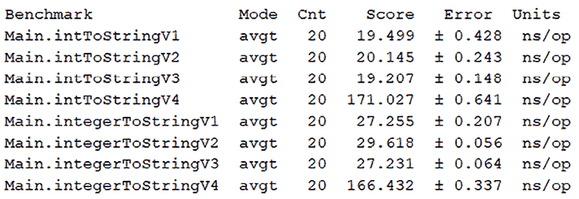

图 1.16：基准测试 int 转换为 String 的结果

从这里我们可以得出两个非常明确的结论：

+   使用 `String.format()` 非常慢，对于 `int` 和 `Integer` 应该避免使用。

+   所有使用 `Integer` 的解决方案都比使用原始 `int` 的解决方案慢。因此，即使在这种情况下，也应避免不必要的拆箱，因为它们可能会引起严重的性能惩罚。

这些基准测试的结果是在一台装有 Windows 10 的 Intel^® Core^™ i7-3612QM CPU @ 2.10GHz 的机器上获得的，但您也可以在不同的机器上测试它，因为结果高度依赖于机器。

接下来，让我们改变话题，谈谈 Java 区域设置。

# 15. 字符串模板的介绍

直到 JDK 21，Java 允许我们通过不同的方法执行 SQL、JSON、XML 等的字符串组合，这些方法在之前的*问题 8*中已经介绍过。在那个问题中，你可以看到如何通过简单的连接使用文本块和内嵌表达式，使用加号（`+`）运算符、`StringBuilder.append()`、`String.format()`、`formatted()`等。虽然使用加号（`+`）运算符和`StringBuilder.append()`可能会很繁琐并影响可读性，但`String.format()`和`formatted()`可能会引起类型不匹配。例如，在下面的例子中，很容易搞错数据类型（`LocalDate`、`double`和`String`）和格式说明符（`%d`、`%s`和`%.2f`）：

```java
LocalDate fiscalDate = LocalDate.now(); 
double value = 4552.2367; 
String employeeCode = "RN4555"; 

String jsonBlock = """ 
                 {"sale": { 
                     "id": 1, 
                     "details": { 
                         "fiscal_year": %d, 
                         "employee_nr": "%s", 
                         "value": %.2f  
                     } 
                 } 
                 """.formatted( 
                  fiscalDate.getYear(), employeeCode, value); 
```

此外，这些方法中的任何一种都不涵盖输入有效性（因为我们不知道表达式是否有效）和安全问题（注入，这通常影响 SQL 字符串）。

从 JDK 21 开始，我们可以通过 *字符串模板*（JEP 430）来解决这些问题。

## 什么是字符串模板？

字符串模板（模板表达式）是 JDK 21 中引入的一个预览功能，可以帮助我们高效且安全地执行字符串插值。这个功能由以下三个部分组成：

+   模板处理器（`RAW`、`STR`、`FMT`、用户定义的等）

+   一个点字符

+   包含内嵌表达式（`\{expression}`）的字符串模板

`RAW`、`STR`和`FMT`是 JDK 21 提供的三个 *模板处理器*，但正如你将看到的，我们也可以编写自己的模板处理器。

一个 *模板处理器* 接收一个字符串字面量和适当的表达式，并且能够验证和插入它到一个最终结果中，这个结果可以是一个字符串或其他特定领域的对象（例如，一个 JSON 对象）。如果模板处理器无法成功创建结果，则可能会抛出异常。

## STR 模板处理器

`STR`模板处理器作为`java.lang.StringTemplate`中的`static`字段提供。它的目标是服务于简单的字符串连接任务。例如，我们可以使用`STR`重写之前的例子，如下所示：

```java
import static java.lang.StringTemplate.STR; 
String jsonBlockStr = STR.""" 
       {"sale": { 
           "id": 1, 
           "details": { 
               "fiscal_year": \{fiscalDate.getYear()}, 
               "employee_nr": "\{employeeCode}", 
               "value": \{value}  
           } 
       } 
       """; 
```

在这里，我们有三个内嵌表达式（`\{fiscalDate.getYear()}`、`\{employeeCode}`和`\{value}`），`STR`将按顺序处理这些表达式以获得最终的字符串：

```java
{"sale": { 
    "id": 1, 
    "details": { 
        "fiscal_year": 2023, 
        "employee_nr": "RN4555", 
        "value": 4552.2367 
    } 
} 
```

如你所见，`STR`处理器已经将每个内嵌表达式替换为该表达式的字符串值。返回的结果是一个`String`，我们可以使用任意数量的内嵌表达式。如果表达式很大，那么你可以在你的 IDE 中将其拆分成多行，而不会在最终结果中引入新行。

## FMT 模板处理器

在前面的示例中，我们有 `\{value}` 嵌入表达式，它被 `STR` 评估为 4552.2367。这是正确的，但我们可能希望将此值格式化为两位小数，即 4552.24。在这种情况下，我们需要 `FMT` 处理器，它作为 `java.util.FormatProcessor` 中的 `static` 字段可用，并且能够解释嵌入表达式中的格式说明符（`STR` 不能这样做）。因此，使用 `FMT` 重写我们的示例可以这样做：

```java
String jsonBlockFmt = FMT.""" 
       {"sale": { 
           "id": 1, 
           "details": { 
               "fiscal_year": \{fiscalDate.getYear()}, 
               "employee_nr": "\{employeeCode}", 
               "value": %.2f\{value}  
           } 
       } 
       """; 
```

注意格式说明符是如何在反斜杠字符之前添加到嵌入表达式 `(%.2f{value}`) 中的。这将导致以下字符串：

```java
... 
"value": 4552.24 
... 
```

以同样的方式，你可以使用任何其他格式说明符。`FMT` 将考虑它们以返回预期的结果。

## RAW 模板处理器

`RAW` 模板处理器作为 `java.lang.StringTemplate` 的 `static` 字段可用。调用 `RAW` 将返回一个 `StringTemplate` 实例，稍后可以使用。例如，这里是一个我们使用 `RAW` 分别提取的 `StringTemplate`：

```java
StringTemplate templateRaw = RAW.""" 
           "employee_nr": "\{employeeCode}", 
           """; 
```

接下来，我们可以重复使用 `templateRaw`，如下例所示：

```java
LocalDate fiscalDate1 = LocalDate.of(2023, 2, 4); 
LocalDate fiscalDate2 = LocalDate.of(2024, 3, 12); 
double value1 = 343.23; 
double value2 = 1244.33; 
String jsonBlockRaw = STR."""  
       {"sale": { 
           "id": 1, 
           "details": { 
               "fiscal_year": \{fiscalDate1.getYear()}, 
               \{templateRaw.interpolate()}\ 
               "value": \{value1}      
           } 
       }, 
       {"sale": { 
           "id": 2, 
           "details": { 
               "fiscal_year": \{fiscalDate2.getYear()}, 
               \{templateRaw.interpolate()}\ 
               "value": \{value2}     
           } 
       }            
       """; 
```

`\{templateRaw.interpolate()}` 表达式调用 `interpolate()` 方法，该方法负责处理 `templateRaw` 中定义的字符串。它就像调用 `interpolate()` 一样，如下所示：

```java
String employeeCodeString = templateRaw.interpolate(); 
```

最终结果是以下字符串：

```java
{"sale": { 
    "id": 1, 
    "details": { 
       "fiscal_year": 2023, 
       "employee_nr": "RN4555", 
       "value": 343.23 
    } 
}, 
{"sale": { 
    "id": 2, 
     "details": { 
        "fiscal_year": 2024, 
        "employee_nr": "RN4555", 
        "value": 1244.33 
     } 
} 
```

员工代码被评估为 RN4555 字符串。

在嵌入表达式之前和最后一个嵌入表达式之后的字符序列被称为 *片段*。如果字符串模板以嵌入表达式开始，则其片段为零长度。同样，直接相邻的嵌入表达式也是如此。例如，`templateRaw` 的片段（`"employee_nr": "{employeeCode}",`）是 `"employee_nr": "` 和 `","`。我们通过 `fragments()` 方法可以访问这些片段作为 `List<String>`。

```java
List<String> trFragments = templateRaw.fragments(); 
```

此外，通过 `values()` 方法获取嵌入表达式的结果作为 `List<Object>` 可以这样做：

```java
List<Object> trValues = templateRaw.values(); 
```

对于 `templateRaw`，此列表将包含单个条目，RN4555。

在捆绑的代码中，你可以找到更多示例，包括使用 `STR`、`FMT` 和 `RAW` 与简单字符串（不是文本块）一起使用。

# 16. 编写自定义模板处理器

内置的 `STR` 和 `FMT` 只能返回 `String` 实例，并且不能抛出异常。然而，它们实际上是功能接口 `StringTemplate.Processor<R,E extends Throwable>` 的实例，该接口定义了 `process()` 方法：

```java
R process(StringTemplate stringTemplate) throws E 
```

通过实现 `Processor<R,E extends Throwable>` 接口，我们可以编写自定义模板处理器，返回 `R`（任何结果类型），而不仅仅是 `String`。此外，如果在处理过程中出现问题（例如，存在验证问题），我们可以抛出检查异常（`E extends Throwable`）。

例如，假设我们需要将表示电话号码的表达式进行字符串插值。因此，我们只接受匹配以下正则表达式的电话号码表达式：

```java
private static final Pattern PHONE_PATTERN = Pattern.compile( 
  "\\d{10}|(?:\\d{3}-){2}\\d{4}|\\(\\d{3}\\)\\d{3}-?\\d{4}"); 
```

在这种情况下，结果是`String`，因此我们的自定义模板处理器可以编写如下：

```java
public class PhoneProcessor
    implements Processor<String, IllegalArgumentException> { 

  private static final Pattern PHONE_PATTERN = ...; 

  @Override 
  public String process(StringTemplate stringTemplate)  
    throws IllegalArgumentException { 

    StringBuilder sb = new StringBuilder(); 
    Iterator<String> fragmentsIter  
      = stringTemplate.fragments().iterator(); 

    for (Object value : stringTemplate.values()) { 
      sb.append(fragmentsIter.next()); 

      if (!PHONE_PATTERN.matcher( 
            (CharSequence) value).matches()) { 
        throw new IllegalArgumentException( 
          "This is not a valid phone number"); 
      } 

      sb.append(value); 
    } 

    sb.append(fragmentsIter.next()); 

    return sb.toString(); 
  } 
} 
```

现在，我们可以使用以下简单消息测试我们的处理器（这里使用有效的电话号码）：

```java
PhoneProcessor pp = new PhoneProcessor();
String workPhone = "072-825-9009"; 
String homePhone = "(040)234-9670"; 

String message = pp.""" 
   You can contact me at work at \{workPhone}
   or at home at \{homePhone}. 
   """; 
```

生成的字符串如下：

```java
You can contact me at work at 072-825-9009 
or at home at (040)234-9670. 
```

如您所见，我们的处理器依赖于`StringBuilder`来获取最终的字符串。然而，我们也可以使用`StringTemplate.interpolate(List<String> fragments, List<?> values)`方法，并获得一个更简洁的解决方案，如下所示：

```java
public class PhoneProcessor implements  
    Processor<String, IllegalArgumentException> { 

  private static final Pattern PHONE_PATTERN = ...; 

  @Override 
  public String process(StringTemplate stringTemplate)  
      throws IllegalArgumentException { 

    for (Object value : stringTemplate.values()) { 

      if (!PHONE_PATTERN.matcher( 
         (CharSequence) value).matches()) { 
       throw new IllegalArgumentException( 
         "This is not a valid phone number"); 
      } 
    } 

    return StringTemplate.interpolate( 
      stringTemplate.fragments(), stringTemplate.values()); 
  } 
} 
```

然而，正如我们之前所说的，模板处理器可以返回任何类型（`R`）。例如，假设我们将之前的消息格式化为 JSON 字符串，如下所示：

```java
{ 
  "contact": { 
    "work": "072-825-9009", 
    "home": "(040)234-9670" 
  } 
} 
```

这次，我们想要使用表示电话号码的变量进行字符串插值，并返回一个 JSON 对象。更确切地说，我们想要返回`com.fasterxml.jackson.databind.JsonNode`的实例（在这里，我们使用 Jackson 库，但也可以是 GSON、JSON-B 等）：

```java
@Override 
public JsonNode process(StringTemplate stringTemplate)  
    throws IllegalArgumentException { 

  for (Object value : stringTemplate.values()) { 

    if (!PHONE_PATTERN.matcher( 
       (CharSequence) value).matches()) { 
      throw new IllegalArgumentException( 
        "This is not a valid phone number"); 
    } 
  } 

  ObjectMapper mapper = new ObjectMapper();

  try { 
    return mapper.readTree(StringTemplate.interpolate( 
      stringTemplate.fragments(), stringTemplate.values())); 
  } catch (IOException ex) { 
      throw new RuntimeException(ex);
  }
} 
```

这次，返回的类型是`JsonNode`：

```java
PhoneProcessor pp = new PhoneProcessor(); 
String workPhone = "072-825-9009"; 
String homePhone = "(040)234-9670"; 

JsonNode jsonMessage = pp.""" 
  { "contact": { 
       "work": "\{workPhone}", 
       "home": "\{homePhone}" 
       } 
  }   
  """; 
```

在捆绑的代码中，您还可以找到一个使用 lambda 表达式编写之前自定义模板处理器的示例。此外，您还可以找到一个示例，其中对于无效的表达式，我们只是用默认值替换它们，而不是抛出异常。

请注意，最近的一篇文章《字符串模板更新（JEP 459）》，您可以在以下链接找到：[`mail.openjdk.org/pipermail/amber-spec-experts/2024-March/004010.html`](https://mail.openjdk.org/pipermail/amber-spec-experts/2024-March/004010.html)，指出使用这种方式，处理器最终将被更简单的方法调用所取代。

# 17. 创建一个区域设置

Java 的`Locale`（`java.util.Locale`）代表一个封装有关特定地理、政治或文化区域信息的对象——即用于国际化的对象。`Locale`通常与`DateFormat`/`DateTimeFormatter`一起使用，以特定于国家的格式表示日期时间，使用`NumberFormat`（或其子类`DecimalFormat`）以特定于国家的格式表示数字（例如，表示特定货币的金额），或使用`MessageFormat`为特定国家创建格式化消息。

对于最受欢迎的区域设置，Java 提供了一系列常量（例如，`Locale.GERMANY`、`Locale.CANADA`等）。对于不在该列表上的区域设置，我们必须使用在几个 RFC 中定义的格式。最常见的是使用*语言*模式（例如，`ro`代表罗马尼亚）或*语言 _ 国家*模式（例如，`ro_RO`代表罗马尼亚，`en_US`代表美国，等等）。有时，我们可能需要*语言 _ 国家 _ 变体*模式，其中*变体*有助于映射软件供应商添加的附加功能，例如浏览器或操作系统（例如，`de_DE_WIN`是德国德语使用者的区域设置，针对 Windows）。然而，有两个区域设置被视为非规范：`ja_JP_JP`（代表在日本使用的日语）和`th_TH_TH`（代表在泰国使用的泰语，包括泰语数字）。

虽然你可以从其全面的文档中了解更多关于`Locale`的信息，但让我们提一下，在 JDK 19 之前，我们可以通过其三个构造函数之一创建一个`Locale`——最常见的是通过`Locale(String language, String country)`，如下所示：

```java
Locale roDep = new Locale("ro", "RO"); // locale for Romania 
```

当然，如果你的`Locale`已经定义了一个常量，你可以在代码中直接嵌入该常量，或者简单地声明一个`Locale`，如下所示（这里以德国为例）：

```java
Locale de = Locale.GERMANY; // de_DE 
```

另一种方法是通过`Locale.Builder`的 setter 链：

```java
Locale locale = new Locale.Builder()
  .setLanguage("ro").setRegion("RO").build(); 
```

或者，这也可以通过`Locale.forLanguageTag()`来完成，以遵循 IETF BCP 47 标准语言标签（这可以用来表示复杂标签，如特定于中国的中文、普通话、简体字和“`zh-cmn-Hans-CN`”）：

```java
Locale locale = Locale.forLanguageTag("zh-cmn-Hans-CN"); 
```

此外，Java 支持*语言范围*。这意味着我们可以定义一组具有某些特定属性的标签。例如，“`de-*`"代表一个识别任何地区的德语的语言范围：

```java
Locale.LanguageRange lr1 
  = new Locale.LanguageRange("de-*", 1.0);
Locale.LanguageRange lr2 
  = new Locale.LanguageRange("ro-RO", 0.5);
Locale.LanguageRange lr3 
  = new Locale.LanguageRange("en-*", 0.0); 
```

之前的`Locale.LanguageRange()`构造函数接受两个参数：语言范围及其权重（1.0、0.5、0.0）。通常，这个权重揭示了用户的偏好（最高为 1.0，最低为 0.0）。权重对于定义*优先级列表*很有用，如下所示（我们更喜欢西班牙的卡斯蒂利亚语（西班牙）而不是墨西哥的西班牙语和巴西的葡萄牙语）：

```java
String rangeString = "es-ES;q=1.0,es-MX;q=0.5,pt-BR;q=0.0";
List<Locale.LanguageRange> priorityList
  = Locale.LanguageRange.parse(rangeString); 
```

注意定义一个有效的偏好字符串，以便`parse()`方法可以工作。

从 JDK 19 开始，`Locale`的三个构造函数已被弃用，我们可以依赖三个静态的`of()`方法。通过适当的`of()`方法，之前的代码等价于：

```java
Locale ro = Locale.of("ro", "RO"); // ro_RO 
```

这里还有两个示例：

```java
Locale de = Locale.of("de" ,"DE", "WIN");
Locale it = Locale.of("it"); // similar to Locale.ITALIAN 
```

使用`Locale`非常简单。以下是一个使用之前的`ro`通过`DateFormat`格式化罗马尼亚和意大利日期时间的示例：

```java
// 7 ianuarie 2023, 14:57:42 EET
DateFormat rodf = DateFormat.getDateTimeInstance(
  DateFormat.LONG, DateFormat.LONG, ro);
// 7\. Januar 2023 um 15:05:29 OEZ
DateFormat dedf = DateFormat.getDateTimeInstance(
  DateFormat.LONG, DateFormat.LONG, de); 
```

在下一个问题中，我们继续区域设置的旅程。

# 18. 自定义本地化日期时间格式

从 JDK 8 开始，我们有一个包含`LocalDate`、`LocalTime`、`LocalDateTime`、`ZonedDateTime`、`OffsetDateTime`和`OffsetTime`等类的综合日期时间 API。

我们可以通过 `DateTimeFormatter.ofPattern()` 简单地格式化这些类返回的日期时间输出。例如，这里，我们通过 `y-MM-dd HH:mm:ss` 模式格式化一个 `LocalDateTime`：

```java
// 2023-01-07 15:31:22
String ldt = LocalDateTime.now()
  .format(DateTimeFormatter.ofPattern("y-MM-dd HH:mm:ss")); 
```

更多示例可以在捆绑的代码中找到。

那么，根据给定的区域设置自定义我们的格式如何——比如，德国？

```java
Locale.setDefault(Locale.GERMANY); 
```

我们通过 `ofLocalizedDate()`, `ofLocalizedTime()`, 和 `ofLocalizedDateTime()` 来完成这个任务，如下面的例子所示：

```java
// 7\. Januar 2023
String ld = LocalDate.now().format(
  DateTimeFormatter.ofLocalizedDate(FormatStyle.LONG));
// 15:49
String lt = LocalTime.now().format(
  DateTimeFormatter.ofLocalizedTime(FormatStyle.SHORT));
// 07.01.2023, 15:49:30
String ldt = LocalDateTime.now().format(
  DateTimeFormatter.ofLocalizedDateTime(FormatStyle.MEDIUM)); 
```

我们还可以使用：

```java
// Samstag, 7\. Januar 2023 um 15:49:30 
// Osteuropäische Normalzeit
String zdt = ZonedDateTime.now().format(
  DateTimeFormatter.ofLocalizedDateTime(FormatStyle.FULL));
// 07.01.2023, 15:49:30
String odt = OffsetDateTime.now().format(
  DateTimeFormatter.ofLocalizedDateTime(FormatStyle.MEDIUM));
// 15:49:30
String ot = OffsetTime.now().format(
  DateTimeFormatter.ofLocalizedTime(FormatStyle.MEDIUM)); 
```

本地化日期、时间或日期时间格式化程序支持四种格式样式：

+   `FULL`: 使用所有细节的格式。

+   `LONG`: 使用很多细节但不是全部的格式。

+   `MEDIUM`: 使用一些细节的格式。

+   `SHORT`: 尽可能简短地格式化（通常是数字）。

根据本地化元素和格式样式的组合，代码可能会抛出异常，例如 *DateTimeException: Unable to extract….*。如果您看到这样的异常，那么是时候查阅以下表格了，它提供了接受的组合：

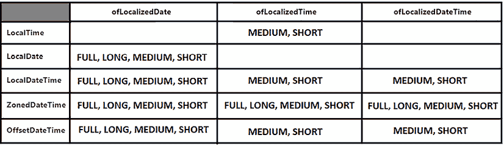

图 1.17：本地化日期、时间和日期时间的格式样式

此外，从 JDK 19 开始，我们还可以使用 `ofLocalizedPattern(String pattern)`。

我们可以传递 *图 1.18* 中显示的任何模式。

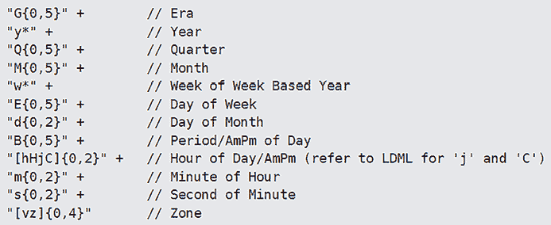

图 1.18：为 ofLocalizedPattern(String pattern) 构建模式

话虽如此，让我们将当前的区域设置更改为罗马尼亚：

```java
Locale.setDefault(Locale.of("ro", "RO")); 
```

让我们再举一些 `ofLocalizedPattern()` 的例子：

```java
// 01.2023
String ld = LocalDate.now().format(
  DateTimeFormatter.ofLocalizedPattern("yMM"));
// 15:49
String lt = LocalTime.now().format(
  DateTimeFormatter.ofLocalizedPattern("Hm"));
// 01.2023, 15:49
String ldt = LocalDateTime.now().format(
  DateTimeFormatter.ofLocalizedPattern("yMMHm")); 
```

还有更多：

```java
// 01.2023, 15:49:30 EET
String zdt = ZonedDateTime.now().format(
  DateTimeFormatter.ofLocalizedPattern("yMMHmsv"));
// 01.2023, 15:49:30
String odt = OffsetDateTime.now().format(
  DateTimeFormatter.ofLocalizedPattern("yMMHms"));
// 15:49:30
String ot = OffsetTime.now().format(
  DateTimeFormatter.ofLocalizedPattern("Hms")); 
```

您可以在捆绑的代码中练习所有这些示例。此外，在捆绑的代码中，您可以找到一个使用区域设置和 `NumberFormat` 格式化不同区域设置（货币）版税金额的应用程序。

# 19. 恢复始终严格的浮点语义

浮点计算并不容易！即使是某些简单的算术属性也不适用于此类计算。例如，浮点加法或乘法不是结合的。换句话说，(x + y) + z 不等于 x + (y + z)，其中 x、y 和 z 是实数。以下是一个测试乘法结合性的快速示例：

```java
double x = 0.8793331;
double y = 12.22933;
double z = 901.98334884433;
double m1 = (x * y) * z;   // 9699.617442382583 
double m2 = (x * (y * z)); // 9699.617442382581
// m1 == m2 returns false 
```

这意味着浮点算术是实数算术的系统近似。由于一些限制，计算机必须进行近似。例如，精确的浮点输出会非常快地变得非常大。此外，精确的输入是未知的，因此对于不精确的输入，很难获得精确的输出。

为了解决这个问题，Java 必须采用一种 *舍入策略*。换句话说，Java 必须使用一种能够将实数值映射到浮点值的特殊函数。如今，Java 使用所谓的 *四舍五入到最接近的策略*。这种策略试图将一个不精确的值四舍五入到最接近的 *无限精确的结果*。在相等的情况下（可表示的值与不精确值同样接近），具有零最高有效位的值是获胜者。

此外，浮点计算在不同平台上可能会产生不同的输出。换句话说，在不同的芯片架构（例如，16 位、32 位或 64 位处理器）上运行浮点计算可能会导致不同的结果。Java 通过`strictfp`修饰符解决了这个问题。这个关键字遵循 IEEE 754 浮点计算标准，并在 JDK 1.2 中引入。

**重要提示**

`strictfp`修饰符表示所有中间值都符合 IEEE 754 的单精度/双精度。然而，一些硬件特定问题导致`strictfp`在 JDK 1.2 中成为可选的。

假设我们需要实现一个科学计算器。显然，我们的计算器必须在各个平台上提供一致的结果，因此我们依赖于`strictfp`，如下所示：

```java
public **strictfp** final class ScientificCalculator {
  private ScientificCalculator() {
    throw new AssertionError("Cannot be instantiated");
  }
  public static double multiply(
        final double v1, final double v2) {
    return v1 * v2;
  }
  public static double division(
        final double v1, final double v2) { 
    return v1 / v2;
  }
  // more computational methods
} 
```

与类一起使用的`strictfp`修饰符确保该类的所有成员方法都利用其效果。现在，我们在各个平台上有了一致的结果。您可以在捆绑的代码中找到这个示例。

**重要提示**

`strictfp`修饰符可用于类（以及嵌套类），非抽象方法和接口。它不能用于变量、构造函数或抽象方法。

当在接口上使用`strictfp`修饰符时，有一些重要的事项需要考虑，如下所述：

+   它不适用于接口中声明的`abstract`方法。

+   它应用于接口中声明的`default`方法。

+   它不适用于实现接口的类中定义的方法。

+   它应用于接口内部类中声明的所有方法。

例如，考虑以下`strictfp`接口：

```java
public **strictfp** interface Rectangle {
  default double area(double length, double width) {
    ...
  } 
  double diagonal(double length, double width);
  public class Trigonometry { 
    public static double smallAngleOfDiagonals(
         double length, double width) {
      ...
    }
    public static double bigAngleOfDiagonals(
         double length, double width) {
      ...
    }
  }
} 
```

此外，还有一个实现先前`strictfp`接口的非`strictfp`类：

```java
public class Main implements Rectangle {
  @Override
  public double diagonal(double length, double width) {
    ...
  }
  public double perimeter(double length, double width) {
    ...
  }
} 
```

要找出哪些工件是`strictfp`，我们可以运行一小段 Java 反射代码，这将揭示每个方法的修饰符：

```java
public static void displayModifiers(
                          Class clazz, String member) {
  try {
    int modifiers = clazz.getDeclaredMethod(member, 
      double.class, double.class).getModifiers();
    System.out.println(member + " has the following 
    modifiers: " + Modifier.toString(modifiers));
  } catch (NoSuchMethodException | SecurityException e) {
    e.printStackTrace(System.out);
  }
} 
```

然后，让我们称这个方法为：

```java
// public
displayModifiers(Main.class, "diagonal");
// public
displayModifiers(Main.class, "perimeter");
// public abstract
displayModifiers(Main.class.getInterfaces()[0], "diagonal");
// public strictfp
displayModifiers(Main.class.getInterfaces()[0], "area");
// public static strictfp
displayModifiers(Rectangle.Trigonometry.class,  
  "smallAngleOfDiagonals");
// public static strictfp
displayModifiers(Rectangle.Trigonometry.class,  
  "bigAngleOfDiagonals"); 
```

如您所见，`strictfp`修饰符并不适用于我们所有的方法。因此，如果我们需要在`perimeter()`和`diagonal()`上使用`strictfp`，那么我们必须手动添加它：

```java
@Override
**strictfp** public double diagonal(double length, double width) {
  ...
}
**strictfp** public double perimeter(double length, double width) {
  ...
} 
```

然而，从 JDK 17 开始，这个领域有一些重大新闻。

**重要提示**

硬件已经严重发展，导致`strictfp`在 JDK 1.2 中成为可选的问题已经得到解决，因此默认的浮点语义可以更改为一致严格。换句话说，从 JDK 17 开始，不再需要显式使用`strictfp`。JEP 306，*恢复始终严格的浮点语义*，提供了这种功能。因此，从 JDK 17 开始，所有浮点操作都是一致的严格。

除了对我们这些开发者来说是好消息之外，JEP 306 还支持几个 Java 类，如`java.lang.Math`和`java.lang.StrictMath`，它们变得更加健壮且易于实现。

# 20. 计算 int/long 的数学绝对值和结果溢出

数学绝对值通过在两个管道操作符之间放置值来表示，并按以下方式计算：

```java
|x| = x, |-x| = x 
```

这通常用于计算/表示距离。例如，想象 0 代表海平面，我们有一个潜水员和一名登山者。潜水员在水下-45 英尺（注意，我们使用负数来表示潜水员在水中的深度）。同时，登山者已经爬升了 30 英尺。他们哪一个离海平面（0）更近？我们可能会认为由于-45 < 30，潜水员更近，因为它的值更小。然而，我们可以通过应用数学绝对值轻松找到正确答案，如下所示：

```java
|-45| = 45, |30| = 30
45 > 30, so the climber is closer to the sea level (0) 
```

现在，让我们通过以下示例深入了解解决方案：

```java
int x = -3;
int absofx = Math.abs(x); // 3 
```

这是`Math.abs()`的一个非常简单的用例，它返回给定整数的数学绝对值。现在，让我们将此方法应用于以下大数：

```java
int x = Integer.MIN_VALUE; // -2,147,483,648    
int absofx = Math.abs(x);  // -2,147,483,648 
```

这不好！由于`|Integer.MIN_VALUE| > |Integer.MAX_VALUE|`，`int`域溢出了。预期的结果是正的 21,474,836,48，但这不适合`int`域。然而，将`x`类型从`int`改为`long`将解决问题：

```java
long x = Integer.MIN_VALUE; // -2,147,483,648    
long absofx = Math.abs(x);  // 2,147,483,648 
```

但如果问题不是由`Integer.MIN_VALUE`引起，而是由`Long.MIN_VALUE`引起，问题将再次出现：

```java
long y = Long.MIN_VALUE;// -9,223,372,036,854,775,808
long absofy = Math.abs(y); // -9,223,372,036,854,775,808 
```

从 JDK 15 开始，`Math`类增加了两个`absExact()`方法。一个用于`int`，一个用于`long`。如果数学绝对结果容易超出`int`或`long`的范围（例如，`Integer`/`Long.MIN_VALUE`值超出了正`int`/`long`范围），这些方法非常有用。在这种情况下，这些方法会抛出`ArithmeticException`，而不是返回误导性的结果，如下例所示：

```java
int absofxExact = Math.absExact(x);  // ArithmeticException
long absofyExact = Math.absExact(y); // ArithmeticException 
```

在函数式风格上下文中，一个潜在的解决方案将依赖于`UnaryOperator`函数式接口，如下所示：

```java
IntUnaryOperator operatorInt = Math::absExact;
LongUnaryOperator operatorLong = Math::absExact;
// both throw ArithmeticException
int absofxExactUo = operatorInt.applyAsInt(x);
long absofyExactUo = operatorLong.applyAsLong(y); 
```

当处理大数时，也要关注`BigInteger`（不可变任意精度整数）和`BigDecimal`（不可变任意精度有符号十进制数）。

# 21. 计算参数和结果的商，结果溢出

让我们从两个简单的计算开始，如下所示：

```java
-4/-1 = 4, 4/-1 = -4 
```

这是一个非常简单的用例，按预期工作。现在，让我们保持除数为`-1`，并将被除数改为`Integer.MIN_VALUE`（-2,147,483,648）：

```java
int x = Integer.MIN_VALUE;
int quotient = x/-1; // -2,147,483,648 
```

这次，结果是不正确的。由于`|Integer.MIN_VALUE| > |Integer.MAX_VALUE|`，`int`域溢出了。它应该是正的 21,474,836,48，但这不适合`int`域。然而，将`x`类型从`int`改为`long`将解决问题：

```java
long x = Integer.MIN_VALUE;
long quotient = x/-1; // 2,147,483,648 
```

但如果问题不是由`Integer.MIN_VALUE`引起，而是由`Long.MIN_VALUE`引起，问题将再次出现：

```java
long y = Long.MIN_VALUE; // -9,223,372,036,854,775,808
long quotient = y/-1;    // -9,223,372,036,854,775,808 
```

从 JDK 18 开始，`Math` 类增加了两个 `divideExact()` 方法。一个用于 `int`，一个用于 `long`。如果除法结果容易溢出 `int` 或 `long`（如 `Integer`/`Long.MIN_VALUE` 溢出正 `int`/`long` 范围），这些方法非常有用。在这种情况下，这些方法会抛出 `ArithmeticException` 而不是返回误导性的结果，如下例所示：

```java
// throw ArithmeticException
int quotientExact = Math.divideExact(x, -1); 
```

在函数式风格语境中，一个潜在的解决方案将依赖于 `BinaryOperator` 函数式接口，如下所示：

```java
// throw ArithmeticException
BinaryOperator<Integer> operator = Math::divideExact;
int quotientExactBo = operator.apply(x, -1); 
```

正如我们在前一个问题中也说的，当处理大数时，也要关注 `BigInteger`（不可变任意精度整数）和 `BigDecimal`（不可变任意精度有符号十进制数）。

# 22. 计算大于/等于代数商的最大/最小值

最大的值，我们理解为最接近正无穷大的值，而最小的值，我们理解为最接近负无穷大的值。

从 JDK 8 开始，可以通过 `floorDiv(int x, int y)` 和 `floorDiv(long x, long y)` 来计算小于或等于代数商的最大值。从 JDK 9 开始，我们也有 `floorDiv(long x, int y)`。

从 JDK 18 开始，可以通过 `ceilDiv(int x, int y)`、`ceilDiv(long x, int y)` 和 `ceilDiv(long x, long y)` 来计算大于或等于代数商的最小值。

然而，这些函数都无法处理前一个问题中提到的角点情况除法，即 `Integer.MIN_VALUE/-1` 和 `Long.MIN_VALUE/-1`：

```java
int x = Integer.MIN_VALUE; // or, x = Long.MIN_VALUE
Math.floorDiv(x, -1); // -2,147,483,648
Math.ceilDiv(x, -1);  // -2,147,483,648 
```

从 JDK 18 开始，每当 `floorDiv()`/`ceilDiv()` 返回的结果可能溢出 `int` 或 `long` 范围时，我们可以使用 `floorDivExact()` 和 `ceilDivExact()`。这些方法为 `int` 和 `long` 参数提供了不同的版本。正如你可能已经直觉到的，这些方法会抛出 `ArithmeticException` 而不是返回误导性的结果，如下例所示：

```java
// throw ArtihmeticException
int resultFloorExact = Math.floorDivExact(x, -1);
// throw ArtihmeticException
int resultCeilExact = Math.ceilDivExact(x, -1); 
```

在函数式风格语境中，一个潜在的解决方案将依赖于 `BinaryOperator` 函数式接口，如下所示：

```java
// throw ArithmeticException
BinaryOperator<Integer> operatorf = Math::floorDivExact;
int floorExactBo = operatorf.apply(x, -1);
// throw ArithmeticException
BinaryOperator<Integer> operatorc = Math::ceilDivExact;
int ceilExactBo = operatorc.apply(x, -1); 
```

完成！正如你所知，当处理大数时，也要关注 `BigInteger`（不可变任意精度整数）和 `BigDecimal`（不可变任意精度有符号十进制数）。这些可能会帮到你。

# 23. 从 double 中获取整数部分和小数部分

你知道那些如果你知道解决方案就非常简单，如果你不知道就看起来非常困难的问题吗？这正是那种问题。解决方案非常简单，如下面的代码所示：

```java
double value = -9.33543545;
double fractionalPart = value % 1;
double integralPart = value - fractionalPart; 
```

这很简单；我认为你不需要进一步的解释。但这种方法并不完全准确。我的意思是，整数部分是 -9，但返回的是 -9.0。另外，小数部分是 -0.33543545，但返回的值是 -0.3354354500000003。

如果我们需要更精确的结果，那么使用 `BigDecimal` 会更有用：

```java
BigDecimal bd = BigDecimal.valueOf(value);
int integralPart = bd.intValue();
double fractionalPart = bd.subtract(
       BigDecimal.valueOf(integralPart)).doubleValue(); 
```

这次，结果是 -9 和 -0.33543545。

# 24. 测试双精度浮点数是否为整数

首先，让我们考虑以下预期结果（false 表示双精度浮点数不是整数）：

```java
double v1 = 23.11;                    // false
double v2 = 23;                       // true
double v3 = 23.0;                     // true
double v4 = Double.NaN;               // false
double v5 = Double.NEGATIVE_INFINITY; // false
double v6 = Double.POSITIVE_INFINITY; // false 
```

测试一个双精度浮点数是否为整数的最常见方法可能是一个简单的强制类型转换，如下所示：

```java
public static boolean isDoubleIntegerV1(double v) {
  return v == (int) v;
} 
```

然而，还有其他几种选择。例如，我们可以依赖模运算，如下所示：

```java
public static boolean isDoubleIntegerV2(double v) {
  return v % 1 == 0;
} 
```

或者，我们可以依赖 `Math.floor()` 和 `Double.isFinite()` 方法。如果给定的双精度浮点数是一个有限数，并且等于 `Math.floor()` 的结果，那么它就是一个整数：

```java
public static boolean isDoubleIntegerV3(double v) {
  return ((Math.floor(v) == v) && Double.isFinite(v));
} 
```

我们也可以通过 `Math.ceil()` 来替换这个等式：

```java
public static boolean isDoubleIntegerV4(double v) {
  return (Math.floor(v) == Math.ceil(v) 
                        && Double.isFinite(v));
} 
```

此外，我们可以将 `Double.isFinite()` 与 `Math.rint()` 结合使用，如下所示：

```java
public static boolean isDoubleIntegerV5(double v) {
  return ((Math.rint(v) == v) && Double.isFinite(v));
} 
```

最后，我们可以依赖 Guava 的 `DoubleMath.isMathematicalInteger()` 方法：

```java
public static boolean isDoubleIntegerV6(double v) {
  return DoubleMath.isMathematicalInteger(v);
} 
```

但是，这些方法中哪一个性能更好？你更倾向于哪一个？好吧，让我们看看基准测试有什么要说的：

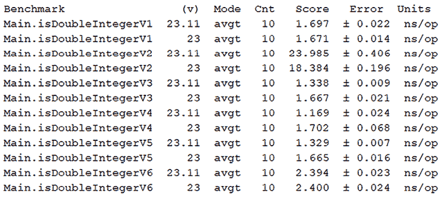

图 1.19：基准测试结果

根据这些结果，结论相当明显——基于模运算的解决方案应该避免使用。此外，Guava 的解决方案似乎比其他方案略慢。

# 25. 简要介绍 Java（无）符号整数

*有符号* 值（或变量），如有符号整数或有符号长整型，允许我们表示负数和正数。

*无符号* 值（或变量），如无符号整数或无符号长整型，允许我们仅表示正数。

同一类型的有符号和无符号值（变量）具有相同的范围。然而，正如你在以下图中可以看到的，无符号变量覆盖了更大的数值范围。

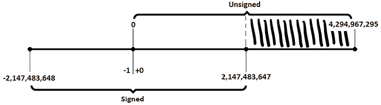

图 1.20：有符号和无符号整数

有符号 32 位整数范围从 –2,147,483,648 到 2,147,483,647（大约 40 亿个值）。无符号 32 位整数范围从 0 到 4,294,967,295（也是大约 40 亿个值）。

当我们使用有符号整数变量时，我们可以使用 20 亿个正数值，但当我们使用无符号整数变量时，我们可以使用 40 亿个正数值。图中的阴影部分表示额外的 20 亿个正整数值。

通常，当我们根本不需要负数值时（例如，要计数某些事件的发生），我们需要使用位于 *图 1.20* 中哈希区域的值，这时就需要无符号值。

Java 仅支持使用流行的 *二进制补码* 表示法在有符号系统中表示的有符号整数（有关二进制补码表示法和位操作的详细解释，请参阅 *Java 完整编码面试指南*，第九章，*位操作*）。然而，从 JDK 8 开始，我们也拥有了 *无符号整数 API*，它增加了对无符号算术的支持。

此外，JDK 9 提供了一个名为 `Math.multiplyHigh(long x, long y)` 的方法。此方法返回一个 `long` 类型的值，表示两个 64 位因子的 128 位乘积的最高 64 位。以下图解说明了这一说法：

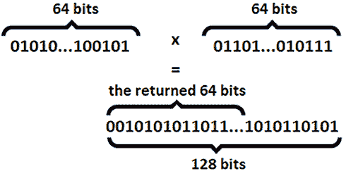

图 1.21：两个 64 位因子 128 位乘积的最高 64 位

例如：

```java
long x = 234253490223L;
long y = -565951223449L;
long resultSigned = Math.multiplyHigh(x, y); // -7187 
```

返回的结果 (-7187) 是一个有符号值。此方法的未签名版本 `unsignedMultiplyHigh(long x, long y)` 在 JDK 18 中引入，其工作方式如下：

```java
// 234253483036
long resultUnsigned = Math.unsignedMultiplyHigh(x, y); 
```

因此，`unsignedMultiplyHigh(long x, long y)` 返回一个 long 类型的值，表示两个无符号 64 位因子的无符号 128 位乘积的最高 64 位。

然而，请记住，Java 支持无符号算术，而不是无符号值/变量。但是，多亏了 Data Geekery 公司（因其著名的 jOOQ 而闻名），我们有了 **jOOU** （**Java Object Oriented Unsigned**）项目，该项目旨在将无符号数字类型引入 Java。虽然你可以在这里探索这个项目 [`github.com/jOOQ/jOOU`](https://github.com/jOOQ/jOOU)，以下是一个定义无符号 long 的示例：

```java
// using jOOU
ULong ux = ulong(234253490223L);  // 234253490223
ULong uy = ulong(-565951223449L); // 18446743507758328167 
```

这是它在 `unsignedMultiplyHigh(long x, long y)` 中的使用示例：

```java
long uResultUnsigned = Math.unsignedMultiplyHigh(
    ux.longValue(), uy.longValue()); 
```

你可以在捆绑的代码中找到这些示例。

# 26. 返回地板/天花板模数

有 *被除数 / 除数 = 商* 的计算，我们知道对 (*被除数*, *除数*) 对应用 *floor* 操作返回的是小于或等于代数 *商* 的最大整数。我们所说的最大整数是指最接近正无穷大的整数。从 JDK 8 开始，这个操作可以通过 `Math.floorDiv()` 方法获得，从 JDK 18 开始，可以通过 `Math.floorDivExact()` 方法获得。

另一方面，对 (*被除数*, *除数*) 对应用 *ceil* 操作返回的是大于或等于代数 *商* 的最小整数。我们所说的最小整数是指最接近负无穷大的整数。从 JDK 18 开始，这个操作可以通过 `Math.ceilDiv()` 和 `Math.ceilDivExact()` 方法获得。

更多细节请参阅 *问题 22*。

现在，基于 *floor* 和 *ceil* 操作，我们可以定义以下 floor/ceil modulus 关系：

```java
Floor_Modulus = dividend -
  (floorDiv(dividend, divisor) * divisor)
Ceil_Modulus = dividend -
  (ceilDiv(dividend, divisor) * divisor) 
```

因此，我们可以在代码中这样写：

```java
int dividend = 162;
int divisor = 42;   // 162 % 42 = 36
int fd = Math.floorDiv(dividend, divisor);
int fmodJDK8 = dividend - (fd * divisor); // 36
int cd = Math.ceilDiv(dividend, divisor);
int cmodJDK18 = dividend - (cd * divisor); // -6 
```

从 JDK 8 开始，可以通过 `Math.floorMod()` 方法获取模数，如下所示：

```java
int dividend = 162;
int divisor = 42;
int fmodJDK8 = Math.floorMod(dividend, divisor); // 36 
```

这里，我们使用 `floorMod(int dividend, int divisor)`。但也可以使用另外两种形式：`floorMod(long dividend, long divisor)` 和从 JDK 9 开始的 `floorMod(long dividend, int divisor)`。

如果 *被除数 % 除数* 为 0，则 `floorMod()` 为 0。如果 *被除数 % 除数* 和 `floorMod()` 都不为 0，则它们的结果仅在参数的符号不同时才不同。

从 JDK 18 开始，可以通过 `Math.ceilMod()` 方法获得 ceiling modulus，如下所示：

```java
int cmodJDK18 = Math.ceilMod(dividend, divisor); // -6 
```

这里，我们使用 `ceilMod(int dividend, int divisor)`。但也可以使用另外两种形式：`ceilMod(long dividend, int divisor)` 和从 JDK 9 开始的 `ceilMod(long dividend, int divisor)`。

如果*被除数 % 除数*为 0，则`ceilMod()`为 0。如果*被除数 % 除数*和`ceilMod()`不为 0，那么它们的结果只有在参数的符号相同时才不同。

此外，`floorMod()`和`floorDiv()`之间的关系如下：

```java
dividend == floorDiv(dividend, divisor) * divisor
              + floorMod(dividend, divisor) 
```

此外，`ceilMod()`和`ceilDiv()`之间的关系如下：

```java
dividend == ceilDiv(dividend, divisor) * divisor 
              + ceilMod(dividend, divisor) 
```

注意，如果除数为 0，则`floorMod()`和`ceilMod()`都会抛出`ArithmeticException`。

# 27. 收集给定数的所有质因数

一个质数是只能被自己和 1 整除的数（例如，2，3 和 5 是质数）。给定一个数，我们可以提取它的质因数，如下所示：

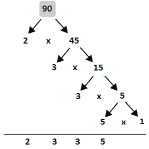

图 1.22：90 的质因数是 2，3，3 和 5

90 的质因数是 2，3，3 和 5。根据*图 1.22*，我们可以创建一个算法来解决这个问题，如下所示：

1.  定义一个`List`来收集给定`v`的质因数。

1.  将变量`s`初始化为 2（最小的质数）。

1.  如果`v % s`为 0，则收集`s`作为质因数，并计算新的`v`为`v / s`。

1.  如果`v % s`不为 0，则将`s`增加 1。

1.  只要`v`大于 1，就重复步骤 3。

在代码行中，这个 O(n)算法（对于合数是 O(log n)）可以表示如下：

```java
public static List<Integer> factors(int v) {
  List<Integer> factorsList = new ArrayList<>();
  int s = 2;
  while (v > 1) {
    // each perfect division give us a prime factor
    if (v % s == 0) {
      factorsList.add(s);
      v = v / s;
    } else {
      s++;
    }
  }
  return factorsList;
} 
```

在捆绑的代码中，你可以找到两种更多的方法。此外，你还会找到一个应用，它可以计算小于给定数字`v`（`v`应该是正数）的质数数量。

# 28. 使用巴比伦方法计算一个数的平方根

信不信由你，古代的巴比伦人（大约公元前 1500 年）在牛顿发现的方法流行之前就知道如何估计平方根。

从数学的角度讲，估计`v > 0`的平方根的巴比伦方法是以下图所示的递归关系：

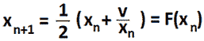

图 1.23：巴比伦平方根近似的递归关系

递归公式从初始猜测 x[0]开始。接下来，我们通过将 x[n-1]代入右侧的公式并计算表达式来计算 x[1]，x[2]，…，x[n]。

例如，让我们尝试将这个公式应用于估计 65 的平方根（结果是 8.06）。让我们以 x[0]作为 65/2 开始，所以 x[0] = 32.5，然后让我们计算 x[1]如下：

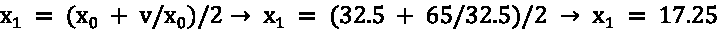

有 x[1]，我们可以按照以下方式计算 x[2]：

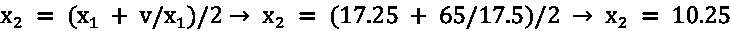

有 x[2]，我们可以按照以下方式计算 x[3]：

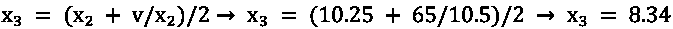

我们正在接近最终结果。有 x[3]，我们可以按照以下方式计算 x[4]：


完成！经过四次迭代，我们发现 65 的平方根是 8.06。当然，作为一个真实值的近似，我们可以继续迭代直到达到所需的精度。更高的精度需要更多的迭代。

基于巴比伦方法来近似`v > 0`的平方根的算法有几个步骤，如下所示：

1.  首先，选择一个任意正数，`x`（它越接近最终结果，所需的迭代次数就越少）。例如，我们以`x = v/2`作为初始猜测开始。

1.  初始化`y = 1`，并选择所需的精度（例如，`e = 0.000000000001`）。

1.  直到达到精度（`e`），执行以下操作：

    1.  将下一个近似值（`xnext`）计算为`x`和`y`的平均值。

    1.  使用下一个近似值将`y`设置为`v/xnext`。

因此，在代码行中，我们有以下片段：

```java
public static double squareRootBabylonian(double v) {
  double x = v / 2;
  double y = 1;
  double e = 0.000000000001; // precision
  while (x - y > e) {
    x = (x + y) / 2;
    y = v / x;
  }
  return x;
} 
```

在捆绑的代码中，你还可以看到一个有用的实现，如果你知道`v`是一个完全平方数（例如，25、144、169 等等）。

# 29. 将浮点数四舍五入到指定的小数位数

考虑以下`float`数字和我们想要保留的小数位数：

```java
float v = 14.9877655f;
int d = 5; 
```

因此，向上取整后的预期结果是 14.98777。

我们可以用至少三种直接的方式解决这个问题。例如，我们可以依赖`BigDecimal` API，如下所示：

```java
public static float roundToDecimals(float v, int decimals) {
  BigDecimal bd = new BigDecimal(Float.toString(v));
  bd = bd.setScale(decimals, RoundingMode.HALF_UP);
  return bd.floatValue();
} 
```

首先，我们将给定的`float`创建为一个`BigDecimal`数字。其次，我们将这个`BigDecimal`缩放到所需的小数位数。最后，我们返回新的`float`值。

另一种方法可以依赖于`DecimalFormat`，如下所示：

```java
public static float roundToDecimals(float v, int decimals) {
  DecimalFormat df = new DecimalFormat();
  df.setMaximumFractionDigits(decimals);
  return Float.parseFloat(df.format(v));
} 
```

我们通过`setMaximumFractionDigits()`定义格式，并简单地使用这个格式在给定的`float`上。返回的`String`通过`Float.parseFloat()`转换为最终的`float`。

最后，我们可以采用一种更加晦涩但自解释的方法，如下所示：

```java
public static float roundToDecimals(float v, int decimals) {
  int factor = Integer.parseInt(
               "1".concat("0".repeat(decimals)));
  return (float) Math.round(v * factor) / factor;
} 
```

你可以在捆绑的代码中练习这些示例。请随意添加你自己的解决方案。

# 30. 在最小和最大之间夹紧一个值

假设我们有一个能够调整给定压力在一定范围内的压力调节器。例如，如果传递的压力低于最小压力，则调节器将压力增加到最小压力。另一方面，如果传递的压力高于最大压力，则调节器将压力降低到最大压力。此外，如果传递的压力在最小（包含）和最大（包含）压力之间，则不发生任何操作——这是正常压力。

编写这个场景可以直接进行，如下所示：

```java
private static final int MIN_PRESSURE = 10; 
private static final int MAX_PRESSURE = 50; 

public static int adjust(int pressure) { 

  if (pressure < MIN_PRESSURE) { 
    return MIN_PRESSURE; 
  } 

  if (pressure > MAX_PRESSURE) { 
    return MAX_PRESSURE; 
  } 

  return pressure; 
} 
```

真棒！你可以找到不同的方法以更短、更智能的方式表达这段代码，但自 JDK 21 开始，我们可以通过`Math.clamp()`方法来解决这个问题。这个方法的一个版本是`clamp(long value, int min, int max)`，它将给定的`value`夹在给定的`min`和`max`之间。例如，我们可以通过`clamp()`方法重写之前的代码，如下所示：

```java
public static int adjust(int pressure) { 

  return Math.clamp(pressure, MIN_PRESSURE, MAX_PRESSURE);
} 
```

很酷，对吧！`clamp()`方法背后的逻辑依赖于以下代码行：

```java
return (int) Math.min(max, Math.max(value, min)); 
```

`clamp()`的其他版本有`clamp(long value, long min, long max)`、`clamp(float value, float min, float max)`和`clamp(double value, double min, double max)`。

# 31. 不使用循环、乘法、位运算、除法和运算符乘以两个整数

这个问题的解决方案可以从以下代数公式开始，也称为*特殊二项式乘积公式*：

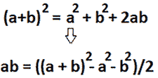

图 1.24：从二项式公式中提取 a*b

现在我们有了 a*b 的乘积，只剩下一个问题。a*b 的公式中包含一个除以 2 的操作，我们不允许显式地使用除法操作。然而，除法操作可以通过递归的方式模拟，如下所示：

```java
private static int divideByTwo(int d) {
  if (d < 2) {
    return 0;
  }
  return 1 + divideByTwo(d - 2);
} 
```

现在没有任何东西可以阻止我们使用这种递归代码来实现 a*b，如下所示：

```java
public static int multiply(int p, int q) {
  // p * 0 = 0, 0 * q = 0
  if (p == 0 || q == 0) {
    return 0;
  }
  int pqSquare = (int) Math.pow(p + q, 2);
  int pSquare = (int) Math.pow(p, 2);
  int qSquare = (int) Math.pow(q, 2);
  int squareResult = pqSquare - pSquare - qSquare;
  int result;
  if (squareResult >= 0) {
    result = divideByTwo(squareResult);
  } else {
    result = 0 - divideByTwo(Math.abs(squareResult));
  }
  return result;
} 
```

在捆绑的代码中，你还可以练习对这个问题的递归方法。

# 32. 使用 TAU

## 什么是 TAU？

**简答**：它是希腊字母。

**长答**：它是一个希腊字母，用于定义圆的周长与其半径的比例。简单地说，TAU 是一个完整圆的一圈，所以是 2*PI。

TAU 允许我们以更直观和简单的方式表示正弦、余弦和角度。例如，已知的 30°、45°、90°等角度可以通过 TAU 作为圆的分数来轻松表示，如下面的图所示：

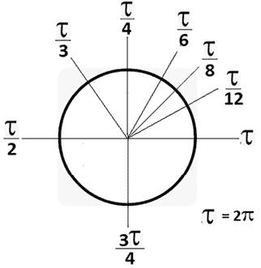

图 1.25：使用 TAU 表示的角度

这比 PI 更直观。它就像将饼切成相等的部分。例如，如果我们切在 TAU/8（45°），这意味着我们将饼切成八等份。如果我们切在 TAU/4（90°），这意味着我们将饼切成四等份。

TAU 的值是 6.283185307179586 = 2 * 3.141592653589793。因此，TAU 与 PI 的关系是 TAU=2*PI。在 Java 中，著名的 PI 是通过`Math.PI`常量表示的。从 JDK 19 开始，`Math`类增加了`Math.TAU`常量。

让我们考虑以下简单问题：一个圆的周长为 21.33 厘米。这个圆的半径是多少？

我们知道 C = 2*PI*r，其中 C 是周长，r 是半径。因此，r = C/(2*PI)或 r = C/TAU。在代码行中，我们有：

```java
// before JDK 19, using PI
double r = 21.33 / (2 * Math.PI);
// starting with JDK 19, using TAU
double r = 21.33 / Math.TAU; 
```

这两种方法都返回半径等于 3.394。

# 33. 选择伪随机数生成器

当我们抛硬币或掷骰子时，我们说我们看到“真实”或“自然”的随机性在起作用。即便如此，也有一些工具假装它们能够预测抛硬币、掷骰子或旋转轮盘的路径，特别是如果满足某些上下文条件的话。

计算机可以通过所谓的**随机生成器**使用算法生成随机数。由于涉及到算法，生成的数字被认为是伪随机数。这被称为“伪”随机性。显然，伪随机数也是可预测的。为什么会这样？

伪随机生成器通过 *播种* 数据开始其工作。这是生成器的秘密（*种子*），它代表用于生成伪随机数的起始数据。如果我们知道算法的工作原理以及 *种子* 是什么，那么输出是可预测的。如果我们不知道 *种子*，那么可预测的速率非常低。因此，选择合适的 *种子* 是每个伪随机生成器的一个重要步骤。

直到 JDK 17，Java 生成伪随机数的 API 有点晦涩。基本上，我们有一个健壮的 API，封装在众所周知的 `java.util.Random` 类中，以及 `Random` 的两个子类：`SecureRandom`（密码学伪随机生成器）和 `ThreadLocalRandom`（非线程安全的伪随机生成器）。从性能角度来看，这些伪随机生成器之间的关系是 `SecureRandom` 比较慢，比 `Random` 慢，而 `Random` 又比 `ThreadLocalRandom` 慢。

除了这些类，我们还有 `SplittableRandom`。这是一个非线程安全的伪生成器，能够在每次调用其 `split()` 方法时生成一个新的 `SplittableRandom`。这样，每个线程（例如，在 fork/join 架构中）都可以使用自己的 `SplittableGenerator`。

以下图显示了直到 JDK 17 的伪随机生成器的类层次结构：

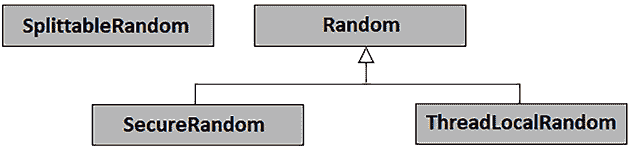

图 1.26：JDK 17 之前 Java 伪随机生成器的类层次结构

如此架构所示，在伪随机生成器之间切换或在不同类型的算法之间选择确实很麻烦。看看那个 `SplittableRandom` – 它迷失在无人之地。

从 JDK 17 开始，我们有了更灵活和强大的伪随机数生成 API。这是一个基于接口的 API（与 JEP 356 一起发布），围绕新的 `RandomGenerator` 接口运行。以下是 JDK 17 的增强类层次结构：

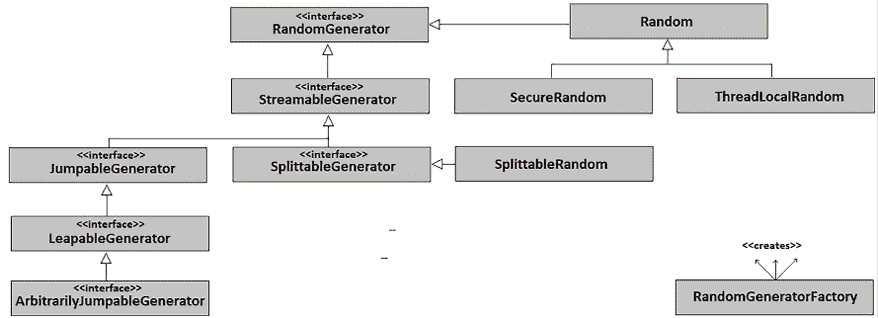

图 1.27：从 JDK 17 开始的 Java 伪随机生成器的类层次结构

`RandomGenerator` 接口代表了此 API 的巅峰。它代表了一种生成伪随机数的通用和统一协议。此接口已经接管了 `Random` API 并添加了一些更多功能。

`RandomGenerator` 接口通过五个子接口扩展，旨在为五种不同类型的伪随机生成器提供特殊协议。

+   `StreamableGenerator` 可以返回 `RandomGenerator` 对象的流

+   `SplittableGenerator` 可以从这个生成器返回一个新的生成器（自身分割）

+   `JumpableGenerator` 可以跳过适量的抽取

+   `LeapableGenerator` 可以跳过大量抽取

+   `ArbitrarilyJumpableGenerator` 可以跳过任意数量的抽取

获取默认的 `RandomGenerator` 可以按照以下方式完成（这是开始生成伪随机数的最简单方法，但你无法控制选择的内容）：

```java
RandomGenerator defaultGenerator
  = RandomGenerator.getDefault();
// start generating pseudo-random numbers
defaultGenerator.nextInt/Float/...();
defaultGenerator.ints/doubles/...(); 
```

除了这些接口之外，新的 API 还附带了一个类（`RandomGeneratorFactory`），它是一个基于所选算法的伪随机生成器工厂。有三种新的算法组（很可能还有更多即将到来）；这些组如下：

+   LXM 组；

    +   `L128X1024MixRandom`

    +   `L128X128MixRandom`

    +   `L128X256MixRandom`

    +   `L32X64MixRandom`

    +   `L64X1024MixRandom`

    +   `L64X128MixRandom`

    +   `L64X128StarStarRandom`

    +   `L64X256MixRandom`

+   Xoroshiro 组：

    +   `Xoroshiro128PlusPlus`

+   Xoshiro 组：

    +   `Xoshiro256PlusPlus`

突出的算法是默认的（`L32X64MixRandom`）。

根据伪随机生成器的类型，我们可以选择所有/部分之前的算法。例如，`L128X256MixRandom`算法可以与`SplittableGenerator`一起使用，但不能与`LeapableGenerator`一起使用。所选算法与伪随机生成器不匹配会导致`IllegalArgumentException`。以下图可以帮助您决定使用哪个算法。

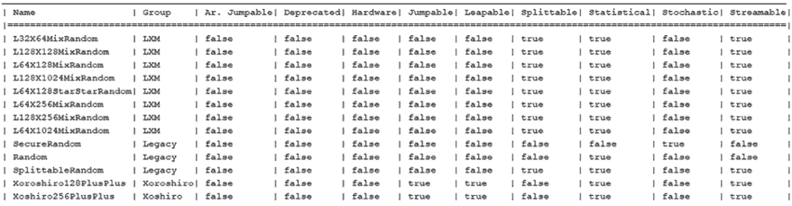

图 1.28：JDK 17 随机生成算法及其属性

此图是通过以下代码生成的，该代码列出了所有可用的算法及其属性（*可流式传输*、*可跳跃*、*统计*等）：

```java
Stream<RandomGeneratorFactory<RandomGenerator>> all 
     = RandomGeneratorFactory.all();
Object[][] data = all.sorted(Comparator.comparing(
                   RandomGeneratorFactory::group))
   .map(f -> {
      Object[] obj = new Object[]{
        f.name(),
        f.group(),
        f.isArbitrarilyJumpable(),
        f.isDeprecated(),
        f.isHardware(),
        f.isJumpable(),
        f.isLeapable(),
        f.isSplittable(),
        f.isStatistical(),
        f.isStochastic(),
        f.isStreamable()
     };
     return obj;
  }).toArray(Object[][]::new); 
```

通过名称或属性选择一个算法可以很容易地完成。

## 通过名称选择算法

通过名称选择算法可以通过一组静态`of()`方法完成。在`RandomGenerator`和`RandomGeneratorFactory`中都有一个`of()`方法，可以用来为特定算法创建伪随机生成器，如下所示：

```java
RandomGenerator generator
  = RandomGenerator.of("L128X256MixRandom");
RandomGenerator generator 
  = RandomGeneratorFactory.of("Xoroshiro128PlusPlus")
                          .create(); 
```

接下来，我们可以通过调用一个众所周知的 API（`ints()`、`doubles()`、`nextInt()`、`nextFloat()`等）来生成伪随机数。

如果我们需要特定的伪随机生成器和算法，则可以使用该生成器的`of()`方法，如下所示（这里我们创建了一个`LeapableGenerator`）：

```java
LeapableGenerator leapableGenerator
  = LeapableGenerator.of("Xoshiro256PlusPlus");
LeapableGenerator leapableGenerator = RandomGeneratorFactory
  .<LeapableGenerator>of("Xoshiro256PlusPlus").create(); 
```

在`SplittableRandom`的情况下，您也可以使用构造函数，但不能指定算法：

```java
SplittableRandom splittableGenerator = new SplittableRandom(); 
```

在捆绑的代码中，您可以看到更多示例。

## 通过属性选择算法

如您在*图 1.28*中看到的，一个算法有一组属性（是否*可跳跃*、是否*统计*等）。让我们选择一个既*统计*又*可跳跃*的算法：

```java
RandomGenerator generator = RandomGeneratorFactory.all()
  .filter(RandomGeneratorFactory::isLeapable)
  .filter(RandomGeneratorFactory::isStatistical)
  .findFirst()
  .map(RandomGeneratorFactory::create)
  .orElseThrow(() -> new RuntimeException(
       "Cannot find this kind of generator")); 
```

返回的算法可以是`Xoshiro256PlusPlus`。

# 34. 使用伪随机数填充长数组

当我们想要用数据填充一个大数组时，可以考虑使用`Arrays.setAll()`和`Arrays.parallelSetAll()`。这些方法可以通过应用一个生成器函数来计算数组的每个元素，从而填充数组。

由于我们必须用伪随机数据填充数组，我们应该考虑生成器函数应该是一个伪随机生成器。如果我们想在并行中做这件事，那么我们应该考虑`SplittableRandom`（JDK 8+）/`SplittableGenerator`（JDK 17+），它们专门用于在隔离的并行计算中生成伪随机数。总之，代码可能看起来如下（JDK 17+）：

```java
SplittableGenerator splittableRndL64X256 
  = RandomGeneratorFactory
     .<SplittableGenerator>of("L64X256MixRandom").create();
long[] arr = new long[100_000_000];
Arrays.parallelSetAll(arr, 
                      x ->splittableRndL64X256.nextLong()); 
```

或者，我们可以使用`SplittableRandom`（这次，我们无法指定算法，JDK 8+）：

```java
SplittableRandom splittableRandom = new SplittableRandom();
long[] arr = new long[100_000_000];
Arrays.parallelSetAll(arr, x ->splittableRandom.nextLong()); 
```

接下来，让我们看看我们如何创建一个伪随机生成器流。

# 35. 创建伪随机生成器流

在创建伪随机生成器流之前，让我们先创建一个伪随机数流。首先，让我们看看如何使用传统的`Random`、`SecureRandom`和`ThreadLocalRandom`来实现它。

由于这三个伪随机生成器包含如`ints()`返回`IntStream`、`doubles()`返回`DoubleStream`等方法，我们可以轻松地生成一个（无限）伪随机数流，如下所示：

```java
Random rnd = new Random();
// the ints() flavor returns an infinite stream
int[] arrOfInts = rnd.ints(10).toArray(); // stream of 10 ints
// or, shortly
int[] arrOfInts = new Random().ints(10).toArray(); 
```

在我们的示例中，我们将生成的伪随机数收集到一个数组中。当然，你可以按需处理它们。我们可以通过`SecureRandom`获得类似的结果，如下所示：

```java
SecureRandom secureRnd = SecureRandom.getInstanceStrong();
int[] arrOfSecInts = secureRnd.ints(10).toArray();
// or, shortly
int[] arrOfSecInts = SecureRandom.getInstanceStrong()
  .ints(10).toArray(); 
```

那么`ThreadLocalRandom`呢？如下所示：

```java
ThreadLocalRandom tlRnd = ThreadLocalRandom.current();
int[] arrOfTlInts = tlRnd.ints(10).toArray();
// or, shortly
int[] arrOfTlInts = ThreadLocalRandom.current()
  .ints(10).toArray(); 
```

如果你只需要一个介于 0.0 和 1.0 之间的双精度浮点数流，那么就依靠`Math.random()`，它内部使用`java.util.Random`的一个实例。以下示例收集了一个介于 0.0 和 0.5 之间的双精度浮点数数组。流将在生成第一个大于 0.5 的双精度浮点数时停止：

```java
Supplier<Double> doubles = Math::random;
double[] arrOfDoubles = Stream.generate(doubles)
   .takeWhile(t -> t < 0.5d)
   .mapToDouble(i -> i)
   .toArray(); 
```

那么，使用新的 JDK 17 API 呢？`RandomGenerator`包含众所周知的`ints()`、`doubles()`等方法，并且它们在所有子接口中都是可用的。例如，可以使用`StreamableGenerator`，如下所示：

```java
StreamableGenerator streamableRnd
   = StreamableGenerator.of("L128X1024MixRandom");
int[] arrOfStRndInts = streamableRnd.ints(10).toArray();
// or, shortly
StreamableGenerator.of("L128X1024MixRandom")
  .ints(10).toArray(); 
```

类似地，我们可以使用`JumpableGenerator`、`LeapableGenerator`等。

好的，现在让我们回到我们的问题。我们如何生成一个伪随机生成器流？所有`RandomGenerator`子接口都包含一个名为`rngs()`的方法，它有不同的形式。没有参数时，此方法返回一个无限流，包含实现`RandomGenerator`接口的新伪随机生成器。以下代码生成了五个`StreamableGenerator`实例，每个实例生成了 10 个伪随机整数：

```java
StreamableGenerator streamableRnd
   = StreamableGenerator.of("L128X1024MixRandom");
List<int[]> listOfArrOfIntsSG
   = streamableRnd.rngs(5) // get 5 pseudo-random generators
    .map(r -> r.ints(10))  // generate 10 ints per generator
    .map(r -> r.toArray())
    .collect(Collectors.toList()); 
```

我们可以用`JumpableGenerator`实现相同的功能，但可能更愿意使用`jumps()`，它实现了特定于此类型生成器的行为：

```java
JumpableGenerator jumpableRnd
   = JumpableGenerator.of("Xoshiro256PlusPlus");
List<int[]> listOfArrOfIntsJG = jumpableRnd.jumps(5)
   .map(r -> {
        JumpableGenerator jg = (JumpableGenerator) r;
        int[] ints = new int[10];
        for (int i = 0; i < 10; i++) {
           ints[i] = jg.nextInt();
           jg.jump();
        }
        return ints;
   })
   .collect(Collectors.toList()); 
```

同样，我们可以通过`LeapableGenerator`实现这一点。这次，我们可以使用`rngs()`或`leaps()`，它们实现了特定于此类型生成器的行为：

```java
LeapableGenerator leapableRnd
   = LeapableGenerator.of("Xoshiro256PlusPlus");
List<int[]> listOfArrOfIntsLG = leapableRnd.leaps(5)
   .map(r -> {
        LeapableGenerator lg = (LeapableGenerator) r;
        int[] ints = new int[10];
        for (int i = 0; i < 10; i++) {
           ints[i] = lg.nextInt();
           lg.leap();
        }
        return ints;
   })
   .collect(Collectors.toList()); 
```

接下来，让我们看看我们如何交错使用旧版和新的伪随机生成器。

# 36. 从 JDK 17 的新伪随机生成器获取旧版伪随机生成器

一个遗留的伪随机生成器，如 `Random`、`SecureRandom` 或 `ThreadLocalRandom`，可以将方法调用委托给作为 `Random.from()`、`SecureRandom.from()` 或 `ThreadLocalRandom.from()` 参数传递的 `RandomGenerator`，如下所示：

```java
Random legacyRnd = Random.from(
   RandomGenerator.of("L128X256MixRandom"));
// or, like his
Random legacyRnd = Random.from(RandomGeneratorFactory.
   of("Xoroshiro128PlusPlus").create());
// or, like this
Random legacyRnd = Random.from(RandomGeneratorFactory
   .<RandomGenerator.SplittableGenerator>of(
      "L128X256MixRandom").create()); 
```

`from()` 方法从 JDK 19 开始可用。在捆绑的代码中，您可以看到更多示例。

# 37. 在线程安全的方式中使用伪随机生成器（多线程环境）

`Random` 和 `SecureRandom` 实例是线程安全的。虽然这个说法是正确的，但请注意，当多个线程（多线程环境）使用 `Random` 实例（或 `Math.random()`）时，您的代码容易受到线程竞争的影响，因为这些线程共享相同的 *种子*。共享相同的种子涉及到 *种子* 访问的同步；因此，它打开了线程竞争的大门。显然，线程竞争会导致性能损失，因为线程可能需要在队列中等待以获取对 *种子* 的访问权。同步通常很昂贵。

`Random` 的一个替代方案是 `ThreadLocalRandom`，它为每个线程使用一个 `Random` 实例，并提供对线程竞争的保护，因为它不包含同步代码或原子操作。缺点是 `ThreadLocalRandom` 使用每个线程的内部 *种子*，我们无法控制或修改。

`SplittableRandom` 不是线程安全的。此外，由 `RandomGenerator` 的实现组成的新的 API 也不是线程安全的。

话虽如此，可以通过使用线程安全的生成器或在每个新线程中分割一个新的实例来在多线程环境中使用伪随机生成器。当我提到“分割”时，我的意思是使用 `SplittableGenerator.splits(long n)`，其中 `n` 是分割的数量。查看使用 10 个线程用整数填充 Java 列表（每个线程使用自己的伪随机生成器）的代码：

```java
List<Integer> listOfInts = new CopyOnWriteArrayList<>();
ExecutorService executorService
  = Executors.newCachedThreadPool();
SplittableGenerator splittableGenerator
  = RandomGeneratorFactory
     .<SplittableGenerator>of("L128X256MixRandom").create();
splittableGenerator.splits(10)
  .forEach((anotherSplittableGenerator) -> {
    executorService.submit(() -> {
      int nextInt = anotherSplittableGenerator.nextInt(1_000);
      logger.info(() -> "Added in list " 
          + nextInt + " by generator " 
          + anotherSplittableGenerator.hashCode()
          + " running in thread"
          + Thread.currentThread().getName());
      listOfInts.add(nextInt);
    });
});
shutdownExecutor(executorService); 
```

输出片段：

```java
INFO: Added in list 192 by generator 1420516714 running in threadpool-1-thread-3
INFO: Added in list 366 by generator 1190794841 running in threadpool-1-thread-8
INFO: Added in list 319 by generator 275244369 running in threadpool-1-thread-9
... 
```

您还可以使用 `JumpableGenerator` 或 `LeapableGenerator`。唯一的区别是，`JumpableGenerator` 使用 `jumps()`，而 `LeapableGenerator` 使用 `leaps()`，而不是 `splits()`。

# 摘要

本章收集了与字符串、区域设置、数字和数学相关的 37 个问题，旨在将经典必知问题与通过最新 JDK 功能（如文本块和伪随机生成器）解决的问题混合在一起。如果您想探索其他类似的问题，请考虑 *Java 编程问题，第一版*，其中有一个类似的章节（*第一章*），涵盖了另外 39 个问题。

# 留下评论！

喜欢这本书吗？通过留下亚马逊评论来帮助像您这样的读者。扫描下面的二维码以获取 20% 的折扣代码。


**限时优惠*
