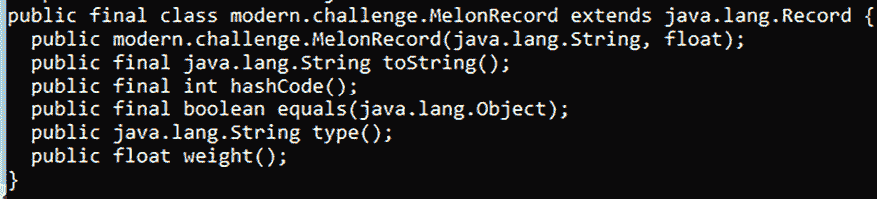
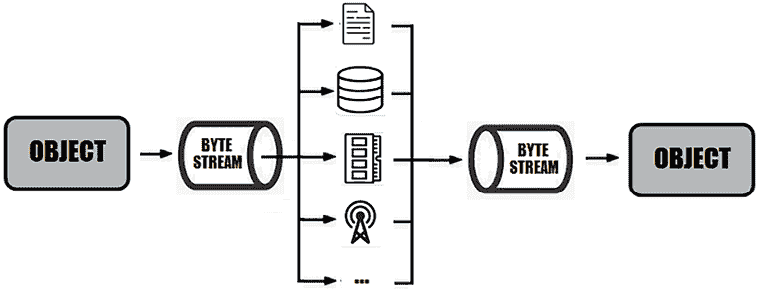
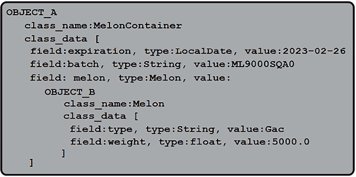
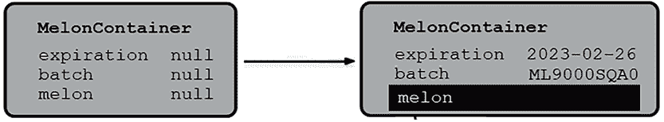
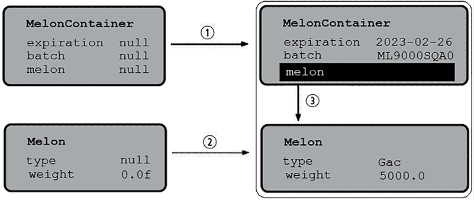
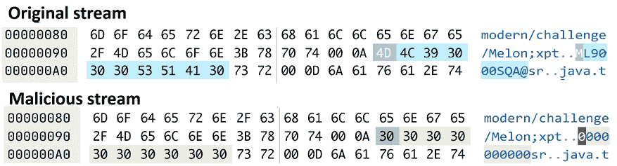
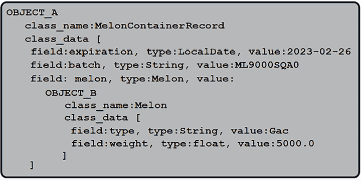
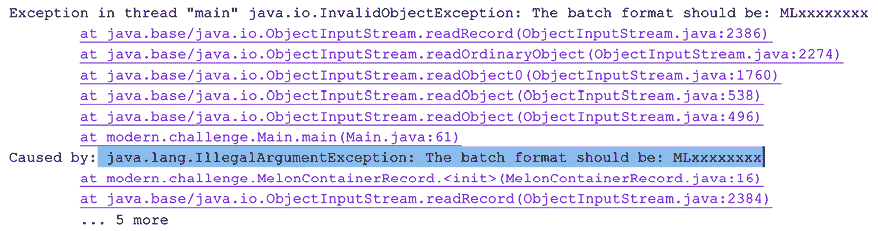

# 4

# 记录和记录模式

本章包括 19 个问题，详细介绍了 JDK 16（JEP 395）中引入的 Java 记录，以及作为 JDK 19（JEP 405）的预览特性、作为 JDK 20（JEP 432）的第二预览特性、作为 JDK 21（JEP 440）的最终特性引入的记录模式。

我们首先定义一个简单的 Java 记录。然后，我们分析记录的内部结构，它可以包含和不能包含的内容，如何在流中使用记录，它们如何改进序列化等。我们还对如何在 Spring Boot 应用程序中使用记录感兴趣，包括 JPA 和 jOOQ 技术。

接下来，我们将关注`instanceof`和`switch`的记录模式。我们将讨论嵌套记录模式、受保护记录模式、在记录模式中处理`null`值等。

在本章结束时，你将掌握 Java 记录。这很好，因为对于任何想要采用最酷 Java 特性的 Java 开发者来说，记录是必不可少的。

# 问题

使用以下问题来测试你在 Java 记录上的编程能力。我强烈建议你在查看解决方案并下载示例程序之前，尝试解决每个问题：

1.  **声明 Java 记录**：编写一个示例应用程序，展示 Java 记录的创建。此外，提供编译器在幕后为记录生成的工件简短描述。

1.  **介绍记录的规范和紧凑构造函数**：解释内置记录的规范和紧凑构造函数的作用。提供一些示例，说明何时提供这样的显式构造函数是有意义的。

1.  **在记录中添加更多工件**：提供一个有意义的示例列表，说明如何在 Java 记录中添加显式的工件（例如，添加实例方法、静态工件等）。

1.  **在记录中迭代我们无法拥有的内容**：举例说明我们无法在记录中拥有的内容（例如，我们无法有显式的`private`字段），并解释原因。

1.  **在记录中定义多个构造函数**：举例说明在记录中声明多个构造函数的几种方法。

1.  **在记录中实现接口**：编写一个程序，展示如何在记录中实现接口。

1.  **理解记录序列化**：详细解释并举例说明记录序列化在幕后是如何工作的。

1.  **通过反射调用规范构造函数**：编写一个程序，展示如何通过反射调用记录的规范构造函数。

1.  **在流中使用记录**：编写几个示例，突出记录在简化依赖于 Stream API 的功能表达式方面的用法。

1.  **为 instanceof 引入记录模式**：编写一些示例，介绍`instanceof`的*记录模式*，包括*嵌套记录模式*。

1.  **为 switch 引入记录模式**：编写一些示例，介绍`switch`的*记录模式*。

1.  **处理受保护的记录模式**：编写几个代码片段来举例说明*受保护的记录模式*（基于绑定变量的受保护条件）。

1.  **在记录模式中使用泛型记录**：编写一个应用程序来突出泛型记录的声明和使用。

1.  **处理嵌套记录模式中的 null 值**：解释并举例说明如何在记录模式中处理 `null` 值（解释嵌套记录模式中 `null` 值的边缘情况）。

1.  **通过记录模式简化表达式**：想象一下，你有一个表达式（算术、基于字符串的、抽象语法树（AST）等）。编写一个使用记录模式简化评估/转换此表达式代码的程序。

1.  **钩子未命名的模式和变量**：解释并举例说明 JDK 21 预览功能，该功能涵盖未命名的模式和变量。

1.  **处理 Spring Boot 中的记录**：编写几个应用程序来举例说明 Spring Boot 中记录的不同用例（例如，在模板中使用记录，使用记录进行配置等）。

1.  **处理 JPA 中的记录**：编写几个应用程序来举例说明 JPA 中记录的不同用例（例如，使用记录和构造表达式，使用记录和结果转换器等）。

1.  **在 jOOQ 中处理记录**：编写几个应用程序来举例说明 jOOQ 中记录的不同用例（例如，使用记录和 `MULTISET` 操作符）。

以下部分描述了前面问题的解决方案。请记住，通常没有一种正确的方式来解决特定的问题。此外，请记住，这里所示的解释仅包括解决这些问题所需的最有趣和最重要的细节。下载示例解决方案以查看更多细节并实验程序，请访问[`github.com/PacktPublishing/Java-Coding-Problems-Second-Edition/tree/main/Chapter04`](https://github.com/PacktPublishing/Java-Coding-Problems-Second-Edition/tree/main/Chapter04)。

# 88. 声明 Java 记录

在深入探讨 Java 记录之前，让我们稍微思考一下在 Java 应用程序中我们通常如何持有数据。你说得对……我们定义包含所需实例字段的简单类，并通过这些类的构造函数用我们的数据填充它们。我们还公开了一些特定的获取器，以及流行的 `equals()`、`hashCode()` 和 `toString()` 方法。此外，我们创建这些类的实例来封装我们宝贵的数据，并在整个应用程序中传递它们以解决我们的任务。例如，以下类携带有关西瓜的数据，如西瓜类型和它们的重量：

```java
public class Melon {
  private final String type;
  private final float weight;
  public Melon(String type, float weight) {
    this.type = type;
    this.weight = weight;
  }
  public String getType() {
    return type;
  }
  public float getWeight() {
    return weight;
  }
  // hashCode(), equals(), and to String()
} 
```

你应该非常熟悉这种传统的 Java 类和这种繁琐的仪式，因此没有必要详细查看此代码。现在，让我们看看我们如何使用 Java 记录的语法糖来完成完全相同的事情，但大大减少了之前的仪式：

```java
public record MelonRecord(String type, float weight) {} 
```

Java 记录作为功能预览从 JDK 14 开始提供，并在 JDK 16 中作为 JEP 395 发布和关闭。这一行代码为我们提供了与之前相同的行为，即 `Melon` 类。在幕后，编译器提供了所有工件，包括两个 `private` `final` 字段（`type` 和 `weight`）、一个构造函数、两个与字段同名的方法（`type()` 和 `weight()`），以及包含 `hashCode()`、`equals()` 和 `toString()` 的三部曲。我们可以通过在 `MelonRecord` 类上调用 `javap` 工具来轻松地看到编译器生成的代码：



图 4.1：Java 记录的代码

注意，这些访问器的名称不遵循 Java Bean 规范，因此没有 `getType()` 或 `getWeight()`。有 `type()` 和 `weight()`。然而，你可以明确地编写这些访问器或明确添加 `getType()`/`getWeight()` 获取器 - 例如，为了公开字段的防御性副本。

所有这些都是在声明记录时给出的参数（`type` 和 `weight`）的基础上构建的。这些参数也被称为记录的组成部分，我们说记录是基于给定的组成部分构建的。

编译器通过 `record` 关键字识别 Java 记录。这是一种特殊的类类型（就像 `enum` 是特殊的 Java 类类型一样），声明为 `final` 并自动扩展 `java.lang.Record`。

实例化 `MelonRecord` 与实例化 `Melon` 类相同。以下代码创建了一个 `Melon` 实例和一个 `MelonRecord` 实例：

```java
Melon melon = new Melon("Cantaloupe", 2600);
MelonRecord melonr = new MelonRecord("Cantaloupe", 2600); 
```

Java 记录不是可变 Java Bean 类的替代品。此外，你可能认为 Java 记录只是携带不可变数据或不可变状态的简单透明方法（我们说“透明”，因为它完全暴露了其状态；我们说“不可变”，因为该类是 `final` 的，它只有 `private` `final` 字段，没有设置器）。在这种情况下，我们可能会认为 Java 记录并不十分有用，因为它们只是重叠了我们通过 Lombok 或 Kotlin 可以获得的功能。但是，正如你将在本章中看到的那样，Java 记录不仅仅是这样，它还提供了 Lombok 或 Kotlin 中不可用的几个功能。此外，如果你进行基准测试，你将注意到使用记录在性能方面具有显著优势。

# 89. 介绍记录的规范和紧凑构造函数

在上一个问题中，我们创建了 `MelonRecord` Java 记录，并通过以下代码实例化了它：

```java
MelonRecord melonr = new MelonRecord("Cantaloupe", 2600); 
```

这怎么可能（因为我们没有在 `MelonRecord` 中编写任何参数化构造函数）？编译器只是遵循其内部协议为 Java 记录创建了一个默认构造函数，基于我们在记录声明中提供的组件（在这种情况下，有两个组件，`type` 和 `weight`）。

这个构造函数被称为 *规范构造函数*，它始终与给定的组件保持一致。每个记录都有一个规范构造函数，它代表了创建该记录实例的唯一方式。

但是，我们可以重新定义规范构造函数。以下是一个类似于默认的显式规范构造函数——如您所见，规范构造函数只是简单地接受所有给定的组件，并将相应的实例字段（也由编译器生成作为 `private` `final` 字段）设置：

```java
public MelonRecord(String type, float weight) {
  this.type = type;
  this.weight = weight;
} 
```

一旦实例被创建，它就不能被更改（它是不可变的）。它将只用于在程序中携带这些数据。这个显式规范构造函数有一个称为 *紧凑构造函数* 的快捷方式——这是 Java 记录特有的。由于编译器知道给定的组件列表，它可以从这个紧凑构造函数中完成其工作，这与前面的一个等价：

```java
public MelonRecord {} 
```

注意不要混淆这个紧凑构造函数与无参数的那个。以下片段并不等价：

```java
public MelonRecord {}   // compact constructor
public MelonRecord() {} // constructor with no arguments 
```

当然，仅仅为了模仿默认构造函数的功能而编写显式规范构造函数是没有意义的。因此，让我们检查在重新定义规范构造函数时具有意义的几个场景。

## 处理验证

在此刻，当我们创建一个 `MelonRecord` 时，我们可以将类型传递为 `null`，或者将西瓜的重量作为一个负数。这会导致包含非有效数据的损坏记录。可以通过以下显式规范构造函数来处理记录组件的验证：

```java
public record MelonRecord(String type, float weight) {
  // explicit canonical constructor for validations
  public MelonRecord(String type, int weight) {
    if (type == null) {
      throw new IllegalArgumentException(
        "The melon's type cannot be null");
    }
    if (weight < 1000 || weight > 10000) {
      throw new IllegalArgumentException("The melon's weight 
         must be between 1000 and 10000 grams");
    }
    this.type = type;
    this.weight = weight;
  }
} 
```

或者，通过以下紧凑构造函数：

```java
public record MelonRecord(String type, float weight) {
  // explicit compact constructor for validations
  public MelonRecord {
    if (type == null) {
      throw new IllegalArgumentException(
        "The melon's type cannot be null");
    }
    if (weight < 1000 || weight > 10000) { 
      throw new IllegalArgumentException("The melon's weight 
        must be between 1000 and 10000 grams");
    }  
  }
} 
```

验证处理是显式规范/紧凑构造函数最常见的使用场景。接下来，让我们看看两个更少为人知的用例。

## 重新分配组件

通过显式规范/紧凑构造函数，我们可以重新分配组件。例如，当我们创建一个 `MelonRecord` 时，我们提供其类型（例如，哈密瓜）和其重量（以克为单位，例如，2600 克）。但是，如果我们想使用千克（2600 g = 2.6 kg）作为重量，那么我们可以在显式规范构造函数中提供这种转换，如下所示：

```java
// explicit canonical constructor for reassigning components
public MelonRecord(String type, float weight) {
  weight = weight/1_000; // overwriting the component 'weight'
  this.type = type;
  this.weight = weight; 
} 
```

如您所见，`weight` 组件在 `weight` 字段使用新的重新分配值初始化之前是可用的，并被重新分配。最终，`weight` 组件和 `weight` 字段具有相同的值（2.6 kg）。那么这段代码片段呢？

```java
public MelonRecord(String type, float weight) {
  this.type = type;
  this.weight = weight/1_000; 
} 
```

嗯，在这种情况下，最终，`weight` 字段和 `weight` 组件将具有不同的值。`weight` 字段是 2.6 kg，而 `weight` 组件是 2600 g。请注意，这很可能不是你想要的。让我们检查另一个片段：

```java
public MelonRecord(String type, float weight) {
  this.type = type;
  this.weight = weight; 
  weight = weight/1_000;
} 
```

再次，最终，`weight` 字段和 `weight` 组件将具有不同的值。`weight` 字段是 2600 g，而 `weight` 组件是 2.6 kg。再次注意——这很可能不是你想要的。

当然，最干净、最简单的方法依赖于紧凑构造函数。这次，我们无法偷偷进行任何意外的重新分配：

```java
public record MelonRecord(String type, float weight) {
  // explicit compact constructor for reassigning components
  public MelonRecord {
    weight = weight/1_000; // overwriting the component 'weight'
  } 
} 
```

最后，让我们解决第三个场景。

## 给定组件的防御性副本

我们知道 Java 记录是不可变的。但这并不意味着其组件也是不可变的。想想数组、列表、映射、日期等组件。所有这些组件都是可变的。为了恢复完全不可变性，你将更愿意在这些组件的副本上工作而不是修改给定的组件。而且，正如你可能已经直觉到的，这可以通过显式的规范构造函数来完成。

例如，让我们考虑以下记录，它获取一个表示一组项目零售价格的单一组件作为`Map`：

```java
public record MarketRecord(Map<String, Integer> retails) {} 
```

这个记录不应该修改这个`Map`，因此它依赖于一个显式的规范构造函数来创建一个用于后续任务而没有任何修改风险的防御性副本（`Map.copyOf()`返回给定`Map`的不可修改副本）：

```java
public record MarketRecord(Map<String, Integer> retails) {
  public MarketRecord {
    retails = Map.copyOf(retails);
  }
} 
```

基本上，这仅仅是一种组件重新分配的变体。

此外，我们还可以通过访问器方法返回防御性副本：

```java
public Map<String, Integer> retails() {
  return Map.copyOf(retails);
}
// or, getter in Java Bean style
public Map<String, Integer> getRetails() {
  return Map.copyOf(retails);
} 
```

你可以在捆绑的代码中练习所有这些示例。

# 90. 在记录中添加更多工件

到目前为止，我们知道如何将显式的规范/紧凑构造函数添加到 Java 记录中。我们还能添加什么？例如，我们可以添加实例方法，就像在典型类中一样。在以下代码中，我们添加了一个返回从克转换为千克的`weight`的实例方法：

```java
public record MelonRecord(String type, float weight) {
  public float weightToKg() {
    return weight / 1_000;
  }
} 
```

你可以像调用你类中的任何其他实例方法一样调用`weightToKg()`：

```java
MelonRecord melon = new MelonRecord("Cantaloupe", 2600);
// 2600.0 g = 2.6 Kg
System.out.println(melon.weight() + " g = " 
  + melon.weightToKg() + " Kg"); 
```

除了实例方法之外，我们还可以添加`static`字段和方法。查看以下代码：

```java
public record MelonRecord(String type, float weight) {
  private static final String DEFAULT_MELON_TYPE = "Crenshaw";
  private static final float DEFAULT_MELON_WEIGHT = 1000;
  public static MelonRecord getDefaultMelon() {
    return new MelonRecord(
      DEFAULT_MELON_TYPE, DEFAULT_MELON_WEIGHT);
  }
} 
```

通过类名调用`getDefaultMelon()`就像往常一样：

```java
MelonRecord defaultMelon = MelonRecord.getDefaultMelon(); 
```

添加嵌套类也是可能的。例如，这里我们添加一个`static`嵌套类：

```java
public record MelonRecord(String type, float weight) {
  public static class Slicer {
    public void slice(MelonRecord mr, int n) {
      start();
      System.out.println("Slicing a " + mr.type() + " of " 
        + mr.weightToKg() + " kg in " + n + " slices ...");
      stop();
    }
    private static void start() {
      System.out.println("Start slicer ...");
    }
    private static void stop() {
      System.out.println("Stop slicer ...");
    }
  }
} 
```

而且，调用`Slicer`可以像往常一样进行：

```java
MelonRecord.Slicer slicer = new MelonRecord.Slicer();
slicer.slice(melon, 10);
slicer.slice(defaultMelon, 14); 
```

但是，即使允许在 Java 记录中添加所有这些工件，我强烈建议你在这样做之前三思。主要原因在于 Java 记录应该是关于数据，而且仅仅是数据，因此用涉及额外行为的工件污染记录有点奇怪。如果你遇到这样的场景，那么你可能需要一个 Java 类，而不是 Java 记录。

在下一个问题中，我们将看到我们无法添加到 Java 记录中的内容。

# 91. 在记录中迭代我们无法拥有的内容

在 Java 记录中，有一些我们不能拥有的工件。让我们逐一解决前 5 个。

## 记录不能扩展另一个类

由于记录已经扩展了`java.lang.Record`，而 Java 不支持多重继承，因此我们不能编写扩展另一个类的记录：

```java
public record MelonRecord(String type, float weight) 
  extends Cucurbitaceae {…} 
```

这个片段无法编译。

## 记录不能被扩展

Java 记录是`final`类，因此不能被扩展：

```java
public class PumpkinClass extends MelonRecord {…} 
```

这个片段无法编译。

## 记录不能通过实例字段进行扩展

当我们声明一个记录时，我们也提供了将成为记录实例字段的组件。之后，我们不能再像典型类那样添加更多实例字段：

```java
public record MelonRecord(String type, float weight) {
  private String color;
  private final String color;
} 
```

将`color`作为`final`或非`final`的独立字段添加是不编译的。

## 记录不能有私有规范构造函数

有时我们创建具有`private`构造函数的类，该构造函数公开`static`工厂以创建实例。基本上，我们通过`static`工厂方法间接调用构造函数。这种做法在 Java 记录中不可用，因为不允许`private`规范/紧凑构造函数：

```java
public record MelonRecord(String type, float weight) {
  private MelonRecord(String type, float weight) {
    this.type = type;
    this.weight = weight;
  }
  public static MelonRecord newInstance(
      String type, float weight) {
    return new MelonRecord(type, weight);
  } 
} 
public canonical constructors and private non-canonical constructors that first invoke one of the public canonical constructors.
```

## 记录不能有 setter

正如你所见，Java 记录为每个组件提供了一个 getter（访问器方法）。这些 getter 的名称与组件相同（对于`type`我们有`type()`，而不是`getType()`）。另一方面，我们不能有 setter，因为对应给定组件的字段是`final`：

```java
public record MelonRecord(String type, float weight) {
   public void setType(String type) {
     this.type = type;
   }
   public void setWeight(float weight) {
      this.weight = weight;
   }
} 
 these are the most common.
```

# 92. 在记录中定义多个构造函数

如你所知，当我们声明 Java 记录时，编译器使用给定的组件创建一个默认构造函数，称为规范构造函数。我们还可以提供显式的规范/紧凑构造函数，如你在*问题 89*中看到的。

但是，我们可以更进一步，并声明具有不同参数列表的更多构造函数。例如，我们可以有一个不带参数的构造函数来返回默认实例：

```java
public record MelonRecord(String type, float weight) {
  private static final String DEFAULT_MELON_TYPE = "Crenshaw";
  private static final float DEFAULT_MELON_WEIGHT = 1000;
  MelonRecord() {
    this(DEFAULT_MELON_TYPE, DEFAULT_MELON_WEIGHT);
  } 
} 
```

或者，我们可以编写一个只接受瓜的类型或重量作为参数的构造函数：

```java
public record MelonRecord(String type, float weight) {
  private static final String DEFAULT_MELON_TYPE = "Crenshaw";
  private static final float DEFAULT_MELON_WEIGHT = 1000;
  MelonRecord(String type) {
    this(type, DEFAULT_MELON_WEIGHT);
  }
  MelonRecord(float weight) {
    this(DEFAULT_MELON_TYPE, weight);
  } 
} 
```

此外，我们还可以添加不适合任何组件的参数（这里，`country`）：

```java
public record MelonRecord(String type, float weight) {
  private static Set<String> countries = new HashSet<>();
  MelonRecord(String type, int weight, String country) {
    this(type, weight);
    MelonRecord.countries.add(country);
  }  
} 
```

所有这些构造函数有什么共同点？它们都通过`this`关键字调用规范构造函数。记住，实例化 Java 记录的唯一方法是通过其规范构造函数，可以直接调用，或者，如你之前所见的，间接调用。所以，请记住，你添加到 Java 记录的所有显式构造函数都必须首先调用规范构造函数。

# 93. 在记录中实现接口

Java 记录不能扩展另一个类，但它们可以像典型类一样实现任何接口。让我们考虑以下接口：

```java
public interface PestInspector {
  public default boolean detectPest() {
    return Math.random() > 0.5d;
  }
  public void exterminatePest();
} 
```

以下代码片段是此接口的直接使用：

```java
public record MelonRecord(String type, float weight)   
       implements PestInspector {
  @Override
  public void exterminatePest() {  
    if (detectPest()) {
      System.out.println("All pests have been exterminated");
    } else {
      System.out.println(
        "This melon is clean, no pests have been found");
    }
  }
} 
```

注意代码覆盖了`abstract`方法`exterminatePest()`并调用了`default`方法`detectPest()`。

# 94. 理解记录序列化

为了理解 Java 记录的序列化/反序列化，让我们将基于普通 Java 类的经典代码与通过 Java 记录的语法糖表达的相同代码进行比较。

因此，让我们考虑以下两个普通的 Java 类（我们必须显式实现`Serializable`接口，因为在问题的第二部分，我们想要序列化/反序列化这些类）：

```java
public class Melon implements Serializable {
  private final String type;
  private final float weight;
  public Melon(String type, float weight) {
    this.type = type;
    this.weight = weight;
  }
  // getters, hashCode(), equals(), and toString()
} 
```

以及使用之前`Melon`类的`MelonContainer`类：

```java
public class MelonContainer implements Serializable {
  private final LocalDate expiration;
  private final String batch;
  private final Melon melon;
  public MelonContainer(LocalDate expiration, 
      String batch, Melon melon) {
    ...
    if (!batch.startsWith("ML")) {
      throw new IllegalArgumentException(
        "The batch format should be: MLxxxxxxxx");
    }
    ...
    this.expiration = expiration;
    this.batch = batch;
    this.melon = melon;
  }
  // getters, hashCode(), equals(), and toString()
} 
```

如果我们通过 Java 记录表达此代码，那么我们就有以下代码：

```java
public record MelonRecord(String type, float weight) 
  implements Serializable {}
public record MelonContainerRecord(
  LocalDate expiration, String batch, Melon melon) 
  implements Serializable {
  public MelonContainerRecord {
    ...
    if (!batch.startsWith("ML")) {
      throw new IllegalArgumentException(
        "The batch format should be: MLxxxxxxxx");
    } 
    ...
  }
} 
```

注意，我们明确实现了 `Serializable` 接口，因为默认情况下，Java 记录不可序列化。

接下来，让我们创建一个 `MelonContainer` 实例：

```java
MelonContainer gacContainer = new MelonContainer(
  LocalDate.now().plusDays(15), "ML9000SQA0", 
    new Melon("Gac", 5000)); 
```

此外，一个 `MelonContainerRecord` 实例：

```java
MelonContainerRecord gacContainerR = new MelonContainerRecord(
  LocalDate.now().plusDays(15), "ML9000SQA0", 
    new Melon("Gac", 5000)); 
```

要序列化这些对象（`gacContainer` 和 `gacContainerR`），我们可以使用以下代码：

```java
try ( ObjectOutputStream oos = new ObjectOutputStream(
   new FileOutputStream("object.data"))) {
     oos.writeObject(gacContainer);
}
try ( ObjectOutputStream oos = new ObjectOutputStream(
   new FileOutputStream("object_record.data"))) {
     oos.writeObject(gacContainerR);
} 
```

此外，反序列化可以通过以下代码完成：

```java
MelonContainer desGacContainer;
try ( ObjectInputStream ios = new ObjectInputStream(
  new FileInputStream("object.data"))) {
  desGacContainer = (MelonContainer) ios.readObject();
}
MelonContainerRecord desGacContainerR;
try ( ObjectInputStream ios = new ObjectInputStream(
  new FileInputStream("object_record.data"))) {
  desGacContainerR = (MelonContainerRecord) ios.readObject();
} 
```

在实际检查序列化/反序列化之前，让我们尝试一种理论方法，旨在为这些操作提供一些提示。

## 序列化/反序列化是如何工作的

序列化/反序列化操作在以下图中表示：



图 4.2：Java 序列化/反序列化操作

简而言之，*序列化*（或序列化一个对象）是将对象的状态提取为字节流，并以持久格式（文件、数据库、内存、网络等）表示的操作。相反的操作称为 *反序列化*（或反序列化一个对象），它表示从持久格式中重建对象状态的过程。

在 Java 中，如果一个对象实现了 `Serializable` 接口，则该对象是可序列化的。这是一个没有状态或行为的空接口，它作为编译器的标记。如果没有这个接口，编译器会假设该对象不可序列化。

编译器使用其内部算法来序列化对象。这个算法依赖于书中所有的技巧，比如特殊的权限（忽略可访问性规则）来访问对象，恶意反射，构造函数绕过等等。揭示这种黑暗魔法的细节超出了我们的目的，因此作为一个开发者，知道以下内容就足够了：

+   如果对象的一部分不可序列化，那么你将得到一个运行时错误

+   你可以通过 `writeObject()`/`readObject()` API 来修改序列化/反序列化操作

好的，现在让我们看看当一个对象被序列化时发生了什么。

## 序列化/反序列化 gacContainer（一个典型的 Java 类）

`gacContainer` 对象是 `MelonContainer` 的一个实例，它是一个普通的 Java 类：

```java
MelonContainer gacContainer = new MelonContainer(
  LocalDate.now().plusDays(15), "ML9000SQA0", 
    new Melon("Gac", 5000)); 
```

在名为 *object.data* 的文件中序列化后，我们得到了表示 `gacContainer` 状态的字节流。虽然你可以在捆绑的代码中检查此文件（使用十六进制编辑器，如 [`hexed.it/`](https://hexed.it/)），但以下是其内容的可读性解释：



图 4.3：gacContainer 序列化的可读性解释

反序列化操作是通过从上到下构建对象图来进行的。当类名已知时，编译器通过调用 `MelonContainer` 的第一个非序列化超类的无参构造函数来创建一个对象。在这种情况下，这是 `java.lang.Object` 的无参构造函数。因此，编译器并没有调用 `MelonContainer` 的构造函数。

接下来，字段被创建并设置为默认值，因此创建的对象的 `expiration`、`batch` 和 `melon` 都是 `null`。当然，这不是我们对象的正确状态，所以我们继续处理序列化流以提取和填充字段为正确的值。这可以在以下图中看到（左侧，创建的对象具有默认值；右侧，字段已填充为正确的状态）：



图 4.4：用正确状态填充创建的对象

当编译器遇到 `melon` 字段时，它必须执行相同的步骤以获取 `Melon` 实例。它设置字段（`type` 和 `weight` 分别设置为 `null`，`0.0f`）。进一步地，它从流中读取真实值并设置 `melon` 对象的正确状态。

最后，在读取整个流之后，编译器将相应地链接对象。这如图所示（1、2 和 3 代表反序列化操作的步骤）：



图 4.5：将对象链接以获得最终状态

到这一点，反序列化操作已经完成，我们可以使用生成的对象。

### 反序列化恶意流

提供一个恶意流意味着在反序列化之前改变对象状态。这可以通过许多方式完成。例如，我们可以在编辑器中手动修改 *object.data* 实例（这就像一个不受信任的来源），如下图中我们将有效的批次 `ML9000SQA0` 替换为无效的批次 `0000000000`：



图 4.6：修改原始流以获得恶意流

如果我们反序列化恶意流（在捆绑代码中，你可以找到它作为 `object_malicious.data` 文件），那么你可以看到损坏的数据“成功”地进入了我们的对象（简单的 `toString()` 调用揭示了批次是 `0000000000`）：

```java
MelonContainer{expiration=2023-02-26, 
   **batch=****0000000000**, melon=Melon{type=Gac, weight=5000.0}} 
```

来自 `Melon`/`MelonContainer` 构造函数的防护条件是无用的，因为反序列化没有调用这些构造函数。

因此，如果我们总结序列化/反序列化 Java 类的缺点，我们必须强调在对象处于不正确状态（等待编译器用正确数据填充字段并将它们链接到最终图中）时出现的时间窗口，以及处理恶意状态的风险。现在，让我们将一个 Java 记录通过这个过程。

## 序列化/反序列化 gacContainerR（一个 Java 记录）

简而言之，声明 Java 记录及其语义约束的最简设计使得序列化/反序列化操作与典型的 Java 类有所不同。当我说是“不同”的时候，我实际上应该说它更好、更健壮。为什么会这样呢？好吧，Java 记录的序列化仅基于其组件的状态，而反序列化则依赖于 Java 记录的单一点——它的规范构造函数。记住，创建 Java 记录的唯一方法就是直接/间接调用其规范构造函数？这同样适用于反序列化，因此这个操作不能再绕过规范构造函数。

话虽如此，`gacContainerR`对象是一个`MelonContainerRecord`实例：

```java
MelonContainerRecord gacContainerR = new MelonContainerRecord(
  LocalDate.now().plusDays(15), "ML9000SQA0", 
    new Melon("Gac", 5000)); 
```

在名为`object_record.data`的文件中序列化后，我们获得了表示`gacContainerR`状态的字节流。虽然您可以在捆绑的代码中检查此文件（使用十六进制编辑器，如[`hexed.it/`](https://hexed.it/)），但以下是其内容的可读解释：



图 4.7：MelonContainerRecord 序列化的人读解释

是的，您说得对——除了类名（`MelonContainerRecord`）之外，其余的与*图 4.3*中的相同。这保持了从普通/常规 Java 类到 Java 记录的迁移。这次，编译器可以使用记录公开的访问器，因此不需要使用任何暗黑魔法。

好的，这里没有什么引起我们的注意，那么让我们来检查反序列化操作。

记住，对于常规 Java 类，反序列化是从上到下构建对象图。在 Java 记录的情况下，这个操作是从下到上进行的，所以是反向的。换句话说，这次，编译器首先从流中读取字段（原始类型和重建的对象），并将它们存储在内存中。接下来，拥有所有字段后，编译器尝试将这些字段（它们的名称和值）与记录的组件进行匹配。任何与组件（名称和值）不匹配的字段都会从反序列化操作中丢弃。最后，匹配成功后，编译器调用规范构造函数来重建记录对象的状态。

### 反序列化恶意流

在捆绑的代码中，您可以找到一个名为`object_record_malicious.data`的文件，我们在其中将有效的批次`ML9000SQA0`替换为无效的批次`0000000000`。这次，反序列化这个恶意流将导致以下图中的异常：



图 4.8：反序列化恶意流导致异常

正如您已经知道的，这个异常起源于我们添加到 Java 记录显式规范构造函数中的保护条件。

很明显，Java 记录显著提高了序列化和反序列化操作。这次，重建的对象不再处于损坏状态，恶意流可以被放置在规范/紧凑构造函数中的保护条件拦截。

换句话说，记录的语义约束、它们的简约设计、只能通过访问器方法访问的状态，以及只能通过规范构造函数创建的对象，都使得序列化和反序列化成为一个可信的过程。

## 重构遗留序列化

通过 Java 记录进行序列化和反序列化非常棒，但在遗留代码的情况下，例如 `MelonContainer`，我们能做什么呢？我们不能将所有作为数据载体的遗留类重写为 Java 记录，这将消耗大量的工作和时间。

实际上，有一个基于序列化机制的解决方案，它要求我们添加两个名为 `writeReplace()` 和 `readResolve()` 的方法。通过遵循这个合理的重构步骤，我们可以将遗留代码序列化为记录，并将其反序列化回遗留代码。

如果我们将这个重构步骤应用到 `MelonContainer` 上，那么我们首先在这个类中添加 `writeReplace()` 方法，如下所示：

```java
@Serial
private Object writeReplace() throws ObjectStreamException {
  return new MelonContainerRecord(expiration, batch, melon);
} 
```

`writeReplace()` 方法必须抛出 `ObjectStreamException` 并返回一个 `MelonContainerRecord` 实例。只要我们用 `@Serial` 注解标记它，编译器就会使用这个方法来序列化 `MelonContainer` 实例。现在，`MelonContainer` 实例的序列化将生成包含对应于 `MelonContainerRecord` 实例的字节流的 *object.data* 文件。

接下来，必须将 `readResolve()` 方法添加到 `MelonContainerRecord` 中，如下所示：

```java
@Serial
private Object readResolve() throws ObjectStreamException {
  return new MelonContainer(expiration, batch, melon);
} 
```

`readResolve()` 方法必须抛出 `ObjectStreamException` 并返回一个 `MelonContainer` 实例。同样，只要我们用 `@Serial` 注解标记它，编译器就会使用这个方法来反序列化 `MelonContainerRecord` 实例。

当编译器反序列化 `MelonContainerRecord` 的一个实例时，它将调用这个记录的规范构造函数，因此它将通过我们的保护条件。这意味着恶意流将不会通过保护条件，因此我们避免了创建损坏的对象。如果流包含有效值，那么 `readResolve()` 方法将使用它们来重建遗留的 `MelonContainer`。

嘿，Kotlin/Lombok，你能做到这一点吗？不，你不能！

在捆绑的代码中，你可以找到一个名为 `object_malicious.data` 的文件，你可以用它来练习前面的说法。

# 95. 通过反射调用规范构造函数

通过反射调用 Java 记录的规范构造器并不是一项日常任务。然而，从 JDK 16 开始，这可以相当容易地完成，因为 `java.lang.Class` 提供了 `RecordComponent[] getRecordComponents()` 方法。正如其名称和签名所暗示的，此方法返回一个 `java.lang.reflect.RecordComponent` 数组，代表当前 Java 记录的组件。

有这个组件数组后，我们可以调用众所周知的 `getDeclaredConstructor()` 方法来识别接受这个组件数组作为参数的构造器。这就是规范构造器。

将这些语句付诸实践的代码由 Java 文档本身提供，因此没有必要重新发明它。下面是它：

```java
// this method is from the official documentation of JDK
// https://docs.oracle.com/en/java/javase/19/docs/api/
// java.base/java/lang/Class.html#getRecordComponents()
public static <T extends Record> Constructor<T>
      getCanonicalConstructor(Class<T> cls)
          throws NoSuchMethodException {
  Class<?>[] paramTypes
    = Arrays.stream(cls.getRecordComponents())
            .map(RecordComponent::getType)
            .toArray(Class<?>[]::new);
  return cls.getDeclaredConstructor(paramTypes);
} 
```

考虑以下记录：

```java
public record MelonRecord(String type, float weight) {}
public record MelonMarketRecord(
  List<MelonRecord> melons, String country) {} 
```

通过前一种解决方案找到并调用这些记录的规范构造器可以这样做：

```java
Constructor<MelonRecord> cmr = 
   Records.getCanonicalConstructor(MelonRecord.class);
MelonRecord m1 = cmr.newInstance("Gac", 5000f);
MelonRecord m2 = cmr.newInstance("Hemi", 1400f);
Constructor<MelonMarketRecord> cmmr = 
   Records.getCanonicalConstructor(MelonMarketRecord.class);
  MelonMarketRecord mm = cmmr.newInstance(
     List.of(m1, m2), "China"); 
```

如果您需要深入了解 Java 反射原理，那么请考虑 *Java 编程问题*，*第一版*，*第七章*。

# 96. 在流中使用记录

考虑我们之前使用过的 `MelonRecord`：

```java
public record MelonRecord(String type, float weight) {} 
```

以下是一个西瓜列表：

```java
List<MelonRecord> melons = Arrays.asList(
  new MelonRecord("Crenshaw", 1200),
  new MelonRecord("Gac", 3000), 
  new MelonRecord("Hemi", 2600),
  ...
); 
```

我们的目标是迭代这个西瓜列表，并提取总重量和重量列表。这些数据可以由一个常规的 Java 类或另一个记录携带，如下所示：

```java
public record WeightsAndTotalRecord(
  double totalWeight, List<Float> weights) {} 
```

使用以下几种方式之一填充此记录的数据，但如果我们更喜欢 Stream API，那么我们很可能会选择 `Collectors.teeing()` 收集器。这里我们不会过多地深入细节，但我们会快速展示它对于合并两个下游收集器的结果是有用的。（如果您感兴趣，可以在 *Java 编程问题，第一版，第九章，问题 192* 中找到更多关于这个特定收集器的详细信息。）

让我们看看代码：

```java
WeightsAndTotalRecord weightsAndTotal = melons.stream()
  .collect(Collectors.teeing(
     summingDouble(MelonRecord::weight),
     mapping(MelonRecord::weight, toList()),
     WeightsAndTotalRecord::new
)); 
```

这里，我们有 `summingDouble()` 收集器，它计算总重量，以及 `mapping()` 收集器，它将列表中的重量进行映射。这两个下游收集器的结果合并到 `WeightsAndTotalRecord` 中。

如您所见，Stream API 和记录代表了一个非常好的组合。让我们从以下功能代码开始另一个例子：

```java
Map<Double, Long> elevations = DoubleStream.of(
      22, -10, 100, -5, 100, 123, 22, 230, -1, 250, 22)
  .filter(e -> e > 0)
  .map(e -> e * 0.393701)   
  .mapToObj(e -> (double) e)
  .collect(Collectors.groupingBy(
     Function.identity(), counting())); 
```

这段代码从以厘米（以海平面为 0）给出的海拔列表开始。首先，我们只想保留正海拔（因此，我们应用 `filter()`）。接下来，这些将转换为英寸（通过 `map()`），并通过 `groupingBy()` 和 `counting()` 收集器进行计数。

结果数据由 `Map<Double, Long>` 携带，这并不是非常具有表达性。如果我们把这个映射从上下文中提取出来（例如，将其作为参数传递给一个方法），就很难说 `Double` 和 `Long` 代表什么。有一个像 `Map<Elevation, ElevationCount>` 这样的东西会更有表达性，它清楚地描述了其内容。

因此，`Elevation` 和 `ElevationCount` 可以是以下两个记录：

```java
record Elevation(double value) { 
  Elevation(double value) { 
    this.value = value * 0.393701;
  } 
}
record ElevationCount(long count) {} 
```

为了稍微简化功能代码，我们还将在`Elevation`记录的显式规范构造函数中将厘米转换为英寸。这次，功能代码可以重写如下：

```java
Map<Elevation, ElevationCount> elevations = DoubleStream.of(
      22, -10, 100, -5, 100, 123, 22, 230, -1, 250, 22)
  .filter(e -> e > 0)                
  .mapToObj(Elevation::new)
  .collect(Collectors.groupingBy(Function.identity(), 
           Collectors.collectingAndThen(counting(), 
             ElevationCount::new))); 
```

现在，将`Map<Elevation, ElevationCount>`传递给一个方法消除了对其内容的任何疑问。任何团队成员都可以在眨眼间检查这些记录，而无需浪费时间阅读我们的功能实现来推断`Double`和`Long`代表什么。我们可以更加明确地将`Elevation`记录重命名为`PositiveElevation`。

# 97. 引入记录模式用于 instanceof

为了引入*记录模式*，我们需要一个比迄今为止使用的更复杂的记录，所以这里有一个例子：

```java
public record Doctor(String name, String specialty) 
  implements Staff {} 
```

这个记录实现了`Staff`接口，就像我们医院的其他任何员工一样。现在，我们可以通过`instanceof`以传统方式识别某个医生，如下所示：

```java
public static String cabinet(Staff staff) {
  if (staff instanceof Doctor) {
    Doctor dr = (Doctor) staff;
    return "Cabinet of " + dr.specialty() 
      + ". Doctor: " + dr.name();
  }
  ...
} 
```

但是，正如我们从*第二章*，*问题* *58-67* 中所知，JDK 引入了可用于`instanceof`和`switch`的*类型模式*。因此，在这种情况下，我们可以通过类型模式重写之前的代码，如下所示：

```java
public static String cabinet(Staff staff) {
  if (staff instanceof Doctor dr) { // type pattern matching
    return "Cabinet of " + dr.specialty() 
       + ". Doctor: " + dr.name();
  }
  ...
} 
```

到目前为止，没有什么新东西！绑定变量`dr`可以用来调用记录访问器的`specialty()`和`name()`，添加检查、计算等等。但是，编译器非常清楚`Doctor`记录是基于两个组件（`name`和`specialty`）构建的，因此编译器应该能够解构此对象，并直接将这些组件作为绑定变量提供给我们，而不是通过`dr`来访问它们。

这正是*记录模式匹配*的全部内容。记录模式匹配作为预览功能首次出现在 JDK 19（JEP 405）中，作为第二个预览功能出现在 JDK 20（JEP 432）中，并在 JDK 21（JEP 440）中作为最终版本发布。

记录模式匹配正是通过遵循记录本身的相同声明语法（或类似于规范构造函数）来声明`name`和`specialty`作为绑定变量的语法。以下是使用记录模式编写的先前代码：

```java
public static String cabinet(Staff staff) { 
  // record pattern matching
  if (staff instanceof **Doctor****(String name, String specialty)**){ 
    return "Cabinet of " + name + ". Doctor: " + specialty;
  }
  ...
} 
```

非常简单，不是吗？

现在，`name`和`specialty`是可以直接使用的绑定变量。我们只需将此语法放在类型模式的位置。换句话说，我们用记录模式替换了类型模式。

**重要提示**

编译器通过相应的绑定变量公开记录的组件。这是通过模式匹配中的记录解构来实现的，这被称为*记录模式*。换句话说，解构模式允许我们以非常方便、直观和可读的方式访问对象的组件。

在记录模式中，初始化绑定变量（如`name`和`specialty`）是编译器的责任。为了完成这个任务，编译器会调用相应组件的访问器。这意味着，如果您在这些访问器中有额外的代码（例如，返回防御性副本，执行验证或应用约束等），那么这些代码将被正确执行。

让我们更进一步，处理一些嵌套记录。

## 嵌套记录和记录模式

假设除了`Doctor`记录之外，我们还有以下记录：

```java
public record Resident(String name, Doctor doctor) 
  implements Staff {} 
```

每个居民都有一个协调员，即医生，所以`Resident`嵌套了`Doctor`。这次，我们必须相应地嵌套记录模式，如下面的代码所示：

```java
public static String cabinet(Staff staff) { 
  if (staff instanceof Resident(String rsname, 
      Doctor(String drname, String specialty))) { 
    return "Cabinet of " + specialty + ". Doctor: " 
                         + drname + ", Resident: " + rsname;
  }  
  ...
} 
```

居住者和医生都有一个`name`组件。但由于在这个上下文中不能重复使用绑定变量`name`，因为这会导致冲突，所以我们有`rsname`和`drname`。请注意，绑定变量的名称不必与组件的名称相匹配。这是因为编译器通过位置而不是名称来识别组件。但是，当然，当可能的时候，与名称相匹配可以减少混淆并保持代码的可读性高。

如果不需要解构`Doctor`记录，那么我们可以这样写：

```java
if (staff instanceof Resident(String name, Doctor dr)) { 
  return "Cabinet of " + dr.specialty() + ". Doctor: " 
                       + dr.name() + ", Resident: " + name;
} 
```

添加更多嵌套记录遵循相同的原理。例如，让我们添加`Patient`和`Appointment`记录：

```java
public record Appointment(LocalDate date, Doctor doctor) {}
public record Patient(
  String name, int npi, Appointment appointment) {} 
```

现在，我们可以写出以下美妙的代码：

```java
public static String reception(Object o) {
  if (o instanceof Patient(var ptname, var npi, 
                  Appointment(var date, 
                  Doctor (var drname, var specialty)))) {
   return "Patient " + ptname + " (NPI: " + npi
          + ") has an appointment at "
          + date + " to the doctor " + drname
          + " (" + specialty + ").";
  }
  ...
} 
```

或者，如果我们不想解构`Appointment`并使用`var`：

```java
if (o instanceof Patient(
    var ptname, var npi, var ap)) {
  return "Patient " + ptname + " (NPI: " + npi
       + ") has an appointment at "
       + ap.date() + " to the doctor " + ap.doctor().name() 
       + " (" + ap.doctor().specialty() + ").";
} 
```

注意，这次我们使用了`var`而不是显式类型。由于`var`在这个情况下非常适合，所以您可以自由地这样做。如果您不熟悉类型推断，那么可以考虑阅读*《Java 编程问题》*，*第一版*，*第四章*，其中包含详细的解释和最佳实践。关于记录模式中参数类型推断的更多细节将在本章后面的*问题 100*中提供。

我想你已经明白了这个想法！

# 98. 为`switch`引入记录模式

您已经知道类型模式可以用于`instanceof`和`switch`表达式。这个说法对记录模式同样适用。例如，让我们再次回顾`Doctor`和`Resident`记录：

```java
public record Doctor(String name, String specialty) 
  implements Staff {}
public record Resident(String name, Doctor doctor) 
  implements Staff {} 
```

我们可以通过记录模式在`switch`表达式中轻松使用这两个记录，如下所示：

```java
public static String cabinet(Staff staff) {
 return switch(staff) {  
  case Doctor(var name, var specialty) 
    -> "Cabinet of " + specialty + ". Doctor: " + name;
  case Resident(var rsname, Doctor(var drname, var specialty)) 
    -> "Cabinet of " + specialty + ". Doctor: " 
                     + drname + ", Resident: " + rsname;
  default -> "Cabinet closed";
 }; 
} 
```

添加更多嵌套记录遵循相同的原理。例如，让我们添加`Patient`和`Appointment`记录：

```java
public record Appointment(LocalDate date, Doctor doctor) {}
public record Patient(
  String name, int npi, Appointment appointment) {} 
```

现在，我们可以写出以下美妙的代码：

```java
public static String reception(Object o) {
  return switch(o) {           
    case Patient(String ptname, int npi, 
         Appointment(LocalDate date, 
         Doctor (String drname, String specialty))) ->
           "Patient " + ptname + " (NPI: " + npi
              + ") has an appointment at "
              + date + " to the doctor " + drname + " (" 
              + specialty + ").";
    default -> "";
  };
} 
```

或者，不解构`Appointment`并使用`var`：

```java
return switch(o) {
  case Patient(var ptname, var npi, var ap) ->
    "Patient " + ptname + " (NPI: " 
    + npi + ") has an appointment at "
    + ap.date() + " to the doctor " + ap.doctor().name() 
    + " (" + ap.doctor().specialty() + ").";
  default -> "";
}; 
```

注意，*第二章*中涵盖的主题，如支配性、完整性和无条件模式，对于具有`switch`的记录模式同样有效。实际上，还有一些关于无条件模式的重要事项需要强调，但那将在*问题 101*中介绍。

# 99. 解决受保护记录模式

正如类型模式的情况一样，我们可以根据绑定变量添加保护条件。例如，以下代码使用`instanceof`和保护条件来确定过敏柜是打开还是关闭（你应该熟悉前两个问题中的`Doctor`记录）：

```java
public static String cabinet(Staff staff) {
  if (staff instanceof Doctor(String name, String specialty) 
       && (specialty.equals("Allergy") 
       && (name.equals("Kyle Ulm")))) { 
     return "The cabinet of " + specialty 
       + " is closed. The doctor " 
       + name + " is on holiday.";
  }                
  if (staff instanceof Doctor(String name, String specialty) 
      && (specialty.equals("Allergy") 
      && (name.equals("John Hora")))) { 
    return "The cabinet of " + specialty 
      + " is open. The doctor " 
      + name + " is ready to receive patients.";
  }
  return "Cabinet closed";
} 
```

如果我们将`Resident`记录也加入等式中，那么我们可以写成这样：

```java
if (staff instanceof Resident(String rsname, 
    Doctor(String drname, String specialty))
       && (specialty.equals("Dermatology") 
       && rsname.equals("Mark Oil"))) { 
  return "Cabinet of " + specialty + ". Doctor " 
    + drname + " and resident " + rsname
    + " are ready to receive patients.";
} 
```

如果我们还将`Patient`和`Appointment`记录添加进去，那么我们可以按照以下方式检查某个患者是否有预约：

```java
public static String reception(Object o) {
  if (o instanceof Patient(var ptname, var npi,
                  Appointment(var date,
                  Doctor (var drname, var specialty)))
     && (ptname.equals("Alicia Goy") && npi == 1234567890
     && LocalDate.now().equals(date))) {
    return "The doctor " + drname + " from " + specialty
                         + " is ready for you " + ptname;
  }
  return "";
} 
```

当我们在`switch`表达式中使用带有保护条件的记录模式时，事情变得简单明了。提及的部分包括使用`when`关键字（而不是`&&`运算符），如下面的代码所示：

```java
public static String cabinet(Staff staff) {
  return switch(staff) {             
    case Doctor(var name, var specialty) 
      when specialty.equals("Dermatology") 
        -> "The cabinet of " + specialty 
              + " is currently under renovation";
    case Doctor(var name, var specialty) 
      when (specialty.equals("Allergy") 
      && (name.equals("Kyle Ulm"))) 
        -> "The cabinet of " + specialty 
              + " is closed. The doctor " + name 
              + " is on holiday.";
    case Doctor(var name, var specialty) 
      when (specialty.equals("Allergy") 
      && (name.equals("John Hora"))) 
        -> "The cabinet of " + specialty 
              + " is open. The doctor " + name 
              + " is ready to receive patients.";
    case Resident(var rsname, 
        Doctor(var drname, var specialty)) 
      when (specialty.equals("Dermatology") 
      && rsname.equals("Mark Oil")) 
        -> "Cabinet of " + specialty + ". Doctor " 
               + drname + " and resident " + rsname
               + " are ready to receive patients.";
    default -> "Cabinet closed";
  };                
} 
```

如果我们还将`Patient`和`Appointment`记录添加进去，那么我们可以按照以下方式检查某个患者是否有预约：

```java
public static String reception(Object o) {
  return switch(o) {
    case Patient(String ptname, int npi, 
         Appointment(LocalDate date, 
         Doctor (String drname, String specialty)))
      when (ptname.equals("Alicia Goy") 
      && npi == 1234567890 && LocalDate.now().equals(date)) 
        -> "The doctor " + drname + " from " + specialty 
           + " is ready for you " + ptname;
    default -> "";
  };                
} 
```

JDK 19+的上下文特定关键字`when`被添加到模式标签和检查（代表保护条件的布尔表达式）之间，这避免了使用`&&`运算符的混淆。

# 100. 在记录模式中使用泛型记录

声明用于映射水果数据的泛型记录可以按照以下方式完成：

```java
public record FruitRecord<T>(T t, String country) {} 
```

现在，让我们假设一个`MelonRecord`，它是一种水果（实际上，关于西瓜是水果还是蔬菜有一些争议，但让我们假设它是水果）：

```java
public record MelonRecord(String type, float weight) {} 
```

我们可以按照以下方式声明一个`FruitRecord<MelonRecord>`：

```java
FruitRecord<MelonRecord> fruit = 
  new FruitRecord<>(new MelonRecord("Hami", 1000), "China"); 
```

这个`FruitRecord<MelonRecord>`可以在带有`instanceof`的记录模式中使用：

```java
if (fruit instanceof FruitRecord<MelonRecord>(
    MelonRecord melon, String country)) {
  System.out.println(melon + " from " + country);
} 
```

或者，在`switch`语句/表达式中：

```java
switch(fruit) {
  case FruitRecord<MelonRecord>(
       MelonRecord melon, String country) :
    System.out.println(melon + " from " + country); break;
  default : break; 
}; 
```

接下来，让我们看看如何使用类型参数推断。

## 类型参数推断

Java 支持对记录模式进行类型参数推断，因此我们可以将之前的示例重写如下：

```java
if (fruit instanceof FruitRecord<MelonRecord>(
    var melon, var country)) {
  System.out.println(melon + " from " + country);
} 
```

或者，如果我们想要更简洁的代码，那么我们可以省略类型参数如下所示：

```java
if (fruit instanceof FruitRecord(var melon, var country)) {
  System.out.println(melon + " from " + country);
} 
```

对于`switch`也是同样的道理：

```java
switch (fruit) {
  case FruitRecord<MelonRecord>(var melon, var country) :
    System.out.println(melon + " from " + country); break;
  default : break;
}; 
```

或者，更简洁一些：

```java
switch (fruit) {
  case FruitRecord(var melon, var country) :
    System.out.println(melon + " from " + country); break;
  default : break;
}; 
```

在这里，`melon`的类型被推断为`MelonRecord`，`country`的类型为`String`。

现在，让我们假设以下泛型记录：

```java
public record EngineRecord<X, Y, Z>(X x, Y y, Z z) {} 
```

泛型`X`、`Y`和`Z`可以是任何东西。例如，我们可以通过类型、马力以及冷却系统来定义一个引擎如下所示：

```java
EngineRecord<String, Integer, String> engine
  = new EngineRecord("TV1", 661, "Water cooled"); 
```

接下来，我们可以使用`engine`变量和`instanceof`如下所示：

```java
if (engine instanceof EngineRecord<String, Integer, String>
   (var type, var power, var cooling)) {
  System.out.println(type + " - " + power + " - " + cooling);
}
// or, more concise
if (engine instanceof EngineRecord(
    var type, var power, var cooling)) {
  System.out.println(type + " - " + power + " - " + cooling);
} 
```

以及使用`switch`如下所示：

```java
switch (engine) {
  case EngineRecord<String, Integer, String>(
      var type, var power, var cooling) :
    System.out.println(type + " - "
                                + power + " - " + cooling);
  default : break;
};
// or, more concise
switch (engine) {
  case EngineRecord(var type, var power, var cooling) :
    System.out.println(type + " - "
                            + power + " - " + cooling);
  default : break;
}; 
```

在这两个例子中，我们依赖于推断的类型作为参数。对于`type`参数推断的类型是`String`，对于`power`是`Integer`，对于`cooling`是`String`。

## 类型参数推断和嵌套记录

让我们假设以下记录：

```java
public record ContainerRecord<C>(C c) {} 
```

以及以下嵌套的`container`：

```java
ContainerRecord<String> innerContainer
  = new ContainerRecord("Inner container");
ContainerRecord<ContainerRecord<String>> container
  = new ContainerRecord(innerContainer); 
```

接下来，我们可以按照以下方式使用`container`：

```java
if (container instanceof
    ContainerRecord<ContainerRecord<String>>(
      ContainerRecord(var c))) {
  System.out.println(c);
} 
```

在这里，嵌套模式`ContainerRecord(var c)`的类型参数被推断为`String`，因此模式本身被推断为`ContainerRecord<String>(var c)`。

如果我们在外部记录模式中省略类型参数，我们可以得到更简洁的代码如下所示：

```java
if (container instanceof ContainerRecord(
    ContainerRecord(var c))) {
      System.out.println(c);
} 
```

在这种情况下，编译器会推断整个 `instanceof` 模式是 `ContainerRecord<ContainerRecord<String>>(ContainerRecord<String>(var c))`。

或者，如果我们想得到外部容器，那么我们编写以下记录模式：

```java
if (container instanceof
    ContainerRecord<ContainerRecord<String>>(var c)) {
  System.out.println(c);
} 
```

在捆绑的代码中，你还可以找到这些 `switch` 的例子。

**重要提示**

注意，类型模式不支持类型参数的隐式推断（例如，类型模式 `List list` 总是作为原始类型模式处理）。

因此，Java 泛型可以在记录中像在常规 Java 类中一样使用。此外，我们可以将它们与记录模式和 `instanceof`/`switch` 结合使用。

# 101. 处理嵌套记录模式中的 null

从 *第二章*，*问题 54*，*处理 switch 中的 null 情况*，我们知道从 JDK 17（JEP 406）开始，我们可以将 `switch` 中的 `null` 情况视为任何其他常见情况：

```java
case null -> throw new IllegalArgumentException(...); 
null values only it will not allow the execution of that branch. The switch expressions will throw a NullPointerException without even looking at the patterns.
```

这个语句对记录模式也部分有效。例如，让我们考虑以下记录：

```java
public interface Fruit {}
public record SeedRecord(String type, String country) 
  implements Fruit {}
public record MelonRecord(SeedRecord seed, float weight) 
  implements Fruit {}
public record EggplantRecord(SeedRecord seed, float weight) 
  implements Fruit {} 
```

然后，让我们考虑以下 `switch`：

```java
public static String buyFruit(Fruit fruit) {
  return switch(fruit) {
    case null -> "Ops!";
    case SeedRecord(String type, String country) 
      -> "This is a seed of " + type + " from " + country;
    case EggplantRecord(SeedRecord seed, float weight) 
      -> "This is a " + seed.type() + " eggplant";
    case MelonRecord(SeedRecord seed, float weight) 
      -> "This is a " + seed.type() + " melon";
    case Fruit v -> "This is an unknown fruit";
  };
} 
```

如果我们调用 `buyFruit(null)`，那么我们会得到消息 *Ops!*。编译器知道选择表达式是 `null`，并且有一个 `case null`，因此它会执行那个分支。如果我们删除那个 `case null`，那么我们立即得到一个 `NullPointerException`。编译器不会评估记录模式；它将简单地抛出一个 `NullPointerException`。

接下来，让我们创建一个茄子：

```java
SeedRecord seed = new SeedRecord("Fairytale", "India");
EggplantRecord eggplant = new EggplantRecord(seed, 300); 
```

这次，如果我们调用 `buyFruit(seed)`，我们会得到消息 *这是来自印度的童话种子.* 调用与 `case SeedRecord(String type, String country)` 分支匹配。如果我们调用 `buyFruit(eggplant)`，那么我们会得到消息 *这是一颗童话茄子.* 调用与 `case EggplantRecord(SeedRecord seed, float weight)` 分支匹配。到目前为止，没有惊喜！

现在，让我们来看一个边缘情况。我们假设 `SeedRecord` 是 `null`，并创建以下“坏”茄子：

```java
EggplantRecord badEggplant = new EggplantRecord(null, 300); 
```

调用 `buyFruit(badEggplant)` 将返回一个包含以下清晰信息的 `NullPointerException`：*java.lang.NullPointerException: 无法调用“modern.challenge.SeedRecord.type()”因为`seed`是 null*。正如你所见，在嵌套 `null` 的情况下，编译器无法阻止执行相应的分支。嵌套的 `null` 不会短路代码，而是触发了我们的分支（`case EggplantRecord(SeedRecord seed, float weight)`）中的代码，我们在那里调用 `seed.type()`。由于 `seed` 是 `null`，我们得到一个 `NullPointerException`。

我们无法通过例如 `case EggplantRecord(null, float weight)` 这样的情况来覆盖这个边缘情况。这将无法编译。显然，更深或更广的嵌套将使这些边缘情况更加复杂。然而，我们可以添加一个守卫来防止问题，并按以下方式覆盖这个情况：

```java
case EggplantRecord(SeedRecord seed, float weight) 
     when seed == null -> "Ops! What's this?!"; 
```

让我们看看使用 `instanceof` 而不是 `switch` 时会发生什么。因此，代码变为：

```java
public static String buyFruit(Fruit fruit) {
  if (fruit instanceof SeedRecord(
      String type, String country)) {
     return "This is a seed of " + type + " from " + country;
  }
  if (fruit instanceof EggplantRecord(
      SeedRecord seed, float weight)) {
    return "This is a " + seed.type() + " eggplant";
  } 
  if (fruit instanceof MelonRecord(
      SeedRecord seed, float weight)) {
    return "This is a " + seed.type() + " melon";
  } 
  return "This is an unknown fruit";
} 
```

在 `instanceof` 的情况下，没有必要添加显式的 `null` 检查。例如，`buyFruit(null)` 的调用将返回消息 *This is an unknown fruit*。这是由于没有 `if` 语句与给定的 `null` 匹配。

接下来，如果我们调用 `buyFruit(seed)`，我们会得到消息 *This is a seed of Fairytale from India*。这个调用与 `if (fruit instanceof SeedRecord(String type, String country))` 分支匹配。如果我们调用 `buyFruit(eggplant)`，那么我们会得到消息 *This is a Fairytale eggplant*。这个调用与 `case if (fruit instanceof EggplantRecord(SeedRecord seed, float weight))` 分支匹配。到目前为止，还没有惊喜！

最后，让我们通过 `buyFruit(badEggplant)` 调用将 `badEggplant` 带到前面。正如在 `switch` 示例中的情况一样，结果将包含一个 NPE：*Cannot invoke “modern.challenge.SeedRecord.type()” because `seed` is null*。再次，嵌套的 `null` 不能被编译器拦截，并且 `if (fruit instanceof EggplantRecord(SeedRecord seed, float weight))` 分支被执行，导致 `NullPointerException`，因为我们调用 `seed.type()` 时 `seed` 是 `null`。

尝试通过以下代码片段覆盖这个边缘情况将无法编译：

```java
if (fruit instanceof EggplantRecord(null, float weight)) {
  return "Ops! What's this?!";
} 
```

然而，我们可以添加一个守卫来覆盖这个情况，如下所示：

```java
if (fruit instanceof EggplantRecord(
    SeedRecord seed, float weight) && seed == null) {
  return "Ops! What's this?!";
} 
```

因此，请注意嵌套模式没有利用 `case null` 或 JDK 19+ 的行为，即在没有检查模式的情况下抛出 NPE。这意味着 `null` 值可以穿过一个 `case`（或 `instanceof` 检查）并执行导致 NPE 的分支。所以，尽可能避免 `null` 值或添加额外的检查（守卫）应该是通往顺利道路的方式。

# 102. 通过记录模式简化表达式

Java 记录可以帮助我们大大简化处理/评估不同表达式（数学、统计、基于字符串的、**抽象语法树**（**AST**）等）的代码片段。通常，评估此类表达式意味着有很多条件检查可以通过 `if` 和/或 `switch` 语句实现。

例如，让我们考虑以下旨在形成可以连接的基于字符串的表达式的记录：

```java
interface Str {}
record Literal(String text) implements Str {}
record Variable(String name) implements Str {}
record Concat(Str first, Str second) implements Str {} 
```

字符串表达式的某些部分是字面量（`Literal`），而其他部分作为变量（`Variable`）提供。为了简洁起见，我们可以通过连接操作（`Concat`）来评估这些表达式，但请随意添加更多操作。

在评估过程中，我们有一个中间步骤，通过删除/替换不相关的部分来简化表达式。例如，我们可以考虑表达式中的空字符串项可以安全地从连接过程中删除。换句话说，一个字符串表达式如 `t + " "` 可以简化为 `t`，因为我们的表达式的第二个项是一个空字符串。

用于执行此类简化的代码可以依赖于类型模式和 `instanceof`，如下所示：

```java
public static Str shortener(Str str) {
  if (str instanceof Concat s) {
    if (s.first() instanceof Variable first 
       && s.second() instanceof Literal second 
       && second.text().isBlank()) {
          return first;
    } else if (s.first() instanceof Literal first 
       && s.second() instanceof Variable second 
       && first.text().isBlank()) {
          return second;
    } 
  }
  return str;
} 
```

如果我们继续为简化给定的`str`添加更多规则，这段代码将变得相当冗长。幸运的是，我们可以通过使用记录模式和`switch`来提高代码的可读性。这样，代码变得更加紧凑和易于表达。看看这个：

```java
public static Str shortener(Str str) {
  return switch (str) { 
    case Concat(Variable(var name), Literal(var text)) 
      when text.isBlank() -> new Variable(name); 
    case Concat(Literal(var text), Variable(var name)) 
      when text.isBlank() -> new Variable(name);
    default -> str;
  }; 
} 
```

这有多酷？

# 103. 将未命名的模式和变量挂钩

JDK 21 最引人注目的预览特性之一是 JEP 443 或*未命名的模式和变量*。换句话说，通过未命名的模式和变量，JDK 21 为我们提供了表示代码中未使用（我们不关心）的记录组件和局部变量的支持，即下划线字符（_）。

## 未命名的模式

解构记录使我们能够表达记录模式，但我们并不总是使用所有生成的组件。未命名的模式对于指示我们不使用但为了语法必须声明的记录组件非常有用。例如，让我们看以下示例（`Doctor`、`Resident`、`Patient`和`Appointment`记录在*问题 97*和*98*中已介绍，为了简洁，我将在此省略它们的声明）：

```java
if (staff instanceof Doctor(String name, String specialty)) {
  return "The cabinet of " + specialty
       + " is currently under renovation";
} 
```

在这个例子中，`Doctor`记录被解构为`Doctor(String name, String specialty)`，但我们只使用了`specialty`组件，而无需`name`组件。然而，我们不能写`Doctor(String specialty)`，因为这不符合`Doctor`记录的签名。作为替代，我们可以简单地用下划线替换`String name`如下：

```java
if (staff instanceof Doctor(_, String specialty)) {
  return "The cabinet of " + specialty
        + " is currently under renovation";
} 
```

未命名的模式是类型模式`var _`的简写，因此我们可以这样写`if (staff instanceof Doctor(var _, String specialty))`。

让我们考虑另一个用例：

```java
if (staff instanceof Resident(String name, Doctor dr)) {
  return "The resident of this cabinet is : " + name;
} 
```

在这种情况下，我们使用了`Resident`的`name`，但我们不关心`Doctor`，因此我们可以简单地使用下划线如下：

```java
if (staff instanceof Resident(String name, _)) {
  return "The resident of this cabinet is : " + name;
} 
```

这里是另一个忽略医生专业性的示例：

```java
if (staff instanceof Resident(String rsname,
      Doctor(String drname, _))) {
    return "This is the cabinet of doctor " + drname
         + " and resident " + rsname;
} 
```

接下来，让我们也添加`Patient`和`Appointment`记录：

```java
if (o instanceof Patient(var ptname, var npi,
                    Appointment(var date,
                    Doctor (var drname, var specialty)))) {
  return "Patient " + ptname
       + " has an appointment for the date of " + date;
} 
```

在这个例子中，我们不需要`npi`组件和`Doctor`组件，因此我们可以用下划线替换它们：

```java
if (o instanceof Patient(var ptname, _,
                    Appointment(var date, _))) {
  return "Patient " + ptname
       + " has an appointment for the date of " + date;
} 
```

此外，这里是一个只需要患者姓名的情况：

```java
if (o instanceof Patient(var ptname, _, _)) {
  return "Patient " + ptname + " has an appointment";
} 
```

当然，在这种情况下，你可能更喜欢依赖类型模式匹配，并按以下方式表达代码：

```java
if (o instanceof Patient pt) {
  return "Patient " + pt.name() + " has an appointment";
} 
```

我认为你已经明白了这个想法！当你不需要记录组件，并且想要在快速编写代码时清楚地传达这一方面，只需将那个组件替换为下划线（_）即可。

未命名的模式也可以与`switch`一起使用。以下是一个示例：

```java
// without unnamed patterns
return switch(staff) {
  case Doctor(String name, String specialty) ->
      "The cabinet of " + specialty
    + " is currently under renovation";
  case Resident(String name, Doctor dr) ->
      "The resident of this cabinet is : " + name;
  default -> "Cabinet closed";
};
// with unnamed patterns
return switch(staff) {
  case Doctor(_, String specialty) ->
      "The cabinet of " + specialty
    + " is currently under renovation";
  case Resident(String name, _) ->
      "The resident of this cabinet is : " + name;
  default -> "Cabinet closed";
}; 
```

嵌套记录和未命名的模式可以显著缩短代码长度。以下是一个示例：

```java
// without unnamed patterns
return switch(o) {
  case Patient(String ptname, int npi,
               Appointment(LocalDate date,
               Doctor (String drname, String specialty))) ->
      "Patient " + ptname + " has an appointment";
  default -> "";
};
// with unnamed patterns
return switch(o) {
  case Patient(String ptname, _, _) ->
      "Patient " + ptname + " has an appointment";
  default -> "";
}; 
```

现在，让我们专注于未命名的变量的另一个用例，并假设以下起点：

```java
public sealed abstract class EngineType
  permits ESSEngine, DSLEngine, LPGEngine {}
public final class ESSEngine extends EngineType {}
public final class DSLEngine extends EngineType {}
public final class LPGEngine extends EngineType {}
public record Car<E extends EngineType>(E engineType) {} 
```

因此，我们有一个密封类（`EngineType`），它由三个最终类（`ESSEngine`、`DSLEngine`和`LPGEngine`）扩展，还有一个记录（`Car`）。接下来，我们想要编写以下`switch`：

```java
public static String addCarburetor(Car c) {
  return switch(c) {
    case Car(DSLEngine dsl), Car(ESSEngine ess)
      -> "Adding a carburetor to a ESS or DSL car";
    case Car(LPGEngine lpg)
      -> "Adding a carburetor to a LPG car";
  };
} 
```

查看第一个 `case` 标签。我们之所以将前两个模式组合在一个 `case` 标签中，是因为 DSL 和 ESS 汽车可以具有相同类型的化油器。然而，这将无法编译，并导致错误：*从模式非法跳过*。由于两个模式都可以匹配，给组件命名是错误的。在这种情况下，我们可以通过未命名的变量省略组件，如下所示：

```java
public static String addCarburetor(Car c) {
  return switch(c) {
    case Car(DSLEngine _), Car(ESSEngine _)
      -> "Adding a carburetor to a ESS or DSL car";
    case Car(LPGEngine lpg)
      -> "Adding a carburetor to a LPG car";
  };
} 
```

这会编译并正常工作。此外，第二个 `case` 标签也可以写成 `case` `Car(LPGEngine _)`，因为我们没有在右侧使用 `lpg` 名称。

如果你需要向具有多个模式的 case 标签添加 *守卫*，那么请记住，守卫适用于多个模式作为一个整体，而不是每个单独的模式。例如，以下代码是正确的：

```java
public static String addCarburetor(Car c, int carburetorType){
  return switch(c) {
    case Car(DSLEngine _), Car(ESSEngine _)
      when carburetorType == 1
        -> "Adding a carburetor of type 1 to a ESS or DSL car";
    case Car(DSLEngine _), Car(ESSEngine _)
        -> "Adding a carburetor of tpye "
           + carburetorType + " to a ESS or DSL car";
    case Car(LPGEngine lpg) -> "Adding a carburetor "
           + carburetorType + " to a LPG car";
  };
} 
```

接下来，让我们来处理未命名变量。

## 未命名变量

除了 **未命名的模式**（特定于记录组件的解构）之外，JDK 21 还引入了 *未命名的变量*。未命名的变量也由下划线 (_) 表示，并且有助于突出显示我们不需要/使用的变量。这些变量可以出现在以下任一上下文中。

### 在 catch 块中

```java
ArithmeticException but we log a friendly message that doesn’t use the exception parameter:
```

```java
int divisor = 0;
try {
  int result = 1 / divisor;
  // use result
} catch (ArithmeticException _) {
  System.out.println("Divisor " + divisor + " is not good");
} 
```

同样的技术可以应用于多捕获情况。

### 在一个 for 循环中

```java
logLoopStart() but we don’t use the returned result:
```

```java
int[] arr = new int[]{1, 2, 3};
for (int i = 0, _ = logLoopStart(i); i < arr.length; i++) {
  // use i
} 
for loop but we don’t use the cards:
```

```java
int score = 0;
List<String> cards = List.of(
  "12 spade", "6 diamond", "14 diamond");
for (String _ : cards) {
  if (score < 10) {
    score ++;
  } else {
    score --;
  }
} 
```

因此，在这里，我们不在乎卡片的值，所以我们不是写 `for (String card : cards) {…}`，而是简单地写 `for (String _ : cards) {…}`。

### 在忽略结果的赋值中

让我们考虑以下代码：

```java
Files.deleteIfExists(Path.of("/file.txt")); 
```

`deleteIfExists()` 方法返回一个布尔结果，表示给定的文件是否被成功删除。但是，在这个代码中，我们没有捕获那个结果，所以不清楚我们是想忽略结果还是只是忘记它。如果我们假设我们忘记了它，那么我们很可能会想写这样：

```java
boolean success = Files.deleteIfExists(Path.of("/file.txt"));
if (success) { ... } 
```

但是，如果我们只是想忽略它，那么我们可以通过未命名的变量清楚地传达这一点（这表明我们意识到了结果，但我们不想根据其值采取进一步行动）：

```java
boolean _ = Files.deleteIfExists(Path.of("/file.txt"));
var _ = Files.deleteIfExists(Path.of("/file.txt")); 
```

每次你想忽略右侧表达式的结果时，都可以使用相同的技巧。

### 在 try-with-resources 中

有时，我们不会使用在 *try-with-resources* 块中打开的资源。我们只需要这个资源的上下文，并且我们想从它是 `AutoCloseable` 的这一事实中受益。例如，当我们调用 `Arena.ofConfined()` 时，我们可能需要 `Arena` 上下文，而无需明确使用它。在这种情况下，未命名的变量可以帮助我们，如下例所示：

```java
try (Arena _ = Arena.ofConfined()) {
  // don't use arena
} 
```

或者，使用 `var`：

```java
try (var _ = Arena.ofConfined()) {
  // don't use arena
} 
```

`Arena` API 是在 *第七章* 中引入的外部（函数）内存 API 的一部分。

### 在 lambda 表达式中

当 lambda 参数对我们 lambda 表达式不相关时，我们可以简单地将其替换为下划线。以下是一个例子：

```java
List<Melon> melons = Arrays.asList(…);
Map<String, Integer> resultToMap = melons.stream()
  .collect(Collectors.toMap(Melon::getType, Melon::getWeight,
    (oldValue, _) -> oldValue)); 
```

完成！别忘了，这是 JDK 21 中的一个预览功能，所以请使用 `--enable-preview`。

# 104. 解决 Spring Boot 中的记录问题

Java 记录非常适合 Spring Boot 应用程序。让我们看看几个 Java 记录可以帮助我们通过压缩同源代码来提高可读性和表达性的场景。

## 在控制器中使用记录

通常，Spring Boot 控制器使用简单的 POJO 类操作，这些类携带我们的数据通过线传输到客户端。例如，检查这个简单的控制器端点，它返回一个包含作者及其书籍的作者列表：

```java
@GetMapping("/authors")
public List<Author> fetchAuthors() {
  return bookstoreService.fetchAuthors();
} 
```

在这里，`Author`（和`Book`）可以作为简单的数据载体，以 POJO 的形式编写。但它们也可以被记录所替代。如下所示：

```java
public record Book(String title, String isbn) {}
public record Author(
  String name,  String genre, List<Book> books) {} 
```

那就结束了！Jackson 库（它是 Spring Boot 中的默认 JSON 库）将自动将`Author`/`Book`类型的实例序列化为 JSON。在捆绑的代码中，您可以通过`localhost:8080/authors`端点地址练习完整的示例。

## 使用记录与模板

Thymeleaf ([`www.thymeleaf.org/`](https://www.thymeleaf.org/))可能是 Spring Boot 应用程序中最常用的模板引擎。Thymeleaf 页面（HTML 页面）通常用 POJO 类携带的数据填充，这意味着 Java 记录也应该可以工作。

让我们考虑之前的`Author`和`Book`记录，以及以下控制器端点：

```java
@GetMapping("/bookstore")
public String bookstorePage(Model model) {
  model.addAttribute("authors", 
    bookstoreService.fetchAuthors());
  return "bookstore";
} 
```

通过`fetchAuthors()`返回的`List<Author>`存储在模型中，变量名为`authors`。这个变量用于以下方式填充`bookstore.html`：

```java
…
<ul th:each="author : ${authors}">
  <li th:text="${author.name} + ' (' 
             + ${author.genre} + ')'" />
  <ul th:each="book : ${author.books}">
    <li th:text="${book.title}" />
  </ul>
</ul>
… 
```

完成！

## 使用记录进行配置

假设我们在`application.properties`中拥有以下两个属性（它们也可以用 YAML 表示）：

```java
bookstore.bestseller.author=Joana Nimar
bookstore.bestseller.book=Prague history 
```

Spring Boot 通过`@ConfigurationProperties`将这些属性映射到 POJO。但是，记录也可以使用。例如，这些属性可以按如下方式映射到`BestSellerConfig`记录：

```java
@ConfigurationProperties(prefix = "bookstore.bestseller")
public record BestSellerConfig(String author, String book) {} 
```

接下来，在`BookstoreService`（一个典型的 Spring Boot 服务）中，我们可以注入`BestSellerConfig`并调用其访问器：

```java
@Service
public class BookstoreService {
  private final BestSellerConfig bestSeller;
  public BookstoreService(BestSellerConfig bestSeller) {
    this.bestSeller = bestSeller;
  }
  public String fetchBestSeller() {
    return bestSeller.author() + " | " + bestSeller.book();
  }
} 
```

在捆绑的代码中，我们添加了一个使用此服务的控制器。

## 记录和依赖注入

在之前的示例中，我们已经使用 SpringBoot 提供的典型机制将`BookstoreService`服务注入到`BookstoreController`中，即通过构造函数进行依赖注入（也可以通过`@Autowired`完成）：

```java
@RestController
public class BookstoreController {
  private final BookstoreService bookstoreService;
  public BookstoreController(
       BookstoreService bookstoreService) {
    this.bookstoreService = bookstoreService;
  }
  @GetMapping("/authors")
  public List<Author> fetchAuthors() {
    return bookstoreService.fetchAuthors();
  }
} 
```

但是，我们可以通过将其重写为记录来压缩这个类，如下所示：

```java
@RestController
public record BookstoreController(
     BookstoreService bookstoreService) {
  @GetMapping("/authors")
  public List<Author> fetchAuthors() {
    return bookstoreService.fetchAuthors();
  }
} 
```

这个记录的规范构造函数将与我们的显式构造函数相同。请随意挑战自己，在 Spring Boot 应用程序中找到更多 Java 记录的使用案例。

# 105. 解决 JPA 中的记录问题

如果你是一个 JPA 的粉丝（我不明白为什么，但我是谁来判断呢），那么你一定会很高兴地发现 Java 记录在 JPA 中很有帮助。通常，Java 记录可以用作 DTO。接下来，让我们看看记录和 JPA 如何成为令人愉悦的组合的几个场景。

## 通过记录构造函数创建 DTO

假设我们有一个典型的 JPA `Author`实体，它映射作者数据，如`id`、`name`、`age`和`genre`。

接下来，我们想要编写一个查询，以获取某个 `genre` 的作者。但是，我们不需要以实体形式获取作者，因为我们不打算修改这些数据。这是一个只读查询，只返回给定 `genre` 的每个作者的 `name` 和 `age`。因此，我们需要一个可以通过记录如下表达的 DTO：

```java
public record AuthorDto(String name, int age) {} 
```

接下来，一个典型的 Spring Data JPA，由 Spring Data Query Builder 机制驱动的 `AuthorRepository` 可以利用这个记录如下：

```java
@Repository
public interface AuthorRepository
   extends JpaRepository<Author, Long> {
  @Transactional(readOnly = true)    
  List<AuthorDto> findByGenre(String genre);
} 
```

现在，生成的查询获取数据，Spring Boot 将相应地将其映射为 `AuthorDto` 来携带。

## 通过记录和 JPA 构造器表达式生成 DTO

上一个场景的另一种风味可以依赖于如下使用的构造器表达式的 JPA 查询：

```java
@Repository
public interface AuthorRepository
     extends JpaRepository<Author, Long> {
  @Transactional(readOnly = true)
  @Query(value = "SELECT
         new com.bookstore.dto.AuthorDto(a.name, a.age) 
         FROM Author a")
  List<AuthorDto> fetchAuthors();
} 
```

`AuthorDto` 与前一个示例中列出的相同记录。

## 通过记录和结果转换器生成 DTO

如果你没有在“待办事项”列表中添加使用 Hibernate 6.0+ 结果转换器，那么你可以直接跳到下一个主题。

让我们考虑以下两个记录：

```java
public record BookDto(Long id, String title) {}
public record AuthorDto(Long id, String name, 
       int age, List<BookDto> books) {
  public void addBook(BookDto book) {
    books().add(book);
  }
} 
```

这次，我们必须获取由 `AuthorDto` 和 `BookDto` 表示的层次化 DTO。由于一个作者可以写多本书，我们必须在 `AuthorDto` 中提供一个 `List<BookDto>` 类型的组件和一个用于收集当前作者书籍的辅助方法。

为了填充这个层次化的 DTO，我们可以依赖于 `TupleTransformer`、`ResultListTransformer` 的如下实现：

```java
public class AuthorBookTransformer implements
       TupleTransformer, ResultListTransformer {
  private final Map<Long, AuthorDto>
    authorsDtoMap = new HashMap<>();
  @Override
  public Object transformTuple(Object[] os, String[] strings){
    Long authorId = ((Number) os[0]).longValue();
    AuthorDto authorDto = authorsDtoMap.get(authorId);
    if (authorDto == null) {
      authorDto = new AuthorDto(((Number) os[0]).longValue(), 
             (String) os[1], (int) os[2], new ArrayList<>());
    }
    BookDto bookDto = new BookDto(
      ((Number) os[3]).longValue(), (String) os[4]);
    authorDto.addBook(bookDto);
    authorsDtoMap.putIfAbsent(authorDto.id(), authorDto);
    return authorDto;
  }
  @Override
  public List<AuthorDto> transformList(List list) { 
    return new ArrayList<>(authorsDtoMap.values());
  }
} 
```

你可以在捆绑的代码中找到完整的应用程序。

## 通过记录和 JdbcTemplate 生成 DTO

如果你没有在“待办事项”列表中添加使用 SpringBoot `JdbcTemplate`，那么你可以直接跳到下一个主题。

`JdbcTemplate` API 在喜欢使用 JDBC 的人群中取得了巨大的成功。所以，如果你熟悉这个 API，那么你一定会很高兴地发现它可以与 Java 记录很好地结合。

例如，与上一个场景中相同的 `AuthorDto` 和 `BookDto`，我们可以依赖于 `JdbcTemplate` 来填充这个层次化 DTO 如下：

```java
@Repository
@Transactional(readOnly = true)
public class AuthorExtractor {
  private final JdbcTemplate jdbcTemplate;
  public AuthorExtractor(JdbcTemplate jdbcTemplate) {
    this.jdbcTemplate = jdbcTemplate;
  }
  public List<AuthorDto> extract() {
    String sql = "SELECT a.id, a.name, a.age, b.id, b.title "
    + "FROM author a INNER JOIN book b ON a.id = b.author_id";
    List<AuthorDto> result = jdbcTemplate.query(sql, 
     (ResultSet rs) -> {
      final Map<Long, AuthorDto> authorsMap = new HashMap<>();
      while (rs.next()) {
        Long authorId = (rs.getLong("id"));
        AuthorDto author = authorsMap.get(authorId);
        if (author == null) {
          author = new AuthorDto(rs.getLong("id"),
            rs.getString("name"), 
              rs.getInt("age"), new ArrayList()); 
        }
        BookDto book = new BookDto(rs.getLong("id"), 
          rs.getString("title")); 
        author.addBook(book);
        authorsMap.putIfAbsent(author.id(), author);
      }
      return new ArrayList<>(authorsMap.values());
    });
    return result;
  }
} 
```

你可以在捆绑的代码中找到完整的应用程序。

## 将 Java 记录和 @Embeddable 结合起来

Hibernate 6.2+ 允许我们定义可嵌入的 Java 记录。实际上，我们从一个如下定义的可嵌入类开始：

```java
@Embeddable
public record Contact(
  String email, String twitter, String phone) {} 
```

接下来，我们在 `Author` 实体中使用这个可嵌入部分如下：

```java
@Entity
public class Author implements Serializable {
  private static final long serialVersionUID = 1L;
  @Id
  @GeneratedValue(strategy = GenerationType.IDENTITY)
  private Long id;
  @Embedded
  private Contact contact;
  private int age;
  private String name;
  private String genre;
  ...
} 
```

并且，在我们的 `AuthorDto` DTO 中如下：

```java
public record AuthorDto(
  String name, int age, Contact contact) {} 
```

接下来，一个经典的 Spring Data JPA `AuthorRepository`，由 Spring Data Query Builder 机制驱动，可以如下利用这个记录：

```java
@Repository
public interface AuthorRepository
   extends JpaRepository<Author, Long> {
  @Transactional(readOnly = true)    
  List<AuthorDto> findByGenre(String genre);
} 
```

现在，生成的查询获取数据，Spring Boot 将相应地将其映射为 `AuthorDto` 来携带。如果我们打印一个获取的作者到控制台，我们会看到如下内容：

```java
[AuthorDto[name=Mark Janel, age=23, 
   contact=**Contact[email=mark.janel****@yahoo****.com,** 
                   **twitter=****@markjanel****, phone=+****40198503**]] 
```

突出的部分代表我们的可嵌入部分。

# 106. 处理 jOOQ 中的记录

你对 JPA 了解得越多，你就越会喜欢 jOOQ。为什么？因为 jOOQ 代表了在 Java 中编写 SQL 的最佳方式。灵活性、多功能性、方言无关、坚如磐石的 SQL 支持、学习曲线小、高性能只是使 jOOQ 成为现代应用程序最具吸引力的持久化技术的一些属性。

作为现代技术栈的一部分，jOOQ 是尊重成熟、健壮和良好文档化的技术所有标准的新的持久化趋势。

如果你不太熟悉 jOOQ，那么请考虑我的书 *jOOQ 大师班*。

话虽如此，让我们假设我们有一个由两个表组成的数据库模式，分别是`Productline`和`Product`。一个产品线包含多个产品，因此我们可以通过以下两个记录来塑造这种一对一的关系：

```java
public record RecordProduct(String productName, 
  String productVendor, Integer quantityInStock) {}
public record RecordProductLine(String productLine, 
  String textDescription, List<RecordProduct> products) {} 
```

在 jOOQ 中，我们可以通过基于`MULTISET`运算符的简单查询来填充此模型：

```java
List<RecordProductLine> resultRecord = ctx.select(
  PRODUCTLINE.PRODUCT_LINE, PRODUCTLINE.TEXT_DESCRIPTION,
    multiset(
      select(
          PRODUCT.PRODUCT_NAME, PRODUCT.PRODUCT_VENDOR, 
          PRODUCT.QUANTITY_IN_STOCK)
        .from(PRODUCT)
        .where(PRODUCTLINE.PRODUCT_LINE.eq(
               PRODUCT.PRODUCT_LINE))
        ).as("products").convertFrom(
           r -> r.map(mapping(RecordProduct::new))))
         .from(PRODUCTLINE)
         .orderBy(PRODUCTLINE.PRODUCT_LINE)
         .fetch(mapping(RecordProductLine::new)); 
```

这有多酷？jOOQ 可以以完全类型安全的方式生成 jOOQ Records 或 DTOs（POJO/Java 记录）的任何嵌套集合值，无需反射，无 N+1 风险，无去重，无意外的笛卡尔积。这允许数据库执行嵌套并优化查询执行计划。

在捆绑的代码中，你可以看到另一个示例，它在一个记录模型中检索多对多关系。此外，在捆绑的代码中，你可以找到一个依赖于 jOOQ `MULTISET_AGG()`函数的示例。这是一个合成聚合函数，可以用作`MULTISET`的替代品。

# 摘要

本章的目标是深入探讨 Java 记录和记录模式。我们对理论和实践部分都赋予了同等的重要性，以便最终这两个主题没有秘密。而且，如果你想知道为什么我们没有涵盖出现在增强型`for`语句标题中的记录模式主题，那么请注意，这被添加为 JDK 20 的一个预览功能，但在 JDK 21 中被删除。这个功能可能会在未来的 JEP 中重新提出。

# 留下评论！

喜欢这本书吗？通过留下亚马逊评论来帮助像你这样的读者。扫描下面的二维码以获取 20%的折扣码。


**限时优惠*
