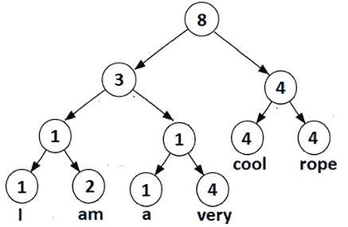
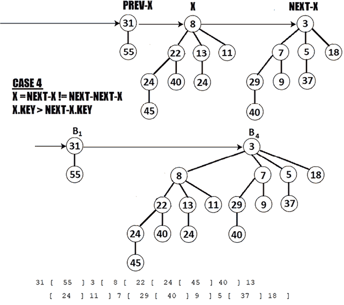

# 数组、集合和数据结构

本章包括涵盖三个主要主题的 24 个问题。我们首先讨论与专门用于并行数据处理的新的 Vector API 相关的一些问题。然后，我们继续讨论包括 Rope、Skip List、K-D Tree、Zipper、Binomial Heap、Fibonacci Heap、Pairing Heap、Huffman 编码等在内的几个数据结构。最后，我们讨论三种最流行的连接算法。

在本章结束时，你将了解如何编写利用数据并行处理的代码，了解一些酷且不太为人所知的数据结构，以及连接操作是如何工作的。此外，作为额外奖励，你将熟悉 JDK 21 Sequenced Collections API。

# 问题

使用以下问题来测试你在 Java 数组、集合和数据结构方面的编程能力。我强烈建议你在查看解决方案并下载示例程序之前，尝试解决每个问题：

1.  **通过数组介绍并行计算**：用几段话解释数据并行处理是什么以及它是如何工作的。

1.  **介绍向量 API 的结构和术语**：通过示例解释向量 API 的术语。涵盖诸如元素类型、形状、种类、通道等概念。

1.  **通过向量 API 求两个数组的和**：编写一个使用向量 API 对两个 Java 数组求和的应用程序。

1.  **通过向量 API 展开求两个数组的和**：编写一个使用向量 API 通过*展开*技术对两个 Java 数组求和的应用程序。

1.  **基准测试向量 API**：给定两个数组`x[]`和`y[]`，编写一个应用程序，使用纯 Java 和向量 API 来基准测试计算`z[] = x[] + y[]`、`w[] = x[] * z[] * y[]`、`k[] = z[] + w[] * y[]`。

1.  **将向量 API 应用于计算 FMA**：提供一个著名的融合乘加（Fused Multiply Add，FMA）的向量 API 实现。

1.  **通过向量 API 乘矩阵**：编写一个用于乘两个矩阵的向量 API 实现。

1.  **使用向量 API 钩接图像负过滤器**：编写一个使用向量 API 将负过滤器应用于图像的程序。

1.  **剖析集合的工厂方法**：举例说明在 Java 中创建不可修改/不可变映射、列表和集合的几种方法。

1.  **从流中获取列表**：提供几个有用的代码片段，用于将`Stream`内容收集到 Java `List`中。

1.  **处理映射容量**：解释 Java `Map`的容量是什么，以及如何用它来控制有效映射的数量。

1.  **处理有序集合**：深入探讨 JDK 21 Sequenced Collections API。以你最喜欢的 Java 集合为例，说明这个 API，并解释在此 API 之前有哪些替代方案。

1.  **介绍 Rope 数据结构**：解释 Rope 数据结构是什么，并提供其主要操作（索引、插入、删除、连接和分割）的 Java 实现。

1.  **介绍 Skip List 数据结构**：解释并示例 Skip List 数据结构。

1.  **介绍 K-D Tree 数据结构**：简要介绍 K-D 树，并提供 2-D 树的 Java 实现。

1.  **介绍 Zipper 数据结构**：在树上解释并示例 Zipper 数据结构。

1.  **介绍 Binomial Heap 数据结构**：深入探讨 Binomial Heap 数据结构。解释其主要操作并在 Java 实现中示例它们。

1.  **介绍 Fibonacci Heap 数据结构**：解释并示例 Fibonacci Heap 数据结构。

1.  **介绍 Pairing Heap 数据结构**：解释并示例 Pairing Heap 数据结构。

1.  **介绍 Huffman 编码数据结构**：Huffman 编码算法由 David A. Huffman 在 1950 年开发。解释其用法并通过 Java 实现进行示例。

1.  **介绍 Splay Tree 数据结构**：Splay Tree 是**二叉搜索树**（**BST**）的一种形式。解释其特性并提供其主要操作的实现。

1.  **介绍 Interval Tree 数据结构**：Interval Tree 是另一种**二叉搜索树**（**BST**）的形式。突出其用法并通过 Java 实现进行示例。

1.  **介绍 Unrolled Linked List 数据结构**：解释并示例 Unrolled Linked List 数据结构。

1.  **实现连接算法**：有三种著名的连接算法：嵌套循环连接、哈希连接和排序归并连接。在涉及一对一关系的两个表中解释并示例每个算法。

以下章节描述了前面问题的解决方案。请记住，通常没有解决特定问题的唯一正确方法。此外，请记住，这里显示的解释仅包括解决这些问题所需的最有趣和最重要的细节。下载示例解决方案以查看更多细节并实验程序，请访问[`github.com/PacktPublishing/Java-Coding-Problems-Second-Edition/tree/main/Chapter05`](https://github.com/PacktPublishing/Java-Coding-Problems-Second-Edition/tree/main/Chapter05)。

# 107. 使用数组介绍并行计算

曾经，CPU 只能在传统模式**单指令单数据**（**SISD**）或冯·诺伊曼架构下对数据进行操作。换句话说，一个 CPU 周期可以处理一个指令和一个数据。处理器将这个指令应用于该数据，并返回一个结果。

现代 CPU 能够执行并行计算，并以称为**单指令多数据**（**SIMD**）的模式工作。这次，一个 CPU 周期可以同时对多个数据应用单个指令，从理论上讲，这应该会加快速度并提高性能。以下图表突出了这些说法：


图 5.1：SISD 与 SIMD

如果我们通过基于 SISD 的 CPU 对数组 *X* 和 *Y* 进行加法操作，那么我们期望每个 CPU 周期都会将 *X* 中的一个元素与 *Y* 中的一个元素相加。如果我们在一个基于 SIMD 的 CPU 上执行相同的任务，那么每个 CPU 周期将同时从 *X* 和 *Y* 的块中进行加法操作。这意味着 SIMD CPU 应该比 SISD CPU 更快地完成任务。

这是整体图景！当我们靠近时，我们看到 CPU 架构有很多种类，因此开发一个能够利用特定平台最佳性能的应用程序是非常具有挑战性的。

市场上的两大竞争对手，英特尔和 AMD，提供了不同的 SIMD 实现。我们并不旨在详细剖析这个话题，但了解第一个流行的桌面 SIMD 是在 1996 年由英特尔以 MMX（x86 架构）的名义引入的，这可能是有用的。作为回应，AIM 联盟（由苹果、IBM 和飞思卡尔半导体组成）推广了 AltiVec – 一种整数和单精度浮点 SIMD 实现。后来，在 1999 年，英特尔引入了新的 SSE 系统（使用 128 位寄存器）。

从那时起，SIMD 通过扩展如高级向量扩展（AVX、AVX2（256 位寄存器）和 AVX-512（512 位寄存器））而发展。虽然 AVX 和 AVX2 都被英特尔和 AMD 支持，但 2022 年引入的 AVX-512 只被最新的英特尔处理器支持。以下图示有助于说明所有这些：


图 5.2：SIMD 实现历史

*图 5.2* 只是 CPU 结构的 SIMD 表示。实际上，平台要复杂得多，有多种类型。没有万能的解决方案，每个平台都有其优势和劣势。试图探索优势并避免劣势是任何试图利用特定平台性能的编程语言的真正挑战。

例如，JVM 应该生成哪些适当的指令集，以便从涉及向量的特定平台计算中榨取最佳性能？嗯，从 JDK 16（JEP 338）开始，Java 提供了一个孵化器模块，`jdk.incubator.vector`，称为 Vector API。这个 API 的目标是允许开发者以一种非常平台无关的方式表达向量计算，这些计算在运行时被转换为支持 CPU 架构上的最佳向量硬件指令。

从 JDK 21（JEP 448）开始，Vector API 达到了第六个孵化阶段，因此我们可以尝试一些利用数据并行加速代码的示例，与标量实现相比。基于此孵化器 API 运行示例可以通过添加 `--add-modules=jdk.incubator.vector` 和 `--enable-preview` 虚拟机选项来实现。

但在之前，让我们先了解 Vector API 的结构和术语。

# 108. 涵盖 Vector API 的结构和术语

向量 API 通过 `jdk.incubator.vector` 模块（以及具有相同名称的包）进行映射。一个 `jdk.incubator.vector.Vector` 实例从一个由*类型*和*形状*表征的通用抽象组合开始。向量是 `Vector<E>` 类的一个实例。

## 向量元素类型

`Vector<E>` 有一个*元素类型*（`ETYPE`），它是 Java 原始类型之一：`byte`、`float`、`double`、`short`、`int` 或 `long`。当我们写 `Vector<E>` 时，我们说 `E` 是 `ETYPE` 的装箱版本（例如，当我们写 `Vector<Float>` 时，`E` 是 `Float`，而 `ETYPE` 是 `float`）。为了方便起见，Java 为每个*元素类型*声明了一个专门的子类型，如下图所示：


图 5.3：专用向量子类型

即使 `E` 是一个装箱类型，也没有装箱/拆箱开销，因为 `Vector<E>` 在内部使用 `ETYPE` 和原始类型进行操作。

除了*元素类型*外，向量还由一个*形状*来表征。

## 向量形状

向量还由一个*形状*（也称为 `VSHAPE`）表征，表示向量的位大小或容量。它可以是以 64、128、256 或 512 位。这些值中的每一个都被 `VectorShape` 枚举（例如，`S_128_BIT` 枚举项代表长度为 128 位的形状）和一个表示平台支持的最大长度的额外枚举项（`S_Max_BIT`）所封装。这由当前运行的 Java 平台自动确定。

## 向量种类

一个由其*元素类型*和*形状*表征的向量确定了一个唯一的*向量种类*，这是一个 `VectorSpecies<E>` 的固定实例。这个实例由所有具有相同形状和 `ETYPE` 的向量共享。我们可以将 `VectorSpecies<E>` 视为一个工厂，用于创建所需*元素类型*和*形状*的向量。例如，我们可以定义一个工厂来创建具有 512 位大小的 `double` 类型向量，如下所示：

```java
static final VectorSpecies<Double> VS = VectorSpecies.of(
  double.class, VectorShape.S_512_BIT); 
```

如果你只需要一个工厂来创建当前平台支持的最大位数的向量，而不考虑元素类型，那么请依赖 `S_Max_BIT`：

```java
static final VectorSpecies<Double> VS = VectorSpecies.of(
  double.class, VectorShape.S_Max_BIT); 
```

如果你只需要当前平台支持的最大向量*种类*（此处，`double`）来处理你的*元素类型*，那么请依赖 `ofLargestShape()`。这个向量*种类*由平台选择，并且具有为你的*元素类型*提供可能的最大位数的*形状*（不要与 `S_Max_BIT` 混淆，它独立于*元素类型*）：

```java
static final VectorSpecies<Double> VS = 
  VectorSpecies.ofLargestShape(double.class); 
```

或者，你可能需要当前平台为你*元素类型*首选的向量*种类*。这可以通过 `ofPreferred()` 如下实现：

```java
static final VectorSpecies<Double> VS = 
  VectorSpecies.ofPreferred(double.class); 
```

最优*种类*是在你不想指定显式*形状*时的最方便的方法。

**重要提示**

最优*种类*是在当前平台（运行时）上给定*元素类型*的最优*形状*。

此外，为了方便起见，每个专用向量（`IntVector`、`FloatVector` 等）定义了一组静态字段，以覆盖所有可能的 *物种*。例如，静态字段 `DoubleVector.SPECIES_512` 可以用于表示 512 位大小的 `DoubleVector` 实例的 *物种*（`VectorShape.S_512_BIT`）：

```java
static final VectorSpecies<Double> VS = 
  DoubleVector.SPECIES_512; 
```

如果你想要最大的 *物种*，则依靠 `SPECIES_MAX`：

```java
static final VectorSpecies<Double> VS = 
  DoubleVector.SPECIES_MAX; 
```

或者，如果你想选择首选的 *物种*，则依靠 `SPECIES_PREFERRED`：

```java
static final VectorSpecies<Double> VS = 
  DoubleVector.SPECIES_PREFERRED; 
```

你可以通过 `elementType()` 和 `vectorShape()` 方法轻松检查 `VectorSpecies` 实例的 *元素类型* 和 *形状*，如下所示：

```java
System.out.println("Element type: " + VS.elementType());
System.out.println("Shape: " + VS.vectorShape()); 
```

到目前为止，你已经知道了如何创建向量 *物种*（向量工厂）。但在开始创建向量和在它们上应用操作之前，让我们先谈谈向量 *车道*。

## 向量车道

`Vector<E>` 就像由 *车道* 组成的固定大小的 Java 数组。*车道数* 由 `length()` 方法返回，称为 `VLENGTH`。*车道数* 等于存储在该向量中的标量元素数量。

如果你知道向量的 *元素大小* 和 *形状*，那么你可以通过 (*形状*/*元素大小*) 计算出 *车道数*。你应该得到与 `length()` 返回的结果相同的结果。*元素大小* 由 `elementSize()` 返回，*形状* 由 `vectorBitSize()` 或 `vectorShape().vectorBitSize()` 返回。

例如，一个形状为 256 位的向量，其 *元素类型* 为 `float`（在 Java 中为 32 位（4 字节）），包含 8 个 `float` 标量元素，因此它有 8 个 *车道*。以下图示说明了这一点：


图 5.4：计算车道数

基于此示例，你可以轻松计算任何其他向量配置的 *车道数*。接下来，让我们看看了解 *车道* 为什么很重要。

## 向量操作

在向量上应用操作是我们努力的顶点。*车道数* 估计了 SIMD 的性能，因为向量操作是在 *车道* 上进行的。单个向量操作作为一个工作单元影响一个 *车道*。例如，如果我们的向量有 8 个 *车道*，这意味着 SIMD 将一次性执行 8 个 *车道级* 操作。

在以下图中，你可以看到在此上下文中 SISD 与 SIMD 的比较：


图 5.5：SISD 与 SIMD 对比

虽然 SISD 以单个标量作为工作单元，但 SIMD 有 8 个标量（8 个 *车道*），这也解释了为什么 SIMD 相比 SISD 提供了显著的性能提升。

因此，`Vector<E>` 是在 *车道* 上操作的。主要来说，我们有 *车道级* 操作（如加法、除法和位移动）以及将所有 *车道* 减少到单个标量的 *跨车道* 操作（例如，对所有 *车道* 进行求和）。以下图示展示了这些说明：


图 5.6：车道级和跨车道操作

此外，`Vector<E>`可以用`VectorMask<E>`操作。这是一个`boolean`值的序列，可以被某些向量操作用来过滤给定输入向量的车道元素的选取和操作。查看以下图（只有当掩码包含 1 时才应用加法操作）：


图 5.7：带有掩码的逐车道加法

**重要提示**

注意，不是所有的 CPU 都支持掩码。不支持掩码的 CPU 可能会面临性能下降。

谈到向量操作，你绝对应该查看`Vector`和`VectorOperators`文档。在`Vector`类中，我们有在两个向量之间应用操作的方法。例如，我们有用于二元操作（如`add()`、`div()`、`sub()`和`mul()`）的方法，用于比较（如`eq()`、`lt()`和`compare()`）的方法，用于数学操作（如`abs()`）等等。此外，在`VectorOperators`中，我们有一系列嵌套类（例如，`VectorOperators.Associative`）和代表*逐车道*操作的几个常量，如三角函数（`SIN`、`COS`等），位移动操作（`LSHL`和`LSHR`），数学操作（`ABS`、`SQRT`和`POW`）等等。

在以下问题中，你会看到这些操作的一部分正在运行，但到目前为止，让我们谈谈最后一个基本主题，创建向量。

## 创建向量

我们已经知道，拥有一个`VectorSpecies`就像拥有一个创建所需*元素类型*和*形状*向量的工厂。现在，让我们看看我们如何使用这样的工厂有效地创建向量（用标量填充它们），这些向量将参与解决实际问题。

假设以下*种类*（一个包含 8 个*车道*的向量，32*8=256）：

```java
static final VectorSpecies<Integer> VS256 
  = IntVector.SPECIES_256; 
```

接下来，让我们创建最常见的向量类型。

### 创建全零向量

假设我们需要一个只包含零的向量。一种快速的方法是使用`zero()`方法，如下所示：

```java
// [0, 0, 0, 0, 0, 0, 0, 0]
Vector<Integer> v = VS256.zero(); 
```

这产生了一个包含 8 个*车道*的 0.0 向量。同样，也可以通过专门的`IntVector`类通过`zero(VectorSpecies<Integer> species)`方法获得：

```java
IntVector v = IntVector.zero(VS256); 
```

你可以轻松地将这个例子推广到`FloatVector`、`DoubleVector`等等。

### 创建具有相同原始值的向量

通过`broadcast()`方法快速创建一个向量并加载原始值，如下所示：

```java
// [5, 5, 5, 5, 5, 5, 5, 5]
Vector<Integer> v = VS256.broadcast(5); 
```

同样，也可以通过专门的`IntVector`类通过`broadcast(VectorSpecies<Integer> species, int e)`或`broadcast(VectorSpecies<Integer> species, long e)`方法获得：

```java
IntVector v = IntVector.broadcast(VS256, 5); 
```

当然，我们也可以用它来广播一个全零向量：

```java
// [0, 0, 0, 0, 0, 0, 0, 0]
Vector<Integer> v = VS256.broadcast(0);
IntVectorv = IntVector.broadcast(VS256, 0); 
```

最后，让我们看看创建向量的最常见用例。

### 从 Java 数组创建向量

从 Java 数组创建向量是最常见的用例。实际上，我们从 Java 数组开始，调用`fromArray()`方法。

#### 使用 VectorSpecies 的 fromArray()

`fromArray()`方法在`VectorSpecies`中作为`fromArray(Object a, int offset)`提供。以下是从整数数组创建向量的示例：

```java
int[] varr = new int[] {0, 1, 2, 3, 4, 5, 6, 7};  
Vector<Integer> v = VS256.fromArray(varr, 0); 
```

由于`varr`长度（8）等于向量长度，并且我们从索引 0 开始，生成的向量将包含数组中的所有标量。在以下示例中，最后 4 个标量将不会是生成向量的一部分：

```java
int[] varr = new int[] {0, 1, 2, 3, 4, 5, 6, 7, 8, 9, 10, 11};
Vector<Integer> v = VS256.fromArray(varr, 0); 
```

标量 8、9、10 和 11 不在生成的数组中。以下是一个使用`offset` = 2 的另一个示例：

```java
int[] varr = new int[] {0, 1, 2, 3, 4, 5, 6, 7, 8, 9, 10, 11};
Vector<Integer> v = VS256.fromArray(varr, 2); 
```

这次，标量 0、1、10 和 11 不在生成的数组中。

注意，Java 数组的长度不应小于向量的长度。例如，以下示例将导致异常：

```java
int[] varr = new int[]{0, 1, 2, 3, 4, 5};
IntVector v = IntVector.fromArray(VS256, varr, 0); 
```

由于 Java 数组长度为 6（小于 8），这将导致`java.lang.IndexOutOfBoundsException`实例。因此，`varr`的最小接受长度为 8。

#### 使用来自特定向量的 fromArray()方法

每个特定向量类都提供了一组`fromArray()`风味。例如，`IntVector`公开了流行的`fromArray(VectorSpecies<Integer> species, int[] a, int offset)`方法，它可以被直接使用：

```java
int[] varr = new int[] {0, 1, 2, 3, 4, 5, 6, 7};
IntVector v = IntVector.fromArray(VS256, varr, 0); 
```

如果我们更喜欢`fromArray(VectorSpecies<Integer> species, int[] a, int offset, VectorMask<Integer> m)`风味，那么我们可以通过`VectorMask`从 Java 数组中过滤选定的标量。以下是一个示例：

```java
int[] varr = new int[]{0, 1, 2, 3, 4, 5, 6, 7};
boolean[] bm = new boolean[]{
  false, false, true, false, false, true, true, false};
VectorMask m = VectorMask.fromArray(VS256, bm, 0);
IntVector v = IntVector.fromArray(VS256, varr, 0, m); 
```

基于一对一的匹配，我们可以轻松观察到生成的向量将只获取标量 2、5 和 6。生成的向量将是：[0, 0, 2, 0, 0, 5, 6, 0]。

`fromArray()`的另一种风味是`fromArray(VectorSpecies<Integer> species, int[] a, int offset, int[] indexMap, int mapOffset)`。这次，我们使用索引映射来过滤选定的标量：

```java
int[] varr = new int[]{11, 12, 15, 17, 20, 22, 29};
int[] imap = new int[]{0, 0, 0, 1, 1, 6, 6, 6};
IntVector v = IntVector.fromArray(VS256, varr, 0, imap, 0); 
```

生成的数组将是：[11, 11, 11, 12, 12, 29, 29, 29]。我们有来自索引 0 的 11，来自索引 1 的 12，以及来自索引 6 的 29。

此外，我们可以通过`fromArray(VectorSpecies<Integer> species, int[] a, int offset, int[] indexMap, int mapOffset, VectorMask<Integer> m)`将`VectorMask`应用于之前的索引映射：

```java
int[] varr = new int[]{11, 12, 15, 17, 20, 22, 29};
boolean[] bm = new boolean[]{
  false, false, true, false, false, true, true, false};
int[] imap = new int[]{0, 0, 0, 1, 1, 6, 6, 6};
VectorMask m = VectorMask.fromArray(VS256, bm, 0);
IntVector v = IntVector.fromArray(VS256, varr, 0, imap, 0, m); 
```

生成的向量是：`[0, 0, 11, 0, 0, 29, 29, 0]`。

### 从内存段创建向量

*内存段*是作为 Foreign Function 和 Memory API 的一部分在*第七章*中详细讨论的主题，但作为一个快速预告，以下是一个通过`IntVector.fromMemorySegment()`从内存段创建向量的示例：

```java
IntVector v;
MemorySegment segment;
try (Arena arena = Arena.ofConfined()) { 
  segment = arena.allocate(32);
  segment.setAtIndex(ValueLayout.JAVA_INT, 0, 11);
  segment.setAtIndex(ValueLayout.JAVA_INT, 1, 21);
  // continue set: 12, 7, 33, 1, 3
  segment.setAtIndex(ValueLayout.JAVA_INT, 7, 6);
  v = IntVector.fromMemorySegment(VS256, segment, 
    0, ByteOrder.nativeOrder());
} 
```

创建的向量是：[11, 21, 12, 7, 33, 1, 3, 6]。

在捆绑的代码中，你可以找到更多关于在通道边界操作数据的示例，例如切片、非切片、洗牌/重新排列、压缩、扩展、转换、类型转换和重新解释形状。

在下一个问题中，我们将开始创建完整的示例，以利用我们迄今为止所学的内容。

# 109. 通过 Vector API 求两个数组的和

将两个数组相加是应用前面两个问题中学到的知识的完美起点。假设我们有以下 Java 数组：

```java
int[] x = new int[]{1, 2, 3, 4, 5, 6, 7, 8};
int[] y = new int[]{4, 5, 2, 5, 1, 3, 8, 7}; 
```

通过 Vector API 计算`z=x+y`，我们必须创建两个`Vector`实例，并依赖于`add()`操作，`z=x.add(y)`。由于 Java 数组持有整数标量，我们可以使用`IntVector`特化如下：

```java
IntVector xVector = IntVector.fromArray(
  IntVector.SPECIES_256, x, 0);
IntVector yVector = IntVector.fromArray(
  IntVector.SPECIES_256, y, 0); 
```

在 Java 中，一个整数需要 4 个字节，即 32 位。由于`x`和`y`存储了 8 个整数，因此我们需要 8*32=256 位来在我们的向量中表示它们。所以，依赖`SPECIES_256`是正确的选择。

接下来，我们可以按照以下方式应用`add()`操作：

```java
IntVector zVector = xVector.add(yVector); 
```

完成了！现在是时候让 JVM 生成最优的指令集（数据并行加速代码），以计算我们的加法。结果将是一个向量，如[5, 7, 5, 9, 6, 9, 15, 15]。

这是一个简单的例子，但并不完全现实。谁会为了将只有几个元素的数组相加而使用并行计算能力呢？！在现实世界中，`x`和`y`可能包含比 8 个元素多得多的元素。最有可能的是，`x`和`y`有数百万个项，并且参与了多个计算周期。这正是我们可以利用并行计算力量的时刻。

但，现在，让我们假设`x`和`y`如下：

```java
x = {3, 6, 5, 5, 1, 2, 3, 4, 5, 6, 7, 8, 3, 6, 5, 5, 1, 2, 3, 
     4, 5, 6, 7, 8, 3, 6, 5, 5, 1, 2, 3, 4, 3, 4};
y = {4, 5, 2, 5, 1, 3, 8, 7, 1, 6, 2, 3, 1, 2, 3, 4, 5, 6, 7, 
     8, 3, 6, 5, 5, 1, 2, 3, 4, 5, 6, 7, 8, 2, 8}; 
```

如果我们应用之前的代码（基于`SPECIES_256`），结果将相同，因为我们的向量只能容纳前 8 个标量，而忽略其余的。如果我们应用相同的逻辑但使用`SPECIES_PREFERRED`，那么结果是不可预测的，因为向量的形状特定于当前平台。然而，我们可以直观地认为我们将容纳前`n`个标量（无论`n`是多少），但不是所有的。

这次，我们需要分块数组，并使用循环遍历数组，计算`z_chunk = x_chunk + y_chunk`。将两个分块相加的结果收集在第三个数组（`z`）中，直到所有分块都处理完毕。我们定义的方法如下：

```java
public static void sum(int x[], int y[], int z[]) {
  ... 
```

但是，一个块应该有多大呢？第一个挑战体现在循环设计上。循环应该从 0 开始，但上界和步长是多少？通常，上界是`x`的长度，即 34。但是，使用`x.length`并不完全有用，因为它不能保证我们的向量可以容纳尽可能多的标量从数组中。我们正在寻找的是小于或等于`x.length`的最大`VLENGTH`（向量长度）的倍数。在我们的例子中，这是小于 34 的最大 8 的倍数，即 32。这正是`loopBound()`方法返回的值，因此我们可以将循环写成如下：

```java
private static final VectorSpecies<Integer> VS256 
  = IntVector.SPECIES_256;

int upperBound = VS256.loopBound(x.length); 
for (int i = 0; i < upperBound; i += VS256.length()) {
  ...
} 
```

循环步长是向量的长度。以下图表预先展示了代码：


图 5.8：分块计算 z = x + y

因此，在第一次迭代中，我们的向量将容纳从索引 0 到 7 的标量。在第二次迭代中，标量是从索引 8 到 15，依此类推。以下是完整的代码：

```java
private static final VectorSpecies<Integer> VS256 
  = IntVector.SPECIES_256;
public static void sum(int x[], int y[], int z[]) {
  int upperBound = VS256.loopBound(x.length);   
  for (int i = 0; i < upperBound; i += VS256.length()) {
    IntVector xVector = IntVector.fromArray(VS256, x, i);
    IntVector yVector = IntVector.fromArray(VS256, y, i);
    IntVector zVector = xVector.add(yVector);
    zVector.intoArray(z, i);
  }
} 
```

`intoArray(int[] a, int offset)` 方法将标量从向量传输到 Java 数组。这个方法与 `intoMemorySegment()` 方法类似，有多种变体。

结果数组将是：[7, 11, 7, 10, 2, 5, 11, 11, 6, 12, 9, 11, 4, 8, 8, 9, 6, 8, 10, 12, 8, 12, 12, 13, 4, 8, 8, 9, 6, 8, 10, 12, **0**, **0**]。查看最后两个项目……它们等于 0。这些是从 `x.length - upperBound` = 34 – 32 = 2 得出的项。当 `VLENGTH`（向量长度）的最大倍数等于 `x.length` 时，这个差值将是 0，否则，我们将有未计算完的剩余项。因此，之前的代码只有在 `VLENGTH`（向量长度）等于 `x.length` 的特定情况下才会按预期工作。

至少有两种方法可以覆盖剩余的项。首先，我们可以依赖 `VectorMask`，如下面的代码所示：

```java
public static void sumMask(int x[], int y[], int z[]) {
  int upperBound = VS256.loopBound(x.length);
  int i = 0;
  for (; i < upperBound; i += VS256.length()) {
    IntVector xVector = IntVector.fromArray(VS256, x, i);
    IntVector yVector = IntVector.fromArray(VS256, y, i);
    IntVector zVector = xVector.add(yVector);
    zVector.intoArray(z, i);
  }
**if** **(i <= (x.length -** **1****)) {** 
 **VectorMask<Integer> mask** 
 **= VS256.indexInRange(i, x.length);**
**IntVector****zVector****=** **IntVector.fromArray(VS256, x, i, mask)**
 **.add(IntVector.fromArray(VS256, y, i, mask));**
 **zVector.intoArray(z, i, mask);**
 **}**
} 
```

`indexInRange()` 计算一个 `[i, x.length-1]` 范围内的掩码。应用此掩码将产生以下 `z` 数组：[7, 11, 7, 10, 2, 5, 11, 11, 6, 12, 9, 11, 4, 8, 8, 9, 6, 8, 10, 12, 8, 12, 12, 13, 4, 8, 8, 9, 6, 8, 10, 12, 5, 12]。现在，最后两个项目按预期计算。

**重要提示**

作为一条经验法则，避免在循环中使用 `VectorMask`。它们相当昂贵，可能会导致性能显著下降。

处理这些剩余项的另一种方法是使用以下传统 Java 代码：

```java
public static void sumPlus(int x[], int y[], int z[]) {
  int upperBound = VS256.loopBound(x.length);
  int i = 0;
  for (; i < upperBound; i += VS256.length()) {
    IntVector xVector = IntVector.fromArray(VS256, x, i);
    IntVector yVector = IntVector.fromArray(VS256, y, i);
    IntVector zVector = xVector.add(yVector);
    zVector.intoArray(z, i);
  }
  for (; i < x.length; i++) {
    z[i] = x[i] + y[i];
  }
} 
```

实际上，我们在向量循环外部使用 Java 传统循环来累加剩余的项。您可以在捆绑的代码中查看这些示例。

# 110. 通过 Vector API 非展开方式求和两个数组

在这个问题中，我们以从上一个问题中求和两个数组为例，并以非展开的方式重写循环。

*循环展开*可以手动应用（正如我们将在这里做的那样）或由编译器应用，它代表一种旨在减少循环迭代次数的优化技术。

在我们这个例子中，为了减少循环迭代的次数，我们使用更多的向量来重复循环体中负责求和项的语句序列。如果我们知道我们的数组足够长，总是需要至少 4 次循环迭代，那么按照以下方式重写代码将减少 4 倍的循环迭代次数：

```java
public static void sumUnrolled(int x[], int y[], int z[]) {
 int width = VS256.length();
 int i = 0;
 for (; i <= (x.length - width * 4); i += width * 4) {
  IntVector s1 = IntVector.fromArray(VS256, x, i)
      .add(IntVector.fromArray(VS256, y, i));
  IntVector s2 = IntVector.fromArray(VS256, x, i + width)
      .add(IntVector.fromArray(VS256, y, i + width));
  IntVector s3 = IntVector.fromArray(VS256, x, i + width * 2)
      .add(IntVector.fromArray(VS256, y, i + width * 2));
  IntVector s4 = IntVector.fromArray(VS256, x, i + width * 3)
      .add(IntVector.fromArray(VS256, y, i + width * 3));
  s1.intoArray(z, i);
  s2.intoArray(z, i + width);
  s3.intoArray(z, i + width * 2);
  s4.intoArray(z, i + width * 3);
 }
 for (; i < x.length; i++) {
  z[i] = x[i] + y[i];
 }
} 
```

考虑以下 `x` 和 `y` 向量：

```java
x = {3, 6, 5, 5, 1, 2, 3, 4, 5, 6, 7, 8, 3, 6, 5, 5, 1, 2, 3, 
     4, 5, 6, 7, 8, 3, 6, 5, 5, 1, 2, 3, 4, 3, 4};
y = {4, 5, 2, 5, 1, 3, 8, 7, 1, 6, 2, 3, 1, 2, 3, 4, 5, 6, 7, 
     8, 3, 6, 5, 5, 1, 2, 3, 4, 5, 6, 7, 8, 2, 8};
int[] z = new int[x.length]; 
```

调用之前问题中编写的 `sumPlus(x, y, z)` 方法需要 4 次循环迭代才能完成。调用 `sumUnrolled(x, y, z)` 将只需要一次迭代即可完成。

# 111. 基准测试 Vector API

通过 JMH 可以完成对 Vector API 的基准测试。让我们考虑三个包含 5000 万个整数的 Java 数组（`x`、`y`、`z`），以及以下计算：

```java
z[i] = x[i] + y[i];
w[i] = x[i] * z[i] * y[i];
k[i] = z[i] + w[i] * y[i]; 
```

因此，最终结果存储在名为 `k` 的 Java 数组中。让我们考虑以下包含四种不同计算实现（使用掩码、不使用掩码、*展开*和纯标量 Java 数组）的基准测试：

```java
@OutputTimeUnit(TimeUnit.MILLISECONDS)
@BenchmarkMode({Mode.AverageTime, Mode.Throughput})
@Warmup(iterations = 3, time = 1)
@Measurement(iterations = 5, time = 1)
@State(Scope.Benchmark)
@Fork(value = 1, warmups = 0, 
    jvmArgsPrepend = {"--add-modules=jdk.incubator.vector"})
public class Main {
  private static final VectorSpecies<Integer> VS 
    = IntVector.SPECIES_PREFERRED;
  ...
  @Benchmark
  public void computeWithMask(Blackhole blackhole) {…}
  @Benchmark
  public void computeNoMask(Blackhole blackhole) {…}
  @Benchmark
  public void computeUnrolled(Blackhole blackhole) {…}
  @Benchmark
  public void computeArrays(Blackhole blackhole) {…}
} 
```

在一个运行 Windows 10 的 Intel(R) Core(TM) i7-3612QM CPU @ 2.10GHz 的机器上运行这个基准测试产生了以下结果：


图 5.9：基准结果

总体而言，使用数据并行能力执行计算提供了最佳性能，最高吞吐量和最佳平均时间。

# 112. 将 Vector API 应用于计算 FMA

简而言之，**融合乘加**（**FMA**）是数学计算（a*b）+ c，这在矩阵乘法中被大量使用。这就是我们为这个问题需要涵盖的所有内容，但如果您需要 FMA 的入门知识，请考虑*Java 编码问题，第一版*，*第一章*，*问题 38*。

通过 Vector API 实现 FMA 可以通过`fma(float b, float c)`或`fma(Vector<Float> b, Vector<Float> c)`操作完成，后者是您将在接下来的示例中看到的。

假设我们有两个以下数组：

```java
float[] x = new float[]{1f, 2f, 3f, 5f, 1f, 8f};
float[] y = new float[]{4f, 5f, 2f, 8f, 5f, 4f}; 
```

计算 FMA(`x`, `y`)可以表示为以下序列：4+0=4 → 10+4=14 → 6+14=20 → 40+20=60 → 5+60=65 → 32+65=97。所以，FMA(`x`, `y`) = 97。通过 Vector API 表达这个序列可以像以下代码所示：

```java
private static final VectorSpecies<Float> VS 
  = FloatVector.SPECIES_PREFERRED;
public static float vectorFma(float[] x, float[] y) {
  int upperBound = VS.loopBound(x.length);
  FloatVector sum = FloatVector.zero(VS);
  int i = 0;
  for (; i < upperBound; i += VS.length()) {
    FloatVector xVector = FloatVector.fromArray(VS, x, i);
    FloatVector yVector = FloatVector.fromArray(VS, y, i);
    sum = xVector.fma(yVector, sum); 
  }
  if (i <= (x.length - 1)) {
    VectorMask<Float> mask = VS.indexInRange(i, x.length);
    FloatVector xVector = FloatVector.fromArray(
      VS, x, i, mask);
    FloatVector yVector = FloatVector.fromArray(
      VS, y, i, mask);
    sum = xVector.fma(yVector, sum);
  }
  float result = sum.reduceLanes(VectorOperators.ADD);
  return result;
} 
```

你有没有注意到代码行`sum = xVector.fma(yVector, sum)`？这相当于`sum = xVector.mul(yVector).add(sum)`。

这里的新特性包括以下这一行：

```java
float result = sum.reduceLanes(VectorOperators.ADD); 
```

这是一个关联的**跨通道**减少操作（见*图 5.6*）。在这行代码之前，总和向量看起来如下：

```java
sum= [9.0, 42.0, 6.0, 40.0] 
```

通过应用`reduceLanes(VectorOperators.ADD)`，我们将这个向量的值相加并减少到最终结果，97.0。酷，对吧?!

# 113. 通过 Vector API 乘法矩阵

让我们考虑两个 4x4 的矩阵，分别用`X`和`Y`表示。`Z=X*Y`的结果如下：


图 5.10：乘以两个矩阵（X * Y = Z）

将`X`与`Y`相乘意味着将`X`的第一行与`Y`的第一列相乘，将`X`的第二行与`Y`的第二列相乘，依此类推。例如，(1 x 3) + (2 x 7) + (5 x 5) + (4 x 5) = 3 + 14 + 25 + 20 = 62。基本上，我们反复应用 FMA 计算并将结果填充到`Z`中。

在这个背景下，基于之前关于计算 FMA 的问题，我们可以为乘以`X`和`Y`生成以下代码：

```java
private static final VectorSpecies<Float> VS 
  = FloatVector.SPECIES_PREFERRED;
public static float[] mulMatrix(
    float[] x, float[] y, int size) {
  final int upperBound = VS.loopBound(size);
  float[] z = new float[size * size];
  for (int i = 0; i < size; i++) {
    for (int k = 0; k < size; k++) {
      float elem = x[i * size + k];
      FloatVector eVector = FloatVector.broadcast(VS, elem);
      for (int j = 0; j < upperBound; j += VS.length()) {
        FloatVector yVector = FloatVector.fromArray(
            VS, y, k * size + j);
        FloatVector zVector = FloatVector.fromArray(
            VS, z, i * size + j);
        zVector = eVector.fma(yVector, zVector);
        zVector.intoArray(z, i * size + j);
      }
    }
  }
  return z;
} 
```

在捆绑的代码中，您可以在使用`SPECIES_512`的另一个示例旁边找到这个示例。

# 114. 使用 Vector API 将图像负片滤镜连接起来

一张图像基本上是一个以**Alpha, Red, Green, Blue**（**ARGB**）频谱表示的像素矩阵。例如，一个 232x290 的图像可以表示为一个包含 67,280 个像素的矩阵。对图像应用特定的过滤器（如棕褐色、负片、灰度等）通常需要处理这个矩阵中的每个像素并执行某些计算。例如，应用负片滤镜到图像的算法可以如下使用：


图 5.11：将负片滤镜效果应用于图像

对于每个像素，我们提取颜色分量 A、R、G 和 B。我们从 255 中减去 R、G 和 B 的值，并将新值设置为当前像素。

假设我们有一个包含图像所有像素的数组（`pixel[]`）。接下来，我们想要将`pixel[]`作为参数传递给一个由 Vector API 支持的方法，该方法能够应用负滤波器并在`pixel[]`中直接设置新值。

这里是一个可能的实现：

```java
private static final VectorSpecies<Integer> VS 
  = IntVector.SPECIES_PREFERRED;
public static void negativeFilter(
   int pixel[], int width, int height) {
  for (int i = 0; i <= (width * height - VS.length()); 
           i += VS.length()) {
    IntVector alphaVector = IntVector.fromArray(VS, pixel, i)
      .lanewise(VectorOperators.LSHR, 24).and(0xff);
    IntVector redVector = IntVector.fromArray(VS, pixel, i)
      .lanewise(VectorOperators.LSHR, 16).and(0xff);
    IntVector greenVector = IntVector.fromArray(VS, pixel, i)
      .lanewise(VectorOperators.LSHR, 8).and(0xff);
    IntVector blueVector = IntVector.fromArray(VS, pixel, i)
      .and(0xff);
    IntVector subAlphaVector
      = alphaVector.lanewise(VectorOperators.LSHL, 24);
    IntVector subRedVector = redVector.broadcast(255)
      .sub(redVector).lanewise(VectorOperators.LSHL, 16);
    IntVector subGreenVector = greenVector.broadcast(255)
      .sub(greenVector).lanewise(VectorOperators.LSHL, 8);
    IntVector subBlueVector
      = blueVector.broadcast(255).sub(blueVector);
    IntVector resultVector = subAlphaVector.or(subRedVector)
      .or(subGreenVector).or(subBlueVector);
    resultVector.intoArray(pixel, i);
  } 
} 
```

在第一部分，我们通过应用`LSHR` *逐行*操作将 A、R、G 和 B 提取为四个向量（`alphaVector`、`redVector`、`greenVector`和`blueVector`）。之后，我们从 255 中减去 R、G 和 B，并通过应用`LSHL` *逐行*操作计算新的 R、G 和 B。接下来，我们通过应用新的 A、R、G 和 B 值之间的位逻辑异或（`|`）来计算新的颜色。最后，我们将新的颜色设置在`pixel[]`数组中。

# 115. 解构集合的工厂方法

使用集合的工厂方法是必备技能。在将它们投入使用之前，能够快速轻松地创建和填充不可修改/不可变的集合是非常方便的。

## 映射的工厂方法

例如，在 JDK 9 之前，创建不可修改的映射可以这样完成：

```java
Map<Integer, String> map = new HashMap<>();
map.put(1, "Java Coding Problems, First Edition");
map.put(2, "The Complete Coding Interview Guide in Java");
map.put(3, "jOOQ Masterclass");
Map<Integer, String> imap = Collections.unmodifiableMap(map); 
```

这在某个时候你需要从可修改的映射中获取不可修改的映射时很有用。否则，你可以采取以下捷径（这被称为*双括号初始化*技术，通常是一个反模式）：

```java
Map<Integer, String> imap = Collections.unmodifiableMap(
  new HashMap<Integer, String>() {
    {
      put(1, "Java Coding Problems, First Edition");
      put(2, "The Complete Coding Interview Guide in Java");
      put(3, "jOOQ Masterclass");
    }
  }); 
```

如果你需要从`Stream`中的`java.util.Map.entry`返回不可修改/不可变的映射，那么请看这里：

```java
Map<Integer, String> imap = Stream.of(
  entry(1, "Java Coding Problems, First Edition"),
  entry(2, "The Complete Coding Interview Guide in Java"),
  entry(3, "jOOQ Masterclass"))
  .collect(collectingAndThen(
   toMap(e -> e.getKey(), e -> e.getValue()), 
   Collections::unmodifiableMap)); 
```

此外，我们不要忘记空映射和单例映射（非常有用，可以从方法中返回映射而不是`null`）：

```java
Map<Integer, String> imap = Collections.emptyMap();
Map<Integer, String> imap = Collections.singletonMap(
  1, "Java Coding Problems, First Edition"); 
```

从 JDK 9 开始，我们可以依赖一个更方便的方法来创建不可修改/不可变的映射，这得益于 JEP 269：*集合的便利工厂方法*。这种方法包括`Map.of()`，它从 0 到 10 个映射可用，换句话说，它被重载以支持 0 到 10 个键值对。在这里，我们使用`Map.of()`进行三个映射：

```java
Map<Integer, String> imap = Map.of(
  1, "Java Coding Problems, First Edition",
  2, "The Complete Coding Interview Guide in Java",
  3, "jOOQ Masterclass"
); 
```

通过`Map.of()`创建的映射不允许`null`键或值。此类尝试将导致`NullPointerException`。

如果你需要超过 10 个映射，则可以依赖`static <K,V> Map<K,V> ofEntries(Entry<? Extends K,? extends V>... entries)`，如下所示：

```java
import static java.util.Map.entry;
...
Map<Integer, String> imap2jdk9 = Map.ofEntries(
  entry(1, "Java Coding Problems, First Edition"),
  entry(2, "The Complete Coding Interview Guide in Java"),
  entry(3, "jOOQ Masterclass")
); 
```

最后，可以通过`static <K,V> Map<K,V> copyOf(Map<? extends K,? extends V> map)`从现有的映射创建不可修改/不可变的映射：

```java
Map<Integer, String> imap = Map.copyOf(map); 
```

如果给定的映射不可修改，那么 Java 很可能会不创建一个副本，而是返回一个现有的实例。换句话说，`imap == map`将返回`true`。如果给定的映射是可修改的，那么工厂很可能会返回一个新实例，因此`imap == map`将返回`false`。

## 列表的工厂方法

在 JDK 9 之前，可以使用可修改的`List`创建具有相同内容的不可修改`List`，如下所示：

```java
List<String> list = new ArrayList<>();
list.add("Java Coding Problems, First Edition");
list.add("The Complete Coding Interview Guide in Java");
list.add("jOOQ Masterclass");
List<String> ilist = Collections.unmodifiableList(list); 
```

创建 `List` 的一个常见方法是通过使用 `Arrays.asList()`：

```java
List<String> ilist = Arrays.asList(
  "Java Coding Problems, First Edition",
  "The Complete Coding Interview Guide in Java",
  "jOOQ Masterclass"
); 
```

然而，请记住，这是一个固定大小的列表，不是一个不可修改/不可变列表。换句话说，尝试修改列表大小（例如，`ilist.add(…)`)的操作将导致 `UnsupportedOperationException`，而修改列表当前内容的操作（例如，`ilist.set(…)`)是允许的。

如果你需要从 `Stream` 返回一个不可修改/不可变的 `List`，那么请看这里：

```java
List<String> ilist = Stream.of(
  "Java Coding Problems, First Edition",
  "The Complete Coding Interview Guide in Java",
  "jOOQ Masterclass")
  .collect(collectingAndThen(toList(), 
           Collections::unmodifiableList)); 
```

此外，创建一个空/单例列表可以这样做：

```java
List<String> ilist = Collections.emptyList();
List<String> ilist = Collections.singletonList(
  "Java Coding Problems, First Edition"); 
```

从 JDK 9+ 开始，使用 0 到 10 个元素的 `List.of()` 工厂方法更为方便（不允许 `null` 元素）：

```java
List<String> ilist = List.of(
  "Java Coding Problems, First Edition",
  "The Complete Coding Interview Guide in Java",
  "jOOQ Masterclass"); 
```

如果你需要一个现有列表的副本，则依赖 `List.copyOf()`：

```java
List<String> ilist = List.copyOf(list); 
```

如果给定的列表是不可修改的，那么 Java 很可能不会创建一个副本，并返回一个现有实例。换句话说，`ilist == list` 将返回 `true`。如果给定的列表是可修改的，那么工厂很可能返回一个新实例，因此 `ilist == list` 将返回 `false`。

## 集合的工厂方法

创建 `Set` 实例遵循与 `List` 实例相同的路径。然而，请注意，没有 `singletonSet()`。要创建一个单例集合，只需调用 `singleton()`：

```java
Set<String> iset = Collections.singleton(
  "Java Coding Problems, First Edition"); 
```

你可以在捆绑的代码中找到更多示例。你可能还对来自《Java 编码问题》第一版的*问题 109*感兴趣，它涵盖了不可修改与不可变集合的比较。此外，请考虑这里提出的下一个问题，因为它提供了更多关于这个上下文的信息。

# 116. 从流中获取列表

将 `Stream` 收集到一个 `List` 中是一个在处理流和集合的应用程序中普遍存在的流行任务。

在 JDK 8 中，可以通过以下方式使用 `toList()` 收集器将 `Stream` 收集到一个 `List` 中：

```java
List<File> roots = Stream.of(File.listRoots())
  .collect(Collectors.toList()); 
```

从 JDK 10 开始，我们可以依赖 `toUnmodifiableList()` 收集器（对于映射，使用 `toUnmodifiableMap()`，对于集合，使用 `toUnmodifiableSet()`）：

```java
List<File> roots = Stream.of(File.listRoots())
  .collect(Collectors.toUnmodifiableList()); 
```

显然，返回的列表是一个不可修改/不可变列表。

JDK 16 在 `Stream` 接口中引入了以下 `toList()` 默认方法：

```java
default List<T> toList() {
  return (List<T>) Collections.unmodifiableList(
    new ArrayList<>(Arrays.asList(this.toArray())));
} 
```

使用此方法将 `Stream` 收集到一个不可修改/不可变列表中很简单（请注意，这与 `Collectors.toList()` 不同，它返回一个可修改的列表）：

```java
List<File> roots = Stream.of(File.listRoots()).toList(); 
```

在捆绑的代码中，你还可以找到一个结合 `flatMap()` 和 `toList()` 的示例。

# 117. 处理映射容量

假设我们需要一个可以容纳 260 个项目的 `List`。我们可以这样做：

```java
List<String> list = new ArrayList<>(260); 
```

`ArrayList` 底层的数组直接创建以容纳 260 个项目。换句话说，我们可以插入 260 个项目，而不用担心调整或扩大列表以容纳这些 260 个项目。

按照这个逻辑，我们也可以为映射重现它：

```java
Map<Integer, String> map = new HashMap<>(260); 
```

因此，现在我们可以假设我们有一个可以容纳 260 个映射的映射表。实际上，不，这个假设是不正确的！`HashMap` 依据 *散列* 原则工作，并使用初始容量（如果没有提供明确的初始容量，则为 16）初始化，表示内部桶的数量和默认的 *加载因子* 0.75。这意味着什么？这意味着当 `HashMap` 达到当前容量的 75% 时，它的大小将加倍，并发生重新散列。这保证了映射在内部桶中均匀分布。但是，对于显著大的映射，这是一个昂贵的操作。Javadoc 表明，“*创建一个具有足够大容量的 HashMap 将允许映射以比让它根据需要自动重新散列以增长表更有效的方式存储*。”

在我们的情况下，这意味着一个映射表可以容纳 260 x 0.75 = 195 个映射。换句话说，当我们插入第 195 个映射时，映射表将自动调整大小到 260 * 2 = 520 个映射。

要创建一个用于 260 个映射的 `HashMap`，我们必须计算初始容量为映射数/加载因子：260 / 0.75 = 347 个映射：

```java
// accommodate 260 mappings without resizing
Map<Integer, String> map = new HashMap<>(347); 
```

或者，如果我们想用公式表达，可以这样做：

```java
Map<Integer, String> map = new HashMap<>(
  (int) Math.ceil(260 / (double) 0.75)); 
```

从 JDK 19 开始，这个公式被隐藏在 `static <K,V> HashMap<K,V> newHashMap(int numMappings)` 方法后面。这次，`numMappings` 代表映射的数量，因此我们可以这样写：

```java
// accommodate 260 mappings without resizing
Map<Integer, String> map = HashMap.newHashMap(260); 
```

类似的方法存在于 `HashSet`、`LinkedHashSet`、`LinkedHashMap` 和 `WeakHashMap` 中。

# 118. 解决有序集合问题

Sequenced Collections API 作为 JDK 21 的最后一个特性，在 JEP 431 下被添加。其主要目标是通过提供一个通用的 API，使所有具有良好定义的遍历顺序的集合的导航更加容易。

一个具有良好定义的遍历顺序的 Java 集合有一个良好定义的第一个元素、第二个元素，依此类推，直到最后一个元素。遍历顺序是 `Iterator` 遍历集合元素（列表、集合、有序集合、映射等）的顺序。遍历顺序可以利用时间上的稳定性（列表）或不稳定性（集合）。

此 API 由 3 个接口组成，名为 `SequencedCollection`（适用于任何具有良好定义的遍历顺序的集合）、`SequencedSet`（扩展 `SequencedCollection` 和 `Set` 以提供对 Java 集合的支持），以及 `SequencedMap`（扩展 `Map` 以支持任何具有良好定义的遍历顺序的 Java 映射）。在以下图中，您可以看到这三个接口在集合类型层次结构中的位置：


图 5.12：Sequenced Collections API 在集合类型层次结构中的位置

`SequencedCollection` API 针对集合的四个主要操作：获取第一个/最后一个元素，在第一个/最后一个位置添加新元素，移除第一个/最后一个元素，以及反转集合。

`SequencedCollection` API 定义了 7 个方法，如下所示：

+   `getFirst()` 获取当前集合的第一个元素

+   `getLast()` 获取当前集合的最后一个元素

+   `addFirst(E e)` 将给定的元素 `e` 添加为当前集合的第一个元素

+   `addLast(E e)` 将给定的元素 `e` 添加为当前集合的最后一个元素

+   `removeFirst()` 移除当前集合的第一个元素

+   `removeLast()` 移除当前集合的最后一个元素

+   `reversed()` 返回当前集合的反向集合

`SequencedSet` 扩展 `SequencedCollection` 并重写 `reversed()` 方法以返回 `SequencedSet`。

`SequencedMap` 定义了以下方法：

+   `firstEntry()` 返回当前映射的第一个条目（第一个键值映射）

+   `lastEntry()` 返回当前映射的最后一个条目（最后一个键值映射）

+   `putFirst(K k, V v)` 尝试将给定的键值映射作为当前映射中的第一个映射（或替换）插入

+   `putLast(K k, V v)` 尝试将给定的键值映射作为当前映射中的最后一个映射（或替换）插入

+   `pollFirstEntry()` 从当前映射中移除并返回第一个条目（第一个键值映射）（如果没有条目，则返回 `null`）

+   `pollLastEntry()` 从当前映射中移除并返回最后一个条目（最后一个键值映射）（如果没有条目，则返回 `null`）

+   `reversed()` 返回当前映射的反向映射

+   `sequencedEntrySet()` 返回当前映射的条目集（`entrySet()`）的 `SequencedSet` 视图

+   `sequencedKeySet()` 返回当前映射的键集（`keyset()`）的 `SequencedSet` 视图

+   `sequencedValues()` 返回当前映射的值（`values()`）的 `SequencedCollection` 视图

明确的遍历顺序是集合类型层次结构中的一个属性，因此我们必须考虑 Sequenced Collections API 完全适用于某些集合，部分适用于其他集合，而对于其他集合则完全不适用。让我们处理一些常见的集合并尝试这个新的 API。

## 将 Sequenced Collections API 应用到列表中

Java 列表（`List` 的实现）依赖于索引来支持明确的（稳定的）遍历顺序，因此它们是 Sequenced Collections API 的完美候选。

接下来，让我们看看如何利用 Sequenced Collections API 来处理 `List` 的两种最流行的实现。显然，我们正在谈论 `ArrayList` 和 `LinkedList`。`ArrayList` 和 `LinkedList` 实现 `SequencedCollection`。

### 将 Sequenced Collections API 应用到 ArrayList 和 LinkedList

假设我们有以下 `ArrayList` 和 `LinkedList`：

```java
List<String> list = new ArrayList<>(
  Arrays.asList("one", "two", "three", "four", "five"));
List<String> linkedlist = new LinkedList<>(
  Arrays.asList("one", "two", "three", "four", "five")); 
```

从 `ArrayList` 中获取第一个元素相当简单。第一个元素位于索引 0，因此调用 `get(0)` 就足够了：

```java
String first = list.get(0); // one 
```

获取最后一个元素稍微有点复杂。我们不知道最后一个元素的索引，但我们知道列表的大小，因此我们可以写出这个（它不是那么整洁，但它是有效的）：

```java
String last = list.get(list.size() - 1); // five 
```

另一方面，如果我们依赖于 JDK 21 Sequenced Collections API，则可以如下获取第一个和最后一个元素：

```java
String first = list.getFirst(); // one
String last = list.getLast();  // five 
```

这真的很方便，同样也适用于 `LinkedList`！我们不需要任何显式的索引。

在第一个位置添加一个元素意味着通过已知的 `add(index, element)` 方法在索引 0 处添加一个元素。此外，在最后一个位置添加一个元素意味着调用没有显式索引的 `add(element)` 方法，如下所示：

```java
list.add(0, "zero"); // add on the first position
list.add("six");     // add on the last position 
```

通过 Sequenced Collections API 添加相同的元素可以这样做：

```java
list.addFirst("zero");
list.addLast("six"); 
```

通过 `remove()` 方法和适当的索引移除第一个/最后一个元素，如下所示：

```java
list.remove(0);                // remove the first element
list.remove(list.size() - 1);  // remove the last element 
```

如果我们知道最后一个元素的值，我们可以不使用显式索引来移除它，如下所示：

```java
list.remove("five"); 
```

通过 Sequenced Collections API 移除相同的元素可以这样做：

```java
list.removeFirst();
list.removeLast(); 
```

因此，使用 Sequenced Collections API 非常简单。不需要任何参数。同样，这也适用于 `LinkedList`。

通过 `Collections.reverse()` 辅助方法可以反转列表。此方法反转给定的列表：

```java
Collections.reverse(list); 
```

另一方面，Sequenced Collections API 返回一个新的列表，表示给定列表的逆序，如下所示：

```java
List<String> reversedList = list.reversed(); 
```

再次，相同的代码也适用于 `LinkedList`。因此，Sequenced Collections API 对于列表来说工作得非常完美。

## 将 Sequenced Collections API 应用到集合中

Java 集合（`Set` 的实现）可以分为两类。我们有有序集合（`SortedSet` 的实现），它支持一个定义良好的（稳定的）遍历顺序，以及不保证遍历顺序的集合（`HashSet`）。

`SortedSet` 有一个由比较器逻辑（*自然排序* 或 `Comparator`）决定的顺序。当我们向有序集合中插入一个新元素时，比较器逻辑决定这个元素将落在何处，因此我们不知道元素的索引值。然而，有序集合有第一个和最后一个元素的概念，并且 `Iterator` 将按照比较器确定的顺序遍历元素。

另一方面，像 `HashSet` 这样的集合没有遍历顺序的保证。`HashSet` 的元素按其内部哈希算法排序。`HashSet` 上的 `Iterator` 按无特定顺序遍历其元素，并且当我们插入一个新元素时，我们不知道这个元素将在 `HashSet` 中落在何处。

接下来，让我们看看如何利用 Sequenced Collections API 来处理三种最受欢迎的集合。我们选择了 `HashSet`（`Set` 的一个实现），`LinkedHashSet`（`HashSet` 的一个扩展），以及 `TreeSet`（一个扩展 `SortedSet` 的 `NavigableSet` 实现）。

### 将 Sequenced Collections API 应用到 HashSet

`HashSet` 按无特定顺序迭代其元素，这意味着 `HashSet` 没有关于第一个、第二个或最后一个元素（稳定性）的了解。多次迭代相同的 `HashSet` 可能会产生不同的输出。在这种情况下，我们可以通过 `add(E e)` 方法将一个元素添加到集合中。如果该元素不存在，它将被添加，并落在由 `HashSet` 内部哈希算法计算出的位置。此外，我们可以通过 `remove(Object o)` 方法通过值移除一个元素。由于元素的顺序是不稳定的，反转 `HashSet` 没有意义。在这种情况下，Sequenced Collections API 完全不起作用，因此 `HashSet` 不会利用这个 API。

### 将 Sequenced Collections API 应用到 LinkedHashSet

`LinkedHashSet` 是一个依赖于双链表来维护良好定义的遍历顺序的 `HashSet`。`LinkedHashSet` 实现 `SequencedSet`，因此可以利用 Sequenced Collections API。让我们深入探讨以下 `LinkedHashSet`：

```java
SequencedSet<String> linkedhashset = new LinkedHashSet<>(
  Arrays.asList("one", "two", "three", "four", "five")); 
```

`LinkedHashSet` 没有公开用于获取第一个/最后一个元素的 API。然而，我们可以依赖于定义良好的遍历顺序以及 `Iterator`（或 `Stream`）API 来获取第一个元素，如下所示：

```java
linkedhashset.iterator().next();
linkedhashset.stream().findFirst().get(); 
```

这并不整洁，对于最后一个元素来说甚至更糟：

```java
linkedhashset.stream().skip(
  linkedhashset.size() - 1).findFirst().get();
String last = (String) linkedhashset.toArray()
  [linkedhashset.size() - 1]; 
```

幸运的是，JDK 21 通过 `getFirst()` 和 `getLast()` 方法简化了这个任务：

```java
linkedhashset.getFirst();
linkedhashset.getLast(); 
```

将元素添加到 `LinkedHashSet` 中仅当该元素不存在时才可能。这是正常的，因为集合不接受重复的元素，就像列表一样。然而，在第一个位置添加元素并不是一件容易的事情（如果我们把 `LinkedHashSet` 转换为另一个集合，在第一个位置添加元素，然后再转换回 `LinkedHashSet`，我们就可以做到这一点），所以我们在这里跳过了这一点。通过 `add()` 方法将元素添加到最后位置是很容易的：

```java
// cannot add on first position
linkedhashset.add("six"); //  add on last position 
```

但如果我们依赖 Sequenced Collections API，那么我们可以通过 `addFirst()`/`addLast()` 在第一个/最后一个位置添加元素：

```java
linkedhashset.addFirst("zero");
linkedhashset.addLast("six"); 
```

仅当我们知道这些元素的值时，才能移除第一个/最后一个元素：

```java
linkedhashset.remove("one");
linkedhashset.remove("five"); 
```

显然，这种方法并不稳健和安全，你更愿意像之前通过 `Iterator`/`Stream` 那样获取第一个/最后一个元素，然后在那些元素上调用 `remove()`。然而，更合适的选项是依赖 Sequenced Collections API：

```java
linkedhashset.removeFirst();
linkedhashset.removeLast(); 
```

除了使用 Sequenced Collections API 之外，没有其他直接的方法可以反转 `LinkedHashSet`：

```java
SequencedSet<String> reversedLhs = linkedhashset.reversed(); 
```

所以，正如你所见，Sequenced Collections API 真实地简化了 `LinkedHashSet` 的使用。酷！

### 将 Sequenced Collections API 应用到 TreeSet

`TreeSet` 是一个实现了 `NavigableSet`（`SortedSet` 的扩展）的有序集合，因此它利用了所有有序集合的方法以及一些导航方法。它还实现了 `SequencedCollection` 和 `SequencedSet`。

让我们考虑以下 `TreeSet`：

```java
SortedSet<String> sortedset = new TreeSet<>(
  Arrays.asList("one", "two", "three", "four", "five")); 
```

依赖于字符串的默认比较器（即自然排序，按字典顺序比较两个字符串），排序后的集合将是 *five*，*four*，*one*，*three*，*two*。因此，第一个元素是 *five*，最后一个元素是 *two*。可以通过 `first()` 和 `last()` 方法获取排序集合的第一个/最后一个元素：

```java
sortedset.first();
sortedset.last(); 
```

因此，在这种情况下，序列化集合 API 并不带来显著的价值：

```java
sortedset.getFirst();
sortedset.getLast(); 
```

在排序集合的第一个/最后一个位置添加新元素是不可能的。由于元素的顺序由比较器（自然排序或显式的 `Comparator`）决定，我们无法保证添加的元素会落在第一个或最后一个位置。例如，以下代码不会添加我们可能期望的元素（zero 作为第一个元素，six 作为最后一个元素）：

```java
sortedset.add("zero");
sortedset.add("six"); 
```

在应用字典顺序标准后，得到的排序集合将是 *five*，*four*，*one*，*six*，*three*，*two*，*zero*。所以，*zero* 实际上是最后一个元素，*six* 是第四个元素。

尝试应用序列化集合 API（`addFirst()`/`addLast()`）将抛出 `UnsupportedOperationException` 异常。

那么从排序集合中移除第一个/最后一个元素怎么办？由于我们可以获取树集合的第一个/最后一个元素，我们也可以按照以下方式移除它们：

```java
String first = sortedset.first();
sortedset.remove(first);
String last = sortedset.last();
sortedset.remove(last); 
```

序列化集合 API 的实现代表了之前代码的快捷方式：

```java
sortedset.removeFirst();
sortedset.removeLast(); 
```

通过 `descendingSet()` 或 `descendingIterator()` 可以反转排序集合。这两个方法都在 `TreeSet` 中可用，所以这里是如何使用 `descendingSet()` 的示例：

```java
SortedSet<String> reversedSortedSet
  = new TreeSet<>(sortedset).descendingSet(); 
```

依赖于序列化集合 API 如下会更加整洁：

```java
SortedSet<String> reversedSortedSet = sortedset.reversed(); 
```

好吧，对吧?!

## 将序列化集合 API 应用于映射

Java 映射（`Map`的实现）可能有定义良好的遍历顺序（例如，`LinkedHashMap`（`Map`和`SequencedMap`的实现），`TreeMap`（`SortedMap`和`SequencedMap`的实现））或随时间变化的不稳定顺序（例如，`HashMap`的`Map`实现）。正如在 `HashSet` 的情况下，`HashMap`无法利用序列化集合 API。

### 将序列化集合 API 应用于 LinkedHashMap

`LinkedHashMap` 是一个具有定义良好遍历顺序的映射。以下是一个示例：

```java
SequencedMap<Integer, String> linkedhashmap
  = new LinkedHashMap<>();
linkedhashmap.put(1, "one");
linkedhashmap.put(2, "two");
linkedhashmap.put(3, "three");
linkedhashmap.put(4, "four");
linkedhashmap.put(5, "five"); 
```

通过 `Iterator`/`Stream` API 从链接哈希映射中获取第一个条目（`Map.Entry`）如下所示：

```java
linkedhashmap.entrySet().iterator().next();
linkedhashmap.entrySet().stream().findFirst().get(); 
```

同样的逻辑可以应用于获取第一个键（通过 `keyset()`）或第一个值（通过 `values()`）：

```java
linkedhashmap.keySet().iterator().next();
linkedhashmap.keySet().stream().findFirst().get();
linkedhashmap.values().iterator().next();
linkedhashmap.values().stream().findFirst().get(); 
```

获取最后一个条目/键/值需要比之前的代码更丑陋的代码：

```java
linkedhashmap.entrySet().stream()
  .skip(linkedhashmap.size() - 1).findFirst().get();
Entry<Integer, String> lastEntryLhm = (Entry<Integer, String>)
  linkedhashmap.entrySet().toArray()[linkedhashmap.size() - 1];
linkedhashmap.keySet().stream()
  .skip(linkedhashmap.size() - 1).findFirst().get();
Integer lastKeyLhm = (Integer) linkedhashmap.keySet()
  .toArray()[linkedhashmap.size() - 1];
linkedhashmap.values().stream()
  .skip(linkedhashmap.size() - 1).findFirst().get();
String lastValueLhm = (String) linkedhashmap.values()
  .toArray()[linkedhashmap.size() - 1]; 
```

在这种情况下，序列化集合 API 对于避免这种痛苦且繁琐的代码非常有用。例如，通过序列化集合 API 从 `LinkedHashMap` 获取第一个元素可以通过 `firstEntry()`/`lastEntry()` 如下完成：

```java
Entry<Integer, String> fe = linkedhashmap.firstEntry();
Entry<Integer, String> le = linkedhashmap.lastEntry(); 
```

虽然没有 `firstKey()`/`lastKey()` 或 `firstValue()`/`lastValue()`，但我们可以通过 `sequencedKeySet()` 和 `sequencedValues()` 获取第一个键/值，如下所示：

```java
SequencedSet<Integer> keysLinkedHashMap
  = linkedhashmap.sequencedKeySet();
keysLinkedHashMap.getFirst();
keysLinkedHashMap.getLast();
SequencedCollection<String> valuesLinkedHashMap
  = linkedhashmap.sequencedValues();
valuesLinkedHashMap.getFirst();
valuesLinkedHashMap.getLast(); 
```

同样的逻辑也可以通过 `sequencedEntrySet()` 应用于条目：

```java
SequencedSet<Entry<Integer, String>> entriesLinkedHashMap
  = linkedhashmap.sequencedEntrySet();
entriesLinkedHashMap.getFirst();
entriesLinkedHashMap.getLast(); 
```

但，显然，使用 `firstEntry()`/`lastEntry()` 更整洁。

通过简单地调用 `put(K key, V value)` 在最后一个位置添加新条目是可能的。然而，在第一个位置添加新条目并不那么容易。但，我们可以创建一个新的 `LinkedHashMap` 并将新条目放入其中。之后，我们按照以下方式从原始 `LinkedHashMap` 复制条目：

```java
SequencedMap<Integer, String> slinkedhashmap
  = new LinkedHashMap<>();
slinkedhashmap.put(0, "zero"); // add the first entry
slinkedhashmap.putAll(linkedhashmap);
slinkedhashmap.put(6, "six");  // add the last entry 
```

生成的 `slinkedhashmap` 将包含以下条目：*0=zero, 1=one, 2=two, 3=three, 4=four, 5=five, 6=six*。

显然，这远非最佳且优雅的方法。我们最好依赖于 Sequenced Collections API 的 `putFirst()`/`putLast()`，如下所示：

```java
linkedhashmap.putFirst(0, "zero");
linkedhashmap.putLast(6, "six"); 
```

这相当整洁！

通过两个步骤可以移除第一个/最后一个条目。首先，我们通过 `Iterator`/`Stream` API 从 `LinkedHashMap` 获取第一个/最后一个条目。其次，我们依赖于 `remove()` 方法，如下所示：

```java
Entry<Integer, String> firstentrylhm
  = linkedhashmap.entrySet().iterator().next();
linkedhashmap.remove(firstentrylhm.getKey());
// or, like this
linkedhashmap.remove(
  firstentrylhm.getKey(), firstentrylhm.getValue());
Entry<Integer, String> lastEntryLhm
  = linkedhashmap.entrySet().stream().skip(
      linkedhashmap.size() - 1).findFirst().get();
linkedhashmap.remove(lastEntryLhm.getKey());
// or, like this
linkedhashmap.remove(
  lastEntryLhm.getKey(), lastEntryLhm.getValue()); 
```

哇！这看起来很丑，对吧？！幸运的是，Sequenced Collections API 正好公开了 `pollFirstEntry()`/`pollLastEntry()` 来实现这个目的：

```java
linkedhashmap.pollFirstEntry();
linkedhashmap.pollLastEntry(); 
```

反转 `LinkedHashMap` 也相当棘手。有多个繁琐的方法，其中之一是创建一个新的 `LinkedHashMap`。然后，使用 `descendingIterator()` API 从末尾到开头迭代原始 `LinkedHashMap`，同时将其添加到新的 `LinkedHashMap` 中：

```java
SequencedMap<Integer, String> reversedlinkedhashmap
  = new LinkedHashMap<>();
Set<Integer> setKeys = linkedhashmap.keySet();
LinkedList<Integer> listKeys = new LinkedList<>(setKeys);
Iterator<Integer> iterator = listKeys.descendingIterator();
while (iterator.hasNext()) {
  Integer key = iterator.next();
  reversedlinkedhashmap.put(key, linkedhashmap.get(key));
} 
```

这段代码难以理解！最好使用 Sequenced Collections API，它公开了 `reversed()` 方法：

```java
SequencedMap<Integer, String> reversedMap
  = linkedhashmap.reversed(); 
```

这很简单！

### 将 Sequenced Collections API 应用到 SortedMap (TreeMap)

`SortedMap` 扩展了 `SequencedMap` 并按自然排序或显式的 `Comparator` 对其条目进行排序。让我们在 `SortedMap` 的 `TreeMap` 实现上试一试：

```java
SortedMap<Integer, String> sortedmap = new TreeMap<>();
sortedmap.put(1, "one");
sortedmap.put(2, "two");
sortedmap.put(3, "three");
sortedmap.put(4, "four");
sortedmap.put(5, "five"); 
```

通过 `firstKey()` 和 `lastKey()` 方法分别获取 `TreeMap` 的第一个/最后一个条目，如下所示：

```java
Integer fkey = sortedmap.firstKey(); // first key
String fval = sortedmap.get(fkey);   // first value
Integer lkey = sortedmap.lastKey();  // last key
String lval = sortedmap.get(lkey);   // last value 
```

如果我们更喜欢 Sequenced Collections API，则可以使用 `firstEntry()`/`lastEntry()`：

```java
sortedmap.firstEntry();
sortedmap.firstEntry().getKey();
sortedmap.firstEntry().getValue();
sortedmap.lastEntry();
sortedmap.lastEntry().getKey();
sortedmap.lastEntry().getValue(); 
```

此外，排序映射可以利用 `sequencedKeySet()`、`sequencedValues()` 和 `sequencedEntrySet()` 如下：

```java
SequencedSet<Integer> keysSortedMap
  = sortedmap.sequencedKeySet();
keysSortedMap.getFirst();
keysSortedMap.getLast();
SequencedCollection<String> valuesSortedMap
  = sortedmap.sequencedValues();
valuesSortedMap.getFirst();
valuesSortedMap.getLast();
SequencedSet<Entry<Integer, String>> entriesSortedMap
  = sortedmap.sequencedEntrySet();
entriesSortedMap.getFirst();
entriesSortedMap.getLast(); 
```

由于排序映射根据自然排序或显式的 `Comparator` 保持其条目顺序，我们无法在第一个/最后一个位置添加条目。换句话说，我们想要插入的第一个/最后一个位置可能会根据 `Comparator` 逻辑在任何位置。在这种情况下，由 `putFirst()`/`putLast()` 表示的 Sequenced Collections API 将会抛出 `UnsupportedOperationException`：

```java
sortedmap.putFirst(0, "zero"); //UnsupportedOperationException
sortedmap.putLast(6, "six");   //UnsupportedOperationException 
```

通过 `remove()` 方法可以移除第一个/最后一个条目，如下所示：

```java
Integer fkey = sortedmap.firstKey();
String fval = sortedmap.get(fkey);
Integer lkey = sortedmap.lastKey();
String lval = sortedmap.get(lkey);
sortedmap.remove(fkey);
sortedmap.remove(fkey, fval);
sortedmap.remove(lkey);
sortedmap.remove(lkey, lval); 
```

Sequenced Collections API 可以通过 `pollFirstEntry()` 和 `pollLastEntry()` 显著减少此代码：

```java
sortedmap.pollFirstEntry();
sortedmap.pollLastEntry(); 
```

通过 `descendingMap()`（或 `descendingKeySet()`）可以反转排序映射：

```java
NavigableMap<Integer, String> reversednavigablemap
  = ((TreeMap) sortedmap).descendingMap(); 
```

或者，我们可以通过 Sequenced Collections API，它公开了 `reversed()` 方法，使事情保持简单：

```java
SortedMap<Integer, String> reversedsortedmap
  = sortedmap.reversed(); 
```

完成！正如你所看到的，Sequenced Collections API 非常有用且易于使用。请随意在其他集合上利用它。

# 119. 介绍线索数据结构

**先决条件**：从这个问题开始，我们将介绍一系列需要先前对二叉树、列表、堆、队列、栈等有经验的复杂数据结构。如果你是数据结构领域的初学者，那么我强烈建议你推迟以下问题，直到你设法阅读 *《Java 完整编码面试指南》*，它对这些初步主题进行了深入探讨。

当我们需要处理大量文本时（例如，如果我们正在开发文本编辑器或强大的文本搜索引擎），我们必须处理大量的复杂任务。在这些任务中，我们必须考虑字符串的追加/连接和内存消耗。

线索数据结构是一种特殊的二叉树，旨在在高效使用内存的同时改进字符串操作（这对于长字符串尤其有用）。其 Big O 目标如下所示：


图 5.13：Rope 的 Big O

作为二叉树，线索可以通过经典的 `Node` 类如下所示：

```java
public static class Node {
  private Node left;
  private Node right;
  private int weight;
  private String str;
  public Node(String str) {
    this(null, null, str.length(), str);
  }
  public Node(Node left, Node right, int weight) {
    this(left, right, weight, null);
  }
  public Node(Node left, Node right, int weight, String str) {
    this.left = left;
    this.right = right;
    this.str = str;
    this.weight = weight;
  }
} 
```

每个节点都持有对其子节点（左和右）及其左子树中节点总权重（`weight`）的指针。叶节点存储大字符串的小块（`str`）。以下是一个文本 *我是一个非常酷的线索* 的线索：



图 5.14：线索示例

接下来，让我们实现线索的主要操作，从按索引搜索开始。`Rope` 是一个静态类，包含以下所有操作。

## 实现 indexAt(Node node, int index)

`indexAt(Node node, int index)` 方法试图找到给定 `index` 的字符。这是一个基于简单规则的递归过程，如下所示：

+   如果 `index > (weight - 1)` 则 `index = index - weight` 并移动到右节点。

+   如果 `index < weight`，则只需移动到左节点。

这两个步骤会重复进行，直到我们遇到叶节点，并返回当前 `index` 的字符。

假设我们想返回 `index` 5 的字符，即 `e`（见 *图 5.14*）：

+   从根节点开始，我们有 `index` = 5，`index` < 8，所以我们向左移动。

+   接下来，`index` = 5，5 > 3，所以 `index` = 5 – 3 = 2 并向右移动。

+   接下来，`index` = 2，2 > 1，所以 `index` = 2 – 1 = 1 并向右移动。

+   右节点是一个叶节点，因此我们返回 `charAt(1)`，即 `e`。


图 5.15：实现 indexAt()

以代码形式，此算法相当简单：

```java
public static char indexAt(Node node, int index) {
   if (index > node.weight - 1) {
    return indexAt(node.right, index - node.weight);
  } else if (node.left != null) {
    return indexAt(node.left, index);
  } else {            
    return node.str.charAt(index);
  }
} 
```

接下来，让我们谈谈连接两个线索。

## 实现 concat(Node node1, Node node2)

连接两个线索（`node1` 和 `node2`）是一个简单的逐步算法：

+   创建一个新的根节点，其权重与 `node1` 的叶节点相同。

+   新的根节点以`node1`为其左子节点，以`node2`为其右子节点。

+   可选的重新平衡（这里没有实现，但采用经典二叉树重新平衡的形式）。

以下图表示示了两个绳子的连接：


图 5.16：连接两个绳子

以代码形式，我们有以下：

```java
public static Node concat(Node node1, Node node2) {
  return new Node(node1, node2, getLength(node1));
}
private static int getLength(Node node) {
  if (node.str != null) {
    return node.weight;
  } else {
    return getLength(node.left) + (node.right == null ? 
      0 : getLength(node.right));
  }
} 
```

接下来，让我们插入一个新的节点。

## 实现`insert(Node node, int index, String str)`

为了在原始字符串的某个索引处插入字符串的一部分，我们必须分割原始字符串并执行两次连接。算法分为三个步骤，如下：

+   在给定的索引处将原始字符串分割成两个字符串，`s1`和`s2`。

+   将`s1`和给定的`str`连接到`s3`中。

+   将`s1`与新的`s3`连接起来。

以代码形式，我们得到以下实现：

```java
public static Node insert(Node node, int index, String str) {
  List<Node> splitRopes = Rope.split(node, index);
  Node insertNode = new Node(null, null, str.length(), str);
  Node resultNode;
  if (splitRopes.size() == 1) {
    if (index == 0) {
      resultNode = Rope.concat(insertNode, splitRopes.get(0));
    } else {
      resultNode = Rope.concat(splitRopes.get(0), insertNode);
    }
  } else { 
    resultNode = Rope.concat(splitRopes.get(0), insertNode);
    resultNode = Rope.concat(resultNode, splitRopes.get(1));
  }
  return resultNode;
} 
```

接下来，让我们看看如何删除子字符串。

## 实现`delete(Node node, int start, int end)`

从原始字符串中删除`start`和`end`之间的子字符串需要两次分割和一次连接。算法由三个步骤组成，如下：

+   在`start`处将原始字符串分割成`s1`和`s2`。

+   在`end`处将`s2`分割成`s3`和`s4`。

+   将`s1`和`s4`连接起来。

以代码形式，我们有以下实现：

```java
public static Node delete(Node node, int start, int end) {
  Node beforeNode = null;
  Node afterNode;
  List<Node> splitRopes1 = Rope.split(node, start);
  if (splitRopes1.size() == 1) {
    afterNode = splitRopes1.get(0);
  } else {
    beforeNode = splitRopes1.get(0);
    afterNode = splitRopes1.get(1);
  }
  List<Node> splitRopes2 = Rope.split(afterNode, end - start);
  if (splitRopes2.size() == 1) {
    return beforeNode;
  }
  return beforeNode == null ? splitRopes2.get(1) : 
    Rope.concat(beforeNode, splitRopes2.get(1));
} 
```

最后，让我们谈谈分割绳子。

## 实现`split(Node node, int index)`

将绳子分割成两个绳子是一个应该考虑两个因素的运算：

+   分割应发生在最后一个字符（索引）处。

+   分割应发生在中间字符（索引）处。

这两种情况都在捆绑代码中的实现中考虑到了。由于此代码简单但相当庞大，我们在这里为了简洁而省略了它。

# 120. 介绍跳表数据结构

跳表数据结构是一种基于链表的概率数据结构。跳表使用底层链表来保持项目的排序列表，但它还提供了跳过某些项目的能力，以加快插入、删除和查找等操作的速度。其 Big O 目标列在以下图中：


图 5.17：跳表的 Big (O)

跳表有两种类型的层。基本层（或底层，或层 0）由一个常规链表组成，该链表包含所有项目的排序列表。其余的层包含稀疏项目，并充当一个“快速通道”，旨在加快搜索、插入和删除项的速度。以下图示帮助我们可视化具有三层跳表的跳表：


图 5.18：跳表示例

因此，这个跳表在层 0 上持有项目 1、2、3、4、5、8、9、10、11 和 34，并且有两个包含稀疏项目的快速通道（层 1 和层 2）。接下来，让我们看看我们如何找到某个项目。

## 实现`contains(Integer data)`

搜索特定项从层*n*开始，继续到层*n*-1，依此类推，直到层 0。例如，假设我们想找到项 11。

我们从层 2 开始，并继续在这一层上运行，直到我们找到一个大于等于 11 的节点。由于层 2 上不存在值 11，我们搜索一个小于 11 的项，我们找到了 10。

我们在层 1 上继续搜索。根据相同的逻辑，我们再次找到项 10。层 1 也不包含项 11。如果它包含它，那么我们会停止搜索。

我们再次向下移动，这次是到层 0（包含所有项的基本层），并继续搜索，直到我们找到项 11。以下图显示了我们的搜索路径：


图 5.19：在跳表中查找一个项

通过跟随高亮显示的路径，我们可以看到我们跳过了许多项，直到我们找到了项 11。

在代码形式中，这个操作可以如下实现：

```java
public boolean contains(Integer data) {
  Node cursorNode = head;
  for (int i = topLayer - 1; i >= 0; i--) {
    while (cursorNode.next[i] != null) {
      if (cursorNode.next[i].getData() > data) {
        break;
      }
      if (cursorNode.next[i].getData().equals(data)) {
        return true;
      }
      cursorNode = cursorNode.next[i];
    }
  }
  return false;
} 
```

接下来，让我们看看我们如何插入一个新项。

## 实现插入（Integer data）

插入新项发生在随机选择的层上。换句话说，项的层是在插入时随机选择的。我们可以将其插入到现有层中，或者为这个新项创建一个专门的层。我们可以创建新的层，直到我们达到任意选择的`MAX_NUMBER_OF_LAYERS`（我们有`MAX_NUMBER_OF_LAYERS` = 10）。

在插入算法中，我们应用以下步骤来搜索插入项的正确位置：

+   如果下一个节点的项小于要插入的项，那么我们就在同一层继续向前移动。

+   如果下一个节点的项大于要插入的项，那么我们保存当前节点的指针，并通过向下移动一层继续搜索。搜索从这里继续。

+   在某个时刻，我们将达到基本层（层 0）。由于这一层包含所有项，我们肯定会在那里找到一个为新项腾出的空间。

在以下图中，项 7 被插入到层 1：


图 5.20：在跳表中插入一个项

实现很简单：

```java
public void insert(Integer data) {
  int layer = incrementLayerNo();
  Node newNode = new Node(data, layer);
  Node cursorNode = head;
  for (int i = topLayer - 1; i >= 0; i--) {
    while (cursorNode.next[i] != null) {
      if (cursorNode.next[i].getData() > data) {
        break;
      }
      cursorNode = cursorNode.next[i];
    }
    if (i <= layer) {
      newNode.next[i] = cursorNode.next[i];
      cursorNode.next[i] = newNode;
    }
  }
  size++;
} 
```

`incrementLayerNo()`是一个方法，它随机决定新项将被插入的层。

## 实现删除（Integer data）

删除一个项是一个简单的操作。我们从顶层开始，找到要删除的项，然后删除它。挑战在于只通过正确链接剩余的节点来消除该项。实现很简单：

```java
public boolean delete(Integer data) {
  Node cursorNode = head;
  boolean deleted = false;
  for (int i = topLayer - 1; i >= 0; i--) {
    while (cursorNode.next[i] != null) {
      if (cursorNode.next[i].getData() > data) {
        break;
      }
      if (cursorNode.next[i].getData().equals(data)) { 
        cursorNode.next[i] = cursorNode.next[i].next[i];
        deleted = true;
        size--;
        break;
      }
      cursorNode = cursorNode.next[i];
    }
  }
  return deleted;
} 
```

挑战自己，在 Java 内置的`LinkedList`之上实现跳表。这将是一件有趣的事情，并给你一个机会进一步探索跳表数据结构。

# 121. 介绍 K-D 树数据结构

K-D 树（也称为 K 维树）是一种数据结构，它是一种 **二叉搜索树（BST**）的变体，专门用于在 K 维空间（2-D，3-D 等）中存储和组织点/坐标。K-D 树的每个节点都包含一个表示多维空间的点。以下代码片段定义了一个 2-D 树的节点：

```java
private final class Node {
  private final double[] coords;
  private Node left;
  private Node right;
  public Node(double[] coords) {
    this.coords = coords;
  }
  ...
} 
```

与 `double[]` 数组相比，你可能更喜欢 `java.awt.geom.Point2D`，它是专门用于表示 *(x, y)* 坐标空间中的位置的。

通常，K-D 树对于执行不同类型的搜索很有用，例如最近邻搜索和范围查询。例如，假设一个 2-D 空间和该空间中的一系列 *(x, y)* 坐标：

```java
double[][] coords = {
  {3, 5}, {1, 4}, {5, 4}, {2, 3}, {4, 2}, {3, 2}, 
  {5, 2}, {2, 1}, {2, 4}, {2, 5}
}; 
```

我们可以使用众所周知的 X-Y 坐标系来表示这些坐标，但也可以将它们存储在如图所示的 K-2D 树中：


图 5.21：用 X-Y 坐标系和 K-2D 树表示的 2D 空间

但是，我们是如何构建 K-D 树的呢？

## 插入到 K-D 树中

我们逐个插入我们的坐标（`cords`），从 `coords[0]` = (3,5) 开始。这个 (3,5) 对成为 K-D 树的根。下一个坐标对是 (1,4)。我们比较根的 *x* 值与这个对的 *x* 值，我们注意到 1 < 3，这意味着 (1,4) 成为根的左子节点。下一个对是 (5,4)。在第一层，我们比较根的 *x* 值与 5，我们看到 5 > 3，所以 (5,4) 成为根的右子节点。以下图展示了 (3,5)，(1,4) 和 (5,4) 的插入过程。


图 5.22：插入 (3,5)，(1,4) 和 (5,4)

接下来，我们插入坐标对 (2,3)。我们比较 (2,3) 和 (3,5) 的 *x* 分量，我们注意到 2 < 3，所以 (2,3) 在根的左侧。接下来，我们比较 (2,3) 的 *y* 分量与 (1,4) 的 *y* 分量，我们注意到 3 < 4，所以 (2,3) 在 (1,4) 的左侧。

接下来，我们插入坐标对 (4,2)。我们比较 (4,2) 和 (3,5) 的 *x* 分量，我们注意到 4 > 3，所以 (4,2) 在根的右侧。接下来，我们比较 (4,2) 的 *y* 分量与 (5,4) 的 *y* 分量，我们注意到 2 < 4，所以 (4,2) 在 (5,4) 的左侧。以下图展示了 (2, 3) 和 (4,2) 的插入过程。


图 5.23：插入 (2,3) 和 (4,2)

接下来，我们插入坐标对 (3,2)。我们比较 (3,2) 和 (3,5) 的 *x* 分量，我们注意到 3 = 3，所以 (3,2) 在根的右侧。接下来，我们比较 (3,2) 的 *y* 分量与 (5,4) 的 *y* 分量，我们注意到 2 < 4，所以 (3,2) 在 (5,4) 的左侧。然后，我们比较 (3,2) 的 *x* 分量与 (4,2) 的 *x* 分量，我们注意到 3 < 4，所以 (3,2) 在 (4,2) 的左侧。

接下来，我们插入对 (5,2)。我们比较 (5,2) 和 (3,5) 的 *x* 分量，我们看到 5 > 3，所以 (5,2) 在根的右侧。接下来，我们比较 (5,2) 的 *y* 分量和 (5,4)，我们看到 2 < 4，所以 (5,2) 在 (5,4) 的左侧。接下来，我们比较 (5,2) 的 *x* 分量和 (4,2)，我们看到 5 > 4，所以 (5,2) 在 (4,2) 的右侧。以下图概述了 (3,2) 和 (5,2) 的插入。


图 5.24：插入 (3,2) 和 (5,2)

接下来，我们插入对 (2,1)。我们比较 (2,1) 和 (3,5) 的 *x* 分量，我们看到 2 < 3，所以 (2,1) 在根的左侧。接下来，我们比较 (2,1) 的 *y* 分量和 (1,4)，我们看到 1 < 4，所以 (2,1) 在 (1,4) 的左侧。接下来，我们比较 (2,1) 的 *x* 分量和 (2,3)，我们看到 2 = 2，所以 (2,1) 在 (2,3) 的右侧。

接下来，我们插入对 (2,4)。我们比较 (2,4) 和 (3,5) 的 *x* 分量，我们看到 2 < 3，所以 (2,4) 在根的左侧。接下来，我们比较 (2,4) 的 *y* 分量和 (1,4)，我们看到 4 = 4，所以 (2,4) 在 (1,4) 的右侧。

最后，我们插入对 (2,5)。我们比较 (2,5) 和 (3,5) 的 *x* 分量，我们看到 2 < 3，所以 (2,5) 在根的左侧。接下来，我们比较 (2,5) 的 *y* 分量和 (1,4)，我们看到 5 > 4，所以 (2,5) 在 (1,4) 的右侧。接下来，我们比较 (2,5) 的 *x* 分量和 (2,4)，我们看到 2 = 2，所以 (2,5) 在 (2,4) 的右侧。以下图示了 (2,1)，(2,4) 和 (2,5) 的插入。


图 5.25：插入 (2,1)，(2,4) 和 (2,5)

完成！因此，插入有两个简单的规则：

+   我们从 *x* 开始交替比较分量。在第一级，我们比较 *x*，在第二级，我们比较 *y*，在第三级我们比较 *x*，在第四级我们比较 *y*，以此类推。

+   当比较 (*x1*, *y1*) 与 (*x2*, *y2*) 时，如果 *x2*>= *x1* 或 *y2*>= *y1*（取决于正在比较哪个分量）则 (*x2*, *y2*) 节点在 (*x1*, *y1*) 的右侧，否则在左侧。

基于这些陈述，二维模型的实现很简单：

```java
public void insert(double[] coords) {
  root = insert(root, coords, 0);
}
private Node insert(Node root, double[] coords, int depth) {
  if (root == null) {
    return newNode(coords);
  }
  int cd = depth % 2;
  if (coords[cd] < root.coords[cd]) {
    root.left = insert(root.left, coords, depth + 1);
  } else {
    root.right = insert(root.right, coords, depth + 1);
  }
  return root;
} 
```

在 K-D 树中插入的一种方法依赖于对坐标进行排序的排序算法。这里没有提供这种实现。

## 寻找最近邻

寻找最近邻是在 K-D 树上执行的经典操作。我们有一个给定的点 (*x*, *y*)，我们想知道 K-D 树中最近的点是什么。例如，我们可能想找到 (4,4) 的最近邻——查看以下图：


图 5.26：找到 (4,4) 的最近邻

点 (4,4) 的最近邻是 (5,4)。简而言之，寻找最近邻是找到给定点到 K-D 树中任何其他点的最短距离。我们从根节点开始，计算给定点（或目标节点）与当前节点之间的距离。最短距离获胜。实现如下：

```java
public double[] findNearest(double[] coords) {
  Node targetNode = newNode(coords);
  visited = 0;
  foundDistance = 0;
  found = null;
  nearest(root, targetNode, 0);
  return found.coords.clone();
} 
```

`nearest()` 方法是寻找最小距离的递归解决方案：

```java
private void nearest(Node root, Node targetNode, int index) {
  if (root == null) {
    return;
  }
  visited++;
  double theDistance = root.theDistance(targetNode);
  if (found == null || theDistance < foundDistance) {
    foundDistance = theDistance;
    found = root;
  }
  if (foundDistance == 0) {
    return;
  }
  double rootTargetDistance = root.get(index) -
    targetNode.get(index);
  index = (index + 1) % 2;
  nearest(rootTargetDistance > 0 ? 
    root.left : root.right, targetNode, index);
  if (rootTargetDistance * 
          rootTargetDistance >= foundDistance) {
    return;
  }
  nearest(rootTargetDistance > 0 ? 
    root.right : root.left, targetNode, index);
} 
```

在捆绑的代码中，您可以找到前面代码中缺失的部分，例如计算两点之间距离的方法。

在 K-D 树中搜索和删除项与在 BST 上执行这些操作类似，所以没有新内容。

挑战自己实现一个 3-D 树。

# 122. 介绍 Zipper 数据结构

Zipper 数据结构旨在简化在另一个数据结构（如树）上实现类似光标的导航能力。此外，它可能提供用于操作树的能力，如添加节点、删除节点等。

Zipper 是在树的顶部创建的，其特征是当前光标的位置和当前范围或当前可见区域。在任何时刻，Zipper 都不会看到或作用于整个树；它的操作仅限于相对于当前位置的子树或树的某个范围。通过 Zipper 实现的修改仅在当前范围内可见，而不是整个树中。

为了导航和确定当前范围，Zipper 必须了解树的结构。例如，它必须了解每个节点的所有子节点，这就是为什么我们从必须由任何想要利用 Zipper 的树实现的接口开始：

```java
public interface Zippable {
  public Collection<? extends Zippable> getChildren();
} 
```

实现了 `Zippable` 的树确保它将其子节点暴露给 Zipper。例如，一个树 `Node` 实现可以如下进行：

```java
public class Node implements Zippable {
  private final String name;
  private final List<Node> children;
  public Node(final String name, final Node... children) {
    this.name = name;
    this.children = new LinkedList<>(Arrays.asList(children));
  }
  public String getName() {
    return name;
  }
  @Override
  public Collection<Node> getChildren() {
    return this.children;
  }
  @Override
  public String toString() {
    return "Node{" + "name=" + name 
      + ", children=" + children + '}';
  } 
} 
```

以下图示了某个时刻 Zipper 的特征：


图 5.27：任意树上的 Zipper 位置和范围

Zipper 的当前位置由标记为 **55** 的节点表示 – Zipper 光标位于位置 55。高亮显示的灰色区域是 Zipper 的当前范围/可见区域。在这个区域之外发生的一切都是不可见的。从当前位置，Zipper 可以移动 `down()`、`up()`、`left()` 和 `right()`。每次移动都会相应地细化 Zipper 范围。

当 Zipper 应用到树上时，树的每个节点（`Node`）都成为 Zipper-节点，这里由 `ZipNode` 类表示。正如您在以下代码中可以看到的，`ZipNode` 作为 `Node` 的包装器，代表 Zipper 的工作单元：

```java
public final class ZipNode<T extends Zippable>
     implements Zippable {
  private static final Zippable[] DUMMY = new Zippable[0];
  private final T node;        // wrap the original tree node
  private Zippable[] children; // list of children 
  // wrap a ZipNode without children    
  protected ZipNode(final T node) {
    this(node, DUMMY);
  }
  // wrap a ZipNode and its children    
  protected ZipNode(final T node, Zippable[] children) {
    if (children == null) {
      children = new Zippable[0];
    }
    this.node = node;
    this.children = children;
  } 
```

剩余的代码以懒加载的方式（按需）处理子节点的初始化：

```java
 @Override
  public Collection<? extends Zippable> getChildren() {
    lazyGetChildren();
    return (children != null) ? 
      new LinkedList<>(Arrays.asList(children)) : null;
  } 
  // return the original node
  public T unwrap() {
    return node;
  }
  public boolean isLeaf() { 
    lazyGetChildren();
    return children == null || children.length == 0;
  }
  public boolean hasChildren() {
    lazyGetChildren(); 
    return children != null && children.length > 0;
  }
  protected Zippable[] children() {
    lazyGetChildren();
    return children;
  }
  protected ZipNode<T> replaceNode(final T node) {
    lazyGetChildren();
    return new ZipNode<>(node, children);
  }        
  // lazy initialization of children
  private void lazyGetChildren() {
    if (children == DUMMY) {           
      Collection<? extends Zippable> nodeChildren
        = node.getChildren();
      children = (nodeChildren == null) ?
        null : nodeChildren.toArray(Zippable[]::new);
    }
  }
  @Override
  public String toString() { 
    return node.toString(); // call the original toString()
  }
} 
```

所有的 Zipper 操作都作用于 `ZipNode`，而不是 `Node`。

接下来，我们有 Zipper 范围实现，它基本上定义了 *Figure 5.27* 中的灰色部分。我们有当前范围的父节点和左右兄弟节点：

```java
final class ZipperRange {
  private final ZipperRange parentRange;
  private final ZipNode<?> parentZipNode;
  private final Zippable[] leftSiblings;
  private final Zippable[] rightSiblings;
  protected ZipperRange(final ZipNode<?> parentZipNode, 
      final ZipperRange parentRange, final Zippable[]  
      leftSiblings, final Zippable[] rightSiblings) {
    this.parentZipNode = parentZipNode;
    this.parentRange = parentRange;
    this.leftSiblings = (leftSiblings == null) ? 
      new Zippable[0] : leftSiblings;
    this.rightSiblings = (rightSiblings == null) ? 
      new Zippable[0] : rightSiblings;
  }
  // getters omitted for brevity
} 
```

`ZipperRange` 与 `Cursor` 协同工作，其中包含 Zipper 动作的实现（`down()`、`up()`、`left()`、`right()`、`rightMost()`、`leftMost()`、`clear()`、`add()`、`addAll()`、`insertLeft()`、`insertRight()`、`remove()`、`removeLeft()`、`removeRight()` 等）：

```java
public final class Cursor<T extends Zippable> {
  private final ZipNode<T> zipNode;
  private final ZipperRange range;
  protected Cursor(final ZipNode<T> zipNode, 
                   final ZipperRange range) {
    this.zipNode = zipNode;
    this.range = range;
  }
  ...
} 
```

由于此代码相当大，此处省略了其余部分。你可以在捆绑的代码中找到它。

最后，我们有 `Zipper` 类。这个类用于通过 `createZipper()` 方法创建 Zipper。它还用于根据通过 Zipper 做的修改重新创建/更新树。这是在 `unwrapZipper()` 方法中完成的，如下所示：

```java
public final class Zipper {
  public static <T extends Zippable>
        Cursor<T> createZipper(final T node) {
    return new Cursor<>(new ZipNode<>(node),
      new ZipperRange(null, null, null, null)); // root range
  }
  public static <T extends Zippable> T unwrapZipper(
        final Cursor<T> tree) {
    return Zipper.<T>unwrapZipper(tree.root().zipNode());
  }
  private static <T extends Zippable> T unwrapZipper(
        final Zippable node) {
    if (node instanceof ZipNode<?>) {
      ZipNode<T> zipNode = (ZipNode<T>) node;
      T original = zipNode.unwrap();
      if (!zipNode.isLeaf()) {
        Collection<T> children 
          = (Collection<T>) original.getChildren();
        original.getChildren().clear();
        for (Zippable zipped : zipNode.children()) {
          children.add((T) unwrapZipper(zipped));
        }
      }
    return original;
    } else {
      return (T) node;
    }
  }
} 
```

在捆绑的代码中，你可以找到完整的实现以及在一个给定的树上使用 Zipper 的示例。

# 123. 介绍二项堆数据结构

二项堆数据结构是由二项树组成的集合。每个二项树都是最小堆，这意味着它遵循 *最小堆* 属性。简而言之，如果一个堆的项是降序排列的，那么它就是一个最小堆，这意味着最小项是根（更多细节可以在 *Java 完整编码面试指南* 书籍中找到）。

简而言之，二项树是有序的，通常以递归方式定义。它表示为 B[k]，其中 k 意味着以下属性：

+   一个二项树有 2^k 个节点。

+   二项树的高度等于 k。

+   二项树的根具有度 k，这是最大的度。

一个 B[0] 二项树有一个节点。一个 B[1] 二项树有两个 B[0] 树，其中一个是另一个的左子树。一个 B[2] 树有两个 B[1]，其中一个是另一个的左子树。一般来说，一个 B[k] 二项树包含两个 B[k-1] 二项树，其中一个是另一个的左子树（两个 B[k-1] 树连接到组成的 B[k] 上）。在下面的图中，你可以看到 B[0]、B[1]、B[2]、B[3] 和 B[4]：


图 5.28：B[0]-B[4] 二项树

从 Big O 角度来看，二项堆的目标如下所示：


图 5.29：二项堆的 Big O

在下面的图中，你可以看到一个二项堆的样本。二项树（在这里是 9、1 和 7）的根通过称为 *根列表* 的链表表示。


图 5.30：二项堆样本

换句话说，正如你可以很容易地从这张图中直观地看出，二项堆是二叉堆的扩展（或一种风味），它提供了合并或联合两个堆的高性能，并且非常适合实现优先队列的任务。

根据这个图，我们可以定义二项堆的骨架如下：

```java
public class BinomialHeap {
  private Node head;
  private final class Node {
    private int key;
    private int degree;
    private Node parent;
    private Node child;
    private Node sibling;
    public Node() {
      key = Integer.MIN_VALUE;
    }
    public Node(int key) {
      this.key = key;
    }
    ...
  }
  ...
} 
```

如果我们将`Node`的相关部分表示为图，我们将得到以下图（在这里，您可以查看项目 11 和 25 的`Node`的内部结构）：


图 5.31：扩展节点

现在我们有了二项堆的主要结构，让我们来介绍几个操作。

## 实现 insert(int key)

将新键插入二项堆是一个两步操作。第一步，我们创建一个新的只包含给定键（一个包装给定键的`Node`）的堆。第二步，我们将当前堆与这个新创建的堆合并，如下所示：

```java
public void insert(int key) {
  Node node = new Node(key);
  BinomialHeap newHeap = new BinomialHeap(node);
  head = unionHeap(newHeap);
} 
```

并操作被描绘为这个问题的最后一个操作。

## 实现 findMin()

找到二项堆的最小键需要我们遍历*根列表*（这是一个链表）并找到最小的键。如果我们决定维护一个指向最小根的指针，则可以将这个操作从*O(log n)*优化到*O(1)*。然而，这里列出的*O(log n)*方法：

```java
public int findMin() {
  if (head == null) {
    return Integer.MIN_VALUE;
  } else {
    Node min = head;
    Node nextNode = min.sibling;
    while (nextNode != null) {
      if (nextNode.key < min.key) {
        min = nextNode;
      }
      nextNode = nextNode.sibling;
    }
    return min.key;
  }
} 
```

由于我们的二项堆包含原始整数，我们使用`Integer.MIN_VALUE`作为“无值”的等价物。如果您调整实现以使用`Integer`或泛型`T`，则可以将`Integer.MIN_VALUE`替换为`null`。

## 实现 extractMin()

在提取最小键之前，我们必须找到它。之后，我们删除它。最后，我们必须按照以下方式合并产生的子树：

```java
public int extractMin() {
  if (head == null) {
    return Integer.MIN_VALUE;
  }
  Node min = head;
  Node minPrev = null;
  Node nextNode = min.sibling;
  Node nextNodePrev = min;
  while (nextNode != null) {
    if (nextNode.key < min.key) {
      min = nextNode;
      minPrev = nextNodePrev;
    }
    nextNodePrev = nextNode;
    nextNode = nextNode.sibling;
  }
  deleteTreeRoot(min, minPrev);
  return min.key;
} 
```

`deleteTreeRoot()`是一个辅助方法，用于删除给定的根节点并在剩余的子树上执行并操作：

```java
private void deleteTreeRoot(Node root, Node previousNode) {
  if (root == head) {
    head = root.sibling;
  } else {
    previousNode.sibling = root.sibling;
  }
  Node unionHeap = null;
  Node child = root.child;
  while (child != null) {
    Node nextNode = child.sibling;
    child.sibling = unionHeap;
    child.parent = null;
    unionHeap = child;
    child = nextNode;
  }
BinomialHeap toUnionHeap = new BinomialHeap(unionHeap);
  head = unionHeap(toUnionHeap);
} 
```

## 实现 decreaseKey(int key, int newKey)

减小键值意味着用一个更小的键替换现有的键。当这个操作发生时，新键可能比其父键小，这意味着违反了*最小堆*属性。这种情况需要我们交换当前节点与其父节点，父节点与其祖父节点，依此类推，直到我们重新建立符合*最小堆*属性。实现如下：

```java
public void decreaseKey(int key, int newKey) {
  Node found  = findByKey(key);
  if (found != null) {
    decreaseKey(found, newKey);
  }
}
private void decreaseKey(Node node, int newKey) {
  node.key = newKey;
  goUp(node, false);
} 
```

`goUp()`方法是一个辅助方法，用于重新建立*最小堆*属性：

```java
private Node goUp(Node node, boolean goToRoot) {
  Node parent = node.parent;
  while (parent != null && (goToRoot
      || node.key < parent.key)) {
    int t = node.key;
    node.key = parent.key;
    parent.key = t;
    node = parent;
    parent = parent.parent;
  }
  return node;
} 
```

如您接下来将看到的，这个辅助方法对于删除节点也很有用。

## 实现 delete(int key)

删除键是通过首先找到相应的`Node`并将其减小到最小值（`Integer.MIN_VALUE`），然后从堆中删除最小值并连接剩余的子树来完成的。实现依赖于前几节中列出的`goUp()`和`deleteTreeRoot()`辅助方法：

```java
public void delete(int key) {
  Node found = findByKey(key);
  if (found != null) {
    delete(found);
  }
}
private void delete(Node node) {
  node = goUp(node, true);
  if (head == node) {
    deleteTreeRoot(node, null);
  } else {
    Node previousNode = head;
    while (previousNode.sibling.key != node.key) {
      previousNode = previousNode.sibling;
    }
    deleteTreeRoot(node, previousNode);
  }
} 
```

最后，让我们谈谈并堆。

## 实现 unionHeap(BinomialHeap heap)

考虑两个二项堆（H1 和 H2）。并操作的目标是通过统一 H1 和 H2 来创建 H3。假设 H1（使用我们的应用程序中常用的传统字符串表示法为 31 22 [ 40 ] 8 [ 13 [ 24 ] 11 ]）和 H2（55 24 [ 45 ] 3 [ 7 [ 29 [ 40 ] 9 ] 5 [ 37 ] 18 ]）如下图的那些：


图 5.32：两个二项堆，H1 和 H2

合并合约从按其度数顺序合并 H1 和 H2 开始。在我们的例子中，合并操作产生以下输出：


图 5.33：合并 H1 和 H2

此操作通过以下辅助方法执行：

```java
private Node merge(BinomialHeap h1, BinomialHeap h2) {
  if (h1.head == null) {
    return h2.head;
  } else if (h2.head == null) {
    return h1.head;
  } else {
    Node headIt;
    Node h1Next = h1.head;
    Node h2Next = h2.head;
    if (h1.head.degree <= h2.head.degree) {
      headIt = h1.head;
      h1Next = h1Next.sibling;
    } else {
      headIt = h2.head;
      h2Next = h2Next.sibling;
    }
    Node tail = headIt;
    while (h1Next != null && h2Next != null) {
      if (h1Next.degree <= h2Next.degree) {
        tail.sibling = h1Next;
        h1Next = h1Next.sibling;
      } else {
        tail.sibling = h2Next;
        h2Next = h2Next.sibling;
      }
      tail = tail.sibling;
    }
    if (h1Next != null) {
      tail.sibling = h1Next;
    } else {
      tail.sibling = h2Next;
    }
    return headIt;
  }
} 
```

接下来，我们需要合并相同顺序的二项树。当我们遍历合并堆的根（在这里，31、55、22、24、8 和 3）时，我们使用三个指针，分别表示 PREV-X（当前节点的上一个节点）、X（当前节点）和 NEXT-X（当前节点的下一个节点）。这些指针帮助我们解决以下四种情况：

+   *案例 1*：X 和 NEXT-X 具有不同的顺序。在这种情况下，我们只需将 X 指针向前移动。

+   *案例 2*：X、NEXT-X 和 NEXT-NEXT-X 具有相同的顺序。在这种情况下，我们只需将 X 指针向前移动。

+   *案例 3*：X 和 NEXT-X 具有相同的顺序，不同于 NEXT-NEXT-X。如果 X.KEY <= NEXT-X.KEY，则 NEXT-X 成为 X 的子节点。

+   *案例 4*：X 和 NEXT-X 具有相同的顺序，不同于 NEXT-NEXT-X。如果 X.KEY > NEXT-X.KEY，则 X 成为 NEXT-X 的子节点。

如果我们将这四种情况应用于我们的示例，我们会注意到在合并 H1 和 H2 之后，我们处于 *案例 3*，因为 X 和 NEXT-X 具有相同的顺序（B[0]），这与 NEXT-NEXT-X 的顺序（B[1]）不同，且 X.KEY = 31 < 55 = NEXT-X.KEY。因此，NEXT-X 成为 X 的子节点，如下图所示：


图 5.34：应用案例 3

进一步观察，我们发现 X、NEXT-X 和 NEXT-NEXT-X 具有相同的顺序 B[1]。这意味着我们处于 *案例 2*，因此我们必须将 X 指针向前移动，如下图所示：


图 5.35：应用案例 2

接下来，我们再次处于 *案例 3*。我们看到 X 和 NEXT-X 具有相同的顺序（B[1]），这与 NEXT-NEXT-X 的顺序（B[2]）不同。此外，我们还可以看到 X.KEY = 22 < 24 = NEXT-X.KEY，因此 NEXT-X 成为 X 的子节点，如下图所示：


图 5.36：再次应用案例 3

接下来，我们处于 *案例 4*。我们看到 X 和 NEXT-X 具有相同的顺序（B[2]），这与 NEXT-NEXT-X 的顺序（B[3]）不同。此外，我们还看到 X.KEY = 22 > 8 = NEXT-X.KEY，因此 X 成为 NEXT-X 的子节点，如下图所示：


图 5.37：应用案例 4

接下来，我们再次处于 *案例 4*。我们看到 X 和 NEXT-X 具有相同的顺序（B[3]），不同于 NEXT-NEXT-X（null）。此外，我们还可以看到 X.KEY = 8 > 3 = NEXT-X.KEY，因此 X 成为 NEXT-X 的子节点，如下图所示：



图 5.38：再次应用案例 4

到此为止，四个情况都不成立，因此这是二项堆的最终形式。

基于此示例，我们可以如下实现合并操作（注意以下代码中突出显示的情况）：

```java
private Node unionHeap(BinomialHeap heap) {
  Node mergeHeap = merge(this, heap); 
  head = null;
  heap.head = null;
  if (mergeHeap == null) {
    return null;
  }
  Node previousNode = null;
  Node currentNode = mergeHeap;
  Node nextNode = mergeHeap.sibling;
  while (nextNode != null) {
    if (currentNode.degree != nextNode.degree
        || (nextNode.sibling != null
        && nextNode.sibling.degree == currentNode.degree)) {
**[C:****1****,****2****]** previousNode = currentNode;
**[C:****1****,****2****]** currentNode = nextNode;
     } else {
       if (currentNode.key < nextNode.key) {
**[C:****3****]**    currentNode.sibling = nextNode.sibling;
**[C:****3****]**    linkNodes(currentNode, nextNode);
**[C:****4****]**  } else {
**[C:****4****]**    if (previousNode == null) {
**[C:****4****]**      mergeHeap = nextNode;
**[C:****4****]**    } else {
**[C:****4****]**      previousNode.sibling = nextNode;
**[C:****4****]**   }
**[C:****4****]**
**[C:****4****]**     linkNodes(nextNode, currentNode);
**[C:****4****]**     currentNode = nextNode;
       }
    }
    nextNode = currentNode.sibling;
  }
  return mergeHeap;
} 
```

`linkNodes()`方法是一个辅助方法，用于将当前节点与下一个节点链接：

```java
private void linkNodes(Node minNodeTree, Node other) {
  other.parent = minNodeTree;
  other.sibling = minNodeTree.child;
  minNodeTree.child = other;
  minNodeTree.degree++;
} 
```

完成！你可以在捆绑的代码中找到完整的应用。

# 124. 介绍斐波那契堆数据结构

斐波那契堆是二项堆的一种变体，在插入、提取最小值和合并等操作中具有优秀的*摊销时间*性能。它是实现优先队列的最佳选择。斐波那契堆由树组成，每棵树有一个根节点和多个以堆顺序排列的子节点。具有最小键的根节点始终位于树列表的开头。

它被称为斐波那契堆，因为每个*阶数*为*k*的树至少有 F[k+2]个节点，其中 F[k+2]是(*k*+2)^(th)斐波那契数。

在以下图中，你可以看到一个斐波那契堆示例：


图 5.39：斐波那契堆示例

斐波那契堆中的主要操作是（大 O 表示*摊销时间*）：插入（O(1)）、减小键（O(1)）、找到最小值（O(1)）、提取最小值（O(log n)）、删除（O(log n)）和合并（O(1)）。你可以在捆绑的代码中找到这些操作的实现。

# 125. 介绍配对堆数据结构

配对堆是二项堆的一种变体，具有自我调整/重新排列的能力，以保持自身平衡。它在*摊销时间*方面表现非常好，非常适合实现优先队列的任务。

配对堆是一种配对树，具有根和子节点。配对堆中的每个堆表示一个值，并有一组也是堆的子节点。堆的值总是小于（*最小堆*属性）或大于（*最大堆*属性）其子堆的值。

在以下图中，你可以看到一个最小配对堆：


图 5.40：最小配对堆示例

配对堆中的主要操作是：插入（O(1)）、减小键（实际时间：O(1)，摊销时间 O(log n)）、找到最小值（O(1)）、提取最小值（实际时间：O(n)，摊销时间（O(log n)）和合并（实际时间：O(1)，摊销时间（O(log n)）。你可以在捆绑的代码中找到这些操作的实现。

# 126. 介绍霍夫曼编码数据结构

霍夫曼编码算法由 David A. Huffman 于 1950 年开发，可以通过一个示例轻松理解。让我们假设我们有一个如下图中所示的字符串。


图 5.41：初始字符串

假设每个字符需要 8 位来表示。由于我们有 14 个字符，我们可以说我们需要 8*14=112 位来通过网络发送这个字符串。

## 编码字符串

霍夫曼编码的想法是将这样的字符串压缩（缩小）到更小的尺寸。为此，我们创建一个字符频率的树。这个树的`Node`可以如下所示：

```java
public class Huffman {
  private Node root;
  private String str;
  private StringBuilder encodedStr;
  private StringBuilder decodedStr;
  private final class Node {
    private Node left;
    private Node right;
    private final Character character;
    private final Integer frequency;
    //  constructors
  }
  ...
} 
```

例如，以下图显示了从我们的字符串中按升序计算每个字符频率的计算过程：


图 5.42：计算每个字符的频率

排序后，这些字符存储在一个 **优先队列**（**PQ**）中。每个字符将通过几个步骤成为树中的一个叶子节点：

+   *步骤 1*：创建一个有两个子节点的节点（一个部分树）。左子节点包含最小频率，右子节点包含下一个最小频率。节点本身包含其左右子节点的和。

+   *步骤 2*：从 PQ 中移除这两个频率。

+   *步骤 3*：将这个部分树插入到 PQ 中。

+   *步骤 4*：重复步骤 1-3，直到 PQ 为空，并从这些部分树中获得一个单一的树。

如果我们应用 *步骤 1-3* 两次，我们将获得以下图：


图 5.43：应用步骤 1-3 两次

在代码形式中，这些步骤如下所示：

```java
public void tree(String str) {
  this.str = str;
  this.root = null;
  this.encodedStr = null;
  this.decodedStr = null;
  Map<Character, Integer> frequency = new HashMap<>();
  for (char character : str.toCharArray()) {
    frequency.put(character, 
           frequency.getOrDefault(character, 0) + 1);
  }
  PriorityQueue<Node> queue = new PriorityQueue<>(
    Comparator.comparingInt(ch -> ch.frequency));
  for (Entry<Character, Integer> entry : frequency.entrySet()) {
    queue.add(new Node(entry.getKey(), entry.getValue()));
  }
  while (queue.size() != 1) {
    Node left = queue.poll();
    Node right = queue.poll();
    int sum = left.frequency + right.frequency;
    queue.add(new Node(null, sum, left, right)); 
  }
  this.root = queue.peek();
} 
```

通过重复这些步骤直到 PQ 为空，我们获得最终的树。接下来，对于这个树中不是叶子的每个节点，我们将值 0 赋给左边缘，将值 1 赋给右边缘。这是编码步骤，可以编码如下：

```java
public String encode() {
  Map<Character, String> codes = new HashMap<>();
  encode(this.root, "", codes);
  this.encodedStr = new StringBuilder();
  for (char character : this.str.toCharArray()) {
    this.encodedStr.append(codes.get(character));
  }
  return this.encodedStr.toString();
}
private void encode(Node root, String str, 
                    Map<Character, String> codes) {
  if (root == null) {
    return;
  }
  if (isLeaf(root)) {
    codes.put(root.character, str.length() > 0 ? str : "1");
  }
  encode(root.left, str + '0', codes);
  encode(root.right, str + '1', codes);
} 
```

最终结果看起来像这样：


图 5.44：最终的树

现在，通过网络发送这个树将发送压缩字符串。下一图显示了该字符串的新大小：


图 5.45：压缩字符串的大小

因此，我们将字符串的大小从 112 位减少到 41 位。这是压缩或编码后的字符串。

## 解码字符串

解码字符串是一个简单的步骤。我们取每个代码并遍历树以找到分配的字符。例如，我们取 *0111* 并找到 *d*，我们取 *110* 并找到 *a*，依此类推。解码可以如下实现：

```java
public String decode() {
  this.decodedStr = new StringBuilder();
  if (isLeaf(this.root)) { 
    int copyFrequency = this.root.frequency;
    while (copyFrequency-- > 0) {
      decodedStr.append(root.character);
    }
  } else {
    int index = -1;
    while (index < this.encodedStr.length() - 1) {
      index = decode(this.root, index);
    }
  }
  return decodedStr.toString();
}
private int decode(Node root, int index) {
  if (root == null) {
    return index;
  }
  if (isLeaf(root)) {
    decodedStr.append(root.character);
    return index;
  }
  index++;
  root = (this.encodedStr.charAt(index) == '0') 
    ? root.left : root.right;
  index = decode(root, index);
  return index;
}
private booleanisLeaf(Node root) {
  return root.left == null && root.right == null;
} 
```

处理完所有代码后，我们应该获得解码后的字符串。

# 127. 介绍 Splay 树数据结构

Splay 树是 **二叉搜索树**（**BST**）的一种形式。其特殊性在于它是一个自平衡树，将最近访问的项目放置在根级别。

*splaying* 操作或对项目进行 *splaying* 是一个依赖于树旋转的过程，目的是将项目带到根位置。对树的每次操作都跟随 *splaying*。

因此，*splaying* 的目标是使最近使用的项目更靠近根。这意味着对这些项目的后续操作将执行得更快。

*splaying* 操作依赖于六个旋转：

+   Zig 旋转 – 树向右旋转（每个节点都向右旋转）

+   Zag 旋转 – 树向左旋转（每个节点都向左旋转）

+   Zig-Zig 旋转 – 双重 Zig 旋转（每个节点向右移动两次）

+   Zag-Zag 旋转 – 双重 Zag 旋转（每个节点向左移动两次）

+   Zig-Zag 旋转 – Zig 旋转后跟一个 Zag 旋转

+   Zag-Zig 旋转 – 先进行 Zag 旋转然后进行 Zig

在捆绑的代码中，你可以找到一个 Splay 树的实现。此外，你可以使用这个可视化工具：[`www.cs.usfca.edu/~galles/visualization/SplayTree.html`](https://www.cs.usfca.edu/~galles/visualization/SplayTree.html)。

# 128. 介绍区间树数据结构

区间树是二叉搜索树（BST）的一种变体。它的特殊性在于它持有值区间。除了区间本身，区间树的节点还持有当前区间的最大值和以该节点为根的子树的最大值。

在代码形式中，区间树如下所示：

```java
public class IntervalTree {
  private Node root;
  public static final class Interval {
    private final int min, max;
    public Interval(int min, int max) {
      this.min = min;
      this.max = max;
    }
    ...
  }
  private final class Node {
    private final Interval interval;
    private final Integer maxInterval;
    private Node left;
    private Node right;
    private int size;
    private int maxSubstree;
    Node(Interval interval, Integer maxInterval) {
      this.interval = interval;
      this.maxInterval = maxInterval;
      this.size = 1;
      this.maxSubstree = interval.max;
    }
  }
...
} 
```

假设我们有以下整数区间：[4, 7]，[1, 10]，[7, 23]，[6, 8]，[9, 13] 和 [2, 24]。

## 实现 insert(Interval interval)

第一个区间 ([4, 7]) 成为树的根。接下来，我们通过比较区间的左侧将区间 [1, 10] 与 [4, 7] 进行比较。由于 1 < 4，区间 [1, 10] 位于根的左侧。

接下来，我们将区间 [7, 23] 与 [4, 7] 进行比较。由于 7 > 4，区间 [7, 23] 位于 [4, 7] 的右侧。应用相同的逻辑到剩余的区间将得到以下树：


图 5.46：区间树

之前的逻辑（插入操作，O(log n)）在代码形式中如下所示：

```java
public void insert(Interval interval) {
  root = insert(root, interval);
}
private Node insert(Node root, Interval interval) {
  if (root == null) {
    return new Node(interval, interval.max);
  }
  if (interval.min < root.interval.min) {
    root.left = insert(root.left, interval);
  } else {
    root.right = insert(root.right, interval);
  }
  if (root.maxSubstree < interval.max) {
    root.maxSubstree = interval.max;
  }
  return root;
} 
```

区间树特有的其他操作包括搜索与给定区间重叠的区间（O(log n)）和删除（O(log n)）。你可以在捆绑的代码中找到实现。

# 129. 介绍非展开链表数据结构

非展开链表是一种链表变体，它存储数组（多个项目）。非展开链表的每个节点可以存储一个数组。它就像结合了数组和链表的优点。换句话说，非展开链表是一种具有低内存占用和插入、删除操作高性能的数据结构。

从非展开链表中插入和删除有不同的实现。

例如，我们可以插入数组（`insert(int[] arr)`），这意味着每次插入都会创建一个新的节点并将该数组插入其中。

删除一个项目等同于从正确的数组中指定索引删除该项目。如果在删除后数组为空，则它也将从列表中删除。

另一种方法假设非展开链表有一个固定的容量（每个节点包含一个具有此容量的数组）。进一步地，我们逐个插入项目，遵循 50%的低水位线。这意味着如果我们插入的项目不能添加到当前节点（数组）中，那么我们将创建一个新的节点并将原始节点的一半项目加上这个项目插入其中。

删除一个项目使用的是相反的逻辑。如果一个节点中的项目数量低于 50%，我们就从相邻数组中移动项目，以回到高于 50% 的低水位线。如果相邻数组也低于 50%，那么我们必须合并这两个节点。

您可以在捆绑的代码中找到这两种方法。另一方面，您可以挑战自己提供一个展开的链表实现，该实现扩展了 JVM 集合 API。您可以从以下两种方法中的任何一种开始：

```java
public class UnrolledLinkedList<E>
       extends AbstractList<E>
       implements List<E>, Serializable { ... }
public class UnrolledLinkedList<E>
       extends AbstractSequentialList<E>
       implements Deque<E>, Cloneable, Serializable { ... } 
```

将此实现添加到您的 GitHub 站点，您将给面试官留下深刻印象。

# 130. 实现连接算法

连接算法通常用于数据库中，主要是在我们有两个表处于一对一关系时，并且我们想要根据连接谓词获取包含此映射的结果集。在以下图中，我们有 `author` 和 `book` 表。一个作者可以有多个书籍，我们想要连接这些表以获得一个结果集，作为第三个表。


图 5.47：连接两个表（作者和书籍）

有三种流行的连接算法用于解决这个问题：嵌套循环连接、哈希连接和排序归并连接。虽然数据库已经优化以选择给定查询的最合适的连接，但让我们尝试在以下两个表中实现它们，这两个表以记录的形式表示：

```java
public record Author(int authorId, String name) {}
public record Book(int bookId, String title, int authorId) {}
List<Author> authorsTable = Arrays.asList(
  new Author(1, "Author_1"), new Author(2, "Author_2"),
  new Author(3, "Author_3"), new Author(4, "Author_4"),
  new Author(5, "Author_5"));
List<Book> booksTable = Arrays.asList(
  new Book(1, "Book_1", 1), new Book(2, "Book_2", 1),
  new Book(3, "Book_3", 2), new Book(4, "Book_4", 3),
  new Book(5, "Book_5", 3), new Book(6, "Book_6", 3),
  new Book(7, "Book_7", 4), new Book(8, "Book_8", 5),
  new Book(9, "Book_9", 5)); 
```

我们的目标是通过匹配 `Author.authorId` 和 `Book.authorId` 属性来连接 `Author` 和 `Book` 记录。结果应该是一个投影（`ResultRow`），包含 `authorId`、`name`、`title` 和 `bookId`：

```java
public record ResultRow(int authorId, String name, 
                        String title, int bookId) {} 
```

接下来，让我们谈谈嵌套循环连接。

## 嵌套循环连接

嵌套循环连接算法依赖于两个循环，这两个循环遍历两个关系以找到匹配连接谓词的记录：

```java
public static List<ResultRow> nestedLoopJoin(
    List<Author> authorsTable, List<Book> booksTable) {
  List<ResultRow> resultSet = new LinkedList();
  for (Author author : authorsTable) {
    for (Book book : booksTable) {
      if (book.authorId() == author.authorId()) {
        resultSet.add(new ResultRow(
        author.authorId(), author.name(), 
          book.title(), book.bookId()));
      }
    }
  }
  return resultSet;
} 
```

该算法的时间复杂度为 O(n*m)，其中 *n* 是 `authorsTable` 的大小，*m* 是 `booksTable` 的大小。这是二次复杂度，这使得该算法仅适用于小数据集。

## 哈希连接

如其名所示，哈希连接依赖于 *哈希*。因此，我们必须从作者表（记录较少的表）创建一个哈希表，然后遍历书籍表，在创建的哈希表中找到它们的作者，如下所示：

```java
public static List<ResultRow> hashJoin(
   List<Author> authorsTable, List<Book> booksTable) {
  Map<Integer, Author> authorMap = new HashMap<>();
  for (Author author : authorsTable) {
    authorMap.put(author.authorId(), author);
  }
  List<ResultRow> resultSet = new LinkedList();
  for (Book book : booksTable) {
    Integer authorId = book.authorId();
    Author author = authorMap.get(authorId);
    if (author != null) {
      resultSet.add(new ResultRow(author.authorId(), 
        author.name(), book.title(), book.bookId()));
    }
  }
  return resultSet;
} 
```

该算法的时间复杂度为 O(n+m)，其中 *n* 是 `authorsTable` 的大小，*m* 是 `booksTable` 的大小。因此，这比嵌套循环连接更好。

## 排序归并连接

如其名所示，排序归并连接首先按连接属性对两个表进行排序。之后，我们遍历两个表并应用连接谓词，如下所示：

```java
public static List<ResultRow> sortMergeJoin(
    List<Author> authorsTable, List<Book> booksTable) {
  authorsTable.sort(Comparator.comparing(Author::authorId));
  booksTable.sort((b1, b2) -> {
    int sortResult = Comparator
           .comparing(Book::authorId)
           .compare(b1, b2);
    return sortResult != 0 ? sortResult : Comparator
            .comparing(Book::bookId)
            .compare(b1, b2);
  });
  List<ResultRow> resultSet = new LinkedList();
  int authorCount = authorsTable.size();
  int bookCount = booksTable.size();
  int p = 0;
  int q = 0;
  while (p <authorCount && q < bookCount) {
    Author author = authorsTable.get(p);
    Book book = booksTable.get(q);
    if (author.authorId() == book.authorId()) {
      resultSet.add(new ResultRow(author.authorId(), 
        author.name(), book.title(), book.bookId()));
      q++;
    } else {
      p++;
    }
  }
  return resultSet;
} 
```

排序归并连接算法的时间复杂度为 O(nlog(n) + mlog(m))，其中 *n* 是 `authorsTable` 的大小，*m* 是 `booksTable` 的大小。因此，这比嵌套循环连接和哈希连接更优。

# 摘要

在本章中，我们涵盖了众多有趣的主题。我们首先介绍了新的 Vector API，用于增强并行数据处理能力，然后继续介绍了一系列酷炫的数据结构，如 Zipper、K-D 树、Skip List、二项堆等。最后，我们对三种主要的连接算法进行了简要概述。此外，我们还介绍了 JDK 21 的 Sequenced Collections API。

# 加入我们的 Discord 社区

加入我们的 Discord 空间，与作者和其他读者进行讨论：

[`discord.gg/8mgytp5DGQ`](https://discord.gg/8mgytp5DGQ)


