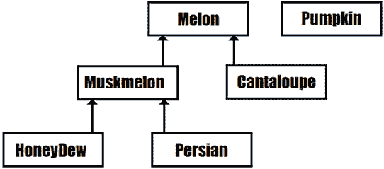
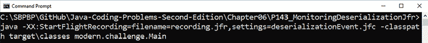
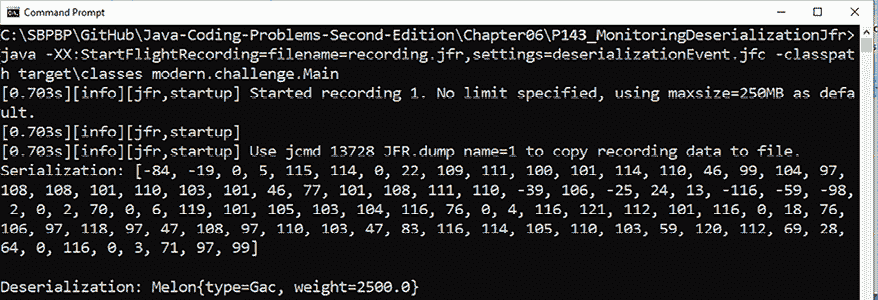
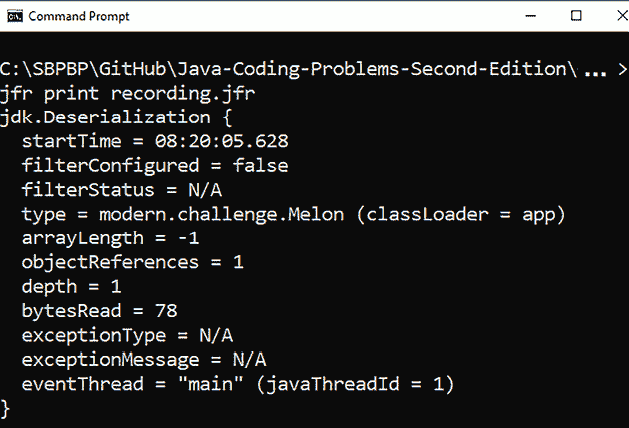

# 6

# Java I/O：上下文特定反序列化过滤器

本章包括与 Java 序列化/反序列化过程相关的 13 个问题。我们首先从经典的将对象序列化/反序列化为 `byte[]`、`String` 和 XML 的问题开始。然后，我们继续介绍旨在防止反序列化漏洞的 JDK 9 反序列化过滤器，最后以 JDK 17（JEP 415，最终版）的上下文特定反序列化过滤器结束。

在本章结束时，你将能够解决与 Java 中序列化/反序列化对象相关的几乎所有问题。

# 问题

使用以下问题来测试你在 Java 序列化/反序列化方面的编程能力。我强烈建议你在查看解决方案并下载示例程序之前，尝试解决每个问题：

1.  **将对象序列化为字节数组**：编写一个 Java 应用程序，该程序公开两个辅助方法，用于将对象序列化/反序列化为 `byte[]`。

1.  **将对象序列化为字符串**：编写一个 Java 应用程序，该程序公开两个辅助方法，用于将对象序列化/反序列化为 `String`。

1.  **将对象序列化为 XML**：举例说明至少两种将对象序列化/反序列化为 XML 格式的方案。

1.  **介绍 JDK 9 反序列化过滤器**：简要介绍 JDK 9 反序列化过滤器，包括对 `ObjectInputFilter` API 的见解。

1.  **实现基于模式的自定义 ObjectInputFilter**：提供一个通过 `ObjectInputFilter` API 实现和设置自定义模式过滤器的示例。

1.  **实现自定义类 ObjectInputFilter**：举例说明通过类实现创建 `ObjectInputFilter`。

1.  **实现自定义方法 ObjectInputFilter**：举例说明通过方法实现创建 `ObjectInputFilter`。

1.  **实现自定义 lambda ObjectInputFilter**：举例说明通过 lambda 表达式创建 `ObjectInputFilter`。

1.  **避免反序列化时的 StackOverflowError**：首先，编写一段可以成功序列化的代码片段，但在反序列化阶段会导致 `StackOverflowError`。其次，编写一个过滤器以避免这种不愉快的场景。

1.  **避免反序列化时的 DoS 攻击**：首先，编写一段可以成功序列化的代码片段，但在反序列化阶段会导致 DoS 攻击。其次，编写一个过滤器以避免这种不愉快的场景。

1.  **介绍 JDK 17 简化过滤器创建**：解释并举例说明使用 JDK 17 的 `allowFilter()` 和 `rejectFilter()` 方法。

1.  **处理上下文特定反序列化过滤器**：解释并举例说明使用 JDK 17 过滤器工厂。

1.  **通过 JFR 监控反序列化**：举例说明使用 **Java Flight Recorder** （**JFR**）监控反序列化事件。

以下几节描述了前面问题的解决方案。记住，通常没有一种唯一正确的方法来解决特定的问题。此外，记住这里显示的解释只包括解决这些问题所需的最有趣和最重要的细节。下载示例解决方案以查看更多细节并实验程序，请访问 [`github.com/PacktPublishing/Java-Coding-Problems-Second-Edition/tree/main/Chapter06`](https://github.com/PacktPublishing/Java-Coding-Problems-Second-Edition/tree/main/Chapter06)。

# 131. 将对象序列化为字节数组

在 *第四章*，*问题 94* 中，我们讨论了 Java 记录的序列化和反序列化，所以你应该对这些操作相当熟悉。简而言之，序列化是将内存中的对象转换成可以存储在内存中或写入文件、网络、数据库、外部存储等字节数流的过程。反序列化是相反的过程，即从给定的字节数流中重新创建对象状态。

一个 Java 对象如果是可序列化的，那么它的类必须实现 `java.io.Serializable` 接口（或者 `java.io.Externalizable` 接口）。完成序列化和反序列化的操作是通过 `java.io.ObjectOutputStream` 和 `java.io.ObjectInputStream` 类以及 `writeObject()`/`readObject()` 方法来实现的。

例如，假设以下 `Melon` 类：

```java
public class Melon implements Serializable {
  private final String type;
  private final float weight;
  // constructor, getters
} 
```

此外，`Melon` 的一个实例：

```java
Melon melon = new Melon("Gac", 2500); 
```

将 `melon` 实例序列化为字节数组可以按照以下方式完成：

```java
public static byte[] objectToBytes(Serializable obj) 
       throws IOException { 

  try (ByteArrayOutputStream baos 
           = new ByteArrayOutputStream();
        ObjectOutputStream ois 
           = new ObjectOutputStream(baos)) {
    ois.writeObject(obj);

    return baos.toByteArray();
  } 
} 
```

当然，我们可以使用这个辅助工具来序列化任何其他对象，但对于 `melon` 实例，我们调用它的方式如下：

```java
byte[] melonSer = Converters.objectToBytes(melon); 
```

反序列化是通过另一个辅助工具完成的，该工具使用 `readObject()` 如下所示：

```java
public static Object bytesToObject(byte[] bytes)
       throws IOException, ClassNotFoundException {
  try ( InputStream is = new ByteArrayInputStream(bytes);
        ObjectInputStream ois = new ObjectInputStream(is)) {
     return ois.readObject();
  }
} 
```

我们可以使用这个辅助工具从字节数组反序列化任何其他对象，但对于 `melonSer`，我们调用它的方式如下：

```java
Melon melonDeser = (Melon) Converters.bytesToObject(melonSer); 
```

返回的 `melonDeser` 即使不是相同的实例，也能恢复初始对象状态。在捆绑的代码中，你还可以看到基于 Apache Commons Lang 的方法。

# 132. 将对象序列化为字符串

在上一个问题中，你看到了如何将对象序列化为字节数组。如果我们稍微处理一下字节数组，我们可以获得序列化的字符串表示。例如，我们可以依赖 `java.util.Base64` 将字节数组编码为 `String`，如下所示：

```java
public static String objectToString(Serializable obj) throws IOException {       

    try ( ByteArrayOutputStream baos = new ByteArrayOutputStream();
          ObjectOutputStream ois = new ObjectOutputStream(baos)) {
        ois.writeObject(obj);

        return Base64.getEncoder().encodeToString(baos.toByteArray());
    }                
} 
```

可能的输出如下所示：

```java
rO0ABXNyABZtb2Rlcm4uY2hhbGxlbmdlLk1lbG9u2WrnGA2MxZ4CAAJGAAZ3ZWlnaHRMAAR0eXBldAAST GphdmEvbGFuZy9TdHJpbmc7eHBFHEAAdAADR2Fj 
```

获取此类字符串的代码如下所示：

```java
String melonSer = Converters.objectToString(melon); 
```

反向过程依赖于 `Base64` 解码器如下所示：

```java
public static Object stringToObject(String obj) 
              throws IOException, ClassNotFoundException {
 byte[] data = Base64.getDecoder().decode(obj);
 try ( ObjectInputStream ois = new ObjectInputStream(
       new ByteArrayInputStream(data))) {
  return ois.readObject();
 }
} 
```

调用此方法很简单：

```java
Melon melonDeser = (Melon)  
      Converters.stringToObject(melonSer); 
```

`melonDeser` 对象是反序列化前一个字符串的结果。

# 133. 将对象序列化为 XML

通过 JDK API 将对象序列化/反序列化为 XML 可以通过 `java.beans.XMLEncoder` 和 `XMLDecoder` 实现。`XMLEncoder` API 依赖于 Java 反射来发现对象的字段并将它们写入 XML 格式。此类可以编码遵守 Java Beans 契约的对象（[`docs.oracle.com/javase/tutorial/javabeans/writing/index.html`](https://docs.oracle.com/javase/tutorial/javabeans/writing/index.html)）。基本上，对象的类应该包含一个公共的无参数构造函数和公共的 `private`/`protected` 字段/属性的获取器和设置器。对于 `XMLEncoder`/`XMLDecoder`，实现 `Serializable` 不是强制性的，因此我们可以序列化/反序列化没有实现 `Serializable` 的对象。这里是一个将给定的 `Object` 编码为 XML 的辅助方法：

```java
public static String objectToXML(Object obj) 
              throws IOException {
 ByteArrayOutputStream baos = new ByteArrayOutputStream();
 try ( XMLEncoder encoder = new XMLEncoder(
                  new BufferedOutputStream(baos))) {
  encoder.writeObject(obj);
 }
 baos.close();
 return new String(baos.toByteArray());
} 
```

反向过程（反序列化）使用 `XMLDecoder` 如下所示：

```java
public static Object XMLToObject(String xml) 
              throws IOException {
 try ( InputStream is 
    = new ByteArrayInputStream(xml.getBytes());  
  XMLDecoder decoder = new XMLDecoder(is)) {
  return decoder.readObject();
 }
} 
```

`XMLEncoder`/`XMLDecoder` 比起 `writeObject()`/`readObject()` API 更灵活。例如，如果一个字段/属性被添加/删除/重命名或其类型已更改，那么解码过程会跳过它无法解码的所有内容，并尽可能多地尝试解码而不抛出异常。

另一种常见的方法依赖于第三方库 Jackson 2.x，该库包含 `XmlMapper`。此库应作为依赖项添加（当然，如果您项目中尚未添加）：

```java
<dependency>
  <groupId>com.fasterxml.jackson.dataformat</groupId>
  <artifactId>jackson-dataformat-xml</artifactId>
  <version>2.x</version>
</dependency> 
```

接下来，我们创建一个 `XmlMapper` 的实例：

```java
XmlMapper xmlMapper = new XmlMapper(); 
```

通过 `XmlMapper`，我们可以将对象序列化为 XML，如下所示（如果对象的类没有实现 `Serializable` 或不包含设置器，则没有问题）：

```java
public static String objectToXMLJackson(Object obj) 
              throws JsonProcessingException {
 XmlMapper xmlMapper = new XmlMapper();
 if (xmlMapper.canSerialize(obj.getClass())) {
  return xmlMapper.writeValueAsString(obj);
 }
 return "";
} 
```

调用此方法可以如下进行（`melon` 是 `Melon` 类的一个实例）：

```java
String melonSer = Converters.objectToXMLJackson(melon); 
```

反向过程可以依赖于 `readValue()` 如下所示：

```java
public static <T> T XMLToObjectJackson(
       String xml, Class<T> clazz)
              throws JsonProcessingException {
 XmlMapper xmlMapper = new XmlMapper();
 return xmlMapper.readValue(xml, clazz);
} 
```

调用此方法可以如下进行：

```java
Melon melonDeser = Converters
  .XMLToObjectJackson(melonSer, Melon.class); 
```

仔细探索 `XmlMapper` API，因为它还有更多功能。现在，考虑运行捆绑的代码，以查看这两种方法各自产生的 XML。

如果您计划将对象序列化/反序列化为 JSON，那么请考虑 *Java 编码问题*，*第一版*，*问题 141*，它提供了一套基于 JSONB、Jackson 和 Gson 的全面示例。

# 134. 介绍 JDK 9 反序列化过滤器

如您在 *第四章*，*问题 94* 中所知，反序列化会暴露于可能导致严重安全问题的漏洞。换句话说，在序列化-反序列化周期之间，一个不受信任的过程（攻击者）可以修改/更改序列化形式以执行任意代码，偷偷植入恶意数据等。

为了防止此类漏洞，JDK 9 引入了通过过滤器创建限制的可能性，这些过滤器旨在根据特定的谓词接受/拒绝反序列化。反序列化过滤器拦截一个期望被反序列化的流，并应用一个或多个谓词，只有成功通过这些谓词才能继续反序列化。如果谓词失败，则反序列化甚至不会开始，流将被拒绝。

有两种类型的过滤器：

+   **JVM 全局过滤器**：应用于 JVM 中发生的每个反序列化的过滤器。这些过滤器的行为与它们如何与其他过滤器（如果有）结合紧密相关。

+   **流过滤器**：操作应用程序中所有 `ObjectInputStream` 实例的过滤器（*流全局过滤器*）或操作某些 `ObjectInputStream` 实例的过滤器（*流特定过滤器*）。

我们可以创建以下类型的过滤器：

+   基于模式的过滤器（称为 *模式过滤器*）：这些过滤器可以通过字符串模式来过滤模块、包或类。它们可以在不接触代码的情况下应用（作为 JVM 全局过滤器）或通过 `ObjectInputFilter` API 创建（作为 *模式流过滤器*）。

+   基于 `ObjectInputFilter` API 的过滤器：此 API 允许我们在代码中直接定义过滤器。通常，此类过滤器基于字符串模式或 Java 反射定义。

## 模式过滤器

让我们看看基于字符串模式的几个过滤器。例如，这个过滤器接受来自 `foo` 包的所有类（以及来自任何其他不是 `buzz` 的包）的所有类，并拒绝来自 `buzz` 包的所有类（一个通过以 `!` 开头的模式的类会被拒绝）：

```java
foo.*;!buzz.* 
```

模式通过分号（`;`）分隔，空白被认为模式的一部分。

以下过滤器仅拒绝 `modern.challenge.Melon` 类：

```java
!modern.challenge.Melon 
```

以下过滤器拒绝 `modern.challenge` 包中的 `Melon` 类，并接受该包中的所有其他类（`*` 是用于表示未指定的类/包/模块名称的通配符）：

```java
!modern.challenge.Melon;modern.challenge.*;!* 
```

以下过滤器接受 `foo` 包及其子包中的所有类（注意 `**` 通配符）：

```java
foo.** 
```

以下过滤器接受所有以 `Hash` 开头的类：

```java
Hash* 
```

除了过滤类、包和模块之外，我们还可以定义所谓的 *资源过滤器*，它允许我们根据对象的图复杂性和大小来接受/拒绝资源。在此上下文中，我们有 `maxdepth`（最大图深度）、`maxarray`（最大数组大小）、`maxrefs`（图中对象之间的最大引用数）和 `maxbytes`（最大流字节数）。以下是一个示例：

```java
maxdepth=5;maxarray=1000;maxrefs=50 foo.buzz.App 
```

现在，让我们看看我们如何使用这样的过滤器。

### 为每个应用程序应用基于模式的过滤器

如果我们想对一个应用程序的单次运行应用基于模式的过滤器，那么我们可以依赖`jdk.serialFilter`系统属性。在不接触代码的情况下，我们可以在命令行中使用这个系统属性，如下面的示例所示：

```java
java -Djdk.serialFilter=foo.**;Hash* foo.buzz.App 
```

系统属性替换安全属性值。

### 将基于模式的过滤器应用于进程中的所有应用程序

要将基于模式的过滤器应用于进程中的所有应用程序，我们应该遵循两个步骤（再次强调，我们不接触应用程序代码）：

1.  在编辑器（例如，记事本或写字板）中打开`java.security`文件。在 JDK 6-8 中，此文件位于`$JAVA_HOME/lib/security/java.security`，而在 JDK 9+中，它位于`$JAVA_HOME/conf/security/java.security`。

1.  通过将模式追加到`jdk.serialFilter`安全属性来编辑此文件。

完成！

## 基于 ObjectInputFilter 的过滤器

通过`ObjectInputFilter` API，我们可以根据字符串模式和 Java 反射创建自定义过滤器。这些过滤器可以应用于某些流（*流特定过滤器*）或所有流（*流全局过滤器*），并且可以作为基于模式的过滤器、类、方法或 lambda 表达式实现。

首先，我们通过`ObjectInputFilter` API 实现过滤器。其次，我们在所有/某些`ObjectInputStream`实例上设置过滤器。将过滤器作为*流全局过滤器*设置是通过`ObjectInputFilter.Config.setSerialFilter(ObjectInputFilter filter)`完成的。另一方面，将过滤器作为*流特定过滤器*可以通过`ObjectInputStream.setObjectInputFilter(ObjectInputFilter filter)`完成。

例如，通过此 API 创建一个基于模式的过滤器可以通过调用`Config.createFilter(String pattern)`方法实现。

将过滤器定义为类的自定义过滤器是通过实现`ObjectInputFilter`功能接口并重写`Status checkInput(FilterInfo filterInfo)`方法来完成的。

将过滤器定义为方法的自定义过滤器通常通过静态方法`static ObjectInputFilter.Status someFilter(FilterInfo info) {…}`来实现。

此外，将过滤器定义为 lambda 表达式通常表示为`ois.setObjectInputFilter(f -> (…))`，其中`f`是`ObjectInputFilter`，`ois`是`ObjectInputStream`的一个实例。

过滤器返回一个*状态*（`java.io.ObjectInputFilter.Status`），可以是`ALLOWED`、`REJECTED`或`UNDECIDED`。

在接下来的问题中，我们将通过示例来探索这些语句。

# 135. 实现自定义的基于模式的 ObjectInputFilter

假设我们已经有`Melon`类和从*问题 131*中序列化/反序列化对象到/从字节数组的辅助方法。

通过`ObjectInputFilter` API 创建一个基于模式的过滤器可以通过调用`Config.createFilter(String pattern)`方法实现。例如，以下过滤器拒绝`modern.challenge.Melon`类：

```java
ObjectInputFilter melonFilter = ObjectInputFilter.Config
  .createFilter("!modern.challenge.Melon;"); 
```

我们可以通过`setSerialFilter()`将其作为*流全局过滤器*设置，如下所示：

```java
ObjectInputFilter.Config.setSerialFilter(melonFilter); 
```

如果我们需要获取对 *流全局过滤器* 的访问权限，那么我们可以调用 `getSerialFilter()`：

```java
ObjectInputFilter serialFilter = 
  ObjectInputFilter.Config.getSerialFilter(); 
```

在这个应用程序中的任何流反序列化都将通过此过滤器，该过滤器将拒绝 `modern.challenge.Melon` 的任何实例。你可以在捆绑的代码中练习这个过滤器。

另一方面，如果我们想在一个特定流上设置它，那么我们可以修改我们的 `Converters.bytesToObject()` 方法以接受一个过滤器如下所示：

```java
public static Object bytesToObject(byte[] bytes, 
              ObjectInputFilter filter)
                throws IOException, ClassNotFoundException {
 try ( InputStream is = new ByteArrayInputStream(bytes);
       ObjectInputStream ois = new ObjectInputStream(is)) {
  // set the filter            
  ois.setObjectInputFilter(filter);
  return ois.readObject();
  }
} 
```

如果我们传递 `null` 作为 `filter`，则不会应用过滤器。否则，传递的过滤器将应用于当前流：

```java
Melon melon = new Melon("Gac", 2500);
// serialization works as usual
byte[] melonSer = Converters.objectToBytes(melon);
// here, we pass the melonFilter, which rejects the instances 
// of modern.challenge.Melon, so deserialization is rejected
Melon melonDeser = (Melon) Converters.bytesToObject(
      melonSer, melonFilter); 
```

在这个例子中，`melonFilter` 将拒绝反序列化，输出如下所示：

```java
Exception in thread "main" java.io.InvalidClassException: filter status: REJECTED
… 
```

你也可以在捆绑的代码中练习这个过滤器。

# 136. 实现自定义类 ObjectInputFilter

假设我们已经有 `Melon` 类以及从 *问题 131* 中序列化和反序列化对象到/从字节数组的辅助方法。

可以通过实现 `ObjectInputFilter` 功能接口并通过以下示例中的专用类编写 `ObjectInputFilter`：

```java
public final class MelonFilter implements ObjectInputFilter {
 @Override
 public Status checkInput(FilterInfo filterInfo) {
 Class<?> clazz = filterInfo.serialClass();
 if (clazz != null) {
  // or, clazz.getName().equals("modern.challenge.Melon")
  return 
   !(clazz.getPackage().getName().equals("modern.challenge")
     && clazz.getSimpleName().equals("Melon"))
     ? Status.ALLOWED : Status.REJECTED;
 }
 return Status.UNDECIDED;
 }
} 
```

此过滤器与基于模式的过滤器 `!modern.challenge.Melon` 完全相同，只是它通过 Java 反射表达。

我们可以这样设置这个过滤器作为 *流全局过滤器*：

```java
ObjectInputFilter.Config.setSerialFilter(new MelonFilter()); 
```

或者，作为一个 *流特定过滤器* 如下所示：

```java
Melon melonDeser = (Melon) Converters.bytesToObject(
  melonSer, new MelonFilter()); 
```

当然，`bytesToObject()` 接受类型为 `ObjectInputFilter` 的参数，并相应地设置此过滤器（`ois` 是特定的 `ObjectInputStream`）：

```java
ois.setObjectInputFilter(filter); 
```

在这个例子中，`MelonFilter` 将拒绝反序列化，输出如下所示：

```java
Exception in thread "main" java.io.InvalidClassException: filter status: REJECTED
… 
```

你可以在捆绑的代码中练习这两种方法（*流全局* 和 *流特定*）。

# 137. 实现自定义方法 ObjectInputFilter

假设我们已经有 `Melon` 类以及从 *问题 131* 中序列化和反序列化对象到/从字节数组的辅助方法。

可以通过以下示例中的专用方法编写 `ObjectInputFilter`：

```java
public final class Filters {
 private Filters() {
  throw new AssertionError("Cannot be instantiated");
 }
 public static ObjectInputFilter.Status melonFilter(
               FilterInfo info) {
  Class<?> clazz = info.serialClass();
  if (clazz != null) {
   // or, clazz.getName().equals("modern.challenge.Melon")
   return 
    !(clazz.getPackage().getName().equals("modern.challenge")
      && clazz.getSimpleName().equals("Melon"))
      ? Status.ALLOWED :Status.REJECTED;
  }
  return Status.UNDECIDED;
 }
} 
```

当然，你可以在这个类中添加更多过滤器。

我们可以这样设置这个过滤器作为 *流全局过滤器*：

```java
ObjectInputFilter.Config
                 .setSerialFilter(Filters::melonFilter); 
```

或者，作为一个 *流特定过滤器* 如下所示：

```java
Melon melonDeser = (Melon) Converters.bytesToObject(
  melonSer, Filters::melonFilter); 
```

当然，`bytesToObject()` 接受类型为 `ObjectInputFilter` 的参数，并相应地设置此过滤器（`ois` 是特定的 `ObjectInputStream`）：

```java
ois.setObjectInputFilter(filter); 
```

在这个例子中，`Filters::melonFilter` 将拒绝反序列化，输出如下所示：

```java
Exception in thread "main" java.io.InvalidClassException: filter status: REJECTED
… 
```

你可以在捆绑的代码中检查这两种方法（*流全局* 和 *流特定*）。此外，你还可以练习另一个基于 *流全局过滤器* 拒绝 `Melon` 及其所有子类的示例。

# 138. 实现自定义 lambda ObjectInputFilter

假设我们已经有 `Melon` 类以及从 *问题 131* 中序列化和反序列化对象到/从字节数组的辅助方法。

可以通过一个专门的 lambda 表达式编写 `ObjectInputFilter` 并将其设置为如下所示的 *流全局过滤器*：

```java
ObjectInputFilter.Config
  .setSerialFilter(f -> ((f.serialClass() != null)
  // or, filter.serialClass().getName().equals(
  //     "modern.challenge.Melon")
  && f.serialClass().getPackage()
                   .getName().equals("modern.challenge")
  && f.serialClass().getSimpleName().equals("Melon"))
  ? Status.REJECTED : Status.UNDECIDED); 
```

或者，作为一个 *流特定过滤器* 如下所示：

```java
Melon melonDeser = (Melon) Converters.bytesToObject(melonSer, 
  f -> ((f.serialClass() != null)
   // or, filter.serialClass().getName().equals(
   //       "modern.challenge.Melon")
  && f.serialClass().getPackage()
                   .getName().equals("modern.challenge")
  && f.serialClass().getSimpleName().equals("Melon"))
  ? Status.REJECTED : Status.UNDECIDED); 
```

你可以在捆绑的代码中练习这些示例。

# 139. 避免反序列化时的 StackOverflowError

```java
 of code:
```

```java
// 'mapOfSets' is the object to serialize/deserialize
HashMap<Set, Integer> mapOfSets = new HashMap<>();
Set<Set> set = new HashSet<>();
mapOfSets.put(set, 1);
set.add(set); 
```

我们计划如下序列化 `mapOfSets` 对象（我假设 `Converters.objectToBytes()` 在之前的问题中是已知的）：

```java
byte[] mapSer = Converters.objectToBytes(mapOfSets); 
```

一切工作正常，直到我们尝试反序列化 `mapSer`。在那个时刻，，我们不会得到一个有效的对象，而是一个 `StackOverflowError`，如下所示：

```java
Exception in thread "main" java.lang.StackOverflowError
  at java.base/java.util.HashMap$KeyIterator
    .<init>(HashMap.java:1626)
  at java.base/java.util.HashMap$KeySet
    .iterator(HashMap.java:991)
  at java.base/java.util.HashSet
    .iterator(HashSet.java:182)
  at java.base/java.util.AbstractSet
    .hashCode(AbstractSet.java:120)
  at java.base/java.util.AbstractSet
    .hashCode(AbstractSet.java:124)
  ... 
```

反序列化过程卡在了 `Set` 的 `hashCode()` 方法上。解决方案是创建一个过滤器，如果对象图深度大于 2，则拒绝反序列化。这可以是一个如下所示的基于模式的过滤器：

```java
ObjectInputFilter filter = ObjectInputFilter.Config
  .createFilter("maxdepth=2;java.base/*;!*"); 
```

接下来，使用此过滤器调用反序列化过程：

```java
HashMap mapDeser = (HashMap) Converters
  .bytesToObject(mapSer, filter); 
```

我假设 `Converters.bytesToObject()` 在之前的问题中是已知的。这次，反序列化被过滤器拒绝，而不是得到 `StackOverflowError`。

# 140. 避免反序列化时的 DoS 攻击

**拒绝服务**（**DoS**）攻击通常是恶意行为，旨在短时间内触发对服务器、应用程序等的大量请求。一般来说，DoS 攻击是任何故意或意外地使进程过载并迫使它减速或甚至崩溃的行为。让我们看看一个代码片段，它是一个在反序列化阶段表示 DoS 攻击的好候选：

```java
ArrayList<Object> startList = new ArrayList<>();
List<Object> list1 = startList;
List<Object> list2 = new ArrayList<>();
for (int i = 0; i < 101; i++) {
  List<Object> sublist1 = new ArrayList<>();
  List<Object> sublist2 = new ArrayList<>();
  sublist1.add("value: " + i);
  list1.add(sublist1);
  list1.add(sublist2);
  list2.add(sublist1);
  list2.add(sublist2);
  list1 = sublist1;
  list2 = sublist2;
} 
```

我们计划如下序列化 `startList` 对象（我假设 `Converters.objectToBytes()` 在之前的问题中是已知的）：

```java
byte[] startListSer = Converters.objectToBytes(startList); 
```

一切工作正常，直到我们尝试反序列化 `startListSer`。在那个时刻，我们不会得到一个有效的对象，而是一无所获！实际上，应用程序会正常启动，但它只是在反序列化阶段挂起。系统变慢，过一段时间后，它最终会崩溃。

对象图太深，无法反序列化，这会导致类似拒绝服务（DoS）攻击的行为。解决方案是创建一个过滤器，如果对象图深度大于一个安全值，则拒绝反序列化。这可以是一个如下所示的基于模式的过滤器：

```java
ObjectInputFilter filter = ObjectInputFilter.Config
  .createFilter("maxdepth=10;java.base/*;!*"); 
```

接下来，使用此过滤器调用反序列化过程：

```java
ArrayList startListDeser = (ArrayList) 
  Converters.bytesToObject(startListSer, filter); 
```

我假设 `Converters.bytesToObject()` 在之前的问题中是已知的。这次，反序列化被过滤器拒绝，从而防止了 DoS 攻击。

# 141. 引入 JDK 17 简易过滤器创建

从 JDK 17 开始，我们可以通过两个名为 `allowFilter()` 和 `rejectFilter()` 的方便方法更直观、更易读地表达过滤器。而且，最好的学习方法是通过例子，以下是对这两个方便方法的用法示例：

```java
public final class Filters {
 private Filters() {
  throw new AssertionError("Cannot be instantiated");
 }
 public static ObjectInputFilter allowMelonFilter() {
  ObjectInputFilter filter = ObjectInputFilter.allowFilter( 
   clazz -> Melon.class.isAssignableFrom(clazz),
           ObjectInputFilter.Status.REJECTED);
   return filter;
 }
 public static ObjectInputFilter rejectMuskmelonFilter() {
  ObjectInputFilter filter = ObjectInputFilter.rejectFilter( 
   clazz -> Muskmelon.class.isAssignableFrom(clazz),
           ObjectInputFilter.Status.UNDECIDED);
   return filter;
  }
} 
```

`allowMelonFilter()` 方法依赖于 `ObjectInputFilter.allowFilter()` 来允许只有 `Melon` 或其子类的实例对象。`rejectMuskmelonFilter()` 方法依赖于 `ObjectInputFilter.rejectFilter()` 来拒绝所有 `Muskmelon` 或其子类的实例对象。

我们可以使用这些过滤器，就像你从上一个问题中已经知道的那样，所以让我们解决另一个用例。假设我们有以下类的层次结构：



图 6.1：类的任意层次结构

假设我们只想反序列化`Melon`或`Melon`的子类的实例，但它们不是`Muskmelon`或`Muskmelon`的子类。换句话说，我们允许反序列化`Melon`和`Cantaloupe`的实例。

如果我们应用`allowMelonFilter()`，那么我们将反序列化`Melon`、`Muskmelon`、`Cantaloupe`、`HoneyDew`和`Persian`的实例，因为这些全部都是`Melon`。

另一方面，如果我们应用`rejectMuskmelonFilter()`，那么我们将反序列化`Melon`、`Cantaloupe`和`Pumpkin`的实例，因为这些不是`Muskmelon`。

但是，如果我们先应用`rejectMuskmelonFilter()`，然后再应用`allowMelonFilter()`，那么我们只会反序列化`Melon`和`Cantaloupe`，这正是我们想要的。

直观地，我们可能会认为通过编写类似以下内容来链式连接我们的过滤器（`ois`是当前的`ObjectInputStream`）：

```java
ois.setObjectInputFilter(Filters.allowMelonFilter());
ois.setObjectInputFilter(Filters.rejectMuskmelonFilter()); 
```

但这不会起作用！它将导致`java.lang.IllegalStateException`：*过滤器不能设置超过一次*。

该解决方案依赖于`ObjectInputFilter.merge(filter, anotherFilter)`，它返回一个通过应用以下逻辑合并这两个过滤器状态的过滤器：

1.  调用`filter`并获取返回的`status`

1.  如果返回的`status`是`REJECTED`，则返回它

1.  调用`anotherFilter`并获取返回的`otherStatus`

1.  如果`anotherStatus`是`REJECTED`，则返回它

1.  如果`status`或`otherStatus`是`ALLOWED`，则返回`ALLOWED`

1.  否则，返回`UNDECIDED`

然而，如果`anotherFilter`是`null`，则返回过滤器。

根据这个逻辑，我们可以将`Filters.allowMelonFilter()`的状态与`Filters.rejectMuskmelonFilter()`的状态合并如下：

```java
public static Object bytesToObject(byte[] bytes, 
       ObjectInputFilter allowFilter, 
       ObjectInputFilter rejectFilter)
       throws IOException, ClassNotFoundException {
 try ( InputStream is = new ByteArrayInputStream(bytes);  
       ObjectInputStream ois = new ObjectInputStream(is)) {
  // set the filters
  ObjectInputFilter filters = ObjectInputFilter.merge(
    allowFilter, rejectFilter);
  ois.setObjectInputFilter(filters);
  return ois.readObject();
 }
} 
```

接下来，让我们谈谈 JDK 17 的过滤器工厂。

# 142. 解决特定上下文反序列化过滤器

JDK 17 通过实现 JEP 415，即*上下文特定反序列化过滤器*，丰富了反序列化过滤器的功能。

实际上，JDK 17 添加了所谓的过滤器工厂。根据上下文，过滤器工厂可以动态决定为流使用哪些过滤器。

## 为每个应用程序应用过滤器工厂

如果我们想要将过滤器工厂应用于应用程序的单次运行，则可以依赖`jdk.serialFilterFactory`系统属性。在不接触代码的情况下，我们可以在命令行中使用此系统属性，如下例所示：

```java
java -Djdk.serialFilterFactory=FilterFactoryName YourApp 
```

`FilterFactoryName`是过滤器工厂的完全限定名，它是一个可以被应用程序类加载器访问的公共类，它是在第一次反序列化之前设置的。

## 将过滤器工厂应用于进程中的所有应用程序

要将 Filter Factory 应用到进程中的所有应用程序，我们应该遵循两个步骤（再次，我们不修改应用程序代码）：

1.  在一个编辑器中（例如，记事本或写字板），打开 `java.security` 文件。在 JDK 6-8 中，此文件位于 `$JAVA_HOME/lib/security/java.security`，而在 JDK 9+ 中，它位于 `$JAVA_HOME/conf/security/java.security`。

1.  通过将 Filter Factory 添加到 `jdk.serialFilterFactory` 安全属性来编辑此文件。

## 通过 ObjectInputFilter.Config 应用 Filter Factory

或者，可以通过 `ObjectInputFilter.Config` 直接在代码中设置 Filter Factory，如下所示：

```java
ObjectInputFilter.Config
  .setSerialFilterFactory(FilterFactoryInstance); 
```

`FilterFactoryInstance` 参数是一个 Filter Factory 的实例。这个 Filter Factory 将应用于当前应用程序的所有流。

## 实现 Filter Factory

Filter Factory 被实现为一个 `BinaryOperator<ObjectInputFilter>`。`apply(ObjectInputFilter current, ObjectInputFilter next)` 方法提供了 *当前过滤器* 和 *下一个* 或 *请求过滤器*。

为了了解它是如何工作的，让我们假设我们有以下三个过滤器：

```java
public final class Filters {
 private Filters() {
  throw new AssertionError("Cannot be instantiated");
 }
 public static ObjectInputFilter allowMelonFilter() {
  ObjectInputFilter filter = ObjectInputFilter.allowFilter( 
   clazz -> Melon.class.isAssignableFrom(clazz),
           ObjectInputFilter.Status.REJECTED);
   return filter;
  }
  public static ObjectInputFilter rejectMuskmelonFilter() {
   ObjectInputFilter filter = ObjectInputFilter.rejectFilter( 
   clazz -> Muskmelon.class.isAssignableFrom(clazz),
           ObjectInputFilter.Status.UNDECIDED);
   return filter;
  }
  public static ObjectInputFilter packageFilter() {
   return ObjectInputFilter.Config.createFilter(
          "modern.challenge.*;!*");
  }
} 
```

`Filters.allowMelonFilter()` 被设置为如下所示的 *流全局过滤器*：

```java
ObjectInputFilter.Config.setSerialFilter(
  Filters.allowMelonFilter()); 
```

`Filters.rejectMuskmelonFilter()` 被设置为如下所示的 *流特定过滤器*：

```java
Melon melon = new Melon("Melon", 2400);
// serialization
byte[] melonSer = Converters.objectToBytes(melon);
// deserialization
Melon melonDeser = (Melon) Converters.bytesToObject(
  melonSer, Filters.rejectMuskmelonFilter()); 
```

此外，`Filters.packageFilter()` 在 Filter Factory 中设置为如下所示：

```java
public class MelonFilterFactory implements
       BinaryOperator<ObjectInputFilter> {
 @Override
 public ObjectInputFilter apply(
        ObjectInputFilter current, ObjectInputFilter next) {
  System.out.println();
  System.out.println("Current filter: " + current);
  System.out.println("Requested filter: " + next);
  if (current == null && next != null) { 
   return ObjectInputFilter.merge(
          next, Filters.packageFilter());
  }
  return ObjectInputFilter.merge(next, current);
 }
} 
```

`MelonFilterFactory` 通过 `ObjectInputFilter.Config` 在任何反序列化之前设置：

```java
MelonFilterFactory filterFactory = new MelonFilterFactory();
ObjectInputFilter.Config
                 .setSerialFilterFactory(filterFactory); 
```

现在一切准备就绪，让我们看看发生了什么。`apply()` 方法被调用了两次。第一次调用是在创建 `ObjectInputStream ois` 时，我们得到了以下输出：

```java
Current filter: null
Requested filter: 
predicate(modern.challenge.Filters$$Lambda$4/0x000000080
1001800@ba8a1dc, ifTrue: ALLOWED,ifFalse: REJECTED) 
```

*当前过滤器* 是 `null`，而 *请求过滤器* 是 `Filters.allowMelonFilter()`。由于 *当前过滤器* 是 `null` 且 *请求过滤器* 不是 `null`，我们决定返回一个过滤器作为合并 *请求过滤器* 状态和 `Filters.packageFilter()` 状态的结果。

第二次调用 `apply()` 方法发生在 `Converters.bytesToObject(byte[] bytes, ObjectInputFilter filter)` 中的 `ois.setObjectInputFilter(filter)` 调用。我们有以下输出：

```java
Current filter: merge(predicate(modern.challenge.Filters$$Lambda$4/0x0000000801001800@ba8a1dc, ifTrue: ALLOWED, ifFalse:REJECTED), modern.challenge.*;!*)
Requested filter: predicate(modern.challenge.Filters$$Lambda$10/0x0000000801002a10@484b61fc, ifTrue: REJECTED, ifFalse:UNDECIDED) 
```

这次，*当前* 和 *请求* 的过滤器都不是 `null`，所以我们再次合并它们的状态。最终，所有过滤器都成功通过，反序列化发生。

# 143. 通过 JFR 监控反序列化

**Java 飞行记录器** (**JFR**) 是一个基于事件的工具，用于诊断和剖析 Java 应用程序。这个工具最初在 JDK 7 中添加，从那时起，它一直在不断改进。例如，在 JDK 14 中，JFR 通过事件流得到了丰富，在 JDK 19 中，通过过滤事件能力，等等。您可以在每个 JDK 版本中找到并记录所有 JFR 事件，请参阅 [`sap.github.io/SapMachine/jfrevents/`](https://sap.github.io/SapMachine/jfrevents/)。

在其丰富的事件列表中，JFR 可以监控和记录反序列化事件（反序列化事件）。让我们假设一个简单的应用程序，如*问题 131*（本章的第一个问题）。我们开始配置 JFR 以监控此应用程序的反序列化，通过将`deserializationEvent.jfc`添加到应用程序的根目录：

```java
<?xml version="1.0" encoding="UTF-8"?>
<configuration version="2.0" description="test">
  <event name="jdk.Deserialization">
    <setting name="enabled">true</setting>
    <setting name="stackTrace">false</setting>
  </event>
</configuration> 
```

实际上，此文件指示 JFR 监控和记录反序列化事件。

接下来，我们使用`-XX:StartFlightRecording=filename=recording.jfr`来指示 JFR 将输出记录到名为`recording.jfr`的文件中，然后我们继续使用`settings=deserializationEvent.jfc`来指出之前列出的配置文件。

因此，最终的命令是图中所示的那个：



图 6.2：运行 JFR

执行此命令后，您将看到如图 6.3 所示的输出：



图 6.3：我们应用程序的输出

JFR 生成了一个名为`recording.jfr`的文件。我们可以轻松地通过 JFR CLI 查看此文件的内容。命令（`jfr print recording.jfr`）和输出如图 6.4 所示：



图 6.4：包含反序列化信息的 JFR 输出

由于我们的应用程序只执行了一个`Melon`对象的序列化/反序列化周期，JFR 产生了一个单独的反序列化事件。您可以通过`type`字段看到对象的类型（在这里，`Melon`）。由于`Melon`实例不是数组，`arrayLength`被设置为`-1`，这意味着数组不适用。`objectReferences`代表流中的第一个对象引用（因此，`1`），而`bytesRead`代表从该流中读取的字节数（在这种情况下，`78`字节）。我们还看到没有过滤器存在，`filterConfigured = false`，`filterStatus = N/A`（不适用）。此外，`exceptionType`和`exceptionMessage`都是`N/A`。它们不适用，因为没有过滤器存在。它们对于捕获由潜在过滤器引起的任何异常是有用的。

除了 JFR CLI 之外，您还可以使用更强大的工具来消费反序列化事件，例如 JDK Mission Control ([`www.oracle.com/java/technologies/jdk-mission-control.html`](https://www.oracle.com/java/technologies/jdk-mission-control.html)) 和知名的 Advanced Management Console ([`www.oracle.com/java/technologies/advancedmanagementconsole.html`](https://www.oracle.com/java/technologies/advancedmanagementconsole.html))。

# 摘要

在本章中，我们介绍了一系列专门用于处理 Java 序列化/反序列化过程的问题。我们首先从经典问题开始，然后继续介绍在 JDK 9 反序列化过滤器的基础上通过 JDK 17 上下文特定反序列化过滤器。

# 加入我们的 Discord 社区

加入我们社区的 Discord 空间，与作者和其他读者进行讨论：

[`discord.gg/8mgytp5DGQ`](https://discord.gg/8mgytp5DGQ)


