# 外部（函数）内存 API

本章包括涵盖外部内存 API 和外部链接器 API 的 28 个问题。我们将从依赖于 JNI API 和开源 JNA/JNR 库调用外国函数的经典方法开始。接下来，我们将介绍名为 Project Panama 的新方法（在 JDK 21 中的第三次审查和 JDK 22 中的最终发布作为 JEP 454）。我们将分析最相关的 API，如`Arena`、`MemorySegment`、`MemoryLayout`等。最后，我们将关注外部链接器 API 和 Jextract 工具，用于调用具有不同类型签名的国外函数，包括回调函数。

到本章结束时，你将能够熟练地使用 JNI、JNA、JNR，当然还有 Project Panama，并且能够自信地回答任何与这个主题相关的问题。

# 问题

使用以下问题来测试你在操作堆外内存和从 Java 调用原生外国函数方面的编程能力。我强烈建议你在查看解决方案并下载示例程序之前，尝试解决每个问题：

1.  **介绍 Java Native Interface (JNI)**：编写一个 Java 应用程序，通过 JNI API 调用 C/C++原生外国函数（例如，在 C 中实现以下签名的函数：`long sumTwoInt(int x, int y)`）。

1.  **介绍 Java Native Access (JNA)**：编写一个 Java 应用程序，通过 JNA API 调用 C/C++原生外国函数。

1.  **介绍 Java Native Runtime (JNR)**：编写一个 Java 应用程序，通过 JNR API 调用 C/C++原生外国函数。

1.  **激励并介绍 Project Panama**：从操作堆外内存和外国函数的经典方法到新的 Project Panama 提供一个理论上有意义的过渡。

1.  **介绍 Panama 的架构和术语**：简要描述 Project Panama，包括架构、术语和主要 API 组件。

1.  **介绍 Arena 和 MemorySegment**：通过代码片段解释并举例说明`Arena`和`MemorySegment` API。

1.  **将数组分配到内存段中**：编写几种将数组分配到内存段中的方法（通过`Arena`和`MemorySegment`）。

1.  **理解地址（指针）**：举例说明在 Java 中使用内存地址（指针）（`ValueLayout.ADDRESS`）的用法。

1.  **介绍序列布局**：解释并举例说明序列布局的用法。此外，介绍`PathElement`和`VarHandle` API。

1.  **将 C-like 结构体塑造成内存段**：举例说明通过 Java 内存布局（`StructLayout`）塑造 C-like 结构体的方法。

1.  **将 C-like 联合体塑造成内存段**：举例说明通过 Java 内存布局（`UnionLayout`）塑造 C-like 联合体的方法。

1.  **介绍 PaddingLayout**：详细解释并给出有意义的示例，解释填充布局（介绍 *size*、*alignment*、*stride*、*padding* 和 *order* 的字节）。

1.  **复制和切片内存段**：举例说明复制和切片内存段部分的不同方法，包括 `asOverlappingSlice()` 和 `segmentOffset()`。

1.  **处理切片分配器**：举例说明切片分配器 (`SegmentAllocator`) 的使用。

1.  **介绍切片句柄**：解释并举例说明 `sliceHandle()` 的使用。

1.  **介绍布局扁平化**：考虑一个分层内存布局（例如，两个嵌套序列布局）。解释并举例说明如何扁平化此模型。

1.  **介绍布局重塑**：提供一个示例，展示如何重塑分层序列布局。

1.  **介绍布局展开器**：简要解释并给出使用布局展开器 (`asSpreader()`) 的简单示例。

1.  **介绍内存段视图 VarHandle**：举例说明如何使用 `MethodHandles.memorySegmentViewVarHandle(ValueLayout layout)` 创建一个可以用于访问内存段的 `VarHandle`。

1.  **流式处理内存段**：编写几个代码片段，展示如何将内存段与 Java Stream API 结合使用。

1.  **处理映射内存段**：简要介绍映射内存段，并在 Java 代码中举例说明。

1.  **介绍 Foreign Linker API**：简要描述 Foreign Linker API，包括 `Linker`、`SymbolLookup`、*downcall* 和 *upcall*。

1.  **调用 sumTwoInt() 外部函数**：编写一个 Java 应用程序，通过 Foreign Linker API 调用 `sumTwoInt()` 方法（在 *问题 144* 中实现的 `long sumTwoInt(int x, int y)`）。

1.  **调用 modf() 外部函数**：使用 Foreign Linker API 调用 `modf()` 外部函数——此函数是 C 标准库的一部分。

1.  **调用 strcat() 外部函数**：使用 Foreign Linker API 调用 `strcat()` 外部函数——此函数是 C 标准库的一部分。

1.  **调用 bsearch() 外部函数**：使用 Foreign Linker API 调用 `bsearch()` 外部函数——此函数是 C 标准库的一部分。

1.  **介绍 Jextract**：简要描述 Jextract 工具，包括主要选项。

1.  **为 modf() 生成原生绑定**：举例说明如何结合 Jextract 和 Foreign Linker API 来调用 `modf()` 外部函数。

以下几节描述了解决上述问题的方法。请记住，通常没有一种正确的方法来解决特定的问题。此外，请记住，这里所示的解释仅包括解决这些问题所需的最有趣和最重要的细节。下载示例解决方案以查看更多细节并实验程序，请访问 [`github.com/PacktPublishing/Java-Coding-Problems-Second-Edition/tree/main/Chapter07`](https://github.com/PacktPublishing/Java-Coding-Problems-Second-Edition/tree/main/Chapter07)。

# 144. 介绍 Java 本地接口 (JNI)

**Java 本地接口**（**JNI**）是第一个旨在作为 JVM 字节码和用另一种编程语言（通常是 C/C++）编写的本地代码之间的桥梁的 Java API。

假设我们计划在 Windows 10，64 位机器上通过 JNI 调用一个 C 函数。

例如，让我们考虑我们有一个名为 `sumTwoInt(int x, int y)` 的 C 函数，用于计算两个整数的和。这个函数定义在一个名为 `math.dll` 的 C 共享库中。从 Java（一般来说，由本地共享库实现的函数）调用此类函数，首先需要通过 `System.loadLibrary(String library)` 加载适当的共享本地库。接下来，我们通过 `native` 关键字在 Java 中声明 C 函数。最后，我们用以下代码调用它：

```java
package modern.challenge;
public class Main {
  static { 
    System.loadLibrary("math");
  }
  private native long sumTwoInt(int x, int y);
  public static void main(String[] args) {
    long result = new Main().sumTwoInt(3, 9);
    System.out.println("Result: " + result);
  } 
} 
```

接下来，我们关注 C 实现。我们需要头文件（`.h` 文件）和实现此方法的源文件（`.cpp` 文件）。

## 生成头文件 (.h)

通过在 `Main.java` 源文件上运行 `javac` 命令并使用 `–h` 选项（在 JDK 9 之前使用 `javah`），我们可以获得头文件（方法的定义）：

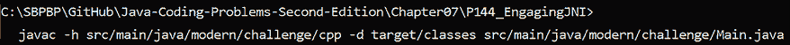

图 7.1：运行 javac –h 编译源代码并生成 .h 文件

或者，作为纯文本：

```java
C:\SBPBP\GitHub\Java-Coding-Problems-Second-Edition\Chapter07\P144_EngagingJNI>
  javac –h src/main/java/modern/challenge/cpp –d target/classes src/main/java/modern/challenge/Main.java 
```

此命令编译我们的代码（`Main.java`），并将生成的类放置在 `target/classes` 文件夹中。此外，此命令在 `jni/cpp` 中生成 C 头文件 `modern_challenge_Main.h`。此文件的重要代码如下：

```java
/*
 * Class:     modern_challenge_Main
 * Method:    sumTwoInt
 * Signature: (II)J
 */
JNIEXPORT jlong JNICALL Java_modern_challenge_Main_sumTwoInt
  (JNIEnv *, jobject, jint, jint); 
```

函数名称被生成为 `Java_modern_challenge_Main_sumTwoInt`。此外，我们还有以下工件：

+   `JNIEXPORT` – 函数被标记为可导出

+   `JNICALL` – 维持 `JNIEXPORT` 以确保函数可以通过 JNI 被找到

+   `JNIEnv` – 表示指向 JNI 环境的指针，用于访问 JNI 函数

+   `jobject` – 表示对 Java 对象的引用

## 实现 modern_challenge_Main.cpp

接下来，我们在 `src/main/java/modern/challenge/cpp` 中提供 C 实现如下：

```java
#include <iostream>
#include "modern_challenge_Main.h"
JNIEXPORT jlong JNICALL Java_modern_challenge_Main_sumTwoInt
  (JNIEnv* env, jobject thisObject, jint x, jint y) {
    std::cout << "C++: The received arguments are : " 
      << x << " and " << y << std::endl;
  return (long)x + (long)y;
} 
x + y as a long result.
```

## 编译 C 源代码

到目前为止，我们有 C 源代码（`.cpp` 文件）和生成的头文件（`.h` 文件）。接下来，我们必须编译 C 源代码，为此我们需要一个 C 编译器。有许多选项，如 Cygwin、MinGW 等。

我们决定为 64 位平台安装 MinGW ([`sourceforge.net/projects/mingw-w64/`](https://sourceforge.net/projects/mingw-w64/)) 并使用 G++编译器。

我们手头有 G++，必须触发一个特定的命令来编译 C 代码，如下面的图所示：

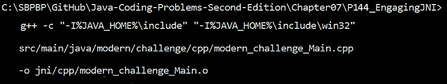

图 7.2：编译 C 源代码

或者，以纯文本形式：

```java
C:\SBPBP\GitHub\Java-Coding-Problems-Second-Edition\Chapter07\P144_EngagingJNI>
  g++ -c "-I%JAVA_HOME%\include" "-I%JAVA_HOME%\include\win32" 
  src/main/java/modern/challenge/cpp/modern_challenge_Main.cpp  
  –o jni/cpp/modern_challenge_Main.o 
```

接下来，我们必须将所有内容打包到`math.dll`中。

## 生成本地共享库

是时候创建本地共享库了，`math.dll`。为此，我们再次使用 G++，如下面的图所示：

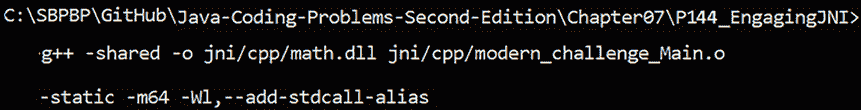

图 7.3：创建 math.dll

或者，以纯文本形式：

```java
C:\SBPBP\GitHub\Java-Coding-Problems-Second-Edition\Chapter07\P144_EngagingJNI>
  g++ -shared –o jni/cpp/math.dll jni/cpp/modern_challenge_Main.o 
  –static –m64 –Wl,--add-stdcall-alias 
```

注意，我们使用了`–static`选项。此选项指示 G++将所有依赖项添加到`math.dll`中。如果你不喜欢这种方法，那么你可能需要手动添加依赖项，以避免`java.lang.UnsatisfiedLinkError`错误。要找出缺失的依赖项，你可以使用 DLL 依赖项遍历工具，例如这个：[`github.com/lucasg/Dependencies`](https://github.com/lucasg/Dependencies)。

## 最后，运行代码

最后，我们可以运行代码。请交叉手指，并按照以下图中的命令执行：

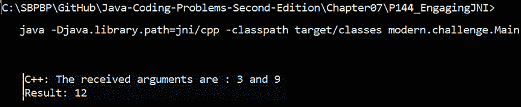

图 7.4：执行 Java 代码

或者，以纯文本形式：

```java
C:\SBPBP\GitHub\Java-Coding-Problems-Second-Edition\Chapter07\P144_EngagingJNI>  java –Djava.library.path=jni/cpp 
  –classpath target/classes modern.challenge.Main 
```

注意，我们应该设置库路径；否则，Java 将无法加载`math.dll`。如果一切顺利，那么你应该看到这个图中的输出。

好吧，正如你可以轻易得出的结论，JNI 并不容易使用。想象一下，为像 TensorFlow 这样的整个 C 库（有 200 多个函数）做所有这些工作。JNI 不仅难以使用，而且存在许多缺点，例如，它容易出错、难以维护、脆弱，它对异常的支持较差，JNI 错误可能导致 JVM 崩溃，它通过`ByteBuffer`分配了最大 2GB 的堆外内存，这些内存不能直接释放（我们必须等待垃圾收集器来处理），还有更多。尽管如此，学习这项技术仍然值得，因为正如你肯定知道的，管理通常不会迅速采用新的做事方式。

考虑到这一点，社区提出了其他方法，我们将在下一个问题中进行讨论。

# 145. 介绍 Java 本地访问（JNA）

**Java 本地访问**（**JNA**）是一个勇敢的开源尝试，通过更直观且易于使用的 API 来解决 JNI 的复杂性。作为一个第三方库，JNA 必须作为依赖项添加到我们的项目中：

```java
<dependency>
  <groupId>net.java.dev.jna</groupId>
  <artifactId>jna-platform</artifactId>
  <version>5.8.0</version>
</dependency> 
```

接下来，让我们尝试从*问题 144*中调用相同的`sumTwoInt()`方法。这个函数定义在名为`math.dll`的 C 本地共享库中，并存储在我们的项目中的`jna/cpp`文件夹中。

我们首先编写一个扩展 JNA 的`Library`接口的 Java 接口。该接口包含从 Java 调用并在本地代码中定义的方法和类型的声明。我们编写包含`sumTwoInt()`声明的`SimpleMath`接口如下：

```java
public interface SimpleMath extends Library { 
  long sumTwoInt(int x, int y);
} 
```

接下来，我们必须指导 JNA 加载`math.dll`库并生成该接口的具体实现，这样我们就可以调用其方法。为此，我们需要`jna.library.path`系统属性和 JNA 的`Native`类，如下所示：

```java
 package modern.challenge;
public class Main {
  public static void main(String[] args) {
    System.setProperty("jna.library.path", "./jna/cpp");
    SimpleMath math = Native.load(Platform.isWindows() 
      ? "math" : "NOT_WINDOWS", SimpleMath.class);
    long result = math.sumTwoInt(3, 9);
    System.out.println("Result: " + result);
  }
} 
```

在这里，我们指导 JNA 从`jna/cpp`通过`System.setProperty()`加载`math.dll`，但您也可以通过终端使用`–Djna.library.path=jna/cpp`来完成此操作。

接下来，我们调用`Native.load()`，它接受两个参数。首先，它接受本地库名称，在我们的例子中是`math`（不带`.dll`扩展名）。其次，它接受包含方法声明的 Java 接口，在我们的例子中是`SimpleMath.class`。`load()`方法返回一个具体的`SimpleMath`实现，我们用它来调用`sumTwoInt()`方法。

JNA 的`Platform`辅助类允许我们提供针对当前操作系统的特定本地库的名称。我们只有 Windows 上的`math.dll`。

## 实现.cpp 和.h 文件

这次，`.cpp`和`.h`文件没有命名约定，所以让我们将它们命名为`Arithmetic.cpp`和`Arithmetic.h`（头文件是可选的）。`Arithmetic.cpp`的源代码基本上是纯 C 代码：

```java
#include <iostream>
#include "Arithmetic.h"
long sumTwoInt(int x, int y) {
  std::cout << "C++: The received arguments are : " << x <<
     " and " << y << std::endl;
  return (long)x + (long)y;
} 
```

如您所见，使用 JNA，我们不需要用 JNI 特定的桥接代码修补我们的代码。它只是纯 C 代码。《Arithmetic.h》是可选的，我们可以这样编写它：

```java
#ifndef FUNCTIONS_H_INCLUDED
#define FUNCTIONS_H_INCLUDED
  long sumTwoInt(int x, int y);  
#endif 
```

接下来，我们可以编译我们的代码。

## 编译 C 源代码

编译 C 源代码是通过以下图中的 G++编译器完成的：

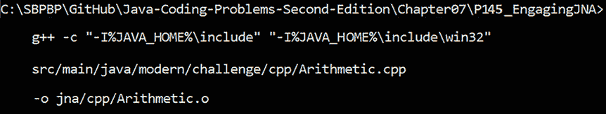

图 7.5：编译 C++代码

或者，作为纯文本：

```java
C:\SBPBP\GitHub\Java-Coding-Problems-Second-Edition\Chapter07\P145_EngagingJNA>
  g++ -c "-I%JAVA_HOME%\include" "-I%JAVA_HOME%\include\win32" 
  src/main/java/modern/challenge/cpp/Arithmetic.cpp 
  –o jna/cpp/Arithmetic.o 
```

接下来，我们可以生成适当的本地库。

## 生成本地共享库

是时候创建本地共享库`math.dll`了。为此，我们再次使用 G++，如图所示：

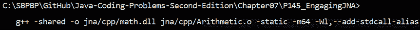

图 7.6：生成 math.dll

或者，作为纯文本：

```java
C:\SBPBP\GitHub\Java-Coding-Problems-Second-Edition\Chapter07\P145_EngagingJNA>g++ -shared –o jna/cpp/math.dll jna/cpp/Arithmetic.o –static –m64             –Wl,--add-stdcall-alias 
```

到目前为止，你应该已经在`jna/cpp`文件夹中有`math.dll`。

## 最后，运行代码

最后，我们可以运行代码。如果一切顺利，那么你就完成了。否则，如果你收到一个异常，比如`java.lang.UnsatisfiedLinkError:` *查找函数'sumTwoInt'时出错：指定的过程找不到*，那么你必须修复它。

但发生了什么？很可能是 G++编译器应用了一种称为*名称混淆*（或，*名称装饰*）的技术——[`en.wikipedia.org/wiki/Name_mangling`](https://en.wikipedia.org/wiki/Name_mangling)。换句话说，G++编译器已经将`sumTwoInt()`方法重命名为 JNA 所不知道的另一个名称。

解决这个问题可以分为两个步骤。首先，我们需要使用像这样的 DLL 依赖关系查看器来检查`math.dll`，例如这个：[`github.com/lucasg/Dependencies`](https://github.com/lucasg/Dependencies)。如图所示，G++已经将`sumTwoInt`重命名为`_Z9sumTwoIntii`（当然，在您的计算机上，它可能还有另一个名称）：

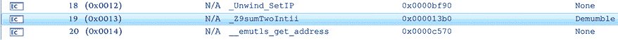

图 7.7：G++已将 sumToInt 重命名为 _Z9sumTwoIntii

其次，我们必须告诉 JNA 这个名称（`_Z9sumTwoIntii`）。基本上，我们需要定义一个包含名称对应映射的`Map`，并将这个映射传递给一个接受此映射作为最后一个参数的`Native.load()`方法的变体。代码很简单：

```java
public class Main {
  private static final Map MAPPINGS;
  static {
    MAPPINGS = Map.of(
      Library.OPTION_FUNCTION_MAPPER,
      new StdCallFunctionMapper() {
      Map<String, String> methodNames
        = Map.of("sumTwoInt", "_Z9sumTwoIntii");
      @Override
      public String getFunctionName(
             NativeLibrary library, Method method) {
        String methodName = method.getName();
        return methodNames.get(methodName);
      }
    });
  }
  public static void main(String[] args) { 
    System.setProperty("jna.library.path", "./jna/cpp");
    SimpleMath math = Native.load(Platform.isWindows() 
      ? "math" : "NOT_WINDOWS", SimpleMath.class, MAPPINGS);
    long result = math.sumTwoInt(3, 9);
    System.out.println("Result: " + result);
  }
} 
```

完成！现在，你应该得到 3+9 的结果。请随意进一步探索 JNA，并尝试使用 C/C++结构、联合和指针。

# 146. 介绍 Java Native Runtime (JNR)

**Java Native Runtime**（**JNR**）是另一个开源尝试解决 JNI 复杂性的方法。它是对 JNA 的严肃竞争，拥有比 JNI 更直观和强大的 API。

我们可以将其作为依赖项添加，如下所示：

```java
<dependency>
    <groupId>com.github.jnr</groupId>
    <artifactId>jnr-ffi</artifactId>
    <version>2.2.13</version>
</dependency> 
```

假设我们拥有与*问题 145*中完全相同的 C 方法（`sumTwoInt()`）和本地共享库（`math.dll`）。

我们首先编写一个 Java 接口，其中包含我们计划从 Java 调用并在本地代码中定义的方法和类型的声明。我们编写包含`sumTwoInt()`声明的`SimpleMath`接口如下：

```java
public interface SimpleMath { 
  @IgnoreError
  long sumTwoInt(int x, int y);
} 
```

`@IgnoreError`注解指示 JNR 不要保存*errno 值*（[`www.geeksforgeeks.org/errno-constant-in-c/`](https://www.geeksforgeeks.org/errno-constant-in-c/)）。

接下来，我们必须指示 JNR 加载`math.dll`库并生成此接口的实体实现，这样我们就可以调用其方法。为此，我们需要`LibraryLoader`和以下直观的代码：

```java
public class Main {
 public static void main(String[] args) {
  LibraryLoader<SimpleMath> loader = 
            FFIProvider.getSystemProvider()
  .createLibraryLoader(SimpleMath.class)
  .search("./jnr/cpp")
  .map("sumTwoInt", "_Z9sumTwoIntii");
  loader = loader.map("sumTwoInt", "_Z9sumTwoIntii");
  if (Platform.getNativePlatform().getOS() 
   == Platform.OS.WINDOWS) {
   SimpleMath simpleMath = loader.load("math"); 
   long result = simpleMath.sumTwoInt(3, 9);
   System.out.println("Result: " + result);
  }
 }
} 
```

通过`LibraryLoader` API，我们准备游乐场。我们通过`search()`方法指示 JNR 我们的库位于`jnr/cpp`。此外，我们通过`map()`方法提供方法名称的正确映射（记得从*问题 145*中，G++通过*名称修饰*（或，*名称装饰*）将方法从`sumTwoInt`重命名为`_Z9sumTwoIntii`）。

最后，我们通过`load()`方法加载库，并调用`sumTwoInt()`方法。

JNR 提供了许多其他功能，您可以从[`github.com/jnr`](https://github.com/jnr)开始利用。您可能还对 JavaCPP 感兴趣，它是 JNI 的另一个替代方案（[`github.com/bytedeco/javacpp`](https://github.com/bytedeco/javacpp)）。

# 147. 介绍和激励 Project Panama

Project Panama，或 Foreign Function & Memory (FFM) API，是告别 JNI 的一种优雅方式。这个项目始于 JDK 17 作为 JEP 412（第一个孵化器）。它继续在 JDK 18 作为 JEP 419（第二个孵化器），JDK 19 作为 JEP 424（第一个预览），JDK 20 作为 JEP 434（第二个预览），以及 JDK 21 作为 JEP 442（第三个预览）。这就是撰写本文时的状况。

要了解这个项目的目标，我们必须谈谈从 Java 应用程序访问**堆外**内存。通过堆外内存，我们指的是位于 JVM 堆之外且不由垃圾收集器管理的内存。

在堆外内存中冲浪是 JNI、JNA 和 JNR 的工作。以某种方式，这些 API 可以在堆外空间中工作以处理不同的任务。在这些任务中，我们可以列举以下内容：

+   使用本地库（例如，一些常见的库有 Open CL/GL, CUDA, TensorFlow, Vulkan, OpenSSL, V8, BLAS, cuDNN 等）

+   在不同进程间共享内存

+   将内存内容序列化/反序列化到所谓的*mmaps*

Java 完成这些任务的*事实上的* API 是`ByteBuffer`，或者更好的是所谓的*分配的直接缓冲区*，在访问堆外内存方面更高效。或者，我们可以使用 JNI，或者如您所见，第三方库如 JNA 和 JNR。

然而，`ByteBuffer`和 JNI 有很多缺点，使得它们仅在有限数量的场景中才有用。以下列出了一些它们的缺点：

+   `ByteBuffer`:

    +   脆弱且易出错

    +   不稳定的内存地址

    +   由垃圾收集器可以操作的数组支持

    +   分配直接缓冲区

    +   当用作通用 off-heap API 时无法扩展

    +   只有当由深入了解其使用的强大用户使用时才表现良好

    +   没有解决方案用于释放/释放内存

+   JNI:

    +   如您在*问题 144*中看到的，JNI 难以使用（即使是简单的情况）

    +   它是脆弱且易出错的

    +   维护困难/昂贵

    +   错误检查较差

    +   它可能导致 JVM 崩溃

这些缺点以及更多是 Project Panama 创建的原因。这个项目的目标是成为与 Java 中外国数据、函数和内存交互的新*事实上的* API。为了实现这个目标，Project Panama 有两个主要特性：

+   一个面向未来的 API（低级、高效、健壮和安全），用于替换基于字节数组的旧式 API——这被称为内存访问 API，能够访问堆内和堆外内存。

+   一个全新的范式取代了 JNI 的概念和机制，因此现在我们有一个直观、易于使用且健壮的解决方案来创建 Java 绑定到本地库。这被称为外部链接器 API。

在下一个问题中，我们将更深入地探讨这个项目。

# 148. 介绍 Panama 的架构和术语

当我们谈论架构时，展示一个有意义的图表很有帮助，所以这就是它：

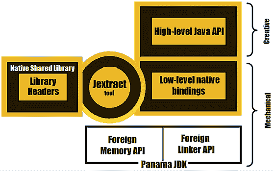

图 7.8：Project Panama 架构

此图揭示了 Panama 组件的互操作性。此图的顶峰是 Jextract 工具。正如您在本章中将要看到的，Jextract 是一个非常实用的工具，能够消费本地库的头文件并生成低级 Java 本地绑定。这些绑定是 Project Panama 两个主要 API 的工作单元：

+   外部内存 API——用于分配/释放堆外/堆内内存

+   外部链接器 API——用于从 Java 直接调用外国函数，反之亦然

到目前为止描述的过程完全是机械的。当这些 API 和低级 Java 原生绑定不足以满足我们的任务时，我们可以进一步采取行动，创建一组高级 Java 绑定。当然，这不是新手的工作，但它非常强大。例如，你可能有一个现有的用于生成 JNI 绑定的自动化工具，现在你想要将你的工具现代化，以便以 Panama 的风格生成更高层次的纯 Java 绑定。

在 Project Panama 使用的抽象中，我们有以下内容：

+   `java.lang.foreign.MemorySegment`：此 API 形成了堆或本地内存段。堆段访问堆内存，而本地段访问非堆内存。在两种情况下，我们谈论的是一个由空间和时间限制的内存连续区域。

+   `java.lang.foreign.Arena`（或在 JDK 20 之前的版本中为 `MemorySession`）：此 API 可以控制内存段的生存周期。

+   `java.lang.foreign.MemorySegment.Scope`：此 API 表示内存段的范围。

+   `java.lang.foreign.MemoryLayout`：此 API 将内存段的内容描述为 *内存布局*。例如，在基本 Java 数据类型（`int`、`double`、`long` 等）的上下文中，我们有 *内存值布局*（`java.lang.foreign.ValueLayout`）。

当然，除了这三个支柱之外，我们还有许多其他类和辅助工具。在接下来的问题中，我们将涵盖几个旨在让我们熟悉使用 Project Panama 的 API 的主要方面的场景。

# 149. 介绍 Arena 和 MemorySegment

`MemorySegment` 形成了堆或本地内存段。堆段访问堆内存，而本地段访问非堆内存。在两种情况下，我们谈论的是一个由空间和时间限制的内存连续区域。

在其特征中，内存段有一个以字节为单位的 *大小*，一个字节的 *对齐*，以及一个 *范围*。范围通过 `java.lang.foreign.MemorySegment.Scope` 封闭接口形成，并代表内存段的生存周期。本地内存段的生存周期由 `java.lang.foreign.Arena` 实例控制。`Arena` 有一个可以是的范围：

*全局竞技场范围*（或 *全局竞技场*）：具有竞技场全局范围的内存段始终可访问。换句话说，分配给这些段的内存区域永远不会被释放，并且它们的全局范围将永远保持活跃。

尝试关闭（`close()`）此范围将导致 `UnsupportedOperationException`。以下是在竞技场全局范围内创建 8 字节原生内存段的示例：

```java
MemorySegment globalSegment = Arena.global().allocate(8); 
```

*自动竞技场范围*：具有自动竞技场范围的内存段由垃圾收集器管理。换句话说，垃圾收集器决定何时可以安全地释放这些段背后的内存区域。

尝试关闭（`close()`）此作用域将导致 `UnsupportedOperationException`。以下是在自动作用域中创建 8 字节数本机内存段的示例：

```java
MemorySegment autoSegment = Arena.ofAuto().allocate(8); 
```

*受限区域作用域*（或，*受限区域*）：通过受限区域可以获得对内存段生命周期的严格控制（分配/释放和生命周期）。通常，这个作用域存在于 `try-with-resources` 块中。当 `Arena` 被关闭（通过显式调用 `close()`，或者简单地离开 `try-with-resources` 块），其作用域关闭，所有与该作用域关联的内存段被销毁，并且内存自动释放。受限区域通过 `ofConfined()` 打开，并由当前线程拥有 – 受限区域作用域的内存段只能由创建该区域的线程访问。

在代码行中，可以创建一个受限区域，如下所示：

```java
try (Arena arena = Arena.ofConfined()) {
  // current thread work with memory segments (MS1, MS2, …)
}
// here, memory segments MS1, MS2, …, have been deallocated 
```

*共享区域作用域*（或，*共享区域*）：共享区域通常通过 `try-with-resources` 块中的 `ofShared()` 打开，并且可以被多个线程共享 – 与共享区域作用域关联的内存段可以被任何线程访问（例如，这可以用于在内存段上执行并行计算）。当 `Arena` 被关闭（通过显式调用 `close()`，或者简单地离开 `try-with-resources` 块），其作用域关闭，所有与该作用域关联的内存段被销毁，并且内存自动释放。

在代码行中，可以创建一个受限区域，如下所示：

```java
try (Arena arena = Arena.ofShared()) {
  // any thread work with memory segments (MS1, MS2, …)
}
// here, memory segments MS1, MS2, …, have been deallocated 
```

通过调用 `arena.scope()`，我们获得区域的 `MemorySegment.Scope`，通过调用 `arena.scope().isAlive()`，我们可以找出当前作用域是否存活。只有当作用域存活时，内存段才是可访问的，因此只要区域的范围存活。

在这里，我们有一个 8 字节的内存段位于区域作用域中：

```java
try (Arena arena = Arena.ofConfined()) {
  MemorySegment arenaSegment = arena.allocate(8);
} 
```

可以通过以下方式将区域作用域的主要特征总结到表中：

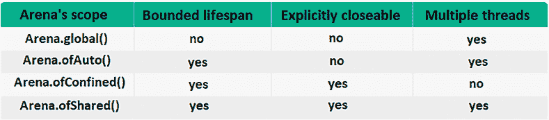

图 7.9：总结区域作用域的主要特征

如果你想监控分配的本机内存，那么这篇文章将帮助你做到这一点：[`www.morling.dev/blog/tracking-java-native-memory-with-jdk-flight-recorder/`](https://www.morling.dev/blog/tracking-java-native-memory-with-jdk-flight-recorder/)。在继续之前，让我们简要介绍 *内存布局*。

## 介绍内存布局（ValueLayout）

*内存布局* 由 `java.lang.foreign.MemoryLayout` 接口定义，其目标是描述内存段的内容。

我们有 *简单内存布局*，包括 `ValueLayout` 和 `PaddingLayout`，但我们也有 *复杂内存布局*，用于描述复杂内存段，如 `SequenceLayout`、`StructLayout`、`UnionLayout` 和 `GroupLayout`。复杂布局对于建模层次化的用户定义数据类型非常有用，例如类似 C 的序列、结构、联合等。

### 分配值布局的内存段

目前，我们对`ValueLayout`感兴趣。这是一个简单的内存布局，用于表示基本 Java 数据类型，如`int`，`float`，`double`，`char`，`byte`等。在 API 特定的示例中，`ValueLayout.JAVA_LONG`是一个其*载体*为`long.class`的布局，`ValueLayout.JAVA_DOUBLE`是一个其*载体*为`double.class`的布局，等等。值布局的*载体*可以通过`carrier()`方法获得。

例如，假设我们有一个受限的`arena`并且需要一个内存段来存储单个`int`值。我们知道 Java `int`需要 4 个字节，所以我们的段可以这样分配（`allocate()`的第一个参数是`int`的字节大小，第二个参数是`int`的字节对齐）：

```java
MemorySegment segment = arena.allocate(4, 4); 
```

但我们可以通过`ValueLayout`实现相同的功能如下（在这里，我们使用`allocate(MemoryLayout layout)`和`allocate(long byteSize, long byteAlignment)`）：

```java
MemorySegment segment = arena.allocate(ValueLayout.JAVA_INT);
MemorySegment segment = arena
  .allocate(ValueLayout.JAVA_INT.byteSize(),
            ValueLayout.JAVA_INT.byteAlignment()); 
```

或者，不指定*字节对齐*，通过`allocate(long byteSize)`：

```java
MemorySegment segment = arena.allocate(4);
MemorySegment segment = arena
  .allocate(ValueLayout.JAVA_INT.byteSize()); 
```

这里是另一个使用`ValueLayout.JAVA_DOUBLE`特定的*字节对齐*为存储 Java `double`分配内存段的示例：

```java
MemorySegment segment
  = arena.allocate(ValueLayout.JAVA_DOUBLE);
MemorySegment segment = arena.allocate(
  ValueLayout.JAVA_DOUBLE.byteSize(),
  ValueLayout.JAVA_DOUBLE.byteAlignment()); 
```

或者，为存储 Java `char`分配一个内存段可以这样做：

```java
MemorySegment segment = arena.allocate(ValueLayout.JAVA_CHAR);
MemorySegment segment = MemorySegment.allocate(
  ValueLayout.JAVA_CHAR.byteSize(),
  ValueLayout.JAVA_CHAR.byteAlignment()); 
```

现在我们知道了如何为不同数据类型分配内存段，让我们看看我们如何设置/获取一些值。

### 设置/获取内存段的内容

`Arena` API 提供了一组从`SegmentAllocator`继承的`allocate()`方法，这些方法可以用于在同一行代码中分配一个内存段并设置其内容（在前一节中，我们只使用了分配内存段但不设置其内容的`allocate()`变体）。例如，调用`allocate(OfInt layout, int value)`会分配一个用于存储`int`的内存段并将该`int`设置为给定的`value`（`OfInt`是一个扩展`ValueLayout`的接口）。在这里，我们将`int`视为`Integer.MAX_VALUE`：

```java
MemorySegment segment = arena.allocate(
  ValueLayout.JAVA_INT, Integer.MAX_VALUE); 
```

或者，在这里我们为`char`分配一个内存段并将该`char`设置为`a`（`allocate(OfChar layout, char value)`）：

```java
MemorySegment segment = arena.allocate(
  ValueLayout.JAVA_CHAR, 'a'); 
```

但如果我们想在稍后设置内存段的内容（不是在分配时），则可以使用`MemorySegment.set()`或`setAtIndex()`方法。

例如，我们可以通过`set(OfInt layout, long offset, int value)`设置`Integer.MAX_VALUE`如下所示：

```java
MemorySegment segment = ...;
segment.set(ValueLayout.JAVA_INT, 0, Integer.MAX_VALUE); 
```

第二个参数是`offset`（0，4，8，12，……），在这种情况下必须是 0。或者，我们可以使用`setAtIndex(OfInt layout, long index, int value)`如下所示：

```java
segment.setAtIndex(
  ValueLayout.JAVA_INT, 0, Integer.MAX_VALUE); 
```

在这里，第二个参数代表一个索引，正如在数组中一样（0，1，2，3……）。在这种情况下，它必须是 0，因为我们只在一个内存段中存储一个整数。

从某个偏移量获取内容可以通过`get()`方法完成，从某个索引通过`getAtIndex()`方法完成。例如，可以通过`get(OfInt layout, long offset)`获取存储在某个偏移量处的`int`：

```java
int val = segment.get(ValueLayout.JAVA_INT, 0); 
```

并且，通过 `getAtIndex(OfInt layout, long index)` 在某个索引处存储的 `int`，如下所示：

```java
int val = segment.getAtIndex(ValueLayout.JAVA_INT, 0); 
```

在接下来的问题中，你将看到更多使用这些方法的示例。

### 处理 Java 字符串

为存储 Java `String` 分配内存段是一个特殊情况。如果我们有一个 `Arena` 实例，那么我们可以分配一个内存段，并通过 `allocateUtf8String(String str)` 方法将其内容设置为 Java `String`，如下所示（这里，Java 字符串是 `abcd`）：

```java
MemorySegment segment = arena.allocateUtf8String("abcd"); 
```

`allocateUtf8String(String str)` 方法将 Java `String` 转换为 UTF-8 编码且以 `null` 结尾的类似 C 的字符串。内存段的大小为 `str.length` + 1。这意味着我们可以为 `abcd` 字符串分配如下段：

```java
MemorySegment segment = arena.allocate(5); 
```

或者，更具体地说：

```java
MemorySegment segment = arena.allocate("abcd".length() + 1); 
```

在分配了内存段之后，我们可以通过 `setUtf8String(long offset, String str)` 方法设置字符串，如下所示：

```java
segment.setUtf8String(0, "abcd"); 
IndexOutOfBoundsException:
```

```java
segment.setUtf8String(1, "abcd"); 
```

通过 `MemorySegment.getUtf8String(long offset)` 获取存储在内存段中的字符串，我们可以这样做：

```java
String str = segment.getUtf8String(0); 
```

你可以在捆绑的代码中练习所有这些示例。

# 150. 将数组分配到内存段

现在我们知道了如何为存储单个值创建内存段，让我们更进一步，尝试存储一个整数数组。例如，让我们定义一个用于存储以下数组的内存段：[11, 21, 12, 7, 33, 1, 3, 6]。

Java `int` 需要 4 个字节（32 位），我们有 8 个整数，所以我们需要一个 4 字节 x 8 = 32 字节 = 256 位的内存段。如果我们尝试表示这个内存段，那么我们可以像以下图示那样做：

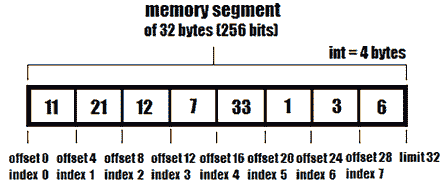

图 7.10：一个包含 8 个整数的内存段

在代码行中，我们可以通过以下任何一种方法来分配这个内存段（`arena` 是 `Arena` 的一个实例）：

```java
MemorySegment segment = arena.allocate(32);
MemorySegment segment = arena.allocate(4 * 8);
MemorySegment segment = arena.allocate(
  ValueLayout.JAVA_INT.byteSize() * 8);
MemorySegment segment = arena.allocate(Integer.SIZE/8 * 8);
MemorySegment segment = arena.allocate(Integer.BYTES * 8); 
```

接下来，我们可以使用 `set(OfInt layout, long offset, int value)` 方法填充内存段，如下所示：

```java
segment.set(ValueLayout.JAVA_INT, 0, 11);
segment.set(ValueLayout.JAVA_INT, 4, 21);
segment.set(ValueLayout.JAVA_INT, 8, 12);
segment.set(ValueLayout.JAVA_INT, 12, 7);
segment.set(ValueLayout.JAVA_INT, 16, 33);
segment.set(ValueLayout.JAVA_INT, 20, 1);
segment.set(ValueLayout.JAVA_INT, 24, 3);
segment.set(ValueLayout.JAVA_INT, 28, 6); 
```

或者，我们可以使用 `setAtIndex(OfInt layout, long index, int value)` 方法如下：

```java
segment.setAtIndex(ValueLayout.JAVA_INT, 0, 11);
segment.setAtIndex(ValueLayout.JAVA_INT, 1, 21);
segment.setAtIndex(ValueLayout.JAVA_INT, 2, 12);
segment.setAtIndex(ValueLayout.JAVA_INT, 3, 7);
segment.setAtIndex(ValueLayout.JAVA_INT, 4, 33);
segment.setAtIndex(ValueLayout.JAVA_INT, 5, 1);
segment.setAtIndex(ValueLayout.JAVA_INT, 6, 3);
segment.setAtIndex(ValueLayout.JAVA_INT, 7, 6); 
```

我们已经知道我们可以通过 `get()` 使用偏移量或通过 `getAtIndex()` 使用索引来访问这些整数中的任何一个。这次，让我们尝试使用这个内存段来填充一个 `IntVector`（在 *第五章* 中介绍）。代码应该如下所示：

```java
IntVector v = IntVector.fromMemorySegment(
  VS256, segment, 0, ByteOrder.nativeOrder()); 
```

因此，Vector API 提供了 `fromMemorySegment()` 方法，特别是用于从内存段填充向量。`ByteOrder` 可以是 `nativeOrder()`，这意味着平台的本地字节顺序，`BIG_ENDIAN`（大端字节顺序），或者 `LITTLE_ENDIAN`（小端字节顺序）。

填充内存段的一个更方便的方法依赖于从 `SegmentAllocator` 继承的 `Arena.allocateArray()` 方法集。这些方法可以在一行代码中创建并填充内存段，如下所示：

```java
MemorySegment segment = arena.allocateArray(
  ValueLayout.JAVA_INT, 11, 21, 12, 7, 33, 1, 3, 6);
// or, like this
MemorySegment segment = arena.allocateArray(
  ValueLayout.JAVA_INT, 
  new int[]{11, 21, 12, 7,  33, 1, 3,  6}); 
```

或者，这里是一个 `char[]` 数组：

```java
MemorySegment segment = arena.allocateArray(
  ValueLayout.JAVA_CHAR,"abcd".toCharArray()); 
```

所有这些示例都分配了一个堆外内存段。如果我们需要一个堆内内存段，那么我们可以依赖 `MemorySegment.ofArray()`，如下所示：

```java
MemorySegment segment = MemorySegment
  .ofArray(new int[]{11, 21, 12, 7, 33, 1, 3, 6}); 
```

对于完整的示例，请考虑捆绑的代码。

# 151. 理解地址（指针）

内存段有一个表示为`long`数字的内存地址（*指针*）。堆外内存段有一个*物理地址*，它指向支持该段的内存区域（*基地址*）。该段中存储的每个内存布局都有自己的内存地址。例如，这是通过`address()`方法查询内存段*基地址*的一个示例（`arena`是`Arena`的一个实例）：

```java
MemorySegment segment = arena
  .allocate(ValueLayout.JAVA_INT, 1000);
long addr = segment.address(); // 2620870760384 
```

另一方面，堆内存段有一个*非物理稳定的虚拟化*地址，通常表示该段内存区域内的偏移量（客户端看到一个稳定的地址，而垃圾收集器可以重新分配堆内存内部的内存区域）。例如，通过`ofArray()`工厂方法之一创建的堆段有一个地址为 0。

接下来，让我们只关注堆外内存段。让我们考虑以下包含整数值的三个内存段（`arena`是`Arena`的一个实例）：

```java
MemorySegment i1 = arena.allocate(ValueLayout.JAVA_INT, 1);
MemorySegment i2 = arena.allocate(ValueLayout.JAVA_INT, 3);
MemorySegment i3 = arena.allocate(ValueLayout.JAVA_INT, 2); 
```

这些段中的每一个都有一个内存地址。接下来，让我们创建一个包含它们地址的段（就像指针段一样）。首先，我们通过`ValueLayout.ADDRESS`分配这样一个段，如下所示：

```java
MemorySegment addrs = arena
  .allocateArray(ValueLayout.ADDRESS, 3); 
```

由于每个地址都是一个`long`值，`addrs`的大小为 24 字节。我们可以使用`set()`方法和偏移量 0、8 和 16 来设置`i1`、`i2`和`i3`的地址，或者我们可以使用`setAtIndex()`并引用偏移量作为索引 0、1 和 2：

```java
addrs.setAtIndex(ValueLayout.ADDRESS, 0, i1);
addrs.setAtIndex(ValueLayout.ADDRESS, 1, i2);
addrs.setAtIndex(ValueLayout.ADDRESS, 2, i3); 
```

我们可以用以下图表来表示：

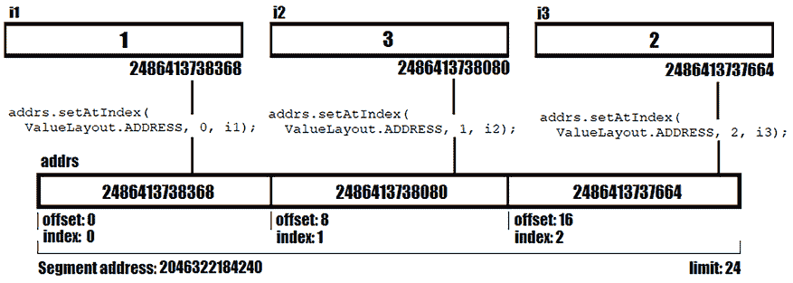

图 7.11：将 i1、i2 和 i3 地址存储在地址数组中

换句话说，我们在`addrs`的偏移量 0 处设置了`i1`的地址，在偏移量 8 处设置了`i2`的地址，在偏移量 16 处设置了`i3`的地址。`addrs`段不包含`i1`、`i2`和`i3`的数据。它只是一个指针段，指向`i1`、`i2`和`i3`的内存地址。

如果我们调用`get()`/`getAtIndex()`，我们将得到一个地址：

```java
MemorySegment addr1 = addrs.getAtIndex(ValueLayout.ADDRESS, 0);
MemorySegment addr2 = addrs.getAtIndex(ValueLayout.ADDRESS, 1);
MemorySegment addr3 = addrs.getAtIndex(ValueLayout.ADDRESS, 2); 
```

我们可以用以下图表来表示：

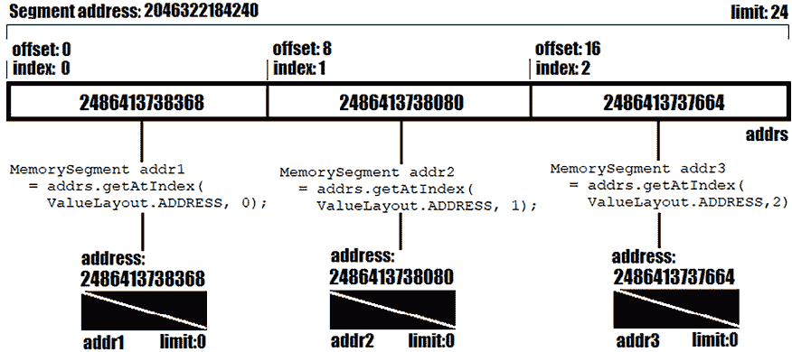

图 7.12：从地址数组中获取地址

但检查一下返回类型。它不是一个`long`值！它是一个`MemorySegment`。返回的本地内存段（`addr1`、`addr2`和`addr3`）自动与*全局作用域*相关联。它们的大小为 0（*限制：0*），每个段都封装了给定偏移量/索引返回的地址（`long`值可以通过`addr1`/`2`/`3.address()`获得）。然而，在*无界*地址布局的情况下，预期的大小将是`Long.MAX_VALUE`（9223372036854775807）。

这意味着我们不应该这样做：

```java
addr1.get(ValueLayout.JAVA_INT, 0); DON'T DO THIS! 
```

这会导致`IndexOutOfBoundsException`，因为`addr1`的大小为 0 字节——这被称为*零长度内存段*。通过`ofAddress()`和`reinterpret()`方法的一种变体，可以获取与地址相关联的整数值，如下所示：

```java
int v1 = MemorySegment.ofAddress(addr1.address())
  .reinterpret(ValueLayout.JAVA_INT.byteSize())
  .get(ValueLayout.JAVA_INT, 0); 
```

首先，我们调用`ofAddress()`并传递`addr1`地址。这将创建一个大小为 0 的本地内存段。接下来，我们调用`reinterpret()`方法并传递`int`类型的大小。这将返回一个新的内存段（重新解释的内存段），其地址和作用域与该段相同，但具有给定的大小（4 字节）。最后，我们读取在偏移量 0 处存储的此地址的整数值。对于`addr2`和`addr3`也可以做同样的事情：

```java
int v2 = MemorySegment.ofAddress(addr2.address())
  .reinterpret(ValueLayout.JAVA_INT.byteSize())
  .get(ValueLayout.JAVA_INT, 0);
int v3 = MemorySegment.ofAddress(addr3.address())
  .reinterpret(ValueLayout.JAVA_INT.byteSize())
  .get(ValueLayout.JAVA_INT, 0); 
```

在使用`reinterpret()`或`withTargetLayout()`方法之前，请考虑以下注意事项：

**重要提示**

`reinterpret()`方法（以及所有用于处理零长度内存段的方法）被视为*受限*方法。应谨慎使用，因为任何错误都可能导致在尝试访问内存段时虚拟机崩溃。

我们可以通过`==`运算符检查两个长地址是否相等：

```java
addr1.address() == i1.address() // true 
```

或者，通过`equals()`：

```java
addr1.equals(i1) // true 
```

到目前为止，我们有`i1`=1, `i2`=3, 和 `i3`=2。现在，我们只想操作地址以获得`i1`=1, `i2`=2, 和 `i3`=3。因此，我们想要通过交换地址而不是值来交换`i2`和`i3`的整数值。首先，我们将`i2`地址存储为`long`：

```java
long i2Addr = i2.address(); 
```

接下来，我们将`i2`地址设置为`i3`地址：

```java
i2 = MemorySegment.ofAddress(i3.address())
  .reinterpret(ValueLayout.JAVA_INT.byteSize()); 
```

最后，我们将`i3`的地址设置为`i2`的地址：

```java
i3 = MemorySegment.ofAddress(i2Addr)
  .reinterpret(ValueLayout.JAVA_INT.byteSize()); 
```

完成！现在，`i1`=1, `i2`=2, 和 `i3`=3。我希望你发现这个练习对理解如何操作值、偏移量和内存地址有帮助。

# 152. 介绍序列布局

在*问题 149*中，我们已经涵盖了基本数据类型的`ValueLayout`。接下来，让我们谈谈*序列布局*（`java.lang.foreign.SequenceLayout`）。

但在介绍序列布局之前，让我们花一点时间分析以下代码片段：

```java
try (Arena arena = Arena.ofConfined()) {
  MemorySegment segment = arena.allocate(
    ValueLayout.JAVA_DOUBLE.byteSize() * 10,
    ValueLayout.JAVA_DOUBLE.byteAlignment());
  for (int i = 0; i < 10; i++) {
    segment.setAtIndex(ValueLayout.JAVA_DOUBLE,
      i, Math.random());
  }
  for (int i = 0; i < 10; i++) {
    System.out.printf("\nx = %.2f",
      segment.getAtIndex(ValueLayout.JAVA_DOUBLE, i));
  }
} 
```

我们首先创建一个用于存储 10 个`double`值的本地内存段。接下来，我们依靠`setAtIndex()`来设置这些`double`值。最后，我们打印它们。

因此，基本上，我们重复`ValueLayout.JAVA_DOUBLE` 10 次。当一个*元素布局*被重复*n*次（有限次数）时，我们可以通过序列布局（`java.lang.foreign.SequenceLayout`）来表示代码。换句话说，序列布局表示给定*元素布局*的重复/序列，重复有限次数。

以下代码使用`SequenceLayout`来塑造前面的片段：

```java
SequenceLayout seq = MemoryLayout.sequenceLayout(
  10, ValueLayout.JAVA_DOUBLE); 
```

重复次数（*元素计数*）为 10，重复的*元素布局*为`ValueLayout.JAVA_DOUBLE`。

但我们如何设置序列布局的值？至少有两种方法，其中一种依赖于`java.lang.invoke.VarHandle` API 和`java.lang.foreign.MemoryLayout.PathElement` API 的组合。

## 介绍 PathElement

简而言之，`PathElement` API 通过所谓的 *布局路径* 提供了一种友好的方法来通过层次化内存布局进行导航。通过在布局路径中链接路径元素，我们可以定位一个元素布局，这可以是一个序列布局（通过序列路径元素定位）或者，正如你将在其他问题中看到的那样，一个组布局（可以通过组路径元素定位，可以是结构布局或联合布局）。序列布局通过 `PathElement.sequenceElement()` 进行遍历，而组布局通过 `PathElement.groupElement()` 进行遍历。每个元素布局都有一个称为 *元素计数* 的元素数量（通过名为 `elementCount()` 的方法获得）。

## 介绍 VarHandle

`VarHandle` 并非新事物。它在 JDK 9 中被引入。`VarHandle` 是一个动态的、不可变的、无状态、强类型的对变量的引用，不能被继承。其目标是提供在特定情况下对处理变量的读写访问。

`VarHandle` 有两个特点：

+   由此 `VarHandle` 表示的变量类型作为泛型类型（`T`）

+   一组用于定位此 `VarHandle` 引用的变量的坐标类型（表示为 CT）

CT 列表可能为空。

通常，`VarHandle` 方法会接收一个可变数量的 `Object` 参数。参数检查是在运行时完成的（静态参数检查被禁用）。`VarHandle` 的不同方法期望接收不同类型的可变数量的参数。

## 将 PathElement 和 VarHandle 结合起来

路径元素（布局路径）是 `MemoryLayout.varHandle()` 方法的参数，该方法能够返回一个 `VarHandle`，可以用来访问通过此布局路径定位的内存段。路径被认为是根在此布局中。

因此，在我们的简单情况下，我们可以如下获得 `seq` 的 `VarHandle`：

```java
// VarHandle[varType=double, 
// coord=[interface java.lang.foreign.MemorySegment, long]]
VarHandle sphandle = seq.varHandle(
  PathElement.sequenceElement()); 
```

我们的路径布局只是通过 `PathElement.sequenceElement()` 的简单导航。返回的 `VarHandle` 代表 `double` 类型的变量，并包含一个由 (`MemorySegment` 和 `long`) 组成的 CT。

`MemorySegment` 代表从该序列布局开始的内存段，而 `long` 值代表在该内存段中的索引。这意味着我们可以设置 10 个 `double` 值，如下所示：

```java
try (Arena arena = Arena.ofConfined()) {
  MemorySegment segment = arena.allocate(seq);
  for (int i = 0; i < seq.elementCount(); i++) {
    sphandle.set(segment, i, Math.random());
  }
  ... 
```

获取这 10 个 `double` 值可以这样做：

```java
 for (int i = 0; i < seq.elementCount(); i++) {
    System.out.printf("\nx = %.2f", sphandle.get(segment, i));
  }
} 
```

`VarHandle` 也可以通过 `arrayElementVarHandle(int... shape)` 创建。此方法创建一个 `VarHandle`，用于以多维数组的形式访问内存段（这被称为 *带步长的 var 处理器)*。`varargs` 参数 `shape` 表示每个嵌套数组维度的尺寸。你可以在代码包中找到这个示例。

接下来，让我们稍微复杂化一下。

## 与嵌套序列布局一起工作

让我们考虑以下 400 字节的序列布局（5 * 10 * 8 字节）：

```java
SequenceLayout nestedseq = MemoryLayout.sequenceLayout(5,
  MemoryLayout.sequenceLayout(10, ValueLayout.JAVA_DOUBLE)); 
```

因此，这里我们有 5 个包含 10 个 `ValueLayout.JAVA_DOUBLE` 的序列布局。要导航到 `ValueLayout.JAVA_DOUBLE`，需要通过链式调用两个 `sequenceLayout()` 获取布局路径，如下所示：

```java
// VarHandle[varType=double, coord=[interface 
// java.lang.foreign.MemorySegment, long, long]]
VarHandle nphandle = nestedseq.varHandle(
  PathElement.sequenceElement(),
  PathElement.sequenceElement()); 
```

除了内存段之外，`VarHandle` 还接受两个 `long` 值。第一个 `long` 对应于外部序列布局，第二个 `long` 对应于内部序列布局。外部序列的元素数（元素计数）为 5，如下所示：

```java
long outer = nestedseq.elementCount(); 
```

内部序列的元素计数为 10，可以通过以下方式通过 `select()` 方法获取：

```java
long inner = ((SequenceLayout) nestedseq.select(
  PathElement.sequenceElement())).elementCount(); 
```

现在，`outer` 与 `nphandle` 坐标类型中的第一个 `long` 参数匹配，而 `inner` 与第二个 `long` 参数匹配。因此，我们可以按以下方式获取/设置序列的 `double` 值：

```java
try (Arena arena = Arena.ofConfined()) {
  MemorySegment segment = arena.allocate(nestedseq);
  long outer = nestedseq.elementCount();
  long inner = ((SequenceLayout) nestedseq.select(
    PathElement.sequenceElement())).elementCount();
  for (int i = 0; i < outer; i++) {
    for (int j = 0; j < inner; j++) {
      nphandle.set(segment, i, j, Math.random());
    }
  }
  for (int i = 0; i < outer; i++) {
    System.out.print("\n-----" + i + "-----");
    for (int j = 0; j < inner; j++) {
      System.out.printf("\nx = %.2f",
        nphandle.get(segment, i, j));
    }
  }
} 
```

在捆绑的代码中，你可以看到一个依赖于 `ValueLayout.JAVA_DOUBLE.arrayElementVarHandle(5, 10)` 的示例。

# 153. 将类似 C 的结构体塑形为内存段

让我们考虑以下图中的类似 C 结构体：

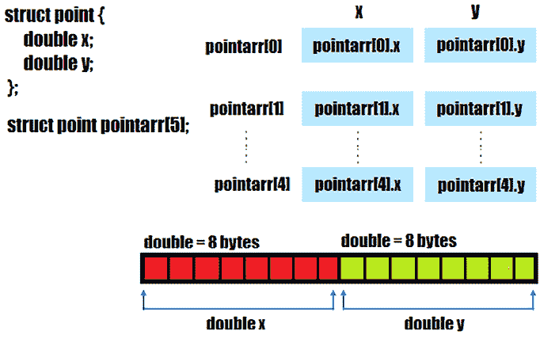

图 7.13：类似 C 的结构体

因此，在 *图 7.13* 中，我们有一个名为 `point` 的类似 C 结构体，用于塑形 (*x*, *y*) 对的 `double` 值。此外，我们还有 5 个这样的对在 `pointarr` 下声明。我们可以尝试塑形一个内存段来适应这个模型，如下所示（`arena` 是 `Arena` 的一个实例）：

```java
MemorySegment segment = arena.allocate(
  2 * ValueLayout.JAVA_DOUBLE.byteSize() * 5,
  ValueLayout.JAVA_DOUBLE.byteAlignment()); 
```

接下来，我们应该将 (*x*, *y*) 对设置到这个段中。为此，我们可以将其可视化如下：

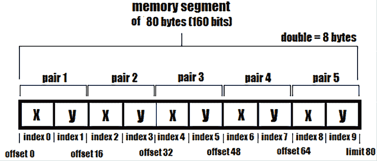

图 7.14：存储 (x, y) 对的内存段

```java
x, *y*) pairs:
```

```java
for (int i = 0; i < 5; i++) {
  segment.setAtIndex(
    ValueLayout.JAVA_DOUBLE, i * 2, Math.random());
  segment.setAtIndex(
    ValueLayout.JAVA_DOUBLE, i * 2 + 1, Math.random());
} 
```

但另一种方法是通过使用 `StructLayout`，这对于此场景更为合适，因为它在数据周围提供了一个包装结构。

## 介绍 StructLayout

`StructLayout` 是一种分组布局。在这个布局中，成员（其他内存布局）是依次排列的，就像在 C 结构体中一样。这意味着我们可以通过以下方式将类似 C 的结构体布局为两个 `ValueLayout.JAVA_DOUBLE`：

```java
StructLayout struct = MemoryLayout.structLayout(
  ValueLayout.JAVA_DOUBLE.withName("x"), 
  ValueLayout.JAVA_DOUBLE.withName("y")); 
```

但我们有 5 对 (*x*, *y*)，因此我们需要将这个 `StructLayout` 嵌套在一个包含 5 个 `StructLayout` 的 `SequenceLayout` 中，如下所示：

```java
SequenceLayout struct
  = MemoryLayout.sequenceLayout(5,
      MemoryLayout.structLayout(
        ValueLayout.JAVA_DOUBLE.withName("x"),
        ValueLayout.JAVA_DOUBLE.withName("y"))); 
```

接下来，正如我们从 *问题 152* 中已经知道的，我们需要通过 `PathElement` 定义适当的布局路径，并获取回 `VarHandle`。我们需要一个 `VarHandle` 用于 *x* 和一个用于 *y*。注意以下代码中我们如何通过它们的名称来指出它们：

```java
// VarHandle[varType=double, 
// coord=[interface java.lang.foreign.MemorySegment, long]]
VarHandle xHandle = struct.varHandle(
  PathElement.sequenceElement(),
  PathElement.groupElement("x"));
// VarHandle[varType=double, 
// coord=[interface java.lang.foreign.MemorySegment, long]]
VarHandle yHandle = struct.varHandle(
  PathElement.sequenceElement(),
  PathElement.groupElement("y")); 
```

最后，我们可以使用 `VarHandle` 和元素计数来设置数据，如下所示：

```java
try (Arena arena = Arena.ofConfined()) {
  MemorySegment segment = arena.allocate(struct);
  for (int i = 0; i < struct.elementCount(); i++) {
    xHandle.set(segment, i, Math.random());
    yHandle.set(segment, i, Math.random());
  }
  ... 
```

获取数据非常简单：

```java
 for (int i = 0; i < struct.elementCount(); i++) {
    System.out.printf("\nx = %.2f", xHandle.get(segment, i));
    System.out.printf("\ny = %.2f", yHandle.get(segment, i));
  }
} 
```

挑战自己通过 `ValueLayout.JAVA_DOUBLE.arrayElementVarHandle(int... shape)` 实现此示例。

# 154. 将类似 C 的联合塑形为内存段

让我们考虑以下图中的类似 C 的联合（C 联合的成员共享相同的内存位置（成员的最大数据类型决定了内存位置的大小），因此在任何时刻只有一个成员有值）：

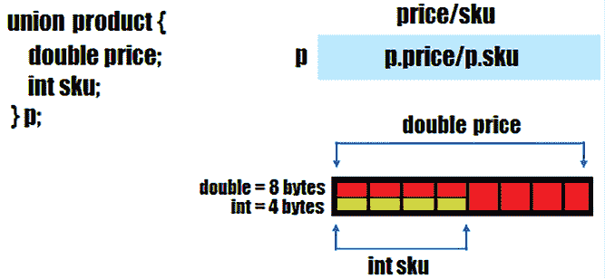

图 7.15：一个类似 C 的联合体

在*图 7.15*中，我们有一个名为`product`的类似 C 的联合体，用于形成两个成员，`price`（`double`）和`sku`（`int`），在任何时刻只有一个可以具有值。我们可以按如下方式形成内存段以适应此模型（`arena`是`Arena`的一个实例）：

```java
MemorySegment segment = arena.allocate(
  ValueLayout.JAVA_DOUBLE.byteSize(),
  ValueLayout.JAVA_DOUBLE.byteAlignment()); 
```

由于`double`需要 8 字节，而`int`只需要 4 字节，我们选择`ValueLayout.JAVA_DOUBLE`来形成内存段的大小。这样，该段可以在同一偏移量处容纳一个`double`和一个`int`。

接下来，我们可以设置`price`或`sku`并相应地使用它们：

```java
segment.setAtIndex(ValueLayout.JAVA_DOUBLE, 0, 500.99);
segment.setAtIndex(ValueLayout.JAVA_INT, 0, 101000); 
```

当我们设置`sku`（`int`）时，`price`（`double`）的值变成了*垃圾值*，反之亦然。更多详情，请查看附带代码。接下来，让我们看看基于`UnionLayout`的此实现的替代方案。

## 介绍 UnionLayout

`UnionLayout`是一种组合布局。在这个布局中，成员（其他内存布局）按照与 C 联合体中完全相同的起始偏移量排列。这意味着我们可以通过如下方式排列`price`（`double`）和`sku`（`int`）成员来形成我们的类似 C 的联合体：

```java
UnionLayout union = MemoryLayout.unionLayout(
  ValueLayout.JAVA_DOUBLE.withName("price"),
  ValueLayout.JAVA_INT.withName("sku")); 
```

接下来，正如我们从*问题 152*中已经知道的，我们需要通过`PathElement`定义适当的布局路径并获取回`VarHandle`。我们需要一个`VarHandle`用于`price`，另一个用于`sku`。注意以下代码中我们如何通过它们的名称来指出它们：

```java
// VarHandle[varType=double, 
// coord=[interface java.lang.foreign.MemorySegment]]
VarHandle pHandle = union.varHandle(
  PathElement.groupElement("price"));
// VarHandle[varType=double, 
// coord=[interface java.lang.foreign.MemorySegment]]
VarHandle sHandle = union.varHandle(
  PathElement.groupElement("sku")); 
```

最后，我们可以使用`VarHandle`来设置`price`或`sku`：

```java
try (Arena arena = Arena.ofConfined()) {
  MemorySegment segment = arena.allocate(union);
  pHandle.set(segment, 500.99);
  sHandle.set(segment, 101000);
} 
```

当我们设置`sku`（`int`）时，`price`（`double`）的值变成了*垃圾值*，反之亦然。

# 155. 介绍 PaddingLayout

数据类型通常由几个属性来表征：*大小*、*对齐*、*步长*、*填充*和*字节顺序*。

*填充布局*（`java.lang.foreign.PaddingLayout`）允许我们指定*填充*。换句话说，`PaddingLayout`允许我们在某些偏移量添加一些额外的空间，这些空间通常被应用程序忽略，但却是内存段成员布局对齐所需的。

例如，让我们考虑以下两个内存段（左侧是没有填充的内存段，而右侧是带有两个各 4 字节填充的内存段）。

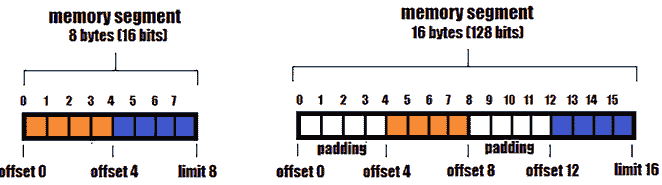

图 7.16：带（右侧）/不带（左侧）填充的内存段

在代码行中，无填充的内存段可以按如下方式形成：

```java
StructLayout npStruct = MemoryLayout.structLayout( 
  ValueLayout.JAVA_INT.withName("x"), 
  ValueLayout.JAVA_INT.withName("y")
); 
```

由于`JAVA_INT`的大小为 4 字节，我们可以将*x*和*y*设置为如下：

```java
VarHandle xpHandle = npStruct.varHandle(
  PathElement.groupElement("x"));
VarHandle ypHandle = npStruct.varHandle(
  PathElement.groupElement("y"));
try (Arena arena = Arena.ofConfined()) {
  MemorySegment segment = arena.allocate(npStruct);
  xnHandle.set(segment, 23); // offset 0
  ynHandle.set(segment, 54); // offset 4
} 
```

这段代码在偏移量 0 处写入值 23，在偏移量 4 处写入 54。没有惊喜，对吧？

```java
paddingLayout()):
```

```java
StructLayout wpStruct = MemoryLayout.structLayout(
  MemoryLayout.paddingLayout(4), // 4 bytes
  ValueLayout.JAVA_INT.withName("x"),
  MemoryLayout.paddingLayout(4), // 4 bytes
  ValueLayout.JAVA_INT.withName("y")
); 
```

接下来，我们再次写入两个`int`值（23 和 54）：

```java
VarHandle xpHandle = wpStruct.varHandle(
  PathElement.groupElement("x"));
VarHandle ypHandle = wpStruct.varHandle(
  PathElement.groupElement("y"));
try (Arena arena = Arena.ofConfined()) {
  MemorySegment segment = arena.allocate(wpStruct);
  xpHandle.set(segment, 23); // offset 4
  ypHandle.set(segment, 54); // offset 12
} 
```

这次，跳过了填充区，23 被写入偏移量 4，而 54 被写入偏移量 12。读取*x*和*y*应分别从偏移量 4 和偏移量 12 开始。从 0 到 3，以及从 8 到 11，我们通过`paddingLayout()`添加了额外的空间，这些空间被应用程序忽略。尝试从这些区域读取`int`会导致值为 0（默认值）。

这些示例很好地介绍了*填充*概念，但在实际场景中并不那么有用。记住我们之前说过，填充对于对齐内存段的成员是有用的。为了理解这一点，让我们简要地介绍一些更多的参与者。

## 查询大小、对齐、步长和填充

在继续处理填充之前，我们需要介绍一些彼此密切相关且与填充协同工作的概念。

### 步长挂钩

通过“大小”，我们指的是内存布局（数据类型、类似 C 的结构体、类似 C 的联合体、序列布局等）占用的内存量（以字节/位为单位）。我们知道 Java 的`int`占用 4 字节，Java 的`byte`占用 1 字节，类似 C 的结构体占用每个属性大小的总和的字节数，类似 C 的联合体占用最大的属性大小的字节数，等等。

我们可以通过`byteSize()`/`bitSize()`轻松查询大小。以下是一些示例：

```java
long size = ValueLayout.JAVA_INT.byteSize();   // 4
long size = ValueLayout.JAVA_BYTE.byteSize();  // 1
long size = npStruct.byteSize();               // 8
long size = wpStruct.byteSize();               // 16 
```

在这个问题中，之前介绍了`npStruct`和`wpStruct`。

### 对齐挂钩

我们知道每个成员布局都从特定地址的内存段开始。我们说这个地址是*k*-字节对齐的，如果这个地址是*k*（其中*k*是 2 的任何幂）的倍数，或者如果这个地址可以被*k*整除。通常，*k*是 1、2、4 或 8。对齐对于维持 CPU 性能是有用的，它以*k*字节的块读取数据而不是逐字节读取。如果 CPU 尝试访问未正确对齐的成员布局，那么我们会得到一个`IllegalArgumentException`：*地址…的对齐访问错误*。

在基本数据类型（`int`、`double`、`float`、`byte`、`char`等）的情况下，对齐值等于它们的大小。例如，8 位（1 字节）的 Java `byte`大小为 1 字节，需要对齐到 1 字节。32 位（4 字节）的 Java `int`大小为 4 字节，需要对齐到 4 字节。在类似 C 的结构体/联合体的情况下，对齐是所有成员布局的最大对齐。

我们可以通过`byteAlignment()`/`bitAlignment()`轻松查询对齐。以下是一些示例：

```java
long align = ValueLayout.JAVA_INT.byteAlignment();   // 4
long align = ValueLayout.JAVA_BYTE.byteAlignment();  // 1
long align = npStruct.byteAlignment();               // 4
long align = wpStruct.byteAlignment();               // 4 
```

简而言之，成员布局应该从一个地址开始，这个地址必须是其对齐方式的倍数。这适用于任何类型的成员布局（基本数据类型、类似 C 的结构体、类似 C 的联合体等）。

### 步长挂钩

两个成员布局之间的最小字节距离称为步长。步长可以大于或等于大小。当我们不面对任何对齐问题时，步长等于大小。否则，步长是通过将大小向上舍入到对齐方式的下一个倍数来计算的。当步长大于大小，这意味着我们也有一些填充。如果我们有一个名为`foo`的类似 C 的结构体/联合体，那么步长是两个`foo`对象之间的最小字节距离。

### 填充挂钩

因此，填充是我们需要添加的额外空间，以保持成员布局的有效对齐。

如果你对这些陈述感到有些困惑，不要担心。我们将通过一系列示例来澄清一切。

## 添加隐式额外空间（隐式填充）以验证对齐

让我们考虑以下简单的例子：

```java
MemorySegment segment = Arena.ofAuto().allocate(12);
segment.set(ValueLayout.JAVA_INT, 0, 1000);
segment.set(ValueLayout.JAVA_CHAR, 4, 'a'); 
```

我们有一个 12 字节的内存段，我们在偏移量 0 处设置了一个 4 字节的`int`，在偏移量 4 处设置了一个 2 字节的`char`（紧接在`int`之后）。因此，我们还有 6 个空闲字节。假设我们想在`char`之后设置一个额外的 4 字节的`int`，那么偏移量应该是多少？我们首先可能认为合适的偏移量是 6，因为`char`消耗了 2 字节：

```java
segment.set(ValueLayout.JAVA_INT, 6, 2000); 
```

但如果我们这样做，那么结果将是`java.lang.IllegalArgumentException:` *地址处的访问未对齐：…*。我们有一个未对齐的成员布局（2000 个`int`值），因为 6 不能被 4 整除，而 4 是`int`的字节对齐。查看以下图示：

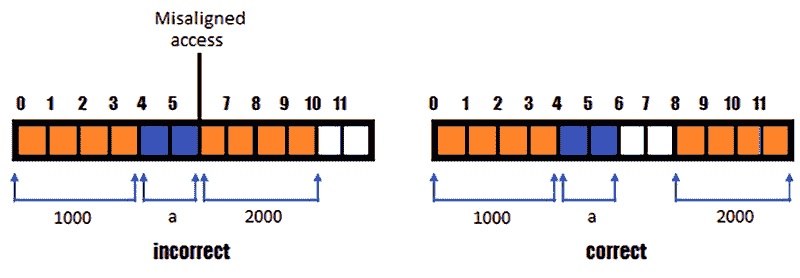

图 7.17：修复未对齐问题

但我们应该怎么做呢？我们知道当前的偏移量是 6，而 6 不能被 4 整除（`int`的对齐）。因此，我们正在寻找下一个能被 4 整除且最接近且大于 6 的偏移量。显然，这是 8。所以，在我们设置 2000 个`int`值之前，我们需要 2 个字节的填充（16 位）。如果我们简单地指定偏移量为 8 而不是 6，则此填充将自动添加：

```java
segment.set(ValueLayout.JAVA_INT, 8, 2000); 
```

由于我们的内存段大小为 12 字节，我们将这个`int`正好放在字节 8、9、10 和 11 上。较小的段大小会导致`IndexOutOfBoundsException:` *在内存段 MemorySegment 上的越界访问*。

## 添加显式额外空间（显式填充）以验证对齐

让我们考虑以下类似于 C 的结构（我们将其称为*案例 1*）：

```java
StructLayout product = MemoryLayout.structLayout(
  ValueLayout.JAVA_INT.withName("sku"),
  ValueLayout.JAVA_CHAR.withName("energy"),
  ValueLayout.JAVA_BYTE.withName("weight")); 
```

通过`byteSize()`返回的`product`大小是 7 字节（4 + 2 + 1）。通过`byteAlignment()`返回的`product`对齐是 4（4、2 和 1 中较大的对齐）。通过`byteOffset()`返回的每个成员布局的字节偏移量如下：

```java
long boSku =product.byteOffset(        // 0
  PathElement.groupElement("sku"));
long boEnergy =product.byteOffset(     // 4
  PathElement.groupElement("energy"));
long boWeight =product.byteOffset(     // 6
  PathElement.groupElement("weight")); 
```

如果我们通过图表表示，我们得到以下图示：

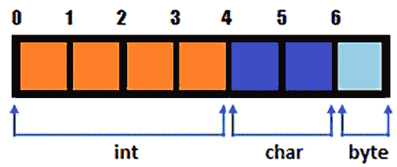

图 7.18：结构的表示

一切看起来都很正常，所以我们可以继续。现在，让我们使用相同的结构，但我们将成员布局安排如下（我们将其称为*案例 2*）：

```java
StructLayout product = MemoryLayout.structLayout( 
  ValueLayout.JAVA_CHAR.withName("energy"),
  ValueLayout.JAVA_INT.withName("sku"),
  ValueLayout.JAVA_BYTE.withName("weight")); 
```

首先，我们将`energy`（`char`）放在偏移量 0 处。由于`energy`（`char`）消耗 2 字节，它后面跟着偏移量 2 处的`sku`（`int`）。由于`sku`（`int`）消耗 4 字节，它后面跟着`weight`（`byte`）。但这种逻辑正确吗？正如你在以下图示（左侧）中可以看到的，这种逻辑是错误的，因为我们有无效的对齐错误，偏移量为 2 的`sku`（`int`）。

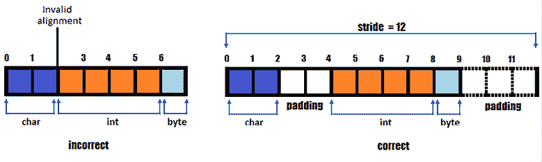

图 7.19：不正确/正确的填充

`energy`（`char`）的对齐是 2，所以它只能从 0、2、4、……开始。由于`energy`（`char`）是第一个，所以我们从偏移量 0 开始。接下来，`sku`（`int`）的对齐是 4，所以它只能从 0、4、8、……开始。这就是为什么`sku`的起始地址是 4 而不是 2。最后，`weight`（`byte`）的对齐是 1，所以它可以在`sku`（`int`）之后偏移量 8 处开始。

因此，通过遵循对齐规则，我们得出结论，`product`的大小是 9，而不是 7。在这个时候，我们知道为了对齐`sku`（`int`），我们应该在偏移量 2 处添加 2 个字节的填充（16 位），所以让我们这样做：

```java
StructLayout product = MemoryLayout.structLayout(
  ValueLayout.JAVA_CHAR.withName("energy"),
  **MemoryLayout.paddingLayout(****2****),**
  ValueLayout.JAVA_INT.withName("sku"),
  ValueLayout.JAVA_BYTE.withName("weight")); 
```

接下来，让我们假设我们想要重复这个类似 C 的结构 2 次（或*n*次）。为此，我们将结构嵌套在序列布局中，如下所示（让我们将其称为*情况 3*）：

```java
SequenceLayout product = MemoryLayout.sequenceLayout(
  2, MemoryLayout.structLayout(
    ValueLayout.JAVA_CHAR.withName("energy"),
    MemoryLayout.paddingLayout(2),
    ValueLayout.JAVA_INT.withName("sku"),
    ValueLayout.JAVA_BYTE.withName("weight"))); 
```

这次，代码因为异常`IllegalArgumentException:`而失败，*元素布局大小不是对齐的倍数*。现在发生了什么？好吧，第一个结构实例从偏移量 0 到偏移量 8，并且，根据我们的代码，第二个结构实例从偏移量 9 到偏移量 18，如下面的图所示（顶部图）：

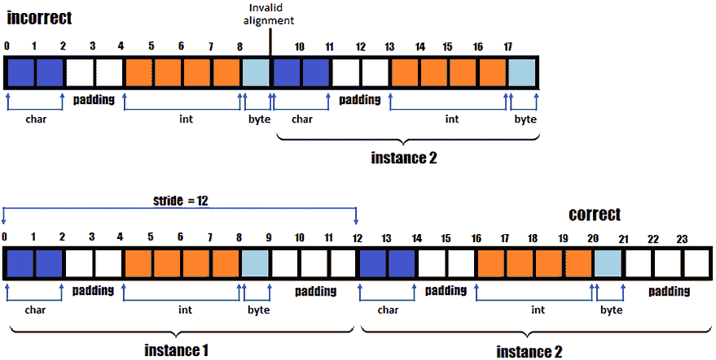

图 7.20：计算步长

但这是不正确的，因为结构的第二个实例（以及第三个、第四个等）没有遵循对齐规则。结构的对齐是 4，所以结构实例应该在 0、4、8、12、16、……，而不是在 9。这意味着我们需要计算步长，这给出了两个成员布局之间的最小字节距离——在这里，是我们结构的两个实例。

我们知道结构实例的大小是 9，其对齐是 4。因此，我们需要找到一个能被 4 整除的偏移量，它大于 9 且最接近 9。这是 12。由于步长是 12，这意味着结构的第二个实例从偏移量 12 开始。我们需要添加 3（12-9）字节的填充：

```java
SequenceLayout product = MemoryLayout.sequenceLayout(
  2, MemoryLayout.structLayout(
    ValueLayout.JAVA_CHAR.withName("energy"),
    MemoryLayout.paddingLayout(2),
    ValueLayout.JAVA_INT.withName("sku"),
    ValueLayout.JAVA_BYTE.withName("weight"),
    **MemoryLayout.paddingLayout(****3****)**)); 
```

完成！正如你所见，成员布局的顺序非常重要。通过了解大小、对齐、步长和填充，我们可以通过简单地按正确的顺序排列成员布局来优化内存分配，这样就需要 0 或最小的填充。

在捆绑的代码中，你可以找到更多关于排列我们结构成员布局的示例。

# 156. 复制和切片内存段

让我们考虑以下内存段（`arena` 是 `Arena` 的一个实例）：

```java
MemorySegment srcSegment = arena.allocateArray(
  ValueLayout.JAVA_INT, 1, 2, 3, 4, -1, -1, -1, 
                        52, 22, 33, -1, -1, -1, -1, -1, 4); 
```

接下来，让我们看看我们如何复制这个段的全部内容。

## 复制一个段

我们可以通过`copyFrom(MemorySegment src)`来复制这个内存段，如下所示：

```java
MemorySegment copySegment = srcSegment.copyFrom(srcSegment); 
```

我们可以很容易地看到数据是否被复制如下：

```java
System.out.println("Data: " + Arrays.toString(
  copySegment.toArray(ValueLayout.JAVA_INT))); 
```

这是一个批量操作，它创建给定内存段的全拷贝。

## 将段的一部分复制到另一个段中（1）

假设我们只想将`srcSegment`的一部分复制到另一个段（`dstSegment`）中。例如，如果我们想将`srcSegment`的最后 8 个元素（[22, 33, -1, -1, -1, -1, -1, 4]）复制到`dstSegment`中，我们首先会相应地分配`dstSegment`：

```java
MemorySegment dstSegment
  = arena.allocateArray(ValueLayout.JAVA_INT, 8); 
```

接下来，我们调用`copy(MemorySegment srcSegment, long srcOffset, MemorySegment dstSegment, long dstOffset, long bytes)`方法，如图所示：

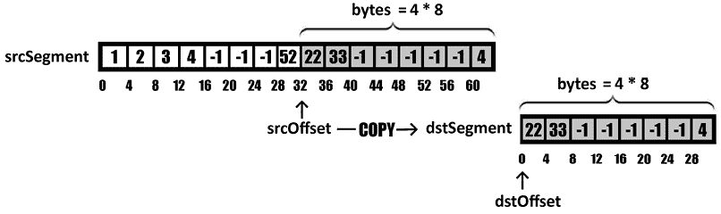

图 7.21：将段的一部分复制到另一个段中（1）

因此，我们指定源段为`srcSsegment`，源偏移量为 32（跳过前 8 个元素），目标段为`dstSegment`，目标偏移量为 0，要复制的字节数为 32（复制最后 8 个元素）：

```java
MemorySegment.copy(srcSegment, 32, dstSegment, 0, 32); 
```

实际上，我们将`srcSegment`的一半复制到了`dstSegment`中。

## 将段复制到堆内存数组中

假设我们只想将`srcSegment`的一部分复制到堆内存 Java 常规数组（`dstArray`）中。例如，如果我们想将`srcSegment`的最后 8 个元素（[22, 33, -1, -1, -1, -1, -1, 4]）复制到`dstArray`中，我们首先会相应地创建`dstArray`：

```java
int[] dstArray = new int[8]; 
```

接下来，我们将调用`copy(MemorySegment srcSegment, ValueLayout srcLayout, long srcOffset, Object dstArray, int dstIndex, int elementCount)`，如图所示：

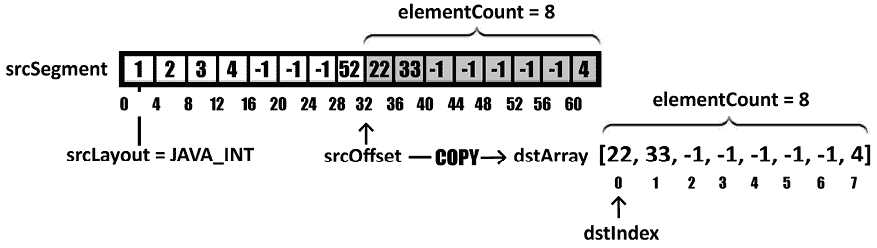

图 7.22：将段复制到堆内存数组中

因此，我们指定源段为`srcSegment`，源布局为`JAVA_INT`，源偏移量为 32（跳过前 8 个元素），目标数组为`dstArray`，目标数组索引为 0，要复制的元素数量为 8：

```java
MemorySegment.copy(
  srcSegment, ValueLayout.JAVA_INT, 32, dstArray, 0, 8); 
```

实际上，我们将非堆内存`srcSegment`的一半复制到了堆内存`dstArray`中。

## 将堆内存数组复制到段中

假设我们想将堆内存数组（或其一部分）复制到段中。给定的堆内存数组是`srcArray`：

```java
int[] srcArray = new int[]{10, 44, 2, 6, 55, 65, 7, 89}; 
```

目标段可以容纳 16 个整数值：

```java
MemorySegment dstSegment
  = arena.allocateArray(ValueLayout.JAVA_INT, 16); 
```

接下来，我们想要用`srcArray`中的元素覆盖`dstSegment`的最后 8 个元素，而前面的元素保持为 0。为此，我们调用`copy(Object srcArray, int srcIndex, MemorySegment dstSegment, ValueLayout dstLayout, long dstOffset, int elementCount)`，如图所示：

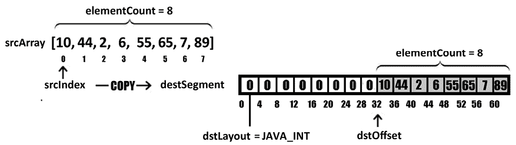

图 7.23：将堆内存数组复制到段中

因此，我们指定源数组为`srcArray`，源索引为 0，目标段为`dstSegment`，目标布局为`JAVA_INT`，目标偏移量为 32（跳过前 8 个元素），要复制的元素数量为 8：

```java
MemorySegment.copy(
  srcArray, 0, dstSegment, ValueLayout.JAVA_INT, 32, 8); 
```

实际上，我们将堆内存`srcArray`作为非堆内存`destSegment`的第二半进行复制。

## 将段的一部分复制到另一个段中（2）

让我们考虑前几节中的`srcSegment`（1, 2, 3, 4, -1, -1, -1, 52, 22, 33, -1, -1, -1, -1, -1, 4）和`dstSegment`（0, 0, 0, 0, 0, 0, 0, 0, 10, 44, 2, 6, 55, 65, 7, 89）。我们希望将`srcSegment`的最后 8 个元素（22, 33, -1, -1, -1, -1, -1, 4）复制为`dstSegment`的前 8 个元素（10, 44, 2, 6, 55, 65, 7, 89）。我们知道这可以通过`copy(MemorySegment srcSegment, long srcOffset, MemorySegment dstSegment, long dstOffset, long bytes)`方法实现，如下所示：

```java
MemorySegment.copy(srcSegment, 32, dstSegment, 0, 32); 
```

或者，我们可以使用`copy(MemorySegment srcSegment, ValueLayout srcElementLayout, long srcOffset, MemorySegment dstSegment, ValueLayout dstElementLayout, long dstOffset, long elementCount)`，如下图所示：

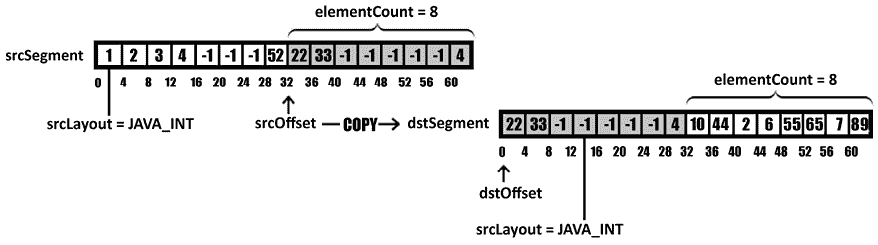

图 7.24：将段的一部分复制到另一个段（2）

因此，我们指定源段为`srcSegment`，源布局为`JAVA_INT`，源偏移量为 32（跳过前 8 个元素），目标段为`dstSegment`，目标布局为`JAVA_INT`，目标偏移量为 0，要复制的元素数量为 8：

```java
MemorySegment.copy(srcSegment, ValueLayout.JAVA_INT, 
  32, dstSegment, ValueLayout.JAVA_INT, 0, 8); 
```

随意测试这个方法与不同的值布局。接下来，让我们谈谈切片。

## 切片一个段

接下来，假设我们想要将包含（1, 2, 3, 4, -1, -1, -1, 52, 22, 33, -1, -1, -1, -1, -1, 4）的段切割成三个独立的`IntVector`实例，而不使用`copy()`方法。因此，`v1`应包含[1, 2, 3, 4]，`v2`应包含[52, 22, 33, 0]，而`v3`应包含[4, 0, 0, 0]。由于一个`int`需要 4 个字节，并且我们最多有 4 个`int`值，所以我们选择`SPECIES_128`（4 个`int`值 x 4 字节 = 16 字节 x 8 位 = 128 位）：

```java
VectorSpecies<Integer> VS128 = IntVector.SPECIES_128; 
```

接下来，我们需要切片内存段以消除-1 的值。这可以通过`asSlice(long offset)`和`asSlice(long offset, long newSize)`方法实现。第一个参数表示起始偏移量。第二个参数表示新内存段的大小。以下图示有助于我们澄清这一点：

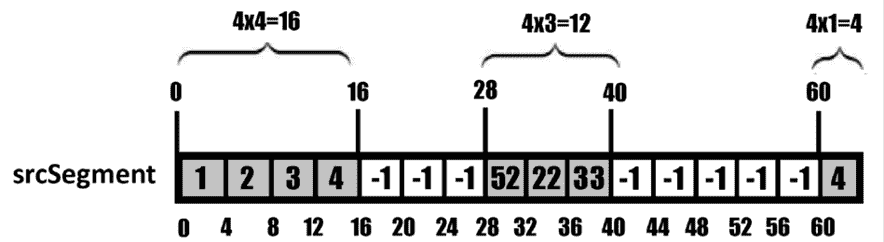

图 7.25：切片内存段

第一个内存段从偏移量 0 开始，到偏移量 16 结束，因此它包含 4 个 4 字节的`int`值（`asSlice(0, 16)`）。第二个内存段从偏移量 28 开始，到偏移量 40 结束，因此它包含 3 个 4 字节的`int`值（`asSlice(28, 12)`）。最后，第三个内存段从偏移量 60 开始，到段末尾结束，因此它包含一个 4 字节的`int`值（`asSlice(60)`或`asSlice(60, 4)`）。相应的代码如下所示：

```java
IntVector v1, v2, v3;
try (Arena arena = Arena.ofConfined()) {
  MemorySegment srcSegment = arena.allocateArray(
    ValueLayout.JAVA_INT, 1, 2, 3, 4, -1, -1, -1, 52, 22, 33,
                         -1, -1, -1, -1, -1, 4);
v1 = IntVector.fromMemorySegment(VS128,
  srcSegment.asSlice(0, 16), 0, ByteOrder.nativeOrder());
v2 = IntVector.fromMemorySegment(VS128,
  srcSegment.asSlice(28, 12), 0, ByteOrder.nativeOrder(),
  VS128.indexInRange(0, 3));
v3 = IntVector.fromMemorySegment(VS128,
  srcSegment.asSlice(60), 0, ByteOrder.nativeOrder(),
  VS128.indexInRange(0, 1));
} 
```

完成！当然，我们也可以在常规 Java 数组中切片内存段。如下所示：

```java
int[] jv1, jv2, jv3;
try (Arena arena = Arena.ofConfined()) {
  MemorySegment srcSegment = arena.allocateArray(
    ValueLayout.JAVA_INT, 1, 2, 3, 4, -1, -1, -1, 52, 22, 33,
                         -1, -1, -1, -1, -1, 4);
  jv1 = srcSegment
    .asSlice(0, 16).toArray(ValueLayout.JAVA_INT);
  jv2 = srcSegment
    .asSlice(28, 12).toArray(ValueLayout.JAVA_INT);
  jv3 = srcSegment
    .asSlice(60).toArray(ValueLayout.JAVA_INT);
} 
```

`toArray()`方法从切片内存段返回一个 Java 常规数组（此处为`int[]`）。

### 使用 asOverlappingSlice()

`asOverlappingSlice(MemorySegment other)` 方法返回一个重叠给定段作为 `Optional<MemorySegment>` 的这个段的切片。考虑以下段（`arena` 是 `Arena` 的一个实例）：

```java
MemorySegment segment = arena.allocateArray(
  ValueLayout.JAVA_INT, new int[]{1, 2, 3, 4, 6, 8, 4, 5, 3}); 
```

然后，我们在偏移量 12 处切片，所以值为 4：

```java
MemorySegment subsegment = segment.asSlice(12); 
```

最后，我们调用 `asOverlappingSlice()` 来查看重叠发生在哪里：

```java
int[] subarray = segment.asOverlappingSlice(subsegment)
  .orElse(MemorySegment.NULL).toArray(ValueLayout.JAVA_INT); 
```

结果数组是 [4, 6, 8, 4, 5, 3]。

### 使用 segmentOffset()

`segmentOffset(MemorySegment other)` 返回给定段（`other`）相对于这个段的偏移量。考虑以下段（`arena` 是 `Arena` 的一个实例）：

```java
MemorySegment segment = arena.allocateArray(
  ValueLayout.JAVA_INT, new int[]{1, 2, 3, 4, 6, 8, 4, 5, 3}); 
```

然后，我们在偏移量 16 处切片，所以值为 6：

```java
MemorySegment subsegment = segment.asSlice(16); 
```

接下来，我们调用 `segmentOffset()` 来找出在 `segment` 中 `subsegment` 的偏移量：

```java
// 16
long offset = segment.segmentOffset(subsegment);
// 6
segment.get(ValueLayout.JAVA_INT, offset) 
```

你可以在捆绑的代码中练习所有这些示例。挑战自己进一步探索 `MemorySegment.mismatch()`。

# 157. 解决切片分配器问题

让我们考虑以下三个 Java 常规 `int` 数组：

```java
int[] arr1 = new int[]{1, 2, 3, 4, 5, 6};
int[] arr2 = new int[]{7, 8, 9};
int[] arr3 = new int[]{10, 11, 12, 13, 14}; 
```

接下来，我们想要为这些数组中的每一个分配一个内存段。一个直接的方法依赖于在 *问题 150* 中引入的 `Arena.allocateArray()`：

```java
try (Arena arena = Arena.ofConfined()) {
  MemorySegment segment1 
    = arena.allocateArray(ValueLayout.JAVA_INT, arr1);
  MemorySegment segment2 
    = arena.allocateArray(ValueLayout.JAVA_INT, arr2);
  MemorySegment segment3 
    = arena.allocateArray(ValueLayout.JAVA_INT, arr3);
} 
```

这种方法为每个给定的数组分配足够的内存。但是，有时我们只想分配一定量的内存。如果这个固定量不足，那么我们想以不同的方式解决这个问题。为此，我们可以依赖 `java.lang.foreign.SegmentAllocator`。当然，还有许多其他场景下 `SegmentAllocator` 都很有用，但现在，让我们解决以下问题。

假设我们允许分配固定大小 10 * 4 = 40 字节。这是一大块内存，应该在三个数组之间切片。首先，我们这样分配这些 40 字节：

```java
try (Arena arena = Arena.ofConfined()) {
  SegmentAllocator allocator = 
    SegmentAllocator.slicingAllocator(arena.allocate(10 * 4)); 
  ... 
```

接下来，我们使用 `allocator` 从这些 40 字节中为每个数组分配一个切片。第一个数组 (`arr1`) 有 6 个值，所以内存段获得 6 * 4 = 24 字节：

```java
 MemorySegment segment1 = allocator.allocateArray(
    ValueLayout.JAVA_INT, arr1);
  ... 
```

分段分配器还可用 40 - 24 = 16 个额外的字节。第二个数组 (`arr2`) 有 3 个值，所以内存段获得 3 * 4 = 12 字节：

```java
 MemorySegment segment2 = allocator.allocateArray(
    ValueLayout.JAVA_INT, arr2);
  ... 
```

分段分配器还可用 16 - 12 = 4 个额外的字节。第三个数组 (`arr3`) 有 5 个值，因此它需要一个 5 * 4 = 20 字节的内存段，但只有 4 个可用。这导致 `IndexOutOfBoundsException` 并给我们控制权来处理这个特殊情况：

```java
 MemorySegment segment3 = allocator.allocateArray(
    ValueLayout.JAVA_INT, arr3);
} catch (IndexOutOfBoundsException e) {
  System.out.println(
    "There is not enough memory to fit all data");
    // handle exception
} 
```

避免这个 `IndexOutOfBoundsException` 的一个可能方法可能是给分段分配器更多的内存。在这种情况下，我们需要给它 16 个额外的字节，所以我们可以这样表达：

```java
SegmentAllocator allocator = SegmentAllocator
  .slicingAllocator(arena.allocate(10 * 4 + 4 * 4)); 
```

当然，你不必写 10 * 4 + 4 * 4。你可以说是 14 * 4，或者只是 56。基本上，我们的三个数组有 14 个 4 字节的元素，最初我们只覆盖了其中的 10 个。接下来，我们增加了内存以覆盖剩余的 4 个。

# 158. 引入切片句柄

假设我们有一个以下嵌套模型（每个有 5 个 `double` 值的 10 个序列）：

```java
SequenceLayout innerSeq
  = MemoryLayout.sequenceLayout(5, ValueLayout.JAVA_DOUBLE);
SequenceLayout outerSeq
  = MemoryLayout.sequenceLayout(10, innerSeq); 
```

接下来，我们通过`PathElement`定义一个`VarHandle`，并相应地在这个模型中填充一些随机数据：

```java
VarHandle handle = outerSeq.varHandle(
  PathElement.sequenceElement(),
  PathElement.sequenceElement());
try (Arena arena = Arena.ofConfined()) {
  MemorySegment segment = arena.allocate(outerSeq);
  for (int i = 0; i < outerSeq.elementCount(); i++) {
    for (int j = 0; j < innerSeq.elementCount(); j++) {
      handle.set(segment, i, j, Math.random());
    }
  }
} 
```

好的，你应该熟悉这段代码，到目前为止没有什么新的内容。接下来，我们计划从这个模型中提取包含 5 个`double`值序列的第三个序列。我们可以通过`sliceHandle(PathElement... elements)`方法来完成这个任务，它返回一个`java.lang.invoke.MethodHandle`。这个`MethodHandle`接受一个内存段，并返回一个与所选内存布局相对应的切片。以下是我们的场景代码：

```java
MethodHandle mHandle = outerSeq.sliceHandle(
  PathElement.sequenceElement());
System.out.println("\n The third sequence of 10: " 
  + Arrays.toString(
    ((MemorySegment) mHandle.invoke(segment, 3))
      .toArray(ValueLayout.JAVA_DOUBLE))); 
```

完成！现在，你知道如何从给定的内存段中切片出特定的内存布局。

# 159. 引入布局扁平化

假设我们有一个以下嵌套模型（与*问题 158*中的模型完全相同）：

```java
SequenceLayout innerSeq
  = MemoryLayout.sequenceLayout(5, ValueLayout.JAVA_DOUBLE);
SequenceLayout outerSeq
  = MemoryLayout.sequenceLayout(10, innerSeq); 
```

接下来，我们通过`PathElement`定义一个`VarHandle`，并相应地在这个名为`segment`的内存段中填充一些随机数据（你可以在*问题 158*中看到列出的代码）。

我们的目标是将这个嵌套模型转换为平面模型。所以，我们希望有一个包含 50 个`double`值的序列，而不是 10 个序列，每个序列包含 5 个`double`值。这可以通过`flatten()`方法实现，如下所示：

```java
SequenceLayout flatten = outerSeq.flatten();
VarHandle fhandle = flatten.varHandle(
  PathElement.sequenceElement());
for (int i = 0; i < flatten.elementCount(); i++) {
  System.out.printf("\nx = %.2f", fhandle.get(segment, i));
} 
```

注意到`PathElement`，它遍历单个序列。这是扁平化操作后的序列。我们可以进一步分配另一个内存段给这个序列，并设置新的数据：

```java
try (Arena arena = Arena.ofConfined()) {
  MemorySegment segment = arena.allocate(flatten);
  for (int i = 0; i < flatten.elementCount(); i++) {
    fhandle.set(segment, i, Math.random());
  }
} 
```

接下来，让我们看看我们如何重塑内存布局。

# 160. 引入布局重塑

假设我们有一个以下嵌套模型（与*问题 158*中的模型完全相同）：

```java
SequenceLayout innerSeq
  = MemoryLayout.sequenceLayout(5, ValueLayout.JAVA_DOUBLE);
SequenceLayout outerSeq
  = MemoryLayout.sequenceLayout(10, innerSeq); 
```

接下来，我们通过`PathElement`定义一个`VarHandle`，并相应地在这个模型中填充一些随机数据（你可以在*问题 158*中看到列出的代码）。

我们的目标是将这个模型重塑成以下样子：

```java
SequenceLayout innerSeq
  = MemoryLayout.sequenceLayout(25, ValueLayout.JAVA_DOUBLE);
SequenceLayout outerSeq
  = MemoryLayout.sequenceLayout(2, innerSeq); 
```

因此，我们希望有 25 个序列，每个序列包含 2 个`double`值，而不是 10 个序列，每个序列包含 5 个`double`值。为了实现这个重塑目标，我们可以依赖`reshape(long... elementCounts)`方法。这个方法接受这个序列布局的元素，并将它们重新排列成符合给定元素计数列表的多维序列布局。所以，在我们的情况下，我们这样做：

```java
SequenceLayout reshaped = outerSeq.reshape(25, 2); 
```

你可以在捆绑的代码中看到完整的示例。

# 161. 引入布局展开器

假设我们有一个以下嵌套模型（与*问题 158*中的模型完全相同）：

```java
SequenceLayout innerSeq
  = MemoryLayout.sequenceLayout(5, ValueLayout.JAVA_DOUBLE);
SequenceLayout outerSeq
  = MemoryLayout.sequenceLayout(10, innerSeq); 
```

接下来，我们通过`PathElement`定义一个`VarHandle`，并相应地在这个名为`segment`的内存段中填充一些随机数据（你可以在*问题 158*中看到列出的代码）。

接下来，假设我们想要从第七个序列中提取第三个`double`值（计数从 0 开始）。在众多方法中，我们可以依赖在*问题 158*中引入的`sliceHandle()`，如下所示：

```java
MethodHandle mHandle = outerSeq.sliceHandle(
  PathElement.sequenceElement(),
  PathElement.sequenceElement());
MemorySegment ms = (MemorySegment)     
  mHandle.invokeExact(segment, 7L, 3L);
System.out.println(ms.get(ValueLayout.JAVA_DOUBLE, 0)); 
```

另一种方法是通过使用一个 *数组传播* 方法句柄。换句话说，通过调用 `asSpreader(Class<?> arrayType, int arrayLength)` 方法，我们可以获得一个包含我们想要传递的位置参数的 *传播数组*，其长度等于给定的 `arrayLength`。由于我们有两个传递的 `long` 参数（7L 和 3L），我们需要一个长度为 2 的 `long[]` 数组：

```java
MemorySegment ms = (MemorySegment) mHandle
  .asSpreader(Long[].class, 2)
  .invokeExact(segment, new Long[]{7L, 3L}); 
```

你可能还对 `asCollector(Class<?> arrayType, int arrayLength)` 感兴趣，这基本上是 `asSpreader()` 的反义词。你提供一个参数列表，这个方法会将它们收集在一个 *数组收集器* 中。

# 162. 介绍内存段视图 VarHandle

让我们考虑以下简单的内存段来存储一个 int (`arena` 是 `Arena` 的一个实例)：

```java
MemorySegment segment = arena.allocate(ValueLayout.JAVA_INT); 
```

我们知道我们可以通过 `PathElement` 创建一个 `VarHandle`：

```java
// VarHandle[varType=int, 
// coord=[interface java.lang.foreign.MemorySegment]]
VarHandle handle = ValueLayout.JAVA_INT.varHandle(); 
```

或者，通过 `arrayElementVarHandle()`：

```java
// VarHandle[varType=int, 
// coord=[interface java.lang.foreign.MemorySegment, long]]
VarHandle arrhandle
  = ValueLayout.JAVA_INT.arrayElementVarHandle(); 
```

`MethodHandles.memorySegmentViewVarHandle(ValueLayout layout)` 是创建可以用于访问内存段的 `VarHandle` 的另一种方法。返回的 `VarHandle` 将内存段的内容视为给定 `ValueLayout` 的序列。在我们的例子中，代码如下：

```java
// VarHandle[varType=int, 
// coord=[interface java.lang.foreign.MemorySegment, long]]
VarHandle viewhandle = MethodHandles
  .memorySegmentViewVarHandle(ValueLayout.JAVA_INT); 
```

接下来，我们可以依靠 `insertCoordinates(VarHandle target, int pos, Object... values)` 来指定在 `VarHandle` 实际调用之前的一组 *绑定坐标*。换句话说，返回的 `VarHandle` 将暴露比给定的 `target` 更少的坐标类型（CTs）。

在我们的例子中，`target` 参数（在插入一组 *绑定坐标* 之后调用）是 `viewhandle`。第一个坐标的位置是 1，我们有一个表示类型 `long` 的偏移量 0 的单个 *绑定坐标*：

```java
viewhandle = MethodHandles
  .insertCoordinates(viewhandle, 1, 0); 
```

现在，当我们调用流行的 `VarHandle.set/get(Object...)` 在返回的 `VarHandler` 上时，传入的坐标值会自动与给定的 *绑定坐标* 值连接。结果传递给目标 `VarHandle`：

```java
viewhandle.set(segment, 75); 
System.out.println("Value: " + viewhandle.get(segment)); 
```

完成！现在，你知道了创建用于解引用内存段的 `VarHandle` 的三种方法。

# 163. 流式传输内存段

通过 `elements(MemoryLayout elementLayout)` 方法将 Java Stream API 与内存段结合使用可以实现。此方法获取一个元素布局，并返回一个 `Stream<MemorySegment>`，它在这个段中的非重叠切片上是一个顺序流。流的大小与指定布局的大小相匹配。

让我们考虑以下内存布局：

```java
SequenceLayout xy = MemoryLayout
  .sequenceLayout(2, MemoryLayout.structLayout(
    ValueLayout.JAVA_INT.withName("x"),
    ValueLayout.JAVA_INT.withName("y"))); 
```

接下来，我们声明两个 `VarHandle` 并设置一些数据：

```java
VarHandle xHandle = xy.varHandle(
  PathElement.sequenceElement(),
  PathElement.groupElement("x"));
VarHandle yHandle = xy.varHandle(
  PathElement.sequenceElement(), 
  PathElement.groupElement("y"));
try (Arena arena = Arena.ofShared()) {
  MemorySegment segment = arena.allocate(xy);
  xHandle.set(segment, 0, 5);
  yHandle.set(segment, 0, 9);
  xHandle.set(segment, 1, 6);
  yHandle.set(segment, 1, 8);
  // stream operations
} 
```

假设我们想要汇总所有数据。为此，我们可以这样做：

```java
int sum = segment.elements(xy)
  .map(t -> t.toArray(ValueLayout.JAVA_INT))
  .flatMapToInt(t -> Arrays.stream(t))
  .sum(); 
```

或者，我们可以简单地传递适当的布局，甚至启用并行处理：

```java
int sum = segment.elements(ValueLayout.JAVA_INT)
  .parallel()
  .mapToInt(s -> s.get(ValueLayout.JAVA_INT, 0))
  .sum(); 
```

这两种方法都返回 28 = 5 + 9 + 6 + 8。

那么只从第一个 (*x*, *y*) 对中汇总值怎么样？为此，我们必须通过 `sliceHandle()` 切片与第一个 (*x*, *y*) 对对应的布局——我们在 *问题 151* 中介绍了这个方法：

```java
MethodHandle xyHandle
  = xy.sliceHandle(PathElement.sequenceElement()); 
```

接下来，我们切割第一个（*x*，*y*）对的段（如果我们用 1 替换 0，那么我们得到第二个（*x*，*y*）对的段）：

```java
MemorySegment subsegment 
  = (MemorySegment) xyHandle.invoke(segment, 0); 
```

我们用它来计算所需的和：

```java
int sum = subsegment.elements(ValueLayout.JAVA_INT)
  .parallel()
  .mapToInt(s -> s.get(ValueLayout.JAVA_INT, 0))
  .sum(); 
```

结果很清晰，14 = 5 + 9。

我们如何将第一对*y*与第二对（*x*，*y*）相加？为此，我们可以通过`asSlice()`切割适当的段——我们在*问题 156*中介绍了这个方法：

```java
var sum = segment.elements(xy)
  .parallel()
  .map(t -> t.asSlice(4).toArray(ValueLayout.JAVA_INT)) 
  .flatMapToInt(t -> Arrays.stream(t))
  .sum(); 
```

`asSlice(4)`简单地跳过了第一个*x*，因为这是存储在偏移量 0 处，消耗了 4 个字节。从偏移量 4 到末尾，我们有第一个*y*，以及第二对（*x*，*y*）。所以，结果是 23 = 9 + 6 + 8。

注意，这次，我们使用了共享区域（`Arena.ofShared()`）。这是必要的，因为段应该在多个线程之间共享。

完成！请随意挑战自己解决更多此类场景。

# 164. 解决映射内存段问题

我们知道计算机有有限的物理内存，这被称为 RAM。然而，常识告诉我们，我们不能分配比可用 RAM 更大的内存段（这应该导致内存不足错误）。但这并不完全正确！这正是*映射内存段*进入讨论的地方。

映射的内存段代表虚拟内存，可以非常大（千兆字节、太字节，或者你可以想到的任何大小）。这个虚拟内存实际上是文件或简称为*内存映射文件*（一个文件可以是普通文件，也可以是任何其他类型的文件描述符）映射的。

显然，在任何时候，只有虚拟内存的一部分存在于实际内存中。这就是为什么我们可以在拥有较少实际 RAM 的笔记本电脑上分配 TB 级的虚拟内存。实际上，缺失的映射内存部分会在需要时加载到实际 RAM 中。在加载过程中，操作此内存的进程会暂时挂起。

映射内存文件的目标是极大地减少 I/O 操作。标准的读写操作依赖于将数据复制到缓冲区，而映射文件将文件数据直接放入进程地址空间。这要快得多，并且可以在进程间共享。

在 Java 中，我们可以通过`java.nio.channels.FileChannel` API 设置映射内存文件，更确切地说，通过`map(MapMode mode, long offset, long size, Arena arena)`方法。以下是一个设置 1 MB 映射内存文件并写入/读取一些文本到其中的示例（你可以在你的机器上尝试一个 1 GB（1,073,741,824 字节）或更大的文件）：

```java
try (FileChannel file = FileChannel.open(
  Path.of("readme.txt"), CREATE, READ, WRITE);   
  Arena arena = Arena.ofConfined()) {
    MemorySegment segment
      = file.map(READ_WRITE, 0, 1048576, arena);  
    // write the data
    segment.setUtf8String(0, "This is a readme file ...");
    segment.setUtf8String(1048576/2, 
      "Here is the middle of the file ...");
    segment.setUtf8String(1048576-32, 
      "Here is the end of the file ...");
    // read some data
    System.out.println(segment.getUtf8String(1048576/2));
} 
```

当一个文件包含大量空字节（所谓的空洞，`\x00`）时，它就成为一个很好的候选稀疏文件。在稀疏文件中，这些空洞不再保留在存储设备上，因此不再消耗物理内存。这是尝试更有效地使用内存并停止使用零字节块消耗物理内存的一种尝试。每个操作系统都有自己处理稀疏文件的方式，但一般来说，零字节块被简化为一些有用的元数据，这些元数据对于动态生成它们是有意义的。有关更多详细信息和一个有用的图表，请考虑这篇维基百科文章（[`en.wikipedia.org/wiki/Sparse_file`](https://en.wikipedia.org/wiki/Sparse_file)）。

在 Java 中，我们可以通过将`java.nio.file.StandardOpenOption.SPARSE`选项添加到`CREATE_NEW`旁边的选项列表中，来创建一个稀疏文件：

```java
try (FileChannel file = FileChannel.open(
  Path.of("sparse_readme.txt"), 
    CREATE_NEW, SPARSE, READ, WRITE);
  Arena arena = Arena.ofConfined()) {
   MemorySegment segment
      = file.map(READ_WRITE, 0, 1048576, arena);
    // write the data 
    segment.setUtf8String(0, "This is a readme file ...");
    segment.setUtf8String(1048576/2, 
      "Here is the middle of the file ...");
    segment.setUtf8String(1048576-32, 
      "Here is the end of the file ...");
    // read some data
    System.out.println(segment.getUtf8String(0));
} 
```

根据你的操作系统（机器），你应该使用专用工具来详细检查这些文件，并深入了解它们的工作原理。

如果你经常使用映射内存文件，那么你可能更喜欢扩展`Arena`接口，并从以下简单骨架开始提供自己的实现：

```java
public class MappedArena implements Arena {
  private final String fileName;
  private final Arena shared;
  public MappedArena(String fileName) {
    this.fileName = fileName;
    this.shared = Arena.ofShared();
  }
  @Override
  public MemorySegment allocate(
    long byteSize, long byteAlignment) {
    try (FileChannel file = FileChannel.open(
      Path.of(fileName + System.currentTimeMillis() + ".txt"),
        CREATE_NEW, SPARSE, READ, WRITE)) {
      return file.map(
        READ_WRITE, 0, byteSize, shared);
    } catch (IOException e) {
      throw new RuntimeException(e);
    }
  }
  // more overridden methods
} 
```

使用`MappedArena`非常简单：

```java
try (Arena arena = new MappedArena("readme")) {
  MemorySegment segment1 = arena.allocate(100);
  MemorySegment segment2 = arena.allocate(50);
  segment1.setUtf8String(0, "Hello");
  segment2.setUtf8String(0, "World");
  System.out.println(segment1.getUtf8String(0) 
    + " " + segment2.getUtf8String(0));
} 
```

当然，你可以改进/修改此代码以获得其他配置。也许你想要一个受限的竞技场（这里，我们有一个共享竞技场），也许你希望在竞技场关闭后删除文件（这里，文件保留在磁盘上，因此你可以检查它们），也许你不需要稀疏文件（这里，我们使用稀疏文件），也许你更喜欢另一个文件名（这里，我们将给定名称与`System.currentTimeMillis()`和`.txt`扩展名连接），或者也许你需要考虑字节对齐。

# 165. 介绍 Foreign Linker API

Foreign Linker API 的主要目标是提供一个强大且易于使用的 API（无需编写 C/C++代码），以维持 Java 代码和原生共享库的 C/C++外部函数之间的互操作性（未来，将通过此 API 支持其他编程语言）。

调用外部代码的旅程始于`java.lang.foreign.SymbolLookup`功能接口。此接口代表入口点，并包括在已加载的原生共享库中查找给定符号的地址。有三种方法可以实现这一点，如下所示：

`Linker.defaultLookup()` – 如其名所示，`defaultLookup()`表示一个*默认查找*，它根据当前操作系统扫描并定位常用原生共享库的所有符号：

```java
Linker linker = Linker.nativeLinker();
SymbolLookup lookup = linker.defaultLookup(); 
```

`SymbolLookup.loaderLookup()` – 表示一个*加载器查找*，它扫描并定位当前类加载器（通过`System.loadLibrary()`和`System.load()`基于`java.library.path`）加载的所有原生共享库中的所有符号：

```java
System.loadLibrary("fooLib"); // fooLib.dll is loaded here
SymbolLookup lookup = SymbolLookup.loaderLookup(); 
```

`SymbolLookup.libraryLookup(String name, Arena arena)` – 表示一个*库查找*，能够在指定的区域范围内扫描和加载具有给定名称的本地共享库。它还为此本地共享库中的所有符号创建符号查找。或者，我们也可以通过`SymbolLookup.libraryLookup(Path path, Arena arena)`指定一个`Path`：

```java
try (Arena arena = Arena.ofConfined()) { 
  SymbolLookup lookup = SymbolLookup.libraryLookup(
    libName/libPath, arena);
} 
```

如果这一步成功完成，那么我们可以选择我们想要调用的外部函数对应的符号。可以通过`SymbolLookup.find(String name)`方法通过其名称找到外部函数。

如果指向的方法在找到的符号中存在，则`find()`返回一个零长度的内存段，该段被`Optional (Optional<MemorySegment>)`包装。此段的*基本地址*指向外部函数的入口点：

```java
MemorySegment fooFunc = mathLookup.find("fooFunc").get(); 
```

到目前为止，我们已经定位了本地共享库并找到了其方法之一（`fooFunc`）。接下来，我们必须将 Java 代码链接到这个外部函数。这是通过基于两个概念的`Linker` API 完成的：

+   *downcall* – 从 Java 代码调用本地代码

+   *upcall –* 从本地代码调用 Java 代码

这两个概念通过`Linker`接口实现。*downcall*通过以下签名的两个方法映射：

```java
MethodHandle downcallHandle(
  FunctionDescriptor function, Linker.Option... options)
default MethodHandle downcallHandle(MemorySegment symbol, 
  FunctionDescriptor function, Linker.Option... options) 
```

通常，通过`find()`方法获得的`MemorySegment`来使用`default`方法，该方法描述了外部函数的签名，以及一个可选的链接器选项集。返回的`MethodHandle`随后用于通过`invoke()`、`invokeExact()`等方法调用外部函数。通过`invoke()`或`invokeExact()`，我们向外部函数传递参数，并访问外部函数运行返回的结果（如果有）。

*upcall*通过以下方法映射：

```java
MemorySegment upcallStub(MethodHandle target, 
  FunctionDescriptor function, Arena arena) 
```

通常，`target`参数指的是 Java 方法，`function`参数描述了 Java 方法的签名，而`arena`参数代表与返回的`MemorySegment`关联的区域。这个`MemorySegment`随后作为 Java 代码的参数传递，该 Java 代码调用（`invoke()`/`invokeExact()`）一个*downcall*方法句柄。因此，这个`MemorySegment`充当了函数指针。

如果我们将这些知识结合起来，就可以编写一个经典的调用`getpid()`方法（在 Windows 10 上，为`_getpid()` – [`learn.microsoft.com/en-us/cpp/c-runtime-library/reference/getpid`](https://learn.microsoft.com/en-us/cpp/c-runtime-library/reference/getpid)）的示例，如下所示（请阅读有意义的注释以了解每一步的细节）：

```java
// get the Linker of the underlying native platform 
// (operating system + processor that runs the JVM)
Linker linker = Linker.nativeLinker();
// "_getpid" is part of the Universal C Runtime (UCRT) Library
SymbolLookup libLookup = linker.defaultLookup();
// find the "_getpid" foreign function
MemorySegment segmentGetpid = libLookup.find("_getpid").get();
// create a method handle for "_getpid"
MethodHandle func = linker.downcallHandle(segmentGetpid,
  FunctionDescriptor.of(ValueLayout.JAVA_INT));
// invoke the foreign function, "_getpid" and get the result
int result = (int) func.invokeExact(); 
System.out.println(result); 
```

此代码已在 Windows 10 上进行了测试。如果您运行的是不同的操作系统，那么请考虑了解此外部函数以相应地调整代码。

# 166. 调用 sumTwoInt()外部函数

你还记得 `sumTwoInt()` 函数吗？我们已经在名为 `math.dll` 的本地共享库中定义了这个 C 函数（检查 *问题 144*、*145* 和 *146*）。假设我们已经将 `math.dll` 库放置在项目文件夹下的 `lib/cpp` 路径中。

我们可以以几乎与调用 `_getpid()` 相同的方式调用此外部函数。由于 `math.dll` 是一个用户定义的库，不常使用，因此不能通过 `defaultLookup()` 加载。解决方案是从 `lib/cpp` 路径显式加载库，如下所示：

```java
Linker linker = Linker.nativeLinker();
Path path = Paths.get("lib/cpp/math.dll");
try (Arena arena = Arena.ofConfined()) { 
  SymbolLookup libLookup = SymbolLookup.libraryLookup(
    path, arena);
  ... 
```

接下来，我们必须在 `math.dll` 中通过名称查找外部函数。如果你的 C 编译器（例如，G++）已经应用了 *mangling*（或 *name decoration*）技术，那么 `sumTwoInt` 在库中已经被重命名为其他名称（这里，`_Z9sumTwoIntii`），应该使用这个名称：

```java
 MemorySegment segmentSumTwoInt
    = libLookup.find("_Z9sumTwoIntii").get();
  ... 
```

接下来，我们定义此 *downcall* 的 `MethodHandle`：

```java
 MethodHandle func = linker.downcallHandle(segmentSumTwoInt,
  FunctionDescriptor.of(ValueLayout.JAVA_LONG, 
    ValueLayout.JAVA_INT, ValueLayout.JAVA_INT));
  ... 
```

最后，我们可以调用外部函数并获取结果：

```java
 long result = (long) func.invokeExact(3, 9);
  System.out.println(result);
} 
```

结果应该是 12。查看捆绑代码中的完整代码。

# 167. 调用 modf() 外部函数

让我们考虑我们想要调用 `modf()` 外部函数。此函数是 C 标准库的一部分，具有以下语法 ([`learn.microsoft.com/en-us/cpp/c-runtime-library/reference/modf-modff-modfl`](https://learn.microsoft.com/en-us/cpp/c-runtime-library/reference/modf-modff-modfl))：

```java
double modf(double x, double *intptr); 
```

此方法获取一个 `double x` 并返回 `x` 的有符号小数部分。`intptr` 是一个指针参数，用于指向应该将整数部分存储为 `double` 值的内存地址。

由于此方法属于 UCRT，可以通过 `defaultLookup()` 找到：

```java
Linker linker = Linker.nativeLinker();
SymbolLookup libLookup = linker.defaultLookup();
try (Arena arena = Arena.ofConfined()) {
  MemorySegment segmentModf = libLookup.find("modf").get();
  ... 
```

到目前为止没有什么新内容！接下来，我们需要定义适当的 `MethodHandle`。因为 `modf()` 的第二个参数是一个指针，所以我们需要指定一个类型为 `ADDRESS` 的值布局：

```java
 MethodHandle func = linker.downcallHandle(segmentModf,   
    FunctionDescriptor.of(ValueLayout.JAVA_DOUBLE, 
      ValueLayout.JAVA_DOUBLE, ValueLayout.ADDRESS));
  ... 
```

如果我们现在能够调用外部函数，我们可以收集给定 `x` 的分数部分，但我们无法获得整数部分。我们必须创建一个内存段，并在调用时将此内存段传递给外部函数。外部函数将在这个内存段中写入整数部分，这个内存段应该能够存储一个 `double` 值：

```java
 MemorySegment segmentIntptr
    = arena.allocate(ValueLayout.JAVA_DOUBLE);
  double fractional
    = (double) func.invokeExact(x, segmentIntptr);
  ... 
```

小数部分由外部键返回。整数部分从偏移量 0 的内存段中读取：

```java
 System.out.println("Fractional part: " + fractional 
    + " Integer part: " + segmentIntptr.get(
     ValueLayout.JAVA_DOUBLE, 0));
} 
```

如果 `x` = 89.76655，那么输出将是：

```java
Fractional part: 0.7665499999999952 Integer part: 89.0 
```

挑战自己将此代码修改为调用 `modff()` 和 `modfl()` 外部函数。

# 168. 调用 strcat() 外部函数

`strcat()` 外部函数是 C 标准库的一部分，具有以下签名 ([`learn.microsoft.com/en-us/cpp/c-runtime-library/reference/strcat-wcscat-mbscat`](https://learn.microsoft.com/en-us/cpp/c-runtime-library/reference/strcat-wcscat-mbscat))：

```java
char *strcat(char *strDestination, const char *strSource); 
```

此函数将 `strSource` 追加到 `strDestination` 的末尾。该函数不获取这些字符串。它获取指向这些字符串的指针（因此，两个 `ADDRESS`）并且不返回值，所以我们依赖于 `FunctionDescriptor.ofVoid()`，如下所示：

```java
Linker linker = Linker.nativeLinker();
SymbolLookup libLookup = linker.defaultLookup();
try (Arena arena = Arena.ofConfined()) {
  MemorySegment segmentStrcat
    = libLookup.find("strcat").get();
  MethodHandle func = linker.downcallHandle(
    segmentStrcat, FunctionDescriptor.ofVoid(
      ValueLayout.ADDRESS, ValueLayout.ADDRESS));
  ... 
```

由于 `strcat()` 的参数是两个指针（`ADDRESS`），我们必须创建两个内存段并相应地设置字符串：

```java
 String strDestination = "Hello ";
  String strSource = "World";
  MemorySegment segmentStrSource
    = arena.allocate(strSource.length() + 1);
  segmentStrSource.setUtf8String(0, strSource);
  MemorySegment segmentStrDestination = arena.allocate(
    strSource.length() + 1 + strDestination.length() + 1);
  segmentStrDestination.setUtf8String(0, strDestination);
  ... 
```

注意 `segmentStrDestination` 的大小。由于 `strcat()` 将源字符串（`strSource`）追加到目标字符串（`strDestination`）的末尾，我们必须准备 `segmentStrDestination` 的大小以适应源字符串，因此其大小是 `strSource.length() + 1 + strDestination.length() + 1`。接下来，我们可以如下调用外部函数：

```java
func.invokeExact(segmentStrDestination, segmentStrSource); 
```

最后，我们从 `segmentStrDestination` 读取结果：

```java
// Hello World
System.out.println(segmentStrDestination.getUtf8String(0)); 
```

因此，`World` 字符串被添加到了 `Hello` 的末尾。

# 169. 调用 bsearch() 外部函数

`bsearch()` 外部函数是 C 标准库的一部分，具有以下签名 ([`learn.microsoft.com/en-us/cpp/c-runtime-library/reference/bsearch`](https://learn.microsoft.com/en-us/cpp/c-runtime-library/reference/bsearch)):

```java
void *bsearch(
  const void *key,
  const void *base,
  size_t num,
  size_t width,
  int ( __cdecl *compare ) (
    const void *key, const void *datum)
); 
```

简而言之，此方法获取键、排序数组（`base`）和比较器的指针。其目标是使用给定的比较器在给定的数组中对给定的 `key` 执行二分搜索。更确切地说，`bsearch()` 获取 `key` 的指针、数组的指针、数组中的元素数量（`num`）、元素的字节大小（`width`）以及作为回调函数的比较器。

回调函数获取 `key` 的指针以及要与之比较的当前数组元素的指针。它返回比较这两个元素的结果。

`bsearch()` 函数返回指向数组中键出现的指针。如果给定的键未找到，则 `bsearch()` 返回 `NULL`。

我们可以先从编写比较回调函数作为 Java 方法开始：

```java
static int comparator(MemorySegment i1, MemorySegment i2) {
  return Integer.compare(i1.get(ValueLayout.JAVA_INT, 0),
    i2.get(ValueLayout.JAVA_INT, 0));
} 
```

`i1` 内存段是 `key` 的指针，`i2` 内存段是指向要与之比较的当前数组元素的指针。此方法将由外部函数（本地代码调用 Java 代码）调用，因此应该准备一个 *upcall stub*。首先，我们需要一个指向此比较器的方法句柄：

```java
MethodHandle comparatorHandle = MethodHandles.lookup()
  .findStatic(Main.class, "comparator", MethodType.methodType(
    int.class, MemorySegment.class, MemorySegment.class)); 
```

第二，我们创建 *upcall stub*。为此，我们需要 `Linker`：

```java
Linker linker = Linker.nativeLinker();
SymbolLookup libLookup = linker.defaultLookup(); 
```

我们已经准备好使用受限的竞技场：

```java
try (Arena arena = Arena.ofConfined()) {
  MemorySegment comparatorFunc =   
    linker.upcallStub(comparatorHandle,
      FunctionDescriptor.of(ValueLayout.JAVA_INT,
        ValueLayout.ADDRESS.withTargetLayout(
          MemoryLayout.sequenceLayout(ValueLayout.JAVA_INT)),
        ValueLayout.ADDRESS.withTargetLayout(
          MemoryLayout.sequenceLayout(ValueLayout.JAVA_INT))), 
      arena);
  MemorySegment segmentBsearch
    = libLookup.find("bsearch").get();
  MethodHandle func = linker.downcallHandle(
    segmentBsearch, FunctionDescriptor.of(
      ValueLayout.ADDRESS, ValueLayout.ADDRESS, 
      ValueLayout.ADDRESS, ValueLayout.JAVA_INT,
      ValueLayout.JAVA_LONG, ValueLayout.ADDRESS));
  ... 
```

这里，我们使用了 `withTargetLayout()` 方法创建一个 *无界* 地址。*无界* 的 `ADDRESS` 指的是我们不知道大小的地址，因此最好通过将它们设置为 *无界* 来确保有足够的空间。实际上，通过创建一个没有显式大小的目标序列布局，我们获得了一个最大大小的本地内存段。接下来，我们找到 `bsearch()` 方法并定义其方法句柄。

接下来，我们将 `key` 和 `array` 参数作为 `MemorySegment` 准备：

```java
 int elem = 14;
  int[] arr = new int[]{1, 3, 6, 8, 10, 12, 14, 16, 20, 22};
  MemorySegment key = arena.allocate(
    ValueLayout.JAVA_INT, elem);
  MemorySegment array 
    = arena.allocateArray(ValueLayout.JAVA_INT, arr);
  ... 
```

我们已经有了所有需要的参数，因此我们可以调用 `bsearch()`：

```java
 MemorySegment result = (MemorySegment) func.invokeExact(
    key, array, 10, ValueLayout.JAVA_INT.byteSize(), 
      comparatorFunc);
  ... 
```

请记住，`bsearch()` 返回一个指向 `array` 中 `key` 首次出现的指针，或者如果给定 `key` 在给定 `array` 中未找到，则返回 `NULL`。如果 `bsearch()` 返回 `NULL`，则结果应匹配 `MemorySegment.NULL`，这是一个表示 `NULL` 地址的零长度本地段：

```java
 if (result.equals(MemorySegment.NULL)) {
    System.out.println("Element " + elem
      + " not found in the given array "
      + Arrays.toString(arr));
  } else {
    ... 
```

否则，我们知道结果表示给定 `array` 中的指针。因此，我们可以依靠 `segmentOffset()` 方法（在 *问题 149* 中介绍）来找到结果相对于 `array` 的偏移量：

```java
 long offset = array.segmentOffset(result);
    System.out.println("Element found in the given array at 
      offset: " + offset);
    System.out.println("Element value: "
      + array.get(ValueLayout.JAVA_INT, offset));
  }
} 
```

对于我们的 `key`（14）和 `array`，返回的偏移量是 24。

# 170. 介绍 Jextract

Jextract ([`github.com/openjdk/jextract`](https://github.com/openjdk/jextract)) 是一个非常实用的工具，能够消费本地库的头文件 (`*.h` 文件) 并生成低级 Java 本地绑定。通过此工具，我们可以节省大量时间，因为我们只需关注调用本地代码，而无需关心加载库、编写方法句柄或 *下调用* 和 *上调用* 桩的机械步骤。

Jextract 是一个可以从 [`jdk.java.net/jextract`](https://jdk.java.net/jextract) 下载的命令行工具。此工具的主要选项在此列出：

+   `--source`: 当我们编写 `jextract --source` 时，我们指示 Jextract 从给定的头文件生成相应的源文件，而不包含类。当省略此选项时，Jextract 将生成类。

+   `-- 输出路径`: 默认情况下，生成的文件放置在当前文件夹中。通过此选项，我们可以指定这些文件应该放置的路径。

+   `-t <package>`: 默认情况下，Jextract 使用未命名的包名。通过此选项，我们可以指定生成类的包名。

+   `-I <dir>`: 指定一个或多个应附加到现有搜索路径的路径。在搜索过程中，给定的顺序是受尊重的。

+   `--dump-includes <String>`: 此选项允许您过滤符号。首先，使用此选项提取文件中的所有符号。然后，编辑文件以保留所需的符号。最后，将此文件传递给 Jextract。

完整的选项列表可在 [`github.com/openjdk/jextract`](https://github.com/openjdk/jextract) 上找到。

# 171. 为 modf() 生成本地绑定

在 *问题 160* 中，我们通过 Foreign Linker API 定位、准备并调用了 `modf()` 外部函数。现在，让我们使用 Jextract 生成调用 `modf()` 所需的本地绑定。

对于 Windows，`modf()` 外部函数在 `math.h` 头文件中描述。如果您已安装 MinGW ([`sourceforge.net/projects/mingw-w64/`](https://sourceforge.net/projects/mingw-w64/)) 64 位版本，则此头文件位于 `mingw64\x86_64-w64-mingw32\include` 文件夹中。如果我们想为 `math.h` 生成本地绑定，可以这样做：

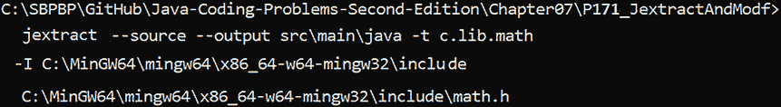

图 7.26：从 math.h 生成原生绑定

或者，作为纯文本：

```java
C:\SBPBP\GitHub\Java-Coding-Problems-Second-Edition\Chapter07\P171_JextractAndModf>
  jextract --source --output src\main\java -t c.lib.math
  -I C:\MinGW64\mingw64\x86_64-w64-mingw32\include 
  C:\MinGW64\mingw64\x86_64-w64-mingw32\include\math.h 
```

因此，我们在当前项目的 `src\main\java` 子文件夹中生成源文件（`--sources`），在包 `c.lib.math` 中（`-t`）。`math.h` 从 `mingw64\x86_64-w64-mingw32\include` 加载。

运行此命令后，你将在 `c.lib.math` 中找到 `math.h` 中找到的所有符号的原生绑定。很可能是我们想要的，因为我们只调用 `modf()` 外部函数。过滤符号是一个两步过程。首先，我们生成所有符号的 *dump*，如下所示：

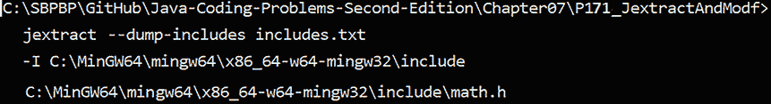

图 7.27：创建包含 math.h 中所有符号的 dump 文件

或者，作为纯文本：

```java
C:\SBPBP\GitHub\Java-Coding-Problems-Second-Edition\Chapter07\P171_JextractAndModf>
  jextract --dump-includes includes.txt 
  -I C:\MinGW64\mingw64\x86_64-w64-mingw32\include 
  C:\MinGW64\mingw64\x86_64-w64-mingw32\include\math.h 
```

此命令将在项目根目录中创建一个名为 `includes.txt` 的文件，其中包含 `math.h` 中找到的所有符号。第二步是编辑此文件。例如，我们只保留了 `modf()` 符号，如下所示：

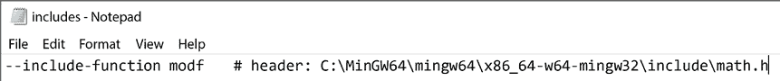

图 7.28：编辑 includes.txt 以保留所需的符号

接下来，我们将编辑后的 `includes.txt` 传递给 Jextract，如下所示：

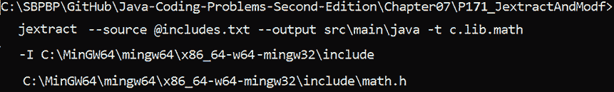

图 7.29：使用过滤后的 includes.txt 运行 Jextract

或者，作为纯文本：

```java
C:\SBPBP\GitHub\Java-Coding-Problems-Second-Edition\Chapter07\P171_JextractAndModf>
  jextract --source @includes.txt --output src\main\java -t c.lib.math
  -I C:\MinGW64\mingw64\x86_64-w64-mingw32\include 
  C:\MinGW64\mingw64\x86_64-w64-mingw32\include\math.h 
```

这次，在 `c.lib.math` 中，你只会找到 `modf()` 外部函数的原生绑定。花时间检查这些文件，看看它们在代码层面是如何交互的。由于我们只生成源代码，我们必须编译项目以获取类。如果你希望直接通过 Jextract 生成类，则可以使用以下命令（现在，将不会生成源代码，只会生成类）：

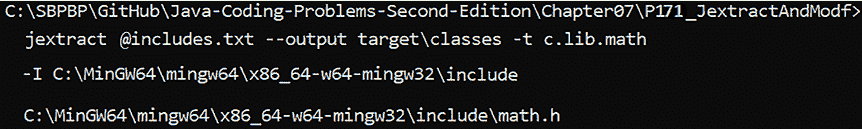

图 7.30：生成原生绑定的类

或者，作为纯文本：

```java
C:\SBPBP\GitHub\Java-Coding-Problems-Second-Edition\Chapter07\P171_JextractAndModf>
  jextract @includes.txt --output target\classes -t c.lib.math
  -I C:\MinGW64\mingw64\x86_64-w64-mingw32\include 
  C:\MinGW64\mingw64\x86_64-w64-mingw32\include\math.h 
```

接下来，我们可以在 Java 应用程序中使用生成的绑定来调用 `modf()` 函数。代码很简单（我们不需要编写方法句柄，也不需要显式使用 `invoke()`/`invokeExact()`）：

```java
double x = 89.76655;
try (Arena arena = Arena.ofConfined()) {
  MemorySegment segmentIntptr
    = arena.allocate(ValueLayout.JAVA_DOUBLE);
  double fractional = modf(x, segmentIntptr);
  System.out.println("Fractional part: " + fractional
    + " Integer part: " + segmentIntptr.get(
      ValueLayout.JAVA_DOUBLE, 0));
} 
```

`modf()` 函数是从 `c.lib.math.math_h` 包导入的。

# 摘要

本章涵盖了 28 个问题。其中大部分都集中在新的 Foreign (Function) Memory APIs，或 Project Panama。正如你所见，这个 API 比使用 JNI、JNA 和 JNR 的经典方法更加直观和强大。此外，Jextract 工具对于从原生共享库的头文件中生成原生绑定非常方便，并为我们节省了大量机械工作。

# 加入我们的 Discord 社区

加入我们的社区 Discord 空间，与作者和其他读者进行讨论：

[`discord.gg/8mgytp5DGQ`](https://discord.gg/8mgytp5DGQ )


