# 并发 – 虚拟线程和结构化并发

本章包括 16 个问题，简要介绍了*虚拟线程*和*结构化并发*。

如果你没有 Java 并发的背景知识，我强烈建议你在阅读一些关于该主题的良好入门介绍之后再阅读本章。例如，你可以尝试阅读*Java 编码问题*第一版的第*10*章和第*11*章。

*虚拟线程*是 Java 在过去几年中添加的最重要和最令人惊讶的特性之一。它们对我们继续编写和理解并发代码的方式产生了重大影响。在本章中，你将逐步学习这个主题和*结构化并发*范式的每一个细节。

在本章之后，你将非常熟悉如何使用虚拟线程和结构化并发。

# 问题

使用以下问题来测试你在 Java 虚拟线程和结构化并发方面的编程能力。我强烈鼓励你在查看解决方案和下载示例程序之前尝试解决每个问题：

1.  **解释并发与并行**：提供简明但富有意义的并发与并行的解释。

1.  **介绍结构化并发**：编写一个示例，突出“非结构化”并发的关键问题。此外，介绍结构化并发范式。

1.  **介绍虚拟线程**：解释并举例说明虚拟线程的主要概念。

1.  **使用 ExecutorService 进行虚拟线程**：编写几个示例，通过`ExecutorService`和虚拟线程突出“任务-线程”模型。

1.  **解释虚拟线程的工作原理**：全面介绍虚拟线程的内部工作原理。

1.  **虚拟线程和同步代码的挂钩**：通过一段有意义的代码片段解释并举例说明虚拟线程和同步代码是如何协同工作的。

1.  **举例说明线程上下文切换**：编写几个示例，展示虚拟线程的线程上下文切换是如何工作的。

1.  **介绍 ExecutorService invoke all/any 对虚拟线程的调用 – 第一部分**：简要介绍`ExecutorService`对虚拟线程的 invoke all/any 调用。

1.  **介绍 ExecutorService invoke all/any 对虚拟线程的调用 – 第二部分**：通过`ExecutorService` invoke all/any 对虚拟线程重写“问题 210”中的“非结构化”并发示例。

1.  **挂钩任务状态**：解释并举例说明新的`Future#state()` API。

1.  **结合 new VirtualThreadPerTaskExecutor()和流**：编写几个示例，介绍 Java 流管道如何与`newVirtualThreadPerTaskExecutor()`执行器结合使用。

1.  **介绍范围对象（StructuredTaskScope）**：通过`StructuredTaskScope` API 简要介绍结构化并发。

1.  **介绍 ShutdownOnSuccess**：举例说明`StructuredTaskScope`的`ShutdownOnSuccess`风味。

1.  **介绍 ShutdownOnFailure**：举例说明`StructuredTaskScope`的`ShutdownOnFailure`版本。

1.  **结合 StructuredTaskScope 和流**：编写几个示例，介绍如何将 Java 流管道与`StructuredTaskScope`结合使用。

1.  **观察和监控虚拟线程**：举例说明我们如何使用**JFR**（**Java Flight Recorder**）、**JMX**（**Java Management Extensions**）以及您喜欢的任何其他工具来观察和监控虚拟线程。

以下几节描述了前面问题的解决方案。请记住，通常没有解决特定问题的唯一正确方法。此外，请记住，这里所示的解释仅包括解决这些问题所需的最有趣和最重要的细节。下载示例解决方案以查看更多细节，并在此[`github.com/PacktPublishing/Java-Coding-Problems-Second-Edition/tree/main/Chapter10`](https://github.com/PacktPublishing/Java-Coding-Problems-Second-Edition/tree/main/Chapter10)上的程序进行实验。

# 209. 解释并发与并行

在着手本章的主要主题——**结构化并发**之前，让我们先忘记**结构**，只保留**并发**。接下来，让我们将**并发**与**并行**进行比较，因为这两个概念常常是混淆的源头。

这两者，并发和并行，都使用**任务**作为主要的工作单元。然而，它们处理这些任务的方式使它们非常不同。

在并行的情况下，一个任务被分割成多个 CPU 核心的子任务。这些子任务并行计算，每个子任务代表给定任务的局部解决方案。通过合并这些局部解决方案，我们得到解决方案。理想情况下，并行解决任务应该比顺序解决相同任务所需的时间更少。简而言之，在并行中，至少有两个线程同时运行，这意味着并行可以更快地解决单个任务。

在并发的情况下，我们尝试通过几个相互竞争的线程尽可能多地解决任务，以时间分片的方式推进。这意味着并发可以更快地完成多个任务。这也是为什么并发也被称为虚拟并行。

下图展示了并行与并发的对比：

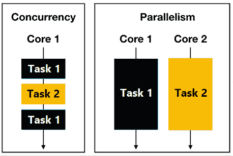

图 10.1：并发与并行

在并行的情况下，任务（子任务）是实施解决方案/算法的一部分。我们编写代码，设置/控制任务数量，并在具有并行计算能力的上下文中使用它们。另一方面，在并发中，任务是问题的一部分。

通常，我们通过**延迟**（完成任务所需的时间）来衡量并行效率，而并发的效率则是通过**吞吐量**（我们可以解决的任务数量）来衡量的。

此外，在并行性中，任务控制资源分配（CPU 时间、I/O 操作等）。另一方面，在并发中，多个线程相互竞争以获取尽可能多的资源（I/O）。它们无法控制资源分配。

在并行性中，线程以这种方式在 CPU 核心上操作，即每个核心都处于忙碌状态。在并发中，线程以这种方式在任务上操作，理想情况下，每个线程都有一个单独的任务。

通常，当比较并行性和并发性时，有人会过来问：*异步方法怎么样？*

重要的是要理解 *异步性* 是一个独立的概念。异步性是关于完成非阻塞操作的能力。例如，一个应用程序发送一个 HTTP 请求，但它不会只是等待响应。它会去做其他事情（其他任务），在等待响应的同时。我们每天都在做异步任务。例如，我们开始启动洗衣机，然后去打扫房子的其他部分。我们不会只是站在洗衣机旁边，直到它完成。

# 210. 介绍结构化并发

如果你和我一样大，那么你很可能开始编程时使用的是 BASIC 或类似的非结构化编程语言。当时，一个应用程序只是一系列定义了顺序逻辑/行为的代码行，通过一串 GOTO 语句驱动流程，像袋鼠一样在代码行之间跳来跳去。在 Java 中，典型并发代码的构建块非常原始，因此代码看起来有点像非结构化编程，因为它难以跟踪和理解。此外，并发任务的线程转储并不提供所需的答案。

让我们跟随一段 Java 并发代码，每次有问题时都停下来（总是检查问题下面的代码）。任务是并发地通过 ID 加载三个测试人员并将他们组成一个测试团队。首先，让我们列出服务器代码（我们将使用这段简单的代码来帮助我们解决这个问题和后续的问题）：

```java
public static String fetchTester(int id) 
      throws IOException, InterruptedException {
  HttpClient client = HttpClient.newHttpClient();
  HttpRequest requestGet = HttpRequest.newBuilder()
    .GET()
    .uri(URI.create("https://reqres.in/api/users/" + id))
    .build();
  HttpResponse<String> responseGet = client.send(
    requestGet, HttpResponse.BodyHandlers.ofString());
  if (responseGet.statusCode() == 200) {
    return responseGet.body();
  }
  throw new UserNotFoundException("Code: " 
    + responseGet.statusCode());
} 
```

接下来，我们特别感兴趣的代码如下所示：

```java
private static final ExecutorService executor 
  = Executors.newFixedThreadPool(2);
public static TestingTeam buildTestingTeam() 
    throws InterruptedException {
  ... 
```

*第一站*：正如你所见，`buildTestingTeam()` 抛出了 `InterruptedException`。那么如果执行 `buildTestingTeam()` 的线程被中断，我们如何轻松地中断后续的线程？

```java
 Future<String> future1 = futureTester(1);
  Future<String> future2 = futureTester(2);
  Future<String> future3 = futureTester(3);
  try {
    ... 
```

*第二站*：这里，我们有三个 `get()` 调用。所以当前线程会等待其他线程完成。我们能否轻松地观察那些线程？

```java
 String tester1 = future1.get();
    String tester2 = future2.get();
    String tester3 = future3.get();
    logger.info(tester1);
    logger.info(tester2);
    logger.info(tester3);
    return new TestingTeam(tester1, tester2, tester3);
  } catch (ExecutionException ex) {
    ... 
```

*第三站*：如果捕获到 `ExecutionException`，那么我们知道这三个 `Future` 实例中的一个失败了。我们能否轻松地取消剩余的两个，或者它们会一直挂在那里？`future1` 可能会失败，而 `future2` 和 `future3` 可能会成功完成，或者也许 `future2` 会成功完成，而 `future3` 将会永远运行（所谓的 *孤儿线程*）。这可能导致预期的结果严重不匹配、内存泄漏等问题：

```java
 throw new RuntimeException(ex);
  } finally {
    ... 
```

*第四个步骤*：下一行代码用于关闭`executor`，但它很容易被忽略。这是正确的操作位置吗？

```java
 shutdownExecutor(executor);
  }
} 
```

*第五个步骤*：如果您没有注意到上一行代码，那么您有理由问自己这个执行器是如何/在哪里被关闭的：

```java
public static Future<String> futureTester(int id) {
  return executor.submit(() -> fetchTester(id));
} 
```

我们省略了其余的代码，因为您可以在捆绑的代码中找到它。

当然，我们可以通过错误处理、任务放弃和终止、`ExecutorService`等方式为这些问题实现代码答案，但这意味着开发者需要做大量的工作。在并发环境中跟踪多个任务/子任务的进度，同时仔细覆盖所有可能的场景，编写容错解决方案并非易事。更不用说，其他开发者或甚至是 1-2 年后或几个月后的同一开发者理解和维护生成的代码有多么困难。

是时候给这段代码添加一些结构了，让我们引入*结构化并发*（或 Project Loom）。

*结构化并发*依赖于几个支柱，旨在将轻量级并发引入 Java。结构化并发的根本支柱或原则将在下面强调。

**重要提示**

结构化并发的根本原则是，当一个任务需要并发解决时，所有解决该任务所需的线程都在同一块代码中启动和重新连接。换句话说，所有这些线程的生命周期都绑定到块的词法作用域，因此我们为每个并发代码块提供了清晰和明确的入口和出口点。

根据这个原则，启动并发上下文的线程是*父线程*或*拥有线程*。由父线程启动的所有线程都是*子线程*或*分支*，因此它们之间是兄弟姐妹关系。父线程和子线程共同定义了一个*父子层次结构*。

将结构化并发原则放入图中将展示以下内容：

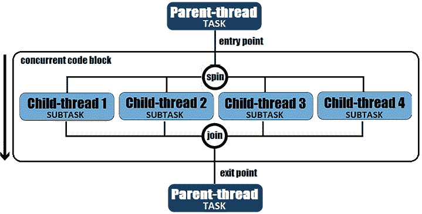

图 10.2：结构化并发中的父子层次结构

在父子层次结构的上下文中，我们支持带有短路、取消传播、监控/可观察性的错误/异常处理：

+   *短路错误/异常处理*：如果一个子线程失败，那么除非它们已经完成，否则所有子线程都会被取消。例如，如果`futureTester(1)`失败，那么`futureTester(2)`和`futureTester(3)`将自动取消。

+   *取消传播*：如果父线程在加入子线程之前被中断，那么这些分支（子线程/子任务）将自动取消。例如，如果执行`buildTestingTeam()`的线程被中断，那么它的三个分支将自动取消。

+   *监控/可观察性*：线程转储揭示了整个父子层次结构的清晰图像，无论产生了多少层级。此外，在结构化并发中，我们利用线程的调度和内存管理。

虽然这些都是纯粹的概念，但编写遵循这些概念的代码需要适当的 API 和以下令人惊叹的调用：


图 10.3：不要重用虚拟线程

将其剪下来贴在某个地方，以便你每天都能看到！所以在结构化并发中，**不要重用虚拟线程**。我知道你在想什么：*嘿，兄弟，线程很贵，而且有限，所以我们必须重用它们*。一个快速提示：我们谈论的是*虚拟线程*（大量吞吐量），而不是*经典线程*，但虚拟线程的话题将在下一个问题中介绍。

# 211. 虚拟线程的引入

Java 允许我们通过`java.lang.Thread`类编写多线程应用程序。这些是经典的 Java 线程，基本上只是操作系统（内核）线程的薄包装。正如你将看到的，这些经典 Java 线程被称为*平台线程*，并且已经存在很长时间了（自从 JDK 1.1 以来，如下面的图所示）：

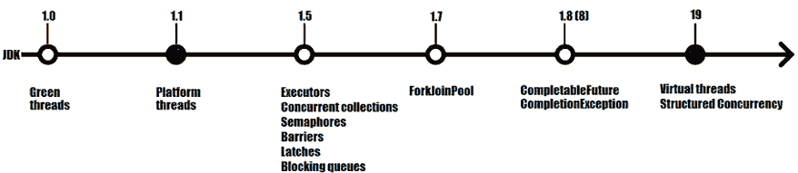

图 10.4：JDK 多线程演变

接下来，让我们继续了解 JDK 19 虚拟线程。

## 平台（操作系统）线程有什么问题？

操作系统线程在各个方面都很昂贵，或者更具体地说，它们在时间和空间上都很昂贵。因此，创建操作系统线程是一个昂贵的操作，需要大量的堆栈空间（大约 20 兆字节）来存储它们的上下文、Java 调用栈和额外的资源。此外，操作系统线程调度器负责调度 Java 线程，这是另一个昂贵的操作，需要移动大量的数据。这被称为*线程上下文切换*。

在下面的图中，你可以看到 Java 线程和操作系统线程之间的一对一关系：

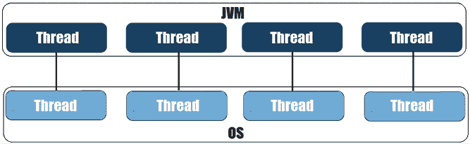

图 10.5：JVM 到操作系统线程

几十年来，我们的多线程应用程序一直在这个环境中运行。所有这些时间和经验教会了我们，我们可以创建有限数量的 Java 线程（因为吞吐量低），而且我们应该明智地重用它们。Java 线程的数量是一个限制因素，通常在诸如网络连接、CPU 等其他资源耗尽之前就已经用完。Java 不会区分执行密集计算任务（即真正利用 CPU 的线程）或仅仅等待数据的线程（即它们只是挂载在 CPU 上）。

让我们做一个快速练习。假设我们的机器有 8 GB 的内存，而单个 Java 线程需要 20 MB。这意味着我们大约有 400 个 Java 线程的空间（8 GB = 8,000 MB / 20 MB = 400 threads）。接下来，假设这些线程在网络上进行 I/O 操作。每个 I/O 操作需要大约 100 ms 才能完成，而请求准备和响应处理需要大约 500 ns。所以一个线程工作 1,000 ns（0.001 ms），然后等待 100 ms（100,000,000 ns）以完成 I/O 操作。这意味着在 8 GB 的内存中，400 个线程将使用 0.4%的 CPU 可用性（低于 1%），这非常低。我们可以得出结论，线程有 99.99%的时间是空闲的。

基于这个练习，很明显，Java 线程成为了吞吐量的瓶颈，这不允许我们充分利用硬件。当然，我们可以通过使用*线程池*来最小化成本来改善这种情况，但这仍然不能解决处理资源的主要问题。你必须转向`CompletableFuture`、响应式编程（例如，Spring 的`Mono`和`Flux`）等等。

然而，我们可以创建多少个传统的 Java 线程呢？我们可以通过运行一个简单的代码片段来轻松找出，如下所示：

```java
AtomicLong counterOSThreads = new AtomicLong();
while (true) {
  new Thread(() -> {
    long currentOSThreadNr
      = counterOSThreads.incrementAndGet();
    System.out.println("Thread: " + currentOSThreadNr);
    LockSupport.park();
  }).start();
} 
```

或者，如果我们想尝试新的并发 API，我们可以调用新的`Thread.ofPlatform()`方法，如下所示（`OfPlatform`是一个`sealed`接口，在 JDK 19 中引入）：

```java
AtomicLong counterOSThreads = new AtomicLong();
while (true) {
  Thread.ofPlatform().start(() -> {
    long currentOSThreadNr
      = counterOSThreads.incrementAndGet();
    System.out.println("Thread: " + currentOSThreadNr);
    LockSupport.park();
  });
} 
```

在我的机器上，我在大约 40,000 个 Java 线程后遇到了`OutOfMemoryError`。根据你的操作系统和硬件，这个数字可能会有所不同。

`Thread.ofPlatform()`方法是在 JDK 19 中添加的，以便轻松区分 Java 线程（即，几十年来我们所知道的经典 Java 线程——操作系统线程的薄包装）和城中新来的孩子，虚拟线程。

## 什么是虚拟线程？

虚拟线程是在 JDK 19 中作为预览版（JEP 425）引入的，并在 JDK 21 中成为最终特性（JEP 444）。虚拟线程在平台线程之上运行，形成一对一的关系，而平台线程在操作系统线程之上运行，形成一对一的关系，如下面的图所示：

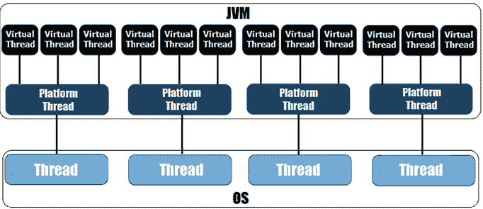

图 10.6：虚拟线程架构

如果我们将这个概念分解成几个词，那么我们可以这样说，JDK 将大量虚拟线程映射到少量操作系统线程。

在创建虚拟线程之前，让我们看看两个重要的注意事项，这将帮助我们快速了解虚拟线程的基本原理。首先，让我们快速了解一下虚拟线程的内存占用：

**重要注意事项**

虚拟线程不是操作系统线程的包装器。它们是轻量级的 Java 实体（它们有自己的堆栈内存，占用空间很小——只有几百字节），创建、阻塞和销毁成本低（创建虚拟线程的成本大约是创建经典 Java 线程的 1,000 倍）。可以同时存在很多虚拟线程（数百万），从而实现巨大的吞吐量。虚拟线程不应重复使用（它们是一次性的）或池化。

当我们谈论虚拟线程时，我们应该忘记的东西比应该学习的东西更多。但虚拟线程存储在哪里，谁负责相应地调度它们？

**重要提示**

虚拟线程存储在 JVM 堆中（因此它们可以利用垃圾收集器），而不是操作系统堆栈。此外，虚拟线程由 JVM 通过一个*工作窃取*的`ForkJoinPool`调度器进行调度。实际上，JVM 以这种方式调度和编排虚拟线程在平台线程上运行，使得一个平台线程一次只执行一个虚拟线程。

接下来，让我们创建一个虚拟线程。

### 创建虚拟线程

从 API 的角度来看，虚拟线程是`java.lang.Thread`的另一种风味。如果我们通过`getClass()`深入研究，我们可以看到虚拟线程类是`java.lang.VirtualThread`，它是一个`final`的非公开类，继承自`BaseVirtualThread`类，而`BaseVirtualThread`是一个`sealed abstract`类，继承自`java.lang.Thread`：

```java
final class VirtualThread extends BaseVirtualThread {…}
sealed abstract class BaseVirtualThread extends Thread
  permits VirtualThread, ThreadBuilders.BoundVirtualThread {…} 
```

让我们考虑以下任务（`Runnable`）：

```java
Runnable task = () -> logger.info(
  Thread.currentThread().toString()); 
```

#### 创建和启动虚拟线程

我们可以通过`startVirtualThread(Runnable task)`方法创建并启动一个虚拟线程，如下所示：

```java
Thread vThread = Thread.startVirtualThread(task);
// next you can set its name
vThread.setName("my_vThread"); 
```

返回的`vThread`由 JVM 本身调度执行。但我们可以通过`Thread.ofVirtual()`创建并启动一个虚拟线程，它返回`OfVirtual`（JDK 19 中引入的`sealed`接口），如下所示：

```java
Thread vThread =Thread.ofVirtual().start(task); 
// a named virtual thread
Thread.ofVirtual().name("my_vThread").start(task); 
```

现在，`vThread`将解决我们的`task`。

此外，我们还有`Thread.Builder`接口（以及`Thread.Builder.OfVirtual`子接口），可以用来创建虚拟线程，如下所示：

```java
Thread.Builder builder 
  = Thread.ofVirtual().name("my_vThread");
Thread vThread = builder.start(task); 
```

这里是另一个通过`Thread.Builder`创建两个虚拟线程的示例：

```java
Thread.Builder builder
  = Thread.ofVirtual().name("vThread-", 1);
// name "vThread-1"
Thread vThread1 = builder.start(task);
vThread1.join();
logger.info(() -> vThread1.getName() + " terminated");
// name "vThread-2"
Thread vThread2 = builder.start(task);
vThread2.join();
logger.info(() -> vThread2.getName() + " terminated"); 
```

你可以在捆绑的代码中进一步查看这些示例。

#### 等待虚拟任务终止

给定的`task`由虚拟线程执行，而主线程不会被阻塞。为了等待虚拟线程终止，我们必须调用`join()`的一个变体。我们有不带参数的`join()`，它会无限期地等待，以及几个等待给定时间的变体（例如，`join(Duration duration)`和`join(long millis)`）：

```java
vThread.join(); 
```

这些方法会抛出`InterruptedException`，所以你必须捕获并处理它（或者只是抛出它）。现在，由于`join()`，主线程不能在虚拟线程完成之前终止。它必须等待虚拟线程完成。

#### 创建未启动的虚拟线程

创建一个未启动的虚拟线程可以通过`unstarted(Runnable task)`来完成，如下所示：

```java
Thread vThread = Thread.ofVirtual().unstarted(task); 
```

或者通过`Thread.Builder`，如下所示：

```java
Thread.Builder builder = Thread.ofVirtual();
Thread vThread = builder.unstarted(task); 
```

这次，线程没有被安排执行。它只有在显式调用`start()`方法后才会被安排执行：

```java
vThread.start(); 
```

我们可以通过`isAlive()`方法检查一个线程是否是活动的（即它已经被启动但尚未终止）：

```java
boolean isalive = vThread.isAlive(); 
```

`unstarted()`方法也适用于平台线程（还有`Thread.Builder.OfPlatform`子接口）：

```java
Thread pThread = Thread.ofPlatform().unstarted(task); 
```

我们可以通过调用`start()`方法来启动`pThread`。

#### 为虚拟线程创建 ThreadFactory

你可以创建一个虚拟线程的`ThreadFactory`，如下所示：

```java
ThreadFactory tfVirtual = Thread.ofVirtual().factory();
ThreadFactory tfVirtual = Thread.ofVirtual()
  .name("vt-", 0).factory(); // 'vt-' name prefix, 0 counter 
```

或者通过`Thread.Builder`，如下所示：

```java
Thread.Builder builder = Thread.ofVirtual().name("vt-", 0);
ThreadFactory tfVirtual = builder.factory(); 
```

以及一个平台线程的`ThreadFactory`，如下所示（你也可以使用`Thread.Builder`）：

```java
ThreadFactory tfPlatform = Thread.ofPlatform()
  .name("pt-", 0).factory(); // 'pt-' name prefix, 0 counter 
```

或者一个我们可以用来在虚拟/平台线程之间切换的`ThreadFactory`，如下所示：

```java
static class SimpleThreadFactory implements ThreadFactory {
  @Override
  public Thread newThread(Runnable r) {
    // return new Thread(r);                // platform thread
    return Thread.ofVirtual().unstarted(r); // virtual thread
  }
} 
```

接下来，我们可以通过`ThreadFactory.newThread(Runnable task)`使用这些工厂中的任何一个，如下所示：

```java
tfVirtual.newThread(task).start();
tfPlatform.newThread(task).start();
SimpleThreadFactory stf = new SimpleThreadFactory();
stf.newThread(task).start(); 
```

如果线程工厂同时启动创建的线程，那么就没有必要显式地调用`start()`方法。

#### 检查虚拟线程的详细信息

此外，我们可以通过`isVirtual()`方法检查某个线程是否是平台线程或虚拟线程：

```java
Thread vThread = Thread.ofVirtual()
  .name("my_vThread").unstarted(task);
Thread pThread1 = Thread.ofPlatform()
  .name("my_pThread").unstarted(task);
Thread pThread2 = new Thread(() -> {});
logger.info(() -> "Is vThread virtual ? " 
  + vThread.isVirtual());  // true
logger.info(() -> "Is pThread1 virtual ? " 
  + pThread1.isVirtual()); // false
logger.info(() -> "Is pThread2 virtual ? " 
  + pThread2.isVirtual()); // false 
```

显然，只有`vThread`是虚拟线程。

*虚拟线程总是以守护线程的方式运行*。`isDaemon()`方法返回`true`，尝试调用`setDaemon(false)`会抛出异常。

*虚拟线程的优先级总是* `NORM_PRIORITY`（调用`getPriority()`总是返回`5` – `NORM_PRIORITY`的常量`int`）。使用不同的值调用`setPriority()`没有效果。

*虚拟线程不能成为线程组的一部分*，因为它已经属于*VirtualThreads*组。调用`getThreadGroup().getName()`会返回*VirtualThreads*。

虚拟线程在安全管理器中没有权限（安全管理器已经被弃用）。

#### 打印一个线程（toString()）

如果我们打印一个虚拟线程（调用`toString()`方法），那么输出将类似于以下内容：

```java
VirtualThread[#22]/runnable@ForkJoinPool-1-worker-1
VirtualThread[#26,vt-0]/runnable@ForkJoinPool-1-worker-1 
```

简而言之，这个输出可以这样解释：`VirtualThread[#22]`表示这是一个包含线程标识符（`#22`）且没有名称的虚拟线程（在`VirtualThread[#26,vt-0]`的情况下，标识符是`#26`，名称是`vt-0`）。然后，我们有`runnable`文本，它表示虚拟线程的状态（`runnable`表示虚拟线程正在运行）。接下来，我们有虚拟线程的*承载线程*，这是一个平台线程；`ForkJoinPool-1-worker-1`包含了默认`ForkJoinPool`（`ForkJoinPool-1`）的平台线程名称（`worker-1`）。

### 我们可以启动多少个虚拟线程

最后，让我们运行一些代码，以便我们可以看到我们可以创建和启动多少个虚拟线程：

```java
AtomicLong counterOSThreads = new AtomicLong();
while (true) {
  Thread.startVirtualThread(() -> {
    long currentOSThreadNr
      = counterOSThreads.incrementAndGet();
    System.out.println("Virtual thread: " 
      + currentOSThreadNr);
    LockSupport.park();
  });
} 
```

在我的机器上，当大约有 14,000,000 个虚拟线程时，这段代码开始变慢。当内存可用时（垃圾收集器正在运行），它继续缓慢运行，但没有崩溃。所以这是一个巨大的吞吐量！

### 向后兼容性

虚拟线程与以下兼容：

+   同步块

+   线程局部变量

+   `Thread` 和 `currentThread()`

+   线程中断（`InterruptedException``）

基本上，一旦你更新到至少 JDK 19，虚拟线程就会自动工作。它们极大地支持干净、可读和更有结构的代码，是结构化并发范式背后的基石。

### 避免错误的结论（可能是神话）

关于虚拟线程有一些错误的结论，我们应该将其视为以下：

+   *虚拟线程比平台线程快（错误！）*：虚拟线程的数量可以很多，但它们并不比经典（平台）线程快。它们不会提升内存计算能力（对于这一点，我们有并行流）。不要得出虚拟线程做了某些魔法使其更快或更优化的结论。因此，虚拟线程可以极大地提高吞吐量（因为数百万个虚拟线程可以等待任务），但它们不能提高延迟。然而，虚拟线程的启动速度比平台线程快得多（虚拟线程的创建时间以微秒计，需要大约千字节的空间）。

+   *虚拟线程应该被池化（错误！）*：虚拟线程不应成为任何线程池的一部分，也不应该被池化。

+   *虚拟线程很昂贵（错误！）*：虚拟线程不是免费的（没有什么是免费的），但它们比平台线程更容易创建、阻塞和销毁。虚拟线程比平台线程便宜 1,000 倍。

+   *虚拟线程可以释放任务（错误！）*：这不是真的！虚拟线程接受一个任务，除非它被中断，否则会返回结果。它不能释放任务。

+   *阻塞虚拟线程会阻塞其承载线程（错误！）*：阻塞虚拟线程不会阻塞其承载线程。承载线程可以服务其他虚拟线程。

# 212. 使用 ExecutorService 进行虚拟线程

虚拟线程允许我们编写更易于表达和理解的并发代码。多亏了虚拟线程带来的巨大吞吐量，我们可以轻松采用 *任务-线程* 模型（对于一个 HTTP 服务器，这意味着每个请求一个线程，对于一个数据库，这意味着每个事务一个线程，等等）。换句话说，我们可以为每个并发任务分配一个新的虚拟线程。

尝试使用平台线程的 *任务-线程* 模型会导致吞吐量受限于硬件核心的数量——这由 Little 定律（[`en.wikipedia.org/wiki/Little%27s_law`](https://en.wikipedia.org/wiki/Little%27s_law)）解释，L = λW，即吞吐量等于平均并发乘以延迟。

在可能的情况下，建议避免直接与线程交互。JDK 通过 `ExecutorService`/`Executor` API 来维持这一点。更确切地说，我们习惯于将任务（`Runnable`/`Callable`）提交给 `ExecutorService`/`Executor` 并与返回的 `Future` 一起工作。这种模式对虚拟线程同样适用。

因此，我们不需要自己编写所有管道代码来为虚拟线程采用 *任务-线程模型*，因为从 JDK 19 开始，这种模型通过 `Executors` 类提供。更确切地说，是通过 `newVirtualThreadPerTaskExecutor()` 方法，该方法创建一个能够创建无限数量遵循 *任务-线程* 模型的虚拟线程的 `ExecutorService`。这个 `ExecutorService` 提供了允许我们给出诸如 `submit()`（您将在下面看到）和 `invokeAll`/`Any()`（您将在稍后看到）方法的方法，返回包含异常或结果的 `Future`。

**重要提示**

从 JDK 19 开始，`ExecutorService` 扩展了 `AutoCloseable` 接口。换句话说，我们可以在 `try-with-resources` 模式中使用 `ExecutorService`。

考虑以下简单的 `Runnable` 和 `Callable`：

```java
Runnable taskr = () ->logger.info(
  Thread.currentThread().toString());
Callable<Boolean> taskc = () -> {
  logger.info(Thread.currentThread().toString());
  return true;
}; 
```

执行 `Runnable`/`Callable` 可以如下进行（这里我们提交了 15 个任务 `NUMBER_OF_TASKS = 15`）：

```java
try (ExecutorService executor 
      = Executors.newVirtualThreadPerTaskExecutor()) {
  for (int i = 0; i < NUMBER_OF_TASKS; i++) {
    executor.submit(taskr); // executing Runnable
    executor.submit(taskc); // executing Callable
  }
} 
```

当然，在 `Runnable`/`Callable` 的情况下，我们可以捕获一个 `Future` 并相应地操作，通过阻塞的 `get()` 方法或我们想要做的任何事情：

```java
Future<?> future = executor.submit(taskr);
Future<Boolean> future = executor.submit(taskc); 
```

可能的输出如下所示：

```java
VirtualThread[#28]/runnable@ForkJoinPool-1-worker-6 
VirtualThread[#31]/runnable@ForkJoinPool-1-worker-5 
VirtualThread[#29]/runnable@ForkJoinPool-1-worker-7 
VirtualThread[#25]/runnable@ForkJoinPool-1-worker-3 
VirtualThread[#24]/runnable@ForkJoinPool-1-worker-2 
VirtualThread[#27]/runnable@ForkJoinPool-1-worker-5 
VirtualThread[#26]/runnable@ForkJoinPool-1-worker-4 
VirtualThread[#22]/runnable@ForkJoinPool-1-worker-1 
VirtualThread[#36]/runnable@ForkJoinPool-1-worker-1 
VirtualThread[#37]/runnable@ForkJoinPool-1-worker-2 
VirtualThread[#35]/runnable@ForkJoinPool-1-worker-7 
VirtualThread[#34]/runnable@ForkJoinPool-1-worker-4 
VirtualThread[#32]/runnable@ForkJoinPool-1-worker-3 
VirtualThread[#33]/runnable@ForkJoinPool-1-worker-2 
VirtualThread[#30]/runnable@ForkJoinPool-1-worker-1 
```

查看虚拟线程的 ID。它们在 #22 和 #37 之间，没有重复。每个任务由其自己的虚拟线程执行。

*任务-线程* 模型也适用于经典线程，通过 `newThreadPerTaskExecutor(ThreadFactory threadFactory)` 实现。以下是一个示例：

```java
static class SimpleThreadFactory implements ThreadFactory {
  @Override
  public Thread newThread(Runnable r) {
    return new Thread(r);   // classic
   // return Thread.ofVirtual().unstarted(r); // virtual 
  }
}
try (ExecutorService executor = 
     Executors.newThreadPerTaskExecutor(
         new SimpleThreadFactory())) {
  for (int i = 0; i < NUMBER_OF_TASKS; i++) {
    executor.submit(taskr); // executing Runnable
    executor.submit(taskc); // executing Callable
  }
} 
```

如您所见，`newThreadPerTaskExecutor()` 可以用于经典线程或虚拟线程。创建的线程数量是无限的。通过简单地修改线程工厂，我们可以在虚拟线程和经典线程之间切换。

可能的输出如下所示：

```java
Thread[#75,Thread-15,5,main] 
Thread[#77,Thread-17,5,main] 
Thread[#76,Thread-16,5,main] 
Thread[#83,Thread-23,5,main] 
Thread[#82,Thread-22,5,main] 
Thread[#80,Thread-20,5,main] 
Thread[#81,Thread-21,5,main] 
Thread[#79,Thread-19,5,main] 
Thread[#78,Thread-18,5,main] 
Thread[#89,Thread-29,5,main] 
Thread[#88,Thread-28,5,main] 
Thread[#87,Thread-27,5,main] 
Thread[#86,Thread-26,5,main] 
Thread[#85,Thread-25,5,main] 
Thread[#84,Thread-24,5,main] 
```

查看线程的 ID。它们在 #75 和 #89 之间，没有重复。每个任务由其自己的线程执行。

# 213. 解释虚拟线程的工作原理

现在我们知道了如何创建和启动虚拟线程，让我们看看它们实际上是如何工作的。

让我们从一张有意义的图开始：

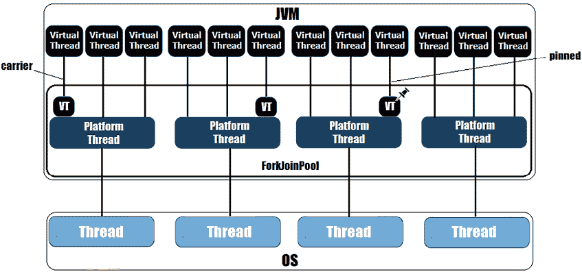

图 10.7：虚拟线程的工作原理

如您所见，*图 10.7* 与 *图 10.6* 类似，只是我们添加了一些更多元素。

首先，请注意平台线程在 `ForkJoinPool` 的伞下运行。这是一个 **先进先出**（**FIFO**）的专用 fork/join 池，专门用于调度和编排虚拟线程与平台线程之间的关系（Java 的 fork/join 框架的详细内容可在 *Java 编程问题*，第一版，第十一章中找到）。

**重要提示**

这个专门的`ForkJoinPool`由 JVM 控制，并基于 FIFO 队列作为虚拟线程调度器。它的初始容量（即线程数）等于可用核心数，可以增加到 256。默认的虚拟线程调度器在`java.lang.VirtualThread`类中实现：

```java
private static ForkJoinPool createDefaultScheduler() {...} 
```

不要将这个`ForkJoinPool`与用于并行流的那个混淆（公共 Fork Join Pool - `ForkJoinPool.commonPool()`）。

在虚拟线程和平台线程之间，存在一种一对一的多对多关联。然而，JVM 以这种方式调度虚拟线程在平台线程上运行，即一次只有一个虚拟线程在平台线程上运行。当 JVM 将一个虚拟线程分配给平台线程时，虚拟线程的所谓*栈块对象*会从平台线程的堆内存中复制过来。

如果在虚拟线程上运行的代码遇到一个应该由 JVM 处理的阻塞（I/O）操作，那么虚拟线程将通过将其*栈块对象*复制回堆内存来释放。这种在堆内存和平台线程之间复制*栈块*的操作是阻塞虚拟线程的成本（这比阻塞平台线程便宜得多）。同时，平台线程可以运行其他虚拟线程。当释放的虚拟线程的阻塞（I/O）完成时，JVM 将重新调度虚拟线程在平台线程上执行。这可能是在同一个平台线程上，也可能是另一个平台线程。

**重要提示**

将虚拟线程分配给平台线程的操作称为*挂载*。从平台线程取消分配虚拟线程的操作称为*卸载*。运行分配的虚拟线程的平台线程称为*载体线程*。

让我们来看一个例子，揭示虚拟线程是如何挂载的：

```java
private static final int NUMBER_OF_TASKS 
  = Runtime.getRuntime().availableProcessors();
Runnable taskr = () ->
  logger.info(Thread.currentThread().toString()); 
try (ExecutorService executor 
    = Executors.newVirtualThreadPerTaskExecutor()) {
  for (int i = 0; i < NUMBER_OF_TASKS + 1; i++) {
    executor.submit(taskr);
  }
} 
carriers), and each of them carries a virtual thread. Since we have + 1, a *carrier* will work twice. The output reveals this scenario (check out the workers; here, worker-8 runs virtual threads #30 and #31):
```

```java
VirtualThread[#25]/runnable@ForkJoinPool-1-worker-3 
**VirtualThread[#30]/runnable@ForkJoinPool-1-worker-8** 
VirtualThread[#28]/runnable@ForkJoinPool-1-worker-6 
VirtualThread[#22]/runnable@ForkJoinPool-1-worker-1 
VirtualThread[#24]/runnable@ForkJoinPool-1-worker-2 
VirtualThread[#29]/runnable@ForkJoinPool-1-worker-7 
VirtualThread[#26]/runnable@ForkJoinPool-1-worker-4 
VirtualThread[#27]/runnable@ForkJoinPool-1-worker-5 
**VirtualThread[#31]/runnable@ForkJoinPool-1-worker-8** 
```

然而，我们可以通过三个系统属性来配置`ForkJoinPool`，如下所示：

+   `jdk.virtualThreadScheduler.parallelism` – CPU 核心数

+   `jdk.virtualThreadScheduler.maxPoolSize` – 最大池大小（256）

+   `jdk.virtualThreadScheduler.minRunnable` – 运行线程的最小数量（池大小的一半）

在后续的问题中，我们将使用这些属性来更好地塑造*虚拟线程上下文切换*（挂载/卸载）的细节。

## 捕获虚拟线程

到目前为止，我们已经了解到，JVM 会将一个虚拟线程挂载到一个平台线程上，这个平台线程成为其载体线程。此外，载体线程会运行虚拟线程，直到它遇到一个阻塞（I/O）操作。在那个时刻，虚拟线程会从载体线程上卸载，并在阻塞（I/O）操作完成后重新调度。

虽然这种场景对于大多数阻塞操作都是真实的，导致卸载虚拟线程并释放平台线程（以及底层的操作系统线程），但还有一些异常情况，虚拟线程不会被卸载。这种行为的两个主要原因如下：

+   操作系统（例如，大量的文件系统操作）的限制

+   JDK（例如，`Object.wait()`）的限制

当虚拟线程无法从其承载线程卸载时，这意味着承载线程和底层的操作系统线程被阻塞。这可能会影响应用程序的可伸缩性，因此如果平台线程池允许，JVM 可以决定添加一个额外的平台线程。因此，在一段时间内，平台线程的数量可能会超过可用核心的数量。

## 固定虚拟线程

还有两种其他情况，虚拟线程无法卸载：

+   当虚拟线程在 `synchronized` 方法/块中运行代码时

+   当虚拟线程调用外部函数或本地方法（这是第七章讨论的主题）

在这种情况下，我们说虚拟线程被 *固定* 在承载线程上。这可能会影响应用程序的可伸缩性，但 JVM 不会增加平台线程的数量。相反，我们应该采取行动，重构 `synchronized` 块，以确保锁定代码简单、清晰、简短。尽可能的情况下，我们应该优先选择 `java.util.concurrent` 锁而不是 `synchronized` 块。如果我们设法避免了长时间和频繁的锁定周期，那么我们就不会面临任何重大的可伸缩性问题。在未来的版本中，JDK 团队旨在消除 `synchronized` 块内的固定问题。

# 214. 固定虚拟线程和同步代码

这个问题的目标是突出虚拟线程如何与同步代码交互。为此，我们使用内置的 `java.util.concurrent.SynchronousQueue`。这是一个内置的阻塞队列，一次只允许一个线程操作。更确切地说，一个想要向这个队列中插入元素的线程将被阻塞，直到另一个线程尝试从其中移除元素，反之亦然。基本上，除非另一个线程尝试移除元素，否则线程无法插入元素。

假设一个虚拟线程尝试向 `SynchronousQueue` 中插入一个元素，而一个平台线程尝试从该队列中移除一个元素。在代码行中，我们有：

```java
SynchronousQueue<Integer> queue = new SynchronousQueue<>();
Runnable task = () -> {
  logger.info(() -> Thread.currentThread().toString() 
    + " sleeps for 5 seconds");
  try { Thread.sleep(Duration.ofSeconds(5)); } 
    catch (InterruptedException ex) {}
  logger.info(() -> "Running " 
    + Thread.currentThread().toString());
  **queue.add(Integer.MAX_VALUE);**
};
logger.info("Before running the task ...");
Thread vThread =Thread.ofVirtual().start(task);
logger.info(vThread.toString()); 
```

因此，虚拟线程 (`vThread`) 在尝试将元素插入队列之前会等待 5 秒。然而，它只有在另一个线程尝试从该队列中移除元素时才能成功插入元素：

```java
logger.info(() -> Thread.currentThread().toString()
  + " can't take from the queue yet");
**int****max int****=** **queue.take();** 
logger.info(() -> Thread.currentThread().toString() 
  + "took from queue: " + maxint);
logger.info(vThread.toString());
logger.info("After running the task ..."); 
```

这里，`Thread.currentThread()` 指的是应用程序的主线程，这是一个平台线程，不会被 `vThread` 阻塞。只有当另一个线程尝试插入（这里，`vThread`）时，该线程才能成功从队列中移除：

代码的输出如下：

```java
[09:41:59] Before running the task ... 
[09:42:00] VirtualThread[#22]/runnable 
[09:42:00] Thread[#1,main,5,main] 
           can't take from the queue yet
[09:42:00] VirtualThread[#22]/runnable@ForkJoinPool-1-worker-1  
           sleeps for 5 seconds 
[09:42:05] VirtualThread[#22]/runnable@ForkJoinPool-1-worker-1 
           inserts in the queue
[09:42:05] Thread[#1,main,5,main]took from queue: 2147483647 
[09:42:05] VirtualThread[#22]/terminated 
[09:42:05] After running the task ... 
```

虚拟线程开始执行（它处于*可运行*状态），但主线程不能从队列中移除元素，直到虚拟线程插入元素，因此它被`queue.take()`操作阻塞：

```java
[09:42:00] VirtualThread[#22]/runnable 
[09:42:00] Thread[#1,main,5,main] 
           can't take from the queue yet 
```

同时，虚拟线程睡眠 5 秒钟（目前主线程没有其他事情要做），然后插入一个元素：

```java
[09:42:00] VirtualThread[#22]/runnable@ForkJoinPool-1-worker-1  
           sleeps for 5 seconds 
[09:42:05] VirtualThread[#22]/runnable@ForkJoinPool-1-worker-1 
           inserts in the queue 
```

虚拟线程已将一个元素插入队列中，因此主线程可以从其中移除该元素：

```java
[09:42:05] Thread[#1,main,5,main]took from queue: 2147483647 
```

虚拟线程也被终止：

```java
[09:42:05] VirtualThread[#22]/terminated 
```

因此，虚拟线程、平台线程和同步代码按预期工作。在捆绑的代码中，你可以找到一个示例，其中虚拟线程和平台线程交换位置。所以平台线程尝试插入元素，而虚拟线程尝试移除它们。

# 215. 展示线程上下文切换

记住，虚拟线程挂载在平台线程上，并且由该平台线程执行，直到发生阻塞操作。在那个时刻，虚拟线程从平台线程卸载，并在阻塞操作完成后，由 JVM 稍后重新调度执行。这意味着，在其生命周期内，虚拟线程可以在不同的或相同的平台线程上多次挂载。

在这个问题中，让我们编写几个代码片段，以捕捉和展示这种行为。

## 示例 1

在第一个例子中，让我们考虑以下线程工厂，我们可以用它轻松地在平台线程和虚拟线程之间切换：

```java
static class SimpleThreadFactory implements ThreadFactory {
  @Override
  public Thread newThread(Runnable r) {
  return new Thread(r);                      // classic thread
  // return Thread.ofVirtual().unstarted(r); // virtual thread
  }
} 
```

接下来，我们尝试通过 10 个平台线程执行以下任务：

```java
public static void doSomething(int index) {
  logger.info(() -> index + " " 
    + Thread.currentThread().toString());
  try { Thread.sleep(Duration.ofSeconds(3)); } 
    catch (InterruptedException ex) {}
   logger.info(() -> index + " " 
    + Thread.currentThread().toString());
} 
```

在两条日志行之间，有一个阻塞操作（`sleep()`）。接下来，我们依靠`newThreadPerTaskExecutor()`提交 10 个任务，这些任务应该记录它们的详细信息，睡眠 3 秒钟，然后再次记录：

```java
try (ExecutorService executor = 
    Executors.newThreadPerTaskExecutor(
      new SimpleThreadFactory())) {
  for (int i = 0; i < MAX_THREADS; i++) {
    int index = i;
    executor.submit(() -> doSomething(index));
  }
} 
```

使用平台线程运行此代码会显示以下侧向输出：

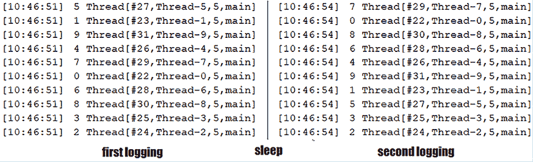

图 10.8：使用平台线程

通过仔细检查这个图，我们可以看到这些数字之间存在固定的关联。例如，ID 为 5 的任务由`Thread-5`执行，ID 为 3 的任务由`Thread-3`执行，依此类推。在睡眠（即阻塞操作）之后，这些数字保持不变。这意味着当任务睡眠时，线程只是挂起并等待在那里。它们没有工作可做。

让我们从平台线程切换到虚拟线程，然后再次运行代码：

```java
@Override
public Thread newThread(Runnable r) {
  // return new Thread(r);    // classic thread
  return Thread.ofVirtual().unstarted(r); // virtual thread
} 
```

现在，输出继续，如图所示：

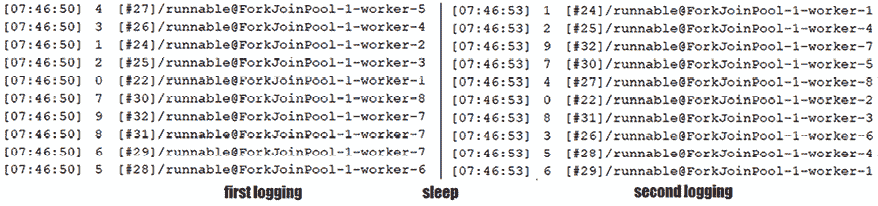

图 10.9：使用虚拟线程

这次，我们可以看到事情更加动态。例如，ID 为 5 的任务由`worker-6`执行的虚拟线程启动，但由`worker-4`完成。ID 为 3 的任务由`worker-4`执行的虚拟线程启动，但由`worker-6`完成。这意味着，当一个任务休眠（一个阻塞操作）时，相应的虚拟线程被卸载，其工作者可以为其他虚拟线程提供服务。当休眠结束后，JVM 调度虚拟线程执行，并将其挂载在另一个（也可能是同一个）工作者上。这也被称为*线程上下文切换*。

## 示例 2

在这个例子中，让我们首先将并行性限制为 1（这就像有一个单核和一个虚拟线程）：

```java
System.setProperty(
  "jdk.virtualThreadScheduler.maxPoolSize", "1");
System.setProperty(
  "jdk.virtualThreadScheduler.maxPoolSize", "1");
System.setProperty(
  "jdk.virtualThreadScheduler.maxPoolSize", "1"); 
```

接下来，让我们考虑我们有一个慢速任务（我们称它为慢速任务，因为它休眠了 5 秒）：

```java
Runnable slowTask = () -> {
  logger.info(() -> Thread.currentThread().toString() 
    + " | working on something");
  logger.info(() -> Thread.currentThread().toString() 
    + " | break time (blocking)");
  try { Thread.sleep(Duration.ofSeconds(5)); } 
    catch (InterruptedException ex) {} // blocking
  logger.info(() -> Thread.currentThread().toString() 
    + " | work done");
}; 
```

然后，一个快速任务（与慢速任务相似，但它只休眠 1 秒）：

```java
Runnable fastTask = () -> {
  logger.info(() -> Thread.currentThread().toString() 
    + " | working on something");
  logger.info(() -> Thread.currentThread().toString() 
    + " | break time (blocking)");
  try { Thread.sleep(Duration.ofSeconds(1)); } 
    catch (InterruptedException ex) {} // blocking
  logger.info(() -> Thread.currentThread().toString() 
    + " | work done");
}; 
```

接下来，我们定义两个虚拟线程来执行这两个任务，如下所示：

```java
Thread st = Thread.ofVirtual()
  .name("slow-", 0).start(slowTask);
Thread ft = Thread.ofVirtual()
  .name("fast-", 0).start(fastTask);
st.join();
ft.join(); 
```

如果我们运行此代码，输出将如下所示：

```java
[08:38:46] VirtualThread[#22,slow-0]/runnable
           @ForkJoinPool-1-worker-1 | working on something 
[08:38:46] VirtualThread[#22,slow-0]/runnable
           @ForkJoinPool-1-worker-1 | break time (blocking) 
[08:38:46] VirtualThread[#24,fast-0]/runnable
           @ForkJoinPool-1-worker-1 | working on something 
[08:38:46] VirtualThread[#24,fast-0]/runnable
           @ForkJoinPool-1-worker-1 | break time (blocking) 
[08:38:47] VirtualThread[#24,fast-0]/runnable
           @ForkJoinPool-1-worker-1 | work done 
[08:38:51] VirtualThread[#22,slow-0]/runnable
           @ForkJoinPool-1-worker-1 | work done 
```

如果我们分析这个输出，我们可以看到执行开始执行慢速任务。快速任务无法执行，因为`worker-1`（唯一的可用工作者）正忙于执行慢速任务：

```java
[08:38:46] VirtualThread[#22,slow-0]/runnable
           @ForkJoinPool-1-worker-1 | working on something 
```

`Worker-1`执行慢速任务，直到这个任务遇到休眠操作。由于这是一个阻塞操作，相应的虚拟线程（#22）从`worker-1`卸载：

```java
[08:38:46] VirtualThread[#22,slow-0]/runnable
           @ForkJoinPool-1-worker-1 | break time (blocking) 
```

JVM 利用`worker-1`可用的事实，推动快速任务的执行：

```java
[08:38:46] VirtualThread[#24,fast-0]/runnable
           @ForkJoinPool-1-worker-1 | working on something 
```

快速任务也遇到了一个休眠操作，其虚拟线程（#24）被卸载：

```java
[08:38:46] VirtualThread[#24,fast-0]/runnable
           @ForkJoinPool-1-worker-1 | break time (blocking) 
```

然而，快速任务只休眠 1 秒，所以它的阻塞操作在慢速任务的阻塞操作之前就结束了，而慢速任务的阻塞操作仍在休眠。因此，JVM 可以再次调度快速任务执行，`worker-1`准备接受它：

```java
[08:38:47] VirtualThread[#24,fast-0]/runnable
           @ForkJoinPool-1-worker-1 | work done 
```

在这个时候，快速任务已经完成，`worker-1`空闲。但慢速任务仍在休眠。在这 5 秒之后，JVM 调度慢速任务执行，`worker-1`在那里等待执行它。

```java
[08:38:51] VirtualThread[#22,slow-0]/runnable
           @ForkJoinPool-1-worker-1 | work done 
```

完成！

## 示例 3

这个例子只是对示例 2 的微小修改。这次，让我们考虑慢速任务包含一个永远运行的非阻塞操作。在这种情况下，这个操作通过一个无限循环来模拟：

```java
Runnable slowTask = () -> {
  logger.info(() -> Thread.currentThread().toString() 
    + " | working on something");
  logger.info(() -> Thread.currentThread().toString() 
    + " | break time (non-blocking)");
  **while****(dummyTrue()) {}** **// non-blocking** 
  logger.info(() -> Thread.currentThread().toString() 
    + " | work done");
};
static boolean dummyTrue() { return true; } 
```

我们有一个单独的工作者(`worker-1`)，快速任务与示例 2 中的相同。如果我们运行此代码，执行将挂起，如下所示：

```java
[09:02:45] VirtualThread[#22,slow-0]/runnable
           @ForkJoinPool-1-worker-1 | working on something 
[09:02:45] VirtualThread[#22,slow-0]/runnable
           @ForkJoinPool-1-worker-1 | break time(non-blocking)
// hang on 
```

执行挂起是因为无限循环不被视为阻塞操作。换句话说，慢速任务的虚拟线程（#22）永远不会被卸载。由于只有一个工作者，JVM 无法推动快速任务的执行。

如果我们将并行性从 1 增加到 2，那么快速任务将由 `worker-2` 成功执行，而 `worker-1`（执行慢速任务）将简单地挂起在部分执行上。我们可以通过依赖超时连接，如 `join(Duration duration)`，来避免这种情况。这样，在给定超时后，慢速任务将被自动中断。所以请注意这种情况。

# 216. 介绍 ExecutorService invoke all/any for virtual threads – 第一部分

在这个问题中，我们不会花费时间在基础知识上，而是直接跳到如何使用 `invokeAll()` 和 `invokeAny()`。如果你需要关于 `ExecutorService` API 的 `invokeAll()`/`invokeAny()` 函数的入门，那么你可以考虑 *Java Coding Problems*，*第一版*，*第十章*，*问题 207*。

## 与 `invokeAll()` 一起工作

简而言之，`invokeAll()` 执行一系列任务（`Callable`），并返回一个 `List<Future>`，它包含每个任务的结果/状态。任务可以自然完成或被给定的超时强制完成。每个任务可以成功完成或异常完成。返回后，所有尚未完成的任务都将自动取消。我们可以通过 `Future.isDone()` 和 `Future.isCancelled()` 检查每个任务的状态：

```java
<T> List<Future<T>> invokeAll(Collection<? extends 
  Callable<T>> tasks) throws InterruptedException
<T> List<Future<T>> invokeAll(
  Collection<? extends Callable<T>> tasks, long timeout,
    TimeUnit unit) throws InterruptedException 
```

通过 `newVirtualThreadPerTaskExecutor()`（或通过 `newThreadPerTaskExecutor()`）使用 `invokeAll()` 是直接的。例如，这里我们有一个执行三个 `Callable` 实例的简单示例：

```java
try (ExecutorService executor 
    = Executors.newVirtualThreadPerTaskExecutor()) {
  List<Future<String>> futures = executor.invokeAll(
    List.of(() -> "pass01", () -> "pass02", () -> "pass03"));
  futures.forEach(f -> logger.info(() ->
    "State: " + f.state()));
} 
```

你是否注意到了 `f.state()` 调用？此 API 在 JDK 19 中引入，它根据已知的 `get()`、`isDone()` 和 `isCancelled()` 计算未来的状态。虽然我们将在后续问题中详细说明，但目前的输出如下：

```java
[10:17:41] State: SUCCESS 
[10:17:41] State: SUCCESS 
[10:17:41] State: SUCCESS 
```

三项任务已成功完成。

## 与 `invokeAny()` 一起工作

简而言之，`invokeAny()` 执行一系列任务（`Callable`），并努力返回与成功终止的任务（在给定的超时之前，如果有）相对应的结果。所有未完成的任务都将自动取消：

```java
<T> T invokeAny(Collection<? extends Callable<T>> tasks)
  throws InterruptedException, ExecutionException
<T> T invokeAny(Collection<? extends Callable<T>> tasks,
  long timeout, TimeUnit unit) throws InterruptedException,
    ExecutionException, TimeoutException 
```

通过 `newVirtualThreadPerTaskExecutor()`（或通过 `newThreadPerTaskExecutor()`）使用 `invokeAny()` 也是直接的。例如，这里我们有一个在关注单个结果时执行三个 `Callable` 实例的简单示例：

```java
try (ExecutorService executor 
    = Executors.newVirtualThreadPerTaskExecutor()) {
  String result = executor.invokeAny(
    List.of(() -> "pass01", () -> "pass02", () -> "pass03"));
  logger.info(result);
} 
```

可能的输出可能是：

```java
[10:29:33] pass02 
```

此输出对应于第二个 `Callable`。

在下一个问题中，我们将提供一个更现实的例子。

# 217. 介绍 ExecutorService invoke all/any for virtual threads – 第二部分

在之前，在 *问题 210* 中，我们编写了一段“非结构化”的并发代码来构建一个由外部服务器服务的三个测试员的测试团队。

现在，让我们尝试通过 `invokeAll()`/`Any()` 和 `newVirtualThreadPerTaskExecutor()` 重新编写 `buildTestingTeam()` 方法。如果我们依赖于 `invokeAll()`，那么应用程序将尝试通过 ID 加载三个测试员，如下所示：

```java
public static TestingTeam buildTestingTeam() 
      throws InterruptedException {
  try (ExecutorService executor 
      = Executors.newVirtualThreadPerTaskExecutor()) {
    List<Future<String>> futures = executor.invokeAll(
      List.of(() -> fetchTester(1), 
              () -> fetchTester(2), 
              () -> fetchTester(3)));
    futures.forEach(f -> logger.info(() -> "State: " 
      + f.state())); 
    return new TestingTeam(futures.get(0).resultNow(), 
      futures.get(1).resultNow(), futures.get(2).resultNow());
  } 
} 
```

我们有三个测试员，ID 分别为 1、2 和 3。所以输出将是：

```java
[07:47:32] State: SUCCESS
[07:47:32] State: SUCCESS 
[07:47:32] State: SUCCESS 
```

在下一个问题中，我们将看到如何根据任务状态做出决策。

如果我们可以即使只有一个测试员也能处理测试阶段，那么我们可以依赖`invokeAny()`，如下所示：

```java
public static TestingTeam buildTestingTeam() 
      throws InterruptedException, ExecutionException {
  try (ExecutorService executor 
    = Executors.newVirtualThreadPerTaskExecutor()) {
    String result = executor.invokeAny(
      List.of(() -> fetchTester(1), 
              () -> fetchTester(2), 
              () -> fetchTester(3)));
    logger.info(result);
    return new TestingTeam(result);
  } 
} 
```

此代码将返回一个代表这三个测试员之一的单个结果。如果他们中没有人可用，那么我们将得到一个`UserNotFoundException`。

# 218. 钩子任务状态

从 JDK 19 开始，我们可以依赖`Future.state()`。此方法根据已知的`get()`、`isDone()`和`isCancelled()`计算`Future`的状态，返回一个`Future.State`枚举项，如下所示：

+   `CANCELLED` – 任务已被取消。

+   `FAILED` – 任务异常完成（带有异常）。

+   `RUNNING` – 任务仍在运行（尚未完成）。

+   `SUCCESS` – 任务正常完成并返回结果（没有异常）。

在以下代码片段中，我们分析加载测试团队成员的状态，并据此采取行动：

```java
public static TestingTeam buildTestingTeam() 
       throws InterruptedException {
  List<String> testers = new ArrayList<>();
  try (ExecutorService executor 
      = Executors.newVirtualThreadPerTaskExecutor()) {
    List<Future<String>> futures = executor.invokeAll(
      List.of(() -> fetchTester(Integer.MAX_VALUE),
              () -> fetchTester(2), 
              () -> fetchTester(Integer.MAX_VALUE)));
    futures.forEach(f -> {
      logger.info(() -> "Analyzing " + f + " state ..."); 
      switch (f.state()) {
        case RUNNING -> throw new IllegalStateException(
          "Future is still in the running state ...");
        case SUCCESS -> {
          logger.info(() -> "Result: " + f.resultNow());
          testers.add(f.resultNow());
        }
        case FAILED ->
          logger.severe(() -> "Exception: " 
            + f.exceptionNow().getMessage());
        case CANCELLED ->
          logger.info("Cancelled ?!?");
      }
    }); 
  }
  return new TestingTeam(testers.toArray(String[]::new));
} 
```

我们知道当执行达到`switch`块时，`Future`对象应该是完全正常或异常的。所以如果当前的`Future`状态是`RUNNING`，那么这是一个非常奇怪的情况（可能是错误），我们抛出`IllegalStateException`。接下来，如果`Future`状态是`SUCCESS`（`fetchTester(2)`），那么我们可以通过`resultNow()`获取结果。此方法是在 JDK 19 中添加的，当我们知道有结果时很有用。`resultNow()`方法立即返回，不等待（就像`get()`一样）。如果状态是`FAILED`（`fetchTester(Integer.MAX_VALUE)`），那么我们通过`exceptionNow()`记录异常。此方法也是在 JDK 19 中添加的，它立即返回失败`Future`的底层异常。最后，如果`Future`被取消，那么就没有什么可做的。我们只需在日志中报告即可。

# 219. 结合 newVirtualThreadPerTaskExecutor()和 Streams

Streams 和`newVirtualThreadPerTaskExecutor()`是一个方便的组合。以下是一个示例，它依赖于`IntStream`提交 10 个简单的任务，并收集返回的`Future`实例的`List`：

```java
try (ExecutorService executor 
      = Executors.newVirtualThreadPerTaskExecutor()) {
  List<Future<String>> futures = IntStream.range(0, 10)
    .mapToObj(i -> executor.submit(() -> {
       return Thread.currentThread().toString() 
         + "(" + i + ")";
  })).collect(toList());
  // here we have the following snippet of code
} 
```

接下来，我们通过调用`get()`方法等待每个`Future`完成：

```java
 futures.forEach(f -> {
    try {
      logger.info(f.get());
    } catch (InterruptedException | ExecutionException ex) {
      // handle exception
    }
  }); 
```

此外，使用流管道与`invokeAll()`结合相当有用。例如，以下流管道返回一个结果列表（它过滤了所有未成功完成的`Future`实例）：

```java
List<String> results = executor.invokeAll(
  List.of(() -> "pass01", () -> "pass02", () -> "pass03"))
  .stream()
  .filter(f -> f.state() == Future.State.SUCCESS)
  .<String>mapMulti((f, c) -> {
    c.accept((String) f.resultNow());
  }).collect(Collectors.toList()); 
```

或者，我们可以编写以下解决方案（不使用`mapMulti()`）：

```java
List<String> results = executor.invokeAll(
  List.of(() -> "pass01", () -> "pass02", () -> "pass03"))
  .stream()
  .filter(f -> f.state() == Future.State.SUCCESS)
  .map(f -> f.resultNow().toString())
  .toList(); 
```

当然，如果你只需要`List<Object>`，那么你可以直接通过`Future::resultNow`进行，如下所示：

```java
List<Object> results = executor.invokeAll(
  List.of(() -> "pass01", () -> "pass02", () -> "pass03"))
  .stream()
  .filter(f -> f.state() == Future.State.SUCCESS)
  .map(Future::resultNow)
  .toList(); 
```

另一方面，你可能需要收集所有异常完成的`Future`。这可以通过`exceptionNow()`实现，如下所示（我们故意在给定的`List<Callable>`中添加了一个将生成`StringIndexOutOfBoundsException`的`Callable`，`() -> "pass02".substring(50)`）：

```java
List<Throwable> exceptions = executor.invokeAll(
  List.of(() -> "pass01", 
          () -> "pass02".substring(50), () -> "pass03"))
  .stream()
  .filter(f -> f.state() == Future.State.FAILED)
  .<Throwable>mapMulti((f, c) -> {
    c.accept((Throwable) f.exceptionNow());
  }).collect(Collectors.toList()); 
```

如果你不喜欢`mapMulti()`，那么就依靠经典方法：

```java
List<Throwable> exceptions = executor.invokeAll(
  List.of(() -> "pass01", () -> "pass02".substring(50), 
          () -> "pass03"))
  .stream()
  .filter(f -> f.state() == Future.State.FAILED)
  .map(Future::exceptionNow)
  .toList(); 
```

你可以在捆绑的代码中找到所有这些示例。

# 220. 介绍范围对象（StructuredTaskScope）

到目前为止，我们已经涵盖了一系列直接或间接通过`ExecutorService`使用虚拟线程的问题。我们已经知道虚拟线程创建成本低，阻塞成本低，并且应用程序可以运行数百万个。我们不需要重用它们，池化它们，或做任何花哨的事情。"使用后丢弃"是处理虚拟线程的正确和推荐方式。这意味着虚拟线程非常适合表达和编写基于大量线程的异步代码，这些线程在短时间内可以多次阻塞/解除阻塞。另一方面，我们知道创建 OS 线程成本高昂，阻塞成本非常高，并且不容易将其放入异步上下文中。

在虚拟线程（所以对于很多人来说，很多年）之前，我们必须通过`ExecutorService`/`Executor`来管理 OS 线程的生命周期，并且我们可以通过*回调*来编写异步（或响应式）代码（你可以在*Java 编码问题*，*第一版*，*第十一章*中找到异步编程的详细说明）。

然而，异步/响应式代码难以编写/阅读，非常难以调试和性能分析，并且几乎难以进行单元测试。没有人愿意阅读和修复你的异步代码！此外，一旦我们开始通过异步回调编写应用程序，我们往往会将此模型用于所有任务，即使对于那些不应该异步的任务也是如此。当我们需要将异步代码/结果与同步代码以某种方式链接时，我们很容易陷入这种陷阱。而实现它的最简单方法就是只使用异步代码。

那么，有没有更好的方法呢？是的，有！结构化并发就是答案。结构化并发最初是一个*孵化器*项目，并在 JDK 21（JEP 453）中达到了*预览*阶段。

在这种情况下，我们应该介绍`StructuredTaskScope`。`StructuredTaskScope`是一个用于`Callable`任务的虚拟线程启动器，它返回一个`Subtask`。子任务是由`StructuredTaskScope.Subtask<T>`接口表示的`Supplier<T>`函数式接口的扩展，并通过`StructuredTaskScope.fork(Callable task)`进行分叉。它遵循并基于结构化并发的根本原则（参见*问题 210*）："*当任务需要并发解决时，所有解决该任务所需的线程都在同一块代码中启动和重新连接。换句话说，所有这些线程的生命周期都绑定在块的范围内，因此我们为每个并发代码块提供了清晰和明确的入口和出口点*。"这些线程负责以单个工作单元运行给定任务的子任务（`Subtask`）。

让我们来看一个通过`StructuredTaskScope`从我们的 Web 服务器获取单个测试者（ID 为 1）的示例：

```java
public static TestingTeam buildTestingTeam() 
       throws InterruptedException {
  try (StructuredTaskScope scope 
      = new StructuredTaskScope<String>()) {
    Subtask<String> subtask
      = scope.fork(() -> fetchTester(1));
    logger.info(() -> "Waiting for " + subtask.toString() 
      + " to finish ...\n");
    scope.join(); 
    String result = subtask.get();
    logger.info(result);
    return new TestingTeam(result);
  } 
} 
```

首先，我们以`try-with-resources`模式创建一个`StructuredTaskScope`。`StructuredTaskScope`实现了`AutoCloseable`接口：

```java
try (StructuredTaskScope scope 
      = new StructuredTaskScope<String>()) {
    ...  
} 
```

`scope`是虚拟线程生命周期的包装器。我们通过`fork(Callable task)`方法使用`scope`来创建所需数量的虚拟线程（子任务）。在这里，我们只创建一个虚拟线程并返回一个`Subtask`（创建是异步操作）：

```java
Subtask<String> subtask = scope.fork(() -> fetchTester(1)); 
```

接下来，我们必须调用`join()`方法（或`joinUntil(Instant deadline)`）。此方法等待从这个`scope`分叉的所有线程（所有`Subtask`实例）以及提交给此`scope`的所有线程完成，因此它是一个阻塞操作。作用域应该只在等待其子任务完成时阻塞，这通过`join()`或`joinUntil()`实现。

```java
scope.join(); 
```

当执行通过这一行时，我们知道从这个`scope`分叉的所有线程（所有分叉的`Subtask`）都已经完成，无论是以结果还是异常（每个子任务独立运行，因此每个子任务都可以以结果或异常完成）。在这里，我们调用非阻塞的`get()`方法来获取结果，但请注意——对一个未完成的任务调用`get()`将抛出`IllegalStateException(`*"Owner did not join after forking subtask"*`)`异常：

```java
String result = subtask.get(); 
```

另一方面，我们可以通过`exception()`方法获取失败任务的异常。然而，如果我们对一个以结果完成的子任务调用`exception()`，那么我们将得到一个`IllegalStateException(`*"Subtask not completed or did not complete with exception"*`)`异常。

所以，如果你不确定你的任务（们）是否以结果或异常完成，最好是在测试相应的`Subtask`状态之后才调用`get()`或`exception()`。状态为`SUCCESS`将安全地允许你调用`get()`，而状态为`FAILED`将安全地允许你调用`exception()`。因此，在我们的情况下，我们可能更喜欢这种方式：

```java
String result = "";
if (subtask.state().equals(Subtask.State.SUCCESS)) {
  result = subtask.get();
} 
```

除了`Subtask.State.SUCCESS`和`Subtask.State.FAILED`之外，我们还有`Subtask.State.UNAVAILABLE`，这意味着子任务不可用（例如，如果子任务仍在运行，则其状态为`UNAVAILABLE`，但也可能有其他原因）。

## ExecutorService 与 StructuredTaskScope 的比较

之前的代码看起来像是我们会通过经典的`ExecutorService`编写的代码，但这两个解决方案之间有两个很大的区别。首先，`ExecutorService`保留了宝贵的平台线程，并允许我们对其进行池化。另一方面，`StructuredTaskScope`只是一个虚拟线程的薄启动器，虚拟线程便宜且不应进行池化。所以一旦我们完成了工作，`StructuredTaskScope`就可以被销毁并回收垃圾。其次，`ExecutorService`为所有任务保留了一个队列，线程在有机会时从该队列中获取任务。`StructuredTaskScope`依赖于 fork/join 池，每个虚拟线程都有自己的等待队列。然而，虚拟线程也可以从另一个队列中窃取任务。这被称为*工作窃取*模式，如果你想了解更多关于它的信息，我们已经在*Java 编码问题*，*第一版*，*第十一章*中进行了深入探讨。

# 221. 引入 ShutdownOnSuccess

在上一个问题中，我们介绍了`StructuredTaskScope`并使用它通过单个虚拟线程（一个`Subtask`）来解决一个任务。基本上，我们从服务器中获取了 ID 为 1 的测试者（我们必须等待这个测试者可用）。接下来，假设我们仍然需要一个测试者，但不一定是 ID 为 1 的那个。这次，可以是 ID 为 1、2 或 3 中的任何一个。我们只需从这三个中选取第一个可用的，并取消其他两个请求。

尤其是在这种场景下，我们有一个`StructuredTaskScope`的扩展，称为`StructuredTaskScope.ShutdownOnSuccess`。这个范围能够返回第一个成功完成的任务的结果，并中断其他线程。它遵循“调用任意”模型，可以使用以下方式：

```java
public static TestingTeam buildTestingTeam() 
       throws InterruptedException, ExecutionException {
  try (ShutdownOnSuccess scope 
      = new StructuredTaskScope.ShutdownOnSuccess<String>()) {
    Subtask<String> subtask1 
      = scope.fork(() -> fetchTester(1));
    Subtask<String> subtask2 
      = scope.fork(() -> fetchTester(2));
    Subtask<String> subtask3 
      = scope.fork(() -> fetchTester(3));
    scope.join();
    logger.info(() -> "Subtask-1 state: " + future1.state());
    logger.info(() -> "Subtask-2 state: " + future2.state());
    logger.info(() -> "Subtask-3 state: " + future3.state());
    String result = (String) scope.result();
    logger.info(result);
    return new TestingTeam(result);
  }
} 
```

这里，我们创建了三个子任务（线程），它们将相互竞争以完成。第一个成功完成的子任务（线程）获胜并返回。`result()`方法返回这个结果（如果所有子任务（线程）都没有成功完成，则抛出`ExecutionException`）。

如果我们检查这三个`Subtask`的状态，我们可以看到其中一个成功了，而其他两个不可用：

```java
[09:01:50] Subtask-1 state: UNAVAILABLE
[09:01:50] Subtask-2 state: SUCCESS
[09:01:50] Subtask-3 state: UNAVAILABLE 
```

当然，你不需要检查/打印每个`Subtask`的状态的代码。这里添加它只是为了突出`ShutdownOnSuccess`的工作原理。你甚至不需要显式的`Subtask`对象，因为我们没有从这个 API 中调用`get()`或其他任何东西。基本上，我们可以将代码简化为以下内容：

```java
public static TestingTeam buildTestingTeam() 
       throws InterruptedException, ExecutionException {
  try (ShutdownOnSuccess scope 
      = new StructuredTaskScope.ShutdownOnSuccess<String>()) {
    scope.fork(() -> fetchTester(1));
    scope.fork(() -> fetchTester(2));
    scope.fork(() -> fetchTester(3));
    scope.join();
    return new TestingTeam((String) scope.result());
  }
} 
```

完成！你只需创建范围，创建子任务，调用`join()`，并收集结果。所以这个范围真的是以业务为中心的。

在`ShutdownOnSuccess`的范围内异常完成的任务永远不会被选中以产生结果。然而，如果所有任务都异常完成，那么我们将得到一个`ExecutionException`，它封装了第一个完成的任务（即原因）的异常。

# 222. 引入 ShutdownOnFailure

如其名称所示，`StructuredTaskScope.ShutdownOnFailure`能够返回第一个完成异常的子任务的异常，并中断其余的子任务（线程）。例如，我们可能想要获取 ID 为 1、2 和 3 的测试者。由于我们需要这三个测试者，我们希望得知其中任何一个不可用，如果有的话，取消一切（即剩余的线程）。代码如下：

```java
public static TestingTeam buildTestingTeam() 
       throws InterruptedException, ExecutionException {
  try (ShutdownOnFailure scope 
      = new StructuredTaskScope.ShutdownOnFailure()) {
    Subtask<String> subtask1 
      = scope.fork(() -> fetchTester(1));
    Subtask<String> subtask2 
      = scope.fork(() -> fetchTester(2));
    Subtask<String> subtask3 
      = scope.fork(() -> fetchTester(Integer.MAX_VALUE));
    scope.join();
    logger.info(() -> "Subtask-1 state: " + subtask1.state());
    logger.info(() -> "Subtask-2 state: " + subtask2.state());
    logger.info(() -> "Subtask-3 state: " + subtask3.state());
    Optional<Throwable> exception = scope.exception();
    if (exception.isEmpty()) {
      logger.info(() -> "Subtask-1 result:" + subtask1.get());
      logger.info(() -> "Subtask-2 result:" + subtask2.get());
      logger.info(() -> "Subtask-3 result:" + subtask3.get());
      return new TestingTeam(
        subtask1.get(), subtask2.get(), subtask3.get());
    } else {
      logger.info(() -> exception.get().getMessage());
      scope.throwIfFailed();
    }
  }
  return new TestingTeam();
} 
```

在这个例子中，我们故意将 ID 3 替换为`Integer.MAX_VALUE`。由于没有具有此 ID 的测试者，服务器将抛出`UserNotFoundException`。这意味着子任务的状态将揭示第三个子任务已经失败：

```java
[16:41:15] Subtask-1 state: SUCCESS
[16:41:15] Subtask-2 state: SUCCESS
[16:41:15] Subtask-3 state: FAILED 
```

此外，当我们调用`exception()`方法时，我们将得到一个包含此异常的`Optional<Throwable>`（如果您对这个主题感兴趣，关于`Optional`功能的深入覆盖可在*Java Coding Problems*，第一版，第十二章中找到）。如果我们决定抛出它，那么我们只需调用`throwIfFailed()`方法，该方法将原始异常（原因）包装在`ExecutionException`中并抛出。在我们的情况下，异常的消息将是：

```java
Exception in thread "main" 
java.util.concurrent.ExecutionException: 
modern.challenge.UserNotFoundException: Code: 404 
```

如果我们移除指南代码，那么我们可以将之前的代码压缩如下：

```java
public static TestingTeam buildTestingTeam() 
       throws InterruptedException, ExecutionException {
  try (ShutdownOnFailure scope 
      = new StructuredTaskScope.ShutdownOnFailure()) {
    Subtask<String> subtask1 
      = scope.fork(() -> fetchTester(1));
    Subtask<String> subtask2 
      = scope.fork(() -> fetchTester(2));
    Subtask<String> subtask3 
      = scope.fork(() -> fetchTester(
        Integer.MAX_VALUE)); // this causes exception
    scope.join();
    scope.throwIfFailed();
    // because we have an exception the following 
    // code will not be executed
    return new TestingTeam(
      subtask1.get(), subtask2.get(), subtask3.get()); 
  }
} 
```

如果没有发生异常，那么`throwIfFailed()`不会做任何事情，这三个测试者都是可用的。每个`Subtask`的结果都可通过非阻塞的`Subtask.get()`获得。

在`ShutdownOnFailure`的覆盖下，一个完成异常的子任务将被选择来产生一个异常。然而，如果所有子任务都正常完成，那么我们将不会得到任何异常。另一方面，如果没有子任务完成异常但被取消，那么`ShutdownOnFailure`将抛出`CancellationException`。

# 223. 结合 StructuredTaskScope 和流

如果您更喜欢函数式编程，那么您会高兴地看到流也可以与`StructuredTaskScope`一起使用。例如，在这里我们重写了*问题 221*中的应用程序，使用流管道来分叉我们的任务：

```java
public static TestingTeam buildTestingTeam() 
       throws InterruptedException, ExecutionException {
  try (ShutdownOnSuccess scope 
      = new StructuredTaskScope.ShutdownOnSuccess<String>()) {
    Stream.of(1, 2, 3)
      .<Callable<String>>map(id -> () -> fetchTester(id))
      .forEach(scope::fork);
    scope.join();
    String result = (String) scope.result();
    logger.info(result);
    return new TestingTeam(result);
  }
} 
```

此外，我们可以使用流管道来收集结果和异常，如下所示：

```java
public static TestingTeam buildTestingTeam() 
    throws InterruptedException, ExecutionException {
 try (ShutdownOnSuccess scope 
  = new StructuredTaskScope.ShutdownOnSuccess<String>()) {
  List<Subtask> subtasks = Stream.of(Integer.MAX_VALUE, 2, 3)
    .<Callable<String>>map(id -> () -> fetchTester(id))
    .map(scope::fork)
    .toList();
  scope.join();
  List<Throwable> failed = subtasks.stream()
    .filter(f -> f.state() == Subtask.State.FAILED)
    .map(Subtask::exception)
    .toList();
  logger.info(failed.toString());
  TestingTeam result = subtasks.stream()
    .filter(f -> f.state() == Subtask.State.SUCCESS)
    .map(Subtask::get) 
    .collect(collectingAndThen(toList(),
      list -> { return new TestingTeam(list.toArray(
        String[]::new)); }));
  logger.info(result.toString());
  return result;
  }
} 
```

您可以在捆绑的代码中找到这些示例。

# 224. 观察和监控虚拟线程

观察和监控虚拟线程可以通过几种方式完成。首先，我们可以使用**Java Flight Recorder**（**JFR**）——我们在*第六章*，*问题 143*中介绍了这个工具。

## 使用 JFR

在其广泛的列表事件中，JFR 可以监控和记录以下与虚拟线程相关的事件：

+   `jdk.VirtualThreadStart` – 当虚拟线程开始时（默认情况下，它是禁用的）

+   `jdk.VirtualThreadEnd` – 当虚拟线程结束时（默认情况下，它是禁用的）记录此事件

+   `jdk.VirtualThreadPinned` – 当虚拟线程在固定时挂起时（默认情况下，它是启用的，阈值为 20 毫秒）记录此事件

+   `jdk.VirtualThreadSubmitFailed` – 如果虚拟线程无法启动或取消挂起（默认情况下是启用的），则记录此事件

你可以在[`sap.github.io/SapMachine/jfrevents/`](https://sap.github.io/SapMachine/jfrevents/)找到所有 JFR 事件。

我们开始配置 JFR 以监控虚拟线程，通过将以下`vtEvent.jfc`文件添加到应用程序的根目录：

```java
<?xml version="1.0" encoding="UTF-8"?>
<configuration version="2.0" description="test">
  <event name="jdk.VirtualThreadStart">
    <setting name="enabled">true</setting>
    <setting name="stackTrace">true</setting>
  </event>
  <event name="jdk.VirtualThreadEnd">
    <setting name="enabled">true</setting>
  </event>
  <event name="jdk.VirtualThreadPinned">
    <setting name="enabled">true</setting>
    <setting name="stackTrace">true</setting>
    <setting name="threshold">20 ms</setting>
  </event>
  <event name="jdk.VirtualThreadSubmitFailed">
    <setting name="enabled">true</setting>
    <setting name="stackTrace">true</setting>
  </event>
</configuration> 
```

接下来，让我们考虑以下代码（基本上，这是问题 216 的应用程序）：

```java
public static TestingTeam buildTestingTeam() 
       throws InterruptedException, ExecutionException {
  try (ShutdownOnSuccess scope 
    = new StructuredTaskScope.ShutdownOnSuccess<String>()) {
    Stream.of(1, 2, 3)
      .<Callable<String>>map(id -> () -> fetchTester(id))
      .forEach(scope::fork);
    scope.join();
    String result = (String) scope.result();
    logger.info(result);
    return new TestingTeam(result);
  }
} 
```

接下来，我们使用`-XX:StartFlightRecording=filename=recording.jfr`来指示 JFR 将输出记录到名为`recording.jfr`的文件中，并且我们继续使用`settings=vtEvent.jfc`来突出显示之前列出的配置文件。

所以最终的命令是来自这个图中的命令：

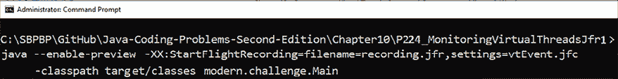

图 10.10：运行 JFR

JFR 生成了一个名为`recording.jfr`的文件。我们可以通过 JFR CLI 轻松查看此文件的内容。命令(`jfr print recording.jfr`)将显示`recording.jfr`的内容。内容太大，无法在此列出（它包含三个`jdk.VirtualThreadStart`条目和三个`jdk.VirtualThreadEnd`条目），但以下是特定于启动虚拟线程的事件：

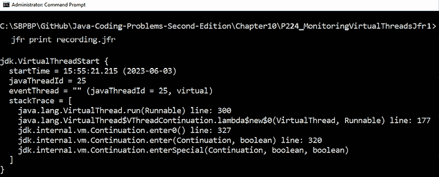

图 10.11：启动虚拟线程的 JFR 事件

在下一个图中，你可以看到记录来结束这个虚拟线程的事件：

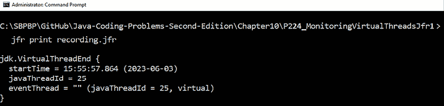

图 10.12：结束虚拟线程的 JFR 事件

除了 JFR CLI 之外，你还可以使用更强大的工具来消费虚拟线程事件，例如 JDK Mission Control ([`www.oracle.com/java/technologies/jdk-mission-control.html`](https://www.oracle.com/java/technologies/jdk-mission-control.html))和知名的 Advanced Management Console ([`www.oracle.com/java/technologies/advancedmanagementconsole.html`](https://www.oracle.com/java/technologies/advancedmanagementconsole.html))。

要获取在固定时阻塞的线程的堆栈跟踪，我们可以设置系统属性`jdk.tracePinnedThreads`。完整的（详细）堆栈跟踪可以通过`-Djdk.tracePinnedThreads=full`获得，或者如果你只需要简短/短的堆栈跟踪，则依靠`-Djdk.tracePinnedThreads=short`。

在我们的例子中，我们可以通过将`fetchTester()`方法标记为`synchronized`（记住，如果一个虚拟线程在`synchronized`方法/块中运行代码，则无法卸载该虚拟线程）来轻松地获得一个固定的虚拟线程：

```java
public static synchronized String fetchTester(int id) 
    throws IOException, InterruptedException {
  ...
} 
```

在这个上下文中，JFR 将记录一个固定的虚拟线程，如图所示：

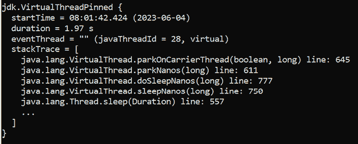

图 10.13：固定虚拟线程的 JFR 事件

如果我们使用`-Djdk.tracePinnedThreads=full`运行应用程序，那么你的 IDE 将打印出以下开始的详细堆栈跟踪：

```java
Thread[#26,ForkJoinPool-1-worker-1,5,CarrierThreads]    java.base/java.lang.VirtualThread$VThreadContinuation.onPinned(VirtualThread.java:183)
... 
```

您可以通过执行捆绑的代码来查看完整的输出。当然，您可以使用`jstack`、**Java Mission Control**（**JMC**）、`jvisualvm`或`jcmd`等工具获取线程转储并分析它。您可能更喜欢其中的任何一个。例如，我们可以通过`jcmd`以纯文本或 JSON 格式获取线程转储，如下所示：

```java
jcmd <PID> Thread.dump_to_file -format=text <file>
jcmd <PID> Thread.dump_to_file -format=json <file> 
```

接下来，让我们使用`jconsole`（JMX）来快速分析虚拟线程的性能。

## 使用 Java 管理扩展（JMX）

直到 JDK 20（包括），JMX 只提供了监控平台和线程的支持。然而，我们仍然可以使用 JMX 来观察与平台线程相比虚拟线程带来的性能。

例如，我们可以使用 JMX 以每 500 毫秒一次的频率监控平台线程，如下面的代码片段所示：

```java
ScheduledExecutorService scheduledExecutor
      = Executors.newScheduledThreadPool(1);
scheduledExecutor.scheduleAtFixedRate(() -> {
  ThreadMXBean threadBean
    = ManagementFactory.getThreadMXBean();
  ThreadInfo[] threadInfo
    = threadBean.dumpAllThreads(false, false);
  logger.info(() -> "Platform threads: " + threadInfo.length);
}, 500, 500, TimeUnit.MILLISECONDS); 
```

我们在以下三种场景中依赖此代码。

## 通过缓存的线程池执行器运行 10,000 个任务

```java
newCachedThreadPool() and platform threads. We also measure the time elapsed to execute these tasks:
```

```java
long start = System.currentTimeMillis();
try (ExecutorService executorCached
    = Executors.newCachedThreadPool()) {
  IntStream.range(0, 10_000).forEach(i -> {
    executorCached.submit(() -> {
      Thread.sleep(Duration.ofSeconds(1));
      logger.info(() -> "Task: " + i);
      return i;
    });
  });
}
logger.info(() -> "Time (ms): " 
  + (System.currentTimeMillis() - start)); 
```

在我的机器上，运行这 10,000 个任务耗时 8,147 毫秒（8 秒），峰值使用 7,729 个平台线程。以下`jconsole`（JMX）的截图揭示了这一信息：

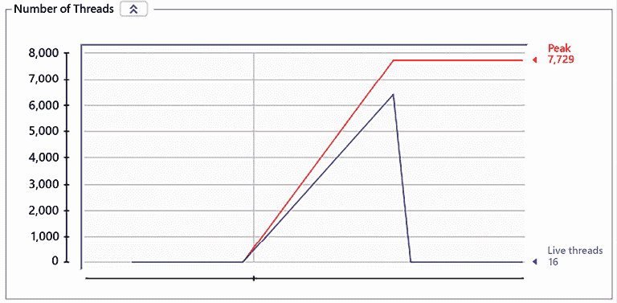

图 10.14：通过缓存的线程池执行器运行 10,000 个任务

接下来，让我们通过固定线程池重复这个测试。

## 通过固定线程池执行器运行 10,000 个任务

根据您的机器配置，之前的测试可能成功完成，或者可能导致`OutOfMemoryError`。我们可以通过使用固定线程池来避免这种不愉快的场景。例如，让我们通过以下代码片段将平台线程的数量限制为 200：

```java
long start = System.currentTimeMillis();
try (ExecutorService executorFixed
    = Executors.newFixedThreadPool(200)) {
  IntStream.range(0, 10_000).forEach(i -> {
    executorFixed.submit(() -> {
      Thread.sleep(Duration.ofSeconds(1));
      logger.info(() -> "Task: " + i);
      return i;
    });
  });
}
logger.info(() -> "Time (ms): " 
  + (System.currentTimeMillis() - start)); 
```

在我的机器上，运行这 10,000 个任务耗时 50,190 毫秒（50 秒），峰值使用 216 个平台线程。以下 JMX 的截图揭示了这一信息：

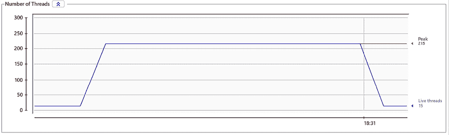

图 10.15：通过固定线程池执行器运行 10,000 个任务

显然，平台线程数量较少会反映在性能上。如果我们用 216 个工作者来完成 7,729 个工作者的工作，当然会花费更长的时间。接下来，让我们看看虚拟线程将如何应对这个挑战。

## 通过每个任务虚拟线程执行器运行 10,000 个任务

这次，让我们看看`newVirtualThreadPerTaskExecutor()`如何处理这 10,000 个任务。代码很简单：

```java
long start = System.currentTimeMillis();
try (ExecutorService executorVirtual
      = Executors.newVirtualThreadPerTaskExecutor()) {
  IntStream.range(0, 10_000).forEach(i -> {
    executorVirtual.submit(() -> {
      Thread.sleep(Duration.ofSeconds(1));
      logger.info(() -> "Task: " + i);
      return i;
    });
  });
}
logger.info(() -> "Time (ms): " 
  + (System.currentTimeMillis() - start)); 
```

在我的机器上，运行这 10,000 个任务耗时 3,519 毫秒（3.5 秒），峰值使用 25 个平台线程。以下 JMX 的截图揭示了这一信息：

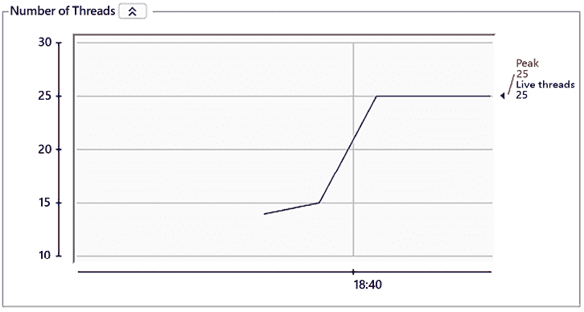

图 10.16：通过每个任务虚拟线程执行器运行 10,000 个任务

哇！这有多酷？！与之前的测试相比，结果的时间远远是最好的，并且它使用了更少的资源（只有 25 个平台线程）。所以虚拟线程真的很棒！

我还强烈推荐您查看以下基准测试：[`github.com/colincachia/loom-benchmark/tree/main`](https://github.com/colincachia/loom-benchmark/tree/main)。

从 JDK 21 开始，JMX 的`HotSpotDiagnosticMXBean`通过`dumpThreads(String outputFile, ThreadDumpFormat format)`方法得到了增强。此方法将线程转储输出到指定的文件（`outputFile`），格式为（`format`）。线程转储将包含所有平台线程，但也可能包含一些或所有虚拟线程。

在以下代码中，我们尝试获取`StructuredTaskScope`的所有子任务（线程）的线程转储：

```java
try (ShutdownOnSuccess scope
  = new StructuredTaskScope.ShutdownOnSuccess<String>()) {
    Stream.of(1, 2, 3)
          .<Callable<String>>map(id -> () -> fetchTester(id))
          .forEach(scope::fork);
  HotSpotDiagnosticMXBean mBean = ManagementFactory
    .getPlatformMXBean(HotSpotDiagnosticMXBean.class);
  mBean.dumpThreads(Path.of("dumpThreads.json")
    .toAbsolutePath().toString(), 
  HotSpotDiagnosticMXBean.ThreadDumpFormat.JSON);
  scope.join();
  String result = (String) scope.result();
  logger.info(result);
} 
```

输出文件命名为`threadDump.json`，您可以在应用程序的根目录中找到它。我们感兴趣的部分输出如下所示：

```java
...
{
  "container": "java.util.concurrent
             .StructuredTaskScope$ShutdownOnSuccess@6d311334",
  "parent": "<root>",
  "owner": "1",
  "threads": [
    {
    "tid": "22"
    "name": "",
    "stack": [
      ...
      "java.base\/java.lang.VirtualThread
       .run(VirtualThread.java:311)"
      ]
    },
   {
    "tid": "24",
    "name": "",
    "stack": [
      ...
      "java.base\/java.lang.VirtualThread
        .run(VirtualThread.java:311)"
      ]
    },
    {
    "tid": "25",
    "name": "",
    "stack": [
      ...
      "java.base\/java.lang.VirtualThread
        .run(VirtualThread.java:311)"
      ]
    }
  ],
  "threadCount": "3"
}
... 
```

如您所见，我们有三个虚拟线程（#22、#24 和#25）运行我们范围内的子任务。在捆绑的代码中，您可以找到完整的输出。

# 摘要

本章涵盖了关于虚拟线程和结构化并发的 16 个入门问题。您可以将本章视为下一章的准备，下一章将涵盖这两个主题的更多详细方面。

# 加入我们的 Discord 社区

加入我们的 Discord 空间，与作者和其他读者进行讨论：

[`discord.gg/8mgytp5DGQ`](https://discord.gg/8mgytp5DGQ)


