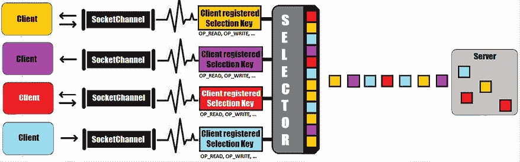
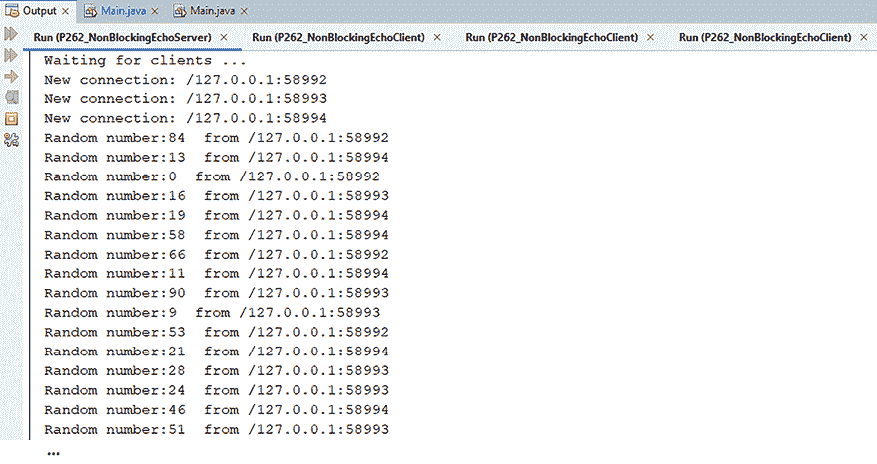
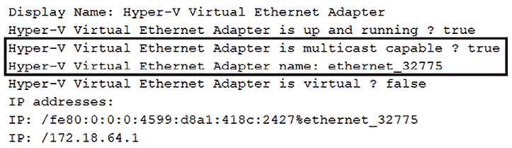
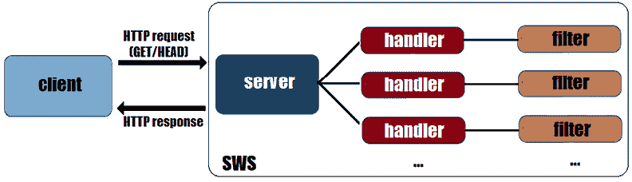
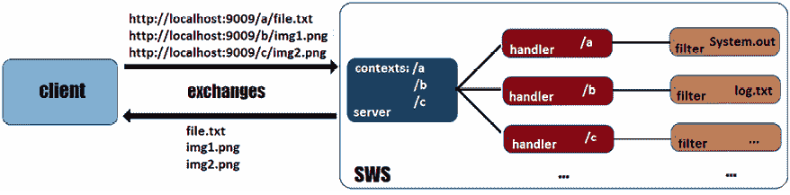
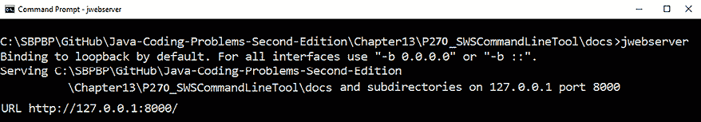
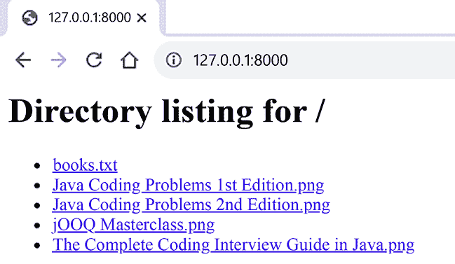
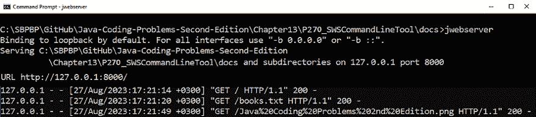
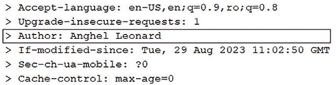

# 第十三章：Socket API 和简单 Web 服务器

本章包括 11 个关于 Socket API 的问题和 8 个关于 JDK 18 **简单 Web 服务器**（**SWS**）的问题。在前 11 个问题中，我们将讨论实现基于套接字的应用程序，如阻塞/非阻塞服务器/客户端应用程序、基于数据报的应用程序和多播应用程序。在本章的第二部分，我们将讨论 SWS 作为命令行工具和一系列 API 点。

在本章结束时，您将了解如何通过 Socket API 编写应用程序，以及如何使用 SWS 进行测试、调试和原型设计任务。

# 问题

使用以下问题来测试您在 Socket API 和 SWS 中的高级编程能力。我强烈建议您在查看解决方案和下载示例程序之前尝试解决每个问题：

1.  **介绍套接字基础知识**：提供对套接字基础知识及其相关背景（TCP、UDP、IP 等）的简要但富有意义的介绍。

1.  **介绍 TCP 服务器/客户端应用程序**：介绍编写阻塞/非阻塞 TCP 服务器/客户端应用程序所需的知识。

1.  **介绍 Java Socket API**：突出编写基于套接字的 Java 应用程序所需的主要 Socket API（NIO.2）。

1.  **编写阻塞 TCP 服务器/客户端应用程序**：提供一个阻塞 TCP 服务器/客户端应用程序的详细示例（理论和代码）。

1.  **编写非阻塞 TCP 服务器/客户端应用程序**：提供一个非阻塞 TCP 服务器/客户端应用程序的详细示例（理论和代码）。

1.  **编写 UDP 服务器/客户端应用程序**：编写一个 UDP 服务器/客户端应用程序，包括无连接客户端和连接客户端。

1.  **介绍多播**：用简单的话解释多播的含义。

1.  **探索网络接口**：编写一段代码，显示您机器上可用的网络接口的详细信息。

1.  **编写 UDP 多播服务器/客户端应用程序**：解释并举例说明基于 UDP 多播的应用程序实现。

1.  **将密钥封装机制 (KEM) 添加到 TCP 服务器/客户端应用程序中**：解释并举例说明 JDK 21 KEM 在 TCP 服务器/客户端应用程序中加密/解密通信的使用。

1.  **重新实现传统的 Socket API**：简要概述 JDK 版本之间 Socket API 的演变。

1.  **SWS 快速概述**：简要介绍 JDK 18 SWS。解释其工作原理及其关键抽象。

1.  **探索 SWS 命令行工具**：提供通过命令行启动、使用和停止 SWS 的分步指南。

1.  **介绍 com.sun.net.httpserver API**：描述 SWS API 的支柱。

1.  **适配请求/交换**：提供一些代码片段，以适应 SWS 请求/交换的定制场景。

1.  **用另一个处理器补充条件 HttpHandler**：编写一个示例，展示如何有条件地选择两个 `HttpHandler` 实例。

1.  **为内存文件系统实现 SWS**：编写一个 SWS 实现，从内存文件系统中提供资源（例如，Google Jimfs 内存文件系统或其他类似解决方案）。

1.  **为 ZIP 文件系统实现 SWS**：编写一个 SWS 实现，从 ZIP 存档中提供资源。

1.  **为 Java 运行时目录实现 SWS**：编写一个 SWS 实现，从 Java 运行时目录（JEP 220）中提供资源。

以下章节描述了前面问题的解决方案。请记住，通常没有解决特定问题的唯一正确方法。此外，请记住，这里所示的解释仅包括解决这些问题所需的最有趣和最重要的细节。下载示例解决方案以查看更多细节并实验程序，请访问[`github.com/PacktPublishing/Java-Coding-Problems-Second-Edition/tree/main/Chapter13`](https://github.com/PacktPublishing/Java-Coding-Problems-Second-Edition/tree/main/Chapter13)。

# 258. 介绍套接字基础

套接字概念在 20 世纪 80 年代被引入。这个概念是在**伯克利软件发行版**（**BSD**）（一种 Unix 风味）中作为通过**互联网协议**（**IP**）在进程之间进行网络通信的解决方案而被引入的。Java 在 1996 年（JDK 1.0）引入了其第一个跨平台的套接字 API。正如你很快就会看到的，只需几个概念，如网络接口、IP 地址和端口，Java 开发者就可以编写通过套接字进行通信的应用程序。

在 IP 层，数据以数据块（*数据包*）的形式从源传输到目的地。每个数据包被视为一个独立的实体，并且无法保证从源发送的所有数据包都会到达目的地。尽管如此，在 IP 之上，我们还有其他更流行的协议，如**传输控制协议**（**TCP**）和**用户数据报协议**（**UDP**）。此外，在这些协议之上，我们有众所周知的 HTTP、DNS、Telnet 等等。通过套接字进行机器通信基于 IP，因此使用 Socket API 的 Java 应用程序可以基于它们预定义的协议与其他基于套接字的应用程序（服务器）进行通信。

连接到互联网的每一台机器都由一个数字或数值标签表示，这通常被称为该机器的*IP 地址*。作为 Java 开发者，我们应该知道 IP 地址有类别：

+   IPv4 – 以 32 位表示的 IP 地址（例如，`89.165.254.108`）

+   IPv6 – 以 128 位表示的 IP 地址（例如，`2001:db8:3333:4444:5555:6666:7777:8888`）

此外，IP 地址被分为 A、B、C、D 和 E 类。例如，IP 地址的 D 类范围从`224.0.0.0`到`239.255.255.255`，并保留用于多播应用。当然，`127.0.0.1`是一个为*localhost*保留的特殊 IP 地址。

现在，说到端口，你应该知道 Java 将它们表示为范围在`0`-`65535`的整数。一些端口是著名的，通常与某种类型的服务器相关联——例如，端口`80`与 HTTP 服务器相关联，端口`23`与 Telnet 服务器相关联，端口`21`与 FTP 服务器相关联，等等。

尽管有针对这些概念深入探讨的书籍，但在这里我们已有足够的信息开始编写依赖套接字的客户端/服务器应用程序。实际上，在这样的客户端/服务器应用程序中，我们有一个在主机（通过 IP 地址和端口号识别的远程或本地主机）上运行的服务器。在运行过程中，服务器会在特定端口上监听进入的客户端。客户端可以通过这两个坐标定位服务器：服务器的 IP 地址和端口号。客户端需要向服务器展示一个本地端口（由内核自动分配或由我们显式设置），服务器正是通过这个端口定位客户端。一个套接字（客户端套接字）与这个本地端口关联或绑定，并用于与服务器通信。一旦连接被接受，服务器也会得到一个套接字（服务器套接字），它绑定到一个新的本地端口（不是用于监听进入客户端的服务器端口）。现在，可以通过这两个套接字（端点）进行双向通信。

# 259. 介绍 TCP 服务器/客户端应用程序

我们不需要成为 TCP 专家就能编写基于 Java 的 TCP 服务器/客户端应用程序。虽然这个主题（TCP）在专门的书籍和文章中有详细的描述（非常完善的文档），但让我们简要概述一下 TCP 原理。

TCP 的目标是在两个端点之间提供点对点通信机制。一旦这两个端点之间的连接建立（通过套接字），在通信期间保持开放，直到其中一方关闭它（通常是客户端）。换句话说，位于不同机器或同一台机器上的两个进程可以像电话连接一样相互通信。在下面的图中，你可以看到一个基于套接字的经典服务器-客户端会话：


图 13.1：基于套接字的服务器/客户端会话（TCP）

服务器/客户端 TCP 连接通过以下坐标表示：

+   服务器端通过其 IP 地址和端口号表示

+   客户端通过其 IP 地址和端口号表示

+   服务器和客户端通过一种协议（UDP、TCP/IP 等）进行通信

正如你在*图 13.1*中看到的，服务器的套接字已绑定并监听客户端的请求（服务器可以同时与多个客户端通信）。客户端的套接字已绑定并准备好请求与服务器建立连接。一旦连接被接受，它们可以双向通信（完成读写操作），直到客户端关闭连接。客户端稍后可以再次连接。

TCP（与 UDP 相比）擅长处理数据包，能够将数据分成数据包、缓冲数据以及跟踪重发丢失或顺序错误的数据包。此外，TCP 能够控制发送数据的速度，以适应接收者的处理能力。TCP 可以将数据作为数据 I/O 流或字节数组发送。

## 阻塞与非阻塞机制

基于 Java TCP 的服务器/客户端应用程序可以是 *阻塞* 或 *非阻塞*。在阻塞应用程序中，一个给定的线程会在 I/O 完全接收之前被阻塞。因此，该线程在 I/O 准备好处理之前不能做任何事情——它只能挂起。另一方面，在非阻塞应用程序中，I/O 请求被排队，线程可以自由地执行其他任务。这些排队的请求将由内核稍后处理。

从 Java 实现的角度来看，编写阻塞应用程序比编写非阻塞应用程序要容易得多。然而，非阻塞应用程序的性能更高，并且能够持续扩展。NIO.2 支持这两种机制，我们也将实现这两种机制，但在介绍 Java Socket API 之前。

# 260. 介绍 Java Socket API

Java 的 Socket API 支持从 JDK 1.0 到 JDK 7 一直在不断进化。从 JDK 7 和 NIO.2 开始，通过引入新的 API（新的类和接口）来极大地改善了套接字支持，这使得编写复杂的 TCP/UDP 应用程序变得容易。例如，`NetworkChannel` 接口被引入作为所有网络通道类的通用实现点。任何实现 `NetworkChannel` 的类都可以访问处理通道到网络套接字的有用方法。这些类包括 `SocketChannel`、`ServerSocketChannel` 和 `DatagramChannel`。这些类利用了处理本地地址和通过 `SocketOption<T>`（接口）和 `StandardSocketOptions`（类）配置套接字选项的方法。此外，此 API 还公开了访问远程地址、检查连接状态和关闭套接字的方法。

`NetworkChannel` 的最重要的子接口之一是 `MulticastChannel`。此接口仅由 `DatagramChannel` 实现，并且知道如何将能够提供 IP 多播的网络通道映射。任何人都可以获得一个成员密钥（类似于令牌），可以用来加入一个多播组并成为成员。成员密钥对于定制你在多播组中的存在非常有用（例如，根据发送者的地址阻塞或解阻塞数据报）。

## 介绍 NetworkChannel

`NetworkChannel` 提供了适用于所有套接字的方法，因此 `NetworkChannel` 是 Socket API 的一个支柱。`NetworkChannel` 揭示的最重要方法之一是 `bind()`。正如其名称所暗示的，此方法将套接字通道绑定到本地地址（或简称为套接字与本地地址相关联）。更确切地说，套接字通过 `InetSocketAddress` 实例绑定到本地地址——此类扩展了 `SocketAddress`（抽象类）并将套接字地址映射为主机（IP）-端口号对。`bind()` 方法返回绑定的套接字通道（服务器套接字通道、数据报套接字通道等）。返回的通道被显式/手动绑定到给定的主机端口或自动绑定（如果没有提供主机端口）：

```java
NetworkChannel bind(SocketAddress local) throws IOException 
```

可以通过 `getLocalAddress()` 获取绑定本地地址：

```java
SocketAddress getLocalAddress() throws IOException 
```

如果没有地址存在，则此方法返回 `null`。

### 处理套接字选项

一个套接字有多个选项，这些选项通过 `SocketOption<T>` 接口表示。NIO.2 通过 `StandardSocketOptions` 提供了一组标准选项来实现 `SocketChannel<T>`，如下所示：

+   `IP_MULTICAST_IF`：通过此选项，我们设置用于有界数据报套接字（或简称为数据报套接字）进行多播数据报的 `NetworkInterface`。我们可以显式设置此选项，或者允许 **操作系统**（**OS**）选择一个（如果有可用的话）通过将此选项保留为默认值（`null`）。

+   `IP_MULTICAST_LOOP`：这是一个标志选项（默认为 `true`），可以设置给有界数据报套接字，用于控制多播数据报的 **环回**（`true` 表示发送的数据应回环到您的主机）。 

+   `IP_MULTICAST_TTL`：此选项适用于有界数据报套接字。它被称为 **生存时间**（**TTL**），用于设置多播数据报的作用域（设置多播数据包的 TTL）。默认情况下，此选项的值为 `1`，这意味着多播数据报不会发送到本地网络之外。此选项的值介于 `0` 和 `255` 之间。

+   `IP_TOS`：通过此选项，我们设置 IPv4 数据包中 **服务类型**（**ToS**）八位字节的值。对于有界数据报套接字，此值可以随时设置，默认值为 `0`。有关 ToS 八位字节的更多信息，请参阅 RFC 2474 和 RFC 1349（ToS 八位字节的解释是网络特定的）。

+   `SO_BROADCAST`：这是一个标志选项，适用于向 IPv4 广播地址发送数据的有界数据报套接字（默认为 `false`）。当它为 `true` 时，此选项允许传输广播数据报。

+   `SO_KEEPALIVE`：这是一个标志选项（默认为 `false`），适用于有界套接字，用于指示操作系统是否应该保持连接活跃。

+   `SO_LINGER`: 这个选项定义了所谓的*linger 间隔*为一个整数（以秒为单位的超时）。linger 间隔仅适用于工作在阻塞模式的套接字，它代表了应用于`close()`方法的超时。换句话说，当在套接字上调用`close()`方法时，其执行将被阻塞在这个超时（linger 间隔）期间，操作系统尝试传输未发送的数据（如果可能的话）。这个选项可以在任何时候设置（默认情况下，它有一个负值，表示禁用）并且最大超时值是操作系统特定的。

+   `SO_RCVBUF`: 这个选项是一个可以在套接字绑定/连接之前设置的整型值（默认值为操作系统依赖的值）。如果您想设置网络输入缓冲区的大小（以字节为单位），则需要此选项。

+   `SO_SNDBUF`: 这个选项是一个可以在套接字绑定/连接之前设置的整型值（默认值为操作系统依赖的值）。如果您想设置网络输出缓冲区的大小（以字节为单位），则需要此选项。

+   `SO_REUSEADDR`: 通过这个整型选项，我们可以指示一个地址是否可以被重用。对于数据报多播（数据报套接字），这意味着多个程序可以使用（可以绑定到）同一个地址。在面向流的套接字（或简单地说，流套接字）的情况下，只有在之前的连接处于`TIME_WAIT`状态（套接字即将由操作系统关闭，但它仍然等待客户端发送可能的延迟通信）时，地址才能被重用。这个选项的默认值依赖于操作系统，应该在套接字绑定/连接之前设置。

+   `SO_REUSEPORT`: 通过这个整型选项（从 JDK 9 开始可用），我们可以指示一个端口是否可以被重用。对于数据报多播（数据报套接字）和流套接字，这意味着多个套接字可以使用（可以绑定到）同一个端口和地址。应该在连接/绑定套接字之前设置`SO_REUSEPORT`；否则，操作系统将为其提供默认值。

+   `TCP_NODELAY`: 这个标志选项（默认为`false`）用于启用/禁用 Nagle 算法（[`en.wikipedia.org/wiki/Nagle%27s_algorithm`](http://en.wikipedia.org/wiki/Nagle%27s_algorithm)）。它可以在任何时候设置。

设置选项可以通过`NetworkChannel.getOption()`完成，而获取选项可以通过`NetworkChannel.setOption()`完成：

```java
<T> T getOption(SocketOption<T> op_name) throws IOException
<T> NetworkChannel setOption(SocketOption<T> op_name, T op_value) 
  throws IOException 
```

此外，通过`NetworkChannel`，我们可以通过`supportedOptions()`方法获取特定网络套接字支持的所有选项：

```java
Set<SocketOption<?>> supportedOptions() 
```

拥有这些信息后，是时候开始编写我们的第一个基于客户端/服务器套接字的应用程序了。

# 261. 编写阻塞式 TCP 服务器/客户端应用程序

在这个问题中，我们将编写一个阻塞式 TCP 服务器/客户端应用程序。更确切地说，让我们从一个单线程阻塞式 TCP 回显服务器开始。

## 编写单线程阻塞式 TCP 回显服务器

为了编写一个单线程阻塞式 TCP 回显服务器，我们将遵循以下步骤：

1.  创建一个新的服务器套接字通道

1.  配置阻塞机制

1.  设置服务器套接字通道选项

1.  绑定服务器套接字通道

1.  接受连接

1.  通过连接传输数据

1.  关闭通道

因此，让我们从第一步开始。

### 创建一个新的服务器套接字通道

通过线程安全的`java.nio.channels.ServerSocketChannel` API 创建和打开一个新的服务器套接字通道（面向流的监听套接字）可以按照以下方式完成：

```java
ServerSocketChannel serverSC = ServerSocketChannel.open(); 
```

生成的服务器套接字通道尚未绑定/连接。然而，它是开放的，这可以通过`isOpen()`方法来验证：

```java
if (serverSC.isOpen()) {
  ...
} 
```

接下来，让我们配置阻塞机制。

### 配置阻塞机制

一旦服务器套接字通道成功打开，我们可以决定阻塞机制。这可以通过`configureBlocking()`方法完成，该方法接受一个布尔参数（`true`表示阻塞服务器套接字通道）：

```java
serverSC.configureBlocking(true); 
```

一种特殊的通道类型（将在后续问题中介绍）是`SelectableChannel`。这种通道由`configureBlocking()`方法返回（从`AbstractSelectableChannel`继承而来），并且对于通过`Selector` API 实现*多路复用*非常有用。但是，正如我所说的，这将在稍后介绍。

### 设置服务器套接字通道选项

由于所有选项都有默认值，我们可以直接使用它们，或者明确设置我们需要的选项。例如，让我们按照以下方式设置`SO_RCVBUF`和`SO_REUSEADDR`：

```java
serverSC.setOption(StandardSocketOptions.SO_RCVBUF, 4 * 1024);
serverSC.setOption(StandardSocketOptions.SO_REUSEADDR, true); 
```

服务器套接字通道支持的选项可以通过`supportedOptions()`获取：

```java
Set<SocketOption<?>> options = serverSC.supportedOptions();
for (SocketOption<?> option : options)  {
  System.out.println(option);
} 
```

如您所见，您可以在控制台上简单地打印出支持选项。

### 绑定服务器套接字通道

将服务器套接字通道绑定到本地地址是一个非常重要的步骤。我们通过`bind()`方法来完成这个操作——例如，让我们将`serverSC`绑定到本地主机（`127.0.0.1`）和任意选择的端口`4444`：

```java
private static final int SERVER_PORT = 4444;
private static final String SERVER_IP = "127.0.0.1";
...
serverSC.bind(new InetSocketAddress(SERVER_IP, SERVER_PORT)); 
```

如果我们省略 IP 地址并使用只接受端口参数的`InetSocketAddress`构造函数，那么 Java 将依赖于*通配符*IP 地址。这个地址是一个仅用于绑定操作的专用本地 IP，通常它被解释为*任何*：

```java
serverSC.bind(new InetSocketAddress(SERVER_PORT)); 
```

然而，当您决定使用通配符 IP 地址时，请记住以下注意事项。

**重要提示**

注意，IP 通配符地址在存在具有单独 IP 地址的多个网络接口的情况下可能会导致不希望出现的复杂情况。如果您没有准备好处理这种复杂情况，那么将套接字绑定到特定的网络地址，而不是 IP 通配符，会更好。

如果我们需要指定套接字地址（`local_addr`）和挂起的连接数（`pending_c`），那么我们应该依赖以下`bind()`：

```java
public abstract ServerSocketChannel bind(
  SocketAddress local_addr,int pending_c) throws IOException 
```

通过`getLocalAddress()`方法获取绑定的本地地址（`SocketAddress`）。如果套接字尚未绑定，该方法返回`null`。

### 接受连接

到目前为止，服务器套接字通道已打开并绑定。我们已准备好接受传入的客户端。由于我们设置了阻塞模式，应用程序将在建立连接（接受客户端连接请求）或发生 I/O 错误之前被阻塞。

可以通过`accept()`方法接受连接，如下所示：

```java
SocketChannel acceptSC = serverSC.accept(); 
```

此方法返回一个表示客户端套接字通道的`SocketChannel`（或者简单地说，与新的连接关联的套接字通道）。返回的`SocketChannel`是一个流套接字的可选择通道。

**重要提示**

如果对一个尚未绑定的服务器套接字通道调用`accept()`方法，那么我们将得到`NotYetBoundException`异常。

通过`getRemoteAddress()`方法可以获取此通道套接字连接的远程地址（`SocketAddress`）：

```java
System.out.println("New connection: " 
  + acceptSC.getRemoteAddress()); 
```

接下来，让我们看看如何通过此连接传输数据。

### 通过连接传输数据

到目前为止，服务器和客户端之间的双向连接已经建立，它们可以开始相互传输数据。每一方都可以使用 Java I/O 流或字节数组映射发送/接收数据包。实现通信协议和选择合适的 API 相当灵活。例如，我们可以依赖`ByteBuffer`来实现我们的回声服务器：

```java
ByteBuffer tBuffer = ByteBuffer.allocateDirect(1024);
...
while (acceptSC.read(tBuffer) != -1) {
  tBuffer.flip();
  acceptSC.write(tBuffer);
  if (tBuffer.hasRemaining()) {
    tBuffer.compact();
  } else {
    tBuffer.clear();
  }
} 
```

为了支持通过`ByteBuffer`进行数据传输，`SocketChannel`公开了一组`read()`/`write()`方法，如下所示：

+   从通道读取到给定的缓冲区，并返回读取的字节数（如果已到达流末尾，则返回`-1`）：

    ```java
    public abstract int read(ByteBuffer dest_buffer) 
      throws IOException
    public final long read(ByteBuffer[] dests_buffers) 
      throws IOException
    public abstract long read(ByteBuffer[] dests_buffers, 
      int buffer_offset, int buffer_length) throws IOException 
    ```

+   将缓冲区的字节数写入通道，并返回写入的字节数：

    ```java
    public abstract int write(ByteBuffer source_buffer)
     throws IOException
    public final long write(ByteBuffer[] source_buffers)
     throws IOException
    public abstract long write(ByteBuffer[] source_buffers, 
      int buffer_offset, int buffer_length) throws IOException 
    ```

如果您更喜欢使用 Java I/O API 而不是操作多个`ByteBuffer`实例，那么请这样做：

```java
InputStream in = acceptSC.socket().getInputStream();
OutputStream out = acceptSC.socket().getOutputStream(); 
```

或者，像这样：

```java
BufferedReader in = new BufferedReader(
  new InputStreamReader(acceptSC.getInputStream()));
PrintWriter out = new PrintWriter(
  acceptSC.getOutputStream(), true); 
```

当涉及到 I/O 流时，我们不得不讨论关闭 I/O 连接的问题。如果不关闭通道，可以通过`shutdownInput()`和`shutdownOutput()`方法关闭 I/O 连接。`shutdownInput()`方法关闭读取连接，而`shutdownOutput()`方法关闭写入连接。尝试从已关闭的读取连接（流末尾）读取将导致返回`-1`。另一方面，尝试在已关闭的写入连接上写入将引发`ClosedChannelException`异常：

```java
// connection will be shut down for reading
acceptSC.shutdownInput();
// connection will be shut down for writing
acceptSC.shutdownOutput(); 
```

另一方面，如果您只需要检查 I/O 连接是否打开，可以通过以下代码实现：

```java
boolean inputdown = acceptSC.socket().isInputShutdown();
boolean outputdown = acceptSC.socket().isOutputShutdown(); 
```

在尝试通过此连接进行读写操作之前，这些检查很有用。

### 关闭通道

可以通过`close()`方法关闭通道。如果我们想关闭特定的客户端套接字通道，那么我们依赖于`SocketChannel.close()` – 这将不会关闭服务器（停止监听传入的客户端）。另一方面，如果我们想关闭服务器以停止它监听传入的客户端，那么只需按照以下方式调用`ServerSocketChannel.close()`：

```java
acceptSC.close(); // close a specific client
serverSC.close(); // close the server itself 
```

通常，你会在 *try-with-resources* 块中关闭这些资源。

### 将所有这些整合到回声服务器中

我们回声服务器的源代码可以通过连接之前的代码片段并添加一些粘合代码和注释来获取：

```java
public class Main {
  private static final int SERVER_PORT = 4444;
  private static final String SERVER_IP = "127.0.0.1";
  public static void main(String[] args) {
    ByteBuffer tBuffer = ByteBuffer.allocateDirect(1024);
    // open a brand new server socket channel
    try (ServerSocketChannel serverSC
           = ServerSocketChannel.open()) {
      // server socket channel was created
      if (serverSC.isOpen()) {
        // configure the blocking mode
        serverSC.configureBlocking(true);
        // optionally, configure the server side options
        serverSC.setOption(
          StandardSocketOptions.SO_RCVBUF, 4 * 1024);
        serverSC.setOption(
          StandardSocketOptions.SO_REUSEADDR, true);
        // bind the server socket channel to local address
        serverSC.bind(new InetSocketAddress(
          SERVER_IP, SERVER_PORT));
        // waiting for clients
        System.out.println("Waiting for clients ...");
        // ready to accept incoming connections
        while (true) {
          try (SocketChannel acceptSC = serverSC.accept()) {
            System.out.println("New connection: " 
              + acceptSC.getRemoteAddress());
            // sending data
            while (acceptSC.read(tBuffer) != -1) {
              tBuffer.flip();
              acceptSC.write(tBuffer);
              if (tBuffer.hasRemaining()) {
                tBuffer.compact();
              } else {
                tBuffer.clear();
              }
            }
          } catch (IOException ex) {
            // handle exception
          }
        }
      } else {
        System.out.println(
          "Server socket channel unavailable!");
      }
    } catch (IOException ex) {
      System.err.println(ex);
      // handle exception
    }
  }
} 
```

接下来，让我们专注于开发我们的回声服务器客户端。

## 编写单线程阻塞 TCP 客户端

在编写客户端之前，我们必须定义它的工作方式。例如，我们的客户端连接到服务器并发送 *Hey!* 文本。之后，它继续发送 0-100 范围内的随机整数，直到生成并发送数字 50。一旦发送了 50，客户端将关闭通道。服务器将简单地回显从客户端接收到的每条消息。现在，基于这个场景，我们可以通过以下步骤开发客户端：

1.  创建一个新的（客户端）套接字通道

1.  配置阻塞机制

1.  连接客户端套接字通道

1.  通过连接传输数据

1.  关闭通道

让我们解决第一步。

### 创建一个新的（客户端）套接字通道

通过线程安全的 `java.nio.channels.SocketChannel` API 创建和打开一个新的客户端套接字通道（面向流的连接套接字）如下所示：

```java
SocketChannel clientSC = SocketChannel.open(); 
```

结果客户端套接字通道尚未连接。然而，它是打开的，这可以通过 `isOpen()` 方法来验证：

```java
if (clientSC.isOpen()) {
   ...
} 
```

然而，客户端套接字通道可以通过 `open(SocketAddress)` 方法在单步中打开和连接。接下来，让我们配置阻塞机制。

### 配置阻塞机制

一旦客户端套接字通道成功打开，我们可以决定阻塞机制。这可以通过 `configureBlocking()` 方法完成，该方法接受一个布尔参数（`true` 表示阻塞客户端套接字通道）：

```java
clientSC.configureBlocking(true); 
```

接下来，我们为这个客户端套接字通道设置一些选项。

### 设置客户端套接字通道选项

以下选项特定于客户端套接字通道：`IP_TOS`、`SO_RCVBUF`、`SO_LINGER`、`SO_OOBINLINE`、`SO_REUSEADDR`、`TCP_NODELAY`、`SO_KEEPALIVE` 和 `SO_SNDBUF`。这些选项具有默认值，但可以像以下示例中那样显式设置：

```java
clientSC.setOption(
  StandardSocketOptions.SO_RCVBUF, 131072); // 128 * 1024
clientSC.setOption(
  StandardSocketOptions.SO_SNDBUF, 131072); // 128 * 1024
clientSC.setOption(
  StandardSocketOptions.SO_KEEPALIVE, true);
clientSC.setOption(
  StandardSocketOptions.SO_LINGER, 5); 
```

客户端套接字通道通过 `supportedOptions()` 方法揭示支持的选项：

```java
Set<SocketOption<?>> options = clientSC.supportedOptions();
for (SocketOption<?> option : options)  {
  System.out.println(option);
} 
```

如您所见，您可以将支持的选项简单地打印到控制台。

### 连接客户端套接字通道

在打开客户端套接字通道后，我们必须将其连接到监听 `127.0.0.1` 和端口 `4444` 的服务器。这可以通过 `connect()` 方法完成，如下所示：

```java
private final int SERVER_PORT = 4444;
private final String SERVER_IP = "127.0.0.1";
...
clientSC.connect(
  new InetSocketAddress(SERVER_IP, SERVER_PORT)); 
```

由于这是一个阻塞客户端，应用程序会阻塞，直到与该远程地址建立连接或发生 I/O 错误。

在传输数据（发送/接收数据包）之前，您应该确保通过 `isConnected()` 方法连接可用，如下所示：

```java
if (clientSC.isConnected()) {
  ...
} 
```

此外，请注意以下注意事项：

**重要注意事项**

在我们的简单示例中，服务器和客户端在同一台机器上运行（`localhost/127.0.0.1`）。然而，在实际应用中，你应该避免硬编码 IP 地址，并使用服务器的主机名代替其 IP 地址。由于 IP 地址可能会更改或通过如 DHCP 等服务动态分配，你应该依赖主机名（最终通过 DNS 配置）。

接下来，让我们看看我们如何向服务器发送和接收数据。

### 在连接上传输数据

首先，我们发送文本*Hey!*。之后，我们发送介于 0 到 100 之间的整数，直到生成整数 50。在 API 级别，我们依赖于`ByteBuffer`/`CharBuffer`如下：

```java
ByteBuffer tBuffer = ByteBuffer.allocateDirect(1024);
ByteBuffer hBuffer = ByteBuffer.wrap("Hey !".getBytes());
ByteBuffer rBuffer;
CharBuffer cBuffer;
Charset charset = Charset.defaultCharset();
CharsetDecoder chdecoder = charset.newDecoder();
...
clientSC.write(hBuffer);
while (clientSC.read(tBuffer) != -1) {
  tBuffer.flip();
  cBuffer = chdecoder.decode(tBuffer);
  System.out.println(cBuffer.toString());
  if (tBuffer.hasRemaining()) {
    tBuffer.compact();
  } else {
    tBuffer.clear();
  }
  int r = new Random().nextInt(100);
  if (r == 50) {
    System.out.println(
      "Number 50 is here so the channel will be closed");
    break;
  } else {
    rBuffer = ByteBuffer.wrap(
      "Random number:".concat(String.valueOf(r)).getBytes());
    clientSC.write(rBuffer);
  }
} 
```

如你所见，我们使用`ByteBuffer`发送/接收数据，并使用`CharBuffer`解码从服务器接收到的数据。

### 关闭通道

通过`close()`方法断开客户端与服务器之间的连接（关闭客户端套接字通道）可以这样做：

```java
clientSC.close(); 
```

通常，你会在`try-with-resources`块中关闭这些资源。

### 将所有内容整合到客户端

我们的客户端源代码可以通过连接之前的代码片段并添加一些粘合代码和注释来获取：

```java
public class Main {
  private static final int SERVER_PORT = 4444;
  private static final String SERVER_IP = "127.0.0.1";
  public static void main(String[] args) {
    ByteBuffer tBuffer = ByteBuffer.allocateDirect(1024);
    ByteBuffer hBuffer = ByteBuffer.wrap("Hey !".getBytes());
    ByteBuffer rBuffer;
    CharBuffer cBuffer;
    Charset charset = Charset.defaultCharset();
    CharsetDecoder chdecoder = charset.newDecoder();
    // create a brand new client socket channel
    try (SocketChannel clientSC = SocketChannel.open()) {
      // client socket channel was created
      if (clientSC.isOpen()) {
        // configure the blocking mode
        clientSC.configureBlocking(true);
        // optionally, configure the client side options
        clientSC.setOption(
          StandardSocketOptions.SO_RCVBUF, 128 * 1024);
        clientSC.setOption(
          StandardSocketOptions.SO_SNDBUF, 128 * 1024);
        clientSC.setOption(
          StandardSocketOptions.SO_KEEPALIVE, true);
        clientSC.setOption(
          StandardSocketOptions.SO_LINGER, 5);
        // connect this channel's socket to the proper address
        clientSC.connect(
          new InetSocketAddress(SERVER_IP, SERVER_PORT));
        // check the connection availability
          if (clientSC.isConnected()) {
            // sending data
            clientSC.write(hBuffer);
            while (clientSC.read(tBuffer) != -1) {
              tBuffer.flip();
              cBuffer = chdecoder.decode(tBuffer);
              System.out.println(cBuffer.toString());
              if (tBuffer.hasRemaining()) {
                tBuffer.compact();
              } else {
                tBuffer.clear();
              }
              int r = new Random().nextInt(100);
              if (r == 50) {
                System.out.println(
                 "Number 50 is here so the channel
                  will be closed");
                break;
              } else {
                rBuffer = ByteBuffer.wrap(
                  "Random number:".concat(
                    String.valueOf(r)).getBytes());
                clientSC.write(rBuffer);
            }
          }
        } else {
          System.out.println("Connection unavailable!");
        }
      } else {
        System.out.println(
          "Client socket channel unavailable!");
      }
    } catch (IOException ex) {
      System.err.println(ex);
      // handle exception
    }
  }
} 
```

最后，让我们测试我们的服务器/客户端应用程序。

## 测试阻塞回显应用程序

首先，启动服务器应用程序。其次，启动客户端应用程序并检查控制台输出：

```java
Hey !
Random number:17
Random number:31
Random number:53
…
Random number:7
Number 50 is here so the channel will be closed 
```

你甚至可以同时启动几个客户端来查看其工作情况。服务器将显示每个客户端的远程地址。

# 262. 编写非阻塞 TCP 服务器/客户端应用程序

在这个问题中，我们将编写一个非阻塞 TCP 服务器/客户端应用程序。

非阻塞套接字（或非阻塞模式的套接字）允许我们在套接字通道上执行 I/O 操作，而不会阻塞使用它的进程。非阻塞应用程序的主要步骤与阻塞应用程序完全相同。服务器被打开并绑定到本地地址，准备处理传入的客户端。客户端被打开并连接到服务器。从这一点开始，服务器和客户端可以以非阻塞方式交换数据包。

当我们提到以非阻塞方式交换数据时，我们指的是非阻塞技术的基石，即`java.nio.channels.Selector`类。`Selector`的作用是在多个可用的套接字通道之间协调数据传输。基本上，一个`Selector`可以监控每个记录的套接字通道，并检测可用于数据传输的通道，以便处理客户端的请求。此外，`Selector`可以通过一个称为*多路复用*的概念来处理多个套接字的 I/O 操作。这样，就不需要为每个套接字连接分配一个线程，*多路复用*允许使用单个线程来处理多个套接字连接。`Selector`被称为通过`SocketChannel`或`ServerSocketChannel`（`SelectableChannel`的子类）的`register()`方法注册的`SelectableChannel`的*多路复用器*。`Selector`和`SelectableChannel`一起注销/释放。

## 使用 SelectionKey 类

是时候进一步介绍`SelectionKey`类了。一个通道通过`java.nio.channels.SelectionKey`的一个实例注册到`Selector`，所有的`SelectionKey`实例都称为选择键。选择键作为辅助器，用于对客户端的请求进行排序。实际上，选择键携带有关单个客户端子请求的信息（元数据），例如子请求的类型（连接、写、读等）以及用于唯一标识客户端所需的信息。

在将`SelectableChannel`注册到`Selector`的过程中，我们指出该键的通道将由该选择器监控的操作集——这被称为*兴趣集*。当一个操作有资格执行时，它就成为所谓的*就绪集*（当键创建时，此集初始化为 0）。因此，选择键处理两个操作集（*兴趣集*和*就绪集*），这些操作集表示为整数值。操作集的每个位代表由键的通道支持的选可操作类别之一。一个键可以是以下类型之一：

+   `SelectionKey.OP_ACCEPT` (*可接受*): 标记套接字接受操作的位

+   `SelectionKey.OP_CONNECT` (*可连接*): 标记套接字连接操作的位

+   `SelectionKey.OP_READ` (*可读*): 标记读操作的位

+   `SelectionKey.OP_WRITE` (*可写*): 标记写操作的位

选择器必须处理三组选择键，如下所示：

+   *键集*：包含当前注册通道的所有键。

+   *已选择键*：每个至少准备好执行其*兴趣集*中至少一个操作的键都是*已选择键*的一部分。

+   *已取消键*：这包含所有已取消但仍注册了通道的键。

    **重要提示**

    当创建选择器时，这三个集合都是空的。请注意，`Selector` 实例是线程安全的，但它们的键集合却不是。

当发生某些操作时，选择器会唤醒。它开始创建 `SelectionKey`，其中每个这样的键都包含有关当前请求的信息。

选择器在一个无限循环中等待记录的事件（例如，传入的连接请求）。通常，这个循环的第一行是 `Selector.select()`。这是一个阻塞调用，直到 `Selector.wakeup()` 方法被调用，至少有一个通道是可选择的，或者当前线程被中断。还有一个 `select(long timeout)` 方法，它的工作方式与 `select()` 相同，但有一个超时。此外，我们还有 `selectNow()`，它是非阻塞的——如果没有可选择的通道，则 `selectNow()` 立即返回 `0`。

假设选择器正在等待连接尝试。当客户端尝试连接时，服务器会检查选择器创建的每个键的类型。如果类型是 `OP_ACCEPT`（可接受键），则 `SelectionKey.isAcceptable()` 方法会采取行动。当此方法返回 `true` 时，服务器通过 `accept()` 方法定位客户端套接字通道。此外，它将此套接字通道设置为非阻塞，并将其注册到选择器，使其适用于 `OP_READ` 和/或 `OP_WRITE` 操作。在处理选择器创建的键时，服务器将它们从列表中删除（这些键的 `Iterator`），以防止对同一键的重新评估。

到目前为止，客户端套接字通道已注册到选择器以进行读写操作。现在，如果客户端在套接字通道上发送（写入）一些数据，则选择器将通知服务器端它应该/可以读取该数据（在这种情况下，`SelectionKey.isReadable()` 方法返回 `true`）。另一方面，当客户端从服务器接收（读取）一些数据时，`SelectionKey.isWritable()` 方法返回 `true`。

以下图示突出了基于选择器的非阻塞流程：



图 13.2：基于选择器的非阻塞流程

**重要提示**

在非阻塞模式下，我们可能会遇到所谓的 *部分读取/写入*。这意味着一个 I/O 操作已部分传输（读取或写入）了一些数据（字节较少）或根本没有数据（0 字节）。

接下来，让我们简要介绍 `Selector` 方法。

## 使用选择器方法

在编码非阻塞 TCP 服务器/客户端应用程序之前，我们必须了解一些内置方法，这些方法支持我们的目标：

+   `Selector.open()`: 这将创建并打开一个新的选择器。

+   `Selector.select()`: 这是一个阻塞操作，用于选择一组键。

+   `Selector.select(long t)`: 它的工作方式与 `select()` 完全相同，但有一个以毫秒为单位的超时。如果在 `t` 期间没有可选择的项，则此方法返回 `0`。

+   `Selector.selectNow()`: 这是`select()`的非阻塞版本。如果没有可选择的内容，则此方法返回`0`。

+   `Selector.keys()`: 这返回`Set<SelectionKey>`（选择器的键集）。

+   `Selector.selectedKeys()`: 这返回`Set<SelectionKey>`（选择器的选择键集）。

+   `Selector.wakeup()`: 第一次选择操作（尚未返回）将立即返回。

+   `SelectionKey.isReadable()`: 这检查此键的通道是否已准备好读取。

+   `SelectionKey.isWritable()`: 这检查此键的通道是否已准备好写入。

+   `SelectionKey.isValid()`: 这检查此键的有效性。无效的键会被取消，其选择器会被关闭，或者其通道会被关闭。

+   `SelectionKey.isAcceptable()`: 如果此方法返回`true`，则此键的通道将接受一个新的套接字连接。

+   `SelectionKey.isConnectable()`: 这检查此键的通道是否已成功完成或未能完成其当前的套接字连接操作。

+   `SelectionKey.interestOps()`: 这返回此键的*兴趣集*。

+   `SelectionKey.interestOps(t)`: 这将此键的*兴趣集*设置为`t`。

+   `SelectionKey.readyOps()`: 这返回此键的*准备操作集*。

+   `SelectionKey.cancel()`: 这取消此键的通道与其选择器的注册。

通过`ServerSocketChannel`和`SocketChannel`的`register()`方法可以将通道注册到给定的选择器：

```java
public final SelectionKeyregister(
  Selector s, int p, Object a) throws ClosedChannelException 
```

`s`参数是给定的选择器。`p`参数是选择键的*兴趣集*，`a`参数是选择键的附件（可能为`null`）。

## 编写非阻塞服务器

根据前面的信息，我们可以编写以下非阻塞回声服务器（代码可能看起来有点大，但它包含了有用的注释）：

```java
public class Main {
  private static final int SERVER_PORT = 4444;
  private final Map<SocketChannel, List<byte[]>>
    registerTrack = new HashMap<>();
  private final ByteBuffer tBuffer
    = ByteBuffer.allocate(2 * 1024);
  private void startEchoServer() { 
    // call the open() method for Selector/ServerSocketChannel
    try (Selector selector = Selector.open();
      ServerSocketChannel serverSC
        = ServerSocketChannel.open()) {
      // ServerSocketChannel and Selector successfully opened
      if ((serverSC.isOpen()) && (selector.isOpen())) {
        // configure non-blocking mode
        serverSC.configureBlocking(false);
        // optionally, configure the client side options
        serverSC.setOption(
          StandardSocketOptions.SO_RCVBUF, 256 * 1024);
        serverSC.setOption(
          StandardSocketOptions.SO_REUSEADDR, true);
        // bind the server socket channel to the port
        serverSC.bind(new InetSocketAddress(SERVER_PORT));
        // register this channel with the selector
        serverSC.register(selector, SelectionKey.OP_ACCEPT);
        // waiting for clients
        System.out.println("Waiting for clients ...");
        ... 
```

接下来，我们有`Selector`的无穷循环：

```java
 while (true) {
          // waiting for events
          selector.select();
          // the selected keys have something to be processed
          Iterator itkeys =selector.selectedKeys().iterator();
          while (itkeys.hasNext()) {
            SelectionKey selkey
              = (SelectionKey) itkeys.next();
             // avoid processing the same key twice
            itkeys.remove();
            if (!selkey.isValid()) {
              continue;
            }
            if (selkey.isAcceptable()) {
              acceptOperation(selkey, selector);
            } else if (selkey.isReadable()) {
              this.readOperation(selkey);
            } else if (selkey.isWritable()) {
              this.writeOperation(selkey);
            }
          }
        }
      } else {
        System.out.println(
          "Cannot open the selector/channel");
      }
    } catch (IOException ex) {
      System.err.println(ex);
      // handle exception
    }
  }
... 
```

此外，我们有一组负责接受连接和执行读写操作的辅助工具。首先，我们有`acceptOperation()`辅助工具：

```java
 // isAcceptable = true
  private void acceptOperation(SelectionKey selkey, 
        Selector selector) throws IOException {
    ServerSocketChannel serverSC
      = (ServerSocketChannel) selkey.channel();
    SocketChannel acceptSC = serverSC.accept();
    acceptSC.configureBlocking(false);
    System.out.println("New connection: " 
      + acceptSC.getRemoteAddress());
    // send an welcome message
    acceptSC.write(ByteBuffer.wrap(
      "Hey !\n".getBytes("UTF-8")));
    // register the channel with selector to support more I/O
    registerTrack.put(acceptSC, new ArrayList<>());
    acceptSC.register(selector, SelectionKey.OP_READ);
  }
  ... 
```

读写操作的辅助工具如下：

```java
// isReadable = true
  private void readOperation(SelectionKey selkey) {
    try {
      SocketChannel socketC
        = (SocketChannel) selkey.channel();
      tBuffer.clear();
      int byteRead = -1;
      try {
        byteRead = socketC.read(tBuffer);
      } catch (IOException e) {
        System.err.println("Read error!");
        // handle exception
      }
      if (byteRead == -1) {
        this.registerTrack.remove(socketC);
        System.out.println("Connection was closed by: " 
          + socketC.getRemoteAddress());
        socketC.close();
        selkey.cancel();
        return;
      }
      byte[] byteData = new byte[byteRead];
      System.arraycopy(
        tBuffer.array(), 0, byteData, 0, byteRead);
      System.out.println(new String(byteData, "UTF-8") 
        + " from " + socketC.getRemoteAddress());
      // send the bytes back to client
      doEchoTask(selkey, byteData);
    } catch (IOException ex) {
      System.err.println(ex);
      // handle exception
    }
  }
  // isWritable = true
  private void writeOperation(SelectionKey selkey) 
        throws IOException {
    SocketChannel socketC = (SocketChannel) selkey.channel();
    List<byte[]> channelByteData = registerTrack.get(socketC);
    Iterator<byte[]> iter = channelByteData.iterator();
    while (iter.hasNext()) {
      byte[] itb = iter.next();
      iter.remove();
      socketC.write(ByteBuffer.wrap(itb));
    }
    selkey.interestOps(SelectionKey.OP_READ);
  }
  private void doEchoTask(
        SelectionKey selkey, byte[] dataByte) {
    SocketChannel socketC = (SocketChannel) selkey.channel();
    List<byte[]> channelByteData = registerTrack.get(socketC);
    channelByteData.add(dataByte);
    selkey.interestOps(SelectionKey.OP_WRITE);
  }
  ... 
```

最后，我们必须调用`startEchoServer()`：

```java
 public static void main(String[] args) {
    Main main = new Main();
    main.startEchoServer();
  }
} 
```

接下来，让我们专注于编写我们的非阻塞回声服务器的客户端。

## 编写非阻塞客户端

非阻塞客户端的主要结构与非阻塞服务器相同。然而，有一些不同之处，以下简要概述：

+   客户端套接字通道必须注册到`SelectionKey.OP_CONNECT`操作。这是必需的，因为客户端必须由选择器通知非阻塞服务器已接受其连接请求。

+   虽然服务器端可能无限期地等待传入客户端，但客户端不能以相同的方式尝试连接。换句话说，客户端将依赖于`Selector.select(long timeout)`。500 到 1,000 毫秒的超时应该可以完成任务。

+   客户端还负责检查是否可以通过 `SelectionKey.isConnectable()` 检查键是否可连接。如果此方法返回 `true`，则客户端在条件语句中连接到 `isConnectionPending()` 和 `finishConnect()` API。这种结构对于关闭任何挂起的连接是必要的。实际上，`isConnectionPending()` 方法告诉我们当前客户端通道上是否有任何连接操作正在进行，而 `finishConnect()` 方法将完成连接套接字通道的过程。

现在，我们准备列出客户端代码，该代码遵循与上一个问题相同的场景（我们发送 *Hey!* 文本，然后是 0 到 100 之间的随机整数，直到生成数字 50）：

```java
public class Main {
  private static final int SERVER_PORT = 4444;
  private static final String SERVER_IP = "127.0.0.1";
  private static final int TIMEOUT_SELECTOR = 1_000;
  public static void main(String[] args) 
        throws InterruptedException { 
    ByteBuffer tBuffer = ByteBuffer.allocateDirect(2 * 1024);
    ByteBuffer rBuffer;
    CharBuffer cBuffer;
    Charset charset = Charset.defaultCharset();
    CharsetDecoder chdecoder = charset.newDecoder();
    // call the open() for ServerSocketChannel and Selector
    try (Selector selector = Selector.open();
      SocketChannel clientSC = SocketChannel.open()) {
      // ServerSocketChannel and Selector successfully opened
      if ((clientSC.isOpen()) && (selector.isOpen())) {
        // configure non-blocking mode
        clientSC.configureBlocking(false);
        // optionally, configure the client side options
        clientSC.setOption(
          StandardSocketOptions.SO_RCVBUF, 128 * 1024);
        clientSC.setOption(
          StandardSocketOptions.SO_SNDBUF, 128 * 1024);
        clientSC.setOption(
          StandardSocketOptions.SO_KEEPALIVE, true);
        // register this channel with the selector
        clientSC.register(selector, SelectionKey.OP_CONNECT);
        // connecting to the remote host
        clientSC.connect(new java.net.InetSocketAddress(
          SERVER_IP, SERVER_PORT));
        System.out.println("Local host: " 
          + clientSC.getLocalAddress());
        ... 
```

接下来，我们准备等待连接到服务器：

```java
 // waiting for the connection
        while (selector.select(TIMEOUT_SELECTOR) > 0) {
          // get the keys
          Set selkeys = selector.selectedKeys();
          Iterator iter = selkeys.iterator();
          // traverse and process the keys
          while (iter.hasNext()) {
            SelectionKey selkey = (SelectionKey) iter.next();
            // remove the current key
            iter.remove();
            // get the key's socket channel
            try (SocketChannel keySC
                  = (SocketChannel) selkey.channel()) {
              // attempt a connection
              if (selkey.isConnectable()) {
                // connection successfully achieved
                System.out.println(
                  "Connection successfully achieved!");
                // pending connections will be closed
                if (keySC.isConnectionPending()) {
                  keySC.finishConnect();
                }
                ... 
```

一旦客户端连接，它就可以从服务器端读取/写入数据：

```java
 // read/write from/to server 
                while (keySC.read(tBuffer) != -1) {
                  tBuffer.flip();
                  cBuffer = chdecoder.decode(tBuffer);
                  System.out.println(cBuffer.toString());
                  if (tBuffer.hasRemaining()) {
                    tBuffer.compact();
                  } else {
                    tBuffer.clear();
                  }
                  int r = new Random().nextInt(100);
                  if (r == 50) {
                    System.out.println(
                      "Number 50 is here so 
                       the channel will be closed");
                    break;
                  } else {
                    rBuffer = ByteBuffer.wrap(
                      "Random number:".concat(
                        String.valueOf(r).concat(" "))
                        .getBytes("UTF-8"));
                    keySC.write(rBuffer);
                  }
                }
              }
            } catch (IOException ex) {
              System.err.println(ex);
              // handle exception
            }
          }
        }
      } else {
        System.out.println(
          "Cannot open the selector/channel");
      }
    } catch (IOException ex) {
      System.err.println(ex);
      // handle exception
    }
  }
} 
```

最后，让我们测试我们的非阻塞应用程序。

## 测试非阻塞回显应用程序

首先，启动服务器端。然后，启动几个客户端并检查每个控制台输出：



图 13.3：我们的非阻塞服务器的可能输出

请记住，这不是一个多线程应用程序。它只是一个单线程应用程序，依赖于 *多路复用* 技术。

# 263. 编写 UDP 服务器/客户端应用程序

UDP 是建立在 IP 协议之上的协议。通过 UDP，我们可以发送最多 65,507 字节的数据包（即 65,535 字节的 IP 数据包大小减去最小 IP 头部 20 字节，再加上 8 字节的 UDP 头部，总共 65,507 字节）。在 UDP 中，数据包被视为独立的实体。换句话说，没有任何数据包知道其他数据包的存在。数据包可能以任何顺序到达，也可能根本不会到达。发送者将不会被告知丢失的数据包，因此它将不知道需要重发什么。此外，数据包可能到达得太快或太慢，因此处理它们可能是一个真正的挑战。

虽然 TCP 以高可靠性数据传输而闻名，但 UDP 以低开销传输而闻名。因此，UDP 更像发送一封信（记住 TCP 像是电话通话）。你在信封上写上接收者的地址（在这里，远程 IP 和端口）和你的地址（在这里，本地 IP 和端口），然后发送它（在这里，通过电线）。你不知道信件是否会到达接收者（在这里，发送者无法追踪数据包的路径）并且如果你发送更多的信件，你无法控制它们的到达顺序（在这里，旧的数据包可以在较新的数据包之后到达）。在这种情况下，如果你只关心速度，UDP 就非常适合。因此，如果你可以承受丢失数据包，并且接收它们的顺序不重要，那么 UDP 可能是正确的选择。例如，一个应该每 *n* 毫秒发送传感器状态的程序可以利用 UDP 协议。

## 编写单个线程阻塞 UDP 回显服务器

为了编写单个线程阻塞 UDP 回显服务器，我们将遵循以下步骤：

1.  创建面向数据报的服务器套接字通道

1.  设置面向数据报的套接字通道选项

1.  绑定服务器面向数据报的套接字通道

1.  传输数据包

1.  关闭通道

让我们从第一步开始。

### 创建面向数据报的服务器套接字通道

服务器/客户端 UDP 应用程序的高潮是由一个线程安全的可选择通道表示的，该通道专门用于与面向数据报的套接字（或简单地，数据报套接字）一起工作。在 API 术语中，这被称为`java.nio.channels.DatagramChannel`。

这样的通道可以通过`DatagramChannel.open()`方法获得，该方法接受一个类型为`java.net.ProtocolFamily`的单个参数。协议族实现（`java.net.StandardProtocolFamily`）有两个可能的值：

+   `StandardProtocolFamily.INET`：IP 版本 4（IPv4）

+   `StandardProtocolFamily.INET6`：IP 版本 6（IPv6）

接下来，我们关注 IPv4 的数据报套接字，因此我们按照以下方式调用`open()`方法：

```java
DatagramChannel dchannel
  = DatagramChannel.open(StandardProtocolFamily.INET); 
```

如果你不在乎协议族，那么你可以不带参数调用`open()`方法。在这种情况下，协议族是平台相关的。

在继续之前，我们可以通过`isOpen()`标志方法检查数据报套接字是否打开：

```java
if (dchannel.isOpen()) {
  ...
} 
```

客户端数据报套接字可以以与服务器数据报套接字相同的方式打开。

### 设置面向数据报的套接字通道选项

数据报套接字通道支持以下选项：`SO_BROADCAST`、`IP_TOS`、`IP_MULTICAST_LOOP`、`IP_MULTICAST_TTL`、`SO_SNDBUF`、`SO_REUSEADDR`、`IP_MULTICAST_IF`和`SO_RCVBUF`。以下是一些设置其中几个的示例：

```java
dchannel.setOption(StandardSocketOptions.SO_RCVBUF, 4 * 1024);
dchannel.setOption(StandardSocketOptions.SO_SNDBUF, 4 * 1024); 
```

支持的选项可以通过`supportedOptions()`方法获得：

```java
Set<SocketOption<?>> options = dchannel.supportedOptions();
for(SocketOption<?> option : options) {
  System.out.println(option);
} 
```

接下来，让我们绑定服务器数据报套接字。

### 绑定服务器面向数据报的套接字通道

在监听连接之前，服务器数据报套接字通道应该通过`bind()`方法绑定到本地地址。这里我们有`localhost`（`127.0.0.1`）和任意选择的端口`4444`：

```java
private static final int SERVER_PORT = 4444;
private static final String SERVER_IP = "127.0.0.1";
...
dchannel.bind(new InetSocketAddress(SERVER_IP, SERVER_PORT));
// or, if you prefer the wildcard address
dchannel.bind(new InetSocketAddress(SERVER_PORT)); 
```

如果我们使用`bind(null)`，那么本地地址将被自动分配。我们可以通过`getLocalAddress()`方法来发现本地地址。

### 传输数据包

基于数据报的回显服务器几乎准备好了。我们可以通过`send()`和`receive()`方法以无连接的方式开始发送和接收数据包（UDP 是一种无连接网络协议）。这可以通过以下方式完成：`send()`方法获取要发送的数据作为`ByteBuffer`，远程地址并返回发送的字节数。官方文档给出了关于其工作原理的最佳解释：

*如果此通道处于非阻塞模式并且底层输出缓冲区有足够的空间，或者如果此通道处于阻塞模式并且有足够的空间变得可用，则给定缓冲区中的剩余字节将作为一个单独的数据报发送到给定的目标地址。此方法可以在任何时候调用。然而，如果另一个线程已经在此通道上启动了写入操作，则对方法的调用将阻塞，直到第一个操作完成。如果此通道的套接字未绑定，则此方法将首先导致套接字绑定到一个自动分配的地址，就像调用带有 `null` 参数的 `bind()` 方法一样。*

另一方面，`receive()` 方法获取你期望找到接收到的数据报的 `ByteBuffer`。数据报的源地址是此方法的返回值，并且可以用来发送回一个应答包（如果此方法返回 `null`，则表示通道处于非阻塞模式且没有立即可用的数据报）。再次强调，官方文档为我们提供了关于此方法如何工作的最佳解释：

*如果数据报立即可用，或者如果此通道处于阻塞模式并且最终变得可用，则数据报将被复制到给定的字节数组中，并且其源地址将被返回。如果此通道处于非阻塞模式并且数据报不可立即获得，则此方法立即返回 `null`。此方法可以在任何时候调用。然而，如果另一个线程已经在此通道上启动了读取操作，则对方法的调用将阻塞，直到第一个操作完成。如果此通道的套接字未绑定，则此方法将首先导致套接字绑定到一个自动分配的地址，就像调用带有 `null` 参数的 `bind()` 方法一样。*

远程地址可以通过 `getRemoteAddress()` 方法发现。

我们的阻塞式回声服务器在一个无限循环中监听数据包。当一个数据包可用（已到达服务器）时，我们从其中提取数据以及发送者的地址（远程地址）。我们使用此地址来发送回相同的数据（回声）：

```java
private static final int MAX_SIZE_OF_PACKET = 65507;
...
ByteBuffer echoBuffer
  = ByteBuffer.allocateDirect(MAX_SIZE_OF_PACKET);
...
while (true) {
  SocketAddress clientSocketAddress
    = dchannel.receive(echoBuffer);
  echoBuffer.flip();
  System.out.println("Received " + echoBuffer.limit()
    + " bytes from " + clientSocketAddress.toString() 
    + "! Echo ...");
  dchannel.send(echoBuffer, clientSocketAddress);
  echoBuffer.clear();
} 
```

### 关闭通道

断开数据报套接字通道可以通过以下 `close()` 方法完成：

```java
dchannel.close(); 
```

通常，你会在 `try-with-resources` 块中关闭这些资源。

### 将所有内容整合到客户端

我们服务器的源代码可以通过链式调用之前的代码片段，并添加一些粘合代码和注释来获得：

```java
public class Main {
  private static final int SERVER_PORT = 4444;
  private static final String SERVER_IP = "127.0.0.1";
  private static final int MAX_SIZE_OF_PACKET = 65507;
  public static void main(String[] args) {
    ByteBuffer echoBuffer
      = ByteBuffer.allocateDirect(MAX_SIZE_OF_PACKET);
    // create a datagram channel
    try (DatagramChannel dchannel
      = DatagramChannel.open(StandardProtocolFamily.INET)) {
      // if the channel was successfully opened
      if (dchannel.isOpen()) {
        System.out.println("The echo server is ready!");
        // optionally, configure the server side options
        dchannel.setOption(
          StandardSocketOptions.SO_RCVBUF, 4 * 1024);
        dchannel.setOption(
          StandardSocketOptions.SO_SNDBUF, 4 * 1024);
        // bind the channel to local address
        dchannel.bind(new InetSocketAddress(
          SERVER_IP, SERVER_PORT));
        System.out.println("Echo server available at: " 
          + dchannel.getLocalAddress());
        System.out.println("Ready to echo ...");
        // sending data packets
        while (true) {
          SocketAddress clientSocketAddress
            = dchannel.receive(echoBuffer);
          echoBuffer.flip();
          System.out.println("Received " + echoBuffer.limit()
            + " bytes from " + clientSocketAddress.toString() 
            + "! Echo ...");
          dchannel.send(echoBuffer, clientSocketAddress);
          echoBuffer.clear();
        }
      } else {
        System.out.println("The channel is unavailable!");
      }
    } catch (SecurityException | IOException ex) {
      System.err.println(ex);
      // handle exception
  }
  }
} 
```

接下来，让我们专注于编写回声服务器的客户端。

## 编写无连接的 UDP 客户端

在实现方面，编写无连接的 UDP 客户端几乎与编写服务器端相同。我们创建一个`DatagramChannel`，设置所需选项，然后就可以开始（准备发送/接收数据包）。请注意，数据报客户端不需要绑定（但可以）到本地地址，因为服务器可以从每个数据包中提取 IP/端口对——服务器知道客户端在哪里。然而，如果服务器通过`bind(null)`（因此，自动绑定）绑定，则客户端应该知道分配的服务器 IP/端口对（服务器地址）。当然，反过来也是正确的：如果服务器是第一个发送数据包的（在这种情况下，客户端应该绑定）。

在我们的情况下，客户端知道回声服务器监听在`127.0.0.1`/`4444`，因此它可以发送第一个数据包的以下代码：

```java
public class Main {
  private static final int SERVER_PORT = 4444;
  private static final String SERVER_IP = "127.0.0.1";
  private static final int MAX_SIZE_OF_PACKET = 65507;
  public static void main(String[] args) 
        throws InterruptedException {
    CharBuffer cBuffer;
    Charset charset = Charset.defaultCharset();
    CharsetDecoder chdecoder = charset.newDecoder();
    ByteBuffer bufferToEcho = ByteBuffer.wrap(
      "Echo: I'm a great server!".getBytes());
    ByteBuffer echoedBuffer
      = ByteBuffer.allocateDirect(MAX_SIZE_OF_PACKET);
    // create a datagram channel
    try (DatagramChannel dchannel
      = DatagramChannel.open(StandardProtocolFamily.INET)) {
      // if the channel was successfully opened
      if (dchannel.isOpen()) {
        // optionally, configure the client side options
        dchannel.setOption(
          StandardSocketOptions.SO_RCVBUF, 4 * 1024);
        dchannel.setOption(
          StandardSocketOptions.SO_SNDBUF, 4 * 1024);
        // sending data packets
        int sentBytes = dchannel.send(bufferToEcho, 
          new InetSocketAddress(SERVER_IP, SERVER_PORT));
        System.out.println("Sent " + sentBytes
          + " bytes to the server");
        dchannel.receive(echoedBuffer);
        // hack to wait for the server to echo
        Thread.sleep(5000);
        echoedBuffer.flip();
        cBuffer = chdecoder.decode(echoedBuffer);
        System.out.println(cBuffer.toString());
        echoedBuffer.clear();
      } else {
        System.out.println("Cannot open the channel");
      }
    } catch (SecurityException | IOException ex) { 
      System.err.println(ex);
      // handle exception
    }
  }
} 
```

最后，让我们测试我们的基于阻塞的客户端/服务器数据报应用程序。

## 测试 UDP 无连接回声应用程序

为了测试我们的应用程序，我们启动服务器，它将输出以下消息：

```java
The echo server is ready!
Echo server available at: /127.0.0.1:4444
Ready to echo ... 
```

接下来，我们启动客户端，它将文本*Echo: 我是一个伟大的服务器!*发送到服务器。客户端将输出以下内容：

```java
Sent 25 bytes to the server 
```

服务器将接收这个数据报并将其发送回：

```java
Received 25 bytes from /127.0.0.1:59111! Echo ... 
```

客户端将等待服务器回声 5 秒钟（任意选择的超时时间）。由于服务器将回声接收到的数据报，客户端将收到它并将其打印到控制台：

```java
Echo: I'm a great server! 
```

在这个时候，客户端已经停止，服务器继续等待传入的数据报。所以，别忘了手动停止服务器。

## 编写一个连接的 UDP 客户端

除了无连接的`send()`和`receive()`方法之外，Java API 还支持`read()`和`write()`方法。这些方法仅适用于连接的 UDP 客户端，并且基于`ByteBuffer`来保存读写数据。与无连接的 UDP 客户端（相对）相比，连接的 UDP 客户端依赖于一个套接字通道，它只允许与给定的远程对等地址进行交互（发送/接收数据报）。客户端数据报套接字保持连接。它必须显式关闭。

通过`connect()`方法连接 UDP 客户端，该方法需要服务器端远程地址作为参数：

```java
private static final int SERVER_PORT = 4444;
private static final String SERVER_IP = "127.0.0.1";
...
dchannel.connect(new InetSocketAddress(
  SERVER_IP, SERVER_PORT)); 
```

由于 UDP 是一个无连接协议，`connect()`方法不会在网络上与服务器交换任何数据包。该方法立即返回，实际上不会阻塞应用程序。主要来说，`connect()`方法可以在任何时候调用，因为它不会影响当前正在处理的读写操作。它的目的是将这个套接字通道（如果尚未）绑定到一个自动分配的地址（就像调用`bind(null)`一样）。

可以通过`isConnected()`获取连接状态：

```java
if (dchannel.isConnected()) {
  ...
} 
```

在这个上下文中，为我们的 UDP 回声服务器编写一个 UDP 连接客户端可以这样做：

```java
public class Main {
  private static final int SERVER_PORT = 4444;
  private static final String SERVER_IP = "127.0.0.1";
  private static final int MAX_SIZE_OF_PACKET = 65507;
  public static void main(String[] args) {
    CharBuffer cBuffer;
    Charset charset = Charset.defaultCharset();
    CharsetDecoder chdecoder = charset.newDecoder();
    ByteBuffer bufferToEcho = ByteBuffer.wrap(
      "Echo: I'm a great server!".getBytes());
    ByteBuffer echoedBuffer
      = ByteBuffer.allocateDirect(MAX_SIZE_OF_PACKET);
    // create a datagram channel
    try (DatagramChannel dchannel
        = DatagramChannel.open(StandardProtocolFamily.INET)) {
      // optionally, configure the client side options
      dchannel.setOption(
        StandardSocketOptions.SO_RCVBUF, 4 * 1024);
      dchannel.setOption(
        StandardSocketOptions.SO_SNDBUF, 4 * 1024);
      // if the channel was successfully opened
      if (dchannel.isOpen()) {
        // connect to server (remote address)
        dchannel.connect(new InetSocketAddress(
          SERVER_IP, SERVER_PORT));
        // if the channel was successfully connected
        if (dchannel.isConnected()) {
          // sending data packets
          int sentBytes = dchannel.write(bufferToEcho);
          System.out.println("Sent " + sentBytes
            + " bytes to the server");
          dchannel.read(echoedBuffer);
          echoedBuffer.flip();
          cBuffer = chdecoder.decode(echoedBuffer);
          System.out.println(cBuffer.toString());
          echoedBuffer.clear();
        } else {
          System.out.println("Cannot connect the channel");
        }
      } else {
        System.out.println("Cannot open the channel");
      }
    } catch (SecurityException | IOException ex) { 
      System.err.println(ex);
      // handle exception
    }
  }
} 
```

测试这个客户端很简单。首先，启动服务器。其次，启动客户端并查看控制台输出。

# 264. 介绍多播

多播就像是一种互联网广播的口味。我们知道，电视台可以从源头向所有订阅者或特定区域内的所有人广播（共享）其信号。例外的是那些没有合适的接收器（设备）或对此电视台不感兴趣的人。

从计算机的角度来看，电视台可以被视为一个向一组听众/订阅者或简单地说目的地主机发送数据报的源头。虽然可以通过**单播传输服务**进行点对点通信，但在多播（在单个调用中从源头向多个目的地发送数据报）中，我们有**多播传输服务**。在**单播传输服务**的情况下，通过所谓的**复制单播**（实际上每个点都接收数据的副本）向多个点发送相同的数据是可能的。

在多播术语中，多播数据报的接收者被称为一个**组**。该组由一个 D 类 IP 地址（224.0.0.0-239.255.255.255）唯一标识。只有当新客户端通过相应的 IP 地址连接到该组后，它才能监听并接收多播数据报。多播在多个领域都有用，例如数据共享管理、会议、电子邮件组、广告等等。

Java (NIO.2)通过`MulticastChannel`接口（`NetworkChannel`的子接口）来塑造多播，该接口有一个名为`DatagramChannel`的单个实现。该接口公开了两个`join()`方法，如下所示：

```java
MembershipKey join(InetAddress g, NetworkInterface i) 
  throws IOException
MembershipKey join(InetAddress g, NetworkInterface i, 
  InetAddress s) throws IOException 
```

想要加入多播组的客户端必须调用这些`join()`方法之一。第一个`join()`方法需要多播组的 IP 地址和一个能够执行多播的网络接口。第二个`join()`方法有一个额外的参数（`InetAddress s`），用于指示一个源地址，从该地址开始组成员可以接收数据报。由于成员资格是**累积的**，我们可以使用多个源与同一个组和网络接口。

如果客户端成功加入多播组，那么它会得到一个`MembershipKey`实例，该实例作为一个令牌，用于在该组中执行不同的操作。

**重要提示**

多播通道可以加入多个组。此外，多播通道可以在多个网络接口上加入同一个组。

可以在任何时候通过`close()`方法离开多播组。

## MembershipKey 简要概述

通过`MembershipKey`实例，多播组的客户端可以执行的最常见操作如下：

+   **阻止/解锁**：通过调用带有源地址的`block()`方法，我们可以阻止来自该源发送的数据报。另一方面，我们可以通过`unblock()`方法解锁一个源。

+   **获取组**：`group()`方法返回创建当前成员资格密钥的组的源地址（`InetAddress`）。

+   **获取通道**：`channel()`方法返回创建当前成员资格密钥的组的通道（`MulticastChannel`）。

+   **获取源地址**：对于特定源成员资格密钥（只接收来自该源的数据报），`sourceAddress()`方法返回源地址（`InetAddress`）。

+   **获取网络接口**：本会员密钥的网络接口（`NetworkInterface`）可通过`networkInterface()`方法获取。

+   **检查有效性**：如果成员资格密钥有效，则`isValid()`方法返回`true`。

+   **丢弃**：通过`drop()`方法丢弃成员资格（不再接收来自该组的数据报）可以完成。通常，在创建后，成员资格密钥变得有效，并保持这种状态，直到调用`drop()`方法或关闭通道。

接下来，让我们谈谈网络接口。

# 265. 探索网络接口

在 Java 中，网络接口由`NetworkInterface` API 表示。基本上，网络接口通过一个名称和分配给它的 IP 列表来识别。通过这些信息，我们可以将网络接口与不同的网络任务关联起来，例如多播组。

以下代码片段列出了您机器上可用的所有网络接口：

```java
public class Main {
  public static void main(String[] args) 
         throws SocketException {
    Enumeration allNetworkInterfaces
      = NetworkInterface.getNetworkInterfaces();
    while (allNetworkInterfaces.hasMoreElements()) {
      NetworkInterface ni = (NetworkInterface) 
        allNetworkInterfaces.nextElement();
      System.out.println("\nDisplay Name: " 
        + ni.getDisplayName());
      System.out.println(ni.getDisplayName() 
        + " is up and running ? " + ni.isUp());
      System.out.println(ni.getDisplayName() 
        + " is multicast capable ? " 
        + ni.supportsMulticast());
      System.out.println(ni.getDisplayName() + " name: "  
        + ni.getName());
      System.out.println(ni.getDisplayName() 
        + " is virtual ? " + ni.isVirtual());
      Enumeration ips = ni.getInetAddresses();
      if (!ips.hasMoreElements()) {
        System.out.println("IP addresses: none");
      } else {
        System.out.println("IP addresses:");
        while (ips.hasMoreElements()) {
          InetAddress ip = (InetAddress) ips.nextElement();
          System.out.println("IP: " + ip);
        }
      }
    }
  }
} 
```

对于每个网络接口，我们在控制台打印显示名称（这是一个描述网络接口的文本，供人类阅读）和名称（这对于通过名称识别网络接口很有用）。此外，我们检查网络接口是否是虚拟的（如果它实际上是一个子接口），是否支持多播，以及是否正在运行。在我的机器上运行此应用程序已返回多个网络接口，在下图中，有一个显示支持多播的网络接口（`ethernet_32775`）的截图：



图 13.4：多播网络接口

接下来，让我们看看如何使用`ethernet_32775`编写一个服务器/客户端多播应用程序。

# 266. 编写 UDP 多播服务器/客户端应用程序

在*问题 263*中，我们开发了一个 UDP 服务器/客户端应用程序。因此，基于这个经验，我们可以进一步深入，并强调可以将基于 UDP 的经典应用程序转换为多播应用程序的主要方面。

例如，假设我们想要编写一个多播服务器，该服务器向组（向所有有兴趣接收来自该服务器数据报的成员）发送封装了服务器当前日期时间的数据报。这个数据报每 10 秒发送一次。

## 编写 UDP 多播服务器

编写 UDP 多播服务器从通过`open()`方法获取的新`DatagramChannel`实例开始。接下来，我们设置`IP_MULTICAST_IF`选项（用于指示多播网络接口）和`SO_REUSEADDR`选项（用于允许多个成员绑定到同一地址——这应该在绑定套接字之前完成）：

```java
private static final String 
  MULTICAST_NI_NAME = "ethernet_32775";
...
NetworkInterface mni
  = NetworkInterface.getByName(MULTICAST_NI_NAME);
dchannel.setOption(
  StandardSocketOptions.IP_MULTICAST_IF, mni);
dchannel.setOption(
  StandardSocketOptions.SO_REUSEADDR, true);
... 
```

接下来，我们调用`bind()`方法将通道的套接字绑定到本地地址：

```java
private static final int SERVER_PORT = 4444;
...
dchannel.bind(new InetSocketAddress(SERVER_PORT)); 
```

最后，我们需要传输包含服务器日期时间的数据报的代码。我们任意选择了`225.4.5.6`作为多播组的 IP 地址。将所有这些粘合在一起，结果如下面的服务器代码：

```java
public class Main {
  private static final int SERVER_PORT = 4444;
  private static final String MULTICAST_GROUP = "225.4.5.6";
  private static final String MULTICAST_NI_NAME 
    = "ethernet_32775";
  public static void main(String[] args) {
    ByteBufferd tBuffer;
    // create a channel
    try (DatagramChannel dchannel
      = DatagramChannel.open(StandardProtocolFamily.INET)) {
      // if the channel was successfully opened
      if (dchannel.isOpen()) {
        // get the multicast network interface
        NetworkInterface mni
          = NetworkInterface.getByName(MULTICAST_NI_NAME);
        // optionally, configure the server side options
        dchannel.setOption(
          StandardSocketOptions.IP_MULTICAST_IF, mni);
        dchannel.setOption(
          StandardSocketOptions.SO_REUSEADDR, true);
        // bind the channel to local address
        dchannel.bind(new InetSocketAddress(SERVER_PORT));
        System.out.println(
          "Server is ready...sending date-time info soon...");
        // sending datagrams
        while (true) {
          // sleep for 10000 ms (10 seconds)
          try {
            Thread.sleep(10000);
          } catch (InterruptedException ex) {}
          System.out.println("Sending date-time ...");
          dtBuffer = ByteBuffer.wrap(
            new Date().toString().getBytes());
          dchannel.send(dtBuffer, new InetSocketAddress(
            InetAddress.getByName(MULTICAST_GROUP), 
              SERVER_PORT));
            dtBuffer.flip();
          }
      } else {
        System.out.println("The channel is unavailable!");
      }
    } catch (IOException ex) {
      System.err.println(ex);
    }
  }
} 
```

接下来，让我们编写一个感兴趣接收来自该服务器数据报的客户端。

## 编写 UDP 多播客户端

编写 UDP 多播客户端与编写多播服务器没有太大区别。然而，也有一些不同之处——例如，我们可能想通过`isMulticastAddress()`检查远程地址（我们从那里接收数据报的地址）是否是多播地址。接下来，客户端必须加入多播组，因此它必须调用之前在*问题 264*中描述的`join()`方法之一。最后，实现应该编写为接收数据报，如下面的代码所示：

```java
public class Main {
  private static final int SERVER_PORT = 4444;
  private static final int MAX_SIZE_OF_PACKET = 65507;
  private static final String MULTICAST_GROUP = "225.4.5.6";
  private static final String MULTICAST_NI_NAME 
    = "ethernet_32775";
  public static void main(String[] args) {
    CharBuffer cBuffer;
    Charset charset = Charset.defaultCharset();
    CharsetDecoder chdecoder = charset.newDecoder();
    ByteBuffer dtBuffer
      = ByteBuffer.allocateDirect(MAX_SIZE_OF_PACKET);
    // create a channel
    try (DatagramChannel dchannel
      = DatagramChannel.open(StandardProtocolFamily.INET)) {
      InetAddress multigroup 
        = InetAddress.getByName(MULTICAST_GROUP);
      // if the group address is multicast
      if (multigroup.isMulticastAddress()) {
        // if the channel was successfully open
        if (dchannel.isOpen()) {
          // get the multicast network interface
          NetworkInterface mni
            = NetworkInterface.getByName(MULTICAST_NI_NAME);
          // optionally, configure the client side options
          dchannel.setOption(
            StandardSocketOptions.SO_REUSEADDR, true);
          // bind the channel to remote address 
          dchannel.bind(new InetSocketAddress(SERVER_PORT));
          // join the multicast group and receive datagrams
          MembershipKeymemkey = dchannel.join(
            multigroup, mni);
          // wait to receive datagrams
          while (true) {
            if (memkey.isValid()) {
              dchannel.receive(dtBuffer);
              dtBuffer.flip();
              cBuffer = chdecoder.decode(dtBuffer);
              System.out.println(cBuffer.toString());
              dtBuffer.clear();
            } else {
                break;
            }
          }
        } else {
          System.out.println("The channel is unavailable!");
        }
      } else {
        System.out.println("Not a multicast address!");
      }
    } catch (IOException ex) {
        System.err.println(ex);
      // handle exception
    } 
  }
} 
```

接下来，让我们讨论阻塞/解除阻塞数据报。

## 阻塞/解除阻塞数据报

如您所知，可以通过`block()`方法阻塞来自特定多播组的数据报，而通过`unblock()`方法解除阻塞。以下是一个阻止我们不喜欢的地址列表的代码片段：

```java
List<InetAddress> dislike = ...;
DatagramChannel datagramChannel = ...;
MembershipKey memkey = datagramChannel
  .join(group, network_interface);
if(!dislike.isEmpty()){
  for(InetAddress source : dislike){
    memkey.block(source);
  }
} 
```

或者，如果您有一个您喜欢的地址列表，那么您可以按照以下方式连接到所有这些地址：

```java
List<InetAddress> like = ...;
DatagramChannel dchannel = ...;
if (!like.isEmpty()){
  for (InetAddress source : like){
    dchannel.join(group, network_interface, source); 
  }
} 
```

最后，让我们测试我们的应用程序。

## 测试多播服务器/客户端应用程序

首先，启动服务器，等待您在控制台看到以下消息：

```java
Server is ready ... sending date-time info soon ... 
```

然后，您可以启动一个或多个客户端实例。每 10 秒钟，服务器将发送一个带有“*发送日期时间 ...*”消息标记的数据报：

```java
Server is ready ... sending date-time info soon ...
Sending date-time ...
Sending date-time ...
Sending date-time ... 
```

加入此多播组的每个客户端都将从服务器接收数据报：

```java
Fri Aug 25 08:17:30 EEST 2023
Fri Aug 25 08:17:40 EEST 2023
Fri Aug 25 08:17:50 EEST 2023 
```

完成！请注意，这个应用程序存在一些不足之处。例如，服务器和客户端并不知道彼此。即使没有客户端监听，服务器也会发送数据报，而客户端可能会等待数据报，即使服务器已离线。挑战自己，通过为每一侧添加更多控制来解决这个问题。此外，您可以自由地尝试阻塞/非阻塞模式和连接/无连接特性，以进行多播应用程序的实验。

# 267. 将 KEM 添加到 TCP 服务器/客户端应用程序

在这个问题中，我们试图编写一个 TCP 服务器/客户端应用程序，通过加密消息相互通信。服务器端被称为发送者，客户端被称为接收者。

在这种情况下，发送者可以使用其私钥加密消息，接收者则使用发送者的公钥解密它。如果您没有认出这个场景，那么请允许我提一下，我们正在讨论**认证密钥交换**（**AKE**）在**公钥加密**（**PKE**）中的内容，或者简而言之，就是基于密钥交换算法加密/解密消息。

在 PKE 中，AKE 是一个流行的选择，但它并不安全。换句话说，量子计算机可以推测出 AKE 的漏洞，这些量子计算机能够改变大多数密钥交换算法。JDK 21 可以通过新引入的 KEM（[`en.wikipedia.org/wiki/Key_encapsulation_mechanism`](https://en.wikipedia.org/wiki/Key_encapsulation_mechanism)）来防止这些问题。这是一个作为 JEP 452 交付的最终特性。

KEM 方案依赖于一个私钥公钥对，以及一个共同的密钥。KEM 的工作步骤如下。

## 接收者生成公私钥对

接收者（客户端）通过被称为`KeyPairGenerator` API 的旧式方法生成一个私钥公钥对。公钥通过`getPublic()`获得，私钥通过`getPrivate()`获得。在这里，我们生成了用于**Diffie-Hellman**（**DH**）密钥交换的密钥对，其中使用*Curve25519*，如 RFC 7748 中定义：

```java
private static PublicKey publicKey;
private static PrivateKey privateKey;
...
static {
  try {
    KeyPairGenerator kpg
      = KeyPairGenerator.getInstance("X25519");
    KeyPair kp = kpg.generateKeyPair();
    publicKey = kp.getPublic();
    privateKey = kp.getPrivate();
  } catch (NoSuchAlgorithmException ex) {...}
} 
```

目前，我们只需要公钥。

## 将公钥传输给发送者

接下来，接收者将之前生成的公钥发送给发送者。这是通过接收者的`SocketChannel`完成的：

```java
try (SocketChannel socketChannel = SocketChannel.open()) {
  ...
  socketChannel.write(
    ByteBuffer.wrap(publicKey.getEncoded()));
  ...
} 
```

发送者需要接收者的公钥来生成一个密钥。

## 发送者生成共同的密钥

首先，发送者需要从接收到的`byte[]`中重建接收者的`PublicKey`实例，为此，它可以使用`KeyFactory` API，如下所示：

```java
KeyFactory kf = KeyFactory.getInstance("X25519");
PublicKey publicKeyReceiver = kf.generatePublic(
  new X509EncodedKeySpec(buffer.array())); 
```

`buffer.array()`表示包含公钥字节的`byte[]`。有了`PublicKey`，发送者可以依赖 KEM 方案来获取密钥。它首先使用 JDK 21 中的`KEM`类，该类提供了 KEM 的功能：

```java
KEM kemSender = KEM.getInstance("DHKEM"); 
```

DHKEM 内置算法是 DH 算法的高级版本（[`en.wikipedia.org/wiki/Diffie%E2%80%93Hellman_key_exchange`](https://en.wikipedia.org/wiki/Diffie%E2%80%93Hellman_key_exchange)）。

接下来，发送者创建一个`Encapsulator`并调用`encapsulate()`方法（称为密钥封装函数），该方法在每次调用时生成一个密钥和一个封装消息：

```java
private static SecretKey secretKeySender;
...
KEM.Encapsulator encorSender
  = kemSender.newEncapsulator(publicKeyReceiver);
KEM.Encapsulate dencedSender = encorSender.encapsulate(
  0, encorSender.secretSize(), "AES");
secretKeySender = encedSender.key(); 
```

如果我们不带参数调用`encapsulate()`方法，那么这相当于调用`encapsulate(0, encorSender.secretSize(), "Generic")`。但是，正如你所见，我们更倾向于使用`AES`算法而不是`Generic`。

在这个时候，发送者通过`encedSender`拥有了密钥和封装消息。

## 将封装消息发送给接收者

现在，发送者将通过`encapsulation()`方法将封装消息传输给接收者：

```java
socketChannel.write(ByteBuffer.wrap(
  encedSender.encapsulation())); 
```

接收者是唯一能够使用他们的私钥通过一个新的`Decapsulator`解封装接收到的数据包的人。一旦这样做，接收者就拥有了密钥：

```java
private static SecretKey secretKeyReceiver;
...
KEM kemReceiver = KEM.getInstance("DHKEM");
KEM.Decapsulator decReceiver
  = kemReceiver.newDecapsulator(privateKey);
secretKeyReceiver = decReceiver.decapsulate(
    buffer.array(), 0, decReceiver.secretSize(), "AES"); 
```

发送者的密钥（`secretKeySender`）和接收者的密钥（`secretKeyReceiver`）是相同的。

## 使用密钥加密/解密消息

现在，发送者和接收者可以通过使用密钥和已知的 `Cipher` API 加密/解密消息来继续通信：

```java
Cipher cipher = Cipher.getInstance("...");
cipher.init(Cipher.ENCRYPT_MODE/DECRYPT_MODE, 
  secretKeyReceiver/secretKeySender);
socketChannel.write(ByteBuffer.wrap(
  cipher.doFinal("some message".getBytes()))); 
```

例如，接收者可以向发送者发送加密令牌：

```java
Cipher cipher = Cipher.getInstance("AES/ECB/NoPadding");
cipher.init(Cipher.ENCRYPT_MODE, secretKeyReceiver);
socketChannel.write(ByteBuffer.wrap(
  cipher.doFinal("My token is: 763".getBytes()))); 
```

发送者可以根据此令牌生成密码并将其发送回接收者：

```java
// decrypt the token
Cipher cipher = Cipher.getInstance("AES/ECB/NoPadding");
cipher.init(Cipher.DECRYPT_MODE, secretKeySender);
String decMessage = new String(
  cipher.doFinal(message), Charset.defaultCharset());
// generating the password based on token
// encrypt the password and send it
cipher.init(Cipher.ENCRYPT_MODE, secretKeySender);
socketChannel.write(ByteBuffer.wrap(cipher.doFinal(
  "The generated password is: O98S!".getBytes()))); 
```

最后，接收者解密接收到的密码。在捆绑的代码中，你可以找到完整的代码。

# 268. 重构遗留的 Socket API

Socket API 随着时间的推移得到了改进，并且仍然在为潜在的进一步改进而受到关注。

在 JDK 13 之前，Socket API (`java.net.ServerSocket` 和 `java.net.Socket`) 依赖于 `PlainSocketImpl`。从 JDK 13（JEP 353）开始，此 API 已被 `NioSocketImpl` 替换。

如其名称所示，`NioSocketImpl` 基于 NIO 基础设施。新的实现不依赖于线程栈能够利用缓冲区缓存机制。此外，可以通过 `java.lang.ref.Cleaner` 机制关闭套接字，这特别关注套接字对象是如何进行垃圾回收的。

从 JDK 15（JEP 373，JEP 353 的后续）开始，内部 Socket API 在 `DatagramSocket` 和 `MulticastSocket` API 中进行了重构。目标是使这些 API 更简单，更容易适应与 Project Loom（虚拟线程）一起工作。

无论何时你更喜欢使用旧的 `PlainSocketImpl`，你应该使用 JVM `-Djdk.net.usePlainSocketImpl=true` 选项运行你的代码。

# 269. SWS 快速概述

SWS 在 JDK 18 中通过 JEP 408 添加到 `jdk.httpserver` 模块中。基本上，SWS 是一个静态文件服务器的最小化实现，能够服务于单个目录层次结构。如果请求指向一个文件，则 SWS 将提供该文件。如果请求指向包含索引文件的目录，则将提供索引文件；否则，将列出目录内容。

SWS 非常容易设置，作为命令行工具 (`jwebserver`) 和程序化 API 点套件 (`com.sun.net.httpserver`) 提供。SWS 仅支持 HTTP 1.1（不支持 HTTPS 或 HTTP/2），并且只能响应幂等的 `HEAD` 和 `GET` 请求（任何其他请求类型将返回 405 或 501 HTTP 状态码）。

此外，MIME 类型由 SWS 自动设置，并且没有可用的安全机制（例如 OAuth）。

## SWS 的关键抽象

为了更好地理解 SWS 在幕后是如何工作的，考虑以下图表：



图 13.5：SWS 关键抽象

在左侧，我们有 SWS 的客户端（例如，浏览器）触发 HTTP 请求并获取 HTTP 响应。HTTP 请求-响应周期也称为 *交换*（客户端触发请求并获取响应作为交换）。在右侧，有一个包含服务器、几个 *处理器* 和 *过滤器* 的 SWS。服务器监听传入的 TCP 连接。接下来，每个 HTTP 请求被委托给适当的处理器（可能有一个或多个处理器）。在这里，请求实际上由 SWS 处理。最后，我们有一些过滤器。这些是可选的，它们可以在处理请求之前（预处理过滤器）或之后（后处理过滤器，例如，用于记录目的）执行。

进一步来说，HTTP 请求在 SWS 中的流程如下所示：



图 13.6：SWS 处理器和过滤器

SWS 使用的抽象之一是 *上下文*。上下文是根 URI 部分（`/context/`）和处理器之间的映射。例如，URL `http://localhost:9009/a/file.txt` 的上下文是 `/a/`，它与某个特定的处理器相关联。这样，SWS 就知道如何将请求分派给处理器。换句话说，SWS 检查传入的请求，提取上下文，并尝试找到一个与上下文匹配的处理器。该处理器将提供请求的资源（`file.txt`）。最后，在请求被处理后，一个后处理过滤器将记录请求详情。

# 270. 探索 SWS 命令行工具

运行 SWS 命令行工具（`jwebserver`）的唯一先决条件是 JDK 18 和以下语法：


图 13.7：jwebserver 命令行工具语法

`jwebserver` 的选项很简单。以下是其中一些最有用的选项的简要描述：

+   `-b addr`: 这是绑定地址。默认为回环地址，`127.0.0.1` 或 `::1`。对于所有接口，我们可以使用 `-b 0.0.0.0` 或 `-b ::`。`–b addr` 与 `--bind-address addr` 类似。

+   `-p port`: 这指定了 SWS 将监听传入请求的端口。默认端口是 `8000`。`–p` 端口选项与 `--port port` 类似。

+   `-d dir`: `dir` 变量指向要服务的目录。默认是当前目录。`–d dir` 与 `--directory dir` 类似。

+   `-o level`: `level` 变量可以是 `none`、`info`（默认）或 `verbose`，它指定了输出格式。`–o level` 与 `--output level` 类似。

您可以通过 `jwebsever –h` 命令列出所有选项及其描述。记住这些选项后，让我们启动一个 SWS 实例。

## 从命令行启动 SWS

假设我们想从一个名为`docs`的目录中提供服务，该目录包含一个文本文件和一些图像文件（你可以在捆绑的代码中找到这个文件夹）。为此，我们打开一个命令提示符（在 Windows 中）并导航到`docs`文件夹。接下来，从这个文件夹中，我们像以下图所示启动`jwebserver`命令：



图 13.8：通过 jwebserver 命令启动 SWS

接下来，我们需要将命令提示符上显示的 URL 复制到浏览器地址栏中（这里，URL 是`http://127.0.0.1:8000/`）。由于我们的请求指向当前目录（`docs`），我们得到以下图中的目录列表：



图 13.9：SWS 服务当前目录列表

如果我们点击`books.txt`或任何图像，那么我们将触发对文件的请求，因此 SWS 将返回文件内容，浏览器将相应地渲染它。

这里是点击`books.txt`和`Java Coding Problems 2nd Edition.png`的截图：


图 13.10：SWS 服务两个文件（一个文本文件和一个图像文件）

同时，SWS 已将我们的每个请求记录在以下图片中：



图 13.11：SWS 已记录 GET 请求

完成！接下来，让我们看看我们如何配置服务器。

## 通过命令行配置 SWS

通过命令行配置 SWS 可以通过前面列出的选项来完成。例如，如果我们想更改默认端口，则使用`–p port`（或`--port port`）。在以下示例中，我们使用端口`9009`而不是默认的`8000`。此外，我们通过`–b addr`（这是一个特定于我的机器的地址，代表一个支持组播的*Hyper-V 虚拟以太网适配器*）使我们的服务器仅对地址`172.27.128.1`可用：

```java
jwebserver -b 172.27.128.1 -p 9009 
```

这次，我们打开浏览器，将其指向`http://172.27.128.1:9009/`。

随意测试其他选项。

## 通过命令行停止 SWS

一个 SWS 实例会一直运行，直到它被明确停止。在 Unix/Windows 中，我们可以通过简单地输入*Ctrl* + *C*从命令行停止 SWS。有时，你可能需要等待几秒钟，直到服务器停止，命令提示符才可用于其他命令。

# 271. 介绍 com.sun.net.httpserver API

自 2006 年以来，除了 SWS 命令行工具外，我们还拥有由`com.sun.net.httpserver` API 表示的程序化桥梁。实际上，这个 API 的目标是允许我们以非常简单的方式程序化启动一个 SWS 实例。

首先，我们有 `SimpleFileServer`，这是通过三个静态方法创建 SWS 实例的主要 API，即 `createFileServer()`、`createFileHandler()` 和 `createOutputFilter()`。我们特别感兴趣的是 `createFileServer(InetSocketAddress addr, Path rootDirectory, SimpleFileServer.OutputLevel outputLevel)` 方法。正如您所看到的，通过此方法，我们可以创建一个具有给定端口、根目录（这应该是一个绝对路径）和输出级别的 SWS 实例，如下所示：

```java
HttpServer sws = SimpleFileServer.createFileServer(
  new InetSocketAddress(9009),
  Path.of("./docs").toAbsolutePath(),
  OutputLevel.VERBOSE);
sws.start(); 
```

运行此应用程序后，将在 `http://localhost:9009/` 处可用一个 SWS。

默认地址是回环地址，因此您也可以将 `InetSocketAddress` 表达为 `new InetSocketAddress(InetAddress.getLoopbackAddress(), 9009)`。此外，我们可以在创建服务器后通过 `bind(InetSocketAddress addr, int backlog)` 绑定服务器。

对于程序化启动和停止 SWS 实例，我们有 `start()` 和 `stop()` 方法。

## 使用自定义 HttpHandler

另一种程序化创建自定义 SWS 实例的方法是创建一个文件处理器，并将其传递给重载的 `HttpServer.create()` 方法。文件处理器可以创建如下：

```java
HttpHandler fileHandler = SimpleFileServer.createFileHandler(
  Path.of("./docs").toAbsolutePath()); 
```

此文件处理器可以传递给 `HttpServer.create(InetSocketAddress addr, int backlog, String path, HttpHandler handler, Filter... filters)`，与端口、套接字回退（*允许在监听套接字上排队等待的最大传入连接数*）、上下文路径和可选过滤器一起，如下所示：

```java
HttpServer sws = HttpServer.create(
  new InetSocketAddress(9009), 10, "/mybooks", fileHandler); 
sws.start(); 
```

这次，服务器将在 `http://localhost:9009/mybooks/` 处可用。如果您想实现相同的功能并且仍然使用 `createFileServer()`，那么在创建 SWS 后，您需要通过 `setContext()` 和 `setHandler()` 显式设置上下文和文件处理器，如下所示：

```java
private static final Path ROOT_DIRECTORY_PATH = 
  Path.of("./docs").toAbsolutePath();
...
HttpHandler fileHandler
  = SimpleFileServer.createFileHandler(ROOT_DIRECTORY_PATH);
HttpServer sws = SimpleFileServer.createFileServer(
  new InetSocketAddress(9009),
  ROOT_DIRECTORY_PATH,
  OutputLevel.VERBOSE);
sws.createContext("/mybooks").setHandler(fileHandler);
sws.start(); 
```

还有一个 `createContext(String path, HttpHandler handler)` 方法。

## 使用自定义过滤器

通过 `createOutputFilter(OutputStream out, OutputLevel outputLevel)` 添加 SWS 记录的后处理过滤器可以完成。因此，我们必须指定一个输出流和日志级别。

我们可以有多个过滤器（通过过滤器数组，`Filter...`），但在这里我们创建一个将日志发送到名为 `swslog.txt` 的文本文件的单一过滤器：

```java
HttpHandler fileHandler = SimpleFileServer.createFileHandler(
  Path.of("./docs").toAbsolutePath());
Path swslog = Paths.get("swslog.txt");
BufferedOutputStream output = new 
  BufferedOutputStream(Files.newOutputStream(swslog, 
    StandardOpenOption.CREATE, StandardOpenOption.WRITE));
Filter filter = SimpleFileServer.createOutputFilter(output, 
  SimpleFileServer.OutputLevel.VERBOSE);
HttpServer sws = HttpServer.create(
  new InetSocketAddress(9009), 10, "/mybooks", 
  fileHandler, filter);
sws.start(); 
```

这次，我们的 SWS 解决的每个请求都将记录到 `swslog.txt`。

## 使用自定义执行器

默认情况下，SWS 实例的所有 HTTP 请求都由 `start()` 方法创建的线程处理。但是，我们可以通过 `setExecutor()` 方法指定任何 `Executor` 来处理 HTTP 请求。例如，我们可以依赖 `newVirtualThreadPerTaskExecutor()` 如下所示：

```java
HttpServer sws = SimpleFileServer.createFileServer(
  new InetSocketAddress(9009),
  Path.of("./docs").toAbsolutePath(),
  OutputLevel.VERBOSE);
    sws.setExecutor(Executors.newVirtualThreadPerTaskExecutor());
  sws.start(); 
```

通过 `getExecutor()` 方法可以获取当前的 `Executor`。如果没有之前设置 `Executor`，则 `getExecutor()` 返回 `null`。

# 272. 适配请求/交换

适应请求对于测试和调试目的可能很有用。实际上，我们可以在处理器看到它之前适应请求（`com.sun.net.httpserver.Request`），这样我们就可以修改初始请求并将结果传递给处理器。为此，我们可以依赖预处理`Filter.adaptRequest(String description, UnaryOperator<Request> requestOperator)`方法。除了描述外，此方法获取交换的有效请求状态作为`UnaryOperator<Request>`。

这里有一个例子，它将`Author`头添加到每个请求旁边的一个后处理过滤器中，该过滤器将请求详情记录到控制台：

```java
HttpHandler fileHandler = ...;
Filter preFilter = Filter.adaptRequest(
  "Add 'Author' header", r -> r.with(
    "Author", List.of("Anghel Leonard")));
Filter postFilter = SimpleFileServer.createOutputFilter(
  out, SimpleFileServer.OutputLevel.VERBOSE);
HttpServer sws = HttpServer.create(
  new InetSocketAddress(9009), 10, "/mybooks", 
    fileHandler, preFilter, postFilter);
sws.start(); 
```

我们可以看到`Author`头直接添加到每个请求中。在下图中，你可以看到这个头在其他头之间：



图 13.12：添加了作者头

除了`adaptRequest()`之外，`Filter`类还定义了`beforeHandler(String description, Consumer<HttpExchange> operation)`预处理过滤器和`afterHandler(String description, Consumer<HttpExchange> operation)`后处理过滤器。在两种情况下，`operation`参数代表过滤器的有效实现。正如你所看到的，这些过滤器充当了`com.sun.net.httpserver.HttpExchange`的钩子，它代表一个*交换*（一个 HTTP 请求和相应的响应）：

```java
Filter preFilter = Filter.beforeHandler("some description", 
  exchange -> { 
    // do something with the exchange before handler
  });
Filter postFilter = Filter.afterHandler("some description", 
  exchange -> { 
    // do something with the exchange after handler
  }); 
```

通过`exchange`对象，我们可以访问请求/响应头和正文。

# 273. 使用另一个处理器补充条件`HttpHandler`

假设我们想要根据条件在两个`HttpHandler`实例之间进行选择。例如，对于所有`GET`请求，我们希望使用以下众所周知的`HttpHandler`：

```java
HttpHandler fileHandler = SimpleFileServer.createFileHandler(
  Path.of("./docs").toAbsolutePath()); 
```

对于所有其他请求，我们希望使用一个`HttpHandler`，它总是返回相同的资源（例如，文本*No data available*）。通过`HttpHandlers.of(int statusCode, Headers headers, String body)`方法定义一个总是返回相同代码和资源（因此，一个*预定义响应*）的`HttpHandler`，如下例所示：

```java
HttpHandler complementHandler = HttpHandlers.of(200,   
  Headers.of("Content-Type", "text/plain"), 
    "No data available"); 
```

此外，`HttpHandler`类公开了一个方法，可以根据条件在两个`HttpHandler`实例之间进行选择。这个方法是`handleOrElse(Predicate<Request> handlerTest, HttpHandler handler, HttpHandler fallbackHandler)`。正如你所看到的，条件被表示为`Predicate<Request>`，因此在我们的情况下，我们可以写成如下：

```java
Predicate<Request> predicate = request ->
  request.getRequestMethod().equalsIgnoreCase("GET"); 
```

接下来，我们只需将这个`Predicate<Request>`和两个处理器传递给`handleOrElse()`方法：

```java
HttpHandler handler = HttpHandlers.handleOrElse(
  predicate, fileHandler, complementHandler); 
```

如果`predicate`评估为`true`（因此，收到了 HTTP `GET`请求），则使用`fileHandler`；否则，使用`complementHandler`。最后，我们创建并启动一个 SWS 实例，如下所示：

```java
HttpServer sws = HttpServer.create(
  new InetSocketAddress(9009), 10, "/mybooks", handler); 
sws.start(); 
```

注意传递的`HttpHandler`是`handler`。

# 274. 实现内存文件系统的 SWS

我们已经知道 SWS 可以从默认的本地文件系统提供文件。虽然这个文件系统适合许多场景，但也有一些用例（例如，测试场景）中，模拟目录结构以模拟某些期望将更加实用。在这种情况下，内存文件系统将比本地文件系统更适合，因为我们可以避免资源的创建/删除，并且可以使用不同的平台。

Google 项目名为*Jimfs*（[`github.com/google/jimfs`](https://github.com/google/jimfs)）为 Java 8 提供了一个基于`java.nio.file` API 的内存文件系统实现。通过遵循 GitHub 示例中的说明，我们编写了以下代码以实现一个简单的内存文件系统：

```java
private static Path inMemoryDirectory() throws IOException {
  FileSystem fileSystem
    = Jimfs.newFileSystem(Configuration.forCurrentPlatform());
  Path docs = fileSystem.getPath("docs");
  Files.createDirectory(docs);
  Path books = docs.resolve("books.txt"); // /docs/books.txt
  Files.write(books, ImmutableList.of(
    "Java Coding Problems 1st Edition",
    "Java Coding Problems 2nd Edition",
    "jOOQ Masterclass",
    "The Complete Coding Interview Guide in Java"),
    StandardCharsets.UTF_8);
  return docs.toAbsolutePath();
} 
```

之前代码返回的路径是`/docs/books.txt`（你可以轻松创建任何类型的目录/文件层次结构）。由于 SWS 文件处理器支持实现`java.nio.file` API 的任何类型的路径文件系统，我们应该能够启动一个 SWS 实例，如下所示，通过`inMemoryDirectory()`返回的内存路径：

```java
HttpServer sws = SimpleFileServer.createFileServer(
  new InetSocketAddress(9009), inMemoryDirectory(),
  OutputLevel.VERBOSE);
sws.start(); 
```

对于测试，将浏览器指向`http://localhost:9009`。

# 275. 为 zip 文件系统实现 SWS

```java
java.nio.file API and returns the corresponding path:
```

```java
private static Path zipFileSystem() throws IOException {
  Map<String, String> env = new HashMap<>();
  env.put("create", "true");
  Path root = Path.of("./zips").toAbsolutePath();
  Path zipPath = root.resolve("docs.zip")
    .toAbsolutePath().normalize();
  FileSystem zipfs = FileSystems.newFileSystem(zipPath, env);
  Path externalTxtFile = Paths.get("./docs/books.txt");
  Path pathInZipfile = zipfs.getPath("/bookszipped.txt");
  // copy a file into the zip file
  Files.copy(externalTxtFile, pathInZipfile,
             StandardCopyOption.REPLACE_EXISTING);
  return zipfs.getPath("/");
} 
```

结果是一个名为`docs.zip`的存档，其中包含一个名为`bookszipped.txt`的单个文件——这个文件是从外部`/docs`文件夹中复制的，在该文件夹中以`books.txt`命名存储。

接下来，我们可以如下编写我们的 SWS 实例：

```java
HttpServer sws = SimpleFileServer.createFileServer(
  new InetSocketAddress(9009), zipFileSystem(),
  OutputLevel.VERBOSE);
sws.start(); 
```

启动 SWS 实例后，只需将浏览器指向`http://localhost:9009/bookszipped.txt` URL，你应该能看到文本文件的内容。

# 276. 为 Java 运行时目录实现 SWS

从 JDK 9（JEP 220）开始，运行时图像已经重新构建以支持模块，并变得更加高效和安全。此外，命名存储的模块、类和资源已收到一个新的 URI 方案（`jrt`）。通过`jrt`方案，我们可以引用运行时图像中包含的模块、类和资源，而无需触及图像的内部结构。一个`jrt` URL 看起来如下所示：

```java
jrt:/[$MODULE[/$PATH]] 
```

在这里，`$MODULE`是一个模块名称（可选），而`$PATH`（可选）表示该模块内某个类/资源文件的路径。例如，要指向`File`类，我们编写以下 URL：

```java
jrt:/java.base/java/io/File.class 
```

在`jrt`文件系统中，有一个顶层`modules`目录，其中包含图像中每个模块的一个子目录。因此，我们可以如下获取 SWS 的正确路径：

```java
private static Path jrtFileSystem() {
  URI uri = URI.create("jrt:/");
  FileSystem jrtfs = FileSystems.getFileSystem(uri);
  Path jrtRoot = jrtfs.getPath("modules").toAbsolutePath();
  return jrtRoot;
} 
```

接下来，SWS 可以如下提供给定运行时图像的`modules`目录：

```java
HttpServer sws = SimpleFileServer.createFileServer(
  new InetSocketAddress(9009), jrtFileSystem(),
  OutputLevel.VERBOSE);
sws.start(); 
```

最后，启动 SWS 并将 URL 指向一个班级/资源。例如，`http://localhost:9009/java.base/java/io/File.class` URL 将下载`File.class`以供本地检查。

# 摘要

本章涵盖了 19 个与 Socket API 和 SWS 相关的问题。在本章的第一部分，我们介绍了 NIO.2 针对 TCP/UDP 服务器/客户端应用程序的功能。在第二部分，我们介绍了 JDK 18 SWS 作为一个命令行工具以及作为一系列 API 点的集合。

# 留下评论！

喜欢这本书吗？通过留下亚马逊评论帮助像你这样的读者。扫描下面的二维码获取 20%的折扣码。


**限时优惠*
