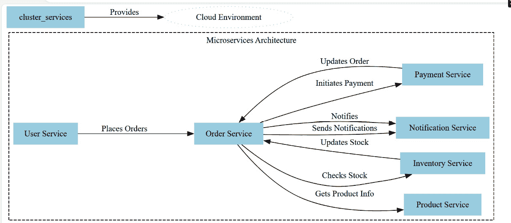
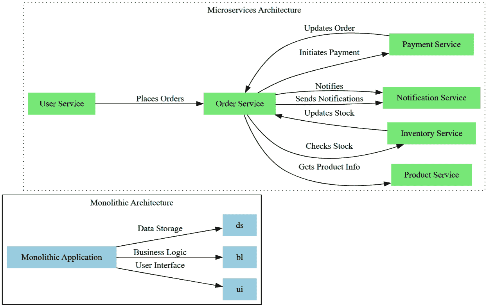
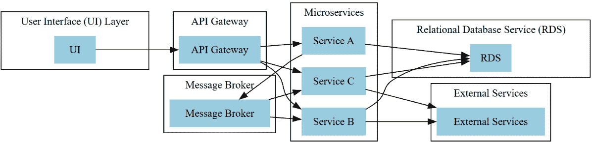
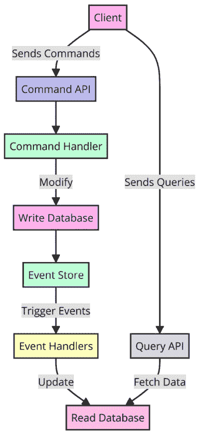
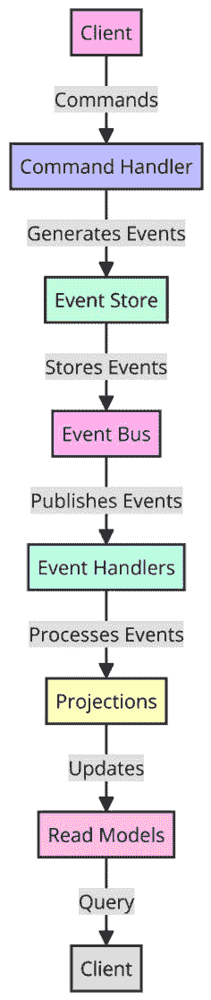
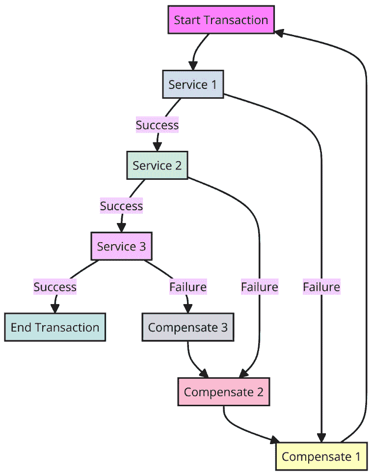
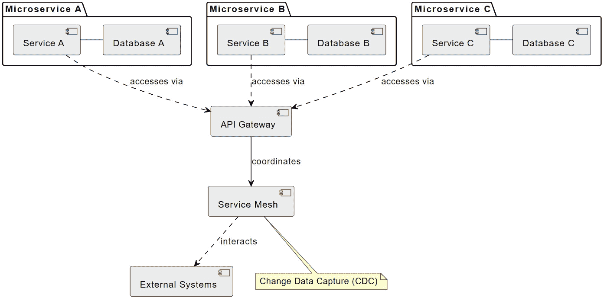
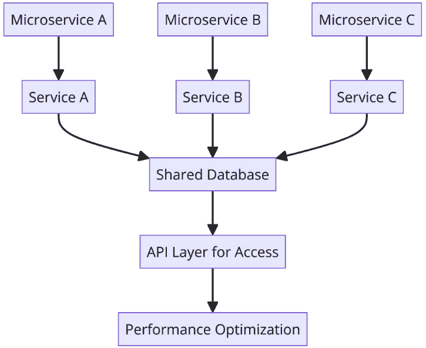

# 8

# 云中的微服务和 Java 的并发

在今天快速发展的数字景观中，微服务已成为一种颠覆性的架构风格，使组织能够提高可伸缩性、灵活性和部署速度。Java 凭借其强大的生态系统和强大的并发工具，站在这一变革的前沿，促进微服务与云环境的无缝集成。本章深入探讨了 Java 的先进功能如何使开发者能够更高效地构建、部署和扩展微服务，使其成为现代云应用的理想选择。

通过采用 Java 驱动的微服务，企业可以将复杂的应用程序分解为可管理的、独立部署的组件，这些组件针对特定的业务功能进行了定制。这种模块化不仅加速了开发周期，还提高了系统的弹性和维护性。此外，Java 的并发实用工具在优化这些服务以轻松处理大量操作方面发挥着关键作用，确保分布式系统的高可用性和响应性。

在本章中，我们将涵盖以下关键主题：

+   **云中微服务的原则**：了解使微服务成为现代软件开发首选模式的架构转变，重点关注它们与云平台的动态集成

+   **Java 的并发基础**：深入了解 Java 的并发**应用程序编程接口**（API），以发现这些工具如何显著提高微服务的性能和可伸缩性

+   **并发模式和技巧**：了解如断路器和事件驱动通信等高级模式，这些模式对于保持高服务可用性和健壮的错误处理至关重要

+   **微服务的最佳实践**：探索部署和扩展微服务的战略指南，确保它们在云环境中得到优化

+   **动手设计和实现**：通过实际案例研究和现实世界的应用来应用你所学到的知识，这些案例研究展示了使用 Java 进行有效微服务设计的实例

到本章结束时，你将准备好利用 Java 的先进功能来设计、部署和管理既可伸缩又高效、弹性好且易于维护的微服务。准备将理论知识转化为实际技能，这将提高你在开发云原生应用方面的能力。

# 技术要求

**框架框架**：有关微服务框架的详细设置说明，请参阅它们的官方文档。本章将专注于使用 Spring Boot 作为微服务示例。

这里是官方文档网站：

+   **Spring Boot**：[`spring.io/guides/gs/spring-boot`](https://spring.io/guides/gs/spring-boot)

+   **Micronaut**：[`guides.micronaut.io/latest/creating-your-first-micronaut-app-maven-java.html`](https://guides.micronaut.io/latest/creating-your-first-micronaut-app-maven-java.html)

+   **Quarkus**：[`quarkus.io/get-started/`](https://quarkus.io/get-started/)

本章的代码可以在 GitHub 上找到：

[`github.com/PacktPublishing/Java-Concurrency-and-Parallelism`](https://github.com/PacktPublishing/Java-Concurrency-and-Parallelism)

# 微服务核心原则——在云平台上的架构优势

**微服务架构**为软件开发提供了一种现代方法，尤其是在云环境中。这种架构将复杂系统划分为更小、独立的子服务，提供了灵活性和可扩展性。在本节中，我们将探讨微服务架构的基础概念、其相对于传统设计的优势，以及它如何无缝集成到云生态系统中。

## 基础概念——微服务架构及其在云中的优势

微服务架构是软件开发的现代方法，它侧重于将复杂系统划分为小型、松耦合的服务。这种架构在云环境中特别有益，其模块化和灵活性提供了许多优势：

+   **模块化**：微服务架构将系统划分为独立的、松耦合的服务，每个服务都有自己的功能。这种模块化允许对每个组件进行细粒度控制，使得开发、测试、部署和维护单个服务变得更加容易。它还允许团队同时处理不同的服务，促进并行开发。

+   **通信**：微服务通过轻量级、标准化的协议如 HTTP/REST 或 gRPC 进行通信，允许服务之间高效交互。这些同步和异步的通信模式，使得可以开发出能够处理不断增长工作负载的可扩展系统。服务暴露了定义良好的 API，这些 API 作为通信的契约，并促进了松耦合。

+   **独立部署**：微服务可以独立部署、扩展和更新，而不会影响其他服务的功能。这种灵活性减少了停机时间，增强了可扩展性，并简化了新特性的集成。它还允许在每个微服务中使用不同的技术。

+   **弹性和故障隔离**：微服务架构通过隔离单个服务内的故障来提高弹性。如果一个服务失败，并不一定会导致整个系统崩溃。这种故障隔离是通过设计模式如断路器和防波堤来实现的。

+   **可扩展性**：微服务可以根据其特定的资源需求和需求模式进行单独扩展。这种细粒度的可扩展性允许优化资源分配和成本效益。

通过利用模块化、通信、独立部署、弹性和可扩展性的优势，微服务架构使得在云环境中开发灵活、可维护和可扩展的系统成为可能。

让我们看看以下图像：



图 8.1：微服务架构

*图 8.1*展示了在云环境中部署的微服务架构，突出了各种服务之间的相互作用，这些服务为最终用户提供功能。它包括以下关键组件：

+   **用户服务**：使用户能够下订单

+   **订单服务**：通过与产品服务交互获取产品详情，并与库存服务交互进行库存检查来处理订单；如果项目可用，它将启动通过支付服务进行支付的流程

+   **支付服务**：处理支付流程

+   **通知服务**：一旦支付确认，通过订单服务发送的通知来提醒用户订单状态

+   **库存服务**：在订单后更新库存水平，以确保准确的库存管理

架构设计为模块化和可扩展，每个服务都专注于特定的任务，并通过定义的接口进行通信。这种设置允许在开发和部署方面具有灵活性，同时云环境支持可扩展性和鲁棒性，能够适应工作负载的变化并确保系统弹性。

### 架构比较——单体和微服务设计之间的差异

微服务架构是传统单体设计的现代替代方案。然而，每种架构都有自己的优点和缺点。在这里，我们专注于对比这两种架构风格。

单体架构的细节如下：

+   **结构**：单体设计的特点是有一个单一的、统一的代码库，其中包含所有功能，包括**用户界面**（**UI**）、业务逻辑、数据存储和处理。

+   **部署**：在单体架构中，整个应用程序作为一个单一实体进行部署。任何更改或更新都需要重新部署整个应用程序，这可能会导致停机并限制灵活性。

+   **可扩展性**：单体应用程序的可扩展性可能很繁琐，因为它通常涉及扩展整个系统，即使只有特定的功能需要扩展。这可能导致效率低下和资源的不必要使用。

+   **优点**：单体架构在开发和部署方面更为简单，这使得它们非常适合小型项目或资源不足的组织。

让我们看看*图 8.2*：



图 8.2：单体和微服务架构的比较概述

在单体架构中，应用程序作为一个单一单元构建，将 UI、业务逻辑和数据存储集成在一个代码库中。这种方法在开发和部署初期较为简单，但随着应用程序的扩展可能会变得繁琐。一个区域的变更可能会影响整个系统，而扩展则需要部署整个应用程序。

相反，微服务架构将应用程序分解为小型、自主的服务，每个服务处理一个特定的功能。这些服务通过定义的接口进行交互，支持松散耦合和独立开发、部署和扩展。虽然这种结构增强了灵活性和可扩展性，但也带来了协调服务的复杂性，并增加了运营需求。

让我们来看看一些比较和过渡的考虑因素：

+   **复杂性**：单体架构较为简单，但微服务架构随着详细的服务编排需求而增加复杂性。这可以通过特定的工具和框架来缓解。

+   **采用**：从单体架构过渡到微服务架构涉及将现有代码库分割成独立的服务，并建立新的服务间通信模式。

在这些架构之间的选择应基于应用程序对扩展和复杂性的需求，以及组织的战略目标。通常，企业从单体设计开始，随着运营需求的增长逐渐转向微服务。

## 真实世界的例子——Netflix 的演变和亚马逊的灵活性

Netflix 转向微服务架构的旅程始于 2009 年，当时它面临着快速增长和扩展的挑战。这次过渡是由处理大量工作负载和无缝向全球观众提供内容的需求驱动的。

Netflix 引入了自适应流媒体，允许它根据用户的网络速度和设备提供不同分辨率的视频内容。微服务架构使得视频编码、内容交付和用户画像等服务能够独立但协同工作。Netflix 的微服务设计还使得能够集成基于用户观看历史的推荐引擎，从而增强用户参与度。

随着时间的推移，Netflix 的架构允许集成额外的服务，如多语言支持、区域内容库和离线观看，展示了微服务架构如何适应不断发展的功能。

亚马逊转向微服务架构使其能够高效地扩展其电子商务平台，适应多样化的功能和第三方服务。亚马逊的微服务架构允许与各种第三方服务集成，包括支付网关、分析平台和客户评论系统，使其能够满足多样化的用户需求并集成新功能。

亚马逊的微服务设计允许集成不同的技术和工具，使其能够平滑地演进其技术堆栈。亚马逊微服务架构的独立部署能力允许其快速迭代，确保其电子商务平台保持竞争力并适应不断变化的市场需求。

Netflix 和 Amazon 是微服务架构如何被用来应对现实世界挑战并推动商业成功的强大例证。然而，重要的是要注意，这些好处并不仅限于这些科技巨头，而且各个行业的公司都在接受微服务来构建可扩展、灵活和健壮的应用程序。

在本节中，我们深入探讨了云中的微服务架构，讨论了其核心原则，如模块化和可扩展性，并将这些原则与单体设计进行了对比。我们强调了 Netflix 和 Amazon 等公司如何通过实际案例研究利用微服务来提升业务成果。展望未来，我们将考察 Java 的并发工具，这对于开发可扩展和健壮的微服务至关重要，以及它们如何满足基于云的微服务架构的独特需求。

# 微服务管理的必备 Java 并发工具

Java 的并发工具对于在云环境中管理微服务至关重要，它能够实现高效的任务管理和**并行处理**。在本节中，我们将探讨这些工具如何促进响应性和可扩展的微服务架构的开发，并无缝集成到现代云生态系统中。

## 并发工具 – 探索为微服务量身定制的 Java 并发工具

在 Java 中，**ExecutorService**、**并行流**、**CompletableFuture**和**Fork/Join 框架**等并发工具在微服务架构中扮演着至关重要的角色。ExecutorService 管理工作线程池以实现高效的任务执行，而并行流通过并发操作加速数据处理任务，从而提高性能。CompletableFuture 支持异步编程，促进非阻塞任务和服务间通信。Fork/Join 框架通过将大任务分解为更小的、可并行化的单元来帮助分而治之，从而优化执行时间。这些工具是开发可扩展和高效微服务的基础，我们将在后续章节中进一步探讨它们在增强基于云的微服务管理中的实际应用。

### 任务并行 – 使用 Java 的并发机制来高效管理微服务

**任务并行**是高效管理微服务的必要方面。Java 的并发机制提供了实际解决方案来分配工作负载，同时处理多个任务，并确保微服务的响应性。

让我们看看一个代码片段：

```java
    // Concurrent processing tasks
    List<Future<?>> tasks = new ArrayList<>();
    tasks.add(executorService.submit(() ->
        inventoryService.deductProductQuantity(order)));
    tasks.add(executorService.submit(() ->
        invoiceService.generateInvoice(order)));
    tasks.add(executorService.submit(() ->
        emailService.sendOrderConfirmation(order)));
    // Wait for all tasks to complete
    for (Future<?> task : tasks) {
        try {
            task.get(); // Wait for each task to finish
            } catch (Exception e) {
            System.err.println("Error processing order: " + order.            getId());
            throw e; // Rethrow exception after logging
        }
    }
```

提供的代码片段展示了在微服务架构中使用 Java 的并发机制实现任务并行化。以下是一个简要的分析：

+   `List<Future<?>>`收集提交给`executorService`进行异步执行的任务。任务包括与订单相关的库存调整、发票处理和电子邮件确认。

+   使用`Future<?>`可以跟踪任务结果并在完成后同步它们。

+   `get()`，确保所有操作完成后再进行。这种同步对于保持服务响应的一致性和可靠性至关重要。*   **处理故障**：任务中的异常被捕获、记录并重新抛出，展示了强大的错误处理能力，使系统能够保持高容错性。

在微服务架构中，任务并行化使不同的微服务能够并发工作，每个微服务专注于其特定的职责。这种方法允许高效地处理请求并优化系统的整体性能。通过利用任务并行化，微服务可以同时处理多个任务，从而实现更快的响应时间和提高吞吐量。

然而，任务并行化只是实现微服务高性能的一个方面。另一个重要的概念是并行处理，它涉及将大任务分解成更小、独立的子任务，这些子任务可以并行处理。在下一节中，我们将探讨如何使用 Java 的并行流和 Fork/Join 框架在微服务中应用并行处理。

### 并行处理响应式微服务

并行处理是提高微服务性能和响应性的强大技术。通过将大任务分解成更小、独立的子任务并并行处理它们，微服务可以更有效地处理数据密集型操作和计算密集型任务。

Java 提供了几个并行处理工具，包括并行流和 Fork/Join 框架。让我们探讨这些工具如何在微服务环境中使用。

让我们看看一个并行流的示例：

```java
@Service
public class DataProcessingService {
    public List<Result> processData(List<Data> dataList) {
        return dataList.parallelStream()
            .map(this::processDataItem)
            .collect(Collectors.toList());
    }
    private Result processDataItem(Data dat{
        // Perform complex data processing logic
        // ...
    }
}
```

在这个例子中，`processData()`方法接收一个数据对象列表。它不是按顺序处理数据，而是使用`parallelStream()`方法创建一个并行流。`map()`操作应用于每个数据项，并发调用`processDataItem()`方法。最后，处理后的结果被收集到一个列表中。

通过使用并行流，数据处理可以分布在多个线程上，从而实现更快的执行和改进的微服务响应性。

Fork/Join 框架是 Java 中用于并行处理的另一个强大工具。它旨在高效地处理递归算法和分而治之的场景。

下面是一个在微服务中使用 Fork/Join 框架进行复杂计算的示例：

```java
@Service
public class ComplexComputationService {
    @Autowired
    private ForkJoinPool forkJoinPool;
// Dependency injection of ForkJoinPool
    public Result computeResult(Problem problem) {
        return forkJoinPool.invoke(
            new ComplexComputationTask(problem));
    }
    private static class ComplexComputationTask extends         RecursiveTask<Result> {
        private final Problem problem;
        public ComplexComputationTask(
        Problem problem) { 
            this.problem = problem;
       }
        @Override
        protected Result compute() {
            if (problem.isSimple()) {
                return solveSimpleProblem(problem);
            } else {
            List<ComplexComputationTask> subtasks = problem.            decompose()
                .map(ComplexComputationTask::new)
                .collect(Collectors.toList());
                subtasks.forEach(ForkJoinTask::fork);
                return subtasks.stream()
                    .map(ForkJoinTask::join)
                    .reduce(Result::combine)
                    .orElse(Result.EMPTY);
            }
        }
        private Result solveSimpleProblem(Problem problem){
            // Logic to solve a simple problem directly
            // Placeholder implementation:
            return new Result();
            // Replace with actual logic
        }
    }
}
```

在这个例子中，`ComplexComputationService` 使用 Fork/Join 框架来执行复杂计算。`computeResult()` 方法接收一个 `Problem` 对象，并将一个 `ComplexComputationTask` 提交到 `ForkJoinPool`。

`ComplexComputationTask` 扩展了 `RecursiveTask` 并实现了 `compute()` 方法。如果问题简单，它将直接解决它。否则，它将问题分解成更小的子任务，并行执行它们，然后使用 `join()` 方法合并结果。结果通过 `reduce()` 操作合并。

通过利用 Fork/Join 框架，微服务可以有效地通过递归地将问题分解成更小的子问题并并行处理它们来解决复杂问题。

这些示例演示了如何将并行处理技术，如并行流和 Fork/Join 框架，应用于微服务以实现更好的性能和响应性。通过利用并行处理的力量，微服务可以更有效地处理大规模数据处理和复杂计算，从而改善用户体验并加快响应时间。

在本节中，我们探讨了 Java 的并发工具及其在微服务中的作用。我们讨论了线程池、并行流和 Fork/Join 框架如何通过任务并行性增强微服务性能，提高吞吐量和响应性。虽然有益，但 Java 的并发机制也带来了挑战。接下来，在 *微服务并发中的挑战与解决方案* 部分，我们将解决微服务并发中的常见问题，并概述有效的策略和实践。

# 微服务并发中的挑战与解决方案

微服务架构为现代应用提供了无与伦比的灵活性和可扩展性，然而它们的并发特性也带来了独特的挑战。本节深入探讨了微服务并发的关键方面，包括潜在瓶颈、确保数据一致性的策略、实现弹性的方法，以及通过 Java 的并发机制解决这些挑战的实际解决方案。

## 瓶颈 - 诊断并发微服务架构中的潜在挑战

微服务架构中并发引入通常会导致挑战和潜在瓶颈。有效地识别和解决这些瓶颈对于保持并发微服务的性能和顺畅运行至关重要。本节概述了用于有效诊断和缓解这些问题的工具和策略，重点关注基于云的实用工具。

首先，让我们看看 **API 网关**。

API 网关作为入站请求的中心枢纽。它有效地管理流量，确保平稳运行并防止瓶颈：

+   **请求节流**：对请求施加速率限制，以防止服务过载并确保一致的性能

+   **流量路由**：将流量有效地引导到适当的服务，均匀分配负载，并减少协调和通信瓶颈。

+   **缓存**：通过缓存频繁访问端点的响应，网关减轻了后端服务的负载，并提高了响应时间。

+   **指标收集**：收集关键指标，如响应时间、错误率和请求数量，这些对于识别和解决瓶颈至关重要。

接下来，我们将探讨监控和日志记录工具。

这些工具对于诊断和解决微服务架构中的瓶颈至关重要：

+   **AWS CloudWatch**：这提供实时监控和日志记录，能够跟踪资源利用率和响应时间等指标。可以配置警报以在阈值被突破时发出警报，帮助及时识别和解决新兴瓶颈。

+   **Azure Monitor**：这提供了全面的监控、警报和日志分析功能，提供了对潜在争用点和通信延迟的洞察。

+   **Google Cloud Logging**：这捕获了来自各种微服务的日志，提供了对服务交互的洞察，并识别了延迟或开销区域。基于日志的指标有助于跟踪特定瓶颈诱导事件。

这些解决方案使持续跟踪和分析性能指标成为可能，揭示了可以定位瓶颈的趋势。它们还指导必要的架构调整，例如实施缓存策略、分片数据库或修改通信模式以提高效率。

通过将 API 网关与强大的监控工具集成，微服务架构可以主动诊断和解决瓶颈，从而确保性能、可扩展性和弹性的提升。这种集成方法确保了并发挑战得到有效管理，为微服务操作营造了一个稳健的环境。

## 一致性——确保数据一致性和服务间通信的顺畅。

在微服务架构中确保一致性，尤其是考虑到其分布式特性，至关重要。本节深入探讨了分布式数据库和消息代理如何对于在服务间实现一致性至关重要。

我们将从分布式数据库开始。选择正确的分布式数据库，如 Amazon RDS、Google Cloud SQL 和 Azure Database for PostgreSQL 至关重要。这些服务确保了事务一致性和**原子性、一致性、隔离性、持久性**（**ACID**）的合规性，这对于需要可靠数据处理的操作至关重要。它们通过确保在提交前完成完整事务来管理微服务之间的数据完整性，如果事务失败，则完全回滚以保持一致性。

这些数据库通过读取副本和分片等功能增强可扩展性。它们支持跨区域或地区的稳健数据复制，以改善可用性和灾难恢复。完全管理的解决方案减少了运营开销，使团队能够专注于核心功能。Apache Cassandra 和 Google Cloud Spanner 等替代方案，虽然一致性要求不那么严格，但在需要高可扩展性和跨地理区域低延迟访问的场景中表现出色。

接下来，让我们考虑消息代理。AWS SQS、Google Pub/Sub、Apache Kafka 和 Azure Service Bus 等工具通过管理异步消息队列来简化服务间通信。它们通过以下方式提高一致性：

+   **解耦服务**：这些代理允许服务独立运行，通过在部分失败时保持功能来提高系统正常运行时间。

+   **可靠投递**：它们确保消息准确到达目标服务，支持高容量条件。例如，Kafka 以其耐用性而闻名，而 Azure Service Bus 在其生态系统中提供可靠性。

+   **事件驱动架构支持**：它们帮助服务动态响应变化，这对于维护对同一事件做出反应的服务之间的一致性至关重要。

从设计角度来看，选择使用**关系数据库服务**（**RDS**）或消息代理取决于您应用程序的具体要求：

+   **使用 RDS**来满足需要 ACID 属性的事务数据需求、需要强完整性的复杂数据关系或集中式数据管理，以及当需要复杂的查询进行分析时

+   **使用消息代理**来满足异步通信需求、事件驱动架构、不同负载下的可扩展性、高效处理高流量或跨多个微服务的复杂工作流编排

通常，RDS 和消息代理在微服务架构中的优势相互补充，它们不是相互排斥的。例如，您可能使用 RDS 来管理事务数据完整性，同时使用消息代理来处理数据变化引起的事件，从而将可靠的数据管理与反应式服务编排相结合。这种方法利用了两种技术的优势，以创建一个强大、可扩展和有弹性的架构。

让我们看看*图 8.3*：



图 8.3：具有 API 网关、消息代理和 RDS 的微服务架构

此图展示了利用 RDS 和消息代理来促进通信和数据持久性的微服务架构设计。

此设计的核心组件包括以下内容：

1.  **用户界面层**：用户在此交互

1.  **API 网关**：将请求路由到微服务

1.  **微服务**：处理特定功能

1.  **RDS**：存储持久数据（关系表）

1.  **消息代理**：使微服务之间实现异步通信

它的工作原理如下：

+   用户通过 UI 发起请求。

+   API 网关将请求路由到相关的微服务（们）。

+   微服务与 RDS 交互或向消息代理发布消息。

+   订阅消息代理的其他微服务接收并处理消息。

+   数据持久性可能发生在 RDS 中。

+   微服务生成响应并通过 API 网关将其发送回用户。

它的好处如下：

+   **解耦**：微服务松散耦合且可独立扩展

+   **数据一致性**：使用 RDS 维护服务间数据完整性

从本质上讲，消息代理促进异步通信，而 RDS 提供持久存储。

## 弹性 - 实现系统弹性和容错性

在微服务中实现健壮性涉及实施以下策略，这些策略增强了系统弹性和容错性：

+   **电路断路器**：利用 Netflix Hystrix 或 Resilience4j 等工具，电路断路器帮助优雅地管理服务故障。它们通过停止故障在服务间传播来防止级联故障，从而在部分中断期间保持系统功能。

+   **负载均衡器**：使用云原生负载均衡器有助于在可用服务之间均匀分配传入流量。这不仅通过避免任何单个服务的过载来提高容错性，还有助于防止瓶颈，从而确保系统运行更顺畅，响应时间更好。

电路断路器和负载均衡器可以协同工作，构建健壮的微服务。负载均衡器分配流量，防止瓶颈和单点故障。电路断路器通过隔离失败的服务并防止级联故障，提供额外的保护。

本节概述了并发管理在微服务中的关键作用，深入探讨了与潜在瓶颈相关的挑战和解决方案，确保数据一致性。我们研究了缓解如流量拥堵和确保分布式服务间数据完整性的工具和策略，利用 API 网关进行流量管理，以及利用消息代理实现服务间通信的无缝性。通过集成分布式数据库和强大的消息系统，微服务可以实现更高的性能、可扩展性和弹性。

未来，我们将从理论概念过渡到实际应用。接下来的章节，*动手实践 - 在 Java 中设计并发微服务*，将提供关于在 Java 中实现这些并发原则的详细指南。

## 实际设计和实现 - 构建有效的 Java 微服务

本节深入探讨实际的 Java 代码示例，展示如何使用云工具和机制（如消息代理、分布式数据库和断路器）解决微服务架构中的并发挑战。

### 用例 1 - 电子商务应用 - 处理订单

在一个具有处理订单微服务的电子商务应用中，由于多个订单请求同时尝试从同一余额中扣除，可能会出现并发挑战，导致不一致性和数据完整性问题。为了解决这些挑战，我们可以利用大多数分布式数据库提供的乐观锁。

乐观锁使用与用户账户余额关联的版本号。当执行更新查询时，它包括预期的版本号。如果数据库中的版本号与预期版本号不匹配，则表示另一个事务可能首先修改了余额，导致更新失败。这防止了竞态条件并确保了数据一致性。以下是代码片段中涉及到的步骤：

1.  打开项目根目录下的`pom.xml`文件并添加以下依赖项：

    ```java
    <dependency>
        <groupId>org.springframework.boot</groupId>
        <artifactId>spring-boot-starter-data-jpa</artifactId>
        <version>2.5.0</version>
    </dependency>
    <dependency>
        <groupId>org.springframework.boot</groupId>
        <artifactId>spring-boot-starter-web</artifactId>
        <version>2.5.0</version>
    </dependency>
    <dependency>
        <groupId>mysql</groupId>
        <artifactId>mysql-connector-java</artifactId>
        <version>8.0.23</version>
    </dependency>
    </dependencies>
    ```

1.  创建`UserAccount`类：

    ```java
    Entity
    public class UserAccount {
        @Id
        private Long id;
        private Long balance;
        @Version
        private Long version;
      // Getters and setters omitted for brevity
    }
    ```

    此代码定义了一个`UserAccount` JPA 实体。它有一个`@Version`数字（版本号）用于乐观锁，确保更新期间的数据一致性。

1.  在同一包中创建`AccountRepository`接口。此接口应扩展`JpaRepository`并定义`deductBalance()`方法：

    ```java
    public interface AccountRepository extends JpaRepository<UserAccount, Long> @Modifying
        @Query("UPDATE UserAccount ua
            SET ua.balance = ua.balance - :amount,
                ua.version = ua.version + 1
            WHERE ua.id = :userId AND ua.version =
                :expectedVersion")
        int deductBalance(@Param("userId") Long userId,
        @Param("amount") Long amount,
        @Param("expectedVersion") Long expectedVersion);
    }
    ```

1.  在同一包中创建`AccountService`类并将`AccountRepository`实例注入其中：

    ```java
    @Repository
    interface AccountRepository {
        UserAccount findById(
            Long userId) throws IllegalArgumentException;
            int deductBalance(Long userId, Long amount,
                Long version);
    }
    public class AccountService {
        private AccountRepository accountRepository;
        public AccountService(AccountRepository accountRepository) {
            this.accountRepository = accountRepository;
        }
        public void deductBalance(Long userId,
        Long amount) throws InsufficientBalanceException {
            UserAccount account = accountRepository. findById(
                userId);
            if (account == null) {
                throw new IllegalArgumentException(
                    "User not found");
            }
            if (account.getBalance() < amount) {
                throw new InsufficientBalanceException(
                    "Insufficient balance");
            }
            Long expectedVersion = account.getVersion();
            int rowsUpdated = accountRepository.         deductBalance(userId, amount,
                expectedVersion);
            if (rowsUpdated != 1) {
                throw new OptimisticLockingException(
                    "Balance update failed, retry");
            }
        }
    }
    deductBalance() method within the AccountService class. The method first attempts to retrieve a user account by ID through the accountRepository. If the user account is not found, or if the account’s balance is insufficient for the deduction, relevant exceptions are thrown to indicate these errors.
    ```

    对于乐观锁，该方法检索正在更新的账户的当前版本号。然后使用用户 ID、要扣除的金额和预期的版本号调用`accountRepository.deductBalance()`。在此操作之后，该方法检查更新的行数（`rowsUpdated`）。成功的更新（表示恰好更新了一行）允许进程继续进行。如果更新影响零行或多于一行，则表明账户可能已被另一个进程并发修改。在这种情况下，抛出`OptimisticLockingException`，表示由于数据过时导致更新失败，提示重试以保持数据一致性。

1.  接下来，我们可以使用消息代理进行异步通信：

    ```java
    @Component
    public class MessageProducer {
        private final AmazonSQS sqsClient;
        private final String queueUrl;
        private final ObjectMapper objectMapper;
    // ObjectMapper to serialize messages
        public MessageProducer(@Value("${
            aws.sqs.queueUrl}") String queueUrl) {
                this.sqsClient = AmazonSQSClientBuilder.standard().            build();
                this.queueUrl = queueUrl;
                this.objectMapper = new ObjectMapper(); // Initialize ObjectMapper
        }
         //Sends a serialized message to the SQS queue.
        public String sendMessage(String string) {
            try {
                String messageBody = objectMapper.            writeValueAsString(string);
    // Serialize message to JSON
                SendMessageRequest sendMsgRequest = new             SendMessageRequest()
                        .withQueueUrl(queueUrl)
                        .withMessageBody(messageBody);
                SendMessageResult result = sqsClient.            sendMessage(sendMsgRequest);
                return result.getMessageId();
    // Return the message ID on successful send
            } catch (Exception e) {
                System.err.println("Error sending message to SQS: "             + e.getMessage());
                throw new RuntimeException("Failed to send message             to SQS", e);
            }
        }
    }
    ```

1.  最后，我们可以创建`OrderService`类并将`MessageProducer`实例注入其中：

    ```java
    @Service
    public class OrderService {
        @Autowired
        private MessageProducer messageProducer;
        public void processOrder(Order order) throws     InsufficientBalanceException {
            // Validate order and deduct balance
            deductBalance(order.getId(),
                order.getAmount());
            // Publish order confirmation message
            OrderConfirmationMessage confirmation = new         OrderConfirmationMessage(order.getId());
            messageProducer.sendMessage(
                confirmation.getMessage());
            // Publish order fulfillment message
            publishFulfillmentMessage(order);
        }
    ```

    订单处理微服务在验证成功并扣除余额后向消息代理发布消息。订阅了代理的独立服务可以随后异步处理订单确认和履行。这确保了订单处理微服务不会被这些下游任务阻塞。

这些示例展示了 Java 代码如何利用云功能来解决微服务中的并发挑战。通过结合乐观锁和信息代理，您可以构建一个更健壮和可扩展的电子商务应用程序。这些是简化示例。现实世界的实现可能涉及额外的错误处理、日志记录和配置。

### 用例 2 - 使用微服务构建数据处理管道

本案例研究深入探讨了使用微服务架构设计和实现数据处理管道：

1.  第一步是设计微服务。我们将使用三个不同的微服务构建管道：

    +   **数据摄取服务**：此服务作为入口点，负责接收和验证来自外部源的数据。一旦验证通过，它将数据发布到 Amazon SQS 队列以进行进一步处理。该服务依赖于 Amazon SQS 客户端库。

    +   **数据处理服务**：此服务订阅数据摄取服务使用的 Amazon SQS 队列。它消费数据，应用业务逻辑进行转换，并将处理后的数据发布到另一个 SQS 队列以进行持久化。此服务依赖于 Amazon SQS 客户端库和 AWS Glue SDK。

    +   **数据持久化服务**：该服务最终消费来自第二个 SQS 队列的处理后数据。其主要功能是将数据持久化存储在 Amazon RDS 中，以便长期访问。此服务利用了 Amazon SQS 客户端库和 Amazon RDS 客户端库。

    通过利用 AWS 服务，我们可以构建一个可扩展且高效的数据处理解决方案，该方案得益于微服务架构固有的模块化和灵活性。

1.  下一步是设置 AWS：

    +   **两个 AWS 简单队列服务**（**SQS**）**队列**将被设置：

        +   **初始数据队列**：创建一个用于接收初始未处理数据的队列。

        +   **处理数据队列**：为存储准备进一步操作或存储的处理数据设置另一个队列。

    +   **AWS RDS 实例**：设置一个 RDS 实例以提供应用程序的持久存储。您可以根据应用程序需求选择 MySQL、PostgreSQL 或其他可用的 RDS 数据库引擎。此数据库将用于存储和管理应用程序处理的数据。

    +   **AWS 简单通知服务**（**SNS**）：创建一个 SNS 主题以简化通知过程。此主题将用于发布消息，通知订阅者数据处理成功事件和其他重要通知。确定此主题的订阅者，这可能包括电子邮件地址、短信、HTTP 端点，甚至根据您的通知需求，其他 AWS 服务如 Lambda 或 SQS。

1.  第三步是设置 Maven 项目。在每个项目的根目录中，为每个微服务（DataIngestionService、DataProcessingLambda 和 DataPersistenceService）创建一个新的 Maven 项目，并在每个项目的首选 `pom.xml` 文件中添加相关依赖项。

1.  第四步是实现数据摄取服务：

    ```java
    @Service
    public class DataIngestionService {
        private final AmazonSQS sqsClient;
        public DataIngestionService(AmazonSQS sqsClient) {
            this.sqsClient = sqsClient;
        }
        public void ingestData(Data dat{
            // Validate the incoming data
            if (isValid(data)) {
                // Publish the data to Amazon SQS
                SendMessageRequest sendMessageRequest = new             SendMessageRequest()
                        .withQueueUrl("data-ingestion-queue-url")
                        .withMessageBody(data.toString());
                sqsClient.sendMessage(sendMessageRequest);
            }
        }
        private boolean isValid(Data dat{
            boolean isValid = true;
            // Implement data validation logic
            // ...
            return isValid;
        }
    ```

    代码表示数据摄取服务的实现，该服务负责接收传入的数据，验证它，并将其发布到 Amazon SQS 以进行进一步处理。

    `DataIngestionService` 类被注解为 `@Service`，表示它是一个 Spring 服务组件。它依赖于 `AmazonSQS` 客户端，该客户端通过构造函数注入。

    `ingestData()` 方法接收一个 `data object` 作为输入，并通过调用 `isValid()` 方法执行数据验证。如果数据有效，它将创建一个包含指定 SQS 队列 URL 和数据负载作为消息体的 `SendMessageRequest` 对象。然后，使用 `sqsClient.sendMessage()` 方法将消息发送到 SQS 队列。

1.  第五步是使用 AWS Lambda 实现数据处理服务：

    ```java
    public class DataProcessingLambda implements RequestHandler<SQSEvent, Void> {
        private final AmazonSQS sqsClient;
        public DataProcessingLambda() {
            this.sqsClient = AmazonSQSClientBuilder.defaultClient();
        }
        @Override
        public Void handleRequest(SQSEvent event,
            Context context) {
                for (SQSEvent.SQSMessage message :
                    event.getRecords()) {
                        String data = message.getBody();
        // Transform the data within the Lambda function
                    String transformedData= transformData(
                        data);
                // Publish the transformed data to another Amazon SQS for persistence or further
                // processing
                sqsClient.sendMessage(
                    new SendMessageRequest()
                        .withQueueUrl(
                            "processed-data-queue-url")
                        .withMessageBody(transformedData));
            }
            return null;
        }
        /**
         * Simulate data transformation.
         * In a real scenario, this method would contain logic to transform data based
         * on specific rules or operations.
         *
         * @param data the original data from the SQS message
         * @return transformed data as a String
         */
        private String transformData(String dat{
            // Example transformation: append a timestamp or modify the string in some way
            return "Transformed: " + data + " at " + System.        currentTimeMillis();
        }
    }
    ```

    这个 Lambda 函数 `DataProcessingLambda` 通过实现 `RequestHandler` 接口来处理 `SQSEvent` 事件，从而处理来自 Amazon SQS 队列的数据。它在构造函数中初始化一个 Amazon SQS 客户端，并使用它将转换后的数据发送到另一个 SQS 队列，以进行进一步处理或存储。

    `handleRequest()` 方法作为函数的入口点，处理来自 `SQSEvent` 的每个 `SQSMessage`，提取数据并通过 `transformData()` 方法在函数内部直接转换数据。在这里，转换通过添加时间戳到数据作为一个简单的示例，但通常这会涉及针对特定数据处理需求定制的更复杂操作。

    在数据转换之后，该函数通过在 SQS 客户端上调用 `sendMessage()` 方法，将处理后的数据发送到指定的 SQS 队列。

1.  下一步是创建一个 Spring 管理的服务，该服务负责将处理后的数据存储在数据库中，并在成功持久化后通过 AWS SNS 通知订阅者：

    ```java
    @Service
    public class DataPersistenceService {
        private final AmazonSNS snsClient;
        private final DataRepository dataRepository;
        public DataPersistenceService(DataRepository dataRepository)     {
            // Initialize the AmazonSNS client
            this.snsClient = AmazonSNSClientBuilder.standard().        build();
            this.dataRepository = dataRepository;
        }
        public void persistData(String data{
            // Assume 'data' is the processed data received
            // Store the processed data in a database
            Data dataEntity = new Data();
            dataEntity.setProcessedData(data);
            dataRepository.save(dataEntity);
            // Send notification via SNS after successful persistence
            sendNotification("Data has been successfully persisted         with the following content: " + data);
        }
        private void sendNotification(String message) {
            // Define the ARN of the SNS topic to send notification         to
            String topicArn = "arn:aws:sns:region:account-id:your-        topic-name";
            // Create the publish request
            PublishRequest publishRequest = new PublishRequest()
                    .withTopicArn(topicArn)
                    .withMessage(message);
            // Publish the message to the SNS topic
            snsClient.publish(publishRequest);
        }
    }
    ```

    `DataPersistenceService` 是一个由 Spring 管理的 Bean，负责处理数据持久化和通过 Amazon SNS 通知其他组件或服务。以下是其功能的逐步描述：

    +   使用 `AmazonSNS` 客户端发送通知。

    +   `persistData()` 方法接收一个 `String data` 参数，即处理后的数据。它创建一个 `Data entity`，设置处理后的数据，并使用 `DataRepository` 将其保存到数据库。

    +   `sendNotification()` 用于通知应用程序的其他部分。它构建一个包含 `topic ARN (Amazon Resource Name)` 和详细成功持久化消息的 `PublishRequest`。然后，将消息发布到指定的 SNS 主题。

此服务特别适用于微服务架构，其中解耦的组件必须通信状态变化或更新。使用 SNS 进行通知通过确保数据持久化，并且通过一个强大、可扩展的消息系统通知相关服务或组件，从而增强了系统的可靠性。

本节详细介绍了 Java 在微服务架构中管理并发性的实际应用，特别是对于处理订单的电子商务应用程序。它解释了如何在分布式数据库中使用带版本号的乐观锁如何防止并发订单处理中的数据不一致。此外，还讨论了使用消息代理作为异步通信的方法，这有助于防止微服务被下游任务阻塞，从而提高效率和可扩展性。

在接下来的章节中，将介绍部署和扩展微服务的战略最佳实践。这包括利用云原生服务和架构来优化性能、可扩展性和可靠性，并为开发人员和架构师提供全面指南，说明如何在云环境中有效地管理微服务。

# 战略最佳实践 - 部署和扩展微服务

在设计、部署和扩展云环境中的微服务时，利用云原生服务和架构以最大化性能、可扩展性和可靠性是至关重要的。

这里提供了一个针对开发人员和架构师的简单指南，关于最佳实践：

+   **负载均衡**：

    +   **目的**：将传入流量均匀分布在多个微服务实例上，以增强可靠性和可用性

    +   **如何实现**：

        +   使用云管理的负载均衡器，例如 AWS **弹性负载均衡器**（**ELB**）、Azure 负载均衡器或 Google Cloud 负载均衡器，它们可以自动调整以适应流量需求

        +   集成服务发现工具（例如，AWS Cloud Map、Azure 服务发现或 Google Cloud 服务目录）以动态管理服务实例

+   **缓存解决方案**

    +   **目的**：通过缓存频繁访问的数据来减少数据库负载并加快响应时间

    +   **如何实现**：

        +   选择托管缓存服务，如 Amazon ElastiCache、Azure Redis Cache 或 Google Cloud Memorystore，它们提供分布式缓存功能

        +   选择合适的缓存策略（本地、分布式或混合），并确保正确管理缓存一致性和过期

+   **托管数据库**

    +   **目的**：简化数据库管理任务（扩展、备份、修补），使开发者能够专注于构建功能

    +   **如何实现**：

        +   使用 **数据库即服务**（**DBaaS**）解决方案，如 Amazon RDS、Azure SQL 数据库或 Google Cloud SQL，实现数据库按服务模型，以确保资源隔离和优化性能

        +   利用 DBaaS 中的自动化功能进行扩展、备份和确保高可用性

+   **微服务** **架构考虑事项**

    +   保持服务之间的松散耦合，以实现独立开发、部署和扩展

    +   通过围绕业务能力组织微服务并定义清晰的边界上下文来应用**领域驱动设计**（**DDD**）原则

+   **部署** **和扩展**

    +   **容器和编排**: 使用 Kubernetes 容器化部署微服务，Kubernetes 由 AWS EKS、Azure AKS 和 Google GKE 支持，以管理容器生命周期和自动化扩展

    +   **可伸缩性**: 根据 CPU、内存使用情况或与您的应用程序需求对齐的自定义指标实现自动扩展

+   **监控** **和日志记录**

    +   **可观察性**: 实施全面的监控和日志记录以跟踪微服务性能和运行状况；同时，利用 AWS CloudWatch、Azure Monitor 或 Google 的 Operations Suite 等工具进行实时监控、性能跟踪和警报管理

遵循这些最佳实践利用了云计算的优势，增强了微服务架构的弹性、性能和可伸缩性。这种战略方法不仅确保了稳健的服务交付，还保持了持续创新和增长所需的敏捷性。

# 高级并发模式——增强微服务的弹性和性能

在 Java 中开发微服务时，采用增强应用程序响应性、容错性和可伸缩性的并发模式和技术的至关重要。这些模式有助于管理分布式系统固有的复杂性。

这里讨论了适用于微服务的关键并发和数据管理模式。

## 数据管理模式

理解和实施有效的数据管理模式对于设计健壮的微服务至关重要。让我们逐一探讨。

### 命令查询责任分离

**命令查询责任分离**或**CQRS**将数据存储的读取和写入操作分开，以优化性能、可伸缩性和安全性。此模式允许读取和写入独立扩展。让我们看看细节：

+   **用例**: 在读取操作显著多于写入操作，或者可以明确区分的复杂领域中有用

+   **实现细节**: *图 8*.4 显示了使用 CQRS 的系统，它将数据更新（命令）与数据检索（查询）分开



图 8.4：CQRS 架构流程

+   **命令端**: 使用命令 API、CommandHandler 和写数据库处理更新

+   **查询端**: 使用查询 API 和单独的针对快速读取优化的读数据库处理读取

这种分离提高了性能和可扩展性。每一方都可以针对其任务进行优化并独立扩展。此外，查询端可以在写入端更新期间保持可用。

### 事件溯源

**事件溯源**是一种设计模式，其中应用程序状态的变化以事件序列的形式存储。与仅在域中存储数据的当前状态不同，事件溯源存储了状态变化的事件序列。每当业务实体的状态发生变化时，就会将一个新事件追加到与该实体相关的事件列表中。这个事件序列作为主要真相来源，可以用来重建实体的过去状态。让我们更详细地看看：

+   **用例**: 想象一个需要强大机制来跟踪账户间资金流动、确保符合审计标准，并在争议或调查期间能够回滚或重建账户状态的银行应用程序。

+   **实现细节**: 让我们看看这个图：



图 8.5：事件溯源模式

*图 8.5*使用水平多级布局展示了软件架构中的事件溯源模式。以下是其组件和流程的描述：

+   **客户端**: 通过向系统发送命令来启动流程

+   **命令处理器**: 接收来自客户端的命令并处理它们；根据接收到的命令生成事件

+   **事件存储**: 捕获并存储这些事件；此存储作为系统状态的权威真相来源

+   **事件总线**: 将存储的事件分发到适当的处理器

+   **事件处理器**: 通过处理事件并可能生成新事件或命令来响应事件

+   **投影**: 根据事件处理器处理的事件更新读取模型

+   **读取模型**: 根据投影向客户端提供系统的更新状态

+   **客户端**: 可以查询读取模型以检索当前状态或操作结果

事件溯源模式允许系统维护状态变化的完整历史记录，这对于审计和合规至关重要。它还通过解耦命令处理与状态存储以及启用异步事件处理来支持可扩展性。

### API 版本控制

**API 版本控制**是一种用于管理 API 更改的策略。它允许在不干扰现有用户体验或要求客户端立即升级的情况下添加新功能或进行更改。这种方法在引入会破坏向后兼容性的破坏性更改时尤其重要。以下是更详细的说明：

+   **用例**：想象一个场景，金融服务 API 需要向响应对象添加新字段，这可能会破坏现有的客户端应用程序。通过引入 API 的新版本，服务可以在支持旧版本的同时提供这些增强功能，确保现有应用程序在它们选择升级之前无需修改即可继续运行。

+   第一版使用 `/api/v1/users`，第二版使用 `/api/v2/users`。这种方法透明且易于理解。

+   `GET /api/users?version=1`。这保持了 URI 的简洁性，并提供了更大的灵活性，但可能不太直观。

+   `Accept:application/vnd.myapi.v1+json`。这种方法不太侵入性，并将版本控制与 API 的业务逻辑分离。

下面是一个如何在 Spring Boot 中实现 API 版本化的基本示例：

```java
@RestController
@RequestMapping("/api")
public class UserController {
    // Version 1 of the API
    @GetMapping(value = "/users",
        headers = "X-API-Version=1")
    public List<User> getUsersV1() {
        return userService.findAllUsers();
    }
    // Version 2 of the API
    @GetMapping(value = "/users",
        headers = "X-API-Version=2")
    public List<UserDto> getUsersV2() {
        return userService.findAllUsersV2();
    }
}
```

在此示例中，根据自定义的 `X-API-Version` 请求头触发同一端点的不同版本。这允许客户端指定他们希望交互的 API 版本，在推出新功能的同时实现向后兼容。

### Saga pattern

**Saga 模式**是一种在分布式事务中管理多个微服务数据一致性的宝贵方法。它提供了一种处理跨越多个服务、持续时间长的业务流程的方式，确保每个步骤都能成功执行，或者在发生错误时进行补偿。让我们了解更多：

+   **用例**：Saga 模式在协调需要确认的长期运行的微服务工作流方面表现出色。这适用于订单处理（库存、支付和发货）或酒店预订（预订、支付和确认）等场景。它确保整个过程成功，或者在某个步骤失败时回滚。

+   **实现细节**：让我们看看*图 8**.6*。



图 8.6：Saga 模式

此活动图演示了 Saga 模式，显示了具有潜在补偿操作的交易流程：

+   **开始事务**：过程开始

+   **服务 1**：调用第一个服务：

    +   如果服务 1 成功，则继续到服务 2

    +   如果服务 1 失败，则触发补偿 1 并返回到开始

+   **服务 2**：调用第二个服务：

    +   如果服务 2 成功，则继续到服务 3

    +   如果服务 2 失败，则触发补偿 2 并返回到补偿 1

+   **服务 3**：调用第三个服务：

    +   如果服务 3 成功，则事务结束

    +   如果服务 3 失败，则触发补偿 3 并返回到补偿 2

+   **结束事务**：过程成功完成

    +   当发生故障时，采取补偿步骤以回滚到之前的步骤，确保系统保持一致性

Saga 模式允许在多个微服务之间协调复杂事务，同时保持服务之间的松散耦合和独立性。每个服务执行自己的本地事务并发布事件以触发 Saga 模式中的下一步。如果任何步骤失败，将执行补偿操作以回滚之前的步骤，从而保证最终一致性。

### 按服务数据库

**按服务数据库**模式是一种架构方法，其中每个微服务都有自己的专用数据库。而不是在多个服务之间共享单个数据库，每个服务都拥有并管理自己的数据存储。这种模式促进了微服务架构中的松散耦合、自主性和可伸缩性。让我们更详细地看看：

+   **用例**：当微服务具有不同的数据需求时，数据库按服务模式表现得尤为出色。它赋予每个服务利用最合适的数据库技术、优化数据模型和查询以及根据其特定负载独立扩展的能力。这种方法促进了多语言持久性并确保了严格的数据隔离，使其非常适合多租户架构和受合规性驱动的场景。

+   **实现策略**：让我们看看**图 8.7**：



图 8.7：按服务数据库模式

该组件图展示了**按服务数据库**的架构模式，其中每个微服务都使用自己的专用数据库。这种设计强调在微服务架构中实现松散耦合、自主性和可伸缩性。以下是图中展示的关键组件的分解：

+   **微服务（A、B 和 C）**：每个微服务都与其相应的数据库一起展示。例如，微服务 A 使用数据库 A，微服务 B 使用数据库 B，微服务 C 使用数据库 C。这种设计确保每个微服务可以独立运行，管理自己的数据存储，并使用最适合其需求的数据库技术。

+   **API 网关**：API 网关充当外部客户端与之交互的中介。它抽象了底层的微服务并提供进入系统的单一入口点。每个微服务都通过 API 网关访问，从而简化了客户端交互模型并集中处理一些横切关注点，如身份验证和速率限制。

+   **服务网格**：服务网格表示促进微服务、API 网关和外部系统之间的通信。它帮助管理服务间的通信，确保可靠的数据传输，并实现诸如重试和断路器等弹性模式。

+   **变更数据捕获**（**CDC**）：包含关于 CDC 的说明，以表明其在架构中的作用。可以使用如 Debezium 之类的 CDC 工具来捕获每个微服务数据库中的更改并将这些更改传播到其他服务或外部系统。这种设置支持在分布式数据存储中保持最终一致性。

+   **交互**：该图显示了数据流和交互。每个微服务都与 API 网关交互，而 API 网关随后与服务网格通信。服务网格进一步协调交互，可能涉及外部系统，并促进 CDC 的实施。

此图有效地传达了关注点的分离以及系统内每个微服务的独立性，突出了数据库按服务模式在支持多样化的数据需求和可伸缩性方面的优势。

### 共享数据库模式

**共享数据库模式**是一种架构方法，其中每个微服务都有自己的专用数据库。而不是在多个服务之间共享单个数据库，每个服务都拥有和管理自己的数据存储。这种模式促进了微服务架构中的松散耦合、自主性和可伸缩性：

+   **用例**：共享数据库在企业、实时系统和受合规性驱动的环境中表现卓越。它们为组织提供单一的真实数据源（例如，销售、人力资源和财务中的客户数据）并确保实时应用的数据一致性。在受监管的行业（如金融和医疗保健）中，它们在服务中强制执行合规性标准，简化了审计。这种模式在数据一致性和完整性至关重要的地方蓬勃发展。

+   **实施策略**：让我们看看*图 8.8*：



图 8.8：共享数据库模式

该图表示共享数据库模式，其中多个服务（微服务 A、B 和 C）使用单个中央数据库。这种架构通常被采用以维护组织不同部分之间的统一数据源，促进数据管理的一致性和合规性。其关键组件包括以下内容：

+   **共享数据库**：所有微服务都通过此单一数据库进行读写操作。这种设置确保了数据一致性并简化了服务间的交易管理。

+   **微服务（A、B 和 C）**：这些服务在功能上是独立的，但共享相同的数据库进行数据操作。它们代表了组织内的不同业务能力。

+   **访问 API 层**：API 层抽象了数据库交互从服务中。这一层有助于执行安全、管理访问模式并确保数据库模式的变化不会直接影响到服务操作。

+   **性能优化**：本节建议使用连接池、创建只读副本和缓存等策略来优化数据库性能并高效地处理高负载。

在 Java 中，这些模式的实现可以通过各种框架和库得到支持，这些框架和库促进了异步编程并提供构建健壮微服务的工具。通过为特定挑战选择合适的模式，开发者可以构建强大、可扩展和高效的微服务架构。

# 摘要

在本章中，我们探讨了云中的微服务，以及如何利用 Java 的并发工具有效地构建和管理这些服务。我们讨论了微服务的原则、它们相对于单体架构的优势以及它们在云环境中的集成。还考察了微服务的关键特征，如模块化和松散耦合，突出了它们在构建弹性和可扩展系统方面的贡献。

为了开发高性能的微服务，我们深入探讨了 Java 的并发基础，包括线程池、并行流和 Fork/Join 框架。这些工具使开发者能够融入并行处理和高效的任务管理技术，从而优化微服务的性能。

我们还讨论了微服务架构中可能出现的瓶颈和并发相关的问题，并提供了使用 Java 并发机制的实用解决方案。还讨论了确保服务间通信顺畅、数据一致性和弹性的策略。

涵盖了在云中设计、部署和扩展并发微服务的最佳实践，包括负载均衡、缓存和数据库管理。探讨了构建健壮和容错微服务的基本模式，如断路器、隔离舱和事件驱动通信模式。

通过实践练习和案例研究，展示了如何在现实场景中应用 Java 的并发工具、最佳实践和设计模式，使读者能够在设计、部署和扩展云中的并发微服务方面获得实践经验。

在本章结束时，读者应该对使用 Java 的并发工具和设计模式在云中创建可扩展、健壮的微服务有一个全面的理解。他们应该具备解决构建高性能、容错微服务架构挑战所需的知识和技能。

展望未来，下一章“无服务器计算和 Java 的并发能力”将探讨如何在无服务器环境中利用 Java 的并发特性，提供关于利用 Java 的并发工具构建高性能、事件驱动的无服务器应用的见解和实用指导。

# 问题

1.  与单体架构相比，微服务架构的关键优势是什么？

    1.  增加复杂性和耦合

    1.  降低灵活性和可伸缩性

    1.  独立部署和可伸缩性

    1.  单点故障

1.  哪个 Java 特性对于在微服务中管理异步任务是必不可少的？

    1.  **Java 虚拟** **机** （**JVM**）

    1.  **Java 数据库** **连接** （**JDBC**）

    1.  CompletableFuture

    1.  JavaBeans

1.  在微服务架构中，负载均衡器的主要角色是什么？

    1.  加密数据传输

    1.  在多个实例之间分配传入的网络流量

    1.  数据存储和管理

    1.  错误日志记录和处理

1.  哪个模式有助于防止网络或服务故障在微服务中级联到系统的其他部分？

    1.  单例模式

    1.  工厂模式

    1.  断路器模式

    1.  构造者模式

1.  在云中实现微服务时，处理数据一致性的最佳实践是哪一个？

    1.  使用单个共享数据库为所有服务

    1.  为每个微服务采用不同的缓存策略

    1.  为每个微服务分配一个单独的托管数据库实例

    1.  将所有数据管理集中在一个微服务中
