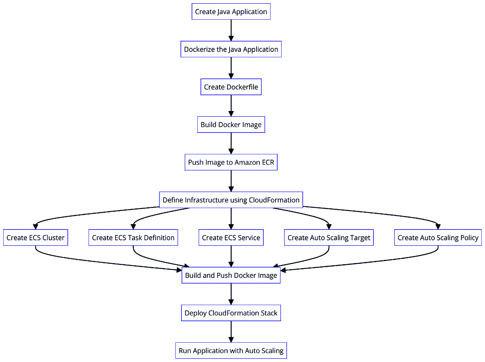
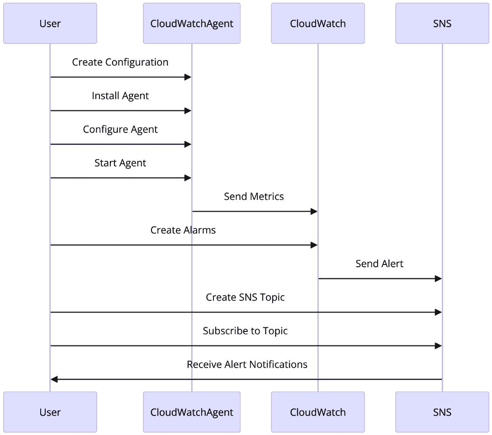

# 10

# 同步 Java 的并发与云自动扩展动态

在云计算时代，**自动扩展**已成为管理资源利用率和确保应用性能最优的关键策略。鉴于 Java 仍然是开发企业应用的主要语言，了解如何有效地同步 Java 的并发模型与云自动扩展动态至关重要。

本章深入探讨了利用 Java 的并发工具和最佳实践在云环境中构建可扩展和高效应用的复杂性。通过实际示例和真实案例研究，您将学习如何设计和优化 Java 应用程序以实现自动扩展，实施监控和警报机制，以及与流行的云原生工具和服务集成。

本章首先探讨的实际应用是开发一个基于 Kubernetes 的自动扩展 Java 应用程序，该应用程序模拟电子商务订单处理服务。在此基础上，本章接着介绍第二个实际示例，专注于使用 Java 和 AWS 服务创建一个无服务器实时分析管道。

到本章结束时，读者将全面了解如何利用 Java 的并发模型构建强大、可扩展且成本效益高的应用，这些应用可以无缝适应云环境的动态特性。他们将具备解决自动扩展挑战的知识和技能，以确保 Java 系统的最佳性能和资源利用率。

在本章中，我们将涵盖以下主要主题：

+   云自动扩展的基本原理 – 机制和动机

+   Java 的并发模型 – 与扩展策略的一致性

+   优化 Java 应用程序以实现云可扩展性

+   在自动扩展事件期间监控和管理 Java 进程

+   真实案例研究

+   在自动扩展环境中基于 Java 的系统实际部署

+   高级主题

# 技术要求

您需要安装以下内容才能跟随本章内容：

+   **Docker**：[`docs.docker.com/get-docker/`](https://docs.docker.com/get-docker/)

+   **AWS 命令行界面 (CLI)**: [`docs.aws.amazon.com/cli/latest/userguide/getting-started-install.html`](https://docs.aws.amazon.com/cli/latest/userguide/getting-started-install.html)

+   **AWS 无服务器应用程序模型 (SAM) CLI**：安装 AWS SAM CLI - AWS 无服务器应用程序模型 ([amazon.com](http://amazon.com))

+   **Kubernetes CLI (kubectl)**: [`kubernetes.io/docs/tasks/tools/install-kubectl/`](https://kubernetes.io/docs/tasks/tools/install-kubectl/)

本章中的代码可以在 GitHub 上找到：

[`github.com/PacktPublishing/Java-Concurrency-and-Parallelism`](https://github.com/PacktPublishing/Java-Concurrency-and-Parallelism)

# 云自动扩展的基本原理 – 机制和动机

在云计算不断演变的领域中，自动扩展已成为一个关键特性，使应用程序能够动态调整其资源以满足不断变化的需求。本节深入探讨了云自动扩展的核心概念和优势，全面了解它是如何增强可扩展性、成本效益和资源利用率的。

## 定义和核心概念

云自动扩展会根据 CPU、内存和网络使用情况自动调整服务器农场中的计算资源量，确保最佳性能和成本效率。**动态资源分配**是一个关键概念，其中资源根据实时需求进行添加或移除。扩展可以通过调整现有实例的容量来实现垂直扩展（向上/向下扩展），或者通过添加或移除实例来处理工作负载的变化，实现水平扩展（向外/向内扩展）。

自动扩展依赖于预定义的指标和基于阈值的触发器来启动扩展操作。负载均衡将流量均匀地分配到实例上，以改善性能和可靠性。自动扩展策略定义了何时以及如何进行扩展操作，可以是反应性的或主动的。使用 AWS CloudWatch、Google Cloud Monitoring 和 Azure Monitor 等工具进行持续监控对于触发扩展操作至关重要。

例如，在假日促销期间，一个电子商务网站可能会经历流量激增，可以利用自动扩展自动启动额外的服务器实例来处理增加的负载，防止减速或崩溃。当促销结束时，流量减少，额外的实例将被终止以节省成本。

## 云自动扩展的优势

云自动扩展提供了几个增强应用程序性能、效率和成本效益的益处。可扩展性是一个关键优势，它通过弹性提供动态调整资源分配的能力，以应对不断变化的需求。弹性使应用程序能够通过自动调整分配的资源（向上/向下扩展）和实例数量（向外/向内扩展）来适应，根据预定义的指标和阈值确保最佳性能、成本效益和资源利用率。

自动扩展通过按需付费的模式促进成本效益，其中资源仅在需要时分配，避免了过度配置相关的成本。自动化减少了手动监控和扩展的需求，降低了运营成本和人力成本。增强的资源利用率确保资源得到有效利用，减少浪费，而集成的负载均衡则将流量均匀地分配到实例上，防止瓶颈。

自动扩展通过确保始终有足够的实例来处理负载，从而提高可靠性和可用性，降低停机风险。它还可以通过在不同地区或可用区自动扩展来提高应用程序对局部故障或中断的弹性。灵活性和敏捷性使应用程序能够快速适应工作负载或用户需求的变化，这对于具有不可预测流量模式的应用程序至关重要，而开发人员和 IT 团队则可以由于自动扩展的自动化特性而专注于核心业务活动。

例如，一家初创公司推出一款突然流行的移动应用时，可以利用云自动扩展来处理用户激增，而不会降低性能，同时只产生与实际资源使用成比例的成本。向上扩展（垂直扩展）和向外扩展（水平扩展）的能力确保了最佳性能和成本效率。通过利用云自动扩展，企业可以确保其应用程序性能最佳、成本效益高，并能快速适应不断变化的需求，这在当今快节奏的数字景观中至关重要。

## 自动扩展的触发器和条件

云环境中的自动扩展是由各种触发器和条件驱动的，确保应用程序保持最佳性能和资源利用率。了解这些触发器有助于设置有效的自动扩展策略，以便适当地响应需求的变化。

自动扩展的常见触发器如下：

+   **CPU 利用率**:

    +   **CPU 使用率高**：当 CPU 使用率在指定时间段内超过一定阈值（例如，70-80%）时，会启动额外的实例来处理增加的负载

    +   **CPU 使用率低**：当 CPU 使用率低于较低阈值（例如，20-30%）时，实例将被终止以节省成本

+   **内存利用率**：

    +   **内存使用率高**：与 CPU 使用率类似，高内存利用率会触发添加更多实例，以确保应用程序保持响应

    +   **内存使用率低**：如果内存使用率持续较低，减少实例数量有助于优化成本

+   **网络流量**：

    +   **入站/出站流量**：高水平的入站或出站网络流量可以触发扩展操作，以确保足够的带宽和处理能力

    +   **延迟**：增加的网络延迟也可以是一个触发器，促使系统扩展以保持低响应时间

+   **磁盘** **输入/输出（I/O）**：

    +   **高磁盘 I/O 操作**：对磁盘的密集读写操作可能需要扩展到更多实例以分散负载

    +   **磁盘空间利用率**：如果可用磁盘空间不足，可能会触发扩展操作，以确保应用程序不会遇到存储问题

+   **自定义指标**：

    +   **特定于应用程序的指标**：如活跃用户数量、每秒请求数或交易率等指标可以用来触发缩放操作。这些指标是根据应用程序的具体需求定制的。

    +   **错误率**：错误率或失败请求的增加可以促使缩放更有效地处理负载或隔离故障实例。

现在让我们看看有效自动缩放的条件：

+   **阈值级别**：

    +   **设置适当的阈值**：为关键指标定义上限和下限，以触发缩放操作。这些阈值应基于历史数据和性能基准。

    +   **滞后性**：通过在缩放操作之间添加缓冲时间，实现滞后性（滞后）有助于防止缩放（抖动）的快速波动。

+   **冷却期**：在执行缩放操作后，冷却期允许系统在触发另一个缩放操作之前稳定下来。这防止了过度缩放并确保指标准确反映系统的需求。

+   **预测性缩放**：

    +   **趋势分析**：使用历史数据和**机器学习**（**ML**）算法，预测性缩放可以预测未来的需求并主动缩放资源，而不是被动反应。

+   **计划缩放**：可以根据已知的模式，如工作时间的流量增加或特定事件，安排缩放操作。

+   **资源限制**：

    +   **最大和最小限制**：定义最大和最小实例数量，以防止过度缩放，这可能导致资源浪费或容量不足。

    +   **资源限制**：考虑预算限制，并确保缩放操作不超过成本限制。

+   **健康检查**：

    +   **实例健康监控**：定期健康检查确保只保留健康的实例在池中。不健康的实例被替换以保持应用程序的可靠性。

    +   **优雅降级**：实现优雅降级机制确保在达到缩放阈值时，应用程序仍然可以运行，尽管性能有所降低。

一个示例场景是一个在线游戏平台在一天中经历不同级别的用户活动。在高峰时段，CPU 和内存利用率显著增加。通过根据这些指标设置自动缩放策略，平台可以自动添加更多实例来处理负载。相反，在非高峰时段，平台会缩小规模以节省成本，确保始终优化资源利用率。

理解自动缩放的触发条件和条件，使企业能够有效地配置其云环境，确保应用程序保持响应、可靠且成本效益。这种主动的资源管理方法对于在动态和不可预测的使用场景中保持高性能至关重要。

## 自动缩放设置内存利用率触发器的指南

自动扩展是维护云环境中最佳应用程序性能和资源利用率的关键组件。本节提供了设置自动扩展内存利用率触发的详细指南，重点关注两种流行的自动扩展解决方案：**AWS 自动扩展**服务和针对 Kubernetes 的**基于事件的自动扩展**（**KEDA**）。第一部分涵盖了使用 AWS 服务实现的实施，第二部分介绍了 KEDA，这是一个由云原生计算基金会支持、基于 Kubernetes 的项目，用于事件驱动的自动扩展。

### AWS 自动扩展服务

在本节中，我们将探讨如何使用 AWS 自动扩展服务设置自动扩展的内存利用率触发器。AWS 提供了强大的工具和服务，可以根据当前需求自动调整运行实例的数量，确保您的应用程序在保持成本效率的同时表现最佳。

#### 高内存使用

让我们深入了解如何设置高内存使用量：

1.  **确定** **阈值**：

    1.  **分析历史数据**：回顾过去的性能指标，以确定典型的内存使用模式。确定平均和峰值内存使用水平。

    1.  **设置阈值**：常见的做法是在 70% 到 85% 之间设置高内存使用阈值。这个范围有助于确保在内存限制影响性能之前有足够的缓冲空间来添加新实例。

1.  **配置** **自动扩展策略**：

    1.  **选择一个指标**：使用云提供商特定的指标，例如 Amazon CloudWatch（AWS）、Azure Monitor 或 Google Cloud Monitoring 来跟踪内存使用。

    1.  **设置警报**：使用 AWS CLI 创建一个当内存使用量超过定义的阈值时触发的警报：

    ```java
    aws cloudwatch put-metric-alarm --alarm-name HighMemoryUsage \
      --metric-name MemoryUtilization --namespace AWS/EC2 --statistic Average \
      --period 300 --evaluation-periods 2 --threshold 75 \
      --comparison-operator GreaterThanThreshold \
      --dimensions Name=AutoScalingGroupName,Value=your-auto-scaling-group-name
    ```

    此命令创建了一个具有指定参数的 CloudWatch 警报，用于监控指定自动扩展组内实例的内存利用率。当连续两个 5 分钟周期（每个 300 秒）的平均内存利用率超过 75% 时，警报被触发。

1.  **定义** **扩展操作**：

    1.  **扩展**：当阈值被突破时，指定要采取的操作，例如添加指定数量的实例。

    1.  **冷却期**：设置一个冷却期（例如，300 秒），以便在评估进一步的扩展操作之前允许系统稳定。

    直接使用 AWS CLI 运行此命令：

    ```java
    aws autoscaling put-scaling-policy --auto-scaling-group-name your-auto-scaling-group-name \
    --policy-name ScaleOutPolicy \
    --scaling-adjustment 2 \
    --adjustment-type ChangeInCapacity \
    --cooldown 300
    ```

    此脚本定义了一个 AWS 自动扩展组的扩展策略，以解决高内存使用问题。当组内实例的平均内存利用率超过预定义的阈值时，策略触发扩展事件，向组中添加两个新实例。为了保持系统稳定性和防止过度激进的扩展，在每个扩展事件之后强制执行 300 秒（5 分钟）的冷却期。

#### 低内存使用

让我们深入了解如何设置低内存使用量：

1.  **确定** **阈值**：

    1.  **分析历史数据**：确定低内存使用量周期和应用程序正确运行所需的最小内存需求。

    1.  **设置阈值**：将低内存使用阈值设置为 20% 到 40% 之间。这有助于确保实例不会被过早终止，从而可能影响性能。

1.  **配置** **自动扩展策略**：

    1.  **选择一个指标**：使用相同的云提供商特定指标来监控低内存使用。

    1.  **设置警报**：使用 AWS CLI 创建一个当内存使用量低于定义的阈值时触发的警报。

    直接使用 AWS CLI 运行此命令：

    ```java
    aws cloudwatch put-metric-alarm --alarm-name LowMemoryUsage \
      --metric-name MemoryUtilization --namespace AWS/EC2 --statistic Average \
      --period 300 --evaluation-periods 2 --threshold 30 \
      --comparison-operator LessThanThreshold \
    LowMemoryUsage that monitors the memory utilization of instances within a specified auto-scaling group. The alarm triggers when the average memory utilization falls below 30% over two consecutive 5-minute periods (300 seconds each).
    ```

1.  **定义** **扩展操作**：

    1.  **缩减规模**：当达到低内存阈值时，指定要采取的操作，例如移除指定数量的实例。

    1.  **冷却期**：设置一个冷却期（例如，300 秒），以便在进一步的扩展操作之前让系统稳定下来。

    直接使用 AWS CLI 运行此命令：

    ```java
    aws autoscaling put-scaling-policy \
      --auto-scaling-group-name your-auto-scaling-group-name \
      --scaling-adjustment -1 \
      --adjustment-type ChangeInCapacity \
      --cooldown 300 \
    ChangeInCapacity adjustment type and has a cooldown period of 300 seconds to prevent rapid scaling actions.
    ```

### KEDA

除了我们刚才讨论的特定于云提供商的自动扩展服务外，开源项目 KEDA 为 Kubernetes 环境提供了一个通用且可扩展的自动扩展解决方案。KEDA 允许开发人员根据各种事件源定义可扩展的目标，包括云服务、消息队列和自定义指标。

KEDA 作为 Kubernetes 操作员运行，在 Kubernetes 集群上作为部署运行。它提供了一个 `ScaledObject`，该对象定义了 Kubernetes 部署或服务的扩展行为。`ScaledObject` 资源指定了事件源、扩展指标和扩展参数，允许 KEDA 根据定义的标准自动扩展目标工作负载。

KEDA 支持广泛的触发器源，包括以下内容：

+   云服务（AWS **简单队列服务** 或 **SQS**，Azure Queue Storage，Google PubSub 等）

+   数据库（PostgreSQL，MongoDB 等）

+   消息系统（RabbitMQ，Apache Kafka 等）

+   自定义指标（Prometheus，Stackdriver 等）

通过将 KEDA 集成到你的基于 Java 的 Kubernetes 应用程序中，你可以从一种通用且可扩展的自动扩展解决方案中受益，该解决方案可以无缝适应你的云原生基础设施的需求。KEDA 的事件驱动方法和对各种数据源的支持使其成为在 Kubernetes 环境中构建可扩展和响应式 Java 应用程序的有力工具。

#### 在 AWS 环境中设置 KEDA 和自动扩展

为了演示 KEDA 如何在 AWS 环境中用于自动扩展，让我们通过一个实际示例来设置它在 Kubernetes 集群中的配置，并将其与 AWS 服务集成：

1.  **使用 Helm **安装 KEDA**：

    ```java
    helm repo add kedacore https://kedacore.github.io/charts
    helm repo update
    AWS SQS Credentials (aws-sqs-credentials.yaml):

    ```

    apiVersion: v1

    kind: Secret

    metadata:

    name: aws-sqs-credentials

    type: 不透明

    stringData:

    AWS_ACCESS_KEY_ID: "<你的访问密钥 ID>"

    应用程序部署（sqs-queue-consumer-deployment.yaml）：

    ```java
    apiVersion: apps/v1
    kind: Deployment
    metadata:
      name: sqs-queue-consumer
    spec:
      replicas: 1
      selector:
        matchLabels:
          app: sqs-queue-consumer
      template:
        metadata:
          labels:
            app: sqs-queue-consumer
        spec:
          containers:
          - name: sqs-queue-consumer
            image: <your-docker-image>
            env:
            - name: AWS_ACCESS_KEY_ID
              valueFrom:
                secretKeyRef:
                  name: aws-sqs-credentials
                  key: AWS_ACCESS_KEY_ID
            - name: AWS_SECRET_ACCESS_KEY
              valueFrom:
                secretKeyRef:
                  name: aws-sqs-credentials
                  key: AWS_SECRET_ACCESS_KEY
            - name: QUEUE_URL
    ScaledObject to link the deployment with the KEDA scaler. Create another YAML file for the ScaledObject configuration.This is the `ScaledObject` YAML file (`sqs-queue-scaledobject.yaml`):

    ```

    apiVersion: keda.sh/v1alpha1

    kind: ScaledObject

    metadata:

    name: sqs-queue-scaledobject

    spec:

    scaleTargetRef:

    name: sqs-queue-consumer

    minReplicaCount: 1

    最大副本数: 10

    触发器：

    - 类型: aws-sqs-queue

    元数据：

    队列 URL: "<your-sqs-queue-url>"

    awsAccessKeyID: "<your-access-key-id>"

    awsSecretAccessKey: "<your-secret-access-key>"

    队列长度: "5"

    ```java

    ```

    ```java

    ```

1.  部署配置文件：

    ```java
    Apply the configurations to the Kubernetes cluster.
    kubectl apply -f aws-sqs-credentials.yaml
    kubectl apply -f sqs-queue-consumer-deployment.yaml
    kubectl apply -f sqs-queue-scaledobject.yaml
    ```

1.  **验证** **设置**：

    +   **检查 KEDA 度量服务器**：确保 KEDA 度量服务器正在运行：

        ```java
        kubectl get deployment keda-operator -n keda
        ```

    +   **监控扩展行为**：观察部署以查看它是如何根据 SQS 队列长度进行扩展的。

        ```java
        kubectl get deployment sqs-queue-consumer -w
        ```

将 KEDA 集成到基于 Kubernetes 的应用程序中提供了一种强大且灵活的方式来根据事件管理自动扩展。这提高了应用程序的效率和响应能力，确保它们能够有效地处理不断变化的工作负载。

我们已经探讨了云自动扩展的核心概念，包括其机制、优势以及驱动扩展决策的触发器和条件。我们还提供了一份关于设置内存利用率触发的指南。这些知识对于创建能够动态适应不断变化的工作负载的云应用程序至关重要，同时确保在有效管理成本的同时实现最佳性能。

理解这些原则在当今的数字景观中至关重要，因为在今天，应用程序必须处理不可预测的交通模式和资源需求。掌握这些概念使你能够设计出具有弹性、高效和成本效益的云应用程序。

接下来，我们将探讨 Java 的并发模型如何与这些扩展策略相一致。我们将检查 Java 丰富的并发工具如何用于创建与云自动扩展无缝集成的应用程序，从而在动态环境中实现高效的资源利用和性能提升。

# Java 的并发模型 – 与扩展策略的一致性

Java 的并发模型提供了与自动扩展策略相一致的有力工具，使应用程序能够根据实时需求动态调整资源分配。让我们探讨 Java 的并发工具如何支持自动扩展。

`ExecutorService`有效地管理线程池，允许动态调整活动线程以匹配工作负载。`CompletableFuture`使异步编程成为可能，促进与需求成比例的非阻塞操作。**并行流**利用多个 CPU 核心的强大功能，并行处理数据流，从而提高性能。

为了展示这些并发工具在自动扩展中的实际应用，让我们通过一个简单的示例进行操作。我们将实现一个动态调整工作线程数量的自动扩展解决方案：

1.  设置`ExecutorService`：

    ```java
    ExecutorService executorService = Executors.newFixedThreadPool(initialPoolSize);
    ```

    它使用`initialPoolSize`指定的固定线程池大小初始化`ExecutorService`。

1.  负载监控：

    ```java
    ScheduledExecutorService scheduler = Executors.newScheduledThreadPool(1);
    scheduler.scheduleAtFixedRate(() -> {
        int currentLoad = getCurrentLoad();
        adjustThreadPoolSize(executorService,
            currentLoad);
    }, 0, monitoringInterval, TimeUnit.SECONDS);
    ```

    此代码创建 `ScheduledExecutorService`，周期性地检查当前负载并根据需要调整线程池大小。任务以由 `monitoringInterval` 定义的固定间隔运行，立即开始。它使用 `getCurrentLoad()` 测量负载，并使用 `adjustThreadPoolSize(executorService, currentLoad)` 调整线程池大小。此机制根据实时工作负载动态扩展资源，确保高效处理不断变化的需求。

1.  调整线程池大小：

    ```java
    public void adjustThreadPoolSize(ExecutorService executorService, int load) {
        // Logic to adjust the number of threads based on load
        int newPoolSize = calculateOptimalPoolSize(load);
        ((ThreadPoolExecutor) executorService).    setCorePoolSize(newPoolSize);
        ((ThreadPoolExecutor) executorService).    setMaximumPoolSize(newPoolSize);
    }
    ```

    `adjustThreadPoolSize()` 方法根据当前负载调整线程池的大小。它接受两个参数：`ExecutorService` 和一个 `integer load`。该方法使用 `calculateOptimalPoolSize(load)` 计算最佳池大小。然后，它将 `ThreadPoolExecutor` 的核心池大小和最大池大小设置为新的池大小。这种调整确保线程池动态匹配当前工作负载，优化资源利用并保持应用程序性能。

1.  使用 `CompletableFuture` 处理任务：

    ```java
    CompletableFuture.runAsync(() -> {
        // Task to be executed
    }, executorService);
    ```

    `CompletableFuture.runAsync()` 方法使用提供的 `ExecutorService` 异步运行一个任务。它接受一个 lambda 表达式，代表要执行的任务，以及 `ExecutorService` 作为参数。这允许任务在由 `ExecutorService` 管理的单独线程中运行，从而实现非阻塞执行。

通过利用这些并发工具，我们可以创建一个响应迅速且高效的自动扩展解决方案，实时适应不断变化的工作负载。这种方法不仅优化了资源利用，还提高了基于云的应用程序的整体性能和可靠性。

在探讨了并发工具如何赋予云应用程序能力之后，现在让我们深入了解优化 Java 应用程序以在动态云环境中茁壮成长的方法。

## 优化 Java 应用程序以适应云可扩展性 – 最佳实践

由于云环境要求高效且可扩展的应用程序，优化 Java 应用程序以适应云可扩展性至关重要。本节重点介绍最佳实践、资源管理技术以及一个实际代码示例，以展示如何优化 Java 应用程序以实现自动扩展。

要在云环境中提高 Java 应用程序的扩展性，必须遵循最佳设计实践，如下所述：

+   **微服务架构**：将应用程序分解成更小、可独立部署的服务。这有助于更好地分配资源并简化扩展。

+   `CompletableFuture` 可以帮助管理任务而不会阻塞主线程。

+   **无状态服务**：尽可能设计无状态服务。无状态服务更容易扩展，因为它们不需要在实例之间共享会话信息。

+   **负载均衡**：实现负载均衡，以均匀地分配到应用程序多个实例的传入请求。这防止任何单个实例成为瓶颈。

+   **缓存**：使用缓存机制来减轻后端服务和数据库的负载。这可以显著提高响应时间并减少延迟。

+   **容器化**：使用容器（例如，Docker）打包应用程序及其依赖项。容器在不同环境中提供一致性，并简化了扩展和部署。

在下一节中，我们将通过一个示例来了解它在实际应用中的工作方式。

## 代码示例 - 使用 AWS 服务和 Docker 优化 Java 应用程序以实现自动扩展的最佳实践

为了展示优化 Java 应用程序以实现自动扩展的最佳实践，我们将创建一个使用 AWS 服务和 Docker 的真实世界示例。此示例将涉及使用 CloudFormation、Docker 容器化和各种 AWS 服务来管理和扩展应用程序。

让我们看看以下图表：



图 10.1：在 AWS 上部署具有自动扩展功能的 Java 应用程序的部署工作流程

图表说明了在 AWS 上使用 Amazon **弹性容器服务**（**ECS**）、Fargate 和 CloudFormation 部署的自动扩展 Java 应用程序的架构。这些步骤和代码块旨在指导开发人员通过容器化 Java 应用程序、在 AWS 上部署它并确保它可以自动扩展以处理不同负载的过程。在深入开发过程之前，了解这些步骤的目的和顺序对于确保平稳和高效的部署至关重要。这种准备涉及创建和配置必要的 AWS 资源、构建和推送 Docker 镜像，并使用 CloudFormation 设置基础设施代码以自动化整个过程。以下是执行这些步骤的方法：

**步骤 1**：**容器化 Java 应用程序**：

创建一个简单的 Java 应用程序并打包：

```java
public class App {
    private static final int initialPoolSize = 10;
    private static final int monitoringInterval = 5;
// in seconds
    public static void main(String[] args) {
        // Initialize ExecutorService with a fixed thread pool
        ExecutorService executorService = Executors.        newFixedThreadPool(initialPoolSize);
        ScheduledExecutorService scheduler = Executors.        newScheduledThreadPool(1);
        // Schedule load monitoring and adjustment task
        scheduler.scheduleAtFixedRate(() -> {
            int currentLoad = getCurrentLoad();
            adjustThreadPoolSize((
                ThreadPoolExecutor) executorService,
                    currentLoad);
        }, 0, monitoringInterval, TimeUnit.SECONDS);
        // Simulating task submission
        for (int i = 0; i < 100; i++) {
            CompletableFuture.runAsync(() -> performTask(),
                executorService);
        }
    }
    // Simulate getting current load
    private static int getCurrentLoad() {
        return (int) (Math.random() * 100);
    }
    // Adjust thread pool size based on load
    private static void adjustThreadPoolSize(
        ThreadPoolExecutor executorService, int load) {
            int newPoolSize = calculateOptimalPoolSize(
                load);
            executorService.setCorePoolSize(newPoolSize);
            executorService.setMaximumPoolSize(newPoolSize);
        }
    // Calculate optimal pool size
    private static int calculateOptimalPoolSize(int load) {
        return Math.max(1, load / 10);
    }
    // Simulate performing a task
    private static void performTask() {
        try {
            Thread.sleep((long) (Math.random() * 1000));
        } catch (InterruptedException e) {
            Thread.currentThread().interrupt();
        }
    }
}
```

创建一个 Dockerfile 来容器化 Java 应用程序：

```java
# Use an official OpenJDK runtime as a parent image
FROM openjdk:11-jre-slim
# Set the working directory
WORKDIR /usr/src/app
# Copy the current directory contents into the container at /usr/src/app
COPY . .
# Compile the application
RUN javac App.java
# Run the application
CMD ["java", "App"]
```

**步骤 2：定义基础设施** **使用 CloudFormation**：

创建一个 CloudFormation 模板来定义所需的 AWS 资源。CloudFormation 模板定义了在 AWS ECS 上部署和管理具有自动扩展功能的 Docker 化 Java 应用程序所需的资源。以下是对模板的分解，每个部分都解释了特定的资源。

首先是 ECS 集群。本节创建了一个名为 `auto-scaling-cluster` 的 Amazon ECS 集群。ECS 集群是任务或服务的逻辑分组，为您的容器化应用程序提供运行环境。

接下来是 ECS 任务定义，它指定了如何在 Amazon ECS 上运行 Docker 容器。它定义了容器化应用程序的各种参数和配置，例如所需资源、网络设置和日志选项。以下是任务定义的分解：

```java
Resources:
    ECSCluster:
        Type: AWS::ECS::Cluster
    Properties:
        ClusterName: auto-scaling-cluster
```

本节 CloudFormation 模板的重点是创建一个 ECS 集群。让我们分解每个组件：

+   `Resources`：这是主要部分，我们在这里声明我们想要创建的不同 AWS 资源。

+   `ECSCluster`：这是我们给模板中这个特定资源的名称。我们可以在以后使用此名称引用它。

+   `Type: AWS::ECS::Cluster`：这指定了我们正在创建一个 ECS 集群资源，这是一个容器实例的逻辑分组，我们可以在其上放置任务。

+   `Properties`：这是我们定义集群配置细节的地方。

+   `ClusterName: auto-scaling-cluster`：这是我们分配给 ECS 集群的名称。选择一个反映集群目的的描述性名称是一个好习惯。

ECS 任务定义指定了如何在 Amazon ECS 上运行 Docker 容器。它定义了容器化应用程序的各种参数和配置，例如所需资源、网络设置和日志选项。以下是任务定义的分解：

```java
    TaskDefinition:
        Type: AWS::ECS::TaskDefinition
    Properties:
        Family: auto-scaling-task
        NetworkMode: awsvpc
        RequiresCompatibilities:
            - FARGATE
        Cpu: 256
        Memory: 512
        ContainerDefinitions:
            - Name: auto-scaling-container
            Image: <your-docker-image-repo-url>
            Essential: true
        PortMappings:
            - ContainerPort: 8080
            LogConfiguration:
            LogDriver: awslogs
            Options:
                awslogs-group: /ecs/auto-scaling-logs
                awslogs-region: us-east-1
                awslogs-stream-prefix: ecs
```

本节定义了 ECS 任务，它指定了如何在 ECS 上运行 Docker 容器。任务定义自动扩展任务包括以下内容：

+   `awsvpc`用于 Fargate 任务

+   **CPU 和内存**：它分配了 256 个 CPU 单位和 512MB 的内存

+   `auto-scaling-container`运行由`<your-docker-image-repo-url>`指定的 Docker 镜像，暴露端口`8080`，并将日志配置为 AWS CloudWatch

现在，我们转向 ECS 服务。ECS 服务负责管理和运行在任务定义中定义的 ECS 任务。它确保保持并正确运行指定数量的任务。以下是 ECS 服务定义的详细分解：

```java
ECSService:
    Type: AWS::ECS::Service
    Properties:
        Cluster: !Ref ECSCluster
        DesiredCount: 1
        LaunchType: FARGATE
        TaskDefinition: !Ref TaskDefinition
        NetworkConfiguration:
        AwsvpcConfiguration:
            AssignPublicIp: ENABLED
            Subnets:
                - subnet-12345678
# Replace with your subnet ID
                - subnet-87654321
# Replace with your subnet ID
            SecurityGroups:
                 - sg-12345678 # Replace with your security group ID
```

本节创建了一个 ECS 服务，用于管理和运行在任务定义中定义的 ECS 任务。该服务执行以下操作：

+   它在由`ECSCluster`引用的 ECS 集群中运行

+   它期望有 1 个任务

+   它使用 Fargate 启动类型

+   它使用指定的网络配置，包括子网和安全组

自动扩展目标部分定义了 ECS 服务如何根据需求进行扩展。此配置确保应用程序可以通过自动调整运行任务的数量来有效地处理不同的负载。以下是自动扩展目标的代码：

```java
AutoScalingTarget:
    Type: AWS::ApplicationAutoScaling::ScalableTarget
    Properties:
        MaxCapacity: 10
        MinCapacity: 1
        ResourceId: !Join
        - /
        - - service
            - !Ref ECSCluster
            - !GetAtt ECSService.Name
        RoleARN: arn:aws:iam::<account-id>:role/aws-service-role/ecs.application-autoscaling.amazonaws.com/AWSServiceRoleForApplicationAutoScaling_ECSService
        ScalableDimension: ecs:service:DesiredCount
        ServiceNamespace: ecs
```

本节指定以下内容：

+   `MaxCapacity`和`MinCapacity`定义了任务数量的范围，最小为 1，最大为 10

+   `ResourceId`标识要扩展的 ECS 服务，由 ECS 集群和服务名称构建

+   `RoleARN`使用特定的**身份和访问管理**（**IAM**）角色，该角色授予应用程序自动扩展管理 ECS 服务扩展的权限

+   `ScalableDimension`和`ServiceNamespace`指示 ECS 服务在 ECS 命名空间内的期望计数作为可扩展维度

自动扩展策略部分概述了 ECS 服务将根据哪些规则和条件进行扩展。此策略利用 AWS 的应用自动扩展根据指定的指标调整运行任务的数量。以下是自动扩展策略的代码：

```java
AutoScalingPolicy:
    Type: AWS::ApplicationAutoScaling::ScalingPolicy
    Properties:
        PolicyName: ecs-auto-scaling-policy
        PolicyType: TargetTrackingScaling
        ScalingTargetId: !Ref AutoScalingTarget
        TargetTrackingScalingPolicyConfiguration:
            PredefinedMetricSpecification:
            PredefinedMetricType: ECSServiceAverageCPUUtilization
        TargetValue: 50.0
```

本节定义了一个根据 CPU 利用率调整任务数量的扩展策略。该策略执行以下操作：

+   它跟踪 ECS 服务的平均 CPU 利用率

+   它将任务数量扩展以保持目标 CPU 利用率在 50%

**第 3 步：部署** **应用程序**：

构建并将 Docker 镜像推送到 Amazon **弹性容器** **注册表** (**ECR**)：

1.  **安装 Docker**：确保您的本地机器上已安装 Docker。您可以从 Docker 的官方网站下载并安装 Docker。

1.  **登录 AWS CLI**：确保您已安装并配置了 AWS CLI 以及您的 AWS 凭证：

```java
aws configure
```

1.  创建一个 ECR 存储库以存储您的 Docker 镜像：

```java
aws ecr create-repository --repository-name auto-scaling-app --region us-east-1
```

1.  导航到包含您的 Dockerfile 的目录并构建 Docker 镜像：

```java
docker build -t auto-scaling-app .
```

1.  使用 ECR 存储库 URI 标记 Docker 镜像：

```java
<aws-account-id> with your actual AWS account ID.

				1.  Retrieve an authentication token and authenticate your Docker client to your ECR registry:

```

`<aws-account-id>` 使用您的实际 AWS 账户 ID。

                1.  将标记的 Docker 镜像推送到您的 ECR 存储库：

```java
docker push <aws-account-id>.dkr.ecr.us-east-1.amazonaws.com/auto-scaling-app:latest
```

            **第 4 步：部署** **CloudFormation 堆栈**：

            一旦将 Docker 镜像推送到 Amazon ECR，您可以使用 AWS CLI 或 AWS 管理控制台部署 CloudFormation 堆栈：

                +   **使用** **AWS CLI** **部署**：

    ```java
    aws cloudformation create-stack --stack-name auto-scaling-stack --template-body file://cloudformation-template.yml --capabilities CAPABILITY_NAMED_IAM
    ```

                    +   **使用 AWS** **管理控制台** **部署**：

                1.  打开 AWS CloudFormation 控制台([`console.aws.amazon.com/cloudformation`](https://console.aws.amazon.com/cloudformation))。

                1.  点击**创建堆栈**。

                1.  选择`cloudformation-template.yaml`文件。

                1.  按提示创建堆栈。

            通过遵循这些步骤，您将拥有存储在 Amazon ECR 中的 Docker 化 Java 应用程序镜像，并使用 AWS CloudFormation、ECS 和 Fargate 进行部署，同时配置了自动扩展功能。

            Java 应用程序的监控工具和技术

            有效的监控对于在自动扩展事件中管理和优化 Java 应用程序至关重要。各种云服务提供商提供全面的监控工具和服务。在此，我们讨论 AWS CloudWatch、Google Cloud Monitoring 和 Azure Monitor。

            AWS CloudWatch

            **AWS CloudWatch** 是一种监控和可观察性服务，它提供数据和可操作见解以监控应用程序、响应系统级性能变化以及优化资源利用率。主要功能包括以下内容：

                +   **指标收集**：它收集和跟踪指标，如 CPU 使用率、内存使用率和请求数量

                +   **日志管理**：它收集并存储来自 AWS 资源的日志文件

                +   **警报**：它在指标上设置阈值，以自动发送通知或触发操作

                +   **仪表板**：它创建自定义仪表板以可视化和分析指标

            Google Cloud Monitoring

            **Google Cloud Monitoring**（以前称为 Stackdriver）提供了对云应用程序性能、正常运行时间和整体健康状况的可见性。主要功能包括以下内容：

                +   **指标和仪表板**：它使用自定义仪表板可视化关键指标，并跟踪 CPU 利用率、内存使用情况和延迟等指标。

                +   **日志和跟踪**：它收集日志和跟踪以诊断问题并了解应用程序行为

                +   **警报**：它根据预定义或自定义指标配置警报，以通知您性能问题或异常

                +   **集成**：它与其他谷歌云服务无缝集成，以实现监控和管理

            Azure Monitor

            **Azure Monitor**是一个全栈监控服务，提供了对应用程序性能和健康状况的全面视图。主要功能包括以下内容：

                +   **指标和日志**：它收集并分析来自您的应用程序和基础设施的性能指标和日志。

                +   **应用程序洞察**：它监控实时应用程序并自动检测性能异常。它还提供了对应用程序性能和用户行为的深入洞察。

                +   **警报**：它根据各种条件和阈值设置警报，以通知您关键问题。

                +   **仪表板**：它具有可定制的仪表板，用于可视化和分析应用程序和基础设施指标。

            通过利用这些工具，您可以深入了解 Java 应用程序的性能，快速检测和解决问题，并在自动扩展事件期间确保最佳资源利用率。

            代码示例 - 为基于 Java 的云应用程序设置监控和警报

            以下示例演示了如何使用 AWS CloudWatch 设置基于 Java 的应用程序的监控和警报。*图 10.2*展示了配置监控和警报的逐步过程：

            

            图 10.2：CloudWatch 代理设置和警报通知工作流程

            **第 1 步：在您的** **java 应用程序**上配置 CloudWatch 代理：

                +   创建一个 CloudWatch 代理配置文件（`cloudwatch-config.json`）以收集指标和日志：

    ```java
    {
        "agent": {
            "metrics_collection_interval": 60,
            "logfile": "/opt/aws/amazon-cloudwatch-agent/logs/amazon-cloudwatch-agent.log"
        },
        "metrics": {
            "append_dimensions": {
                "InstanceId": "${aws:InstanceId}"
            },
        "aggregation_dimensions": [["InstanceId"]],
        "metrics_collected": {
            "cpu": {
                "measurement": ["cpu_usage_idle",
                    "cpu_usage_user", "cpu_usage_system"],
                "metrics_collection_interval": 60,
                "resources": ["*"]
                },
            "mem": {
                "measurement": ["mem_used_percent"],
                "metrics_collection_interval": 60
            }
        }
      },
        "logs": {
        "logs_collected": {
          "files": {
            "collect_list": [
              {
                "file_path": "/var/log/java-app.log",
                "log_group_name": "/ecs/java-app",
                "log_stream_name": "{instance_id}"
              }
            ]
          }
        }
      }
    }
    ```

    此 CloudWatch 代理配置脚本从运行在 EC2 实例上的 Java 应用程序收集指标和日志，并将它们发送到 AWS CloudWatch。它指定每 60 秒收集的指标（CPU 和内存使用情况），以及日志文件路径。收集的指标包括 EC2 实例 ID 作为维度，日志存储在指定的 CloudWatch 日志组和流中。此配置通过 CloudWatch 实现 Java 应用程序性能的实时监控和分析。

            **第 2 步：安装并启动** **CloudWatch 代理**：

                +   安装 CloudWatch 代理：

    ```java
    sudo yum install amazon-cloudwatch-agent
    ```

                    +   配置 CloudWatch 代理：

    ```java
    cloudwatch-config.json) to begin collecting and reporting metrics and logs as defined.
    ```

            **第 3 步：创建** **CloudWatch 警报**：

                +   创建警报以监控 CPU 利用率，并在超过某个阈值时触发警报：

    ```java
    "HighCPUUtilization" that monitors the average CPU utilization of an EC2 instance and triggers a Simple Notification Service (SNS) notification if the CPU usage exceeds 80% for two consecutive 60-second periods.
    ```

            **第 4 步：为** **警报通知** **设置 SNS**:

                +   创建一个 SNS 主题：

    ```java
    aws sns create-topic --name my-sns-topic
    ```

                    +   订阅 SNS 主题：

    ```java
    your-email@example.com) to an SNS topic (my-sns-topic), enabling the email recipient to receive notifications when the topic is triggered.
    ```

            通过遵循这些步骤，您可以为您基于 Java 的云应用程序设置全面的监控和警报，确保您能够及时收到任何扩展异常的通知，并可以立即采取行动以保持稳定性和性能。

            在探讨了监控和警报的技术方面之后，现在让我们将注意力转向 Netflix 和 LinkedIn 等公司成功实施基于 Java 的自动扩展解决方案的现实场景。这些案例研究将为我们提供关于我们迄今为止讨论的概念的实际应用的宝贵见解。

            现实案例研究和示例

            在本节中，我们将探讨现实世界的示例，展示 Java 如何在自动扩展环境中有效利用。我们将深入研究 Netflix 和 LinkedIn 等行业领导者的案例研究，突出他们自动扩展解决方案的实施以及从这些实施中获得的好处。此外，我们还将提供其他公司的几个更多实际示例，以提供更广泛的视角。

            以下示例与 Netflix 相关：

                +   **背景**: 它因观众活动的变化而经历显著的需求波动，尤其是在新节目发布和高峰观看时段。

                +   **解决方案**: 它采用基于 Java 的微服务架构，使用 Eureka 进行服务发现、Ribbon 进行负载均衡和 Hystrix 进行容错。这种架构使 Netflix 能够根据需求无缝扩展服务，确保高可用性和成本效益。

                +   **实施**:

    +   **Eureka**: 这有助于服务发现，允许服务动态地找到并相互通信

    +   **ribbon**: 这为客户端负载均衡提供支持，以在多个实例之间分配请求

    +   **Hystrix**: 这实现断路器以优雅地处理故障，确保系统弹性

                +   **好处**: 在高峰时段，如新节目发布时，Netflix 的流媒体服务会自动扩展以处理增加的流量。这确保了用户获得平稳且不间断的观看体验，同时保持最佳资源利用。

            以下示例与 LinkedIn 相关：

                +   **背景**: 它需要处理不同级别的用户活动，例如职位搜索、个人资料更新和消息传递。

                +   **解决方案**: 它在其后端基础设施中利用 Java 进行自动扩展。他们利用 Apache Samza 进行实时数据处理，Kafka 管理数据管道，以及 Helix 进行集群管理。

                +   **实施**：

    +   **Apache Samza**: 这处理实时数据流，使 LinkedIn 能够提供及时的信息和更新

    +   **Kafka**: 这管理数据流，确保可靠和可扩展的消息代理

    +   **Helix**: 这管理集群，确保高效资源利用和故障转移机制

                +   **好处**：LinkedIn 可以实时处理和分析数据，为用户提供最新信息和洞察。可扩展的架构确保他们的服务在用户活动增加时不会降低性能。

            以下例子与 Airbnb 相关：

                +   **背景**：它面临变化的流量负载，尤其是在假日季节和特殊活动期间

                +   **解决方案**：Airbnb 使用基于 Java 的微服务和 Kubernetes 容器编排来管理自动扩展

                +   **实施**:

    +   **Java 微服务**：这些将应用程序分解成更小、更易于管理的服务，可以独立扩展

    +   **Kubernetes**：它管理容器化应用程序，根据实时需求自动扩展

                +   **好处**：在预订高峰期，Airbnb 的系统可以自动扩展以处理增加的负载，确保用户获得无缝的预订体验并优化资源使用

            以下例子与 Spotify 相关：

                +   **背景**：它需要处理大量并发流和用户交互

                +   **解决方案**：它采用基于 Java 的服务和 AWS 自动扩展来管理其基础设施

                +   **实施**:

    +   **Java 服务**：它们处理核心功能，如音乐流媒体、播放列表管理和用户推荐

    +   **AWS 自动扩展**：它根据 CPU 和内存使用情况调整实例数量以处理不同的工作负载

                +   **好处**：Spotify 可以通过动态扩展其基础设施以满足用户需求，即使在高峰使用时间（如新专辑发布）也能确保高质量的流媒体体验

            以下例子与 Pinterest 相关：

                +   **背景**：它需要管理波动的流量负载，尤其是在用户上传和分享新内容时

                +   **解决方案**：它使用基于 Java 的后端服务，并与 KEDA 集成以管理基于事件驱动的指标的 Kubernetes 自动扩展

                +   **实施**:

    +   **Java 后端服务**：这些服务管理核心功能，如图像处理、内容生成和用户交互

    +   **KEDA**：它根据事件驱动的指标（如上传数量和 API 请求）来扩展服务

                +   **好处**：Pinterest 可以通过根据实时事件自动扩展其后端服务来高效地处理用户活动的峰值，确保响应和可靠的用户体验

            来自 Netflix、LinkedIn、Airbnb、Spotify 和 Pinterest 的这些实际例子展示了使用 Java 在多种环境中进行自动扩展的灵活性和有效性。通过利用现代工具和技术，这些公司确保其应用程序能够高效地处理不同的工作负载，提供最佳性能和资源利用率。

            为了巩固我们的理解，我们将通过构建一个现实世界的模拟项目来亲身体验，展示如何利用 Java 和云服务创建自动扩展解决方案，并提供详细的步骤和视觉辅助来引导我们完成整个过程。

            实际应用 – 构建可扩展的基于 Java 的解决方案，用于实时分析和事件驱动的自动扩展

            在本节中，我们将探讨两个实际示例，展示如何有效地利用 Java 构建可扩展的解决方案，用于实时分析和事件驱动的自动扩展。第一个示例将展示如何使用 Java 实现基于 Kubernetes 的自动扩展解决方案，而第二个应用则侧重于开发使用 AWS 服务的 Java 实时分析平台。这两个应用突出了 Java 在解决现代云原生架构带来的各种挑战方面的多功能性，展示了其与各种基于云的工具和服务无缝集成的能力。

            使用 Kubernetes 自动扩展 Java 应用

            在本例中，我们将创建一个真实的 Spring Boot 应用，模拟简单的电子商务订单处理服务。此服务将有一个放置订单的端点，并模拟一些 CPU 密集型处理，以更好地展示现实场景中的自动扩展。我们将使用 Kubernetes 来管理部署，并使用**水平 Pod 自动缩放器（HPA**）来处理自动扩展：

            **步骤 1：创建 Spring Boot 应用**：

            `pom.xml`：输入依赖项：

```java
<dependencies>
    <dependency>
        <groupId>org.springframework.boot</groupId>
        <artifactId>spring-boot-starter-web</artifactId>
    </dependency>
</dependencies>
```

            `Application.java`：这是 Spring Boot 应用的入口点。它初始化并运行 Spring Boot 应用：

```java
import org.springframework.boot.SpringApplication;
import org.springframework.boot.autoconfigure.SpringBootApplication;
@SpringBootApplication
public class Application {
    public static void main(String[] args) {
        SpringApplication.run(Application.class, args);
    }
}
```

            `OrderController.java`：这是一个用于处理订单请求的 REST 控制器。它提供了一个放置订单的端点并模拟 CPU 密集型处理：

```java
@RestController
public class OrderController {
    @PostMapping("/order")
    public String placeOrder(@RequestBody Order order) {
        // Simulate CPU-intensive processing
        processOrder(order);
        return "Order for " + order.getItem() + " placed         successfully!";
    }
    private void processOrder(Order order) {
        // Simulate some CPU work
        for (int i = 0; i < 1000000; i++) {
            Math.sqrt(order.getQuantity() * Math.random());
        }
    }
}
class Order {
    private String item;
    private int quantity;
    // Getters and setters
    public String getItem() {
        return item;
    }
    public void setItem(String item) {
        this.item = item;
    }
    public int getQuantity() {
        return quantity;
    }
    public void setQuantity(int quantity) {
        this.quantity = quantity;
    }
}
```

            **步骤 2：将应用 Docker 化**：

            **Dockerfile**：这定义了应用的 Docker 镜像。指定了基本镜像，设置了工作目录，复制了应用 JAR 文件并定义了运行应用的入口点：

```java
FROM openjdk:11-jre-slim
WORKDIR /app
COPY target/application.jar /app/application.jar
ENTRYPOINT ["java", "-jar", "/app/application.jar"]
```

            **构建并推送 Docker 镜像**：运行以下 Docker 命令：

```java
# Build the Docker image
docker build -t myrepo/auto-scaling-demo .
# Tag the image
docker tag myrepo/auto-scaling-demo:latest myrepo/auto-scaling-demo:latest
# Push the image to Docker Hub (or your preferred container registry)
docker push myrepo/auto-scaling-demo:latest
```

            **步骤 3：部署到 Kubernetes**：

            `deployment.yaml`：这定义了在 Kubernetes 中的应用部署。它指定了应用镜像、副本数以及资源请求和限制：

```java
apiVersion: apps/v1
kind: Deployment
metadata:
    name: auto-scaling-demo
spec:
    replicas: 2
    selector:
        matchLabels:
            app: auto-scaling-demo
    template:
        metadata:
            labels:
                 app: auto-scaling-demo
    spec:
        containers:
            - name: auto-scaling-demo
        image: myrepo/auto-scaling-demo:latest
        ports:
            - containerPort: 8080
        resources:
            requests:
                cpu: "200m"
            limits:
                cpu: "500m"
```

            `service.yaml`：这定义了暴露应用的服务。它创建了一个`LoadBalancer`服务，在端口`80`上暴露应用：

```java
apiVersion: v1
kind: Service
metadata:
    name: auto-scaling-demo
spec:
    selector:
        app: auto-scaling-demo
    ports:
        - protocol: TCP
          port: 80
          targetPort: 8080
    type: LoadBalancer
```

            **应用部署和服务**：运行以下命令：

```java
kubectl apply -f deployment.yaml
kubectl apply -f service.yaml
```

            **步骤 4：配置 HPA**：

            `hpa.yaml`：这定义了 HPA 配置。它指定了目标部署、最小和最大副本数以及用于扩展的 CPU 利用率阈值：

```java
apiVersion: autoscaling/v2beta2
kind: HorizontalPodAutoscaler
metadata:
    name: auto-scaling-demo-hpa
spec:
    scaleTargetRef:
        apiVersion: apps/v1
        kind: Deployment
        name: auto-scaling-demo
    minReplicas: 2
    maxReplicas: 10
    metrics:
        - type: Resource
    resource:
        name: cpu
        target:
        type: Utilization
        averageUtilization: 50
```

            应用 HPA 配置并运行以下命令：

```java
kubectl apply -f hpa.yaml
```

            **步骤 5：测试自动扩展**：

            要测试自动扩展，您可以在应用程序上生成负载以增加 CPU 使用率。使用 `hey` 或 `ab`（Apache Benchmark）等工具向应用程序发送大量请求。运行以下命令：

```java
# Install hey (if not already installed)
brew install hey
# Generate load on the application
hey -z 1m -c 100 http://<your-load-balancer-dns>/order -m POST -H "Content-Type: application/json" -d '{"item": "book", "quantity": 10}'
```

            监控 Kubernetes pods 以查看自动扩展的实际操作：

```java
kubectl get pods -w
```

            您应该看到随着负载的增加，pods 的数量会增加，一旦负载减少，数量就会减少。

            在这个示例中，我们展示了如何使用 Docker 容器化应用程序并将其部署到 Kubernetes。在此基础上，我们将探索的下一个实际应用是使用 Java 和 AWS 开发无服务器实时分析管道。

            使用 Java 和 AWS 开发无服务器实时分析管道

            我们将模拟一个实时分析平台，该平台处理流数据以生成洞察。该平台将使用基于 Java 的 AWS Lambda 函数来处理各种任务，包括数据摄取、处理、存储和通知。AWS Step Functions 将编排这些任务，DynamoDB 将用于数据存储，AWS SNS 用于通知，API Gateway 用于暴露端点：

            **第 1 步：设置** **环境**：

                +   **安装 Docker**：确保 Docker 已安装在本机。

                +   **安装 AWS CLI**：请按照以下说明进行操作：[`docs.aws.amazon.com/cli/latest/userguide/getting-started-install.html`](https://docs.aws.amazon.com/cli/latest/userguide/getting-started-install.html)。

                +   **安装 AWS SAM CLI**：请按照以下说明进行操作：[`docs.aws.amazon.com/serverless-application-model/latest/developerguide/install-sam-cli.html`](https://docs.aws.amazon.com/serverless-application-model/latest/developerguide/install-sam-cli.html)。

            **第 2 步：创建 Java** **Lambda 函数**：

            我们需要创建几个 Lambda 函数来处理不同的任务。以下以 `DataIngestionFunction` 为例：

```java
@SpringBootApplication
public class DataIngestionFunctionApplication {
    public static void main(String[] args) {
        SpringApplication.run(
            DataIngestionFunctionApplication.class, args);
    }
    @Bean
    public Function<Map<String, Object>,
        Map<String, Object>> dataIngestion() {
        return input -> {
            Map<String, Object> response = new HashMap<>();
            if (validateData(input)) {
                storeData(input);
                response.put("status",
                    "Data Ingested Successfully");
            } else {
                response.put("status", "Invalid Data");
            }
            return response;
        };
    }
    private boolean validateData(Map<String, Object> input) {
        return input.containsKey(
            "timestamp") && input.containsKey("value");
    }
    private void storeData(Map<String, Object> input) {
        // Code to store data in DynamoDB
    }
}
```

            创建一个 Dockerfile：

```java
FROM openjdk:11-jre-slim
WORKDIR /app
COPY target/DataIngestionFunction-1.0.jar app.jar
ENTRYPOINT ["java", "-jar", "app.jar"]
```

            此 Dockerfile 设置了一个基于 OpenJDK 11 JRE 瘦身镜像的容器，将 `DataIngestionFunction-1.0.jar` 文件复制到容器中，并设置入口点以使用 `java` `-jar` 运行 JAR 文件。

            **第 3 步：创建** **CloudFormation 模板**：

            创建一个 `cloudformation-template.yaml` 文件来定义基础设施。在这个关键步骤中，我们将使用 AWS CloudFormation 定义我们的实时分析基础设施。CloudFormation 允许我们以声明性方式描述和配置所有基础设施资源，确保一致性和部署的简便性。

            我们的模板将包括我们实时分析平台所需的各种 AWS 服务，包括以下内容：

                +   DynamoDB 用于数据存储

                +   **简单存储服务**（**S3**）用于处理后的数据

                +   SNS 用于通知

                +   用于数据处理的功能 Lambda

                +   用于工作流程编排的 Step Functions

                +   用于暴露端点的 API 网关

            我们将分解模板中的每个资源，解释其目的和配置。这种方法将使您清楚地了解每个组件如何融入整体架构以及它们如何相互交互。

            通过使用 CloudFormation，我们确保我们的基础设施是版本控制的、易于复制的，并且可以根据需要更新或回滚。让我们深入了解 CloudFormation 模板中每个资源的细节。

            首先，让我们看看 DynamoDB 表：

```java
Resources:
    DataIngestionTable:
        Type: AWS::DynamoDB::Table
    Properties:
        TableName: DataIngestionTable
        AttributeDefinitions:
            - AttributeName: DataId
              AttributeType: S
        KeySchema:
            - AttributeName: DataId
            KeyType: HASH
        ProvisionedThroughput:
            ReadCapacityUnits: 5
            WriteCapacityUnits: 5
```

            `DataIngestionTable`，具有 `DataId` 主键以存储摄取数据。它包括读取和写入容量的配置。

            让我们看看 S3 存储桶：

```java
ProcessedDataBucket:
    Type: AWS::S3::Bucket
    Properties:
        BucketName: processed-data-bucket
```

            **说明**：此资源创建了一个名为 processed-data-bucket 的 S3 存储桶，用于存储处理后的数据文件。

            让我们看看一个 SNS 主题：

```java
DataNotificationTopic:
    Type: AWS::SNS::Topic
    Properties:
        TopicName: DataNotificationTopic
```

            `DataNotificationTopic` 用于发送与数据处理事件相关的通知。

            让我们看看 Lambda 执行的 IAM 角色：

```java
LambdaExecutionRole:
    Type: AWS::IAM::Role
    Properties:
        AssumeRolePolicyDocument:
            Version: '2012-10-17'
        Statement:
            - Effect: Allow
            Principal:
                Service: lambda.amazonaws.com
            Action: sts:AssumeRole
        Policies:
            - PolicyName: LambdaPolicy
            PolicyDocument:
                Version: '2012-10-17'
            Statement:
                - Effect: Allow
                Action:
                    - dynamodb:PutItem
                    - dynamodb:GetItem
                    - dynamodb:UpdateItem
                    - s3:PutObject
                    - sns:Publish
                Resource: '*'
```

            **说明**：此资源定义了一个 IAM 角色，授予 Lambda 函数与 DynamoDB、S3 和 SNS 交互的权限。

```java
Lambda Function for data ingestion:
DataIngestionFunction:
    Type: AWS::Lambda::Function
    Properties:
        FunctionName: DataIngestionFunction
        Handler: org.springframework.cloud.function.adapter.aws.FunctionInvoker
        Role: !GetAtt LambdaExecutionRole.Arn
        Runtime: java11
        Timeout: 30 # Set the timeout to 30 seconds or more if needed
        MemorySize: 1024 # Increase memory size to 1024 MB
        Code:
            S3Bucket: !Ref LambdaCodeBucket
            S3Key: data-ingestion-1.0-SNAPSHOT-aws.jar
        Environment:
            Variables:
              SPRING_CLOUD_FUNCTION_DEFINITION:
                  dataIngestion
```

            `DataIngestionFunction` 用于处理数据摄取任务。该函数与之前定义的 IAM 角色相关联，以获得必要的权限。

            让我们看看一个 Step Functions 状态机：

```java
RealTimeAnalyticsStateMachine:
    Type: AWS::StepFunctions::StateMachine
    Properties:
        StateMachineName: RealTimeAnalyticsStateMachine
        RoleArn: !GetAtt LambdaExecutionRole.Arn
        DefinitionString: !Sub |
        {
            "Comment": "Real-Time Analytics Workflow",
            "StartAt": "DataIngestion",
            "States": {
                "DataIngestion": {
                "Type": "Task",
                "Resource": "${DataIngestionFunction.Arn}",
                "End": true
                }
            }
        }
```

            `RealTimeAnalyticsStateMachine`，它使用 `DataIngestionFunction` 协调数据摄取过程。

            让我们看看 API Gateway：

```java
RealTimeAnalyticsApi:
    Type: AWS::ApiGateway::RestApi
    Properties:
        Name: RealTimeAnalyticsApi
```

            `RealTimeAnalyticsApi` 用于公开实时分析平台的端点。

            让我们看看一个实时分析资源：

```java
    Type: AWS::ApiGateway::Resource
    Properties:
        ParentId: !GetAtt RealTimeAnalyticsApi.RootResourceId
        PathPart: ingest
        RestApiId: !Ref RealTimeAnalyticsApiPI Gateway Resource:
```

            `RealTimeAnalyticsApi`，为数据摄取端点创建路径段/ingest。

            让我们看看一个 API Gateway 方法：

```java
RealTimeAnalyticsMethod:
    Type: AWS::ApiGateway::Method
    Properties:
        AuthorizationType: NONE
        HttpMethod: POST
        ResourceId: !Ref RealTimeAnalyticsResource
        RestApiId: !Ref RealTimeAnalyticsApi
        Integration:
            IntegrationHttpMethod: POST
        Type: AWS
        Uri: !Sub "arn:aws:apigateway:${AWS::Region}:
            states:action/StartExecution"
        IntegrationResponses:
            - StatusCode: 200
        RequestTemplates:
            application/json: |
            {
                "input": "$util.escapeJavaScript(
                    $input.json('$'))",
                "stateMachineArn": "arn:aws:states:${
                    AWS::Region}:${AWS::AccountId}:
                        stateMachine:${
                            RealTimeAnalyticsStateMachine}"
            }
        PassthroughBehavior: WHEN_NO_TEMPLATES
        Credentials: !GetAtt LambdaExecutionRole.Arn
        MethodResponses:
            - StatusCode: 200
```

            `/ingest` 端点的 `POST` 方法，将其与 Step Functions 状态机集成以启动数据摄取过程。

            **步骤 4：** **部署** **应用程序**：

            构建并推送 Docker 镜像：

```java
docker build -t data-ingestion-function .
docker tag data-ingestion-function:latest <aws-account-id>.dkr.ecr.us-east-1.amazonaws.com/data-ingestion-function:latest
aws ecr get-login-password --region us-east-1 | docker login --username AWS --password-stdin <aws-account-id>.dkr.ecr.us-east-1.amazonaws.com
docker push <aws-account-id>.dkr.ecr.us-east-1.amazonaws.com/data-ingestion-function:latest
```

            部署 CloudFormation 堆栈：

```java
aws cloudformation create-stack --stack-name RealTimeAnalyticsStack --template-body file://cloudformation-template.yml --capabilities CAPABILITY_NAMED_IAM
```

            监控堆栈创建：

```java
aws cloudformation describe-stacks --stack-name RealTimeAnalyticsStack
```

            **验证资源**：确保所有资源（DynamoDB 表、API Gateway、Lambda 函数、IAM 角色、等）创建成功。

            测试 API Gateway：

```java
curl -X POST https://YOUR_API_GATEWAY_URL/ingest -d '{"dataId": "12345", "timestamp": "2024-06-09T12:34:56Z", "value": 42.0}'
```

            **步骤 5：** **清理**：

            删除由 CloudFormation 堆栈创建的资源：

```java
aws cloudformation delete-stack --stack-name RealTimeAnalyticsStack
```

            这个实际项目演示了如何使用 Java 和云服务来实现实时分析平台的自动扩展解决方案。通过遵循这些步骤，读者将获得在云环境中部署和管理可扩展 Java 应用程序的实际经验。

            高级主题

            本节将探讨使用机器学习算法进行预测性自动扩展以及与云原生工具和服务的集成等高级技术，这些技术为最佳性能和成本效率提供了更高效和智能的扩展解决方案。

            使用机器学习算法进行预测性自动扩展

            **预测性自动扩展**，比传统的反应性方法更主动的方法，利用机器学习算法根据历史数据和相关指标预测未来需求。这允许优化资源分配并提高应用程序性能。

            要实现预测性自动扩展，请按照以下步骤操作：

                1.  **收集和预处理数据**：使用监控工具（例如，AWS CloudWatch、Google Cloud Monitoring 或 Azure Monitor）收集历史指标，如 CPU 使用率、内存使用率、网络流量和请求速率。清理和预处理这些数据以处理任何缺失值、异常值并确保一致性。

                1.  **训练机器学习模型**：利用机器学习算法，如线性回归、**自回归积分移动平均**（**ARIMA**）或更复杂的技巧，如**长短期记忆**（**LSTM**）网络，在历史数据上训练模型。Amazon SageMaker、Google Cloud AI Platform 或 Azure ML 等基于云的平台可以简化此过程。

                1.  **部署和集成**：将训练好的模型作为服务部署，可以使用无服务器函数（例如，AWS Lambda、Google Cloud Functions 或 Azure Functions）或容器化应用程序。将这些模型与您的自动扩展策略集成，使它们能够根据预测动态调整资源分配。

            为了展示这些步骤如何在实践中实现，让我们看看一个与 Amazon SageMaker 集成的 Spring Boot 应用程序，用于预测性扩展。

            这个代码片段演示了一个与 Amazon SageMaker 集成的 Spring Boot 应用程序，用于执行预测性扩展。它定义了一个 bean，该 bean 在 SageMaker 中调用一个训练好的线性回归模型端点，并根据预测调整自动扩展策略。

            Spring Boot 应用程序是`PredictiveScalingApplication.java`。在 SageMaker 中训练模型：

```java
@SpringBootApplication
public class PredictiveScalingApplication {
    public static void main(String[] args) {
        SpringApplication.run(
            PredictiveScalingApplication.class, args);
    }
    @Bean
    public AmazonSageMakerRuntime sageMakerRuntime() {
        return AmazonSageMakerRuntimeClientBuilder.defaultClient();
    }
    @Bean
    public Function<Message<String>, String> predictiveScaling(AmazonSageMakerRuntime sageMakerRuntime) {
        return input -> {
            String inputData = input.getPayload();
            InvokeEndpointRequest invokeEndpointRequest = new             InvokeEndpointRequest()
                .withEndpointName("linear-endpoint")
                .withContentType("text/csv")
                .withBody(ByteBuffer.wrap(inputData.                getBytes(StandardCharsets.UTF_8)));
            InvokeEndpointResult result = sageMakerRuntime.            invokeEndpoint(invokeEndpointRequest);
            String prediction = StandardCharsets.UTF_8.decode(result.            getBody()).toString();
            adjustAutoScalingBasedOnPrediction(prediction);
            return "Auto-scaling adjusted based on prediction: " +             prediction;
        };
    }
    private void adjustAutoScalingBasedOnPrediction(String prediction) {
        // Logic to adjust auto-scaling policies based on prediction
    }
}
```

            在这个基于 Java 的 Spring Boot 应用程序中，我们定义了一个`predictiveScaling()`函数，该函数接收输入数据，将其发送到指定的 SageMaker 端点进行预测，然后根据返回的预测调整自动扩展策略。请记住将占位符端点名称（`"linear-endpoint"`）替换为您的实际 SageMaker 端点。虽然这个例子侧重于与现有端点的集成，但通常，您首先需要在 SageMaker 中使用适当的算法（如线性回归或时间序列预测）来训练模型以生成这些预测。算法的选择将取决于您的特定用例。`adjustAutoScalingBasedOnPrediction()`方法是您实现使用 AWS 自动扩展 API 或其他相关服务调整自动扩展策略逻辑的地方。

            `application.yaml`文件是 Spring Boot 应用程序中的一个关键配置组件，它作为一个中心位置来定义各种应用程序设置。在我们的 AWS Lambda 预测性扩展功能中，这个文件扮演着特别重要的角色。

            让我们检查关键配置：

```java
spring:
    cloud:
        function:
            definition: predictiveScaling
```

            此简洁而强大的配置做了几件重要的事情：

                +   它利用了 **Spring Cloud Function**，这是一个简化无服务器应用程序开发的计划。

                +   `predictiveScaling` 定义行尤其重要。它告诉 Spring Cloud Function，我们的 `predictiveScaling` 函数（我们将在 `PredictiveScalingApplication` 类中定义）应该是我们无服务器应用程序的主要入口点。

                +   此配置确保当我们的 Spring Boot 应用程序构建和打包时，`predictiveScaling` 函数被正确包含并设置为主要的可执行组件。

            理解此配置至关重要，因为它在我们 Spring Boot 应用程序和无服务器环境 AWS Lambda 之间架起了桥梁。它使我们的 Java 代码能够无缝集成到云基础设施中，使我们能够专注于预测扩展的业务逻辑，而不是无服务器部署的复杂性。

            让我们看看 Dockerfile：

```java
FROM openjdk:11-jre-slim
WORKDIR /app
COPY target/predictive-scaling-1.0.jar app.jar
ENTRYPOINT ["java", "-jar", "app.jar"]
```

            此 Dockerfile 基于 OpenJDK 11 JRE 瘦身镜像设置容器，将预测扩展 JAR 文件复制到容器中，并将入口点设置为运行 JAR 文件。

            构建并推送 Docker 镜像：

```java
docker build -t predictive-scaling-app .
docker tag predictive-scaling-app:latest <aws-account-id>.dkr.ecr.us-east-1.amazonaws.com/predictive-scaling-app:latest
aws ecr get-login-password --region us-east-1 | docker login --username AWS --password-stdin <aws-account-id>.dkr.ecr.us-east-1.amazonaws.com
docker push <aws-account-id>.dkr.ecr.us-east-1.amazonaws.com/predictive-scaling-app:latest
```

            将 `<aws-account-id>` 替换为您的实际 AWS 账户 ID。打开您的终端，导航到包含您的 Dockerfile 的项目目录。运行前面的命令。

            此脚本构建了一个标记为 `predictive-scaling-app` 的 Docker 镜像，然后将其标记为位于 `us-east-1` 区域的 Amazon ECR 仓库。接着，它使用 AWS 凭据登录到该 ECR 仓库，为将镜像部署到云环境做准备。

            与云原生工具和服务的集成

            为了增强我们的预测扩展应用程序的部署和管理，我们可以将其与流行的云原生工具和服务集成。让我们探讨如何利用 Kubernetes、Istio 和 AWS SAM 来提高我们应用程序的可扩展性、可观察性和基础设施管理。

            Kubernetes

            **Kubernetes** 是一个强大的容器编排平台，它使容器化应用程序的自动化部署、扩展和管理成为可能。Kubernetes 的一个关键特性是 HPA（自动扩展），它允许我们根据 CPU 利用率或其他自定义指标自动扩展 pod 的数量。

            下面是一个 HPA 配置的示例：

```java
apiVersion: autoscaling/v2beta2
kind: HorizontalPodAutoscaler
metadata:
name: java-app-autoscaler
spec:
    scaleTargetRef:
    apiVersion: apps/v1
    kind: Deployment
    name: java-app
    minReplicas: 2
    maxReplicas: 10
    metrics:
        - type: Resource
resource:
    name: cpu
    target:
        type: Utilization
        averageUtilization: 50
```

            此配置定义了一个针对名为 `java-app` 的部署的 HPA。它指定了副本的最小和最大数量，并将目标 CPU 利用率设置为 50%。Kubernetes 将根据观察到的 CPU 利用率自动扩展 pod 的数量，确保我们的应用程序能够处理不同级别的流量。

            要将此 HPA 配置应用到您的 Kubernetes 集群，将配置保存为 YAML 文件（例如，`hpa.yaml`），然后在您的终端中运行以下命令：

```java
kubectl apply -f hpa.yaml
```

            Istio 服务网格

            **Istio**是一个强大的服务网格，它为分布式环境中管理微服务提供了一系列功能。它为我们应用程序提供了细粒度的流量控制、可观察性和安全性。

            下面是一个 Istio `VirtualService`配置的示例：

```java
apiVersion: networking.istio.io/v1alpha3
kind: VirtualService
metadata:
    name: java-app
spec:
    hosts:
        - "*"
    http:
        - route:
            - destination:
                host: java-app
        subset: v1
        weight: 50
    - destination:
        host: java-app
        subset: v2
        weight: 50
```

            这个`VirtualService`配置定义了我们的 Java 应用程序的路由规则。它指定 50%的流量应该路由到子集`v1`，其余 50%路由到子集`v2`。这使我们能够实现诸如金丝雀发布或 A/B 测试的高级部署策略。

            要在您的 Kubernetes 集群中应用此 Istio `VirtualService`配置，请按照以下步骤操作：

                1.  将`VirtualService`配置作为一个 YAML 文件（例如，`virtual-service.yaml`）。

                1.  **应用配置**：打开您的终端并运行以下命令：

    ```java
    kubectl apply -f virtual-service.yaml
    ```

            AWS SAM

            AWS SAM 是一个框架，它扩展了 AWS CloudFormation 以定义和管理无服务器应用程序。它提供了一种简化的语法来定义 AWS Lambda 函数、API 网关端点和其他无服务器资源。

            下面是一个定义 Lambda 函数的 SAM 模板的示例：

```java
Resources:
    PredictiveScalingFunction:
        Type: AWS::Lambda::Function
    Properties:
        FunctionName: PredictiveScalingFunction
        Handler: com.example.PredictiveScalingApplication::predictiveScaling
        Role: !GetAtt LambdaExecutionRole.Arn
        Runtime: java11
        Timeout: 30 # Set the timeout to 30 seconds or more if needed
        MemorySize: 1024 # Increase memory size to 1024 MB
        Code:
            S3Bucket: !Ref LambdaCodeBucket
            S3Key: predictive-scaling-1.0-SNAPSHOT-aws.jar
        Environment:
            Variables:
                SPRING_CLOUD_FUNCTION_DEFINITION:
                    predictiveScaling
```

            此模板定义了一个名为`PredictiveScalingFunction`的 Lambda 函数资源，具有诸如函数名称、作为入口点的 Java 方法的完全限定名称、授予权限的 IAM 角色、运行时环境（Java 11）、最大允许执行时间（30 秒）、分配的内存（1,024 MB）、函数代码在 S3 存储桶中的位置以及指示要调用的函数名称的环境变量等属性。

            要实现这一点，请执行以下操作：

                1.  （`template.yaml`）。

                1.  **安装 SAM CLI**：如果您还没有安装，请安装 AWS SAM CLI（[`docs.aws.amazon.com/serverless-application-model/latest/developerguide/install-sam-cli.html`](https://docs.aws.amazon.com/serverless-application-model/latest/developerguide/install-sam-cli.html)）。

                1.  运行`sam build`。这将构建您的函数代码并准备部署。

                1.  使用`sam deploy –guided`并按照提示将您的函数部署到 AWS Lambda。

            现在，您的 Java Lambda 函数已经在云中运行，准备好由事件触发或直接调用。

            通过利用这些云原生工具和服务，我们可以增强我们预测性扩展应用程序的可伸缩性、可观察性和管理能力。Kubernetes 允许基于资源利用率进行自动化扩展，Istio 提供了高级流量管理和可观察性功能，而 AWS SAM 简化了无服务器组件的定义和部署。

            摘要

            在本章中，我们探讨了 Java 并发模型与云自动扩展动态的同步。我们深入研究了云自动扩展的基本原理，探讨了如何利用 Java 的并发工具来优化应用程序的可扩展性。关键讨论包括提高 Java 应用程序性能的最佳实践、在自动扩展事件期间监控和管理 Java 进程，以及来自 Netflix 和 LinkedIn 等行业领导者的实际案例研究。

            我们还介绍了一个实际项目，展示了使用 AWS 服务和 Docker 部署和管理可扩展的基于 Java 的实时分析平台。涵盖了预测性自动扩展使用机器学习以及 Java 应用程序与 Kubernetes、Istio 和 AWS SAM 等云原生工具的集成等高级主题，以提供对现代扩展解决方案的全面理解。

            从本章中获得的知识和技能对于在云环境中构建健壮、可扩展和成本效益高的 Java 应用程序至关重要。通过掌握这些技术，读者可以确保最佳性能、高效资源利用，并能够无缝适应现代基于云的系统需求。

            在下一章“云计算中的高级 Java 并发实践”中，我们将更深入地探讨针对云环境优化的并发 Java 应用程序的复杂性。我们将探讨利用 GPU 计算、利用**统一计算设备架构**（**CUDA**）和 OpenCL 库，以及将 Java 与本地库集成以实现无与伦比的并行执行等强大技术。本章将为读者提供一套强大的工具集，以确保他们的 Java 应用程序在任何云环境中都保持弹性并具有超高性能，将他们的技能提升到下一个水平。

            问题

                1.  在 Java 应用程序中，云自动扩展的主要优势是什么？

    1.  手动监控和扩展

    1.  固定资源分配

    1.  根据需求动态资源分配

    1.  增加操作开销

                1.  在云自动扩展环境中，哪个 Java 并发工具对于管理异步任务是必不可少的？

    1.  `ThreadLocal`

    1.  `CompletableFuture`

    1.  `StringBuilder`

    1.  `InputStream`

                1.  在 Java 的并发模型中，`ExecutorService`在云自动扩展中扮演什么角色？

    1.  管理固定数量的线程

    1.  加密数据

    1.  仅处理单线程任务

    1.  直接处理 HTTP 请求

                1.  哪种实践推荐用于优化 Java 应用程序的云可扩展性？

    1.  使用同步处理

    1.  避免使用缓存

    1.  实现无状态服务

    1.  设计单体应用程序

                1.  在 Java 应用程序中，并行流相对于云自动扩展提供了什么好处？

    1.  简化错误处理

    1.  阻塞主线程

    1.  通过并发数据处理提高性能

    1.  减少负载均衡的需求

```java

```
