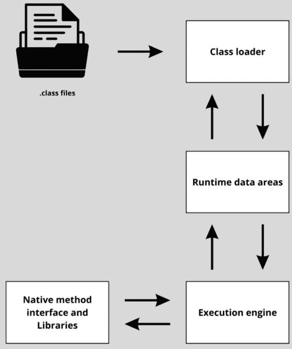
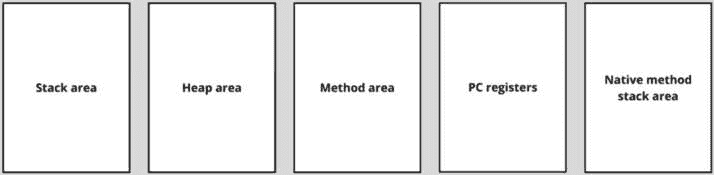

# 1

# Java 内存的不同部分

你知道需要重启应用程序以提升该应用程序性能的现象吗？如果是的话，你可能已经体验到了糟糕的**内存管理**的结果：内存满载，应用程序变慢。但这并不总是应用程序变慢的原因——其他原因，如从服务器处理数据或网络瓶颈等，也起着作用——但内存管理问题是导致应用程序性能下降的常见嫌疑。

你可能之前在计算机科学领域听说过内存。这是有道理的，因为计算机有内存，它们在运行程序时使用这种内存来存储和访问数据（而这些程序本身也是数据！）。

那么，应用程序何时会使用内存呢？例如，假设你想运行一个将要处理大型视频文件的应用程序。如果你在打开活动监视应用程序（例如，macOS 上的活动监视器或 Windows 上的任务管理器）时这样做，你会发现一旦打开应用程序并加载视频，使用的内存就会增加。内存是计算机上的有限资源，一旦你的计算机内存耗尽，它就会变慢。

提高应用程序性能的方法有很多。深入了解这种内存究竟是如何工作的，是帮助你提高应用程序性能的途径之一。通过在编码中采用良好的实践来高效使用内存，将提升你应用程序的性能。因此，编写良好的代码并关注内存的工作方式，在内存管理方面实现高性能时，始终应该是首要的方法。还有另一种方式可以影响 Java 内存管理，那就是通过配置**Java 虚拟机**（**JVM**），它负责管理**Java 内存**。当准备好时，我们将在*第六章*中介绍这一点。

高效管理 Java 内存对于 Java 应用程序的性能至关重要。在 Java 中，这尤其重要，因为它包含昂贵的进程，如垃圾回收，我们将在获得足够的基本知识来理解它之后稍后看到。

在并发环境中，内存管理对于数据完整性也很重要。不用担心，现在这听起来可能非常复杂。到这本书的结尾，你会明白这里的含义。

因此，为了优化我们应用程序的 Java 内存使用，我们首先需要了解这种内存的外观，并掌握与内存相关的基本过程。在本章中，我们将这样做。我们将探讨 Java 内存的不同部分以及我们如何在日常编码中使用它们。你将获得 Java 内存的良好概述，并为下一章即将到来的深入探讨做好准备。为此，我们将涵盖以下主题：

+   理解计算机内存和 Java 内存

+   在 Java 中创建变量

+   在栈上存储变量

+   在 Java 中创建对象

+   在堆上存储对象

+   探索元空间

# 技术要求

本章的代码可以在 GitHub 上找到，地址是 PacktPublishing/B18762_Java-Memory-Management。

# 理解计算机内存和 Java 内存

首先——运行应用程序，无论是 Java 还是其他，都需要计算机内存。应用程序的内存是计算机的物理内存。对计算机内存有更多的了解将有助于我们理解 Java 内存。因此，让我们更详细地讨论内存和 Java 内存的概念。

## 计算机内存

很可能你已经知道这一点，但为了重申：计算机有内存。这是计算机用于存储执行过程所需信息的部分。我们也将这称为主内存或有时称为主要存储。在这里要强调的一个重要观点是，这与计算机存储不同，在计算机存储中存储的是长期信息。这种存储是长期的，因为硬盘存储以磁性方式存储信息，而固态硬盘（SDD）可以被认为是**电可擦可编程只读存储器**（**EEPROM**）。它们不需要持续供电来保持数据。另一方面，一种常见的主内存类型，**随机存取存储器**（**RAM**），需要持续供电来保持数据。

这可以与我们的人类大脑相比较，至少部分如此。我们拥有长期和短期记忆。我们用长期记忆来存储我们的记忆——例如，一个珍贵的童年记忆，你的父亲推着你在一个手推车里嬉戏，而你的母亲在你穿着你三岁时最喜欢的衣服时引用了你最喜爱的故事书（神奇，其余的留给我自己的回忆录或治疗师吧）。然后是短期记忆，当你想要记住用于两步验证过程的六个数字时，它就非常棒了，如果你几分钟内无法回忆起来，那就更好了。

## 访问主内存

计算机或更确切地说，计算机的 CPU 可以比访问永久存储空间更快地访问主内存。在主内存中，当前打开的程序和它们正在使用的数据被存储。

你可能还记得你第一次启动计算机并打开你当天首次使用的应用程序，意识到它需要几秒钟才能启动。如果你关闭它，也许是不小心，然后立即再次打开它，它就快得多。主内存就像某种缓存或缓冲区，这解释了第二次加载时间更短的现象。第二次，它可以从主内存而不是从存储中打开，这证明了，至少支持了这样一个观点，即主内存更快。

好消息是，你不需要了解计算机内存的每一个最细微的细节，但一个大致的概述会有所帮助。

## 主存储器概述

主存储器中最常见的一部分是 RAM。RAM 是决定计算机性能的一个重要因素。正在运行或活跃的应用程序需要 RAM 来存储和访问数据。这种内存可以被应用程序和进程非常快速地访问。如果可用足够的 RAM，并且操作系统（**OS**）在管理 RAM 方面做得很好，那么你的应用程序将实现其性能潜力。

你可以通过查看你的监控应用程序来查看可用的 RAM 数量。对我来说，那就是活动监视器。如图所示，我的计算机目前正在使用相当多的内存：


图 1.1 – macOS 12.5 上活动监视器的截图

我已经按照从高内存到低内存的顺序对进程进行了排序。在底部，你可以看到可用内存和已用内存的摘要。说实话，这看起来有点高，我可能应该在写完这一章后调查一下。

为什么我还要调查这个，如果我还剩下很多内存可用呢？嗯，如果 RAM 太满，正在运行的应用程序只能非常缓慢地执行。这可能是你已经体验过的事情，当你运行了比你的计算机规格允许的更多或更重的应用程序时。

RAM 是易失性的。这意味着当你关闭电源时，信息就会消失。主存储器不仅包括 RAM。**只读存储器**（**ROM**）也是主存储器的一部分，但它不是易失性的。它包含计算机启动所需的指令，所以幸运的是，当我们关闭电源时，这些指令不会消失！

有趣的事实

我们把主存储器称为 RAM，这是一个非常常见的术语，但现在你知道它在技术上是不正确的！这确实是一个有趣的事实。

## Java 内存和 JVM

你可能会想知道我们是否还会涵盖 Java 内存 – 是的，我们会！Java 内存与计算机的内存模型有些相似，但也不同。然而，在我们谈论 Java 内存之前，我需要解释 JVM 是什么。我必须说，我真的很感激你的耐心。

## JVM

JVM 执行 Java 应用程序。这意味着 JVM 理解 Java 吗？不，完全不是！它理解字节码 – `.class` 文件。这意味着编译后的 Java 程序。一些其他语言的代码，例如 **Kotlin**，也被编译成 JVM 字节码，因此也可以被 JVM 解释。这就是为什么它们有时被称为 JVM 语言，例如 Java、Kotlin 和 Scala 等。

步骤可以在 *图 1.2* 中看到：


图 1.2 – 编译一次，到处运行

源代码（在图中，我们假设这是 Java 源代码）由 Java 编译器编译。结果是包含字节码的`.class`文件。这种字节码可以被 JVM 解释。每个平台，无论是 macOS、Windows 还是 Linux，都有自己的 JVM 版本来执行字节码。这意味着应用程序不需要修改就可以在不同的环境中运行，因为特定平台的 JVM 会处理这一点。

JVM 实际上是 Java 曾经因其*一次编写，到处运行*原则而闻名和受到喜爱的原因。Java 不再因此闻名的原因是，如今对于语言来说，以这种方式工作似乎是正常的。任何安装了 JVM 的平台都可以运行 Java，因为 JVM 负责将其转换为运行平台上的机器代码。

我通常将此比作旅行插头适配器。插头无法全球通用，因为不同地区使用不同的插座。当你拥有正确的旅行适配器插头时，无论你在哪里，都可以使用自己的适配器。在这种情况下，旅行适配器就是 JVM。“无论你在哪里”就是你试图在上面运行 Java 的平台，而你的适配器就是你的 Java 程序。

让我们看看 JVM 处理内存管理的基本方法。

## 内存管理和 JVM

Java 内存存储了运行 Java 应用程序所需的数据。在 Java 应用程序中存在的所有类的实例都存储在 Java 内存中。这也适用于原始值。那么常量呢？它们也存储在 Java 内存中！至于方法代码、本地方法、字段数据、方法数据以及方法的执行顺序呢？你可能猜得到，它们都存储在 Java 内存中！

JVM 的一项任务是管理 Java 内存。没有这种内存管理，就无法分配内存，也无法存储对象。即使这部分已经到位，它也永远不会被清理。因此，清理内存，也称为对象的*释放分配*，对于运行 Java 代码非常重要。没有它，代码无法运行，或者如果只是分配了，它将填满并导致程序内存不足。具体是如何工作的，我们将在讨论释放过程——称为*垃圾回收*时学习，这将在*第四章*中介绍。

简而言之：内存管理很重要。它是 JVM 非常重要的任务之一。实际上，如今，我们似乎理所当然地认为自动内存管理是理所当然的，但在它的早期，这非常新颖且特别。让我们看看如果 JVM 没有为我们管理内存会发生什么。

## Java 之前的内存管理

```java
automatic garbage collection is and in no way a complete guide to how to do memory allocation in C – there’s a lot more to it:
```

```java
int* x;
```

```java
x = (int*)malloc(4 * sizeof(int));
```

`int*`表示`x`持有指向内存块基址的指针的值。

`malloc`，代表内存分配，是一个用于分配指定大小的内存块的函数。在这种情况下，指定的大小是`int`大小的四倍。该函数返回基本地址。

如果我们想要分配一个值给内存分配，我们需要通过使用`*x`来这样做——否则，我们将覆盖位置：

```java
*x = 5;
```

```java
printf("Our value: %d\n", *x);
5 to the memory location that x is pointing to. So, if we then go ahead and print the value stored in that location (*x), we will see the value of 5. It’s just x, not *x, that is the memory location.
```

当我们不再需要`*x`来持有内存位置时，我们需要手动释放内存。如果我们不这样做，内存将变得不可用，并且不必要地被消耗。以下是我们如何释放内存的方法：

```java
free(x);
```

```java
x = NULL;
```

我们使用`free`函数使内存再次可用，以便在请求另一块内存时可以重新分配。那么我们就完成了吗？不，我们还没有。我们仍然持有该内存位置的指针。由于内存位置现在已被释放，它可能被其他内容覆盖，而我们不知道在那个点存储了什么。因此，我们将我们的指针设置为`NULL`。

那么，在释放内存后，`x`将指向什么？嗯，正是同一个地址——但里面是什么？这是不确定的。根据释放的方式，它可能是空的，或者如果尚未被覆盖，则是旧值，但一旦被覆盖，它将变成被覆盖的内容。换句话说：一个巨大的惊喜！当然，我通常喜欢惊喜，但通常不是在代码中变量的值方面。

在手动进行内存管理时，这里有一些常见的问题：

+   释放内存地址后的`NULL`。

+   **内存泄漏**：这是当你没有释放不再需要的内存时发生的情况。它不会再次变得可用，并且不必要地保持阻塞。最终，你可能因为保留所有不需要的值而耗尽内存。

+   **样板代码**：在代码库中，你有很多处理分配和释放的代码，但与你的业务逻辑关系不大。所有这些代码都需要维护。

+   例如，`NULL`。

还有其他常见的陷阱，但我相信这已经足够让我们欣赏 JVM 及其垃圾收集器和自动分配了。让我们看看 JVM 是如何实现所有这些功能的。

## 理解 JVM 的内存管理组件

为了能够执行应用程序，JVM 大致有三个组件。一个是用来加载所有类的**类加载器**。这实际上是一个复杂的过程；类被加载，字节码被验证。类的加载和字节码的执行需要内存。这部分内存用于存储类数据、内存分配以及正在执行的指令。这就是**运行时数据区**组件的作用。这是本书的主要内容：Java 内存。当类被加载时，文件需要被执行。在主内存中使用前两个组件加载字节码后执行的字节码通常被称为**执行引擎**。执行引擎与**Java 本地接口**（**JNI**）交互，以使用执行字节码所需的本地库。这些过程以及它们之间的步骤在*图 1.3*中展示：



图 1.3 – 应用程序执行时 JVM 组件的概述

现在我们已经知道了内存大致由哪些元素组成，让我们更详细地探讨内存管理最重要的组成部分：运行时数据区。

## 运行时数据区

这里是 JVM 的运行时数据区：

+   栈

+   堆

+   方法区/元空间

+   运行时常量池

+   程序计数器寄存器

+   本地方法栈

Java 内存的不同部分在*图 1.4*中展示：



图 1.4 – 不同运行时区域的概述

内存由图中所示的不同部分组成。所有这些部分都是 Java 应用程序运行所需的。让我们详细地查看这些内存部分的每一个。

### 堆

当 JVM 启动时，它会为 Java 应用程序在 RAM 中预留一块用于动态内存分配的空间。这块内存被称为堆。这是存储运行时数据的地方。类实例可以在堆上找到。JVM 负责为堆分配空间，并通过垃圾回收过程清理它。分配空间也称为分配，再次释放这块空间也称为释放。堆上对象的释放由 JVM 的垃圾回收过程处理。垃圾回收与堆的不同区域协同工作。这些不同的区域和垃圾回收是非常有趣的话题，我们将在*第三章*和*第四章*中更详细地讨论。

### 栈

栈，或者更准确地说，JVM 栈，是存储原语和堆指针的地方。对于每个被调用的方法，栈上都会创建一个帧，这个帧也持有这个方法的价值，例如部分结果和返回值。

不仅仅有一个栈。应用程序中的每个线程都有自己的线程。这可以在 *图 1*.5 中看到：


图 1.5 – 包含每个线程栈的栈区域

线程是执行路径。当一个应用程序有多个线程时，这意味着同时发生了多件事情。在应用程序中同时发生的事情是一个非常重要的概念，称为 **并发**。

这意味着内存的栈区域实际上包含了很多栈——每个线程一个。线程只能访问自己的栈，栈之间不能有链接。

因此，栈存储了方法执行所需的所有值，每个线程都有自己的栈。我们将要查看的下一个运行时数据区域是方法区。

### 方法区（Metaspace）

方法区是存储类运行时表示的地方。方法区包含运行时代码、静态变量、常量池和构造函数代码。总结一下：这是存储类元数据的地方。所有线程共享这个方法区。JVM 只指定了方法区，但我们自 Java 8 以来所处理的是称为 Metaspace 的实现。这个区域的老名字是 **PermGen**（即，**永久生成**空间）。实际上，PermGen 和 Metaspace 之间也有一些差异，但这些有趣的细节留待以后讨论。难道我们不喜欢一个好的悬念吗？

### PC 寄存器

**程序计数器**（**PC**）寄存器通过持有正在执行的指令的地址来知道正在执行什么代码。在 *图 1*.6 中，你可以看到这个的描述：


图 1.6 – 包含每个线程寄存器的 PC 寄存器

每个线程都有自己的 PC 寄存器，有时也称为调用栈。它知道需要执行的语句序列以及当前正在执行的语句。这就是为什么我们需要为每个线程单独一个的原因——只有一个 PC 寄存器，我们无法同时执行多个线程！

这与栈区域类似，正如你在比较 *图 1*.5 和 *图 1*.6 时可以看到的那样。

### 本地方法栈

此外，还有一个本地方法堆栈，也称为**C 堆栈**。它用于执行本地代码。本地代码是未用 Java 编写的实现的一部分，例如 C。这些堆栈存储本地代码的值，就像 JVM 堆栈为 Java 代码做的那样。同样，每个线程都有自己的。这些是如何实现的取决于 JVM 的具体实现。一些 JVM 不支持本地代码；显然，它们也不需要本地堆栈。这可以在你使用的 JVM 的文档中找到。

通过这种方式，我们已经更详细地了解了 Java 运行时数据区的不同部分。很可能在这一点上，大量的新信息被抛给了你，这可能会很困难！在我们继续之前，让我解释一下我们为什么要了解这些。

到目前为止，你可能想知道我还在等待什么，迫不及待地想要开始——你是对的！在本章中，我们将更详细地讨论内存管理的基础、堆栈和堆内存以及元空间，但首先，我们需要看看如何在 Java 中创建变量。

# 在 Java 中创建变量

在 Java 中创建变量意味着我们必须声明一个变量。如果我们还想使用它，我们必须初始化它。正如你很可能知道的，声明是将类型和名称分配给变量的过程。初始化是给变量赋予实际值：

```java
int number = 3;
```

```java
char letter = 'z';
```

在这里，我们声明变量并在同一行上初始化它。我们使用类型和名称来声明它。这里的类型是`int`和`char`，变量名是`number`和`letter`。这也可以像以下这样分多行进行：

```java
double percentage;
```

```java
percentage = 8.6;
```

JVM 不再检查类型了——这是在运行应用程序之前由编译器完成的。实际上，原始类型和引用类型的存储之间是有区别的。这正是我们现在要探讨的。

## 原始类型和引用类型

JVM 处理两种类型的变量：原始类型和引用类型。Java 中有八种原始类型：

+   `int`

+   `byte`

+   `short`

+   `long`

+   `float`

+   `double`

+   `boolean`

+   `char`

原始类型仅存储值，并且限于八种类型。还有引用类型。引用类型是类的实例。你可以创建自己的类。因此，引用类型的数量实际上是没有限制的。

当你创建变量时，它们可以存储两种类型的值：原始值和引用值。原始值具有原始类型之一。引用值持有对象位置的指针。

参考文献有四种类型：

+   类引用

+   数组引用

+   接口引用

+   `null`

类引用类型持有（动态）创建的类对象。数组引用类型有一个组件类型。这是数组的类型。如果组件类型不是数组类型，则称为元素类型。数组引用始终具有单个维度，但组件类型可以是另一个数组，从而创建多维数组。数组的维度有多少并不重要；最后一个组件类型不是数组类型，因此是元素类型。这种元素类型可以是以下三种类型之一：原始类型、类或接口。

`null`是引用没有指向任何内容的特殊情况。此时，引用的值是`null`。

这些变量是如何存储的？原始类型和引用变量存储在堆栈上。实际对象存储在堆上。让我们首先看看如何在堆栈上存储变量。

# 在堆栈上存储变量

在方法中使用的变量存储在堆栈上。堆栈内存是用于执行方法的内存。在**图 1.7**中，我们展示了三个线程的堆栈区域，每个区域包含多个帧。


图 1.7 – 三线程堆栈区域的帧概述

在方法内部，存在原始类型和引用。应用程序中的每个线程都有自己的堆栈。堆栈由帧组成。每个被调用的方法都会在堆栈上带来一个新的帧。当方法执行完成后，帧会被移除。

如果堆栈内存太小，无法存储帧所需的内容，则会抛出`StackOverFlowError`。当为新线程分配新的堆栈空间不足时，会抛出`OutOfMemoryError`。当前线程正在执行的方法称为当前方法，其数据存储在当前帧中。

## 当前帧和当前方法

堆栈之所以被称为堆栈，是因为它只能访问堆栈的顶部帧。你可以将其比作盘子堆，你只能（安全地）从顶部取盘子。顶部帧称为当前帧，因为它属于当前方法——当时正在执行的方法。

如果正在执行的方法调用另一个方法，则会在帧的顶部放置一个新的帧。这个新帧成为当前帧，因为新调用的方法是当前正在执行的方法。

在**图 1.7**中，有三个当前帧，因为有三个线程。当前帧位于顶部。所以，让我们看看以下内容：

+   **方法 y 的帧**是为**线程 1**准备的

+   **方法 c 的帧**是为**线程 2**准备的

+   **方法 k 的帧**是为**线程 3**准备的

当方法被执行时，它被移除。然后，之前的框架再次成为当前框架，因为调用其他方法的方法是暂时获得控制权的方法，也是当时正在执行的方法（当前方法）。

## 框架元素

一个框架包含许多元素。这些元素用于存储方法执行所需的所有必要数据。所有元素的概述可以在 *图 1**.8* 中看到：


图 1.8 – 栈帧的示意图

如您所见，一个框架包含局部变量数组、操作数栈和框架数据。让我们更详细地探讨框架的各个单独元素。

### 局部变量数组

框架的局部变量存储在一个数组中。这个数组的长度在编译时设置。该数组有单倍和双倍位置。单倍位置用于 `int`、`short`、`char`、`float`、`byte`、`boolean` 和 `reference` 类型。双倍位置用于 `long` 和 `double`（它们的大小为 64 位）。

可以通过索引访问局部变量。有两种类型的方法：`static` 方法（类方法）和 `instance` 方法。对于这些 `instance` 方法，局部变量数组的第一元素始终是它们存在的对象的引用，也称为 `this`。传递给方法的参数从局部变量数组的索引 `1` 开始。

对于 `static` 方法，不需要向框架提供实例，因此它们从索引 `0` 处开始使用调用它们的参数。

### 操作数栈

这个概念可能有点粗糙，请耐心听我说。每个栈帧都有一个操作数栈——一个位于栈元素（框架）上的栈（操作数栈）——这个操作数栈用于写入操作数，以便它们可以被操作。这就是所有值飞来飞去的地方。

它需要举一个例子，所以让我们看看一个例子。当框架被新创建时，操作数栈上没有任何东西，但让我们假设创建框架的方法将要执行一个基本的数学运算，比如添加 *x* 和 *y*。

`x` 和 `y` 是局部变量，它们的值在前面提到的局部变量数组中。为了进行操作，它们的值需要推送到操作数栈——所以，`x` 的值将被首先推送，`y` 的值将被其次推送。

操作数栈是一个栈，所以当它需要访问变量时，它只能从栈顶获取它们。它首先弹出 `y`，然后弹出 `x`。之后，操作数栈再次为空。正在执行的操作知道弹出变量的顺序。操作完成后，结果被推送到操作数栈，并可以从那里弹出。

操作数栈也用于其他重要操作，例如准备需要作为输入发送到方法中的参数，以及接收方法返回的结果。

### 帧数据

帧数据由执行方法所需的各种数据组成。一些例子包括对常量池的引用、如何正常返回方法以及突然完成的方法（或异常）。

其中第一个，对常量池的引用，需要特别注意。类文件包含所有需要在运行时常量池中解析的符号引用。这个池包含运行类所需的所有常量，并且由编译器生成。它包含类中标识符的名称，JVM 在运行时使用这个文件将类链接到其他类。

每个帧在运行时都有一个对当前方法常量池的引用。由于这是一个具有符号引用的运行时常量池，链接需要动态发生。

让我们看看我们的愚蠢的`Example`类的常量池是什么样的。以下是我们的`Example`类的代码：

```java
package chapter1;
```

```java
public class Example {
```

```java
    public static void main(String[] args) {
```

```java
        int number = 3;
```

```java
        char letter = 'z';
```

```java
        double percentage;
```

```java
        percentage = 8.6;
```

```java
    }
```

```java
}
```

通过运行以下命令（在我们用`javac Example.java`编译之后），我们可以看到常量池：

```java
javap -v Example.class
```

在这里，你可以看到输出结果：

```java
Classfile /Users/maaikevanputten/Documents/packt/memorymanagement/src/main/java/chapter1/Example.class
```

```java
  Last modified 12 Jun 2022; size 298 bytes
```

```java
  SHA-256 checksum b2a6321e598c50c5d97ba053ca0faf689197df18c5141b727603 eaec0fecac3e
```

```java
  Compiled from "Example.java"
```

```java
public class chapter1.Example
```

```java
  minor version: 0
```

```java
  major version: 61
```

```java
  flags: (0x0021) ACC_PUBLIC, ACC_SUPER
```

```java
  this_class: #9                          // chapter1/Example
```

```java
  super_class: #2                         // java/lang/Object
```

```java
  interfaces: 0, fields: 0, methods: 2, attributes: 1
```

```java
Constant pool:
```

```java
   #1 = Methodref          #2.#3          // java/lang/Object."<init>":()V
```

```java
   #2 = Class              #4             // java/lang/Object
```

```java
   #3 = NameAndType        #5:#6          // "<init>":()V
```

```java
   #4 = Utf8               java/lang/Object
```

```java
   #5 = Utf8               <init>
```

```java
   #6 = Utf8               ()V
```

```java
   #7 = Double             8.6d
```

```java
   #9 = Class              #10            // chapter1/Example
```

```java
  #10 = Utf8               chapter1/Example
```

```java
  #11 = Utf8               Code
```

```java
  #12 = Utf8               LineNumberTable
```

```java
  #13 = Utf8               main
```

```java
  #14 = Utf8               ([Ljava/lang/String;)V
```

```java
  #15 = Utf8               SourceFile
```

```java
  #16 = Utf8               Example.java
```

```java
{
```

```java
  public chapter1.Example();
```

```java
    descriptor: ()V
```

```java
    flags: (0x0001) ACC_PUBLIC
```

```java
    Code:
```

```java
      stack=1, locals=1, args_size=1
```

```java
         0: aload_0
```

```java
         1: invokespecial #1                  // Method java/lang/Object."<init>":()V
```

```java
         4: return
```

```java
      LineNumberTable:
```

```java
        line 3: 0
```

```java
  public static void main(java.lang.String[]);
```

```java
    descriptor: ([Ljava/lang/String;)V
```

```java
    flags: (0x0009) ACC_PUBLIC, ACC_STATIC
```

```java
    Code:
```

```java
      stack=2, locals=5, args_size=1
```

```java
         0: iconst_3
```

```java
         1: istore_1
```

```java
         2: bipush        122
```

```java
         4: istore_2
```

```java
         5: ldc2_w        #7                  // double 8.6d
```

```java
         8: dstore_3
```

```java
         9: return
```

```java
      LineNumberTable:
```

```java
        line 5: 0
```

```java
        line 6: 2
```

```java
        line 8: 5
```

```java
        line 9: 9
```

```java
}
```

```java
SourceFile: "Example.java"
```

如你所见，常量池有 16 个条目。这些是我们创建的，但也有一些是 Java 创建的。它们是执行程序所需的，因此程序名称、方法等都在常量池中创建以运行程序。

## 栈上的值

原始类型的局部变量值直接存储在栈上——更准确地说，在局部变量所在的方法帧的数组上。对象不存储在栈上。相反，对象引用存储在栈上。对象引用是在堆上找到对象的地址。

## 原始类型和包装类

请注意不要混淆原始类型及其对象包装类。它们很容易通过类型是否为大写字母来识别。包装类对象不生活在栈上，仅仅因为它们是对象。每当一个方法被执行，相关的原始值的栈就会被清理，它们将永远消失。

一些包装类比其他包装类更容易识别。让我们看看一个代码片段：

```java
int primitiveInt = 2;
```

```java
Integer wrapperInt = 2;
```

```java
char primitiveChar = 'A';
```

```java
Character wrapperChar = 'A';
```

如你所见，包装器以大写字母开头且更长。然而，对于许多类型，单词本身完全相同，唯一的区别是它以大写字母开头。我个人最常被`Boolean`和`boolean`（我为此责怪 C#，因为 C#中 Java `boolean`原语等价的是`bool`）所迷惑。

在这里，你可以看到其他原始类型及其引用类型之间的区别：

```java
short primitiveShort = 15;
```

```java
Short wrapperShort = 15;
```

```java
long primitiveLong = 8L;
```

```java
Long wrapperLong = 8L;
```

```java
double primitiveDouble = 3.4;
```

```java
Double wrapperDouble = 3.4;
```

```java
float primitiveFloat = 5.6f;
```

```java
Float wrapperFloat = 5.6f;
```

```java
boolean primitiveBoolean = true;
```

```java
Boolean wrapperBoolean = true;
```

```java
byte primitiveByte = 0;
```

```java
Byte wrapperByte = 0;
```

请注意，它们的名称完全相同。我们需要查看第一个字母来区分包装类和原始类型。包装类是对象，它们的创建方式不同。让我们找出如何创建它们。

# 在 Java 中创建对象

对象是一组值的集合。在 Java 中，它们可以通过使用`new`关键字实例化类来创建。

这里有一个非常基础的`Person`类：

```java
public class Person {
```

```java
    private String name;
```

```java
    private String hobby;
```

```java
    public String getName() {
```

```java
        return name;
```

```java
    }
```

```java
    public void setName(String name) {
```

```java
        this.name = name;
```

```java
    }
```

```java
    public String getHobby() {
```

```java
        return hobby;
```

```java
    }
```

```java
    public void setHobby(String hobby) {
```

```java
        this.hobby = hobby;
```

```java
    }
```

```java
}
```

如果我们要实例化它，我们将使用以下方式：

```java
Person p = new Person();
```

这将创建一个新的`Person`对象并将其存储在堆上。在堆上存储需要更多的解释。这正是我们现在要深入探讨的！

# 在堆上存储对象

在堆上存储对象与在栈上存储值非常不同。正如我们刚才看到的，堆上位置的引用存储在栈上。这些引用是内存地址，这些内存地址转换到堆上的某个位置，对象就是存储在那里。没有这个对象引用，我们就无法访问堆上的对象。

对象引用具有特定的类型。Java 中有非常多的内置类型我们可以使用，例如`ArrayList`、`String`、所有包装类等，但我们也可以创建自己的对象，这些对象也会存储在堆上。

堆内存持有应用程序中存在的所有对象。堆上的对象可以通过对象的地址、对象引用从应用程序的任何地方访问。对象包含与栈上的块相同的内容：原始值直接存储，以及堆上其他对象的地址。

在**图 1.9**中，你可以看到栈和堆的概述以及这对于以下 Java 代码的简化视图：

```java
public static void main(String[] args) {
```

```java
    int x = 5;
```

```java
    Person p = new Person();
```

```java
    p.setName("maaike");
```

```java
    p.setHobby("coding");
```

```java
}
```


图 1.9 – 栈和堆之间连接的概述

它非常简化——例如，`Person`对象中的`String`对象本身也是独立的对象。我们将在*第三章*中关注堆，以获得对堆区域的更准确理解。

那么，当我们耗尽堆内存时会发生什么？如果应用程序需要的堆空间超过了可用空间，就会抛出`OutOfMemoryError`异常。

好的，我们已经看到了栈和堆。这里还有一个我们需要讨论的内存区域，那就是 Metaspace。

# 探索 Metaspace

Metaspace 是存储运行时必要的类`元数据`的内存空间。它是 JVM 规范中的方法区，在 Java SE 7 之后的多数流行 Java 实现中，这个区域被称为 Metaspace。

如果你了解 PermGen，或者遇到它，只需知道这是一个旧的内存区域，其中存储了所有类的`元数据`。它有一些限制，并且已经被 Metaspace 所取代。

那么，回到这个类`metadata`。那究竟是什么呢？类`metadata`是运行时表示 Java 程序运行所需的 Java 类的表示。它实际上包含很多东西，例如以下内容：

+   *Klass*结构（我们将在*第五章*中深入了解元空间时了解更多！）

+   方法的字节码

+   常量池

+   注解和更多内容

就这些！这是 Java 内存管理的基础知识。还有很多关于具体部分的内容要讲。我们将在下一章更详细地探讨堆上的原始类型和对象，但首先，让我们回顾一下我们已经做了什么。

# 概述

在本章中，我们概述了 Java 内存。我们从计算机内存和辅助存储开始学习，了解到计算机有主内存和辅助存储。对于我们来说，主内存是最重要的，因为这是运行程序（包括 Java 程序）所使用的。

主内存由 RAM 和 ROM 组成。Java 应用程序使用 RAM 来运行。Java 应用程序由 JVM 执行。这个 JVM 执行 Java 应用程序，为了执行这些应用程序，它有三个组件：类加载器、运行时数据区域和执行引擎。

我们关注了运行时数据区的不同组件：堆、栈、方法区、PC 寄存器和本地方法栈。

栈是用于在帧中存储变量和方法值的内存区域。堆用于存储对象。栈持有对堆上对象的引用。堆在应用程序的任何地方都可以访问，任何拥有堆上对象地址的人都可以访问该对象。栈只能由创建此栈的线程访问。

元空间是存储运行时所需的类元数据的内存区域。

在下一章中，我们将可视化并更详细地了解堆和栈内存是如何结合在一起的。
