# 2

# Java 内存中的基本类型和对象

在*第一章*中，我们看到了基本类型、对象和引用之间的区别。我们了解到基本类型是 Java 语言自带的数据类型；换句话说，我们不需要定义基本类型，我们只需使用它们。例如，`int x;`定义（创建）了一个基本变量`x`，它是（基本）类型`int`。这意味着`x`只能存储整数，例如，-5、0、12 等等。

我们还了解到对象是通过`new`关键字创建的对象实例。例如，假设存在一个`Person`类，`new Person();`实例化（创建）了一个`Person`类型的对象。这个对象将存储在堆上。

我们看到引用使我们能够操作对象，并且引用有四种不同类型：`class`、`array`、`interface`和`null`。当你创建一个对象时，你得到的是对象的引用。例如，在代码`Person p = new Person();`中，引用是`p`，它是`Person`类型。引用是放在栈上还是堆上取决于上下文——稍后会有更多介绍。

理解引用和对象之间的区别非常重要，并且可以极大地简化核心`ClassCastException`错误。了解 Java 的按值调用机制，特别是它与引用的关系，可以防止称为*逃逸引用*的微妙封装问题。

在本章中，我们将更深入地探讨以下主题：

+   理解栈和堆上的基本类型

+   在堆上存储对象

+   管理对象引用和安全

# 技术要求

本章的代码可以在 GitHub 上找到：[`github.com/PacktPublishing/B18762_Java-Memory-Management`](https://github.com/PacktPublishing/B18762_Java-Memory-Management)。

# 理解栈和堆上的基本类型

Java 自带一组预定义的基本数据类型。基本数据类型始终为小写，例如，`double`。将基本数据类型与其关联的包装器对应物进行对比，这些对应物是 API 中的类，有方法（基本数据类型没有），并且包装器以大写字母开头，例如，`Double`。

基本数据类型可以分为整型（整数），即`byte`、`short`、`int`、`long`和`char`，以及浮点型（小数），即`float`、`double`和`boolean`（`true`或`false`）。

基本类型也可以存储在栈和堆上。当它们是方法的局部变量时，存储在栈上，换句话说，是方法的参数或方法内部声明的变量。当它们是类的成员时，即实例变量，基本类型存储在堆上。实例变量在类的作用域内声明，换句话说，在所有方法之外。因此，在方法内部声明的原始变量存储在栈上，而实例变量存储在堆上（在对象内部）。

现在我们已经了解了原始类型存储的位置，让我们将注意力转向对象的存储。

# 在堆上存储对象

在本节中，我们将探讨在堆上存储对象。要全面理解这一领域，需要讨论比较引用和对象。我们将检查它们的类型、存储位置以及关键的区别。一个带有相关图表的代码示例将结束本节。

## 引用

引用指向对象，并使我们能够访问它们。如果我们访问的是对象实例成员，那么我们使用引用。如果我们访问的是静态（类）成员，我们使用类名。

引用可以存储在栈和堆上。如果引用是方法中的局部变量，那么引用就存储在栈上（在该方法帧的局部方法数组中）。如果引用是实例变量，那么引用存储在对象内部，在堆上。

通过与对象的比较，我们可以有一个**抽象类**的引用，但不能有抽象类的对象。同样适用于接口——我们可以有一个**接口**引用类型，但不能实例化接口；也就是说，不能创建接口类型的对象。这两种情况都在**图 2.1**中得到了演示：

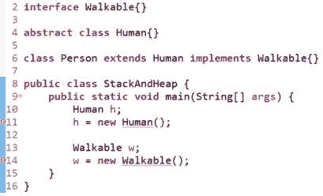

图 2.1 – 对象实例化错误

在**图 2.1**中，第 10 行和第 13 行声明的引用，分别是抽象类和接口引用，没有问题。然而，尝试在第 11 行和第 14 行创建这些类型的对象会导致错误。您可以自由尝试这段代码，它位于此处的`ch2`文件夹中：[`github.com/PacktPublishing/B18762_Java-Memory-Management/tree/main/ch2`](https://github.com/PacktPublishing/B18762_Java-Memory-Management/tree/main/ch2)。编译错误的原因是您不能基于抽象类或接口创建对象。我们将在下一节中解决这些错误。

现在我们已经讨论了引用，让我们来考察对象。

## 对象

所有对象都存储在堆上。为了理解对象，我们首先必须理解面向对象编程中的一个基本结构，即类。类类似于房子的设计图。有了房子的设计图，你可以查看并讨论它，但你不能打开任何门，放水壶，等等。这就是面向对象编程中的类 – 它们是对象在内存中外观的视图。当房子建成时，你现在可以打开门，喝杯茶，等等。当对象创建时，你就有了一个类的内存表示。使用引用，我们可以使用点符号语法访问实例成员。

让我们解决 *图 2*.1 中的编译器问题，并展示点符号语法在实际操作中的使用：

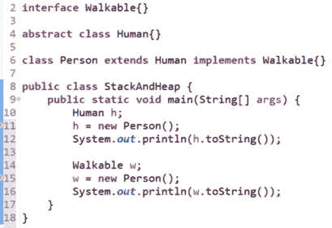

图 2.2 – 接口和抽象类引用已固定

在 *图 2*.2 中，由于第 11 行和第 15 行编译时没有出现任何错误，这表明在基于该类创建对象之前，该类必须是非抽象（具体）类。第 12 行和第 16 行演示了点符号语法。

让我们更详细地考察对象的创建。

### 如何创建对象

对象是通过使用 `new` 关键字实例化的（创建）。`new` 的目的是在堆上创建一个对象并返回其地址，我们将它存储在一个引用变量中。*图 2*.2 中的第 11 行有如下代码：

`h = new Person();`

引用位于赋值运算符的左侧 – 我们正在初始化一个 `Human` 类型的 `h` 引用。

要实例化的对象位于赋值运算符的右侧 – 我们正在创建一个 `Person` 类型的对象，并执行默认的 `Person` 构造函数。这个默认构造函数是由编译器合成的（因为代码中没有显式的 `Person` 构造函数）。

现在我们已经了解了对象和引用，让我们扩展这个例子，并使用图表来查看栈和堆的表示。

## 理解引用和对象之间的区别

为了对比栈和堆，`Person` 类和 `main()` 方法都进行了更改：

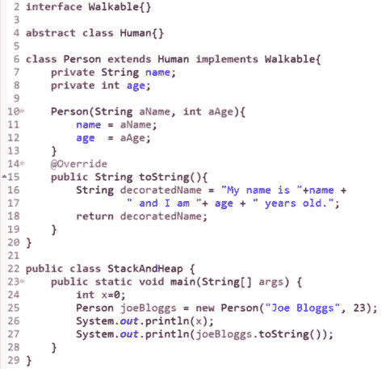

图 2.3 – 栈和堆代码

*图 2*.3 详细说明了包含两个实例变量、接受两个参数的构造函数和 `toString()` 实例方法的 `Person` 类。第二个类 `StackAndHeap` 是驱动类（它包含 `main()` 方法）。在 `main()` 中，我们初始化一个局部原始变量 `x` 并实例化一个 `Person` 实例。

*图 2*.4 展示了执行第 27 行之后的栈和堆表示：

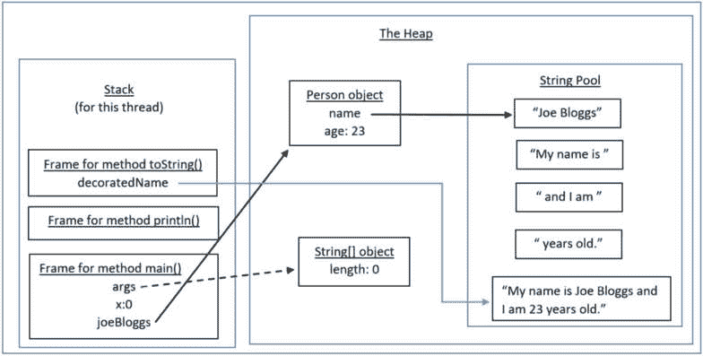

图 2.4 – 图 2.3 中代码的栈和堆表示

参考图 2**.3**，首先执行的是第 23 行的`main()`方法。这导致`main()`的帧被压入栈中。在这个帧中，局部变量`args`和`x`被存储在局部变量数组中。在第 25 行，我们创建了一个`Person`实例，传递了`String`字面量`Joe Bloggs`和整数字面量`23`。任何`String`字面量本身就是一个`String`对象，并且存储在堆上。此外，由于它是一个`String`字面量，这个`String`对象存储在堆的一个特殊区域，称为**字符串池**（也称为字符串常量池）。

`Person`对象内部的实例变量`name`位于堆上，是`String`类型；也就是说，它是一个引用变量，它引用了`Person`对象，而`age`是一个原始类型，其值为`23`直接存储在堆上的对象内部。然而，`Person`对象的引用`joeBloggs`存储在栈上，在`main()`方法的帧中。

在**图 2**.3 的第 26 行，我们输出局部变量`x`，它将`0`输出到标准输出设备（通常是屏幕）。第 27 行随后被执行，如**图 2**.4 所示。首先，`PrintStream`中的`println()`方法（`out`是`PrintStream`类型）导致一个帧被压入栈中。为了简化图示，我们没有深入到那个栈帧的细节。在`println()`完成执行之前，必须首先执行`joeBloggs.toString()`。

由于`Person`中的`toString()`方法已经被调用，一个新的`toString()`帧被压入栈中，位于`println()`帧之上。接下来，`toString()`使用`String`字面量和实例变量构建一个名为`decoratedName`的局部`String`变量。

如你所知，如果你在`+`运算符的左边或右边有一个`String`实例，整个操作就变成了`String`连接，最终得到一个`String`结果。

这些`String`字面量存储在字符串池中。最终的`String`结果是`My name is Joe Bloggs and I am 23 years old`，它被分配给局部变量`decoratedName`。这个`String`从`toString()`返回到调用它的第 27 行的`println()`语句。然后，返回的`String`被回显到屏幕上。

这就结束了我们在堆上存储对象的章节。现在我们将注意力转向可能导致代码中微妙问题的区域。然而，由于我们已经将引用与对象分离，这些问题将更容易理解和修复。

# 管理对象引用和安全

在本节中，我们将检查对象引用和一个可能出现的微妙安全问题，如果引用没有得到适当的关注，这个问题就会发生。这个安全问题被称为*逃逸引用*，我们将通过一个示例来解释它何时以及如何发生。此外，我们将在示例中修复这个问题，展示如何解决这个安全问题。

## 检查逃逸引用问题

在本节中，我们将讨论并提供一个 Java 值调用参数传递机制的示例。一旦我们理解了值调用，这将使我们能够演示在传递（或返回）引用时发生的问题。让我们从 Java 的值调用机制开始。

### 值调用

Java 在向方法传递参数和从方法返回结果时使用值调用。简单来说，这意味着 Java *会复制某个东西*。换句话说，当你向方法传递一个参数时，会复制该参数，当你从方法返回一个结果时，会复制该结果。我们为什么要关心这个呢？因为你正在复制的 – 一个原始值或引用 – 可能会有重大影响（特别是对于可变类型，如 **StringBuilder** 和 **ArrayList**）。这正是我们想要进一步探讨的。我们将使用一个示例程序和相关图表来帮助。*图 2.5* 展示了示例代码：

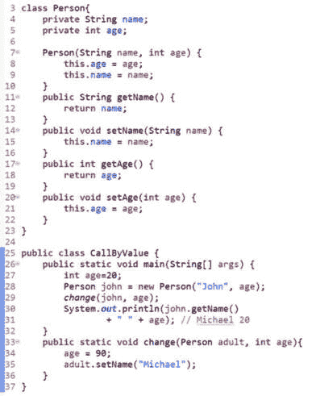

图 2.5 – 值调用代码示例

*图 2.5* 详细说明了有一个简单 `Person` 类的程序，该类有两个属性：一个 `String` 类型的名称和一个 `int`（原始类型）的年龄。构造函数使我们能够初始化对象状态，我们为实例变量提供了访问器/修改器方法。

`CallByValue` 类是驱动类。在 `main()` 函数的第 `27` 行，声明并初始化了一个局部原始 `int` 变量，即 `age`，其值为 `20`。在第 `28` 行，我们创建了一个 `Person` 类型的对象，传递了字符串字面量 `John` 和原始变量 `age`。基于这些参数，我们初始化了对象状态。引用，即 `john`，是用于在堆上存储 `Person` 对象引用的局部变量。*图 2.6* 展示了第 `28` 行执行完毕后内存的状态。为了清晰起见，我们省略了 `args` 数组对象。

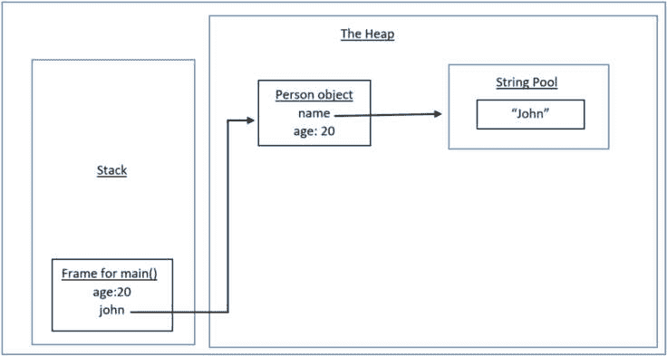

图 2.6 – 栈和堆的初始状态

如 *图 2.6* 所示，`main()` 方法的框架是当前栈上的框架。它包含两个局部变量：值为 `20` 的 `int` 原始类型年龄和指向堆上 `Person` 对象的 `Person` 引用 `john`。`Person` 对象有两个实例变量被初始化：`age` 原始类型变量被设置为 `20`，名称 `String` 实例变量指向字符串池中的 *John* `String` 对象（因为 *John* 是一个 `String` 字面量，Java 会将其存储在那里）。

现在，我们在 *图 2**.5* 中执行第 29 行，`change(john, age);`。这里很有趣。我们调用`change()`方法，传递`john`引用和`age`原始值。由于 Java 是按值调用，每个参数都会被复制。*图 2**.7* 展示了我们进入`change()`方法并即将执行第 34 行的第一条指令时的栈和堆：

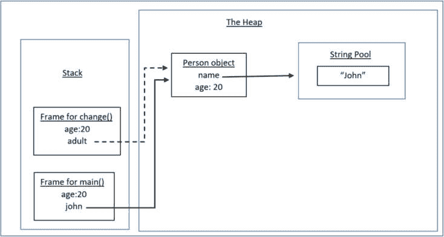

图 2.7 – 进入 change() 方法时的栈和堆

在前面的图中，我们可以看到为`change()`方法压入栈中的一个帧。由于 Java 是按值调用，方法中的两个参数都被复制到局部变量中，即`age`和`adult`。这里的区别是至关重要的，因此需要分节来解释。

#### 复制一个原始值

复制一个原始值类似于复印一张纸。如果你把复印件交给别人，他们可以随意处理那张纸 – 你仍然有原件。在这个程序中将要发生的就是这样；被调用的`change()`方法将改变原始`age`变量，但`main()`中的`age`的副本将保持不变。

#### 复制一个引用

复制一个引用类似于复制电视遥控器。如果你把第二个/复制的遥控器交给别人，他们可以改变你正在观看的频道。在这个程序中将要发生的就是这样；被调用的`change()`方法将使用`adult`引用，改变`Person`对象中的`name`实例变量，而`main()`中的`john`引用将看到这个变化。

返回到 *图 2**.5* 的代码示例。*图 2**.8* 展示了在执行完第 34 和 35 行之后，但 *在`change()`方法返回到`main()`之前* 的栈和堆：

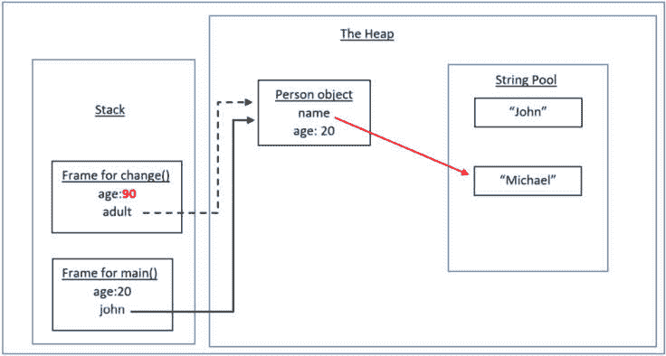

图 2.8 – change() 方法退出时的栈和堆

如所示，`change()`方法帧中的`age`原始值已被更改为`90`。此外，在字符串池中为*Michael*创建了一个新的`String`字面量对象，并且`Person`对象中的`name`实例变量正在引用它。这是因为`String`对象是不可变的；也就是说，一旦初始化，就不能更改`String`对象的内容。请注意，字符串池中的*John* `String`对象现在可以回收垃圾，因为没有引用指向它。

*图 2**.9* 展示了`change()`方法执行完成后并控制返回到`main()`方法后的栈和堆状态：

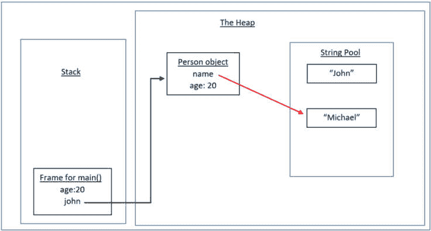

图 2.9 – change() 方法完成后栈和堆的状态

在*图 2**.9*中，`change()`方法的栈帧已经被弹出。现在，`main()`方法的栈帧再次成为当前帧。你可以看到`age`原始值没有改变，即它仍然是`20`。引用也是相同的。然而，`change()`方法能够改变`john`正在查看的实例变量。第 30 行`System.out.println(john.getName() + " " + age);`通过输出*Michael 20*证明了所发生的事情。

现在我们已经了解了 Java 的按值调用机制，我们将通过一个示例来讨论逃逸引用。

#### 问题

面向对象编程中的封装原则是，一个类的数据是`private`的，并且可以通过其`public` API 供外部类访问。然而，由于逃逸引用，在某些情况下，这不足以保护你的`private`数据。*图 2**.10*是一个受逃逸引用影响的类的例子：

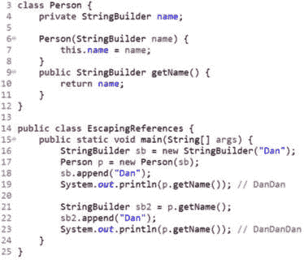

图 2.10 – 具有逃逸引用的代码

前面的图中包含一个`Person`类，它有一个名为`name`的`private`实例变量。`Person`构造函数根据传入的参数初始化实例变量。该类还提供了一个`public getName()`访问方法，以便外部类可以检索`private`实例变量。

在这里，驱动类是`EscapingReferences`。在`main()`函数中，第 16 行创建了一个局部`StringBuilder`对象，包含字符串`Dan`，而`sb`是该局部引用的名称。这个引用被传递到`Person`构造函数中，以便初始化`Person`对象中的`name`实例变量。*图 2**.11*显示了此时的栈和堆，即第 17 行执行完毕后。为了清晰起见，省略了字符串池。

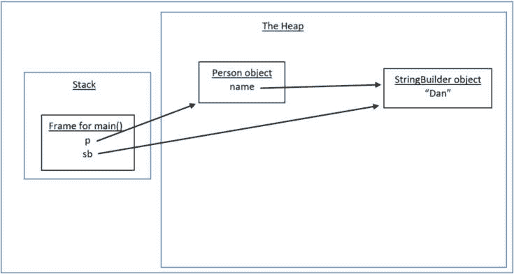

图 2.11 – 逃逸引用的输入过程

在这一点上，逃逸引用的问题开始显现。在执行`Person`构造函数时，传递了一个`sb`引用的副本，它被存储在`name`实例变量中。现在，如*图 2**.11*所示，`name`实例变量和局部`main()`变量`sb`都引用了同一个`StringBuilder`对象！

现在，当`main()`函数中的第 18 行执行时，即`sb.append("Dan");`，对象变为`DanDan`，对于*本地*的`sb`引用和`name`实例变量都是如此。当我们第 19 行输出实例变量时，它输出*DanDan*，反映了这种变化。

因此，这是进入过程中一个问题：将我们的实例变量初始化为传入的（副本）引用。我们将在稍后解决如何修复它。然而，在输出过程中，我们也有一个问题。*图 2**.12*展示了这个问题：

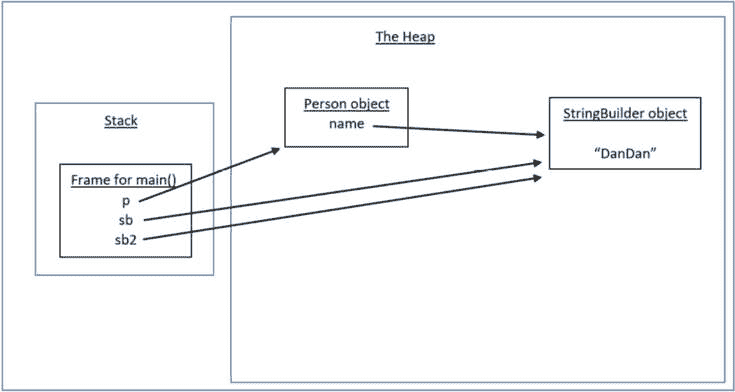

图 2.12 – 逃逸引用的输出过程

“图 2.12”显示了执行第 21 行`StringBuilder sb2 = p.getName();`之后的栈和堆。再次，我们有一个局部引用，这次称为`sb2`，它指向堆中`Person`对象的`name`实例变量所指向的同一对象。因此，当我们使用`sb2`引用将`Dan`追加到`StringBuilder`对象，然后输出实例变量时，我们得到`DanDanDan`。

到目前为止，很明显，仅仅将数据`private`是不够的。问题在于`StringBuilder`是一个可变类型，这意味着在任何时候，你都可以更改（原始）对象。这与不可变的`String`对象（例如：`Double`、`Integer`、`Float`和`Character`的包装类型）形成对比。

不可变性

Java 保护**String**对象，因为对**String**对象的任何更改都会导致创建一个完全新的对象（更改反映在其中）。因此，请求*更改*的代码将看到请求的更改（只是它是一个全新的对象）。其他人可能看到的原始**String**对象仍然未受影响。

现在我们已经讨论了逃逸引用的问题，让我们看看如何解决这些问题。

#### 寻找解决方案

实质上，解决方案围绕一种称为*防御性复制*的实践。在这种情况下，我们不想为任何可变对象存储引用的副本。同样，对于我们在访问器方法中返回的`private`可变数据的引用也适用 – 我们不想返回引用的副本给调用代码。

因此，我们在进入和退出时都需要小心。解决方案是在这两种情况下完全复制对象内容。这被称为深度复制（而只复制引用则称为浅度复制）。因此，在进入时，我们将对象的内容复制到一个新对象中，并存储对新对象的引用。在退出时，我们再次复制内容，并返回对新对象的引用。我们已经在这两种情况下保护了我们的代码。“图 2.13”显示了从“图 2.10”中解决问题的方案：

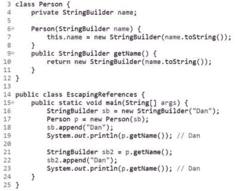

图 2.13 – 逃逸引用代码修复

第 7 行显示了在进入时（构造函数）创建的副本对象。第 10 行显示了在退出时（访问器方法）创建的副本对象。第 19 行和第 23 行都输出了`Dan`，正如它们应该做的那样。图 2.14 表示程序即将退出时的栈和堆：

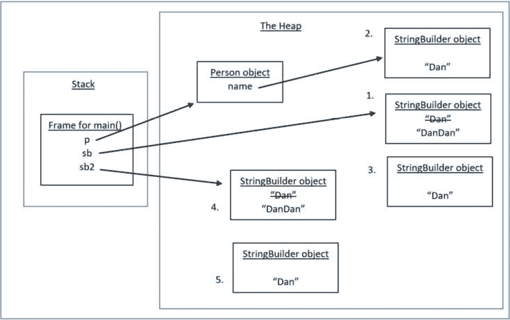

图 2.14 – 逃逸引用代码修复的栈和堆

为了清晰起见，我们省略了字符串池。我们已将`StringBuilder`对象编号为 1 到 5。我们可以按照以下方式将对象与代码匹配：

+   第 16 行创建了对象 1。

+   第 17 行调用了第 7 行，创建了对象 2。`Person`实例变量`name`引用了这个对象。

+   第 18 行修改了对象 1，将其改为`DanDan`（然而，请注意，由`name`实例变量引用的对象，即对象 2，未受到影响）。

+   第 19 行创建了对象 3。引用被传回`main()`函数，但从未被存储。由于输出了`Dan`，这证明了在输入过程中的防御性复制正在起作用。

+   第 21 行创建了对象 4。局部`main()`引用`sb2`指向它。

+   第 22 行将对象 4 修改为`DanDan`（未修改实例变量所引用的对象）。

+   第 23 行创建了对象 5。由于输出了`Dan`，这证明了在输出过程中的防御性复制正在起作用。

*图 2**.14*显示，由`name`实例变量引用的`StringBuilder`对象从未从`Dan`改变。这正是我们想要的。

本章到此结束。我们涵盖了很多内容，所以让我们回顾一下主要观点。

# 摘要

在本章中，我们首先检查了原始数据类型在内存中的存储方式。原始数据类型是语言自带预定义的类型，可以存储在栈上（局部变量）和堆上（实例变量）。由于它们全部都是小写字母，因此很容易识别原始数据类型。

相比之下，对象只存储在堆上。在讨论对象时，有必要区分引用和对象本身。我们发现，虽然引用可以是任何类型（接口、抽象类和类），但对象本身只能属于正确的、具体的类，这意味着该类不能是**抽象的**。

小心管理对象引用。如果没有正确管理，你可能会遇到*逃逸引用*。Java 使用按值调用，这意味着传递或返回的参数会创建一个副本。根据参数是原始数据类型还是引用类型，这可能会产生重大影响。如果它是可变类型的引用副本，那么调用代码可以更改你所谓的`private`数据。这不是适当的封装。

我们检查了存在此问题的代码以及栈和堆的关联图。解决方案是使用防御性复制，即在输入和输出过程中复制对象内容。*因此，引用及其所引用的对象保持私有*。最后，我们详细介绍了代码解决方案以及栈和堆的关联图。

在下一章中，我们将更深入地探讨堆，这是对象居住的内存区域。
